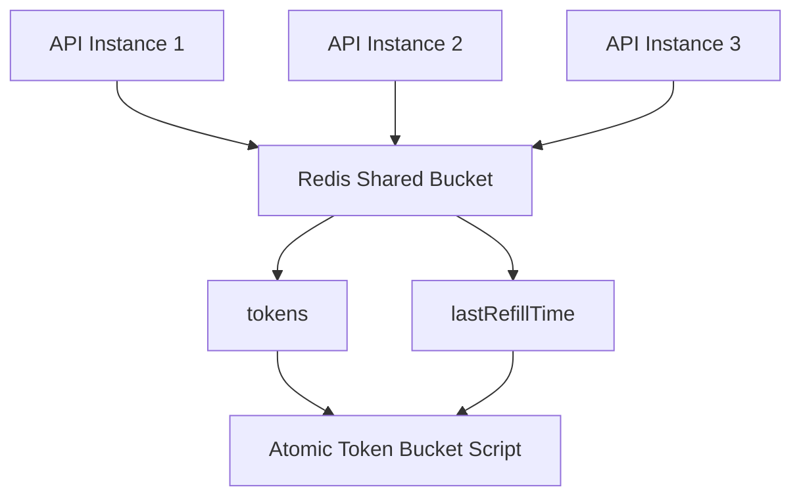
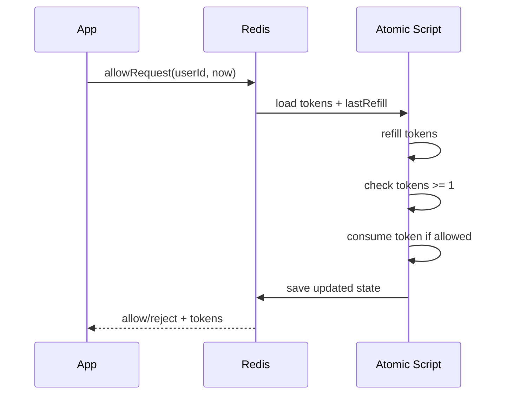
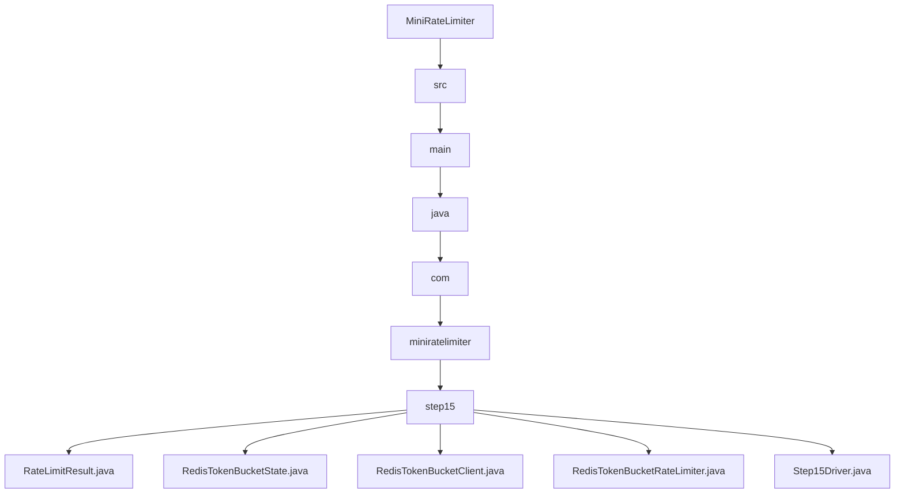

# 015_Redis_Token_Bucket

# MiniRateLimiter Step 15 — Redis Token Bucket

---

# Clickable Index

1. [Goal](#goal)  
2. [Why Redis Token Bucket?](#why-redis-token-bucket)  
3. [Problem With Local Token Bucket](#problem-with-local-token-bucket)  
4. [Real World Example](#real-world-example)  
5. [Core Idea](#core-idea)  
6. [Redis Token Bucket Architecture Mermaid Diagram](#redis-token-bucket-architecture-mermaid-diagram)  
7. [Request Flow Mermaid Diagram](#request-flow-mermaid-diagram)  
8. [Detailed Steps Before Code](#detailed-steps-before-code)  
9. [CP/DSA Concepts Used](#cpdsa-concepts-used)  
10. [Time Complexity](#time-complexity)  
11. [Space Complexity](#space-complexity)  
12. [Local Token Bucket vs Redis Token Bucket](#local-token-bucket-vs-redis-token-bucket)  
13. [Folder Structure](#folder-structure)  
14. [Folder Mermaid Diagram](#folder-mermaid-diagram)  
15. [Complete Java Code](#complete-java-code)  
16. [CP/DSA Pattern Code](#cpdsa-pattern-code)  
17. [Dry Run](#dry-run)  
18. [Run Command](#run-command)  
19. [Expected Output Pattern](#expected-output-pattern)  
20. [Important Observation](#important-observation)  
21. [Current MiniRateLimiter State](#current-miniratelimiter-state)  
22. [Step 15 Completion Checklist](#step-15-completion-checklist)  
23. [Final Mental Model](#final-mental-model)  
24. [Next Step](#next-step)  

---

# Goal

In Step 14, we built:

```text
Redis Sliding Window
```

Now we build:

```text
Redis Token Bucket
```

This gives us:

```text
distributed burst control
```

across multiple API instances.

All instances share the same token bucket state in Redis.

---

# Why Redis Token Bucket?

Local token bucket works only inside one JVM.

But production systems have many app instances:

```text
API-1
API-2
API-3
```

If each instance has its own bucket:

```text
user gets more requests than allowed
```

Redis Token Bucket solves this by storing bucket state centrally.

---

# Problem With Local Token Bucket

Suppose:

```text
capacity = 5
```

With 3 app instances:

```text
API-1 gives 5 tokens
API-2 gives 5 tokens
API-3 gives 5 tokens
```

Actual allowed burst:

```text
15 requests
```

Expected:

```text
5 requests
```

---

# Real World Example

Redis Token Bucket is common in:

```text
API gateways
payment APIs
OTP APIs
login systems
third-party API platforms
multi-instance Spring Boot systems
```

It gives:

```text
burst support + distributed consistency
```

---

# Core Idea

Store bucket state in Redis:

```text
rate_limit:bucket:user-1:tokens -> 4.2
rate_limit:bucket:user-1:last_refill -> 10000
```

For each request:

```text
1. read tokens and lastRefill
2. refill based on elapsed time
3. if tokens >= 1, consume token
4. save updated state
5. allow/reject
```

In real Redis this should be done using Lua script atomically.

In this step, we simulate that with synchronized Java method.

---

# Redis Token Bucket Architecture Mermaid Diagram



---

# Request Flow Mermaid Diagram



---

# Detailed Steps Before Code

## Step 1 — Create Redis bucket state

Store:

```text
tokens
lastRefillTimeMillis
```

---

## Step 2 — Refill tokens atomically

Formula:

```text
elapsed = now - lastRefill
tokensToAdd = elapsed * refillRatePerMillis
tokens = min(capacity, tokens + tokensToAdd)
```

---

## Step 3 — Check token availability

If:

```text
tokens >= 1
```

then allow and consume.

---

## Step 4 — Save updated Redis state

Updated state is written back:

```text
tokens
lastRefillTimeMillis
```

---

## Step 5 — Share same Redis client across API instances

This simulates distributed behavior.

---

# CP/DSA Concepts Used

## 1. Greedy Refill

Refill based on elapsed time.

---

## 2. Shared Distributed State

All API instances use the same bucket.

---

## 3. Atomic State Transition

Read-update-write must happen atomically.

---

## 4. Clamp

Tokens cannot exceed capacity.

```java
Math.min(capacity, tokens + tokensToAdd)
```

---

## 5. HashMap State Simulation

Redis is simulated using:

```java
Map<String, RedisTokenBucketState>
```

---

# Time Complexity

```text
O(1) per request
```

---

# Space Complexity

```text
O(active identities)
```

---

# Local Token Bucket vs Redis Token Bucket

| Feature | Local Token Bucket | Redis Token Bucket |
|---|---:|---:|
| Burst support | Yes | Yes |
| Multi-instance safe | No | Yes |
| Shared state | No | Yes |
| Production ready | Limited | Better |
| Needs atomicity | Thread lock | Redis Lua |

---

# Folder Structure

```text
MiniRateLimiter/
└── src/main/java/com/miniratelimiter/step15/
    ├── RateLimitResult.java
    ├── RedisTokenBucketState.java
    ├── RedisTokenBucketClient.java
    ├── RedisTokenBucketRateLimiter.java
    └── Step15Driver.java
```

---

# Folder Mermaid Diagram



---

# Complete Java Code

---

# RateLimitResult.java

```java
package com.miniratelimiter.step15;

/*
 * Logic:
 *
 * 1. Store allow/reject decision.
 * 2. Store available tokens after decision.
 * 3. Store retry-after wait time.
 *
 * Time Complexity:
 * O(1)
 */
public class RateLimitResult {

    private final boolean allowed;
    private final double availableTokens;
    private final long retryAfterMillis;

    public RateLimitResult(boolean allowed, double availableTokens, long retryAfterMillis) {
        this.allowed = allowed;
        this.availableTokens = availableTokens;
        this.retryAfterMillis = retryAfterMillis;
    }

    public boolean isAllowed() {
        return allowed;
    }

    public double getAvailableTokens() {
        return availableTokens;
    }

    public long getRetryAfterMillis() {
        return retryAfterMillis;
    }

    @Override
    public String toString() {
        return "RateLimitResult{" +
                "allowed=" + allowed +
                ", availableTokens=" + availableTokens +
                ", retryAfterMillis=" + retryAfterMillis +
                '}';
    }
}
```

---

# RedisTokenBucketState.java

```java
package com.miniratelimiter.step15;

/*
 * Logic:
 *
 * 1. Store Redis token bucket state.
 * 2. Keep available tokens.
 * 3. Keep last refill timestamp.
 *
 * In real Redis:
 *
 * This state is stored as Redis hash fields.
 *
 * Time Complexity:
 * O(1)
 */
public class RedisTokenBucketState {

    private double tokens;
    private long lastRefillTimeMillis;

    public RedisTokenBucketState(double tokens, long lastRefillTimeMillis) {
        this.tokens = tokens;
        this.lastRefillTimeMillis = lastRefillTimeMillis;
    }

    public double getTokens() {
        return tokens;
    }

    public long getLastRefillTimeMillis() {
        return lastRefillTimeMillis;
    }

    public void setTokens(double tokens) {
        this.tokens = tokens;
    }

    public void setLastRefillTimeMillis(long lastRefillTimeMillis) {
        this.lastRefillTimeMillis = lastRefillTimeMillis;
    }

    @Override
    public String toString() {
        return "RedisTokenBucketState{" +
                "tokens=" + tokens +
                ", lastRefillTimeMillis=" + lastRefillTimeMillis +
                '}';
    }
}
```

---

# RedisTokenBucketClient.java

```java
package com.miniratelimiter.step15;

import java.util.HashMap;
import java.util.Map;

/*
 * Logic:
 *
 * 1. Simulate Redis storage for token buckets.
 * 2. Execute token bucket logic atomically.
 * 3. Store updated tokens and lastRefill timestamp.
 *
 * Real Redis:
 *
 * Use Lua script to make this atomic.
 *
 * Time Complexity:
 * O(1)
 *
 * Space Complexity:
 * O(active identities)
 */
public class RedisTokenBucketClient {

    private final Map<String, RedisTokenBucketState> buckets;

    public RedisTokenBucketClient() {
        this.buckets = new HashMap<>();
    }

    public synchronized RateLimitResult executeTokenBucketScript(
            String key,
            int capacity,
            double refillRatePerMillis,
            long currentTimeMillis
    ) {
        RedisTokenBucketState state = buckets.computeIfAbsent(
                key,
                ignored -> new RedisTokenBucketState(capacity, currentTimeMillis)
        );

        long elapsedMillis = currentTimeMillis - state.getLastRefillTimeMillis();

        if (elapsedMillis > 0) {
            double tokensToAdd = elapsedMillis * refillRatePerMillis;

            double updatedTokens = Math.min(capacity, state.getTokens() + tokensToAdd);

            state.setTokens(updatedTokens);
            state.setLastRefillTimeMillis(currentTimeMillis);
        }

        if (state.getTokens() < 1.0) {
            double missingTokens = 1.0 - state.getTokens();
            long retryAfterMillis = (long) Math.ceil(missingTokens / refillRatePerMillis);

            return new RateLimitResult(false, state.getTokens(), retryAfterMillis);
        }

        state.setTokens(state.getTokens() - 1.0);

        return new RateLimitResult(true, state.getTokens(), 0);
    }

    public synchronized Map<String, RedisTokenBucketState> snapshot() {
        return new HashMap<>(buckets);
    }
}
```

---

# RedisTokenBucketRateLimiter.java

```java
package com.miniratelimiter.step15;

/*
 * Logic:
 *
 * 1. Build Redis key for identity.
 * 2. Delegate atomic token bucket calculation to Redis client.
 * 3. Return rate limit result.
 *
 * Core Idea:
 *
 * Multiple API instances share one Redis bucket state.
 *
 * Time Complexity:
 * O(1)
 *
 * Space Complexity:
 * O(active identities)
 */
public class RedisTokenBucketRateLimiter {

    private final int capacity;
    private final double refillRatePerMillis;
    private final RedisTokenBucketClient redisClient;

    public RedisTokenBucketRateLimiter(
            int capacity,
            double refillTokensPerSecond,
            RedisTokenBucketClient redisClient
    ) {
        if (capacity <= 0) {
            throw new IllegalArgumentException("Capacity should be positive");
        }

        if (refillTokensPerSecond <= 0) {
            throw new IllegalArgumentException("Refill rate should be positive");
        }

        this.capacity = capacity;
        this.refillRatePerMillis = refillTokensPerSecond / 1000.0;
        this.redisClient = redisClient;
    }

    public RateLimitResult allowRequest(String identity, long currentTimeMillis) {
        String key = buildKey(identity);

        return redisClient.executeTokenBucketScript(key, capacity, refillRatePerMillis, currentTimeMillis);
    }

    private String buildKey(String identity) {
        return "rate_limit:token_bucket:" + identity;
    }
}
```

---

# Step15Driver.java

```java
package com.miniratelimiter.step15;

/*
 * Logic:
 *
 * 1. Create shared Redis token bucket client.
 * 2. Create two API instances.
 * 3. Send burst requests from both instances.
 * 4. Verify they share one distributed bucket.
 * 5. Move time forward and observe refill.
 */
public class Step15Driver {

    public static void main(String[] args) {
        RedisTokenBucketClient redisClient = new RedisTokenBucketClient();

        RedisTokenBucketRateLimiter apiInstance1 =
                new RedisTokenBucketRateLimiter(5, 1.0, redisClient);

        RedisTokenBucketRateLimiter apiInstance2 =
                new RedisTokenBucketRateLimiter(5, 1.0, redisClient);

        String identity = "user-1";

        long startTime = 0;

        System.out.println("---- DISTRIBUTED BURST REQUESTS ----");

        for (int i = 1; i <= 7; i++) {
            RedisTokenBucketRateLimiter limiter = (i % 2 == 0) ? apiInstance1 : apiInstance2;

            RateLimitResult result = limiter.allowRequest(identity, startTime);

            System.out.println("request=" + i + ", result=" + result);
        }

        System.out.println();
        System.out.println("---- AFTER 2 SECONDS ----");

        long afterTwoSeconds = 2_000;

        for (int i = 1; i <= 3; i++) {
            RateLimitResult result = apiInstance1.allowRequest(identity, afterTwoSeconds);

            System.out.println("afterRefillRequest=" + i + ", result=" + result);
        }

        System.out.println();
        System.out.println("---- REDIS BUCKET SNAPSHOT ----");
        System.out.println(redisClient.snapshot());
    }
}
```

---

# CP/DSA Pattern Code

## Problem

Simulate shared token bucket state.

---

## DSA/CP Java Code

```java
public class RedisTokenBucketCP {

    public static void main(String[] args) {
        int capacity = 5;
        double tokens = 5.0;
        double refillPerSecond = 1.0;
        long lastRefill = 0;

        long[] requestTimes = {
                0, 0, 0, 0, 0, 0, 2000
        };

        for (long currentTime : requestTimes) {
            long elapsedMillis = currentTime - lastRefill;

            if (elapsedMillis > 0) {
                tokens = Math.min(capacity, tokens + elapsedMillis * refillPerSecond / 1000.0);
                lastRefill = currentTime;
            }

            boolean allowed = tokens >= 1.0;

            if (allowed) {
                tokens--;
            }

            System.out.println("time=" + currentTime + ", tokens=" + tokens + ", allowed=" + allowed);
        }
    }
}
```

---

# Dry Run

Configuration:

```text
capacity = 5
refill = 1 token/sec
```

At time 0:

```text
tokens = 5
```

7 requests from two instances:

```text
1 allow -> tokens 4
2 allow -> tokens 3
3 allow -> tokens 2
4 allow -> tokens 1
5 allow -> tokens 0
6 reject
7 reject
```

After 2 seconds:

```text
tokens += 2
```

Now two more requests can pass.

---

# Run Command

```bash
javac -d out src/main/java/com/miniratelimiter/step15/*.java

java -cp out com.miniratelimiter.step15.Step15Driver
```

---

# Expected Output Pattern

```text
---- DISTRIBUTED BURST REQUESTS ----
request=1, result=RateLimitResult{allowed=true, availableTokens=4.0, retryAfterMillis=0}
...
request=6, result=RateLimitResult{allowed=false, availableTokens=0.0, retryAfterMillis=1000}

---- AFTER 2 SECONDS ----
afterRefillRequest=1, result=RateLimitResult{allowed=true, availableTokens=1.0, retryAfterMillis=0}
```

---

# Important Observation

Redis Token Bucket combines:

```text
burst support
distributed consistency
atomic state update
```

This is one of the most practical real-world rate limiter designs.

---

# Current MiniRateLimiter State

```text
Supported:
[yes] fixed window counter
[yes] sliding window log
[yes] sliding window counter
[yes] token bucket
[yes] leaky bucket
[yes] thread-safe limiter
[yes] Redis distributed limiter
[yes] Redis Lua atomic limiter
[yes] policy model
[yes] HTTP headers
[yes] Spring Boot filter
[yes] API gateway rate limiting
[yes] per-user and per-IP limits
[yes] Redis sliding window
[yes] Redis token bucket

Not yet:
[no] distributed locking and consistency
[no] metrics dashboard
[no] load testing
[no] production deployment
```

---

# Step 15 Completion Checklist

```text
[ ] You understand distributed token bucket
[ ] You understand shared Redis state
[ ] You understand atomic refill + consume
[ ] You understand retryAfterMillis
[ ] You understand why local bucket fails in multi-instance
[ ] You understand Redis Lua need in production
```

---

# Final Mental Model

```text
Redis Token Bucket =
shared distributed token state
```

```text
refill + consume must be atomic
```

---

# Next Step

Next we build:

```text
016_Distributed_Locking_And_Consistency
```

We will understand consistency tradeoffs and why atomic Redis scripts are usually better than distributed locks.
