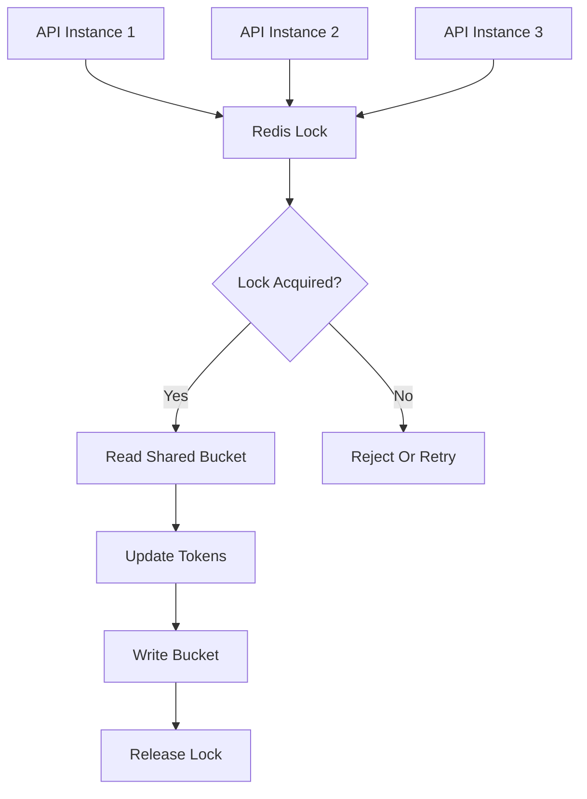
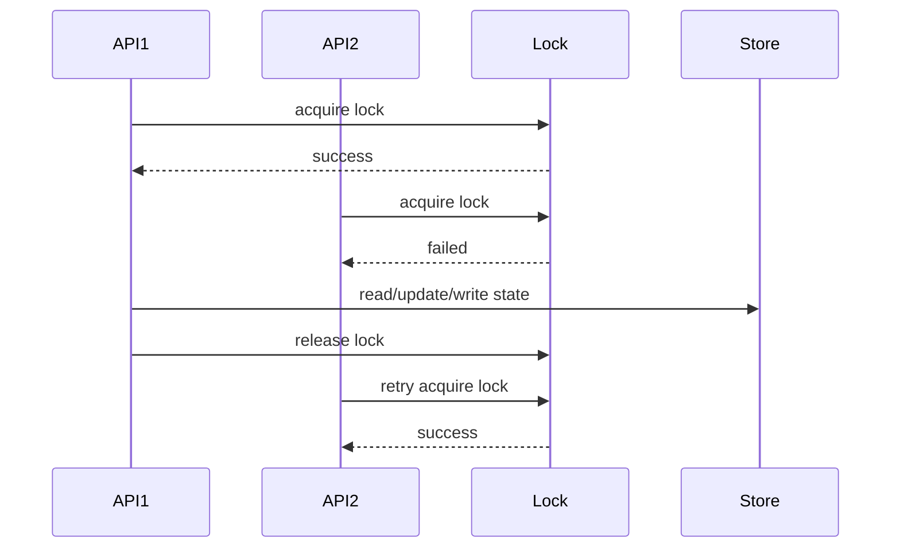
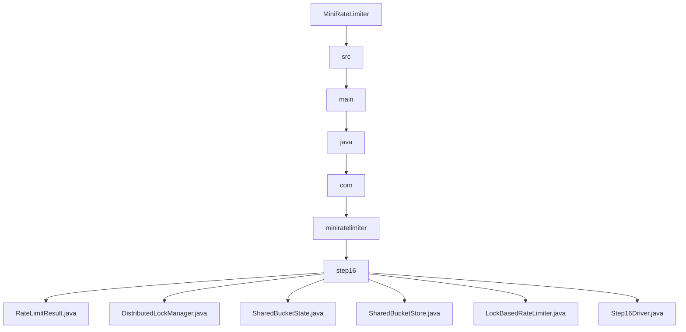

# 016_Distributed_Locking_And_Consistency

# MiniRateLimiter Step 16 — Distributed Locking And Consistency

---

# Clickable Index

1. [Goal](#goal)  
2. [Why Distributed Locking?](#why-distributed-locking)  
3. [Problem Without Consistency](#problem-without-consistency)  
4. [Real World Example](#real-world-example)  
5. [Core Idea](#core-idea)  
6. [Distributed Lock Architecture Mermaid Diagram](#distributed-lock-architecture-mermaid-diagram)  
7. [Lock Flow Mermaid Diagram](#lock-flow-mermaid-diagram)  
8. [Detailed Steps Before Code](#detailed-steps-before-code)  
9. [CP/DSA Concepts Used](#cpdsa-concepts-used)  
10. [Time Complexity](#time-complexity)  
11. [Space Complexity](#space-complexity)  
12. [Lua Atomic Script vs Distributed Lock](#lua-atomic-script-vs-distributed-lock)  
13. [Folder Structure](#folder-structure)  
14. [Folder Mermaid Diagram](#folder-mermaid-diagram)  
15. [Complete Java Code](#complete-java-code)  
16. [CP/DSA Pattern Code](#cpdsa-pattern-code)  
17. [Dry Run](#dry-run)  
18. [Run Command](#run-command)  
19. [Expected Output Pattern](#expected-output-pattern)  
20. [Important Observation](#important-observation)  
21. [Current MiniRateLimiter State](#current-miniratelimiter-state)  
22. [Step 16 Completion Checklist](#step-16-completion-checklist)  
23. [Final Mental Model](#final-mental-model)  
24. [Next Step](#next-step)  

---

# Goal

In Step 15, we built:

```text
Redis Token Bucket
```

Now we study a very important distributed systems problem:

```text
consistency
```

When multiple app instances update same rate-limit state, updates must be safe.

Two common ways:

```text
1. Redis Lua atomic script
2. Distributed lock
```

In this step, we build a simple distributed lock simulation and use it to protect shared rate limiter state.

---

# Why Distributed Locking?

When multiple app instances update same shared state:

```text
tokens
lastRefillTime
counter
```

they can conflict.

A distributed lock ensures:

```text
only one instance modifies shared state at a time
```

This prevents:

```text
lost updates
double token consumption
inconsistent counters
```

---

# Problem Without Consistency

Suppose Redis token bucket has:

```text
tokens = 1
```

Two API instances read at same time:

```text
API-1 reads tokens = 1
API-2 reads tokens = 1
```

Both allow request.

Final result:

```text
2 requests allowed
```

Expected:

```text
only 1 request allowed
```

This is a consistency bug.

---

# Real World Example

Distributed consistency matters in:

```text
payment APIs
OTP APIs
login protection
inventory systems
booking systems
rate limiters
distributed schedulers
```

Anywhere shared state is updated by multiple nodes.

---

# Core Idea

Use a lock key:

```text
lock:rate_limit:user-1
```

Flow:

```text
1. acquire lock
2. read state
3. update state
4. write state
5. release lock
```

Only one app instance can hold the lock.

---

# Distributed Lock Architecture Mermaid Diagram



---

# Lock Flow Mermaid Diagram



---

# Detailed Steps Before Code

## Step 1 — Create lock manager

Lock manager supports:

```text
tryLock(lockKey, ownerId)
unlock(lockKey, ownerId)
```

---

## Step 2 — Create shared bucket store

Store rate-limit state:

```text
identity -> tokens
identity -> lastRefillTime
```

---

## Step 3 — Protect critical section

Critical section:

```text
read bucket
refill
check token
consume token
save bucket
```

---

## Step 4 — Release lock safely

Always release lock using:

```java
finally
```

---

## Step 5 — Compare with Lua script

Distributed lock works, but Lua script is often better for Redis because:

```text
simpler
faster
less lock management
fewer failure modes
```

---

# CP/DSA Concepts Used

## 1. Mutual Exclusion

Only one process enters critical section.

---

## 2. Critical Section

Shared state update must be protected.

---

## 3. Ownership Token

Only lock owner can release lock.

---

## 4. Compare-And-Set Concept

Lock acquisition is like:

```text
set lock only if absent
```

---

## 5. Failure Mode Thinking

Locks need TTL in production to avoid deadlocks.

---

# Time Complexity

```text
O(1)
```

for lock lookup and state update.

---

# Space Complexity

```text
O(active locks + active buckets)
```

---

# Lua Atomic Script vs Distributed Lock

| Feature | Lua Atomic Script | Distributed Lock |
|---|---:|---:|
| Simplicity | High | Medium |
| Performance | High | Lower |
| Failure modes | Fewer | More |
| Good for Redis rate limiter | Excellent | Usually unnecessary |
| General distributed coordination | Limited | Useful |

---

# Folder Structure

```text
MiniRateLimiter/
└── src/main/java/com/miniratelimiter/step16/
    ├── RateLimitResult.java
    ├── DistributedLockManager.java
    ├── SharedBucketState.java
    ├── SharedBucketStore.java
    ├── LockBasedRateLimiter.java
    └── Step16Driver.java
```

---

# Folder Mermaid Diagram



---

# Complete Java Code

---

# RateLimitResult.java

```java
package com.miniratelimiter.step16;

/*
 * Logic:
 *
 * 1. Store allow/reject decision.
 * 2. Store current token count.
 * 3. Store lock acquisition status.
 *
 * Time Complexity:
 * O(1)
 */
public class RateLimitResult {

    private final boolean allowed;
    private final double availableTokens;
    private final boolean lockAcquired;

    public RateLimitResult(boolean allowed, double availableTokens, boolean lockAcquired) {
        this.allowed = allowed;
        this.availableTokens = availableTokens;
        this.lockAcquired = lockAcquired;
    }

    public boolean isAllowed() {
        return allowed;
    }

    public double getAvailableTokens() {
        return availableTokens;
    }

    public boolean isLockAcquired() {
        return lockAcquired;
    }

    @Override
    public String toString() {
        return "RateLimitResult{" +
                "allowed=" + allowed +
                ", availableTokens=" + availableTokens +
                ", lockAcquired=" + lockAcquired +
                '}';
    }
}
```

---

# DistributedLockManager.java

```java
package com.miniratelimiter.step16;

import java.util.HashMap;
import java.util.Map;

/*
 * Logic:
 *
 * 1. Store lockKey -> ownerId.
 * 2. Acquire lock only if lock is absent.
 * 3. Release lock only if caller owns lock.
 * 4. Simulate Redis SET NX style locking.
 *
 * Real Redis:
 *
 * SET lockKey ownerId NX PX ttl
 *
 * Time Complexity:
 * O(1)
 *
 * Space Complexity:
 * O(active locks)
 */
public class DistributedLockManager {

    private final Map<String, String> locks;

    public DistributedLockManager() {
        this.locks = new HashMap<>();
    }

    public synchronized boolean tryLock(String lockKey, String ownerId) {
        if (locks.containsKey(lockKey)) {
            return false;
        }

        locks.put(lockKey, ownerId);

        return true;
    }

    public synchronized void unlock(String lockKey, String ownerId) {
        String currentOwner = locks.get(lockKey);

        if (ownerId.equals(currentOwner)) {
            locks.remove(lockKey);
        }
    }

    public synchronized Map<String, String> snapshot() {
        return new HashMap<>(locks);
    }
}
```

---

# SharedBucketState.java

```java
package com.miniratelimiter.step16;

/*
 * Logic:
 *
 * 1. Store distributed token bucket state.
 * 2. Track tokens.
 * 3. Track last refill timestamp.
 *
 * Time Complexity:
 * O(1)
 */
public class SharedBucketState {

    private double tokens;
    private long lastRefillTimeMillis;

    public SharedBucketState(double tokens, long lastRefillTimeMillis) {
        this.tokens = tokens;
        this.lastRefillTimeMillis = lastRefillTimeMillis;
    }

    public double getTokens() {
        return tokens;
    }

    public long getLastRefillTimeMillis() {
        return lastRefillTimeMillis;
    }

    public void setTokens(double tokens) {
        this.tokens = tokens;
    }

    public void setLastRefillTimeMillis(long lastRefillTimeMillis) {
        this.lastRefillTimeMillis = lastRefillTimeMillis;
    }

    @Override
    public String toString() {
        return "SharedBucketState{" +
                "tokens=" + tokens +
                ", lastRefillTimeMillis=" + lastRefillTimeMillis +
                '}';
    }
}
```

---

# SharedBucketStore.java

```java
package com.miniratelimiter.step16;

import java.util.HashMap;
import java.util.Map;

/*
 * Logic:
 *
 * 1. Store identity -> bucket state.
 * 2. Simulate shared Redis storage.
 * 3. Return existing bucket or create new bucket.
 *
 * Time Complexity:
 * O(1)
 *
 * Space Complexity:
 * O(active identities)
 */
public class SharedBucketStore {

    private final Map<String, SharedBucketState> buckets;

    public SharedBucketStore() {
        this.buckets = new HashMap<>();
    }

    public SharedBucketState getOrCreateBucket(String key, int capacity, long currentTimeMillis) {
        return buckets.computeIfAbsent(key, ignored -> new SharedBucketState(capacity, currentTimeMillis));
    }

    public synchronized Map<String, SharedBucketState> snapshot() {
        return new HashMap<>(buckets);
    }
}
```

---

# LockBasedRateLimiter.java

```java
package com.miniratelimiter.step16;

/*
 * Logic:
 *
 * 1. Build lock key and bucket key.
 * 2. Acquire distributed lock.
 * 3. Read shared bucket state.
 * 4. Refill tokens.
 * 5. Consume token if available.
 * 6. Release distributed lock.
 *
 * Core Idea:
 *
 * Lock protects read-update-write sequence.
 *
 * Time Complexity:
 * O(1)
 *
 * Space Complexity:
 * O(active identities)
 */
public class LockBasedRateLimiter {

    private final int capacity;
    private final double refillRatePerMillis;
    private final SharedBucketStore bucketStore;
    private final DistributedLockManager lockManager;

    public LockBasedRateLimiter(
            int capacity,
            double refillTokensPerSecond,
            SharedBucketStore bucketStore,
            DistributedLockManager lockManager
    ) {
        if (capacity <= 0) {
            throw new IllegalArgumentException("Capacity should be positive");
        }

        if (refillTokensPerSecond <= 0) {
            throw new IllegalArgumentException("Refill rate should be positive");
        }

        this.capacity = capacity;
        this.refillRatePerMillis = refillTokensPerSecond / 1000.0;
        this.bucketStore = bucketStore;
        this.lockManager = lockManager;
    }

    public RateLimitResult allowRequest(String identity, String ownerId, long currentTimeMillis) {
        String bucketKey = buildBucketKey(identity);
        String lockKey = buildLockKey(identity);

        boolean locked = lockManager.tryLock(lockKey, ownerId);

        if (!locked) {
            return new RateLimitResult(false, -1, false);
        }

        try {
            SharedBucketState state = bucketStore.getOrCreateBucket(bucketKey, capacity, currentTimeMillis);

            refill(state, currentTimeMillis);

            if (state.getTokens() < 1.0) {
                return new RateLimitResult(false, state.getTokens(), true);
            }

            state.setTokens(state.getTokens() - 1.0);

            return new RateLimitResult(true, state.getTokens(), true);

        } finally {
            lockManager.unlock(lockKey, ownerId);
        }
    }

    private void refill(SharedBucketState state, long currentTimeMillis) {
        long elapsedMillis = currentTimeMillis - state.getLastRefillTimeMillis();

        if (elapsedMillis <= 0) {
            return;
        }

        double tokensToAdd = elapsedMillis * refillRatePerMillis;
        double updatedTokens = Math.min(capacity, state.getTokens() + tokensToAdd);

        state.setTokens(updatedTokens);
        state.setLastRefillTimeMillis(currentTimeMillis);
    }

    private String buildBucketKey(String identity) {
        return "bucket:" + identity;
    }

    private String buildLockKey(String identity) {
        return "lock:bucket:" + identity;
    }
}
```

---

# Step16Driver.java

```java
package com.miniratelimiter.step16;

/*
 * Logic:
 *
 * 1. Create shared bucket store.
 * 2. Create shared distributed lock manager.
 * 3. Create two API instances.
 * 4. Simulate both using same distributed bucket.
 * 5. Observe lock-protected consistency.
 */
public class Step16Driver {

    public static void main(String[] args) {
        SharedBucketStore bucketStore = new SharedBucketStore();
        DistributedLockManager lockManager = new DistributedLockManager();

        LockBasedRateLimiter apiInstance1 =
                new LockBasedRateLimiter(5, 1.0, bucketStore, lockManager);

        LockBasedRateLimiter apiInstance2 =
                new LockBasedRateLimiter(5, 1.0, bucketStore, lockManager);

        String identity = "user-1";

        long currentTime = 0;

        System.out.println("---- LOCK BASED DISTRIBUTED LIMITING ----");

        for (int i = 1; i <= 7; i++) {
            LockBasedRateLimiter limiter = (i % 2 == 0) ? apiInstance1 : apiInstance2;
            String ownerId = (i % 2 == 0) ? "api-1" : "api-2";

            RateLimitResult result = limiter.allowRequest(identity, ownerId, currentTime);

            System.out.println("request=" + i + ", owner=" + ownerId + ", result=" + result);
        }

        System.out.println();
        System.out.println("---- BUCKET STORE SNAPSHOT ----");
        System.out.println(bucketStore.snapshot());

        System.out.println();
        System.out.println("---- LOCK MANAGER SNAPSHOT ----");
        System.out.println(lockManager.snapshot());
    }
}
```

---

# CP/DSA Pattern Code

## Problem

Protect shared counter with lock.

---

## DSA/CP Java Code

```java
public class LockCounterCP {

    private static int tokens = 1;

    public static synchronized boolean consume() {
        if (tokens <= 0) {
            return false;
        }

        tokens--;

        return true;
    }

    public static void main(String[] args) {
        System.out.println(consume());
        System.out.println(consume());
    }
}
```

---

# Dry Run

Initial state:

```text
tokens = 5
```

Requests:

```text
API-1 request
API-2 request
API-1 request
```

Each request:

```text
acquires lock
updates bucket
releases lock
```

So token count remains consistent.

After 5 allowed requests:

```text
tokens = 0
```

Next requests reject.

---

# Run Command

```bash
javac -d out src/main/java/com/miniratelimiter/step16/*.java

java -cp out com.miniratelimiter.step16.Step16Driver
```

---

# Expected Output Pattern

```text
request=1, owner=api-2, result=RateLimitResult{allowed=true, availableTokens=4.0, lockAcquired=true}
...
request=6, owner=api-1, result=RateLimitResult{allowed=false, availableTokens=0.0, lockAcquired=true}

---- LOCK MANAGER SNAPSHOT ----
{}
```

Lock snapshot should be empty because locks are released.

---

# Important Observation

Distributed locks work, but they have risks:

```text
lock timeout
deadlock
network partition
owner crash
clock issues
slow performance
```

For Redis rate limiting, Lua atomic scripts are usually simpler and better.

Use distributed locks when you need broader coordination, not just one Redis counter update.

---

# Current MiniRateLimiter State

```text
Supported:
[yes] fixed window counter
[yes] sliding window log
[yes] sliding window counter
[yes] token bucket
[yes] leaky bucket
[yes] thread-safe limiter
[yes] Redis distributed limiter
[yes] Redis Lua atomic limiter
[yes] policy model
[yes] HTTP headers
[yes] Spring Boot filter
[yes] API gateway rate limiting
[yes] per-user and per-IP limits
[yes] Redis sliding window
[yes] Redis token bucket
[yes] distributed locking and consistency

Not yet:
[no] metrics dashboard
[no] load testing
[no] production deployment
```

---

# Step 16 Completion Checklist

```text
[ ] You understand distributed consistency
[ ] You understand race conditions across app instances
[ ] You understand distributed locks
[ ] You understand lock owner id
[ ] You understand lock release safety
[ ] You understand why Lua is often better for Redis limiter
```

---

# Final Mental Model

```text
Distributed Consistency =
safe shared state updates across nodes
```

```text
either use atomic script or distributed lock
```

---

# Next Step

Next we build:

```text
017_Metrics_And_Monitoring
```

We will expose limiter metrics:

```text
allowed count
rejected count
latency
hot keys
```
