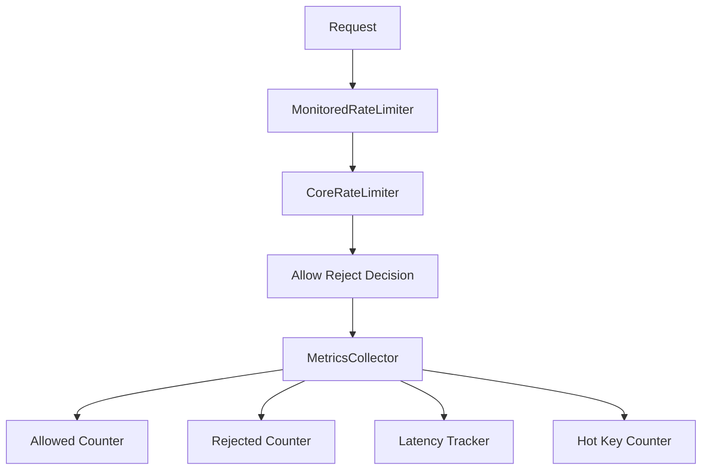
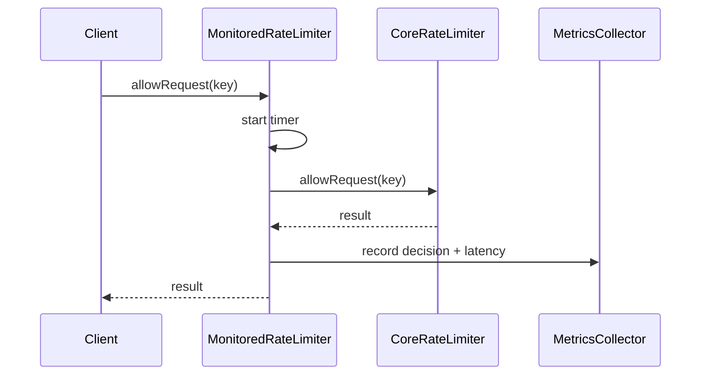
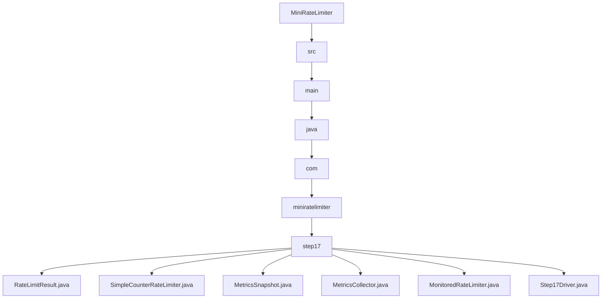

# 017_Metrics_And_Monitoring

# MiniRateLimiter Step 17 — Metrics And Monitoring

---

# Clickable Index

1. [Goal](#goal)  
2. [Why Metrics Matter?](#why-metrics-matter)  
3. [What Should We Monitor?](#what-should-we-monitor)  
4. [Real World Example](#real-world-example)  
5. [Core Idea](#core-idea)  
6. [Metrics Architecture Mermaid Diagram](#metrics-architecture-mermaid-diagram)  
7. [Request Metrics Flow Mermaid Diagram](#request-metrics-flow-mermaid-diagram)  
8. [Detailed Steps Before Code](#detailed-steps-before-code)  
9. [CP/DSA Concepts Used](#cpdsa-concepts-used)  
10. [Time Complexity](#time-complexity)  
11. [Space Complexity](#space-complexity)  
12. [Useful Rate Limiter Metrics](#useful-rate-limiter-metrics)  
13. [Folder Structure](#folder-structure)  
14. [Folder Mermaid Diagram](#folder-mermaid-diagram)  
15. [Complete Java Code](#complete-java-code)  
16. [CP/DSA Pattern Code](#cpdsa-pattern-code)  
17. [Dry Run](#dry-run)  
18. [Run Command](#run-command)  
19. [Expected Output Pattern](#expected-output-pattern)  
20. [Important Observation](#important-observation)  
21. [Current MiniRateLimiter State](#current-miniratelimiter-state)  
22. [Step 17 Completion Checklist](#step-17-completion-checklist)  
23. [Final Mental Model](#final-mental-model)  
24. [Next Step](#next-step)  

---

# Goal

In Step 16, we learned:

```text
distributed locking and consistency
```

Now we add:

```text
metrics and monitoring
```

A production rate limiter should not be a black box.

We need to know:

```text
how many requests are allowed
how many requests are rejected
which keys are hot
how long limiter checks take
```

---

# Why Metrics Matter?

Without metrics, we cannot answer:

```text
Are users being throttled too much?
Is Redis slow?
Which API route is under attack?
Which user/IP is hottest?
Is limiter causing latency?
```

With metrics, we can debug production issues quickly.

---

# What Should We Monitor?

Important rate limiter metrics:

```text
allowed request count
rejected request count
total request count
rejection ratio
average decision latency
hot keys
```

---

# Real World Example

In production, these metrics are sent to:

```text
Prometheus
Grafana
Datadog
New Relic
CloudWatch
OpenTelemetry
```

Example dashboard:

```text
rate_limiter_allowed_total
rate_limiter_rejected_total
rate_limiter_latency_ms_avg
rate_limiter_hot_keys
```

---

# Core Idea

Wrap the rate limiter with a metrics layer.

Flow:

```text
request
  ->
rate limiter check
  ->
record decision
  ->
record latency
  ->
return result
```

---

# Metrics Architecture Mermaid Diagram



---

# Request Metrics Flow Mermaid Diagram



---

# Detailed Steps Before Code

## Step 1 — Create rate limit result

Result stores:

```text
allowed
key
currentCount
limit
```

---

## Step 2 — Create simple core limiter

Use a simple counter limiter.

---

## Step 3 — Create metrics collector

Metrics collector stores:

```text
allowedCount
rejectedCount
totalLatencyMillis
keyCounters
```

---

## Step 4 — Wrap limiter with monitoring

Monitored limiter:

```text
start timer
call limiter
record metrics
return result
```

---

## Step 5 — Print metrics snapshot

Show dashboard-like output.

---

# CP/DSA Concepts Used

## 1. Frequency Counter

Hot keys are counted using:

```java
Map<String, Integer>
```

---

## 2. Aggregation

Allowed/rejected totals are aggregate counters.

---

## 3. Average Calculation

Average latency:

```text
totalLatency / totalRequests
```

---

## 4. Wrapper Pattern

Monitoring wraps core limiter without changing its logic.

---

## 5. Top-K Idea

Hot keys are the beginning of Top-K frequency problem.

---

# Time Complexity

Per request:

```text
O(1)
```

Metrics snapshot:

```text
O(number of keys)
```

---

# Space Complexity

```text
O(active keys)
```

---

# Useful Rate Limiter Metrics

| Metric | Meaning |
|---|---|
| allowedCount | Total allowed requests |
| rejectedCount | Total rejected requests |
| totalRequests | Allowed + rejected |
| rejectionRatio | rejected / total |
| avgLatencyMillis | Average limiter latency |
| keyCounters | Requests per key |

---

# Folder Structure

```text
MiniRateLimiter/
└── src/main/java/com/miniratelimiter/step17/
    ├── RateLimitResult.java
    ├── SimpleCounterRateLimiter.java
    ├── MetricsSnapshot.java
    ├── MetricsCollector.java
    ├── MonitoredRateLimiter.java
    └── Step17Driver.java
```

---

# Folder Mermaid Diagram



---

# Complete Java Code

---

# RateLimitResult.java

```java
package com.miniratelimiter.step17;

/*
 * Logic:
 *
 * 1. Store allow/reject decision.
 * 2. Store key used for rate limiting.
 * 3. Store current count and limit.
 *
 * Time Complexity:
 * O(1)
 */
public class RateLimitResult {

    private final boolean allowed;
    private final String key;
    private final int currentCount;
    private final int limit;

    public RateLimitResult(boolean allowed, String key, int currentCount, int limit) {
        this.allowed = allowed;
        this.key = key;
        this.currentCount = currentCount;
        this.limit = limit;
    }

    public boolean isAllowed() {
        return allowed;
    }

    public String getKey() {
        return key;
    }

    public int getCurrentCount() {
        return currentCount;
    }

    public int getLimit() {
        return limit;
    }

    @Override
    public String toString() {
        return "RateLimitResult{" +
                "allowed=" + allowed +
                ", key='" + key + '\'' +
                ", currentCount=" + currentCount +
                ", limit=" + limit +
                '}';
    }
}
```

---

# SimpleCounterRateLimiter.java

```java
package com.miniratelimiter.step17;

import java.util.HashMap;
import java.util.Map;

/*
 * Logic:
 *
 * 1. Count requests per key.
 * 2. Compare current count with limit.
 * 3. Return allow/reject result.
 *
 * This is intentionally simple because Step 17 focuses on metrics.
 *
 * Time Complexity:
 * O(1)
 *
 * Space Complexity:
 * O(active keys)
 */
public class SimpleCounterRateLimiter {

    private final int limit;
    private final Map<String, Integer> counters;

    public SimpleCounterRateLimiter(int limit) {
        if (limit <= 0) {
            throw new IllegalArgumentException("Limit should be positive");
        }

        this.limit = limit;
        this.counters = new HashMap<>();
    }

    public RateLimitResult allowRequest(String key) {
        int count = counters.getOrDefault(key, 0) + 1;

        counters.put(key, count);

        boolean allowed = count <= limit;

        return new RateLimitResult(allowed, key, count, limit);
    }
}
```

---

# MetricsSnapshot.java

```java
package com.miniratelimiter.step17;

import java.util.Map;

/*
 * Logic:
 *
 * 1. Store immutable metrics view.
 * 2. Store counters and latency summary.
 * 3. Represent dashboard snapshot.
 *
 * Time Complexity:
 * O(1)
 */
public class MetricsSnapshot {

    private final long allowedCount;
    private final long rejectedCount;
    private final long totalRequests;
    private final double rejectionRatio;
    private final double averageLatencyMillis;
    private final Map<String, Integer> keyCounters;

    public MetricsSnapshot(
            long allowedCount,
            long rejectedCount,
            long totalRequests,
            double rejectionRatio,
            double averageLatencyMillis,
            Map<String, Integer> keyCounters
    ) {
        this.allowedCount = allowedCount;
        this.rejectedCount = rejectedCount;
        this.totalRequests = totalRequests;
        this.rejectionRatio = rejectionRatio;
        this.averageLatencyMillis = averageLatencyMillis;
        this.keyCounters = keyCounters;
    }

    @Override
    public String toString() {
        return "MetricsSnapshot{" +
                "allowedCount=" + allowedCount +
                ", rejectedCount=" + rejectedCount +
                ", totalRequests=" + totalRequests +
                ", rejectionRatio=" + rejectionRatio +
                ", averageLatencyMillis=" + averageLatencyMillis +
                ", keyCounters=" + keyCounters +
                '}';
    }
}
```

---

# MetricsCollector.java

```java
package com.miniratelimiter.step17;

import java.util.HashMap;
import java.util.Map;

/*
 * Logic:
 *
 * 1. Count allowed requests.
 * 2. Count rejected requests.
 * 3. Track total latency.
 * 4. Track request count per key.
 * 5. Produce metrics snapshot.
 *
 * Time Complexity:
 * record: O(1)
 * snapshot: O(number of keys)
 *
 * Space Complexity:
 * O(active keys)
 */
public class MetricsCollector {

    private long allowedCount;
    private long rejectedCount;
    private long totalLatencyMillis;
    private final Map<String, Integer> keyCounters;

    public MetricsCollector() {
        this.allowedCount = 0;
        this.rejectedCount = 0;
        this.totalLatencyMillis = 0;
        this.keyCounters = new HashMap<>();
    }

    public void record(RateLimitResult result, long latencyMillis) {
        if (result.isAllowed()) {
            allowedCount++;
        } else {
            rejectedCount++;
        }

        totalLatencyMillis += latencyMillis;

        String key = result.getKey();
        keyCounters.put(key, keyCounters.getOrDefault(key, 0) + 1);
    }

    public MetricsSnapshot snapshot() {
        long totalRequests = allowedCount + rejectedCount;

        double rejectionRatio =
                totalRequests == 0 ? 0.0 : (double) rejectedCount / totalRequests;

        double averageLatencyMillis =
                totalRequests == 0 ? 0.0 : (double) totalLatencyMillis / totalRequests;

        return new MetricsSnapshot(
                allowedCount,
                rejectedCount,
                totalRequests,
                rejectionRatio,
                averageLatencyMillis,
                new HashMap<>(keyCounters)
        );
    }
}
```

---

# MonitoredRateLimiter.java

```java
package com.miniratelimiter.step17;

/*
 * Logic:
 *
 * 1. Wrap core rate limiter.
 * 2. Measure decision latency.
 * 3. Record allow/reject metrics.
 * 4. Return original limiter result.
 *
 * Core Idea:
 *
 * Monitoring should not change business logic.
 *
 * Time Complexity:
 * O(1)
 *
 * Space Complexity:
 * O(active keys)
 */
public class MonitoredRateLimiter {

    private final SimpleCounterRateLimiter coreLimiter;
    private final MetricsCollector metricsCollector;

    public MonitoredRateLimiter(SimpleCounterRateLimiter coreLimiter, MetricsCollector metricsCollector) {
        this.coreLimiter = coreLimiter;
        this.metricsCollector = metricsCollector;
    }

    public RateLimitResult allowRequest(String key) {
        long startTime = System.currentTimeMillis();

        RateLimitResult result = coreLimiter.allowRequest(key);

        long endTime = System.currentTimeMillis();
        long latencyMillis = endTime - startTime;

        metricsCollector.record(result, latencyMillis);

        return result;
    }
}
```

---

# Step17Driver.java

```java
package com.miniratelimiter.step17;

/*
 * Logic:
 *
 * 1. Create core limiter.
 * 2. Wrap it with metrics collector.
 * 3. Send requests from multiple keys.
 * 4. Print limiter decisions.
 * 5. Print metrics snapshot.
 */
public class Step17Driver {

    public static void main(String[] args) {
        SimpleCounterRateLimiter coreLimiter = new SimpleCounterRateLimiter(3);
        MetricsCollector metricsCollector = new MetricsCollector();

        MonitoredRateLimiter monitoredLimiter =
                new MonitoredRateLimiter(coreLimiter, metricsCollector);

        String[] keys = {
                "USER:user-1",
                "USER:user-1",
                "USER:user-1",
                "USER:user-1",
                "IP:192.168.1.10",
                "IP:192.168.1.10",
                "IP:192.168.1.10",
                "IP:192.168.1.10"
        };

        System.out.println("---- RATE LIMIT DECISIONS ----");

        for (int i = 0; i < keys.length; i++) {
            RateLimitResult result = monitoredLimiter.allowRequest(keys[i]);

            System.out.println("request=" + (i + 1) + ", result=" + result);
        }

        System.out.println();
        System.out.println("---- METRICS SNAPSHOT ----");
        System.out.println(metricsCollector.snapshot());
    }
}
```

---

# CP/DSA Pattern Code

## Problem

Count frequencies and calculate rejection ratio.

---

## DSA/CP Java Code

```java
import java.util.HashMap;
import java.util.Map;

public class MetricsCP {

    public static void main(String[] args) {
        String[] keys = {
                "A", "A", "A", "A", "B", "B"
        };

        Map<String, Integer> freq = new HashMap<>();

        int allowed = 0;
        int rejected = 0;
        int limit = 3;

        for (String key : keys) {
            int count = freq.getOrDefault(key, 0) + 1;

            freq.put(key, count);

            if (count <= limit) {
                allowed++;
            } else {
                rejected++;
            }
        }

        int total = allowed + rejected;
        double rejectionRatio = (double) rejected / total;

        System.out.println("freq=" + freq);
        System.out.println("allowed=" + allowed);
        System.out.println("rejected=" + rejected);
        System.out.println("rejectionRatio=" + rejectionRatio);
    }
}
```

---

# Dry Run

Limit:

```text
3 requests per key
```

Requests:

```text
USER:user-1 -> 4 requests
IP:192.168.1.10 -> 4 requests
```

For each key:

```text
first 3 allowed
4th rejected
```

Totals:

```text
allowed = 6
rejected = 2
total = 8
rejectionRatio = 0.25
```

---

# Run Command

```bash
javac -d out src/main/java/com/miniratelimiter/step17/*.java

java -cp out com.miniratelimiter.step17.Step17Driver
```

---

# Expected Output Pattern

```text
---- RATE LIMIT DECISIONS ----
request=1, result=RateLimitResult{allowed=true, key='USER:user-1', currentCount=1, limit=3}
...
request=4, result=RateLimitResult{allowed=false, key='USER:user-1', currentCount=4, limit=3}

---- METRICS SNAPSHOT ----
MetricsSnapshot{allowedCount=6, rejectedCount=2, totalRequests=8, rejectionRatio=0.25, ...}
```

---

# Important Observation

Metrics turn rate limiter into an observable production component.

Without metrics:

```text
you only know if code works locally
```

With metrics:

```text
you know how limiter behaves in production
```

This is the difference between learning an algorithm and building a real system.

---

# Current MiniRateLimiter State

```text
Supported:
[yes] fixed window counter
[yes] sliding window log
[yes] sliding window counter
[yes] token bucket
[yes] leaky bucket
[yes] thread-safe limiter
[yes] Redis distributed limiter
[yes] Redis Lua atomic limiter
[yes] policy model
[yes] HTTP headers
[yes] Spring Boot filter
[yes] API gateway rate limiting
[yes] per-user and per-IP limits
[yes] Redis sliding window
[yes] Redis token bucket
[yes] distributed locking and consistency
[yes] metrics and monitoring

Not yet:
[no] dashboard
[no] load testing
[no] production deployment
```

---

# Step 17 Completion Checklist

```text
[ ] You understand allowed/rejected counters
[ ] You understand latency tracking
[ ] You understand hot key counting
[ ] You understand metrics snapshot
[ ] You understand wrapper pattern
[ ] You understand why monitoring matters
```

---

# Final Mental Model

```text
Monitoring =
observe system behavior over time
```

```text
rate limiter without metrics is not production ready
```

---

# Next Step

Next we build:

```text
018_Rate_Limiter_Dashboard
```

We will convert metrics into dashboard-friendly output.
