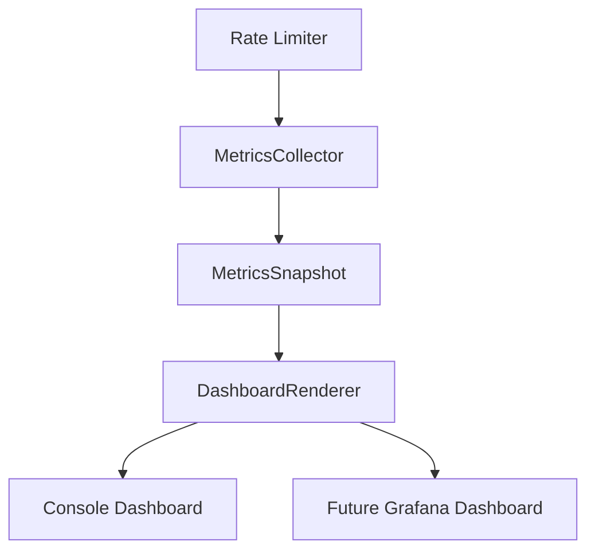
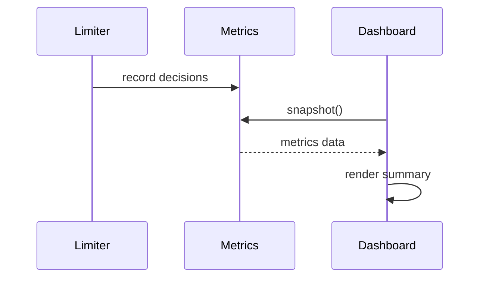
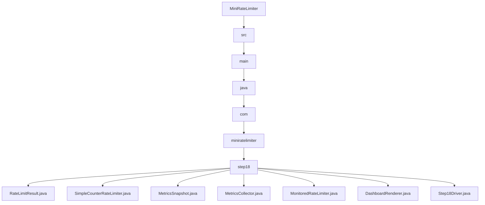

# 018_Rate_Limiter_Dashboard

# MiniRateLimiter Step 18 — Rate Limiter Dashboard

---

# Clickable Index

1. [Goal](#goal)  
2. [Why Dashboard?](#why-dashboard)  
3. [What Dashboard Shows](#what-dashboard-shows)  
4. [Real World Example](#real-world-example)  
5. [Core Idea](#core-idea)  
6. [Dashboard Architecture Mermaid Diagram](#dashboard-architecture-mermaid-diagram)  
7. [Dashboard Refresh Flow Mermaid Diagram](#dashboard-refresh-flow-mermaid-diagram)  
8. [Detailed Steps Before Code](#detailed-steps-before-code)  
9. [CP/DSA Concepts Used](#cpdsa-concepts-used)  
10. [Time Complexity](#time-complexity)  
11. [Space Complexity](#space-complexity)  
12. [Metrics vs Dashboard](#metrics-vs-dashboard)  
13. [Folder Structure](#folder-structure)  
14. [Folder Mermaid Diagram](#folder-mermaid-diagram)  
15. [Complete Java Code](#complete-java-code)  
16. [CP/DSA Pattern Code](#cpdsa-pattern-code)  
17. [Dry Run](#dry-run)  
18. [Run Command](#run-command)  
19. [Expected Output Pattern](#expected-output-pattern)  
20. [Important Observation](#important-observation)  
21. [Current MiniRateLimiter State](#current-miniratelimiter-state)  
22. [Step 18 Completion Checklist](#step-18-completion-checklist)  
23. [Final Mental Model](#final-mental-model)  
24. [Next Step](#next-step)  

---

# Goal

In Step 17, we collected metrics:

```text
allowed count
rejected count
latency
hot keys
```

Now we build:

```text
Rate Limiter Dashboard
```

A dashboard turns raw metrics into readable operational output.

In production this would be:

```text
Grafana dashboard
Prometheus metrics
Datadog dashboard
CloudWatch dashboard
```

In this phase, we build a console dashboard simulation.

---

# Why Dashboard?

Metrics alone are raw data.

Dashboard gives quick visibility:

```text
Is system healthy?
Are many requests rejected?
Which key is hottest?
Is latency increasing?
```

This helps engineers debug production issues quickly.

---

# What Dashboard Shows

Our dashboard shows:

```text
total requests
allowed requests
rejected requests
rejection ratio
average latency
top hot keys
health status
```

---

# Real World Example

In real production dashboards you may see:

```text
rate_limiter_allowed_total
rate_limiter_rejected_total
rate_limiter_rejection_ratio
rate_limiter_decision_latency_ms
rate_limiter_hot_keys
```

These are used by:

```text
SRE teams
backend teams
platform teams
API gateway teams
```

---

# Core Idea

Flow:

```text
metrics snapshot
      ->
dashboard renderer
      ->
human-readable output
```

Dashboard should not change rate limiter behavior.

It only reads metrics.

---

# Dashboard Architecture Mermaid Diagram



---

# Dashboard Refresh Flow Mermaid Diagram



---

# Detailed Steps Before Code

## Step 1 — Reuse metrics snapshot

Snapshot contains:

```text
allowedCount
rejectedCount
totalRequests
rejectionRatio
averageLatencyMillis
keyCounters
```

---

## Step 2 — Create dashboard renderer

Renderer converts metrics into readable text.

---

## Step 3 — Add health status

Example:

```text
GOOD if rejection ratio < 20%
WARNING if rejection ratio >= 20%
CRITICAL if rejection ratio >= 50%
```

---

## Step 4 — Show hot keys

Sort keys by request count.

---

## Step 5 — Print dashboard

Display dashboard in console.

---

# CP/DSA Concepts Used

## 1. Sorting By Frequency

Hot keys require sorting entries by count.

---

## 2. Top-K Pattern

Dashboard displays top N hot keys.

---

## 3. Aggregation

Allowed/rejected totals are aggregate metrics.

---

## 4. Threshold Classification

Health status uses rule-based classification.

---

## 5. Snapshot Pattern

Dashboard reads immutable snapshot of current state.

---

# Time Complexity

Dashboard render:

```text
O(k log k)
```

where:

```text
k = number of keys
```

because hot keys are sorted.

---

# Space Complexity

```text
O(k)
```

for dashboard rendering.

---

# Metrics vs Dashboard

| Concept | Meaning |
|---|---|
| Metrics | Raw numbers |
| Dashboard | Human-readable view |
| Alert | Automatic warning |
| SLO | Reliability target |

---

# Folder Structure

```text
MiniRateLimiter/
└── src/main/java/com/miniratelimiter/step18/
    ├── RateLimitResult.java
    ├── SimpleCounterRateLimiter.java
    ├── MetricsSnapshot.java
    ├── MetricsCollector.java
    ├── MonitoredRateLimiter.java
    ├── DashboardRenderer.java
    └── Step18Driver.java
```

---

# Folder Mermaid Diagram



---

# Complete Java Code

---

# RateLimitResult.java

```java
package com.miniratelimiter.step18;

/*
 * Logic:
 *
 * 1. Store allow/reject decision.
 * 2. Store key used for rate limiting.
 * 3. Store current count and limit.
 *
 * Time Complexity:
 * O(1)
 */
public class RateLimitResult {

    private final boolean allowed;
    private final String key;
    private final int currentCount;
    private final int limit;

    public RateLimitResult(boolean allowed, String key, int currentCount, int limit) {
        this.allowed = allowed;
        this.key = key;
        this.currentCount = currentCount;
        this.limit = limit;
    }

    public boolean isAllowed() {
        return allowed;
    }

    public String getKey() {
        return key;
    }

    public int getCurrentCount() {
        return currentCount;
    }

    public int getLimit() {
        return limit;
    }

    @Override
    public String toString() {
        return "RateLimitResult{" +
                "allowed=" + allowed +
                ", key='" + key + '\'' +
                ", currentCount=" + currentCount +
                ", limit=" + limit +
                '}';
    }
}
```

---

# SimpleCounterRateLimiter.java

```java
package com.miniratelimiter.step18;

import java.util.HashMap;
import java.util.Map;

/*
 * Logic:
 *
 * 1. Count requests per key.
 * 2. Compare current count with limit.
 * 3. Return allow/reject result.
 *
 * Time Complexity:
 * O(1)
 *
 * Space Complexity:
 * O(active keys)
 */
public class SimpleCounterRateLimiter {

    private final int limit;
    private final Map<String, Integer> counters;

    public SimpleCounterRateLimiter(int limit) {
        if (limit <= 0) {
            throw new IllegalArgumentException("Limit should be positive");
        }

        this.limit = limit;
        this.counters = new HashMap<>();
    }

    public RateLimitResult allowRequest(String key) {
        int count = counters.getOrDefault(key, 0) + 1;

        counters.put(key, count);

        boolean allowed = count <= limit;

        return new RateLimitResult(allowed, key, count, limit);
    }
}
```

---

# MetricsSnapshot.java

```java
package com.miniratelimiter.step18;

import java.util.Map;

/*
 * Logic:
 *
 * 1. Store metrics snapshot.
 * 2. Provide dashboard-friendly getters.
 *
 * Time Complexity:
 * O(1)
 */
public class MetricsSnapshot {

    private final long allowedCount;
    private final long rejectedCount;
    private final long totalRequests;
    private final double rejectionRatio;
    private final double averageLatencyMillis;
    private final Map<String, Integer> keyCounters;

    public MetricsSnapshot(long allowedCount, long rejectedCount, long totalRequests,
                           double rejectionRatio, double averageLatencyMillis,
                           Map<String, Integer> keyCounters) {
        this.allowedCount = allowedCount;
        this.rejectedCount = rejectedCount;
        this.totalRequests = totalRequests;
        this.rejectionRatio = rejectionRatio;
        this.averageLatencyMillis = averageLatencyMillis;
        this.keyCounters = keyCounters;
    }

    public long getAllowedCount() {
        return allowedCount;
    }

    public long getRejectedCount() {
        return rejectedCount;
    }

    public long getTotalRequests() {
        return totalRequests;
    }

    public double getRejectionRatio() {
        return rejectionRatio;
    }

    public double getAverageLatencyMillis() {
        return averageLatencyMillis;
    }

    public Map<String, Integer> getKeyCounters() {
        return keyCounters;
    }
}
```

---

# MetricsCollector.java

```java
package com.miniratelimiter.step18;

import java.util.HashMap;
import java.util.Map;

/*
 * Logic:
 *
 * 1. Record limiter decisions.
 * 2. Track total allowed/rejected.
 * 3. Track latency.
 * 4. Track hot keys.
 * 5. Produce snapshot for dashboard.
 *
 * Time Complexity:
 * record: O(1)
 * snapshot: O(number of keys)
 */
public class MetricsCollector {

    private long allowedCount;
    private long rejectedCount;
    private long totalLatencyMillis;
    private final Map<String, Integer> keyCounters;

    public MetricsCollector() {
        this.allowedCount = 0;
        this.rejectedCount = 0;
        this.totalLatencyMillis = 0;
        this.keyCounters = new HashMap<>();
    }

    public void record(RateLimitResult result, long latencyMillis) {
        if (result.isAllowed()) {
            allowedCount++;
        } else {
            rejectedCount++;
        }

        totalLatencyMillis += latencyMillis;

        String key = result.getKey();
        keyCounters.put(key, keyCounters.getOrDefault(key, 0) + 1);
    }

    public MetricsSnapshot snapshot() {
        long totalRequests = allowedCount + rejectedCount;

        double rejectionRatio = totalRequests == 0 ? 0.0 : (double) rejectedCount / totalRequests;
        double avgLatencyMillis = totalRequests == 0 ? 0.0 : (double) totalLatencyMillis / totalRequests;

        return new MetricsSnapshot(
                allowedCount,
                rejectedCount,
                totalRequests,
                rejectionRatio,
                avgLatencyMillis,
                new HashMap<>(keyCounters)
        );
    }
}
```

---

# MonitoredRateLimiter.java

```java
package com.miniratelimiter.step18;

/*
 * Logic:
 *
 * 1. Wrap core limiter.
 * 2. Measure latency.
 * 3. Record metrics.
 * 4. Return original result.
 *
 * Time Complexity:
 * O(1)
 */
public class MonitoredRateLimiter {

    private final SimpleCounterRateLimiter coreLimiter;
    private final MetricsCollector metricsCollector;

    public MonitoredRateLimiter(SimpleCounterRateLimiter coreLimiter, MetricsCollector metricsCollector) {
        this.coreLimiter = coreLimiter;
        this.metricsCollector = metricsCollector;
    }

    public RateLimitResult allowRequest(String key) {
        long startTime = System.currentTimeMillis();

        RateLimitResult result = coreLimiter.allowRequest(key);

        long latencyMillis = System.currentTimeMillis() - startTime;

        metricsCollector.record(result, latencyMillis);

        return result;
    }
}
```

---

# DashboardRenderer.java

```java
package com.miniratelimiter.step18;

import java.util.Comparator;
import java.util.List;
import java.util.Map;
import java.util.stream.Collectors;

/*
 * Logic:
 *
 * 1. Read metrics snapshot.
 * 2. Calculate health status.
 * 3. Sort hot keys by request count.
 * 4. Render dashboard text.
 *
 * Time Complexity:
 * O(k log k)
 *
 * Space Complexity:
 * O(k)
 */
public class DashboardRenderer {

    public void render(MetricsSnapshot snapshot) {
        System.out.println("======================================");
        System.out.println("        RATE LIMITER DASHBOARD        ");
        System.out.println("======================================");

        System.out.println("Total Requests     : " + snapshot.getTotalRequests());
        System.out.println("Allowed Requests   : " + snapshot.getAllowedCount());
        System.out.println("Rejected Requests  : " + snapshot.getRejectedCount());
        System.out.println("Rejection Ratio    : " + formatPercent(snapshot.getRejectionRatio()));
        System.out.println("Avg Latency (ms)   : " + snapshot.getAverageLatencyMillis());
        System.out.println("Health Status      : " + calculateHealth(snapshot.getRejectionRatio()));

        System.out.println();
        System.out.println("Top Hot Keys:");

        List<Map.Entry<String, Integer>> hotKeys = snapshot.getKeyCounters()
                .entrySet()
                .stream()
                .sorted(Map.Entry.comparingByValue(Comparator.reverseOrder()))
                .limit(5)
                .collect(Collectors.toList());

        for (int i = 0; i < hotKeys.size(); i++) {
            Map.Entry<String, Integer> entry = hotKeys.get(i);

            System.out.println(
                    (i + 1) + ". " +
                    entry.getKey() +
                    " -> " +
                    entry.getValue() +
                    " requests"
            );
        }

        System.out.println("======================================");
    }

    private String calculateHealth(double rejectionRatio) {
        if (rejectionRatio >= 0.50) {
            return "CRITICAL";
        }

        if (rejectionRatio >= 0.20) {
            return "WARNING";
        }

        return "GOOD";
    }

    private String formatPercent(double value) {
        return String.format("%.2f%%", value * 100.0);
    }
}
```

---

# Step18Driver.java

```java
package com.miniratelimiter.step18;

/*
 * Logic:
 *
 * 1. Create monitored limiter.
 * 2. Send requests from different keys.
 * 3. Take metrics snapshot.
 * 4. Render dashboard.
 */
public class Step18Driver {

    public static void main(String[] args) {
        SimpleCounterRateLimiter coreLimiter = new SimpleCounterRateLimiter(3);
        MetricsCollector metricsCollector = new MetricsCollector();

        MonitoredRateLimiter monitoredLimiter =
                new MonitoredRateLimiter(coreLimiter, metricsCollector);

        String[] keys = {
                "USER:user-1",
                "USER:user-1",
                "USER:user-1",
                "USER:user-1",
                "USER:user-2",
                "USER:user-2",
                "IP:192.168.1.10",
                "IP:192.168.1.10",
                "IP:192.168.1.10",
                "IP:192.168.1.10",
                "IP:192.168.1.10"
        };

        for (String key : keys) {
            RateLimitResult result = monitoredLimiter.allowRequest(key);

            System.out.println(result);
        }

        System.out.println();

        MetricsSnapshot snapshot = metricsCollector.snapshot();

        DashboardRenderer dashboardRenderer = new DashboardRenderer();

        dashboardRenderer.render(snapshot);
    }
}
```

---

# CP/DSA Pattern Code

## Problem

Find top hot keys by frequency.

---

## DSA/CP Java Code

```java
import java.util.HashMap;
import java.util.Map;

public class DashboardTopKeyCP {

    public static void main(String[] args) {
        String[] keys = {
                "A", "A", "A", "B", "B", "C"
        };

        Map<String, Integer> freq = new HashMap<>();

        for (String key : keys) {
            freq.put(key, freq.getOrDefault(key, 0) + 1);
        }

        String hottestKey = null;
        int maxCount = 0;

        for (Map.Entry<String, Integer> entry : freq.entrySet()) {
            if (entry.getValue() > maxCount) {
                hottestKey = entry.getKey();
                maxCount = entry.getValue();
            }
        }

        System.out.println("hottestKey=" + hottestKey);
        System.out.println("maxCount=" + maxCount);
    }
}
```

---

# Dry Run

Limit:

```text
3 requests per key
```

Requests:

```text
USER:user-1 -> 4 requests
USER:user-2 -> 2 requests
IP:192.168.1.10 -> 5 requests
```

Allowed:

```text
3 + 2 + 3 = 8
```

Rejected:

```text
1 + 0 + 2 = 3
```

Rejection ratio:

```text
3 / 11 = 27.27%
```

Health:

```text
WARNING
```

---

# Run Command

```bash
javac -d out src/main/java/com/miniratelimiter/step18/*.java

java -cp out com.miniratelimiter.step18.Step18Driver
```

---

# Expected Output Pattern

```text
======================================
        RATE LIMITER DASHBOARD
======================================
Total Requests     : 11
Allowed Requests   : 8
Rejected Requests  : 3
Rejection Ratio    : 27.27%
Avg Latency (ms)   : 0.0
Health Status      : WARNING

Top Hot Keys:
1. IP:192.168.1.10 -> 5 requests
2. USER:user-1 -> 4 requests
3. USER:user-2 -> 2 requests
======================================
```

---

# Important Observation

Dashboard is not just UI.

It represents operational thinking:

```text
measure
visualize
detect
respond
```

This is how production engineers operate high-scale systems.

---

# Current MiniRateLimiter State

```text
Supported:
[yes] fixed window counter
[yes] sliding window log
[yes] sliding window counter
[yes] token bucket
[yes] leaky bucket
[yes] thread-safe limiter
[yes] Redis distributed limiter
[yes] Redis Lua atomic limiter
[yes] policy model
[yes] HTTP headers
[yes] Spring Boot filter
[yes] API gateway rate limiting
[yes] per-user and per-IP limits
[yes] Redis sliding window
[yes] Redis token bucket
[yes] distributed locking and consistency
[yes] metrics and monitoring
[yes] dashboard rendering

Not yet:
[no] load testing
[no] production deployment
```

---

# Step 18 Completion Checklist

```text
[ ] You understand dashboard rendering
[ ] You understand hot keys
[ ] You understand rejection ratio
[ ] You understand health status
[ ] You understand metrics snapshot usage
[ ] You understand dashboard as production visibility
```

---

# Final Mental Model

```text
Dashboard =
human-readable view of system health
```

```text
metrics are data
dashboard is visibility
```

---

# Next Step

Next we build:

```text
019_Load_Testing_With_k6
```

We will simulate high traffic and measure behavior.
