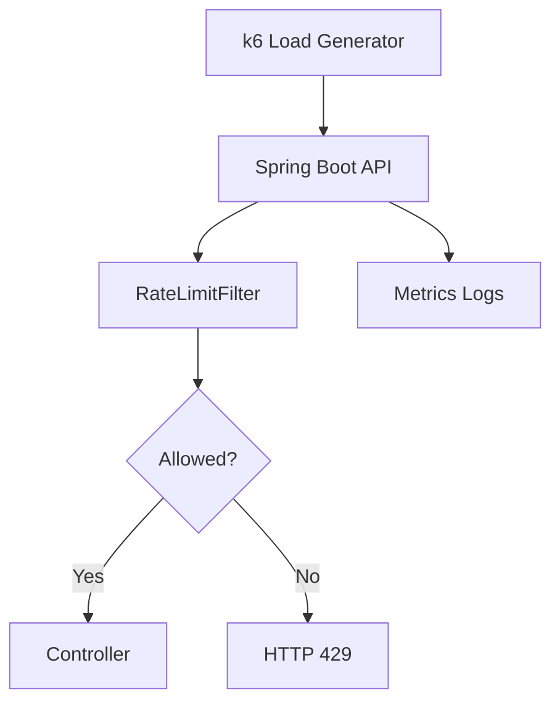
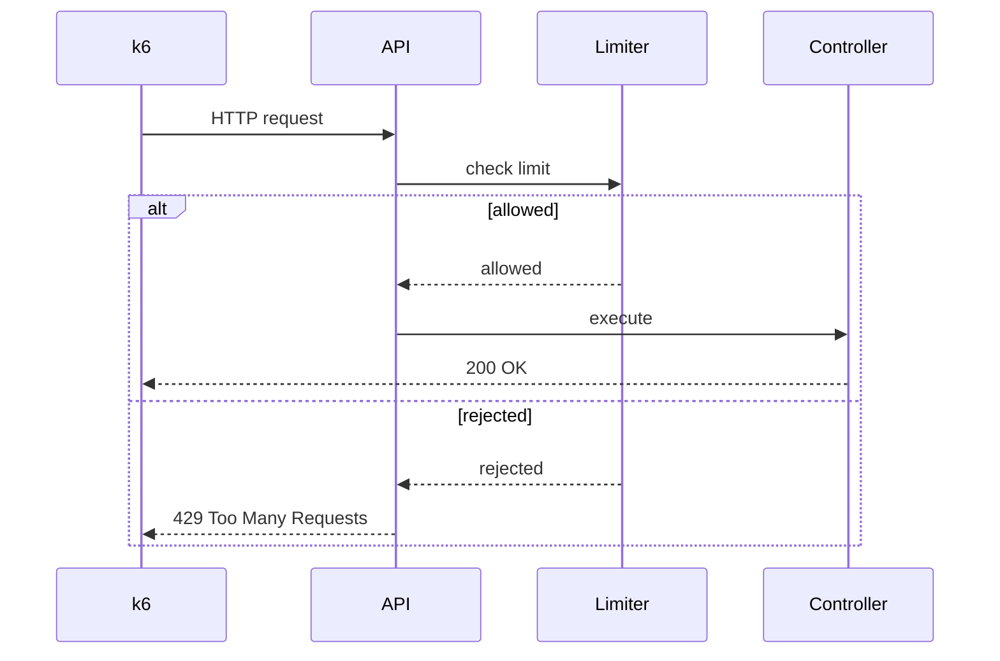
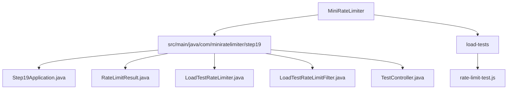

# 019_Load_Testing_With_k6

# MiniRateLimiter Step 19 — Load Testing With k6

---

# Clickable Index

1. [Goal](#goal)  
2. [Why Load Testing?](#why-load-testing)  
3. [What Is k6?](#what-is-k6)  
4. [Real World Example](#real-world-example)  
5. [Core Idea](#core-idea)  
6. [Load Test Architecture Mermaid Diagram](#load-test-architecture-mermaid-diagram)  
7. [k6 Request Flow Mermaid Diagram](#k6-request-flow-mermaid-diagram)  
8. [Detailed Steps Before Code](#detailed-steps-before-code)  
9. [CP/DSA Concepts Used](#cpdsa-concepts-used)  
10. [Time Complexity](#time-complexity)  
11. [Space Complexity](#space-complexity)  
12. [What Metrics To Watch](#what-metrics-to-watch)  
13. [Folder Structure](#folder-structure)  
14. [Folder Mermaid Diagram](#folder-mermaid-diagram)  
15. [Complete Java Code](#complete-java-code)  
16. [k6 Load Test Script](#k6-load-test-script)  
17. [Dry Run](#dry-run)  
18. [Run Commands](#run-commands)  
19. [Expected Output Pattern](#expected-output-pattern)  
20. [Important Observation](#important-observation)  
21. [Current MiniRateLimiter State](#current-miniratelimiter-state)  
22. [Step 19 Completion Checklist](#step-19-completion-checklist)  
23. [Final Mental Model](#final-mental-model)  
24. [Next Step](#next-step)  

---

# Goal

In Step 18, we built:

```text
Rate Limiter Dashboard
```

Now we test the system under load.

We use:

```text
k6
```

to simulate many users hitting our API.

Load testing helps answer:

```text
How many requests are allowed?
How many are rejected?
What is the latency?
Does limiter protect backend?
Does system behave correctly under pressure?
```

---

# Why Load Testing?

A rate limiter looks correct with 5 manual requests.

But production traffic is different:

```text
100 users
1000 users
10k requests/sec
bursts
spikes
bad clients
bots
```

Load testing validates behavior under stress.

---

# What Is k6?

k6 is a developer-friendly load testing tool.

It uses JavaScript scripts.

Example:

```javascript
http.get("http://localhost:8080/api/orders");
```

k6 reports:

```text
RPS
latency
error rate
status codes
p95 / p99 response time
```

---

# Real World Example

Before deploying a rate limiter, teams test:

```text
normal traffic
burst traffic
abuse traffic
sustained traffic
```

They check:

```text
HTTP 200 count
HTTP 429 count
latency
CPU
memory
Redis load
```

---

# Core Idea

Flow:

```text
k6 virtual users
    ->
API endpoint
    ->
rate limiter
    ->
allowed or rejected
    ->
metrics output
```

---

# Load Test Architecture Mermaid Diagram



---

# k6 Request Flow Mermaid Diagram



---

# Detailed Steps Before Code

## Step 1 — Create Spring Boot endpoint

Endpoint:

```text
GET /api/test
```

---

## Step 2 — Add simple in-memory limiter

Use a simple counter limiter for demonstration.

---

## Step 3 — Add filter

Filter applies limiter before controller.

---

## Step 4 — Add headers

Responses include:

```text
X-RateLimit-Remaining
Retry-After
```

---

## Step 5 — Write k6 script

k6 sends many requests.

---

## Step 6 — Observe output

Check:

```text
200 count
429 count
latency
request rate
```

---

# CP/DSA Concepts Used

## 1. Frequency Counter

Limiter counts requests using HashMap.

---

## 2. Simulation

k6 simulates many clients.

---

## 3. Load Distribution

Virtual users distribute requests over time.

---

## 4. Threshold Testing

Check if system stays under acceptable latency.

---

## 5. Bottleneck Detection

High latency reveals bottlenecks.

---

# Time Complexity

Limiter check:

```text
O(1)
```

per request.

---

# Space Complexity

```text
O(active identities)
```

---

# What Metrics To Watch

| Metric | Meaning |
|---|---|
| http_reqs | Total HTTP requests |
| http_req_duration | Response latency |
| http_req_failed | Failed request ratio |
| checks | Custom pass/fail checks |
| 429 count | Rejected by rate limiter |
| p95 latency | 95th percentile latency |
| p99 latency | 99th percentile latency |

---

# Folder Structure

```text
MiniRateLimiter/
└── src/main/java/com/miniratelimiter/step19/
    ├── Step19Application.java
    ├── RateLimitResult.java
    ├── LoadTestRateLimiter.java
    ├── LoadTestRateLimitFilter.java
    └── TestController.java

load-tests/
└── rate-limit-test.js
```

---

# Folder Mermaid Diagram



---

# Complete Java Code

---

# Step19Application.java

```java
package com.miniratelimiter.step19;

import org.springframework.boot.SpringApplication;
import org.springframework.boot.autoconfigure.SpringBootApplication;

/*
 * Logic:
 *
 * 1. Start Spring Boot application.
 * 2. Register controller and filter.
 * 3. Expose endpoint for k6 load testing.
 */
@SpringBootApplication
public class Step19Application {

    public static void main(String[] args) {
        SpringApplication.run(Step19Application.class, args);
    }
}
```

---

# RateLimitResult.java

```java
package com.miniratelimiter.step19;

/*
 * Logic:
 *
 * 1. Store allow/reject decision.
 * 2. Store remaining requests.
 * 3. Store retry-after seconds.
 *
 * Time Complexity:
 * O(1)
 */
public class RateLimitResult {

    private final boolean allowed;
    private final int remaining;
    private final long retryAfterSeconds;

    public RateLimitResult(boolean allowed, int remaining, long retryAfterSeconds) {
        this.allowed = allowed;
        this.remaining = remaining;
        this.retryAfterSeconds = retryAfterSeconds;
    }

    public boolean isAllowed() {
        return allowed;
    }

    public int getRemaining() {
        return remaining;
    }

    public long getRetryAfterSeconds() {
        return retryAfterSeconds;
    }
}
```

---

# LoadTestRateLimiter.java

```java
package com.miniratelimiter.step19;

import org.springframework.stereotype.Component;

import java.util.HashMap;
import java.util.Map;

/*
 * Logic:
 *
 * 1. Count requests per client IP.
 * 2. Apply fixed-window style limit.
 * 3. Return result for filter.
 *
 * NOTE:
 *
 * This demo limiter is intentionally simple.
 * Production version should use Redis.
 *
 * Time Complexity:
 * O(1)
 *
 * Space Complexity:
 * O(active IPs)
 */
@Component
public class LoadTestRateLimiter {

    private final Map<String, Integer> counters;
    private final int limit;

    public LoadTestRateLimiter() {
        this.counters = new HashMap<>();
        this.limit = 100;
    }

    public synchronized RateLimitResult allowRequest(String clientIp) {
        int count = counters.getOrDefault(clientIp, 0) + 1;

        counters.put(clientIp, count);

        boolean allowed = count <= limit;
        int remaining = Math.max(0, limit - count);
        long retryAfter = allowed ? 0 : 60;

        return new RateLimitResult(allowed, remaining, retryAfter);
    }
}
```

---

# LoadTestRateLimitFilter.java

```java
package com.miniratelimiter.step19;

import jakarta.servlet.FilterChain;
import jakarta.servlet.ServletException;
import jakarta.servlet.http.HttpServletRequest;
import jakarta.servlet.http.HttpServletResponse;

import org.springframework.stereotype.Component;
import org.springframework.web.filter.OncePerRequestFilter;

import java.io.IOException;

/*
 * Logic:
 *
 * 1. Intercept all HTTP requests.
 * 2. Extract client IP.
 * 3. Apply rate limiter.
 * 4. Add rate-limit headers.
 * 5. Return 429 if rejected.
 * 6. Continue to controller if allowed.
 *
 * Time Complexity:
 * O(1)
 */
@Component
public class LoadTestRateLimitFilter extends OncePerRequestFilter {

    private final LoadTestRateLimiter rateLimiter;

    public LoadTestRateLimitFilter(LoadTestRateLimiter rateLimiter) {
        this.rateLimiter = rateLimiter;
    }

    @Override
    protected void doFilterInternal(HttpServletRequest request, HttpServletResponse response,
                                    FilterChain filterChain) throws ServletException, IOException {
        String clientIp = request.getRemoteAddr();

        RateLimitResult result = rateLimiter.allowRequest(clientIp);

        response.setHeader("X-RateLimit-Remaining", String.valueOf(result.getRemaining()));
        response.setHeader("Retry-After", String.valueOf(result.getRetryAfterSeconds()));

        if (!result.isAllowed()) {
            response.setStatus(429);
            response.getWriter().write("Too Many Requests");
            return;
        }

        filterChain.doFilter(request, response);
    }
}
```

---

# TestController.java

```java
package com.miniratelimiter.step19;

import org.springframework.web.bind.annotation.GetMapping;
import org.springframework.web.bind.annotation.RestController;

/*
 * Logic:
 *
 * 1. Expose simple endpoint for load testing.
 * 2. Controller is reached only when limiter allows request.
 */
@RestController
public class TestController {

    @GetMapping("/api/test")
    public String test() {
        return "OK";
    }
}
```

---

# k6 Load Test Script

Create:

```text
load-tests/rate-limit-test.js
```

```javascript
import http from "k6/http";
import { check, sleep } from "k6";

export const options = {
    vus: 20,
    duration: "30s",
    thresholds: {
        http_req_duration: ["p(95)<500"],
        http_req_failed: ["rate<0.50"]
    }
};

export default function () {
    const response = http.get("http://localhost:8080/api/test");

    check(response, {
        "status is 200 or 429": (r) => r.status === 200 || r.status === 429
    });

    sleep(0.1);
}
```

---

# CP/DSA Pattern Code

## Problem

Simulate load against a counter limit.

---

## DSA/CP Java Code

```java
public class LoadTestSimulationCP {

    public static void main(String[] args) {
        int limit = 100;
        int allowed = 0;
        int rejected = 0;

        for (int request = 1; request <= 150; request++) {
            if (request <= limit) {
                allowed++;
            } else {
                rejected++;
            }
        }

        System.out.println("allowed=" + allowed);
        System.out.println("rejected=" + rejected);
    }
}
```

---

# Dry Run

Limiter:

```text
limit = 100
```

k6 sends many requests.

Expected behavior:

```text
first 100 requests from same IP -> 200
after that -> 429
```

Headers:

```text
X-RateLimit-Remaining decreases to 0
Retry-After becomes 60 after limit exceeded
```

---

# Run Commands

## Start Spring Boot

```bash
mvn spring-boot:run
```

## Run k6

```bash
k6 run load-tests/rate-limit-test.js
```

---

# Expected Output Pattern

k6 output should show:

```text
http_reqs..................... many requests
http_req_duration............. latency stats
checks........................ status is 200 or 429
```

You should see mixed responses:

```text
200 OK
429 Too Many Requests
```

after limit is exceeded.

---

# Important Observation

Load testing proves whether limiter behavior holds under pressure.

Manual testing checks logic.

Load testing checks:

```text
behavior under concurrency
latency impact
failure ratio
system protection
```

---

# Current MiniRateLimiter State

```text
Supported:
[yes] fixed window counter
[yes] sliding window log
[yes] sliding window counter
[yes] token bucket
[yes] leaky bucket
[yes] thread-safe limiter
[yes] Redis distributed limiter
[yes] Redis Lua atomic limiter
[yes] policy model
[yes] HTTP headers
[yes] Spring Boot filter
[yes] API gateway rate limiting
[yes] per-user and per-IP limits
[yes] Redis sliding window
[yes] Redis token bucket
[yes] distributed locking and consistency
[yes] metrics and monitoring
[yes] dashboard rendering
[yes] load testing with k6

Not yet:
[no] production-grade architecture
```

---

# Step 19 Completion Checklist

```text
[ ] You understand why load testing matters
[ ] You understand k6 basics
[ ] You understand VUs
[ ] You understand duration
[ ] You understand latency thresholds
[ ] You understand HTTP 200 vs 429 distribution
```

---

# Final Mental Model

```text
Load Testing =
simulate real traffic before production
```

```text
rate limiter must be correct under pressure
```

---

# Next Step

Next we build:

```text
020_Production_Grade_Rate_Limiter
```

We will combine everything into final production architecture.
