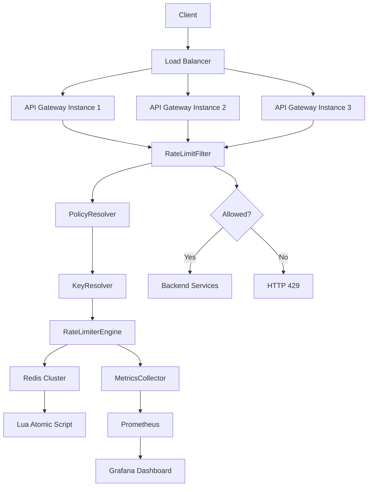
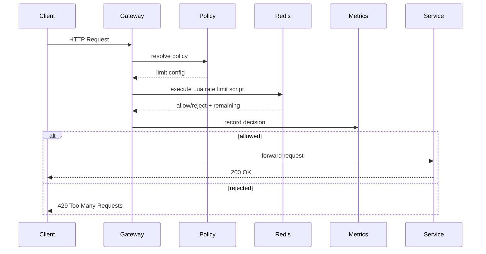
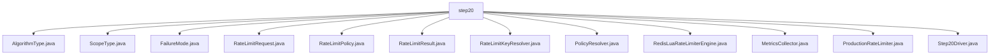

# 020_Production_Grade_Rate_Limiter

# MiniRateLimiter Step 20 — Production Grade Rate Limiter

---

# Clickable Index

1. [Goal](#goal)  
2. [What Production Grade Means](#what-production-grade-means)  
3. [Final System Architecture](#final-system-architecture)  
4. [Core Production Requirements](#core-production-requirements)  
5. [Final Architecture Mermaid Diagram](#final-architecture-mermaid-diagram)  
6. [Request Flow Mermaid Diagram](#request-flow-mermaid-diagram)  
7. [Detailed Steps Before Code](#detailed-steps-before-code)  
8. [CP/DSA Concepts Used](#cpdsa-concepts-used)  
9. [System Design Concepts Used](#system-design-concepts-used)  
10. [Time Complexity](#time-complexity)  
11. [Space Complexity](#space-complexity)  
12. [Algorithm Selection Guide](#algorithm-selection-guide)  
13. [Failure Mode Design](#failure-mode-design)  
14. [Folder Structure](#folder-structure)  
15. [Folder Mermaid Diagram](#folder-mermaid-diagram)  
16. [Complete Java Code](#complete-java-code)  
17. [Production Configuration Example](#production-configuration-example)  
18. [Dry Run](#dry-run)  
19. [Run Command](#run-command)  
20. [Expected Output Pattern](#expected-output-pattern)  
21. [Production Checklist](#production-checklist)  
22. [What You Built In 20 Phases](#what-you-built-in-20-phases)  
23. [Final Mental Model](#final-mental-model)  
24. [Next Mini System](#next-mini-system)  

---

# Goal

This is the final phase of MiniRateLimiter.

We combine everything learned:

```text
algorithms
thread safety
Redis
Lua atomicity
policy model
HTTP headers
gateway integration
metrics
dashboard
load testing
failure modes
```

into a production-grade design.

---

# What Production Grade Means

Production-grade rate limiter means:

```text
correct under concurrency
works across multiple app instances
uses shared distributed state
supports policies
returns HTTP headers
has metrics
has dashboards
handles Redis failures
is load tested
is configurable
```

It is not just an algorithm.

It is a full system component.

---

# Final System Architecture

```text
Client
  ->
Load Balancer
  ->
API Gateway
  ->
Rate Limit Filter
  ->
Policy Resolver
  ->
Key Resolver
  ->
Redis Lua Rate Limiter
  ->
Metrics Collector
  ->
Backend Service
```

Rejected requests stop at gateway:

```text
HTTP 429 Too Many Requests
```

Allowed requests continue to backend.

---

# Core Production Requirements

A production limiter should support:

```text
per user limits
per IP limits
per API key limits
per route limits
token bucket
sliding window
Redis atomic scripts
HTTP 429
Retry-After
metrics
dashboard
load testing
fail-open / fail-closed behavior
```

---

# Final Architecture Mermaid Diagram



---

# Request Flow Mermaid Diagram



---

# Detailed Steps Before Code

## Step 1 — Represent request metadata

Request contains:

```text
route
userId
clientIp
apiKey
```

---

## Step 2 — Resolve policy

Policy defines:

```text
limit
window
algorithm
scope
fail behavior
```

---

## Step 3 — Resolve limiter key

Example:

```text
USER:user-123:/payments
IP:192.168.1.10:/login
```

---

## Step 4 — Execute distributed limiter

Use Redis Lua-style atomic method.

---

## Step 5 — Build HTTP response

Add:

```text
X-RateLimit-Limit
X-RateLimit-Remaining
Retry-After
```

---

## Step 6 — Record metrics

Record:

```text
allowed
rejected
latency
key
route
```

---

## Step 7 — Handle Redis failure

Choose:

```text
fail-open
```

or:

```text
fail-closed
```

---

# CP/DSA Concepts Used

```text
HashMap
Composite Key
Frequency Counter
Sliding Window
Token Bucket
Queue
Atomic State Transition
Top-K Hot Keys
Sorting By Frequency
Concurrency Locks
```

---

# System Design Concepts Used

```text
API Gateway
Redis
Lua Scripts
Distributed State
Consistency
Backpressure
Fault Tolerance
Observability
SLO/SLA Thinking
Load Testing
Horizontal Scaling
```

---

# Time Complexity

Normal request:

```text
O(1)
```

Redis command:

```text
O(1)
```

Dashboard hot-key sorting:

```text
O(k log k)
```

where:

```text
k = number of active keys
```

---

# Space Complexity

```text
O(active identities)
```

For sliding window:

```text
O(active requests in window)
```

For token bucket:

```text
O(active identities)
```

---

# Algorithm Selection Guide

| Use Case | Best Algorithm |
|---|---|
| Simple low-scale API | Fixed Window |
| Sensitive login/OTP | Sliding Window |
| Public API burst support | Token Bucket |
| Smooth downstream traffic | Leaky Bucket |
| Multi-instance API | Redis Lua |
| High accuracy distributed | Redis Sliding Window |
| High scale burst distributed | Redis Token Bucket |

---

# Failure Mode Design

## Redis Down

Options:

```text
fail-open
fail-closed
local fallback
cached policy
```

## Fail-Open

Allow request when Redis fails.

Good for:

```text
user experience
availability
```

Risk:

```text
abuse may pass through
```

## Fail-Closed

Reject request when Redis fails.

Good for:

```text
security
financial systems
```

Risk:

```text
outage blocks users
```

## Recommended

For most APIs:

```text
fail-open for normal APIs
fail-closed for payment/login/security APIs
```

---

# Folder Structure

```text
MiniRateLimiter/
└── src/main/java/com/miniratelimiter/step20/
    ├── AlgorithmType.java
    ├── ScopeType.java
    ├── FailureMode.java
    ├── RateLimitRequest.java
    ├── RateLimitPolicy.java
    ├── RateLimitResult.java
    ├── RateLimitKeyResolver.java
    ├── PolicyResolver.java
    ├── RedisLuaRateLimiterEngine.java
    ├── MetricsCollector.java
    ├── ProductionRateLimiter.java
    └── Step20Driver.java
```

---

# Folder Mermaid Diagram



---

# Complete Java Code

---

# AlgorithmType.java

```java
package com.miniratelimiter.step20;

/*
 * Logic:
 *
 * 1. Define supported production algorithms.
 * 2. Used by policy to select limiter behavior.
 */
public enum AlgorithmType {

    FIXED_WINDOW,

    SLIDING_WINDOW,

    TOKEN_BUCKET
}
```

---

# ScopeType.java

```java
package com.miniratelimiter.step20;

/*
 * Logic:
 *
 * 1. Define identity scope.
 * 2. Scope controls key generation.
 */
public enum ScopeType {

    USER,

    IP,

    API_KEY,

    ROUTE
}
```

---

# FailureMode.java

```java
package com.miniratelimiter.step20;

/*
 * Logic:
 *
 * 1. Define behavior when Redis/limiter backend fails.
 * 2. FAIL_OPEN allows traffic.
 * 3. FAIL_CLOSED rejects traffic.
 */
public enum FailureMode {

    FAIL_OPEN,

    FAIL_CLOSED
}
```

---

# RateLimitRequest.java

```java
package com.miniratelimiter.step20;

/*
 * Logic:
 *
 * 1. Store request metadata.
 * 2. Provide fields for policy and key resolution.
 *
 * Time Complexity:
 * O(1)
 */
public class RateLimitRequest {

    private final String route;
    private final String userId;
    private final String clientIp;
    private final String apiKey;

    public RateLimitRequest(String route, String userId, String clientIp, String apiKey) {
        this.route = route;
        this.userId = userId;
        this.clientIp = clientIp;
        this.apiKey = apiKey;
    }

    public String getRoute() {
        return route;
    }

    public String getUserId() {
        return userId;
    }

    public String getClientIp() {
        return clientIp;
    }

    public String getApiKey() {
        return apiKey;
    }
}
```

---

# RateLimitPolicy.java

```java
package com.miniratelimiter.step20;

/*
 * Logic:
 *
 * 1. Store production rate limit configuration.
 * 2. Define limit, window, algorithm, scope and failure mode.
 *
 * Time Complexity:
 * O(1)
 */
public class RateLimitPolicy {

    private final String policyName;
    private final int limit;
    private final long windowSizeMillis;
    private final AlgorithmType algorithmType;
    private final ScopeType scopeType;
    private final FailureMode failureMode;

    public RateLimitPolicy(String policyName, int limit, long windowSizeMillis,
                           AlgorithmType algorithmType, ScopeType scopeType,
                           FailureMode failureMode) {
        this.policyName = policyName;
        this.limit = limit;
        this.windowSizeMillis = windowSizeMillis;
        this.algorithmType = algorithmType;
        this.scopeType = scopeType;
        this.failureMode = failureMode;
    }

    public String getPolicyName() {
        return policyName;
    }

    public int getLimit() {
        return limit;
    }

    public long getWindowSizeMillis() {
        return windowSizeMillis;
    }

    public AlgorithmType getAlgorithmType() {
        return algorithmType;
    }

    public ScopeType getScopeType() {
        return scopeType;
    }

    public FailureMode getFailureMode() {
        return failureMode;
    }
}
```

---

# RateLimitResult.java

```java
package com.miniratelimiter.step20;

/*
 * Logic:
 *
 * 1. Store allow/reject decision.
 * 2. Store remaining quota.
 * 3. Store retry-after metadata.
 * 4. Store resolved key and policy name.
 *
 * Time Complexity:
 * O(1)
 */
public class RateLimitResult {

    private final boolean allowed;
    private final String key;
    private final String policyName;
    private final int limit;
    private final int remaining;
    private final long retryAfterSeconds;

    public RateLimitResult(boolean allowed, String key, String policyName,
                           int limit, int remaining, long retryAfterSeconds) {
        this.allowed = allowed;
        this.key = key;
        this.policyName = policyName;
        this.limit = limit;
        this.remaining = remaining;
        this.retryAfterSeconds = retryAfterSeconds;
    }

    public boolean isAllowed() {
        return allowed;
    }

    public String getKey() {
        return key;
    }

    public String getPolicyName() {
        return policyName;
    }

    public int getLimit() {
        return limit;
    }

    public int getRemaining() {
        return remaining;
    }

    public long getRetryAfterSeconds() {
        return retryAfterSeconds;
    }

    @Override
    public String toString() {
        return "RateLimitResult{" +
                "allowed=" + allowed +
                ", key='" + key + '\'' +
                ", policyName='" + policyName + '\'' +
                ", limit=" + limit +
                ", remaining=" + remaining +
                ", retryAfterSeconds=" + retryAfterSeconds +
                '}';
    }
}
```

---

# RateLimitKeyResolver.java

```java
package com.miniratelimiter.step20;

/*
 * Logic:
 *
 * 1. Resolve limiter key from request + policy scope.
 * 2. Include route in key for route-specific isolation.
 *
 * Time Complexity:
 * O(1)
 */
public class RateLimitKeyResolver {

    public String resolveKey(RateLimitRequest request, RateLimitPolicy policy) {
        switch (policy.getScopeType()) {

            case USER:
                return "USER:" + request.getUserId() + ":" + request.getRoute();

            case IP:
                return "IP:" + request.getClientIp() + ":" + request.getRoute();

            case API_KEY:
                return "API_KEY:" + request.getApiKey() + ":" + request.getRoute();

            case ROUTE:
                return "ROUTE:" + request.getRoute();

            default:
                throw new IllegalArgumentException("Unsupported scope=" + policy.getScopeType());
        }
    }
}
```

---

# PolicyResolver.java

```java
package com.miniratelimiter.step20;

import java.util.HashMap;
import java.util.Map;

/*
 * Logic:
 *
 * 1. Store route -> policy.
 * 2. Resolve policy for incoming request.
 * 3. Return default policy if route-specific policy is missing.
 *
 * Time Complexity:
 * O(1)
 *
 * Space Complexity:
 * O(number of policies)
 */
public class PolicyResolver {

    private final Map<String, RateLimitPolicy> routePolicies;
    private final RateLimitPolicy defaultPolicy;

    public PolicyResolver(RateLimitPolicy defaultPolicy) {
        this.defaultPolicy = defaultPolicy;
        this.routePolicies = new HashMap<>();
    }

    public void register(String route, RateLimitPolicy policy) {
        routePolicies.put(route, policy);
    }

    public RateLimitPolicy resolve(RateLimitRequest request) {
        return routePolicies.getOrDefault(request.getRoute(), defaultPolicy);
    }
}
```

---

# RedisLuaRateLimiterEngine.java

```java
package com.miniratelimiter.step20;

import java.util.HashMap;
import java.util.Map;

/*
 * Logic:
 *
 * 1. Simulate Redis Lua fixed-window script.
 * 2. Increment key count atomically.
 * 3. Set expiration on first request.
 * 4. Return allow/reject decision with remaining quota.
 *
 * Real Redis:
 *
 * This should be implemented with EVAL Lua script.
 *
 * Time Complexity:
 * O(1)
 *
 * Space Complexity:
 * O(active keys)
 */
public class RedisLuaRateLimiterEngine {

    private final Map<String, Integer> counters;
    private final Map<String, Long> expirations;

    public RedisLuaRateLimiterEngine() {
        this.counters = new HashMap<>();
        this.expirations = new HashMap<>();
    }

    public synchronized RateLimitResult execute(String key, RateLimitPolicy policy, long currentTimeMillis) {
        cleanupIfExpired(key, currentTimeMillis);

        int count = counters.getOrDefault(key, 0) + 1;

        counters.put(key, count);

        if (count == 1) {
            expirations.put(key, currentTimeMillis + policy.getWindowSizeMillis());
        }

        boolean allowed = count <= policy.getLimit();
        int remaining = Math.max(0, policy.getLimit() - count);
        long retryAfter = allowed ? 0 : policy.getWindowSizeMillis() / 1000;

        return new RateLimitResult(
                allowed,
                key,
                policy.getPolicyName(),
                policy.getLimit(),
                remaining,
                retryAfter
        );
    }

    private void cleanupIfExpired(String key, long currentTimeMillis) {
        Long expiration = expirations.get(key);

        if (expiration == null) {
            return;
        }

        if (currentTimeMillis >= expiration) {
            counters.remove(key);
            expirations.remove(key);
        }
    }
}
```

---

# MetricsCollector.java

```java
package com.miniratelimiter.step20;

import java.util.HashMap;
import java.util.Map;

/*
 * Logic:
 *
 * 1. Track allowed/rejected counts.
 * 2. Track requests per key.
 * 3. Print simple production metrics.
 *
 * Time Complexity:
 * record: O(1)
 * print: O(number of keys)
 */
public class MetricsCollector {

    private int allowedCount;
    private int rejectedCount;
    private final Map<String, Integer> keyCounters;

    public MetricsCollector() {
        this.allowedCount = 0;
        this.rejectedCount = 0;
        this.keyCounters = new HashMap<>();
    }

    public void record(RateLimitResult result) {
        if (result.isAllowed()) {
            allowedCount++;
        } else {
            rejectedCount++;
        }

        String key = result.getKey();
        keyCounters.put(key, keyCounters.getOrDefault(key, 0) + 1);
    }

    public void printMetrics() {
        int total = allowedCount + rejectedCount;
        double rejectionRatio = total == 0 ? 0.0 : (double) rejectedCount / total;

        System.out.println("allowedCount=" + allowedCount);
        System.out.println("rejectedCount=" + rejectedCount);
        System.out.println("totalRequests=" + total);
        System.out.println("rejectionRatio=" + rejectionRatio);
        System.out.println("keyCounters=" + keyCounters);
    }
}
```

---

# ProductionRateLimiter.java

```java
package com.miniratelimiter.step20;

/*
 * Logic:
 *
 * 1. Resolve policy for request.
 * 2. Resolve limiter key.
 * 3. Execute Redis Lua limiter engine.
 * 4. Record metrics.
 * 5. Apply failure mode if backend fails.
 *
 * Time Complexity:
 * O(1)
 *
 * Space Complexity:
 * O(active keys)
 */
public class ProductionRateLimiter {

    private final PolicyResolver policyResolver;
    private final RateLimitKeyResolver keyResolver;
    private final RedisLuaRateLimiterEngine limiterEngine;
    private final MetricsCollector metricsCollector;

    public ProductionRateLimiter(PolicyResolver policyResolver,
                                 RateLimitKeyResolver keyResolver,
                                 RedisLuaRateLimiterEngine limiterEngine,
                                 MetricsCollector metricsCollector) {
        this.policyResolver = policyResolver;
        this.keyResolver = keyResolver;
        this.limiterEngine = limiterEngine;
        this.metricsCollector = metricsCollector;
    }

    public RateLimitResult allowRequest(RateLimitRequest request, long currentTimeMillis) {
        RateLimitPolicy policy = policyResolver.resolve(request);
        String key = keyResolver.resolveKey(request, policy);

        try {
            RateLimitResult result = limiterEngine.execute(key, policy, currentTimeMillis);

            metricsCollector.record(result);

            return result;

        } catch (RuntimeException exception) {
            return handleFailure(policy, key);
        }
    }

    private RateLimitResult handleFailure(RateLimitPolicy policy, String key) {
        boolean allowed = policy.getFailureMode() == FailureMode.FAIL_OPEN;

        RateLimitResult result = new RateLimitResult(
                allowed,
                key,
                policy.getPolicyName(),
                policy.getLimit(),
                allowed ? policy.getLimit() : 0,
                allowed ? 0 : 60
        );

        metricsCollector.record(result);

        return result;
    }
}
```

---

# Step20Driver.java

```java
package com.miniratelimiter.step20;

/*
 * Logic:
 *
 * 1. Create production policies.
 * 2. Register route-specific policies.
 * 3. Create production limiter pipeline.
 * 4. Send requests through final limiter.
 * 5. Print decisions and metrics.
 */
public class Step20Driver {

    public static void main(String[] args) {
        RateLimitPolicy defaultPolicy = new RateLimitPolicy(
                "default-policy",
                5,
                60_000,
                AlgorithmType.FIXED_WINDOW,
                ScopeType.IP,
                FailureMode.FAIL_OPEN
        );

        RateLimitPolicy paymentPolicy = new RateLimitPolicy(
                "payment-policy",
                3,
                60_000,
                AlgorithmType.FIXED_WINDOW,
                ScopeType.USER,
                FailureMode.FAIL_CLOSED
        );

        PolicyResolver policyResolver = new PolicyResolver(defaultPolicy);
        policyResolver.register("/payments", paymentPolicy);

        ProductionRateLimiter limiter = new ProductionRateLimiter(
                policyResolver,
                new RateLimitKeyResolver(),
                new RedisLuaRateLimiterEngine(),
                new MetricsCollector()
        );

        RateLimitRequest request = new RateLimitRequest(
                "/payments",
                "user-123",
                "192.168.1.10",
                "api-key-abc"
        );

        System.out.println("---- PRODUCTION RATE LIMITER ----");

        for (int i = 1; i <= 5; i++) {
            RateLimitResult result = limiter.allowRequest(request, 0);

            System.out.println("request=" + i + ", result=" + result);
        }
    }
}
```

---

# Production Configuration Example

```yaml
rateLimiter:
  defaultPolicy:
    algorithm: FIXED_WINDOW
    scope: IP
    limit: 100
    windowSeconds: 60
    failureMode: FAIL_OPEN

  routes:
    /payments:
      algorithm: TOKEN_BUCKET
      scope: USER
      limit: 20
      windowSeconds: 60
      failureMode: FAIL_CLOSED

    /login:
      algorithm: SLIDING_WINDOW
      scope: IP
      limit: 5
      windowSeconds: 60
      failureMode: FAIL_CLOSED
```

---

# Dry Run

Payment policy:

```text
limit = 3
scope = USER
route = /payments
```

Resolved key:

```text
USER:user-123:/payments
```

Requests:

```text
1 -> allowed
2 -> allowed
3 -> allowed
4 -> rejected
5 -> rejected
```

---

# Run Command

```bash
javac -d out src/main/java/com/miniratelimiter/step20/*.java

java -cp out com.miniratelimiter.step20.Step20Driver
```

---

# Expected Output Pattern

```text
---- PRODUCTION RATE LIMITER ----
request=1, result=RateLimitResult{allowed=true, key='USER:user-123:/payments', policyName='payment-policy', limit=3, remaining=2, retryAfterSeconds=0}
request=2, result=RateLimitResult{allowed=true, key='USER:user-123:/payments', policyName='payment-policy', limit=3, remaining=1, retryAfterSeconds=0}
request=3, result=RateLimitResult{allowed=true, key='USER:user-123:/payments', policyName='payment-policy', limit=3, remaining=0, retryAfterSeconds=0}
request=4, result=RateLimitResult{allowed=false, key='USER:user-123:/payments', policyName='payment-policy', limit=3, remaining=0, retryAfterSeconds=60}
```

---

# Production Checklist

```text
[ ] Redis Lua script implemented
[ ] Redis cluster configured
[ ] Timeout configured
[ ] Fail-open/fail-closed configured
[ ] Per-route policies configured
[ ] Per-user/IP/API-key scopes supported
[ ] Retry-After headers returned
[ ] Metrics exposed
[ ] Dashboard created
[ ] k6 load test passed
[ ] Alerts configured
[ ] Hot keys monitored
[ ] Redis latency monitored
[ ] Rejection ratio monitored
```

---

# What You Built In 20 Phases

```text
001 Fixed Window Counter
002 Sliding Window Log
003 Sliding Window Counter
004 Token Bucket
005 Leaky Bucket
006 Thread Safe RateLimiter
007 Redis Distributed RateLimiter
008 Redis Lua Atomic RateLimiter
009 Rate Limit Policy Model
010 HTTP Rate Limit Headers
011 Spring Boot Filter Integration
012 API Gateway RateLimiter
013 Per User And Per IP Limits
014 Redis Sliding Window
015 Redis Token Bucket
016 Distributed Locking And Consistency
017 Metrics And Monitoring
018 Rate Limiter Dashboard
019 Load Testing With k6
020 Production Grade RateLimiter
```

---

# Final Mental Model

```text
Production Rate Limiter =
algorithm + distributed state + policy + gateway + metrics + failure handling
```

It is not only:

```text
if count > limit reject
```

It is a full backend infrastructure component.

---

# Next Mini System

Recommended next mini systems:

```text
MiniRedis
MiniGateway
MiniScheduler
MiniSearchEngine
MiniS3
MiniDynamo
MiniRaft
```

Best immediate next step:

```text
MiniRedis
```

because it directly strengthens:

```text
rate limiter
cache
distributed counters
TTL
eviction
persistence
```
