# Senior Backend Interview Quick Reference: LLD + HLD + Project Deep Dive

> For FAANG-style senior backend interviews, including Google, Microsoft, CrowdStrike, PayPal, and similar product/platform companies.  
> Style: visual-first, compact explanations, practical trade-offs, small Java snippets.

---

## Clickable Index

### Interview Flow
1. [How to Use This Guide](#how-to-use-this-guide)
2. [Universal Interview Checklist](#universal-interview-checklist)
3. [Senior Backend Evaluation Rubric](#senior-backend-evaluation-rubric)
4. [Project Deep-Dive Template](#project-deep-dive-template)

### HLD / System Design
5. [HLD System Design Framework](#hld-system-design-framework)
6. [System Design Visual Template](#system-design-visual-template)
7. [Requirements Checklist](#requirements-checklist)
8. [API Design Checklist](#api-design-checklist)
9. [Database Design Checklist](#database-design-checklist)
10. [Caching Checklist](#caching-checklist)
11. [Async Messaging Checklist](#async-messaging-checklist)
12. [Scaling Checklist](#scaling-checklist)
13. [Reliability Checklist](#reliability-checklist)
14. [Security Checklist](#security-checklist)
15. [Observability Checklist](#observability-checklist)
16. [Common HLD Problems](#common-hld-problems)

### LLD / Object-Oriented Design
17. [LLD Interview Framework](#lld-interview-framework)
18. [LLD Visual Template](#lld-visual-template)
19. [SOLID Principles](#solid-principles)
20. [Design Patterns Quick Reference](#design-patterns-quick-reference)
21. [Concurrency Checklist](#concurrency-checklist)
22. [Common LLD Problems](#common-lld-problems)

### Java Snippets
23. [Java Snippet: Strategy Pattern](#java-snippet-strategy-pattern)
24. [Java Snippet: Factory Pattern](#java-snippet-factory-pattern)
25. [Java Snippet: Thread-Safe Rate Limiter](#java-snippet-thread-safe-rate-limiter)
26. [Java Snippet: Idempotency Store](#java-snippet-idempotency-store)
27. [Java Snippet: Outbox Event Model](#java-snippet-outbox-event-model)
28. [Java Snippet: Retry With Backoff](#java-snippet-retry-with-backoff)

### Company Focus
29. [Google-Style Focus](#google-style-focus)
30. [Microsoft-Style Focus](#microsoft-style-focus)
31. [CrowdStrike-Style Focus](#crowdstrike-style-focus)
32. [PayPal-Style Focus](#paypal-style-focus)

### Final Prep
33. [One-Day Revision Plan](#one-day-revision-plan)
34. [Last 15-Minute Checklist](#last-15-minute-checklist)
35. [Common Mistakes to Avoid](#common-mistakes-to-avoid)

---

# How to Use This Guide

Use this as a quick interview reference:

```text
HLD round     -> Requirements -> APIs -> Data -> Architecture -> Scale -> Failure -> Trade-offs
LLD round     -> Entities -> Relationships -> Interfaces -> Patterns -> Thread safety -> Tests
Project round -> Context -> Your ownership -> Architecture -> Decisions -> Metrics -> Incidents
```

For each interview answer, show:

```text
Problem -> Options -> Chosen Solution -> Trade-offs -> Failure Handling -> Metrics
```

---

# Universal Interview Checklist

| Area | Must Cover | Senior Signal |
|---|---|---|
| Requirements | Functional + non-functional | You clarify ambiguity before designing |
| Scale | QPS, DAU, storage, latency | You estimate and design accordingly |
| API | REST/gRPC, schema, errors | Idempotency, pagination, versioning |
| Data | SQL/NoSQL, indexes, partitioning | Consistency + data lifecycle |
| Cache | What, where, TTL, invalidation | Avoid stale data bugs |
| Async | Queue/stream, retry, DLQ | Backpressure + ordering |
| Reliability | Retry, timeout, circuit breaker | Graceful degradation |
| Security | AuthN/AuthZ, encryption, secrets | Least privilege + audit |
| Observability | Logs, metrics, traces, alerts | SLO-driven thinking |
| Trade-offs | Compare options | You explain why, not just what |

---

# Senior Backend Evaluation Rubric

| Level | Interviewer Looks For |
|---|---|
| Mid-level | Can implement features and explain basic design |
| Senior | Owns ambiguous systems, makes trade-offs, handles scale/failure |
| Staff-like | Influences architecture, simplifies systems, mentors, drives reliability |

Senior answers should include:
- ownership
- trade-offs
- failure modes
- metrics
- operational concerns
- maintainability
- team impact

---

# Project Deep-Dive Template

Prepare 2–3 projects using this format.

```text
1. Problem
2. Business impact
3. Scale
4. Architecture
5. Your personal ownership
6. Hardest technical decision
7. Failure/incident
8. Metrics improved
9. What you would redesign now
```

## Project Deep-Dive Visual

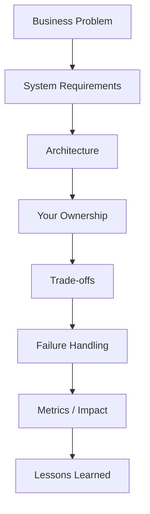

## Strong Project Story Example

| Question | Good Answer Shape |
|---|---|
| What did you build? | "I built X to solve Y for Z users." |
| What was hard? | "The hard part was scale/consistency/failure." |
| What did you own? | "I owned design, APIs, rollout, monitoring." |
| What changed? | "Latency dropped 40%, cost dropped 25%, incidents reduced." |
| What would you improve? | "I would simplify X and add Y because..." |

---

# HLD System Design Framework

Use this order in every system design interview.

```text
1. Clarify requirements
2. Estimate scale
3. Define APIs
4. Define data model
5. Draw high-level architecture
6. Deep dive into bottlenecks
7. Discuss consistency/reliability/security
8. Summarize trade-offs
```

## HLD Answer Script

```text
Let me first clarify the functional and non-functional requirements.
Then I’ll propose APIs and data model.
After that I’ll draw the high-level architecture.
Finally, I’ll deep dive into scaling, reliability, consistency, and trade-offs.
```

---

# System Design Visual Template

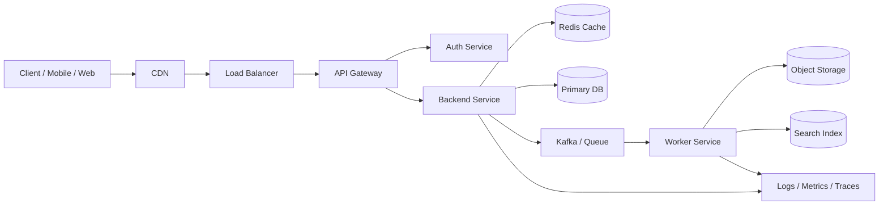

## Component Responsibility Table

| Component | Responsibility | Common Tech |
|---|---|---|
| CDN | Static content, edge caching | CloudFront, Akamai |
| Load Balancer | Traffic distribution | ALB, NGINX, Envoy |
| API Gateway | Routing, auth, throttling | Kong, Apigee, AWS API Gateway |
| Service | Business logic | Java/Spring Boot, Go, Node |
| Cache | Low-latency reads | Redis, Memcached |
| DB | Source of truth | PostgreSQL, MySQL, DynamoDB |
| Queue/Stream | Async processing | Kafka, SQS, RabbitMQ, Pub/Sub |
| Object Store | Files/blobs | S3, GCS, Azure Blob |
| Search | Full-text lookup | Elasticsearch, OpenSearch |
| Observability | Debug and alert | Prometheus, Grafana, ELK, Datadog |

---

# Requirements Checklist

## Functional Requirements

Ask:
- What should users do?
- Who are the users?
- What are the core workflows?
- What is out of scope?

Example:

```text
For a payment system:
- Create payment
- Confirm payment
- Refund payment
- Query payment status
- Send webhook/event
```

## Non-Functional Requirements

| Requirement | Questions |
|---|---|
| Scale | How many users/QPS/events per day? |
| Latency | p95/p99 target? |
| Availability | 99.9% or 99.99%? |
| Consistency | Strong or eventual? |
| Durability | Can data loss happen? |
| Security | PII/payment/security concerns? |
| Compliance | PCI, GDPR, audit? |
| Cost | Optimize for cost or speed? |

---

# API Design Checklist

## REST Example

```http
POST /v1/payments
Idempotency-Key: abc-123

{
  "userId": "u1",
  "amount": 2500,
  "currency": "USD",
  "paymentMethodId": "pm_123"
}
```

```http
GET /v1/payments/{paymentId}
```

## API Design Table

| Concern | Best Practice |
|---|---|
| Idempotency | Use `Idempotency-Key` for create/payment/order APIs |
| Pagination | Cursor pagination for large datasets |
| Versioning | `/v1/` or compatible schema evolution |
| Errors | Standard error body with code/message/requestId |
| Auth | OAuth2/JWT/mTLS depending on service |
| Validation | Validate at boundary |
| Rate limiting | Per user/IP/API key |
| Timeout | Always define client/server timeout |

## Standard Error Body

```json
{
  "errorCode": "PAYMENT_ALREADY_PROCESSED",
  "message": "Payment was already processed.",
  "requestId": "req-123"
}
```

---

# Database Design Checklist

## SQL vs NoSQL

| Choice | Use When | Avoid When |
|---|---|---|
| PostgreSQL/MySQL | Transactions, joins, strong consistency | Massive write scale without sharding |
| DynamoDB/Cassandra | High scale key-value access | Complex joins/ad-hoc queries |
| MongoDB | Flexible documents | Strong relational integrity required |
| Elasticsearch | Search/filter/ranking | Source of truth |
| Redis | Cache/session/rate limits | Durable source of truth |

## Schema Design Questions

```text
- What is the primary access pattern?
- What are the indexes?
- What is the partition key?
- What is the data retention period?
- What consistency is needed?
- Is this read-heavy or write-heavy?
```

## Example Payment Tables

```sql
payments(
  payment_id PK,
  user_id,
  amount,
  currency,
  status,
  idempotency_key UNIQUE,
  created_at,
  updated_at
)

ledger_entries(
  entry_id PK,
  payment_id,
  account_id,
  debit_amount,
  credit_amount,
  created_at
)
```

## Index Checklist

| Query | Index |
|---|---|
| Get by ID | Primary key |
| User history | `(user_id, created_at DESC)` |
| Idempotency lookup | Unique index on `idempotency_key` |
| Status worker scan | `(status, updated_at)` |

---

# Caching Checklist

## Cache-Aside Pattern

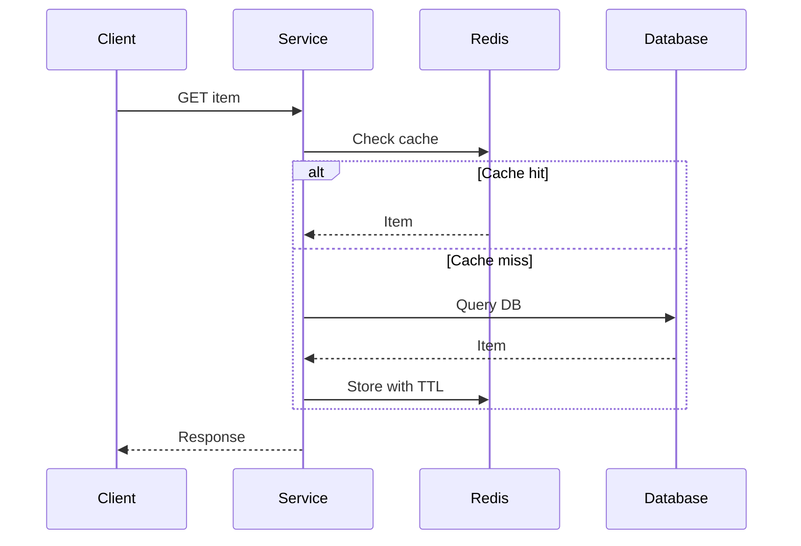

## Caching Trade-offs

| Pattern | Pros | Cons |
|---|---|---|
| Cache-aside | Simple, common | Cache miss hits DB |
| Write-through | Cache always updated | Higher write latency |
| Write-behind | Fast writes | Risk of data loss |
| Read-through | App simpler | Cache layer complexity |

## Cache Rules

```text
Cache data that is:
- frequently read
- expensive to compute
- acceptable to be slightly stale

Do not cache:
- highly sensitive data without encryption
- rapidly changing data with strict consistency
- low-read data
```

## Cache Invalidation Options

| Option | Use When | Risk |
|---|---|---|
| TTL | Simple stale tolerance | Temporary stale reads |
| Delete on write | Common for DB updates | Race conditions |
| Versioned keys | Stronger correctness | More storage |
| Event-based invalidation | Distributed services | Event delay/failure |

---

# Async Messaging Checklist

## Queue vs Stream

| Option | Use When | Examples |
|---|---|---|
| Queue | Task distribution, each message handled once | SQS, RabbitMQ |
| Stream | Event log, replay, multiple consumers | Kafka, Pub/Sub |
| DLQ | Failed messages need inspection | SQS DLQ, Kafka DLQ topic |

## Event-Driven Visual

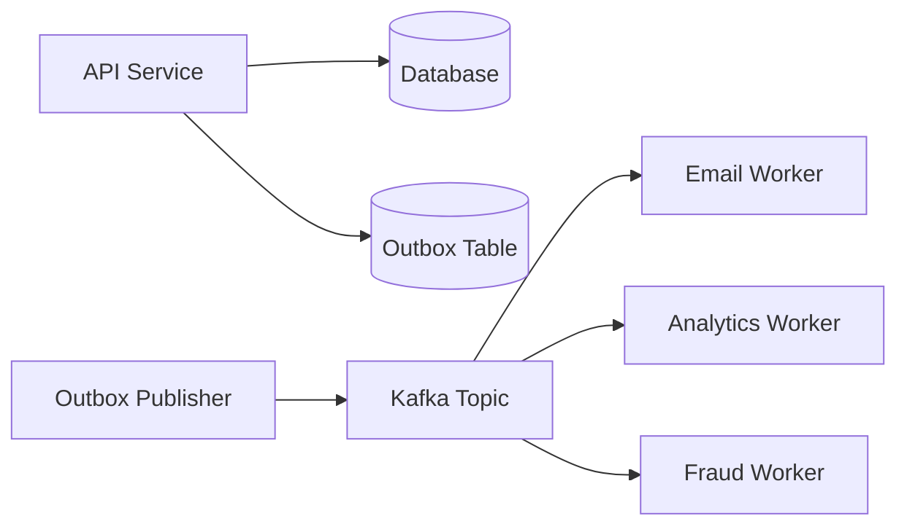

## Messaging Checklist

```text
- Message schema
- Ordering requirements
- Partition key
- Retry policy
- DLQ policy
- Consumer idempotency
- Backpressure
- Monitoring lag
```

## Kafka Partition Key Examples

| Use Case | Partition Key |
|---|---|
| Payment events | `paymentId` |
| User timeline | `userId` |
| File scan events | `fileHash` |
| Order events | `orderId` |

---

# Scaling Checklist

## Common Scaling Moves

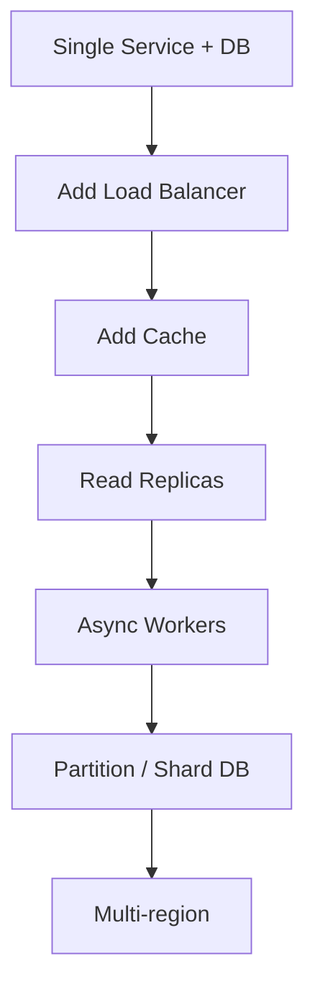

| Bottleneck | Solution |
|---|---|
| Read-heavy DB | Cache, read replicas |
| Write-heavy DB | Sharding, batching, async writes |
| Slow external API | Timeout, retry, circuit breaker |
| Large files | Object storage + async processing |
| Hot partition | Better partition key, salting |
| High fanout | Async fanout, precompute, pagination |

---

# Reliability Checklist

## Failure Handling Table

| Failure | Mitigation |
|---|---|
| Service down | Load balancing, replicas |
| DB down | Failover, backups, read-only mode |
| Queue lag | Autoscale consumers, backpressure |
| External API slow | Timeout, retry, circuit breaker |
| Duplicate request | Idempotency key |
| Partial failure | Saga/outbox/compensation |
| Poison message | DLQ |

## Timeout + Retry + Circuit Breaker

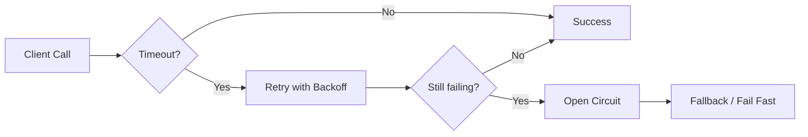

## Golden Rules

```text
- Every network call needs timeout.
- Every retry needs max attempts.
- Every retry should be safe or idempotent.
- Every async workflow needs DLQ.
- Every critical state transition needs auditability.
```

---

# Security Checklist

| Area | Checklist |
|---|---|
| Authentication | OAuth2, JWT, mTLS |
| Authorization | RBAC/ABAC, least privilege |
| Data protection | TLS in transit, encryption at rest |
| Secrets | Vault/KMS, no secrets in code |
| Input validation | Prevent injection, SSRF, path traversal |
| Audit | Who did what and when |
| Payment/security | PCI awareness, tokenization |
| APIs | Rate limiting, request signing, replay protection |

---

# Observability Checklist

## Three Pillars

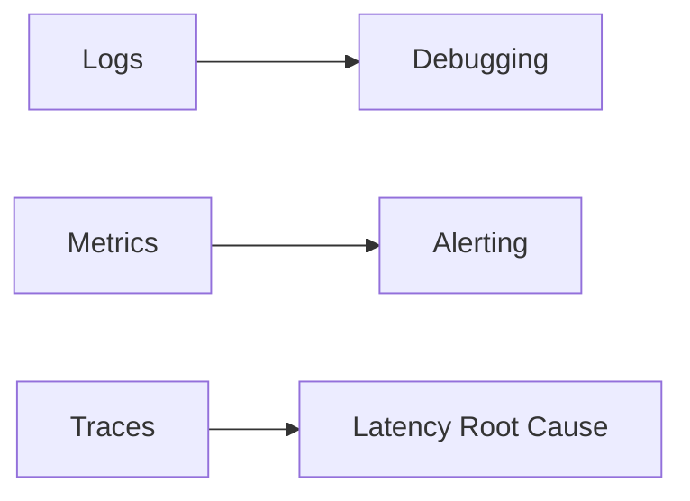

## What to Measure

| Metric | Why |
|---|---|
| QPS | Traffic level |
| p95/p99 latency | User experience |
| Error rate | Reliability |
| Saturation | CPU/memory/thread pool |
| Queue lag | Async health |
| Cache hit rate | Cache effectiveness |
| DB slow queries | Bottleneck detection |
| DLQ count | Broken workflows |

## Useful Logs

```text
requestId
userId
paymentId/orderId
status
latencyMs
errorCode
dependencyName
retryAttempt
```

---

# Common HLD Problems

| Problem | Key Topics |
|---|---|
| URL Shortener | Hashing, DB, cache, redirects |
| Rate Limiter | Redis, token bucket, sliding window |
| Notification System | Fanout, queues, preferences |
| Payment System | Idempotency, ledger, consistency |
| File Upload/Scan | Object store, async scan, security |
| News Feed | Fanout read/write, ranking, cache |
| Search Autocomplete | Trie/search index, prefix queries |
| Logging Pipeline | Kafka, batching, storage, query |
| Ticket Booking | Locking, seat reservation, expiry |
| Fraud Detection | Streaming, feature store, low latency |

---

# LLD Interview Framework

Use this order:

```text
1. Clarify requirements
2. Identify entities
3. Define relationships
4. Define interfaces
5. Pick design patterns
6. Handle concurrency
7. Handle errors
8. Add tests
9. Discuss extensibility
```

## LLD Answer Script

```text
I’ll first model the core entities and interactions.
Then I’ll define interfaces so the system is extensible.
After that I’ll discuss concurrency, edge cases, and testing.
```

---

# LLD Visual Template

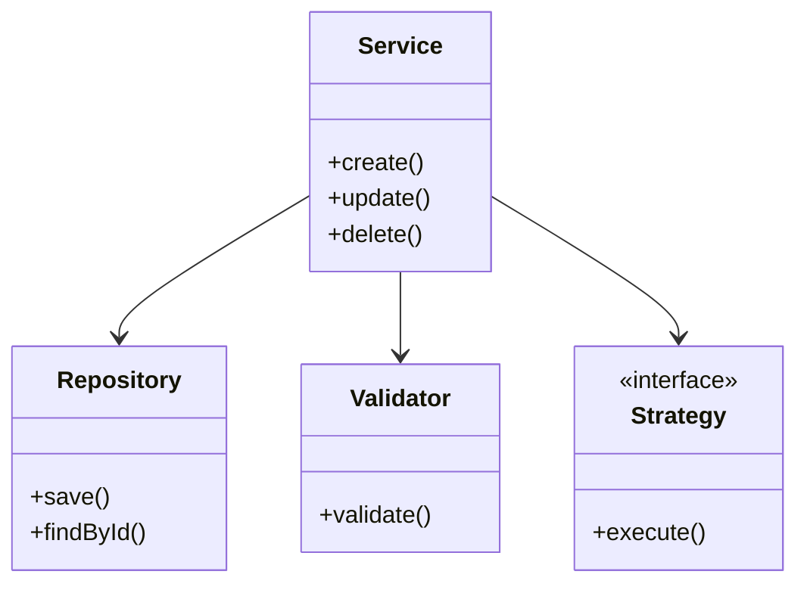

---

# SOLID Principles

| Principle | Meaning | Interview Example |
|---|---|---|
| S | Single Responsibility | PaymentService should not send emails directly |
| O | Open/Closed | Add new payment methods via interface |
| L | Liskov Substitution | Subclasses should not break parent behavior |
| I | Interface Segregation | Small interfaces instead of huge ones |
| D | Dependency Inversion | Depend on abstractions, not concrete classes |

---

# Design Patterns Quick Reference

| Pattern | Use When | Example |
|---|---|---|
| Strategy | Multiple interchangeable algorithms | Payment method, pricing rule |
| Factory | Object creation logic varies | Create parser/payment processor |
| Builder | Complex object creation | Request/config objects |
| Observer | Event notification | Order status listeners |
| Adapter | Integrate external systems | Payment gateway wrapper |
| Decorator | Add behavior dynamically | Logging/retry wrapper |
| Command | Encapsulate operations | Undo/redo, job execution |
| State | Object behavior changes by state | Order/payment lifecycle |

## Pattern Decision Tree

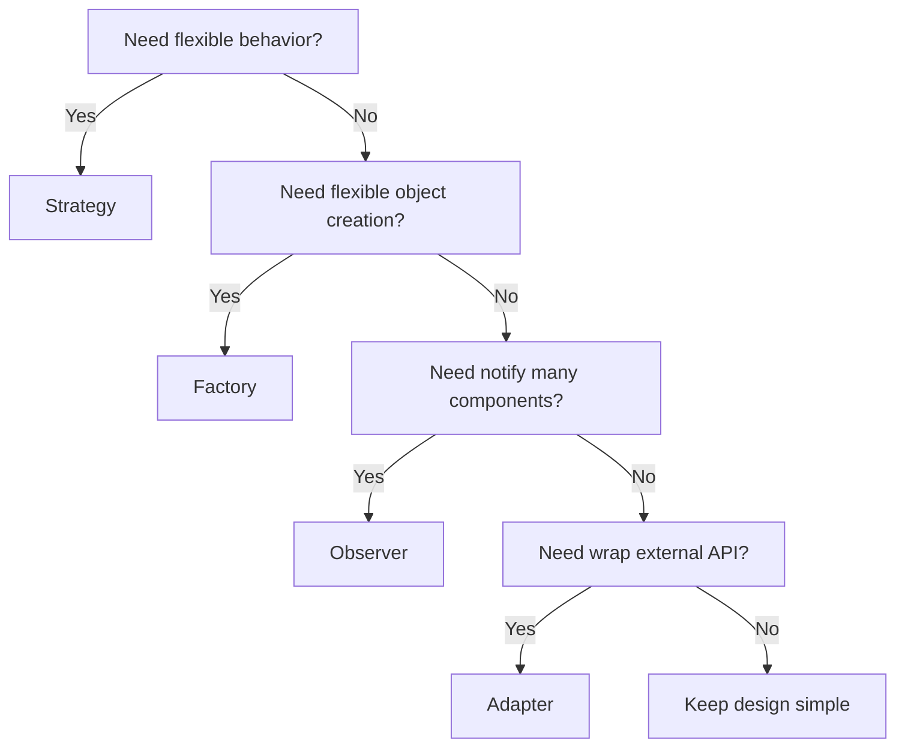

---

# Concurrency Checklist

| Problem | Java Tool |
|---|---|
| Shared mutable state | `synchronized`, `Lock`, `Atomic*` |
| Thread-safe map | `ConcurrentHashMap` |
| Async tasks | `CompletableFuture`, ExecutorService |
| Rate limiting | Atomic counters, Redis |
| Producer-consumer | BlockingQueue |
| Read-heavy lock | ReadWriteLock |
| Scheduled cleanup | ScheduledExecutorService |

## Concurrency Interview Rules

```text
- Avoid shared mutable state where possible.
- Prefer immutable objects.
- Use ConcurrentHashMap over HashMap for concurrent access.
- Make compound operations atomic.
- Always discuss race conditions.
```

---

# Common LLD Problems

| Problem | Core Objects | Patterns |
|---|---|---|
| Parking Lot | Vehicle, Spot, Ticket, Gate | Strategy, Factory |
| Elevator | Elevator, Request, Scheduler | Strategy, State |
| Rate Limiter | Rule, Bucket, UserLimit | Strategy |
| Logger | Logger, Appender, Formatter | Chain, Strategy |
| Splitwise | User, Expense, Balance | Strategy |
| Chess | Board, Piece, Move | Strategy, State |
| Payment | Payment, Processor, Gateway | Strategy, Adapter |
| Notification | Channel, Template, UserPref | Strategy, Observer |
| File Scanner | File, ScanJob, Engine | Strategy, Pipeline |

---

# Java Snippet: Strategy Pattern

Use for payment methods, pricing algorithms, routing policies, scan engines.

```java
interface PaymentStrategy {
    PaymentResult pay(PaymentRequest request);
}

class CardPaymentStrategy implements PaymentStrategy {
    public PaymentResult pay(PaymentRequest request) {
        // call card gateway
        return new PaymentResult("SUCCESS");
    }
}

class PaypalPaymentStrategy implements PaymentStrategy {
    public PaymentResult pay(PaymentRequest request) {
        // call PayPal gateway
        return new PaymentResult("SUCCESS");
    }
}

class PaymentService {
    private final Map<String, PaymentStrategy> strategies;

    PaymentService(Map<String, PaymentStrategy> strategies) {
        this.strategies = strategies;
    }

    PaymentResult process(String method, PaymentRequest request) {
        PaymentStrategy strategy = strategies.get(method);
        if (strategy == null) {
            throw new IllegalArgumentException("Unsupported payment method");
        }
        return strategy.pay(request);
    }
}

record PaymentRequest(String userId, long amountInCents, String currency) {}
record PaymentResult(String status) {}
```

Why this is good:
- Easy to add new payment methods.
- Avoids large `if/else`.
- Test each strategy independently.

---

# Java Snippet: Factory Pattern

Use when object creation depends on type.

```java
interface NotificationSender {
    void send(String userId, String message);
}

class EmailSender implements NotificationSender {
    public void send(String userId, String message) {
        System.out.println("Email sent: " + message);
    }
}

class SmsSender implements NotificationSender {
    public void send(String userId, String message) {
        System.out.println("SMS sent: " + message);
    }
}

class NotificationSenderFactory {
    public NotificationSender create(String channel) {
        return switch (channel.toUpperCase()) {
            case "EMAIL" -> new EmailSender();
            case "SMS" -> new SmsSender();
            default -> throw new IllegalArgumentException("Unknown channel: " + channel);
        };
    }
}
```

Trade-off:
- Simple factory is easy.
- For large systems, prefer dependency injection instead of creating objects manually.

---

# Java Snippet: Thread-Safe Rate Limiter

Simple in-memory token bucket for interview use.

```java
import java.time.Instant;
import java.util.concurrent.ConcurrentHashMap;

class TokenBucketRateLimiter {
    private static class Bucket {
        long tokens;
        long lastRefillMillis;

        Bucket(long tokens, long lastRefillMillis) {
            this.tokens = tokens;
            this.lastRefillMillis = lastRefillMillis;
        }
    }

    private final long capacity;
    private final long refillTokensPerSecond;
    private final ConcurrentHashMap<String, Bucket> buckets = new ConcurrentHashMap<>();

    TokenBucketRateLimiter(long capacity, long refillTokensPerSecond) {
        this.capacity = capacity;
        this.refillTokensPerSecond = refillTokensPerSecond;
    }

    public boolean allow(String userId) {
        long now = Instant.now().toEpochMilli();

        Bucket bucket = buckets.computeIfAbsent(
            userId,
            id -> new Bucket(capacity, now)
        );

        synchronized (bucket) {
            refill(bucket, now);
            if (bucket.tokens > 0) {
                bucket.tokens--;
                return true;
            }
            return false;
        }
    }

    private void refill(Bucket bucket, long nowMillis) {
        long elapsedMillis = nowMillis - bucket.lastRefillMillis;
        long tokensToAdd = (elapsedMillis * refillTokensPerSecond) / 1000;

        if (tokensToAdd > 0) {
            bucket.tokens = Math.min(capacity, bucket.tokens + tokensToAdd);
            bucket.lastRefillMillis = nowMillis;
        }
    }
}
```

For distributed production:
- Use Redis.
- Use Lua script for atomicity.
- Use TTL to clean inactive users.

---

# Java Snippet: Idempotency Store

Useful for payment/order APIs.

```java
import java.util.concurrent.ConcurrentHashMap;

class IdempotencyStore {
    private final ConcurrentHashMap<String, String> requestToResponse = new ConcurrentHashMap<>();

    public String executeOnce(String idempotencyKey, java.util.function.Supplier<String> operation) {
        return requestToResponse.computeIfAbsent(idempotencyKey, key -> operation.get());
    }
}

class PaymentController {
    private final IdempotencyStore store = new IdempotencyStore();

    public String createPayment(String idempotencyKey) {
        return store.executeOnce(idempotencyKey, () -> {
            // create payment only once
            return "payment_123";
        });
    }
}
```

Production version:
- Store key in DB or Redis.
- Add request hash to prevent key reuse with different payload.
- Add TTL.
- Persist full response or final resource ID.

---

# Java Snippet: Outbox Event Model

Use when DB update and event publish must be reliable.

```java
record Payment(
    String paymentId,
    String status,
    long amountInCents
) {}

record OutboxEvent(
    String eventId,
    String aggregateId,
    String eventType,
    String payload,
    String status
) {}

class PaymentService {
    private final PaymentRepository paymentRepository;
    private final OutboxRepository outboxRepository;

    PaymentService(PaymentRepository paymentRepository, OutboxRepository outboxRepository) {
        this.paymentRepository = paymentRepository;
        this.outboxRepository = outboxRepository;
    }

    // In production this should run in one DB transaction.
    public void markPaymentSuccess(String paymentId) {
        Payment payment = new Payment(paymentId, "SUCCESS", 1000);
        paymentRepository.save(payment);

        OutboxEvent event = new OutboxEvent(
            "evt-" + paymentId,
            paymentId,
            "PAYMENT_SUCCESS",
            "{ \"paymentId\": \"" + paymentId + "\" }",
            "PENDING"
        );
        outboxRepository.save(event);
    }
}

interface PaymentRepository {
    void save(Payment payment);
}

interface OutboxRepository {
    void save(OutboxEvent event);
}
```

Outbox flow:

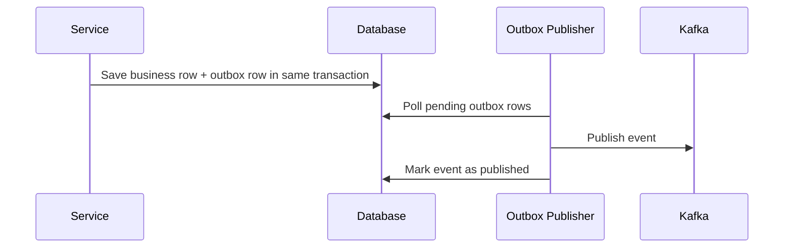

---

# Java Snippet: Retry With Backoff

```java
class RetryUtils {
    public static <T> T retry(
        java.util.function.Supplier<T> operation,
        int maxAttempts,
        long initialBackoffMillis
    ) {
        RuntimeException lastException = null;

        for (int attempt = 1; attempt <= maxAttempts; attempt++) {
            try {
                return operation.get();
            } catch (RuntimeException ex) {
                lastException = ex;

                if (attempt == maxAttempts) {
                    break;
                }

                long sleepMillis = initialBackoffMillis * (1L << (attempt - 1));

                try {
                    Thread.sleep(sleepMillis);
                } catch (InterruptedException interrupted) {
                    Thread.currentThread().interrupt();
                    throw new RuntimeException("Retry interrupted", interrupted);
                }
            }
        }

        throw lastException;
    }
}
```

Use only when:
- operation is idempotent
- failure is transient
- max retries are bounded
- timeout is configured

---

# Google-Style Focus

Expect:
- algorithmic clarity
- scalable distributed system design
- clean abstractions
- strong communication
- simple first design, then scale

Good signals:
```text
"I’ll start simple, then identify bottlenecks and evolve the design."
```

Practice:
- search/autocomplete
- storage systems
- logging/metrics pipeline
- distributed rate limiter
- news feed

---

# Microsoft-Style Focus

Expect:
- coding + system design + behavioral
- practical engineering judgment
- ownership and collaboration
- cloud/backend design

Good signals:
```text
"I considered maintainability, deployment, monitoring, and team ownership."
```

Practice:
- cloud service design
- notification system
- file storage
- access-control service
- calendar/task system

---

# CrowdStrike-Style Focus

Expect:
- security-aware backend design
- high-scale telemetry
- file/event scanning
- streaming pipelines
- deep technical questioning

Important topics:
- Kafka partitioning
- endpoint telemetry ingestion
- malware/file scan pipeline
- deduplication by hash
- object storage
- low-latency detection
- security/audit

## File Scan HLD

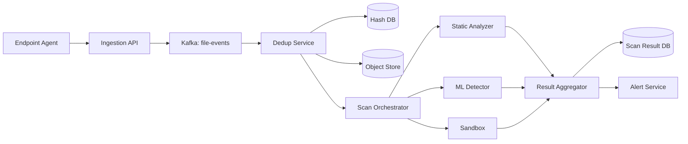

Trade-offs:

| Decision | Option A | Option B |
|---|---|---|
| Scan sync vs async | Sync gives fast answer | Async scales better |
| Dedup | Hash-based saves cost | Hash collision/variant risk |
| Kafka | Replayable telemetry | Operational complexity |
| Sandbox | Better detection | Expensive and slower |

---

# PayPal-Style Focus

Expect:
- payment correctness
- idempotency
- ledger consistency
- fraud/risk systems
- transaction lifecycle
- auditability

## Payment HLD

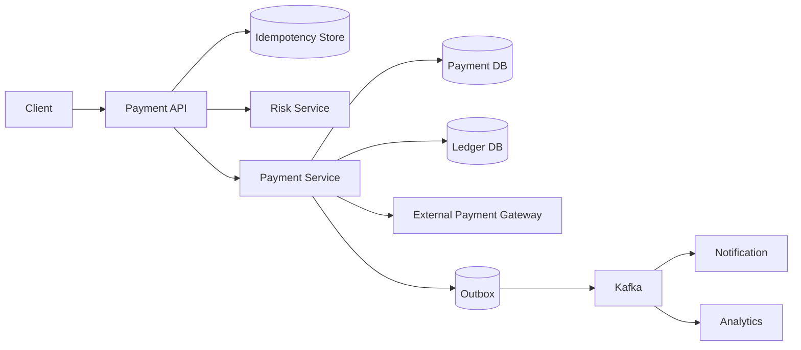

## Payment State Machine

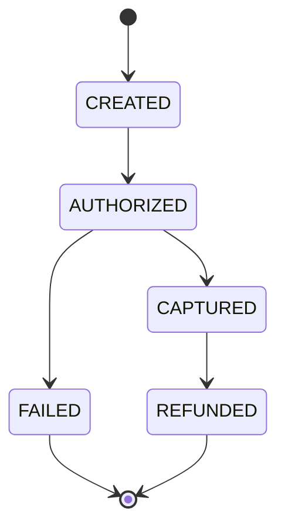

Payment checklist:

```text
- Idempotency key
- Request validation
- Risk/fraud check
- Payment state machine
- Ledger entry
- External gateway timeout/retry
- Webhook handling
- Duplicate event handling
- Audit trail
```

---

# Common Trade-off Cheatsheet

| Topic | Option 1 | Option 2 | How to Decide |
|---|---|---|---|
| DB | SQL | NoSQL | SQL for transactions, NoSQL for massive key-value scale |
| Communication | REST | gRPC | REST for public/simple APIs, gRPC for internal low-latency |
| Processing | Sync | Async | Sync for immediate result, async for scale/failures |
| Consistency | Strong | Eventual | Strong for money/inventory, eventual for feeds/analytics |
| Cache | Redis | CDN | Redis for dynamic data, CDN for static/edge |
| Queue | SQS/RabbitMQ | Kafka | Queue for tasks, Kafka for event stream/replay |
| Deployment | Blue-green | Canary | Blue-green simple rollback, canary safer gradual rollout |
| Scaling | Vertical | Horizontal | Vertical quick, horizontal for long-term scale |
| Locking | DB lock | Distributed lock | DB lock for one DB resource, distributed lock with caution |

---

# Common Mistakes to Avoid

| Mistake | Better Approach |
|---|---|
| Jumping into architecture immediately | Clarify requirements first |
| No numbers | Estimate QPS/storage/latency |
| No APIs | Define core endpoints |
| No data model | Show tables/entities |
| Saying "Kafka" without reason | Explain ordering, replay, consumers |
| Saying "Redis" without invalidation | Explain TTL and stale data |
| Ignoring failures | Add retry, timeout, DLQ |
| Ignoring idempotency | Especially bad in payments/orders |
| Overengineering | Start simple, evolve |
| No trade-offs | Compare at least 2 options |

---

# One-Day Revision Plan

## Morning: HLD

Practice 3 designs:
1. Payment system
2. Rate limiter
3. Notification system

For each:
```text
Requirements -> APIs -> Data -> Architecture -> Bottlenecks -> Trade-offs
```

## Afternoon: LLD

Practice 3 designs:
1. Parking lot
2. Payment processor
3. Rate limiter

For each:
```text
Entities -> Interfaces -> Patterns -> Concurrency -> Tests
```

## Evening: Project Deep Dive

Prepare:
```text
- 2 project stories
- 1 incident story
- 1 conflict story
- 1 mentoring story
- 1 optimization story
```

---

# Last 15-Minute Checklist

Before interview, remember:

```text
Clarify before designing.
Draw simple first.
Talk through trade-offs.
Mention failure handling.
Mention observability.
Mention security.
Mention idempotency for writes.
Mention consistency for money/inventory.
Mention testing and rollout.
Summarize at the end.
```

## Final Interview Closing Template

```text
To summarize, I designed the system with:
- clear APIs
- scalable storage
- caching for hot reads
- async processing for heavy work
- idempotency for safe retries
- observability for operations
- trade-offs between consistency, latency, and cost
```

---

# Mini Templates

## HLD Mini Template

```text
Problem:
Requirements:
Scale:
APIs:
Data Model:
Architecture:
Bottlenecks:
Failure Handling:
Security:
Observability:
Trade-offs:
```

## LLD Mini Template

```text
Problem:
Entities:
Relationships:
Interfaces:
Patterns:
Concurrency:
Errors:
Tests:
Extensibility:
```

## Behavioral STAR Template

```text
Situation:
Task:
Action:
Result:
Learning:
```

---

# Extra: Useful Java Keywords for Interview

| Topic | Java Tools |
|---|---|
| Collections | HashMap, TreeMap, PriorityQueue, Deque |
| Concurrency | synchronized, Lock, AtomicInteger, ConcurrentHashMap |
| Async | CompletableFuture, ExecutorService |
| Immutability | record, final fields |
| Streams | map, filter, collect |
| Testing | JUnit, Mockito |
| Backend | Spring Boot, JPA, JDBC |

---

# End

Use this as a quick visual checklist. In interviews, your goal is not to produce the most complex design. Your goal is to show structured thinking, correct trade-offs, and senior ownership.
