# System Design Use Cases with Spring Boot — Visual Reference

> Visual, step-by-step reference for scaling common backend products from **monolith** to **1k**, **20k**, and **50k+ users/requests scale**.
>
> Style: diagrams first, short explanation, small Spring Boot code snippets, test ideas, and decision points.

---

## Clickable Index

### Core Foundation
1. [How to Read This Guide](#how-to-read-this-guide)
2. [Scale Stages Used Everywhere](#scale-stages-used-everywhere)
3. [Common Spring Boot Project Setup](#common-spring-boot-project-setup)
4. [Common Architecture Building Blocks](#common-architecture-building-blocks)
5. [Decision Matrix](#decision-matrix)
6. [Common Test Strategy](#common-test-strategy)

### Use Cases
1. [URL Shortener](#1-url-shortener)
2. [Ride Sharing](#2-ride-sharing)
3. [Messaging / Chat](#3-messaging--chat)
4. [News Feed](#4-news-feed)
5. [Search Engine](#5-search-engine)
6. [Video Streaming](#6-video-streaming)
7. [File Storage](#7-file-storage)
8. [Recommendation System](#8-recommendation-system)
9. [Ad Serving](#9-ad-serving)
10. [Payment System](#10-payment-system)
11. [Rate Limiter](#11-rate-limiter)
12. [Distributed Cache](#12-distributed-cache)
13. [Notification System](#13-notification-system)
14. [Log Aggregation](#14-log-aggregation)
15. [Analytics Platform](#15-analytics-platform)

### Advanced Patterns
1. [Monolith to Microservices Path](#monolith-to-microservices-path)
2. [Read Heavy vs Write Heavy Decisions](#read-heavy-vs-write-heavy-decisions)
3. [CQRS Pattern](#cqrs-pattern)
4. [Saga Pattern](#saga-pattern)
5. [Outbox Pattern](#outbox-pattern)
6. [Caching Patterns](#caching-patterns)
7. [Final Technology Cheat Sheet](#final-technology-cheat-sheet)

---

# How to Read This Guide

Each use case follows this pattern:

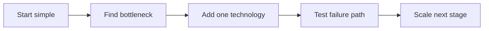

Use this mental model:

| Stage | Goal | Main Question |
|---|---|---|
| Monolith | Build fast | Can one app + one DB solve it? |
| ~1k users | Reliability | Do we need cache, async jobs, monitoring? |
| ~20k users | Separate bottlenecks | Which part scales differently? |
| ~50k+ users | Distributed system | Do we need partitioning, queues, replicas, sharding? |

---

# Scale Stages Used Everywhere

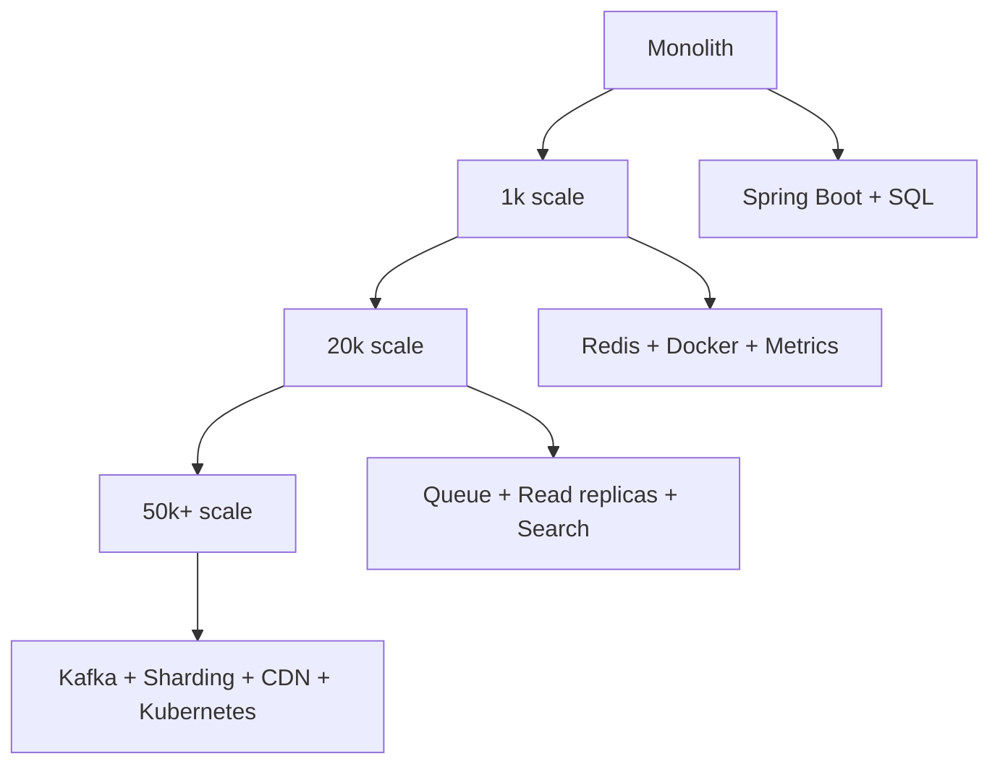

## Stage Meaning

| Stage | App | Database | Add-ons |
|---|---|---|---|
| Monolith | 1 Spring Boot app | PostgreSQL/MySQL | Basic logs |
| 1k | 1-2 app instances | SQL + indexes | Redis, Actuator |
| 20k | Split heavy modules | Read replica / NoSQL | Kafka/RabbitMQ, OpenSearch |
| 50k+ | Services by domain | Sharding / distributed DB | Kubernetes, CDN, tracing |

---

# Common Spring Boot Project Setup

## Maven Dependencies

```xml
<dependencies>
    <dependency>
        <groupId>org.springframework.boot</groupId>
        <artifactId>spring-boot-starter-web</artifactId>
    </dependency>
    <dependency>
        <groupId>org.springframework.boot</groupId>
        <artifactId>spring-boot-starter-data-jpa</artifactId>
    </dependency>
    <dependency>
        <groupId>org.springframework.boot</groupId>
        <artifactId>spring-boot-starter-validation</artifactId>
    </dependency>
    <dependency>
        <groupId>org.postgresql</groupId>
        <artifactId>postgresql</artifactId>
        <scope>runtime</scope>
    </dependency>
    <dependency>
        <groupId>org.springframework.boot</groupId>
        <artifactId>spring-boot-starter-test</artifactId>
        <scope>test</scope>
    </dependency>
</dependencies>
```

## Common Controller Shape

```java
@RestController
@RequestMapping("/api")
public class HealthController {
    @GetMapping("/health")
    public Map<String, String> health() {
        return Map.of("status", "UP");
    }
}
```

## Common Docker Compose Base

```yaml
services:
  postgres:
    image: postgres:16
    environment:
      POSTGRES_USER: app
      POSTGRES_PASSWORD: app
      POSTGRES_DB: appdb
    ports:
      - "5432:5432"
```

---

# Common Architecture Building Blocks

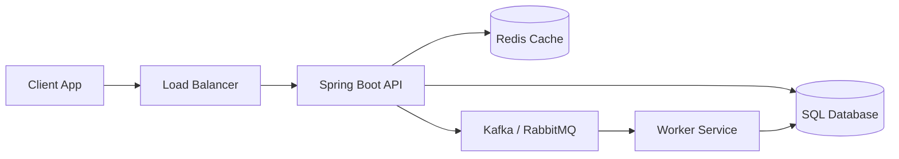

| Block | Use When | Example |
|---|---|---|
| SQL DB | transactions, relational data | payments, users |
| Redis | fast reads, rate limit, sessions | feed cache, API key limit |
| Queue | async work | notifications, video processing |
| Kafka | high-volume event streams | analytics, logs, feed events |
| OpenSearch | full-text search | product/user/news search |
| Object Storage | big files | videos, images, documents |
| CDN | global static delivery | videos, files, images |

---

# Decision Matrix

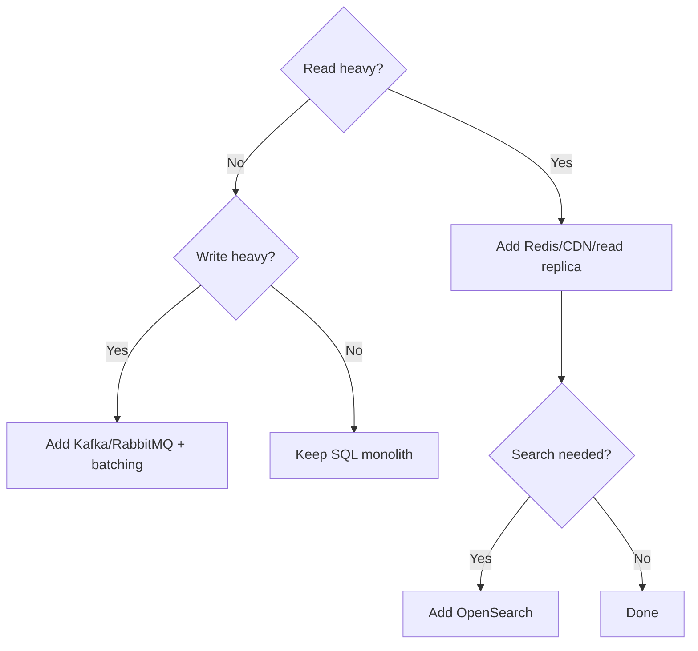

| Problem | First Fix | Later Fix |
|---|---|---|
| Slow repeated reads | Redis cache | CDN, read replicas |
| Slow writes | async queue | partitioning, Kafka |
| Too much DB load | indexes | read replicas, sharding |
| Full-text search | DB index | OpenSearch |
| Large files | local disk only for dev | S3/MinIO + CDN |
| Cross-service transaction | DB transaction | Saga + Outbox |

---

# Common Test Strategy

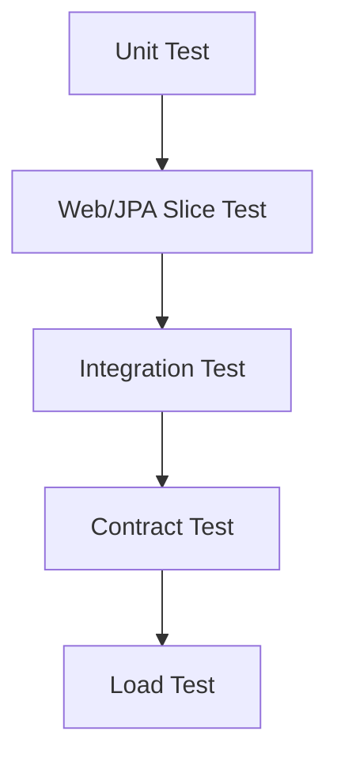

| Test Type | Tool | What to Test |
|---|---|---|
| Unit | JUnit + Mockito | service logic |
| Controller | MockMvc | REST input/output |
| Repository | DataJpaTest | queries/indexes |
| Integration | Testcontainers | DB/Redis/Kafka behavior |
| Load | k6/JMeter/Gatling | scale bottleneck |

## Sample Controller Test

```java
@WebMvcTest(HealthController.class)
class HealthControllerTest {
    @Autowired MockMvc mvc;

    @Test
    void healthReturnsUp() throws Exception {
        mvc.perform(get("/api/health"))
           .andExpect(status().isOk())
           .andExpect(jsonPath("$.status").value("UP"));
    }
}
```

---

# 1. URL Shortener

## Goal
Convert long URLs to short codes.

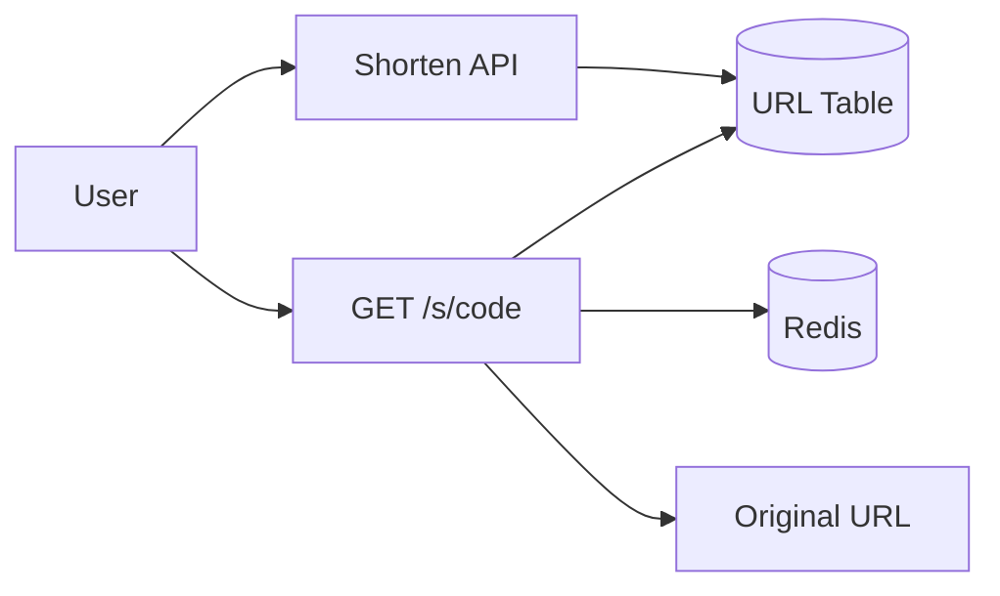

## Monolith

Technology:

| Part | Choice |
|---|---|
| API | Spring Boot REST |
| DB | PostgreSQL |
| Code generation | Base62 random string |

```java
@Entity
class ShortUrl {
    @Id @GeneratedValue Long id;
    @Column(unique = true) String code;
    @Column(nullable = false, length = 2048) String originalUrl;
}
```

```java
@Service
class UrlShortenerService {
    private final ShortUrlRepository repo;

    UrlShortenerService(ShortUrlRepository repo) {
        this.repo = repo;
    }

    public String shorten(String originalUrl) {
        String code = UUID.randomUUID().toString().substring(0, 8);
        ShortUrl url = new ShortUrl();
        url.code = code;
        url.originalUrl = originalUrl;
        repo.save(url);
        return code;
    }
}
```

## 1k Scale

Add:

| Need | Add |
|---|---|
| Faster redirects | Redis cache |
| DB speed | index on code |
| Observability | Actuator + logs |

```sql
CREATE UNIQUE INDEX idx_short_url_code ON short_url(code);
```

## 20k Scale

Add:

| Problem | Solution |
|---|---|
| Redirects are read-heavy | Redis + DB read replica |
| Analytics writes slow redirects | Send click event to Kafka |

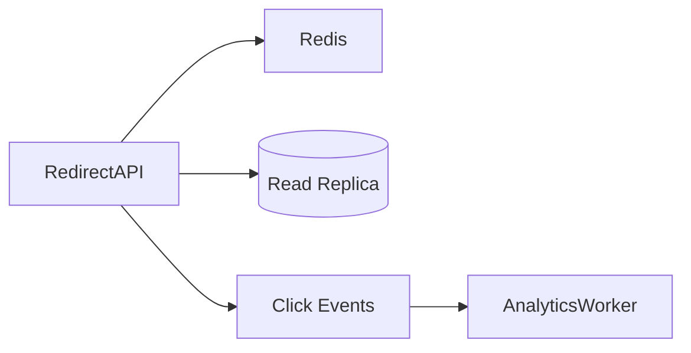

## 50k+ Scale

Add:

| Problem | Solution |
|---|---|
| Global latency | CDN / edge redirect |
| DB hot partition | shard by code prefix |
| Huge click stream | Kafka + OLAP store |

## Tests

```java
@Test
void shortenCreatesCode() {
    String code = service.shorten("https://example.com/article");
    assertThat(code).hasSize(8);
}
```

---

# 2. Ride Sharing

## Goal
Match riders with nearby drivers.

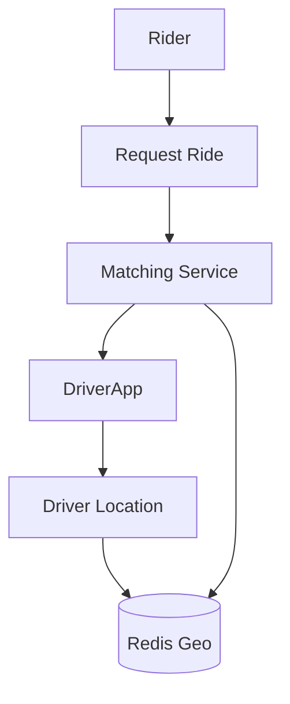

## Monolith

Technology:

| Part | Choice |
|---|---|
| API | Spring Boot |
| DB | PostgreSQL |
| Location | simple SQL latitude/longitude |

```java
record RideRequest(Long riderId, double pickupLat, double pickupLng) {}

@RestController
@RequestMapping("/rides")
class RideController {
    private final RideService service;

    RideController(RideService service) { this.service = service; }

    @PostMapping
    Ride create(@RequestBody RideRequest request) {
        return service.requestRide(request);
    }
}
```

## 1k Scale

Add Redis GEO for driver location.

```java
@Service
class DriverLocationService {
    private final StringRedisTemplate redis;

    DriverLocationService(StringRedisTemplate redis) {
        this.redis = redis;
    }

    void updateLocation(String driverId, double lng, double lat) {
        redis.opsForGeo().add("drivers", new Point(lng, lat), driverId);
    }
}
```

## 20k Scale

Split:

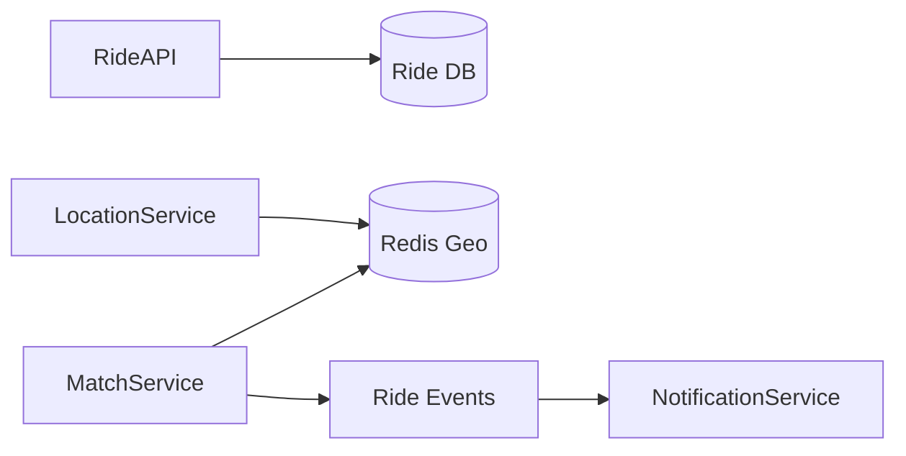

Add:

| Need | Technology |
|---|---|
| Real-time location | Redis GEO / Kafka |
| Driver notifications | WebSocket / Push |
| Trip events | Kafka |

## 50k+ Scale

Add:

| Problem | Solution |
|---|---|
| City-level scale | partition by city/region |
| Real-time matching | dedicated matching service |
| Availability | multi-region active-active |

## Tests

```java
@Test
void nearestDriverIsSelected() {
    Driver d = matchService.findNearest(12.9, 77.6);
    assertThat(d).isNotNull();
}
```

---

# 3. Messaging / Chat

## Goal
Send messages between users.

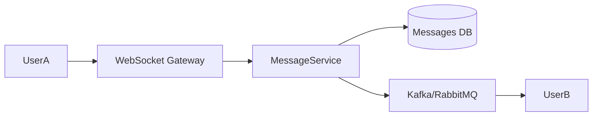

## Monolith

```java
@Entity
class ChatMessage {
    @Id @GeneratedValue Long id;
    Long senderId;
    Long receiverId;
    String text;
    Instant createdAt;
}
```

```java
@PostMapping("/messages")
ChatMessage send(@RequestBody ChatMessage message) {
    message.createdAt = Instant.now();
    return repo.save(message);
}
```

## 1k Scale

Add:

| Need | Add |
|---|---|
| Real time | WebSocket/STOMP |
| Offline messages | DB persistence |
| Unread count | Redis counter |

## 20k Scale

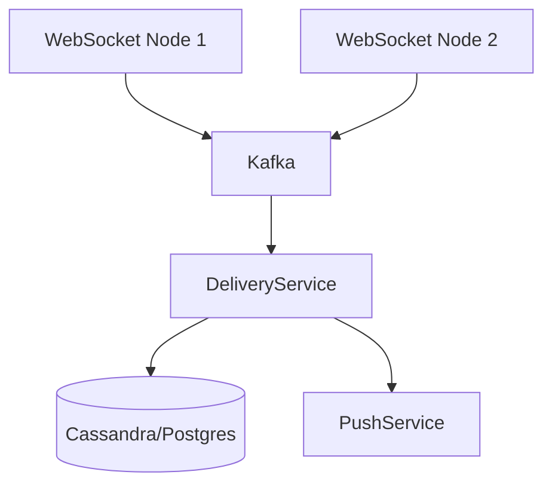

Use Cassandra when writes are very high.

## 50k+ Scale

| Problem | Solution |
|---|---|
| Many writes | Cassandra / DynamoDB style store |
| Multi-device delivery | fanout service |
| Ordering | partition by conversationId |

## Tests

```java
@Test
void messageIsStoredWithTimestamp() {
    ChatMessage saved = service.send(1L, 2L, "hi");
    assertThat(saved.createdAt).isNotNull();
}
```

---

# 4. News Feed

## Goal
Show posts from friends/followed users.

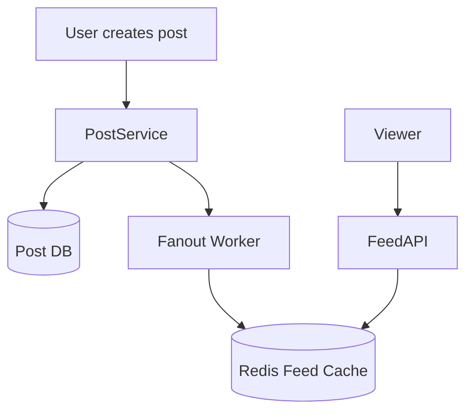

## Monolith

```java
@GetMapping("/feed/{userId}")
List<Post> feed(@PathVariable Long userId) {
    return postRepo.findPostsFromFriends(userId, PageRequest.of(0, 20));
}
```

## 1k Scale

Add DB indexes:

```sql
CREATE INDEX idx_post_author_created ON post(author_id, created_at DESC);
```

## 20k Scale

Choose feed strategy:

| Strategy | Best For |
|---|---|
| Fanout on read | celebrities, huge followers |
| Fanout on write | normal users, fast feed read |
| Hybrid | real social networks |

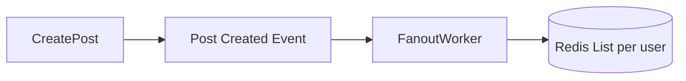

## 50k+ Scale

Add:

| Problem | Solution |
|---|---|
| Large graph | graph service / adjacency store |
| Feed ranking | ML ranking service |
| Huge fanout | Kafka partitions by userId |

## Tests

```java
@Test
void feedReturnsNewestPostsFirst() {
    List<Post> feed = service.feedForUser(10L);
    assertThat(feed).isSortedAccordingTo((a, b) -> b.createdAt.compareTo(a.createdAt));
}
```

---

# 5. Search Engine

## Goal
Search documents, users, products, or posts.

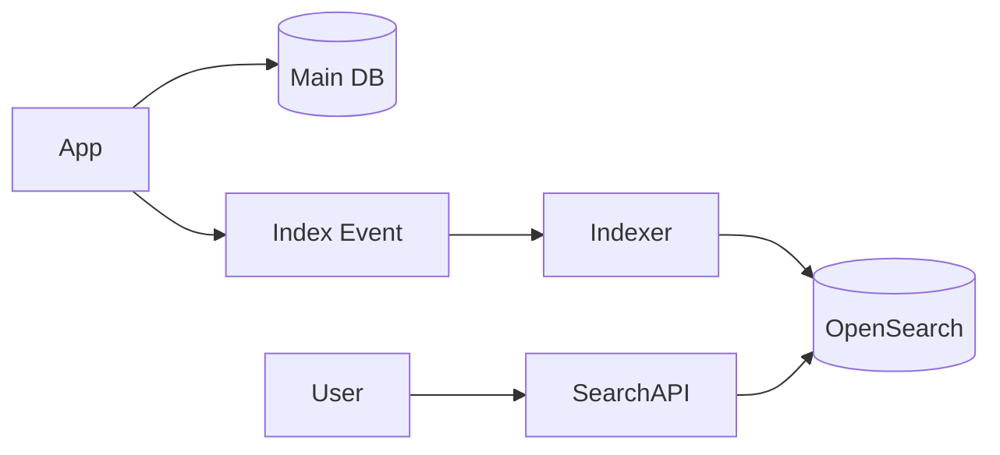

## Monolith

Use SQL `LIKE` first.

```java
@Query("select p from Post p where lower(p.title) like lower(concat('%', :q, '%'))")
List<Post> search(@Param("q") String q);
```

## 1k Scale

Add database full-text index.

## 20k Scale

Add OpenSearch.

```java
record SearchResult(String id, String title, String snippet) {}

@GetMapping("/search")
List<SearchResult> search(@RequestParam String q) {
    return searchService.search(q);
}
```

## 50k+ Scale

| Problem | Solution |
|---|---|
| Large index | shard index |
| Fresh search | Kafka indexing pipeline |
| Ranking | relevance + personalization |

## Tests

```java
@Test
void searchFindsMatchingTitle() {
    assertThat(searchService.search("spring")).isNotEmpty();
}
```

---

# 6. Video Streaming

## Goal
Upload, process, and stream video.

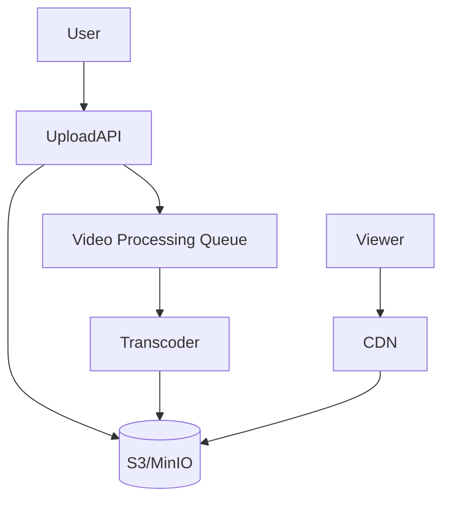

## Monolith

Store metadata in SQL. Store file on disk only for local dev.

```java
@Entity
class Video {
    @Id @GeneratedValue Long id;
    String title;
    String objectKey;
    String status; // UPLOADED, PROCESSING, READY
}
```

## 1k Scale

Add object storage like MinIO/S3.

## 20k Scale

Add async transcoding.

```java
@Service
class VideoService {
    void uploadComplete(Long videoId) {
        rabbitTemplate.convertAndSend("video.process", videoId);
    }
}
```

## 50k+ Scale

| Problem | Solution |
|---|---|
| Global streaming | CDN |
| Many resolutions | HLS/DASH transcoding |
| Huge processing | worker autoscaling |

## Tests

```java
@Test
void uploadedVideoStartsInProcessingState() {
    Video v = service.create("demo.mp4");
    assertThat(v.status).isEqualTo("PROCESSING");
}
```

---

# 7. File Storage

## Goal
Upload/download files safely.

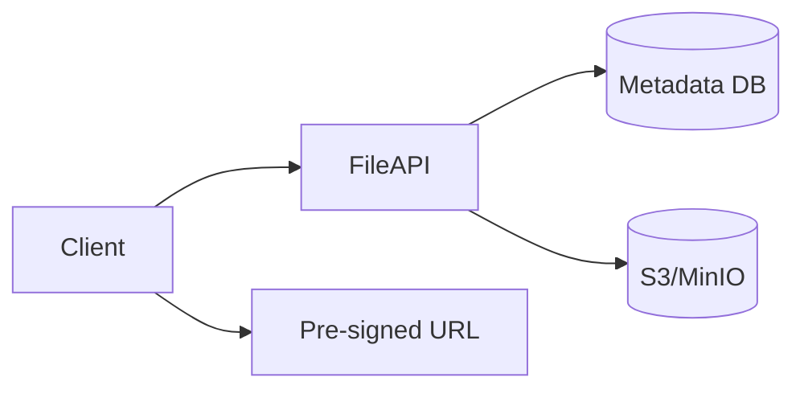

## Monolith

```java
@PostMapping("/files")
FileMeta upload(@RequestParam MultipartFile file) {
    return fileService.store(file);
}
```

## 1k Scale

Add MinIO/S3 and metadata table.

## 20k Scale

Use pre-signed upload URLs so traffic skips your app.

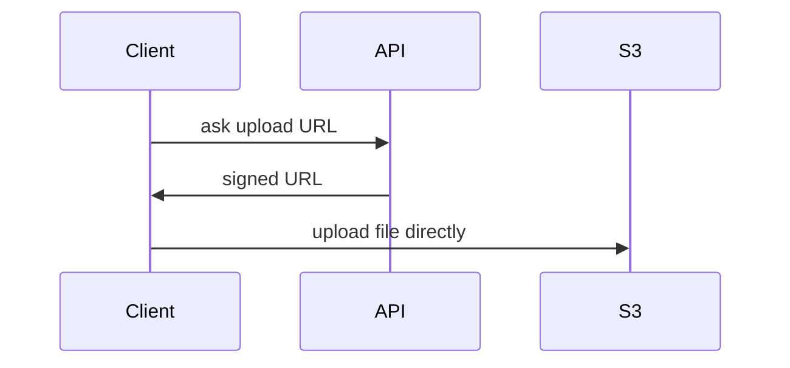

## 50k+ Scale

| Problem | Solution |
|---|---|
| Download traffic | CDN |
| Virus scanning | async scanner queue |
| Large metadata | partition by ownerId |

## Tests

```java
@Test
void fileMetadataSavedAfterUpload() {
    FileMeta meta = service.store(fakeFile);
    assertThat(meta.sizeBytes).isGreaterThan(0);
}
```

---

# 8. Recommendation System

## Goal
Suggest content/products/users.

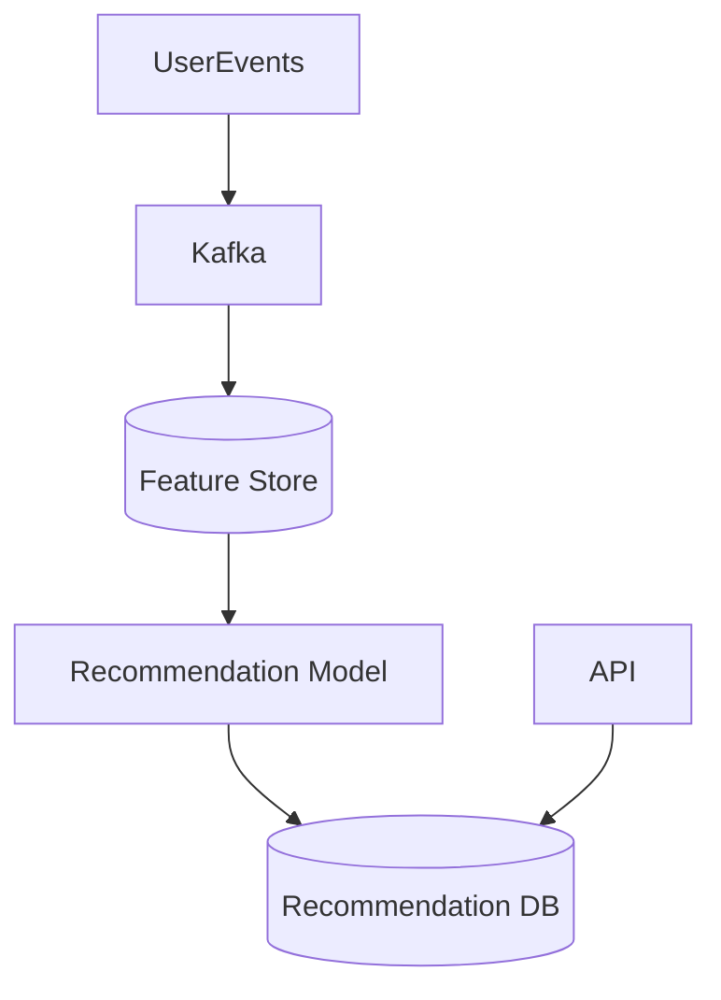

## Monolith

Start rule-based.

```java
List<Item> recommend(Long userId) {
    return itemRepo.findTop10ByCategory("popular");
}
```

## 1k Scale

Add event tracking.

```java
record UserEvent(Long userId, String eventType, Long itemId) {}
```

## 20k Scale

Add batch recommendations.

| Need | Add |
|---|---|
| Store events | Kafka |
| Compute recs | scheduled job / Spark later |
| Fast reads | Redis / recommendation table |

## 50k+ Scale

| Problem | Solution |
|---|---|
| Personalization | ML model |
| Freshness | stream processing |
| A/B testing | experiment platform |

## Tests

```java
@Test
void recommendationsExcludeAlreadySeenItems() {
    List<Item> recs = service.recommend(1L);
    assertThat(recs).noneMatch(Item::seenByUser);
}
```

---

# 9. Ad Serving

## Goal
Select best ad for a request.

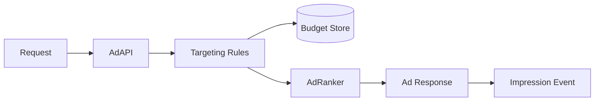

## Monolith

```java
Ad chooseAd(UserProfile user) {
    return adRepo.findActiveAds(user.country()).stream()
        .findFirst()
        .orElseThrow();
}
```

## 1k Scale

Add Redis for campaign budget counters.

## 20k Scale

Add Kafka for impression/click events.

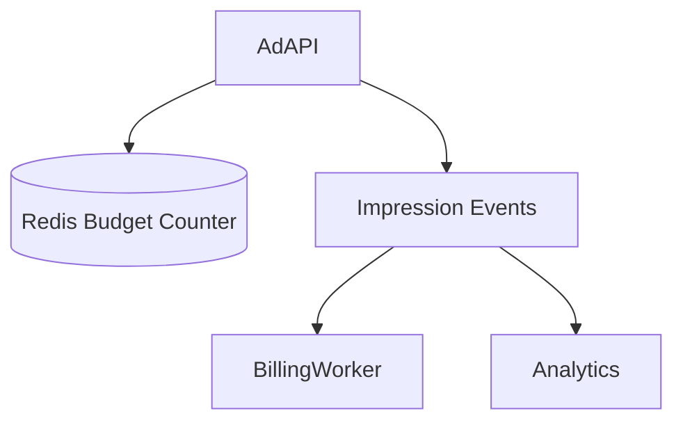

## 50k+ Scale

| Problem | Solution |
|---|---|
| Low latency | in-memory ad index |
| Budget correctness | atomic counters + reconciliation |
| Ranking | ML model |

## Tests

```java
@Test
void inactiveAdIsNotServed() {
    assertThat(service.chooseAd(user).active()).isTrue();
}
```

---

# 10. Payment System

## Goal
Charge user safely and reliably.

```mermaid
sequenceDiagram
    participant Client
    participant PaymentAPI
    participant DB
    participant Provider
    Client->>PaymentAPI: create payment
    PaymentAPI->>DB: save PENDING
    PaymentAPI->>Provider: charge
    Provider-->>PaymentAPI: success/failure
    PaymentAPI->>DB: update status
```

## Monolith

Use SQL transaction and idempotency key.

```java
@Entity
class Payment {
    @Id @GeneratedValue Long id;
    @Column(unique = true) String idempotencyKey;
    BigDecimal amount;
    String status;
}
```

```java
@Transactional
Payment createPayment(String key, BigDecimal amount) {
    return repo.findByIdempotencyKey(key)
        .orElseGet(() -> repo.save(new Payment(key, amount, "PENDING")));
}
```

## 1k Scale

Add:

| Need | Add |
|---|---|
| Avoid duplicate charge | idempotency key |
| Audit | append-only payment events |
| Monitoring | alerts on failed payments |

## 20k Scale

Add outbox pattern.

```mermaid
flowchart LR
    PaymentService --> PaymentDB[(Payment DB)]
    PaymentService --> Outbox[(Outbox Table)]
    OutboxPublisher --> Kafka
    Kafka --> EmailService
```

## 50k+ Scale

| Problem | Solution |
|---|---|
| Cross-service transaction | Saga |
| Reconciliation | daily provider settlement job |
| Compliance | encryption, audit logs |

## Tests

```java
@Test
void sameIdempotencyKeyReturnsSamePayment() {
    Payment p1 = service.createPayment("k1", BigDecimal.TEN);
    Payment p2 = service.createPayment("k1", BigDecimal.TEN);
    assertThat(p2.id).isEqualTo(p1.id);
}
```

---

# 11. Rate Limiter

## Goal
Control request volume per user/IP/API key.

```mermaid
flowchart LR
    Request --> Filter[Spring Filter]
    Filter --> Redis[(Redis Counter)]
    Redis --> Decision{Allowed?}
    Decision -->|Yes| API
    Decision -->|No| TooMany[429 Too Many Requests]
```

## Monolith

Use in-memory counter only for learning.

```java
@Component
class SimpleRateLimiter {
    private final Map<String, AtomicInteger> counters = new ConcurrentHashMap<>();

    boolean allow(String key) {
        return counters.computeIfAbsent(key, k -> new AtomicInteger()).incrementAndGet() <= 100;
    }
}
```

## 1k Scale

Use Redis counter with TTL.

```java
boolean allow(String key) {
    Long count = redis.opsForValue().increment("rate:" + key);
    if (count == 1) redis.expire("rate:" + key, Duration.ofMinutes(1));
    return count <= 100;
}
```

## 20k Scale

Use token bucket / sliding window.

## 50k+ Scale

| Problem | Solution |
|---|---|
| Global API limit | distributed Redis cluster |
| Edge protection | API Gateway / CDN rules |
| Abuse detection | analytics + ML |

## Tests

```java
@Test
void blocksAfterLimit() {
    for (int i = 0; i < 100; i++) assertThat(limiter.allow("u1")).isTrue();
    assertThat(limiter.allow("u1")).isFalse();
}
```

---

# 12. Distributed Cache

## Goal
Cache data across many app instances.

```mermaid
flowchart TD
    API1 --> Redis[(Redis Cluster)]
    API2 --> Redis
    API3 --> Redis
    Redis --> DB[(Database)]
```

## Monolith

Start with local Caffeine cache.

```java
@Cacheable("users")
public User getUser(Long id) {
    return repo.findById(id).orElseThrow();
}
```

## 1k Scale

Add Redis.

```java
@EnableCaching
@Configuration
class CacheConfig {}
```

## 20k Scale

Add cache-aside pattern.

```mermaid
sequenceDiagram
    participant API
    participant Redis
    participant DB
    API->>Redis: get user
    Redis-->>API: miss
    API->>DB: read user
    DB-->>API: user
    API->>Redis: set user
```

## 50k+ Scale

| Problem | Solution |
|---|---|
| Hot keys | local cache + request coalescing |
| Redis memory | eviction policies |
| Consistency | TTL + event-based invalidation |

## Tests

```java
@Test
void secondCallUsesCache() {
    service.getUser(1L);
    service.getUser(1L);
    verify(repo, times(1)).findById(1L);
}
```

---

# 13. Notification System

## Goal
Send email, SMS, push, or in-app notifications.

```mermaid
flowchart LR
    App --> Kafka[Notification Event]
    Kafka --> NotificationService
    NotificationService --> Email[Email Provider]
    NotificationService --> SMS[SMS Provider]
    NotificationService --> Push[Push Provider]
```

## Monolith

```java
@Service
class NotificationService {
    void sendWelcomeEmail(String email) {
        // call email provider
    }
}
```

## 1k Scale

Async notifications using RabbitMQ.

```java
rabbitTemplate.convertAndSend("notification.email", emailRequest);
```

## 20k Scale

Add retry + DLQ.

```mermaid
flowchart TD
    Queue[Notification Queue] --> Worker
    Worker --> Provider
    Worker -->|fail| RetryQueue
    RetryQueue --> Worker
    Worker -->|too many failures| DLQ[Dead Letter Queue]
```

## 50k+ Scale

| Problem | Solution |
|---|---|
| Many channels | channel-specific services |
| Provider outage | fallback provider |
| User preference | preference service |

## Tests

```java
@Test
void disabledUserDoesNotReceiveNotification() {
    assertThat(service.shouldSend(userWithDisabledEmail)).isFalse();
}
```

---

# 14. Log Aggregation

## Goal
Collect logs from many services.

```mermaid
flowchart LR
    App1 --> Agent[Fluent Bit / Vector]
    App2 --> Agent
    Agent --> Kafka
    Kafka --> LogStore[(OpenSearch/Loki)]
    LogStore --> Dashboard[Grafana/Kibana]
```

## Monolith

Use structured JSON logs.

```java
log.info("order_created userId={} orderId={}", userId, orderId);
```

## 1k Scale

Add centralized logs.

| Need | Tool |
|---|---|
| collect logs | Fluent Bit / Vector |
| store logs | Loki / OpenSearch |
| view logs | Grafana / Kibana |

## 20k Scale

Add Kafka buffer.

## 50k+ Scale

| Problem | Solution |
|---|---|
| Huge log volume | sampling + retention |
| Search cost | index only important fields |
| Debug distributed flow | traceId in every log |

## Tests

```java
@Test
void logContainsTraceId() {
    // Usually verified with integration/log appender tests
    assertThat(true).isTrue();
}
```

---

# 15. Analytics Platform

## Goal
Collect events and answer business questions.

```mermaid
flowchart TD
    App --> EventAPI
    EventAPI --> Kafka
    Kafka --> StreamProcessor
    StreamProcessor --> OLAP[(ClickHouse/Druid/BigQuery)]
    OLAP --> Dashboard[BI Dashboard]
```

## Monolith

Store events in SQL.

```java
@Entity
class AnalyticsEvent {
    @Id @GeneratedValue Long id;
    Long userId;
    String eventName;
    Instant createdAt;
}
```

## 1k Scale

Batch insert events.

## 20k Scale

Use Kafka.

```java
record AnalyticsEventDto(Long userId, String eventName, Instant time) {}
```

## 50k+ Scale

| Problem | Solution |
|---|---|
| Huge writes | Kafka partitions |
| Fast aggregation | ClickHouse/Druid |
| Late events | stream processing with windows |

## Tests

```java
@Test
void eventHasTimestamp() {
    AnalyticsEvent e = service.track(1L, "CLICK");
    assertThat(e.createdAt).isNotNull();
}
```

---

# Monolith to Microservices Path

```mermaid
flowchart TD
    A[Single Spring Boot App] --> B[Modular Monolith]
    B --> C[Extract Async Workers]
    C --> D[Extract Read Heavy Service]
    D --> E[Extract Write Heavy Service]
    E --> F[Independent Microservices]
```

## Safe Extraction Order

| Step | Extract | Why |
|---|---|---|
| 1 | background workers | low risk |
| 2 | notification service | async boundary |
| 3 | search service | separate storage |
| 4 | analytics service | write-heavy events |
| 5 | payment service | strong ownership |

---

# Read Heavy vs Write Heavy Decisions

```mermaid
flowchart LR
    Workload{Workload Type} --> Read[Read Heavy]
    Workload --> Write[Write Heavy]
    Read --> Cache[Redis/CDN/Read Replica]
    Write --> Queue[Kafka/RabbitMQ]
    Write --> Partition[Partition/Sharding]
```

## Read Heavy Examples

| Use Case | Main Fix |
|---|---|
| URL redirect | Redis cache |
| News feed read | precomputed Redis feed |
| Video streaming | CDN |
| Search | OpenSearch |

## Write Heavy Examples

| Use Case | Main Fix |
|---|---|
| Messaging | Kafka/Cassandra |
| Analytics | Kafka + OLAP |
| Logs | Fluent Bit + Kafka + Loki/OpenSearch |
| Notifications | Queue + workers |

---

# CQRS Pattern

Use CQRS when reads and writes need different models.

```mermaid
flowchart LR
    Command[Write API] --> WriteDB[(Write DB)]
    WriteDB --> Event[Domain Event]
    Event --> Projector
    Projector --> ReadDB[(Read Model)]
    Query[Read API] --> ReadDB
```

## Spring Boot Mini Example

```java
@PostMapping("/posts")
Post create(@RequestBody CreatePostCommand command) {
    Post post = postService.create(command);
    eventPublisher.publishEvent(new PostCreatedEvent(post.id));
    return post;
}
```

```java
@EventListener
void on(PostCreatedEvent event) {
    feedProjectionService.updateFeeds(event.postId());
}
```

Use CQRS for:

| Use Case | Why |
|---|---|
| News feed | feed read model differs from post write model |
| Analytics | event write model differs from dashboard read model |
| Search | DB write model differs from search index |

---

# Saga Pattern

Use Saga when one business process touches multiple services.

```mermaid
sequenceDiagram
    participant Order
    participant Payment
    participant Inventory
    participant Notification
    Order->>Payment: reserve money
    Payment->>Inventory: reserve item
    Inventory->>Notification: send confirmation
    Inventory-->>Payment: fail? compensate payment
```

## Mini Java Shape

```java
@Service
class PaymentSaga {
    void handleOrderCreated(OrderCreated event) {
        try {
            paymentClient.charge(event.orderId());
            inventoryClient.reserve(event.orderId());
        } catch (Exception ex) {
            paymentClient.refund(event.orderId());
        }
    }
}
```

Use Saga for:

| Use Case | Saga Steps |
|---|---|
| Payment | authorize → capture → notify |
| Ride sharing | request → driver accept → payment hold |
| File processing | upload → scan → publish |

---

# Outbox Pattern

Use Outbox to avoid this problem:

> DB save succeeds, but Kafka publish fails.

```mermaid
flowchart LR
    Service --> DB[(Business Table)]
    Service --> Outbox[(Outbox Table)]
    Publisher --> Outbox
    Publisher --> Kafka
```

```java
@Transactional
void createPayment(Payment payment) {
    paymentRepo.save(payment);
    outboxRepo.save(new OutboxEvent("PAYMENT_CREATED", payment.id.toString()));
}
```

---

# Caching Patterns

## Cache Aside

```mermaid
sequenceDiagram
    participant API
    participant Cache
    participant DB
    API->>Cache: read key
    Cache-->>API: miss
    API->>DB: read data
    DB-->>API: data
    API->>Cache: store data with TTL
```

## Write Through

```mermaid
flowchart LR
    API --> Cache
    Cache --> DB
```

## Invalidation

```java
@CacheEvict(value = "users", key = "#id")
public void updateUser(Long id, UpdateUserRequest request) {
    // update DB
}
```

---

# Final Technology Cheat Sheet

| Use Case | Monolith | 1k | 20k | 50k+ |
|---|---|---|---|---|
| URL Shortener | Spring + SQL | Redis | Kafka analytics | shard + CDN |
| Ride Sharing | Spring + SQL | Redis GEO | Kafka + matching service | region partition |
| Messaging | SQL | WebSocket | Kafka/Cassandra | partition by conversation |
| News Feed | SQL joins | indexes/cache | fanout workers | hybrid feed + ranking |
| Search | SQL LIKE | full-text index | OpenSearch | sharded search |
| Video | local/dev storage | S3/MinIO | queue transcoding | CDN + autoscale workers |
| File Storage | local/dev storage | S3/MinIO | signed URLs | CDN + scanner pipeline |
| Recommendation | rules | events | batch jobs | ML + feature store |
| Ad Serving | SQL | Redis budget | Kafka events | low-latency ranking |
| Payment | SQL transaction | idempotency | outbox | saga + reconciliation |
| Rate Limiter | in-memory | Redis TTL | sliding window | gateway + Redis cluster |
| Cache | local cache | Redis | Redis cluster | multi-layer cache |
| Notification | sync call | RabbitMQ | retry + DLQ | channel services |
| Log Aggregation | local logs | Loki/OpenSearch | Kafka buffer | sampling + retention |
| Analytics | SQL events | batch insert | Kafka + OLAP | stream processing |

---

# Final Learning Path

```mermaid
flowchart TD
    A[Build Monolith] --> B[Add Tests]
    B --> C[Add Redis]
    C --> D[Add Queue]
    D --> E[Add Search/Object Storage]
    E --> F[Add Observability]
    F --> G[Split Services]
    G --> H[Add CQRS/Saga/Outbox]
```

## Practice Order

1. URL Shortener
2. Rate Limiter
3. File Storage
4. Notification
5. Messaging
6. News Feed
7. Payment
8. Analytics
9. Ride Sharing
10. Recommendation / Ads

---

# Mini Master Checklist

Before scaling, ask:

- Is it read-heavy or write-heavy?
- Can indexes fix it first?
- Can cache fix it safely?
- Can async queue remove slow work?
- Do we need a new database or just a better query?
- What happens when the queue fails?
- What happens when duplicate requests arrive?
- What is the rollback/compensation plan?
- Which test proves the failure case works?

