# CP DSA Math Visual Reference

Visual, step-by-step reference for CP math with Mermaid diagrams, small C++ snippets, Java helpers where useful, plug-in examples, and mental tricks.

---

## 0. Master Mental Map

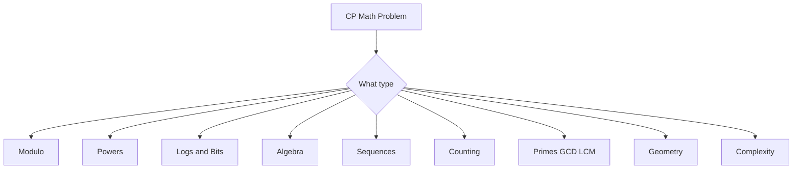

**Core idea:** CP math converts slow simulation into formulas.

---

## 1. Ceiling Division

Formula:

```text
ceil(a / b) = (a + b - 1) / b
```

Example:

```text
ceil(10 / 3) = (10 + 3 - 1) / 3 = 12 / 3 = 4
```


```cpp
long long ceilDiv(long long a, long long b) {
    return (a + b - 1) / b;
}
```

**Mental trick:** if division has leftover, add one group.

---

## 2. Modulo

Modulo means position inside a cycle.

Example:

```text
Today is day 3
After 100 days:
(3 + 100) % 7 = 5
```


```cpp
int afterDays(int today, int add) {
    return (today + add) % 7;
}
```

---

## 3. Power of Two Check

Formula:

```text
n > 0 and (n & (n - 1)) == 0
```

Example:

```text
8  = 1000
7  = 0111
8 & 7 = 0000
```

```cpp
bool isPowerOfTwo(long long n) {
    return n > 0 && (n & (n - 1)) == 0;
}
```

---

## 4. Exponent Rules

```text
x^a * x^b = x^(a+b)
x^a / x^b = x^(a-b)
(x^a)^b = x^(ab)
x^0 = 1
x^-a = 1 / x^a
```

Example:

```text
2^3 * 2^4 = 2^7 = 128
```


---

## 5. Fast Power

Recursive idea:

```text
x^n = x^(n/2) * x^(n/2)          if n even
x^n = x^(n/2) * x^(n/2) * x      if n odd
```

```cpp
long long power(long long x, long long n) {
    if (n == 0) return 1;
    long long half = power(x, n / 2);
    if (n % 2 == 0) return half * half;
    return half * half * x;
}
```

---

## 6. Binary Exponentiation

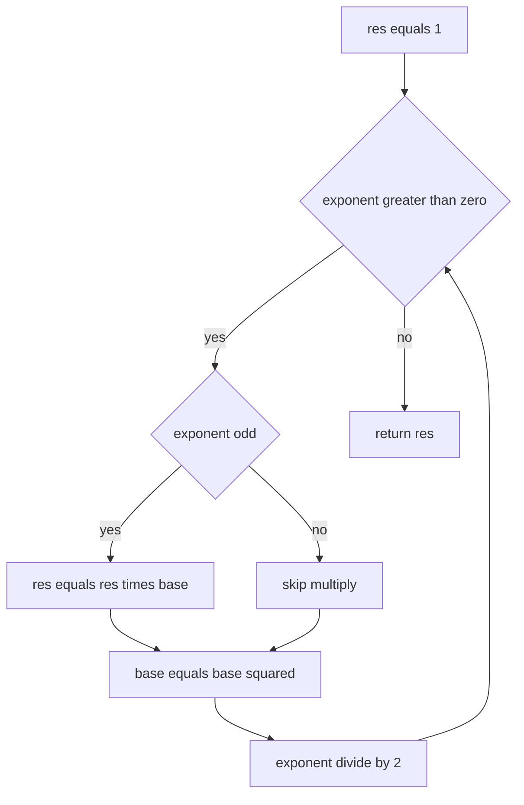

```cpp
long long binPow(long long base, long long exp) {
    long long res = 1;
    while (exp > 0) {
        if (exp & 1) res *= base;
        base *= base;
        exp >>= 1;
    }
    return res;
}
```

Modular version:

```cpp
long long modPow(long long base, long long exp, long long mod) {
    long long res = 1 % mod;
    base %= mod;
    while (exp > 0) {
        if (exp & 1) res = (res * base) % mod;
        base = (base * base) % mod;
        exp >>= 1;
    }
    return res;
}
```

**Mental trick:** `13 = 8 + 4 + 1`, so `x^13 = x^8 * x^4 * x`.

---

## 7. Java Fast Power

```java
static long modPow(long base, long exp, long mod) {
    long res = 1 % mod;
    base %= mod;
    while (exp > 0) {
        if ((exp & 1) == 1) res = (res * base) % mod;
        base = (base * base) % mod;
        exp >>= 1;
    }
    return res;
}
```

---

## 8. Logarithms

Meaning:

```text
2^3 = 8
log2(8) = 3
```

Log asks: **what power gives this number?**

Rules:

```text
log(xy) = log(x) + log(y)
log(x/y) = log(x) - log(y)
log(x^k) = k log(x)
```

Example:

```text
log2(32) = log2(8 * 4) = 3 + 2 = 5
```

---

## 9. Halving Pattern

```text
8 -> 4 -> 2 -> 1
```

Steps:

```text
log2(8) = 3
```

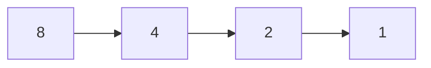

Where used:
- binary search
- divide and conquer
- heap height
- binary exponentiation

---

## 10. Bits and Digits

Bits needed:

```text
floor(log2(n)) + 1
```

Example:

```text
n = 8
binary 1000
bits = 4
```

Digits needed:

```text
floor(log10(n)) + 1
```

```cpp
int bitCount(long long n) {
    if (n == 0) return 1;
    return 64 - __builtin_clzll(n);
}

int digits(long long n) {
    if (n == 0) return 1;
    return (int)log10(n) + 1;
}
```

---

## 11. Basic Algebra

Expression:

```text
3x + 4
```

Equation:

```text
3x + 2 = 11
```

Substitution:

```text
x = 5
y = 3x + 2 = 17
```

Distributive property:

```text
a(b+c) = ab + ac
```

Factoring:

```text
6x + 9 = 3(2x + 3)
```

Inequality warning:

```text
-2x > 6
x < -3
```

**Mental trick:** multiply or divide by negative flips the sign.

---

## 12. Quadratic Formula

For:

```text
ax^2 + bx + c = 0
```

Formula:

```text
x = (-b ± sqrt(b^2 - 4ac)) / 2a
```

Discriminant:

```text
D = b^2 - 4ac
```

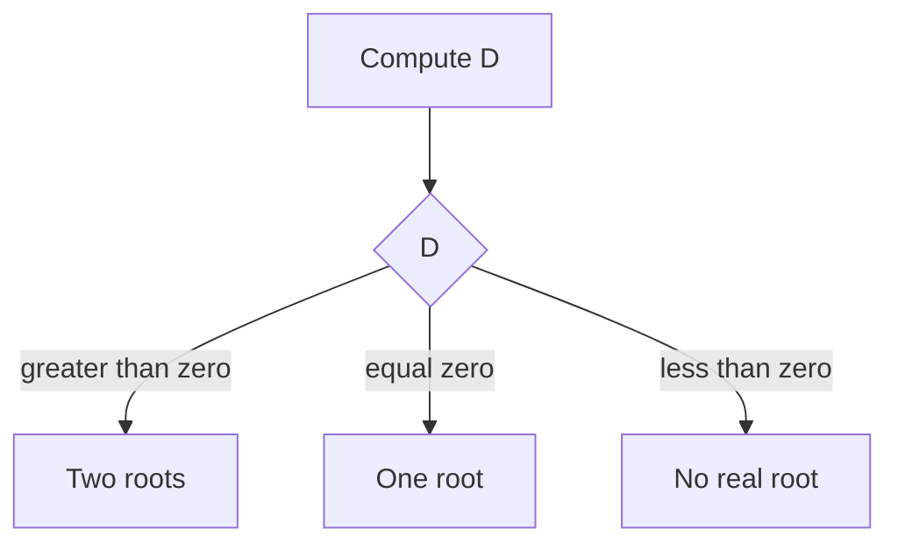

Example:

```text
x^2 - 5x + 6 = 0
a = 1 b = -5 c = 6
D = 25 - 24 = 1
x = (5 ± 1)/2 = 3 or 2
```

```cpp
vector<double> quadratic(double a, double b, double c) {
    double D = b*b - 4*a*c;
    vector<double> roots;
    if (D < 0) return roots;
    roots.push_back((-b + sqrt(D)) / (2*a));
    if (D > 0) roots.push_back((-b - sqrt(D)) / (2*a));
    return roots;
}
```

---

## 13. System of Equations

Example:

```text
x + y = 10
x - y = 4
```

Add:

```text
2x = 14
x = 7
y = 3
```

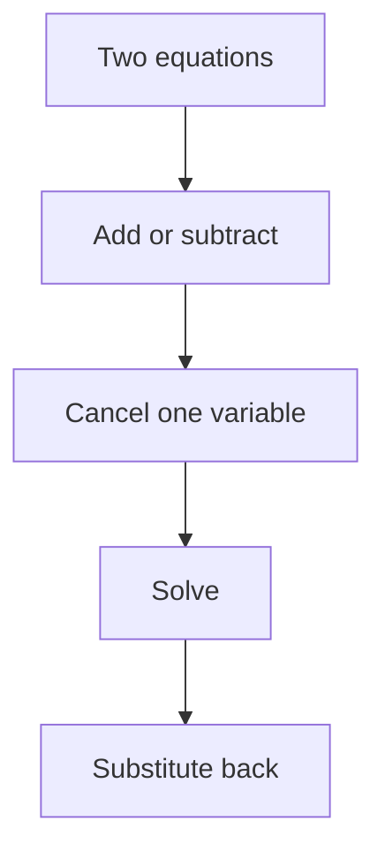

---

## 14. Arithmetic Sequence

Formula:

```text
an = a1 + (n - 1)d
```

Example:

```text
5, 8, 11, 14
a1 = 5
d = 3
a4 = 5 + (4 - 1)*3 = 14
```

```cpp
long long arithmeticTerm(long long a1, long long d, long long n) {
    return a1 + (n - 1) * d;
}
```

---

## 15. Geometric Sequence

Formula:

```text
an = a1 * r^(n - 1)
```

Example:

```text
3, 6, 12, 24
a1 = 3
r = 2
a4 = 3 * 2^3 = 24
```

---

## 16. Sum Formulas

```text
1 + 2 + ... + n = n(n+1)/2
1^2 + 2^2 + ... + n^2 = n(n+1)(2n+1)/6
1^3 + 2^3 + ... + n^3 = [n(n+1)/2]^2
```

Plug values:

```text
n = 5
sum first n = 5*6/2 = 15
```

```cpp
long long sumN(long long n) {
    return n * (n + 1) / 2;
}

long long sumSquares(long long n) {
    return n * (n + 1) * (2*n + 1) / 6;
}

long long sumCubes(long long n) {
    long long s = n * (n + 1) / 2;
    return s * s;
}
```

---

## 17. Arithmetic Series Sum

Formula:

```text
sum = n(a1 + an) / 2
```

Example:

```text
5, 8, 11, 14, 17
sum = 5(5+17)/2 = 55
```

---

## 18. Geometric Series Sum

Formula:

```text
S = a1(r^n - 1)/(r - 1)
```

Example:

```text
1 + 2 + 4 + 8 + 16
a1 = 1 r = 2 n = 5
S = (2^5 - 1)/(2 - 1) = 31
```

Powers of two:

```text
1 + 2 + 4 + ... + 2^(n-1) = 2^n - 1
```

---

## 19. Nested Loops

Full nested loop:

```cpp
for (int i = 1; i <= n; i++) {
    for (int j = 1; j <= n; j++) {
        // O(1)
    }
}
```

Time:

```text
n * n = O(n^2)
```

Triangular loop:

```text
n + (n-1) + ... + 1 = n(n+1)/2 = O(n^2)
```

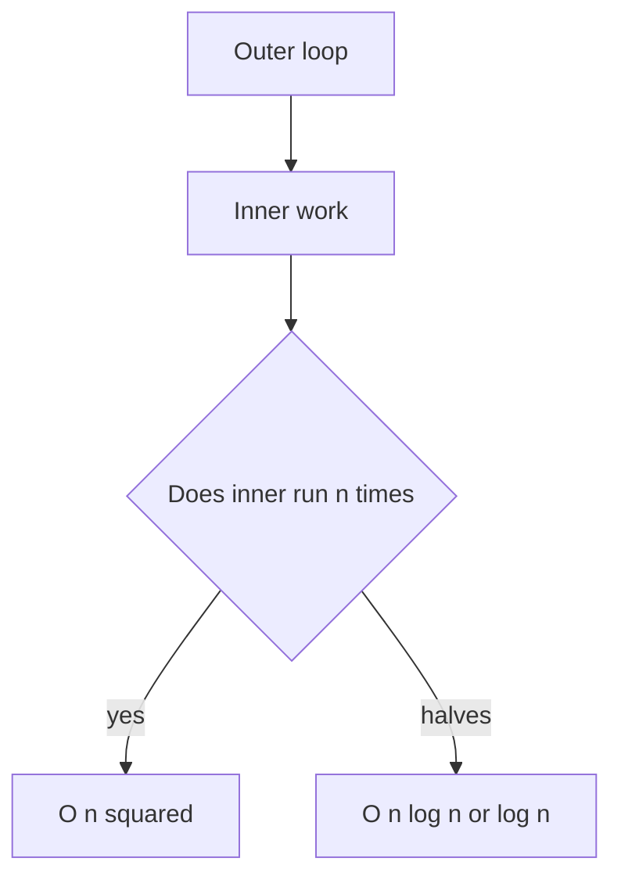

---

## 20. Telescoping Sum

Example:

```text
(2-1) + (3-2) + (4-3) + (5-4)
= 5 - 1
= 4
```

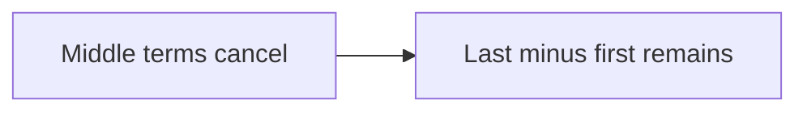

Mental trick: if terms cancel in chain, think telescoping.

---

## 21. Prefix Sum

Array:

```text
a = [1,2,3,4,5]
pref = [0,1,3,6,10,15]
```

Range sum `[l,r]`:

```text
pref[r+1] - pref[l]
```

```cpp
vector<long long> buildPrefix(vector<int>& a) {
    vector<long long> pref(a.size() + 1, 0);
    for (int i = 0; i < (int)a.size(); i++) {
        pref[i + 1] = pref[i] + a[i];
    }
    return pref;
}

long long rangeSum(vector<long long>& pref, int l, int r) {
    return pref[r + 1] - pref[l];
}
```

---

## 22. Summation Properties

Factor out constant:

```text
sum c*ai = c * sum ai
```

Split sum:

```text
sum(ai + bi) = sum(ai) + sum(bi)
```

Example:

```text
sum from i=1 to n of (3i + 2)
= 3 * n(n+1)/2 + 2n
```

For `n=5`:

```text
3*5*6/2 + 10 = 55
```

---

## 23. Counting Principles

Product rule:

```text
3 shirts and 2 pants = 3*2 = 6 outfits
```

Sum rule:

```text
3 tea options OR 4 coffee options = 7 options
```

Complement:

```text
good = total - bad
```

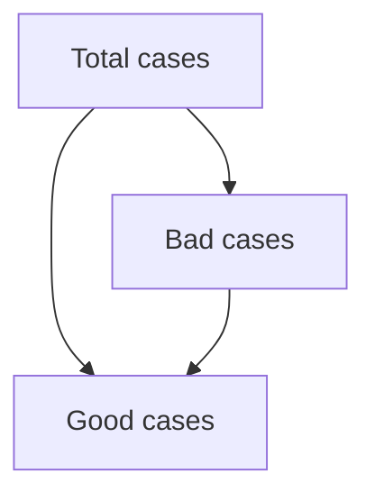

---

## 24. Factorial Permutation Combination

Factorial:

```text
5! = 5*4*3*2*1 = 120
```

Permutation order matters:

```text
nPr = n! / (n-r)!
```

Combination order does not matter:

```text
nCr = n! / (r!(n-r)!)
```

```cpp
long long nCr(int n, int r) {
    if (r < 0 || r > n) return 0;
    r = min(r, n - r);
    long long ans = 1;
    for (int i = 1; i <= r; i++) {
        ans = ans * (n - r + i) / i;
    }
    return ans;
}
```

---

## 25. Probability

Formula:

```text
probability = favorable / total
```

Example:

```text
P(even on die) = 3/6 = 1/2
```

---

## 26. Primes

Prime = exactly two divisors: `1` and itself.

Check only up to sqrt:

```cpp
bool isPrime(long long n) {
    if (n < 2) return false;
    for (long long d = 2; d*d <= n; d++) {
        if (n % d == 0) return false;
    }
    return true;
}
```

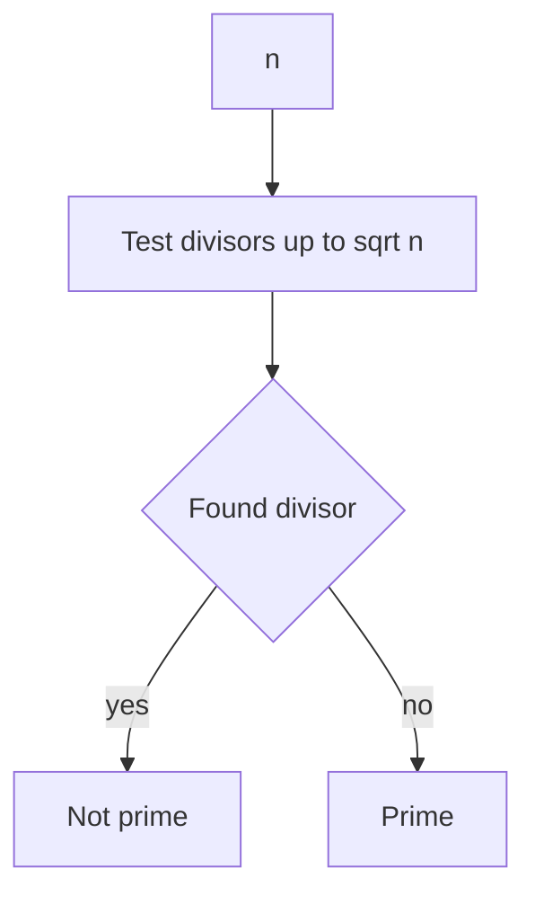

---

## 27. GCD and LCM

Euclid:

```text
gcd(a,b) = gcd(b, a%b)
```

```cpp
long long gcdll(long long a, long long b) {
    while (b != 0) {
        long long r = a % b;
        a = b;
        b = r;
    }
    return a;
}

long long lcmll(long long a, long long b) {
    return a / gcdll(a, b) * b;
}
```

---

## 28. Modular Arithmetic

Rules:

```text
(a+b)%M = ((a%M)+(b%M))%M
(a*b)%M = ((a%M)*(b%M))%M
```

Normalize negative:

```cpp
long long norm(long long x, long long mod) {
    x %= mod;
    if (x < 0) x += mod;
    return x;
}
```

Modular inverse for prime mod:

```text
a^-1 = a^(mod-2) mod mod
```

```cpp
long long modInverse(long long a, long long mod) {
    return modPow(a, mod - 2, mod);
}
```

---

## 29. Geometry Basics

Rectangle:

```text
area = l*w
perimeter = 2(l+w)
```

Triangle:

```text
area = base*height/2
```

Circle:

```text
area = pi*r*r
circumference = 2*pi*r
```

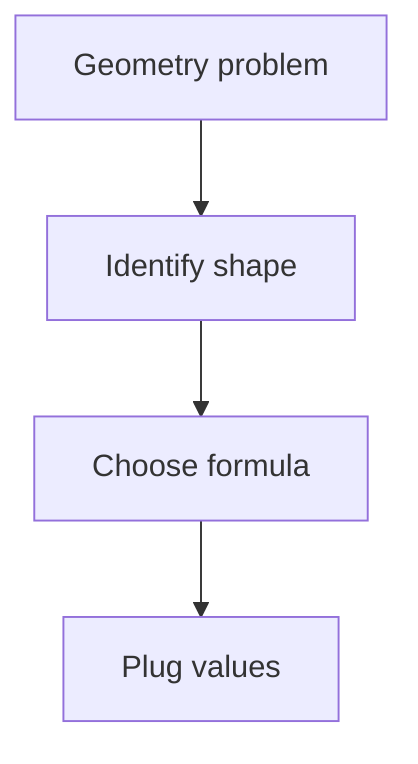

---

## 30. Big O

```text
O(1)       constant
O(log n)   halving
O(n)       one loop
O(n log n) sorting or divide plus linear
O(n^2)     nested loops
```

Mental tricks:
- one loop = `O(n)`
- nested loop = `O(n^2)`
- divide by 2 = `O(log n)`
- sorting = `O(n log n)`

---

## 31. Final CP Formula Sheet

```text
ceil(a/b) = (a+b-1)/b
sum 1..n = n(n+1)/2
sum squares = n(n+1)(2n+1)/6
sum cubes = [n(n+1)/2]^2
arithmetic nth = a1 + (n-1)d
arithmetic sum = n(a1+an)/2
geometric nth = a1*r^(n-1)
geometric sum = a1(r^n-1)/(r-1)
bits = floor(log2 n)+1
digits = floor(log10 n)+1
nCr = n!/(r!(n-r)!)
lcm(a,b) = a/gcd(a,b)*b
```

---

## 32. Final Mental Checklist

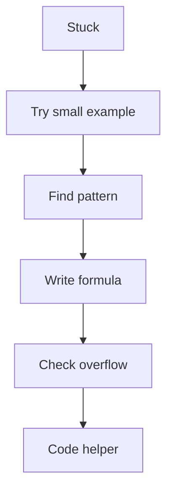

Ask:
1. Can I use modulo cycle?
2. Can I replace loops with a sum formula?
3. Can I use prefix sum?
4. Can I count complement?
5. Is there a log or halving pattern?
6. Do I need `long long`?
7. Can I divide before multiplying?

---

END
