# CP & DSA Math Visual Reference — Road to CM

A visual, step-by-step competitive programming math reference with Mermaid diagrams, dry runs, C++ helpers, Java helpers where useful, formula sheets, problem-recognition patterns, and mental tricks.

> Goal: build the mathematical foundation needed to move from beginner/intermediate CP toward **Codeforces Candidate Master (CM)** level.

---

## Clickable Index

### Part A — How to Think

1. [Master Mental Map](#1-master-mental-map)
2. [CP Math Framework](#2-cp-math-framework)
3. [Problem-Solving Loop](#3-problem-solving-loop)
4. [Dry Run Template](#4-dry-run-template)
5. [Overflow and Precision Checklist](#5-overflow-and-precision-checklist)

### Part B — Core Number Skills

6. [Ceiling Division and Floor Division](#6-ceiling-division-and-floor-division)
7. [Modulo and Cycles](#7-modulo-and-cycles)
8. [Negative Modulo](#8-negative-modulo)
9. [Parity and Odd-Even Logic](#9-parity-and-odd-even-logic)
10. [Powers of Two and Bit Tricks](#10-powers-of-two-and-bit-tricks)
11. [Exponent Rules](#11-exponent-rules)
12. [Fast Power and Binary Exponentiation](#12-fast-power-and-binary-exponentiation)
13. [Logarithms and Halving](#13-logarithms-and-halving)
14. [Bits and Digits](#14-bits-and-digits)

### Part C — Algebra and Formula Building

15. [Basic Algebra](#15-basic-algebra)
16. [Inequalities](#16-inequalities)
17. [Quadratic Formula](#17-quadratic-formula)
18. [Systems of Equations](#18-systems-of-equations)
19. [Arithmetic and Geometric Sequences](#19-arithmetic-and-geometric-sequences)
20. [Core Sum Formulas](#20-core-sum-formulas)
21. [Telescoping Sums](#21-telescoping-sums)
22. [Prefix Sums](#22-prefix-sums)
23. [Difference Arrays](#23-difference-arrays)

### Part D — Counting and Combinatorics

24. [Counting Principles](#24-counting-principles)
25. [Factorial, Permutation, Combination](#25-factorial-permutation-combination)
26. [Combinations Mod Prime](#26-combinations-mod-prime)
27. [Stars and Bars](#27-stars-and-bars)
28. [Inclusion-Exclusion](#28-inclusion-exclusion)
29. [Probability Basics](#29-probability-basics)

### Part E — Number Theory

30. [Prime Check](#30-prime-check)
31. [Sieve of Eratosthenes](#31-sieve-of-eratosthenes)
32. [Prime Factorization](#32-prime-factorization)
33. [GCD and LCM](#33-gcd-and-lcm)
34. [Extended Euclid](#34-extended-euclid)
35. [Modular Inverse](#35-modular-inverse)
36. [Fermat and Euler](#36-fermat-and-euler)
37. [Divisors](#37-divisors)
38. [Chinese Remainder Theorem](#38-chinese-remainder-theorem)

### Part F — Geometry and Coordinate Math

39. [Geometry Basics](#39-geometry-basics)
40. [Coordinate Geometry](#40-coordinate-geometry)
41. [Vectors, Dot Product, Cross Product](#41-vectors-dot-product-cross-product)
42. [Orientation and Segment Intersection](#42-orientation-and-segment-intersection)
43. [Polygon Area](#43-polygon-area)

### Part G — Complexity Math and Patterns

44. [Big O Recognition](#44-big-o-recognition)
45. [Nested Loops](#45-nested-loops)
46. [Binary Search on Answer](#46-binary-search-on-answer)
47. [Two Pointers Math](#47-two-pointers-math)
48. [Contribution Technique](#48-contribution-technique)
49. [Prefix XOR and XOR Tricks](#49-prefix-xor-and-xor-tricks)
50. [Game Theory Basics](#50-game-theory-basics)
51. [DP Math Foundations](#51-dp-math-foundations)

### Part H — Templates and Roadmap

52. [C++ Math Template](#52-c-math-template)
53. [Java Math Helpers](#53-java-math-helpers)
54. [Formula Sheet](#54-formula-sheet)
55. [Pattern Recognition Table](#55-pattern-recognition-table)
56. [Roadmap to CM Math Strength](#56-roadmap-to-cm-math-strength)
57. [Final Mental Checklist](#57-final-mental-checklist)

---

# Part A — How to Think

## 1. Master Mental Map

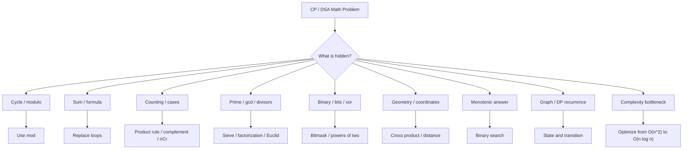

**Core idea:** CP math often means converting a slow simulation into a formula, invariant, monotonic condition, or precomputed helper.

---

## 2. CP Math Framework

Use this framework for almost every math-heavy problem.

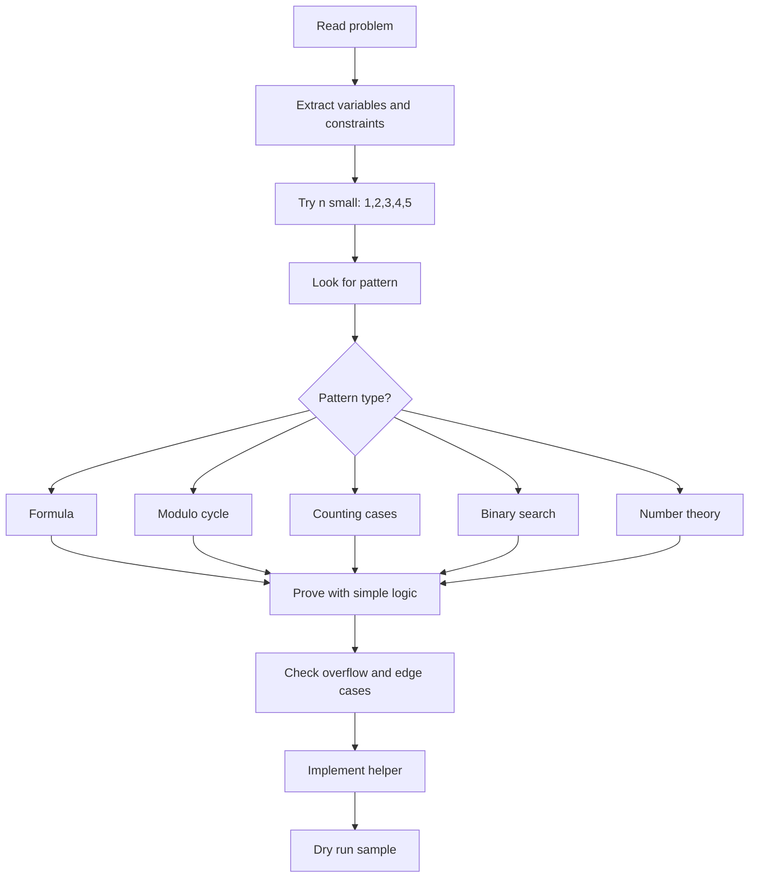

### Mental framework

```text
Input constraints tell the allowed complexity.
Small examples reveal pattern.
Pattern becomes formula.
Formula becomes helper function.
Helper must handle edge cases.
```

---

## 3. Problem-Solving Loop

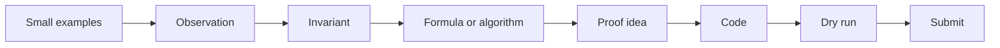

### Example: sum 1 to n

Slow:

```cpp
long long sum = 0;
for (int i = 1; i <= n; i++) sum += i;
```

Fast:

```cpp
long long sum = n * (n + 1) / 2;
```

Why this matters: for `n = 1e9`, looping is impossible, but the formula is `O(1)`.

---

## 4. Dry Run Template

Use this table whenever learning a new algorithm.

```text
Input:
Variables:
Initial state:
Each step:
Final answer:
Edge cases:
```

### Example dry run: binary exponentiation for `3^13`

Binary:

```text
13 = 1101₂ = 8 + 4 + 1
3^13 = 3^8 * 3^4 * 3^1
```

| Step | exp | base | res | Action |
|---:|---:|---:|---:|---|
| 0 | 13 | 3 | 1 | exp odd, res *= base |
| 1 | 6 | 9 | 3 | square base, halve exp |
| 2 | 3 | 81 | 3 | exp odd, res *= base |
| 3 | 1 | 6561 | 243 | exp odd, res *= base |
| 4 | 0 | 43046721 | 1594323 | stop |

Answer: `3^13 = 1594323`.

---

## 5. Overflow and Precision Checklist

### Integer overflow rules

```text
int range       ≈ 2.1e9
long long range ≈ 9e18
```

Use `long long` by default in CP math.

### Common overflow bug

```cpp
long long x = 1e9;
long long y = 1e9;
long long z = x * y; // OK because both are long long
```

But:

```cpp
long long z = 1000000000 * 1000000000; // overflow first as int expression
```

Fix:

```cpp
long long z = 1LL * 1000000000 * 1000000000;
```

### Precision rules

Use integer math when possible. Avoid floating-point equality.

```cpp
const double EPS = 1e-9;
if (abs(a - b) < EPS) {
    // equal enough
}
```

---

# Part B — Core Number Skills

## 6. Ceiling Division and Floor Division

For positive integers:

```text
ceil(a / b) = (a + b - 1) / b
```

Example:

```text
ceil(10 / 3) = (10 + 3 - 1) / 3 = 4
```

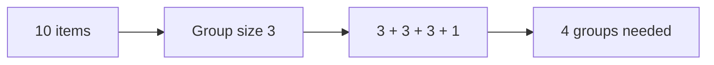

### C++ helper for positive numbers

```cpp
long long ceilDiv(long long a, long long b) {
    return (a + b - 1) / b;
}
```

### Safer version avoiding overflow

```cpp
long long ceilDiv(long long a, long long b) {
    return a / b + (a % b != 0);
}
```

### Where used

- pages needed
- batches needed
- moves needed
- days needed
- groups needed

### Pattern

```text
Need minimum number of groups of size k to cover n items?
Answer = ceil(n / k)
```

---

## 7. Modulo and Cycles

Modulo means position inside a cycle.

Example:

```text
Today = 3
After 100 days:
(3 + 100) % 7 = 5
```

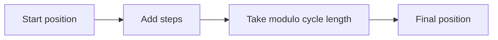

```cpp
int afterDays(int today, int add) {
    return (today + add) % 7;
}
```

### Dry run

```text
Cycle length = 7
Start = 3
Steps = 100
100 % 7 = 2
Final = (3 + 2) % 7 = 5
```

### Where modulo appears

- clock problems
- circular arrays
- repeating strings
- large answer constraints
- parity cycles
- grid wrapping

### Pattern

```text
If something repeats every k steps, reduce large n by n % k.
```

---

## 8. Negative Modulo

In C++, negative modulo can stay negative.

```cpp
cout << (-1 % 5); // -1 in C++
```

Normalize:

```cpp
long long norm(long long x, long long mod) {
    x %= mod;
    if (x < 0) x += mod;
    return x;
}
```

### Example

```text
-1 mod 5 should mean position 4 in cycle [0,1,2,3,4]
```

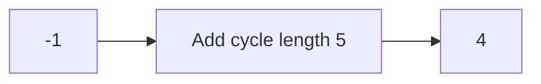

---

## 9. Parity and Odd-Even Logic

Parity means odd/even state.

```cpp
bool isEven(long long x) { return x % 2 == 0; }
bool isOdd(long long x) { return x % 2 != 0; }
```

### Useful facts

```text
even + even = even
even + odd  = odd
odd + odd   = even
odd * odd   = odd
anything * even = even
```

### Pattern

```text
If operation changes answer every move, think parity.
If only odd/even matters, compress state to x % 2.
```

---

## 10. Powers of Two and Bit Tricks

Power of two check:

```text
n > 0 and (n & (n - 1)) == 0
```

Example:

```text
8  = 1000
7  = 0111
8 & 7 = 0000
```

```cpp
bool isPowerOfTwo(long long n) {
    return n > 0 && (n & (n - 1)) == 0;
}
```

### Common bit tricks

```cpp
x & 1        // odd check
x >> 1       // divide by 2
x << 1       // multiply by 2
x & -x       // lowest set bit
x & (x - 1)  // remove lowest set bit
```

### Dry run: remove lowest set bit

```text
x = 12 = 1100
x - 1 = 11 = 1011
x & (x - 1) = 1000 = 8
```

---

## 11. Exponent Rules

```text
x^a * x^b = x^(a+b)
x^a / x^b = x^(a-b)
(x^a)^b = x^(ab)
x^0 = 1
x^-a = 1 / x^a
```

Example:

```text
2^3 * 2^4 = 2^7 = 128
```

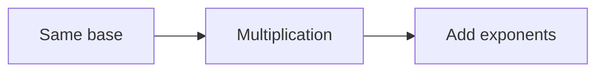

---

## 12. Fast Power and Binary Exponentiation

Recursive idea:

```text
x^n = x^(n/2) * x^(n/2)       if n even
x^n = x^(n/2) * x^(n/2) * x   if n odd
```

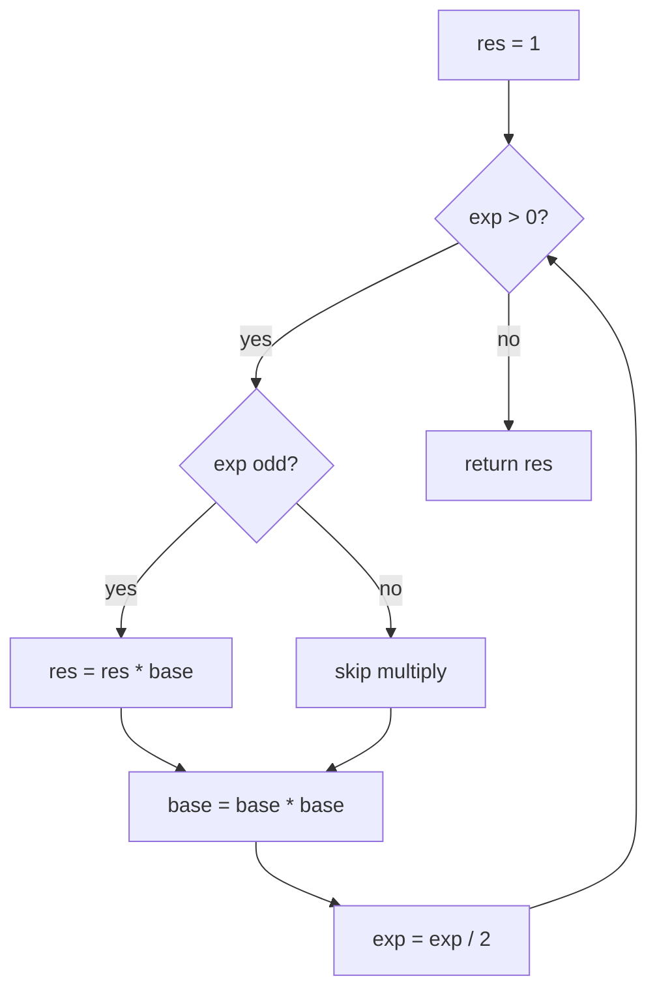

### C++ normal binary power

```cpp
long long binPow(long long base, long long exp) {
    long long res = 1;
    while (exp > 0) {
        if (exp & 1) res *= base;
        base *= base;
        exp >>= 1;
    }
    return res;
}
```

### C++ modular power

```cpp
long long modPow(long long base, long long exp, long long mod) {
    long long res = 1 % mod;
    base %= mod;
    while (exp > 0) {
        if (exp & 1) res = (__int128)res * base % mod;
        base = (__int128)base * base % mod;
        exp >>= 1;
    }
    return res;
}
```

### Java modular power

```java
static long modPow(long base, long exp, long mod) {
    long res = 1 % mod;
    base %= mod;
    while (exp > 0) {
        if ((exp & 1) == 1) res = (res * base) % mod;
        base = (base * base) % mod;
        exp >>= 1;
    }
    return res;
}
```

### Mental trick

```text
13 = 8 + 4 + 1
x^13 = x^8 * x^4 * x
```

---

## 13. Logarithms and Halving

Meaning:

```text
2^3 = 8
log2(8) = 3
```

Log asks: **what power gives this number?**

### Log rules

```text
log(xy) = log(x) + log(y)
log(x/y) = log(x) - log(y)
log(x^k) = k log(x)
```

### Halving pattern

```text
8 -> 4 -> 2 -> 1
```

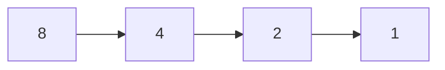

Steps:

```text
log2(8) = 3
```

### Where used

- binary search
- divide and conquer
- heap height
- binary exponentiation
- sparse table

---

## 14. Bits and Digits

Bits needed:

```text
bits(n) = floor(log2(n)) + 1, for n > 0
```

Digits needed:

```text
digits(n) = floor(log10(n)) + 1, for n > 0
```

```cpp
int bitCount(unsigned long long n) {
    if (n == 0) return 1;
    return 64 - __builtin_clzll(n);
}

int digits(long long n) {
    if (n == 0) return 1;
    if (n < 0) n = -n;
    return (int)log10((long double)n) + 1;
}
```

---

# Part C — Algebra and Formula Building

## 15. Basic Algebra

Expression:

```text
3x + 4
```

Equation:

```text
3x + 2 = 11
```

Substitution:

```text
x = 5
y = 3x + 2 = 17
```

Distributive property:

```text
a(b + c) = ab + ac
```

Factoring:

```text
6x + 9 = 3(2x + 3)
```

### CP usage

- derive formulas
- simplify loops
- transform inequalities for binary search
- solve unknowns from constraints

---

## 16. Inequalities

Important warning:

```text
-2x > 6
x < -3
```

When multiplying or dividing by a negative number, flip the sign.

### Pattern

```text
If a condition becomes easier as x increases, it may be binary searchable.
```

Example:

```text
Can finish within D days if speed >= x.
```

This condition is monotonic.

---

## 17. Quadratic Formula

For:

```text
ax^2 + bx + c = 0
```

Formula:

```text
x = (-b ± sqrt(b^2 - 4ac)) / 2a
```

Discriminant:

```text
D = b^2 - 4ac
```

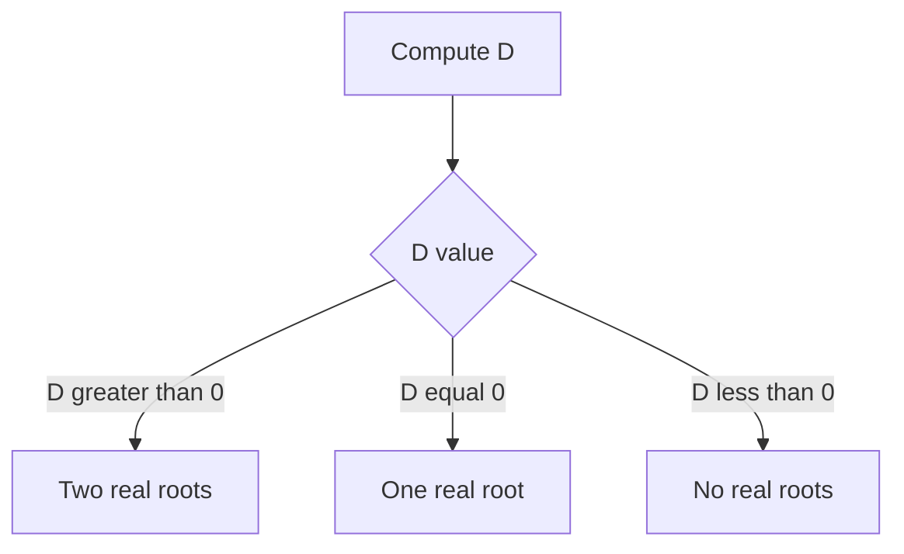

Example:

```text
x^2 - 5x + 6 = 0
a = 1, b = -5, c = 6
D = 25 - 24 = 1
x = (5 ± 1) / 2 = 3 or 2
```

```cpp
vector<double> quadratic(double a, double b, double c) {
    double D = b*b - 4*a*c;
    vector<double> roots;
    if (D < 0) return roots;
    roots.push_back((-b + sqrt(D)) / (2*a));
    if (D > 0) roots.push_back((-b - sqrt(D)) / (2*a));
    return roots;
}
```

---

## 18. Systems of Equations

Example:

```text
x + y = 10
x - y = 4
```

Add equations:

```text
2x = 14
x = 7
y = 3
```

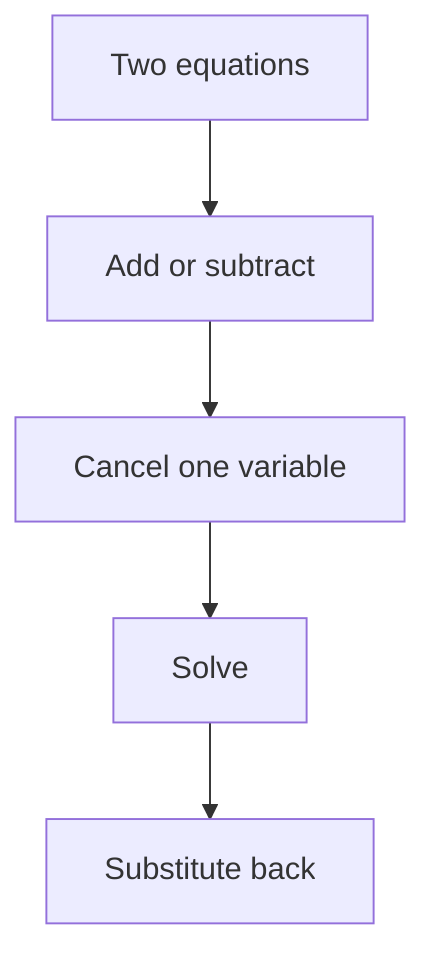

### CP usage

- recover two values from sum and difference
- solve counts of two item types
- find hidden parameters

---

## 19. Arithmetic and Geometric Sequences

### Arithmetic sequence

```text
a_n = a_1 + (n - 1)d
```

Example:

```text
5, 8, 11, 14
a_1 = 5, d = 3
a_4 = 5 + 3*3 = 14
```

```cpp
long long arithmeticTerm(long long a1, long long d, long long n) {
    return a1 + (n - 1) * d;
}
```

### Geometric sequence

```text
a_n = a_1 * r^(n - 1)
```

Example:

```text
3, 6, 12, 24
a_1 = 3, r = 2
a_4 = 3 * 2^3 = 24
```

---

## 20. Core Sum Formulas

```text
1 + 2 + ... + n = n(n+1)/2
1^2 + 2^2 + ... + n^2 = n(n+1)(2n+1)/6
1^3 + 2^3 + ... + n^3 = [n(n+1)/2]^2
```

```cpp
long long sumN(long long n) {
    return n * (n + 1) / 2;
}

long long sumSquares(long long n) {
    return n * (n + 1) * (2*n + 1) / 6;
}

long long sumCubes(long long n) {
    long long s = n * (n + 1) / 2;
    return s * s;
}
```

### Arithmetic series

```text
sum = n(a_1 + a_n) / 2
```

### Geometric series

```text
S = a_1(r^n - 1)/(r - 1), r != 1
```

Special power-of-two sum:

```text
1 + 2 + 4 + ... + 2^(n-1) = 2^n - 1
```

---

## 21. Telescoping Sums

Example:

```text
(2 - 1) + (3 - 2) + (4 - 3) + (5 - 4)
= 5 - 1
= 4
```

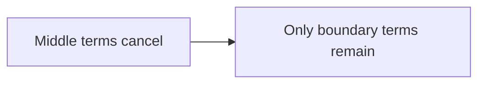

### Pattern

```text
If terms cancel in a chain, keep only first and last boundary terms.
```

---

## 22. Prefix Sums

Array:

```text
a = [1, 2, 3, 4, 5]
pref = [0, 1, 3, 6, 10, 15]
```

Range sum `[l, r]`:

```text
pref[r + 1] - pref[l]
```

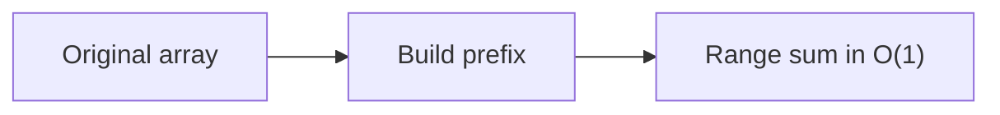

```cpp
vector<long long> buildPrefix(const vector<int>& a) {
    vector<long long> pref(a.size() + 1, 0);
    for (int i = 0; i < (int)a.size(); i++) {
        pref[i + 1] = pref[i] + a[i];
    }
    return pref;
}

long long rangeSum(const vector<long long>& pref, int l, int r) {
    return pref[r + 1] - pref[l];
}
```

### Dry run

```text
a = [1,2,3,4,5]
query [1,3] = 2+3+4 = 9
pref[4] - pref[1] = 10 - 1 = 9
```

---

## 23. Difference Arrays

Use when many range updates are needed.

For update `add x to [l, r]`:

```text
diff[l] += x
diff[r + 1] -= x
```

Then prefix the diff array.

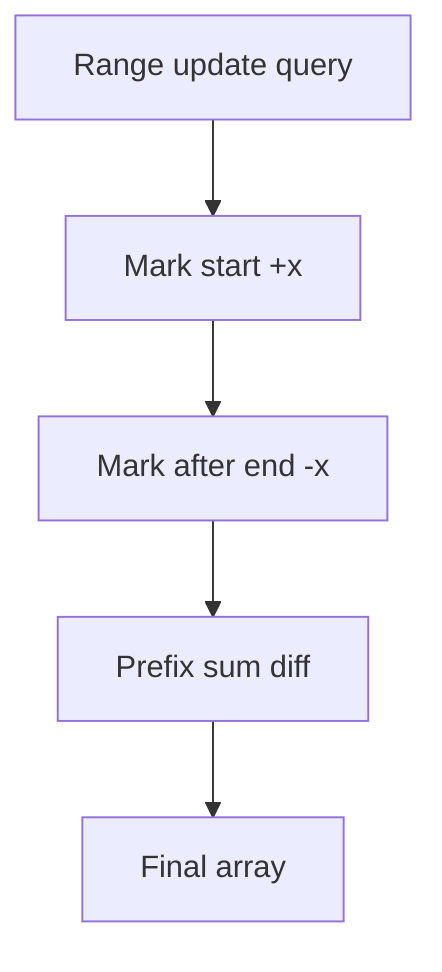

```cpp
vector<long long> applyRangeAdds(int n, vector<tuple<int,int,int>> queries) {
    vector<long long> diff(n + 1, 0);
    for (auto [l, r, x] : queries) {
        diff[l] += x;
        if (r + 1 < n) diff[r + 1] -= x;
    }
    vector<long long> a(n);
    long long cur = 0;
    for (int i = 0; i < n; i++) {
        cur += diff[i];
        a[i] = cur;
    }
    return a;
}
```

---

# Part D — Counting and Combinatorics

## 24. Counting Principles

Product rule:

```text
3 shirts and 2 pants = 3 * 2 = 6 outfits
```

Sum rule:

```text
3 tea options OR 4 coffee options = 7 options
```

Complement:

```text
good = total - bad
```

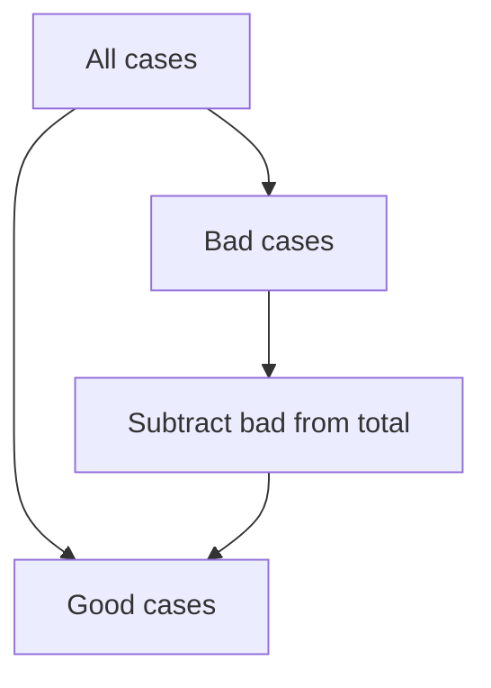

### Pattern

```text
If direct counting is hard, count total - invalid.
```

---

## 25. Factorial, Permutation, Combination

Factorial:

```text
5! = 5 * 4 * 3 * 2 * 1 = 120
```

Permutation: order matters.

```text
nP r = n! / (n-r)!
```

Combination: order does not matter.

```text
nC r = n! / (r!(n-r)!)
```

```cpp
long long nCrSmall(int n, int r) {
    if (r < 0 || r > n) return 0;
    r = min(r, n - r);
    long long ans = 1;
    for (int i = 1; i <= r; i++) {
        ans = ans * (n - r + i) / i;
    }
    return ans;
}
```

### Dry run: `5C2`

```text
Pick 2 from 5.
Ordered choices = 5 * 4 = 20.
Each pair counted 2! = 2 times.
Answer = 20 / 2 = 10.
```

---

## 26. Combinations Mod Prime

For large `nCr mod MOD`, precompute factorials and inverse factorials.

```cpp
const long long MOD = 1'000'000'007;

long long modPow(long long a, long long e) {
    long long r = 1;
    while (e) {
        if (e & 1) r = r * a % MOD;
        a = a * a % MOD;
        e >>= 1;
    }
    return r;
}

struct Comb {
    vector<long long> fact, invFact;

    Comb(int n) {
        fact.assign(n + 1, 1);
        invFact.assign(n + 1, 1);
        for (int i = 1; i <= n; i++) fact[i] = fact[i - 1] * i % MOD;
        invFact[n] = modPow(fact[n], MOD - 2);
        for (int i = n - 1; i >= 0; i--) invFact[i] = invFact[i + 1] * (i + 1) % MOD;
    }

    long long C(int n, int r) {
        if (r < 0 || r > n) return 0;
        return fact[n] * invFact[r] % MOD * invFact[n - r] % MOD;
    }
};
```

---

## 27. Stars and Bars

Number of non-negative integer solutions:

```text
x1 + x2 + ... + xk = n
answer = C(n + k - 1, k - 1)
```

Example:

```text
x + y + z = 4
answer = C(4 + 3 - 1, 3 - 1) = C(6,2) = 15
```

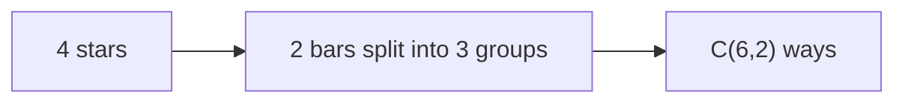

### Pattern

```text
Distribute identical items into boxes? Think stars and bars.
```

---

## 28. Inclusion-Exclusion

For two sets:

```text
|A ∪ B| = |A| + |B| - |A ∩ B|
```

For three sets:

```text
|A ∪ B ∪ C| = |A| + |B| + |C| - |A∩B| - |A∩C| - |B∩C| + |A∩B∩C|
```

### Example

Numbers from `1..100` divisible by `2` or `3`:

```text
divisible by 2 = 50
divisible by 3 = 33
divisible by 6 = 16
answer = 50 + 33 - 16 = 67
```

---

## 29. Probability Basics

```text
probability = favorable / total
```

Example:

```text
P(even on die) = 3 / 6 = 1/2
```

### Independent events

```text
P(A and B) = P(A) * P(B)
```

### Complement

```text
P(at least one success) = 1 - P(no success)
```

---

# Part E — Number Theory

## 30. Prime Check

Prime means exactly two divisors: `1` and itself.

Only check up to `sqrt(n)`.

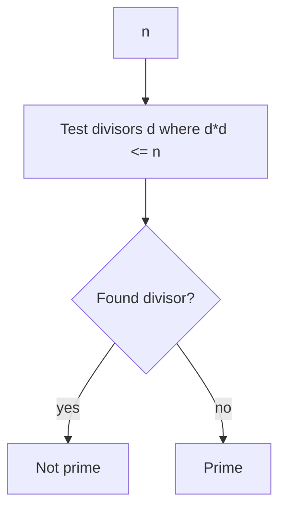

```cpp
bool isPrime(long long n) {
    if (n < 2) return false;
    for (long long d = 2; d * d <= n; d++) {
        if (n % d == 0) return false;
    }
    return true;
}
```

### Why only sqrt?

If `n = a * b`, at least one of `a` or `b` is `<= sqrt(n)`.

---

## 31. Sieve of Eratosthenes

Find all primes up to `n` in `O(n log log n)`.

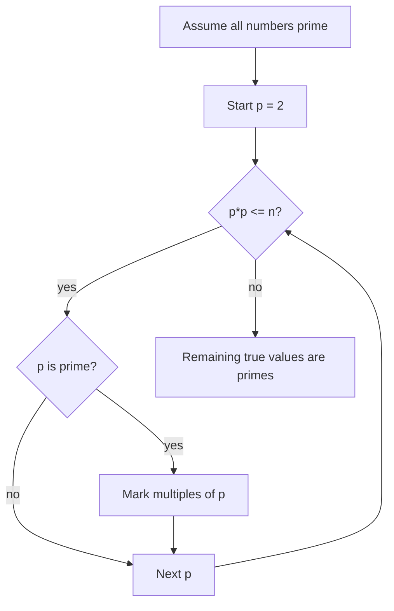

```cpp
vector<int> sieve(int n) {
    vector<bool> isPrime(n + 1, true);
    if (n >= 0) isPrime[0] = false;
    if (n >= 1) isPrime[1] = false;

    for (long long p = 2; p * p <= n; p++) {
        if (isPrime[p]) {
            for (long long x = p * p; x <= n; x += p) {
                isPrime[x] = false;
            }
        }
    }

    vector<int> primes;
    for (int i = 2; i <= n; i++) {
        if (isPrime[i]) primes.push_back(i);
    }
    return primes;
}
```

---

## 32. Prime Factorization

```cpp
vector<pair<long long,int>> factorize(long long n) {
    vector<pair<long long,int>> f;
    for (long long p = 2; p * p <= n; p++) {
        if (n % p == 0) {
            int cnt = 0;
            while (n % p == 0) {
                n /= p;
                cnt++;
            }
            f.push_back({p, cnt});
        }
    }
    if (n > 1) f.push_back({n, 1});
    return f;
}
```

### Example

```text
72 = 2^3 * 3^2
```

### Divisor count from factorization

If:

```text
n = p1^a1 * p2^a2 * ... * pk^ak
```

Then:

```text
number of divisors = (a1+1)(a2+1)...(ak+1)
```

For `72 = 2^3 * 3^2`:

```text
divisors = (3+1)(2+1) = 12
```

---

## 33. GCD and LCM

Euclid:

```text
gcd(a, b) = gcd(b, a % b)
```

```cpp
long long gcdll(long long a, long long b) {
    while (b != 0) {
        long long r = a % b;
        a = b;
        b = r;
    }
    return abs(a);
}

long long lcmll(long long a, long long b) {
    return a / gcdll(a, b) * b;
}
```

### Dry run: `gcd(48, 18)`

```text
gcd(48,18)
48 % 18 = 12
gcd(18,12)
18 % 12 = 6
gcd(12,6)
12 % 6 = 0
answer = 6
```

### Pattern

```text
Need common period? Use lcm.
Need common divisor? Use gcd.
```

---

## 34. Extended Euclid

Find integers `x, y` such that:

```text
ax + by = gcd(a, b)
```

```cpp
long long extGcd(long long a, long long b, long long &x, long long &y) {
    if (b == 0) {
        x = 1;
        y = 0;
        return a;
    }
    long long x1, y1;
    long long g = extGcd(b, a % b, x1, y1);
    x = y1;
    y = x1 - y1 * (a / b);
    return g;
}
```

### Where used

- modular inverse when mod is not prime
- linear Diophantine equations
- Chinese remainder theorem

---

## 35. Modular Inverse

Modular inverse of `a` modulo `m` is a number `x` such that:

```text
a * x ≡ 1 mod m
```

### If `m` is prime

```text
a^-1 ≡ a^(m-2) mod m
```

```cpp
long long modInversePrime(long long a, long long mod) {
    return modPow(a, mod - 2, mod);
}
```

### If `m` is not prime

Use Extended Euclid. Inverse exists only if `gcd(a, m) = 1`.

```cpp
long long modInverseAny(long long a, long long m) {
    long long x, y;
    long long g = extGcd(a, m, x, y);
    if (g != 1) return -1; // no inverse
    x %= m;
    if (x < 0) x += m;
    return x;
}
```

---

## 36. Fermat and Euler

### Fermat's little theorem

If `p` is prime and `a` is not divisible by `p`:

```text
a^(p-1) ≡ 1 mod p
```

Therefore:

```text
a^(p-2) ≡ a^-1 mod p
```

### Euler phi

`phi(n)` = count of numbers from `1..n` coprime to `n`.

If:

```text
n = p1^a1 * p2^a2 * ...
```

Then:

```text
phi(n) = n * (1 - 1/p1) * (1 - 1/p2) * ...
```

```cpp
long long phi(long long n) {
    long long ans = n;
    for (long long p = 2; p * p <= n; p++) {
        if (n % p == 0) {
            while (n % p == 0) n /= p;
            ans -= ans / p;
        }
    }
    if (n > 1) ans -= ans / n;
    return ans;
}
```

---

## 37. Divisors

List divisors in `O(sqrt(n))`.

```cpp
vector<long long> divisors(long long n) {
    vector<long long> d;
    for (long long i = 1; i * i <= n; i++) {
        if (n % i == 0) {
            d.push_back(i);
            if (i != n / i) d.push_back(n / i);
        }
    }
    sort(d.begin(), d.end());
    return d;
}
```

### Pattern

```text
Divisor problems often become sqrt(n), factorization, or divisor-count formula.
```

---

## 38. Chinese Remainder Theorem

Solve:

```text
x ≡ a1 mod m1
x ≡ a2 mod m2
```

For coprime moduli, solution exists modulo `m1*m2`.

### Brute mental example

```text
x ≡ 2 mod 3
x ≡ 3 mod 5

Numbers ≡ 2 mod 3: 2, 5, 8, 11, 14, 17...
Among these, 8 ≡ 3 mod 5.
Answer: x ≡ 8 mod 15
```

---

# Part F — Geometry and Coordinate Math

## 39. Geometry Basics

Rectangle:

```text
area = l * w
perimeter = 2(l + w)
```

Triangle:

```text
area = base * height / 2
```

Circle:

```text
area = pi * r^2
circumference = 2 * pi * r
```

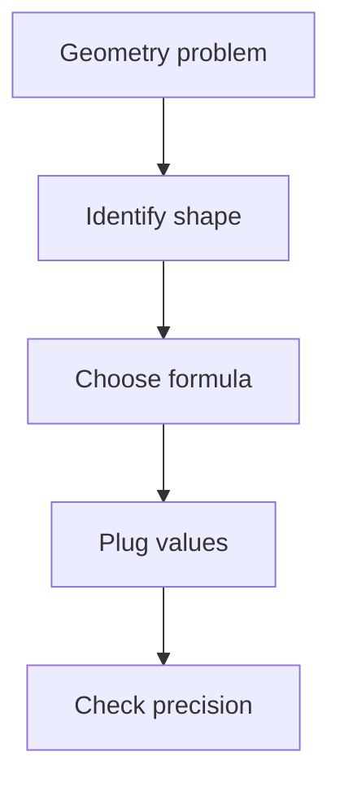

---

## 40. Coordinate Geometry

Distance between `(x1, y1)` and `(x2, y2)`:

```text
d = sqrt((x2-x1)^2 + (y2-y1)^2)
```

Squared distance avoids floating point:

```cpp
long long dist2(long long x1, long long y1, long long x2, long long y2) {
    long long dx = x2 - x1;
    long long dy = y2 - y1;
    return dx * dx + dy * dy;
}
```

### Pattern

```text
If comparing distances, compare squared distances.
```

---

## 41. Vectors, Dot Product, Cross Product

For vectors `a = (x1,y1)` and `b = (x2,y2)`:

Dot product:

```text
a · b = x1*x2 + y1*y2
```

Cross product:

```text
a × b = x1*y2 - y1*x2
```

```cpp
struct Point {
    long long x, y;
};

long long dot(Point a, Point b) {
    return a.x * b.x + a.y * b.y;
}

long long cross(Point a, Point b) {
    return a.x * b.y - a.y * b.x;
}

Point operator-(Point a, Point b) {
    return {a.x - b.x, a.y - b.y};
}
```

### Meaning

```text
dot > 0  : angle less than 90 degrees
dot = 0  : perpendicular
dot < 0  : angle greater than 90 degrees

cross > 0: left turn
cross = 0: collinear
cross < 0: right turn
```

---

## 42. Orientation and Segment Intersection

Orientation of `a -> b -> c`:

```cpp
long long orient(Point a, Point b, Point c) {
    return cross(b - a, c - a);
}
```

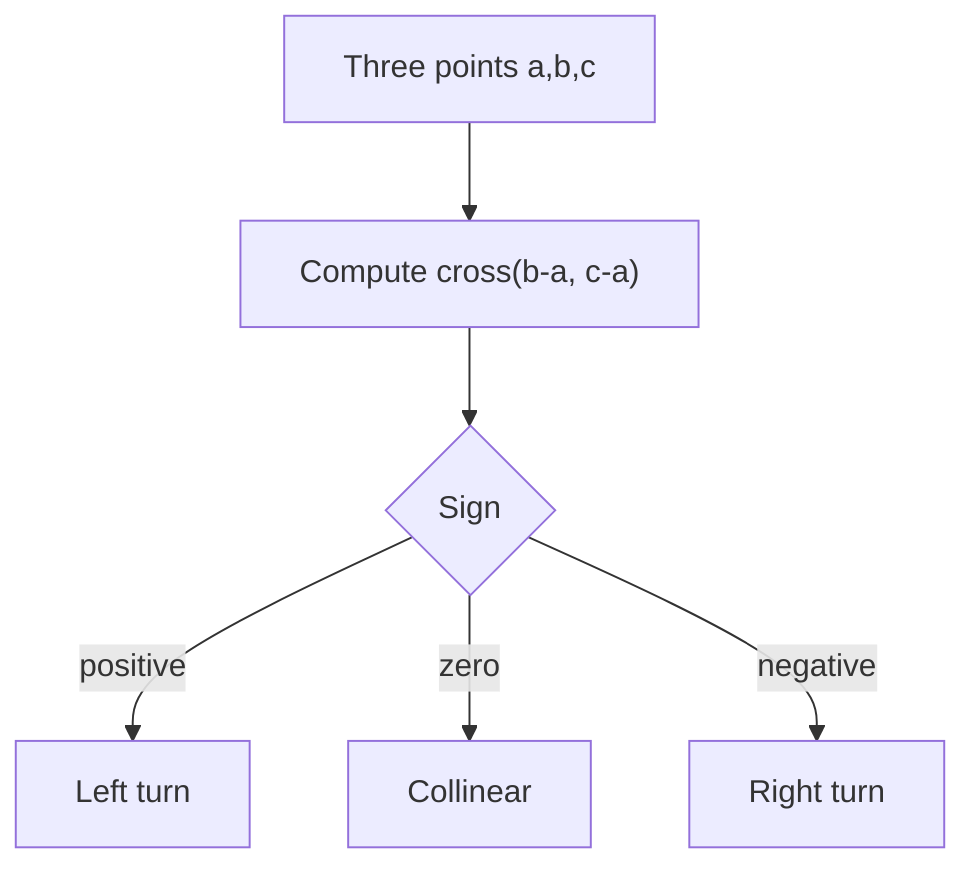

---

## 43. Polygon Area

Shoelace formula:

```text
2 * area = |sum(x_i*y_{i+1} - y_i*x_{i+1})|
```

```cpp
long long twicePolygonArea(const vector<Point>& p) {
    int n = p.size();
    long long s = 0;
    for (int i = 0; i < n; i++) {
        int j = (i + 1) % n;
        s += p[i].x * p[j].y - p[i].y * p[j].x;
    }
    return llabs(s);
}
```

---

# Part G — Complexity Math and Patterns

## 44. Big O Recognition

```text
O(1)        constant
O(log n)    halving
O(n)        one loop
O(n log n)  sorting / divide and conquer
O(n^2)      nested loops
O(2^n)      subsets / brute force choices
O(n!)       permutations
```

### Constraint guide

| n | Usually accepted |
|---:|---|
| 10 | `O(n!)`, `O(2^n)` maybe |
| 20 | `O(2^n)` maybe |
| 100 | `O(n^3)` maybe |
| 2,000 | `O(n^2)` maybe |
| 2e5 | `O(n log n)` or `O(n)` |
| 1e9 | `O(log n)` or `O(1)` |

---

## 45. Nested Loops

Full nested loop:

```cpp
for (int i = 1; i <= n; i++) {
    for (int j = 1; j <= n; j++) {
        // O(1)
    }
}
```

Time:

```text
n * n = O(n^2)
```

Triangular loop:

```text
n + (n-1) + ... + 1 = n(n+1)/2 = O(n^2)
```

```mermaid
flowchart TD
    A["Outer loop"] --> B["Inner work"]
    B --> C{"Inner behavior"}
    C -->|runs n times| D["O(n^2)"]
    C -->|halves each time| E["O(n log n) or O(log n)"]
    C -->|total movement at most n| F["O(n), two pointers"]
```

---

## 46. Binary Search on Answer

Use when answer is monotonic.

```text
false false false true true true
```

Find first true.

```mermaid
flowchart TD
    A["Choose search range"] --> B["Compute mid"]
    B --> C{"Can(mid)?"}
    C -->|true| D["Answer <= mid"]
    C -->|false| E["Answer > mid"]
    D --> F["Shrink right"]
    E --> G["Shrink left"]
    F --> H["Repeat"]
    G --> H
```

```cpp
long long firstTrue(long long lo, long long hi) {
    while (lo < hi) {
        long long mid = lo + (hi - lo) / 2;
        if (can(mid)) hi = mid;
        else lo = mid + 1;
    }
    return lo;
}
```

### Pattern

```text
Minimum x such that condition becomes possible? Binary search answer.
Maximum x such that condition remains possible? Binary search answer.
```

---

## 47. Two Pointers Math

When both pointers move only forward, total moves are `O(n)`.

```mermaid
flowchart LR
    A["l = 0, r = 0"] --> B["Expand r"]
    B --> C{"Condition valid?"}
    C -->|yes| D["Update answer"]
    C -->|no| E["Move l"]
    D --> B
    E --> C
```

### C++ skeleton

```cpp
int n = a.size();
long long sum = 0;
int l = 0;
for (int r = 0; r < n; r++) {
    sum += a[r];
    while (sum > K) {
        sum -= a[l];
        l++;
    }
    // window [l, r] is valid
}
```

---

## 48. Contribution Technique

Instead of counting for every subarray separately, count how many times each element contributes.

For sum of all subarray sums:

```text
a[i] appears in (i + 1) * (n - i) subarrays
```

```cpp
long long sumOfAllSubarraySums(const vector<int>& a) {
    int n = a.size();
    long long ans = 0;
    for (int i = 0; i < n; i++) {
        ans += 1LL * a[i] * (i + 1) * (n - i);
    }
    return ans;
}
```

### Dry run

```text
a = [1,2,3]
Element 1 appears in 1*3 = 3 subarrays
Element 2 appears in 2*2 = 4 subarrays
Element 3 appears in 3*1 = 3 subarrays
Answer = 1*3 + 2*4 + 3*3 = 20
```

---

## 49. Prefix XOR and XOR Tricks

XOR facts:

```text
x ^ x = 0
x ^ 0 = x
x ^ y = y ^ x
```

Prefix XOR:

```text
xor(l..r) = pref[r+1] ^ pref[l]
```

```cpp
vector<int> buildPrefixXor(const vector<int>& a) {
    vector<int> pref(a.size() + 1, 0);
    for (int i = 0; i < (int)a.size(); i++) {
        pref[i + 1] = pref[i] ^ a[i];
    }
    return pref;
}
```

### Pattern

```text
Pairs cancel? Think XOR.
Range xor queries? Think prefix XOR.
```

---

## 50. Game Theory Basics

Many CP games use winning/losing states.

```text
Losing state: no move to winning state.
Winning state: at least one move to losing state.
```

```mermaid
flowchart TD
    A["Current state"] --> B{"Can move to losing state?"}
    B -->|yes| C["Winning"]
    B -->|no| D["Losing"]
```

### Nim XOR rule

For piles:

```text
xorSum = pile1 ^ pile2 ^ ... ^ pileN
```

```text
xorSum = 0     => losing for current player
xorSum != 0    => winning for current player
```

---

## 51. DP Math Foundations

DP is math with states and recurrence.

```mermaid
flowchart TD
    A["Define state"] --> B["Define transition"]
    B --> C["Base cases"]
    C --> D["Order of computation"]
    D --> E["Answer extraction"]
```

### Fibonacci example

```text
dp[i] = dp[i-1] + dp[i-2]
```

```cpp
long long fib(int n) {
    if (n <= 1) return n;
    vector<long long> dp(n + 1);
    dp[0] = 0;
    dp[1] = 1;
    for (int i = 2; i <= n; i++) {
        dp[i] = dp[i - 1] + dp[i - 2];
    }
    return dp[n];
}
```

### CP DP question checklist

```text
What information is enough to describe the current position?
What choices can I make?
How does each choice change the state?
What are the base cases?
Can I optimize memory?
```

---

# Part H — Templates and Roadmap

## 52. C++ Math Template

```cpp
#include <bits/stdc++.h>
using namespace std;

using ll = long long;
const ll MOD = 1'000'000'007;

ll norm(ll x, ll mod = MOD) {
    x %= mod;
    if (x < 0) x += mod;
    return x;
}

ll modAdd(ll a, ll b, ll mod = MOD) {
    return norm(norm(a, mod) + norm(b, mod), mod);
}

ll modSub(ll a, ll b, ll mod = MOD) {
    return norm(norm(a, mod) - norm(b, mod), mod);
}

ll modMul(ll a, ll b, ll mod = MOD) {
    return (__int128)norm(a, mod) * norm(b, mod) % mod;
}

ll modPow(ll base, ll exp, ll mod = MOD) {
    ll res = 1 % mod;
    base = norm(base, mod);
    while (exp > 0) {
        if (exp & 1) res = modMul(res, base, mod);
        base = modMul(base, base, mod);
        exp >>= 1;
    }
    return res;
}

ll gcdll(ll a, ll b) {
    while (b) {
        ll r = a % b;
        a = b;
        b = r;
    }
    return abs(a);
}

ll lcmll(ll a, ll b) {
    return a / gcdll(a, b) * b;
}

ll ceilDiv(ll a, ll b) {
    return a / b + (a % b != 0);
}
```

---

## 53. Java Math Helpers

```java
import java.util.*;

class MathUtil {
    static final long MOD = 1_000_000_007L;

    static long norm(long x, long mod) {
        x %= mod;
        if (x < 0) x += mod;
        return x;
    }

    static long modPow(long base, long exp, long mod) {
        long res = 1 % mod;
        base = norm(base, mod);
        while (exp > 0) {
            if ((exp & 1) == 1) res = (res * base) % mod;
            base = (base * base) % mod;
            exp >>= 1;
        }
        return res;
    }

    static long gcd(long a, long b) {
        while (b != 0) {
            long r = a % b;
            a = b;
            b = r;
        }
        return Math.abs(a);
    }

    static long lcm(long a, long b) {
        return a / gcd(a, b) * b;
    }

    static long ceilDiv(long a, long b) {
        return a / b + (a % b != 0 ? 1 : 0);
    }
}
```

---

## 54. Formula Sheet

```text
ceil(a/b) = (a+b-1)/b              positive a,b
safe ceil(a/b) = a/b + (a%b != 0)  positive a,b
sum 1..n = n(n+1)/2
sum squares = n(n+1)(2n+1)/6
sum cubes = [n(n+1)/2]^2
arithmetic nth = a1 + (n-1)d
arithmetic sum = n(a1+an)/2
geometric nth = a1*r^(n-1)
geometric sum = a1(r^n-1)/(r-1)
bits = floor(log2 n)+1
digits = floor(log10 n)+1
nCr = n!/(r!(n-r)!)
gcd(a,b) = gcd(b, a%b)
lcm(a,b) = a/gcd(a,b)*b
mod inverse prime = a^(MOD-2) mod MOD
divisors count of p1^a1*p2^a2 = (a1+1)(a2+1)
phi(n) = n * product over p|n of (1 - 1/p)
subarrays count = n(n+1)/2
a[i] contribution to all subarrays = (i+1)(n-i)
```

---

## 55. Pattern Recognition Table

| Problem clue | Think |
|---|---|
| Repeats every k | Modulo cycle |
| Minimum days/groups/moves | Ceiling division |
| Very large exponent | Binary exponentiation |
| Need answer modulo prime | Modular arithmetic, inverse |
| Range sum queries | Prefix sum |
| Many range add updates | Difference array |
| Count ways to choose | Combination |
| Direct count hard | Complement / inclusion-exclusion |
| Divisibility / factors | GCD, primes, factorization |
| Common period | LCM |
| Halving search space | Logarithm / binary search |
| Minimum valid value | Binary search on answer |
| Pairs cancel | XOR |
| All subarray sums | Contribution technique |
| Points and turns | Cross product |
| Game with piles | XOR / winning-losing state |
| n <= 20 | Bitmask / subsets possible |
| n <= 2e5 | Need O(n) or O(n log n) |

---

## 56. Roadmap to CM Math Strength

### Stage 1 — Foundation

Master these first:

```text
ceil division
modulo
gcd/lcm
prefix sums
binary exponentiation
basic combinatorics
big O
```

Practice target:

```text
Codeforces 800-1200 math problems
```

### Stage 2 — Intermediate CP Math

Master:

```text
sieve
factorization
mod inverse
nCr mod prime
binary search on answer
two pointers math
contribution technique
```

Practice target:

```text
Codeforces 1200-1600 math/number theory problems
```

### Stage 3 — Advanced CM Toolkit

Master:

```text
inclusion-exclusion
Euler phi
extended Euclid
CRT basics
geometry cross product
DP recurrence math
game theory basics
```

Practice target:

```text
Codeforces 1600-1900 problems, then virtual contests
```

### Weekly training framework

```text
Day 1: Number theory + implementation
Day 2: Prefix sums / contribution / binary search
Day 3: Combinatorics + modulo
Day 4: Geometry or DP math
Day 5: Mixed problemset
Day 6: Virtual contest
Day 7: Upsolve and notes
```

---

## 57. Final Mental Checklist

```mermaid
flowchart TD
    A["Stuck"] --> B["Try small examples"]
    B --> C["Find pattern"]
    C --> D{"Pattern type?"}
    D --> E["Modulo"]
    D --> F["Sum formula"]
    D --> G["Counting"]
    D --> H["GCD / prime"]
    D --> I["Binary search"]
    D --> J["Prefix / contribution"]
    E --> K["Check edge cases"]
    F --> K
    G --> K
    H --> K
    I --> K
    J --> K
    K --> L["Check overflow"]
    L --> M["Code helper"]
    M --> N["Dry run sample"]
```

Ask yourself:

1. Can I use a modulo cycle?
2. Can I replace loops with a sum formula?
3. Can I use prefix sum or difference array?
4. Can I count complement instead of direct cases?
5. Is there a log or halving pattern?
6. Is the answer monotonic for binary search?
7. Do I need `long long` or `__int128`?
8. Can I divide before multiplying?
9. Does order matter? If yes, permutation. If no, combination.
10. Are pairs canceling? Try XOR.
11. Is it a common divisor or common period? Try GCD or LCM.
12. Can I count each element's contribution instead of each subarray?

---

## Final Advice

To reach CM, do not only memorize formulas. For each formula, learn:

```text
1. When to recognize it
2. Why it works
3. How to dry run it
4. How to code it safely
5. What edge cases break it
```

The strongest CP math skill is turning a problem statement into a small invariant, formula, or monotonic condition.

END
