# CP DSA Math Visual Reference — Candidate Master Improved Edition with Flow Charts

> Optimized render-safe edition: duplicate table diagrams and generic problem diagrams were removed; each problem keeps the useful detailed solution flowchart and dry-run flowchart.


> This version keeps the original guide content and adds detailed Mermaid solution-step flowcharts plus dry-run flowcharts for each practice problem.

A visual, step-by-step mathematical foundation guide for Competitive Programming and DSA, aimed at building strong fundamentals toward Candidate Master level.


---

## Clickable Index

- [0. Master Mental Map](#0-master-mental-map)
- [1. Ceiling Division](#1-ceiling-division)
- [2. Modulo and Cycles](#2-modulo-and-cycles)
- [3. Binary Exponentiation](#3-binary-exponentiation)
- [4. Modular Arithmetic](#4-modular-arithmetic)
- [5. GCD and LCM](#5-gcd-and-lcm)
- [6. Primes and Divisors](#6-primes-and-divisors)
- [7. Prefix Sum](#7-prefix-sum)
- [8. Arithmetic and Geometric Sequences](#8-arithmetic-and-geometric-sequences)
- [9. Summation Formulas](#9-summation-formulas)
- [10. Counting Permutation Combination](#10-counting-permutation-combination)
- [11. Logs Bits and Halving](#11-logs-bits-and-halving)
- [12. Algebra and Equations](#12-algebra-and-equations)
- [13. Quadratic Formula](#13-quadratic-formula)
- [14. Geometry Basics](#14-geometry-basics)
- [15. Big O Mathematics](#15-big-o-mathematics)
- [16. CP Problem Solving Framework](#16-cp-problem-solving-framework)
- [17. Candidate Master Pattern Library](#17-candidate-master-pattern-library)
- [18. Final Formula Sheet](#18-final-formula-sheet)
- [19. Practice Roadmap](#19-practice-roadmap)
- [20. Compact C++ Template](#20-compact-c-template)
- [21. Java Helper Pack](#21-java-helper-pack)

---

## 0. Master Mental Map

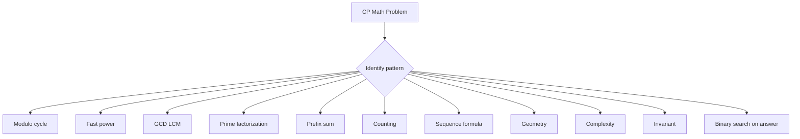

Core idea:

> CP math converts slow simulation into formulas, patterns, and reusable helpers.

General framework:

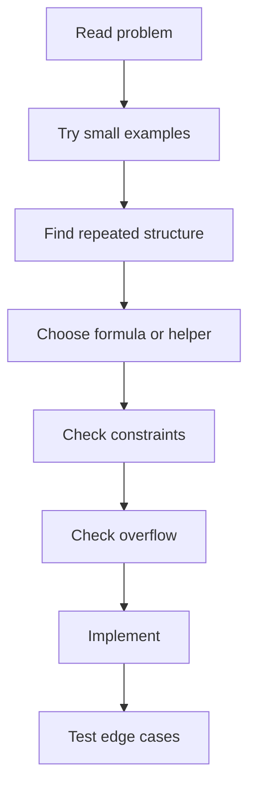

### Master Pattern Table

| Signal in problem | Mathematical thought | Typical tool |
|---|---|---|
| minimum groups or days | round up division | ceiling division |
| repeated after k steps | cycle position | modulo |
| huge exponent | use binary bits | binary exponentiation |
| divide under modulo | multiply by inverse | Fermat or extended gcd |
| common divisor | reduce using gcd | Euclid |
| cycles meet | common multiple | lcm |
| many range sums | subtract prefix | prefix sum |
| count ways | product sum complement | combinatorics |
| order matters | arrangement | permutation |
| order ignored | selection | combination |
| repeated halving | logarithmic steps | binary search or powers |
| prime factors matter | exponent formula | factorization |
| large n up to 1e9 | no linear loops | formula or log |
| construct answer | preserve truth | invariant |

### Problem Solving Loop

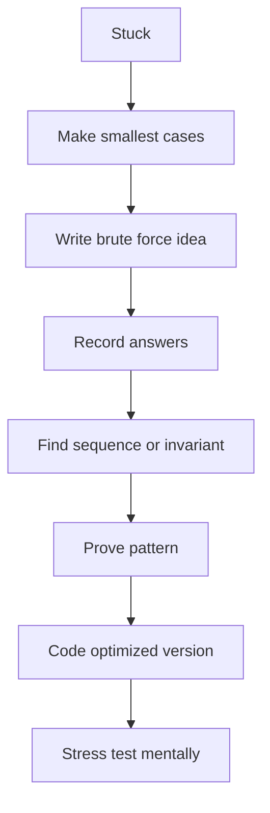


---

## 1. Ceiling Division

### Formula

For positive integers `a` and `b`:

```text
ceil(a / b) = (a + b - 1) / b
```

Equivalent safer formula:

```text
ceil(a / b) = a / b + (a % b != 0)
```

For non negative integers, the second formula avoids overflow from `a + b - 1`.

### When to use

Use when you need minimum groups, days, operations, pages, packets, buses, boxes, rounds, or batches.

### Example

```text
a = 10 items
b = 3 items per group
ceil(10 / 3) = 4 groups
```

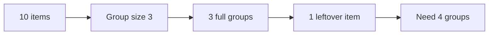

### C++ Helper

```cpp
long long ceilDiv(long long a, long long b) {
return a / b + (a % b != 0);
}
```

### Signed version

```cpp
long long floorDiv(long long a, long long b) {
long long q = a / b;
long long r = a % b;
if (r != 0 && ((r > 0) != (b > 0))) q--;
return q;
}

long long ceilDivSigned(long long a, long long b) {
long long q = a / b;
long long r = a % b;
if (r != 0 && ((r > 0) == (b > 0))) q++;
return q;
}
```

### Dry Run

```text
a = 17, b = 5
17 / 5 = 3 remainder 2
Since remainder exists, answer = 3 + 1 = 4
```

### Pattern

If the problem says:

```text
minimum number of operations where each operation handles at most k items
```

Think:

```text
ceil(n / k)
```

### Practice Problem: [Codeforces 151A Soft Drinking](https://codeforces.com/problemset/problem/151/A)

| Field | Details |
|---|---|
| Topic | Ceiling Division |
| Main concepts | minimum among limiting resources, integer division |
| Goal | Convert the statement into a known math pattern |
| Code hint | Compute each resource capacity and take minimum. |
| Complexity | O(1) |


#### Mermaid Table Diagram

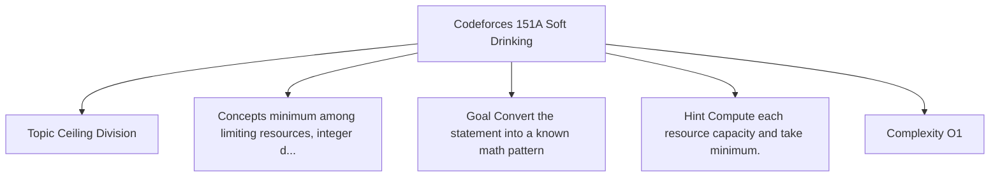


#### Approach Logic


1. Compute how many toasts can be made from drink.
2. Compute how many toasts can be made from limes.
3. Compute how many toasts can be made from salt.
4. The answer is the minimum of these values divided by number of friends.
5. This is not pure ceiling division, but it trains integer groups and bottleneck thinking.


#### Detailed Solution Flowchart

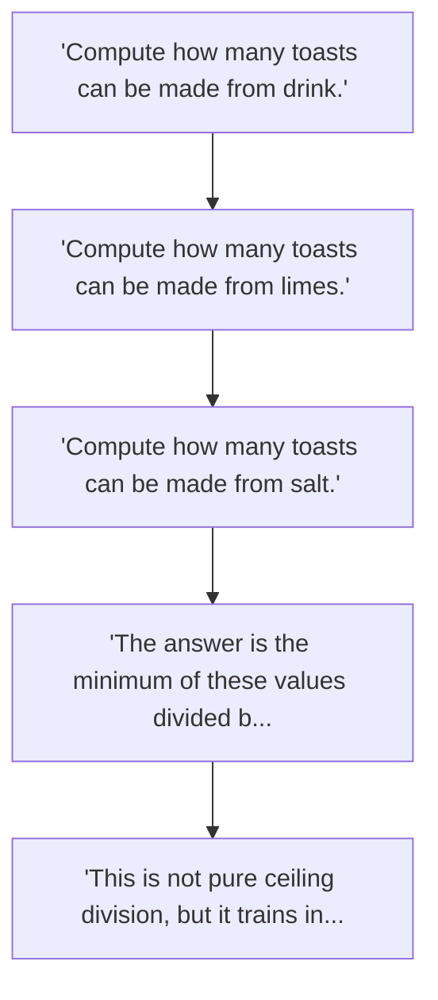

#### Dry Run

```text
n = 3 friends
drink gives 10 total toasts
limes give 6 toasts
salt gives 9 toasts
bottleneck = 6
answer = 6 / 3 = 2
```

#### Dry Run Flowchart

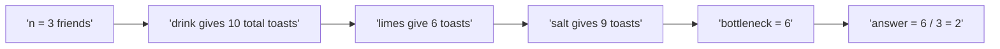

### Practice Problem: [Codeforces 919A Supermarket](https://codeforces.com/problemset/problem/919/A)

| Field | Details |
|---|---|
| Topic | Ceiling Division |
| Main concepts | ratio comparison, price per unit, minimum value |
| Goal | Convert the statement into a known math pattern |
| Code hint | Track minimum double ratio. |
| Complexity | O(n) |


#### Mermaid Table Diagram

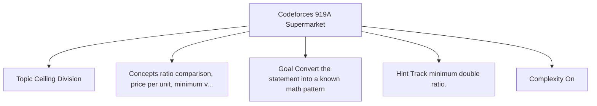


#### Approach Logic


1. For each shop, compute price per unit as `a / b`.
2. Find the minimum price per unit.
3. Multiply by required amount.
4. Use double because the answer can be fractional.


#### Detailed Solution Flowchart

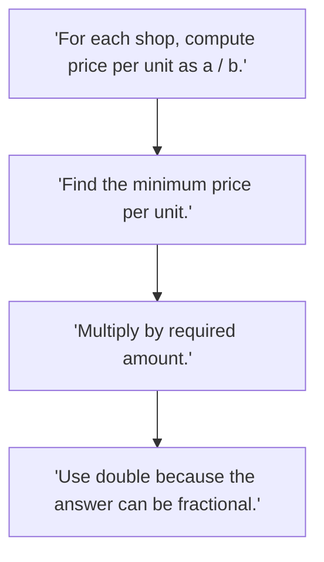

#### Dry Run

```text
Shop 1 price 10 for 2 kg gives 5 per kg
Shop 2 price 15 for 5 kg gives 3 per kg
Need 4 kg
answer = 3 * 4 = 12
```

#### Dry Run Flowchart

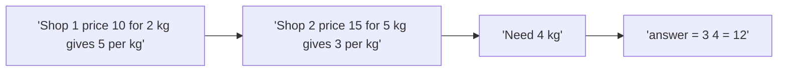


---

## 2. Modulo and Cycles

### Formula

```text
remainder = a % m
```

Modulo keeps a number inside range:

```text
0 to m - 1
```

Cycle movement:

```text
new_position = (start + steps) % cycle_length
```

Negative normalization:

```text
normalized = ((x % m) + m) % m
```

### Meaning

Modulo means position inside a repeated cycle.

### Example

```text
Today = 3
After 100 days in a 7 day cycle:
(3 + 100) % 7 = 103 % 7 = 5
```

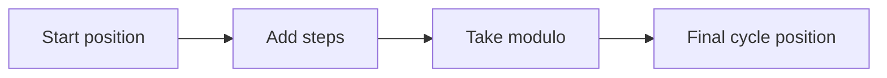

### C++ Helper

```cpp
long long norm(long long x, long long mod) {
x %= mod;
if (x < 0) x += mod;
return x;
}
```

### Dry Run

```text
x = -3, mod = 7
-3 % 7 = -3 in C++
Add 7
answer = 4
```

### Pattern

If the problem says:

```text
repeats every k
clock
days
circular array
large number of moves
```

Think modulo.

### Practice Problem: [Codeforces 913A Modular Exponentiation](https://codeforces.com/problemset/problem/913/A)

| Field | Details |
|---|---|
| Topic | Modulo and Cycles |
| Main concepts | modulo, powers of two, overflow avoidance |
| Goal | Convert the statement into a known math pattern |
| Code hint | If n is large enough, directly print m. |
| Complexity | O(1) |


#### Mermaid Table Diagram

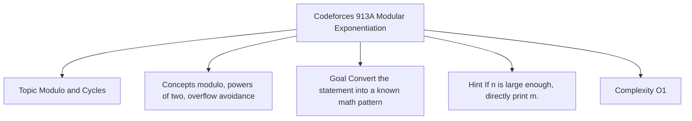


#### Approach Logic


1. The problem asks for `m mod 2^n`.
2. If `n` is very large, then `2^n` is bigger than `m`, so answer is `m`.
3. Otherwise compute `2^n` safely and output `m % value`.
4. Key trick: avoid computing impossible huge powers.


#### Detailed Solution Flowchart

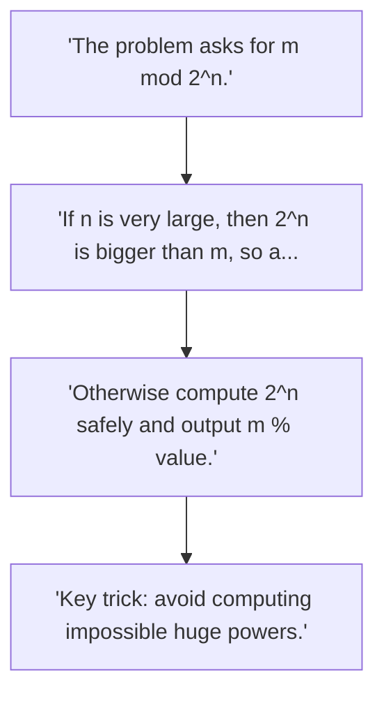

#### Dry Run

```text
n = 3, m = 10
2^3 = 8
10 mod 8 = 2
answer = 2

n = 40, m = 100
2^40 is larger than 100
100 mod huge number = 100
answer = 100
```

#### Dry Run Flowchart

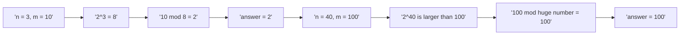

### Practice Problem: [CSES Increasing Array](https://cses.fi/problemset/task/1094)

| Field | Details |
|---|---|
| Topic | Modulo and Cycles |
| Main concepts | monotonic invariant, operation count |
| Goal | Convert the statement into a known math pattern |
| Code hint | Track previous maximum. |
| Complexity | O(n) |


#### Mermaid Table Diagram

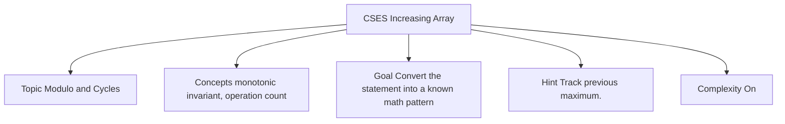


#### Approach Logic


1. Maintain the invariant that the processed prefix is non decreasing.
2. If current value is smaller than previous value, increase it to previous value.
3. Add the difference to answer.
4. This is a math invariant problem more than a simulation problem.


#### Detailed Solution Flowchart

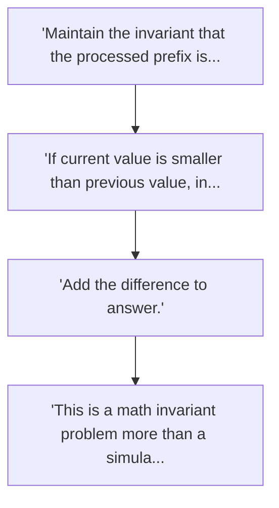

#### Dry Run

```text
array = 3 2 5 1 7
prev = 3
2 is smaller than 3, add 1, make it 3
5 is okay, prev = 5
1 is smaller than 5, add 4, make it 5
7 is okay
answer = 1 + 4 = 5
```

#### Dry Run Flowchart

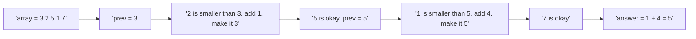


---

## 3. Binary Exponentiation

### Mathematical formula

```text
x^n = x^(n/2) * x^(n/2), if n is even
x^n = x^(n/2) * x^(n/2) * x, if n is odd
```

Binary representation idea:

```text
13 = 8 + 4 + 1
x^13 = x^8 * x^4 * x^1
```

### Flowchart

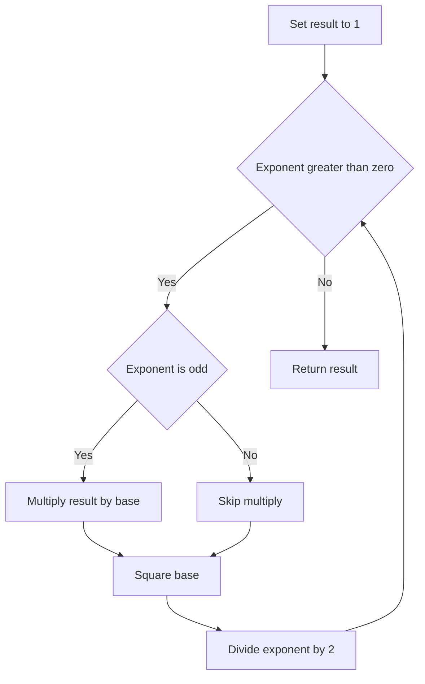

### C++ Helper

```cpp
long long binPow(long long base, long long exp) {
long long res = 1;
while (exp > 0) {
if (exp & 1) res *= base;
base *= base;
exp >>= 1;
    }
return res;
}
```

### Modular C++ Helper

```cpp
long long modPow(long long base, long long exp, long long mod) {
long long res = 1 % mod;
base %= mod;
while (exp > 0) {
if (exp & 1) res = (__int128)res * base % mod;
base = (__int128)base * base % mod;
exp >>= 1;
    }
return res;
}
```

### Java Helper

```java
static long modPow(long base, long exp, long mod) {
long res = 1 % mod;
base %= mod;
while (exp > 0) {
if ((exp & 1) == 1) res = (res * base) % mod;
base = (base * base) % mod;
exp >>= 1;
    }
return res;
}
```

### Dry Run: compute `3^13`

```text
13 in binary = 1101
Use powers: 3^1, 3^4, 3^8
3^13 = 3^8 * 3^4 * 3^1
```

| exp | base | res | action |
|---:|---:|---:|---|
| 13 | 3 | 1 | odd so res becomes 3 |
| 6 | 9 | 3 | even so skip |
| 3 | 81 | 3 | odd so res becomes 243 |
| 1 | 6561 | 243 | odd so res becomes 1594323 |
| 0 | done | 1594323 | return |

### Pattern

Use binary exponentiation when:

```text
exponent is huge
need power modulo M
need repeated squaring
need matrix power later
```

### Practice Problem: [CSES Exponentiation](https://cses.fi/problemset/task/1095)

| Field | Details |
|---|---|
| Topic | Binary Exponentiation |
| Main concepts | binary exponentiation, modulo, many queries |
| Goal | Convert the statement into a known math pattern |
| Code hint | Use modPow(a, b, MOD). |
| Complexity | O(log b) per query |


#### Mermaid Table Diagram

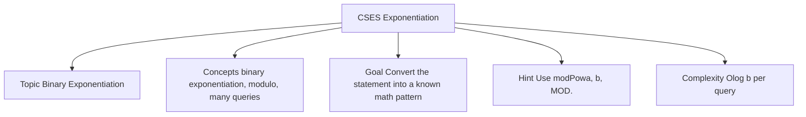


#### Approach Logic


1. Each query gives `a` and `b`.
2. Direct multiplication is impossible when `b` is large.
3. Use modular binary exponentiation.
4. For every odd exponent bit, multiply answer by current base.
5. Square base every step and halve exponent.


#### Detailed Solution Flowchart

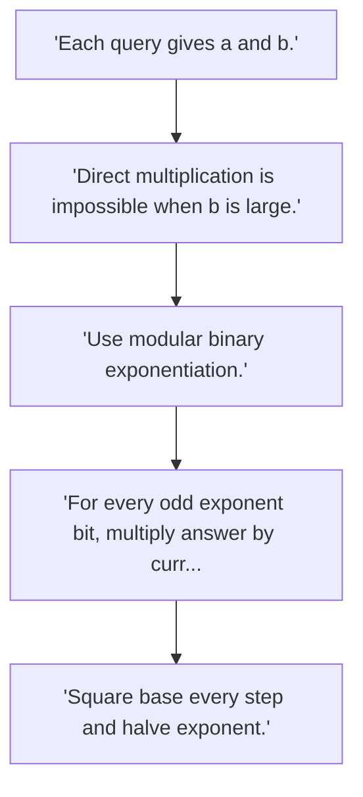

#### Dry Run

```text
a = 3, b = 13, mod = 1000000007
13 binary is 1101
Use powers 3^1, 3^4, 3^8
answer = 1594323
```

#### Dry Run Flowchart

```mermaid
flowchart LR
    D5_0["'a = 3, b = 13, mod = 1000000007'"]
    D5_1["'13 binary is 1101'"]
    D5_2["'Use powers 3^1, 3^4, 3^8'"]
    D5_3["'answer = 1594323'"]
    D5_0 --> D5_1
    D5_1 --> D5_2
    D5_2 --> D5_3
```

### Practice Problem: [CSES Exponentiation II](https://cses.fi/problemset/task/1712)

| Field | Details |
|---|---|
| Topic | Binary Exponentiation |
| Main concepts | Fermat reduction, nested exponent, modular power |
| Goal | Convert the statement into a known math pattern |
| Code hint | Use modPow twice. |
| Complexity | O(log c plus log MOD) |


#### Mermaid Table Diagram

```mermaid
flowchart TD
A["CSES Exponentiation II"] --> B["Topic Binary Exponentiation"]
A --> C["Concepts Fermat reduction, nested exponent, modular..."]
A --> D["Goal Convert the statement into a known math pattern"]
A --> E["Hint Use modPow twice."]
A --> F["Complexity Olog c plus log MOD"]
```


#### Approach Logic


1. Need compute `a^(b^c) mod MOD`.
2. Since MOD is prime, reduce exponent modulo `MOD minus 1`.
3. Compute `e = b^c mod MOD minus 1`.
4. Answer is `a^e mod MOD`.
5. This combines Fermat theorem and binary exponentiation.


#### Detailed Solution Flowchart

```mermaid
flowchart TD
    S6_0["'Need compute a^(b^c) mod MOD.'"]
    S6_1["'Since MOD is prime, reduce exponent modulo MOD minu..."]
    S6_2["'Compute e = b^c mod MOD minus 1.'"]
    S6_3["'Answer is a^e mod MOD.'"]
    S6_4["'This combines Fermat theorem and binary exponentiat..."]
    S6_0 --> S6_1
    S6_1 --> S6_2
    S6_2 --> S6_3
    S6_3 --> S6_4
```

#### Dry Run

```text
a = 2, b = 3, c = 2
exponent = 3^2 = 9
answer = 2^9 = 512
For huge values compute exponent modulo MOD minus 1
```

#### Dry Run Flowchart

```mermaid
flowchart LR
    D6_0["'a = 2, b = 3, c = 2'"]
    D6_1["'exponent = 3^2 = 9'"]
    D6_2["'answer = 2^9 = 512'"]
    D6_3["'For huge values compute exponent modulo MOD minus 1'"]
    D6_0 --> D6_1
    D6_1 --> D6_2
    D6_2 --> D6_3
```


---

## 4. Modular Arithmetic

### Formulas

```text
(a + b) mod M = ((a mod M) + (b mod M)) mod M
(a - b) mod M = ((a mod M) - (b mod M) + M) mod M
(a * b) mod M = ((a mod M) * (b mod M)) mod M
```

For prime `M` and `a` not divisible by `M`:

```text
a^(-1) mod M = a^(M - 2) mod M
```

This is based on Fermat's Little Theorem:

```text
a^(M - 1) = 1 mod M
```

### Flowchart

```mermaid
flowchart TD
A["Need division under modulo"] --> B{Modulo is prime}
B -->|Yes| C["Use Fermat inverse"]
C --> D["Compute power M minus 2"]
B -->|No| E["Use extended gcd if inverse exists"]
```

### C++ Helper

```cpp
const long long MOD = 1000000007LL;

long long addMod(long long a, long long b) {
return (a % MOD + b % MOD) % MOD;
}

long long subMod(long long a, long long b) {
return (a % MOD - b % MOD + MOD) % MOD;
}

long long mulMod(long long a, long long b) {
return (__int128)(a % MOD) * (b % MOD) % MOD;
}

long long modInversePrime(long long a) {
return modPow(a, MOD - 2, MOD);
}
```

### Dry Run

Find `3 / 2 mod 7`.

```text
Division means multiply by inverse.
2 inverse mod 7 = 2^(7 - 2) mod 7 = 2^5 mod 7 = 32 mod 7 = 4
3 / 2 mod 7 = 3 * 4 mod 7 = 12 mod 7 = 5
```

### Practice Problem: [CSES Binomial Coefficients](https://cses.fi/problemset/task/1079)

| Field | Details |
|---|---|
| Topic | Modular Arithmetic |
| Main concepts | factorials, inverse factorials, nCr modulo prime |
| Goal | Convert the statement into a known math pattern |
| Code hint | Precompute factorial and inverse factorial. |
| Complexity | O(maxN log MOD plus q) |


#### Mermaid Table Diagram

```mermaid
flowchart TD
A["CSES Binomial Coefficients"] --> B["Topic Modular Arithmetic"]
A --> C["Concepts factorials, inverse factorials, nCr modulo..."]
A --> D["Goal Convert the statement into a known math pattern"]
A --> E["Hint Precompute factorial and inverse factorial."]
A --> F["Complexity OmaxN log MOD plus q"]
```


#### Approach Logic


1. Need answer many `nCr` queries under prime modulo.
2. Precompute factorials up to maximum n.
3. Precompute inverse factorials using Fermat inverse.
4. Answer each query as `fact[n] * invFact[r] * invFact[n-r]`.
5. This changes each query from O(n) to O(1).


#### Detailed Solution Flowchart

```mermaid
flowchart TD
    S7_0["'Need answer many nCr queries under prime modulo.'"]
    S7_1["'Precompute factorials up to maximum n.'"]
    S7_2["'Precompute inverse factorials using Fermat inverse.'"]
    S7_3["'Answer each query as fact(n) invFact(r) invFact(n-r).'"]
    S7_4["'This changes each query from O(n) to O(1).'"]
    S7_0 --> S7_1
    S7_1 --> S7_2
    S7_2 --> S7_3
    S7_3 --> S7_4
```

#### Dry Run

```text
n = 5, r = 2
fact[5] = 120
fact[2] = 2
fact[3] = 6
C(5,2) = 120 / 12 = 10
Under modulo division becomes multiply by inverse
```

#### Dry Run Flowchart

```mermaid
flowchart LR
    D7_0["'n = 5, r = 2'"]
    D7_1["'fact(5) = 120'"]
    D7_2["'fact(2) = 2'"]
    D7_3["'fact(3) = 6'"]
    D7_4["'C(5,2) = 120 / 12 = 10'"]
    D7_5["'Under modulo division becomes multiply by inverse'"]
    D7_0 --> D7_1
    D7_1 --> D7_2
    D7_2 --> D7_3
    D7_3 --> D7_4
    D7_4 --> D7_5
```

### Practice Problem: [CSES Distributing Apples](https://cses.fi/problemset/task/1716)

| Field | Details |
|---|---|
| Topic | Modular Arithmetic |
| Main concepts | stars and bars, nCr modulo prime |
| Goal | Convert the statement into a known math pattern |
| Code hint | Answer nCr(n + m - 1, n - 1). |
| Complexity | O(maxN log MOD plus 1) |


#### Mermaid Table Diagram

```mermaid
flowchart TD
A["CSES Distributing Apples"] --> B["Topic Modular Arithmetic"]
A --> C["Concepts stars and bars, nCr modulo prime"]
A --> D["Goal Convert the statement into a known math pattern"]
A --> E["Hint Answer nCrn plus m minus 1, n minus 1."]
A --> F["Complexity OmaxN log MOD plus 1"]
```


#### Approach Logic


1. Distribute `m` identical apples among `n` children.
2. This is stars and bars.
3. Number of ways is `C(n + m - 1, n - 1)`.
4. Use modular nCr precomputation.


#### Detailed Solution Flowchart

```mermaid
flowchart TD
    S8_0["'Distribute m identical apples among n children.'"]
    S8_1["'This is stars and bars.'"]
    S8_2["'Number of ways is C(n + m - 1, n - 1).'"]
    S8_3["'Use modular nCr precomputation.'"]
    S8_0 --> S8_1
    S8_1 --> S8_2
    S8_2 --> S8_3
```

#### Dry Run

```text
n = 3 children, m = 4 apples
Represent as stars and bars
**** with 2 separators
Total positions = 4 + 3 - 1 = 6
Choose separator positions = C(6,2) = 15
```

#### Dry Run Flowchart

```mermaid
flowchart LR
    D8_0["'n = 3 children, m = 4 apples'"]
    D8_1["'Represent as stars and bars'"]
    D8_2["'with 2 separators'"]
    D8_3["'Total positions = 4 + 3 - 1 = 6'"]
    D8_4["'Choose separator positions = C(6,2) = 15'"]
    D8_0 --> D8_1
    D8_1 --> D8_2
    D8_2 --> D8_3
    D8_3 --> D8_4
```


---

## 5. GCD and LCM

### Formulas

```text
gcd(a, b) = gcd(b, a mod b)
lcm(a, b) = a / gcd(a, b) * b
```

Important property:

```text
gcd(a, b) * lcm(a, b) = a * b
```

### Flowchart

```mermaid
flowchart TD
A["Start with a and b"] --> B{b equals zero}
B -->|No| C["r equals a modulo b"]
C --> D["a becomes b"]
D --> E["b becomes r"]
E --> B
B -->|Yes| F["a is gcd"]
```

### C++ Helper

```cpp
long long gcdll(long long a, long long b) {
while (b != 0) {
long long r = a % b;
a = b;
b = r;
    }
return a;
}

long long lcmll(long long a, long long b) {
return a / gcdll(a, b) * b;
}
```

### Dry Run

```text
gcd(48, 18)
48 % 18 = 12
18 % 12 = 6
12 % 6 = 0
answer = 6
```

### Pattern

Use GCD when the problem has:

```text
common divisor
reduce fraction
same step size
period alignment
minimum repeating length
```

Use LCM when the problem has:

```text
when two cycles meet again
common multiple
synchronization
```

### Practice Problem: [CSES Common Divisors](https://cses.fi/problemset/task/1081)

| Field | Details |
|---|---|
| Topic | GCD and LCM |
| Main concepts | divisors, frequency counting, largest common divisor |
| Goal | Convert the statement into a known math pattern |
| Code hint | Use frequency array and multiples loop. |
| Complexity | O(maxA log maxA) |


#### Mermaid Table Diagram

```mermaid
flowchart TD
A["CSES Common Divisors"] --> B["Topic GCD and LCM"]
A --> C["Concepts divisors, frequency counting, largest commo..."]
A --> D["Goal Convert the statement into a known math pattern"]
A --> E["Hint Use frequency array and multiples loop."]
A --> F["Complexity OmaxA log maxA"]
```


#### Approach Logic


1. Count frequency of every value.
2. Iterate possible divisor from maximum value downward.
3. Count how many array values are multiples of this divisor.
4. First divisor that appears in at least two numbers is the answer.
5. This avoids checking every pair.


#### Detailed Solution Flowchart

```mermaid
flowchart TD
    S9_0["'Count frequency of every value.'"]
    S9_1["'Iterate possible divisor from maximum value downward.'"]
    S9_2["'Count how many array values are multiples of this d..."]
    S9_3["'First divisor that appears in at least two numbers..."]
    S9_4["'This avoids checking every pair.'"]
    S9_0 --> S9_1
    S9_1 --> S9_2
    S9_2 --> S9_3
    S9_3 --> S9_4
```

#### Dry Run

```text
array = 6 10 15
Check divisor 15 gives one multiple
Check divisor 10 gives one multiple
Check divisor 5 gives two multiples 10 and 15
answer = 5
```

#### Dry Run Flowchart

```mermaid
flowchart LR
    D9_0["'array = 6 10 15'"]
    D9_1["'Check divisor 15 gives one multiple'"]
    D9_2["'Check divisor 10 gives one multiple'"]
    D9_3["'Check divisor 5 gives two multiples 10 and 15'"]
    D9_4["'answer = 5'"]
    D9_0 --> D9_1
    D9_1 --> D9_2
    D9_2 --> D9_3
    D9_3 --> D9_4
```

### Practice Problem: [Codeforces 1458A Row GCD](https://codeforces.com/problemset/problem/1458/A)

| Field | Details |
|---|---|
| Topic | GCD and LCM |
| Main concepts | gcd transformation, difference invariant |
| Goal | Convert the statement into a known math pattern |
| Code hint | Compute gcd of differences once. |
| Complexity | O(n log A plus q log A) |


#### Mermaid Table Diagram

```mermaid
flowchart TD
A["Codeforces 1458A Row GCD"] --> B["Topic GCD and LCM"]
A --> C["Concepts gcd transformation, difference invariant"]
A --> D["Goal Convert the statement into a known math pattern"]
A --> E["Hint Compute gcd of differences once."]
A --> F["Complexity On log A plus q log A"]
```


#### Approach Logic


1. For array `a`, compute gcd of all differences `a[i] - a[0]`.
2. For each query `b`, answer is `gcd(a[0] + b, differenceGcd)`.
3. Key identity: gcd of shifted numbers depends on first shifted value and differences.
4. This is a classic CM level gcd transformation pattern.


#### Detailed Solution Flowchart

```mermaid
flowchart TD
    S10_0["'For array a, compute gcd of all differences a(i) -..."]
    S10_1["'For each query b, answer is gcd(a(0) + b, differenc..."]
    S10_2["'Key identity: gcd of shifted numbers depends on fir..."]
    S10_3["'This is a classic CM level gcd transformation patte..."]
    S10_0 --> S10_1
    S10_1 --> S10_2
    S10_2 --> S10_3
```

#### Dry Run

```text
a = [6, 10, 14]
differences from first = 4, 8
g = gcd(4,8) = 4
query b = 2
answer = gcd(6 + 2, 4) = gcd(8,4) = 4
```

#### Dry Run Flowchart

```mermaid
flowchart LR
    D10_0["'a = (6, 10, 14)'"]
    D10_1["'differences from first = 4, 8'"]
    D10_2["'g = gcd(4,8) = 4'"]
    D10_3["'query b = 2'"]
    D10_4["'answer = gcd(6 + 2, 4) = gcd(8,4) = 4'"]
    D10_0 --> D10_1
    D10_1 --> D10_2
    D10_2 --> D10_3
    D10_3 --> D10_4
```


---

## 6. Primes and Divisors

### Prime definition

A prime number has exactly two positive divisors:

```text
1 and itself
```

### Prime check formula

If `n` has a divisor greater than `sqrt(n)`, it must also have a paired divisor smaller than `sqrt(n)`.

So check only:

```text
2 to sqrt(n)
```

### C++ Prime Check

```cpp
bool isPrime(long long n) {
if (n < 2) return false;
for (long long d = 2; d * d <= n; d++) {
if (n % d == 0) return false;
    }
return true;
}
```

### Divisor count formula

If:

```text
n = p1^a1 * p2^a2 * ... * pk^ak
```

Then:

```text
number_of_divisors = (a1 + 1)(a2 + 1)...(ak + 1)
```

### Example

```text
18 = 2^1 * 3^2
number of divisors = (1 + 1)(2 + 1) = 6
Divisors: 1, 2, 3, 6, 9, 18
```

### Flowchart

```mermaid
flowchart TD
A["Number n"] --> B["Try divisor d"]
B --> C{d times d less or equal n}
C -->|Yes| D{d divides n}
D -->|Yes| E["Count exponent"]
D -->|No| F["Increase d"]
E --> F
F --> C
C -->|No| G{n greater than one}
G -->|Yes| H["Remaining n is prime"]
G -->|No| I["Done"]
H --> I
```

### C++ Factorization

```cpp
vector<pair<long long,int>> factorize(long long n) {
vector<pair<long long,int>> f;
for (long long d = 2; d * d <= n; d++) {
if (n % d == 0) {
int cnt = 0;
while (n % d == 0) {
n /= d;
cnt++;
            }
f.push_back({d, cnt});
        }
    }
if (n > 1) f.push_back({n, 1});
return f;
}
```

### Sieve Helper

```cpp
vector<int> primes;
vector<bool> isComposite;

void sieve(int n) {
isComposite.assign(n + 1, false);
for (int i = 2; i <= n; i++) {
if (!isComposite[i]) {
primes.push_back(i);
if ((long long)i * i <= n) {
for (long long j = 1LL * i * i; j <= n; j += i) {
isComposite[(int)j] = true;
                }
            }
        }
    }
}
```

### Smallest Prime Factor Helper

```cpp
vector<int> spf;

void buildSPF(int n) {
spf.resize(n + 1);
for (int i = 0; i <= n; i++) spf[i] = i;
for (int i = 2; i * i <= n; i++) {
if (spf[i] == i) {
for (long long j = 1LL * i * i; j <= n; j += i) {
if (spf[(int)j] == j) spf[(int)j] = i;
            }
        }
    }
}

vector<pair<int,int>> factorizeSPF(int x) {
vector<pair<int,int>> res;
while (x > 1) {
int p = spf[x];
int cnt = 0;
while (x % p == 0) {
x /= p;
cnt++;
        }
res.push_back({p, cnt});
    }
return res;
}
```

### Practice Problem: [CSES Counting Divisors](https://cses.fi/problemset/task/1713)

| Field | Details |
|---|---|
| Topic | Primes and Divisors |
| Main concepts | prime factorization, divisor count formula, precomputation |
| Goal | Convert the statement into a known math pattern |
| Code hint | Build SPF then apply divisor formula. |
| Complexity | O(maxA log log maxA plus q log A) |


#### Mermaid Table Diagram

```mermaid
flowchart TD
A["CSES Counting Divisors"] --> B["Topic Primes and Divisors"]
A --> C["Concepts prime factorization, divisor count formula,..."]
A --> D["Goal Convert the statement into a known math pattern"]
A --> E["Hint Build SPF then apply divisor formula."]
A --> F["Complexity OmaxA log log maxA plus q log A"]
```


#### Approach Logic


1. For each query number `x`, factorize it.
2. If `x = p1^a1 * p2^a2`, divisor count is product of `(ai + 1)`.
3. Since many queries exist, use SPF precomputation.
4. Factor each number in logarithmic like time.


#### Detailed Solution Flowchart

```mermaid
flowchart TD
    S11_0["'For each query number x, factorize it.'"]
    S11_1["'If x = p1^a1 p2^a2, divisor count is product of (ai..."]
    S11_2["'Since many queries exist, use SPF precomputation.'"]
    S11_3["'Factor each number in logarithmic like time.'"]
    S11_0 --> S11_1
    S11_1 --> S11_2
    S11_2 --> S11_3
```

#### Dry Run

```text
x = 18
18 = 2^1 * 3^2
divisors = (1 + 1) * (2 + 1) = 6
answer = 6
```

#### Dry Run Flowchart

```mermaid
flowchart LR
    D11_0["'x = 18'"]
    D11_1["'18 = 2^1 3^2'"]
    D11_2["'divisors = (1 + 1) (2 + 1) = 6'"]
    D11_3["'answer = 6'"]
    D11_0 --> D11_1
    D11_1 --> D11_2
    D11_2 --> D11_3
```

### Practice Problem: [Codeforces 546D Soldier and Number Game](https://codeforces.com/problemset/problem/546/D)

| Field | Details |
|---|---|
| Topic | Primes and Divisors |
| Main concepts | prime factor count prefix, SPF, range query |
| Goal | Convert the statement into a known math pattern |
| Code hint | Precompute factor counts and prefix. |
| Complexity | O(maxN log log maxN plus q) |


#### Mermaid Table Diagram

```mermaid
flowchart TD
A["Codeforces 546D Soldier and Number Game"] --> B["Topic Primes and Divisors"]
A --> C["Concepts prime factor count prefix, SPF, range query"]
A --> D["Goal Convert the statement into a known math pattern"]
A --> E["Hint Precompute factor counts and prefix."]
A --> F["Complexity OmaxN log log maxN plus q"]
```


#### Approach Logic


1. Precompute number of prime factors with multiplicity for every number.
2. Build prefix sum over those counts.
3. For query `a b`, answer is prefix[a] minus prefix[b].
4. This combines SPF and prefix sums.


#### Detailed Solution Flowchart

```mermaid
flowchart TD
    S12_0["'Precompute number of prime factors with multiplicit..."]
    S12_1["'Build prefix sum over those counts.'"]
    S12_2["'For query a b, answer is prefix(a) minus prefix(b).'"]
    S12_3["'This combines SPF and prefix sums.'"]
    S12_0 --> S12_1
    S12_1 --> S12_2
    S12_2 --> S12_3
```

#### Dry Run

```text
primeFactorCount[10] = 2 because 10 = 2 * 5
primeFactorCount[12] = 3 because 12 = 2 * 2 * 3
For query a = 5, b = 3
answer = count factors in 4 and 5
```

#### Dry Run Flowchart

```mermaid
flowchart LR
    D12_0["'primeFactorCount(10) = 2 because 10 = 2 5'"]
    D12_1["'primeFactorCount(12) = 3 because 12 = 2 2 3'"]
    D12_2["'For query a = 5, b = 3'"]
    D12_3["'answer = count factors in 4 and 5'"]
    D12_0 --> D12_1
    D12_1 --> D12_2
    D12_2 --> D12_3
```


---

## 7. Prefix Sum

### Formula

For 0 indexed array:

```text
pref[0] = 0
pref[i + 1] = pref[i] + a[i]
range_sum(l, r) = pref[r + 1] - pref[l]
```

### Example

```text
a = [1, 2, 3, 4, 5]
pref = [0, 1, 3, 6, 10, 15]
range_sum(1, 3) = pref[4] - pref[1] = 10 - 1 = 9
```

### Flowchart

```mermaid
flowchart TD
A["Input array"] --> B["Build prefix array"]
B --> C["Read query l r"]
C --> D["Answer equals prefix right plus one minus prefix left"]
```

### C++ Helper

```cpp
vector<long long> buildPrefix(const vector<int>& a) {
int n = (int)a.size();
vector<long long> pref(n + 1, 0);
for (int i = 0; i < n; i++) {
pref[i + 1] = pref[i] + a[i];
    }
return pref;
}

long long rangeSum(const vector<long long>& pref, int l, int r) {
return pref[r + 1] - pref[l];
}
```

### 2D Prefix Formula

```text
pref[i][j] = grid sum from row 1 col 1 to row i col j

sum rectangle = pref[x2][y2] - pref[x1 - 1][y2] - pref[x2][y1 - 1] + pref[x1 - 1][y1 - 1]
```

### Dry Run

```text
a = [2, 4, 1, 7]
pref[0] = 0
pref[1] = 2
pref[2] = 6
pref[3] = 7
pref[4] = 14
sum from index 1 to 3 = pref[4] - pref[1] = 14 - 2 = 12
```

### Pattern

Use prefix sum when there are many range sum queries and array does not change.

### Practice Problem: [CSES Static Range Sum Queries](https://cses.fi/problemset/task/1646)

| Field | Details |
|---|---|
| Topic | Prefix Sum |
| Main concepts | prefix sum, range query, O one answer |
| Goal | Convert the statement into a known math pattern |
| Code hint | Build prefix once. |
| Complexity | O(n plus q) |


#### Mermaid Table Diagram

```mermaid
flowchart TD
A["CSES Static Range Sum Queries"] --> B["Topic Prefix Sum"]
A --> C["Concepts prefix sum, range query, O one answer"]
A --> D["Goal Convert the statement into a known math pattern"]
A --> E["Hint Build prefix once."]
A --> F["Complexity On plus q"]
```


#### Approach Logic


1. Build prefix array where `pref[i]` is sum of first `i` elements.
2. For every query `[l, r]`, convert to zero based or one based carefully.
3. Answer using subtraction of two prefix values.
4. Avoid summing inside each query.


#### Detailed Solution Flowchart

```mermaid
flowchart TD
    S13_0["'Build prefix array where pref(i) is sum of first i..."]
    S13_1["'For every query (l, r), convert to zero based or on..."]
    S13_2["'Answer using subtraction of two prefix values.'"]
    S13_3["'Avoid summing inside each query.'"]
    S13_0 --> S13_1
    S13_1 --> S13_2
    S13_2 --> S13_3
```

#### Dry Run

```text
a = [2, 4, 1, 7]
query l = 2, r = 4 one based
zero based range is 1 to 3
answer = pref[4] - pref[1] = 14 - 2 = 12
```

#### Dry Run Flowchart

```mermaid
flowchart LR
    D13_0["'a = (2, 4, 1, 7)'"]
    D13_1["'query l = 2, r = 4 one based'"]
    D13_2["'zero based range is 1 to 3'"]
    D13_3["'answer = pref(4) - pref(1) = 14 - 2 = 12'"]
    D13_0 --> D13_1
    D13_1 --> D13_2
    D13_2 --> D13_3
```

### Practice Problem: [CSES Forest Queries](https://cses.fi/problemset/task/1652)

| Field | Details |
|---|---|
| Topic | Prefix Sum |
| Main concepts | 2D prefix sum, rectangle query |
| Goal | Convert the statement into a known math pattern |
| Code hint | Use one based 2D prefix. |
| Complexity | O(n squared plus q) |


#### Mermaid Table Diagram

```mermaid
flowchart TD
A["CSES Forest Queries"] --> B["Topic Prefix Sum"]
A --> C["Concepts 2D prefix sum, rectangle query"]
A --> D["Goal Convert the statement into a known math pattern"]
A --> E["Hint Use one based 2D prefix."]
A --> F["Complexity On squared plus q"]
```


#### Approach Logic


1. Convert each tree cell to 1 and empty cell to 0.
2. Build 2D prefix sum.
3. For a rectangle query, use inclusion exclusion on four prefix cells.
4. Be careful with one based indexing to simplify boundaries.


#### Detailed Solution Flowchart

```mermaid
flowchart TD
    S14_0["'Convert each tree cell to 1 and empty cell to 0.'"]
    S14_1["'Build 2D prefix sum.'"]
    S14_2["'For a rectangle query, use inclusion exclusion on f..."]
    S14_3["'Be careful with one based indexing to simplify boun..."]
    S14_0 --> S14_1
    S14_1 --> S14_2
    S14_2 --> S14_3
```

#### Dry Run

```text
Grid values:
1 0
0 1
pref rectangle full grid = 2
Query whole grid answer = 2
```

#### Dry Run Flowchart

```mermaid
flowchart LR
    D14_0["'Grid values:'"]
    D14_1["'1 0'"]
    D14_2["'0 1'"]
    D14_3["'pref rectangle full grid = 2'"]
    D14_4["'Query whole grid answer = 2'"]
    D14_0 --> D14_1
    D14_1 --> D14_2
    D14_2 --> D14_3
    D14_3 --> D14_4
```


---

## 8. Arithmetic and Geometric Sequences

### Arithmetic sequence formula

```text
a_n = a_1 + (n - 1)d
```

Sum:

```text
S_n = n(a_1 + a_n) / 2
```

### Geometric sequence formula

```text
a_n = a_1 * r^(n - 1)
```

Sum if `r != 1`:

```text
S_n = a_1(r^n - 1) / (r - 1)
```

Special power of two sum:

```text
1 + 2 + 4 + ... + 2^(n - 1) = 2^n - 1
```

### Flowchart

```mermaid
flowchart TD
A["Sequence"] --> B{Difference same}
B -->|Yes| C["Arithmetic"]
B -->|No| D{Ratio same}
D -->|Yes| E["Geometric"]
D -->|No| F["Look for another pattern"]
```

### C++ Helpers

```cpp
long long arithmeticTerm(long long a1, long long d, long long n) {
return a1 + (n - 1) * d;
}

long long arithmeticSum(long long a1, long long an, long long n) {
return n * (a1 + an) / 2;
}
```

### Dry Run

```text
Arithmetic: 5, 8, 11, 14
a1 = 5, d = 3
4th term = 5 + (4 - 1) * 3 = 14
```

```text
Geometric: 3, 6, 12, 24
a1 = 3, r = 2
4th term = 3 * 2^(4 - 1) = 24
```

### Practice Problem: [CSES Number Spiral](https://cses.fi/problemset/task/1071)

| Field | Details |
|---|---|
| Topic | Sequences |
| Main concepts | pattern by layer, parity, formula |
| Goal | Convert the statement into a known math pattern |
| Code hint | Use max coordinate and parity. |
| Complexity | O(1) per query |


#### Mermaid Table Diagram

```mermaid
flowchart TD
A["CSES Number Spiral"] --> B["Topic Sequences"]
A --> C["Concepts pattern by layer, parity, formula"]
A --> D["Goal Convert the statement into a known math pattern"]
A --> E["Hint Use max coordinate and parity."]
A --> F["Complexity O1 per query"]
```


#### Approach Logic


1. The value depends on the layer `max(row, col)`.
2. The square at the end of each layer is `layer squared`.
3. Direction changes based on parity of the layer.
4. Derive formula separately for even and odd layers.


#### Detailed Solution Flowchart

```mermaid
flowchart TD
    S15_0["'The value depends on the layer max(row, col).'"]
    S15_1["'The square at the end of each layer is layer squared.'"]
    S15_2["'Direction changes based on parity of the layer.'"]
    S15_3["'Derive formula separately for even and odd layers.'"]
    S15_0 --> S15_1
    S15_1 --> S15_2
    S15_2 --> S15_3
```

#### Dry Run

```text
row = 2, col = 3
layer = 3
layer square = 9
For odd layer, values decrease along row direction
answer = 8
```

#### Dry Run Flowchart

```mermaid
flowchart LR
    D15_0["'row = 2, col = 3'"]
    D15_1["'layer = 3'"]
    D15_2["'layer square = 9'"]
    D15_3["'For odd layer, values decrease along row direction'"]
    D15_4["'answer = 8'"]
    D15_0 --> D15_1
    D15_1 --> D15_2
    D15_2 --> D15_3
    D15_3 --> D15_4
```

### Practice Problem: [CSES Weird Algorithm](https://cses.fi/problemset/task/1068)

| Field | Details |
|---|---|
| Topic | Sequences |
| Main concepts | sequence simulation, parity transition |
| Goal | Convert the statement into a known math pattern |
| Code hint | Use long long. |
| Complexity | Depends on sequence length |


#### Mermaid Table Diagram

```mermaid
flowchart TD
A["CSES Weird Algorithm"] --> B["Topic Sequences"]
A --> C["Concepts sequence simulation, parity transition"]
A --> D["Goal Convert the statement into a known math pattern"]
A --> E["Hint Use long long."]
A --> F["Complexity Depends on sequence length"]
```


#### Approach Logic


1. Start from n.
2. If n is even, divide by two.
3. If n is odd, replace by `3n plus 1`.
4. Continue until n becomes one.
5. This is not formula based, but it trains sequence transitions and overflow awareness.


#### Detailed Solution Flowchart

```mermaid
flowchart TD
    S16_0["'Start from n.'"]
    S16_1["'If n is even, divide by two.'"]
    S16_2["'If n is odd, replace by 3n plus 1.'"]
    S16_3["'Continue until n becomes one.'"]
    S16_4["'This is not formula based, but it trains sequence t..."]
    S16_0 --> S16_1
    S16_1 --> S16_2
    S16_2 --> S16_3
    S16_3 --> S16_4
```

#### Dry Run

```text
n = 3
3 is odd so 10
10 is even so 5
5 is odd so 16
16 8 4 2 1
sequence ends
```

#### Dry Run Flowchart

```mermaid
flowchart LR
    D16_0["'n = 3'"]
    D16_1["'3 is odd so 10'"]
    D16_2["'10 is even so 5'"]
    D16_3["'5 is odd so 16'"]
    D16_4["'16 8 4 2 1'"]
    D16_5["'sequence ends'"]
    D16_0 --> D16_1
    D16_1 --> D16_2
    D16_2 --> D16_3
    D16_3 --> D16_4
    D16_4 --> D16_5
```


---

## 9. Summation Formulas

### Core formulas

```text
1 + 2 + ... + n = n(n + 1) / 2
1^2 + 2^2 + ... + n^2 = n(n + 1)(2n + 1) / 6
1^3 + 2^3 + ... + n^3 = [n(n + 1) / 2]^2
```

### Summation properties

```text
sum(c * a_i) = c * sum(a_i)
sum(a_i + b_i) = sum(a_i) + sum(b_i)
```

### Example

```text
sum from i = 1 to n of (3i + 2)
= 3 * sum(i) + 2n
= 3n(n + 1)/2 + 2n
```

For `n = 5`:

```text
3 * 5 * 6 / 2 + 10 = 55
```

### Flowchart

```mermaid
flowchart TD
A["Loop summing formula"] --> B["Identify expression"]
B --> C["Split constants and variables"]
C --> D["Apply known sum formula"]
D --> E["Get constant time answer"]
```

### C++ Helpers

```cpp
long long sumN(long long n) {
return n * (n + 1) / 2;
}

long long sumSquares(long long n) {
return n * (n + 1) * (2 * n + 1) / 6;
}

long long sumCubes(long long n) {
long long s = n * (n + 1) / 2;
return s * s;
}
```

### Practice Problem: [CSES Missing Number](https://cses.fi/problemset/task/1083)

| Field | Details |
|---|---|
| Topic | Summation Formulas |
| Main concepts | sum formula, missing value |
| Goal | Convert the statement into a known math pattern |
| Code hint | Use sum formula. |
| Complexity | O(n) |


#### Mermaid Table Diagram

```mermaid
flowchart TD
A["CSES Missing Number"] --> B["Topic Summation Formulas"]
A --> C["Concepts sum formula, missing value"]
A --> D["Goal Convert the statement into a known math pattern"]
A --> E["Hint Use sum formula."]
A --> F["Complexity On"]
```


#### Approach Logic


1. Sum of numbers from `1` to `n` is `n(n+1)/2`.
2. Read `n-1` numbers and compute their sum.
3. Missing number is expected sum minus actual sum.
4. Use long long because sum can be large.


#### Detailed Solution Flowchart

```mermaid
flowchart TD
    S17_0["'Sum of numbers from 1 to n is n(n+1)/2.'"]
    S17_1["'Read n-1 numbers and compute their sum.'"]
    S17_2["'Missing number is expected sum minus actual sum.'"]
    S17_3["'Use long long because sum can be large.'"]
    S17_0 --> S17_1
    S17_1 --> S17_2
    S17_2 --> S17_3
```

#### Dry Run

```text
n = 5
numbers = 2 3 1 5
expected sum = 5 * 6 / 2 = 15
actual sum = 11
missing = 4
```

#### Dry Run Flowchart

```mermaid
flowchart LR
    D17_0["'n = 5'"]
    D17_1["'numbers = 2 3 1 5'"]
    D17_2["'expected sum = 5 6 / 2 = 15'"]
    D17_3["'actual sum = 11'"]
    D17_4["'missing = 4'"]
    D17_0 --> D17_1
    D17_1 --> D17_2
    D17_2 --> D17_3
    D17_3 --> D17_4
```

### Practice Problem: [CSES Two Sets](https://cses.fi/problemset/task/1092)

| Field | Details |
|---|---|
| Topic | Summation Formulas |
| Main concepts | sum parity, constructive partition |
| Goal | Convert the statement into a known math pattern |
| Code hint | Check parity then construct greedily. |
| Complexity | O(n) |


#### Mermaid Table Diagram

```mermaid
flowchart TD
A["CSES Two Sets"] --> B["Topic Summation Formulas"]
A --> C["Concepts sum parity, constructive partition"]
A --> D["Goal Convert the statement into a known math pattern"]
A --> E["Hint Check parity then construct greedily."]
A --> F["Complexity On"]
```


#### Approach Logic


1. Total sum is `n(n+1)/2`.
2. If total sum is odd, equal partition is impossible.
3. Otherwise target each set sum is total divided by two.
4. Greedily take large numbers while target remains.
5. This uses summation plus constructive thinking.


#### Detailed Solution Flowchart

```mermaid
flowchart TD
    S18_0["'Total sum is n(n+1)/2.'"]
    S18_1["'If total sum is odd, equal partition is impossible.'"]
    S18_2["'Otherwise target each set sum is total divided by t..."]
    S18_3["'Greedily take large numbers while target remains.'"]
    S18_4["'This uses summation plus constructive thinking.'"]
    S18_0 --> S18_1
    S18_1 --> S18_2
    S18_2 --> S18_3
    S18_3 --> S18_4
```

#### Dry Run

```text
n = 7
total = 28
target = 14
take 7 target becomes 7
take 6 target becomes 1
take 1 target becomes 0
one set = 7 6 1
other set = 2 3 4 5
```

#### Dry Run Flowchart

```mermaid
flowchart LR
    D18_0["'n = 7'"]
    D18_1["'total = 28'"]
    D18_2["'target = 14'"]
    D18_3["'take 7 target becomes 7'"]
    D18_4["'take 6 target becomes 1'"]
    D18_5["'take 1 target becomes 0'"]
    D18_6["'one set = 7 6 1'"]
    D18_7["'other set = 2 3 4 5'"]
    D18_0 --> D18_1
    D18_1 --> D18_2
    D18_2 --> D18_3
    D18_3 --> D18_4
    D18_4 --> D18_5
    D18_5 --> D18_6
    D18_6 --> D18_7
```


---

## 10. Counting Permutation Combination

### Product rule

```text
If task A has x ways and task B has y ways:
total = x * y
```

### Sum rule

```text
If choose A or B:
total = x + y
```

### Complement rule

```text
good = total - bad
```

### Factorial

```text
n! = n * (n - 1) * ... * 1
```

### Permutation

Order matters:

```text
P(n, r) = n! / (n - r)!
```

### Combination

Order does not matter:

```text
C(n, r) = n! / (r!(n - r)!)
```

Symmetry:

```text
C(n, r) = C(n, n - r)
```

### Stars and Bars

Number of non negative integer solutions to:

```text
x1 + x2 + ... + xk = n
```

is:

```text
C(n + k - 1, k - 1)
```

### Flowchart

```mermaid
flowchart TD
A["Counting problem"] --> B{Order matters}
B -->|Yes| C["Permutation"]
B -->|No| D["Combination"]
A --> E{Easier to count bad}
E -->|Yes| F["Use complement"]
A --> G{Identical items into boxes}
G -->|Yes| H["Stars and bars"]
```

### C++ Small nCr Helper

```cpp
long long nCrSmall(int n, int r) {
if (r < 0 || r > n) return 0;
r = min(r, n - r);
long long ans = 1;
for (int i = 1; i <= r; i++) {
ans = ans * (n - r + i) / i;
    }
return ans;
}
```

### Modular nCr helper for prime MOD

```cpp
const int MAXN = 1000000;
const long long MOD = 1000000007LL;
long long fact[MAXN + 1], invFact[MAXN + 1];

void buildFactorials() {
fact[0] = 1;
for (int i = 1; i <= MAXN; i++) fact[i] = fact[i - 1] * i % MOD;
invFact[MAXN] = modPow(fact[MAXN], MOD - 2, MOD);
for (int i = MAXN - 1; i >= 0; i--) invFact[i] = invFact[i + 1] * (i + 1) % MOD;
}

long long nCrMod(int n, int r) {
if (r < 0 || r > n) return 0;
return fact[n] * invFact[r] % MOD * invFact[n - r] % MOD;
}
```

### Practice Problem: [CSES Creating Strings](https://cses.fi/problemset/task/1622)

| Field | Details |
|---|---|
| Topic | Counting |
| Main concepts | permutations with duplicate characters |
| Goal | Convert the statement into a known math pattern |
| Code hint | Sort then use next_permutation. |
| Complexity | O(k times n) |


#### Mermaid Table Diagram

```mermaid
flowchart TD
A["CSES Creating Strings"] --> B["Topic Counting"]
A --> C["Concepts permutations with duplicate characters"]
A --> D["Goal Convert the statement into a known math pattern"]
A --> E["Hint Sort then use next_permutation."]
A --> F["Complexity Ok times n"]
```


#### Approach Logic


1. Need print all distinct permutations of a string.
2. Sort the string first.
3. Use `next_permutation` to generate permutations in sorted order.
4. Since duplicates exist, sorting plus next permutation naturally avoids duplicate arrangements.


#### Detailed Solution Flowchart

```mermaid
flowchart TD
    S19_0["'Need print all distinct permutations of a string.'"]
    S19_1["'Sort the string first.'"]
    S19_2["'Use nextpermutation to generate permutations in sor..."]
    S19_3["'Since duplicates exist, sorting plus next permutati..."]
    S19_0 --> S19_1
    S19_1 --> S19_2
    S19_2 --> S19_3
```

#### Dry Run

```text
s = aab
sorted = aab
permutations:
aab
aba
baa
count = 3
```

#### Dry Run Flowchart

```mermaid
flowchart LR
    D19_0["'s = aab'"]
    D19_1["'sorted = aab'"]
    D19_2["'permutations:'"]
    D19_3["'aab'"]
    D19_4["'aba'"]
    D19_5["'baa'"]
    D19_6["'count = 3'"]
    D19_0 --> D19_1
    D19_1 --> D19_2
    D19_2 --> D19_3
    D19_3 --> D19_4
    D19_4 --> D19_5
    D19_5 --> D19_6
```

### Practice Problem: [CSES Distributing Apples](https://cses.fi/problemset/task/1716)

| Field | Details |
|---|---|
| Topic | Counting |
| Main concepts | stars and bars, modular combination |
| Goal | Convert the statement into a known math pattern |
| Code hint | Use modular nCr. |
| Complexity | O(maxN log MOD) |


#### Mermaid Table Diagram

```mermaid
flowchart TD
A["CSES Distributing Apples"] --> B["Topic Counting"]
A --> C["Concepts stars and bars, modular combination"]
A --> D["Goal Convert the statement into a known math pattern"]
A --> E["Hint Use modular nCr."]
A --> F["Complexity OmaxN log MOD"]
```


#### Approach Logic


1. Apples are identical and children are distinct.
2. Need non negative solutions to `x1 + x2 + ... + xn = m`.
3. Apply stars and bars.
4. Answer is `C(n + m - 1, m)` or `C(n + m - 1, n - 1)`.


#### Detailed Solution Flowchart

```mermaid
flowchart TD
    S20_0["'Apples are identical and children are distinct.'"]
    S20_1["'Need non negative solutions to x1 + x2 + ... + xn =..."]
    S20_2["'Apply stars and bars.'"]
    S20_3["'Answer is C(n + m - 1, m) or C(n + m - 1, n - 1).'"]
    S20_0 --> S20_1
    S20_1 --> S20_2
    S20_2 --> S20_3
```

#### Dry Run

```text
n = 3, m = 4
Need x1 + x2 + x3 = 4
Formula C(4 + 3 - 1, 3 - 1)
C(6,2) = 15
```

#### Dry Run Flowchart

```mermaid
flowchart LR
    D20_0["'n = 3, m = 4'"]
    D20_1["'Need x1 + x2 + x3 = 4'"]
    D20_2["'Formula C(4 + 3 - 1, 3 - 1)'"]
    D20_3["'C(6,2) = 15'"]
    D20_0 --> D20_1
    D20_1 --> D20_2
    D20_2 --> D20_3
```


---

## 11. Logs Bits and Halving

### Log meaning

```text
2^3 = 8
log2(8) = 3
```

Log asks:

```text
What power gives this number?
```

### Formulas

```text
log(xy) = log(x) + log(y)
log(x / y) = log(x) - log(y)
log(x^k) = k log(x)
```

### Bits needed

For positive `n`:

```text
bits = floor(log2(n)) + 1
```

### Digits needed

For positive `n`:

```text
digits = floor(log10(n)) + 1
```

### Power of two check

```text
n > 0 and (n & (n - 1)) == 0
```

### Flowchart

```mermaid
flowchart LR
A["n"] --> B["n divided by two"]
B --> C["divided by two again"]
C --> D["Continue"]
D --> E["Number of steps is log n"]
```

### C++ Helpers

```cpp
bool isPowerOfTwo(long long n) {
return n > 0 && (n & (n - 1)) == 0;
}

int bitCount(unsigned long long n) {
if (n == 0) return 1;
return 64 - __builtin_clzll(n);
}
```

### Dry Run

```text
8 = 1000
7 = 0111
8 & 7 = 0000
So 8 is power of two.
```

### Where used

- binary search
- heap height
- divide and conquer
- binary exponentiation
- sparse table
- lifting in trees

### Practice Problem: [CSES Gray Code](https://cses.fi/problemset/task/2205)

| Field | Details |
|---|---|
| Topic | Logs Bits and Halving |
| Main concepts | bits, xor, binary representation |
| Goal | Convert the statement into a known math pattern |
| Code hint | Use gray = i ^ (i >> 1). |
| Complexity | O(n times 2^n) |


#### Mermaid Table Diagram

```mermaid
flowchart TD
A["CSES Gray Code"] --> B["Topic Logs Bits and Halving"]
A --> C["Concepts bits, xor, binary representation"]
A --> D["Goal Convert the statement into a known math pattern"]
A --> E["Hint Use gray i i greater thangreater than 1."]
A --> F["Complexity On times 2 n"]
```


#### Approach Logic


1. Gray code of number `i` is `i xor (i shifted right by one)`.
2. Generate values from `0` to `2^n - 1`.
3. Print each value as binary with exactly `n` bits.
4. Adjacent Gray codes differ by one bit.


#### Detailed Solution Flowchart

```mermaid
flowchart TD
    S21_0["'Gray code of number i is i xor (i shifted right by..."]
    S21_1["'Generate values from 0 to 2^n - 1.'"]
    S21_2["'Print each value as binary with exactly n bits.'"]
    S21_3["'Adjacent Gray codes differ by one bit.'"]
    S21_0 --> S21_1
    S21_1 --> S21_2
    S21_2 --> S21_3
```

#### Dry Run

```text
n = 2
i = 0 gives 00
i = 1 gives 01
i = 2 gives 11
i = 3 gives 10
Each adjacent pair differs by one bit
```

#### Dry Run Flowchart

```mermaid
flowchart LR
    D21_0["'n = 2'"]
    D21_1["'i = 0 gives 00'"]
    D21_2["'i = 1 gives 01'"]
    D21_3["'i = 2 gives 11'"]
    D21_4["'i = 3 gives 10'"]
    D21_5["'Each adjacent pair differs by one bit'"]
    D21_0 --> D21_1
    D21_1 --> D21_2
    D21_2 --> D21_3
    D21_3 --> D21_4
    D21_4 --> D21_5
```

### Practice Problem: [CSES Subset Sums](https://cses.fi/problemset/task/1655)

| Field | Details |
|---|---|
| Topic | Logs Bits and Halving |
| Main concepts | xor basis, bit linear algebra |
| Goal | Convert the statement into a known math pattern |
| Code hint | Use xor basis. |
| Complexity | O(n log A) |


#### Mermaid Table Diagram

```mermaid
flowchart TD
A["CSES Subset Sums"] --> B["Topic Logs Bits and Halving"]
A --> C["Concepts xor basis, bit linear algebra"]
A --> D["Goal Convert the statement into a known math pattern"]
A --> E["Hint Use xor basis."]
A --> F["Complexity On log A"]
```


#### Approach Logic


1. This is an advanced bit math problem.
2. Maintain a xor basis where each basis element has a unique highest set bit.
3. Insert each number by reducing it with existing basis values.
4. Maximum xor is built greedily from high bit to low bit.


#### Detailed Solution Flowchart

```mermaid
flowchart TD
    S22_0["'This is an advanced bit math problem.'"]
    S22_1["'Maintain a xor basis where each basis element has a..."]
    S22_2["'Insert each number by reducing it with existing bas..."]
    S22_3["'Maximum xor is built greedily from high bit to low..."]
    S22_0 --> S22_1
    S22_1 --> S22_2
    S22_2 --> S22_3
```

#### Dry Run

```text
numbers = 3, 5
3 binary 011
5 binary 101
possible xor 3 xor 5 = 6
maximum subset xor = 6
```

#### Dry Run Flowchart

```mermaid
flowchart LR
    D22_0["'numbers = 3, 5'"]
    D22_1["'3 binary 011'"]
    D22_2["'5 binary 101'"]
    D22_3["'possible xor 3 xor 5 = 6'"]
    D22_4["'maximum subset xor = 6'"]
    D22_0 --> D22_1
    D22_1 --> D22_2
    D22_2 --> D22_3
    D22_3 --> D22_4
```


---

## 12. Algebra and Equations

### Basic formulas

Distributive property:

```text
a(b + c) = ab + ac
```

Factoring:

```text
ab + ac = a(b + c)
```

Linear equation:

```text
ax + b = c
x = (c - b) / a
```

Inequality warning:

```text
If multiply or divide by negative, flip sign.
```

Example:

```text
-2x > 6
x < -3
```

### System of equations

```text
x + y = 10
x - y = 4
```

Add equations:

```text
2x = 14
x = 7
y = 3
```

### Flowchart

```mermaid
flowchart TD
A["Equation"] --> B["Move constants"]
B --> C["Isolate variable"]
C --> D["Divide coefficient"]
D --> E["Check answer"]
```

### CP Pattern

Many CP problems hide algebra like:

```text
Find minimum x such that ax + b >= n
```

Rearrange:

```text
x >= (n - b) / a
answer = ceil((n - b) / a)
```

### Practice Problem: [CSES Apple Division](https://cses.fi/problemset/task/1623)

| Field | Details |
|---|---|
| Topic | Algebra |
| Main concepts | minimize difference, total sum relation, subset search |
| Goal | Convert the statement into a known math pattern |
| Code hint | Use bitmask subset enumeration. |
| Complexity | O(2^n times n) or O(2^n) |


#### Mermaid Table Diagram

```mermaid
flowchart TD
A["CSES Apple Division"] --> B["Topic Algebra"]
A --> C["Concepts minimize difference, total sum relation, su..."]
A --> D["Goal Convert the statement into a known math pattern"]
A --> E["Hint Use bitmask subset enumeration."]
A --> F["Complexity O2 n times n or O2 n"]
```


#### Approach Logic


1. Let total sum be `S`.
2. If one group sum is `x`, other group sum is `S - x`.
3. Difference is `abs(S - 2x)`.
4. Try all subsets because n is small.
5. This is algebra plus brute force based on constraints.


#### Detailed Solution Flowchart

```mermaid
flowchart TD
    S23_0["'Let total sum be S.'"]
    S23_1["'If one group sum is x, other group sum is S - x.'"]
    S23_2["'Difference is abs(S - 2x).'"]
    S23_3["'Try all subsets because n is small.'"]
    S23_4["'This is algebra plus brute force based on constrain..."]
    S23_0 --> S23_1
    S23_1 --> S23_2
    S23_2 --> S23_3
    S23_3 --> S23_4
```

#### Dry Run

```text
weights = 3 2 7
total = 12
choose subset 3 plus 2 = 5
other = 7
difference = abs(12 - 2*5) = 2
```

#### Dry Run Flowchart

```mermaid
flowchart LR
    D23_0["'weights = 3 2 7'"]
    D23_1["'total = 12'"]
    D23_2["'choose subset 3 plus 2 = 5'"]
    D23_3["'other = 7'"]
    D23_4["'difference = abs(12 - 25) = 2'"]
    D23_0 --> D23_1
    D23_1 --> D23_2
    D23_2 --> D23_3
    D23_3 --> D23_4
```

### Practice Problem: [Codeforces 1360D Buying Shovels](https://codeforces.com/problemset/problem/1360/D)

| Field | Details |
|---|---|
| Topic | Algebra |
| Main concepts | factor choice, minimize packages, divisor constraint |
| Goal | Convert the statement into a known math pattern |
| Code hint | Scan divisors up to sqrt n. |
| Complexity | O(sqrt n) per test |


#### Mermaid Table Diagram

```mermaid
flowchart TD
A["Codeforces 1360D Buying Shovels"] --> B["Topic Algebra"]
A --> C["Concepts factor choice, minimize packages, divisor c..."]
A --> D["Goal Convert the statement into a known math pattern"]
A --> E["Hint Scan divisors up to sqrt n."]
A --> F["Complexity Osqrt n per test"]
```


#### Approach Logic


1. Need split `n` shovels into packages of equal size.
2. Package size must divide `n`.
3. Choose largest divisor not exceeding `k`.
4. Answer is `n / chosenDivisor`.
5. This uses algebraic rearrangement and divisors.


#### Detailed Solution Flowchart

```mermaid
flowchart TD
    S24_0["'Need split n shovels into packages of equal size.'"]
    S24_1["'Package size must divide n.'"]
    S24_2["'Choose largest divisor not exceeding k.'"]
    S24_3["'Answer is n / chosenDivisor.'"]
    S24_4["'This uses algebraic rearrangement and divisors.'"]
    S24_0 --> S24_1
    S24_1 --> S24_2
    S24_2 --> S24_3
    S24_3 --> S24_4
```

#### Dry Run

```text
n = 12, k = 5
divisors not above 5 are 1 2 3 4
largest is 4
answer = 12 / 4 = 3 packages
```

#### Dry Run Flowchart

```mermaid
flowchart LR
    D24_0["'n = 12, k = 5'"]
    D24_1["'divisors not above 5 are 1 2 3 4'"]
    D24_2["'largest is 4'"]
    D24_3["'answer = 12 / 4 = 3 packages'"]
    D24_0 --> D24_1
    D24_1 --> D24_2
    D24_2 --> D24_3
```


---

## 13. Quadratic Formula

### Formula

For:

```text
ax^2 + bx + c = 0
```

Roots:

```text
x = (-b plus or minus sqrt(b^2 - 4ac)) / (2a)
```

Discriminant:

```text
D = b^2 - 4ac
```

### Cases

```text
D > 0: two real roots
D = 0: one real root
D < 0: no real roots
```

### Flowchart

```mermaid
flowchart TD
A["Compute D"] --> B{D value}
B -->|Positive| C["Two real roots"]
B -->|Zero| D["One real root"]
B -->|Negative| E["No real roots"]
```

### Example

```text
x^2 - 5x + 6 = 0
a = 1, b = -5, c = 6
D = 25 - 24 = 1
x = (5 plus or minus 1) / 2
x = 3 or 2
```

### C++ Helper

```cpp
vector<double> quadratic(double a, double b, double c) {
double D = b * b - 4 * a * c;
vector<double> roots;
if (D < 0) return roots;
roots.push_back((-b + sqrt(D)) / (2 * a));
if (D > 0) roots.push_back((-b - sqrt(D)) / (2 * a));
return roots;
}
```

### CP Pattern

Use quadratic logic when:

```text
answer depends on triangular number
x(x + 1) / 2 <= n
```

This gives approximately:

```text
x around sqrt(2n)
```

### Practice Problem: [CSES Number Spiral](https://cses.fi/problemset/task/1071)

| Field | Details |
|---|---|
| Topic | Quadratic Formula |
| Main concepts | square layers, parity, coordinate formula |
| Goal | Convert the statement into a known math pattern |
| Code hint | Use layer equals max(row, col). |
| Complexity | O(1) |


#### Mermaid Table Diagram

```mermaid
flowchart TD
A["CSES Number Spiral"] --> B["Topic Quadratic Formula"]
A --> C["Concepts square layers, parity, coordinate formula"]
A --> D["Goal Convert the statement into a known math pattern"]
A --> E["Hint Use layer equals maxrow, col."]
A --> F["Complexity O1"]
```


#### Approach Logic


1. Each layer is based on maximum of row and column.
2. Layer end value is square of layer number.
3. The direction depends on odd or even layer.
4. Though not solving roots, it trains square layer formulas.


#### Detailed Solution Flowchart

```mermaid
flowchart TD
    S25_0["'Each layer is based on maximum of row and column.'"]
    S25_1["'Layer end value is square of layer number.'"]
    S25_2["'The direction depends on odd or even layer.'"]
    S25_3["'Though not solving roots, it trains square layer fo..."]
    S25_0 --> S25_1
    S25_1 --> S25_2
    S25_2 --> S25_3
```

#### Dry Run

```text
row = 4, col = 2
layer = 4
layer square = 16
even layer direction uses row as increasing side
answer derived from 16 and offset
```

#### Dry Run Flowchart

```mermaid
flowchart LR
    D25_0["'row = 4, col = 2'"]
    D25_1["'layer = 4'"]
    D25_2["'layer square = 16'"]
    D25_3["'even layer direction uses row as increasing side'"]
    D25_4["'answer derived from 16 and offset'"]
    D25_0 --> D25_1
    D25_1 --> D25_2
    D25_2 --> D25_3
    D25_3 --> D25_4
```

### Practice Problem: [Codeforces 1352C K-th Not Divisible by n](https://codeforces.com/problemset/problem/1352/C)

| Field | Details |
|---|---|
| Topic | Quadratic Formula |
| Main concepts | counting formula, inverse reasoning |
| Goal | Convert the statement into a known math pattern |
| Code hint | Use derived formula. |
| Complexity | O(1) |


#### Mermaid Table Diagram

```mermaid
flowchart TD
A["Codeforces 1352C Kminusth Not Divisible by n"] --> B["Topic Quadratic Formula"]
A --> C["Concepts counting formula, inverse reasoning"]
A --> D["Goal Convert the statement into a known math pattern"]
A --> E["Hint Use derived formula."]
A --> F["Complexity O1"]
```


#### Approach Logic


1. Need kth positive integer not divisible by n.
2. Among numbers up to x, count not divisible by n is `x - floor(x / n)`.
3. Find smallest x such that this count is at least k.
4. Formula solution exists: answer is `k + floor((k - 1)/(n - 1))`.


#### Detailed Solution Flowchart

```mermaid
flowchart TD
    S26_0["'Need kth positive integer not divisible by n.'"]
    S26_1["'Among numbers up to x, count not divisible by n is..."]
    S26_2["'Find smallest x such that this count is at least k.'"]
    S26_3["'Formula solution exists: answer is k + floor((k - 1..."]
    S26_0 --> S26_1
    S26_1 --> S26_2
    S26_2 --> S26_3
```

#### Dry Run

```text
n = 3, k = 7
numbers not divisible by 3:
1 2 4 5 7 8 10
answer = 10
formula = 7 + floor(6 / 2) = 10
```

#### Dry Run Flowchart

```mermaid
flowchart LR
    D26_0["'n = 3, k = 7'"]
    D26_1["'numbers not divisible by 3:'"]
    D26_2["'1 2 4 5 7 8 10'"]
    D26_3["'answer = 10'"]
    D26_4["'formula = 7 + floor(6 / 2) = 10'"]
    D26_0 --> D26_1
    D26_1 --> D26_2
    D26_2 --> D26_3
    D26_3 --> D26_4
```


---

## 14. Geometry Basics

### Formulas

Rectangle:

```text
area = length * width
perimeter = 2(length + width)
```

Triangle:

```text
area = base * height / 2
```

Circle:

```text
area = pi * r^2
circumference = 2 * pi * r
```

Distance between points:

```text
distance = sqrt((x2 - x1)^2 + (y2 - y1)^2)
```

Slope:

```text
slope = (y2 - y1) / (x2 - x1)
```

Vector cross product:

```text
cross(a, b) = ax * by - ay * bx
```

Triangle doubled area:

```text
abs(cross(b - a, c - a))
```

### Flowchart

```mermaid
flowchart TD
A["Geometry problem"] --> B["Identify shape"]
B --> C["Choose formula"]
C --> D["Plug values"]
D --> E["Check precision"]
```

### C++ Helpers

```cpp
struct Point {
long long x, y;
};

long long cross(Point a, Point b, Point c) {
long long x1 = b.x - a.x;
long long y1 = b.y - a.y;
long long x2 = c.x - a.x;
long long y2 = c.y - a.y;
return x1 * y2 - y1 * x2;
}

long long dist2(Point a, Point b) {
long long dx = a.x - b.x;
long long dy = a.y - b.y;
return dx * dx + dy * dy;
}
```

### Pattern

If only comparison is needed, avoid `sqrt`:

```text
compare squared distances instead
```

### Practice Problem: [CSES Point Location Test](https://cses.fi/problemset/task/2189)

| Field | Details |
|---|---|
| Topic | Geometry |
| Main concepts | cross product, orientation |
| Goal | Convert the statement into a known math pattern |
| Code hint | Use integer cross product. |
| Complexity | O(1) per query |


#### Mermaid Table Diagram

```mermaid
flowchart TD
A["CSES Point Location Test"] --> B["Topic Geometry"]
A --> C["Concepts cross product, orientation"]
A --> D["Goal Convert the statement into a known math pattern"]
A --> E["Hint Use integer cross product."]
A --> F["Complexity O1 per query"]
```


#### Approach Logic


1. Given directed line from point A to point B and query point C.
2. Compute cross product of vectors AB and AC.
3. If cross is positive, C is on left side.
4. If cross is negative, C is on right side.
5. If cross is zero, points are collinear.


#### Detailed Solution Flowchart

```mermaid
flowchart TD
    S27_0["'Given directed line from point A to point B and que..."]
    S27_1["'Compute cross product of vectors AB and AC.'"]
    S27_2["'If cross is positive, C is on left side.'"]
    S27_3["'If cross is negative, C is on right side.'"]
    S27_4["'If cross is zero, points are collinear.'"]
    S27_0 --> S27_1
    S27_1 --> S27_2
    S27_2 --> S27_3
    S27_3 --> S27_4
```

#### Dry Run

```text
A = (0,0), B = (4,0), C = (2,2)
AB = (4,0), AC = (2,2)
cross = 4*2 - 0*2 = 8
positive so C is left
```

#### Dry Run Flowchart

```mermaid
flowchart LR
    D27_0["'A = (0,0), B = (4,0), C = (2,2)'"]
    D27_1["'AB = (4,0), AC = (2,2)'"]
    D27_2["'cross = 42 - 02 = 8'"]
    D27_3["'positive so C is left'"]
    D27_0 --> D27_1
    D27_1 --> D27_2
    D27_2 --> D27_3
```

### Practice Problem: [CSES Polygon Area](https://cses.fi/problemset/task/2191)

| Field | Details |
|---|---|
| Topic | Geometry |
| Main concepts | shoelace formula, cross product sum |
| Goal | Convert the statement into a known math pattern |
| Code hint | Use long long cross sum. |
| Complexity | O(n) |


#### Mermaid Table Diagram

```mermaid
flowchart TD
A["CSES Polygon Area"] --> B["Topic Geometry"]
A --> C["Concepts shoelace formula, cross product sum"]
A --> D["Goal Convert the statement into a known math pattern"]
A --> E["Hint Use long long cross sum."]
A --> F["Complexity On"]
```


#### Approach Logic


1. Traverse polygon vertices in order.
2. Add `xi * y_next - yi * x_next` for every edge.
3. Absolute value of this sum is twice the area.
4. Print doubled area if problem asks doubled area, otherwise divide by two carefully.


#### Detailed Solution Flowchart

```mermaid
flowchart TD
    S28_0["'Traverse polygon vertices in order.'"]
    S28_1["'Add xi ynext - yi xnext for every edge.'"]
    S28_2["'Absolute value of this sum is twice the area.'"]
    S28_3["'Print doubled area if problem asks doubled area, ot..."]
    S28_0 --> S28_1
    S28_1 --> S28_2
    S28_2 --> S28_3
```

#### Dry Run

```text
Triangle (0,0), (4,0), (0,3)
sum = 0 + 12 + 0 = 12
area = 12 / 2 = 6
```

#### Dry Run Flowchart

```mermaid
flowchart LR
    D28_0["'Triangle (0,0), (4,0), (0,3)'"]
    D28_1["'sum = 0 + 12 + 0 = 12'"]
    D28_2["'area = 12 / 2 = 6'"]
    D28_0 --> D28_1
    D28_1 --> D28_2
```


---

## 15. Big O Mathematics

### Common complexities

```text
O(1)        constant
O(log n)    halving
O(n)        one loop
O(n log n)  sorting or divide and conquer with linear merge
O(n^2)      nested loops
O(2^n)      subsets
O(n!)       permutations
```

### Loop formulas

Full nested loop:

```text
n * n = n^2
```

Triangular loop:

```text
1 + 2 + ... + n = n(n + 1) / 2 = O(n^2)
```

Halving loop:

```text
n, n/2, n/4, ..., 1 = O(log n)
```

### Flowchart

```mermaid
flowchart TD
A["Analyze code"] --> B{Single loop}
B -->|Yes| C["O n"]
B -->|No| D{Nested loops}
D -->|Yes| E["O n squared usually"]
D -->|No| F{Divide by two}
F -->|Yes| G["O log n"]
F -->|No| H["Check recursion or data structure"]
```

### Mental constraint guide

```text
n <= 10        O(n!) or O(2^n) may pass
n <= 20        O(2^n) may pass
n <= 500       O(n^3) may pass
n <= 5000      O(n^2) may pass
n <= 200000    O(n log n) usually needed
n <= 1000000   O(n) or O(n log n)
n >= 1000000000 O(log n) or O(1)
```

### Practice Problem: [CSES Apartments](https://cses.fi/problemset/task/1084)

| Field | Details |
|---|---|
| Topic | Big O |
| Main concepts | sorting, two pointers, complexity reduction |
| Goal | Convert the statement into a known math pattern |
| Code hint | Sort then two pointers. |
| Complexity | O(n log n plus m log m) |


#### Mermaid Table Diagram

```mermaid
flowchart TD
A["CSES Apartments"] --> B["Topic Big O"]
A --> C["Concepts sorting, two pointers, complexity reduction"]
A --> D["Goal Convert the statement into a known math pattern"]
A --> E["Hint Sort then two pointers."]
A --> F["Complexity On log n plus m log m"]
```


#### Approach Logic


1. Sort applicants and apartments.
2. Use two pointers.
3. If apartment fits applicant, match both.
4. If apartment too small, move apartment pointer.
5. If apartment too large, move applicant pointer.
6. Complexity is sorting plus linear scan.


#### Detailed Solution Flowchart

```mermaid
flowchart TD
    S29_0["'Sort applicants and apartments.'"]
    S29_1["'Use two pointers.'"]
    S29_2["'If apartment fits applicant, match both.'"]
    S29_3["'If apartment too small, move apartment pointer.'"]
    S29_4["'If apartment too large, move applicant pointer.'"]
    S29_5["'Complexity is sorting plus linear scan.'"]
    S29_0 --> S29_1
    S29_1 --> S29_2
    S29_2 --> S29_3
    S29_3 --> S29_4
    S29_4 --> S29_5
```

#### Dry Run

```text
applicants = 60 45 80
apartments = 30 60 75
k = 5
45 cannot use 30, move apartment
45 cannot use 60 if range is 40 to 50, move applicant
60 matches 60
answer includes this match
```

#### Dry Run Flowchart

```mermaid
flowchart LR
    D29_0["'applicants = 60 45 80'"]
    D29_1["'apartments = 30 60 75'"]
    D29_2["'k = 5'"]
    D29_3["'45 cannot use 30, move apartment'"]
    D29_4["'45 cannot use 60 if range is 40 to 50, move applicant'"]
    D29_5["'60 matches 60'"]
    D29_6["'answer includes this match'"]
    D29_0 --> D29_1
    D29_1 --> D29_2
    D29_2 --> D29_3
    D29_3 --> D29_4
    D29_4 --> D29_5
    D29_5 --> D29_6
```

### Practice Problem: [CSES Ferris Wheel](https://cses.fi/problemset/task/1090)

| Field | Details |
|---|---|
| Topic | Big O |
| Main concepts | greedy, sorting, two pointers |
| Goal | Convert the statement into a known math pattern |
| Code hint | Sort and use two pointers. |
| Complexity | O(n log n) |


#### Mermaid Table Diagram

```mermaid
flowchart TD
A["CSES Ferris Wheel"] --> B["Topic Big O"]
A --> C["Concepts greedy, sorting, two pointers"]
A --> D["Goal Convert the statement into a known math pattern"]
A --> E["Hint Sort and use two pointers."]
A --> F["Complexity On log n"]
```


#### Approach Logic


1. Sort weights.
2. Pair lightest with heaviest when possible.
3. If they fit, use one gondola for both.
4. Otherwise heaviest goes alone.
5. Move pointers and count gondolas.


#### Detailed Solution Flowchart

```mermaid
flowchart TD
    S30_0["'Sort weights.'"]
    S30_1["'Pair lightest with heaviest when possible.'"]
    S30_2["'If they fit, use one gondola for both.'"]
    S30_3["'Otherwise heaviest goes alone.'"]
    S30_4["'Move pointers and count gondolas.'"]
    S30_0 --> S30_1
    S30_1 --> S30_2
    S30_2 --> S30_3
    S30_3 --> S30_4
```

#### Dry Run

```text
weights = 2 3 7 9
limit = 10
2 plus 9 too big so 9 alone
2 plus 7 fits so pair
3 alone
answer = 3
```

#### Dry Run Flowchart

```mermaid
flowchart LR
    D30_0["'weights = 2 3 7 9'"]
    D30_1["'limit = 10'"]
    D30_2["'2 plus 9 too big so 9 alone'"]
    D30_3["'2 plus 7 fits so pair'"]
    D30_4["'3 alone'"]
    D30_5["'answer = 3'"]
    D30_0 --> D30_1
    D30_1 --> D30_2
    D30_2 --> D30_3
    D30_3 --> D30_4
    D30_4 --> D30_5
```


---

## 16. CP Problem Solving Framework

### Universal checklist

```mermaid
flowchart TD
A["Stuck"] --> B["Try n equals one two three"]
B --> C["Write brute force"]
C --> D["Observe pattern"]
D --> E["Convert pattern to formula"]
E --> F["Check constraints"]
F --> G["Use helper"]
G --> H["Test edge cases"]
```

### Pattern recognition table

| Problem phrase | Think |
|---|---|
| after many steps | modulo |
| minimum groups | ceiling division |
| repeated multiplication | binary exponentiation |
| divide under mod | modular inverse |
| many range sums | prefix sum |
| common divisor | gcd |
| cycles meet | lcm |
| choose objects | combination |
| order arrangements | permutation |
| halves each time | logarithm |
| loop sum | summation formula |
| prime factors | divisor formula |
| maintain truth | invariant |
| answer monotonic | binary search on answer |
| total minus invalid | complement counting |

### Constraints to solution table

| Constraint | Usually possible |
|---|---|
| n <= 10 | permutations or exhaustive search |
| n <= 20 | bitmask subsets |
| n <= 500 | cubic DP or Floyd |
| n <= 5000 | quadratic |
| n <= 200000 | n log n |
| n <= 1000000 | linear or sieve |
| n up to 1e9 | sqrt, log, or formula |
| n up to 1e18 | log, digit DP, math |

### Debugging checklist

1. Are indices zero based or one based?
2. Is overflow possible?
3. Does modulo need normalization?
4. Are edge cases `0` and `1` handled?
5. Is the answer type `long long`?
6. Can multiplication use `__int128`?
7. Did you reset data between test cases?
8. Is the formula valid for all constraints?


---

## 17. Candidate Master Pattern Library

This section adds deeper patterns that often separate beginner math from CM direction.

### Pattern 1: Invariant

An invariant is something that remains true after every operation.

```mermaid
flowchart TD
A["Operation problem"] --> B["Find value that does not change"]
B --> C["Use invariant to prove possible"]
C --> D["Construct or reject"]
```

| Signal | Example thought |
|---|---|
| can perform operation many times | what remains unchanged |
| transform array | sum parity or gcd may stay fixed |
| game or moves | parity may decide winner |

### Pattern 2: Complement Counting

Count everything, subtract bad cases.

```mermaid
flowchart TD
A["Count good cases"] --> B{Bad cases easier}
B -->|Yes| C["Count total"]
C --> D["Count bad"]
D --> E["Good equals total minus bad"]
B -->|No| F["Count good directly"]
```

### Pattern 3: Binary Search on Answer

If answer has monotonic property, binary search it.

```mermaid
flowchart TD
A["Candidate answer mid"] --> B["Check if mid works"]
B --> C{Works}
C -->|Yes| D["Try smaller or larger better side"]
C -->|No| E["Move opposite side"]
```

| Requirement | Meaning |
|---|---|
| Search space | possible answer values |
| Check function | tells if candidate works |
| Monotonic | once true always true, or once false always false |

### Pattern 4: Difference Array

For many range additions, use difference array.

```text
diff[l] += x
diff[r + 1] -= x
final array = prefix of diff
```

```mermaid
flowchart TD
A["Range update"] --> B["Mark start plus value"]
B --> C["Mark after end minus value"]
C --> D["Prefix diff to recover array"]
```

### Pattern 5: Prefix with Frequency

Sometimes prefix sum is not enough. Use prefix counts.

```text
count of value v in range l r = pref[v][r] - pref[v][l - 1]
```

### Pattern 6: GCD of Differences

For shifted arrays:

```text
gcd(a1 + x, a2 + x, ..., an + x)
= gcd(a1 + x, a2 - a1, a3 - a1, ..., an - a1)
```

This is important for Codeforces Row GCD style problems.

### Pattern 7: Prime Exponent Thinking

If:

```text
n = p1^a1 * p2^a2 * ... * pk^ak
```

Then many properties become exponent problems:

| Question | Formula |
|---|---|
| divisor count | product of ai plus one |
| perfect square | all ai even |
| perfect cube | all ai divisible by three |
| gcd exponents | min exponents |
| lcm exponents | max exponents |

### Pattern 8: Modulo State Compression

If process repeats based on remainder, track remainder state.

Examples:

- prefix sum modulo k
- cycle detection
- DP by remainder
- divisibility tests

### Pattern 9: Linear Contribution

Instead of counting each object directly, count how much each object contributes.

```mermaid
flowchart TD
A["Total answer"] --> B["Pick one element"]
B --> C["Count times it appears"]
C --> D["Multiply value by count"]
D --> E["Sum all contributions"]
```

This is common in subarray contribution problems.

### Pattern 10: Indicator Variables

For expected value:

```text
E[sum Xi] = sum E[Xi]
```

Even if events are dependent, linearity still works.


---

## 18. Advanced Practice Problems With Approach Flow

### Practice Problem: [CSES Factory Machines](https://cses.fi/problemset/task/1620)

| Field | Details |
|---|---|
| Topic | Binary Search on Answer |
| Main concepts | binary search, monotonic predicate, production count |
| Goal | Convert the statement into a known math pattern |
| Code hint | Binary search minimum time. |
| Complexity | O(n log answer) |


#### Mermaid Table Diagram

```mermaid
flowchart TD
A["CSES Factory Machines"] --> B["Topic Binary Search on Answer"]
A --> C["Concepts binary search, monotonic predicate, product..."]
A --> D["Goal Convert the statement into a known math pattern"]
A --> E["Hint Binary search minimum time."]
A --> F["Complexity On log answer"]
```


#### Approach Logic


     1. If time `t` is enough to produce required products, any larger time is also enough.
     2. This monotonic property allows binary search.
     3. Check function sums `t / machineTime[i]`.
     4. Stop early if count reaches target to avoid overflow.


#### Detailed Solution Flowchart

```mermaid
flowchart TD
    S31_0["'If time t is enough to produce required products, a..."]
    S31_1["'This monotonic property allows binary search.'"]
    S31_2["'Check function sums t / machineTime(i).'"]
    S31_3["'Stop early if count reaches target to avoid overflow.'"]
    S31_0 --> S31_1
    S31_1 --> S31_2
    S31_2 --> S31_3
```

#### Dry Run

```text
machines = 2 3 7
target = 5
time = 6
produced = 6/2 + 6/3 + 6/7 = 3 + 2 + 0 = 5
time 6 works
try smaller time
```

#### Dry Run Flowchart

```mermaid
flowchart LR
    D31_0["'machines = 2 3 7'"]
    D31_1["'target = 5'"]
    D31_2["'time = 6'"]
    D31_3["'produced = 6/2 + 6/3 + 6/7 = 3 + 2 + 0 = 5'"]
    D31_4["'time 6 works'"]
    D31_5["'try smaller time'"]
    D31_0 --> D31_1
    D31_1 --> D31_2
    D31_2 --> D31_3
    D31_3 --> D31_4
    D31_4 --> D31_5
```

### Practice Problem: [CSES Increasing Array Queries](https://cses.fi/problemset/task/2416)

| Field | Details |
|---|---|
| Topic | Difference Array |
| Main concepts | prefix style thinking, monotonic stack, contribution |
| Goal | Convert the statement into a known math pattern |
| Code hint | Study after basic prefix sums. |
| Complexity | Advanced |


#### Mermaid Table Diagram

```mermaid
flowchart TD
A["CSES Increasing Array Queries"] --> B["Topic Difference Array"]
A --> C["Concepts prefix style thinking, monotonic stack, con..."]
A --> D["Goal Convert the statement into a known math pattern"]
A --> E["Hint Study after basic prefix sums."]
A --> F["Complexity Advanced"]
```


#### Approach Logic


     1. This is more advanced than basic prefix sum.
     2. It asks how much must be added to make subarray non decreasing.
     3. Use structure over next greater elements and prefix contributions.
     4. Learn it after mastering prefix and monotonic stack.


#### Detailed Solution Flowchart

```mermaid
flowchart TD
    S32_0["'This is more advanced than basic prefix sum.'"]
    S32_1["'It asks how much must be added to make subarray non..."]
    S32_2["'Use structure over next greater elements and prefix..."]
    S32_3["'Learn it after mastering prefix and monotonic stack.'"]
    S32_0 --> S32_1
    S32_1 --> S32_2
    S32_2 --> S32_3
```

#### Dry Run

```text
array = 3 1 2
to make full range non decreasing:
1 becomes 3 add 2
2 becomes 3 add 1
total = 3
```

#### Dry Run Flowchart

```mermaid
flowchart LR
    D32_0["'array = 3 1 2'"]
    D32_1["'to make full range non decreasing:'"]
    D32_2["'1 becomes 3 add 2'"]
    D32_3["'2 becomes 3 add 1'"]
    D32_4["'total = 3'"]
    D32_0 --> D32_1
    D32_1 --> D32_2
    D32_2 --> D32_3
    D32_3 --> D32_4
```

### Practice Problem: [CSES Counting Coprime Pairs](https://cses.fi/problemset/task/2417)

| Field | Details |
|---|---|
| Topic | Inclusion Exclusion |
| Main concepts | mobius, inclusion exclusion, coprime counting |
| Goal | Convert the statement into a known math pattern |
| Code hint | Use divisor counts and Mobius. |
| Complexity | O(maxA log maxA) |


#### Mermaid Table Diagram

```mermaid
flowchart TD
A["CSES Counting Coprime Pairs"] --> B["Topic Inclusion Exclusion"]
A --> C["Concepts mobius, inclusion exclusion, coprime counting"]
A --> D["Goal Convert the statement into a known math pattern"]
A --> E["Hint Use divisor counts and Mobius."]
A --> F["Complexity OmaxA log maxA"]
```


#### Approach Logic


     1. Count how many numbers are divisible by each d.
     2. Number of pairs with gcd exactly one can be counted using Mobius inversion.
     3. This is advanced number theory.
     4. Start by understanding divisor multiples and inclusion exclusion.


#### Detailed Solution Flowchart

```mermaid
flowchart TD
    S33_0["'Count how many numbers are divisible by each d.'"]
    S33_1["'Number of pairs with gcd exactly one can be counted..."]
    S33_2["'This is advanced number theory.'"]
    S33_3["'Start by understanding divisor multiples and inclus..."]
    S33_0 --> S33_1
    S33_1 --> S33_2
    S33_2 --> S33_3
```

#### Dry Run

```text
numbers = 2 3 4
coprime pairs:
2 and 3 yes
2 and 4 no
3 and 4 yes
answer = 2
```

#### Dry Run Flowchart

```mermaid
flowchart LR
    D33_0["'numbers = 2 3 4'"]
    D33_1["'coprime pairs:'"]
    D33_2["'2 and 3 yes'"]
    D33_3["'2 and 4 no'"]
    D33_4["'3 and 4 yes'"]
    D33_5["'answer = 2'"]
    D33_0 --> D33_1
    D33_1 --> D33_2
    D33_2 --> D33_3
    D33_3 --> D33_4
    D33_4 --> D33_5
```

### Practice Problem: [CSES Nim Game I](https://cses.fi/problemset/task/1730)

| Field | Details |
|---|---|
| Topic | Game Theory |
| Main concepts | xor invariant, impartial games |
| Goal | Convert the statement into a known math pattern |
| Code hint | Xor all piles. |
| Complexity | O(n) |


#### Mermaid Table Diagram

```mermaid
flowchart TD
A["CSES Nim Game I"] --> B["Topic Game Theory"]
A --> C["Concepts xor invariant, impartial games"]
A --> D["Goal Convert the statement into a known math pattern"]
A --> E["Hint Xor all piles."]
A --> F["Complexity On"]
```


#### Approach Logic


     1. Compute xor of all pile sizes.
     2. If xor is zero, current player loses with perfect play.
     3. Otherwise current player wins.
     4. This is a core game theory pattern.


#### Detailed Solution Flowchart

```mermaid
flowchart TD
    S34_0["'Compute xor of all pile sizes.'"]
    S34_1["'If xor is zero, current player loses with perfect p..."]
    S34_2["'Otherwise current player wins.'"]
    S34_3["'This is a core game theory pattern.'"]
    S34_0 --> S34_1
    S34_1 --> S34_2
    S34_2 --> S34_3
```

#### Dry Run

```text
piles = 3 4 5
xor = 3 xor 4 xor 5 = 2
xor is non zero
first player wins
```

#### Dry Run Flowchart

```mermaid
flowchart LR
    D34_0["'piles = 3 4 5'"]
    D34_1["'xor = 3 xor 4 xor 5 = 2'"]
    D34_2["'xor is non zero'"]
    D34_3["'first player wins'"]
    D34_0 --> D34_1
    D34_1 --> D34_2
    D34_2 --> D34_3
```

### Practice Problem: [Codeforces 1096F Inversion Expectation](https://codeforces.com/problemset/problem/1096/F)

| Field | Details |
|---|---|
| Topic | Expected Value |
| Main concepts | linearity of expectation, inversions, modular probability |
| Goal | Convert the statement into a known math pattern |
| Code hint | Use linearity of expectation. |
| Complexity | Advanced |


#### Mermaid Table Diagram

```mermaid
flowchart TD
A["Codeforces 1096F Inversion Expectation"] --> B["Topic Expected Value"]
A --> C["Concepts linearity of expectation, inversions, modul..."]
A --> D["Goal Convert the statement into a known math pattern"]
A --> E["Hint Use linearity of expectation."]
A --> F["Complexity Advanced"]
```


#### Approach Logic


     1. Expected inversions can be calculated pair by pair.
     2. For each pair, add probability that pair is inverted.
     3. Known values contribute 0 or 1.
     4. Unknown values contribute probability under remaining permutation.
     5. This is advanced but very important for 1800 plus.


#### Detailed Solution Flowchart

```mermaid
flowchart TD
    S35_0["'Expected inversions can be calculated pair by pair.'"]
    S35_1["'For each pair, add probability that pair is inverted.'"]
    S35_2["'Known values contribute 0 or 1.'"]
    S35_3["'Unknown values contribute probability under remaini..."]
    S35_4["'This is advanced but very important for 1800 plus.'"]
    S35_0 --> S35_1
    S35_1 --> S35_2
    S35_2 --> S35_3
    S35_3 --> S35_4
```

#### Dry Run

```text
array = [2, unknown, 1]
pair 2 and 1 is always inversion
pairs with unknown depend on probability
total expectation is sum of pair probabilities
```

#### Dry Run Flowchart

```mermaid
flowchart LR
    D35_0["'array = (2, unknown, 1)'"]
    D35_1["'pair 2 and 1 is always inversion'"]
    D35_2["'pairs with unknown depend on probability'"]
    D35_3["'total expectation is sum of pair probabilities'"]
    D35_0 --> D35_1
    D35_1 --> D35_2
    D35_2 --> D35_3
```


---

## 19. Final Formula Sheet

```text
ceil(a / b) = (a + b - 1) / b
ceil(a / b) = a / b + (a % b != 0)

(a + b) mod M = ((a mod M) + (b mod M)) mod M
(a - b) mod M = ((a mod M) - (b mod M) + M) mod M
(a * b) mod M = ((a mod M) * (b mod M)) mod M

x^n by binary exponentiation = O(log n)

a^(-1) mod M = a^(M - 2) mod M, when M is prime

gcd(a, b) = gcd(b, a mod b)
lcm(a, b) = a / gcd(a, b) * b

a_n arithmetic = a_1 + (n - 1)d
S_n arithmetic = n(a_1 + a_n) / 2

a_n geometric = a_1 * r^(n - 1)
S_n geometric = a_1(r^n - 1) / (r - 1)

1 + 2 + ... + n = n(n + 1) / 2
1^2 + 2^2 + ... + n^2 = n(n + 1)(2n + 1) / 6
1^3 + 2^3 + ... + n^3 = [n(n + 1) / 2]^2

P(n, r) = n! / (n - r)!
C(n, r) = n! / (r!(n - r)!)

stars and bars:
x1 + x2 + ... + xk = n
ways = C(n + k - 1, k - 1)

If n = p1^a1 * p2^a2 * ... * pk^ak:
number_of_divisors = (a1 + 1)(a2 + 1)...(ak + 1)

bits = floor(log2(n)) + 1
digits = floor(log10(n)) + 1

Distance = sqrt((x2 - x1)^2 + (y2 - y1)^2)
Squared distance = (x2 - x1)^2 + (y2 - y1)^2
Cross product = ax * by - ay * bx

Expected value:
E[X + Y] = E[X] + E[Y]

Binary search on answer:
find minimum x such that check(x) is true
```


---

## 20. Practice Roadmap

### Level 1: Foundation

| Order | Topic | Problems |
|---:|---|---|
| 1 | Ceiling division and simple math | Codeforces 151A, Codeforces 919A |
| 2 | Modulo and cycles | Codeforces 913A |
| 3 | Prefix sum | CSES Static Range Sum Queries |
| 4 | GCD and LCM | CSES Common Divisors |
| 5 | Basic prime checking | CSES Counting Divisors |

### Level 2: Core CP Math

| Order | Topic | Problems |
|---:|---|---|
| 1 | Binary exponentiation | CSES Exponentiation |
| 2 | Nested exponentiation | CSES Exponentiation II |
| 3 | Modular inverse | CSES Binomial Coefficients |
| 4 | Stars and bars | CSES Distributing Apples |
| 5 | Prime factorization | Codeforces 546D |

### Level 3: Candidate Master Direction

| Order | Topic | Problems |
|---:|---|---|
| 1 | GCD transformation | Codeforces Row GCD |
| 2 | Binary search answer | CSES Factory Machines |
| 3 | Geometry cross product | CSES Point Location Test |
| 4 | Shoelace formula | CSES Polygon Area |
| 5 | Game theory xor | CSES Nim Game I |
| 6 | Expected value | Codeforces 1096F |
| 7 | Inclusion exclusion | CSES Counting Coprime Pairs |

### Recommended Weekly Plan

| Day | Work |
|---|---|
| Day 1 | Read one topic and implement helper from memory |
| Day 2 | Solve two easy problems from that topic |
| Day 3 | Solve one medium problem and write dry run |
| Day 4 | Revisit wrong submissions and update notes |
| Day 5 | Mix topic with previous topic |
| Day 6 | Timed practice |
| Day 7 | Review formulas and rebuild cheat sheet |

### Final Mental Checklist Before Coding

Ask these questions:

1. Can I replace simulation with a formula?
2. Is there a modulo cycle?
3. Is this repeated multiplication?
4. Can I use binary exponentiation?
5. Is division under modulo actually modular inverse?
6. Can a range query be answered by prefix sum?
7. Is there a GCD or LCM hidden in the problem?
8. Can I count total minus bad?
9. Does order matter?
10. Is the loop actually a known summation?
11. Can I avoid overflow using `long long` or `__int128`?
12. Can I divide before multiplying?
13. Are there edge cases: 0, 1, negative, max constraints?
14. Is there a monotonic check for binary search?
15. Is there an invariant that never changes?


---

## 21. Compact C++ Template

```cpp
#include <bits/stdc++.h>
using namespace std;

using ll = long long;
const ll MOD = 1000000007LL;

ll ceilDiv(ll a, ll b) {
return a / b + (a % b != 0);
}

ll norm(ll x, ll mod) {
x %= mod;
if (x < 0) x += mod;
return x;
}

ll modPow(ll base, ll exp, ll mod) {
ll res = 1 % mod;
base %= mod;
while (exp > 0) {
if (exp & 1) res = (__int128)res * base % mod;
base = (__int128)base * base % mod;
exp >>= 1;
    }
return res;
}

ll modInversePrime(ll a, ll mod) {
return modPow(a, mod - 2, mod);
}

ll gcdll(ll a, ll b) {
while (b) {
ll r = a % b;
a = b;
b = r;
    }
return a;
}

ll lcmll(ll a, ll b) {
return a / gcdll(a, b) * b;
}

bool isPrime(ll n) {
if (n < 2) return false;
for (ll d = 2; d * d <= n; d++) {
if (n % d == 0) return false;
    }
return true;
}

vector<pair<ll,int>> factorize(ll n) {
vector<pair<ll,int>> f;
for (ll d = 2; d * d <= n; d++) {
if (n % d == 0) {
int cnt = 0;
while (n % d == 0) {
n /= d;
cnt++;
            }
f.push_back({d, cnt});
        }
    }
if (n > 1) f.push_back({n, 1});
return f;
}

vector<ll> buildPrefix(const vector<int>& a) {
vector<ll> pref(a.size() + 1, 0);
for (int i = 0; i < (int)a.size(); i++) {
pref[i + 1] = pref[i] + a[i];
    }
return pref;
}

ll rangeSum(const vector<ll>& pref, int l, int r) {
return pref[r + 1] - pref[l];
}

struct Point {
ll x, y;
};

ll cross(Point a, Point b, Point c) {
ll x1 = b.x - a.x;
ll y1 = b.y - a.y;
ll x2 = c.x - a.x;
ll y2 = c.y - a.y;
return x1 * y2 - y1 * x2;
}

ll dist2(Point a, Point b) {
ll dx = a.x - b.x;
ll dy = a.y - b.y;
return dx * dx + dy * dy;
}
```


---

## 22. Java Helper Pack

```java
import java.io.*;
import java.util.*;

public class Main {
static final long MOD = 1000000007L;

static long modPow(long base, long exp, long mod) {
long res = 1 % mod;
base %= mod;
while (exp > 0) {
if ((exp & 1L) == 1L) res = (res * base) % mod;
base = (base * base) % mod;
exp >>= 1;
        }
return res;
    }

static long gcd(long a, long b) {
while (b != 0) {
long r = a % b;
a = b;
b = r;
        }
return a;
    }

static long lcm(long a, long b) {
return a / gcd(a, b) * b;
    }

static long norm(long x, long mod) {
x %= mod;
if (x < 0) x += mod;
return x;
    }

static long ceilDiv(long a, long b) {
return a / b + (a % b != 0 ? 1 : 0);
    }
}
```


---

END