# CP DSA Math Visual Reference

A visual, step-by-step mathematical foundation guide for Competitive Programming and DSA, aimed at building strong fundamentals toward Candidate Master level.

Includes:

- clickable topic index
- formulas
- mental models
- safe Mermaid flowcharts
- C++ helpers
- Java helpers where useful
- dry runs
- problem-solving patterns
- related practice problems with links

---

## Clickable Index

- [0. Master Mental Map](#0-master-mental-map)
- [1. Ceiling Division](#1-ceiling-division)
- [2. Modulo and Cycles](#2-modulo-and-cycles)
- [3. Binary Exponentiation](#3-binary-exponentiation)
- [4. Modular Arithmetic](#4-modular-arithmetic)
- [5. GCD and LCM](#5-gcd-and-lcm)
- [6. Primes and Divisors](#6-primes-and-divisors)
- [7. Prefix Sum](#7-prefix-sum)
- [8. Arithmetic and Geometric Sequences](#8-arithmetic-and-geometric-sequences)
- [9. Summation Formulas](#9-summation-formulas)
- [10. Counting, Permutation, Combination](#10-counting-permutation-combination)
- [11. Logs, Bits, and Halving](#11-logs-bits-and-halving)
- [12. Algebra and Equations](#12-algebra-and-equations)
- [13. Quadratic Formula](#13-quadratic-formula)
- [14. Geometry Basics](#14-geometry-basics)
- [15. Big O Mathematics](#15-big-o-mathematics)
- [16. CP Problem-Solving Framework](#16-cp-problem-solving-framework)
- [17. Final Formula Sheet](#17-final-formula-sheet)
- [18. Practice Roadmap](#18-practice-roadmap)

---

## 0. Master Mental Map

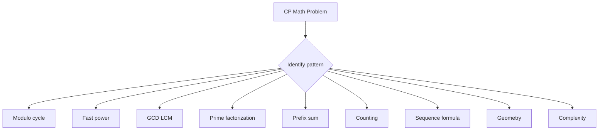

Core idea:

> CP math converts slow simulation into formulas, patterns, and reusable helpers.

General framework:

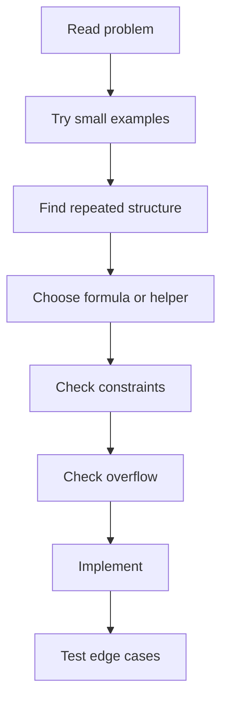

---

## 1. Ceiling Division

### Formula

For positive integers `a` and `b`:

```text
ceil(a / b) = (a + b - 1) / b
```

Equivalent safe formula:

```text
ceil(a / b) = a / b + (a % b != 0)
```

### When to use

Use when you need minimum groups, days, operations, pages, packets, buses, boxes, or rounds.

### Example

```text
a = 10 items
b = 3 items per group
ceil(10 / 3) = 4 groups
```


### C++ Helper

```cpp
long long ceilDiv(long long a, long long b) {
    return (a + b - 1) / b;
}
```

### Safer C++ for large positive values

```cpp
long long ceilDivSafe(long long a, long long b) {
    return a / b + (a % b != 0);
}
```

### Dry Run

```text
a = 17, b = 5
17 / 5 = 3 remainder 2
Since remainder exists, answer = 3 + 1 = 4
```

### Pattern

If the problem says:

```text
minimum number of operations where each operation handles at most k items
```

Think:

```text
ceil(n / k)
```

### Related problems

- Codeforces 919A - Supermarket: https://codeforces.com/problemset/problem/919/A
- Codeforces 151A - Soft Drinking: https://codeforces.com/problemset/problem/151/A

---

## 2. Modulo and Cycles

### Formula

```text
remainder = a % m
```

Modulo keeps a number inside range:

```text
0 to m - 1
```

Cycle movement:

```text
new_position = (start + steps) % cycle_length
```

Negative normalization:

```text
normalized = ((x % m) + m) % m
```

### Meaning

Modulo means position inside a repeated cycle.

### Example

```text
Today = 3
After 100 days in a 7-day cycle:
(3 + 100) % 7 = 103 % 7 = 5
```

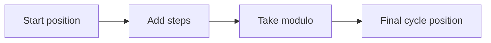

### C++ Helper

```cpp
long long norm(long long x, long long mod) {
    x %= mod;
    if (x < 0) x += mod;
    return x;
}
```

### Dry Run

```text
x = -3, mod = 7
-3 % 7 = -3 in C++
Add 7
answer = 4
```

### Pattern

If the problem says:

```text
repeats every k
clock
days
circular array
large number of moves
```

Think modulo.

### Related problems

- Codeforces 913A - Modular Exponentiation: https://codeforces.com/problemset/problem/913/A
- CSES - Increasing Array: https://cses.fi/problemset/task/1094

---

## 3. Binary Exponentiation

### Mathematical formula

```text
x^n = x^(n/2) * x^(n/2), if n is even
x^n = x^(n/2) * x^(n/2) * x, if n is odd
```

Binary representation idea:

```text
13 = 8 + 4 + 1
x^13 = x^8 * x^4 * x^1
```

### Flowchart

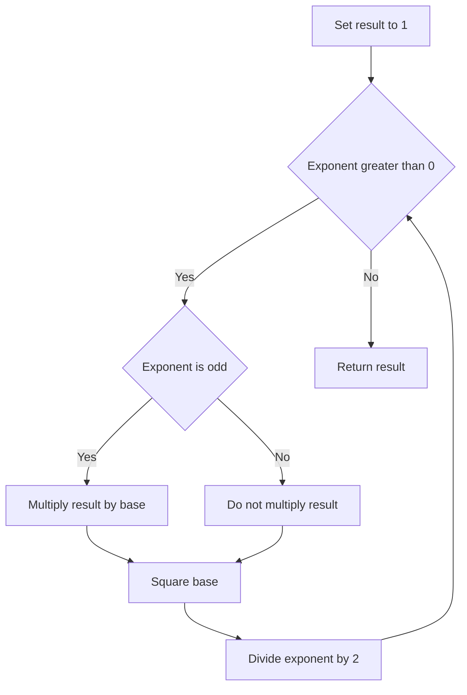

### C++ Helper

```cpp
long long binPow(long long base, long long exp) {
    long long res = 1;
    while (exp > 0) {
        if (exp & 1) res *= base;
        base *= base;
        exp >>= 1;
    }
    return res;
}
```

### Modular C++ Helper

```cpp
long long modPow(long long base, long long exp, long long mod) {
    long long res = 1 % mod;
    base %= mod;
    while (exp > 0) {
        if (exp & 1) res = (__int128)res * base % mod;
        base = (__int128)base * base % mod;
        exp >>= 1;
    }
    return res;
}
```

### Java Helper

```java
static long modPow(long base, long exp, long mod) {
    long res = 1 % mod;
    base %= mod;
    while (exp > 0) {
        if ((exp & 1) == 1) res = (res * base) % mod;
        base = (base * base) % mod;
        exp >>= 1;
    }
    return res;
}
```

### Dry Run: compute `3^13`

```text
13 in binary = 1101
Use powers: 3^1, 3^4, 3^8
3^13 = 3^8 * 3^4 * 3^1
```

| exp | base | res | action |
|---:|---:|---:|---|
| 13 | 3 | 1 | odd, res = 3 |
| 6 | 9 | 3 | even |
| 3 | 81 | 3 | odd, res = 243 |
| 1 | 6561 | 243 | odd, res = 1594323 |
| 0 | done | 1594323 | return |

### Related problems

- CSES - Exponentiation: https://cses.fi/problemset/task/1095
- CSES - Exponentiation II: https://cses.fi/problemset/task/1712
- CP-Algorithms - Binary Exponentiation: https://cp-algorithms.com/algebra/binary-exp.html

---

## 4. Modular Arithmetic

### Formulas

```text
(a + b) mod M = ((a mod M) + (b mod M)) mod M
(a - b) mod M = ((a mod M) - (b mod M) + M) mod M
(a * b) mod M = ((a mod M) * (b mod M)) mod M
```

For prime `M` and `a` not divisible by `M`:

```text
a^(-1) mod M = a^(M - 2) mod M
```

This is based on Fermat's Little Theorem:

```text
a^(M - 1) = 1 mod M
```

### Flowchart

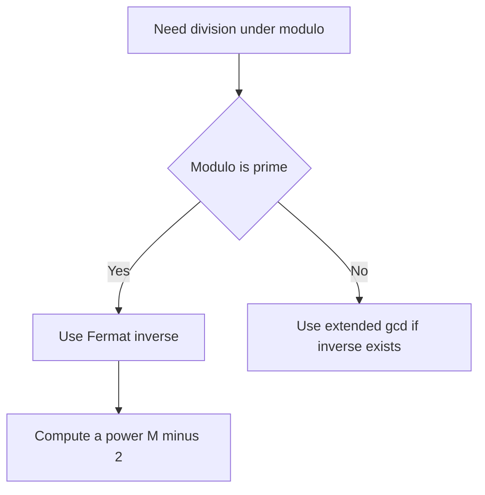

### C++ Helper

```cpp
const long long MOD = 1000000007LL;

long long addMod(long long a, long long b) {
    return (a % MOD + b % MOD) % MOD;
}

long long subMod(long long a, long long b) {
    return (a % MOD - b % MOD + MOD) % MOD;
}

long long mulMod(long long a, long long b) {
    return (__int128)(a % MOD) * (b % MOD) % MOD;
}

long long modInversePrime(long long a) {
    return modPow(a, MOD - 2, MOD);
}
```

### Dry Run

Find `3 / 2 mod 7`.

```text
Division means multiply by inverse.
2^(-1) mod 7 = 2^(7 - 2) mod 7 = 2^5 mod 7 = 32 mod 7 = 4
3 / 2 mod 7 = 3 * 4 mod 7 = 12 mod 7 = 5
```

### Related problems

- CSES - Binomial Coefficients: https://cses.fi/problemset/task/1079
- CSES - Distributing Apples: https://cses.fi/problemset/task/1716
- CP-Algorithms - Modular Inverse: https://cp-algorithms.com/algebra/module-inverse.html

---

## 5. GCD and LCM

### Formulas

```text
gcd(a, b) = gcd(b, a mod b)
lcm(a, b) = a / gcd(a, b) * b
```

Important property:

```text
gcd(a, b) * lcm(a, b) = a * b
```

### Flowchart

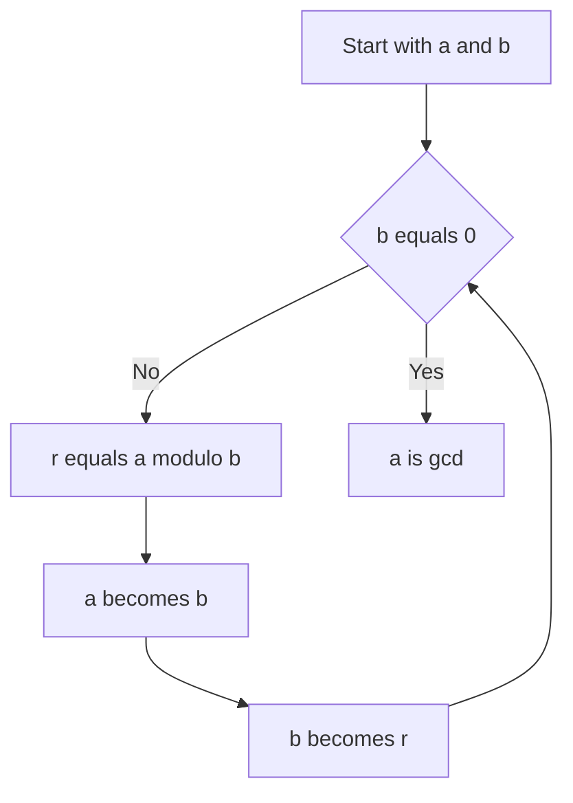

### C++ Helper

```cpp
long long gcdll(long long a, long long b) {
    while (b != 0) {
        long long r = a % b;
        a = b;
        b = r;
    }
    return a;
}

long long lcmll(long long a, long long b) {
    return a / gcdll(a, b) * b;
}
```

### Dry Run

```text
gcd(48, 18)
48 % 18 = 12
18 % 12 = 6
12 % 6 = 0
answer = 6
```

### Pattern

Use GCD when the problem has:

```text
common divisor
reduce fraction
same step size
period alignment
minimum repeating length
```

Use LCM when the problem has:

```text
when two cycles meet again
common multiple
synchronization
```

### Related problems

- CSES - Common Divisors: https://cses.fi/problemset/task/1081
- Codeforces 1458A - Row GCD: https://codeforces.com/problemset/problem/1458/A
- CP-Algorithms - Euclidean Algorithm: https://cp-algorithms.com/algebra/euclid-algorithm.html

---

## 6. Primes and Divisors

### Prime definition

A prime number has exactly two positive divisors:

```text
1 and itself
```

### Prime check formula

If `n` has a divisor greater than `sqrt(n)`, it must also have a paired divisor smaller than `sqrt(n)`.

So check only:

```text
2 to sqrt(n)
```

### C++ Prime Check

```cpp
bool isPrime(long long n) {
    if (n < 2) return false;
    for (long long d = 2; d * d <= n; d++) {
        if (n % d == 0) return false;
    }
    return true;
}
```

### Divisor count formula

If:

```text
n = p1^a1 * p2^a2 * ... * pk^ak
```

Then:

```text
number_of_divisors = (a1 + 1)(a2 + 1)...(ak + 1)
```

### Example

```text
18 = 2^1 * 3^2
number of divisors = (1 + 1)(2 + 1) = 6
Divisors: 1, 2, 3, 6, 9, 18
```

### Flowchart

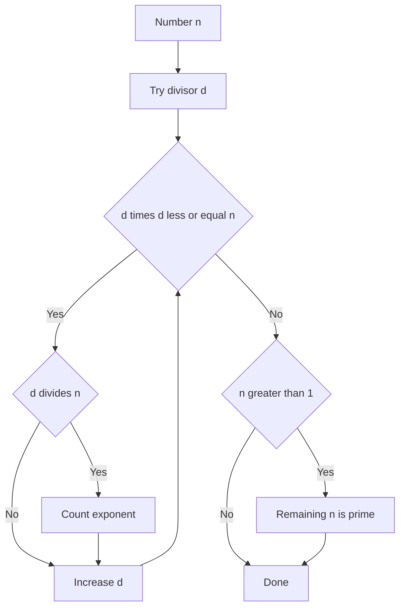

### C++ Factorization

```cpp
vector<pair<long long,int>> factorize(long long n) {
    vector<pair<long long,int>> f;
    for (long long d = 2; d * d <= n; d++) {
        if (n % d == 0) {
            int cnt = 0;
            while (n % d == 0) {
                n /= d;
                cnt++;
            }
            f.push_back({d, cnt});
        }
    }
    if (n > 1) f.push_back({n, 1});
    return f;
}
```

### Related problems

- CSES - Counting Divisors: https://cses.fi/problemset/task/1713
- CSES - Common Divisors: https://cses.fi/problemset/task/1081

---

## 7. Prefix Sum

### Formula

For 0-indexed array:

```text
pref[0] = 0
pref[i + 1] = pref[i] + a[i]
range_sum(l, r) = pref[r + 1] - pref[l]
```

### Example

```text
a = [1, 2, 3, 4, 5]
pref = [0, 1, 3, 6, 10, 15]
range_sum(1, 3) = pref[4] - pref[1] = 10 - 1 = 9
```

### Flowchart

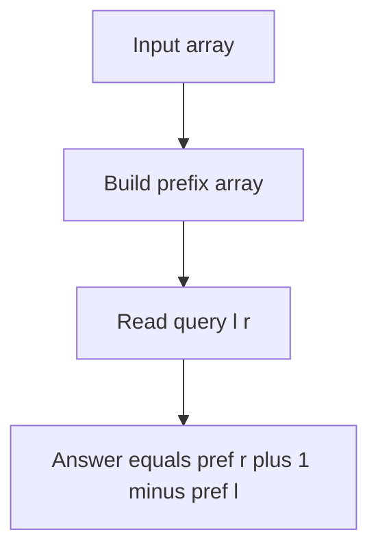

### C++ Helper

```cpp
vector<long long> buildPrefix(const vector<int>& a) {
    int n = (int)a.size();
    vector<long long> pref(n + 1, 0);
    for (int i = 0; i < n; i++) {
        pref[i + 1] = pref[i] + a[i];
    }
    return pref;
}

long long rangeSum(const vector<long long>& pref, int l, int r) {
    return pref[r + 1] - pref[l];
}
```

### Dry Run

```text
a = [2, 4, 1, 7]
pref[0] = 0
pref[1] = 2
pref[2] = 6
pref[3] = 7
pref[4] = 14
sum from index 1 to 3 = pref[4] - pref[1] = 14 - 2 = 12
```

### Pattern

Use prefix sum when there are many range sum queries and array does not change.

### Related problems

- CSES - Static Range Sum Queries: https://cses.fi/problemset/task/1646
- CSES - Forest Queries: https://cses.fi/problemset/task/1652

---

## 8. Arithmetic and Geometric Sequences

### Arithmetic sequence formula

```text
a_n = a_1 + (n - 1)d
```

Sum:

```text
S_n = n(a_1 + a_n) / 2
```

### Geometric sequence formula

```text
a_n = a_1 * r^(n - 1)
```

Sum if `r != 1`:

```text
S_n = a_1(r^n - 1) / (r - 1)
```

Special power of two sum:

```text
1 + 2 + 4 + ... + 2^(n - 1) = 2^n - 1
```

### Flowchart

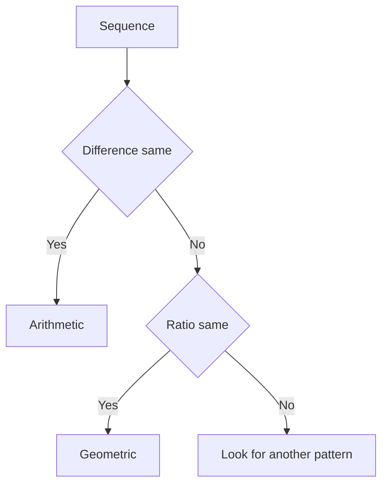

### C++ Helpers

```cpp
long long arithmeticTerm(long long a1, long long d, long long n) {
    return a1 + (n - 1) * d;
}

long long arithmeticSum(long long a1, long long an, long long n) {
    return n * (a1 + an) / 2;
}
```

### Dry Run

```text
Arithmetic: 5, 8, 11, 14
a1 = 5, d = 3
4th term = 5 + (4 - 1) * 3 = 14
```

```text
Geometric: 3, 6, 12, 24
a1 = 3, r = 2
4th term = 3 * 2^(4 - 1) = 24
```

---

## 9. Summation Formulas

### Core formulas

```text
1 + 2 + ... + n = n(n + 1) / 2
1^2 + 2^2 + ... + n^2 = n(n + 1)(2n + 1) / 6
1^3 + 2^3 + ... + n^3 = [n(n + 1) / 2]^2
```

### Summation properties

```text
sum(c * a_i) = c * sum(a_i)
sum(a_i + b_i) = sum(a_i) + sum(b_i)
```

### Example

```text
sum from i = 1 to n of (3i + 2)
= 3 * sum(i) + 2n
= 3n(n + 1)/2 + 2n
```

For `n = 5`:

```text
3 * 5 * 6 / 2 + 10 = 55
```

### Flowchart

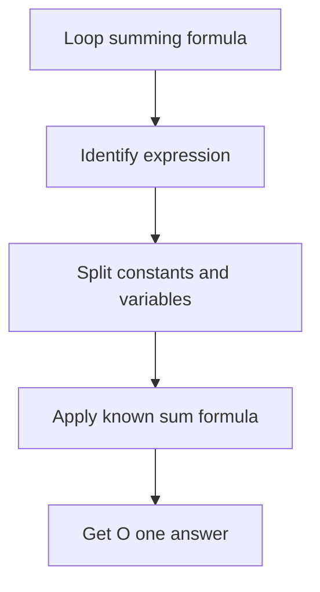

### C++ Helpers

```cpp
long long sumN(long long n) {
    return n * (n + 1) / 2;
}

long long sumSquares(long long n) {
    return n * (n + 1) * (2 * n + 1) / 6;
}

long long sumCubes(long long n) {
    long long s = n * (n + 1) / 2;
    return s * s;
}
```

### Pattern

If you see:

```cpp
for (int i = 1; i <= n; i++) ans += i;
```

Replace with:

```text
n(n + 1) / 2
```

---

## 10. Counting, Permutation, Combination

### Product rule

```text
If task A has x ways and task B has y ways:
total = x * y
```

### Sum rule

```text
If choose A or B:
total = x + y
```

### Complement rule

```text
good = total - bad
```

### Factorial

```text
n! = n * (n - 1) * ... * 1
```

### Permutation

Order matters:

```text
P(n, r) = n! / (n - r)!
```

### Combination

Order does not matter:

```text
C(n, r) = n! / (r!(n - r)!)
```

Symmetry:

```text
C(n, r) = C(n, n - r)
```

### Flowchart

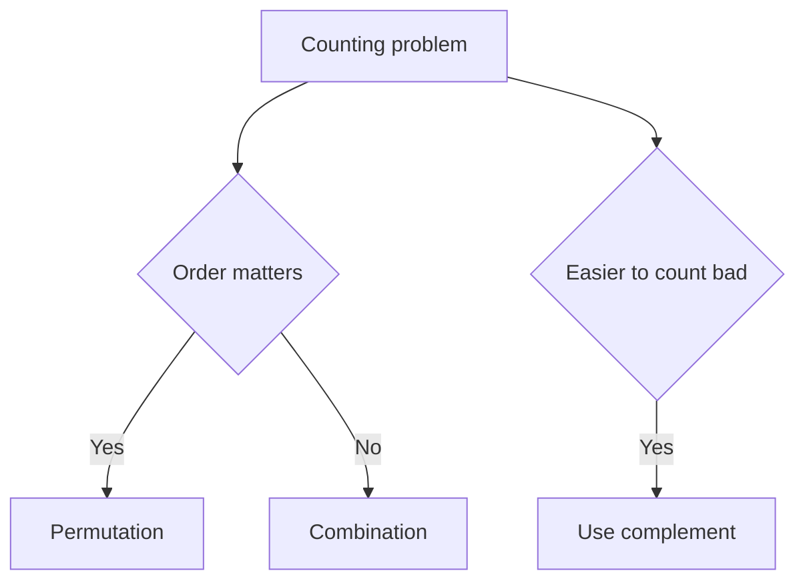

### C++ Small nCr Helper

```cpp
long long nCrSmall(int n, int r) {
    if (r < 0 || r > n) return 0;
    r = min(r, n - r);
    long long ans = 1;
    for (int i = 1; i <= r; i++) {
        ans = ans * (n - r + i) / i;
    }
    return ans;
}
```

### Modular nCr helper for prime MOD

```cpp
const int MAXN = 1000000;
const long long MOD = 1000000007LL;
long long fact[MAXN + 1], invFact[MAXN + 1];

void buildFactorials() {
    fact[0] = 1;
    for (int i = 1; i <= MAXN; i++) fact[i] = fact[i - 1] * i % MOD;
    invFact[MAXN] = modPow(fact[MAXN], MOD - 2, MOD);
    for (int i = MAXN - 1; i >= 0; i--) invFact[i] = invFact[i + 1] * (i + 1) % MOD;
}

long long nCrMod(int n, int r) {
    if (r < 0 || r > n) return 0;
    return fact[n] * invFact[r] % MOD * invFact[n - r] % MOD;
}
```

### Dry Run

```text
Choose 2 people from 5.
Order does not matter.
C(5, 2) = 5! / (2! * 3!) = 10
```

### Related problems

- CSES - Binomial Coefficients: https://cses.fi/problemset/task/1079
- CSES - Creating Strings: https://cses.fi/problemset/task/1622
- CSES - Distributing Apples: https://cses.fi/problemset/task/1716

---

## 11. Logs, Bits, and Halving

### Log meaning

```text
2^3 = 8
log2(8) = 3
```

Log asks:

```text
What power gives this number?
```

### Formulas

```text
log(xy) = log(x) + log(y)
log(x / y) = log(x) - log(y)
log(x^k) = k log(x)
```

### Bits needed

For positive `n`:

```text
bits = floor(log2(n)) + 1
```

### Digits needed

For positive `n`:

```text
digits = floor(log10(n)) + 1
```

### Power of two check

```text
n > 0 and (n & (n - 1)) == 0
```

### Flowchart

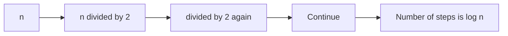

### C++ Helpers

```cpp
bool isPowerOfTwo(long long n) {
    return n > 0 && (n & (n - 1)) == 0;
}

int bitCount(unsigned long long n) {
    if (n == 0) return 1;
    return 64 - __builtin_clzll(n);
}
```

### Dry Run

```text
8 = 1000
7 = 0111
8 & 7 = 0000
So 8 is power of two.
```

### Pattern

If each step halves the search space:

```text
n -> n/2 -> n/4 -> n/8 -> ... -> 1
```

Then complexity is:

```text
O(log n)
```

Where used:

- binary search
- heap height
- divide and conquer
- binary exponentiation
- sparse table

---

## 12. Algebra and Equations

### Basic formulas

Distributive property:

```text
a(b + c) = ab + ac
```

Factoring:

```text
ab + ac = a(b + c)
```

Linear equation:

```text
ax + b = c
x = (c - b) / a
```

Inequality warning:

```text
If multiply or divide by negative, flip sign.
```

Example:

```text
-2x > 6
x < -3
```

### System of equations

```text
x + y = 10
x - y = 4
```

Add equations:

```text
2x = 14
x = 7
y = 3
```

### Flowchart

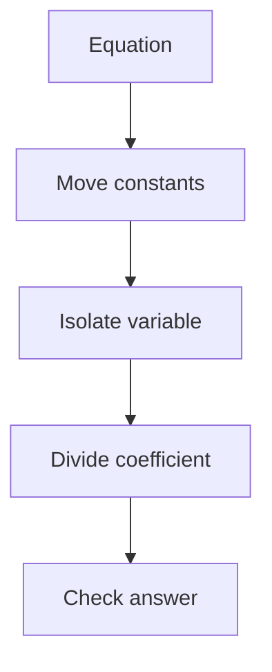

### CP Pattern

Many CP problems hide algebra like:

```text
Find minimum x such that ax + b >= n
```

Rearrange:

```text
x >= (n - b) / a
answer = ceil((n - b) / a)
```

---

## 13. Quadratic Formula

### Formula

For:

```text
ax^2 + bx + c = 0
```

Roots:

```text
x = (-b plus or minus sqrt(b^2 - 4ac)) / (2a)
```

Discriminant:

```text
D = b^2 - 4ac
```

### Cases

```text
D > 0: two real roots
D = 0: one real root
D < 0: no real roots
```

### Flowchart

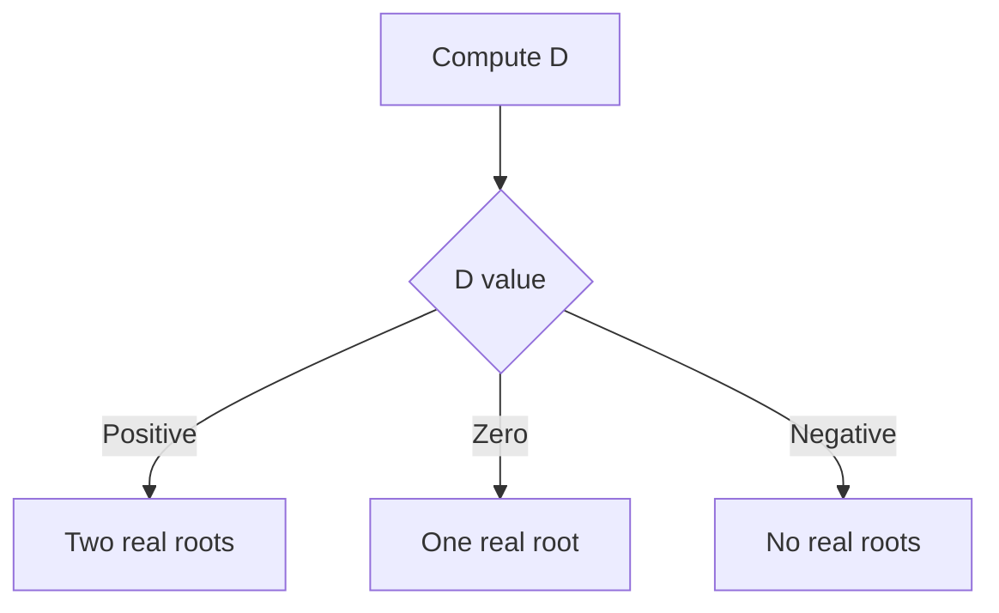

### Example

```text
x^2 - 5x + 6 = 0
a = 1, b = -5, c = 6
D = 25 - 24 = 1
x = (5 plus or minus 1) / 2
x = 3 or 2
```

### C++ Helper

```cpp
vector<double> quadratic(double a, double b, double c) {
    double D = b * b - 4 * a * c;
    vector<double> roots;
    if (D < 0) return roots;
    roots.push_back((-b + sqrt(D)) / (2 * a));
    if (D > 0) roots.push_back((-b - sqrt(D)) / (2 * a));
    return roots;
}
```

### CP Pattern

Use quadratic formula when:

```text
answer depends on triangular number
x(x + 1) / 2 <= n
```

This gives approximately:

```text
x around sqrt(2n)
```

---

## 14. Geometry Basics

### Formulas

Rectangle:

```text
area = length * width
perimeter = 2(length + width)
```

Triangle:

```text
area = base * height / 2
```

Circle:

```text
area = pi * r^2
circumference = 2 * pi * r
```

Distance between points:

```text
distance = sqrt((x2 - x1)^2 + (y2 - y1)^2)
```

Slope:

```text
slope = (y2 - y1) / (x2 - x1)
```

### Flowchart

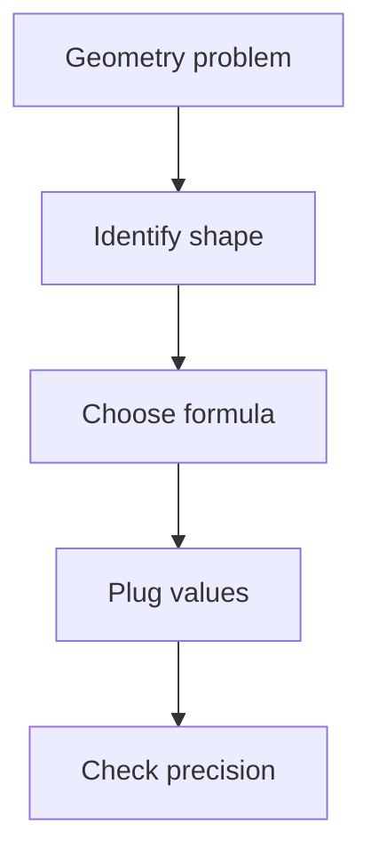

### C++ Helpers

```cpp
struct Point {
    double x, y;
};

double dist(Point a, Point b) {
    double dx = a.x - b.x;
    double dy = a.y - b.y;
    return sqrt(dx * dx + dy * dy);
}
```

### Pattern

If only comparison is needed, avoid `sqrt`:

```text
compare squared distances instead
```

---

## 15. Big O Mathematics

### Common complexities

```text
O(1)        constant
O(log n)    halving
O(n)        one loop
O(n log n)  sorting or divide and conquer with linear merge
O(n^2)      nested loops
O(2^n)      subsets
O(n!)       permutations
```

### Loop formulas

Full nested loop:

```text
n * n = n^2
```

Triangular loop:

```text
1 + 2 + ... + n = n(n + 1) / 2 = O(n^2)
```

Halving loop:

```text
n, n/2, n/4, ..., 1 = O(log n)
```

### Flowchart

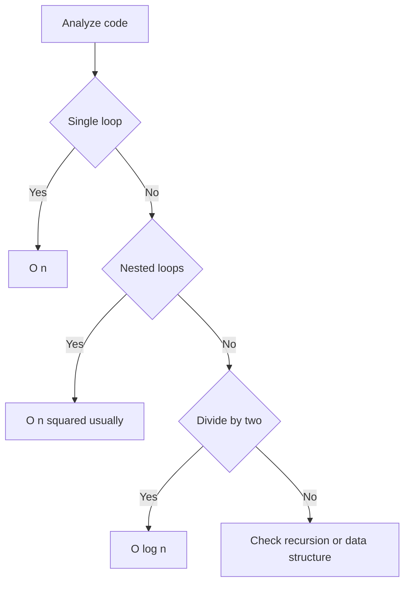

### Mental constraint guide

```text
n <= 10        O(n!) or O(2^n) may pass
n <= 20        O(2^n) may pass
n <= 500       O(n^3) may pass
n <= 5000      O(n^2) may pass
n <= 200000    O(n log n) usually needed
n <= 1000000   O(n) or O(n log n)
n >= 10^9      O(log n) or O(1)
```

---

## 16. CP Problem-Solving Framework

### Universal checklist

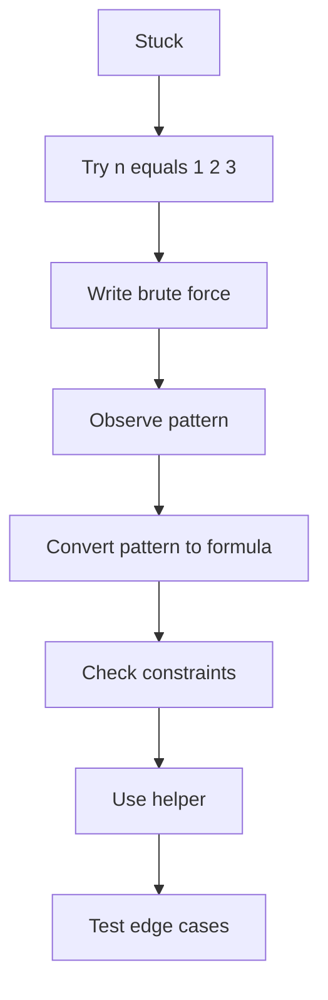

### Pattern recognition table

| Problem phrase | Think |
|---|---|
| after many steps | modulo |
| minimum groups | ceiling division |
| repeated multiplication | binary exponentiation |
| divide under mod | modular inverse |
| many range sums | prefix sum |
| common divisor | gcd |
| cycles meet | lcm |
| choose objects | combination |
| order arrangements | permutation |
| halves each time | logarithm |
| loop sum | summation formula |
| prime factors | divisor formula |

---

## 17. Final Formula Sheet

```text
ceil(a / b) = (a + b - 1) / b
ceil(a / b) = a / b + (a % b != 0)

(a + b) mod M = ((a mod M) + (b mod M)) mod M
(a - b) mod M = ((a mod M) - (b mod M) + M) mod M
(a * b) mod M = ((a mod M) * (b mod M)) mod M

x^n by binary exponentiation = O(log n)

a^(-1) mod M = a^(M - 2) mod M, when M is prime

gcd(a, b) = gcd(b, a mod b)
lcm(a, b) = a / gcd(a, b) * b

a_n arithmetic = a_1 + (n - 1)d
S_n arithmetic = n(a_1 + a_n) / 2

a_n geometric = a_1 * r^(n - 1)
S_n geometric = a_1(r^n - 1) / (r - 1)

1 + 2 + ... + n = n(n + 1) / 2
1^2 + 2^2 + ... + n^2 = n(n + 1)(2n + 1) / 6
1^3 + 2^3 + ... + n^3 = [n(n + 1) / 2]^2

P(n, r) = n! / (n - r)!
C(n, r) = n! / (r!(n - r)!)

If n = p1^a1 * p2^a2 * ... * pk^ak:
number_of_divisors = (a1 + 1)(a2 + 1)...(ak + 1)

bits = floor(log2(n)) + 1
digits = floor(log10(n)) + 1

Distance = sqrt((x2 - x1)^2 + (y2 - y1)^2)
```

---

## 18. Practice Roadmap

### Level 1: Foundation

1. Ceiling division problems
2. Modulo cycle problems
3. Prefix sum problems
4. GCD and LCM problems
5. Basic prime checking

### Level 2: Core CP Math

1. Binary exponentiation
2. Modular inverse
3. nCr under modulo
4. Prime factorization
5. Divisor counting

### Level 3: Candidate Master Direction

1. Combinatorics with constraints
2. Number theory with gcd transformations
3. Modular arithmetic with inverse and factorials
4. Prefix sums plus binary search
5. Geometry with precision and squared distance
6. Constructive math using invariants

### Recommended problem set

| Topic | Problem |
|---|---|
| Prefix sum | CSES Static Range Sum Queries: https://cses.fi/problemset/task/1646 |
| 2D prefix sum | CSES Forest Queries: https://cses.fi/problemset/task/1652 |
| Binary exponentiation | CSES Exponentiation: https://cses.fi/problemset/task/1095 |
| Advanced exponentiation | CSES Exponentiation II: https://cses.fi/problemset/task/1712 |
| nCr modulo | CSES Binomial Coefficients: https://cses.fi/problemset/task/1079 |
| Stars and bars | CSES Distributing Apples: https://cses.fi/problemset/task/1716 |
| Divisor counting | CSES Counting Divisors: https://cses.fi/problemset/task/1713 |
| GCD | CSES Common Divisors: https://cses.fi/problemset/task/1081 |
| GCD transformation | Codeforces Row GCD: https://codeforces.com/problemset/problem/1458/A |
| Modular thinking | Codeforces Modular Exponentiation: https://codeforces.com/problemset/problem/913/A |

---

## Final Mental Checklist Before Coding

Ask these questions:

1. Can I replace simulation with a formula?
2. Is there a modulo cycle?
3. Is this repeated multiplication?
4. Can I use binary exponentiation?
5. Is division under modulo actually modular inverse?
6. Can a range query be answered by prefix sum?
7. Is there a GCD or LCM hidden in the problem?
8. Can I count total minus bad?
9. Does order matter?
10. Is the loop actually a known summation?
11. Can I avoid overflow using `long long` or `__int128`?
12. Can I divide before multiplying?
13. Are there edge cases: 0, 1, negative, max constraints?

---

## Compact C++ Template

```cpp
#include <bits/stdc++.h>
using namespace std;

using ll = long long;
const ll MOD = 1000000007LL;

ll ceilDiv(ll a, ll b) {
    return a / b + (a % b != 0);
}

ll norm(ll x, ll mod) {
    x %= mod;
    if (x < 0) x += mod;
    return x;
}

ll modPow(ll base, ll exp, ll mod) {
    ll res = 1 % mod;
    base %= mod;
    while (exp > 0) {
        if (exp & 1) res = (__int128)res * base % mod;
        base = (__int128)base * base % mod;
        exp >>= 1;
    }
    return res;
}

ll modInversePrime(ll a, ll mod) {
    return modPow(a, mod - 2, mod);
}

ll gcdll(ll a, ll b) {
    while (b) {
        ll r = a % b;
        a = b;
        b = r;
    }
    return a;
}

ll lcmll(ll a, ll b) {
    return a / gcdll(a, b) * b;
}

bool isPrime(ll n) {
    if (n < 2) return false;
    for (ll d = 2; d * d <= n; d++) {
        if (n % d == 0) return false;
    }
    return true;
}

vector<ll> buildPrefix(const vector<int>& a) {
    vector<ll> pref(a.size() + 1, 0);
    for (int i = 0; i < (int)a.size(); i++) {
        pref[i + 1] = pref[i] + a[i];
    }
    return pref;
}

ll rangeSum(const vector<ll>& pref, int l, int r) {
    return pref[r + 1] - pref[l];
}
```

---

END
