# CP Maths Visual Reference

Compact visual reference for competitive programming math with small C++ snippets, Mermaid diagrams, mental models, and small Java helpers where useful.

---

## 0. Master Mental Map

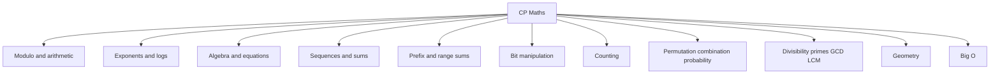

---

# 1. Arithmetic and Modulo

## Ceiling Division

Use when asking: how many groups of size `b` are needed for `a` items?

```text
ceil(a / b) = (a + b - 1) / b
```

```cpp
long long ceilDiv(long long a, long long b) {
    return (a + b - 1) / b;
}
```


## Modulo

Modulo gives remainder.

```cpp
long long normMod(long long a, long long m) {
    return ((a % m) + m) % m;
}
```

Common formulas:

```text
(a + b) mod m = ((a mod m) + (b mod m)) mod m
(a * b) mod m = ((a mod m) * (b mod m)) mod m
```

## Power of Two Check

```cpp
bool isPowerOfTwo(long long n) {
    return n > 0 && (n & (n - 1)) == 0;
}
```

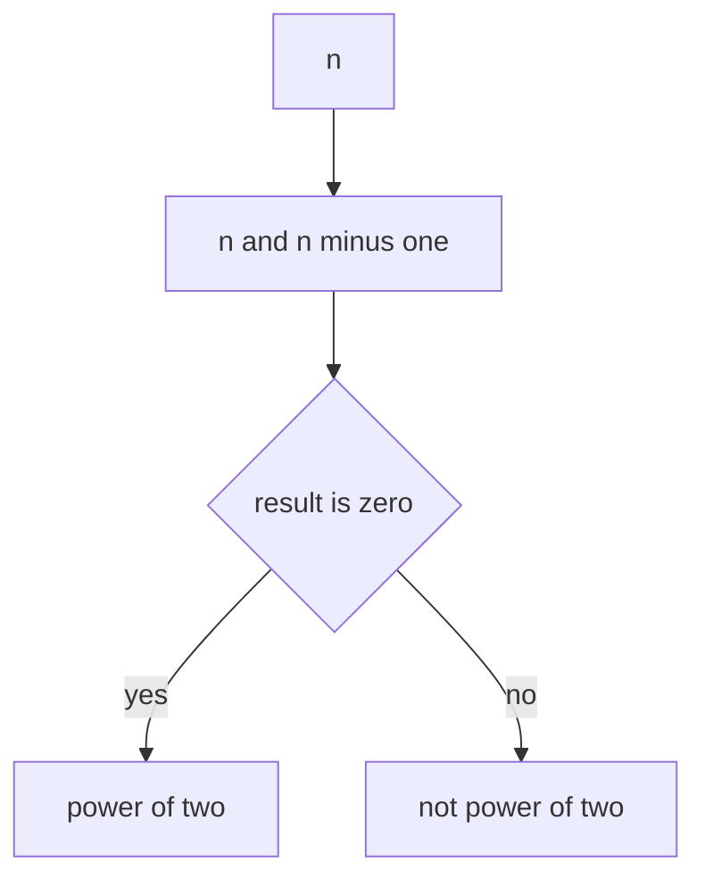

---

# 2. Exponents and Roots

## Exponent Laws

```text
x^a * x^b = x^(a+b)
x^a / x^b = x^(a-b)
(x^a)^b = x^(a*b)
x^0 = 1
x^(-a) = 1 / x^a
x^(1/n) = nth root of x
```

## Fast Power Mental Model

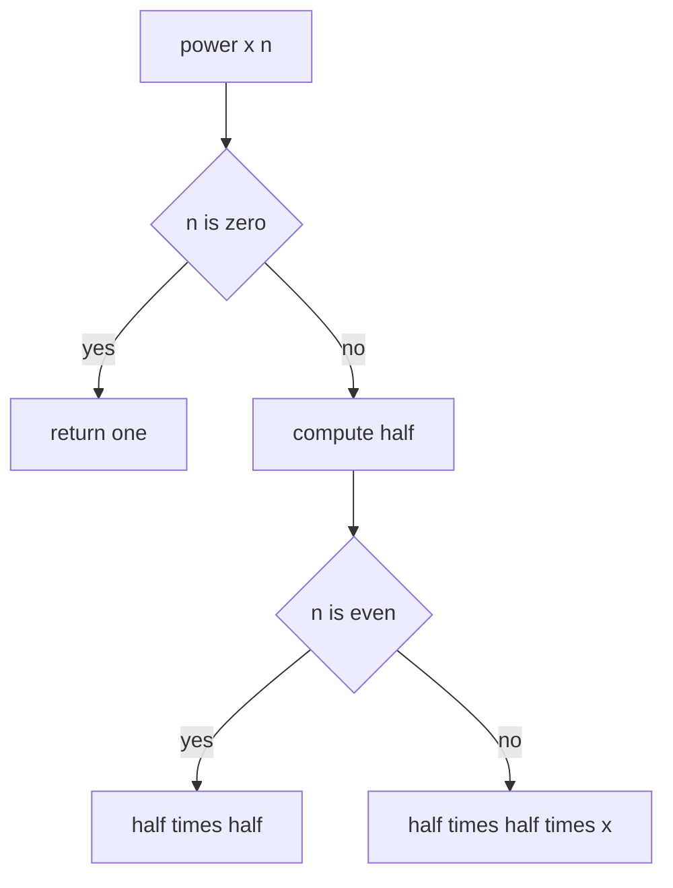

```cpp
long long power(long long x, long long n) {
    if (n == 0) return 1;
    long long half = power(x, n / 2);
    if (n % 2 == 0) return half * half;
    return half * half * x;
}
```

## Binary Exponentiation

Best CP version.

```cpp
long long binpow(long long base, long long exp) {
    long long res = 1;
    while (exp > 0) {
        if (exp & 1) res *= base;
        base *= base;
        exp >>= 1;
    }
    return res;
}
```

## Modular Power

```cpp
long long modPow(long long base, long long exp, long long MOD) {
    long long res = 1 % MOD;
    base %= MOD;
    while (exp > 0) {
        if (exp & 1) res = (res * base) % MOD;
        base = (base * base) % MOD;
        exp >>= 1;
    }
    return res;
}
```

### Java helper

```java
static long modPow(long base, long exp, long MOD) {
    long res = 1 % MOD;
    base %= MOD;
    while (exp > 0) {
        if ((exp & 1) == 1) res = (res * base) % MOD;
        base = (base * base) % MOD;
        exp >>= 1;
    }
    return res;
}
```

---

# 3. Logarithms

## Meaning

```text
log_b(x) = y means b^y = x
```

Example:

```text
log_2(8) = 3 because 2^3 = 8
```

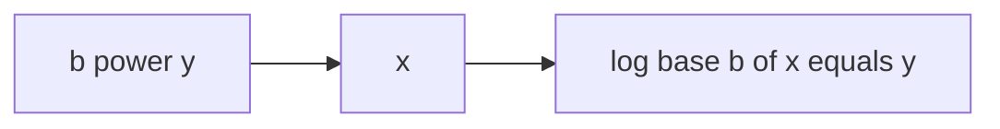

## Rules

```text
log(x*y) = log(x) + log(y)
log(x/y) = log(x) - log(y)
log(x^k) = k * log(x)
```

## Change of Base

```cpp
double logBase(double n, double b) {
    return log10(n) / log10(b);
}
```

## Bits and Digits

```cpp
int bitsNeeded(long long n) {
    return (int)log2(n) + 1;
}

int digits(long long n) {
    return (int)log10(n) + 1;
}
```

---

# 4. Basic Algebra

## Core Ideas

```text
Expression: 3x + 4
Equation:   3x + 2 = 11
```

Distributive property:

```text
a(b + c) = ab + ac
a(b - c) = ab - ac
```

Inequality trick:

```text
Multiplying or dividing by a negative number flips sign.
```

## Quadratic Formula

```text
ax^2 + bx + c = 0
x = (-b ± sqrt(b^2 - 4ac)) / 2a
```

Discriminant:

```text
D > 0 means two real roots
D = 0 means one real root
D < 0 means no real root
```

```cpp
vector<double> quadraticRoots(double a, double b, double c) {
    double D = b * b - 4 * a * c;
    vector<double> roots;
    if (D < 0) return roots;
    roots.push_back((-b + sqrt(D)) / (2 * a));
    if (D > 0) roots.push_back((-b - sqrt(D)) / (2 * a));
    return roots;
}
```

## System of Equations

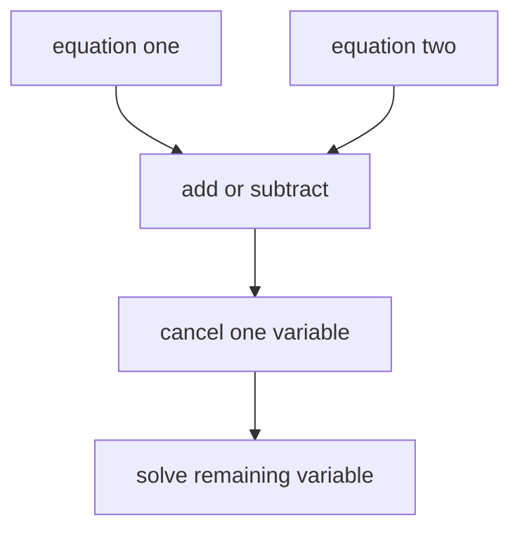

Example:

```text
x + y = 10
x - y = 4
add them: 2x = 14, so x = 7 and y = 3
```

---

# 5. Sequences and Summations

## Arithmetic Sequence

```text
a_n = a_1 + (n - 1)d
```

```cpp
long long arithmeticTerm(long long a1, long long d, long long n) {
    return a1 + (n - 1) * d;
}
```

## Sum of First N Integers

```text
1 + 2 + ... + n = n(n+1)/2
```

```cpp
long long sumN(long long n) {
    return n * (n + 1) / 2;
}
```

## Sum of First N Squares and Cubes

```text
1^2 + 2^2 + ... + n^2 = n(n+1)(2n+1)/6
1^3 + 2^3 + ... + n^3 = (n(n+1)/2)^2
```

```cpp
long long sumSquares(long long n) {
    return n * (n + 1) * (2 * n + 1) / 6;
}

long long sumCubes(long long n) {
    long long s = n * (n + 1) / 2;
    return s * s;
}
```

## Arithmetic Sum

```text
sum = n(a1 + an)/2
```

```cpp
long long arithmeticSum(long long a1, long long an, long long n) {
    return n * (a1 + an) / 2;
}
```

## Geometric Sequence

```text
a_n = a_1 * r^(n-1)
```

```cpp
long long geometricTerm(long long a1, long long r, long long n) {
    return a1 * binpow(r, n - 1);
}
```

## Geometric Sum

```text
S = a1 * (r^n - 1) / (r - 1)
```

```cpp
long long geometricSum(long long a1, long long r, long long n) {
    if (r == 1) return a1 * n;
    return a1 * (binpow(r, n) - 1) / (r - 1);
}
```

## Powers of Two Sum

```text
1 + 2 + 4 + ... + 2^(n-1) = 2^n - 1
```

Useful for subsets, binary tree nodes, and bitmask counting.

---

# 6. Prefix Sum and Range Sum

```text
arr:  1 2 3 4 5
pref: 0 1 3 6 10 15
range l to r = pref[r+1] - pref[l]
```

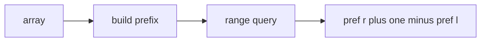

```cpp
vector<long long> buildPrefix(vector<int>& a) {
    vector<long long> pref(a.size() + 1, 0);
    for (int i = 0; i < (int)a.size(); i++) {
        pref[i + 1] = pref[i] + a[i];
    }
    return pref;
}

long long rangeSum(vector<long long>& pref, int l, int r) {
    return pref[r + 1] - pref[l];
}
```

---

# 7. Nested Loops and Big O

## Full nested loop

```cpp
for (int i = 1; i <= n; i++) {
    for (int j = 1; j <= n; j++) {
        // O(1)
    }
}
```

Time:

```text
O(n^2)
```

## Triangular nested loop

```cpp
for (int i = 1; i <= n; i++) {
    for (int j = i; j <= n; j++) {
        // O(1)
    }
}
```

Count:

```text
n + (n-1) + ... + 1 = n(n+1)/2
```

Still `O(n^2)`.

## Big O ladder

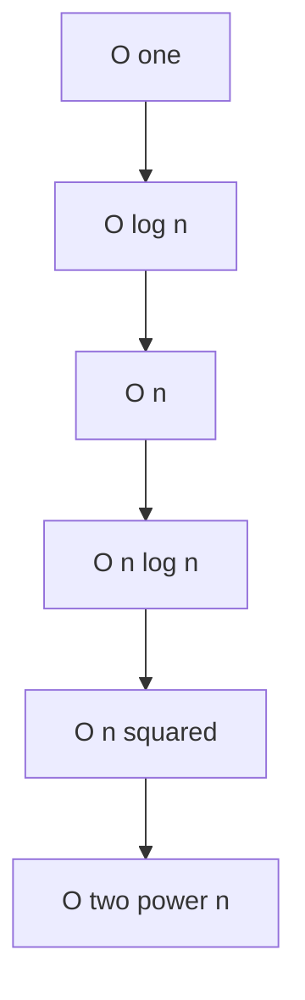

---

# 8. Telescopic Sum

Terms cancel in the middle.

```text
(a2 - a1) + (a3 - a2) + ... + (an - a(n-1)) = an - a1
```

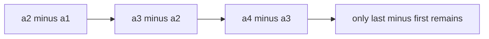

---

# 9. Summation Properties

```text
Σ c*a_i = c * Σ a_i
Σ(a_i + b_i) = Σa_i + Σb_i
```

Example:

```text
Σ(3i + 2) = 3Σi + 2n
```

```cpp
long long sumThreeIPlusTwo(long long n) {
    return 3 * sumN(n) + 2 * n;
}
```

---

# 10. Bit Manipulation

```cpp
bool isSet(int n, int bit) {
    return (n & (1 << bit)) != 0;
}

int setBit(int n, int bit) {
    return n | (1 << bit);
}

int clearBit(int n, int bit) {
    return n & ~(1 << bit);
}

int toggleBit(int n, int bit) {
    return n ^ (1 << bit);
}

int countBits(int n) {
    return __builtin_popcount(n);
}
```

---

# 11. Sets

A set stores unique values.

```cpp
set<int> s;
s.insert(5);
s.insert(2);
s.insert(5);
cout << s.size(); // 2
```

Use when you need uniqueness or sorted unique values.

---

# 12. Counting Principle

## Multiplication Rule

If one choice has `a` options and second choice has `b` options:

```text
total = a * b
```


## Complement Counting

```text
good = total - bad
```

Use when bad cases are easier to count.

---

# 13. Factorial Permutation Combination

## Factorial

```cpp
long long fact(int n) {
    long long ans = 1;
    for (int i = 1; i <= n; i++) ans *= i;
    return ans;
}
```

## Permutation

Order matters.

```text
P(n,r) = n! / (n-r)!
```

```cpp
long long perm(int n, int r) {
    long long ans = 1;
    for (int i = 0; i < r; i++) ans *= (n - i);
    return ans;
}
```

## Combination

Order does not matter.

```text
C(n,r) = n! / (r! * (n-r)!)
```

```cpp
long long comb(int n, int r) {
    if (r < 0 || r > n) return 0;
    r = min(r, n - r);
    long long ans = 1;
    for (int i = 1; i <= r; i++) {
        ans = ans * (n - r + i) / i;
    }
    return ans;
}
```

---

# 14. Probability

```text
Probability = favorable outcomes / total outcomes
P(not A) = 1 - P(A)
```

```cpp
double probability(double favorable, double total) {
    return favorable / total;
}
```

---

# 15. Divisibility and Primes

## Divisibility

```text
a divides b if b % a == 0
```

## Prime check

```cpp
bool isPrime(long long n) {
    if (n < 2) return false;
    for (long long d = 2; d * d <= n; d++) {
        if (n % d == 0) return false;
    }
    return true;
}
```

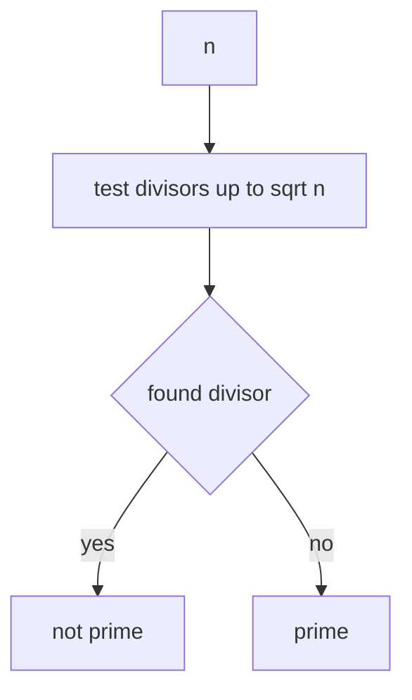

## Sieve

```cpp
vector<bool> sieve(int n) {
    vector<bool> prime(n + 1, true);
    if (n >= 0) prime[0] = false;
    if (n >= 1) prime[1] = false;

    for (int p = 2; p * p <= n; p++) {
        if (prime[p]) {
            for (int x = p * p; x <= n; x += p) {
                prime[x] = false;
            }
        }
    }
    return prime;
}
```

---

# 16. GCD and LCM

```cpp
long long gcdLL(long long a, long long b) {
    while (b != 0) {
        long long r = a % b;
        a = b;
        b = r;
    }
    return a;
}

long long lcmLL(long long a, long long b) {
    return a / gcdLL(a, b) * b;
}
```

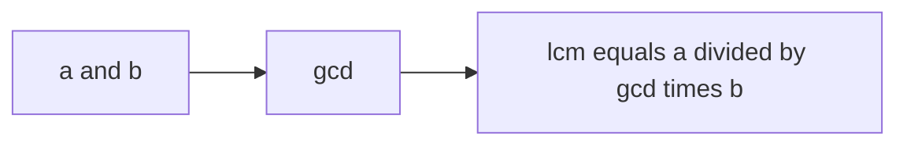

---

# 17. Modular Arithmetic

```cpp
const long long MOD = 1000000007;

long long addMod(long long a, long long b) {
    return (a % MOD + b % MOD) % MOD;
}

long long mulMod(long long a, long long b) {
    return (a % MOD * (b % MOD)) % MOD;
}
```

## Modular inverse for prime MOD

```text
a inverse = a^(MOD-2) mod MOD
```

```cpp
long long modInverse(long long a, long long MOD) {
    return modPow(a, MOD - 2, MOD);
}
```

---

# 18. Geometry

## Rectangle

```text
area = length * width
perimeter = 2 * (length + width)
```

## Circle

```text
area = pi * r^2
circumference = 2 * pi * r
```

## Distance between points

```cpp
double dist(double x1, double y1, double x2, double y2) {
    double dx = x2 - x1;
    double dy = y2 - y1;
    return sqrt(dx * dx + dy * dy);
}
```

---

# 19. Final Architecture Diagram

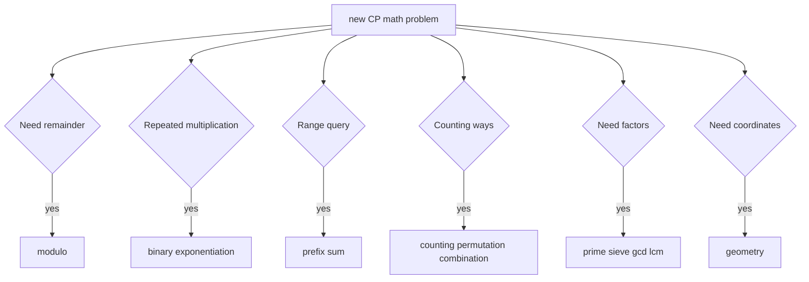

---

# 20. Last Minute Quick Notes

- Use `long long` by default.
- Use `ceilDiv(a,b)` for groups.
- Use binary exponentiation for powers.
- Use prefix sums for range queries.
- Use `n & (n-1)` for power of two.
- Use complement counting when direct counting is hard.
- Use `gcd` before `lcm`.
- Modular division needs modular inverse.
- Estimate time complexity before coding.

---

END
