# CP DSA Math Concepts — Visual Reference

> Compact C++ reference with visual Mermaid diagrams, mental models, and Java snippets where useful.

---

## 0. Master Map

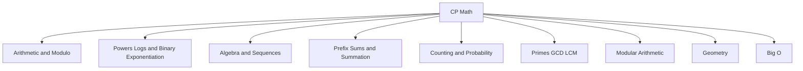

---

## 1. Arithmetic Basics

### Ceiling Division

For positive integers:

```text
ceil(a / b) = (a + b - 1) / b
```

```cpp
long long ceilDiv(long long a, long long b) {
    return (a + b - 1) / b;
}
```

```java
static long ceilDiv(long a, long b) {
    return (a + b - 1) / b;
}
```

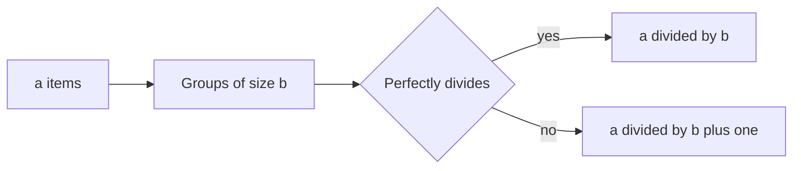

---

## 2. Modulo

Modulo gives the remainder.

```cpp
long long modNormalize(long long x, long long mod) {
    return (x % mod + mod) % mod;
}
```

Common idea:

```text
After 100 days from Wednesday:
(3 + 100) % 7 = 5
```

---

## 3. Power of Two Check

```cpp
bool isPowerOfTwo(long long n) {
    return n > 0 && (n & (n - 1)) == 0;
}
```

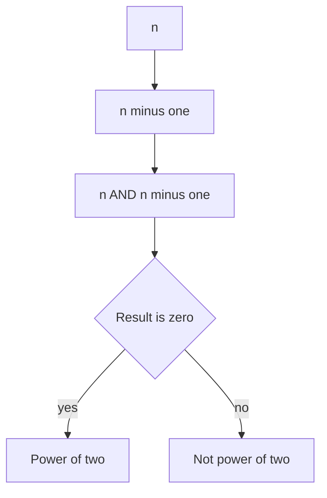

---

## 4. Exponents and Roots

```text
x^a * x^b = x^(a+b)
x^a / x^b = x^(a-b)
(x^a)^b = x^(a*b)
x^0 = 1
x^(-a) = 1 / x^a
```

Root meaning:

```text
sqrt(x) = number that squares to x
cbrt(x) = number that cubes to x
```

---

## 5. Binary Exponentiation

Used to compute power in `O(log n)`.

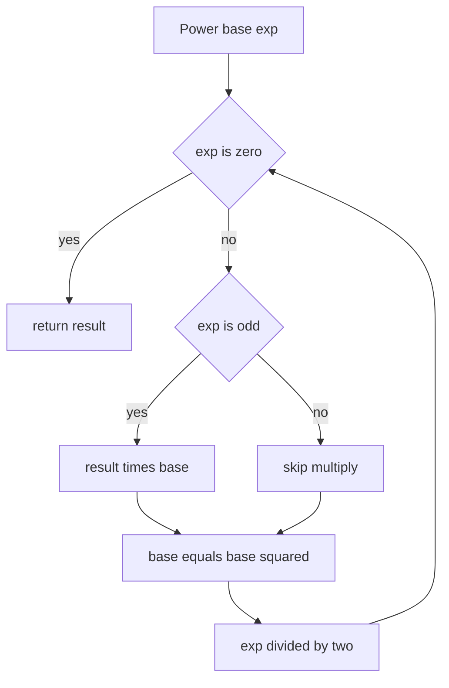

```cpp
long long binpow(long long base, long long exp) {
    long long res = 1;
    while (exp > 0) {
        if (exp & 1) res *= base;
        base *= base;
        exp >>= 1;
    }
    return res;
}
```

```cpp
long long modpow(long long base, long long exp, long long mod) {
    long long res = 1 % mod;
    base %= mod;

    while (exp > 0) {
        if (exp & 1) res = (__int128)res * base % mod;
        base = (__int128)base * base % mod;
        exp >>= 1;
    }
    return res;
}
```

```java
static long modPow(long base, long exp, long mod) {
    long res = 1 % mod;
    base %= mod;

    while (exp > 0) {
        if ((exp & 1) == 1) res = (res * base) % mod;
        base = (base * base) % mod;
        exp >>= 1;
    }
    return res;
}
```

---

## 6. Logarithms

Log asks: what power gives the number?

```text
2^3 = 8
log2(8) = 3
```

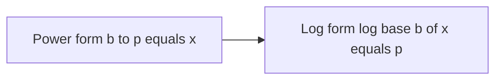

CP use:

```text
Number of halvings of n = log2(n)
Bits needed for n = floor(log2(n)) + 1
```

```cpp
int bitsNeeded(long long n) {
    if (n == 0) return 1;
    return 64 - __builtin_clzll(n);
}
```

---

## 7. Algebra

Distributive property:

```text
a * (b + c) = a*b + a*c
a * (b - c) = a*b - a*c
```

Inequality trick:

```text
When multiplying or dividing by negative, flip the sign.
```

---

## 8. Quadratic Formula

For:

```text
a*x^2 + b*x + c = 0
```

```text
x = (-b ± sqrt(b^2 - 4ac)) / 2a
D = b^2 - 4ac
```

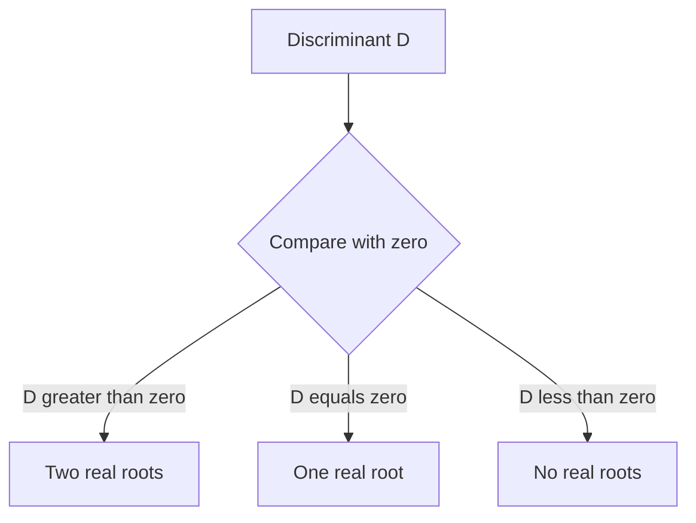

```cpp
pair<double, double> quadraticRoots(double a, double b, double c) {
    double d = b * b - 4 * a * c;
    double r1 = (-b - sqrt(d)) / (2 * a);
    double r2 = (-b + sqrt(d)) / (2 * a);
    return {r1, r2};
}
```

---

## 9. Arithmetic Sequence

```text
a, a+d, a+2d, ...
a_n = a_1 + (n - 1)d
S_n = n * (a_1 + a_n) / 2
```

```cpp
long long arithmeticNth(long long a1, long long d, long long n) {
    return a1 + (n - 1) * d;
}

long long arithmeticSum(long long a1, long long an, long long n) {
    return n * (a1 + an) / 2;
}
```

---

## 10. Geometric Sequence

```text
a, a*r, a*r^2, ...
a_n = a_1 * r^(n-1)
S_n = a_1 * (r^n - 1) / (r - 1)
```

```cpp
long long geometricSum(long long a1, long long r, long long n) {
    if (r == 1) return a1 * n;
    return a1 * (binpow(r, n) - 1) / (r - 1);
}
```

---

## 11. Common Summation Formulas

```text
1 + 2 + ... + n = n(n+1)/2
1^2 + 2^2 + ... + n^2 = n(n+1)(2n+1)/6
1^3 + 2^3 + ... + n^3 = [n(n+1)/2]^2
1 + 2 + 4 + ... + 2^(n-1) = 2^n - 1
```

```cpp
long long sumN(long long n) {
    return n * (n + 1) / 2;
}

long long sumSquares(long long n) {
    return n * (n + 1) * (2 * n + 1) / 6;
}

long long sumCubes(long long n) {
    long long s = sumN(n);
    return s * s;
}
```

---

## 12. Prefix Sum

```text
pref[i] = a[0] + a[1] + ... + a[i-1]
sum(l,r) = pref[r+1] - pref[l]
```

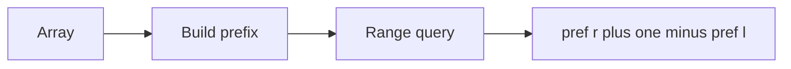

```cpp
vector<long long> buildPrefix(vector<int>& a) {
    int n = a.size();
    vector<long long> pref(n + 1, 0);

    for (int i = 0; i < n; i++) {
        pref[i + 1] = pref[i] + a[i];
    }
    return pref;
}

long long rangeSum(vector<long long>& pref, int l, int r) {
    return pref[r + 1] - pref[l];
}
```

---

## 13. Nested Loops and Big O

Full nested loop:

```cpp
for (int i = 0; i < n; i++) {
    for (int j = 0; j < n; j++) {
        // O(1)
    }
}
```

Time: `O(n^2)`

Triangular nested loop:

```cpp
for (int i = 0; i < n; i++) {
    for (int j = i; j < n; j++) {
        // O(1)
    }
}
```

Iterations:

```text
n + (n-1) + ... + 1 = n(n+1)/2
```

Still `O(n^2)`.

---

## 14. Telescoping Sum

```text
(2-1) + (3-2) + (4-3) + (5-4) = 5 - 1
```

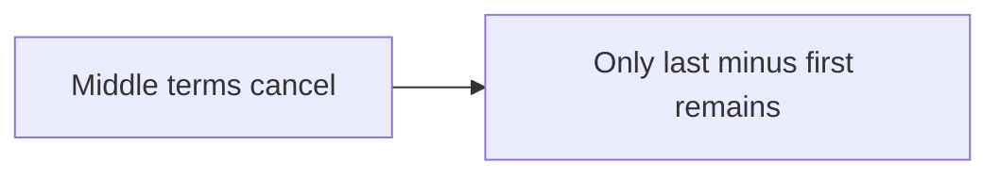

General:

```text
sum of a_i minus a_(i-1) = last minus first
```

---

# Number Theory

---

## 15. GCD and LCM

```cpp
long long gcdll(long long a, long long b) {
    while (b != 0) {
        long long r = a % b;
        a = b;
        b = r;
    }
    return a;
}

long long lcmll(long long a, long long b) {
    return a / gcdll(a, b) * b;
}
```

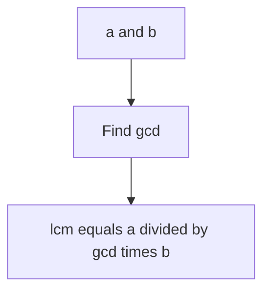

---

## 16. Prime Check

```cpp
bool isPrime(long long n) {
    if (n < 2) return false;

    for (long long p = 2; p * p <= n; p++) {
        if (n % p == 0) return false;
    }
    return true;
}
```

Why till sqrt?

```text
If n = a*b, at least one factor is <= sqrt(n).
```

---

## 17. Sieve of Eratosthenes

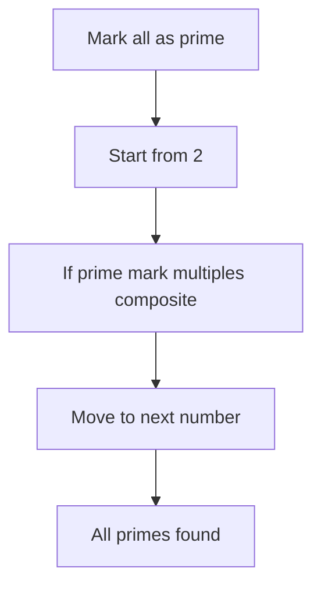

```cpp
vector<int> sieve(int n) {
    vector<int> prime(n + 1, true);
    prime[0] = prime[1] = false;

    for (long long p = 2; p * p <= n; p++) {
        if (prime[p]) {
            for (long long x = p * p; x <= n; x += p) {
                prime[x] = false;
            }
        }
    }

    vector<int> primes;
    for (int i = 2; i <= n; i++) {
        if (prime[i]) primes.push_back(i);
    }
    return primes;
}
```

---

## 18. Prime Factorization

```cpp
vector<pair<long long,int>> factorize(long long n) {
    vector<pair<long long,int>> factors;

    for (long long p = 2; p * p <= n; p++) {
        if (n % p == 0) {
            int cnt = 0;
            while (n % p == 0) {
                n /= p;
                cnt++;
            }
            factors.push_back({p, cnt});
        }
    }

    if (n > 1) factors.push_back({n, 1});
    return factors;
}
```

---

# Modular Arithmetic

---

## 19. Modular Rules

```text
(a + b) % m = ((a % m) + (b % m)) % m
(a - b) % m = ((a % m) - (b % m) + m) % m
(a * b) % m = ((a % m) * (b % m)) % m
```

```cpp
long long modAdd(long long a, long long b, long long m) {
    return ((a % m) + (b % m)) % m;
}

long long modSub(long long a, long long b, long long m) {
    return ((a % m) - (b % m) + m) % m;
}

long long modMul(long long a, long long b, long long m) {
    return (__int128)(a % m) * (b % m) % m;
}
```

---

## 20. Modular Inverse

When `mod` is prime:

```text
a inverse = a^(mod-2) mod mod
```

```cpp
long long modInverse(long long a, long long mod) {
    return modpow(a, mod - 2, mod);
}
```

Use for division:

```text
a / b mod m = a * inverse(b) mod m
```

---

# Counting

---

## 21. Factorial

```cpp
vector<long long> factorials(int n, long long mod) {
    vector<long long> fact(n + 1, 1);

    for (int i = 1; i <= n; i++) {
        fact[i] = fact[i - 1] * i % mod;
    }
    return fact;
}
```

---

## 22. Permutation

Order matters.

```text
P(n,r) = n! / (n-r)!
```

```cpp
long long nPr(int n, int r) {
    long long ans = 1;
    for (int i = 0; i < r; i++) {
        ans *= (n - i);
    }
    return ans;
}
```

---

## 23. Combination

Order does not matter.

```text
C(n,r) = n! / (r! * (n-r)!)
```

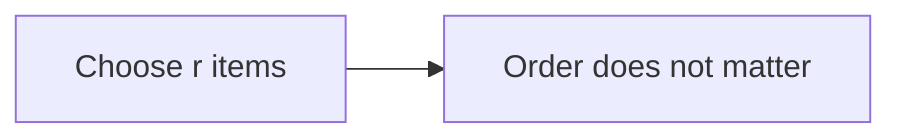

```cpp
const long long MOD = 1000000007;

long long nCrMod(int n, int r, vector<long long>& fact) {
    if (r < 0 || r > n) return 0;

    long long numerator = fact[n];
    long long denominator = fact[r] * fact[n - r] % MOD;

    return numerator * modInverse(denominator, MOD) % MOD;
}
```

---

## 24. Complement Counting

```text
answer = total cases - bad cases
```

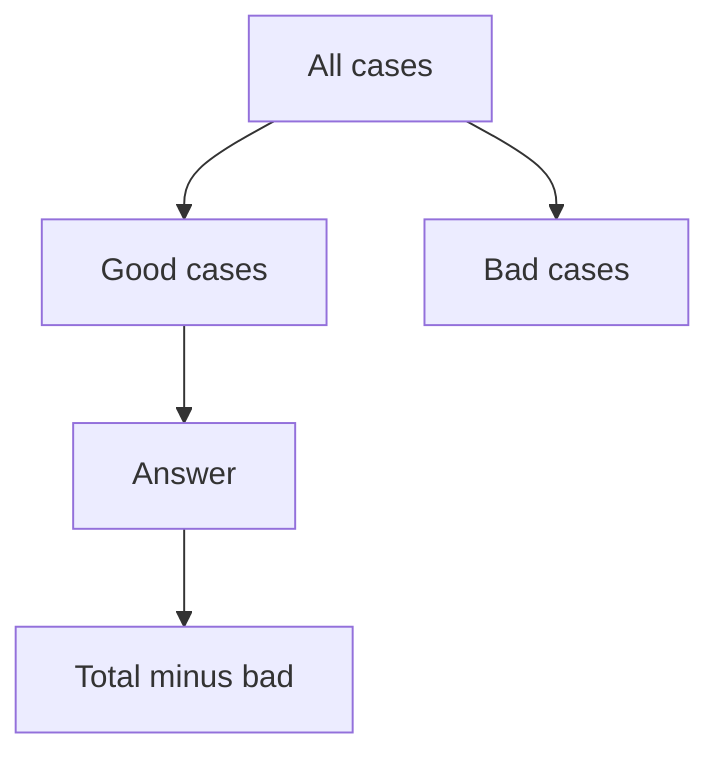

---

## 25. Probability

```text
Probability = favorable outcomes / total outcomes
P(A and B) = P(A) * P(B)
P(A or B) = P(A) + P(B) - P(A and B)
```

---

# Bit Manipulation

---

## 26. Common Bit Operations

```cpp
bool isSet(long long n, int bit) {
    return (n >> bit) & 1LL;
}

long long setBit(long long n, int bit) {
    return n | (1LL << bit);
}

long long clearBit(long long n, int bit) {
    return n & ~(1LL << bit);
}

long long toggleBit(long long n, int bit) {
    return n ^ (1LL << bit);
}
```

---

## 27. Count Set Bits and Subsets

```cpp
int countBits(long long n) {
    return __builtin_popcountll(n);
}
```

```cpp
for (int mask = 0; mask < (1 << n); mask++) {
    for (int i = 0; i < n; i++) {
        if (mask & (1 << i)) {
            // item i selected
        }
    }
}
```

---

# Geometry

---

## 28. Distance Formula

```text
distance = sqrt((x2-x1)^2 + (y2-y1)^2)
```

```cpp
double dist(double x1, double y1, double x2, double y2) {
    double dx = x2 - x1;
    double dy = y2 - y1;
    return sqrt(dx * dx + dy * dy);
}
```

---

## 29. Area Formulas

```text
Rectangle = length * width
Triangle = base * height / 2
Circle = pi * r^2
```

```cpp
const double PI = acos(-1.0);

double circleArea(double r) {
    return PI * r * r;
}
```

---

## 30. Manhattan Distance

```text
abs(x1 - x2) + abs(y1 - y2)
```

```cpp
long long manhattan(long long x1, long long y1, long long x2, long long y2) {
    return llabs(x1 - x2) + llabs(y1 - y2);
}
```

---

# Final CP Math Architecture

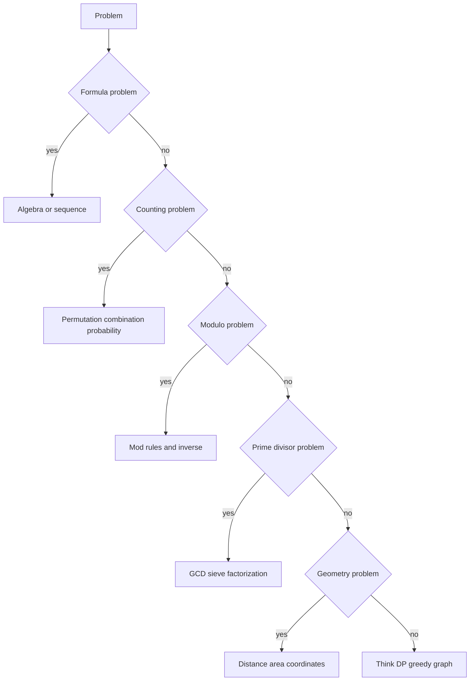

---

## Final Quick Revision

- Use `long long` by default.
- Use `__int128` for multiplication overflow.
- Powers → binary exponentiation.
- Mod division → modular inverse.
- Range sum → prefix sum.
- Repeated halving → logarithm.
- Subsets → bitmask.
- Choose without order → combination.
- Order matters → permutation.
- Primes up to `n` → sieve.
- One number factorization → divide till sqrt.
- Geometry → use squared distance if exact comparison is enough.

---

END
