# CP Math Master Playbook  
## Modular Arithmetic • Number Theory • Combinatorics • Patterns • Templates

> A complete, step-by-step competitive programming math guide from **basics to advanced**.
>
> Goal: build enough math intuition, formulas, patterns, and C++ templates to solve beginner → advanced CP/DSA math problems.

---

# Clickable Index

- [0. Master Map](#0-master-map)
- [1. Core Mental Model](#1-core-mental-model)
  - [1.1 What CP Math Is](#11-what-cp-math-is)
  - [1.2 Formula Before Simulation](#12-formula-before-simulation)
  - [1.3 Overflow Awareness](#13-overflow-awareness)
  - [1.4 Integer Division and Rounding](#14-integer-division-and-rounding)
- [2. Modular Arithmetic](#2-modular-arithmetic)
  - [2.1 Modulo as Cycle](#21-modulo-as-cycle)
  - [2.2 Safe Normalize](#22-safe-normalize)
  - [2.3 Modular Addition Subtraction Multiplication](#23-modular-addition-subtraction-multiplication)
  - [2.4 Binary Exponentiation](#24-binary-exponentiation)
  - [2.5 Modular Inverse](#25-modular-inverse)
  - [2.6 Division Under Modulo](#26-division-under-modulo)
  - [2.7 Modular Equations](#27-modular-equations)
  - [2.8 Chinese Remainder Theorem](#28-chinese-remainder-theorem)
- [3. Number Theory Basics](#3-number-theory-basics)
  - [3.1 Divisibility](#31-divisibility)
  - [3.2 GCD](#32-gcd)
  - [3.3 LCM](#33-lcm)
  - [3.4 Extended Euclid](#34-extended-euclid)
  - [3.5 Linear Diophantine Equations](#35-linear-diophantine-equations)
  - [3.6 Prime Check](#36-prime-check)
  - [3.7 Sieve of Eratosthenes](#37-sieve-of-eratosthenes)
  - [3.8 Smallest Prime Factor Sieve](#38-smallest-prime-factor-sieve)
  - [3.9 Prime Factorization](#39-prime-factorization)
  - [3.10 Number of Divisors and Sum of Divisors](#310-number-of-divisors-and-sum-of-divisors)
  - [3.11 Euler Phi Function](#311-euler-phi-function)
  - [3.12 Mobius Function](#312-mobius-function)
- [4. Combinatorics](#4-combinatorics)
  - [4.1 Counting Principles](#41-counting-principles)
  - [4.2 Factorial](#42-factorial)
  - [4.3 Permutations](#43-permutations)
  - [4.4 Combinations](#44-combinations)
  - [4.5 nCr Precomputation](#45-ncr-precomputation)
  - [4.6 Pascal Triangle](#46-pascal-triangle)
  - [4.7 Stars and Bars](#47-stars-and-bars)
  - [4.8 Inclusion Exclusion](#48-inclusion-exclusion)
  - [4.9 Derangements](#49-derangements)
  - [4.10 Catalan Numbers](#410-catalan-numbers)
  - [4.11 Pigeonhole Principle](#411-pigeonhole-principle)
  - [4.12 Burnside Lemma](#412-burnside-lemma)
- [5. Advanced CP Math Patterns](#5-advanced-cp-math-patterns)
  - [5.1 Sum Formulas](#51-sum-formulas)
  - [5.2 Prefix Math and Contribution](#52-prefix-math-and-contribution)
  - [5.3 Pair Contribution](#53-pair-contribution)
  - [5.4 Divisor Iteration Pattern](#54-divisor-iteration-pattern)
  - [5.5 Harmonic Lemma](#55-harmonic-lemma)
  - [5.6 Fast Doubling Fibonacci](#56-fast-doubling-fibonacci)
  - [5.7 Matrix Exponentiation](#57-matrix-exponentiation)
  - [5.8 Polynomial / Generating Function Idea](#58-polynomial--generating-function-idea)
- [6. Problem Forms](#6-problem-forms)
  - [6.1 Count Ways Mod M](#61-count-ways-mod-m)
  - [6.2 Large Power Mod M](#62-large-power-mod-m)
  - [6.3 nCr Mod Prime](#63-ncr-mod-prime)
  - [6.4 nCr Mod Prime Large n Small p Lucas](#64-ncr-mod-prime-large-n-small-p-lucas)
  - [6.5 Count Coprime Pairs](#65-count-coprime-pairs)
  - [6.6 Count Multiples or Divisibles](#66-count-multiples-or-divisibles)
  - [6.7 GCD of Many Numbers](#67-gcd-of-many-numbers)
  - [6.8 Number of Paths in Grid](#68-number-of-paths-in-grid)
  - [6.9 Distribute Objects Into Boxes](#69-distribute-objects-into-boxes)
  - [6.10 Count Valid Arrangements With Inclusion Exclusion](#610-count-valid-arrangements-with-inclusion-exclusion)
  - [6.11 Solve ax + by = c](#611-solve-ax--by--c)
  - [6.12 CRT Merge Remainders](#612-crt-merge-remainders)
- [7. Tactics](#7-tactics)
  - [7.1 Pattern Recognition Table](#71-pattern-recognition-table)
  - [7.2 Modulo Tactics](#72-modulo-tactics)
  - [7.3 GCD Tactics](#73-gcd-tactics)
  - [7.4 Prime Factor Tactics](#74-prime-factor-tactics)
  - [7.5 Combinatorics Tactics](#75-combinatorics-tactics)
  - [7.6 Complexity Tactics](#76-complexity-tactics)
  - [7.7 Common Mistakes](#77-common-mistakes)
- [8. C++ Template Library](#8-c-template-library)
- [9. Final Master Checklist](#9-final-master-checklist)
- [10. Memory Hooks](#10-memory-hooks)

---

# 0. Master Map

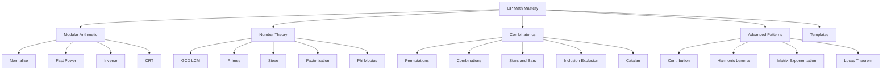

---

# 1. Core Mental Model

## 1.1 What CP Math Is

CP math is about replacing slow simulation with formulas, identities, and efficient precomputation.

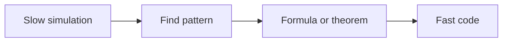

Examples:

| Slow idea | Math idea |
|---|---|
| add 1 to n in loop | `n(n+1)/2` |
| multiply x n times | binary exponentiation |
| check prime by all divisors | check up to sqrt |
| compute nCr repeatedly | factorial + inverse factorial |
| loop all pairs | contribution formula |

---

## 1.2 Formula Before Simulation

Before coding, ask:

```text
Can I count directly?
Can I use complement?
Can I use modulo cycle?
Can I precompute?
Can I use prime factorization?
Can I transform pairs into contribution?
```

---

## 1.3 Overflow Awareness

Use `long long` for most CP math.

Danger:

```cpp
int x = 1e9;
int y = 1e9;
int z = x * y; // overflow
```

Safe:

```cpp
long long z = 1LL * x * y;
```

For huge multiplication under mod, use `__int128`.

```cpp
long long mulMod(long long a, long long b, long long mod) {
    return (__int128)a * b % mod;
}
```

---

## 1.4 Integer Division and Rounding

For positive integers:

```text
floor(a / b) = a / b
ceil(a / b) = (a + b - 1) / b
```

```cpp
long long ceilDiv(long long a, long long b) {
    return (a + b - 1) / b;
}
```

For signed values, use safer versions:

```cpp
long long floorDiv(long long a, long long b) {
    assert(b != 0);
    long long q = a / b;
    long long r = a % b;

    if (r != 0 && ((r > 0) != (b > 0))) q--;
    return q;
}

long long ceilDivSigned(long long a, long long b) {
    assert(b != 0);
    long long q = a / b;
    long long r = a % b;

    if (r != 0 && ((r > 0) == (b > 0))) q++;
    return q;
}
```

---

# 2. Modular Arithmetic

## 2.1 Modulo as Cycle

Modulo means position inside a repeating cycle.

```text
x mod m = remainder after dividing x by m
```

Example:

```text
17 mod 5 = 2
```

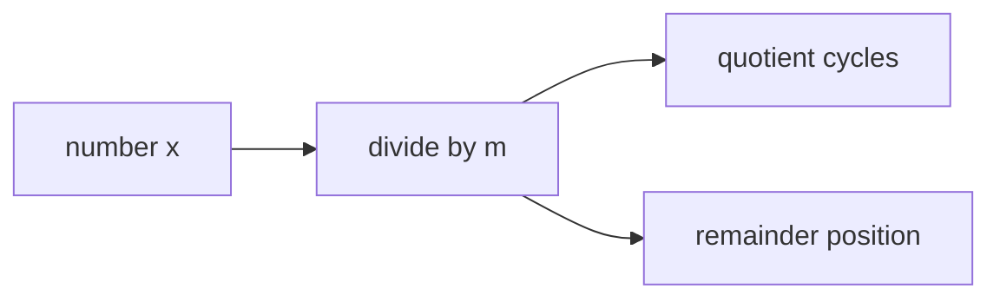

Common uses:
- cyclic days
- circular arrays
- large answers
- hash values
- powers

---

## 2.2 Safe Normalize

C++ negative modulo can be negative.

```cpp
long long norm(long long x, long long mod) {
    x %= mod;
    if (x < 0) x += mod;
    return x;
}
```

Example:

```text
-1 % 5 in C++ = -1
normalized = 4
```

---

## 2.3 Modular Addition Subtraction Multiplication

Rules:

```text
(a + b) % M = ((a % M) + (b % M)) % M
(a - b) % M = ((a % M) - (b % M) + M) % M
(a * b) % M = ((a % M) * (b % M)) % M
```

C++:

```cpp
long long addMod(long long a, long long b, long long mod) {
    return (norm(a, mod) + norm(b, mod)) % mod;
}

long long subMod(long long a, long long b, long long mod) {
    return (norm(a, mod) - norm(b, mod) + mod) % mod;
}

long long mulModSafe(long long a, long long b, long long mod) {
    return (__int128)norm(a, mod) * norm(b, mod) % mod;
}
```

---

## 2.4 Binary Exponentiation

Compute:

```text
base^exp
```

in:

```text
O(log exp)
```

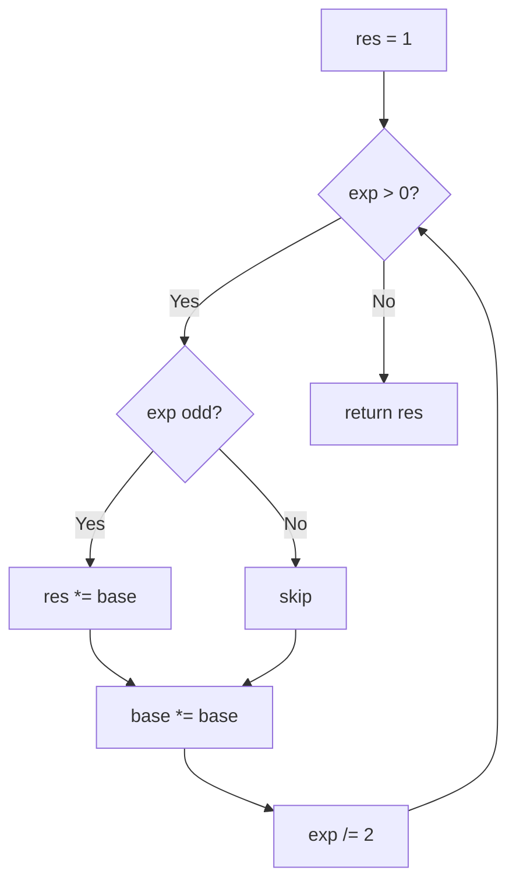

C++:

```cpp
long long modPow(long long base, long long exp, long long mod) {
    long long res = 1 % mod;
    base = norm(base, mod);

    while (exp > 0) {
        if (exp & 1LL) {
            res = (__int128)res * base % mod;
        }

        base = (__int128)base * base % mod;
        exp >>= 1LL;
    }

    return res;
}
```

Example:

```text
3^13 = 3^(8 + 4 + 1)
```

---

## 2.5 Modular Inverse

Modular inverse of `a` modulo `m` is:

```text
x such that a * x ≡ 1 mod m
```

It exists iff:

```text
gcd(a, m) = 1
```

### Prime mod method

If `mod` is prime:

```text
a^-1 ≡ a^(mod-2) mod mod
```

C++:

```cpp
long long invPrimeMod(long long a, long long mod) {
    return modPow(a, mod - 2, mod);
}
```

### Extended Euclid method

Works when `gcd(a, mod) = 1`.

```cpp
long long extendedGcd(long long a, long long b, long long& x, long long& y) {
    if (b == 0) {
        x = 1;
        y = 0;
        return a;
    }

    long long x1, y1;
    long long g = extendedGcd(b, a % b, x1, y1);

    x = y1;
    y = x1 - y1 * (a / b);

    return g;
}

long long invModGeneral(long long a, long long mod) {
    long long x, y;
    long long g = extendedGcd(a, mod, x, y);

    if (g != 1) return -1;

    return norm(x, mod);
}
```

---

## 2.6 Division Under Modulo

You cannot directly divide under modulo.

Wrong:

```cpp
ans = a / b % mod;
```

Correct if inverse exists:

```cpp
ans = a * inverse(b) % mod;
```

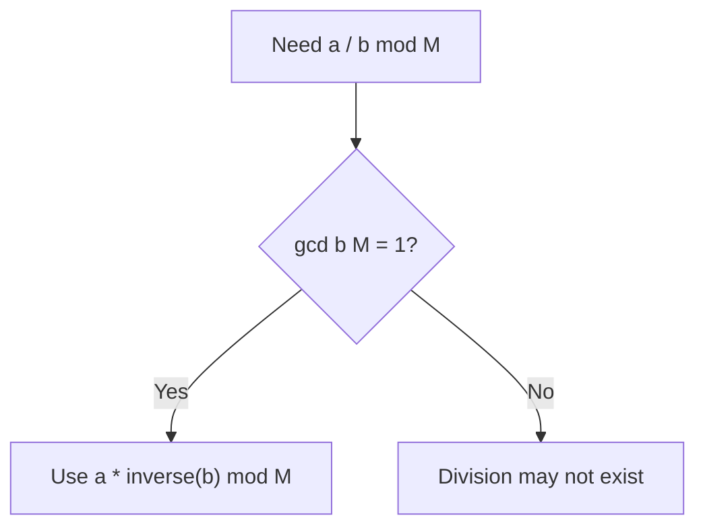

---

## 2.7 Modular Equations

Equation:

```text
a * x ≡ b mod m
```

Solution exists iff:

```text
g = gcd(a, m) divides b
```

Then reduce:

```text
(a/g) * x ≡ (b/g) mod (m/g)
```

C++:

```cpp
vector<long long> solveLinearCongruence(long long a, long long b, long long m) {
    long long g = std::gcd(a, m);

    if (b % g != 0) return {};

    a /= g;
    b /= g;
    m /= g;

    long long inv = invModGeneral(norm(a, m), m);
    long long x0 = (__int128)norm(b, m) * inv % m;

    vector<long long> sol;
    for (long long k = 0; k < g; k++) {
        sol.push_back(x0 + k * m);
    }

    return sol;
}
```

---

## 2.8 Chinese Remainder Theorem

Solve:

```text
x ≡ a1 mod m1
x ≡ a2 mod m2
```

If `m1` and `m2` are coprime, unique solution modulo `m1*m2`.

General CRT condition:

```text
a1 ≡ a2 mod gcd(m1, m2)
```

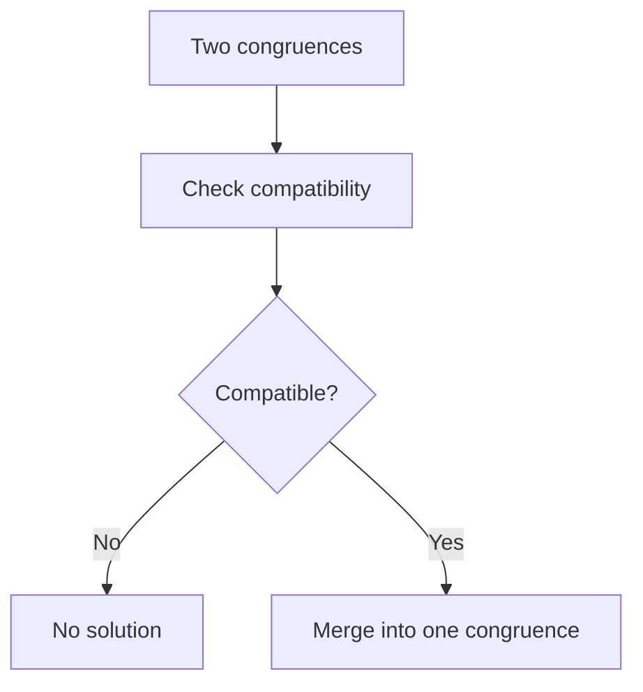

C++ general merge:

```cpp
pair<long long, long long> crtMerge(long long a1, long long m1, long long a2, long long m2) {
    long long x, y;
    long long g = extendedGcd(m1, m2, x, y);

    if ((a2 - a1) % g != 0) {
        return {-1, -1};
    }

    long long lcm = m1 / g * m2;
    long long t = (__int128)((a2 - a1) / g) * x % (m2 / g);

    long long ans = norm(a1 + (__int128)m1 * t, lcm);
    return {ans, lcm};
}
```

---

# 3. Number Theory Basics

## 3.1 Divisibility

`a` divides `b` if:

```text
b % a == 0
```

Properties:

```text
if a | b and a | c, then a | (b + c)
if a | b, then a | kb
```

---

## 3.2 GCD

GCD = greatest common divisor.

Euclid:

```text
gcd(a, b) = gcd(b, a mod b)
```

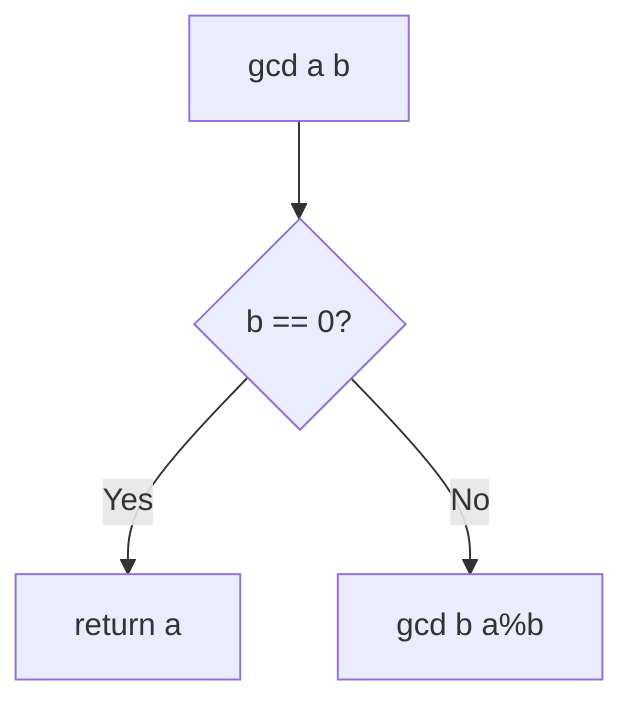

C++:

```cpp
long long gcdll(long long a, long long b) {
    a = llabs(a);
    b = llabs(b);

    while (b != 0) {
        long long r = a % b;
        a = b;
        b = r;
    }

    return a;
}
```

---

## 3.3 LCM

```text
lcm(a, b) = a / gcd(a, b) * b
```

C++:

```cpp
long long lcmll(long long a, long long b) {
    if (a == 0 || b == 0) return 0;
    return a / gcdll(a, b) * b;
}
```

Always divide before multiplying to reduce overflow.

---

## 3.4 Extended Euclid

Find integers `x` and `y` such that:

```text
a*x + b*y = gcd(a, b)
```

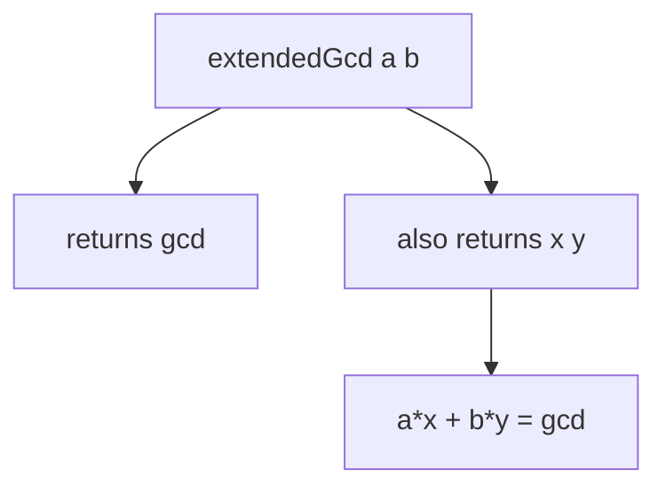

C++ already given:

```cpp
long long extendedGcd(long long a, long long b, long long& x, long long& y) {
    if (b == 0) {
        x = 1;
        y = 0;
        return a;
    }

    long long x1, y1;
    long long g = extendedGcd(b, a % b, x1, y1);

    x = y1;
    y = x1 - y1 * (a / b);

    return g;
}
```

---

## 3.5 Linear Diophantine Equations

Equation:

```text
a*x + b*y = c
```

Has solution iff:

```text
gcd(a, b) divides c
```

C++ one solution:

```cpp
bool findAnySolution(long long a, long long b, long long c, long long& x, long long& y) {
    long long g = extendedGcd(llabs(a), llabs(b), x, y);

    if (c % g != 0) return false;

    x *= c / g;
    y *= c / g;

    if (a < 0) x = -x;
    if (b < 0) y = -y;

    return true;
}
```

All solutions:

```text
x = x0 + k * (b/g)
y = y0 - k * (a/g)
```

---

## 3.6 Prime Check

Check divisors only up to sqrt.

```cpp
bool isPrime(long long n) {
    if (n < 2) return false;

    for (long long d = 2; d * d <= n; d++) {
        if (n % d == 0) return false;
    }

    return true;
}
```

Optimized:

```cpp
bool isPrimeFast(long long n) {
    if (n < 2) return false;
    if (n % 2 == 0) return n == 2;

    for (long long d = 3; d * d <= n; d += 2) {
        if (n % d == 0) return false;
    }

    return true;
}
```

---

## 3.7 Sieve of Eratosthenes

Find all primes up to `N` in:

```text
O(N log log N)
```

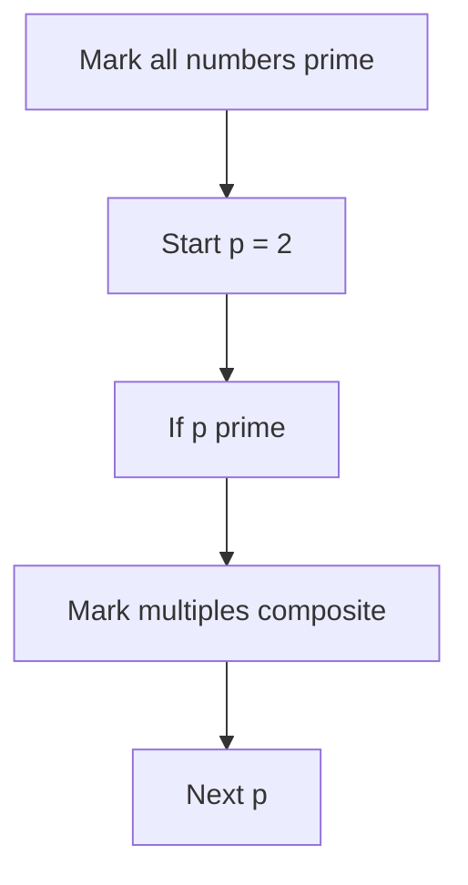

C++:

```cpp
vector<int> sievePrimes(int n) {
    vector<int> isPrime(n + 1, 1);
    vector<int> primes;

    if (n >= 0) isPrime[0] = 0;
    if (n >= 1) isPrime[1] = 0;

    for (int i = 2; i <= n; i++) {
        if (isPrime[i]) {
            primes.push_back(i);

            if (1LL * i * i <= n) {
                for (long long j = 1LL * i * i; j <= n; j += i) {
                    isPrime[j] = 0;
                }
            }
        }
    }

    return primes;
}
```

---

## 3.8 Smallest Prime Factor Sieve

SPF helps factor numbers quickly.

```cpp
vector<int> buildSPF(int n) {
    vector<int> spf(n + 1);

    for (int i = 0; i <= n; i++) spf[i] = i;

    for (int i = 2; 1LL * i * i <= n; i++) {
        if (spf[i] == i) {
            for (long long j = 1LL * i * i; j <= n; j += i) {
                if (spf[j] == j) spf[j] = i;
            }
        }
    }

    return spf;
}
```

Factorization using SPF:

```cpp
vector<pair<int,int>> factorizeSPF(int x, vector<int>& spf) {
    vector<pair<int,int>> factors;

    while (x > 1) {
        int p = spf[x];
        int cnt = 0;

        while (x % p == 0) {
            x /= p;
            cnt++;
        }

        factors.push_back({p, cnt});
    }

    return factors;
}
```

---

## 3.9 Prime Factorization

Trial division:

```cpp
vector<pair<long long,int>> factorize(long long n) {
    vector<pair<long long,int>> factors;

    for (long long p = 2; p * p <= n; p++) {
        if (n % p == 0) {
            int cnt = 0;

            while (n % p == 0) {
                n /= p;
                cnt++;
            }

            factors.push_back({p, cnt});
        }
    }

    if (n > 1) {
        factors.push_back({n, 1});
    }

    return factors;
}
```

---

## 3.10 Number of Divisors and Sum of Divisors

If:

```text
n = p1^a1 * p2^a2 * ... * pk^ak
```

Number of divisors:

```text
d(n) = (a1 + 1)(a2 + 1)...(ak + 1)
```

Sum of divisors:

```text
sigma(n) = product of (p^(a+1)-1)/(p-1)
```

C++:

```cpp
long long countDivisors(long long n) {
    auto factors = factorize(n);
    long long ans = 1;

    for (auto [p, e] : factors) {
        ans *= (e + 1);
    }

    return ans;
}

long long sumDivisors(long long n) {
    auto factors = factorize(n);
    long long ans = 1;

    for (auto [p, e] : factors) {
        long long term = 1;
        long long cur = 1;

        for (int i = 1; i <= e; i++) {
            cur *= p;
            term += cur;
        }

        ans *= term;
    }

    return ans;
}
```

---

## 3.11 Euler Phi Function

`phi(n)` = count of integers from `1` to `n` that are coprime with `n`.

Formula:

```text
phi(n) = n * product over prime p|n of (1 - 1/p)
```

C++:

```cpp
long long phi(long long n) {
    long long result = n;

    for (long long p = 2; p * p <= n; p++) {
        if (n % p == 0) {
            while (n % p == 0) n /= p;
            result -= result / p;
        }
    }

    if (n > 1) {
        result -= result / n;
    }

    return result;
}
```

Sieve phi:

```cpp
vector<int> phiSieve(int n) {
    vector<int> phi(n + 1);

    for (int i = 0; i <= n; i++) phi[i] = i;

    for (int i = 2; i <= n; i++) {
        if (phi[i] == i) {
            for (int j = i; j <= n; j += i) {
                phi[j] -= phi[j] / i;
            }
        }
    }

    return phi;
}
```

---

## 3.12 Mobius Function

Mobius `mu(n)`:

```text
mu(n) = 1 if n is square-free with even number of prime factors
mu(n) = -1 if n is square-free with odd number of prime factors
mu(n) = 0 if n has squared prime factor
```

Used in:
- inclusion-exclusion over divisors
- counting coprime pairs
- Mobius inversion

Sieve:

```cpp
vector<int> mobiusSieve(int n) {
    vector<int> mu(n + 1, 1);
    vector<int> prime;
    vector<int> isComposite(n + 1, 0);

    mu[0] = 0;

    for (int i = 2; i <= n; i++) {
        if (!isComposite[i]) {
            prime.push_back(i);
            mu[i] = -1;
        }

        for (int p : prime) {
            if (1LL * i * p > n) break;

            isComposite[i * p] = 1;

            if (i % p == 0) {
                mu[i * p] = 0;
                break;
            } else {
                mu[i * p] = -mu[i];
            }
        }
    }

    return mu;
}
```

---

# 4. Combinatorics

## 4.1 Counting Principles

Product rule:

```text
A choices then B choices = A * B
```

Sum rule:

```text
A choices or B choices = A + B
```

Complement:

```text
valid = total - invalid
```

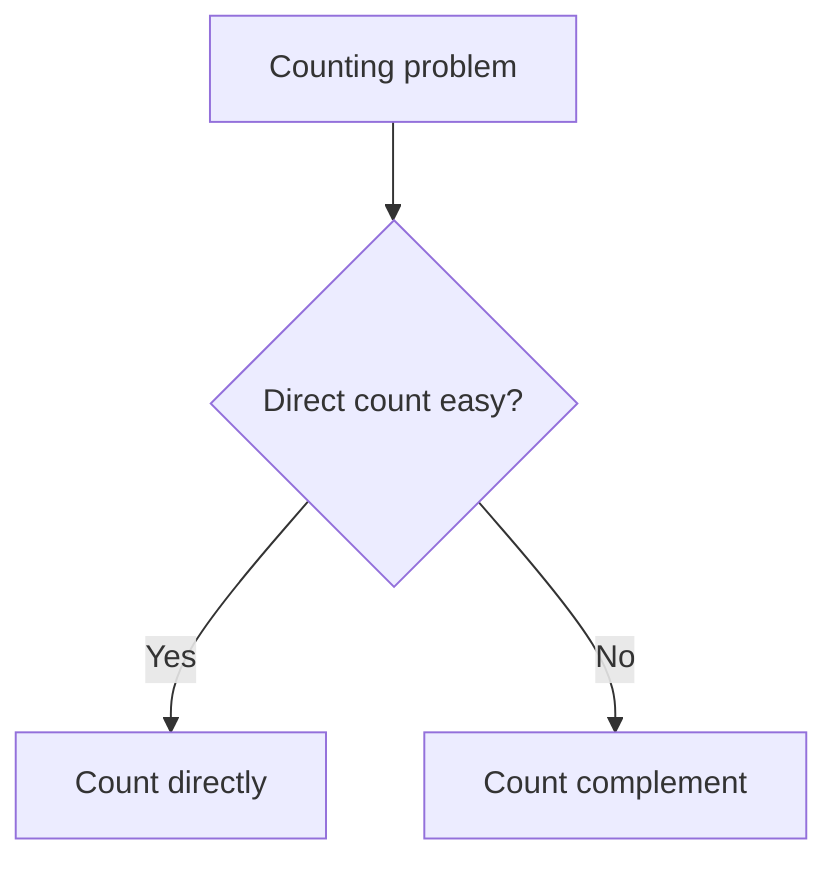

---

## 4.2 Factorial

```text
n! = n * (n-1) * ... * 1
```

C++:

```cpp
vector<long long> fact;

void buildFact(int n, long long mod) {
    fact.assign(n + 1, 1);

    for (int i = 1; i <= n; i++) {
        fact[i] = fact[i - 1] * i % mod;
    }
}
```

---

## 4.3 Permutations

Order matters.

```text
P(n, r) = n! / (n-r)!
```

Examples:
- arrange 5 people in 3 chairs
- order selected items

---

## 4.4 Combinations

Order does not matter.

```text
C(n, r) = n! / (r! * (n-r)!)
```

Use combinations when choosing a set.

---

## 4.5 nCr Precomputation

For prime mod:

```cpp
struct Comb {
    int n;
    long long mod;
    vector<long long> fact, invFact;

    Comb(int n, long long mod) : n(n), mod(mod) {
        fact.assign(n + 1, 1);
        invFact.assign(n + 1, 1);

        for (int i = 1; i <= n; i++) {
            fact[i] = fact[i - 1] * i % mod;
        }

        invFact[n] = modPow(fact[n], mod - 2, mod);

        for (int i = n - 1; i >= 0; i--) {
            invFact[i] = invFact[i + 1] * (i + 1) % mod;
        }
    }

    long long nCr(int N, int R) {
        if (R < 0 || R > N) return 0;

        return fact[N] * invFact[R] % mod * invFact[N - R] % mod;
    }
};
```

---

## 4.6 Pascal Triangle

Works for any mod, prime or not.

```text
C(n, r) = C(n-1, r-1) + C(n-1, r)
```

C++:

```cpp
vector<vector<long long>> buildPascal(int n, long long mod) {
    vector<vector<long long>> C(n + 1, vector<long long>(n + 1, 0));

    for (int i = 0; i <= n; i++) {
        C[i][0] = C[i][i] = 1 % mod;

        for (int j = 1; j < i; j++) {
            C[i][j] = (C[i - 1][j - 1] + C[i - 1][j]) % mod;
        }
    }

    return C;
}
```

---

## 4.7 Stars and Bars

Number of non-negative integer solutions:

```text
x1 + x2 + ... + xk = n
```

is:

```text
C(n + k - 1, k - 1)
```

Positive solutions:

```text
x1 + ... + xk = n, xi >= 1
```

is:

```text
C(n - 1, k - 1)
```

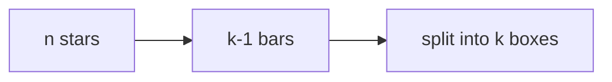

Example:

```text
x + y + z = 5, x,y,z >= 0
answer = C(5+3-1, 3-1) = C(7,2) = 21
```

---

## 4.8 Inclusion Exclusion

For union of sets:

```text
|A ∪ B| = |A| + |B| - |A ∩ B|
```

For many sets:

```text
add singles
subtract pair intersections
add triple intersections
...
```

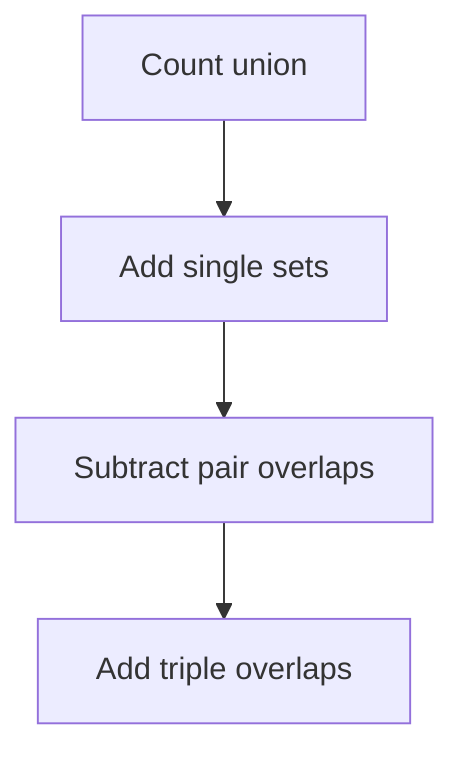

Example: count numbers `1..N` divisible by `2` or `3`:

```text
N/2 + N/3 - N/6
```

C++ for divisibility by given numbers:

```cpp
long long countDivisibleByAny(long long N, vector<long long> a) {
    int m = a.size();
    long long ans = 0;

    for (int mask = 1; mask < (1 << m); mask++) {
        long long l = 1;
        int bits = 0;
        bool overflow = false;

        for (int i = 0; i < m; i++) {
            if ((mask >> i) & 1) {
                bits++;

                long long g = gcdll(l, a[i]);

                if ((__int128)l / g * a[i] > N) {
                    overflow = true;
                    break;
                }

                l = l / g * a[i];
            }
        }

        if (overflow || l == 0) continue;

        if (bits % 2 == 1) ans += N / l;
        else ans -= N / l;
    }

    return ans;
}
```

---

## 4.9 Derangements

Derangement = permutation with no fixed point.

Formula:

```text
D(n) = (n-1) * (D(n-1) + D(n-2))
```

Base:

```text
D(0) = 1
D(1) = 0
```

C++:

```cpp
vector<long long> derangements(int n, long long mod) {
    vector<long long> D(n + 1, 0);

    D[0] = 1;
    if (n >= 1) D[1] = 0;

    for (int i = 2; i <= n; i++) {
        D[i] = (i - 1) * (D[i - 1] + D[i - 2]) % mod;
    }

    return D;
}
```

---

## 4.10 Catalan Numbers

Catalan numbers count:
- valid parentheses
- binary tree shapes
- triangulations
- non-crossing pairings

Formula:

```text
Cat(n) = C(2n, n) / (n + 1)
```

Modulo prime:

```cpp
long long catalan(int n, Comb& comb) {
    return comb.nCr(2 * n, n) * invPrimeMod(n + 1, comb.mod) % comb.mod;
}
```

DP version:

```text
Cat(0) = 1
Cat(n) = sum Cat(i) * Cat(n-1-i)
```

```cpp
vector<long long> catalanDP(int n, long long mod) {
    vector<long long> cat(n + 1, 0);
    cat[0] = 1;

    for (int len = 1; len <= n; len++) {
        for (int left = 0; left < len; left++) {
            int right = len - 1 - left;
            cat[len] = (cat[len] + cat[left] * cat[right]) % mod;
        }
    }

    return cat;
}
```

---

## 4.11 Pigeonhole Principle

If `n + 1` objects are placed in `n` boxes, at least one box contains at least two objects.

Common CP uses:
- duplicate remainders
- prefix sums modulo n
- guarantee collision
- existence proofs

Example:

```text
Among n+1 prefix sums modulo n, two have same remainder.
Their difference is divisible by n.
```

---

## 4.12 Burnside Lemma

Used for counting objects up to symmetry.

Formula:

```text
number of distinct objects = average number of objects fixed by each symmetry
```

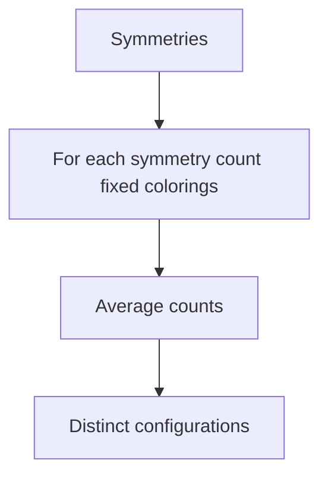

Example use:
- necklaces
- rotations
- colorings up to symmetry

Simple necklace rotation count with `n` beads and `k` colors:

```text
answer = (1/n) * sum over rotations r of k^gcd(n,r)
```

C++ modulo prime:

```cpp
long long countNecklaces(int n, long long k, long long mod) {
    long long sum = 0;

    for (int r = 0; r < n; r++) {
        sum = (sum + modPow(k, gcdll(n, r), mod)) % mod;
    }

    return sum * invPrimeMod(n, mod) % mod;
}
```

---

# 5. Advanced CP Math Patterns

## 5.1 Sum Formulas

```text
1 + 2 + ... + n = n(n+1)/2
1^2 + ... + n^2 = n(n+1)(2n+1)/6
1^3 + ... + n^3 = [n(n+1)/2]^2
```

Use `__int128` if `n` is large.

---

## 5.2 Prefix Math and Contribution

Many pair/subarray sums can be computed by contribution.

Example:

```text
sum over all subarrays of a[i]
```

Element `a[i]` appears in:

```text
(i + 1) * (n - i)
```

subarrays.

C++:

```cpp
long long sumAllSubarraySums(vector<int>& a, long long mod) {
    int n = a.size();
    long long ans = 0;

    for (int i = 0; i < n; i++) {
        long long cnt = 1LL * (i + 1) * (n - i) % mod;
        ans = (ans + cnt * norm(a[i], mod)) % mod;
    }

    return ans;
}
```

---

## 5.3 Pair Contribution

Sum of pair absolute differences after sorting:

```text
sum |a[j] - a[i]| for i < j
```

If sorted:

```text
a[i] contributes +a[i] to pairs on left count i
a[i] contributes -a[i] to pairs on right count n-i-1
```

C++:

```cpp
long long sumPairAbsDiff(vector<long long> a) {
    sort(a.begin(), a.end());

    long long ans = 0;
    long long pref = 0;

    for (int i = 0; i < (int)a.size(); i++) {
        ans += a[i] * i - pref;
        pref += a[i];
    }

    return ans;
}
```

---

## 5.4 Divisor Iteration Pattern

All divisors of `n` can be found in `O(sqrt n)`.

```cpp
vector<long long> divisors(long long n) {
    vector<long long> d;

    for (long long x = 1; x * x <= n; x++) {
        if (n % x == 0) {
            d.push_back(x);
            if (x != n / x) d.push_back(n / x);
        }
    }

    sort(d.begin(), d.end());
    return d;
}
```

---

## 5.5 Harmonic Lemma

Values of:

```text
floor(n / i)
```

change only `O(sqrt n)` times.

Pattern:

```cpp
for (long long l = 1; l <= n; ) {
    long long q = n / l;
    long long r = n / q;

    // floor(n / i) = q for all i in [l, r]

    l = r + 1;
}
```

Used for:
- divisor summatory functions
- optimized counting
- advanced number theory

---

## 5.6 Fast Doubling Fibonacci

Computes Fibonacci in `O(log n)`.

Formulas:

```text
F(2k) = F(k) * [2F(k+1) - F(k)]
F(2k+1) = F(k)^2 + F(k+1)^2
```

C++:

```cpp
pair<long long,long long> fibDoubling(long long n, long long mod) {
    if (n == 0) return {0, 1};

    auto [a, b] = fibDoubling(n >> 1, mod);

    long long c = a * ((2 * b % mod - a + mod) % mod) % mod;
    long long d = (a * a % mod + b * b % mod) % mod;

    if (n & 1) return {d, (c + d) % mod};
    return {c, d};
}
```

---

## 5.7 Matrix Exponentiation

Use when recurrence is linear.

Example Fibonacci:

```text
[F(n), F(n-1)] = matrix^(n-1) * [F(1), F(0)]
```

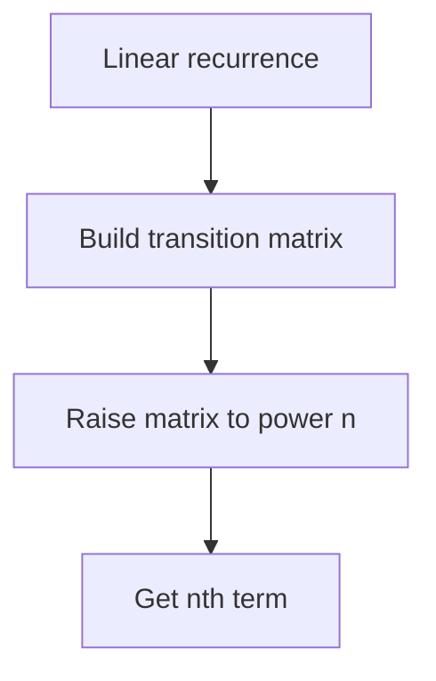

C++ 2x2:

```cpp
using Matrix = vector<vector<long long>>;

Matrix multiply(Matrix A, Matrix B, long long mod) {
    int n = A.size();
    int m = B[0].size();
    int p = B.size();

    Matrix C(n, vector<long long>(m, 0));

    for (int i = 0; i < n; i++) {
        for (int k = 0; k < p; k++) {
            for (int j = 0; j < m; j++) {
                C[i][j] = (C[i][j] + A[i][k] * B[k][j]) % mod;
            }
        }
    }

    return C;
}

Matrix matPow(Matrix base, long long exp, long long mod) {
    int n = base.size();
    Matrix res(n, vector<long long>(n, 0));

    for (int i = 0; i < n; i++) res[i][i] = 1;

    while (exp > 0) {
        if (exp & 1) res = multiply(res, base, mod);
        base = multiply(base, base, mod);
        exp >>= 1;
    }

    return res;
}
```

---

## 5.8 Polynomial / Generating Function Idea

Generating functions encode counts as coefficients.

Example:

```text
(1 + x^w1)(1 + x^w2)... 
```

Coefficient of `x^S` tells number of subsets with sum `S`.

In CP this often becomes DP:

```cpp
vector<long long> dp(S + 1, 0);
dp[0] = 1;

for (int w : weights) {
    for (int s = S; s >= w; s--) {
        dp[s] += dp[s - w];
    }
}
```

---

# 6. Problem Forms

## 6.1 Count Ways Mod M

Pattern:
- if answer huge, take modulo
- define recurrence/count
- add using modulo

```cpp
const long long MOD = 1000000007;

long long addWays(long long a, long long b) {
    return (a + b) % MOD;
}
```

---

## 6.2 Large Power Mod M

Use binary exponentiation.

```cpp
long long answer = modPow(a, b, MOD);
```

If exponent is huge string, process digit by digit:

```cpp
long long modPowBigExponent(long long a, string exp, long long mod) {
    long long ans = 1;

    for (char c : exp) {
        int digit = c - '0';
        ans = modPow(ans, 10, mod) * modPow(a, digit, mod) % mod;
    }

    return ans;
}
```

---

## 6.3 nCr Mod Prime

Use factorial and inverse factorial.

```cpp
Comb comb(1000000, 1000000007);
cout << comb.nCr(n, r) << "\n";
```

---

## 6.4 nCr Mod Prime Large n Small p Lucas

Lucas theorem:

```text
C(n, r) mod p = product C(ni, ri) mod p
```

where `ni` and `ri` are digits of `n` and `r` in base `p`.

C++:

```cpp
long long lucas(long long n, long long r, long long p, Comb& smallComb) {
    if (r < 0 || r > n) return 0;

    long long ans = 1;

    while (n > 0 || r > 0) {
        int ni = n % p;
        int ri = r % p;

        if (ri > ni) return 0;

        ans = ans * smallComb.nCr(ni, ri) % p;

        n /= p;
        r /= p;
    }

    return ans;
}
```

---

## 6.5 Count Coprime Pairs

Given array values up to `MAX`.

Idea:
- count frequency of each value
- count how many numbers divisible by `d`
- use Mobius:

```text
coprime pairs = sum mu[d] * C(cntDivisible[d], 2)
```

C++:

```cpp
long long countCoprimePairs(vector<int>& a, int MAXV) {
    vector<int> freq(MAXV + 1, 0);
    for (int x : a) freq[x]++;

    vector<int> divCnt(MAXV + 1, 0);

    for (int d = 1; d <= MAXV; d++) {
        for (int multiple = d; multiple <= MAXV; multiple += d) {
            divCnt[d] += freq[multiple];
        }
    }

    vector<int> mu = mobiusSieve(MAXV);

    long long ans = 0;
    for (int d = 1; d <= MAXV; d++) {
        ans += 1LL * mu[d] * divCnt[d] * (divCnt[d] - 1) / 2;
    }

    return ans;
}
```

---

## 6.6 Count Multiples or Divisibles

Numbers from `1..N` divisible by `x`:

```text
floor(N / x)
```

Numbers divisible by `a` or `b`:

```text
N/a + N/b - N/lcm(a,b)
```

---

## 6.7 GCD of Many Numbers

```cpp
long long gcdArray(vector<long long>& a) {
    long long g = 0;

    for (long long x : a) {
        g = gcdll(g, x);
    }

    return g;
}
```

---

## 6.8 Number of Paths in Grid

From `(0,0)` to `(n-1,m-1)` moving only down/right:

```text
total moves = n - 1 + m - 1
choose down moves = n - 1
answer = C(n + m - 2, n - 1)
```

---

## 6.9 Distribute Objects Into Boxes

Non-negative distribution:

```text
x1 + ... + xk = n
answer = C(n+k-1, k-1)
```

Positive distribution:

```text
answer = C(n-1, k-1)
```

---

## 6.10 Count Valid Arrangements With Inclusion Exclusion

Pattern:

```text
valid = total - bad + overlap_bad - ...
```

Example derangements:

```text
D(n) = n! * sum from i=0 to n of (-1)^i / i!
```

Modulo prime:

```cpp
long long derangementIE(int n, long long mod) {
    Comb comb(n, mod);

    long long ans = 0;

    for (int i = 0; i <= n; i++) {
        long long term = comb.fact[n] * comb.invFact[i] % mod;

        if (i % 2 == 0) ans = (ans + term) % mod;
        else ans = (ans - term + mod) % mod;
    }

    return ans;
}
```

---

## 6.11 Solve ax + by = c

Use Extended Euclid.

```cpp
long long x, y;
if (findAnySolution(a, b, c, x, y)) {
    cout << x << " " << y << "\n";
} else {
    cout << "No solution\n";
}
```

---

## 6.12 CRT Merge Remainders

```cpp
auto [a, m] = crtMerge(a1, m1, a2, m2);

if (m == -1) {
    cout << "No solution\n";
} else {
    cout << "x = " << a << " mod " << m << "\n";
}
```

---

# 7. Tactics

## 7.1 Pattern Recognition Table

| Problem clue | Think |
|---|---|
| answer too large | modulo |
| power huge | binary exponentiation |
| divide under mod | modular inverse |
| repeated nCr | factorial + inv factorial |
| mod not prime | extended gcd or Pascal |
| count primes | sieve |
| factor many numbers | SPF sieve |
| gcd condition | Euclid / prime factors |
| coprime count | phi / mobius |
| distribute identical objects | stars and bars |
| count without restrictions easier | complement |
| count with many forbidden conditions | inclusion-exclusion |
| recurrence with huge n | matrix exponentiation |
| floor n/i appears | harmonic lemma |
| symmetry | Burnside |

---

## 7.2 Modulo Tactics

Always normalize after subtraction:

```cpp
ans = (ans - x + MOD) % MOD;
```

For multiplication:

```cpp
ans = ans * x % MOD;
```

For division:

```cpp
ans = ans * inv(x) % MOD;
```

only if inverse exists.

---

## 7.3 GCD Tactics

Useful identities:

```text
gcd(a, b) = gcd(b, a % b)
gcd(a, 0) = a
lcm(a, b) = a / gcd(a,b) * b
gcd(a, b) = gcd(a, b-a)
```

If problem says:
- coprime
- divisible
- common divisor
- equalize by operations involving difference

think GCD.

---

## 7.4 Prime Factor Tactics

Prime factorization helps with:
- divisor count
- divisor sum
- gcd/lcm constraints
- coprime checks
- modular phi
- square-free checks

Mental trick:

```text
Multiplication structure lives in prime exponents.
```

---

## 7.5 Combinatorics Tactics

Ask:
```text
Does order matter?
Are objects identical or distinct?
Can boxes be empty?
Are there forbidden positions?
Can complement simplify?
Are there symmetries?
```

Mapping:

| Situation | Formula |
|---|---|
| choose unordered | `C(n,r)` |
| arrange ordered | `P(n,r)` |
| distribute identical non-negative | `C(n+k-1,k-1)` |
| distribute identical positive | `C(n-1,k-1)` |
| no fixed point | derangement |
| valid parentheses | Catalan |
| forbidden conditions | inclusion-exclusion |

---

## 7.6 Complexity Tactics

Before coding math, check constraints:

| Constraint | Likely approach |
|---|---|
| `N <= 1e6` | sieve/precompute |
| `N <= 1e12` | sqrt factorization |
| `N <= 1e18` | log methods, Miller Rabin if needed |
| many nCr queries | precompute factorials |
| mod prime | inverse by power |
| mod composite | extended gcd / CRT |
| small number of forbidden sets | inclusion-exclusion over masks |

---

## 7.7 Common Mistakes

1. Dividing under modulo directly.
2. Forgetting negative modulo normalization.
3. Using `int` for multiplication.
4. Using modular inverse when gcd is not `1`.
5. Forgetting `r > n` in nCr.
6. Using factorial inverse with non-prime mod.
7. Overflow in `lcm`.
8. Checking primality to `n` instead of `sqrt(n)`.
9. Wrong inclusion-exclusion signs.
10. Confusing permutations and combinations.
11. Forgetting objects identical vs distinct.
12. Not precomputing when queries are many.

---

# 8. C++ Template Library

## 8.1 Core Modular Template

```cpp
const long long MOD = 1000000007;

long long norm(long long x, long long mod = MOD) {
    x %= mod;
    if (x < 0) x += mod;
    return x;
}

long long modPow(long long base, long long exp, long long mod = MOD) {
    long long res = 1 % mod;
    base = norm(base, mod);

    while (exp > 0) {
        if (exp & 1LL) res = (__int128)res * base % mod;
        base = (__int128)base * base % mod;
        exp >>= 1LL;
    }

    return res;
}

long long invPrimeMod(long long a, long long mod = MOD) {
    return modPow(a, mod - 2, mod);
}
```

---

## 8.2 GCD Extended GCD Template

```cpp
long long gcdll(long long a, long long b) {
    a = llabs(a);
    b = llabs(b);

    while (b != 0) {
        long long r = a % b;
        a = b;
        b = r;
    }

    return a;
}

long long extendedGcd(long long a, long long b, long long& x, long long& y) {
    if (b == 0) {
        x = 1;
        y = 0;
        return a;
    }

    long long x1, y1;
    long long g = extendedGcd(b, a % b, x1, y1);

    x = y1;
    y = x1 - y1 * (a / b);

    return g;
}
```

---

## 8.3 Sieve Template

```cpp
vector<int> sievePrimes(int n) {
    vector<int> isPrime(n + 1, 1);
    vector<int> primes;

    if (n >= 0) isPrime[0] = 0;
    if (n >= 1) isPrime[1] = 0;

    for (int i = 2; i <= n; i++) {
        if (isPrime[i]) {
            primes.push_back(i);

            if (1LL * i * i <= n) {
                for (long long j = 1LL * i * i; j <= n; j += i) {
                    isPrime[j] = 0;
                }
            }
        }
    }

    return primes;
}
```

---

## 8.4 Combination Template

```cpp
struct Comb {
    int n;
    long long mod;
    vector<long long> fact, invFact;

    Comb(int n, long long mod) : n(n), mod(mod) {
        fact.assign(n + 1, 1);
        invFact.assign(n + 1, 1);

        for (int i = 1; i <= n; i++) {
            fact[i] = fact[i - 1] * i % mod;
        }

        invFact[n] = modPow(fact[n], mod - 2, mod);

        for (int i = n - 1; i >= 0; i--) {
            invFact[i] = invFact[i + 1] * (i + 1) % mod;
        }
    }

    long long nCr(int N, int R) {
        if (R < 0 || R > N) return 0;

        return fact[N] * invFact[R] % mod * invFact[N - R] % mod;
    }

    long long nPr(int N, int R) {
        if (R < 0 || R > N) return 0;

        return fact[N] * invFact[N - R] % mod;
    }
};
```

---

## 8.5 SPF Factorization Template

```cpp
vector<int> buildSPF(int n) {
    vector<int> spf(n + 1);

    for (int i = 0; i <= n; i++) spf[i] = i;

    for (int i = 2; 1LL * i * i <= n; i++) {
        if (spf[i] == i) {
            for (long long j = 1LL * i * i; j <= n; j += i) {
                if (spf[j] == j) spf[j] = i;
            }
        }
    }

    return spf;
}

vector<pair<int,int>> factorizeSPF(int x, vector<int>& spf) {
    vector<pair<int,int>> factors;

    while (x > 1) {
        int p = spf[x];
        int cnt = 0;

        while (x % p == 0) {
            x /= p;
            cnt++;
        }

        factors.push_back({p, cnt});
    }

    return factors;
}
```

---

# 9. Final Master Checklist

Before solving a CP math problem, ask:

```text
1. Is the answer huge? Need modulo?
2. Is there division under modulo?
3. Is mod prime?
4. Is there a repeated nCr or factorial?
5. Is this counting ordered or unordered?
6. Are objects identical or distinct?
7. Can I use complement?
8. Can I use inclusion-exclusion?
9. Is there a gcd/coprime condition?
10. Can prime factorization simplify it?
11. Can I precompute with sieve?
12. Can contribution replace pair loops?
13. Is there a recurrence with huge n?
14. Is there a symmetry?
15. Can constraints guide the method?
```

---

# 10. Memory Hooks

```text
Modulo:
    position in cycle

Binary exponentiation:
    use bits of exponent

Inverse:
    division becomes multiplication by inverse

GCD:
    common structure of divisibility

Prime factors:
    multiplication becomes exponent vectors

Sieve:
    precompute primes once

Combination:
    choose without order

Permutation:
    arrange with order

Stars and bars:
    distribute identical objects

Inclusion-exclusion:
    add singles, subtract overlaps

Catalan:
    balanced recursive structures

Mobius:
    inclusion-exclusion over divisors

Contribution:
    count how many times each item contributes

Harmonic lemma:
    floor(n/i) changes only O(sqrt n) times
```

---

END
