# Prefix Sum & Partial Sum for Competitive Programming (C++)

These notes are based on the uploaded reference PDF and reorganized into a clean CP-style explanation from scratch. The PDF covers four important ideas:

1. **1D prefix sum** for fast range sum queries
2. **1D difference array** for fast range updates
3. **2D prefix sum** for fast rectangle sum queries
4. **2D difference array** for fast rectangle updates

Reference: uploaded PDF fileciteturn0file0

---

## Visual Map

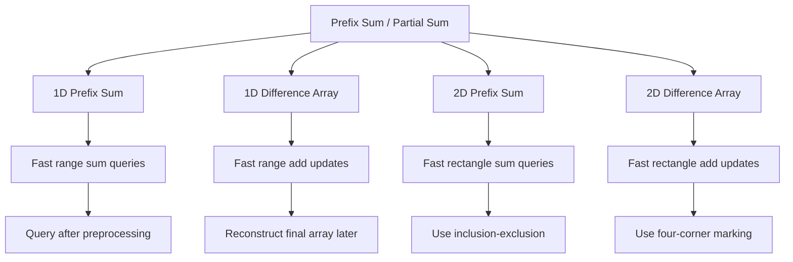

---

## 1. What is a Prefix Sum?

For an array:

```text
a = [4, 2, 3, 1, -5, 6]
```

The prefix sum array `pref` is defined as:

```text
pref[i] = a[0] + a[1] + ... + a[i]
```

So here:

```text
pref = [4, 6, 9, 10, 5, 11]
```

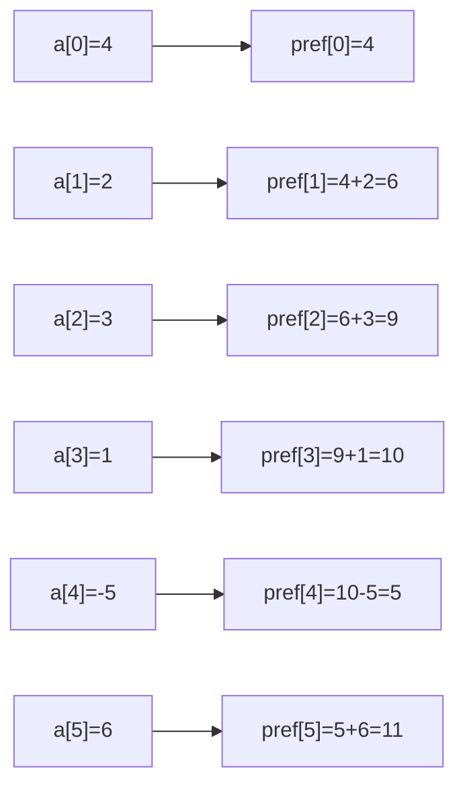

This is exactly the idea shown on the first pages of the PDF, where `P[i] = sum of a[j] from j = 0 to i`. fileciteturn0file0

### Why do we build it?

Because once prefix sums are built, the sum of any subarray `[l...r]` can be answered in **O(1)**.

---

## 2. Range Sum Query in 1D

We want:

```text
sum(l, r) = a[l] + a[l+1] + ... + a[r]
```

Using prefix sum:

- If `l == 0`, then:

```cpp
sum(l, r) = pref[r]
```

- Otherwise:

```cpp
sum(l, r) = pref[r] - pref[l - 1]
```

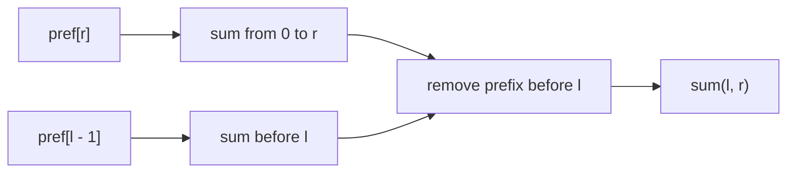

That matches the formula shown in the PDF for answering queries after precomputation. fileciteturn0file0

### Example

For:

```text
a = [4, 2, 3, 1, -5, 6]
pref = [4, 6, 9, 10, 5, 11]
```

- `sum(1, 3) = 2 + 3 + 1 = 6`
- Using prefix:

```text
pref[3] - pref[0] = 10 - 4 = 6
```

- `sum(2, 4) = 3 + 1 + (-5) = -1`
- Using prefix:

```text
pref[4] - pref[1] = 5 - 6 = -1
```

---

## 3. Building Prefix Sum in C++

### Method 1: Separate prefix array

```cpp
#include <bits/stdc++.h>
using namespace std;

int main() {
    vector<long long> a = {4, 2, 3, 1, -5, 6};
    int n = (int)a.size();

    vector<long long> pref(n);
    pref[0] = a[0];

    for (int i = 1; i < n; i++) {
        pref[i] = pref[i - 1] + a[i];
    }

    int l = 2, r = 4;
    long long ans = pref[r] - (l > 0 ? pref[l - 1] : 0);
    cout << ans << "\n";  // -1
}
```

### Method 2: 1-indexed prefix (very common in CP)

This version avoids the `if (l == 0)` check.

```cpp
#include <bits/stdc++.h>
using namespace std;

int main() {
    vector<long long> a = {4, 2, 3, 1, -5, 6};
    int n = (int)a.size();

    vector<long long> pref(n + 1, 0);
    for (int i = 1; i <= n; i++) {
        pref[i] = pref[i - 1] + a[i - 1];
    }

    int l = 2, r = 4; // 0-indexed in original array
    long long ans = pref[r + 1] - pref[l];
    cout << ans << "\n";  // -1
}
```

### Why many CP coders prefer 1-indexed prefix

Because:

```cpp
sum(l, r) = pref[r + 1] - pref[l]
```

No edge case.

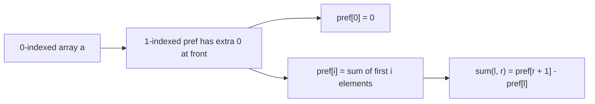

---

## 4. Time Complexity of 1D Prefix Sum

If there are `q` queries:

- Building prefix sum: **O(n)**
- Each query: **O(1)**
- Total: **O(n + q)**

This is the same conclusion written in the PDF. fileciteturn0file0

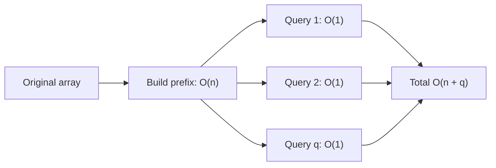

---

# 5. Difference Array / Partial Sum Concept in 1D

This is the next big idea in the PDF.

## Problem

You are given an array of size `n`, initially all zero.

There are `q` queries of the form:

```text
+ L R X
```

Meaning:

> Add `X` to every index in the range `[L, R]`.

### Brute force

For every query, loop from `L` to `R` and add `X`.

That costs:

```text
O(q * n)
```

The PDF explicitly points out this brute-force complexity before introducing the optimized idea. fileciteturn0file0

---

## 6. Trick: Store only where the effect starts and ends

Instead of directly updating every element in `[L, R]`, create a **difference array** `diff`.

For adding `X` on `[L, R]`:

```cpp
diff[L] += X;
if (R + 1 < n) diff[R + 1] -= X;
```

After processing all queries, build the prefix sum of `diff`.

The final prefix values are the actual final array.

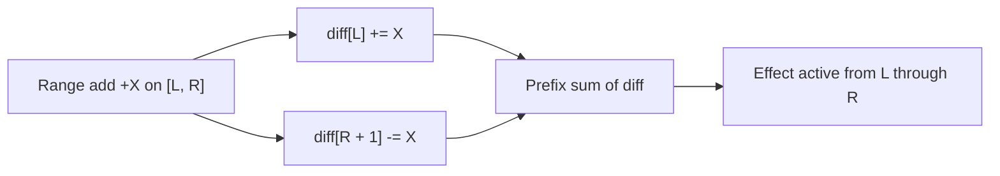

### Why this works

- At `L`, the effect of `+X` starts.
- At `R + 1`, the effect of `+X` stops.
- Prefix sum spreads that contribution across the whole segment `[L, R]`.

The diagrams in the PDF explain exactly this “start here, stop after the range” idea. fileciteturn0file0

> **Important correction:** one handwritten formula in the PDF looks like `P[R-1] -= X`, but from the examples and the concept, the correct update is `P[R+1] -= X` for an inclusive range `[L, R]` (when `R + 1` is inside the array). The later 2D pages also follow the same “boundary after the rectangle” logic. fileciteturn0file0

---

## 7. 1D Difference Array Example

Suppose `n = 6`, initially:

```text
[0, 0, 0, 0, 0, 0]
```

Queries from the PDF example:

1. `+ 2 4 1`
2. `+ 1 5 3`
3. `+ 0 2 2`

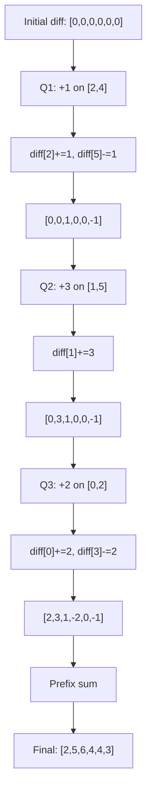

### Step 1: Apply updates to `diff`

Start:

```text
diff = [0, 0, 0, 0, 0, 0]
```

#### Query 1: add 1 on [2, 4]

```cpp
diff[2] += 1;
diff[5] -= 1;
```

Now:

```text
[0, 0, 1, 0, 0, -1]
```

#### Query 2: add 3 on [1, 5]

```cpp
diff[1] += 3;
// R + 1 = 6 is outside array, so no subtraction
```

Now:

```text
[0, 3, 1, 0, 0, -1]
```

#### Query 3: add 2 on [0, 2]

```cpp
diff[0] += 2;
diff[3] -= 2;
```

Now:

```text
[2, 3, 1, -2, 0, -1]
```

### Step 2: Prefix sum of `diff`

```text
final[0] = 2
final[1] = 2 + 3 = 5
final[2] = 5 + 1 = 6
final[3] = 6 - 2 = 4
final[4] = 4 + 0 = 4
final[5] = 4 - 1 = 3
```

Final array:

```text
[2, 5, 6, 4, 4, 3]
```

This matches the final answer illustrated in the PDF. fileciteturn0file0

---

## 8. 1D Difference Array Code (C++)

```cpp
#include <bits/stdc++.h>
using namespace std;

int main() {
    int n = 6;
    vector<long long> diff(n, 0);

    vector<tuple<int, int, long long>> queries = {
        {2, 4, 1},
        {1, 5, 3},
        {0, 2, 2}
    };

    for (auto [L, R, X] : queries) {
        diff[L] += X;
        if (R + 1 < n) diff[R + 1] -= X;
    }

    // Build final array in-place using prefix sum
    for (int i = 1; i < n; i++) {
        diff[i] += diff[i - 1];
    }

    for (long long val : diff) {
        cout << val << ' ';
    }
    cout << '\n';

    return 0;
}
```

Output:

```text
2 5 6 4 4 3
```

---

## 9. Complexity of 1D Difference Array

For `q` range-add queries:

- Each query update: **O(1)**
- Prefix build at the end: **O(n)**
- Total: **O(q + n)**

This is one of the most useful optimization tricks in CP. The PDF emphasizes that the prefix step reconstructs the full final array after all range updates. fileciteturn0file0

---

# 10. 2D Prefix Sum

Now move from array to matrix.

Suppose you have a matrix `a[n][m]` and want to answer rectangle sum queries.

A query gives:

```text
U, D, L, R
```

where:

- rows are from `U` to `D`
- columns are from `L` to `R`

We want the sum of all cells inside that rectangle.

The PDF first mentions brute force and also shows that using 1D prefix row-by-row can reduce each query to `O(n)`, but 2D prefix sum improves it further to `O(1)` per query. fileciteturn0file0

---

## 11. Definition of 2D Prefix Sum

Define `pref[i][j]` as:

> Sum of all elements in the rectangle from top-left `(0, 0)` to `(i, j)`.

So the formula is:

```cpp
pref[i][j] = a[i][j]
           + pref[i - 1][j]
           + pref[i][j - 1]
           - pref[i - 1][j - 1];
```

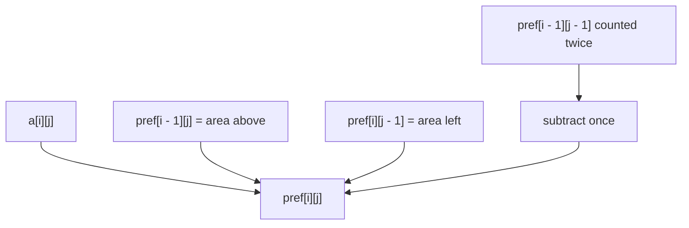

The subtraction is needed because `pref[i - 1][j - 1]` gets counted twice otherwise. This exact inclusion-exclusion formula is shown in the PDF. fileciteturn0file0

---

## 12. Building 2D Prefix Sum in C++

### Clean 1-indexed version

This is the safest version for contests.

```cpp
#include <bits/stdc++.h>
using namespace std;

int main() {
    vector<vector<long long>> a = {
        {1, 2, 3},
        {4, 5, 6},
        {7, 8, 9}
    };

    int n = (int)a.size();
    int m = (int)a[0].size();

    vector<vector<long long>> pref(n + 1, vector<long long>(m + 1, 0));

    for (int i = 1; i <= n; i++) {
        for (int j = 1; j <= m; j++) {
            pref[i][j] = a[i - 1][j - 1]
                       + pref[i - 1][j]
                       + pref[i][j - 1]
                       - pref[i - 1][j - 1];
        }
    }

    return 0;
}
```

### Complexity

Building the full 2D prefix sum costs:

```text
O(n * m)
```

Same as stated in the PDF. fileciteturn0file0

---

## 13. Rectangle Sum Query in 2D

For rectangle:

```text
rows: U ... D
cols: L ... R
```

Using 1-indexed prefix array:

```cpp
sum(U, D, L, R) = pref[D + 1][R + 1]
                - pref[U][R + 1]
                - pref[D + 1][L]
                + pref[U][L];
```

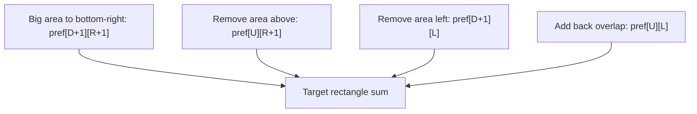

If using 0-indexed `pref[i][j] = sum(0,0 to i,j)`, the formula becomes:

```text
pref[D][R] - pref[U-1][R] - pref[D][L-1] + pref[U-1][L-1]
```

The PDF shows this inclusion-exclusion rectangle query formula and notes that query time becomes **O(1)**. fileciteturn0file0

---

## 14. Full 2D Prefix Query Code (C++)

```cpp
#include <bits/stdc++.h>
using namespace std;

struct Prefix2D {
    int n, m;
    vector<vector<long long>> pref;

    Prefix2D(const vector<vector<long long>>& a) {
        n = (int)a.size();
        m = (int)a[0].size();
        pref.assign(n + 1, vector<long long>(m + 1, 0));

        for (int i = 1; i <= n; i++) {
            for (int j = 1; j <= m; j++) {
                pref[i][j] = a[i - 1][j - 1]
                           + pref[i - 1][j]
                           + pref[i][j - 1]
                           - pref[i - 1][j - 1];
            }
        }
    }

    long long query(int U, int D, int L, int R) {
        // all inputs are 0-indexed and inclusive
        return pref[D + 1][R + 1]
             - pref[U][R + 1]
             - pref[D + 1][L]
             + pref[U][L];
    }
};

int main() {
    vector<vector<long long>> a = {
        {1, 2, 3},
        {4, 5, 6},
        {7, 8, 9}
    };

    Prefix2D ps(a);
    cout << ps.query(1, 2, 1, 2) << "\n"; // 5 + 6 + 8 + 9 = 28
}
```

---

# 15. 2D Difference Array / 2D Partial Sum

This is the rectangle-update version.

## Problem

You have an `n x m` matrix initially filled with zeros.

There are `q` queries:

```text
+ L R U D X
```

Meaning:

> Add `X` to every cell in the rectangle:

```text
U <= row <= D
L <= col <= R
```

Brute force would update every cell inside the rectangle for every query, which is too slow. The PDF then develops the 2D partial-sum / difference-array idea from this problem. fileciteturn0file0

---

## 16. 2D Difference Update Rule

Maintain a 2D `diff` array.

For rectangle add `X` on `[U...D][L...R]`, do:

```cpp
diff[U][L] += X;
diff[U][R + 1] -= X;
diff[D + 1][L] -= X;
diff[D + 1][R + 1] += X;
```

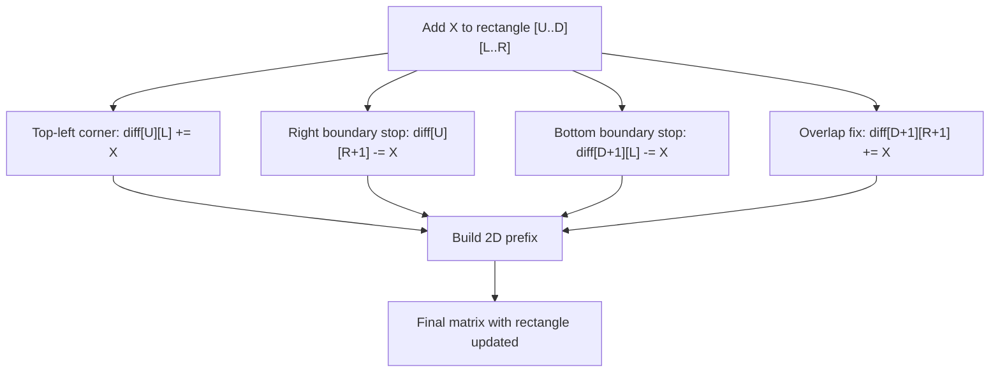

This is exactly the four-corner update shown on the last page of the PDF. fileciteturn0file0

### Why it works

This is the 2D version of “start effect here, stop effect after boundary”.

- `+X` starts at the top-left corner of the rectangle.
- The negative values cancel the effect after the right boundary and after the bottom boundary.
- The last `+X` fixes the overlap that got subtracted twice.

---

## 17. Reconstructing the Final Matrix

After processing all rectangle updates, take the **2D prefix sum** of `diff`.

That means:

```cpp
final[i][j] = diff[i][j]
            + final[i - 1][j]
            + final[i][j - 1]
            - final[i - 1][j - 1];
```

In practice, people usually reuse the same array and build prefix sum in place.


---

## 18. 2D Difference Array Code (C++)

Use a slightly bigger matrix `(n + 1) x (m + 1)` or `(n + 2) x (m + 2)` so that `R + 1` and `D + 1` are safe.

```cpp
#include <bits/stdc++.h>
using namespace std;

int main() {
    int n = 4, m = 5;

    // extra padding so D+1 and R+1 are safe
    vector<vector<long long>> diff(n + 1, vector<long long>(m + 1, 0));

    auto addRectangle = [&](int U, int D, int L, int R, long long X) {
        diff[U][L] += X;
        if (R + 1 < m) diff[U][R + 1] -= X;
        if (D + 1 < n) diff[D + 1][L] -= X;
        if (D + 1 < n && R + 1 < m) diff[D + 1][R + 1] += X;
    };

    addRectangle(1, 3, 1, 3, 5);
    addRectangle(0, 2, 0, 1, 2);

    // Build 2D prefix sum in-place for the actual n x m area
    for (int i = 0; i < n; i++) {
        for (int j = 0; j < m; j++) {
            long long up = (i > 0 ? diff[i - 1][j] : 0);
            long long left = (j > 0 ? diff[i][j - 1] : 0);
            long long diag = (i > 0 && j > 0 ? diff[i - 1][j - 1] : 0);
            diff[i][j] += up + left - diag;
        }
    }

    for (int i = 0; i < n; i++) {
        for (int j = 0; j < m; j++) {
            cout << diff[i][j] << ' ';
        }
        cout << '\n';
    }

    return 0;
}
```

---

## 19. Complexity of 2D Difference Array

If there are `q` rectangle-add queries:

- Each rectangle update: **O(1)**
- Final 2D prefix reconstruction: **O(n * m)**
- Total: **O(q + n * m)**

This is the same final time complexity summary written in the PDF. fileciteturn0file0

---

# 20. When to Use What in CP

## Use 1D prefix sum when

- Array is fixed
- You need many subarray sum queries
- Example: “sum of elements from `l` to `r`” many times

## Use 1D difference array when

- Array starts empty or updates are batched
- You need many range additions
- You only need the final array, or you can rebuild once after all updates

## Use 2D prefix sum when

- Matrix values are fixed
- You need many rectangle sum queries

## Use 2D difference array when

- Matrix starts empty or updates are batched
- You need many rectangle additions
- You want final matrix after all updates

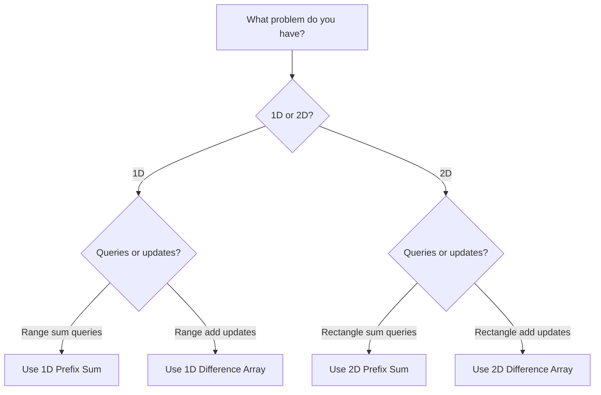

---

# 21. Important CP Tips

## Tip 1: Prefer `long long`

Even if array values fit in `int`, sums may overflow.

```cpp
vector<long long> pref;
vector<vector<long long>> pref2d;
```

## Tip 2: 1-indexing removes boundary bugs

For prefix sums, 1-indexing often makes formulas much cleaner.

## Tip 3: Difference array is not for online queries

If updates and sum queries are mixed in arbitrary order, plain difference array is usually not enough.

Then you may need:

- Fenwick Tree (BIT)
- Segment Tree
- 2D BIT / 2D Segment Tree

## Tip 4: Understand the pattern

Prefix sum answers:

> “What is the total up to here?”

Difference array marks:

> “Where does an update start and where does it stop?”

That mental model helps a lot.

---

# 22. Quick Revision Sheet

## 1D Prefix Sum

```cpp
pref[i] = pref[i - 1] + a[i]
```

Range sum:

```cpp
sum(l, r) = pref[r] - pref[l - 1]
```

1-indexed version:

```cpp
pref[i] = pref[i - 1] + a[i - 1]
sum(l, r) = pref[r + 1] - pref[l]
```

---

## 1D Difference Array

Range add `X` on `[L, R]`:

```cpp
diff[L] += X;
if (R + 1 < n) diff[R + 1] -= X;
```

After all queries:

```cpp
for (int i = 1; i < n; i++) diff[i] += diff[i - 1];
```

---

## 2D Prefix Sum

```cpp
pref[i][j] = a[i][j]
           + pref[i - 1][j]
           + pref[i][j - 1]
           - pref[i - 1][j - 1];
```

Rectangle sum:

```cpp
pref[D][R] - pref[U - 1][R] - pref[D][L - 1] + pref[U - 1][L - 1]
```

(or use 1-indexed padded version to avoid checks)

---

## 2D Difference Array

Rectangle add `X` on `[U...D][L...R]`:

```cpp
diff[U][L] += X;
diff[U][R + 1] -= X;
diff[D + 1][L] -= X;
diff[D + 1][R + 1] += X;
```

Then take 2D prefix sum.

---

# 23. Final Takeaway

The whole PDF is centered around one powerful CP theme:

- **Prefix sum** compresses repeated **sum queries**
- **Difference array / partial sum** compresses repeated **range updates**

And both ideas naturally extend from **1D arrays** to **2D matrices**.

If you master these four patterns, many CP problems become much easier:

- subarray sum queries
- range increment operations
- rectangle sum queries
- rectangle add updates
- grid preprocessing problems

---

# 24. Minimal Contest Templates

## 1D Prefix Sum Template

```cpp
vector<long long> buildPrefix(const vector<long long>& a) {
    int n = (int)a.size();
    vector<long long> pref(n + 1, 0);
    for (int i = 1; i <= n; i++) {
        pref[i] = pref[i - 1] + a[i - 1];
    }
    return pref;
}

long long rangeSum(const vector<long long>& pref, int l, int r) {
    return pref[r + 1] - pref[l];
}
```

## 1D Difference Template

```cpp
vector<long long> applyRangeAdds(int n, const vector<tuple<int,int,long long>>& queries) {
    vector<long long> diff(n, 0);
    for (auto [l, r, x] : queries) {
        diff[l] += x;
        if (r + 1 < n) diff[r + 1] -= x;
    }
    for (int i = 1; i < n; i++) diff[i] += diff[i - 1];
    return diff;
}
```

## 2D Prefix Template

```cpp
vector<vector<long long>> build2DPrefix(const vector<vector<long long>>& a) {
    int n = (int)a.size();
    int m = (int)a[0].size();
    vector<vector<long long>> pref(n + 1, vector<long long>(m + 1, 0));

    for (int i = 1; i <= n; i++) {
        for (int j = 1; j <= m; j++) {
            pref[i][j] = a[i - 1][j - 1]
                       + pref[i - 1][j]
                       + pref[i][j - 1]
                       - pref[i - 1][j - 1];
        }
    }
    return pref;
}

long long query2D(const vector<vector<long long>>& pref, int U, int D, int L, int R) {
    return pref[D + 1][R + 1] - pref[U][R + 1] - pref[D + 1][L] + pref[U][L];
}
```

## 2D Difference Template

```cpp
vector<vector<long long>> applyRectangleAdds(
    int n, int m,
    const vector<tuple<int,int,int,int,long long>>& queries
) {
    vector<vector<long long>> diff(n + 1, vector<long long>(m + 1, 0));

    for (auto [U, D, L, R, X] : queries) {
        diff[U][L] += X;
        if (R + 1 < m) diff[U][R + 1] -= X;
        if (D + 1 < n) diff[D + 1][L] -= X;
        if (D + 1 < n && R + 1 < m) diff[D + 1][R + 1] += X;
    }

    for (int i = 0; i < n; i++) {
        for (int j = 0; j < m; j++) {
            long long up = (i ? diff[i - 1][j] : 0);
            long long left = (j ? diff[i][j - 1] : 0);
            long long diag = (i && j ? diff[i - 1][j - 1] : 0);
            diff[i][j] += up + left - diag;
        }
    }

    vector<vector<long long>> ans(n, vector<long long>(m));
    for (int i = 0; i < n; i++) {
        for (int j = 0; j < m; j++) {
            ans[i][j] = diff[i][j];
        }
    }
    return ans;
}
```

---

Prepared from the uploaded handwritten PDF on prefix sum / partial sum. fileciteturn0file0
