# Range Queries and Interval Coverage Practice Pack

This guide focuses on interval range queries in C++ STL:

- insert an interval
- delete an interval
- check whether point `x` is covered
- check whether query interval `[x, y]` is fully covered
- check whether some stored interval lies inside `[x, y]`
- understand `lower_bound` and `upper_bound`
- sweep line technique with examples

---

## Clickable Index

- [1. Mental Model](#1-mental-model)
- [2. lower_bound and upper_bound](#2-lower_bound-and-upper_bound)
- [2A. set pair lower_bound and upper_bound](#2a-set-pair-lower_bound-and-upper_bound)
- [3. Problem 1 Static Intervals Check Point Coverage](#3-problem-1-static-intervals-check-point-coverage)
- [4. Problem 2 Dynamic Insert Delete Check Point Coverage](#4-problem-2-dynamic-insert-delete-check-point-coverage)
- [5. Problem 3 Maintain Merged Intervals](#5-problem-3-maintain-merged-intervals)
- [5A. Overlap Scenarios With set pair](#5a-overlap-scenarios-with-set-pair)
- [6. Problem 4 Check Whether Interval x y Is Fully Covered](#6-problem-4-check-whether-interval-x-y-is-fully-covered)
- [7. Problem 5 Check Whether Any Stored Interval Is Inside x y](#7-problem-5-check-whether-any-stored-interval-is-inside-x-y)
- [8. Sweep Line Technique](#8-sweep-line-technique)
- [9. Practice Problems](#9-practice-problems)
- [10. Final Mental Map](#10-final-mental-map)
- [11. Extra Problems By Technique](#11-extra-problems-by-technique)

---

## 1. Mental Model

An interval `[l, r]` covers a point `x` when:

```text
l <= x <= r
```

An interval `[l, r]` fully covers query interval `[x, y]` when:

```text
l <= x and y <= r
```

A stored interval `[l, r]` is inside query interval `[x, y]` when:

```text
x <= l and r <= y
```

### Mermaid Flow

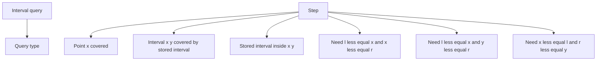

---

## 2. lower_bound and upper_bound

For sorted values:

```text
values = [1, 3, 3, 5, 8]
x = 3
```

```cpp
lower_bound(values.begin(), values.end(), x);
```

Means:

```text
first position where value >= x
```

So:

```text
lower_bound(3) -> index 1
```

```cpp
upper_bound(values.begin(), values.end(), x);
```

Means:

```text
first position where value > x
```

So:

```text
upper_bound(3) -> index 3
```

### Mermaid Flow

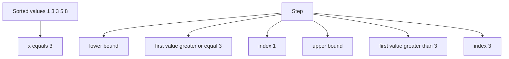

### Dry Run Table

| Function | Meaning | Result |
|---|---|---|
| `lower_bound(3)` | first `>= 3` | points to first `3` |
| `upper_bound(3)` | first `> 3` | points to `5` |
| `lower_bound(4)` | first `>= 4` | points to `5` |
| `upper_bound(8)` | first `> 8` | points to end |

### CP Memory Trick

```text
lower_bound(x) = first >= x
upper_bound(x) = first > x

count of values < x  = lower_bound(x) index
count of values <= x = upper_bound(x) index
count of values > x  = n - upper_bound(x) index
count of values >= x = n - lower_bound(x) index
```

---


## 2A. set pair lower_bound and upper_bound

`set<pair<int,int>>` is sorted lexicographically.

That means:

```text
First compare first value.
If first value is same, compare second value.
```

Example:

```cpp
set<pair<int,int>> s = {
    {1, 5},
    {3, 7},
    {10, 12}
};
```

Sorted order:

```text
(1,5), (3,7), (10,12)
```

### Pair comparison rule

```text
(a,b) < (c,d)

true if:
    a < c

or if:
    a == c and b < d
```

### Mermaid Flow

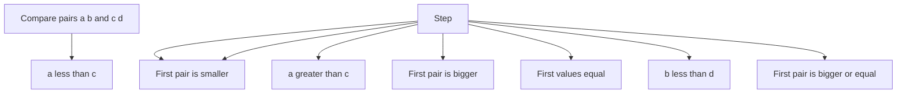

### lower_bound with pair

```cpp
auto it = s.lower_bound({x, INT_MIN});
```

Meaning:

```text
Find first interval whose pair is >= (x, minus infinity)
```

Because second value is very small, this gives:

```text
first interval with start >= x
```

Example:

```text
s = (1,5), (3,7), (10,12)
x = 4

lower_bound({4, INT_MIN}) -> (10,12)
```

Because `(3,7)` is smaller than `(4, -inf)` due to `3 < 4`.

### upper_bound with pair

```cpp
auto it = s.upper_bound({x, INT_MAX});
```

Meaning:

```text
Find first interval whose pair is > (x, plus infinity)
```

Because second value is very large, this gives:

```text
first interval with start > x
```

Example:

```text
s = (1,5), (3,7), (10,12)
x = 4

upper_bound({4, INT_MAX}) -> (10,12)
```

For checking point coverage:

```cpp
auto it = s.upper_bound({x, INT_MAX});
if (it == s.begin()) return false;
--it;
return it->second >= x;
```

This finds the interval with the largest start `<= x`.

### Mermaid Dry Run

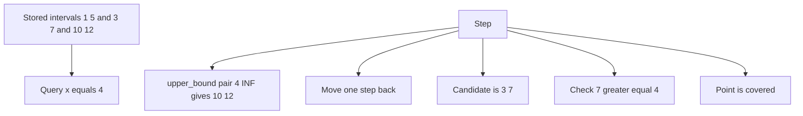

### Table Dry Run

| Query | STL call | Returned iterator | After moving back | Meaning |
|---|---|---|---|---|
| `x = 4` | `upper_bound({4, INF})` | `(10,12)` | `(3,7)` | largest start `<= 4` |
| `x = 1` | `upper_bound({1, INF})` | `(3,7)` | `(1,5)` | largest start `<= 1` |
| `x = 0` | `upper_bound({0, INF})` | `(1,5)` | cannot move back | no interval starts before `0` |

---

## 3. Problem 1 Static Intervals Check Point Coverage

### Problem

Given fixed intervals and many point queries, check whether point `x` is covered by at least one interval.

Example:

```text
intervals = [1, 5], [3, 7], [10, 12]
query x = 4
answer = covered
```

### Idea

Keep all starts and ends separately.

```text
starts = [1, 3, 10]
ends   = [5, 7, 12]
```

For point `x`:

```text
started = count of l <= x
endedBefore = count of r < x
active = started - endedBefore
```

If `active > 0`, point is covered.

### Mermaid Flow

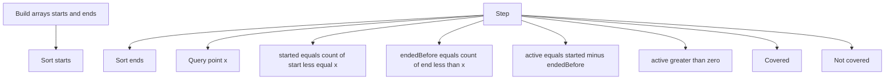

### C++ Code

```cpp
#include <bits/stdc++.h>
using namespace std;

struct StaticIntervalPointQuery {
    vector<int> starts, ends;

    StaticIntervalPointQuery(vector<pair<int,int>>& intervals) {
        for (auto [l, r] : intervals) {
            starts.push_back(l);
            ends.push_back(r);
        }
        sort(starts.begin(), starts.end());
        sort(ends.begin(), ends.end());
    }

    bool isCovered(int x) {
        int started = upper_bound(starts.begin(), starts.end(), x) - starts.begin();
        int endedBefore = lower_bound(ends.begin(), ends.end(), x) - ends.begin();

        int active = started - endedBefore;
        return active > 0;
    }
};

int main() {
    vector<pair<int,int>> intervals = {{1, 5}, {3, 7}, {10, 12}};

    StaticIntervalPointQuery ds(intervals);

    cout << ds.isCovered(4) << "\n"; // 1
    cout << ds.isCovered(8) << "\n"; // 0
}
```

### Dry Run

Input:

```text
intervals = [1,5], [3,7], [10,12]
x = 4
```

| Array | Values |
|---|---|
| starts | `1, 3, 10` |
| ends | `5, 7, 12` |

```text
started = count of start <= 4
started = 2

endedBefore = count of end < 4
endedBefore = 0

active = 2 - 0 = 2
answer = covered
```

### Mermaid Dry Run

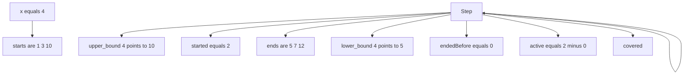

### Complexity

```text
Build: O(n log n)
Query: O(log n)
```

---

## 4. Problem 2 Dynamic Insert Delete Check Point Coverage

### Problem

Support:

```text
insert [l, r]
delete [l, r]
check point x
```

This version counts active intervals. It does not merge intervals.

### Idea

Maintain:

```cpp
multiset<int> starts;
multiset<int> ends;
multiset<pair<int,int>> intervals;
```

For point `x`:

```text
started = count l <= x
endedBefore = count r < x
active = started - endedBefore
```

Important: `distance` on `multiset` is `O(n)`, so this version is good for learning or small constraints. For large constraints, use Fenwick tree with coordinate compression.

### Mermaid Flow

```mermaid
flowchart TD
    N1["Operation"] --> N2["Type"]
    N3["Step"] --> N4["Insert interval"]
    N3["Step"] --> N5["Add l to starts"]
    N3["Step"] --> N6["Add r to ends"]
    N3["Step"] --> N7["Add pair l r to intervals"]
    N3["Step"] --> N8["Delete interval"]
    N3["Step"] --> N9["Find pair l r"]
    N3["Step"] --> N10["Exists"]
    N3["Step"] --> N11["Erase one l one r and pair"]
    N3["Step"] --> N12["Ignore"]
    N3["Step"] --> N13["Check point x"]
    N3["Step"] --> N14["Count starts less equal x"]
    N3["Step"] --> N15["Count ends less than x"]
    N3["Step"] --> N16["active equals difference"]
    N3["Step"] --> N17["active positive"]
    N3["Step"] --> N18["Covered"]
    N3["Step"] --> N19["Not covered"]
```

### C++ Code

```cpp
#include <bits/stdc++.h>
using namespace std;

struct DynamicIntervalCounter {
    multiset<int> starts;
    multiset<int> ends;
    multiset<pair<int,int>> intervals;

    void insertInterval(int l, int r) {
        if (l > r) swap(l, r);

        starts.insert(l);
        ends.insert(r);
        intervals.insert({l, r});
    }

    void deleteInterval(int l, int r) {
        if (l > r) swap(l, r);

        auto it = intervals.find({l, r});
        if (it == intervals.end()) return;

        intervals.erase(it);

        auto itL = starts.find(l);
        if (itL != starts.end()) starts.erase(itL);

        auto itR = ends.find(r);
        if (itR != ends.end()) ends.erase(itR);
    }

    bool isPointCovered(int x) {
        int started = distance(starts.begin(), starts.upper_bound(x));
        int endedBefore = distance(ends.begin(), ends.lower_bound(x));

        return started - endedBefore > 0;
    }
};

int main() {
    DynamicIntervalCounter ds;

    ds.insertInterval(1, 5);
    ds.insertInterval(3, 7);
    ds.insertInterval(10, 12);

    cout << ds.isPointCovered(4) << "\n"; // 1

    ds.deleteInterval(1, 5);

    cout << ds.isPointCovered(2) << "\n"; // 0
    cout << ds.isPointCovered(4) << "\n"; // 1
}
```

### Dry Run

Operations:

```text
insert [1,5]
insert [3,7]
insert [10,12]
check x = 4
delete [1,5]
check x = 2
```

| Step | starts | ends | Result |
|---|---|---|---|
| insert `[1,5]` | `1` | `5` | - |
| insert `[3,7]` | `1,3` | `5,7` | - |
| insert `[10,12]` | `1,3,10` | `5,7,12` | - |
| check `4` | `1,3,10` | `5,7,12` | covered |
| delete `[1,5]` | `3,10` | `7,12` | - |
| check `2` | `3,10` | `7,12` | not covered |

### Mermaid Dry Run

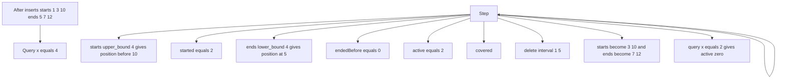

---

## 5. Problem 3 Maintain Merged Intervals

### Problem

Support:

```text
insert [l, r]
delete [l, r]
check point x
```

But keep intervals merged and non-overlapping.

Example:

```text
insert [1, 5]
insert [3, 8]
stored becomes [1, 8]
```


### set<pair<int,int>> Range Update Version

This version uses:

```cpp
set<pair<int,int>> ranges;
```

Each pair means:

```text
{start, end}
```

The set always stores disjoint merged intervals.

Example:

```text
[1,5], [10,15]
```

Stored as:

```text
(1,5), (10,15)
```

### Main Operations

| Operation | Meaning |
|---|---|
| `addRange(l,r)` | insert and merge overlapping intervals |
| `removeRange(l,r)` | delete range from existing intervals |
| `queryPoint(x)` | check if point is covered |
| `queryRange(l,r)` | check if full interval is covered |

### Mermaid Flow for addRange

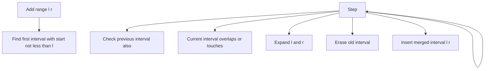

### Mermaid Flow for removeRange

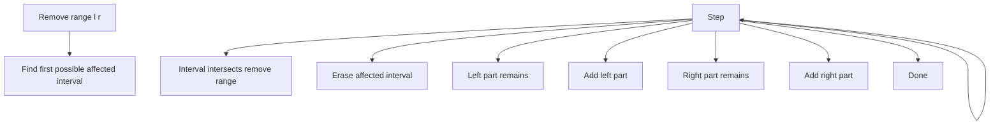

### C++ Code

```cpp
#include <bits/stdc++.h>
using namespace std;

struct RangeModuleSet {
    set<pair<int,int>> ranges;

    void addRange(int l, int r) {
        if (l > r) swap(l, r);

        auto it = ranges.lower_bound({l, INT_MIN});

        if (it != ranges.begin()) {
            auto prevIt = prev(it);

            if (prevIt->second + 1 >= l) {
                it = prevIt;
            }
        }

        while (it != ranges.end() && it->first <= r + 1) {
            l = min(l, it->first);
            r = max(r, it->second);
            it = ranges.erase(it);
        }

        ranges.insert({l, r});
    }

    void removeRange(int l, int r) {
        if (l > r) swap(l, r);

        auto it = ranges.lower_bound({l, INT_MIN});

        if (it != ranges.begin()) {
            --it;
        }

        vector<pair<int,int>> addBack;

        while (it != ranges.end()) {
            int a = it->first;
            int b = it->second;

            if (b < l) {
                ++it;
                continue;
            }

            if (a > r) break;

            it = ranges.erase(it);

            if (a < l) {
                addBack.push_back({a, l - 1});
            }

            if (r < b) {
                addBack.push_back({r + 1, b});
            }
        }

        for (auto p : addBack) {
            ranges.insert(p);
        }
    }

    bool queryPoint(int x) {
        auto it = ranges.upper_bound({x, INT_MAX});

        if (it == ranges.begin()) return false;

        --it;

        return it->second >= x;
    }

    bool queryRange(int l, int r) {
        if (l > r) swap(l, r);

        auto it = ranges.upper_bound({l, INT_MAX});

        if (it == ranges.begin()) return false;

        --it;

        return it->second >= r;
    }

    void print() {
        for (auto [l, r] : ranges) {
            cout << "[" << l << "," << r << "] ";
        }
        cout << "\n";
    }
};

int main() {
    RangeModuleSet rm;

    rm.addRange(1, 5);
    rm.addRange(10, 15);
    rm.addRange(4, 12);

    rm.print(); // [1,15]

    cout << rm.queryPoint(8) << "\n";    // 1
    cout << rm.queryPoint(20) << "\n";   // 0
    cout << rm.queryRange(3, 14) << "\n"; // 1

    rm.removeRange(5, 10);

    rm.print(); // [1,4] [11,15]

    cout << rm.queryRange(3, 14) << "\n"; // 0
}
```

### Dry Run addRange

Operations:

```text
add [1,5]
add [10,15]
add [4,12]
```

Before adding `[4,12]`:

```text
(1,5), (10,15)
```

Step by step:

| Step | Action | Result |
|---|---|---|
| 1 | `lower_bound({4, -INF})` | points to `(10,15)` |
| 2 | check previous | previous is `(1,5)` |
| 3 | `(1,5)` overlaps `[4,12]` | merge to `[1,12]` |
| 4 | `(10,15)` overlaps `[1,12]` | merge to `[1,15]` |
| 5 | insert final | `(1,15)` |

### Mermaid Dry Run addRange

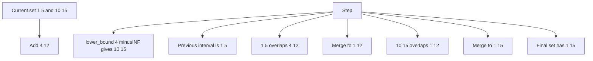

### Dry Run removeRange

Current:

```text
(1,15)
```

Remove:

```text
[5,10]
```

Step by step:

| Step | Action | Result |
|---|---|---|
| 1 | affected interval is `(1,15)` | erase it |
| 2 | left part remains | `(1,4)` |
| 3 | right part remains | `(11,15)` |
| 4 | insert parts back | `(1,4), (11,15)` |

### Mermaid Dry Run removeRange

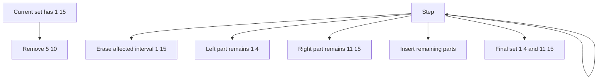

---

### Why Merged Intervals Help

If intervals are disjoint and merged, point query is easy:

```text
Find interval with largest start <= x
Check whether its end >= x
```

### Mermaid Flow

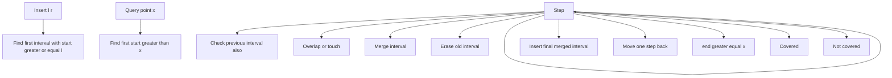

### C++ Code

```cpp
#include <bits/stdc++.h>
using namespace std;

struct MergedIntervals {
    map<int, int> mp; // start -> end

    void insertInterval(int l, int r) {
        if (l > r) swap(l, r);

        auto it = mp.lower_bound(l);

        if (it != mp.begin()) {
            auto prevIt = prev(it);
            if (prevIt->second + 1 >= l) {
                l = min(l, prevIt->first);
                r = max(r, prevIt->second);
                it = mp.erase(prevIt);
            }
        }

        while (it != mp.end() && it->first <= r + 1) {
            r = max(r, it->second);
            it = mp.erase(it);
        }

        mp[l] = r;
    }

    void deleteInterval(int l, int r) {
        if (l > r) swap(l, r);

        auto it = mp.upper_bound(l);
        if (it != mp.begin()) --it;

        vector<pair<int,int>> addBack;

        while (it != mp.end()) {
            int a = it->first;
            int b = it->second;

            if (b < l) {
                ++it;
                continue;
            }

            if (a > r) break;

            it = mp.erase(it);

            if (a < l) addBack.push_back({a, l - 1});
            if (r < b) addBack.push_back({r + 1, b});
        }

        for (auto [a, b] : addBack) {
            mp[a] = b;
        }
    }

    bool isPointCovered(int x) {
        auto it = mp.upper_bound(x);

        if (it == mp.begin()) return false;

        --it;

        return it->second >= x;
    }

    void print() {
        for (auto [l, r] : mp) {
            cout << "[" << l << "," << r << "] ";
        }
        cout << "\n";
    }
};

int main() {
    MergedIntervals ds;

    ds.insertInterval(1, 5);
    ds.insertInterval(10, 15);
    ds.insertInterval(4, 12);

    ds.print(); // [1,15]

    cout << ds.isPointCovered(8) << "\n";  // 1
    cout << ds.isPointCovered(20) << "\n"; // 0

    ds.deleteInterval(5, 10);
    ds.print(); // [1,4] [11,15]
}
```

### Dry Run Insert

Operations:

```text
insert [1,5]
insert [10,15]
insert [4,12]
```

Before third insert:

```text
[1,5], [10,15]
```

Insert `[4,12]`:

```text
[4,12] overlaps [1,5] -> merge [1,12]
[1,12] overlaps [10,15] -> merge [1,15]
```

Final:

```text
[1,15]
```

### Mermaid Dry Run Insert

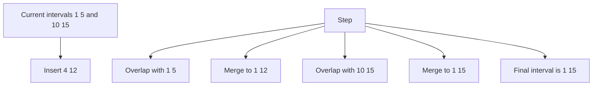

### Dry Run Delete

Current:

```text
[1,15]
```

Delete:

```text
[5,10]
```

Result:

```text
[1,4], [11,15]
```

### Mermaid Dry Run Delete

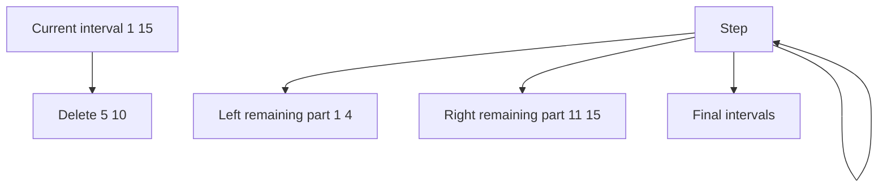

---


---

## 5A. Overlap Scenarios With set pair

This section explains all common overlap cases using only:

```cpp
set<pair<int,int>>
```

Each interval is:

```text
[start, end]
```

The set is sorted by start first, then end.

---

### 5A.1 Basic Overlap Formula

Two intervals:

```text
A = [l1, r1]
B = [l2, r2]
```

They overlap when:

```text
max(l1, l2) <= min(r1, r2)
```

They do not overlap when:

```text
r1 < l2
```

or:

```text
r2 < l1
```

### Mermaid Diagram

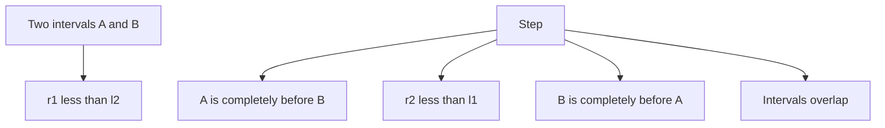

---

### 5A.2 Overlap Cases

Assume existing interval is:

```text
[10, 20]
```

New interval is `[l, r]`.

| Case | New interval | Result |
|---|---|---|
| completely before | `[1, 5]` | no overlap |
| touches left | `[5, 9]` | no overlap if strict, merge if touching allowed |
| overlaps left | `[5, 12]` | merge to `[5,20]` |
| inside existing | `[12, 15]` | merge remains `[10,20]` |
| covers existing | `[5, 25]` | merge to `[5,25]` |
| overlaps right | `[18, 25]` | merge to `[10,25]` |
| touches right | `[21, 25]` | no overlap if strict, merge if touching allowed |
| completely after | `[25, 30]` | no overlap |

### Mermaid Diagram

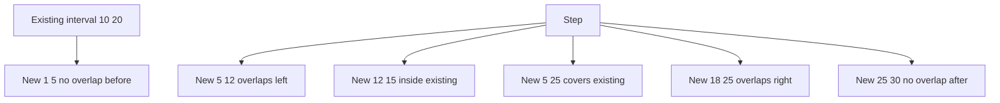

---

### 5A.3 Strict Overlap vs Touching Merge

Strict overlap:

```text
[1,5] and [6,10]
```

Do not overlap because:

```text
5 < 6
```

Touching merge version:

```text
[1,5] and [6,10]
```

Can be merged into:

```text
[1,10]
```

Because:

```text
5 + 1 >= 6
```

Use this when intervals are integer ranges and adjacent ranges should become one range.

### Code Rule

Strict overlap:

```cpp
if (oldEnd >= newStart)
```

Touching merge:

```cpp
if (oldEnd + 1 >= newStart)
```

### Mermaid Diagram

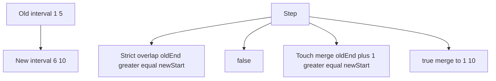

---

### 5A.4 How set pair Finds Overlap Candidate

Suppose current intervals are:

```text
[1,5], [10,15], [20,30]
```

New interval:

```text
[12,22]
```

Call:

```cpp
auto it = ranges.lower_bound({12, INT_MIN});
```

This points to:

```text
[20,30]
```

But previous interval may also overlap:

```text
[10,15]
```

So we must check `prev(it)`.

### Mermaid Diagram

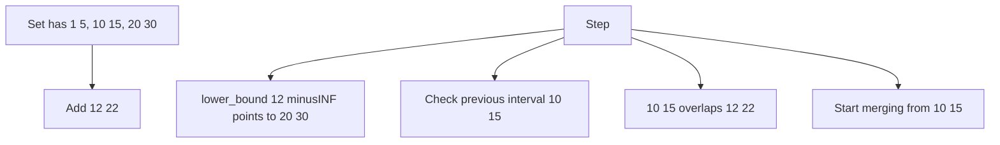

### Dry Run

```text
ranges = [1,5], [10,15], [20,30]
add [12,22]

lower_bound({12, -INF}) -> [20,30]
previous is [10,15]

[10,15] overlaps [12,22]
merge -> [10,22]

[20,30] overlaps [10,22]
merge -> [10,30]

final ranges = [1,5], [10,30]
```

---

### 5A.5 Sample Problem 1: Insert Interval And Merge Overlaps

#### Problem

Given existing non-overlapping sorted intervals in a `set<pair<int,int>>`, insert a new interval and merge all overlaps.

#### Example

```text
ranges = [1,5], [10,15], [20,30]
add [12,22]

answer = [1,5], [10,30]
```

#### Mermaid Flow

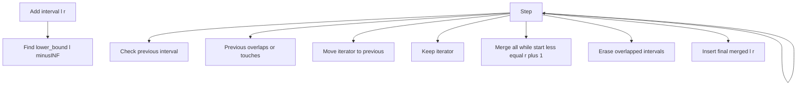

#### C++ Code

```cpp
#include <bits/stdc++.h>
using namespace std;

struct InsertMergeSet {
    set<pair<int,int>> ranges;

    void addRange(int l, int r) {
        if (l > r) swap(l, r);

        auto it = ranges.lower_bound({l, INT_MIN});

        if (it != ranges.begin()) {
            auto p = prev(it);

            // use p->second >= l for strict overlap
            // use p->second + 1 >= l to also merge touching intervals
            if (p->second + 1 >= l) {
                it = p;
            }
        }

        while (it != ranges.end() && it->first <= r + 1) {
            l = min(l, it->first);
            r = max(r, it->second);
            it = ranges.erase(it);
        }

        ranges.insert({l, r});
    }

    void print() {
        for (auto [l, r] : ranges) {
            cout << "[" << l << "," << r << "] ";
        }
        cout << "\n";
    }
};

int main() {
    InsertMergeSet ds;

    ds.ranges.insert({1, 5});
    ds.ranges.insert({10, 15});
    ds.ranges.insert({20, 30});

    ds.addRange(12, 22);

    ds.print(); // [1,5] [10,30]
}
```

#### Dry Run

| Step | Action | Result |
|---|---|---|
| 1 | `lower_bound({12, -INF})` | points to `[20,30]` |
| 2 | check previous | `[10,15]` |
| 3 | `[10,15]` overlaps `[12,22]` | merge to `[10,22]` |
| 4 | `[20,30]` overlaps `[10,22]` | merge to `[10,30]` |
| 5 | insert final | `[1,5], [10,30]` |

---

### 5A.6 Sample Problem 2: Remove Interval And Split Overlaps

#### Problem

Given disjoint intervals, remove `[l, r]`.

#### Example

```text
ranges = [1,10], [15,20]
remove [4,17]

answer = [1,3], [18,20]
```

#### Overlap Scenarios During Delete

Existing interval `[a,b]`, remove `[l,r]`.

| Case | Condition | Action |
|---|---|---|
| no overlap before | `b < l` | skip |
| no overlap after | `a > r` | stop |
| left part remains | `a < l` | add `[a, l-1]` |
| right part remains | `r < b` | add `[r+1, b]` |
| fully deleted | `l <= a and b <= r` | add nothing |

#### Mermaid Diagram

```mermaid
flowchart TD
    N1["Existing interval a b"] --> N2["Remove l r"]
    N3["Step"] --> N4["b less than l"]
    N3["Step"] --> N5["No overlap skip"]
    N3["Step"] --> N6["a greater than r"]
    N3["Step"] --> N7["No more affected intervals stop"]
    N3["Step"] --> N8["Overlap exists erase interval"]
    N3["Step"] --> N9["a less than l"]
    N3["Step"] --> N10["Keep left part a to l minus 1"]
    N3["Step"] --> N11["r less than b"]
    N3["Step"] --> N3["Step"]
    N3["Step"] --> N12["Keep right part r plus 1 to b"]
    N3["Step"] --> N13["Done"]
```

#### C++ Code

```cpp
#include <bits/stdc++.h>
using namespace std;

struct RemoveSplitSet {
    set<pair<int,int>> ranges;

    void removeRange(int l, int r) {
        if (l > r) swap(l, r);

        auto it = ranges.lower_bound({l, INT_MIN});

        if (it != ranges.begin()) {
            --it;
        }

        vector<pair<int,int>> addBack;

        while (it != ranges.end()) {
            int a = it->first;
            int b = it->second;

            if (b < l) {
                ++it;
                continue;
            }

            if (a > r) break;

            it = ranges.erase(it);

            if (a < l) {
                addBack.push_back({a, l - 1});
            }

            if (r < b) {
                addBack.push_back({r + 1, b});
            }
        }

        for (auto p : addBack) {
            ranges.insert(p);
        }
    }

    void print() {
        for (auto [l, r] : ranges) {
            cout << "[" << l << "," << r << "] ";
        }
        cout << "\n";
    }
};

int main() {
    RemoveSplitSet ds;

    ds.ranges.insert({1, 10});
    ds.ranges.insert({15, 20});

    ds.removeRange(4, 17);

    ds.print(); // [1,3] [18,20]
}
```

#### Dry Run

```text
ranges = [1,10], [15,20]
remove [4,17]
```

| Affected interval | Action |
|---|---|
| `[1,10]` | remove middle/right part, keep `[1,3]` |
| `[15,20]` | remove left part, keep `[18,20]` |

Final:

```text
[1,3], [18,20]
```

---

### 5A.7 Sample Problem 3: Check Whether New Interval Overlaps Existing Interval

#### Problem

Given disjoint intervals in `set<pair<int,int>>`, check if a new interval `[l,r]` overlaps any existing interval.

#### Example

```text
ranges = [1,5], [10,15], [20,30]
query [6,9]  -> false
query [6,10] -> true
query [16,19] -> false
query [16,21] -> true
```

#### Idea

Only two candidates can overlap:

```text
1. first interval with start >= l
2. previous interval before it
```

#### Mermaid Flow

```mermaid
flowchart TD
    N1["Query l r"] --> N2["Find lower_bound l minusINF"]
    N3["Step"] --> N4["Check current candidate"]
    N3["Step"] --> N5["current start less equal r"]
    N3["Step"] --> N6["Overlap found"]
    N3["Step"] --> N7["Check previous candidate"]
    N3["Step"] --> N8["previous end greater equal l"]
    N3["Step"] --> N6["Overlap found"]
    N3["Step"] --> N9["No overlap"]
```

#### C++ Code

```cpp
#include <bits/stdc++.h>
using namespace std;

struct OverlapChecker {
    set<pair<int,int>> ranges;

    bool overlapsAny(int l, int r) {
        if (l > r) swap(l, r);

        auto it = ranges.lower_bound({l, INT_MIN});

        // Candidate 1: first interval with start >= l
        if (it != ranges.end() && it->first <= r) {
            return true;
        }

        // Candidate 2: previous interval with start < l
        if (it != ranges.begin()) {
            auto p = prev(it);
            if (p->second >= l) {
                return true;
            }
        }

        return false;
    }
};

int main() {
    OverlapChecker ds;

    ds.ranges.insert({1, 5});
    ds.ranges.insert({10, 15});
    ds.ranges.insert({20, 30});

    cout << ds.overlapsAny(6, 9) << "\n";   // 0
    cout << ds.overlapsAny(6, 10) << "\n";  // 1
    cout << ds.overlapsAny(16, 19) << "\n"; // 0
    cout << ds.overlapsAny(16, 21) << "\n"; // 1
}
```

#### Dry Run

Query:

```text
[16,21]
```

```text
lower_bound({16, -INF}) -> [20,30]

current start 20 <= query end 21
overlap found
```

Query:

```text
[6,9]
```

```text
lower_bound({6, -INF}) -> [10,15]

current start 10 <= query end 9 false

previous interval [1,5]
previous end 5 >= query start 6 false

no overlap
```

---

### 5A.8 Sample Problem 4: Insert Only If No Overlap

#### Problem

Maintain a set of non-overlapping intervals. Insert `[l,r]` only if it does not overlap any existing interval.

This is useful for calendar booking style problems.

#### Example

```text
book [10,20] -> true
book [15,25] -> false
book [20,30] -> true if half-open intervals
```

For closed intervals, `[10,20]` and `[20,30]` overlap at `20`.

This code uses half-open logic:

```text
[start, end)
```

So `[10,20)` and `[20,30)` do not overlap.

#### Mermaid Flow

```mermaid
flowchart TD
    N1["Book interval l r"] --> N2["Find first interval with start greater equal l"]
    N3["Step"] --> N4["current start less than r"]
    N3["Step"] --> N5["Overlap reject"]
    N3["Step"] --> N6["Check previous"]
    N3["Step"] --> N7["previous end greater than l"]
    N3["Step"] --> N5["Overlap reject"]
    N3["Step"] --> N8["Insert interval accept"]
```

#### C++ Code

```cpp
#include <bits/stdc++.h>
using namespace std;

class MyCalendarSimple {
private:
    set<pair<int,int>> booked;

public:
    bool book(int start, int end) {
        auto it = booked.lower_bound({start, INT_MIN});

        // Next interval starts before this one ends.
        if (it != booked.end() && it->first < end) {
            return false;
        }

        // Previous interval ends after this one starts.
        if (it != booked.begin()) {
            auto p = prev(it);
            if (p->second > start) {
                return false;
            }
        }

        booked.insert({start, end});
        return true;
    }
};

int main() {
    MyCalendarSimple cal;

    cout << cal.book(10, 20) << "\n"; // 1
    cout << cal.book(15, 25) << "\n"; // 0
    cout << cal.book(20, 30) << "\n"; // 1
}
```

#### Dry Run

```text
book [10,20)
set empty -> insert

book [15,25)
lower_bound gives end
previous is [10,20)
20 > 15 -> overlap reject

book [20,30)
lower_bound gives end
previous is [10,20)
20 > 20 false
insert
```

---


## 6. Problem 4 Check Whether Interval x y Is Fully Covered

### Problem

Given query `[x, y]`, check whether some stored merged interval fully covers it.

Need:

```text
l <= x and y <= r
```

### Idea

Because intervals are merged and sorted by start:

```text
Find largest l <= x
Then check whether r >= y
```

### Mermaid Flow

```mermaid
flowchart TD
    N1["Query interval x y"] --> N2["Find first start greater than x"]
    N3["Step"] --> N4["At beginning"]
    N3["Step"] --> N5["No interval starts before x"]
    N3["Step"] --> N6["Move one step back"]
    N3["Step"] --> N7["Candidate has largest start less equal x"]
    N3["Step"] --> N8["candidate end greater equal y"]
    N3["Step"] --> N9["Fully covered"]
    N3["Step"] --> N10["Not fully covered"]
```

### C++ Code

Add this method inside `MergedIntervals`:

```cpp
bool isIntervalCovered(int x, int y) {
    if (x > y) swap(x, y);

    auto it = mp.upper_bound(x);

    if (it == mp.begin()) return false;

    --it;

    return it->second >= y;
}
```

Full test:

```cpp
int main() {
    MergedIntervals ds;

    ds.insertInterval(1, 10);
    ds.insertInterval(20, 30);

    cout << ds.isIntervalCovered(3, 7) << "\n";   // 1
    cout << ds.isIntervalCovered(5, 15) << "\n";  // 0
    cout << ds.isIntervalCovered(22, 25) << "\n"; // 1
}
```

### Dry Run

Stored intervals:

```text
[1,10], [20,30]
```

Query:

```text
[3,7]
```

Steps:

```text
upper_bound(3) finds first start > 3
That is 20

Move one step back
Candidate is [1,10]

Check 10 >= 7
Answer yes
```

### Mermaid Dry Run

```mermaid
flowchart TD
    N1["Stored 1 10 and 20 30"] --> N2["Query 3 7"]
    N3["Step"] --> N4["upper_bound 3 gives start 20"]
    N3["Step"] --> N5["Move back to interval 1 10"]
    N3["Step"] --> N6["Check end 10 greater equal 7"]
    N3["Step"] --> N7["fully covered"]
```

---

## 7. Problem 5 Check Whether Any Stored Interval Is Inside x y

### Problem

Given query `[x, y]`, check whether there exists a stored interval `[l, r]` such that:

```text
x <= l and r <= y
```

### Simple STL Technique

Use:

```cpp
set<pair<int,int>> intervals;
```

The set is sorted by:

```text
start first
end second
```

So to find an interval inside `[x, y]`:

```cpp
auto it = intervals.lower_bound({x, INT_MIN});
```

This gives the first interval whose start is at least `x`.

Then check:

```cpp
it->second <= y
```

### Important Limitation

This simple `set<pair<int,int>>` method checks the first interval with `start >= x`.

It works well for learning and many simple problems, but if the first candidate has a large end, a later interval may still fit.

Example:

```text
stored = [4,100], [5,6]
query = [3,7]
```

`lower_bound({3, -INF})` gives `[4,100]`, which fails, but `[5,6]` is actually inside.

For this guide, we intentionally keep it simple and use only STL `set<pair<int,int>>`.

### Mermaid Flow

```mermaid
flowchart TD
    N1["Query x y"] --> N2["Find first interval with start at least x"]
    N3["Step"] --> N4["Candidate exists"]
    N3["Step"] --> N5["No interval inside"]
    N3["Step"] --> N6["Check candidate end less equal y"]
    N3["Step"] --> N7["Inside interval exists"]
    N3["Step"] --> N8["No by simple check"]
```

### C++ Code

```cpp
#include <bits/stdc++.h>
using namespace std;

struct IntervalInsideSimpleSet {
    set<pair<int,int>> intervals;

    void insertInterval(int l, int r) {
        if (l > r) swap(l, r);
        intervals.insert({l, r});
    }

    void deleteInterval(int l, int r) {
        if (l > r) swap(l, r);
        intervals.erase({l, r});
    }

    bool hasIntervalInside(int x, int y) {
        if (x > y) swap(x, y);

        auto it = intervals.lower_bound({x, INT_MIN});

        if (it == intervals.end()) return false;

        return it->second <= y;
    }
};

int main() {
    IntervalInsideSimpleSet ds;

    ds.insertInterval(1, 10);
    ds.insertInterval(4, 6);
    ds.insertInterval(8, 20);

    cout << ds.hasIntervalInside(3, 7) << "\n"; // 1 because [4,6]
    cout << ds.hasIntervalInside(5, 7) << "\n"; // 0
}
```

### Dry Run

Stored:

```text
[1,10], [4,6], [8,20]
```

Query:

```text
[3,7]
```

Steps:

```text
lower_bound({3, INT_MIN}) gives [4,6]
Check 6 <= 7
Answer yes
```

### Mermaid Dry Run

```mermaid
flowchart TD
    N1["Stored intervals 1 10 and 4 6 and 8 20"] --> N2["Query 3 7"]
    N3["Step"] --> N4["lower_bound pair 3 minusINF gives 4 6"]
    N3["Step"] --> N5["Check end 6 less equal 7"]
    N3["Step"] --> N6["Inside interval exists"]
```

---

## 8. Sweep Line Technique

### What Is Sweep Line?

Sweep line converts intervals into events.

For interval `[l, r]`:

```text
at l: active increases by 1
after r: active decreases by 1
```

For integer closed intervals, use:

```text
events[l] += 1
events[r + 1] -= 1
```

Then scan from left to right.

### Mermaid Flow

```mermaid
flowchart TD
    N1["Intervals"] --> N2["Convert to start and end events"]
    N3["Step"] --> N4["Sort events by coordinate"]
    N3["Step"] --> N5["Scan left to right"]
    N3["Step"] --> N6["Update active count"]
    N3["Step"] --> N7["Answer based on active"]
```

---

### Sweep Line Example 1: Maximum Overlapping Intervals

Problem:

```text
Given intervals, find maximum number of intervals active at the same point.
```

Input:

```text
[1,5], [2,6], [4,8]
```

Events:

```text
1 -> +1
6 -> -1
2 -> +1
7 -> -1
4 -> +1
9 -> -1
```

Scan:

| Coordinate | Change | Active | Max |
|---:|---:|---:|---:|
| 1 | +1 | 1 | 1 |
| 2 | +1 | 2 | 2 |
| 4 | +1 | 3 | 3 |
| 6 | -1 | 2 | 3 |
| 7 | -1 | 1 | 3 |
| 9 | -1 | 0 | 3 |

Answer:

```text
3
```

### Mermaid Dry Run

```mermaid
flowchart TD
    N1["Interval 1 5 gives plus at 1 minus at 6"] --> N2["Interval 2 6 gives plus at 2 minus at 7"]
    N3["Step"] --> N4["Interval 4 8 gives plus at 4 minus at 9"]
    N3["Step"] --> N5["Scan sorted events"]
    N3["Step"] --> N6["active becomes 1 then 2 then 3"]
    N3["Step"] --> N7["maximum overlap is 3"]
```

### C++ Code

```cpp
#include <bits/stdc++.h>
using namespace std;

int maxOverlap(vector<pair<int,int>>& intervals) {
    map<int, int> events;

    for (auto [l, r] : intervals) {
        events[l] += 1;
        events[r + 1] -= 1; // closed interval
    }

    int active = 0;
    int best = 0;

    for (auto [coord, delta] : events) {
        active += delta;
        best = max(best, active);
    }

    return best;
}

int main() {
    vector<pair<int,int>> intervals = {{1, 5}, {2, 6}, {4, 8}};
    cout << maxOverlap(intervals) << "\n"; // 3
}
```

---

### Sweep Line Example 2: Count Covered Integer Points

Problem:

```text
Given intervals, count how many integer points are covered by at least one interval.
```

Input:

```text
[1,3], [2,5], [8,10]
```

Covered integer points:

```text
1,2,3,4,5,8,9,10
```

Answer:

```text
8
```

### Idea

Use events:

```text
l -> +1
r + 1 -> -1
```

Between two consecutive event coordinates, active count is constant.

### Mermaid Flow

```mermaid
flowchart TD
    N1["Create events"] --> N2["Sort event coordinates"]
    N3["Step"] --> N4["Scan coordinate segments"]
    N3["Step"] --> N5["active greater than zero"]
    N3["Step"] --> N6["Add segment length"]
    N3["Step"] --> N7["Add nothing"]
    N3["Step"] --> N8["Apply current event delta"]
    N3["Step"] --> N3["Step"]
```

### C++ Code

```cpp
#include <bits/stdc++.h>
using namespace std;

long long countCoveredIntegerPoints(vector<pair<int,int>>& intervals) {
    map<int, int> events;

    for (auto [l, r] : intervals) {
        events[l] += 1;
        events[r + 1] -= 1;
    }

    long long answer = 0;
    int active = 0;
    int prev = 0;
    bool first = true;

    for (auto [coord, delta] : events) {
        if (!first && active > 0) {
            answer += coord - prev;
        }

        active += delta;
        prev = coord;
        first = false;
    }

    return answer;
}

int main() {
    vector<pair<int,int>> intervals = {{1, 3}, {2, 5}, {8, 10}};
    cout << countCoveredIntegerPoints(intervals) << "\n"; // 8
}
```

### Dry Run

Events:

```text
1:+1
2:+1
4:-1
6:-1
8:+1
11:-1
```

Scan:

| Segment | Active before segment | Covered length |
|---|---:|---:|
| `[1,2)` | 1 | 1 |
| `[2,4)` | 2 | 2 |
| `[4,6)` | 1 | 2 |
| `[6,8)` | 0 | 0 |
| `[8,11)` | 1 | 3 |

Total:

```text
1 + 2 + 2 + 3 = 8
```

---

### Sweep Line Example 3: Offline Point Queries

Problem:

```text
Given static intervals and query points, count how many intervals cover each point.
```

Input:

```text
intervals = [1,5], [3,7], [10,12]
queries = 4, 8, 11
```

Answers:

```text
4  -> 2
8  -> 0
11 -> 1
```

### Idea

Make events:

```text
interval start  -> add active
query point     -> answer current active
interval end+1  -> remove active
```

For closed integer intervals `[l, r]`, process `end + 1`.

### Mermaid Flow

```mermaid
flowchart TD
    N1["Create interval events"] --> N2["Create query events"]
    N3["Step"] --> N4["Sort all events by coordinate"]
    N3["Step"] --> N5["Scan from left to right"]
    N3["Step"] --> N6["Event type"]
    N3["Step"] --> N7["Add active"]
    N3["Step"] --> N8["Store answer"]
    N3["Step"] --> N9["Remove active"]
```

### C++ Code

```cpp
#include <bits/stdc++.h>
using namespace std;

vector<int> offlinePointCoverage(
    vector<pair<int,int>>& intervals,
    vector<int>& queries
) {
    vector<tuple<int,int,int>> events;

    // type order:
    // 0 = add
    // 1 = query
    // 2 = remove
    for (auto [l, r] : intervals) {
        events.push_back({l, 0, -1});
        events.push_back({r + 1, 2, -1});
    }

    for (int i = 0; i < (int)queries.size(); i++) {
        events.push_back({queries[i], 1, i});
    }

    sort(events.begin(), events.end());

    int active = 0;
    vector<int> answer(queries.size());

    for (auto [coord, type, id] : events) {
        if (type == 0) {
            active++;
        } else if (type == 1) {
            answer[id] = active;
        } else {
            active--;
        }
    }

    return answer;
}

int main() {
    vector<pair<int,int>> intervals = {{1, 5}, {3, 7}, {10, 12}};
    vector<int> queries = {4, 8, 11};

    auto ans = offlinePointCoverage(intervals, queries);

    for (int x : ans) cout << x << " ";
    cout << "\n"; // 2 0 1
}
```

### Dry Run

Events:

```text
1 add
3 add
4 query id0
6 remove
8 query id1
8 remove
10 add
11 query id2
13 remove
```

| Event | Active after/before | Answer |
|---|---:|---|
| `1 add` | 1 | - |
| `3 add` | 2 | - |
| `4 query` | 2 | query 4 = 2 |
| `6 remove` | 1 | - |
| `8 query` | 1 before same coordinate issue | wrong if remove also at 8 |

Important note:

For closed intervals using `r + 1` removal, query at `8` should see removals at `8` before query only if interval ended at `7`.

So event order at same coordinate should be:

```text
add before query before remove works only for same coordinate without r+1 confusion.
For r+1 removal, remove must happen before query at that coordinate.
```

Safer event type order:

```text
remove first, add second, query third
```

But add at coordinate `x` must affect query `x`.

Best simple method: use map delta and queries separately.

### Safer Offline Point Coverage Code

```cpp
#include <bits/stdc++.h>
using namespace std;

vector<int> offlinePointCoverageSafe(
    vector<pair<int,int>>& intervals,
    vector<int>& queries
) {
    map<int, int> delta;

    for (auto [l, r] : intervals) {
        delta[l] += 1;
        delta[r + 1] -= 1;
    }

    vector<pair<int,int>> qs;
    for (int i = 0; i < (int)queries.size(); i++) {
        qs.push_back({queries[i], i});
    }

    sort(qs.begin(), qs.end());

    vector<int> ans(queries.size());

    int active = 0;
    auto it = delta.begin();

    for (auto [x, id] : qs) {
        while (it != delta.end() && it->first <= x) {
            active += it->second;
            ++it;
        }

        ans[id] = active;
    }

    return ans;
}
```

### Correct Dry Run

Delta map:

```text
1:+1
3:+1
6:-1
8:-1
10:+1
13:-1
```

Queries:

```text
4, 8, 11
```

| Query | Applied deltas <= query | Active | Answer |
|---:|---|---:|---:|
| 4 | `1:+1`, `3:+1` | 2 | 2 |
| 8 | `6:-1`, `8:-1` | 0 | 0 |
| 11 | `10:+1` | 1 | 1 |

---

## 9. Practice Problems

### Problem A: Basic Dynamic Point Coverage

Support:

```text
insert [l,r]
delete [l,r]
check x
```

Use:

```text
multiset starts
multiset ends
multiset intervals
```

Goal:

```text
Return true if active intervals at x is positive.
```

---

### Problem B: Merged Range Module

Support:

```text
addRange(l,r)
removeRange(l,r)
queryRange(l,r)
```

Use:

```text
set<pair<int,int>> merged intervals
```

Goal:

```text
queryRange returns true if full interval is covered.
```

Similar to LeetCode Range Module.

---

### Problem C: Interval Inside Query

Support:

```text
insert [l,r]
delete [l,r]
hasInside [x,y]
```

Use:

```text
set<pair<int,int>>
```

Goal:

```text
Return true if first interval with start >= x also has end <= y.
```

Note:

```text
This is the simple STL version. It is enough for learning pair lower_bound.
```

---

### Problem D: Maximum Overlap

Given static intervals, find maximum overlap.

Use:

```text
sweep line events
```

---

### Problem E: Count Covered Integer Points

Given static intervals, count total integer points covered by at least one interval.

Use:

```text
sweep line with active segments
```

---

## 10. Final Mental Map

```mermaid
flowchart TD
    N1["Interval problem"] --> N2["Static or dynamic"]
    N3["Step"] --> N4["Static"]
    N3["Step"] --> N5["Dynamic"]
    N3["Step"] --> N6["Point query"]
    N3["Step"] --> N7["Sort starts and ends"]
    N3["Step"] --> N8["Sweep line offline"]
    N3["Step"] --> N9["Overlap count"]
    N3["Step"] --> N10["Sweep line"]
    N3["Step"] --> N11["Need merge"]
    N3["Step"] --> N12["map start to end"]
    N3["Step"] --> N13["multiset starts and ends"]
    N3["Step"] --> N14["Need interval inside query"]
    N3["Step"] --> N15["set pair lower_bound simple version"]
```

### One Minute Revision

```text
Point x covered:
    count l <= x minus count r < x

Interval x y fully covered:
    find largest l <= x, check r >= y

Stored interval inside x y:
    need l >= x and r <= y
    simple STL method uses set pair lower_bound

Static maximum overlap:
    sweep line with plus at l and minus at r + 1

lower_bound:
    first >= x

upper_bound:
    first > x
```

---

## 11. Extra Problems By Technique

This section keeps all previous content same and adds more practice problems with direct C++ code for each technique.

---

## 11.1 Technique: Static Point Coverage With Sorted Starts And Ends

### Problem: Count How Many Intervals Cover Each Query Point

Given static intervals and query points, return coverage count for each query.

Example:

```text
intervals = [1,5], [3,7], [10,12]
queries = 4, 8, 11

answer = 2, 0, 1
```

### Idea

For point `x`:

```text
started = count of l <= x
endedBefore = count of r < x
answer = started - endedBefore
```

### Mermaid Flow

```mermaid
flowchart TD
    N1["Build starts and ends"] --> N2["Sort both arrays"]
    N3["Step"] --> N4["For each query x"]
    N3["Step"] --> N5["started equals upper_bound starts x"]
    N3["Step"] --> N6["endedBefore equals lower_bound ends x"]
    N3["Step"] --> N7["answer equals started minus endedBefore"]
```

### C++ Code

```cpp
#include <bits/stdc++.h>
using namespace std;

vector<int> countCoverageStatic(vector<pair<int,int>>& intervals, vector<int>& queries) {
    vector<int> starts, ends;

    for (auto [l, r] : intervals) {
        starts.push_back(l);
        ends.push_back(r);
    }

    sort(starts.begin(), starts.end());
    sort(ends.begin(), ends.end());

    vector<int> ans;

    for (int x : queries) {
        int started = upper_bound(starts.begin(), starts.end(), x) - starts.begin();
        int endedBefore = lower_bound(ends.begin(), ends.end(), x) - ends.begin();

        ans.push_back(started - endedBefore);
    }

    return ans;
}

int main() {
    vector<pair<int,int>> intervals = {{1,5}, {3,7}, {10,12}};
    vector<int> queries = {4, 8, 11};

    vector<int> ans = countCoverageStatic(intervals, queries);

    for (int x : ans) cout << x << " ";
    cout << "\n"; // 2 0 1
}
```

### Dry Run

For `x = 4`:

```text
starts = 1, 3, 10
ends   = 5, 7, 12

upper_bound(starts, 4) gives index 2
lower_bound(ends, 4) gives index 0

coverage = 2 - 0 = 2
```

---

## 11.2 Technique: Dynamic Point Coverage With Multiset

### Problem: Online Add Delete And Count Coverage At Point

Support:

```text
add [l,r]
remove [l,r]
count x
```

### Mermaid Flow

```mermaid
flowchart TD
    N1["Operation"] --> N2["add remove count"]
    N3["Step"] --> N4["Add l to starts and r to ends"]
    N3["Step"] --> N5["Remove one l and one r"]
    N3["Step"] --> N6["Count active at x"]
    N3["Step"] --> N7["starts upper_bound x minus ends lower_bound x"]
```

### C++ Code

```cpp
#include <bits/stdc++.h>
using namespace std;

struct DynamicPointCoverage {
    multiset<int> starts;
    multiset<int> ends;
    multiset<pair<int,int>> intervals;

    void add(int l, int r) {
        if (l > r) swap(l, r);

        starts.insert(l);
        ends.insert(r);
        intervals.insert({l, r});
    }

    void remove(int l, int r) {
        if (l > r) swap(l, r);

        auto it = intervals.find({l, r});
        if (it == intervals.end()) return;

        intervals.erase(it);
        starts.erase(starts.find(l));
        ends.erase(ends.find(r));
    }

    int countAt(int x) {
        int started = distance(starts.begin(), starts.upper_bound(x));
        int endedBefore = distance(ends.begin(), ends.lower_bound(x));

        return started - endedBefore;
    }
};

int main() {
    DynamicPointCoverage ds;

    ds.add(1, 5);
    ds.add(3, 7);

    cout << ds.countAt(4) << "\n"; // 2

    ds.remove(1, 5);

    cout << ds.countAt(4) << "\n"; // 1
}
```

### Dry Run

```text
add [1,5]
add [3,7]

starts = 1,3
ends = 5,7

countAt(4):
started = 2
endedBefore = 0
answer = 2
```

---

## 11.3 Technique: Merged Intervals With set<pair<int,int>>

### Problem: Range Module

Implement:

```text
addRange(l,r)
removeRange(l,r)
queryRange(l,r)
```

This is the most important interval-set template.

### Mermaid Flow

```mermaid
flowchart TD
    N1["addRange"] --> N2["Find first possible overlap"]
    N3["Step"] --> N4["Merge all overlapping intervals"]
    N3["Step"] --> N5["Insert one final interval"]
    N6["removeRange"] --> N7["Find affected intervals"]
    N3["Step"] --> N8["Erase and split left right parts"]
    N9["queryRange"] --> N10["Find interval with largest start less equal l"]
    N3["Step"] --> N11["Check end greater equal r"]
```

### C++ Code

```cpp
#include <bits/stdc++.h>
using namespace std;

class RangeModule {
private:
    set<pair<int,int>> ranges;

public:
    void addRange(int l, int r) {
        if (l > r) swap(l, r);

        auto it = ranges.lower_bound({l, INT_MIN});

        if (it != ranges.begin()) {
            auto p = prev(it);
            if (p->second + 1 >= l) {
                it = p;
            }
        }

        while (it != ranges.end() && it->first <= r + 1) {
            l = min(l, it->first);
            r = max(r, it->second);
            it = ranges.erase(it);
        }

        ranges.insert({l, r});
    }

    void removeRange(int l, int r) {
        if (l > r) swap(l, r);

        auto it = ranges.lower_bound({l, INT_MIN});

        if (it != ranges.begin()) {
            --it;
        }

        vector<pair<int,int>> addBack;

        while (it != ranges.end()) {
            int a = it->first;
            int b = it->second;

            if (b < l) {
                ++it;
                continue;
            }

            if (a > r) break;

            it = ranges.erase(it);

            if (a < l) addBack.push_back({a, l - 1});
            if (r < b) addBack.push_back({r + 1, b});
        }

        for (auto p : addBack) ranges.insert(p);
    }

    bool queryRange(int l, int r) {
        if (l > r) swap(l, r);

        auto it = ranges.upper_bound({l, INT_MAX});

        if (it == ranges.begin()) return false;

        --it;

        return it->second >= r;
    }
};

int main() {
    RangeModule rm;

    rm.addRange(10, 20);
    rm.removeRange(14, 16);

    cout << rm.queryRange(10, 13) << "\n"; // 1
    cout << rm.queryRange(13, 15) << "\n"; // 0
    cout << rm.queryRange(16, 17) << "\n"; // 1
}
```

### Dry Run

```text
add [10,20]
stored = [10,20]

remove [14,16]
left part = [10,13]
right part = [17,20]

stored = [10,13], [17,20]
```

---

## 11.4 Technique: Check Any Interval Inside Query Using set<pair<int,int>>

### Problem

Support:

```text
insert [l,r]
delete [l,r]
hasInside [x,y]
```

Use only:

```cpp
set<pair<int,int>>
```

### Idea

Find the first interval whose start is at least `x`.

```cpp
auto it = intervals.lower_bound({x, INT_MIN});
```

If that interval exists and its end is at most `y`, then it is inside `[x,y]`.

### C++ Code

```cpp
#include <bits/stdc++.h>
using namespace std;

struct InsideIntervalUsingSet {
    set<pair<int,int>> intervals;

    void add(int l, int r) {
        if (l > r) swap(l, r);
        intervals.insert({l, r});
    }

    void remove(int l, int r) {
        if (l > r) swap(l, r);
        intervals.erase({l, r});
    }

    bool hasInside(int x, int y) {
        if (x > y) swap(x, y);

        auto it = intervals.lower_bound({x, INT_MIN});

        if (it == intervals.end()) return false;

        return it->second <= y;
    }
};

int main() {
    InsideIntervalUsingSet ds;

    ds.add(1, 10);
    ds.add(4, 6);
    ds.add(8, 20);

    cout << ds.hasInside(3, 7) << "\n"; // 1
    cout << ds.hasInside(5, 7) << "\n"; // 0

    ds.remove(4, 6);

    cout << ds.hasInside(3, 7) << "\n"; // 0
}
```

### Dry Run

```text
intervals = [1,10], [4,6], [8,20]
query = [3,7]

lower_bound({3, -INF}) gives [4,6]
6 <= 7
answer = true
```

---

## 11.5 Technique: Sweep Line Maximum Overlap

### Problem: Minimum Meeting Rooms

Given meetings `[start, end]`, find minimum rooms needed.

This is same as maximum overlap.

### C++ Code

```cpp
#include <bits/stdc++.h>
using namespace std;

int minMeetingRooms(vector<pair<int,int>>& meetings) {
    map<int, int> events;

    for (auto [s, e] : meetings) {
        events[s] += 1;
        events[e] -= 1;
    }

    int active = 0;
    int rooms = 0;

    for (auto [time, delta] : events) {
        active += delta;
        rooms = max(rooms, active);
    }

    return rooms;
}

int main() {
    vector<pair<int,int>> meetings = {{0, 30}, {5, 10}, {15, 20}};

    cout << minMeetingRooms(meetings) << "\n"; // 2
}
```

---

## 11.6 Technique: Merge Static Intervals

### Problem: Merge All Overlapping Intervals

Use only sorting and `vector<pair<int,int>>`.

### C++ Code

```cpp
#include <bits/stdc++.h>
using namespace std;

vector<pair<int,int>> mergeIntervals(vector<pair<int,int>> intervals) {
    sort(intervals.begin(), intervals.end());

    vector<pair<int,int>> merged;

    for (auto [l, r] : intervals) {
        if (merged.empty() || merged.back().second < l) {
            merged.push_back({l, r});
        } else {
            merged.back().second = max(merged.back().second, r);
        }
    }

    return merged;
}

int main() {
    vector<pair<int,int>> intervals = {{1, 3}, {2, 6}, {8, 10}, {15, 18}};

    auto ans = mergeIntervals(intervals);

    for (auto [l, r] : ans) {
        cout << "[" << l << "," << r << "] ";
    }

    cout << "\n"; // [1,6] [8,10] [15,18]
}
```

---

## 11.7 Technique: Dynamic Merged Intervals Using set<pair<int,int>>

### Problem

Support:

```text
add range
remove range
query point
query range
```

Use only:

```cpp
set<pair<int,int>>
```

### C++ Code

```cpp
#include <bits/stdc++.h>
using namespace std;

struct SimpleRangeSet {
    set<pair<int,int>> ranges;

    void addRange(int l, int r) {
        if (l > r) swap(l, r);

        auto it = ranges.lower_bound({l, INT_MIN});

        if (it != ranges.begin()) {
            auto p = prev(it);
            if (p->second + 1 >= l) it = p;
        }

        while (it != ranges.end() && it->first <= r + 1) {
            l = min(l, it->first);
            r = max(r, it->second);
            it = ranges.erase(it);
        }

        ranges.insert({l, r});
    }

    void removeRange(int l, int r) {
        if (l > r) swap(l, r);

        auto it = ranges.lower_bound({l, INT_MIN});

        if (it != ranges.begin()) --it;

        vector<pair<int,int>> addBack;

        while (it != ranges.end()) {
            int a = it->first;
            int b = it->second;

            if (b < l) {
                ++it;
                continue;
            }

            if (a > r) break;

            it = ranges.erase(it);

            if (a < l) addBack.push_back({a, l - 1});
            if (r < b) addBack.push_back({r + 1, b});
        }

        for (auto p : addBack) ranges.insert(p);
    }

    bool queryPoint(int x) {
        auto it = ranges.upper_bound({x, INT_MAX});

        if (it == ranges.begin()) return false;

        --it;

        return it->second >= x;
    }

    bool queryRange(int l, int r) {
        if (l > r) swap(l, r);

        auto it = ranges.upper_bound({l, INT_MAX});

        if (it == ranges.begin()) return false;

        --it;

        return it->second >= r;
    }
};

int main() {
    SimpleRangeSet rs;

    rs.addRange(1, 5);
    rs.addRange(10, 15);
    rs.addRange(4, 12);

    cout << rs.queryPoint(8) << "\n";    // 1
    cout << rs.queryRange(3, 14) << "\n"; // 1

    rs.removeRange(5, 10);

    cout << rs.queryPoint(8) << "\n";     // 0
    cout << rs.queryRange(3, 14) << "\n"; // 0
}
```

---

## 11.8 Simple Technique Selection Cheat Sheet

| Problem Type | Simple Technique |
|---|---|
| static point coverage | sorted starts and ends |
| dynamic point coverage | multiset starts and ends |
| dynamic merged intervals | `set<pair<int,int>>` |
| full interval covered | `set<pair<int,int>>` plus `upper_bound` |
| simple interval inside query | `set<pair<int,int>>` plus `lower_bound` |
| maximum overlap | sweep line with map events |
| merge intervals | sort vector of pairs |

