# Range Queries and Interval Coverage Practice Pack

This guide focuses on interval range queries in C++ STL:

- insert an interval
- delete an interval
- check whether point `x` is covered
- check whether query interval `[x, y]` is fully covered
- check whether some stored interval lies inside `[x, y]`
- understand `lower_bound` and `upper_bound`
- sweep line technique with examples

---

## Clickable Index

- [1. Mental Model](#1-mental-model)
- [2. lower_bound and upper_bound](#2-lower_bound-and-upper_bound)
- [2A. set pair lower_bound and upper_bound](#2a-set-pair-lower_bound-and-upper_bound)
- [3. Problem 1 Static Intervals Check Point Coverage](#3-problem-1-static-intervals-check-point-coverage)
- [4. Problem 2 Dynamic Insert Delete Check Point Coverage](#4-problem-2-dynamic-insert-delete-check-point-coverage)
- [5. Problem 3 Maintain Merged Intervals](#5-problem-3-maintain-merged-intervals)
- [6. Problem 4 Check Whether Interval x y Is Fully Covered](#6-problem-4-check-whether-interval-x-y-is-fully-covered)
- [7. Problem 5 Check Whether Any Stored Interval Is Inside x y](#7-problem-5-check-whether-any-stored-interval-is-inside-x-y)
- [8. Sweep Line Technique](#8-sweep-line-technique)
- [9. Practice Problems](#9-practice-problems)
- [10. Final Mental Map](#10-final-mental-map)
- [11. Extra Problems By Technique](#11-extra-problems-by-technique)

---

## 1. Mental Model

An interval `[l, r]` covers a point `x` when:

```text
l <= x <= r
```

An interval `[l, r]` fully covers query interval `[x, y]` when:

```text
l <= x and y <= r
```

A stored interval `[l, r]` is inside query interval `[x, y]` when:

```text
x <= l and r <= y
```

### Mermaid Flow

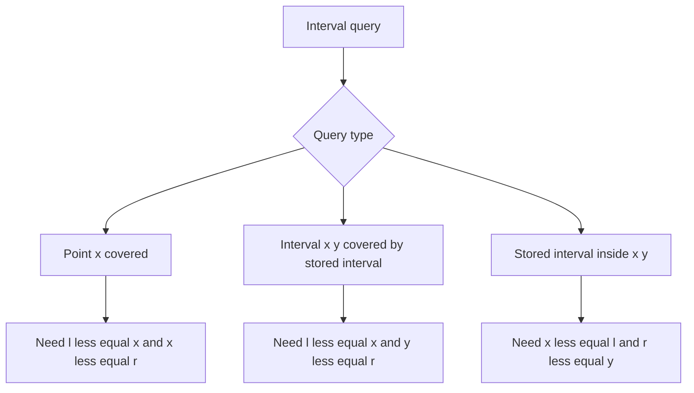
```mermaid
flowchart TD
    A["Interval query"] --> B{"Query type"}
    B --> C["Point x covered"]
    B --> D["Interval x y covered by stored interval"]
    B --> E["Stored interval inside x y"]
    C --> F["Need l less equal x and x less equal r"]
    D --> G["Need l less equal x and y less equal r"]
    E --> H["Need x less equal l and r less equal y"]
```

---

## 2. lower_bound and upper_bound

For sorted values:

```text
values = [1, 3, 3, 5, 8]
x = 3
```

```cpp
lower_bound(values.begin(), values.end(), x);
```

Means:

```text
first position where value >= x
```

So:

```text
lower_bound(3) -> index 1
```

```cpp
upper_bound(values.begin(), values.end(), x);
```

Means:

```text
first position where value > x
```

So:

```text
upper_bound(3) -> index 3
```

### Mermaid Flow

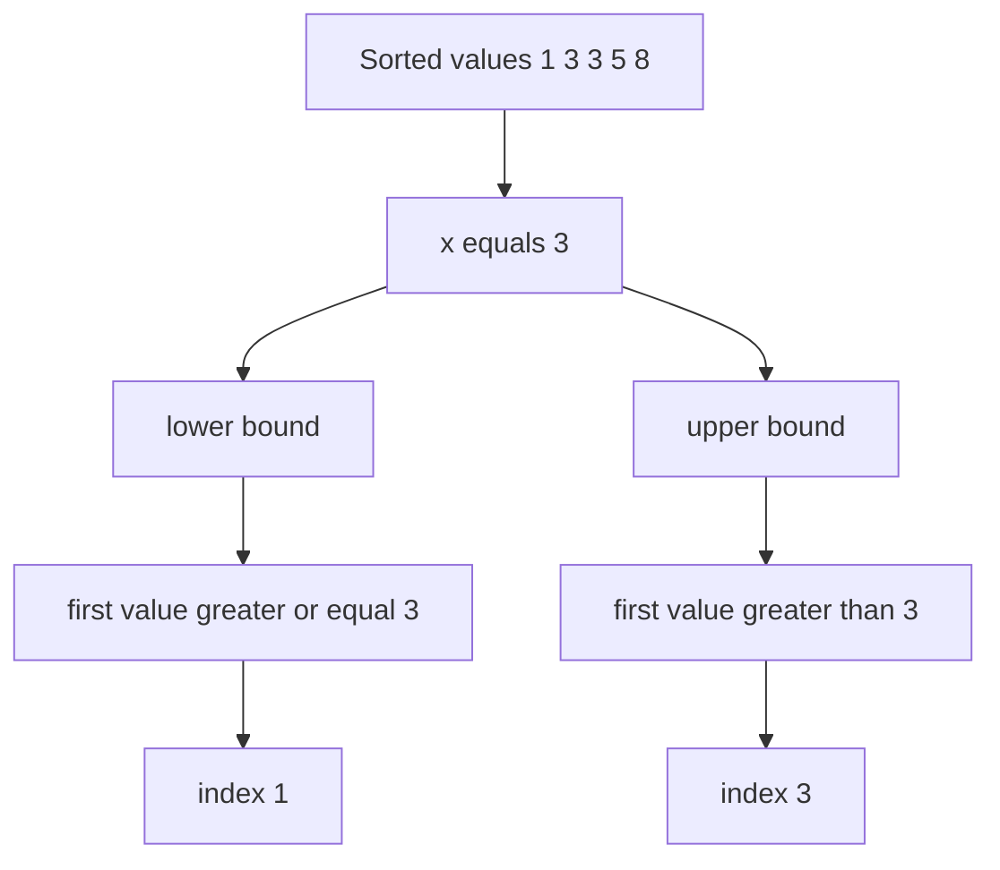
```mermaid
flowchart TD
    A["Sorted values 1 3 3 5 8"] --> B["x equals 3"]
    B --> C["lower bound"]
    C --> D["first value greater or equal 3"]
    D --> E["index 1"]
    B --> F["upper bound"]
    F --> G["first value greater than 3"]
    G --> H["index 3"]
```

### Dry Run Table

| Function | Meaning | Result |
|---|---|---|
| `lower_bound(3)` | first `>= 3` | points to first `3` |
| `upper_bound(3)` | first `> 3` | points to `5` |
| `lower_bound(4)` | first `>= 4` | points to `5` |
| `upper_bound(8)` | first `> 8` | points to end |

### CP Memory Trick

```text
lower_bound(x) = first >= x
upper_bound(x) = first > x

count of values < x  = lower_bound(x) index
count of values <= x = upper_bound(x) index
count of values > x  = n - upper_bound(x) index
count of values >= x = n - lower_bound(x) index
```

---


## 2A. set pair lower_bound and upper_bound

`set<pair<int,int>>` is sorted lexicographically.

That means:

```text
First compare first value.
If first value is same, compare second value.
```

Example:

```cpp
set<pair<int,int>> s = {
    {1, 5},
    {3, 7},
    {10, 12}
};
```

Sorted order:

```text
(1,5), (3,7), (10,12)
```

### Pair comparison rule

```text
(a,b) < (c,d)

true if:
    a < c

or if:
    a == c and b < d
```

### Mermaid Flow

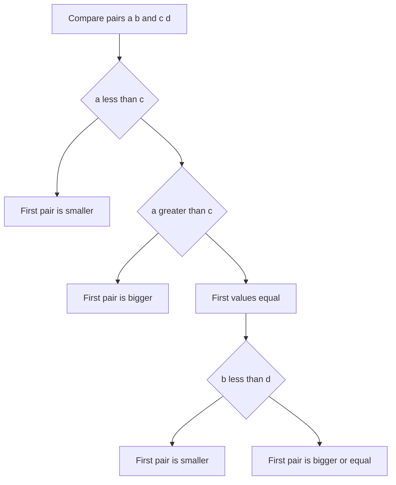
```mermaid
flowchart TD
    A["Compare pairs a b and c d"] --> B{"a less than c"}
    B --> C["First pair is smaller"]
    B --> D{"a greater than c"}
    D --> E["First pair is bigger"]
    D --> F["First values equal"]
    F --> G{"b less than d"}
    G --> H["First pair is smaller"]
    G --> I["First pair is bigger or equal"]
```

### lower_bound with pair

```cpp
auto it = s.lower_bound({x, INT_MIN});
```

Meaning:

```text
Find first interval whose pair is >= (x, minus infinity)
```

Because second value is very small, this gives:

```text
first interval with start >= x
```

Example:

```text
s = (1,5), (3,7), (10,12)
x = 4

lower_bound({4, INT_MIN}) -> (10,12)
```

Because `(3,7)` is smaller than `(4, -inf)` due to `3 < 4`.

### upper_bound with pair

```cpp
auto it = s.upper_bound({x, INT_MAX});
```

Meaning:

```text
Find first interval whose pair is > (x, plus infinity)
```

Because second value is very large, this gives:

```text
first interval with start > x
```

Example:

```text
s = (1,5), (3,7), (10,12)
x = 4

upper_bound({4, INT_MAX}) -> (10,12)
```

For checking point coverage:

```cpp
auto it = s.upper_bound({x, INT_MAX});
if (it == s.begin()) return false;
--it;
return it->second >= x;
```

This finds the interval with the largest start `<= x`.

### Mermaid Dry Run

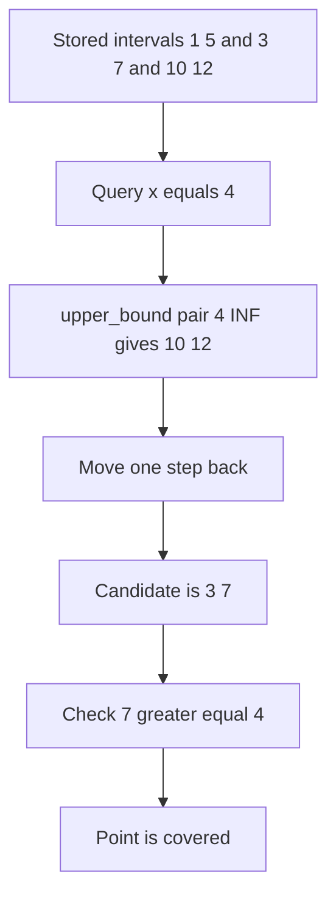
```mermaid
flowchart TD
    A["Stored intervals 1 5 and 3 7 and 10 12"] --> B["Query x equals 4"]
    B --> C["upper_bound pair 4 INF gives 10 12"]
    C --> D["Move one step back"]
    D --> E["Candidate is 3 7"]
    E --> F["Check 7 greater equal 4"]
    F --> G["Point is covered"]
```

### Table Dry Run

| Query | STL call | Returned iterator | After moving back | Meaning |
|---|---|---|---|---|
| `x = 4` | `upper_bound({4, INF})` | `(10,12)` | `(3,7)` | largest start `<= 4` |
| `x = 1` | `upper_bound({1, INF})` | `(3,7)` | `(1,5)` | largest start `<= 1` |
| `x = 0` | `upper_bound({0, INF})` | `(1,5)` | cannot move back | no interval starts before `0` |

---

## 3. Problem 1 Static Intervals Check Point Coverage

### Problem

Given fixed intervals and many point queries, check whether point `x` is covered by at least one interval.

Example:

```text
intervals = [1, 5], [3, 7], [10, 12]
query x = 4
answer = covered
```

### Idea

Keep all starts and ends separately.

```text
starts = [1, 3, 10]
ends   = [5, 7, 12]
```

For point `x`:

```text
started = count of l <= x
endedBefore = count of r < x
active = started - endedBefore
```

If `active > 0`, point is covered.

### Mermaid Flow

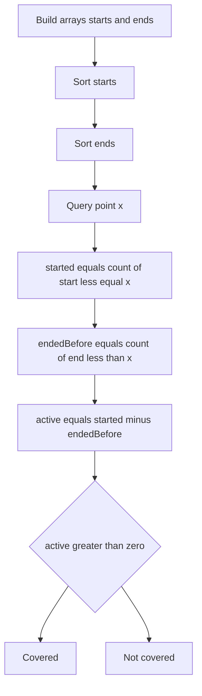
```mermaid
flowchart TD
    A["Build arrays starts and ends"] --> B["Sort starts"]
    B --> C["Sort ends"]
    C --> D["Query point x"]
    D --> E["started equals count of start less equal x"]
    E --> F["endedBefore equals count of end less than x"]
    F --> G["active equals started minus endedBefore"]
    G --> H{"active greater than zero"}
    H --> I["Covered"]
    H --> J["Not covered"]
```

### C++ Code

```cpp
#include <bits/stdc++.h>
using namespace std;

struct StaticIntervalPointQuery {
    vector<int> starts, ends;

    StaticIntervalPointQuery(vector<pair<int,int>>& intervals) {
        for (auto [l, r] : intervals) {
            starts.push_back(l);
            ends.push_back(r);
        }
        sort(starts.begin(), starts.end());
        sort(ends.begin(), ends.end());
    }

    bool isCovered(int x) {
        int started = upper_bound(starts.begin(), starts.end(), x) - starts.begin();
        int endedBefore = lower_bound(ends.begin(), ends.end(), x) - ends.begin();

        int active = started - endedBefore;
        return active > 0;
    }
};

int main() {
    vector<pair<int,int>> intervals = {{1, 5}, {3, 7}, {10, 12}};

    StaticIntervalPointQuery ds(intervals);

    cout << ds.isCovered(4) << "\n"; // 1
    cout << ds.isCovered(8) << "\n"; // 0
}
```

### Dry Run

Input:

```text
intervals = [1,5], [3,7], [10,12]
x = 4
```

| Array | Values |
|---|---|
| starts | `1, 3, 10` |
| ends | `5, 7, 12` |

```text
started = count of start <= 4
started = 2

endedBefore = count of end < 4
endedBefore = 0

active = 2 - 0 = 2
answer = covered
```

### Mermaid Dry Run

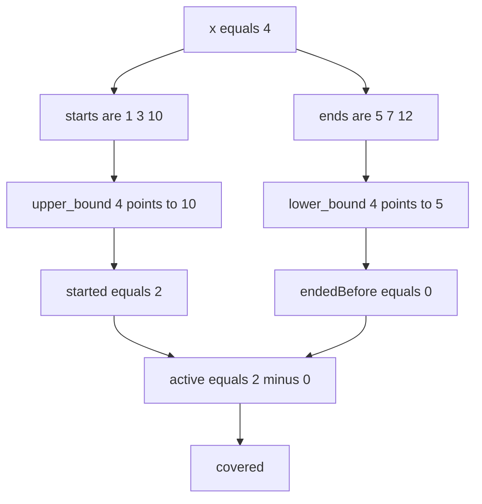
```mermaid
flowchart TD
    A["x equals 4"] --> B["starts are 1 3 10"]
    B --> C["upper_bound 4 points to 10"]
    C --> D["started equals 2"]
    A --> E["ends are 5 7 12"]
    E --> F["lower_bound 4 points to 5"]
    F --> G["endedBefore equals 0"]
    D --> H["active equals 2 minus 0"]
    G --> H
    H --> I["covered"]
```

### Complexity

```text
Build: O(n log n)
Query: O(log n)
```

---

## 4. Problem 2 Dynamic Insert Delete Check Point Coverage

### Problem

Support:

```text
insert [l, r]
delete [l, r]
check point x
```

This version counts active intervals. It does not merge intervals.

### Idea

Maintain:

```cpp
multiset<int> starts;
multiset<int> ends;
multiset<pair<int,int>> intervals;
```

For point `x`:

```text
started = count l <= x
endedBefore = count r < x
active = started - endedBefore
```

Important: `distance` on `multiset` is `O(n)`, so this version is good for learning or small constraints. For large constraints, use Fenwick tree with coordinate compression.

### Mermaid Flow

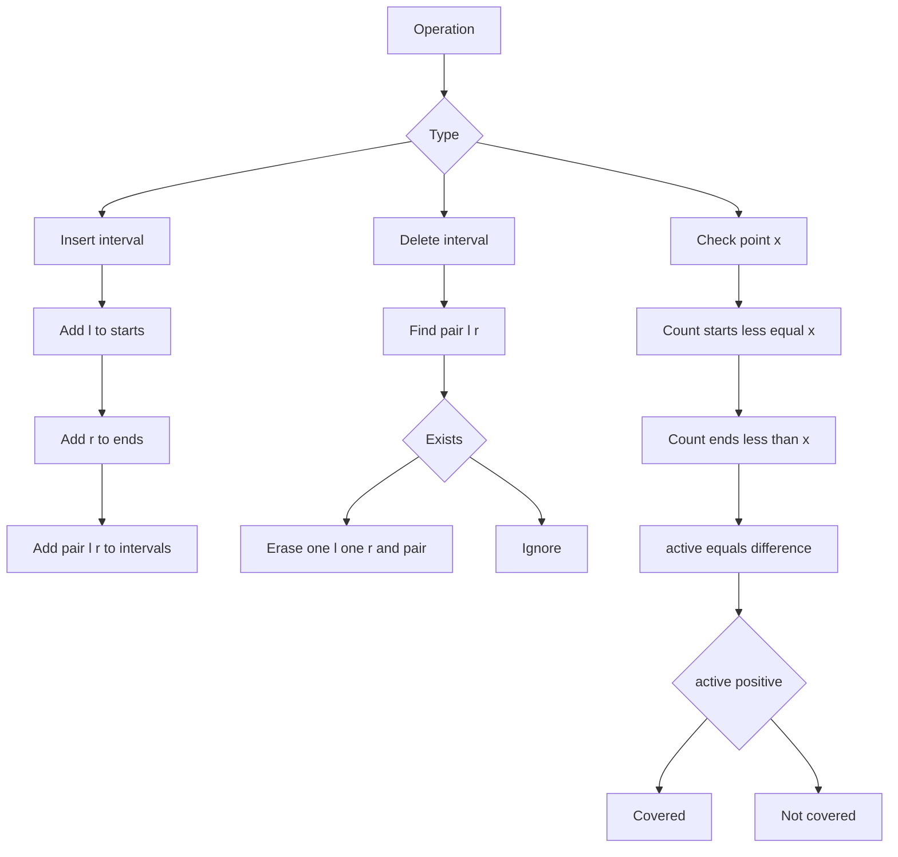
```mermaid
flowchart TD
    A["Operation"] --> B{"Type"}
    B --> C["Insert interval"]
    C --> D["Add l to starts"]
    D --> E["Add r to ends"]
    E --> F["Add pair l r to intervals"]
    B --> G["Delete interval"]
    G --> H["Find pair l r"]
    H --> I{"Exists"}
    I --> J["Erase one l one r and pair"]
    I --> K["Ignore"]
    B --> L["Check point x"]
    L --> M["Count starts less equal x"]
    M --> N["Count ends less than x"]
    N --> O["active equals difference"]
    O --> P{"active positive"}
    P --> Q["Covered"]
    P --> R["Not covered"]
```

### C++ Code

```cpp
#include <bits/stdc++.h>
using namespace std;

struct DynamicIntervalCounter {
    multiset<int> starts;
    multiset<int> ends;
    multiset<pair<int,int>> intervals;

    void insertInterval(int l, int r) {
        if (l > r) swap(l, r);

        starts.insert(l);
        ends.insert(r);
        intervals.insert({l, r});
    }

    void deleteInterval(int l, int r) {
        if (l > r) swap(l, r);

        auto it = intervals.find({l, r});
        if (it == intervals.end()) return;

        intervals.erase(it);

        auto itL = starts.find(l);
        if (itL != starts.end()) starts.erase(itL);

        auto itR = ends.find(r);
        if (itR != ends.end()) ends.erase(itR);
    }

    bool isPointCovered(int x) {
        int started = distance(starts.begin(), starts.upper_bound(x));
        int endedBefore = distance(ends.begin(), ends.lower_bound(x));

        return started - endedBefore > 0;
    }
};

int main() {
    DynamicIntervalCounter ds;

    ds.insertInterval(1, 5);
    ds.insertInterval(3, 7);
    ds.insertInterval(10, 12);

    cout << ds.isPointCovered(4) << "\n"; // 1

    ds.deleteInterval(1, 5);

    cout << ds.isPointCovered(2) << "\n"; // 0
    cout << ds.isPointCovered(4) << "\n"; // 1
}
```

### Dry Run

Operations:

```text
insert [1,5]
insert [3,7]
insert [10,12]
check x = 4
delete [1,5]
check x = 2
```

| Step | starts | ends | Result |
|---|---|---|---|
| insert `[1,5]` | `1` | `5` | - |
| insert `[3,7]` | `1,3` | `5,7` | - |
| insert `[10,12]` | `1,3,10` | `5,7,12` | - |
| check `4` | `1,3,10` | `5,7,12` | covered |
| delete `[1,5]` | `3,10` | `7,12` | - |
| check `2` | `3,10` | `7,12` | not covered |

### Mermaid Dry Run

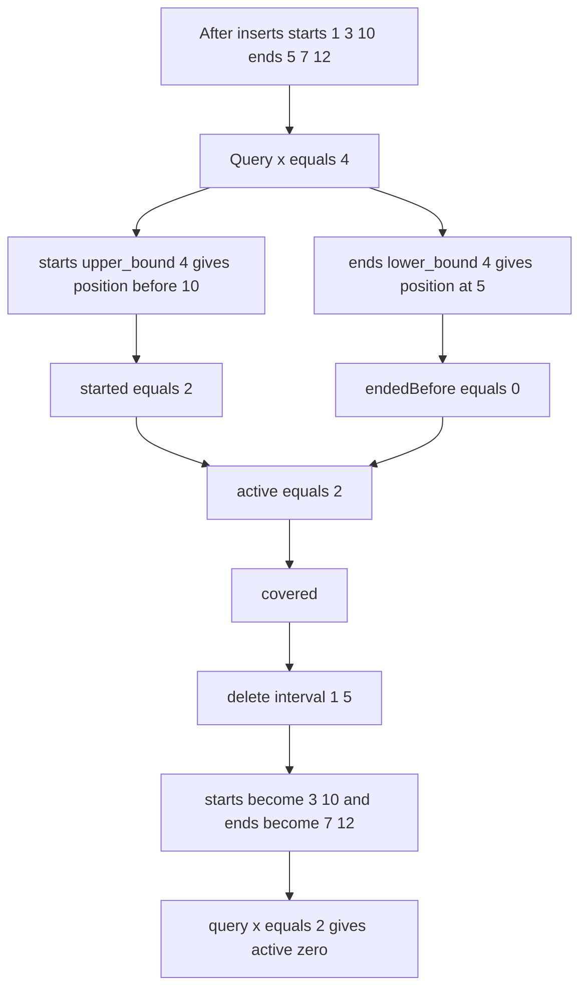
```mermaid
flowchart TD
    A["After inserts starts 1 3 10 ends 5 7 12"] --> B["Query x equals 4"]
    B --> C["starts upper_bound 4 gives position before 10"]
    C --> D["started equals 2"]
    B --> E["ends lower_bound 4 gives position at 5"]
    E --> F["endedBefore equals 0"]
    D --> G["active equals 2"]
    F --> G
    G --> H["covered"]
    H --> I["delete interval 1 5"]
    I --> J["starts become 3 10 and ends become 7 12"]
    J --> K["query x equals 2 gives active zero"]
```

---

## 5. Problem 3 Maintain Merged Intervals

### Problem

Support:

```text
insert [l, r]
delete [l, r]
check point x
```

But keep intervals merged and non-overlapping.

Example:

```text
insert [1, 5]
insert [3, 8]
stored becomes [1, 8]
```


### set<pair<int,int>> Range Update Version

This version uses:

```cpp
set<pair<int,int>> ranges;
```

Each pair means:

```text
{start, end}
```

The set always stores disjoint merged intervals.

Example:

```text
[1,5], [10,15]
```

Stored as:

```text
(1,5), (10,15)
```

### Main Operations

| Operation | Meaning |
|---|---|
| `addRange(l,r)` | insert and merge overlapping intervals |
| `removeRange(l,r)` | delete range from existing intervals |
| `queryPoint(x)` | check if point is covered |
| `queryRange(l,r)` | check if full interval is covered |

### Mermaid Flow for addRange

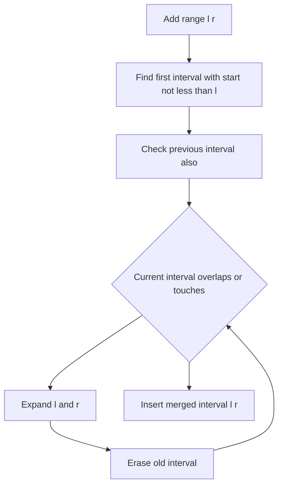
```mermaid
flowchart TD
    A["Add range l r"] --> B["Find first interval with start not less than l"]
    B --> C["Check previous interval also"]
    C --> D{"Current interval overlaps or touches"}
    D --> E["Expand l and r"]
    E --> F["Erase old interval"]
    F --> D
    D --> G["Insert merged interval l r"]
```

### Mermaid Flow for removeRange

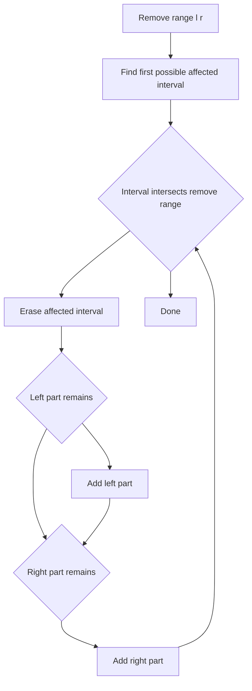
```mermaid
flowchart TD
    A["Remove range l r"] --> B["Find first possible affected interval"]
    B --> C{"Interval intersects remove range"}
    C --> D["Erase affected interval"]
    D --> E{"Left part remains"}
    E --> F["Add left part"]
    E --> G{"Right part remains"}
    F --> G
    G --> H["Add right part"]
    H --> C
    C --> I["Done"]
```

### C++ Code

```cpp
#include <bits/stdc++.h>
using namespace std;

struct RangeModuleSet {
    set<pair<int,int>> ranges;

    void addRange(int l, int r) {
        if (l > r) swap(l, r);

        auto it = ranges.lower_bound({l, INT_MIN});

        if (it != ranges.begin()) {
            auto prevIt = prev(it);

            if (prevIt->second + 1 >= l) {
                it = prevIt;
            }
        }

        while (it != ranges.end() && it->first <= r + 1) {
            l = min(l, it->first);
            r = max(r, it->second);
            it = ranges.erase(it);
        }

        ranges.insert({l, r});
    }

    void removeRange(int l, int r) {
        if (l > r) swap(l, r);

        auto it = ranges.lower_bound({l, INT_MIN});

        if (it != ranges.begin()) {
            --it;
        }

        vector<pair<int,int>> addBack;

        while (it != ranges.end()) {
            int a = it->first;
            int b = it->second;

            if (b < l) {
                ++it;
                continue;
            }

            if (a > r) break;

            it = ranges.erase(it);

            if (a < l) {
                addBack.push_back({a, l - 1});
            }

            if (r < b) {
                addBack.push_back({r + 1, b});
            }
        }

        for (auto p : addBack) {
            ranges.insert(p);
        }
    }

    bool queryPoint(int x) {
        auto it = ranges.upper_bound({x, INT_MAX});

        if (it == ranges.begin()) return false;

        --it;

        return it->second >= x;
    }

    bool queryRange(int l, int r) {
        if (l > r) swap(l, r);

        auto it = ranges.upper_bound({l, INT_MAX});

        if (it == ranges.begin()) return false;

        --it;

        return it->second >= r;
    }

    void print() {
        for (auto [l, r] : ranges) {
            cout << "[" << l << "," << r << "] ";
        }
        cout << "\n";
    }
};

int main() {
    RangeModuleSet rm;

    rm.addRange(1, 5);
    rm.addRange(10, 15);
    rm.addRange(4, 12);

    rm.print(); // [1,15]

    cout << rm.queryPoint(8) << "\n";    // 1
    cout << rm.queryPoint(20) << "\n";   // 0
    cout << rm.queryRange(3, 14) << "\n"; // 1

    rm.removeRange(5, 10);

    rm.print(); // [1,4] [11,15]

    cout << rm.queryRange(3, 14) << "\n"; // 0
}
```

### Dry Run addRange

Operations:

```text
add [1,5]
add [10,15]
add [4,12]
```

Before adding `[4,12]`:

```text
(1,5), (10,15)
```

Step by step:

| Step | Action | Result |
|---|---|---|
| 1 | `lower_bound({4, -INF})` | points to `(10,15)` |
| 2 | check previous | previous is `(1,5)` |
| 3 | `(1,5)` overlaps `[4,12]` | merge to `[1,12]` |
| 4 | `(10,15)` overlaps `[1,12]` | merge to `[1,15]` |
| 5 | insert final | `(1,15)` |

### Mermaid Dry Run addRange

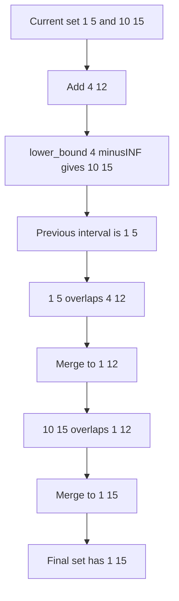
```mermaid
flowchart TD
    A["Current set 1 5 and 10 15"] --> B["Add 4 12"]
    B --> C["lower_bound 4 minusINF gives 10 15"]
    C --> D["Previous interval is 1 5"]
    D --> E["1 5 overlaps 4 12"]
    E --> F["Merge to 1 12"]
    F --> G["10 15 overlaps 1 12"]
    G --> H["Merge to 1 15"]
    H --> I["Final set has 1 15"]
```

### Dry Run removeRange

Current:

```text
(1,15)
```

Remove:

```text
[5,10]
```

Step by step:

| Step | Action | Result |
|---|---|---|
| 1 | affected interval is `(1,15)` | erase it |
| 2 | left part remains | `(1,4)` |
| 3 | right part remains | `(11,15)` |
| 4 | insert parts back | `(1,4), (11,15)` |

### Mermaid Dry Run removeRange

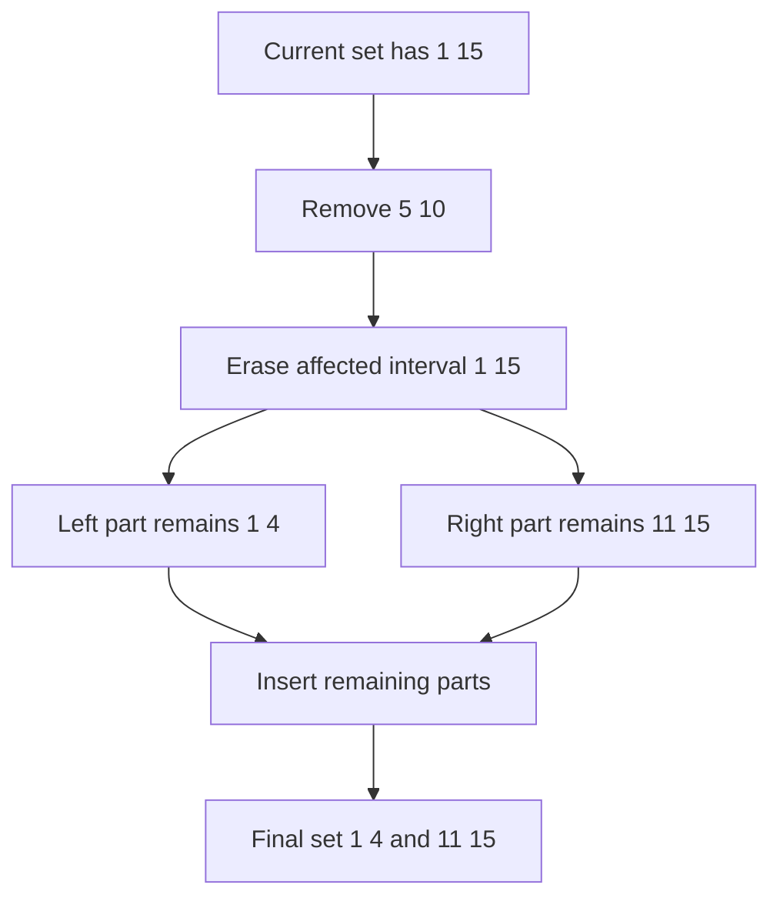
```mermaid
flowchart TD
    A["Current set has 1 15"] --> B["Remove 5 10"]
    B --> C["Erase affected interval 1 15"]
    C --> D["Left part remains 1 4"]
    C --> E["Right part remains 11 15"]
    D --> F["Insert remaining parts"]
    E --> F
    F --> G["Final set 1 4 and 11 15"]
```

---

### Why Merged Intervals Help

If intervals are disjoint and merged, point query is easy:

```text
Find interval with largest start <= x
Check whether its end >= x
```

### Mermaid Flow

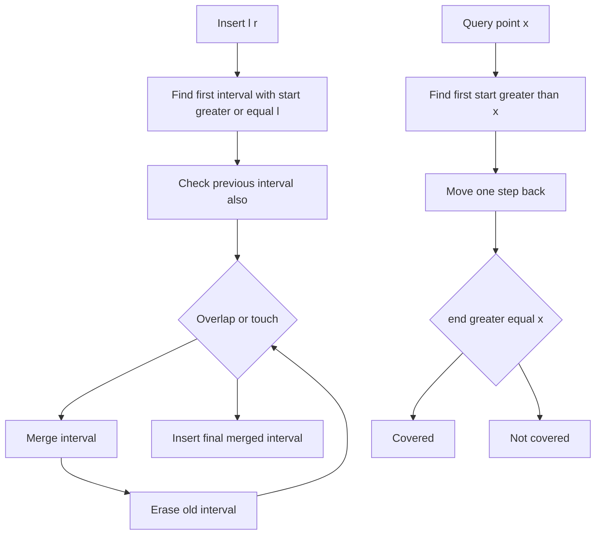
```mermaid
flowchart TD
    A["Insert l r"] --> B["Find first interval with start greater or equal l"]
    B --> C["Check previous interval also"]
    C --> D{"Overlap or touch"}
    D --> E["Merge interval"]
    E --> F["Erase old interval"]
    F --> D
    D --> G["Insert final merged interval"]
    H["Query point x"] --> I["Find first start greater than x"]
    I --> J["Move one step back"]
    J --> K{"end greater equal x"}
    K --> L["Covered"]
    K --> M["Not covered"]
```

### C++ Code

```cpp
#include <bits/stdc++.h>
using namespace std;

struct MergedIntervals {
    map<int, int> mp; // start -> end

    void insertInterval(int l, int r) {
        if (l > r) swap(l, r);

        auto it = mp.lower_bound(l);

        if (it != mp.begin()) {
            auto prevIt = prev(it);
            if (prevIt->second + 1 >= l) {
                l = min(l, prevIt->first);
                r = max(r, prevIt->second);
                it = mp.erase(prevIt);
            }
        }

        while (it != mp.end() && it->first <= r + 1) {
            r = max(r, it->second);
            it = mp.erase(it);
        }

        mp[l] = r;
    }

    void deleteInterval(int l, int r) {
        if (l > r) swap(l, r);

        auto it = mp.upper_bound(l);
        if (it != mp.begin()) --it;

        vector<pair<int,int>> addBack;

        while (it != mp.end()) {
            int a = it->first;
            int b = it->second;

            if (b < l) {
                ++it;
                continue;
            }

            if (a > r) break;

            it = mp.erase(it);

            if (a < l) addBack.push_back({a, l - 1});
            if (r < b) addBack.push_back({r + 1, b});
        }

        for (auto [a, b] : addBack) {
            mp[a] = b;
        }
    }

    bool isPointCovered(int x) {
        auto it = mp.upper_bound(x);

        if (it == mp.begin()) return false;

        --it;

        return it->second >= x;
    }

    void print() {
        for (auto [l, r] : mp) {
            cout << "[" << l << "," << r << "] ";
        }
        cout << "\n";
    }
};

int main() {
    MergedIntervals ds;

    ds.insertInterval(1, 5);
    ds.insertInterval(10, 15);
    ds.insertInterval(4, 12);

    ds.print(); // [1,15]

    cout << ds.isPointCovered(8) << "\n";  // 1
    cout << ds.isPointCovered(20) << "\n"; // 0

    ds.deleteInterval(5, 10);
    ds.print(); // [1,4] [11,15]
}
```

### Dry Run Insert

Operations:

```text
insert [1,5]
insert [10,15]
insert [4,12]
```

Before third insert:

```text
[1,5], [10,15]
```

Insert `[4,12]`:

```text
[4,12] overlaps [1,5] -> merge [1,12]
[1,12] overlaps [10,15] -> merge [1,15]
```

Final:

```text
[1,15]
```

### Mermaid Dry Run Insert

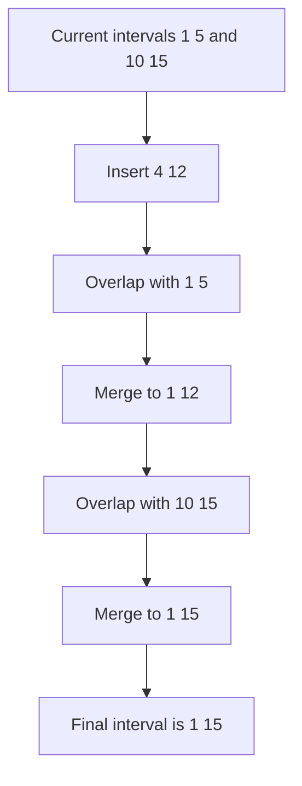
```mermaid
flowchart TD
    A["Current intervals 1 5 and 10 15"] --> B["Insert 4 12"]
    B --> C["Overlap with 1 5"]
    C --> D["Merge to 1 12"]
    D --> E["Overlap with 10 15"]
    E --> F["Merge to 1 15"]
    F --> G["Final interval is 1 15"]
```

### Dry Run Delete

Current:

```text
[1,15]
```

Delete:

```text
[5,10]
```

Result:

```text
[1,4], [11,15]
```

### Mermaid Dry Run Delete

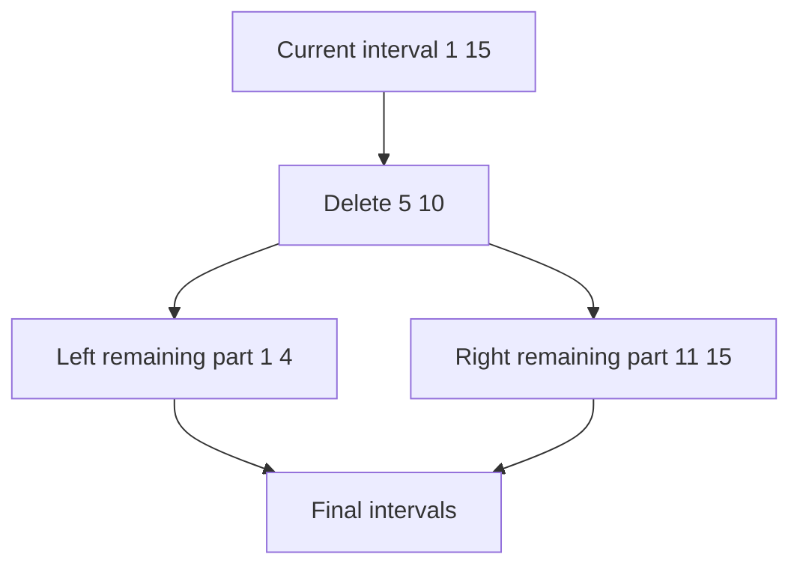
```mermaid
flowchart TD
    A["Current interval 1 15"] --> B["Delete 5 10"]
    B --> C["Left remaining part 1 4"]
    B --> D["Right remaining part 11 15"]
    C --> E["Final intervals"]
    D --> E
```

---

## 6. Problem 4 Check Whether Interval x y Is Fully Covered

### Problem

Given query `[x, y]`, check whether some stored merged interval fully covers it.

Need:

```text
l <= x and y <= r
```

### Idea

Because intervals are merged and sorted by start:

```text
Find largest l <= x
Then check whether r >= y
```

### Mermaid Flow

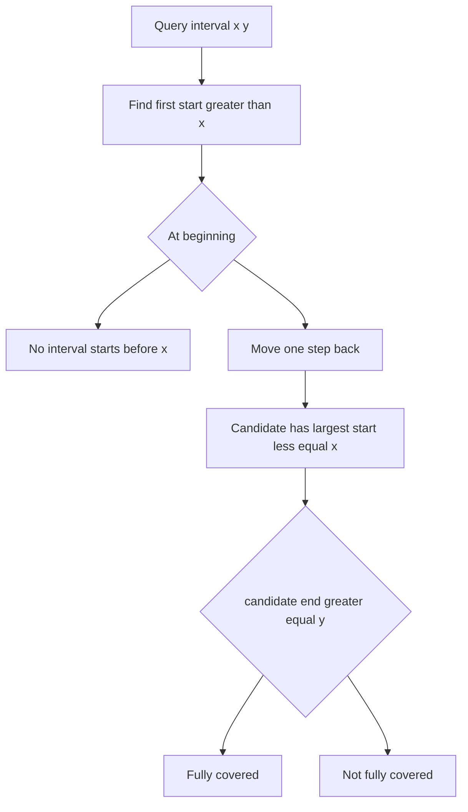
```mermaid
flowchart TD
    A["Query interval x y"] --> B["Find first start greater than x"]
    B --> C{"At beginning"}
    C --> D["No interval starts before x"]
    C --> E["Move one step back"]
    E --> F["Candidate has largest start less equal x"]
    F --> G{"candidate end greater equal y"}
    G --> H["Fully covered"]
    G --> I["Not fully covered"]
```

### C++ Code

Add this method inside `MergedIntervals`:

```cpp
bool isIntervalCovered(int x, int y) {
    if (x > y) swap(x, y);

    auto it = mp.upper_bound(x);

    if (it == mp.begin()) return false;

    --it;

    return it->second >= y;
}
```

Full test:

```cpp
int main() {
    MergedIntervals ds;

    ds.insertInterval(1, 10);
    ds.insertInterval(20, 30);

    cout << ds.isIntervalCovered(3, 7) << "\n";   // 1
    cout << ds.isIntervalCovered(5, 15) << "\n";  // 0
    cout << ds.isIntervalCovered(22, 25) << "\n"; // 1
}
```

### Dry Run

Stored intervals:

```text
[1,10], [20,30]
```

Query:

```text
[3,7]
```

Steps:

```text
upper_bound(3) finds first start > 3
That is 20

Move one step back
Candidate is [1,10]

Check 10 >= 7
Answer yes
```

### Mermaid Dry Run

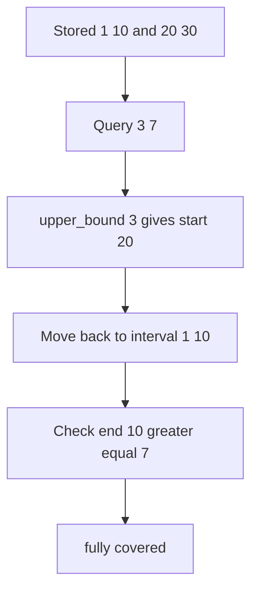
```mermaid
flowchart TD
    A["Stored 1 10 and 20 30"] --> B["Query 3 7"]
    B --> C["upper_bound 3 gives start 20"]
    C --> D["Move back to interval 1 10"]
    D --> E["Check end 10 greater equal 7"]
    E --> F["fully covered"]
```

---

## 7. Problem 5 Check Whether Any Stored Interval Is Inside x y

### Problem

Given query `[x, y]`, check whether there exists stored interval `[l, r]` such that:

```text
x <= l and r <= y
```

### Simple Version

Use `set<pair<int,int>> intervals`, sorted by start.

Find first interval with:

```text
l >= x
```

Then check whether its end `r <= y`.

This works for existence if we only need the earliest starting candidate. If that candidate has end too large, a later start might still fit. For fully correct dynamic query with arbitrary intervals, use segment tree or map minimum end by start.

### Mermaid Flow Simple Version

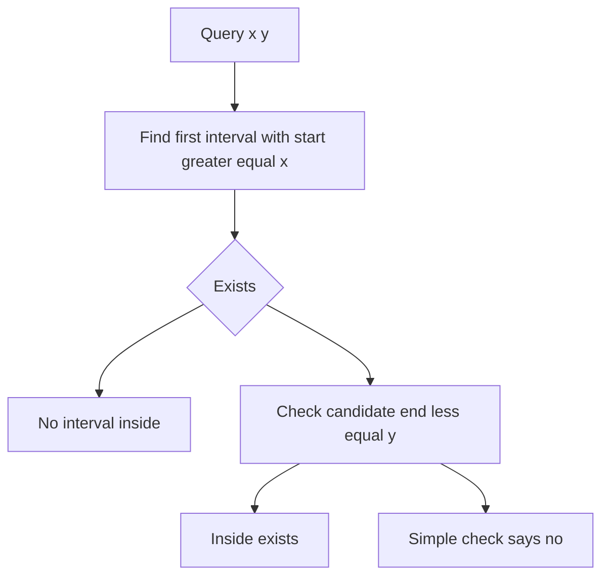
```mermaid
flowchart TD
    A["Query x y"] --> B["Find first interval with start greater equal x"]
    B --> C{"Exists"}
    C --> D["No interval inside"]
    C --> E["Check candidate end less equal y"]
    E --> F["Inside exists"]
    E --> G["Simple check says no"]
```

### Simple C++ Code

```cpp
#include <bits/stdc++.h>
using namespace std;

struct RawIntervalsSimple {
    set<pair<int,int>> intervals;

    void insertInterval(int l, int r) {
        if (l > r) swap(l, r);
        intervals.insert({l, r});
    }

    void deleteInterval(int l, int r) {
        if (l > r) swap(l, r);
        intervals.erase({l, r});
    }

    bool hasIntervalInsideSimple(int x, int y) {
        if (x > y) swap(x, y);

        auto it = intervals.lower_bound({x, INT_MIN});

        if (it == intervals.end()) return false;

        return it->second <= y;
    }
};
```

### Dry Run

Stored:

```text
[1,10], [4,6], [8,20]
```

Query:

```text
[3,7]
```

Steps:

```text
lower_bound({3, minus infinity}) finds [4,6]
Check 6 <= 7
Answer yes
```

### Mermaid Dry Run

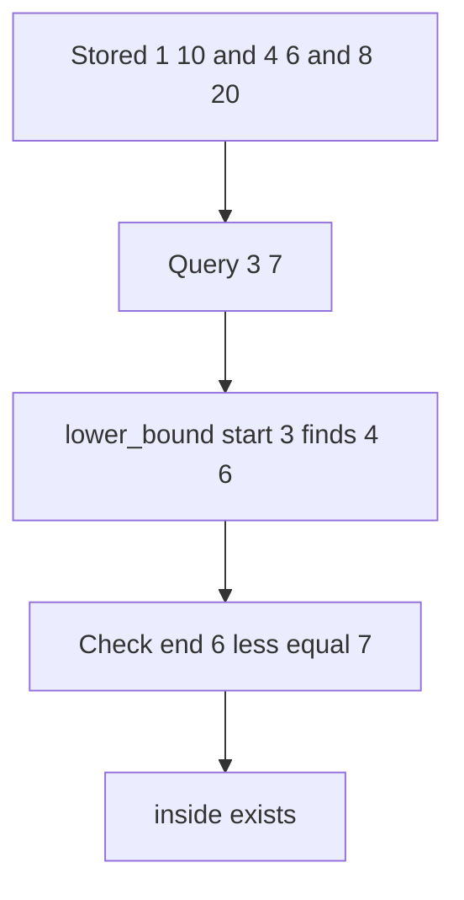
```mermaid
flowchart TD
    A["Stored 1 10 and 4 6 and 8 20"] --> B["Query 3 7"]
    B --> C["lower_bound start 3 finds 4 6"]
    C --> D["Check end 6 less equal 7"]
    D --> E["inside exists"]
```

### Fully Correct Version Using Segment Tree Over Starts

For many queries:

```text
insert interval [l, r]
delete interval [l, r]
query if any interval inside [x, y]
```

We need:

```text
among intervals with start >= x and start <= y
is minimum end <= y?
```

So maintain for each start `l`, the minimum end among intervals starting at `l`.

Then query min end in start range `[x, y]`.

If min end `<= y`, some interval is inside.

This needs coordinate compression + segment tree.

### Mermaid Flow Correct Version

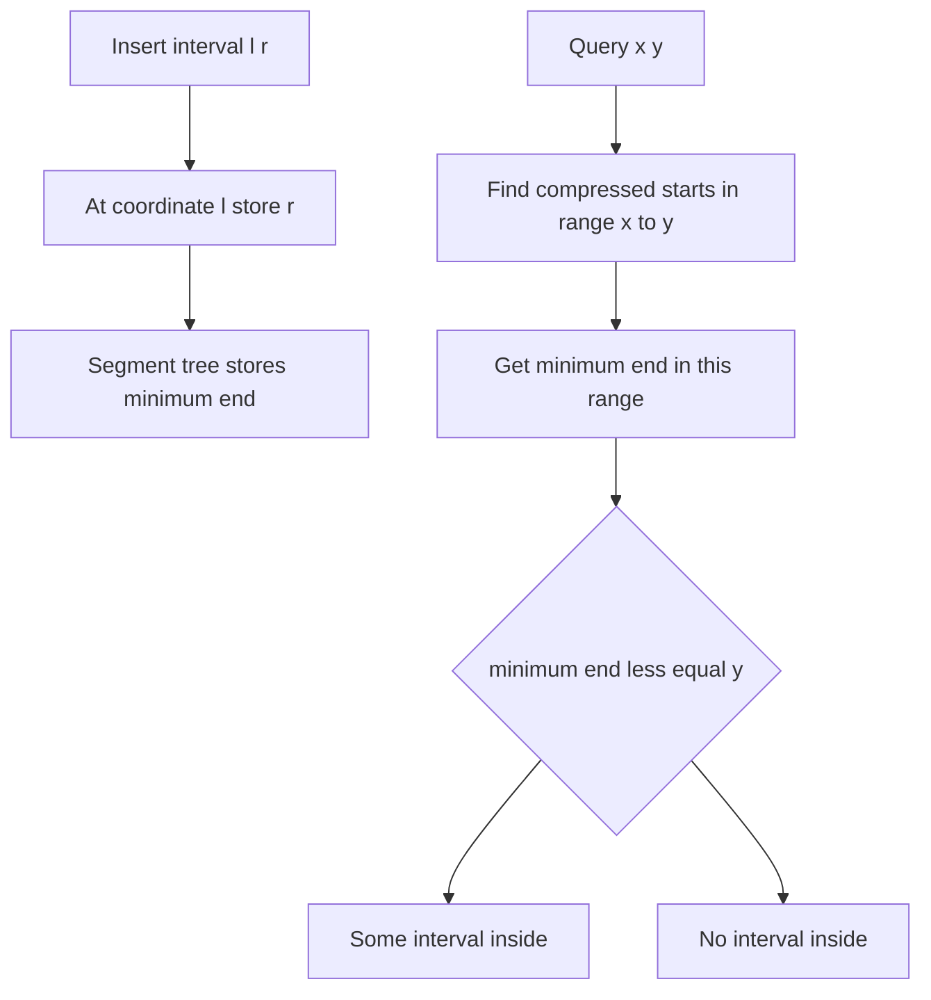
```mermaid
flowchart TD
    A["Insert interval l r"] --> B["At coordinate l store r"]
    B --> C["Segment tree stores minimum end"]
    D["Query x y"] --> E["Find compressed starts in range x to y"]
    E --> F["Get minimum end in this range"]
    F --> G{"minimum end less equal y"}
    G --> H["Some interval inside"]
    G --> I["No interval inside"]
```

### C++ Code

```cpp
#include <bits/stdc++.h>
using namespace std;

struct SegmentTreeMin {
    int n;
    const int INF = 1e9;
    vector<int> tree;

    SegmentTreeMin(int n = 0) {
        init(n);
    }

    void init(int size) {
        n = 1;
        while (n < size) n *= 2;
        tree.assign(2 * n, INF);
    }

    void update(int idx, int value) {
        idx += n;
        tree[idx] = value;
        idx /= 2;

        while (idx >= 1) {
            tree[idx] = min(tree[2 * idx], tree[2 * idx + 1]);
            idx /= 2;
        }
    }

    int query(int l, int r) {
        const int INF = 1e9;
        int ans = INF;

        l += n;
        r += n;

        while (l <= r) {
            if (l % 2 == 1) ans = min(ans, tree[l++]);
            if (r % 2 == 0) ans = min(ans, tree[r--]);
            l /= 2;
            r /= 2;
        }

        return ans;
    }
};

struct IntervalInsideQuery {
    vector<int> coords;
    vector<multiset<int>> endsAtStart;
    SegmentTreeMin seg;

    IntervalInsideQuery(vector<int> allPossibleStarts) {
        coords = allPossibleStarts;
        sort(coords.begin(), coords.end());
        coords.erase(unique(coords.begin(), coords.end()), coords.end());

        endsAtStart.resize(coords.size());
        seg.init(coords.size());
    }

    int id(int x) {
        return lower_bound(coords.begin(), coords.end(), x) - coords.begin();
    }

    void refresh(int idx) {
        if (endsAtStart[idx].empty()) {
            seg.update(idx, (int)1e9);
        } else {
            seg.update(idx, *endsAtStart[idx].begin());
        }
    }

    void insertInterval(int l, int r) {
        if (l > r) swap(l, r);

        int idx = id(l);
        endsAtStart[idx].insert(r);
        refresh(idx);
    }

    void deleteInterval(int l, int r) {
        if (l > r) swap(l, r);

        int idx = id(l);
        auto it = endsAtStart[idx].find(r);
        if (it != endsAtStart[idx].end()) {
            endsAtStart[idx].erase(it);
            refresh(idx);
        }
    }

    bool hasIntervalInside(int x, int y) {
        if (x > y) swap(x, y);

        int left = lower_bound(coords.begin(), coords.end(), x) - coords.begin();
        int right = upper_bound(coords.begin(), coords.end(), y) - coords.begin() - 1;

        if (left > right) return false;

        int minEnd = seg.query(left, right);

        return minEnd <= y;
    }
};

int main() {
    vector<int> allStarts = {1, 4, 8};

    IntervalInsideQuery ds(allStarts);

    ds.insertInterval(1, 10);
    ds.insertInterval(4, 6);
    ds.insertInterval(8, 20);

    cout << ds.hasIntervalInside(3, 7) << "\n";  // 1 because [4,6]
    cout << ds.hasIntervalInside(5, 7) << "\n";  // 0
}
```

### Dry Run Correct Version

Stored intervals:

```text
[1,10], [4,6], [8,20]
```

Query:

```text
[3,7]
```

Possible starts in `[3,7]`:

```text
4
```

Minimum end among starts in `[3,7]`:

```text
6
```

Check:

```text
6 <= 7
answer yes
```

### Mermaid Dry Run Correct Version

```mermaid
flowchart TD
    A["Query 3 7"] --> B["Valid starts must be from 3 to 7"]
    B --> C["Only start 4 is inside range"]
    C --> D["Minimum end for start 4 is 6"]
    D --> E["6 less equal 7"]
    E --> F["Stored interval 4 6 is inside"]
```

---

## 8. Sweep Line Technique

### What Is Sweep Line?

Sweep line converts intervals into events.

For interval `[l, r]`:

```text
at l: active increases by 1
after r: active decreases by 1
```

For integer closed intervals, use:

```text
events[l] += 1
events[r + 1] -= 1
```

Then scan from left to right.

### Mermaid Flow

```mermaid
flowchart TD
    A["Intervals"] --> B["Convert to start and end events"]
    B --> C["Sort events by coordinate"]
    C --> D["Scan left to right"]
    D --> E["Update active count"]
    E --> F["Answer based on active"]
```

---

### Sweep Line Example 1: Maximum Overlapping Intervals

Problem:

```text
Given intervals, find maximum number of intervals active at the same point.
```

Input:

```text
[1,5], [2,6], [4,8]
```

Events:

```text
1 -> +1
6 -> -1
2 -> +1
7 -> -1
4 -> +1
9 -> -1
```

Scan:

| Coordinate | Change | Active | Max |
|---:|---:|---:|---:|
| 1 | +1 | 1 | 1 |
| 2 | +1 | 2 | 2 |
| 4 | +1 | 3 | 3 |
| 6 | -1 | 2 | 3 |
| 7 | -1 | 1 | 3 |
| 9 | -1 | 0 | 3 |

Answer:

```text
3
```

### Mermaid Dry Run

```mermaid
flowchart TD
    A["Interval 1 5 gives plus at 1 minus at 6"] --> B["Interval 2 6 gives plus at 2 minus at 7"]
    B --> C["Interval 4 8 gives plus at 4 minus at 9"]
    C --> D["Scan sorted events"]
    D --> E["active becomes 1 then 2 then 3"]
    E --> F["maximum overlap is 3"]
```

### C++ Code

```cpp
#include <bits/stdc++.h>
using namespace std;

int maxOverlap(vector<pair<int,int>>& intervals) {
    map<int, int> events;

    for (auto [l, r] : intervals) {
        events[l] += 1;
        events[r + 1] -= 1; // closed interval
    }

    int active = 0;
    int best = 0;

    for (auto [coord, delta] : events) {
        active += delta;
        best = max(best, active);
    }

    return best;
}

int main() {
    vector<pair<int,int>> intervals = {{1, 5}, {2, 6}, {4, 8}};
    cout << maxOverlap(intervals) << "\n"; // 3
}
```

---

### Sweep Line Example 2: Count Covered Integer Points

Problem:

```text
Given intervals, count how many integer points are covered by at least one interval.
```

Input:

```text
[1,3], [2,5], [8,10]
```

Covered integer points:

```text
1,2,3,4,5,8,9,10
```

Answer:

```text
8
```

### Idea

Use events:

```text
l -> +1
r + 1 -> -1
```

Between two consecutive event coordinates, active count is constant.

### Mermaid Flow

```mermaid
flowchart TD
    A["Create events"] --> B["Sort event coordinates"]
    B --> C["Scan coordinate segments"]
    C --> D{"active greater than zero"}
    D --> E["Add segment length"]
    D --> F["Add nothing"]
    E --> G["Apply current event delta"]
    F --> G
```

### C++ Code

```cpp
#include <bits/stdc++.h>
using namespace std;

long long countCoveredIntegerPoints(vector<pair<int,int>>& intervals) {
    map<int, int> events;

    for (auto [l, r] : intervals) {
        events[l] += 1;
        events[r + 1] -= 1;
    }

    long long answer = 0;
    int active = 0;
    int prev = 0;
    bool first = true;

    for (auto [coord, delta] : events) {
        if (!first && active > 0) {
            answer += coord - prev;
        }

        active += delta;
        prev = coord;
        first = false;
    }

    return answer;
}

int main() {
    vector<pair<int,int>> intervals = {{1, 3}, {2, 5}, {8, 10}};
    cout << countCoveredIntegerPoints(intervals) << "\n"; // 8
}
```

### Dry Run

Events:

```text
1:+1
2:+1
4:-1
6:-1
8:+1
11:-1
```

Scan:

| Segment | Active before segment | Covered length |
|---|---:|---:|
| `[1,2)` | 1 | 1 |
| `[2,4)` | 2 | 2 |
| `[4,6)` | 1 | 2 |
| `[6,8)` | 0 | 0 |
| `[8,11)` | 1 | 3 |

Total:

```text
1 + 2 + 2 + 3 = 8
```

---

### Sweep Line Example 3: Offline Point Queries

Problem:

```text
Given static intervals and query points, count how many intervals cover each point.
```

Input:

```text
intervals = [1,5], [3,7], [10,12]
queries = 4, 8, 11
```

Answers:

```text
4  -> 2
8  -> 0
11 -> 1
```

### Idea

Make events:

```text
interval start  -> add active
query point     -> answer current active
interval end+1  -> remove active
```

For closed integer intervals `[l, r]`, process `end + 1`.

### Mermaid Flow

```mermaid
flowchart TD
    A["Create interval events"] --> B["Create query events"]
    B --> C["Sort all events by coordinate"]
    C --> D["Scan from left to right"]
    D --> E{"Event type"}
    E --> F["Add active"]
    E --> G["Store answer"]
    E --> H["Remove active"]
```

### C++ Code

```cpp
#include <bits/stdc++.h>
using namespace std;

vector<int> offlinePointCoverage(
    vector<pair<int,int>>& intervals,
    vector<int>& queries
) {
    vector<tuple<int,int,int>> events;

    // type order:
    // 0 = add
    // 1 = query
    // 2 = remove
    for (auto [l, r] : intervals) {
        events.push_back({l, 0, -1});
        events.push_back({r + 1, 2, -1});
    }

    for (int i = 0; i < (int)queries.size(); i++) {
        events.push_back({queries[i], 1, i});
    }

    sort(events.begin(), events.end());

    int active = 0;
    vector<int> answer(queries.size());

    for (auto [coord, type, id] : events) {
        if (type == 0) {
            active++;
        } else if (type == 1) {
            answer[id] = active;
        } else {
            active--;
        }
    }

    return answer;
}

int main() {
    vector<pair<int,int>> intervals = {{1, 5}, {3, 7}, {10, 12}};
    vector<int> queries = {4, 8, 11};

    auto ans = offlinePointCoverage(intervals, queries);

    for (int x : ans) cout << x << " ";
    cout << "\n"; // 2 0 1
}
```

### Dry Run

Events:

```text
1 add
3 add
4 query id0
6 remove
8 query id1
8 remove
10 add
11 query id2
13 remove
```

| Event | Active after/before | Answer |
|---|---:|---|
| `1 add` | 1 | - |
| `3 add` | 2 | - |
| `4 query` | 2 | query 4 = 2 |
| `6 remove` | 1 | - |
| `8 query` | 1 before same coordinate issue | wrong if remove also at 8 |

Important note:

For closed intervals using `r + 1` removal, query at `8` should see removals at `8` before query only if interval ended at `7`.

So event order at same coordinate should be:

```text
add before query before remove works only for same coordinate without r+1 confusion.
For r+1 removal, remove must happen before query at that coordinate.
```

Safer event type order:

```text
remove first, add second, query third
```

But add at coordinate `x` must affect query `x`.

Best simple method: use map delta and queries separately.

### Safer Offline Point Coverage Code

```cpp
#include <bits/stdc++.h>
using namespace std;

vector<int> offlinePointCoverageSafe(
    vector<pair<int,int>>& intervals,
    vector<int>& queries
) {
    map<int, int> delta;

    for (auto [l, r] : intervals) {
        delta[l] += 1;
        delta[r + 1] -= 1;
    }

    vector<pair<int,int>> qs;
    for (int i = 0; i < (int)queries.size(); i++) {
        qs.push_back({queries[i], i});
    }

    sort(qs.begin(), qs.end());

    vector<int> ans(queries.size());

    int active = 0;
    auto it = delta.begin();

    for (auto [x, id] : qs) {
        while (it != delta.end() && it->first <= x) {
            active += it->second;
            ++it;
        }

        ans[id] = active;
    }

    return ans;
}
```

### Correct Dry Run

Delta map:

```text
1:+1
3:+1
6:-1
8:-1
10:+1
13:-1
```

Queries:

```text
4, 8, 11
```

| Query | Applied deltas <= query | Active | Answer |
|---:|---|---:|---:|
| 4 | `1:+1`, `3:+1` | 2 | 2 |
| 8 | `6:-1`, `8:-1` | 0 | 0 |
| 11 | `10:+1` | 1 | 1 |

---

## 9. Practice Problems

### Problem A: Basic Dynamic Point Coverage

Support:

```text
insert [l,r]
delete [l,r]
check x
```

Use:

```text
multiset starts
multiset ends
multiset intervals
```

Goal:

```text
Return true if active intervals at x is positive.
```

---

### Problem B: Merged Range Module

Support:

```text
addRange(l,r)
removeRange(l,r)
queryRange(l,r)
```

Use:

```text
set<pair<int,int>> merged intervals
```

Goal:

```text
queryRange returns true if full interval is covered.
```

Similar to LeetCode Range Module.

---

### Problem C: Interval Inside Query

Support:

```text
insert [l,r]
delete [l,r]
hasInside [x,y]
```

Use:

```text
coordinate compression
segment tree minimum end by start
```

Goal:

```text
Return true if any stored interval lies fully inside x y.
```

---

### Problem D: Maximum Overlap

Given static intervals, find maximum overlap.

Use:

```text
sweep line events
```

---

### Problem E: Count Covered Integer Points

Given static intervals, count total integer points covered by at least one interval.

Use:

```text
sweep line with active segments
```

---

## 10. Final Mental Map

```mermaid
flowchart TD
    A["Interval problem"] --> B{"Static or dynamic"}
    B --> C["Static"]
    B --> D["Dynamic"]
    C --> E{"Point query"}
    E --> F["Sort starts and ends"]
    E --> G["Sweep line offline"]
    C --> H{"Overlap count"}
    H --> I["Sweep line"]
    D --> J{"Need merge"}
    J --> K["map start to end"]
    J --> L["multiset starts and ends"]
    D --> M{"Need interval inside query"}
    M --> N["segment tree min end by start"]
```

### One Minute Revision

```text
Point x covered:
    count l <= x minus count r < x

Interval x y fully covered:
    find largest l <= x, check r >= y

Stored interval inside x y:
    need l >= x and r <= y
    correct dynamic method uses segment tree min r by l

Static maximum overlap:
    sweep line with plus at l and minus at r + 1

lower_bound:
    first >= x

upper_bound:
    first > x
```

---

## 11. Extra Problems By Technique

This section keeps all previous content same and adds more practice problems with direct C++ code for each technique.

---

## 11.1 Technique: Static Point Coverage With Sorted Starts And Ends

### Problem: Count How Many Intervals Cover Each Query Point

Given static intervals and query points, return coverage count for each query.

Example:

```text
intervals = [1,5], [3,7], [10,12]
queries = 4, 8, 11

answer = 2, 0, 1
```

### Idea

For point `x`:

```text
started = count of l <= x
endedBefore = count of r < x
answer = started - endedBefore
```

### Mermaid Flow

```mermaid
flowchart TD
    A["Build starts and ends"] --> B["Sort both arrays"]
    B --> C["For each query x"]
    C --> D["started equals upper_bound starts x"]
    D --> E["endedBefore equals lower_bound ends x"]
    E --> F["answer equals started minus endedBefore"]
```

### C++ Code

```cpp
#include <bits/stdc++.h>
using namespace std;

vector<int> countCoverageStatic(vector<pair<int,int>>& intervals, vector<int>& queries) {
    vector<int> starts, ends;

    for (auto [l, r] : intervals) {
        starts.push_back(l);
        ends.push_back(r);
    }

    sort(starts.begin(), starts.end());
    sort(ends.begin(), ends.end());

    vector<int> ans;

    for (int x : queries) {
        int started = upper_bound(starts.begin(), starts.end(), x) - starts.begin();
        int endedBefore = lower_bound(ends.begin(), ends.end(), x) - ends.begin();

        ans.push_back(started - endedBefore);
    }

    return ans;
}

int main() {
    vector<pair<int,int>> intervals = {{1,5}, {3,7}, {10,12}};
    vector<int> queries = {4, 8, 11};

    vector<int> ans = countCoverageStatic(intervals, queries);

    for (int x : ans) cout << x << " ";
    cout << "\n"; // 2 0 1
}
```

### Dry Run

For `x = 4`:

```text
starts = 1, 3, 10
ends   = 5, 7, 12

upper_bound(starts, 4) gives index 2
lower_bound(ends, 4) gives index 0

coverage = 2 - 0 = 2
```

---

## 11.2 Technique: Dynamic Point Coverage With Multiset

### Problem: Online Add Delete And Count Coverage At Point

Support:

```text
add [l,r]
remove [l,r]
count x
```

### Mermaid Flow

```mermaid
flowchart TD
    A["Operation"] --> B{"add remove count"}
    B --> C["Add l to starts and r to ends"]
    B --> D["Remove one l and one r"]
    B --> E["Count active at x"]
    E --> F["starts upper_bound x minus ends lower_bound x"]
```

### C++ Code

```cpp
#include <bits/stdc++.h>
using namespace std;

struct DynamicPointCoverage {
    multiset<int> starts;
    multiset<int> ends;
    multiset<pair<int,int>> intervals;

    void add(int l, int r) {
        if (l > r) swap(l, r);

        starts.insert(l);
        ends.insert(r);
        intervals.insert({l, r});
    }

    void remove(int l, int r) {
        if (l > r) swap(l, r);

        auto it = intervals.find({l, r});
        if (it == intervals.end()) return;

        intervals.erase(it);
        starts.erase(starts.find(l));
        ends.erase(ends.find(r));
    }

    int countAt(int x) {
        int started = distance(starts.begin(), starts.upper_bound(x));
        int endedBefore = distance(ends.begin(), ends.lower_bound(x));

        return started - endedBefore;
    }
};

int main() {
    DynamicPointCoverage ds;

    ds.add(1, 5);
    ds.add(3, 7);

    cout << ds.countAt(4) << "\n"; // 2

    ds.remove(1, 5);

    cout << ds.countAt(4) << "\n"; // 1
}
```

### Dry Run

```text
add [1,5]
add [3,7]

starts = 1,3
ends = 5,7

countAt(4):
started = 2
endedBefore = 0
answer = 2
```

---

## 11.3 Technique: Merged Intervals With set<pair<int,int>>

### Problem: Range Module

Implement:

```text
addRange(l,r)
removeRange(l,r)
queryRange(l,r)
```

This is the most important interval-set template.

### Mermaid Flow

```mermaid
flowchart TD
    A["addRange"] --> B["Find first possible overlap"]
    B --> C["Merge all overlapping intervals"]
    C --> D["Insert one final interval"]
    E["removeRange"] --> F["Find affected intervals"]
    F --> G["Erase and split left right parts"]
    H["queryRange"] --> I["Find interval with largest start less equal l"]
    I --> J["Check end greater equal r"]
```

### C++ Code

```cpp
#include <bits/stdc++.h>
using namespace std;

class RangeModule {
private:
    set<pair<int,int>> ranges;

public:
    void addRange(int l, int r) {
        if (l > r) swap(l, r);

        auto it = ranges.lower_bound({l, INT_MIN});

        if (it != ranges.begin()) {
            auto p = prev(it);
            if (p->second + 1 >= l) {
                it = p;
            }
        }

        while (it != ranges.end() && it->first <= r + 1) {
            l = min(l, it->first);
            r = max(r, it->second);
            it = ranges.erase(it);
        }

        ranges.insert({l, r});
    }

    void removeRange(int l, int r) {
        if (l > r) swap(l, r);

        auto it = ranges.lower_bound({l, INT_MIN});

        if (it != ranges.begin()) {
            --it;
        }

        vector<pair<int,int>> addBack;

        while (it != ranges.end()) {
            int a = it->first;
            int b = it->second;

            if (b < l) {
                ++it;
                continue;
            }

            if (a > r) break;

            it = ranges.erase(it);

            if (a < l) addBack.push_back({a, l - 1});
            if (r < b) addBack.push_back({r + 1, b});
        }

        for (auto p : addBack) ranges.insert(p);
    }

    bool queryRange(int l, int r) {
        if (l > r) swap(l, r);

        auto it = ranges.upper_bound({l, INT_MAX});

        if (it == ranges.begin()) return false;

        --it;

        return it->second >= r;
    }
};

int main() {
    RangeModule rm;

    rm.addRange(10, 20);
    rm.removeRange(14, 16);

    cout << rm.queryRange(10, 13) << "\n"; // 1
    cout << rm.queryRange(13, 15) << "\n"; // 0
    cout << rm.queryRange(16, 17) << "\n"; // 1
}
```

### Dry Run

```text
add [10,20]
stored = [10,20]

remove [14,16]
left part = [10,13]
right part = [17,20]

stored = [10,13], [17,20]
```

---

## 11.4 Technique: Check Any Interval Inside Query

### Problem: Does Any Stored Interval Lie Fully Inside [x,y]

Given intervals:

```text
[1,10], [4,6], [8,20]
```

Query:

```text
[3,7]
```

Answer:

```text
yes, because [4,6] is inside [3,7]
```

### Idea

Need:

```text
x <= l and r <= y
```

Use coordinate compression on all possible starts.

At each start `l`, store minimum end `r`.

Then query minimum `r` among starts in `[x,y]`.

### Mermaid Flow

```mermaid
flowchart TD
    A["Compress starts"] --> B["For each start keep multiset of ends"]
    B --> C["Segment tree stores minimum end at each start"]
    C --> D["Query x y"]
    D --> E["Find compressed start range x to y"]
    E --> F["Get min end in range"]
    F --> G{"min end less equal y"}
    G --> H["Inside interval exists"]
    G --> I["No inside interval"]
```

### C++ Code

```cpp
#include <bits/stdc++.h>
using namespace std;

struct SegTreeMin {
    int n;
    const int INF = 1e9;
    vector<int> tree;

    SegTreeMin(int size = 0) {
        init(size);
    }

    void init(int size) {
        n = 1;
        while (n < size) n *= 2;
        tree.assign(2 * n, INF);
    }

    void update(int idx, int value) {
        idx += n;
        tree[idx] = value;

        for (idx /= 2; idx >= 1; idx /= 2) {
            tree[idx] = min(tree[2 * idx], tree[2 * idx + 1]);
            if (idx == 1) break;
        }
    }

    int query(int l, int r) {
        int ans = INF;

        l += n;
        r += n;

        while (l <= r) {
            if (l % 2 == 1) ans = min(ans, tree[l++]);
            if (r % 2 == 0) ans = min(ans, tree[r--]);

            l /= 2;
            r /= 2;
        }

        return ans;
    }
};

struct InsideIntervalDS {
    vector<int> xs;
    vector<multiset<int>> ends;
    SegTreeMin seg;

    InsideIntervalDS(vector<int> possibleStarts) {
        xs = possibleStarts;
        sort(xs.begin(), xs.end());
        xs.erase(unique(xs.begin(), xs.end()), xs.end());

        ends.resize(xs.size());
        seg.init(xs.size());
    }

    int id(int x) {
        return lower_bound(xs.begin(), xs.end(), x) - xs.begin();
    }

    void refresh(int idx) {
        if (ends[idx].empty()) seg.update(idx, (int)1e9);
        else seg.update(idx, *ends[idx].begin());
    }

    void add(int l, int r) {
        if (l > r) swap(l, r);

        int idx = id(l);
        ends[idx].insert(r);
        refresh(idx);
    }

    void remove(int l, int r) {
        if (l > r) swap(l, r);

        int idx = id(l);
        auto it = ends[idx].find(r);
        if (it == ends[idx].end()) return;

        ends[idx].erase(it);
        refresh(idx);
    }

    bool hasInside(int x, int y) {
        if (x > y) swap(x, y);

        int L = lower_bound(xs.begin(), xs.end(), x) - xs.begin();
        int R = upper_bound(xs.begin(), xs.end(), y) - xs.begin() - 1;

        if (L > R) return false;

        int minEnd = seg.query(L, R);

        return minEnd <= y;
    }
};

int main() {
    vector<int> starts = {1, 4, 8};

    InsideIntervalDS ds(starts);

    ds.add(1, 10);
    ds.add(4, 6);
    ds.add(8, 20);

    cout << ds.hasInside(3, 7) << "\n"; // 1
    cout << ds.hasInside(5, 7) << "\n"; // 0
}
```

### Dry Run

```text
query [3,7]

valid starts are from 3 to 7
available start inside range = 4

minimum end at start 4 = 6
6 <= 7

answer = yes
```

---

## 11.5 Technique: Sweep Line Maximum Overlap

### Problem: Minimum Meeting Rooms

Given meetings `[start, end]`, find minimum rooms needed.

This is same as maximum overlap.

### Mermaid Flow

```mermaid
flowchart TD
    A["Meeting intervals"] --> B["Add plus event at start"]
    B --> C["Add minus event after end"]
    C --> D["Scan events"]
    D --> E["Track maximum active meetings"]
```

### C++ Code

```cpp
#include <bits/stdc++.h>
using namespace std;

int minMeetingRooms(vector<pair<int,int>>& meetings) {
    map<int, int> events;

    for (auto [s, e] : meetings) {
        events[s] += 1;
        events[e] -= 1; // if meeting ending at e frees room at e
    }

    int active = 0;
    int rooms = 0;

    for (auto [time, delta] : events) {
        active += delta;
        rooms = max(rooms, active);
    }

    return rooms;
}

int main() {
    vector<pair<int,int>> meetings = {{0, 30}, {5, 10}, {15, 20}};

    cout << minMeetingRooms(meetings) << "\n"; // 2
}
```

### Dry Run

```text
events:
0:+1
5:+1
10:-1
15:+1
20:-1
30:-1

active:
1, 2, 1, 2, 1, 0

answer = 2
```

---

## 11.6 Technique: Sweep Line Covered Length

### Problem: Total Covered Length Of Union Of Intervals

Given intervals, find total covered length.

Example:

```text
[1,4], [2,6], [8,10]
```

Covered continuous length:

```text
[1,6] length 5
[8,10] length 2
answer = 7
```

### Mermaid Flow

```mermaid
flowchart TD
    A["Convert intervals to events"] --> B["Sort events"]
    B --> C["Between previous coordinate and current coordinate"]
    C --> D{"active positive"}
    D --> E["Add length"]
    D --> F["Add zero"]
    E --> G["Apply event"]
    F --> G
```

### C++ Code

```cpp
#include <bits/stdc++.h>
using namespace std;

long long totalCoveredLength(vector<pair<int,int>>& intervals) {
    vector<pair<int,int>> events;

    for (auto [l, r] : intervals) {
        events.push_back({l, +1});
        events.push_back({r, -1});
    }

    sort(events.begin(), events.end());

    long long ans = 0;
    int active = 0;
    int prev = events[0].first;

    for (auto [x, delta] : events) {
        if (active > 0) {
            ans += x - prev;
        }

        active += delta;
        prev = x;
    }

    return ans;
}

int main() {
    vector<pair<int,int>> intervals = {{1, 4}, {2, 6}, {8, 10}};

    cout << totalCoveredLength(intervals) << "\n"; // 7
}
```

### Dry Run

| Segment | Active | Add |
|---|---:|---:|
| `[1,2)` | 1 | 1 |
| `[2,4)` | 2 | 2 |
| `[4,6)` | 1 | 2 |
| `[6,8)` | 0 | 0 |
| `[8,10)` | 1 | 2 |

Total:

```text
1 + 2 + 2 + 2 = 7
```

---

## 11.7 Technique: Offline Queries With Sweep Line

### Problem: For Each Point, Count Covering Intervals

This is useful when intervals are static and many queries are given.

### Mermaid Flow

```mermaid
flowchart TD
    A["Build delta map from intervals"] --> B["Sort queries"]
    B --> C["Sweep query points left to right"]
    C --> D["Apply all deltas up to query point"]
    D --> E["Current active is answer"]
```

### C++ Code

```cpp
#include <bits/stdc++.h>
using namespace std;

vector<int> pointCoverageOffline(vector<pair<int,int>>& intervals, vector<int>& queries) {
    map<int, int> delta;

    for (auto [l, r] : intervals) {
        delta[l] += 1;
        delta[r + 1] -= 1;
    }

    vector<pair<int,int>> sortedQueries;

    for (int i = 0; i < (int)queries.size(); i++) {
        sortedQueries.push_back({queries[i], i});
    }

    sort(sortedQueries.begin(), sortedQueries.end());

    vector<int> ans(queries.size());

    int active = 0;
    auto it = delta.begin();

    for (auto [x, idx] : sortedQueries) {
        while (it != delta.end() && it->first <= x) {
            active += it->second;
            ++it;
        }

        ans[idx] = active;
    }

    return ans;
}

int main() {
    vector<pair<int,int>> intervals = {{1, 5}, {3, 7}, {10, 12}};
    vector<int> queries = {11, 4, 8};

    vector<int> ans = pointCoverageOffline(intervals, queries);

    for (int x : ans) cout << x << " ";
    cout << "\n"; // 1 2 0
}
```

### Dry Run

```text
delta:
1:+1
3:+1
6:-1
8:-1
10:+1
13:-1

queries sorted:
4, 8, 11

answer:
4 -> 2
8 -> 0
11 -> 1
```

---

## 11.8 Technique: Merge Static Intervals

### Problem: Merge All Overlapping Intervals

Given intervals, return disjoint merged intervals.

### Mermaid Flow

```mermaid
flowchart TD
    A["Sort intervals by start"] --> B["Take current interval"]
    B --> C{"Overlaps with last merged"}
    C --> D["Extend last end"]
    C --> E["Push new interval"]
```

### C++ Code

```cpp
#include <bits/stdc++.h>
using namespace std;

vector<pair<int,int>> mergeIntervals(vector<pair<int,int>> intervals) {
    sort(intervals.begin(), intervals.end());

    vector<pair<int,int>> merged;

    for (auto [l, r] : intervals) {
        if (merged.empty() || merged.back().second < l) {
            merged.push_back({l, r});
        } else {
            merged.back().second = max(merged.back().second, r);
        }
    }

    return merged;
}

int main() {
    vector<pair<int,int>> intervals = {{1, 3}, {2, 6}, {8, 10}, {15, 18}};

    auto ans = mergeIntervals(intervals);

    for (auto [l, r] : ans) {
        cout << "[" << l << "," << r << "] ";
    }

    cout << "\n"; // [1,6] [8,10] [15,18]
}
```

### Dry Run

```text
sorted:
[1,3], [2,6], [8,10], [15,18]

[1,3] pushed
[2,6] overlaps, merge to [1,6]
[8,10] no overlap, push
[15,18] no overlap, push
```

---

## 11.9 Technique: Difference Array For Range Updates

### Problem: Apply Many Range Add Updates

Given array size `n` and updates:

```text
add value v to range [l,r]
```

Return final array.

### Mermaid Flow

```mermaid
flowchart TD
    A["For update l r v"] --> B["diff l plus v"]
    B --> C["diff r plus 1 minus v"]
    C --> D["Prefix sum diff to build final array"]
```

### C++ Code

```cpp
#include <bits/stdc++.h>
using namespace std;

vector<long long> rangeAdd(int n, vector<tuple<int,int,int>>& updates) {
    vector<long long> diff(n + 1, 0);

    for (auto [l, r, v] : updates) {
        diff[l] += v;
        if (r + 1 < n) diff[r + 1] -= v;
    }

    vector<long long> ans(n);
    long long running = 0;

    for (int i = 0; i < n; i++) {
        running += diff[i];
        ans[i] = running;
    }

    return ans;
}

int main() {
    int n = 5;
    vector<tuple<int,int,int>> updates = {
        {1, 3, 2},
        {2, 4, 3}
    };

    auto ans = rangeAdd(n, updates);

    for (auto x : ans) cout << x << " ";
    cout << "\n"; // 0 2 5 5 3
}
```

### Dry Run

```text
n = 5
update [1,3] +2
diff[1] += 2
diff[4] -= 2

update [2,4] +3
diff[2] += 3

diff = 0, 2, 3, 0, -2

prefix = 0, 2, 5, 5, 3
```

---

## 11.10 Technique: Fenwick Tree For Dynamic Range Add Point Query

### Problem

Support:

```text
add value v to range [l,r]
query value at point x
```

### Idea

Use Fenwick tree on difference array.

```text
range add [l,r] by v:
    add v at l
    add -v at r+1

point query x:
    prefix sum up to x
```

### Mermaid Flow

```mermaid
flowchart TD
    A["Range add l r v"] --> B["Fenwick add l v"]
    B --> C["Fenwick add r plus 1 minus v"]
    D["Point query x"] --> E["Fenwick prefix sum x"]
```

### C++ Code

```cpp
#include <bits/stdc++.h>
using namespace std;

struct Fenwick {
    int n;
    vector<long long> bit;

    Fenwick(int n) : n(n), bit(n + 1, 0) {}

    void add(int idx, long long val) {
        idx++; // convert to 1-indexed

        while (idx <= n) {
            bit[idx] += val;
            idx += idx & -idx;
        }
    }

    long long sumPrefix(int idx) {
        idx++; // convert to 1-indexed

        long long ans = 0;

        while (idx > 0) {
            ans += bit[idx];
            idx -= idx & -idx;
        }

        return ans;
    }

    void rangeAdd(int l, int r, long long val) {
        add(l, val);
        if (r + 1 < n) add(r + 1, -val);
    }

    long long pointQuery(int idx) {
        return sumPrefix(idx);
    }
};

int main() {
    Fenwick fw(5);

    fw.rangeAdd(1, 3, 2);
    fw.rangeAdd(2, 4, 3);

    for (int i = 0; i < 5; i++) {
        cout << fw.pointQuery(i) << " ";
    }

    cout << "\n"; // 0 2 5 5 3
}
```

### Dry Run

```text
rangeAdd [1,3] +2
rangeAdd [2,4] +3

pointQuery(0) = 0
pointQuery(1) = 2
pointQuery(2) = 5
pointQuery(3) = 5
pointQuery(4) = 3
```

---

## 11.11 Technique: Coordinate Compression For Huge Interval Coordinates

### Problem

Coordinates are huge:

```text
[1000000000, 1000000050]
```

But number of unique coordinates is small.

Compress coordinates before using Fenwick or segment tree.

### Mermaid Flow

```mermaid
flowchart TD
    A["Collect all important coordinates"] --> B["Sort unique"]
    B --> C["Map original coordinate to small index"]
    C --> D["Use Fenwick or segment tree on index"]
```

### C++ Code

```cpp
#include <bits/stdc++.h>
using namespace std;

struct Compressor {
    vector<int> xs;

    void addCoordinate(int x) {
        xs.push_back(x);
    }

    void build() {
        sort(xs.begin(), xs.end());
        xs.erase(unique(xs.begin(), xs.end()), xs.end());
    }

    int getId(int x) {
        return lower_bound(xs.begin(), xs.end(), x) - xs.begin();
    }
};

int main() {
    Compressor comp;

    vector<pair<int,int>> intervals = {
        {1000000000, 1000000050},
        {1000000020, 1000000090}
    };

    for (auto [l, r] : intervals) {
        comp.addCoordinate(l);
        comp.addCoordinate(r);
        comp.addCoordinate(r + 1);
    }

    comp.build();

    for (auto x : comp.xs) {
        cout << x << " -> " << comp.getId(x) << "\n";
    }
}
```

### Dry Run

```text
coordinates:
1000000000
1000000050
1000000051
1000000020
1000000090
1000000091

sorted unique:
1000000000, 1000000020, 1000000050, 1000000051, 1000000090, 1000000091
```

---

## 11.12 Technique Selection Cheat Sheet

| Problem Type | Best Technique |
|---|---|
| Static point coverage count | sorted starts and ends |
| Dynamic point coverage count | multiset starts and ends |
| Dynamic merged ranges | `set<pair<int,int>>` |
| Query full interval covered | merged intervals + `upper_bound` |
| Query any interval inside `[x,y]` | segment tree min end by start |
| Maximum overlap | sweep line |
| Total union length | sweep line |
| Many range add updates offline | difference array |
| Dynamic range add point query | Fenwick tree |
| Huge sparse coordinates | coordinate compression |


---

## 12. Practice Links By Technique

### Static Point Coverage

| Problem | Platform | Link |
|---|---|---|
| Points and Segments | CSES | https://cses.fi/problemset/task/1144/ |
| Restaurant Customers | CSES | https://cses.fi/problemset/task/1619/ |
| Number of Flowers in Full Bloom | LeetCode | https://leetcode.com/problems/number-of-flowers-in-full-bloom/ |
| Count Integers in Intervals | LeetCode | https://leetcode.com/problems/count-integers-in-intervals/ |

---

### Dynamic Interval Insert Delete Query

| Problem | Platform | Link |
|---|---|---|
| Range Module | LeetCode | https://leetcode.com/problems/range-module/ |
| Count Integers in Intervals | LeetCode | https://leetcode.com/problems/count-integers-in-intervals/ |
| Falling Squares | LeetCode | https://leetcode.com/problems/falling-squares/ |

---

### Merged Intervals

| Problem | Platform | Link |
|---|---|---|
| Merge Intervals | LeetCode | https://leetcode.com/problems/merge-intervals/ |
| Insert Interval | LeetCode | https://leetcode.com/problems/insert-interval/ |
| Non Overlapping Intervals | LeetCode | https://leetcode.com/problems/non-overlapping-intervals/ |
| Data Stream as Disjoint Intervals | LeetCode | https://leetcode.com/problems/data-stream-as-disjoint-intervals/ |

---

### Sweep Line

| Problem | Platform | Link |
|---|---|---|
| Meeting Rooms II | LeetCode | https://leetcode.com/problems/meeting-rooms-ii/ |
| My Calendar III | LeetCode | https://leetcode.com/problems/my-calendar-iii/ |
| Skyline Problem | LeetCode | https://leetcode.com/problems/the-skyline-problem/ |
| Car Pooling | LeetCode | https://leetcode.com/problems/car-pooling/ |
| Brightest Position on Street | LeetCode | https://leetcode.com/problems/brightest-position-on-street/ |

---

### Difference Array

| Problem | Platform | Link |
|---|---|---|
| Range Addition | LeetCode | https://leetcode.com/problems/range-addition/ |
| Corporate Flight Bookings | LeetCode | https://leetcode.com/problems/corporate-flight-bookings/ |
| Shifting Letters II | LeetCode | https://leetcode.com/problems/shifting-letters-ii/ |

---

### Fenwick Tree

| Problem | Platform | Link |
|---|---|---|
| Dynamic Range Sum Queries | CSES | https://cses.fi/problemset/task/1648/ |
| Range Update Queries | CSES | https://cses.fi/problemset/task/1651/ |
| Count of Smaller Numbers After Self | LeetCode | https://leetcode.com/problems/count-of-smaller-numbers-after-self/ |
| Reverse Pairs | LeetCode | https://leetcode.com/problems/reverse-pairs/ |

---

### Segment Tree With Coordinate Compression

| Problem | Platform | Link |
|---|---|---|
| Falling Squares | LeetCode | https://leetcode.com/problems/falling-squares/ |
| Amount of New Area Painted Each Day | LeetCode | https://leetcode.com/problems/amount-of-new-area-painted-each-day/ |
| Rectangle Area II | LeetCode | https://leetcode.com/problems/rectangle-area-ii/ |
| Posters | SPOJ | https://www.spoj.com/problems/POSTERS/ |

---

### Offline Queries

| Problem | Platform | Link |
|---|---|---|
| Distinct Values Queries | CSES | https://cses.fi/problemset/task/1734/ |
| Static Range Sum Queries | CSES | https://cses.fi/problemset/task/1646/ |
| K Query | SPOJ | https://www.spoj.com/problems/KQUERY/ |

---

### Coordinate Compression

| Problem | Platform | Link |
|---|---|---|
| Falling Squares | LeetCode | https://leetcode.com/problems/falling-squares/ |
| Rectangle Area II | LeetCode | https://leetcode.com/problems/rectangle-area-ii/ |
| My Calendar III | LeetCode | https://leetcode.com/problems/my-calendar-iii/ |

---

## 13. Recommended Solving Order

### Beginner

1. Merge Intervals
2. Insert Interval
3. Meeting Rooms II
4. Range Addition
5. Corporate Flight Bookings

### Intermediate

6. Range Module
7. My Calendar III
8. Car Pooling
9. Number of Flowers in Full Bloom
10. Dynamic Range Sum Queries

### Advanced

11. Falling Squares
12. Rectangle Area II
13. Skyline Problem
14. Posters SPOJ
15. Amount of New Area Painted Each Day

---

## 14. Pattern Recognition Cheat Sheet

| If Problem Says | Think |
|---|---|
| many range add updates | difference array |
| dynamic point query after range update | Fenwick |
| merge overlapping ranges | sort + merge |
| online interval add remove | `set<pair<int,int>>` |
| count active intervals | sweep line |
| maximum overlap | sweep line |
| query full interval covered | merged intervals |
| huge coordinates sparse | coordinate compression |
| interval inside another interval | segment tree over starts |
| offline sorted queries | sweep line / Fenwick |

