# Competitive Programming STL & Problem Solving Notes

## Clickable Index

- [Clickable Index](#clickable-index)
- [0. Problem Solving Strategy](#0-problem-solving-strategy)
- [1. Balanced Brackets / Parentheses](#1-balanced-brackets-parentheses)
- [2. Sliding Window Subarray Maintenance](#2-sliding-window-subarray-maintenance)
- [3. Sliding Window Minimum](#3-sliding-window-minimum)
- [4. Sliding Window Cost / Make All Elements Equal](#4-sliding-window-cost-make-all-elements-equal)
- [5. Mean, Variance, Median, Mode Dashboard](#5-mean-variance-median-mode-dashboard)
- [6. Prefix Sum and Subarray Sum Equals X](#6-prefix-sum-and-subarray-sum-equals-x)
- [7. Stack Mastery Next Greater Element](#7-stack-mastery-next-greater-element)
- [8. Trapping Rain Water](#8-trapping-rain-water)
- [9. Range Mapping / Interval Coverage](#9-range-mapping-interval-coverage)
- [10. Top K Sum](#10-top-k-sum)
- [11. Priority Queue Notes](#11-priority-queue-notes)
- [12. Stack and Queue Basics](#12-stack-and-queue-basics)
- [13. Contribution Technique](#13-contribution-technique)
- [14. Pattern Matching / Coordinate Geometry Printing](#14-pattern-matching-coordinate-geometry-printing)
- [15. Molecular Formula Parser](#15-molecular-formula-parser)
- [15A. Largest Rectangle in Histogram](#15a-largest-rectangle-in-histogram)
- [16. Choosing the Right STL](#16-choosing-the-right-stl)
- [17. Common Mistakes](#17-common-mistakes)
- [18. Final Revision Flow](#18-final-revision-flow)
- [19. Minimal C++ Setup](#19-minimal-c++-setup)
- [20. One-Minute CP Mental Checklist](#20-one-minute-cp-mental-checklist)
- [21. Final Golden Rules](#21-final-golden-rules)

> Clean markdown notes with Mermaid diagrams, intuition, examples, C++ templates, one-minute mental tricks, and dry-run blocks placed directly after relevant code.

---

## 0. Problem Solving Strategy

### Time split in contest

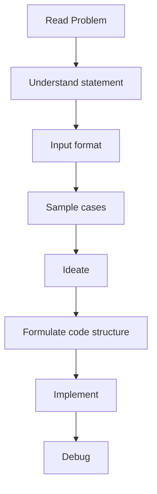

| Step | Goal | Time |
|---|---|---:|
| Read | statement + input + samples | 5 min |
| Ideate | brute force, pattern, constraints, eliminate | 25 min |
| Formulate | decide variables, functions, STL, parameters | 1-2 min |
| Code | implementation | 15-20 min |
| Debug | test and fix | 10 min |

### Intuition

Most CP problems are not about instantly writing code. They are about finding the hidden pattern.

```text
Understand problem
   ↓
Try brute force
   ↓
Check constraints
   ↓
Find bottleneck
   ↓
Replace bottleneck using known pattern
```

### Ideation checklist

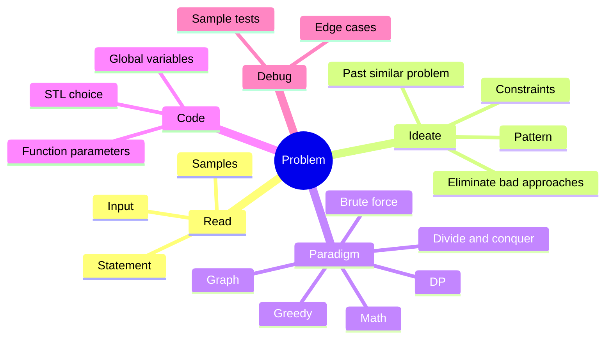

### Example

Problem:

```text
Given n numbers and q queries asking sum(l, r).
```

Brute force:

```text
For each query, loop from l to r.
O(nq)
```

If `n, q <= 2e5`, brute force fails.

Pattern:

```text
Repeated range sum on static array = prefix sum.
```

Optimized:

```text
Build prefix once in O(n)
Answer each query in O(1)
```

### One-minute mental trick

```text
n <= 100        brute force may pass
n <= 2e5        need O(n log n) or O(n)
n <= 1e6        usually O(n)
q large         precompute or use data structure
range query     prefix / Fenwick / segment tree
dynamic update  Fenwick / segment tree / balanced set
```

---

## 1. Balanced Brackets / Parentheses

### Core idea

For only `(` and `)`, maintain `depth`:

- `(` increases depth.
- `)` decreases depth.
- At the end, depth must be `0`.
- During scanning, depth must never become negative.

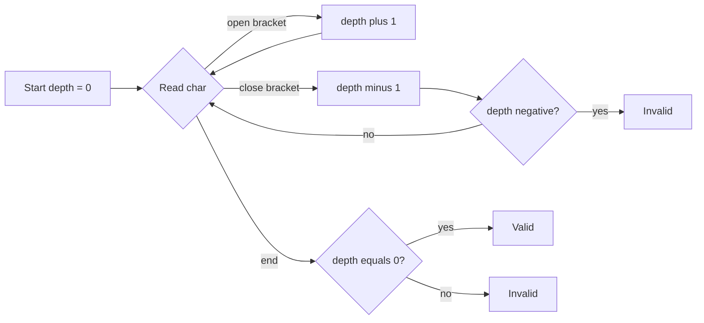

### Intuition

`depth` means how many open brackets are waiting to be closed.

Example:

```text
s = (()())
```

| char | depth |
|---|---:|
| `(` | 1 |
| `(` | 2 |
| `)` | 1 |
| `(` | 2 |
| `)` | 1 |
| `)` | 0 |

Valid.

Invalid example:

```text
s = ())( 
```

At the third character, `depth` becomes `-1`, meaning we closed more brackets than opened.

### C++: single bracket type

```cpp
#include <bits/stdc++.h>
using namespace std;

bool isBalancedParentheses(const string& s) {
    int depth = 0;

    for (char ch : s) {
        if (ch == '(') depth++;
        else if (ch == ')') depth--;

        if (depth < 0) return false;
    }

    return depth == 0;
}
```

### Dry Run And Mermaid Flow

#### Dry Run: Single bracket counter

Input:

```text
s = (()())
```

| Character | Action | Depth |
|---|---|---:|
| `(` | open, add one | 1 |
| `(` | open, add one | 2 |
| `)` | close, subtract one | 1 |
| `(` | open, add one | 2 |
| `)` | close, subtract one | 1 |
| `)` | close, subtract one | 0 |

Result: depth never becomes negative and final depth is zero, so valid.

#### Mermaid Dry Run Diagram

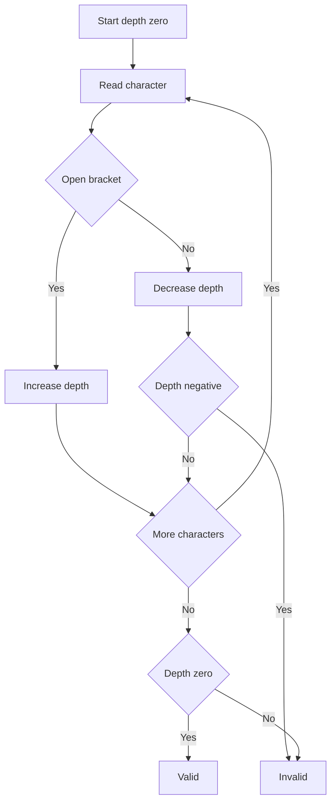


### Multiple bracket types

For `()`, `{}`, `[]`, use stack. The last opened bracket must match the first incoming closing bracket.

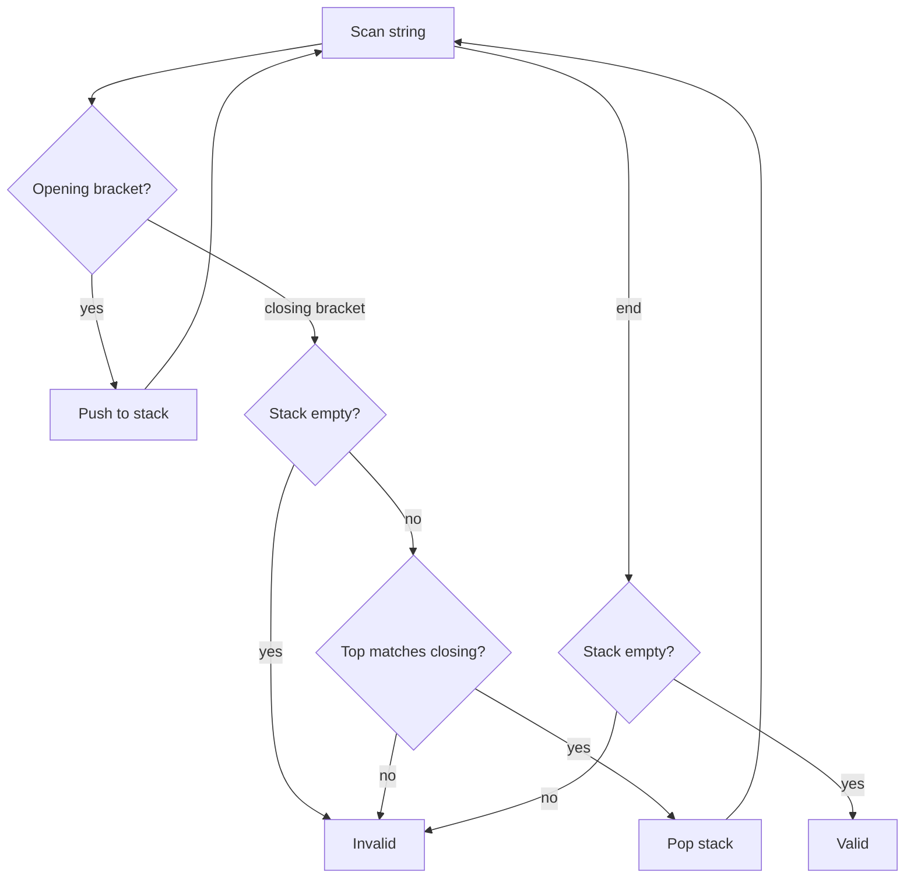

### Example

```text
[{()}]
```

Stack behavior:

```text
[      push [
{      push {
(      push (
)      top is (, pop
}      top is {, pop
]      top is [, pop
empty  valid
```

Bad example:

```text
[(])
```

At `]`, stack top is `(`, so mismatch.

### C++: stack + map

```cpp
#include <bits/stdc++.h>
using namespace std;

bool isBalanced(const string& s) {
    map<char, char> closeToOpen = {
        {')', '('},
        {'}', '{'},
        {']', '['}
    };

    stack<char> st;

    for (char ch : s) {
        if (ch == '(' || ch == '{' || ch == '[') {
            st.push(ch);
        } else if (closeToOpen.count(ch)) {
            if (st.empty() || st.top() != closeToOpen[ch]) return false;
            st.pop();
        }
    }

    return st.empty();
}
```

### Dry Run And Mermaid Flow

#### Dry Run: Multiple bracket stack

Input:

```text
s = [{()}]
```

| Character | Stack before | Action | Stack after |
|---|---|---|---|
| `[` | empty | push | `[` |
| `{` | `[` | push | `[ {` |
| `(` | `[ {` | push | `[ { (` |
| `)` | `[ { (` | match and pop | `[ {` |
| `}` | `[ {` | match and pop | `[` |
| `]` | `[` | match and pop | empty |

Result: stack is empty, so valid.

#### Mermaid Dry Run Diagram

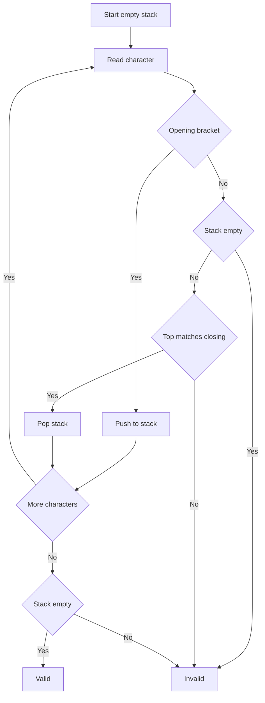


### Range query on balanced parentheses

For a range `[l, r]` in a parentheses string, using prefix depth:

- `depth[i]` = balance after processing index `i`.
- Range is balanced if:
  - `depth[l-1] == depth[r]`
  - minimum depth inside range never goes below `depth[l-1]`.

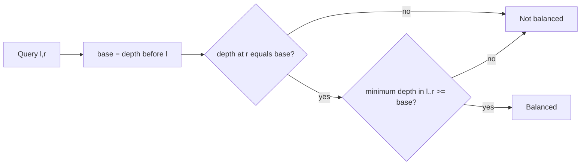

### One-minute mental trick

```text
One bracket type:
    use counter

Multiple bracket types:
    use stack

Range balanced query:
    prefix depth + range minimum
```

---

## 2. Sliding Window Subarray Maintenance

Sliding window is used when we need answers for every window/subarray of length `k`, such as:

- minimum / maximum in every window
- number of distinct elements
- median / mean of each window
- cost of each window

### General template

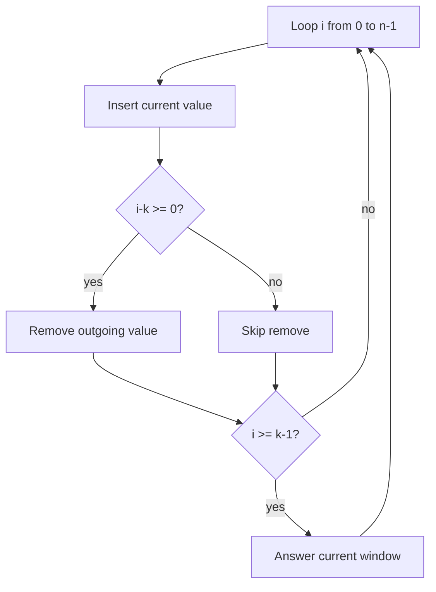

```cpp
for (int i = 0; i < n; i++) {
    ds.insert(arr[i]);

    if (i - k >= 0) {
        ds.erase(arr[i - k]);
    }

    if (i >= k - 1) {
        cout << ds.answer() << '\n';
    }
}
```

### Dry Run And Mermaid Flow

#### Dry Run: Fixed size window movement

Input:

```text
a = [4, 2, 1, 5, 3], k = 3
```

| i | Insert | Remove | Current window | Answer ready |
|---:|---:|---|---|---|
| 0 | 4 | none | `[4]` | no |
| 1 | 2 | none | `[4, 2]` | no |
| 2 | 1 | none | `[4, 2, 1]` | yes |
| 3 | 5 | 4 | `[2, 1, 5]` | yes |
| 4 | 3 | 2 | `[1, 5, 3]` | yes |

#### Mermaid Dry Run Diagram

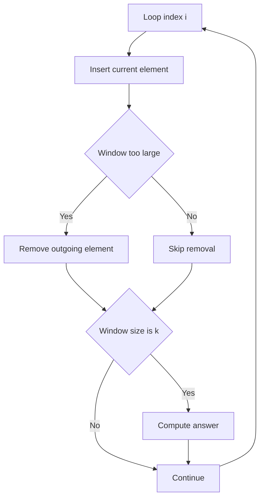


### Intuition

A fixed-size window moves like this:

```text
[0 ... k-1]
 [1 ... k]
  [2 ... k+1]
```

Every step:

```text
add new right element
remove old left element
calculate answer
```

### Example

```text
a = [4, 2, 1, 5, 3]
k = 3
```

Windows:

```text
[4, 2, 1]
[2, 1, 5]
[1, 5, 3]
```

If asking minimum:

```text
1, 1, 1
```

### One-minute mental trick

```text
Fixed length subarray?
    sliding window

Need min/max?
    monotonic deque

Need median/cost?
    two multisets

Need frequency/distinct?
    map/unordered_map

Need sum?
    running sum
```

---

## 3. Sliding Window Minimum

### Using multiset

Operations needed:

- insert incoming element
- remove outgoing element
- get minimum

```cpp
#include <bits/stdc++.h>
using namespace std;

vector<int> slidingWindowMinMultiset(vector<int>& a, int k) {
    multiset<int> ms;
    vector<int> ans;

    for (int i = 0; i < (int)a.size(); i++) {
        ms.insert(a[i]);

        if (i - k >= 0) {
            ms.erase(ms.find(a[i - k])); // erase only one occurrence
        }

        if (i >= k - 1) {
            ans.push_back(*ms.begin());
        }
    }

    return ans;
}
```

### Dry Run And Mermaid Flow

#### Dry Run: Multiset window minimum

Input:

```text
a = [4, 2, 1, 5, 3], k = 3
```

| i | Insert | Remove | Multiset | Minimum |
|---:|---:|---|---|---|
| 0 | 4 | none | `{4}` | not ready |
| 1 | 2 | none | `{2,4}` | not ready |
| 2 | 1 | none | `{1,2,4}` | 1 |
| 3 | 5 | 4 | `{1,2,5}` | 1 |
| 4 | 3 | 2 | `{1,3,5}` | 1 |

#### Mermaid Dry Run Diagram

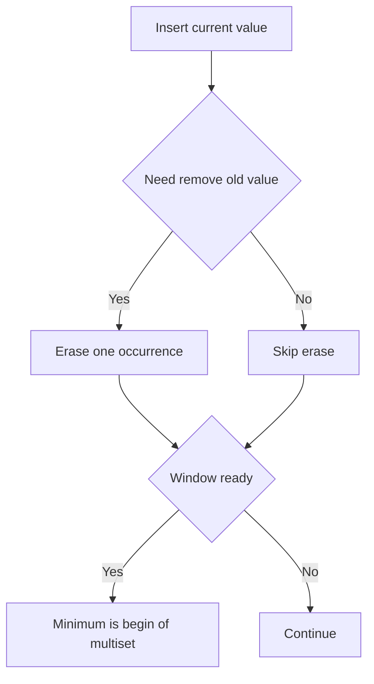


Complexity: `O(n log k)`.

### Using monotonic deque

Maintain elements in increasing order. The minimum is always at the front.

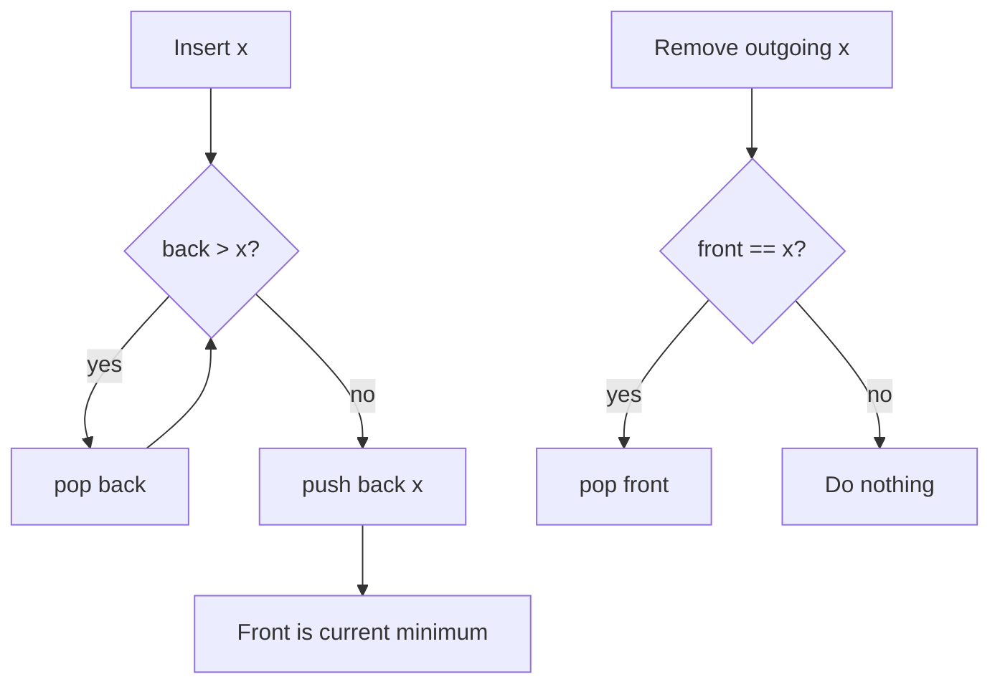

### Intuition

If a new element is smaller than previous elements, those previous elements can never become minimum while the new smaller element is still inside the window.

Example:

```text
arriving values: 4, 2, 1
```

Deque:

```text
insert 4 -> [4]
insert 2 -> remove 4 -> [2]
insert 1 -> remove 2 -> [1]
```

The old bigger values are useless for minimum.

### C++ monotonic deque

```cpp
#include <bits/stdc++.h>
using namespace std;

struct MonotoneMinDeque {
    deque<int> dq;

    void insert(int x) {
        while (!dq.empty() && dq.back() > x) dq.pop_back();
        dq.push_back(x);
    }

    void erase(int x) {
        if (!dq.empty() && dq.front() == x) dq.pop_front();
    }

    int getMin() const {
        return dq.front();
    }
};

vector<int> slidingWindowMin(vector<int>& a, int k) {
    MonotoneMinDeque ds;
    vector<int> ans;

    for (int i = 0; i < (int)a.size(); i++) {
        ds.insert(a[i]);

        if (i - k >= 0) ds.erase(a[i - k]);

        if (i >= k - 1) ans.push_back(ds.getMin());
    }

    return ans;
}
```

### Dry Run And Mermaid Flow

#### Dry Run: Monotonic deque minimum

Input:

```text
a = [4, 2, 1, 5, 3], k = 3
```

| i | x | Deque action | Deque after insert | Window min |
|---:|---:|---|---|---|
| 0 | 4 | push 4 | `[4]` | not ready |
| 1 | 2 | pop 4, push 2 | `[2]` | not ready |
| 2 | 1 | pop 2, push 1 | `[1]` | 1 |
| 3 | 5 | push 5 | `[1,5]` | 1 |
| 4 | 3 | pop 5, push 3 | `[1,3]` | 1 |

#### Mermaid Dry Run Diagram

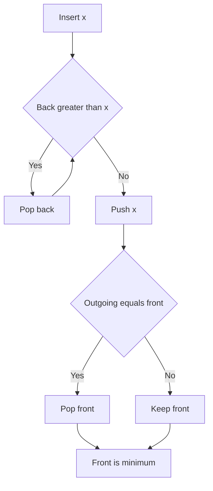


Complexity: `O(n)`.

### One-minute mental trick

```text
Sliding window min/max:
    multiset = easy O(n log k)
    deque = optimal O(n)

For minimum:
    increasing deque

For maximum:
    decreasing deque
```

---

## 4. Sliding Window Cost / Make All Elements Equal

Problem: for every window of size `k`, find minimum cost to make all elements equal, where cost is sum of absolute differences.

For values:

```text
a1, a2, ..., ak
```

Minimize:

```text
|x-a1| + |x-a2| + ... + |x-ak|
```

The minimum occurs at the median.

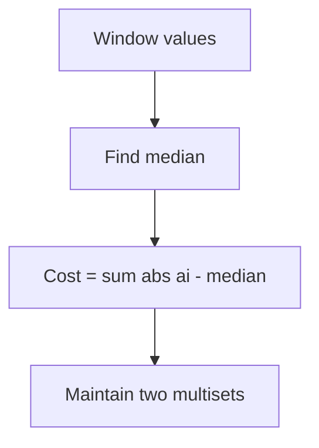

### Intuition

For absolute difference, the median is best because it balances how many values are on the left and right.

Example:

```text
[1, 2, 10]
```

Try making all equal to:

```text
1:  |1-1| + |2-1| + |10-1| = 10
2:  |1-2| + |2-2| + |10-2| = 9
10: |1-10| + |2-10| + |10-10| = 17
```

Median `2` gives the minimum cost.

### Data structure

Maintain two multisets:

- `lo`: smaller half, contains the median at `*lo.rbegin()`
- `hi`: larger half
- `leftSum`: sum of `lo`
- `rightSum`: sum of `hi`

Balance rule:

```text
lo.size() == hi.size() OR lo.size() == hi.size() + 1
```

Cost:

```text
leftCost  = median * lo.size() - leftSum
rightCost = rightSum - median * hi.size()
totalCost = leftCost + rightCost
```

### Example

```text
window = [1, 2, 10, 20, 30]
median = 10
```

Cost:

```text
|1-10| + |2-10| + |10-10| + |20-10| + |30-10|
= 9 + 8 + 0 + 10 + 20
= 47
```

With sets:

```text
lo = [1, 2, 10]
hi = [20, 30]
median = 10

leftCost = 10*3 - 13 = 17
rightCost = 50 - 10*2 = 30
total = 47
```

### C++

```cpp
#include <bits/stdc++.h>
using namespace std;

struct SlidingCost {
    multiset<long long> lo, hi;
    long long leftSum = 0, rightSum = 0;

    long long median() const {
        return *lo.rbegin();
    }

    void rebalance() {
        while (lo.size() < hi.size()) {
            auto it = hi.begin();
            long long x = *it;
            hi.erase(it);
            rightSum -= x;
            lo.insert(x);
            leftSum += x;
        }

        while (lo.size() > hi.size() + 1) {
            auto it = prev(lo.end());
            long long x = *it;
            lo.erase(it);
            leftSum -= x;
            hi.insert(x);
            rightSum += x;
        }
    }

    void insert(long long x) {
        if (lo.empty() || x <= median()) {
            lo.insert(x);
            leftSum += x;
        } else {
            hi.insert(x);
            rightSum += x;
        }
        rebalance();
    }

    void erase(long long x) {
        auto itLo = lo.find(x);
        if (itLo != lo.end()) {
            lo.erase(itLo);
            leftSum -= x;
        } else {
            auto itHi = hi.find(x);
            hi.erase(itHi);
            rightSum -= x;
        }
        rebalance();
    }

    long long cost() const {
        long long m = median();
        long long leftCost = m * (long long)lo.size() - leftSum;
        long long rightCost = rightSum - m * (long long)hi.size();
        return leftCost + rightCost;
    }
};
```

### Dry Run And Mermaid Flow

#### Dry Run: Median cost using two multisets

Input:

```text
window = [1, 2, 10, 20, 30]
```

| Set | Values | Sum |
|---|---|---:|
| lo | `1, 2, 10` | 13 |
| hi | `20, 30` | 50 |

| Step | Formula | Value |
|---|---|---:|
| median | max of lo | 10 |
| left cost | `10 * 3 - 13` | 17 |
| right cost | `50 - 10 * 2` | 30 |
| total | `17 + 30` | 47 |

#### Mermaid Dry Run Diagram

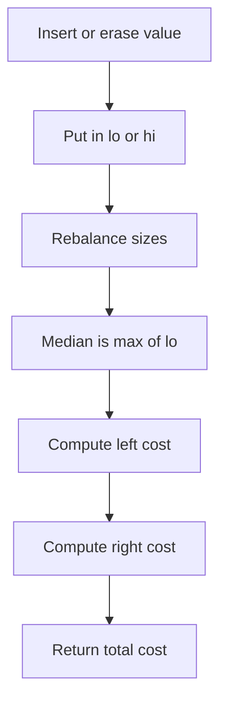


### One-minute mental trick

```text
Minimize sum of absolute differences:
    choose median

Minimize sum of squared differences:
    choose mean

Dynamic median:
    two multisets / two heaps
```

---

## 5. Mean, Variance, Median, Mode Dashboard

Design a dynamic structure supporting:

- `insert(x)`
- `remove(x)`
- `mean()`
- `variance()`
- `median()`
- `mode()`

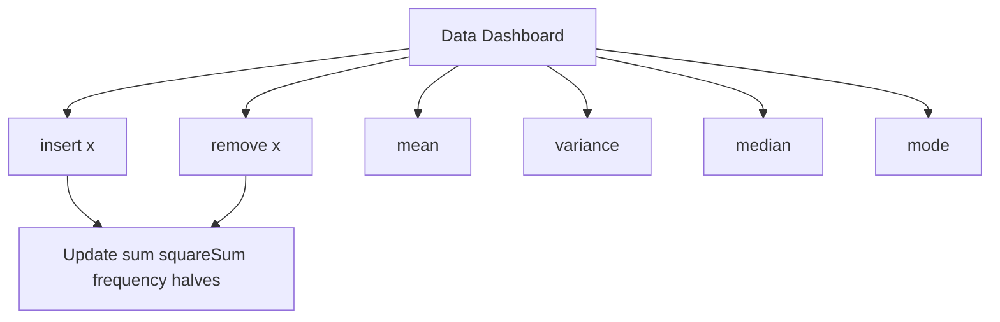

### Intuition

Different statistics need different maintained information.

| Query | What to maintain |
|---|---|
| mean | `sum`, `count` |
| variance | `sum`, `squareSum`, `count` |
| median | two balanced multisets |
| mode | frequency map + ordered frequency set |

### Formulas

```text
mean = sum / count
variance = (sum of squares / count) - mean^2
mode = element with highest frequency
median = middle value after sorting
```

### Example

Values:

```text
[1, 2, 2, 5]
```

Mean:

```text
(1+2+2+5)/4 = 2.5
```

Variance:

```text
squareSum = 1 + 4 + 4 + 25 = 34
variance = 34/4 - 2.5^2 = 8.5 - 6.25 = 2.25
```

Median:

```text
(2+2)/2 = 2
```

Mode:

```text
2
```

### C++ structure

```cpp
#include <bits/stdc++.h>
using namespace std;

struct DataDashboard {
    long long sum = 0, squareSum = 0;
    int count = 0;

    map<int, int> freq;
    multiset<pair<int, int>> freqOrder; // {frequency, value}

    multiset<int> lo, hi; // median halves

    void rebalanceMedian() {
        while (lo.size() < hi.size()) {
            int x = *hi.begin();
            hi.erase(hi.begin());
            lo.insert(x);
        }
        while (lo.size() > hi.size() + 1) {
            int x = *lo.rbegin();
            lo.erase(prev(lo.end()));
            hi.insert(x);
        }
    }

    void addToMedian(int x) {
        if (lo.empty() || x <= *lo.rbegin()) lo.insert(x);
        else hi.insert(x);
        rebalanceMedian();
    }

    void removeFromMedian(int x) {
        auto itLo = lo.find(x);
        if (itLo != lo.end()) lo.erase(itLo);
        else hi.erase(hi.find(x));
        rebalanceMedian();
    }

    void insert(int x) {
        count++;
        sum += x;
        squareSum += 1LL * x * x;

        if (freq[x] > 0) freqOrder.erase(freqOrder.find({freq[x], x}));
        freq[x]++;
        freqOrder.insert({freq[x], x});

        addToMedian(x);
    }

    void remove(int x) {
        count--;
        sum -= x;
        squareSum -= 1LL * x * x;

        freqOrder.erase(freqOrder.find({freq[x], x}));
        freq[x]--;
        if (freq[x] > 0) freqOrder.insert({freq[x], x});
        else freq.erase(x);

        removeFromMedian(x);
    }

    double mean() const {
        return (double)sum / count;
    }

    double variance() const {
        double mu = mean();
        return (double)squareSum / count - mu * mu;
    }

    double median() const {
        if (count % 2 == 1) return *lo.rbegin();
        return (*lo.rbegin() + *hi.begin()) / 2.0;
    }

    int mode() const {
        return freqOrder.rbegin()->second;
    }
};
```

### Dry Run And Mermaid Flow

#### Dry Run: Statistics dashboard updates

Input:

```text
insert 1, insert 2, insert 2, insert 5
```

| Operation | Count | Sum | Square sum | Mode |
|---|---:|---:|---:|---|
| insert 1 | 1 | 1 | 1 | 1 |
| insert 2 | 2 | 3 | 5 | 1 or 2 |
| insert 2 | 3 | 5 | 9 | 2 |
| insert 5 | 4 | 10 | 34 | 2 |

Final mean is `10 / 4 = 2.5`.
Final variance is `34 / 4 - 2.5 * 2.5 = 2.25`.

#### Mermaid Dry Run Diagram

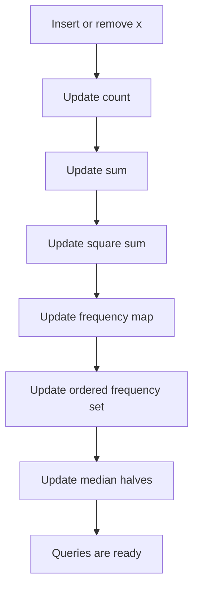


### One-minute mental trick

```text
mean      -> sum
variance  -> sum + squareSum
median    -> two halves
mode      -> frequency + max frequency
```

---

## 6. Prefix Sum and Subarray Sum Equals X

A subarray is a continuous segment of an array.

Number of subarrays in an array of size `n`:

```text
n * (n + 1) / 2
```

Using prefix sums:

```text
sum(l, r) = pref[r] - pref[l-1]
```

To count subarrays with sum `x`, for every `r` find how many previous prefix sums equal:

```text
pref[l-1] = pref[r] - x
```

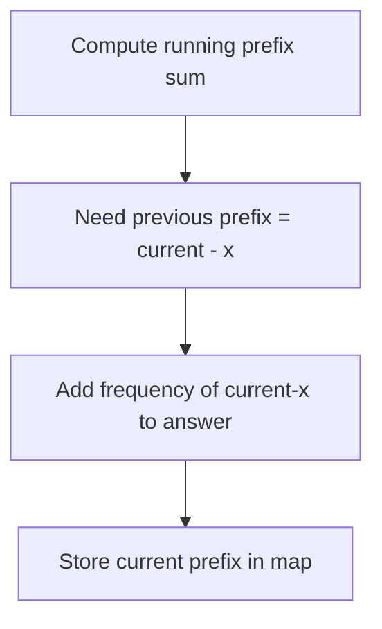

### Intuition

If:

```text
current prefix = sum from 0 to r
```

And we want a subarray ending at `r` with sum `x`, then the part before that subarray must be:

```text
current prefix - x
```

So we count how many times that previous prefix appeared.

### Example

```text
a = [1, 2, 3, -2, 5]
x = 3
```

Subarrays with sum 3:

```text
[1,2]
[3]
[2,3,-2]
[-2,5]
```

Answer:

```text
4
```

### C++ count only

```cpp
#include <bits/stdc++.h>
using namespace std;

long long countSubarraysWithSumX(vector<int>& a, long long x) {
    map<long long, long long> freq;
    freq[0] = 1;

    long long pref = 0, ans = 0;

    for (int v : a) {
        pref += v;
        ans += freq[pref - x];
        freq[pref]++;
    }

    return ans;
}
```

### Dry Run And Mermaid Flow

#### Dry Run: Count subarrays with target sum

Input:

```text
a = [1, 2, 3, -2, 5], x = 3
```

| i | value | prefix | need | previous need count | answer |
|---:|---:|---:|---:|---:|---:|
| 0 | 1 | 1 | -2 | 0 | 0 |
| 1 | 2 | 3 | 0 | 1 | 1 |
| 2 | 3 | 6 | 3 | 1 | 2 |
| 3 | -2 | 4 | 1 | 1 | 3 |
| 4 | 5 | 9 | 6 | 1 | 4 |

#### Mermaid Dry Run Diagram

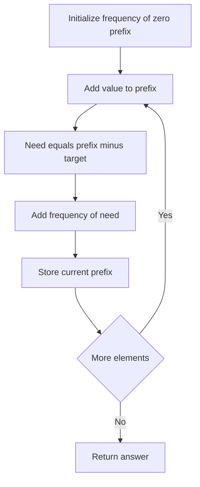


### C++ print all ranges

```cpp
#include <bits/stdc++.h>
using namespace std;

void printSubarraysWithSumX(vector<int>& a, long long x) {
    map<long long, vector<int>> pos;
    pos[0].push_back(-1);

    long long pref = 0;

    for (int i = 0; i < (int)a.size(); i++) {
        pref += a[i];

        long long need = pref - x;
        for (int leftMinusOne : pos[need]) {
            cout << "[" << leftMinusOne + 1 << ", " << i << "]\n";
        }

        pos[pref].push_back(i);
    }
}
```

### Dry Run And Mermaid Flow

#### Dry Run: Print all target-sum ranges

Input:

```text
a = [1, 2, 3], x = 3
```

| i | value | prefix | need | positions for need | printed range |
|---:|---:|---:|---:|---|---|
| 0 | 1 | 1 | -2 | none | none |
| 1 | 2 | 3 | 0 | `-1` | `[0,1]` |
| 2 | 3 | 6 | 3 | `1` | `[2,2]` |

#### Mermaid Dry Run Diagram

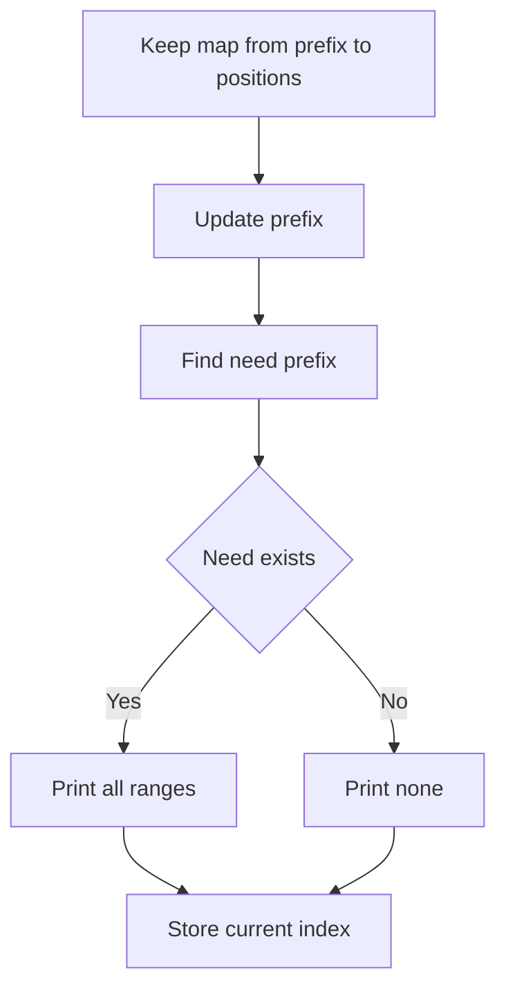


### One-minute mental trick

```text
Subarray sum:
    prefix sum

Count subarray sum = x:
    map previous prefixes

All positive numbers only:
    sliding window may work

Negative numbers allowed:
    prefix + map is safer
```

---

## 7. Stack Mastery Next Greater Element

For each index, find the next greater element to the right.

Use a monotonic stack of indices. Traverse from right to left.

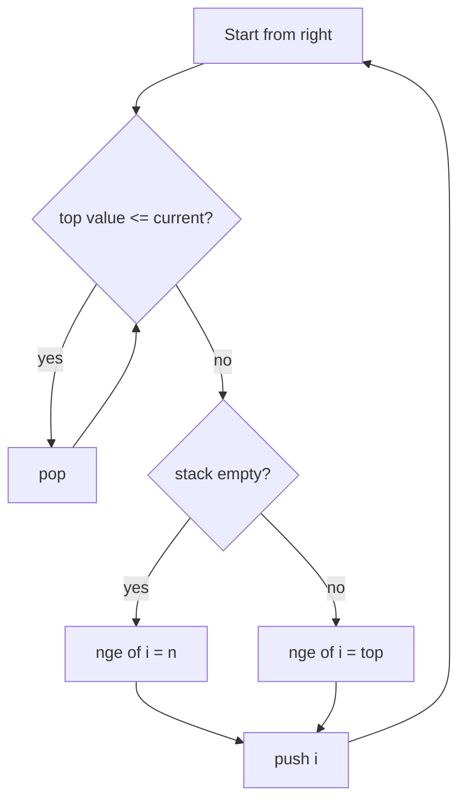

### Intuition

When scanning from right to left, the stack stores useful candidates for the next greater element.

If a candidate is less than or equal to the current value, it can never be the next greater for this or any earlier element blocked by current.

### Example

```text
a = [2, 1, 3, 2]
```

| i | value | next greater |
|---:|---:|---:|
| 0 | 2 | 3 |
| 1 | 1 | 3 |
| 2 | 3 | none |
| 3 | 2 | none |

### C++

```cpp
#include <bits/stdc++.h>
using namespace std;

vector<int> nextGreaterIndex(vector<int>& a) {
    int n = a.size();
    vector<int> nge(n, n);
    stack<int> st;

    for (int i = n - 1; i >= 0; i--) {
        while (!st.empty() && a[st.top()] <= a[i]) {
            st.pop();
        }

        if (!st.empty()) nge[i] = st.top();

        st.push(i);
    }

    return nge;
}
```

### Dry Run And Mermaid Flow

#### Dry Run: Next greater element

Input:

```text
a = [2, 1, 3, 2]
```

| i | value | Stack before | Action | Next greater |
|---:|---:|---|---|---|
| 3 | 2 | empty | push 2 | none |
| 2 | 3 | 2 | pop 2, push 3 | none |
| 1 | 1 | 3 | top is greater, push 1 | 3 |
| 0 | 2 | 3, 1 | pop 1, top is greater, push 2 | 3 |

#### Mermaid Dry Run Diagram

```mermaid
flowchart TD
    A[Scan from right] --> B[Current value]
    B --> C{Top less or equal current}
    C -->|Yes| D[Pop stack]
    D --> C
    C -->|No| E{Stack empty}
    E -->|Yes| F[No next greater]
    E -->|No| G[Top is answer]
    F --> H[Push current]
    G --> H
```


### One-minute mental trick

```text
Next greater/smaller:
    monotonic stack

To the right:
    scan right to left

To the left:
    scan left to right

Greater:
    pop smaller/equal

Smaller:
    pop greater/equal
```

---

## 8. Trapping Rain Water

For each bar, trapped water depends on boundary bars.

### Stack approach

When current bar is greater than the stack top, the popped bar can become the bottom of trapped water.

```mermaid
flowchart TD
    A[Loop i from 0 to n-1] --> B{top height < current height?}
    B -->|yes| C[bottom = pop]
    C --> D{stack empty?}
    D -->|yes| E[break]
    D -->|no| F[left = stack.top]
    F --> G[width = i-left-1]
    G --> H[bounded height = min left current - bottom]
    H --> I[ans += width*height]
    I --> B
    B -->|no| J[push i]
```

### Intuition

Water is trapped when we find:

```text
left wall + bottom + right wall
```

The current bar acts as the right wall. The stack top after popping acts as the left wall.

### Example

```text
height = [3, 0, 2, 0, 4]
```

Water trapped:

```text
index 1: min(3,4)-0 = 3
index 2: min(3,4)-2 = 1
index 3: min(3,4)-0 = 3
total = 7
```

### C++

```cpp
#include <bits/stdc++.h>
using namespace std;

int trapRainWater(vector<int>& h) {
    int n = h.size();
    int ans = 0;
    stack<int> st;

    for (int i = 0; i < n; i++) {
        while (!st.empty() && h[st.top()] < h[i]) {
            int bottom = st.top();
            st.pop();

            if (st.empty()) break;

            int left = st.top();
            int width = i - left - 1;
            int height = min(h[left], h[i]) - h[bottom];
            ans += width * height;
        }
        st.push(i);
    }

    return ans;
}
```

### Dry Run And Mermaid Flow

#### Dry Run: Water trapped by stack

Input:

```text
height = [3, 0, 2, 0, 4]
```

| i | height | Important action | Water added |
|---:|---:|---|---:|
| 0 | 3 | push index 0 | 0 |
| 1 | 0 | push index 1 | 0 |
| 2 | 2 | pop bottom index 1 | 2 |
| 3 | 0 | push index 3 | 0 |
| 4 | 4 | pop bottoms and use left wall | 5 |

Total water is `7`.

#### Mermaid Dry Run Diagram

```mermaid
flowchart TD
    A[Read current bar] --> B{Current higher than stack top}
    B -->|Yes| C[Pop bottom]
    C --> D{Stack empty}
    D -->|Yes| E[Stop inner loop]
    D -->|No| F[New top is left wall]
    F --> G[Compute width]
    G --> H[Compute bounded height]
    H --> I[Add water]
    I --> B
    B -->|No| J[Push current index]
```


### One-minute mental trick

```text
Water needs two walls.

When current height is bigger than stack top:
    current is right wall
    popped is bottom
    new stack top is left wall
```

---

## 9. Range Mapping / Interval Coverage

Range mapping is used when you maintain intervals like:

```text
[l, r]
```

Common operations:

1. Insert interval `[l, r]`
2. Delete interval `[l, r]`
3. Check whether point `x` is covered
4. Check whether query interval `[x, y]` is fully covered
5. Check whether any stored interval is inside `[x, y]`

---

### Core lower_bound and upper_bound idea

For sorted values:

```text
values = [1, 3, 3, 5, 8]
x = 3
```

```text
lower_bound(3) = first value >= 3 = index 1
upper_bound(3) = first value > 3  = index 3
```

```mermaid
flowchart TD
    A[Sorted values 1 3 3 5 8] --> B[Query x equals 3]
    B --> C[lower_bound finds first value greater or equal]
    C --> D[Index 1 value 3]
    B --> E[upper_bound finds first value strictly greater]
    E --> F[Index 3 value 5]
```

### Mental graph

```text
index:   0   1   2   3   4
value:   1   3   3   5   8
             ^       ^
             |       |
        lower_bound  upper_bound
```

---

### Problem A: Static intervals, check point coverage

Given many intervals and many point queries, check whether point `x` is covered by at least one interval.

An interval covers `x` if:

```text
l <= x <= r
```

So intervals not covering `x` are:

```text
r < x      ended before x
l > x      started after x
```

Formula:

```text
covered = total - count(r < x) - count(l > x)
```

### Flowchart

```mermaid
flowchart TD
    A[Store all starts and ends] --> B[Sort starts]
    B --> C[Sort ends]
    C --> D[For query point x]
    D --> E[endingBefore equals count of r less than x]
    D --> F[startingAfter equals count of l greater than x]
    E --> G[covered equals n minus endingBefore minus startingAfter]
    F --> G
    G --> H{covered positive}
    H -->|Yes| I[Point is covered]
    H -->|No| J[Point is not covered]
```

### C++

```cpp
#include <bits/stdc++.h>
using namespace std;

struct StaticIntervalCoverage {
    vector<int> starts, ends;

    StaticIntervalCoverage(vector<pair<int,int>>& intervals) {
        for (auto [l, r] : intervals) {
            starts.push_back(l);
            ends.push_back(r);
        }
        sort(starts.begin(), starts.end());
        sort(ends.begin(), ends.end());
    }

    bool isPointCovered(int x) {
        int n = starts.size();

        int endingBefore = lower_bound(ends.begin(), ends.end(), x) - ends.begin();
        int startingAfter = n - (upper_bound(starts.begin(), starts.end(), x) - starts.begin());

        int covered = n - endingBefore - startingAfter;
        return covered > 0;
    }
};
```

### Dry Run

Input:

```text
intervals = [1,3], [6,8], [2,7]
x = 5
```

Sorted arrays:

```text
starts = [1, 2, 6]
ends   = [3, 7, 8]
```

| Step | Expression | Result |
|---|---|---:|
| ending before `5` | `lower_bound(ends, 5)` points to `7` | 1 |
| starting after `5` | `upper_bound(starts, 5)` points to `6` | 1 |
| covered count | `3 - 1 - 1` | 1 |

Result: `5` is covered.

```mermaid
flowchart TD
    A[x equals 5] --> B[starts are 1 2 6]
    B --> C[upper_bound of 5 points to 6]
    C --> D[startingAfter equals 1]
    A --> E[ends are 3 7 8]
    E --> F[lower_bound of 5 points to 7]
    F --> G[endingBefore equals 1]
    D --> H[covered equals 3 minus 1 minus 1]
    G --> H
    H --> I[covered equals 1]
```

---

### Problem B: Dynamic insert, delete, check point, check full interval coverage

Use merged disjoint intervals.

Example:

```text
insert [1, 5]
insert [10, 15]
insert [4, 12]
```

After merging:

```text
[1, 15]
```

This structure supports:

```text
insertRange(l, r)
deleteRange(l, r)
isPointCovered(x)
isIntervalCovered(x, y)
```

### Why merged intervals help

If intervals are always merged and disjoint:

```text
[1, 5] [10, 15] [20, 30]
```

To check point `x`, find the interval with largest start `<= x`.

To check interval `[x, y]`, find the interval with largest start `<= x`, then check whether its end is `>= y`.

### Flowchart: point and interval query

```mermaid
flowchart TD
    A[Query x or query x y] --> B[Find first start greater than x]
    B --> C{Iterator is begin}
    C -->|Yes| D[No interval starts before x]
    C -->|No| E[Move one step back]
    E --> F[Candidate has largest start less or equal x]
    F --> G{Candidate end covers target}
    G -->|Yes| H[Covered]
    G -->|No| I[Not covered]
```

### Flowchart: insert range

```mermaid
flowchart TD
    A[Insert l r] --> B[Find first interval with start greater or equal l]
    B --> C[Check previous interval also]
    C --> D{Overlaps or touches}
    D -->|Yes| E[Merge boundaries]
    E --> F[Erase old interval]
    F --> D
    D -->|No| G[Insert final merged interval]
```

### Flowchart: delete range

```mermaid
flowchart TD
    A[Delete l r] --> B[Find possible overlapping interval]
    B --> C{Current interval overlaps delete range}
    C -->|No| D[Stop]
    C -->|Yes| E[Erase current interval]
    E --> F{Left piece exists}
    F -->|Yes| G[Add left piece]
    F -->|No| H[Skip left]
    G --> I{Right piece exists}
    H --> I
    I -->|Yes| J[Add right piece]
    I -->|No| K[Continue]
    J --> K
    K --> C
```

### C++: dynamic merged interval structure

```cpp
#include <bits/stdc++.h>
using namespace std;

struct RangeCover {
    map<int, int> mp; // start -> end, always disjoint and merged

    void insertRange(int l, int r) {
        if (l > r) swap(l, r);

        auto it = mp.upper_bound(l);

        if (it != mp.begin()) {
            auto prevIt = prev(it);
            if (prevIt->second >= l - 1) {
                l = min(l, prevIt->first);
                r = max(r, prevIt->second);
                it = mp.erase(prevIt);
            }
        }

        while (it != mp.end() && it->first <= r + 1) {
            r = max(r, it->second);
            it = mp.erase(it);
        }

        mp[l] = r;
    }

    void deleteRange(int l, int r) {
        if (l > r) swap(l, r);

        auto it = mp.upper_bound(l);
        if (it != mp.begin()) --it;

        vector<pair<int,int>> addBack;

        while (it != mp.end()) {
            int a = it->first;
            int b = it->second;

            if (b < l) {
                ++it;
                continue;
            }

            if (a > r) break;

            it = mp.erase(it);

            if (a < l) addBack.push_back({a, l - 1});
            if (r < b) addBack.push_back({r + 1, b});
        }

        for (auto [a, b] : addBack) {
            mp[a] = b;
        }
    }

    bool isPointCovered(int x) {
        auto it = mp.upper_bound(x);
        if (it == mp.begin()) return false;
        --it;
        return it->second >= x;
    }

    bool isIntervalCovered(int x, int y) {
        if (x > y) swap(x, y);

        auto it = mp.upper_bound(x);
        if (it == mp.begin()) return false;
        --it;
        return it->second >= y;
    }

    void print() {
        for (auto [l, r] : mp) {
            cout << "[" << l << "," << r << "] ";
        }
        cout << '\n';
    }
};
```

### Dry Run: insert and merge

Operations:

```text
insert [1,5]
insert [10,15]
insert [4,12]
```

| Operation | Intervals |
|---|---|
| insert `[1,5]` | `[1,5]` |
| insert `[10,15]` | `[1,5] [10,15]` |
| insert `[4,12]` | `[1,15]` |

```text
[4,12] overlaps [1,5]  -> merge to [1,12]
[1,12] overlaps [10,15] -> merge to [1,15]
```

```mermaid
flowchart TD
    A[Insert 4 12] --> B[Existing intervals 1 5 and 10 15]
    B --> C[Overlap with 1 5]
    C --> D[Merge to 1 12]
    D --> E[Overlap with 10 15]
    E --> F[Merge to 1 15]
    F --> G[Final interval 1 15]
```

### Dry Run: delete middle part

Current:

```text
[1,15]
```

Delete:

```text
[5,10]
```

Result:

```text
[1,4] [11,15]
```

```mermaid
flowchart TD
    A[Current interval 1 15] --> B[Delete 5 10]
    B --> C[Left remaining part 1 4]
    B --> D[Right remaining part 11 15]
    C --> E[Final intervals 1 4 and 11 15]
    D --> E
```

### Dry Run: point query and interval query

Current:

```text
[1,4] [11,15]
```

Queries:

| Query | Candidate interval | Result |
|---|---|---|
| point `3` | `[1,4]` | covered |
| point `8` | `[1,4]` | not covered |
| interval `[12,14]` | `[11,15]` | covered |
| interval `[3,12]` | `[1,4]` | not covered |

```mermaid
flowchart TD
    A[Query interval 12 14] --> B[upper_bound of start 12]
    B --> C[Move to previous interval]
    C --> D[Candidate 11 15]
    D --> E{15 greater or equal 14}
    E -->|Yes| F[Interval is fully covered]
```

---

### Problem C: Dynamic raw intervals, check whether any stored interval is inside query interval

Query meaning:

```text
Is there any stored interval [l, r] such that x <= l and r <= y?
```

Example:

```text
Stored: [1,10], [4,6], [8,20]
Query: [3,7]
Answer: yes, because [4,6] is inside [3,7]
```

Use raw intervals sorted by start:

```text
set<pair<int,int>> intervals
```

### Flowchart

```mermaid
flowchart TD
    A[Query x y] --> B[Find first interval with start greater or equal x]
    B --> C{Candidate exists}
    C -->|No| D[No interval inside]
    C -->|Yes| E{Candidate end less or equal y}
    E -->|Yes| F[Some interval is inside]
    E -->|No| G[No interval inside for simple set check]
```

### C++ simple version

```cpp
#include <bits/stdc++.h>
using namespace std;

struct RawIntervals {
    set<pair<int,int>> intervals;

    void insertInterval(int l, int r) {
        if (l > r) swap(l, r);
        intervals.insert({l, r});
    }

    void deleteInterval(int l, int r) {
        if (l > r) swap(l, r);
        intervals.erase({l, r});
    }

    bool hasIntervalInside(int x, int y) {
        if (x > y) swap(x, y);

        auto it = intervals.lower_bound({x, INT_MIN});
        if (it == intervals.end()) return false;

        return it->second <= y;
    }
};
```

### Dry Run

Stored intervals:

```text
[1,10], [4,6], [8,20]
```

Query:

```text
[3,7]
```

Sorted intervals:

```text
[1,10], [4,6], [8,20]
```

```text
lower_bound([3, -infinity]) gives [4,6]
6 <= 7, so [4,6] is inside [3,7]
```

```mermaid
flowchart TD
    A[Query 3 7] --> B[Find first start greater or equal 3]
    B --> C[Candidate interval 4 6]
    C --> D{6 less or equal 7}
    D -->|Yes| E[Inside interval found]
```

### Important note

The simple `set<pair<int,int>>` method works when checking the first interval with start `>= x` is enough for your problem setup. If intervals can have arbitrary ends and you need a fully general query, maintain a segment tree or ordered structure over starts with minimum end in suffix or range.

---

### Full practice driver

```cpp
#include <bits/stdc++.h>
using namespace std;

int main() {
    RangeCover rc;

    rc.insertRange(1, 5);
    rc.insertRange(10, 15);
    rc.insertRange(4, 12);

    rc.print(); // [1,15]

    cout << rc.isPointCovered(7) << '\n';       // 1
    cout << rc.isPointCovered(20) << '\n';      // 0
    cout << rc.isIntervalCovered(3, 14) << '\n';// 1

    rc.deleteRange(5, 10);
    rc.print(); // [1,4] [11,15]

    cout << rc.isIntervalCovered(3, 12) << '\n'; // 0
    cout << rc.isIntervalCovered(12, 14) << '\n';// 1

    RawIntervals raw;
    raw.insertInterval(1, 10);
    raw.insertInterval(4, 6);
    raw.insertInterval(8, 20);

    cout << raw.hasIntervalInside(3, 7) << '\n'; // 1
}
```

---

### One-minute mental trick

```text
Static intervals plus point queries:
    sort starts and ends

Dynamic merged coverage:
    map start to end

Check point x:
    find largest start <= x

Check interval [x,y] fully covered:
    find largest start <= x, then end >= y

Check any interval inside [x,y]:
    find first start >= x, then end <= y

Need heavy range query with many updates:
    coordinate compression plus Fenwick or segment tree
```

---

## 10. Top K Sum

Maintain sum of top `k` elements dynamically.

Two common implementations:

1. Priority queue: good when only removing min/max from top side.
2. Two multisets: better when arbitrary `remove(x)` is needed.

### Two multiset method

- `top`: contains the largest `k` elements.
- `rest`: contains the overflow elements.
- `sumTop`: sum of elements in `top`.

```mermaid
flowchart TD
    A[Insert x] --> B[Put into top]
    B --> C[Balance]
    C --> D{top size > k?}
    D -->|yes| E[Move smallest top to rest]
    D -->|no| F{top size < k and rest nonempty?}
    F -->|yes| G[Move largest rest to top]
    F -->|no| H[Done]
    E --> C
    G --> C
```

### Intuition

Always keep the largest `k` values in one bucket.

If a new big value enters, a smaller value may be pushed out.

### Example

```text
k = 3
values = [5, 1, 10, 3, 8]
```

Top 3:

```text
10, 8, 5
```

Sum:

```text
23
```

### C++

```cpp
#include <bits/stdc++.h>
using namespace std;

struct TopKSum {
    int k;
    long long sumTop = 0;
    multiset<int> top, rest;

    TopKSum(int k) : k(k) {}

    void balance() {
        while ((int)top.size() > k) {
            auto it = top.begin();
            int x = *it;
            sumTop -= x;
            top.erase(it);
            rest.insert(x);
        }

        while ((int)top.size() < k && !rest.empty()) {
            auto it = prev(rest.end());
            int x = *it;
            rest.erase(it);
            top.insert(x);
            sumTop += x;
        }

        while (!top.empty() && !rest.empty() && *top.begin() < *rest.rbegin()) {
            int smallTop = *top.begin();
            int bigRest = *rest.rbegin();

            top.erase(top.begin());
            rest.erase(prev(rest.end()));

            top.insert(bigRest);
            rest.insert(smallTop);

            sumTop += bigRest - smallTop;
        }
    }

    void insert(int x) {
        top.insert(x);
        sumTop += x;
        balance();
    }

    void remove(int x) {
        auto itTop = top.find(x);
        if (itTop != top.end()) {
            top.erase(itTop);
            sumTop -= x;
        } else {
            auto itRest = rest.find(x);
            if (itRest != rest.end()) rest.erase(itRest);
        }
        balance();
    }

    long long getSum() const {
        return sumTop;
    }
};
```

### Dry Run And Mermaid Flow

#### Dry Run: Maintain top k sum

Input:

```text
k = 3, insert values [5, 1, 10, 3, 8]
```

| Insert | top | rest | sumTop |
|---:|---|---|---:|
| 5 | `5` | empty | 5 |
| 1 | `1,5` | empty | 6 |
| 10 | `1,5,10` | empty | 16 |
| 3 | `3,5,10` | `1` | 18 |
| 8 | `5,8,10` | `1,3` | 23 |

#### Mermaid Dry Run Diagram

```mermaid
flowchart TD
    A[Insert value] --> B[Put into top]
    B --> C[Balance size]
    C --> D{Top larger than k}
    D -->|Yes| E[Move smallest top to rest]
    D -->|No| F{Rest has larger value}
    E --> F
    F -->|Yes| G[Swap smallest top and largest rest]
    F -->|No| H[sumTop is answer]
    G --> H
```


### One-minute mental trick

```text
Need top k dynamically?
    top bucket + rest bucket

Need arbitrary erase?
    multiset

Only insert/extract max?
    priority_queue
```

---

## 11. Priority Queue Notes

Default C++ `priority_queue<int>` is a max heap.

```cpp
priority_queue<int> maxHeap;
```

For min heap:

```cpp
priority_queue<int, vector<int>, greater<int>> minHeap;
```

Trick: you can insert negative values in a max heap to simulate a min heap.

```cpp
priority_queue<int> pq;
pq.push(-x);      // insert x
int minimum = -pq.top();
```

Always check before popping:

```cpp
if (!pq.empty()) {
    pq.pop();
}
```

### Intuition

A priority queue is useful when you only care about the current best item:

```text
largest
smallest
highest priority
lowest cost
```

It is not good when you need to erase arbitrary values unless you use lazy deletion.

### Example use cases

| Problem | Heap type |
|---|---|
| kth largest | min heap of size k |
| Dijkstra shortest path | min heap |
| task scheduler | max heap |
| merge k sorted lists | min heap |

### One-minute mental trick

```text
Need repeatedly best element?
    priority_queue

Need sorted traversal or arbitrary erase?
    set / multiset

Need both min and max?
    multiset
```

---

## 12. Stack and Queue Basics

### Stack

LIFO: last in, first out.

```cpp
stack<int> st;
st.push(x);
st.pop();
int top = st.top();
bool empty = st.empty();
```

### Queue

FIFO: first in, first out.

```cpp
queue<int> q;
q.push(x);
q.pop();
int front = q.front();
bool empty = q.empty();
```

### Visual

```mermaid
flowchart LR
    subgraph Stack[LIFO Stack]
        S3[3 top]
        S2[2]
        S1[1 bottom]
    end

    subgraph Queue[FIFO Queue]
        Q1[1 front] --> Q2[2] --> Q3[3 back]
    end
```

### Implement stack using two queues

Costly pop version:

```cpp
#include <bits/stdc++.h>
using namespace std;

struct StackUsingQueues {
    queue<int> q1, q2;

    void push(int x) {
        q1.push(x);
    }

    int pop() {
        while (q1.size() > 1) {
            q2.push(q1.front());
            q1.pop();
        }
        int ans = q1.front();
        q1.pop();
        swap(q1, q2);
        return ans;
    }

    int top() {
        while (q1.size() > 1) {
            q2.push(q1.front());
            q1.pop();
        }
        int ans = q1.front();
        q2.push(ans);
        q1.pop();
        swap(q1, q2);
        return ans;
    }

    bool empty() const {
        return q1.empty();
    }
};
```

### Dry Run And Mermaid Flow

#### Dry Run: Stack using two queues

Input:

```text
push 1, push 2, push 3, pop
```

| Step | q1 | q2 | Action |
|---|---|---|---|
| start | `1,2,3` | empty | need pop |
| move | `3` | `1,2` | move until one left |
| pop | empty | `1,2` | pop 3 |
| swap | `1,2` | empty | restore q1 |

Returned value is `3`.

#### Mermaid Dry Run Diagram

```mermaid
flowchart TD
    A[Pop stack using queues] --> B{q1 size greater than one}
    B -->|Yes| C[Move front from q1 to q2]
    C --> B
    B -->|No| D[Remaining front is stack top]
    D --> E[Pop it]
    E --> F[Swap q1 and q2]
    F --> G[Return value]
```


### One-minute mental trick

```text
Stack:
    reverse order
    nested structures
    monotonic problems

Queue:
    process in arrival order
    BFS
    level order
```

---

## 13. Contribution Technique

Instead of enumerating every subarray/subsequence, calculate how much each element contributes to the final answer.

```mermaid
mindmap
  root((Contribution Technique))
    Sum of all subarrays
    Sum of all subsequences
    Pair contribution
      Inversions
      Pairwise counts
    Extended contribution
      Product of subarrays
```

### Intuition

When too many objects exist, count contribution from each element instead.

Instead of:

```text
For every subarray, add all elements
```

Think:

```text
For every element, count how many subarrays contain it
```

### Sum of all subarrays

Element `a[i]` appears in:

```text
(i + 1) * (n - i)
```

subarrays.

So:

```text
answer = Σ a[i] * (i + 1) * (n - i)
```

### Example

```text
a = [1, 2, 3]
```

All subarrays:

```text
[1]       sum 1
[1,2]     sum 3
[1,2,3]   sum 6
[2]       sum 2
[2,3]     sum 5
[3]       sum 3
total = 20
```

Contribution:

```text
1 appears 3 times -> 1*3 = 3
2 appears 4 times -> 2*4 = 8
3 appears 3 times -> 3*3 = 9
total = 20
```

### C++

```cpp
long long sumOfAllSubarrays(vector<int>& a) {
    long long ans = 0;
    int n = a.size();

    for (int i = 0; i < n; i++) {
        ans += 1LL * a[i] * (i + 1) * (n - i);
    }

    return ans;
}
```

### Dry Run And Mermaid Flow

#### Dry Run: Sum of all subarrays by contribution

Input:

```text
a = [1, 2, 3]
```

| i | value | left choices | right choices | contribution |
|---:|---:|---:|---:|---:|
| 0 | 1 | 1 | 3 | 3 |
| 1 | 2 | 2 | 2 | 8 |
| 2 | 3 | 3 | 1 | 9 |

Total is `20`.

#### Mermaid Dry Run Diagram

```mermaid
flowchart TD
    A[Pick index i] --> B[Count left choices]
    B --> C[Count right choices]
    C --> D[Multiply by value]
    D --> E[Add to answer]
    E --> F{More elements}
    F -->|Yes| A
    F -->|No| G[Return total]
```


### Sum of all subsequences

Each element appears in `2^(n-1)` subsequences.

```text
answer = Σ a[i] * 2^(n-1)
```

```cpp
long long sumOfAllSubsequences(vector<int>& a) {
    int n = a.size();
    long long ways = 1LL << (n - 1); // only safe for small n

    long long ans = 0;
    for (int x : a) ans += x * ways;

    return ans;
}
```

### Dry Run And Mermaid Flow

#### Dry Run: Sum of all subsequences

Input:

```text
a = [1, 2, 3]
```

| Element | Appears in how many subsequences | Contribution |
|---:|---:|---:|
| 1 | 4 | 4 |
| 2 | 4 | 8 |
| 3 | 4 | 12 |

Total is `24`.

#### Mermaid Dry Run Diagram

```mermaid
flowchart TD
    A[For each element] --> B[Each appears in power of two choices]
    B --> C[Multiply element by ways]
    C --> D[Add contribution]
    D --> E[Return total]
```


### Product of all subarrays sum

For each ending position, maintain sum of products of all subarrays ending there.

```text
sop = sop * a[i] + a[i]
ans += sop
```

### Example

```text
a = [2, 3, 4]
```

At `2`:

```text
subarrays ending here: [2]
sop = 2
```

At `3`:

```text
previous products extended by 3: [2,3] product 6
new subarray: [3] product 3
sop = 6 + 3 = 9
```

At `4`:

```text
extend previous ending products by 4: 9*4 = 36
new [4] = 4
sop = 40
```

Total:

```text
2 + 9 + 40 = 51
```

### C++

```cpp
long long sumProductOfAllSubarrays(vector<int>& a) {
    long long ans = 0;
    long long sop = 0;

    for (long long x : a) {
        sop = sop * x + x;
        ans += sop;
    }

    return ans;
}
```

### Dry Run And Mermaid Flow

#### Dry Run: Sum product of all subarrays

Input:

```text
a = [2, 3, 4]
```

| x | Previous sop | New sop | Answer |
|---:|---:|---:|---:|
| 2 | 0 | 2 | 2 |
| 3 | 2 | 9 | 11 |
| 4 | 9 | 40 | 51 |

Formula: `sop = sop * x + x`.

#### Mermaid Dry Run Diagram

```mermaid
flowchart TD
    A[Read x] --> B[Extend previous products]
    B --> C[Add new single element subarray]
    C --> D[Update sop]
    D --> E[Add sop to answer]
    E --> F{More elements}
    F -->|Yes| A
    F -->|No| G[Return answer]
```


### One-minute mental trick

```text
Too many subarrays/subsequences?
    don't generate them

Ask:
    how many times does this element/pair contribute?
```

---

## 14. Pattern Matching / Coordinate Geometry Printing

For star-pattern questions, first define the canvas:

- rows
- columns
- coordinates `(i, j)`

Then write a function deciding whether a coordinate prints `*` or space.

```mermaid
flowchart TD
    A[Pattern Question] --> B[Define canvas rows x cols]
    B --> C[Loop over i rows]
    C --> D[Loop over j cols]
    D --> E{func i,j true?}
    E -->|yes| F[print star]
    E -->|no| G[print space]
```

### Intuition

Pattern problems are coordinate geometry problems.

Instead of guessing spaces, ask:

```text
At coordinate (i, j), should I print star?
```

### Template

```cpp
#include <bits/stdc++.h>
using namespace std;

bool printStar(int i, int j, int rows, int cols) {
    // Example: main diagonal
    return i == j;
}

int main() {
    int rows = 5, cols = 5;

    for (int i = 0; i < rows; i++) {
        for (int j = 0; j < cols; j++) {
            cout << (printStar(i, j, rows, cols) ? '*' : ' ');
        }
        cout << '\n';
    }
}
```

### Dry Run And Mermaid Flow

#### Dry Run: Coordinate based star printing

Input:

```text
rows = 5, cols = 5, condition i equals j
```

| Cell | Condition | Printed |
|---|---|---|
| `(0,0)` | true | star |
| `(0,1)` | false | space |
| `(1,1)` | true | star |
| `(2,2)` | true | star |

#### Mermaid Dry Run Diagram

```mermaid
flowchart TD
    A[Loop row i] --> B[Loop column j]
    B --> C{Condition true}
    C -->|Yes| D[Print star]
    C -->|No| E[Print space]
    D --> F{More columns}
    E --> F
    F -->|Yes| B
    F -->|No| G[Next row]
```


Output:

```text
*
 *
  *
   *
    *
```

### Common conditions

| Pattern | Condition |
|---|---|
| main diagonal | `i == j` |
| anti diagonal | `i + j == n - 1` |
| border | `i == 0 || j == 0 || i == n-1 || j == m-1` |
| upper triangle | `i <= j` |
| lower triangle | `i >= j` |

### Repeating columns

To repeat after every `k` columns, use modulo:

```cpp
func(i, j % k, rows, k);
```

### One-minute mental trick

```text
Pattern printing:
    stop thinking in spaces
    think in coordinates

Ask:
    when should this cell be star?
```

---

## 15. Molecular Formula Parser

Problem type: parse chemical formula like:

```text
K4(ON(SO3)2)2
```

Expected output is sorted by element names with counts.

### Key ideas

- Use recursion for bracketed subproblems.
- Use `map<string,int>` because final output needs sorted keys.
- Parse element names: capital letter followed by lowercase letters.
- Parse number after element/bracket; default count is `1`.
- Merge maps by adding counts.

```mermaid
flowchart TD
    A[parse range l..r] --> B{Current char}
    B -->|Capital letter| C[Parse element]
    C --> D[Parse number if any]
    D --> E[Add to map]
    B -->|open parenthesis| F[Find matching bracket]
    F --> G[Parse inside recursively]
    G --> H[Parse multiplier]
    H --> I[Multiply inside map]
    I --> J[Merge]
    E --> A
    J --> A
```

### Intuition

Parentheses create a smaller independent formula. Solve inside first, then multiply.

Example:

```text
Mg(OH)2
```

Inside parentheses:

```text
O:1, H:1
```

Multiplier:

```text
2
```

After multiplying:

```text
O:2, H:2
```

Add outside:

```text
Mg:1
```

Final:

```text
H2MgO2
```

### C++ parser

```cpp
#include <bits/stdc++.h>
using namespace std;

class FormulaParser {
public:
    string s;
    int n;

    int readNumber(int& i) {
        int num = 0;
        while (i < n && isdigit(s[i])) {
            num = num * 10 + (s[i] - '0');
            i++;
        }
        return num == 0 ? 1 : num;
    }

    string readElement(int& i) {
        string name;
        name += s[i++]; // capital letter
        while (i < n && islower(s[i])) {
            name += s[i++];
        }
        return name;
    }

    map<string, int> parse(int& i) {
        map<string, int> result;

        while (i < n && s[i] != ')') {
            if (isupper(s[i])) {
                string element = readElement(i);
                int count = readNumber(i);
                result[element] += count;
            } else if (s[i] == '(') {
                i++; // skip '('
                auto inside = parse(i);
                i++; // skip ')'
                int multiplier = readNumber(i);

                for (auto [element, count] : inside) {
                    result[element] += count * multiplier;
                }
            }
        }

        return result;
    }

    string countOfAtoms(string formula) {
        s = formula;
        n = s.size();
        int i = 0;
        auto counts = parse(i);

        string ans;
        for (auto [element, count] : counts) {
            ans += element;
            if (count > 1) ans += to_string(count);
        }
        return ans;
    }
};
```

### Dry Run And Mermaid Flow

#### Dry Run: Parse chemical formula

Input:

```text
formula = Mg(OH)2
```

| Step | Token | Action | Count map |
|---:|---|---|---|
| 1 | `Mg` | add element | `Mg:1` |
| 2 | `(` | parse inside | inside map starts |
| 3 | `O` | add inside | `O:1` |
| 4 | `H` | add inside | `O:1 H:1` |
| 5 | `)2` | multiply inside | `O:2 H:2` |
| 6 | merge | merge maps | `H:2 Mg:1 O:2` |

#### Mermaid Dry Run Diagram

```mermaid
flowchart TD
    A[Start parse] --> B{Current character}
    B -->|Capital| C[Read element]
    C --> D[Read number]
    D --> E[Add count]
    B -->|Open parenthesis| F[Parse inside recursively]
    F --> G[Read multiplier]
    G --> H[Multiply inside map]
    H --> I[Merge map]
    E --> J{More characters}
    I --> J
    J -->|Yes| B
    J -->|No| K[Return map]
```


### One-minute mental trick

```text
Nested parentheses/brackets:
    recursion or stack

Need sorted output:
    map

Default count:
    if no number, count = 1
```

---


## 15A. Largest Rectangle in Histogram

Find largest rectangle area in histogram.

### Core Idea

For every bar:

```text
height = current bar
width = nearest smaller on left/right
```

Use monotonic increasing stack.

---

### Invariant

```text
Stack always stores increasing heights.
```

---

### Mermaid Flow

```mermaid
flowchart TD
    A[Loop through bars] --> B{Current height smaller than stack top}
    B -->|Yes| C[Pop height]
    C --> D[Calculate width]
    D --> E[Update max area]
    E --> B
    B -->|No| F[Push current index]
```

---

### Formula

For popped index:

```text
height = h[idx]
right = current index
left = new stack top
width = right - left - 1
area = height * width
```

---

### Example

```text
heights = [2,1,5,6,2,3]
```

Maximum rectangle:

```text
5 x 2 = 10
```

---

### C++ Code

```cpp
#include <bits/stdc++.h>
using namespace std;

int largestRectangleArea(vector<int>& h) {
    stack<int> st;
    int n = h.size();
    int ans = 0;

    for (int i = 0; i <= n; i++) {
        int cur = (i == n ? 0 : h[i]);

        while (!st.empty() && h[st.top()] > cur) {
            int height = h[st.top()];
            st.pop();

            int right = i;
            int left = st.empty() ? -1 : st.top();

            int width = right - left - 1;

            ans = max(ans, height * width);
        }

        st.push(i);
    }

    return ans;
}
```

---

### Dry Run

| i | Current | Stack | Action | Max Area |
|---|---|---|---|---|
| 0 | 2 | 0 | push | 2 |
| 1 | 1 | empty | pop 2 | 2 |
| 2 | 5 | 1,2 | push | 5 |
| 3 | 6 | 1,2,3 | push | 6 |
| 4 | 2 | 1 | pop 6, pop 5 | 10 |
| 5 | 3 | 1,4,5 | push | 10 |

---

### Mental Trick

```text
Nearest smaller left/right
+
Monotonic increasing stack
=
Largest histogram rectangle
```


## 16. Choosing the Right STL

| Need | STL / Technique |
|---|---|
| LIFO | `stack` |
| FIFO | `queue` |
| min/max top only | `priority_queue` |
| sorted values + duplicates + arbitrary erase | `multiset` |
| key-value frequency | `map` / `unordered_map` |
| range coverage / merged intervals | `set<pair<int,int>>` |
| window min/max in O(n) | monotonic deque |
| next greater/smaller | monotonic stack |
| subarray sum equals x | prefix sum + map |
| median dynamically | two multisets |
| top k dynamically with remove | two multisets |

### STL decision diagram

```mermaid
flowchart TB
    A[What do you need?] --> B{Order matters?}
    B -->|LIFO| ST[stack]
    B -->|FIFO| QU[queue]
    B -->|sorted order| SE[set / multiset]
    B -->|top priority only| PQ[priority_queue]
    B -->|key-value count| MP[map / unordered_map]
    B -->|range query/update| FW[Fenwick / Segment Tree]
    B -->|window min/max| DQ[monotonic deque]
```

### One-minute mental trick

```text
Can I delete arbitrary element?
    yes -> set/multiset
    no  -> heap may work

Need order statistics?
    PBDS / Fenwick / segment tree

Need frequency?
    map

Need nearest greater/smaller?
    stack
```

---

## 17. Common Mistakes

- Using `mset.erase(x)` when you only want to erase one copy. Use `mset.erase(mset.find(x))`.
- Calling `top()`, `front()`, `back()`, `pop()` on an empty STL container.
- Forgetting `i + k` is usually exclusive in window ranges.
- For sliding window, forgetting to remove `arr[i-k]`.
- For prefix sums, forgetting to initialize `freq[0] = 1`.
- For maps/multisets, forgetting logarithmic complexity.
- In custom comparators, never return true for equal items; it may cause runtime issues.

### Mistake examples

Wrong:

```cpp
multiset<int> ms = {5, 5, 5};
ms.erase(5); // removes all 5s
```

Correct:

```cpp
auto it = ms.find(5);
if (it != ms.end()) {
    ms.erase(it); // removes one 5
}
```

Wrong:

```cpp
stack<int> st;
cout << st.top(); // crash / undefined behavior
```

Correct:

```cpp
if (!st.empty()) {
    cout << st.top();
}
```

### One-minute mental trick

```text
Before using STL top/front/back:
    check empty

Before erase in multiset:
    erase iterator, not value

Before prefix-map subarray count:
    freq[0] = 1
```

---

## 18. Final Revision Flow

```mermaid
flowchart TD
    A[New Problem] --> B{Is it about subarray/window?}
    B -->|fixed size k| C[Sliding Window]
    B -->|sum x| D[Prefix Sum + Map]
    A --> E{Nearest greater/smaller?}
    E -->|yes| F[Monotonic Stack]
    A --> G{Dynamic median/top k?}
    G -->|median| H[Two Multisets]
    G -->|top k| I[Two Multisets / PQ]
    A --> J{Intervals?}
    J -->|coverage| K[Sorted endpoints or set of merged ranges]
    A --> L{Nested formula/brackets?}
    L -->|yes| M[Stack or Recursion]
    A --> N{Too many subarrays/subsequences?}
    N -->|yes| O[Contribution Technique]
```

### Quick pattern recognition table

| Problem clue | Think |
|---|---|
| fixed size k | sliding window |
| range sum query | prefix sum |
| subarray sum equals x | prefix sum + map |
| next greater/smaller | monotonic stack |
| min/max in every window | monotonic deque |
| dynamic median | two multisets |
| top k sum | two multisets |
| intervals merging | set of intervals |
| nested brackets/formula | stack / recursion |
| all subarrays/subsequences | contribution technique |

---

## 19. Minimal C++ Setup

```cpp
#include <bits/stdc++.h>
using namespace std;

using ll = long long;

int main() {
    ios::sync_with_stdio(false);
    cin.tie(nullptr);

    // solve here

    return 0;
}
```

---

## 20. One-Minute CP Mental Checklist

Before coding, ask:

```text
1. What is n?
2. What is q?
3. Is data static or dynamic?
4. Are there range queries?
5. Are there updates?
6. Are values positive, negative, or mixed?
7. Is order important?
8. Do I need min/max/median/mode?
9. Can I process offline?
10. Which STL gives needed operations?
```

### Final memory hook

```mermaid
mindmap
  root((CP Mental Tricks))
    Range sum
      Prefix sum
    Range update
      Difference array
    Dynamic range query
      Fenwick
      Segment tree
    Window
      Sliding window
      Deque
      Multiset
    Nearest greater
      Monotonic stack
    Median
      Two multisets
    Top K
      Heap
      Two multisets
    Intervals
      Sort endpoints
      Set merged ranges
    Nested parsing
      Stack
      Recursion
    Too many objects
      Contribution
```

---

## 21. Final Golden Rules

```text
Start brute force.
Use constraints to reject brute force.
Name the pattern.
Choose STL by required operations.
Keep templates short.
Test edge cases.
Never trust first AC-looking code without dry run.
```