# Binary Search Visual Notes — C++ Reference + Java Helpers

> Visual-learning version with architectural Mermaid diagrams, contest intuition, C++ templates, and a few Java equivalents.

---

## 0. One-Minute Mental Map

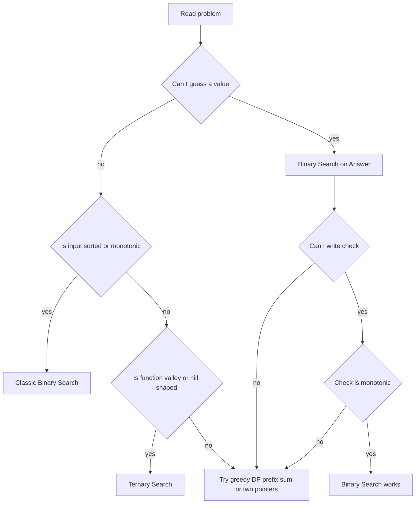

### The only real question

> Can I convert the problem into a clean `NO NO NO YES YES YES` or `YES YES YES NO NO NO` pattern?

---

## 1. Binary Search Foundation

### Linear search vs binary search

Linear search checks one by one.

```text
0 0 0 0 0 0 1 1 1
^ ^ ^ ^ ^ ^
```

Binary search repeatedly cuts the search space.

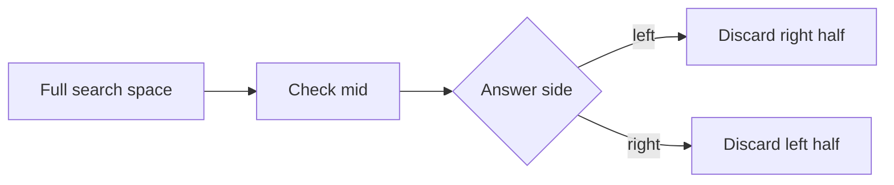

### Search space

In your notes, search space is the possible answer range.

```text
lo = start of search space
hi = end of search space
mid = middle point
```

Safe mid:

```cpp
long long mid = lo + (hi - lo) / 2;
```

Avoid:

```cpp
long long mid = (lo + hi) / 2; // may overflow
```

---

## 2. First True Pattern

Use when the array or predicate looks like:

```text
false false false true true true
```

Goal: find first `true`.

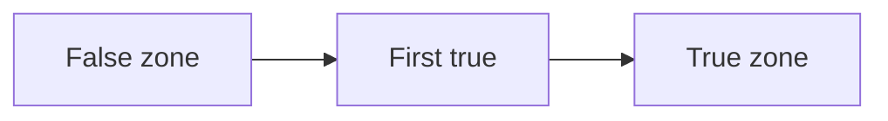

### C++ template

```cpp
long long firstTrue(long long lo, long long hi) {
    long long ans = hi + 1;

    while (lo <= hi) {
        long long mid = lo + (hi - lo) / 2;

        if (check(mid)) {
            ans = mid;
            hi = mid - 1;
        } else {
            lo = mid + 1;
        }
    }

    return ans;
}
```

### Java template

```java
static long firstTrue(long lo, long hi) {
    long ans = hi + 1;

    while (lo <= hi) {
        long mid = lo + (hi - lo) / 2;

        if (check(mid)) {
            ans = mid;
            hi = mid - 1;
        } else {
            lo = mid + 1;
        }
    }

    return ans;
}
```

---

## 3. Last True Pattern

Use when predicate looks like:

```text
true true true false false false
```

Goal: find last `true`.

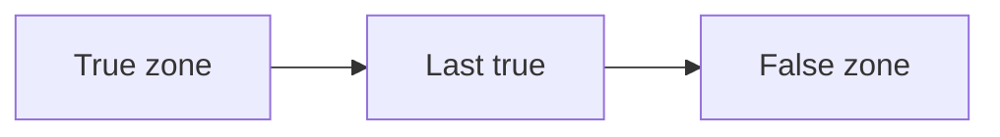

### C++ template

```cpp
long long lastTrue(long long lo, long long hi) {
    long long ans = lo - 1;

    while (lo <= hi) {
        long long mid = lo + (hi - lo) / 2;

        if (check(mid)) {
            ans = mid;
            lo = mid + 1;
        } else {
            hi = mid - 1;
        }
    }

    return ans;
}
```

---

## 4. Important Rule from Foundation Notes

### Do not repeat the same search space

If you do:

```cpp
lo = mid;
hi = mid;
```

in integer binary search, the loop can get stuck.

Correct integer movement:

```cpp
lo = mid + 1;
hi = mid - 1;
```

Real-domain binary search is different. For real values, use:

```cpp
lo = mid;
hi = mid;
```

because there is no next integer.

---

## 5. How to Write a Check Function

Your notes emphasize this:

> Do not write a check that is specific only to the exact answer.  
> Write a property that separates all left-side elements from all right-side elements.

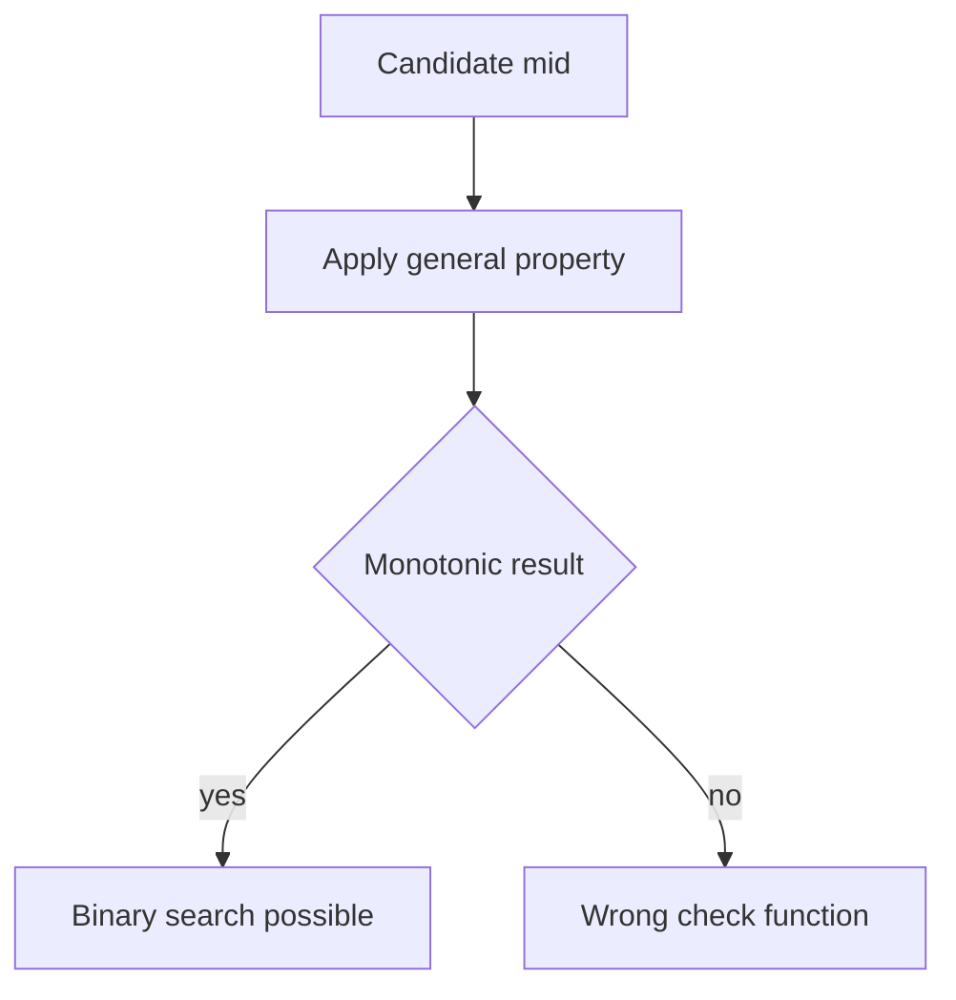

Example:

```text
Bad check:
Is mid exactly the answer?

Good check:
Is answer <= mid?
Can work be completed in mid time?
Can distance mid be achieved?
Are at least k elements <= mid?
```

---

# PART A — Classic Binary Search Patterns

---

## 6. Lower Bound and Upper Bound

### Meaning

```cpp
lower_bound(v.begin(), v.end(), x)
```

First element `>= x`.

```cpp
upper_bound(v.begin(), v.end(), x)
```

First element `> x`.

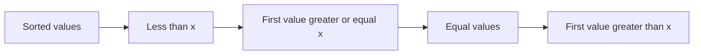

### Counts

```cpp
int lessThanX = lower_bound(v.begin(), v.end(), x) - v.begin();
int lessOrEqualX = upper_bound(v.begin(), v.end(), x) - v.begin();
int equalX = upper_bound(v.begin(), v.end(), x) - lower_bound(v.begin(), v.end(), x);
```

### Java helpers

```java
static int lowerBound(int[] a, int x) {
    int lo = 0, hi = a.length;
    while (lo < hi) {
        int mid = lo + (hi - lo) / 2;
        if (a[mid] >= x) hi = mid;
        else lo = mid + 1;
    }
    return lo;
}

static int upperBound(int[] a, int x) {
    int lo = 0, hi = a.length;
    while (lo < hi) {
        int mid = lo + (hi - lo) / 2;
        if (a[mid] > x) hi = mid;
        else lo = mid + 1;
    }
    return lo;
}
```

---

## 7. Find First Element Greater or Equal to X

Example from notes:

```text
arr = [2, 3, 3, 7, 9, 11, 11, 17, 19]
x = 11

check[i] = arr[i] >= x
check = [0, 0, 0, 0, 0, 1, 1, 1, 1]
answer = index 5
```

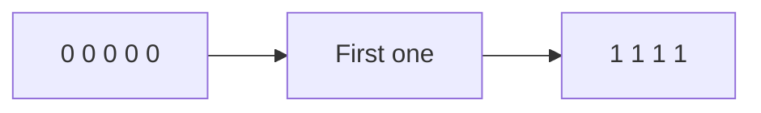

### C++ code

```cpp
int lowerBoundManual(vector<int>& a, int x) {
    int n = a.size();
    int lo = 0, hi = n - 1;
    int ans = n;

    while (lo <= hi) {
        int mid = lo + (hi - lo) / 2;
        if (a[mid] >= x) {
            ans = mid;
            hi = mid - 1;
        } else {
            lo = mid + 1;
        }
    }

    return ans;
}
```

---

## 8. Rotated Sorted Array — Rotation Count

Rotation count = index of minimum element.

Example:

```text
sorted:  1 2 3 5 8
rotated: 8 1 2 3 5
answer: 1
```

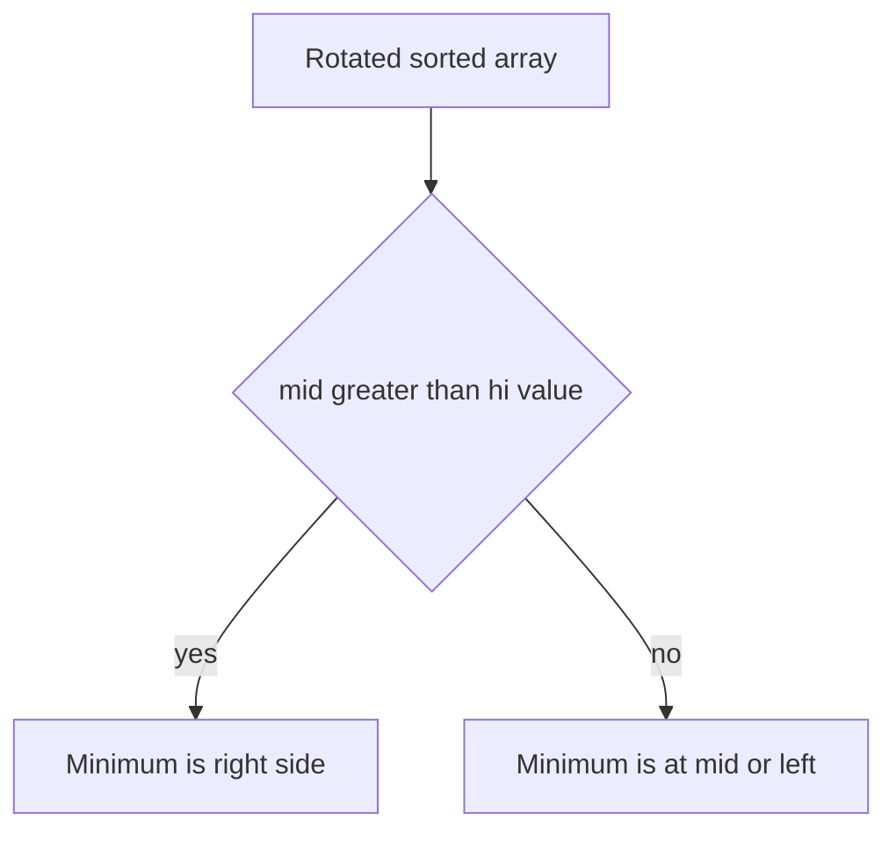

### C++ code

```cpp
int rotationCount(vector<int>& a) {
    int lo = 0;
    int hi = (int)a.size() - 1;

    while (lo < hi) {
        int mid = lo + (hi - lo) / 2;

        if (a[mid] > a[hi]) {
            lo = mid + 1;
        } else {
            hi = mid;
        }
    }

    return lo;
}
```

---

## 9. Peak Finding in Bitonic Array

A bitonic array increases then decreases.

```text
1 3 5 9 7 5
      ^
     peak
```

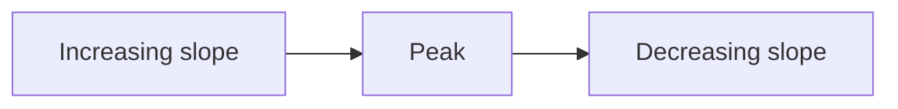

### Check

```text
if a[mid] > a[mid + 1]
    peak is at mid or left
else
    peak is right
```

### C++ code

```cpp
int findPeak(vector<int>& a) {
    int lo = 0;
    int hi = (int)a.size() - 1;

    while (lo < hi) {
        int mid = lo + (hi - lo) / 2;

        if (a[mid] > a[mid + 1]) {
            hi = mid;
        } else {
            lo = mid + 1;
        }
    }

    return lo;
}
```

---

# PART B — Binary Search on Answer

---

## 10. What is Binary Search on Answer?

Most important form.

Instead of searching an index, we search the answer value.

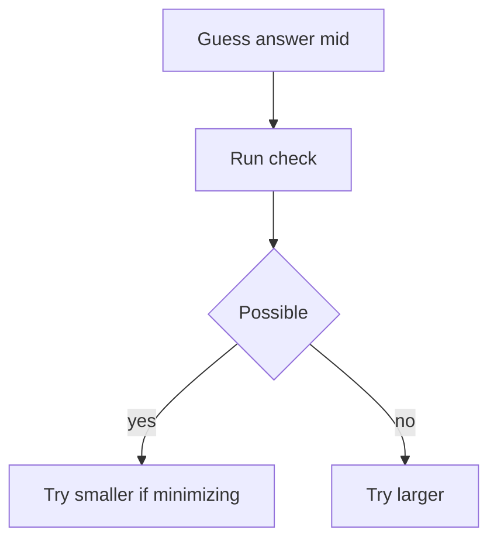

### Common triggers

```text
minimize maximum
maximize minimum
minimum time
maximum distance
kth smallest
can complete within X
```

### Search range

```text
lo = smallest possible answer
hi = largest possible answer
```

---

## 11. Framework from 001 Foundation Notes

Your notes classify binary search forms like this:

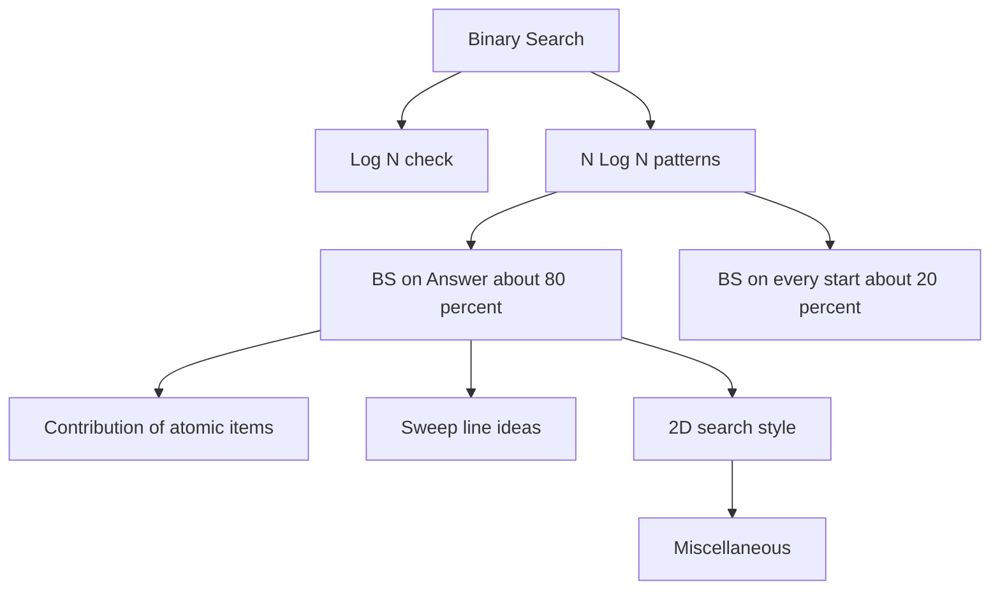

### Mental trick

Most contest binary search questions are:

```text
BS on answer + smart check
```

The hard part is not the binary search loop.  
The hard part is designing `check(mid)`.

---

# PART C — Application 1: Painter Partition / Split Array Largest Sum

---

## 12. Painter Partition Intuition

Problem form:

```text
n walls or books
k painters
each painter gets one continuous block
time of painter = sum of assigned block
total time = maximum painter time
goal = minimize this maximum
```

Example from notes:

```text
a = [2, 7, 1, 8, 3, 4, 5]
k = 3

Split:
[2, 7, 1] = 10
[8, 3] = 11
[4, 5] = 9

answer for this split = max 10 11 9 = 11
```

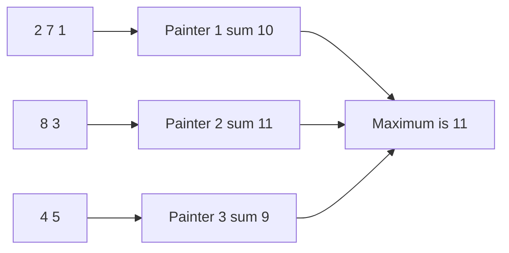

### Main idea

> Minimize the maximum time taken.

### Search range

```text
lo = max element
hi = sum of all elements
```

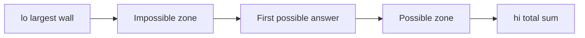

### Check idea

For candidate `mid`:

> Can we paint all walls using at most `k` painters if no painter takes more than `mid` time?

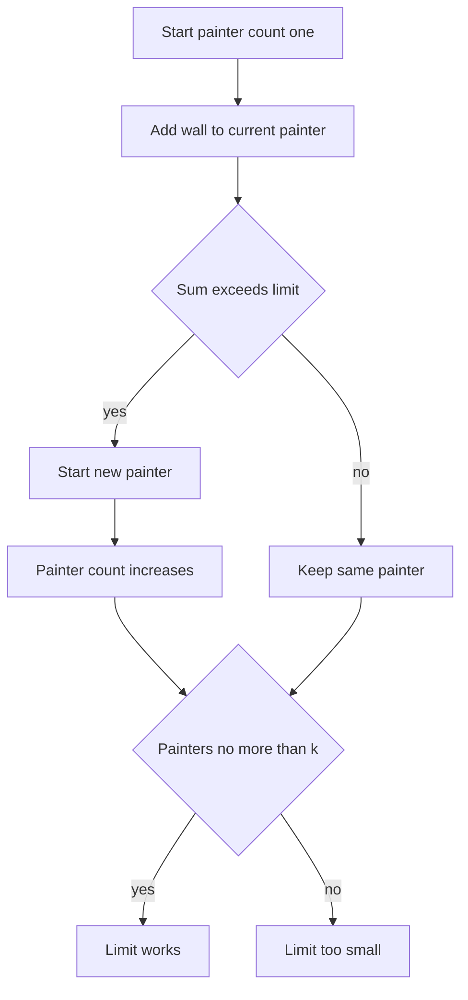

### C++ code

```cpp
#include <bits/stdc++.h>
using namespace std;

bool canSplit(const vector<int>& a, int k, long long limit) {
    int painters = 1;
    long long current = 0;

    for (int x : a) {
        if (x > limit) return false;

        if (current + x <= limit) {
            current += x;
        } else {
            painters++;
            current = x;
        }
    }

    return painters <= k;
}

long long splitArrayLargestSum(vector<int>& a, int k) {
    long long lo = 0;
    long long hi = 0;

    for (int x : a) {
        lo = max(lo, (long long)x);
        hi += x;
    }

    long long ans = hi;

    while (lo <= hi) {
        long long mid = lo + (hi - lo) / 2;

        if (canSplit(a, k, mid)) {
            ans = mid;
            hi = mid - 1;
        } else {
            lo = mid + 1;
        }
    }

    return ans;
}
```

### Java code

```java
static boolean canSplit(int[] a, int k, long limit) {
    int painters = 1;
    long current = 0;

    for (int x : a) {
        if (x > limit) return false;

        if (current + x <= limit) {
            current += x;
        } else {
            painters++;
            current = x;
        }
    }

    return painters <= k;
}

static long splitArrayLargestSum(int[] a, int k) {
    long lo = 0, hi = 0;

    for (int x : a) {
        lo = Math.max(lo, x);
        hi += x;
    }

    long ans = hi;

    while (lo <= hi) {
        long mid = lo + (hi - lo) / 2;

        if (canSplit(a, k, mid)) {
            ans = mid;
            hi = mid - 1;
        } else {
            lo = mid + 1;
        }
    }

    return ans;
}
```

---

# PART D — Factory Machines

---

## 13. Factory Machines Intuition

Problem:

```text
n machines
machine i makes one product in machine[i] time
need t products
find minimum time
```

### Check

For guessed time `mid`:

```text
products made = sum floor(mid / machine[i])
```

If products made `>= target`, time is enough.

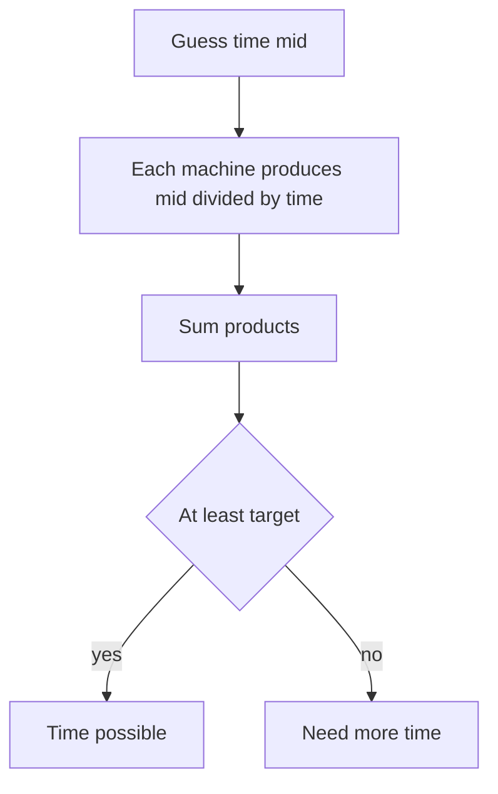

### Example

```text
machines = [2, 3, 7]
target = 10

mid = 8
8/2 = 4
8/3 = 2
8/7 = 1
total = 7, not enough
```

### C++ code

```cpp
bool canMake(const vector<long long>& machine, long long target, long long time) {
    long long made = 0;

    for (long long m : machine) {
        made += time / m;
        if (made >= target) return true;
    }

    return false;
}

long long minTime(vector<long long>& machine, long long target) {
    long long lo = 0;
    long long hi = *min_element(machine.begin(), machine.end()) * target;
    long long ans = hi;

    while (lo <= hi) {
        long long mid = lo + (hi - lo) / 2;

        if (canMake(machine, target, mid)) {
            ans = mid;
            hi = mid - 1;
        } else {
            lo = mid + 1;
        }
    }

    return ans;
}
```

---

# PART E — Maximum Minimum Distance

---

## 14. Place K Points and Minimize Maximum Neighbor Distance

From notes:

```text
number line has initial points
place k more points
minimize maximum neighbor distance
```

### Wrong greedy idea

> Take the largest gap and place at the middle.

This can fail.

### Correct binary search idea

Guess maximum allowed distance `x`.

For every original gap `d`, number of extra points needed:

```text
ceil(d / x) - 1
```

The expression can be written safely:

```text
(d + x - 1) / x - 1
```

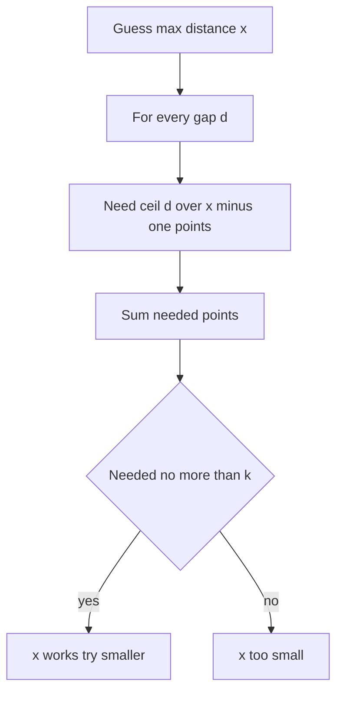

### C++ code

```cpp
bool canLimitGap(vector<long long>& pos, long long k, long long x) {
    if (x == 0) return false;

    long long need = 0;

    for (int i = 1; i < (int)pos.size(); i++) {
        long long d = pos[i] - pos[i - 1];
        need += (d + x - 1) / x - 1;
        if (need > k) return false;
    }

    return need <= k;
}

long long minimizeMaxGap(vector<long long>& pos, long long k) {
    sort(pos.begin(), pos.end());

    long long lo = 1;
    long long hi = 0;

    for (int i = 1; i < (int)pos.size(); i++) {
        hi = max(hi, pos[i] - pos[i - 1]);
    }

    long long ans = hi;

    while (lo <= hi) {
        long long mid = lo + (hi - lo) / 2;

        if (canLimitGap(pos, k, mid)) {
            ans = mid;
            hi = mid - 1;
        } else {
            lo = mid + 1;
        }
    }

    return ans;
}
```

---

## 15. Aggressive Cows Style — Maximize Minimum Distance

Different but related:

```text
place k cows
maximize minimum distance
```

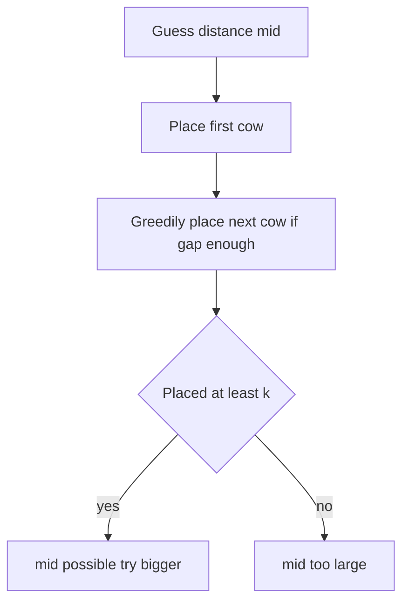

### C++ code

```cpp
bool canPlace(vector<long long>& pos, int k, long long dist) {
    int placed = 1;
    long long last = pos[0];

    for (int i = 1; i < (int)pos.size(); i++) {
        if (pos[i] - last >= dist) {
            placed++;
            last = pos[i];
        }
    }

    return placed >= k;
}

long long maximizeMinDistance(vector<long long>& pos, int k) {
    sort(pos.begin(), pos.end());

    long long lo = 0;
    long long hi = pos.back() - pos.front();
    long long ans = 0;

    while (lo <= hi) {
        long long mid = lo + (hi - lo) / 2;

        if (canPlace(pos, k, mid)) {
            ans = mid;
            lo = mid + 1;
        } else {
            hi = mid - 1;
        }
    }

    return ans;
}
```

---

# PART F — Kth Smallest from Generated Pair Array

---

## 16. Kth Pair Sum from Two Arrays

Problem form:

```text
A has n elements
B has m elements
C contains all A[i] + B[j]
Find kth smallest in C
```

### Intuition

Do not build `C` because it has `n * m` values.

Instead, guess value `x` and count:

```text
how many pair sums are <= x
```

If count `>= k`, then kth value is `<= x`.

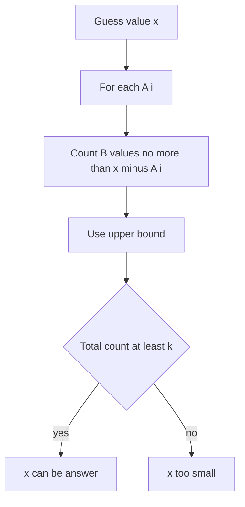

### Example

```text
A = [1, 2, 3]
B = [4, 5, 6]

All sums:
5, 6, 7
6, 7, 8
7, 8, 9

Sorted:
5, 6, 6, 7, 7, 7, 8, 8, 9

6th smallest = 7
```

### C++ code

```cpp
long long countPairsLE(const vector<long long>& A, const vector<long long>& B, long long x) {
    long long count = 0;

    for (long long a : A) {
        count += upper_bound(B.begin(), B.end(), x - a) - B.begin();
    }

    return count;
}

long long kthPairSum(vector<long long> A, vector<long long> B, long long k) {
    sort(A.begin(), A.end());
    sort(B.begin(), B.end());

    if (A.size() > B.size()) swap(A, B);

    long long lo = A.front() + B.front();
    long long hi = A.back() + B.back();
    long long ans = hi;

    while (lo <= hi) {
        long long mid = lo + (hi - lo) / 2;

        if (countPairsLE(A, B, mid) >= k) {
            ans = mid;
            hi = mid - 1;
        } else {
            lo = mid + 1;
        }
    }

    return ans;
}
```

---

# PART G — Subarray Problems with Binary Search

---

## 17. Largest Subarray of Ones After at Most K Flips

Problem:

```text
binary array
you can flip at most k zeros
find largest all-one subarray possible
```

### Binary search viewpoint

Guess length `len`.

Check whether there exists a window of length `len` with zeros `<= k`.

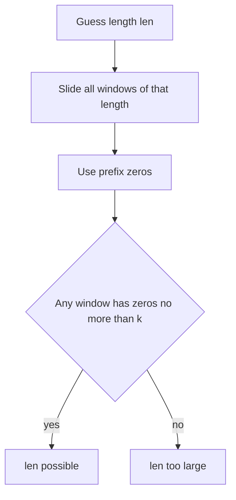

### C++ binary search code

```cpp
bool canMakeOnes(const vector<int>& a, int k, int len) {
    int n = a.size();

    vector<int> pref(n + 1, 0);
    for (int i = 0; i < n; i++) {
        pref[i + 1] = pref[i] + (a[i] == 0);
    }

    for (int l = 0; l + len <= n; l++) {
        int r = l + len;
        int zeros = pref[r] - pref[l];

        if (zeros <= k) return true;
    }

    return false;
}

int maxOnesAfterFlips(vector<int>& a, int k) {
    int n = a.size();
    int lo = 0;
    int hi = n;
    int ans = 0;

    while (lo <= hi) {
        int mid = lo + (hi - lo) / 2;

        if (canMakeOnes(a, k, mid)) {
            ans = mid;
            lo = mid + 1;
        } else {
            hi = mid - 1;
        }
    }

    return ans;
}
```

### Better sliding window code

```cpp
int maxOnesAfterFlipsSliding(vector<int>& a, int k) {
    int l = 0;
    int zeros = 0;
    int ans = 0;

    for (int r = 0; r < (int)a.size(); r++) {
        if (a[r] == 0) zeros++;

        while (zeros > k) {
            if (a[l] == 0) zeros--;
            l++;
        }

        ans = max(ans, r - l + 1);
    }

    return ans;
}
```

---

## 18. Count Subarrays with At Most K Zeros

This is the `BS on every start` form.

For each start index, find farthest valid end.

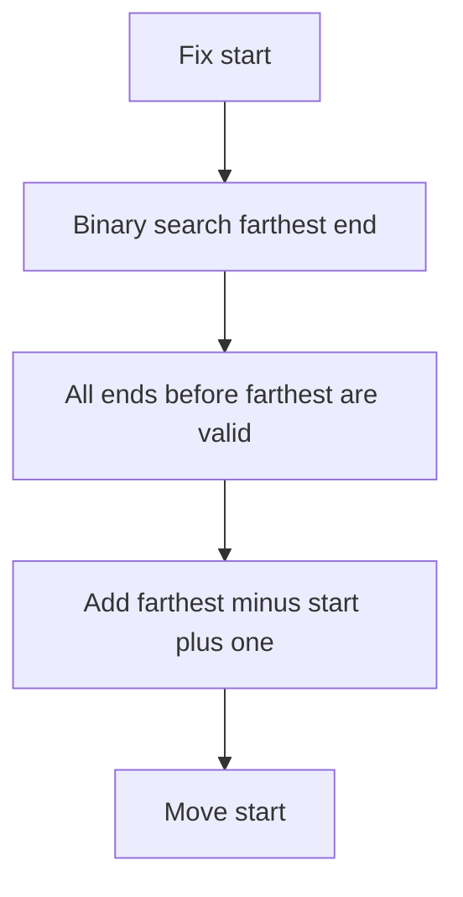

### C++ code

```cpp
long long countSubarraysAtMostKZeros(vector<int>& a, int k) {
    int n = a.size();

    vector<int> pref(n + 1, 0);
    for (int i = 0; i < n; i++) {
        pref[i + 1] = pref[i] + (a[i] == 0);
    }

    long long count = 0;

    for (int st = 0; st < n; st++) {
        int lo = st;
        int hi = n - 1;
        int ans = st - 1;

        while (lo <= hi) {
            int mid = lo + (hi - lo) / 2;
            int zeros = pref[mid + 1] - pref[st];

            if (zeros <= k) {
                ans = mid;
                lo = mid + 1;
            } else {
                hi = mid - 1;
            }
        }

        count += ans - st + 1;
    }

    return count;
}
```

### Two-pointer optimized version

```cpp
long long countSubarraysAtMostKZerosTwoPointer(vector<int>& a, int k) {
    int n = a.size();
    int l = 0;
    int zeros = 0;
    long long ans = 0;

    for (int r = 0; r < n; r++) {
        if (a[r] == 0) zeros++;

        while (zeros > k) {
            if (a[l] == 0) zeros--;
            l++;
        }

        ans += r - l + 1;
    }

    return ans;
}
```

---

# PART H — 2D / Contribution Style

---

## 19. Kth Smallest in Multiplication Table Style

Problem form:

```text
Implicit sorted 2D table
Find kth smallest
```

Example multiplication table:

```text
1 2 3 4 5
2 4 6 8 10
3 6 9 12 15
```

### Intuition

Do not build the table.  
Guess value `x`, count how many values `<= x`.

For row `i`:

```text
count in row = min(m, x / i)
```

```mermaid
flowchart TD
    A[Guess x] --> B[For each row i]
    B --> C[Count min m and x divided by i]
    C --> D[Sum counts]
    D --> E{Count at least k}
    E -->|yes| F[x can be answer]
    E -->|no| G[x too small]
```

### C++ code

```cpp
long long countLEInTable(long long n, long long m, long long x) {
    long long count = 0;

    for (long long i = 1; i <= n; i++) {
        count += min(m, x / i);
    }

    return count;
}

long long kthInMultiplicationTable(long long n, long long m, long long k) {
    long long lo = 1;
    long long hi = n * m;
    long long ans = hi;

    while (lo <= hi) {
        long long mid = lo + (hi - lo) / 2;

        if (countLEInTable(n, m, mid) >= k) {
            ans = mid;
            hi = mid - 1;
        } else {
            lo = mid + 1;
        }
    }

    return ans;
}
```

---

# PART I — Binary Search on Real Domain

---

## 20. Real Domain vs Integer Domain

Integer binary search:

```cpp
hi = mid - 1;
lo = mid + 1;
```

Real binary search:

```cpp
hi = mid;
lo = mid;
```

Because real numbers have infinite values between two numbers.

```mermaid
flowchart TD
    A[Real search space] --> B[Pick midpoint]
    B --> C[Move boundary to midpoint]
    C --> D[Repeat many iterations]
```

### EPS template

```cpp
long double realBinarySearch(long double lo, long double hi) {
    const long double EPS = 1e-12;

    while (fabsl(hi - lo) > EPS) {
        long double mid = (lo + hi) / 2;

        if (check(mid)) {
            hi = mid;
        } else {
            lo = mid;
        }
    }

    return (lo + hi) / 2;
}
```

### Fixed iteration template

```cpp
long double realBinarySearchIter(long double lo, long double hi) {
    for (int it = 0; it < 100; it++) {
        long double mid = (lo + hi) / 2;

        if (check(mid)) {
            hi = mid;
        } else {
            lo = mid;
        }
    }

    return (lo + hi) / 2;
}
```

### Precision trick

If required precision is `1e-5`, use EPS around `1e-7` or smaller.

---

# PART J — Ternary Search

---

## 21. When to Use Ternary Search

Use for a function that is:

```text
increasing then decreasing
or
decreasing then increasing
```

This is called unimodal.

```mermaid
flowchart LR
    A[Left side] --> B[Peak or valley]
    B --> C[Right side]
```

### Idea

Split into 3 parts using `m1` and `m2`.

```mermaid
flowchart TD
    A[lo to hi] --> B[Compute m1 and m2]
    B --> C{f at m1 less than f at m2}
    C -->|yes for minimum| D[Minimum is left side]
    C -->|no for minimum| E[Minimum is right side]
```

### Continuous ternary search

```cpp
long double ternarySearch(long double lo, long double hi) {
    for (int it = 0; it < 200; it++) {
        long double m1 = lo + (hi - lo) / 3;
        long double m2 = hi - (hi - lo) / 3;

        if (f(m1) < f(m2)) {
            hi = m2;
        } else {
            lo = m1;
        }
    }

    return f((lo + hi) / 2);
}
```

### Integer ternary search

For integer domain, brute force the final small range.

```cpp
long long integerTernary(long long lo, long long hi) {
    while (hi - lo > 3) {
        long long m1 = lo + (hi - lo) / 3;
        long long m2 = hi - (hi - lo) / 3;

        if (f(m1) < f(m2)) {
            hi = m2;
        } else {
            lo = m1;
        }
    }

    long long ans = f(lo);
    for (long long x = lo; x <= hi; x++) {
        ans = min(ans, f(x));
    }

    return ans;
}
```

---

## 22. Freefall Example

Function from notes:

```text
f(x) = B * x + A / sqrt(x + 1)
```

- `B * x` increases as operations increase.
- `A / sqrt(x + 1)` decreases as operations increase.
- Total function becomes valley shaped.

```mermaid
flowchart LR
    A[Large falling time] --> B[Best x]
    B --> C[Large operation time]
```

### C++ code

```cpp
#include <bits/stdc++.h>
using namespace std;

using ld = long double;
using ll = long long;

ll A, B;

ld f(ll x) {
    return (ld)B * x + (ld)A / sqrt((ld)x + 1);
}

int main() {
    cin >> A >> B;

    ll lo = 0;
    ll hi = A / B + 5;

    while (hi - lo > 3) {
        ll m1 = lo + (hi - lo) / 3;
        ll m2 = hi - (hi - lo) / 3;

        if (f(m1) < f(m2)) {
            hi = m2;
        } else {
            lo = m1;
        }
    }

    ld ans = f(lo);
    for (ll x = lo; x <= hi; x++) {
        ans = min(ans, f(x));
    }

    cout << fixed << setprecision(15) << ans << "\n";
}
```

---

# PART K — Binary Search Drill

---

## 23. Sum of Cubes

Problem:

```text
Given x, check if x = a^3 + b^3
where a and b are positive integers.
```

Constraints from notes:

```text
x <= 1e12
cube root of x <= 1e4
```

### Intuition

Fix `a`.

Then:

```text
remaining = x - a^3
```

Check whether remaining is a perfect cube.

```mermaid
flowchart TD
    A[Pick a] --> B[Compute remaining x minus a cube]
    B --> C[Find cube root of remaining]
    C --> D{Cube root cubed equals remaining}
    D -->|yes| E[YES]
    D -->|no| F[Try next a]
```

### Overflow-safe cube check

Avoid:

```cpp
mid * mid * mid <= x
```

Use:

```cpp
mid <= x / mid / mid
```

### C++ code

```cpp
#include <bits/stdc++.h>
using namespace std;

using ll = long long;

ll cubeRootFloor(ll x) {
    ll lo = 1;
    ll hi = 1000000;
    ll ans = 0;

    while (lo <= hi) {
        ll mid = lo + (hi - lo) / 2;

        if (mid <= x / mid / mid) {
            ans = mid;
            lo = mid + 1;
        } else {
            hi = mid - 1;
        }
    }

    return ans;
}

bool possible(ll x) {
    for (ll a = 1; a * a * a < x; a++) {
        ll rem = x - a * a * a;
        ll b = cubeRootFloor(rem);

        if (b > 0 && b * b * b == rem) {
            return true;
        }
    }

    return false;
}

int main() {
    ios::sync_with_stdio(false);
    cin.tie(nullptr);

    int t;
    cin >> t;

    while (t--) {
        ll x;
        cin >> x;

        cout << (possible(x) ? "YES" : "NO") << '\n';
    }
}
```

---

# PART L — Architecture Diagrams for Visual Learning

---

## 24. Binary Search Engine Architecture

```mermaid
flowchart TD
    A[Problem Statement] --> B[Extract answer type]
    B --> C[Define search range]
    C --> D[Design check function]
    D --> E[Verify monotonicity]
    E --> F[Choose first true or last true template]
    F --> G[Write code]
    G --> H[Test boundary cases]
```

---

## 25. Check Function Architecture

```mermaid
flowchart TD
    A[Candidate mid] --> B[Greedy or counting or prefix]
    B --> C[Return possible or not]
    C --> D{Pattern}
    D --> E[False false true true]
    D --> F[True true false false]
```

---

## 26. Pattern Recognition Table

| Problem phrase | Pattern |
|---|---|
| minimize maximum | Binary search on answer |
| maximize minimum | Binary search on answer |
| minimum time | Binary search on answer |
| kth smallest | Count less or equal plus binary search |
| sorted array | Lower bound or upper bound |
| every start index | Binary search per start |
| precision answer | Binary search on real |
| valley or hill function | Ternary search |
| overflow in multiplication | Divide and check |

---

## 27. Mental Tricks

### Trick 1: Replace optimization with decision

Instead of:

```text
Find minimum answer.
```

Think:

```text
Can answer be at most mid?
```

### Trick 2: Find monotonic language

Look for:

```text
If mid works, bigger also works.
If mid fails, smaller also fails.
```

### Trick 3: Bound answer first

Good binary search needs good bounds.

```text
Painter partition:
lo = max element
hi = sum

Factory machines:
lo = 0
hi = fastest machine * target

Distance:
lo = 1
hi = max gap

Kth pair sum:
lo = smallest possible sum
hi = largest possible sum
```

### Trick 4: Count instead of generate

For kth problems:

```text
Do not generate all values.
Count how many are <= mid.
```

---

## 28. Final Quick Notes

```mermaid
flowchart TD
    A[Before coding] --> B[What is answer]
    B --> C[Can I guess it]
    C --> D[Can I check it]
    D --> E[Is check monotonic]
    E --> F[Choose template]
```

### Last-minute revision

- Binary search is **not only for arrays**.
- First true = `false false false true true`.
- Last true = `true true true false false`.
- BS on answer is the most common contest form.
- `check(mid)` is the main problem.
- Use `lo + (hi - lo) / 2`.
- Use `long long`.
- For real domain, use fixed iterations.
- For ternary search, function must be unimodal.
- For multiplication overflow, use divide-and-check.

---

# 29. Minimal Template Library

```cpp
// First true
long long firstTrue(long long lo, long long hi) {
    long long ans = hi + 1;
    while (lo <= hi) {
        long long mid = lo + (hi - lo) / 2;
        if (check(mid)) {
            ans = mid;
            hi = mid - 1;
        } else {
            lo = mid + 1;
        }
    }
    return ans;
}

// Last true
long long lastTrue(long long lo, long long hi) {
    long long ans = lo - 1;
    while (lo <= hi) {
        long long mid = lo + (hi - lo) / 2;
        if (check(mid)) {
            ans = mid;
            lo = mid + 1;
        } else {
            hi = mid - 1;
        }
    }
    return ans;
}

// Real binary search
long double realBS(long double lo, long double hi) {
    for (int it = 0; it < 100; it++) {
        long double mid = (lo + hi) / 2;
        if (check(mid)) hi = mid;
        else lo = mid;
    }
    return (lo + hi) / 2;
}
```

---

END
