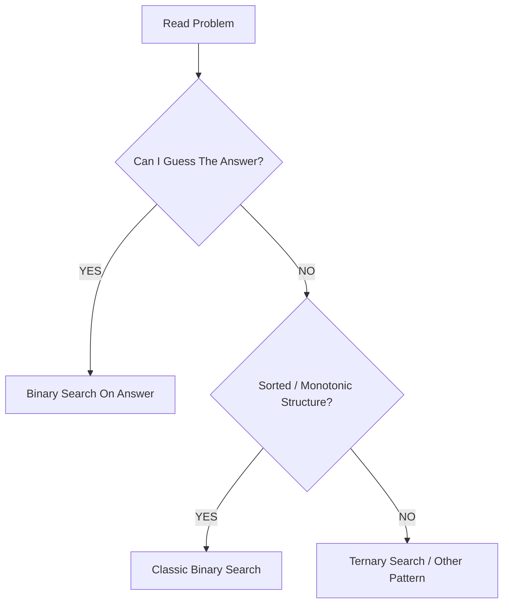

# 🚀 Binary Search Complete CP + FAANG Visual Handbook

> Premium Visual Edition with graphical layout, dry runs, mental triggers, and FAANG-style revision formatting.

---

# 🌌 Binary Search Philosophy

```text
Binary Search is NOT about arrays only.

Binary Search is about:
FINDING THE BOUNDARY
between VALID and INVALID states.
```

---

# 🧠 Fast Mental Model



---


---

# Clickable Index


═══════════════════════════════════════

## 🟢 0. Master Mental Map
- [0.1 One-Minute Binary Search Map](#01-one-minute-binary-search-map)
- [0.2 Binary Search Forms](#02-binary-search-forms)
- [0.3 First True vs Last True](#03-first-true-vs-last-true)
- [0.4 How to Design Check Function](#04-how-to-design-check-function)
- [0.5 CP / FAANG Recognition Signals](#05-cp--faang-recognition-signals)

## 🟢 Phase 1 — Foundation
- [1. Binary Search on 0/1 Monotone Array](#1-binary-search-on-01-monotone-array)
- [2. Lower Bound — First Element Greater or Equal X](#2-lower-bound--first-element-greater-or-equal-x)
- [3. Upper Bound — First Element Greater Than X](#3-upper-bound--first-element-greater-than-x)

## 🟢 Phase 2 — Classic Index Binary Search
- [4. Search Insert Position](#4-search-insert-position)
- [5. Rotation Count in Rotated Sorted Array](#5-rotation-count-in-rotated-sorted-array)
- [6. Peak Element in Bitonic Array](#6-peak-element-in-bitonic-array)

## 🟢 Phase 3 — Binary Search on Answer
- [7. Painter Partition / Split Array Largest Sum](#7-painter-partition--split-array-largest-sum)
- [8. Factory Machines](#8-factory-machines)
- [9. Aggressive Cows — Maximize Minimum Distance](#9-aggressive-cows--maximize-minimum-distance)
- [10. Minimize Maximum Neighbor Distance After Adding K Points](#10-minimize-maximum-neighbor-distance-after-adding-k-points)

## 🟢 Phase 4 — Kth / Counting Problems
- [11. Kth Smallest Pair Sum from Two Arrays](#11-kth-smallest-pair-sum-from-two-arrays)
- [12. Kth Smallest in Multiplication Table](#12-kth-smallest-in-multiplication-table)
- [13. Kth Element in Generated Matrix A[i] + B[j]](#13-kth-element-in-generated-matrix-aij--bj)

## 🟢 Phase 5 — Binary Search on Every Start
- [14. Largest Subarray of Ones After At Most K Flips](#14-largest-subarray-of-ones-after-at-most-k-flips)
- [15. Count Subarrays with At Most K Zeros](#15-count-subarrays-with-at-most-k-zeros)
- [16. Count Subarrays with At Most K Distinct Elements](#16-count-subarrays-with-at-most-k-distinct-elements)

## 🟢 Phase 6 — Real Domain Binary Search
- [17. Binary Search on Real Domain](#17-binary-search-on-real-domain)

## 🟢 Phase 7 — Ternary Search
- [18. Ternary Search Foundation](#18-ternary-search-foundation)
- [19. Freefall Problem](#19-freefall-problem)

## 🟢 Phase 8 — Drill Problems
- [20. Sum of Cubes](#20-sum-of-cubes)

## 🟢 Final Revision
- [Binary Search Decision Table](#binary-search-decision-table)
- [Must-Solve Order](#must-solve-order)
- [Template Library](#template-library)
- [Common Mistakes](#common-mistakes)

---

# 0. Master Mental Map


═══════════════════════════════════════

## 🟢 0.1 One-Minute Binary Search Map

```text
Read problem
   |
   v
Can I guess the answer?
   |
   +-- YES --> Binary Search on Answer
   |              |
   |              v
   |          Can I write check(mid)?
   |              |
   |              v
   |          Is check monotonic?
   |              |
   |              v
   |          Use first true / last true
   |
   +-- NO --> Is array sorted / monotonic?
                  |
                  +-- YES --> Classic binary search / lower_bound / upper_bound
                  |
                  +-- NO --> Is function valley/hill shaped?
                                |
                                +-- YES --> Ternary search
                                +-- NO  --> Try greedy / DP / prefix / two pointers
```

---


═══════════════════════════════════════

## 🟢 0.2 Binary Search Forms

```text
Binary Search
│
├── Classic index search
│   ├── lower_bound
│   ├── upper_bound
│   ├── rotated array
│   └── peak finding
│
├── Binary Search on Answer
│   ├── minimize maximum
│   ├── maximize minimum
│   ├── minimum time
│   ├── kth smallest
│   ├── contribution counting
│   └── 2D implicit matrix
│
├── Binary Search on Every Start
│   ├── fixed start
│   ├── farthest valid end
│   └── count valid subarrays
│
├── Real Domain Binary Search
│   ├── precision
│   └── floating answers
│
└── Ternary Search
    ├── hill shaped function
    └── valley shaped function
```

---


═══════════════════════════════════════

## 🟢 0.3 First True vs Last True

### 🟢 First True

Use when predicate looks like:

```text
N N N N Y Y Y Y
        ^
        first true
```

```cpp
long long firstTrue(long long lo, long long hi) {
    long long ans = hi + 1;

    while (lo <= hi) {
        long long mid = lo + (hi - lo) / 2;

        if (check(mid)) {
            ans = mid;
            hi = mid - 1;
        } else {
            lo = mid + 1;
        }
    }

    return ans;
}
```

### 🟢 Last True

Use when predicate looks like:

```text
Y Y Y Y N N N N
      ^
      last true
```

```cpp
long long lastTrue(long long lo, long long hi) {
    long long ans = lo - 1;

    while (lo <= hi) {
        long long mid = lo + (hi - lo) / 2;

        if (check(mid)) {
            ans = mid;
            lo = mid + 1;
        } else {
            hi = mid - 1;
        }
    }

    return ans;
}
```

---


═══════════════════════════════════════

## 🟢 0.4 How to Design Check Function

Your notes repeatedly stress this rule:

```text
Do NOT write check(mid) asking:
"Is mid exactly the answer?"

Write check(mid) asking:
"Is answer <= mid?"
"Can we do it within mid?"
"Can we place with distance at least mid?"
"Are at least k values <= mid?"
```

Good check creates a monotone space:

```text
NO NO NO YES YES YES
```

or:

```text
YES YES YES NO NO NO
```

---


═══════════════════════════════════════

## 🟢 0.5 CP / FAANG Recognition Signals

| Problem phrase | Pattern |
|---|---|
| first index satisfying condition | first true |
| last index satisfying condition | last true |
| first element >= x | lower bound |
| first element > x | upper bound |
| minimize maximum | binary search on answer |
| maximize minimum | binary search on answer |
| minimum time | binary search on answer |
| kth smallest | count <= mid |
| cannot generate all pairs | count instead of build |
| fixed window length possible? | binary search length |
| for every start find farthest end | BS on every start |
| answer needs precision | real-domain binary search |
| function decreases then increases | ternary search |
| multiplication overflow | divide and check |


# ═══════════════════════════════════════
# 🔵 Phase 1 — Foundation


═══════════════════════════════════════

## 🟢 1. Binary Search on 0/1 Monotone Array

### 🟢 Problem Statement

Given a binary monotone array containing zeros followed by ones, find the first index where value is `1`.

### 🟢 Input

```text
arr = [0, 0, 0, 0, 0, 0, 1, 1, 1]
```

### 🟢 Output

```text
6
```

### 🟢 Pattern

```text
First true in monotone 0/1 array.
```

### 🟢 Why This Pattern Works

The array has a clean split:

```text
0 0 0 0 0 0 1 1 1
            ^
            first 1
```

If `arr[mid] == 1`, answer may be at `mid` or left side.  
If `arr[mid] == 0`, answer must be on right side.

### 🟢 C++ Code

```cpp
#include <bits/stdc++.h>
using namespace std;

int firstOne(vector<int>& arr) {
    int n = arr.size();
    int lo = 0, hi = n - 1;
    int ans = -1;

    while (lo <= hi) {
        int mid = lo + (hi - lo) / 2;

        if (arr[mid] == 1) {
            ans = mid;
            hi = mid - 1;
        } else {
            lo = mid + 1;
        }
    }

    return ans;
}

int main() {
    vector<int> arr = {0,0,0,0,0,0,1,1,1};
    cout << firstOne(arr) << "\n";
}
```

### 🟢 Step-by-Step Dry Run

```text
arr = [0,0,0,0,0,0,1,1,1]

index:  0 1 2 3 4 5 6 7 8
arr:   [0 0 0 0 0 0 1 1 1]
```

```text
Step 1

lo = 0, hi = 8
mid = 4

index:  0 1 2 3 4 5 6 7 8
arr:   [0 0 0 0 0 0 1 1 1]
                 ^

arr[4] = 0

condition:
arr[mid] == 1 ? no

action:
answer is on right
lo = mid + 1 = 5
```

```text
Step 2

lo = 5, hi = 8
mid = 6

index:  0 1 2 3 4 5 6 7 8
arr:   [0 0 0 0 0 0 1 1 1]
                     ^

arr[6] = 1

action:
ans = 6
try earlier 1
hi = mid - 1 = 5
```

```text
Step 3

lo = 5, hi = 5
mid = 5

arr[5] = 0
lo = 6

Stop: lo = 6, hi = 5
answer = 6
```

### 🟢 Attractive Note

```text
Binary search is not about sorted values only.
It is about finding the boundary between two zones.
```

---


═══════════════════════════════════════

## 🟢 2. Lower Bound — First Element Greater or Equal X

### 🟢 Problem Statement

Given sorted array and value `x`, find the first index `i` such that:

```text
arr[i] >= x
```

### 🟢 Input

```text
arr = [2, 3, 3, 7, 9, 11, 11, 17, 19]
x = 11
```

### 🟢 Output

```text
5
```

### 🟢 Pattern

```text
lower_bound = first true where arr[i] >= x
```

### 🟢 Why This Pattern Works

Convert the array into check array:

```text
arr[i] >= 11

arr   = [2, 3, 3, 7, 9, 11, 11, 17, 19]
check = [0, 0, 0, 0, 0,  1,  1,  1,  1]
```

Now it becomes first true.

### 🟢 C++ Code

```cpp
#include <bits/stdc++.h>
using namespace std;

int lowerBoundManual(vector<int>& arr, int x) {
    int n = arr.size();
    int lo = 0, hi = n - 1;
    int ans = n;

    while (lo <= hi) {
        int mid = lo + (hi - lo) / 2;

        if (arr[mid] >= x) {
            ans = mid;
            hi = mid - 1;
        } else {
            lo = mid + 1;
        }
    }

    return ans;
}

int main() {
    vector<int> arr = {2,3,3,7,9,11,11,17,19};
    int x = 11;

    cout << lowerBoundManual(arr, x) << "\n";
}
```

### 🟢 Step-by-Step Dry Run

```text
arr = [2, 3, 3, 7, 9, 11, 11, 17, 19]
x = 11

index:  0  1  2  3  4   5   6   7   8
arr:   [2, 3, 3, 7, 9, 11, 11, 17, 19]
check: [0, 0, 0, 0, 0,  1,  1,  1,  1]
```

```text
Step 1
lo = 0, hi = 8
mid = 4
arr[4] = 9
9 >= 11 ? no
lo = 5
```

```text
Step 2
lo = 5, hi = 8
mid = 6
arr[6] = 11
11 >= 11 ? yes
ans = 6
hi = 5
```

```text
Step 3
lo = 5, hi = 5
mid = 5
arr[5] = 11
11 >= 11 ? yes
ans = 5
hi = 4

Stop: answer = 5
```

### 🟢 Attractive Note

```text
lower_bound is just first true with:
check(i) = arr[i] >= x
```

---


═══════════════════════════════════════

## 🟢 3. Upper Bound — First Element Greater Than X

### 🟢 Problem Statement

Find first index `i` such that:

```text
arr[i] > x
```

### 🟢 Input

```text
arr = [2, 3, 3, 7, 9, 11, 11, 17, 19]
x = 11
```

### 🟢 Output

```text
7
```

### 🟢 Pattern

```text
upper_bound = first true where arr[i] > x
```

### 🟢 C++ Code

```cpp
#include <bits/stdc++.h>
using namespace std;

int upperBoundManual(vector<int>& arr, int x) {
    int n = arr.size();
    int lo = 0, hi = n - 1;
    int ans = n;

    while (lo <= hi) {
        int mid = lo + (hi - lo) / 2;

        if (arr[mid] > x) {
            ans = mid;
            hi = mid - 1;
        } else {
            lo = mid + 1;
        }
    }

    return ans;
}
```

### 🟢 Step-by-Step Dry Run

```text
arr = [2, 3, 3, 7, 9, 11, 11, 17, 19]
x = 11

check = arr[i] > 11

index:  0  1  2  3  4   5   6   7   8
arr:   [2, 3, 3, 7, 9, 11, 11, 17, 19]
check: [0, 0, 0, 0, 0,  0,  0,  1,  1]
```

```text
Step 1: mid = 4, arr[4] = 9, 9 > 11? no  -> lo = 5
Step 2: mid = 6, arr[6] = 11, 11 > 11? no -> lo = 7
Step 3: mid = 7, arr[7] = 17, 17 > 11? yes -> ans = 7, hi = 6

answer = 7
```


# ═══════════════════════════════════════
# 🔵 Phase 2 — Classic Index Binary Search


═══════════════════════════════════════

## 🟢 4. Search Insert Position

### 🟢 Problem Statement

Given sorted array and target, return index if found. If not found, return where it should be inserted.

### 🟢 Input

```text
nums = [1, 3, 5, 6]
target = 5
```

### 🟢 Output

```text
2
```

### 🟢 Pattern

```text
lower_bound(target)
```

### 🟢 Why This Pattern Works

Insert position is the first index where:

```text
nums[i] >= target
```

### 🟢 C++ Code

```cpp
#include <bits/stdc++.h>
using namespace std;

int searchInsert(vector<int>& nums, int target) {
    int lo = 0, hi = nums.size() - 1;
    int ans = nums.size();

    while (lo <= hi) {
        int mid = lo + (hi - lo) / 2;

        if (nums[mid] >= target) {
            ans = mid;
            hi = mid - 1;
        } else {
            lo = mid + 1;
        }
    }

    return ans;
}
```

### 🟢 Step-by-Step Dry Run

```text
nums = [1, 3, 5, 6]
target = 5

index:   0   1   2   3
nums:   [1,  3,  5,  6]
```

```text
Step 1
lo = 0, hi = 3
mid = 1
nums[1] = 3
3 >= 5 ? no
lo = 2
```

```text
Step 2
lo = 2, hi = 3
mid = 2
nums[2] = 5
5 >= 5 ? yes
ans = 2
hi = 1

answer = 2
```

---


═══════════════════════════════════════

## 🟢 5. Rotation Count in Rotated Sorted Array

### 🟢 Problem Statement

Given a rotated sorted array with distinct elements, find how many times it was rotated.

Rotation count = index of the minimum element.

### 🟢 Input

```text
arr = [8, 1, 2, 3, 5]
```

### 🟢 Output

```text
1
```

### 🟢 Pattern

```text
Find minimum in rotated sorted array.
```

### 🟢 Why This Pattern Works

In a rotated sorted array:

```text
if arr[mid] > arr[hi]
    minimum is on right side
else
    minimum is at mid or left side
```

### 🟢 C++ Code

```cpp
#include <bits/stdc++.h>
using namespace std;

int rotationCount(vector<int>& arr) {
    int lo = 0;
    int hi = arr.size() - 1;

    while (lo < hi) {
        int mid = lo + (hi - lo) / 2;

        if (arr[mid] > arr[hi]) {
            lo = mid + 1;
        } else {
            hi = mid;
        }
    }

    return lo;
}
```

### 🟢 Step-by-Step Dry Run

```text
arr = [8, 1, 2, 3, 5]

index:  0  1  2  3  4
arr:   [8, 1, 2, 3, 5]
```

```text
Step 1
lo = 0, hi = 4
mid = 2
arr[mid] = 2, arr[hi] = 5
2 > 5 ? no
hi = mid = 2
```

```text
Step 2
lo = 0, hi = 2
mid = 1
arr[mid] = 1, arr[hi] = 2
1 > 2 ? no
hi = mid = 1
```

```text
Step 3
lo = 0, hi = 1
mid = 0
arr[mid] = 8, arr[hi] = 1
8 > 1 ? yes
lo = mid + 1 = 1

answer = 1
```

---


═══════════════════════════════════════

## 🟢 6. Peak Element in Bitonic Array

### 🟢 Problem Statement

Given a bitonic array that first increases then decreases, find the peak index.

### 🟢 Input

```text
arr = [1, 3, 5, 9, 7, 5]
```

### 🟢 Output

```text
3
```

### 🟢 Pattern

```text
Binary search on slope.
```

### 🟢 Why This Pattern Works

At any `mid`:

```text
if arr[mid] > arr[mid + 1]
    we are on decreasing slope
    peak is at mid or left
else
    we are on increasing slope
    peak is right
```

### 🟢 C++ Code

```cpp
#include <bits/stdc++.h>
using namespace std;

int findPeak(vector<int>& arr) {
    int lo = 0;
    int hi = arr.size() - 1;

    while (lo < hi) {
        int mid = lo + (hi - lo) / 2;

        if (arr[mid] > arr[mid + 1]) {
            hi = mid;
        } else {
            lo = mid + 1;
        }
    }

    return lo;
}
```

### 🟢 Step-by-Step Dry Run

```text
arr = [1, 3, 5, 9, 7, 5]

index:  0  1  2  3  4  5
arr:   [1, 3, 5, 9, 7, 5]
```

```text
Step 1
lo = 0, hi = 5
mid = 2
arr[2] = 5, arr[3] = 9
5 > 9 ? no
we are climbing
lo = 3
```

```text
Step 2
lo = 3, hi = 5
mid = 4
arr[4] = 7, arr[5] = 5
7 > 5 ? yes
peak at mid or left
hi = 4
```

```text
Step 3
lo = 3, hi = 4
mid = 3
arr[3] = 9, arr[4] = 7
9 > 7 ? yes
hi = 3

answer = 3
```


# ═══════════════════════════════════════
# 🔵 Phase 3 — Binary Search on Answer


═══════════════════════════════════════

## 🟢 7. Painter Partition / Split Array Largest Sum

### 🟢 Problem Statement

Given an array of wall lengths and `k` painters. Each painter paints a contiguous block. Minimize the maximum work assigned to any painter.

### 🟢 Input

```text
arr = [2, 7, 1, 8, 3, 4, 5]
k = 3
```

### 🟢 Output

```text
11
```

### 🟢 Pattern

```text
Binary search on answer: minimize maximum.
```

### 🟢 Why This Pattern Works

If we can paint all walls with maximum time `T`, then we can also paint with any time larger than `T`.

Monotone space:

```text
T:       8  9  10  11  12  13 ...
check:   N  N   N   Y   Y   Y
```

### 🟢 Search Range

```text
lo = max(arr) = 8
hi = sum(arr) = 30
```

### 🟢 C++ Code

```cpp
#include <bits/stdc++.h>
using namespace std;

bool canPaint(vector<int>& arr, int k, long long limit) {
    int painters = 1;
    long long current = 0;

    for (int x : arr) {
        if (x > limit) return false;

        if (current + x <= limit) {
            current += x;
        } else {
            painters++;
            current = x;
        }
    }

    return painters <= k;
}

long long painterPartition(vector<int>& arr, int k) {
    long long lo = 0, hi = 0;

    for (int x : arr) {
        lo = max(lo, (long long)x);
        hi += x;
    }

    long long ans = hi;

    while (lo <= hi) {
        long long mid = lo + (hi - lo) / 2;

        if (canPaint(arr, k, mid)) {
            ans = mid;
            hi = mid - 1;
        } else {
            lo = mid + 1;
        }
    }

    return ans;
}
```

### 🟢 Step-by-Step Dry Run

```text
arr = [2, 7, 1, 8, 3, 4, 5]
k = 3

lo = max(arr) = 8
hi = sum(arr) = 30
```

```text
Try mid = 19

Painter 1:
2 + 7 + 1 + 8 = 18
next 3 would make 21 > 19

Painter 2:
3 + 4 + 5 = 12

painters needed = 2 <= 3

check(19) = true
ans = 19
try smaller
hi = 18
```

```text
Try mid = 13

Painter 1:
2 + 7 + 1 = 10
next 8 would make 18 > 13

Painter 2:
8 + 3 = 11
next 4 would make 15 > 13

Painter 3:
4 + 5 = 9

painters needed = 3 <= 3

check(13) = true
ans = 13
hi = 12
```

```text
Try mid = 10

Painter 1:
2 + 7 + 1 = 10

Painter 2:
8
next 3 would make 11 > 10

Painter 3:
3 + 4 = 7
next 5 would make 12 > 10

Painter 4:
5

painters needed = 4 > 3

check(10) = false
lo = 11
```

```text
Try mid = 11

Painter 1:
2 + 7 + 1 = 10

Painter 2:
8 + 3 = 11

Painter 3:
4 + 5 = 9

painters needed = 3
check(11) = true
ans = 11
hi = 10

answer = 11
```

### 🟢 Attractive Note

```text
Optimization:
minimize the maximum

Decision:
Can maximum be <= mid?
```

---


═══════════════════════════════════════

## 🟢 8. Factory Machines

### 🟢 Problem Statement

There are `n` machines. Machine `i` makes one product in `machine[i]` time. Find minimum time to make at least `target` products.

### 🟢 Input

```text
machines = [2, 3, 7]
target = 10
```

### 🟢 Output

```text
12
```

### 🟢 Pattern

```text
Binary search on answer: minimum time.
```

### 🟢 Why This Pattern Works

If we can make `target` products in time `T`, then any time greater than `T` also works.

For time `T`:

```text
products = sum(T / machine[i])
```

### 🟢 C++ Code

```cpp
#include <bits/stdc++.h>
using namespace std;

bool canMake(vector<long long>& machines, long long target, long long time) {
    long long made = 0;

    for (long long m : machines) {
        made += time / m;
        if (made >= target) return true;
    }

    return false;
}

long long minTime(vector<long long>& machines, long long target) {
    long long lo = 0;
    long long fastest = *min_element(machines.begin(), machines.end());
    long long hi = fastest * target;
    long long ans = hi;

    while (lo <= hi) {
        long long mid = lo + (hi - lo) / 2;

        if (canMake(machines, target, mid)) {
            ans = mid;
            hi = mid - 1;
        } else {
            lo = mid + 1;
        }
    }

    return ans;
}
```

### 🟢 Step-by-Step Dry Run

```text
machines = [2, 3, 7]
target = 10

lo = 0
hi = fastest * target = 2 * 10 = 20
```

```text
Try mid = 10

machine 2 makes 10/2 = 5
machine 3 makes 10/3 = 3
machine 7 makes 10/7 = 1

total = 5 + 3 + 1 = 9

9 >= 10 ? no

time too small
lo = 11
```

```text
Try mid = 15

machine 2 makes 7
machine 3 makes 5
machine 7 makes 2

total = 14

14 >= 10 ? yes

ans = 15
try smaller
hi = 14
```

```text
Try mid = 12

machine 2 makes 6
machine 3 makes 4
machine 7 makes 1

total = 11

11 >= 10 ? yes

ans = 12
hi = 11
```

```text
Try mid = 11

machine 2 makes 5
machine 3 makes 3
machine 7 makes 1

total = 9

9 >= 10 ? no

lo = 12

answer = 12
```

---


═══════════════════════════════════════

## 🟢 9. Aggressive Cows — Maximize Minimum Distance

### 🟢 Problem Statement

Given stall positions and `k` cows, place cows to maximize the minimum distance between any two cows.

### 🟢 Input

```text
positions = [1, 2, 4, 8, 9]
k = 3
```

### 🟢 Output

```text
3
```

### 🟢 Pattern

```text
Binary search on answer: maximize minimum.
```

### 🟢 Why This Pattern Works

If distance `d` is possible, then any smaller distance is also possible.

Monotone space:

```text
distance: 1 2 3 4 5 ...
check:    Y Y Y N N ...
```

Use last true.

### 🟢 C++ Code

```cpp
#include <bits/stdc++.h>
using namespace std;

bool canPlace(vector<long long>& pos, int k, long long dist) {
    int placed = 1;
    long long last = pos[0];

    for (int i = 1; i < pos.size(); i++) {
        if (pos[i] - last >= dist) {
            placed++;
            last = pos[i];
        }
    }

    return placed >= k;
}

long long aggressiveCows(vector<long long>& pos, int k) {
    sort(pos.begin(), pos.end());

    long long lo = 0;
    long long hi = pos.back() - pos.front();
    long long ans = 0;

    while (lo <= hi) {
        long long mid = lo + (hi - lo) / 2;

        if (canPlace(pos, k, mid)) {
            ans = mid;
            lo = mid + 1;
        } else {
            hi = mid - 1;
        }
    }

    return ans;
}
```

### 🟢 Step-by-Step Dry Run

```text
positions = [1, 2, 4, 8, 9]
k = 3

lo = 0
hi = 8
```

```text
Try distance = 4

place first cow at 1

positions:
[1, 2, 4, 8, 9]
 ^

next possible position must be >= 1 + 4 = 5
place at 8

[1, 2, 4, 8, 9]
          ^

next must be >= 12
not possible

placed = 2 < 3
check(4) = false
hi = 3
```

```text
Try distance = 2

place at 1
next >= 3, place at 4
next >= 6, place at 8

placed = 3
check(2) = true
ans = 2
lo = 3
```

```text
Try distance = 3

place at 1
next >= 4, place at 4
next >= 7, place at 8

placed = 3
check(3) = true
ans = 3
lo = 4

answer = 3
```

---


═══════════════════════════════════════

## 🟢 10. Minimize Maximum Neighbor Distance After Adding K Points

### 🟢 Problem Statement

Given sorted points on a number line. You can add at most `k` extra points. Minimize the maximum distance between neighboring points.

### 🟢 Input

```text
positions = [0, 50, 100]
k = 2
```

### 🟢 Output

```text
25
```

### 🟢 Pattern

```text
Binary search on answer: minimize maximum gap.
```

### 🟢 Why This Pattern Works

Guess maximum allowed gap `x`.

For a gap `d`, points needed:

```text
ceil(d / x) - 1
```

Safe integer form:

```text
(d + x - 1) / x - 1
```

If total needed `<= k`, gap `x` is possible.

### 🟢 C++ Code

```cpp
#include <bits/stdc++.h>
using namespace std;

bool canLimitGap(vector<long long>& pos, long long k, long long x) {
    if (x == 0) return false;

    long long need = 0;

    for (int i = 1; i < pos.size(); i++) {
        long long d = pos[i] - pos[i - 1];
        need += (d + x - 1) / x - 1;

        if (need > k) return false;
    }

    return need <= k;
}

long long minimizeMaxGap(vector<long long>& pos, long long k) {
    sort(pos.begin(), pos.end());

    long long lo = 1;
    long long hi = 0;

    for (int i = 1; i < pos.size(); i++) {
        hi = max(hi, pos[i] - pos[i - 1]);
    }

    long long ans = hi;

    while (lo <= hi) {
        long long mid = lo + (hi - lo) / 2;

        if (canLimitGap(pos, k, mid)) {
            ans = mid;
            hi = mid - 1;
        } else {
            lo = mid + 1;
        }
    }

    return ans;
}
```

### 🟢 Step-by-Step Dry Run

```text
positions = [0, 50, 100]
k = 2

gaps:
0 to 50   = 50
50 to 100 = 50
```

```text
Try x = 25

For gap 50:
ceil(50 / 25) - 1 = 2 - 1 = 1

Two gaps:
need = 1 + 1 = 2

need <= k
check(25) = true
```

```text
Try x = 24

For gap 50:
ceil(50 / 24) - 1 = 3 - 1 = 2

Two gaps:
need = 2 + 2 = 4

4 > 2
check(24) = false
```

```text
answer = 25
```

### 🟢 Attractive Note

```text
Never greedily split the current largest gap blindly.
Binary search the final maximum gap.
```


# ═══════════════════════════════════════
# 🔵 Phase 4 — Kth / Counting Problems


═══════════════════════════════════════

## 🟢 11. Kth Smallest Pair Sum from Two Arrays

### 🟢 Problem Statement

Given arrays `A` and `B`, define array `C` containing all values:

```text
C[i][j] = A[i] + B[j]
```

Find kth smallest value in `C` without building it.

### 🟢 Input

```text
A = [1, 2, 3]
B = [4, 5, 6]
k = 6
```

### 🟢 Output

```text
7
```

### 🟢 Pattern

```text
Binary search on answer + count <= mid.
```

### 🟢 Why This Pattern Works

If at least `k` pair sums are `<= x`, then kth smallest is `<= x`.

For each `A[i]`:

```text
B[j] <= x - A[i]
```

Use `upper_bound`.

### 🟢 C++ Code

```cpp
#include <bits/stdc++.h>
using namespace std;

long long countPairsLE(vector<long long>& A, vector<long long>& B, long long x) {
    long long count = 0;

    for (long long a : A) {
        count += upper_bound(B.begin(), B.end(), x - a) - B.begin();
    }

    return count;
}

long long kthPairSum(vector<long long> A, vector<long long> B, long long k) {
    sort(A.begin(), A.end());
    sort(B.begin(), B.end());

    if (A.size() > B.size()) swap(A, B);

    long long lo = A.front() + B.front();
    long long hi = A.back() + B.back();
    long long ans = hi;

    while (lo <= hi) {
        long long mid = lo + (hi - lo) / 2;

        if (countPairsLE(A, B, mid) >= k) {
            ans = mid;
            hi = mid - 1;
        } else {
            lo = mid + 1;
        }
    }

    return ans;
}
```

### 🟢 Step-by-Step Dry Run

```text
A = [1, 2, 3]
B = [4, 5, 6]
k = 6

All pair sums:
1+4=5, 1+5=6, 1+6=7
2+4=6, 2+5=7, 2+6=8
3+4=7, 3+5=8, 3+6=9

Sorted:
[5, 6, 6, 7, 7, 7, 8, 8, 9]

6th smallest = 7
```

```text
Try x = 7

For A[0] = 1:
need B <= 7 - 1 = 6
B = [4,5,6] => 3 values

For A[1] = 2:
need B <= 5
B = [4,5,6] => 2 values

For A[2] = 3:
need B <= 4
B = [4,5,6] => 1 value

total count = 3 + 2 + 1 = 6

count >= k
7 can be answer
```

```text
Try x = 6

For A[0] = 1: B <= 5 => 2
For A[1] = 2: B <= 4 => 1
For A[2] = 3: B <= 3 => 0

total = 3
3 < 6
6 too small

answer = 7
```

---


═══════════════════════════════════════

## 🟢 12. Kth Smallest in Multiplication Table

### 🟢 Problem Statement

Given `n x m` multiplication table, find kth smallest value.

### 🟢 Input

```text
n = 3
m = 5
k = 7
```

### 🟢 Output

```text
4
```

### 🟢 Pattern

```text
Implicit 2D matrix + binary search on answer + count <= mid.
```

### 🟢 Why This Pattern Works

For guessed `x`, count values in multiplication table `<= x`.

In row `i`:

```text
count = min(m, x / i)
```

### 🟢 C++ Code

```cpp
#include <bits/stdc++.h>
using namespace std;

long long countLE(long long n, long long m, long long x) {
    long long count = 0;

    for (long long i = 1; i <= n; i++) {
        count += min(m, x / i);
    }

    return count;
}

long long kthInMultiplicationTable(long long n, long long m, long long k) {
    long long lo = 1;
    long long hi = n * m;
    long long ans = hi;

    while (lo <= hi) {
        long long mid = lo + (hi - lo) / 2;

        if (countLE(n, m, mid) >= k) {
            ans = mid;
            hi = mid - 1;
        } else {
            lo = mid + 1;
        }
    }

    return ans;
}
```

### 🟢 Step-by-Step Dry Run

```text
n = 3, m = 5

table:
1  2  3  4  5
2  4  6  8 10
3  6  9 12 15

sorted:
1,2,2,3,3,4,4,5,6,6,8,9,10,12,15

k = 7
answer = 4
```

```text
Try x = 5

row 1:
min(5, 5/1) = 5

row 2:
min(5, 5/2) = 2

row 3:
min(5, 5/3) = 1

count = 8

8 >= 7
x = 5 works
try smaller
```

```text
Try x = 3

row 1: 3
row 2: 1
row 3: 1

count = 5
5 < 7
x = 3 too small
```

```text
Try x = 4

row 1: 4
row 2: 2
row 3: 1

count = 7
7 >= 7
answer = 4
```

---


═══════════════════════════════════════

## 🟢 13. Kth Element in Generated Matrix A[i] + B[j]

This is same idea as kth pair sum but explained in matrix form.

### 🟢 Problem Statement

Given:

```text
A = [1,2,3]
B = [4,5,6]
```

Generate matrix:

```text
5 6 7
6 7 8
7 8 9
```

Find kth smallest.

### 🟢 Input

```text
k = 6
```

### 🟢 Output

```text
7
```

### 🟢 Mental Model

```text
Do not generate n*m matrix.
Guess value x.
Count how many generated values <= x.
```

### 🟢 Step-by-Step Dry Run

```text
x = 7

matrix:
5 6 7   -> 3 values <= 7
6 7 8   -> 2 values <= 7
7 8 9   -> 1 value  <= 7

total = 6
k = 6

x = 7 is valid
```


# ═══════════════════════════════════════
# 🔵 Phase 5 — Binary Search on Every Start


═══════════════════════════════════════

## 🟢 14. Largest Subarray of Ones After At Most K Flips

### 🟢 Problem Statement

Given a binary array and `k`, flip at most `k` zeros. Find maximum length subarray containing only ones after flips.

### 🟢 Input

```text
arr = [1,1,1,0,1,0,0,1,1]
k = 2
```

### 🟢 Output

```text
6
```

### 🟢 Pattern

```text
Binary search on length + prefix zeros.
```

### 🟢 Why This Pattern Works

If length `x` is possible, smaller lengths are also possible.

Check:

```text
Does there exist any window of length x with zeros <= k?
```

### 🟢 C++ Code

```cpp
#include <bits/stdc++.h>
using namespace std;

bool canMakeLength(vector<int>& arr, int k, int len) {
    int n = arr.size();
    vector<int> pref(n + 1, 0);

    for (int i = 0; i < n; i++) {
        pref[i + 1] = pref[i] + (arr[i] == 0);
    }

    for (int l = 0; l + len <= n; l++) {
        int r = l + len;
        int zeros = pref[r] - pref[l];

        if (zeros <= k) return true;
    }

    return false;
}

int maxOnesBS(vector<int>& arr, int k) {
    int n = arr.size();
    int lo = 0, hi = n;
    int ans = 0;

    while (lo <= hi) {
        int mid = lo + (hi - lo) / 2;

        if (canMakeLength(arr, k, mid)) {
            ans = mid;
            lo = mid + 1;
        } else {
            hi = mid - 1;
        }
    }

    return ans;
}
```

### 🟢 Step-by-Step Dry Run

```text
arr = [1,1,1,0,1,0,0,1,1]
k = 2

index:  0 1 2 3 4 5 6 7 8
arr:   [1 1 1 0 1 0 0 1 1]
```

```text
Try len = 6

window 0..5:
[1,1,1,0,1,0]
zeros = 2
valid

So len = 6 is possible.
```

```text
Try len = 7

window 0..6:
[1,1,1,0,1,0,0]
zeros = 3

window 1..7:
[1,1,0,1,0,0,1]
zeros = 3

window 2..8:
[1,0,1,0,0,1,1]
zeros = 3

No valid window.

len = 7 not possible.
answer = 6
```

---


═══════════════════════════════════════

## 🟢 15. Count Subarrays with At Most K Zeros

### 🟢 Problem Statement

Count subarrays with at most `k` zeros.

### 🟢 Input

```text
arr = [1,0,0]
k = 1
```

### 🟢 Output

```text
4
```

### 🟢 Pattern

```text
Binary search on every start.
```

### 🟢 Why This Pattern Works

For fixed start `st`, valid end positions are monotone:

```text
Y Y Y N N N
```

Find farthest valid end.

### 🟢 C++ Code

```cpp
#include <bits/stdc++.h>
using namespace std;

long long countAtMostKZeros(vector<int>& arr, int k) {
    int n = arr.size();
    vector<int> pref(n + 1, 0);

    for (int i = 0; i < n; i++) {
        pref[i + 1] = pref[i] + (arr[i] == 0);
    }

    long long count = 0;

    for (int st = 0; st < n; st++) {
        int lo = st;
        int hi = n - 1;
        int ans = st - 1;

        while (lo <= hi) {
            int mid = lo + (hi - lo) / 2;
            int zeros = pref[mid + 1] - pref[st];

            if (zeros <= k) {
                ans = mid;
                lo = mid + 1;
            } else {
                hi = mid - 1;
            }
        }

        count += ans - st + 1;
    }

    return count;
}
```

### 🟢 Step-by-Step Dry Run

```text
arr = [1, 0, 0]
k = 1

index:  0 1 2
arr:   [1 0 0]
```

```text
Start st = 0

end = 0 -> [1]     zeros = 0 valid
end = 1 -> [1,0]   zeros = 1 valid
end = 2 -> [1,0,0] zeros = 2 invalid

valid ends = 0,1
count += 2
```

```text
Start st = 1

end = 1 -> [0]   zeros = 1 valid
end = 2 -> [0,0] zeros = 2 invalid

count += 1
```

```text
Start st = 2

end = 2 -> [0] zeros = 1 valid

count += 1

total = 2 + 1 + 1 = 4
```

---


═══════════════════════════════════════

## 🟢 16. Count Subarrays with At Most K Distinct Elements

### 🟢 Problem Statement

Given an array, count subarrays having at most `k` distinct elements.

### 🟢 Input

```text
arr = [1, 2, 1, 2, 3]
k = 2
```

### 🟢 Output

```text
12
```

### 🟢 Pattern

```text
Same monotone idea as at most K zeros.
Better solved by sliding window.
```

### 🟢 C++ Code

```cpp
#include <bits/stdc++.h>
using namespace std;

long long countAtMostKDistinct(vector<int>& arr, int k) {
    unordered_map<int,int> freq;
    int l = 0;
    long long ans = 0;

    for (int r = 0; r < arr.size(); r++) {
        freq[arr[r]]++;

        while ((int)freq.size() > k) {
            freq[arr[l]]--;

            if (freq[arr[l]] == 0) {
                freq.erase(arr[l]);
            }

            l++;
        }

        ans += r - l + 1;
    }

    return ans;
}
```

### 🟢 Step-by-Step Dry Run

```text
arr = [1,2,1,2,3]
k = 2

window maintains at most 2 distinct values
```

```text
r = 0, value = 1

window: [1]
distinct = {1}

valid subarrays ending at r:
[1]

add = 1
ans = 1
```

```text
r = 1, value = 2

window: [1,2]
distinct = {1,2}

valid ending at r:
[2]
[1,2]

add = 2
ans = 3
```

```text
r = 2, value = 1

window: [1,2,1]
distinct = {1,2}

valid ending at r:
[1]
[2,1]
[1,2,1]

add = 3
ans = 6
```

```text
r = 3, value = 2

window: [1,2,1,2]
distinct = {1,2}

add = 4
ans = 10
```

```text
r = 4, value = 3

window before shrink:
[1,2,1,2,3]
distinct = {1,2,3}

shrink:
remove 1 -> still {1,2,3}
remove 2 -> still {1,2,3}
remove 1 -> {2,3}

window becomes:
[2,3]

valid ending at r:
[3]
[2,3]

add = 2
ans = 12
```


# ═══════════════════════════════════════
# 🔵 Phase 6 — Real Domain Binary Search


═══════════════════════════════════════

## 🟢 17. Binary Search on Real Domain

### 🟢 Problem Statement

Find answer with decimal precision.

### 🟢 Pattern

```text
Real domain binary search.
```

### 🟢 Difference from Integer Binary Search

Integer:

```cpp
lo = mid + 1;
hi = mid - 1;
```

Real:

```cpp
lo = mid;
hi = mid;
```

because there is no next real number.

### 🟢 C++ EPS Version

```cpp
#include <bits/stdc++.h>
using namespace std;

bool check(long double x) {
    return x * x >= 2;
}

long double sqrt2() {
    long double lo = 0;
    long double hi = 2;
    long double EPS = 1e-12;

    while (fabsl(hi - lo) > EPS) {
        long double mid = (lo + hi) / 2;

        if (check(mid)) {
            hi = mid;
        } else {
            lo = mid;
        }
    }

    return (lo + hi) / 2;
}
```

### 🟢 Fixed Iteration Version

```cpp
long double realBS(long double lo, long double hi) {
    for (int it = 0; it < 100; it++) {
        long double mid = (lo + hi) / 2;

        if (check(mid)) hi = mid;
        else lo = mid;
    }

    return (lo + hi) / 2;
}
```

### 🟢 Step-by-Step Dry Run

```text
Goal:
find sqrt(2)

check(x):
x*x >= 2

lo = 0
hi = 2
```

```text
Step 1
mid = 1.0
1.0 * 1.0 = 1 < 2
check = false
lo = mid = 1.0
```

```text
Step 2
lo = 1.0, hi = 2.0
mid = 1.5
1.5 * 1.5 = 2.25 >= 2
check = true
hi = mid = 1.5
```

```text
Step 3
lo = 1.0, hi = 1.5
mid = 1.25
1.25 * 1.25 = 1.5625 < 2
lo = 1.25
```

```text
After many iterations:
answer ≈ 1.41421356237
```

### 🟢 Attractive Note

```text
In real binary search, never do mid + 1 or mid - 1.
Move boundary to mid.
```


# ═══════════════════════════════════════
# 🔵 Phase 7 — Ternary Search


═══════════════════════════════════════

## 🟢 18. Ternary Search Foundation

### 🟢 Problem Statement

Find minimum or maximum of a unimodal function.

Unimodal means:

```text
decreasing then increasing
```

or:

```text
increasing then decreasing
```

### 🟢 Pattern

```text
Ternary search on hill/valley shaped function.
```

### 🟢 Why This Pattern Works

Split range into three parts using `m1` and `m2`.

For minimum:

```text
if f(m1) < f(m2)
    minimum is on left/middle
else
    minimum is on middle/right
```

### 🟢 C++ Code — Real Domain

```cpp
long double ternarySearch(long double lo, long double hi) {
    for (int it = 0; it < 200; it++) {
        long double m1 = lo + (hi - lo) / 3;
        long double m2 = hi - (hi - lo) / 3;

        if (f(m1) < f(m2)) {
            hi = m2;
        } else {
            lo = m1;
        }
    }

    return f((lo + hi) / 2);
}
```

### 🟢 C++ Code — Integer Domain

```cpp
long long integerTernary(long long lo, long long hi) {
    while (hi - lo > 3) {
        long long m1 = lo + (hi - lo) / 3;
        long long m2 = hi - (hi - lo) / 3;

        if (f(m1) < f(m2)) {
            hi = m2;
        } else {
            lo = m1;
        }
    }

    long long ans = f(lo);

    for (long long x = lo; x <= hi; x++) {
        ans = min(ans, f(x));
    }

    return ans;
}
```

### 🟢 Step-by-Step Dry Run

```text
Suppose f(x) is valley shaped.

lo ---------------------------- hi
        m1              m2
```

```text
Case 1:

f(m1) < f(m2)

The value is smaller near m1.
Minimum cannot be strictly right of m2.

Action:
hi = m2
```

```text
Case 2:

f(m1) > f(m2)

The value is smaller near m2.
Minimum cannot be strictly left of m1.

Action:
lo = m1
```

---


═══════════════════════════════════════

## 🟢 19. Freefall Problem

### 🟢 Problem Statement

A person can increase gravity `g` by 1 operation. Each operation costs `B` time. Falling time becomes:

```text
A / sqrt(g)
```

Initially:

```text
g = 1
```

If we do `x` operations:

```text
g = x + 1
```

Total time:

```text
f(x) = B*x + A / sqrt(x + 1)
```

Minimize `f(x)`.

### 🟢 Input

```text
A = 10
B = 1
```

### 🟢 Output

```text
approximately 7.7735
```

### 🟢 Pattern

```text
Unimodal function → ternary search / binary on slope.
```

### 🟢 Why This Pattern Works

The function has two competing parts:

```text
B*x increases
A/sqrt(x+1) decreases
```

So the total first decreases, then increases.

### 🟢 C++ Code

```cpp
#include <bits/stdc++.h>
using namespace std;

using ld = long double;
using ll = long long;

ll A, B;

ld f(ll x) {
    return (ld)B * x + (ld)A / sqrt((ld)x + 1);
}

int main() {
    cin >> A >> B;

    ll lo = 0;
    ll hi = A / B + 5;

    while (hi - lo > 3) {
        ll m1 = lo + (hi - lo) / 3;
        ll m2 = hi - (hi - lo) / 3;

        if (f(m1) < f(m2)) {
            hi = m2;
        } else {
            lo = m1;
        }
    }

    ld ans = f(lo);

    for (ll x = lo; x <= hi; x++) {
        ans = min(ans, f(x));
    }

    cout << fixed << setprecision(15) << ans << "\n";
}
```

### 🟢 Step-by-Step Dry Run

```text
A = 10
B = 1

f(x) = x + 10 / sqrt(x + 1)
```

```text
x = 0:
f(0) = 0 + 10/sqrt(1) = 10
```

```text
x = 1:
f(1) = 1 + 10/sqrt(2)
     ≈ 1 + 7.071
     = 8.071
```

```text
x = 2:
f(2) = 2 + 10/sqrt(3)
     ≈ 2 + 5.773
     = 7.773
```

```text
x = 3:
f(3) = 3 + 10/sqrt(4)
     = 3 + 5
     = 8

Minimum near x = 2
answer ≈ 7.773
```

### 🟢 Attractive Note

```text
If one term increases and another term decreases,
total often becomes valley shaped.
```


# ═══════════════════════════════════════
# 🔵 Phase 8 — Drill Problems


═══════════════════════════════════════

## 🟢 20. Sum of Cubes

### 🟢 Problem Statement

Given `x`, check whether:

```text
x = a^3 + b^3
```

for positive integers `a` and `b`.

### 🟢 Input

```text
x = 35
```

### 🟢 Output

```text
YES
```

Because:

```text
2^3 + 3^3 = 8 + 27 = 35
```

### 🟢 Pattern

```text
Iterate a + binary search cube root of remaining.
```

### 🟢 Why This Pattern Works

Constraint:

```text
x <= 1e12
cube root <= 1e4
```

So iterate `a` up to `1e4`.

For each `a`:

```text
remaining = x - a^3
```

Check if `remaining` is a perfect cube using binary search.

### 🟢 C++ Code

```cpp
#include <bits/stdc++.h>
using namespace std;

using ll = long long;

ll cubeRootFloor(ll x) {
    ll lo = 1;
    ll hi = 1000000;
    ll ans = 0;

    while (lo <= hi) {
        ll mid = lo + (hi - lo) / 2;

        // avoid mid * mid * mid overflow
        if (mid <= x / mid / mid) {
            ans = mid;
            lo = mid + 1;
        } else {
            hi = mid - 1;
        }
    }

    return ans;
}

bool possible(ll x) {
    for (ll a = 1; a * a * a < x; a++) {
        ll rem = x - a * a * a;
        ll b = cubeRootFloor(rem);

        if (b > 0 && b * b * b == rem) {
            return true;
        }
    }

    return false;
}

int main() {
    int t;
    cin >> t;

    while (t--) {
        ll x;
        cin >> x;

        cout << (possible(x) ? "YES" : "NO") << "\n";
    }
}
```

### 🟢 Step-by-Step Dry Run

```text
x = 35
```

```text
Try a = 1:
a^3 = 1
remaining = 35 - 1 = 34

Is 34 perfect cube?
cubeRootFloor(34) = 3
3^3 = 27 != 34

not valid
```

```text
Try a = 2:

a^3 = 8
remaining = 35 - 8 = 27

cubeRootFloor(27) = 3
3^3 = 27

valid:
2^3 + 3^3 = 35

answer = YES
```

### 🟢 Overflow Note

Do not write blindly:

```cpp
mid * mid * mid <= x
```

For large numbers, use:

```cpp
mid <= x / mid / mid
```

---

# Binary Search Decision Table

| Situation | Search Type |
|---|---|
| sorted array index | classic binary search |
| first value satisfying condition | first true |
| last value satisfying condition | last true |
| first `>= x` | lower bound |
| first `> x` | upper bound |
| minimize maximum | first true on answer |
| maximize minimum | last true on answer |
| minimum time | first true on answer |
| kth smallest | count `<= mid` |
| generated matrix | count instead of build |
| every start index | farthest valid end |
| real answer | real-domain binary search |
| valley/hill function | ternary search |
| multiplication may overflow | divide and check |

---

# Must-Solve Order

```text
Phase 1:
1. First One in Binary Array
2. Lower Bound
3. Upper Bound

Phase 2:
4. Search Insert Position
5. Rotation Count
6. Peak Element

Phase 3:
7. Painter Partition / Split Array Largest Sum
8. Factory Machines
9. Aggressive Cows
10. Minimize Max Gap

Phase 4:
11. Kth Pair Sum
12. Kth Multiplication Table
13. Kth Generated Matrix

Phase 5:
14. Max Ones After K Flips
15. Count At Most K Zeros
16. Count At Most K Distinct

Phase 6:
17. Real Domain Binary Search

Phase 7:
18. Ternary Search
19. Freefall

Phase 8:
20. Sum of Cubes
```

---

# Template Library

## 🟢 First True

```cpp
long long firstTrue(long long lo, long long hi) {
    long long ans = hi + 1;

    while (lo <= hi) {
        long long mid = lo + (hi - lo) / 2;

        if (check(mid)) {
            ans = mid;
            hi = mid - 1;
        } else {
            lo = mid + 1;
        }
    }

    return ans;
}
```

## 🟢 Last True

```cpp
long long lastTrue(long long lo, long long hi) {
    long long ans = lo - 1;

    while (lo <= hi) {
        long long mid = lo + (hi - lo) / 2;

        if (check(mid)) {
            ans = mid;
            lo = mid + 1;
        } else {
            hi = mid - 1;
        }
    }

    return ans;
}
```

## 🟢 Real Binary Search

```cpp
long double realBS(long double lo, long double hi) {
    for (int it = 0; it < 100; it++) {
        long double mid = (lo + hi) / 2;

        if (check(mid)) {
            hi = mid;
        } else {
            lo = mid;
        }
    }

    return (lo + hi) / 2;
}
```

---

# Common Mistakes

## 🟢 Mistake 1 — Repeating Same Search Space

Wrong:

```cpp
lo = mid;
hi = mid;
```

for integer binary search.

Correct:

```cpp
lo = mid + 1;
hi = mid - 1;
```

Exception:

```text
Real-domain binary search uses lo = mid or hi = mid.
```

---

## 🟢 Mistake 2 — Wrong Mid Formula

Risky:

```cpp
mid = (lo + hi) / 2;
```

Safe:

```cpp
mid = lo + (hi - lo) / 2;
```

---

## 🟢 Mistake 3 — Bad Check Function

Bad:

```text
check(mid) = is mid exactly answer?
```

Good:

```text
check(mid) = can answer be <= mid?
check(mid) = can distance mid be achieved?
check(mid) = are there at least k values <= mid?
```

---

## 🟢 Mistake 4 — Overflow

Wrong:

```cpp
mid * mid * mid <= x
```

Safe:

```cpp
mid <= x / mid / mid
```

---

## 🟢 Mistake 5 — Wrong Bounds

Examples:

```text
Painter Partition:
lo = max(arr)
hi = sum(arr)

Factory Machines:
lo = 0
hi = fastest * target

Aggressive Cows:
lo = 0
hi = max_position - min_position

Kth Pair Sum:
lo = smallest possible sum
hi = largest possible sum
```

---

# Final Mental Model

```text
Binary search is not about arrays.
Binary search is about monotonic decisions.

Step 1: What is the answer?
Step 2: Can I guess it?
Step 3: Can I check the guess?
Step 4: Is check monotonic?
Step 5: First true or last true?
```

---

END


---

# 🏆 Final Takeaway

```text
Step 1 → Can I guess the answer?
Step 2 → Can I check the guess?
Step 3 → Is the check monotonic?
Step 4 → First True or Last True?
```

```text
Binary Search is searching
THE BOUNDARY OF POSSIBILITY.
```
