# Two Pointers Pattern-Wise Visual Reference

Reference notes for Two Pointers with pattern recognition, Mermaid diagrams, small C++ templates, and Java helpers where useful.

---

## 0. Master Pattern Map

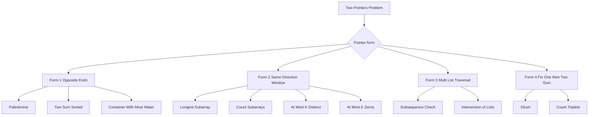

## 1. Core Idea

Two pointers reduce brute force by moving pointers intelligently.

```text
Brute force: try all pairs or all subarrays
Two pointers: move left/right/head/tail so each pointer moves limited times
```

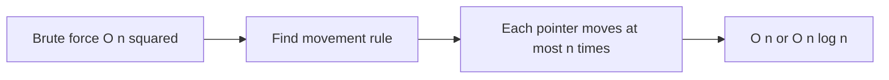

Mental trick: Do not ask which pair should I try. Ask which side can I safely discard.

---

# Form 1: Opposite Ends

## 2. Pattern

Pointers start at both ends.

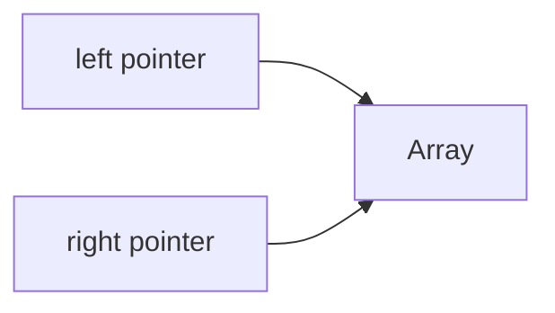

Used when:
- array is sorted
- palindrome check
- pair sum
- container with most water

## 3. Two Sum in Sorted Array

Example:

```text
arr = [2, 7, 11, 15, 19]
target = 18

2 + 19 = 21, too big, move right
2 + 15 = 17, too small, move left
7 + 11 = 18, found
```

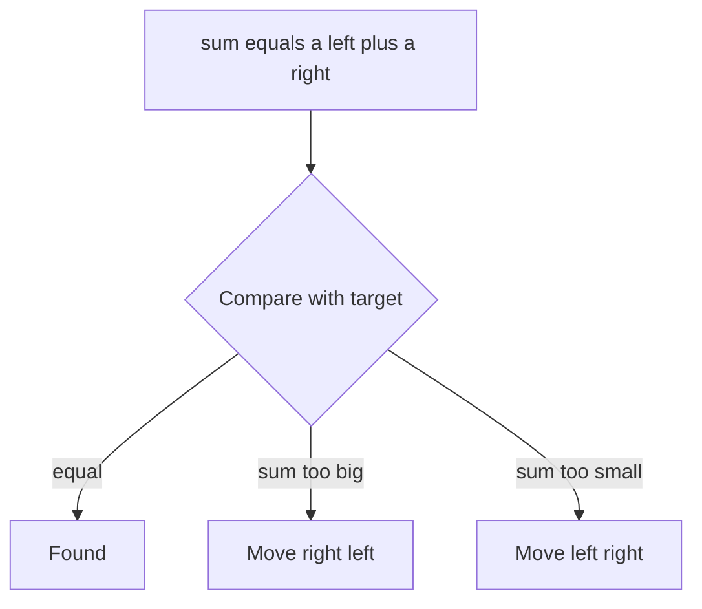

```cpp
bool twoSumSorted(vector<int>& a, int target) {
    int l = 0, r = (int)a.size() - 1;

    while (l < r) {
        int sum = a[l] + a[r];

        if (sum == target) return true;
        if (sum > target) r--;
        else l++;
    }

    return false;
}
```

```java
static boolean twoSumSorted(int[] a, int target) {
    int l = 0, r = a.length - 1;

    while (l < r) {
        int sum = a[l] + a[r];

        if (sum == target) return true;
        if (sum > target) r--;
        else l++;
    }

    return false;
}
```

## 4. Palindrome Check

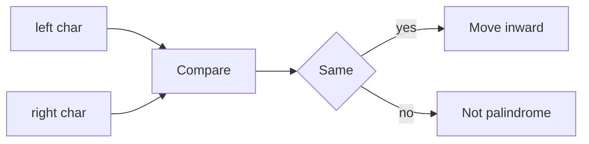

```cpp
bool isPalindrome(string s) {
    int l = 0, r = (int)s.size() - 1;

    while (l < r) {
        if (s[l] != s[r]) return false;
        l++;
        r--;
    }

    return true;
}
```

## 5. Container With Most Water

Area:

```text
area = min(height[left], height[right]) * width
```

Move the smaller height pointer.

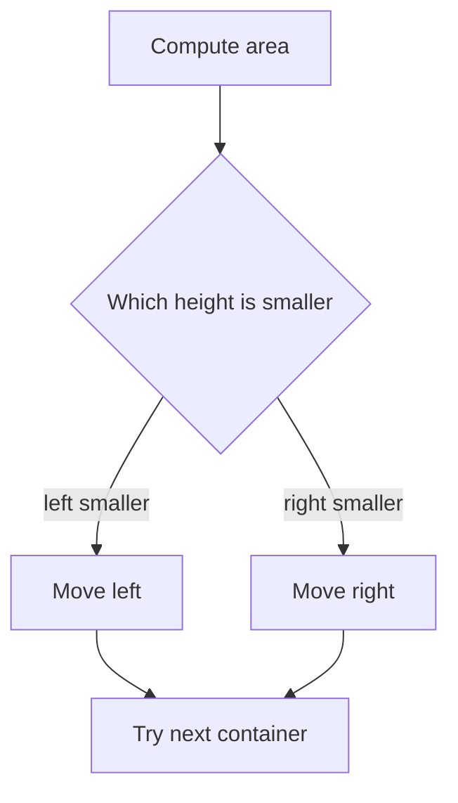

```cpp
int maxArea(vector<int>& height) {
    int l = 0, r = (int)height.size() - 1;
    int ans = 0;

    while (l < r) {
        int width = r - l;
        int h = min(height[l], height[r]);
        ans = max(ans, width * h);

        if (height[l] < height[r]) l++;
        else r--;
    }

    return ans;
}
```

Mental trick: In min/max width problems, move the limiting side.

---

# Form 2: Same Direction Sliding Window

## 6. Pattern

Both pointers move in the same direction.

```text
tail ... head
```

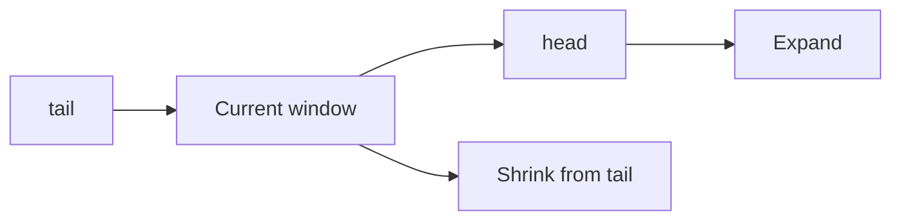

Used when:
- subarray problems
- longest / shortest / count with criteria
- at most K zeros
- at most K distinct elements

## 7. Sliding Window vs Two Pointers

```text
Sliding window: fixed length
Two pointers: length changes
```

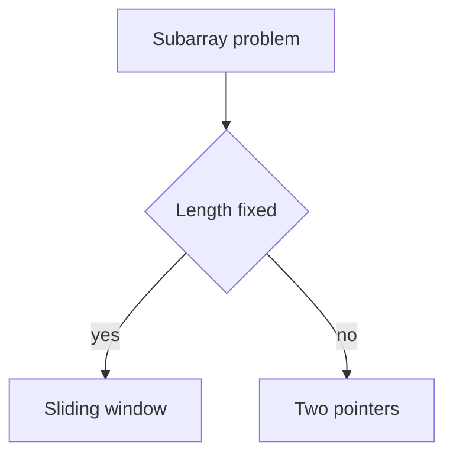

## 8. Longest Subarray with At Most K Zeros

Maintain a window with at most k zeros.

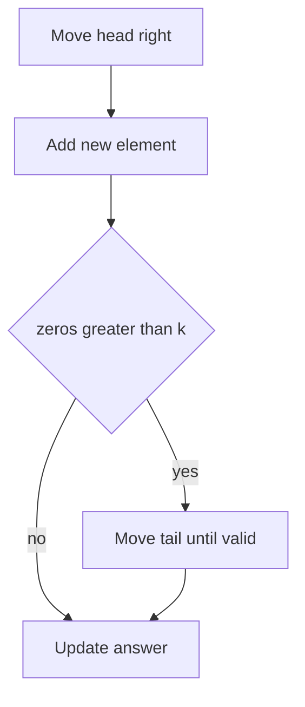

```cpp
int longestOnes(vector<int>& a, int k) {
    int tail = 0, zeros = 0, ans = 0;

    for (int head = 0; head < (int)a.size(); head++) {
        if (a[head] == 0) zeros++;

        while (zeros > k) {
            if (a[tail] == 0) zeros--;
            tail++;
        }

        ans = max(ans, head - tail + 1);
    }

    return ans;
}
```

```java
static int longestOnes(int[] a, int k) {
    int tail = 0, zeros = 0, ans = 0;

    for (int head = 0; head < a.length; head++) {
        if (a[head] == 0) zeros++;

        while (zeros > k) {
            if (a[tail] == 0) zeros--;
            tail++;
        }

        ans = Math.max(ans, head - tail + 1);
    }

    return ans;
}
```

## 9. Generic Same Direction Template

```cpp
int head = -1;
int tail = 0;

// data structure for window

while (tail < n) {
    while (head + 1 < n && canTake(head + 1)) {
        head++;
        add(a[head]);
    }

    updateAnswer(tail, head);

    if (tail > head) {
        tail++;
        head = tail - 1;
    } else {
        remove(a[tail]);
        tail++;
    }
}
```

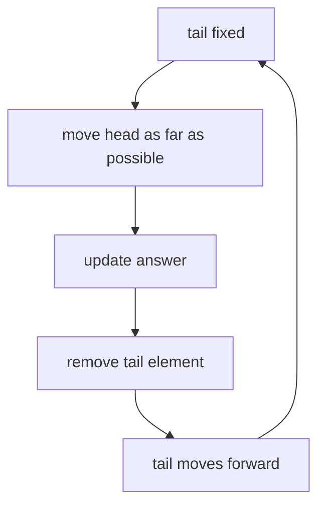

Even with nested while loops, total is O(n) because head and tail only move forward.

## 10. Count Subarrays With At Most K Distinct

For each tail, move head as far as possible. If [tail, head] is valid, then all endings from tail to head are valid.

Count added:

```text
head - tail + 1
```

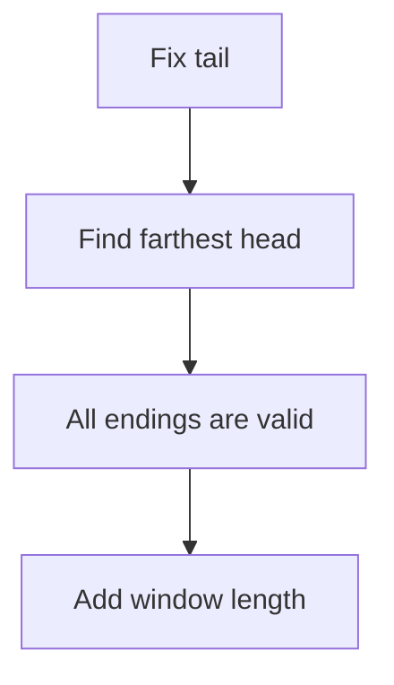

```cpp
long long countAtMostKDistinct(vector<int>& a, int k) {
    int n = a.size();
    int head = -1, tail = 0, distinct = 0;
    long long ans = 0;
    unordered_map<int, int> freq;

    while (tail < n) {
        while (head + 1 < n &&
               (freq[a[head + 1]] > 0 || distinct < k)) {
            head++;
            if (freq[a[head]] == 0) distinct++;
            freq[a[head]]++;
        }

        ans += head - tail + 1;

        if (tail > head) {
            tail++;
            head = tail - 1;
        } else {
            freq[a[tail]]--;
            if (freq[a[tail]] == 0) distinct--;
            tail++;
        }
    }

    return ans;
}
```

If values are small, use frequency array:

```cpp
vector<int> freq(100001, 0);
```

## 11. Exactly K Distinct

```text
exactlyK = atMostK(k) - atMostK(k - 1)
```

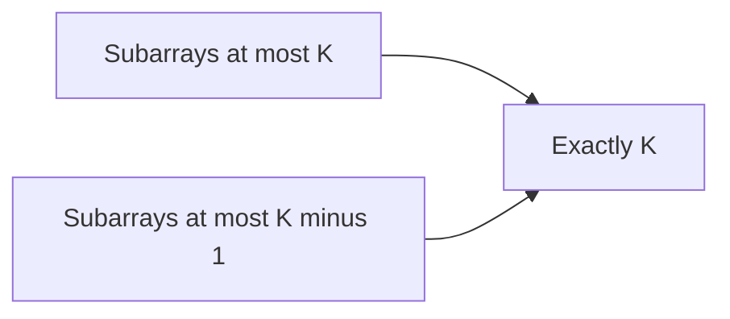

```cpp
long long countExactlyKDistinct(vector<int>& a, int k) {
    return countAtMostKDistinct(a, k) - countAtMostKDistinct(a, k - 1);
}
```

Mental trick: Exact is often hard. Convert exact into difference of at most.

## 12. Distinct Greater or Equal K

Total subarrays:

```text
n * (n + 1) / 2
```

```text
count distinct >= k = total - count distinct <= k - 1
```

```cpp
long long countAtLeastKDistinct(vector<int>& a, int k) {
    long long n = a.size();
    long long total = n * (n + 1) / 2;
    return total - countAtMostKDistinct(a, k - 1);
}
```

---

# Form 3: Multi List Traversal

## 13. Subsequence Check

Check whether s is a subsequence of t.

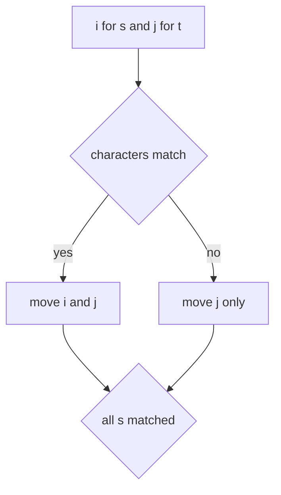

```cpp
bool isSubsequence(string s, string t) {
    int i = 0, j = 0;

    while (i < (int)s.size() && j < (int)t.size()) {
        if (s[i] == t[j]) i++;
        j++;
    }

    return i == (int)s.size();
}
```

```java
static boolean isSubsequence(String s, String t) {
    int i = 0, j = 0;

    while (i < s.length() && j < t.length()) {
        if (s.charAt(i) == t.charAt(j)) i++;
        j++;
    }

    return i == s.length();
}
```

## 14. Intersection of Two Sorted Lists

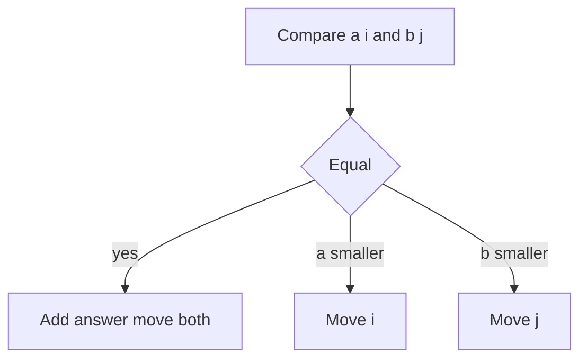

```cpp
vector<int> intersectionSorted(vector<int>& a, vector<int>& b) {
    int i = 0, j = 0;
    vector<int> ans;

    while (i < (int)a.size() && j < (int)b.size()) {
        if (a[i] == b[j]) {
            ans.push_back(a[i]);
            i++;
            j++;
        } else if (a[i] < b[j]) {
            i++;
        } else {
            j++;
        }
    }

    return ans;
}
```

Mental trick: eliminate the smaller value because it cannot match the bigger current value.

---

# Form 4: Fix One Element then Two Pointers

## 15. 3Sum

Find triplets:

```text
a[i] + a[j] + a[k] = target
```

Sort array. Fix one element. Then solve 2Sum on the remaining part.

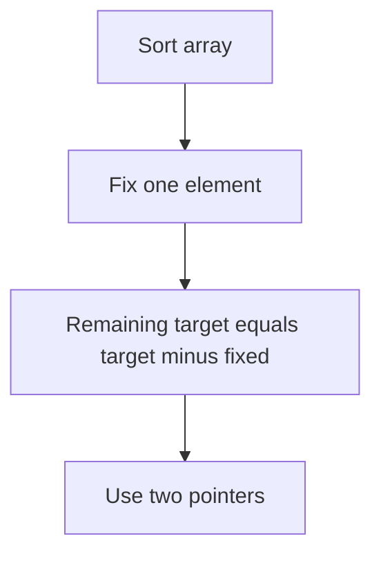

Example:

```text
A = [2,3,5,5,7,9,9,13,15,20]
target = 21

Solutions:
3,5,13
5,7,9
```

```cpp
vector<vector<int>> threeSumTarget(vector<int>& a, int target) {
    sort(a.begin(), a.end());

    vector<vector<int>> ans;
    int n = a.size();

    for (int i = 0; i < n; i++) {
        if (i > 0 && a[i] == a[i - 1]) continue;

        int l = i + 1;
        int r = n - 1;

        while (l < r) {
            long long sum = (long long)a[i] + a[l] + a[r];

            if (sum == target) {
                ans.push_back({a[i], a[l], a[r]});

                int leftValue = a[l];
                int rightValue = a[r];

                while (l < r && a[l] == leftValue) l++;
                while (l < r && a[r] == rightValue) r--;
            } else if (sum < target) {
                l++;
            } else {
                r--;
            }
        }
    }

    return ans;
}
```

## 16. Count 3Sum With Duplicates

When sum is equal, count duplicate blocks.

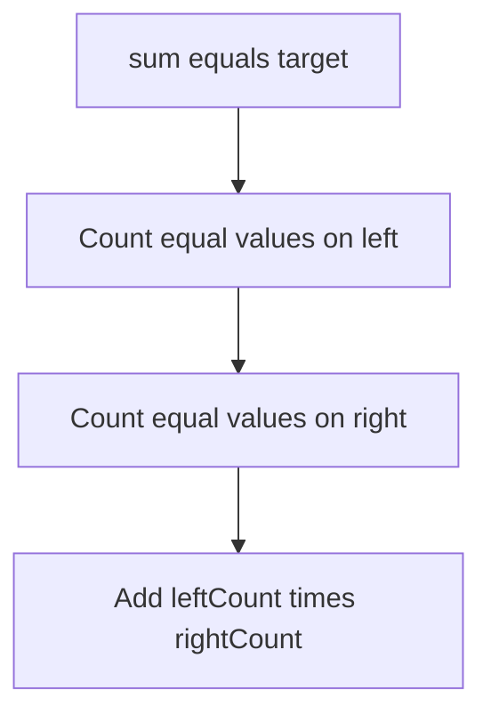

```cpp
long long countTriplets(vector<int>& a, int target) {
    sort(a.begin(), a.end());

    int n = a.size();
    long long count = 0;

    for (int j = 0; j < n; j++) {
        int i = 0;
        int k = n - 1;

        while (i < j && j < k) {
            long long sum = (long long)a[i] + a[j] + a[k];

            if (sum == target) {
                int iCount = 1;
                int kCount = 1;

                while (i + iCount < j && a[i + iCount] == a[i]) iCount++;
                while (k - kCount > j && a[k - kCount] == a[k]) kCount--;

                count += 1LL * iCount * kCount;
                i += iCount;
                k -= kCount;
            } else if (sum > target) {
                k--;
            } else {
                i++;
            }
        }
    }

    return count;
}
```

Important: sort first.

---

## 17. Pattern Recognition Cheat Sheet

| Problem phrase | Use |
|---|---|
| sorted array plus pair sum | opposite ends |
| palindrome | opposite ends |
| max container area | opposite ends |
| longest subarray with condition | same direction |
| count subarrays with condition | same direction |
| at most k distinct | frequency plus same direction |
| exactly k | atMost k minus atMost k minus one |
| subsequence | multi-list traversal |
| intersection of sorted lists | multi-list traversal |
| 3Sum | sort plus fix one plus 2Sum |

---

## 18. Architecture Template

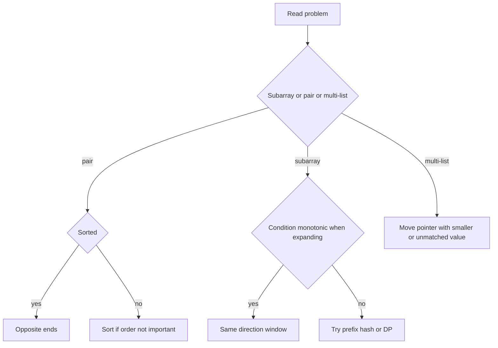

---

## 19. Common Mistakes

1. Forgetting to sort for 2Sum or 3Sum.
2. Moving the wrong pointer.
3. Forgetting to remove element when tail moves.
4. Counting only one subarray instead of window length.
5. Using set when frequency is needed.
6. Thinking nested while means O(n squared), even when both pointers only move forward.
7. For exact K, trying direct logic instead of atMost(K) minus atMost(K-1).

---

## 20. Final Quick Notes

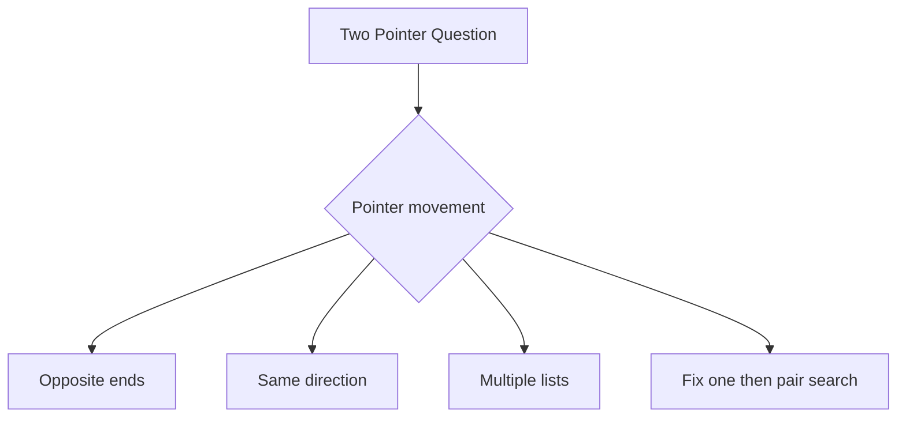

Last-minute mental tricks:
- Sorted pair sum: big sum means right--, small sum means left++.
- Container: move smaller wall.
- Subarray: expand head, shrink tail.
- Count valid windows: add window length.
- Exactly K: at most K minus at most K minus one.
- Multi-list: move pointer that is behind.
- 3Sum: sort, fix one, run 2Sum.

---

END
