# Bit Manipulation Pattern-Wise Visual Reference

Visual CP reference for **Bit Manipulation / Bitmasking** with Mermaid diagrams, C++ snippets, Java helpers where useful, examples, and mental tricks.

---

## 0. Master Pattern Map

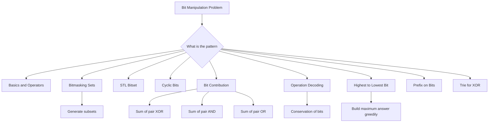

---

## 1. Why Bits Matter

Everything inside a computer is stored using `0` and `1`.

```text
13 decimal = 1101 binary
```

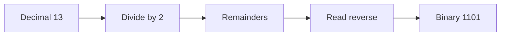

### Convert decimal to binary manually

```text
13 / 2 = 6 remainder 1
6 / 2  = 3 remainder 0
3 / 2  = 1 remainder 1
1 / 2  = 0 remainder 1

Read reverse = 1101
```

### C++ helper

```cpp
string toBinary(long long x) {
    if (x == 0) return "0";

    string s;
    while (x > 0) {
        s.push_back(char('0' + (x % 2)));
        x /= 2;
    }

    reverse(s.begin(), s.end());
    return s;
}
```

---

## 2. Bit Operators

| Operator | Meaning |
|---|---|
| `&` | AND |
| `|` | OR |
| `^` | XOR |
| `~` | NOT |
| `<<` | left shift |
| `>>` | right shift |

### AND

```text
1 & 1 = 1
1 & 0 = 0
0 & 1 = 0
0 & 0 = 0
```

### OR

```text
1 | 1 = 1
1 | 0 = 1
0 | 1 = 1
0 | 0 = 0
```

### XOR

```text
same bits -> 0
different bits -> 1
```

```text
1 ^ 1 = 0
1 ^ 0 = 1
0 ^ 1 = 1
0 ^ 0 = 0
```

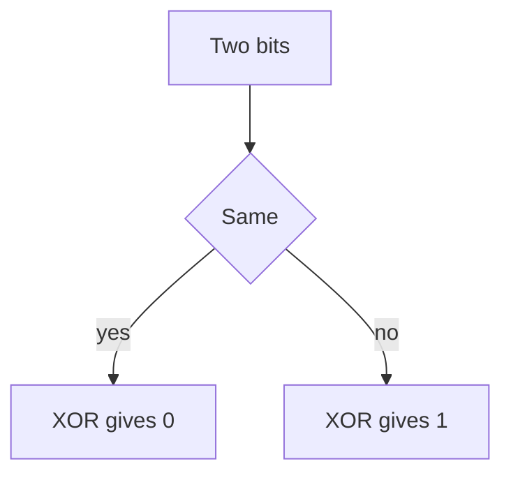

---

## 3. Power of Two Table

Remember these:

```text
2^0  = 1
2^1  = 2
2^2  = 4
2^3  = 8
2^4  = 16
2^5  = 32
2^6  = 64
2^7  = 128
2^8  = 256
2^9  = 512
2^10 = 1024
2^16 = 65536
```

### C++ safe power of two

```cpp
long long p = 1LL << k;
```

Do **not** use this for large shifts:

```cpp
int x = 1 << 31; // overflow risk
```

Use:

```cpp
long long x = 1LL << 31;
```

---

## 4. Shift Operators

### Left shift

```text
x << y = x * 2^y
```

Example:

```text
1011 << 1 = 10110
1011 << 2 = 101100
```

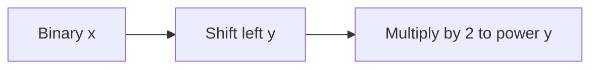

### Right shift

```text
x >> y = floor(x / 2^y)
```

Example:

```text
1011 >> 1 = 101
1011 >> 2 = 10
1011 >> 3 = 1
```

### C++ code

```cpp
long long multiplyByPowerOfTwo(long long x, int y) {
    return x << y;
}

long long divideByPowerOfTwo(long long x, int y) {
    return x >> y;
}
```

---

## 5. Check, Set, Clear, Toggle Bit

For bit position `pos`.

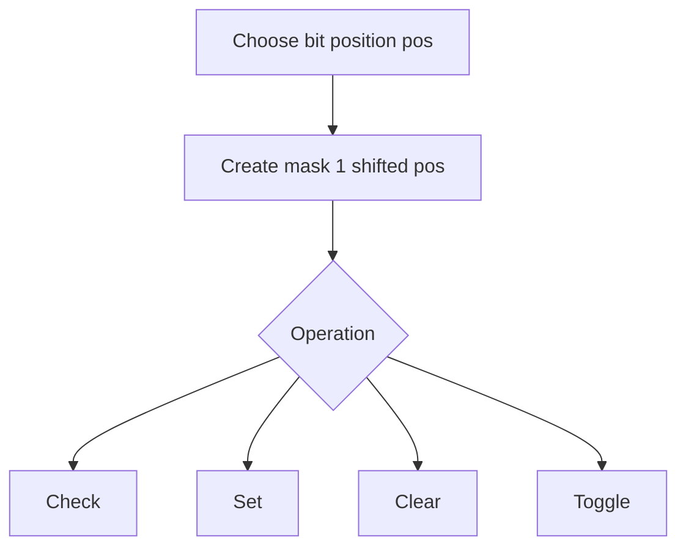

### Check bit

```cpp
bool isSet(long long x, int pos) {
    return (x >> pos) & 1LL;
}
```

### Set bit to 1

```cpp
long long setBit(long long x, int pos) {
    return x | (1LL << pos);
}
```

### Clear bit to 0

```cpp
long long clearBit(long long x, int pos) {
    return x & ~(1LL << pos);
}
```

### Toggle bit

```cpp
long long toggleBit(long long x, int pos) {
    return x ^ (1LL << pos);
}
```

### Java helpers

```java
static boolean isSet(long x, int pos) {
    return ((x >> pos) & 1L) == 1L;
}

static long setBit(long x, int pos) {
    return x | (1L << pos);
}

static long clearBit(long x, int pos) {
    return x & ~(1L << pos);
}

static long toggleBit(long x, int pos) {
    return x ^ (1L << pos);
}
```

---

## 6. Common Bit Tricks

### Power of two check

```cpp
bool isPowerOfTwo(long long n) {
    return n > 0 && (n & (n - 1)) == 0;
}
```

### Count set bits

```cpp
int countBits(long long x) {
    return __builtin_popcountll(x);
}
```

### Lowest set bit

```cpp
long long lowbit(long long x) {
    return x & -x;
}
```

### Remove lowest set bit

```cpp
x = x & (x - 1);
```

### Mental trick

```text
x & (x - 1) removes the rightmost 1
```

---

# Pattern 1: Bitmasking as Set Representation

---

## 7. Represent a Set Using One Integer

If the universe is:

```text
U = {1, 3, 5, 7, 10}
index: 0  1  2  3   4
```

Subset:

```text
{1, 5, 10}
```

Mask:

```text
index 0 -> 1 present
index 1 -> 0 absent
index 2 -> 1 present
index 3 -> 0 absent
index 4 -> 1 present

mask = 10101 binary
```

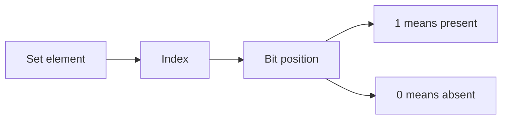

### Why useful

Instead of storing subset as array, store it as one integer.

---

## 8. Set Union and Intersection with Bits

If:

```text
A = 11001
B = 01110
```

Union:

```text
A | B = 11111
```

Intersection:

```text
A & B = 01000
```

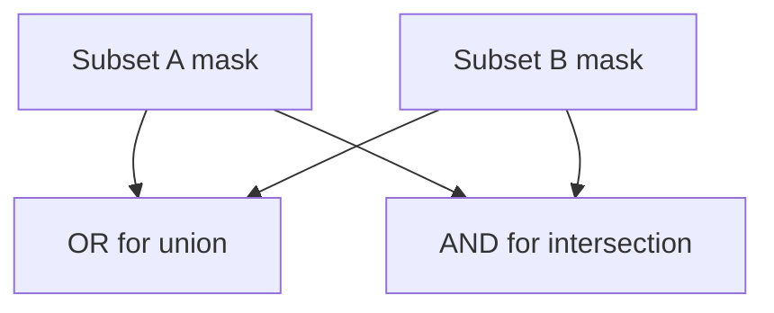

### C++ code

```cpp
int setUnionMask(int A, int B) {
    return A | B;
}

int setIntersectionMask(int A, int B) {
    return A & B;
}
```

### Mental trick

```text
Set union behaves like OR
Set intersection behaves like AND
```

---

## 9. Generate All Subsets

For `n` elements, there are:

```text
2^n subsets
```

Each element has two choices:
- take it
- do not take it

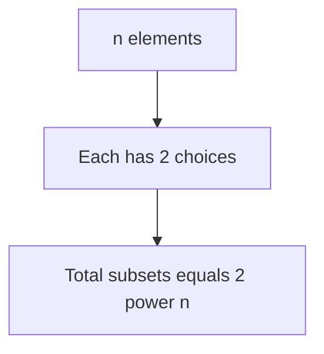

### Example

```text
arr = [1, 5, 6]

mask 000 -> {}
mask 001 -> {1}
mask 010 -> {5}
mask 011 -> {1,5}
mask 100 -> {6}
mask 111 -> {1,5,6}
```

### C++ code

```cpp
void printAllSubsets(vector<int>& arr) {
    int n = arr.size();

    for (int mask = 0; mask < (1 << n); mask++) {
        cout << mask << ": { ";

        for (int pos = 0; pos < n; pos++) {
            if ((mask >> pos) & 1) {
                cout << arr[pos] << " ";
            }
        }

        cout << "}\n";
    }
}
```

### Safer for large n

```cpp
for (long long mask = 0; mask < (1LL << n); mask++) {
    // use long long
}
```

---

## 10. Generate Elements NOT Present in Subset

Check if bit is zero.

```cpp
void printNotInSubset(vector<int>& arr, int mask) {
    int n = arr.size();

    for (int pos = 0; pos < n; pos++) {
        if (((mask >> pos) & 1) == 0) {
            cout << arr[pos] << " ";
        }
    }
}
```

### Important precedence warning

Write:

```cpp
if (((mask >> pos) & 1) == 0)
```

Avoid unclear expressions without brackets.

---

# Pattern 2: C++ Bitset STL

---

## 11. What is bitset

`bitset` acts like a middleman between numbers and arrays of bits.

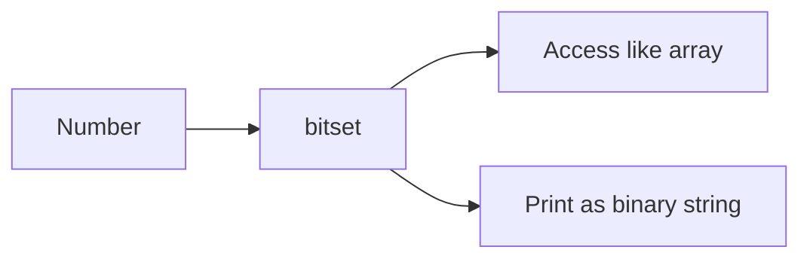

### Declaration

```cpp
bitset<8> b;
```

### Initialize with number

```cpp
bitset<4> b(7);
cout << b << "\n"; // 0111
```

### Initialize with string

```cpp
bitset<4> b(string("1010"));
cout << b << "\n"; // 1010
```

### Access and modify

```cpp
bitset<4> b(string("1010"));

cout << b[1] << "\n";

b[2] = 1;
cout << b << "\n";
```

### Binary constants

```cpp
bitset<4> b(0b1010);
```

### More than 64 bits

```cpp
bitset<100> b;
```

Use this when you need more bits than normal integer can store.

---

# Pattern 3: Cyclic Property of Bits

---

## 12. Bit Cycles

Bits repeat in cycles.

For bit `i`:

```text
cycle length = 2^(i+1)
number of consecutive zeros = 2^i
number of consecutive ones  = 2^i
```

Example for bit 0:

```text
0 1 0 1 0 1
```

Example for bit 1:

```text
0 0 1 1 0 0 1 1
```

Example for bit 2:

```text
0 0 0 0 1 1 1 1
```

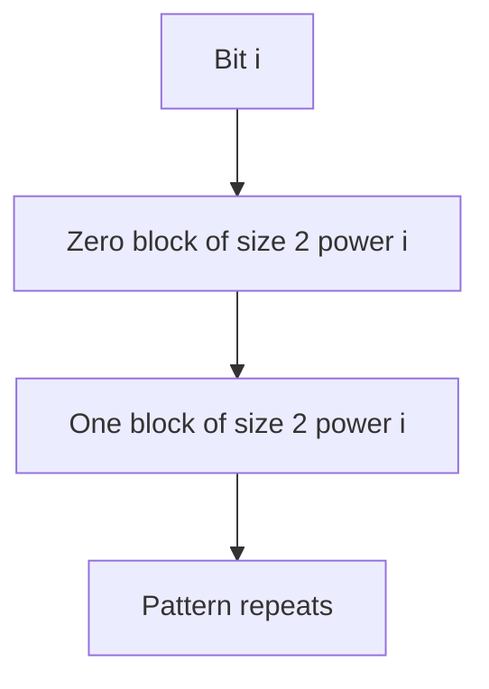

---

## 13. Count Ones at Bit i from 0 to x

For numbers `0` to `x`, total numbers:

```text
total = x + 1
```

For bit `i`:

```text
cycle = 2^(i+1)
fullCycles = total / cycle
remainder = total % cycle

ones = fullCycles * 2^i + max(0, remainder - 2^i)
```

### Example

Count ones at bit 2 from `0` to `19`.

```text
i = 2
2^i = 4
cycle = 8
total = 20

fullCycles = 20 / 8 = 2
remainder = 20 % 8 = 4

ones = 2 * 4 + max(0, 4 - 4)
ones = 8
```

### C++ code

```cpp
long long countOnesAtBit(long long x, int bit) {
    long long total = x + 1;
    long long half = 1LL << bit;
    long long cycle = 1LL << (bit + 1);

    long long full = total / cycle;
    long long rem = total % cycle;

    return full * half + max(0LL, rem - half);
}
```

---

## 14. Sum of Set Bits from 0 to x

```cpp
long long sumOfBits(long long x) {
    long long ans = 0;

    for (int bit = 0; bit < 60; bit++) {
        ans += countOnesAtBit(x, bit);
    }

    return ans;
}
```

### Mental trick

> Never generate all binary strings if you can count column-wise.

---

## 15. K-th One in Infinite Binary Writing

Sometimes the problem asks for the position of the `k`-th `1` in the infinite sequence:

```text
0, 1, 10, 11, 100, ...
```

Architecture:

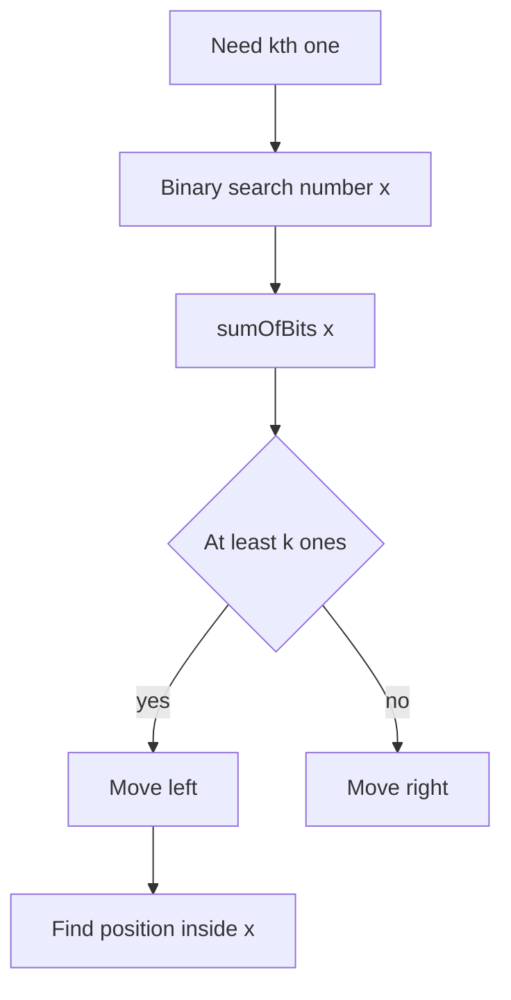

### C++ sketch

```cpp
long long findNumberContainingKthOne(long long k) {
    long long lo = 0, hi = 4e18, ans = -1;

    while (lo <= hi) {
        long long mid = lo + (hi - lo) / 2;

        if (sumOfBits(mid) >= k) {
            ans = mid;
            hi = mid - 1;
        } else {
            lo = mid + 1;
        }
    }

    return ans;
}
```

---

# Pattern 4: Bit Contribution Technique

---

## 16. Why Contribution Works

Bit expressions are usually independent bit by bit.

Instead of computing pair by pair:

```text
for all i < j
    add a[i] XOR a[j]
```

Compute contribution of each bit.

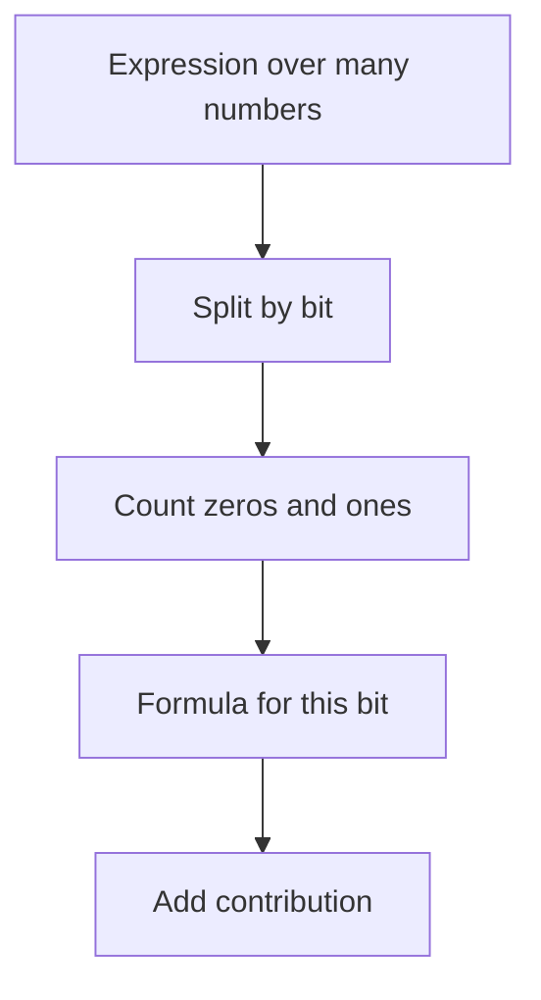

---

## 17. Sum of Pair XOR

For each bit:
- let `ones = count of numbers with bit set`
- let `zeros = n - ones`

A pair contributes `1` to XOR at this bit when bits are different.

```text
pairs = ones * zeros
contribution = pairs * 2^bit
```

### Example

```text
arr = [1, 3, 5]

binary:
1 = 001
3 = 011
5 = 101

bit 0: ones = 3, zeros = 0 -> contribution 0
bit 1: ones = 1, zeros = 2 -> 1*2*2 = 4
bit 2: ones = 1, zeros = 2 -> 1*2*4 = 8

total = 12
```

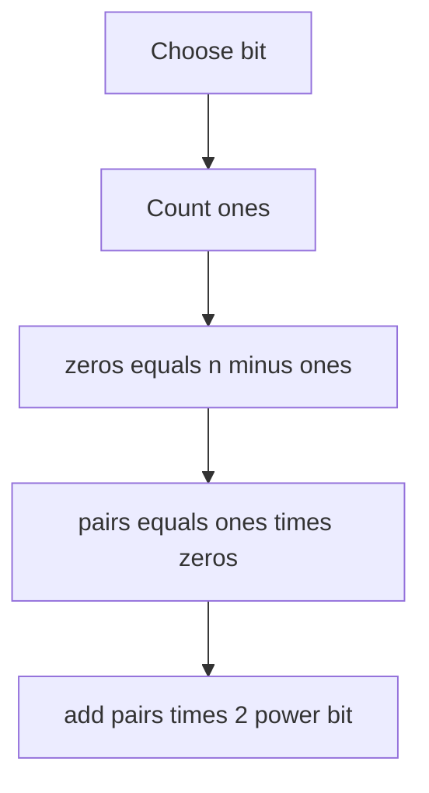

### C++ code

```cpp
long long sumPairXor(vector<int>& a) {
    int n = a.size();
    long long ans = 0;

    for (int bit = 0; bit < 31; bit++) {
        long long ones = 0;

        for (int x : a) {
            if ((x >> bit) & 1) ones++;
        }

        long long zeros = n - ones;
        ans += ones * zeros * (1LL << bit);
    }

    return ans;
}
```

---

## 18. Sum of Pair AND

For AND, bit contributes only if both numbers have `1`.

```text
pairs = C(ones, 2)
contribution = pairs * 2^bit
```

### C++ code

```cpp
long long sumPairAnd(vector<int>& a) {
    long long ans = 0;

    for (int bit = 0; bit < 31; bit++) {
        long long ones = 0;

        for (int x : a) {
            if ((x >> bit) & 1) ones++;
        }

        ans += ones * (ones - 1) / 2 * (1LL << bit);
    }

    return ans;
}
```

---

## 19. Sum of Pair OR

For OR, bit contributes unless both bits are `0`.

```text
pairs = totalPairs - C(zeros, 2)
contribution = pairs * 2^bit
```

### C++ code

```cpp
long long sumPairOr(vector<int>& a) {
    int n = a.size();
    long long totalPairs = 1LL * n * (n - 1) / 2;
    long long ans = 0;

    for (int bit = 0; bit < 31; bit++) {
        long long ones = 0;

        for (int x : a) {
            if ((x >> bit) & 1) ones++;
        }

        long long zeros = n - ones;
        long long pairs = totalPairs - zeros * (zeros - 1) / 2;

        ans += pairs * (1LL << bit);
    }

    return ans;
}
```

---

## 20. Contribution Formula Summary

| Operation | Bit contributes when | Count |
|---|---|---|
| XOR | one bit is 1 and one bit is 0 | `ones * zeros` |
| AND | both bits are 1 | `C(ones, 2)` |
| OR | at least one bit is 1 | `totalPairs - C(zeros, 2)` |

---

# Pattern 5: Operation Decoding and Conservation of Bits

---

## 21. Key Identity

```text
a + b = (a | b) + (a & b)
```

### Example

```text
a = 12 = 1100
b = 10 = 1010

a | b = 1110 = 14
a & b = 1000 = 8

This identity works bitwise with carry-style conservation.
```

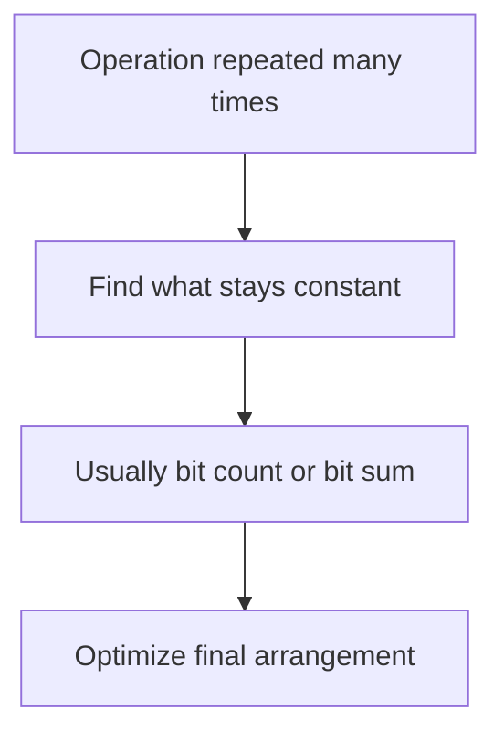

### C++ check

```cpp
bool identity(long long a, long long b) {
    return a + b == (a | b) + (a & b);
}
```

---

## 22. Maximize Sum of Squares After Operations

If operation preserves total bit counts, then to maximize:

```text
sum ai^2
```

make large numbers as large as possible by grouping 1 bits together.

Mental math:

```text
If x + y is constant,
x^2 + y^2 is maximum when one number is as large as possible.
x^2 + y^2 is minimum when numbers are as equal as possible.
```

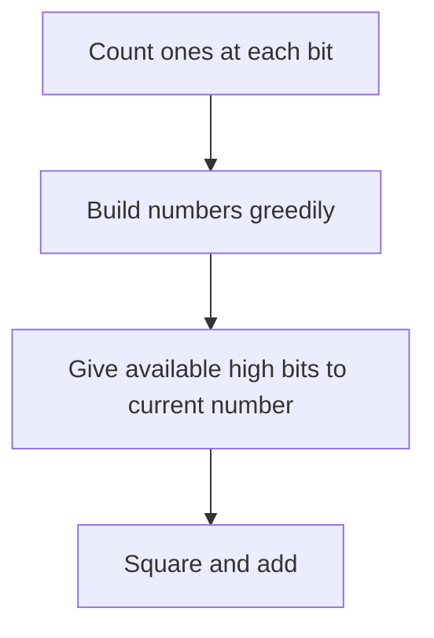

### C++ code

```cpp
long long maximizeSquareSum(vector<int>& a) {
    vector<int> cnt(31, 0);

    for (int x : a) {
        for (int bit = 0; bit < 31; bit++) {
            if ((x >> bit) & 1) cnt[bit]++;
        }
    }

    long long ans = 0;

    for (int i = 0; i < (int)a.size(); i++) {
        long long x = 0;

        for (int bit = 30; bit >= 0; bit--) {
            if (cnt[bit] > 0) {
                x |= (1LL << bit);
                cnt[bit]--;
            }
        }

        ans += x * x;
    }

    return ans;
}
```

---

# Pattern 6: Highest Bit to Lowest Bit Greedy

---

## 23. Build Maximum AND of At Least X Numbers

To maximize an answer bitmask:
- try setting high bits first
- keep only numbers that contain all selected bits
- if at least `x` numbers remain, keep that bit

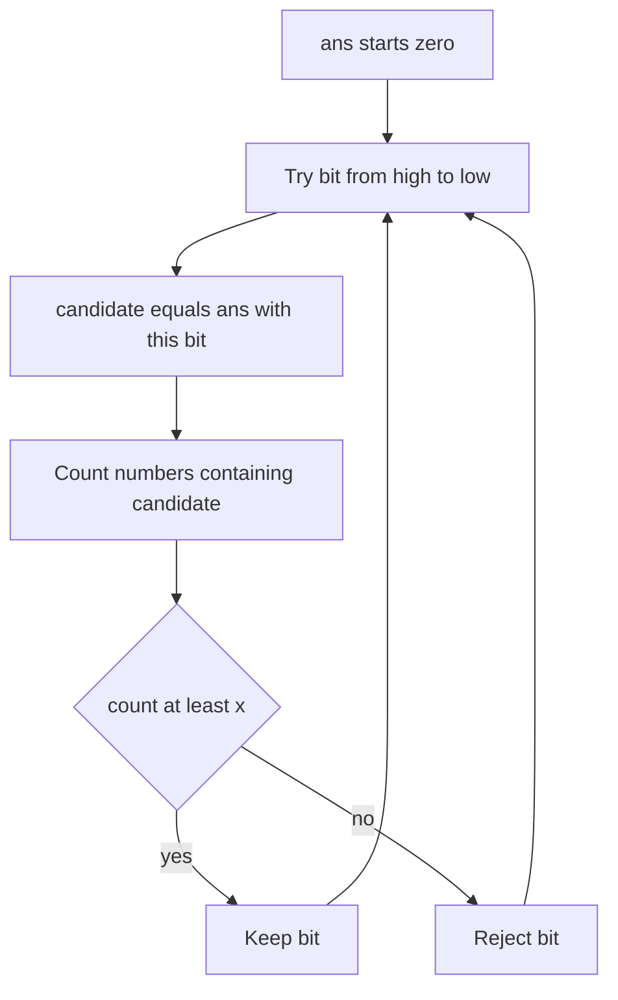

### C++ code

```cpp
long long maxAndAtLeastX(vector<long long>& a, int x) {
    long long ans = 0;

    for (int bit = 60; bit >= 0; bit--) {
        long long candidate = ans | (1LL << bit);
        int count = 0;

        for (long long v : a) {
            if ((v & candidate) == candidate) {
                count++;
            }
        }

        if (count >= x) {
            ans = candidate;
        }
    }

    return ans;
}
```

### Mental trick

> A higher bit is more powerful than all lower bits combined.  
> So decide high bits first.

---

# Pattern 7: Prefix Count on Each Bit

---

## 24. Range Query on Bit Counts

For range queries, build prefix count for each bit.

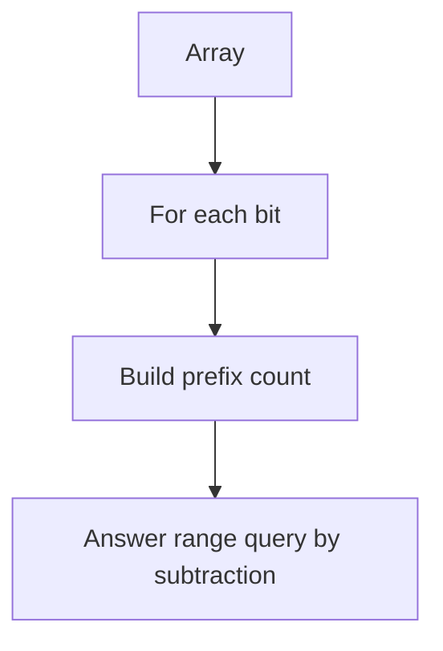

### C++ code

```cpp
struct BitPrefix {
    vector<array<int, 31>> pref;

    BitPrefix(vector<int>& a) {
        int n = a.size();
        pref.assign(n + 1, {});

        for (int i = 0; i < n; i++) {
            pref[i + 1] = pref[i];

            for (int bit = 0; bit < 31; bit++) {
                if ((a[i] >> bit) & 1) {
                    pref[i + 1][bit]++;
                }
            }
        }
    }

    int countOnes(int l, int r, int bit) {
        return pref[r + 1][bit] - pref[l][bit];
    }
};
```

### Use cases

- range AND
- range OR
- range XOR statistics
- segment tree per bit
- sparse table per bit

---

# Pattern 8: Prefix XOR

---

## 25. Subarray XOR

Prefix XOR:

```text
px[i] = a[0] ^ a[1] ^ ... ^ a[i]
```

Subarray XOR:

```text
xor(l, r) = px[r] ^ px[l-1]
```

Because equal parts cancel:

```text
x ^ x = 0
```

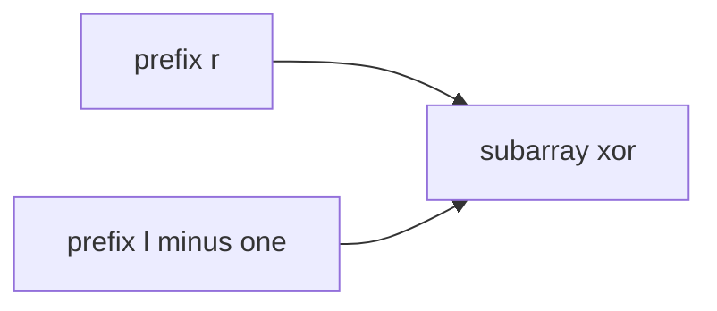

### C++ code

```cpp
vector<int> buildPrefixXor(vector<int>& a) {
    int n = a.size();
    vector<int> px(n + 1, 0);

    for (int i = 0; i < n; i++) {
        px[i + 1] = px[i] ^ a[i];
    }

    return px;
}

int rangeXor(vector<int>& px, int l, int r) {
    return px[r + 1] ^ px[l];
}
```

---

# Pattern 9: XOR Trie

---

## 26. Maximum XOR Pair

For each number, we want the opposite bit at each position.

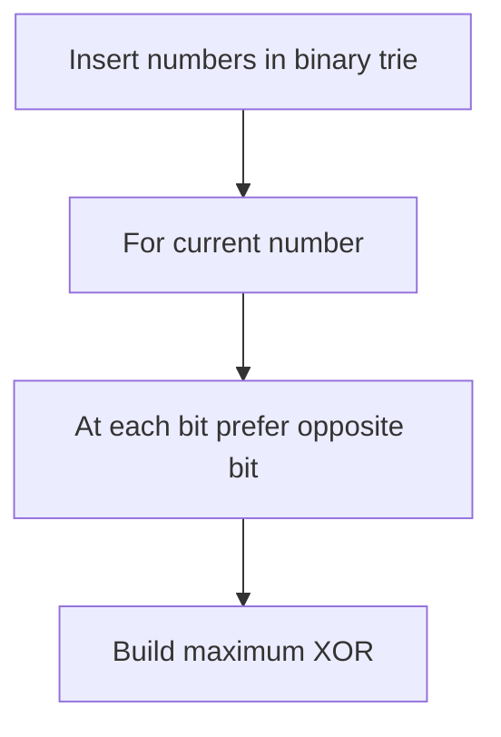

### C++ code

```cpp
struct TrieNode {
    int child[2];

    TrieNode() {
        child[0] = child[1] = -1;
    }
};

struct BinaryTrie {
    vector<TrieNode> trie;

    BinaryTrie() {
        trie.push_back(TrieNode());
    }

    void insert(int x) {
        int node = 0;

        for (int bit = 30; bit >= 0; bit--) {
            int b = (x >> bit) & 1;

            if (trie[node].child[b] == -1) {
                trie[node].child[b] = trie.size();
                trie.push_back(TrieNode());
            }

            node = trie[node].child[b];
        }
    }

    int maxXorWith(int x) {
        int node = 0;
        int ans = 0;

        for (int bit = 30; bit >= 0; bit--) {
            int b = (x >> bit) & 1;
            int want = b ^ 1;

            if (trie[node].child[want] != -1) {
                ans |= (1 << bit);
                node = trie[node].child[want];
            } else {
                node = trie[node].child[b];
            }
        }

        return ans;
    }
};

int maxPairXor(vector<int>& a) {
    BinaryTrie bt;
    int ans = 0;

    for (int x : a) {
        bt.insert(x);
    }

    for (int x : a) {
        ans = max(ans, bt.maxXorWith(x));
    }

    return ans;
}
```

---

# Pattern 10: Subarray OR Equals 1 Counting

---

## 27. Count Subarrays With OR Equal to 1 in Binary Array

For binary array, OR of subarray is `0` only if all elements are `0`.

So:

```text
subarrays with OR 1 = total subarrays - all zero subarrays
```

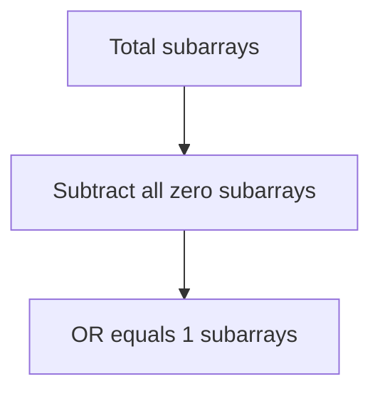

### C++ code

```cpp
long long countSubarraysOrOne(vector<int>& a) {
    long long n = a.size();
    long long total = n * (n + 1) / 2;

    long long zeroOnly = 0;
    long long run = 0;

    for (int x : a) {
        if (x == 0) {
            run++;
        } else {
            zeroOnly += run * (run + 1) / 2;
            run = 0;
        }
    }

    zeroOnly += run * (run + 1) / 2;

    return total - zeroOnly;
}
```

---

# Pattern 11: Bit Operations Table for CP

---

## 28. Pair and Subarray Operation Strategy

| Goal | OR | AND | XOR |
|---|---|---|---|
| best pair | greedy high bit | greedy high bit | trie |
| sum of all pairs | contribution | contribution | contribution |
| least subarray | small OR | large AND | prefix XOR or trie |
| all subarrays sum | bit contribution | bit contribution | prefix XOR |
| with queries | sparse table or segment tree | sparse table or segment tree | prefix XOR |

---

# 29. Java Helpers

```java
static boolean isSet(long x, int bit) {
    return ((x >> bit) & 1L) == 1L;
}

static long setBit(long x, int bit) {
    return x | (1L << bit);
}

static long clearBit(long x, int bit) {
    return x & ~(1L << bit);
}

static int popcount(long x) {
    return Long.bitCount(x);
}

static boolean isPowerOfTwo(long x) {
    return x > 0 && (x & (x - 1)) == 0;
}
```

---

# 30. Common Mistakes

1. Using `1 << 31` instead of `1LL << 31`.
2. Forgetting operator precedence.
3. Thinking XOR distributes over addition.
4. Using `~x` without understanding signed bits.
5. Not using `long long` in contribution formulas.
6. Trying all pairs when bit contribution is possible.
7. Forgetting that each bit is independent in AND OR XOR contribution.
8. Not checking high bits first in greedy bit construction.

---

# 31. Final Mental Tricks

```mermaid
flowchart TD
    A[Bit problem] --> B{Can split by bit}
    B -->|yes| C[Contribution technique]
    B -->|no| D{Need subset}
    D -->|yes| E[Bitmask]
    D -->|no| F{Need max XOR}
    F -->|yes| G[Trie]
    F -->|no| H{Need max AND OR}
    H -->|yes| I[High to low greedy]
    H -->|no| J[Try prefix bit counts]
```

### Quick rules

```text
Set representation -> bitmask
All subsets -> loop mask from 0 to 2^n - 1
Pair XOR sum -> ones * zeros
Pair AND sum -> C(ones, 2)
Pair OR sum -> totalPairs - C(zeros, 2)
Range XOR -> prefix XOR
Max XOR -> trie
Max AND -> high bit greedy
Counting bits 0 to x -> cyclic pattern
```

---

END
