# Recursion + Backtracking Pattern-Wise Visual Reference

A clean CP/DSA reference made from the attached notes.  
Includes **LCCM**, pattern-wise thinking, Mermaid diagrams, step-by-step examples, small C++ code, and Java helpers where useful.

---

## 0. One-Minute Master Map

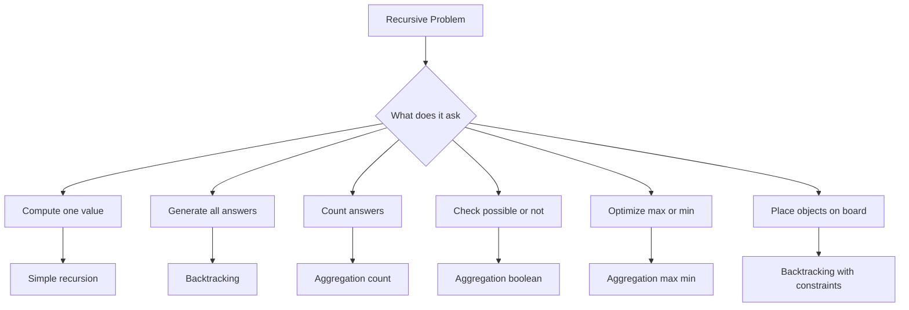

### 1-minute mental trick

> Recursion = solve a smaller version.  
> Backtracking = try choice, recurse, undo choice.

---

# 1. LCCM Framework

Your notes repeatedly use **LCCM**:

```text
L = Level
C = Choice
C = Check / Constraint
M = Move
```

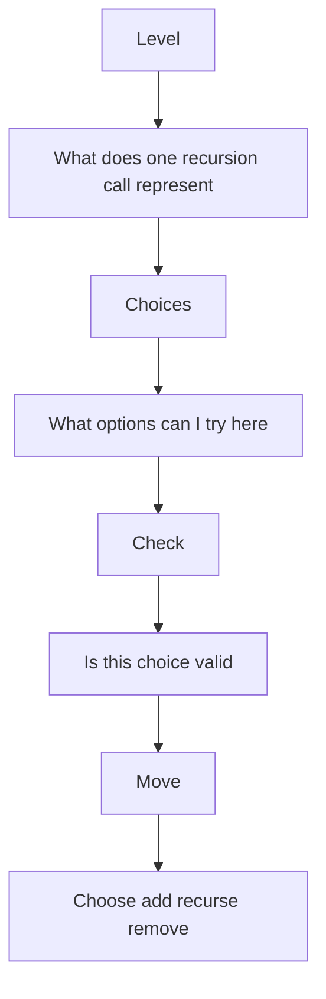

## LCCM meaning

| Part | Meaning | Question to ask |
|---|---|---|
| Level | recursion depth / index / position | Where am I? |
| Choice | options available | What can I pick? |
| Check | validity / pruning | Is this allowed? |
| Move | action | Add, recurse, remove |

### Universal backtracking template

```cpp
void dfs(int level) {
    if (base_case) {
        save_answer();
        return;
    }

    for (auto choice : choices) {
        if (!valid(choice)) continue;

        apply(choice);
        dfs(next_level);
        undo(choice);
    }
}
```

### Java-style template

```java
static void dfs(int level) {
    if (baseCase()) {
        saveAnswer();
        return;
    }

    for (Choice choice : choices) {
        if (!valid(choice)) continue;

        apply(choice);
        dfs(level + 1);
        undo(choice);
    }
}
```

---

# 2. Recursion Basics

## 2.1 Base Case + Recursive Case

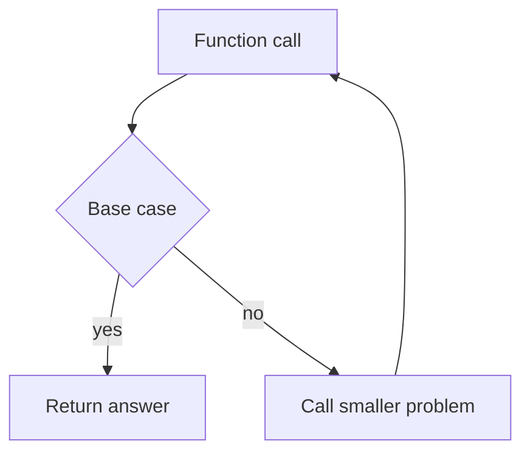

Example factorial:

```text
fact(n) = n * fact(n - 1)
fact(0) = 1
```

```cpp
long long fact(int n) {
    if (n == 0) return 1;
    return 1LL * n * fact(n - 1);
}
```

### Step example

```text
fact(4)
= 4 * fact(3)
= 4 * 3 * fact(2)
= 4 * 3 * 2 * fact(1)
= 4 * 3 * 2 * 1 * fact(0)
= 24
```

---

## 2.2 Recursion Tree vs Recursion Stack

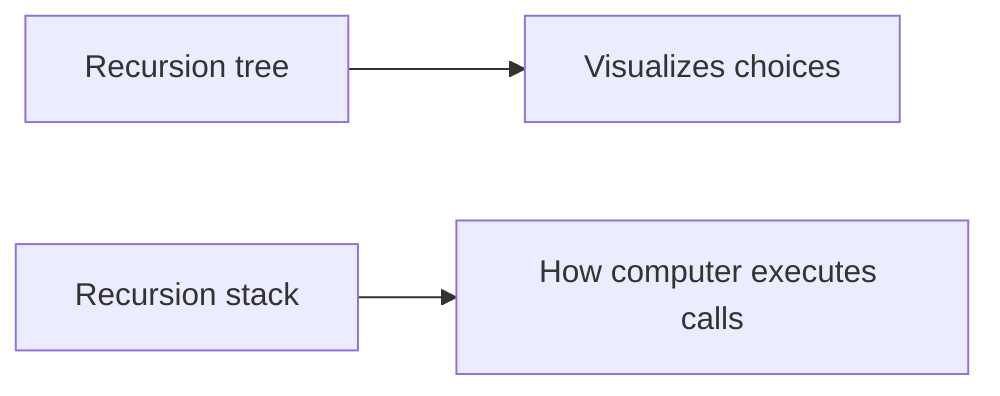

### Mental trick

- Use **recursion tree** to understand logic.
- Use **recursion stack** to debug code.

---

# 3. Generate All Answers Pattern

Use when question asks:

```text
print all
return all
generate all
list all
```

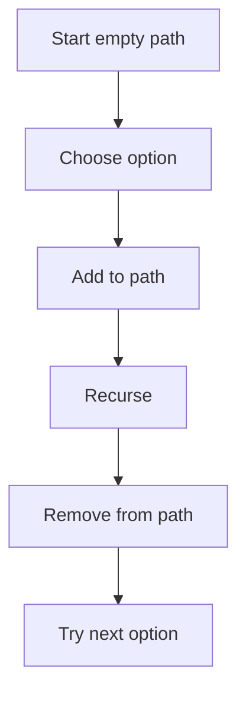

### Core rule

> Do not save answer in accumulator until base case.

---

# 4. Generate Strings of Length N from Characters

Problem:

```text
Given chars = ['a', 'b']
n = 2
Generate all strings:
aa, ab, ba, bb
```

## LCCM

```text
Level      = index / position in string
Choices    = 'a' or 'b'
Check      = none
Move       = add char -> recurse -> remove char
Base case  = path length == n
```

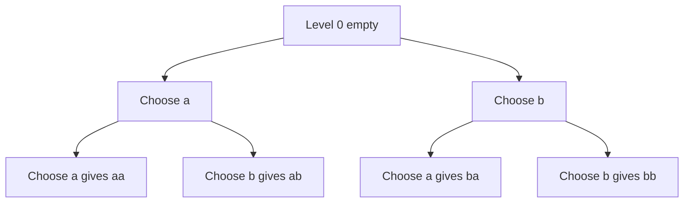

### C++ code

```cpp
void generateStrings(int n, string& path, vector<string>& ans) {
    if ((int)path.size() == n) {
        ans.push_back(path);
        return;
    }

    for (char ch : {'a', 'b'}) {
        path.push_back(ch);
        generateStrings(n, path, ans);
        path.pop_back();
    }
}
```

---

# 5. Phone Keypad Letter Combinations

Problem:

```text
digits = "23"

2 -> abc
3 -> def

Output:
ad ae af bd be bf cd ce cf
```

## LCCM

```text
Level      = index in digits
Choices    = letters mapped from digits[level]
Check      = stop when level == digits.length
Move       = add letter -> recurse -> remove letter
```

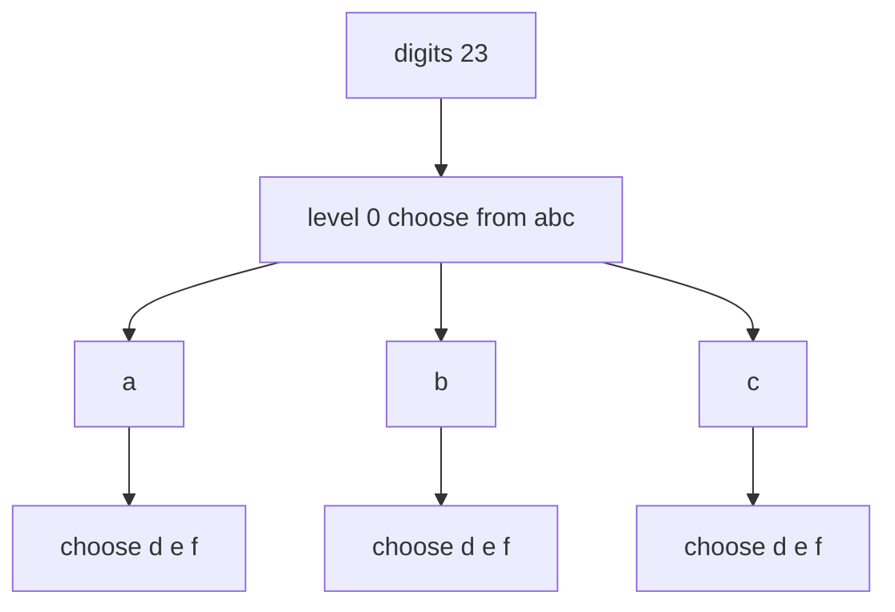

### C++ code

```cpp
vector<string> phoneCombinations(string digits) {
    if (digits.empty()) return {};

    vector<string> mp = {
        "", "", "abc", "def", "ghi", "jkl",
        "mno", "pqrs", "tuv", "wxyz"
    };

    vector<string> ans;
    string path;

    function<void(int)> dfs = [&](int level) {
        if (level == (int)digits.size()) {
            ans.push_back(path);
            return;
        }

        int digit = digits[level] - '0';
        for (char ch : mp[digit]) {
            path.push_back(ch);
            dfs(level + 1);
            path.pop_back();
        }
    };

    dfs(0);
    return ans;
}
```

### Java helper

```java
static List<String> phoneCombinations(String digits) {
    String[] mp = {"", "", "abc", "def", "ghi", "jkl", "mno", "pqrs", "tuv", "wxyz"};
    List<String> ans = new ArrayList<>();
    if (digits.length() == 0) return ans;

    backtrackPhone(0, digits, mp, new StringBuilder(), ans);
    return ans;
}

static void backtrackPhone(int level, String digits, String[] mp,
                           StringBuilder path, List<String> ans) {
    if (level == digits.length()) {
        ans.add(path.toString());
        return;
    }

    int d = digits.charAt(level) - '0';
    for (char ch : mp[d].toCharArray()) {
        path.append(ch);
        backtrackPhone(level + 1, digits, mp, path, ans);
        path.deleteCharAt(path.length() - 1);
    }
}
```

### 1-minute mental trick

> One digit = one level.  
> Letters of that digit = choices.

---

# 6. Backtracking With Pruning

Pruning means:

```text
Do not enter a branch if it can never produce a valid answer.
```

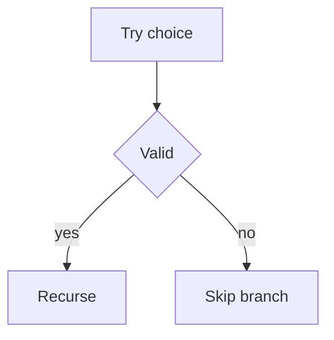

### Why pruning matters

Without pruning, you explore useless branches.  
With pruning, recursion tree becomes smaller.

---

# 7. Palindrome Partitioning

Problem:

```text
s = "aab"

Valid partitions:
["a", "a", "b"]
["aa", "b"]
```

## LCCM

```text
Level      = start index of next substring
Choices    = all substrings s[start..end]
Check      = substring must be palindrome
Move       = add substring -> recurse from end + 1 -> remove
Base case  = start == s.length
```

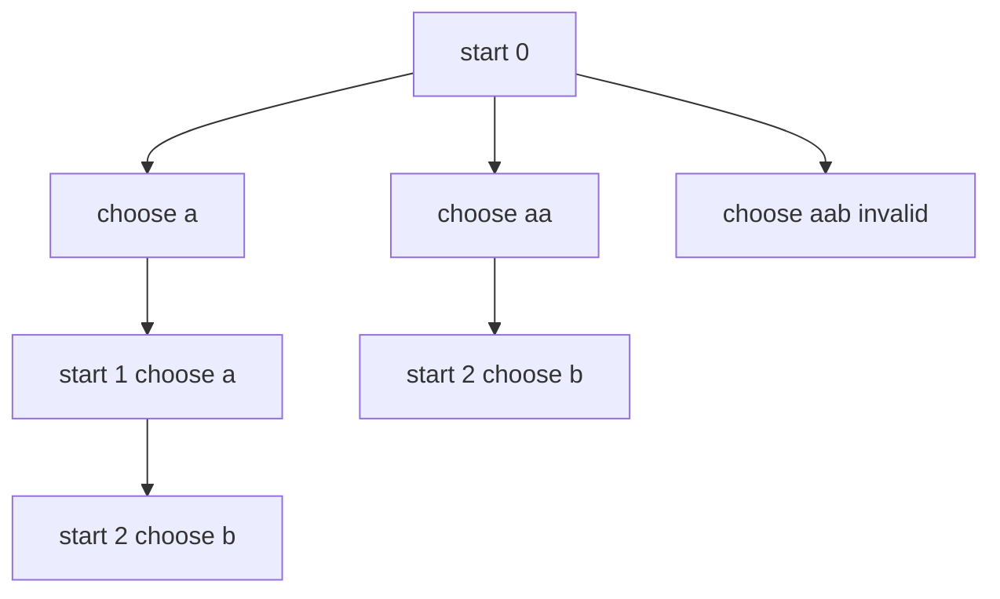

### Palindrome check

```cpp
bool isPal(const string& s, int l, int r) {
    while (l < r) {
        if (s[l] != s[r]) return false;
        l++;
        r--;
    }
    return true;
}
```

### C++ code

```cpp
vector<vector<string>> partitionPalindrome(string s) {
    vector<vector<string>> ans;
    vector<string> path;

    function<void(int)> dfs = [&](int start) {
        if (start == (int)s.size()) {
            ans.push_back(path);
            return;
        }

        for (int end = start; end < (int)s.size(); end++) {
            if (!isPal(s, start, end)) continue;

            path.push_back(s.substr(start, end - start + 1));
            dfs(end + 1);
            path.pop_back();
        }
    };

    dfs(0);
    return ans;
}
```

### 1-minute mental trick

> Partitioning problems usually mean:  
> Level = start index, Choice = next cut.

---

# 8. Additional State Pattern

Some backtracking problems need extra state.

Example state:
- used array
- open and close count
- remaining target
- board occupancy
- frequency map

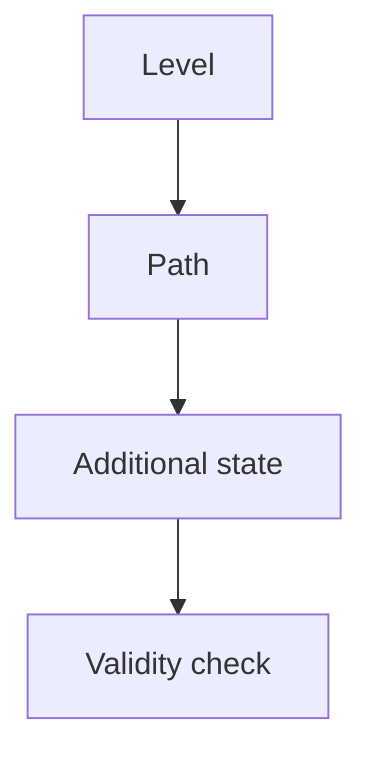

---

# 9. Generate Valid Parentheses

Problem:

```text
n = 2
Output:
(())
()()
```

## LCCM

```text
Level      = position in string
Choices    = add '(' or ')'
Check      = open <= n, close <= open
Move       = add char -> update count -> recurse -> remove
Base case  = path length == 2*n
```

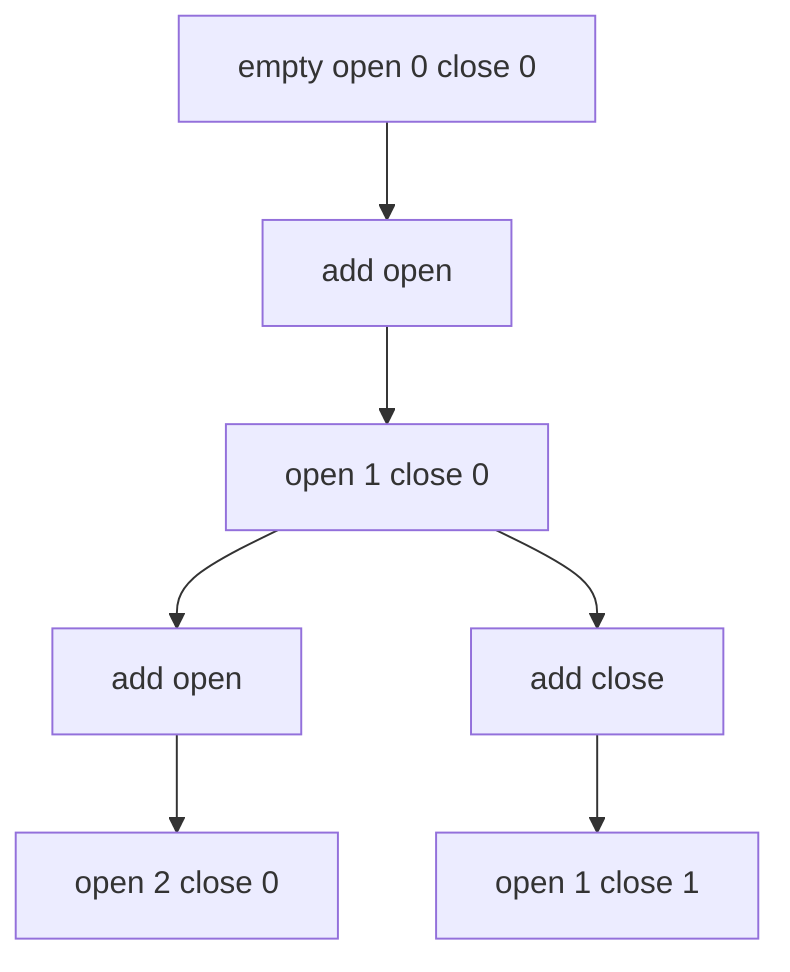

### C++ code

```cpp
vector<string> generateParenthesis(int n) {
    vector<string> ans;
    string path;

    function<void(int, int)> dfs = [&](int open, int close) {
        if ((int)path.size() == 2 * n) {
            ans.push_back(path);
            return;
        }

        if (open < n) {
            path.push_back('(');
            dfs(open + 1, close);
            path.pop_back();
        }

        if (close < open) {
            path.push_back(')');
            dfs(open, close + 1);
            path.pop_back();
        }
    };

    dfs(0, 0);
    return ans;
}
```

### Java helper

```java
static List<String> generateParenthesis(int n) {
    List<String> ans = new ArrayList<>();
    backtrackParen(n, 0, 0, new StringBuilder(), ans);
    return ans;
}

static void backtrackParen(int n, int open, int close,
                           StringBuilder path, List<String> ans) {
    if (path.length() == 2 * n) {
        ans.add(path.toString());
        return;
    }

    if (open < n) {
        path.append('(');
        backtrackParen(n, open + 1, close, path, ans);
        path.deleteCharAt(path.length() - 1);
    }

    if (close < open) {
        path.append(')');
        backtrackParen(n, open, close + 1, path, ans);
        path.deleteCharAt(path.length() - 1);
    }
}
```

### 1-minute mental trick

> Opening bracket gives permission.  
> Closing bracket spends permission.

---

# 10. Permutations

Problem:

```text
s = "abc"

Output:
abc acb bac bca cab cba
```

## LCCM

```text
Level      = index in permutation
Choices    = unused characters
Check      = character not already used
Move       = mark used -> add -> recurse -> remove -> unmark
Base case  = path length == n
```

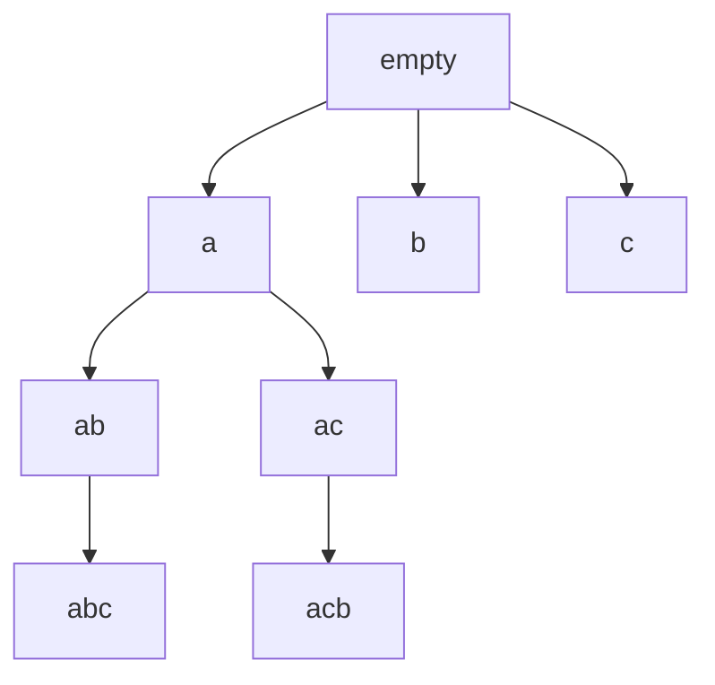

### C++ code

```cpp
vector<string> permutations(string s) {
    vector<string> ans;
    string path;
    vector<int> used(s.size(), 0);

    function<void()> dfs = [&]() {
        if ((int)path.size() == (int)s.size()) {
            ans.push_back(path);
            return;
        }

        for (int i = 0; i < (int)s.size(); i++) {
            if (used[i]) continue;

            used[i] = 1;
            path.push_back(s[i]);

            dfs();

            path.pop_back();
            used[i] = 0;
        }
    };

    dfs();
    return ans;
}
```

### 1-minute mental trick

> Permutation = fill one position at a time using unused items.

---

# 11. Permutations With Duplicates

If array has duplicates:

```text
[1, 2, 2]
```

Use a frequency map to avoid duplicate permutations.

## LCCM

```text
Level      = position in result
Choices    = numbers with frequency > 0
Check      = freq[x] > 0
Move       = freq[x]-- -> add -> recurse -> remove -> freq[x]++
```

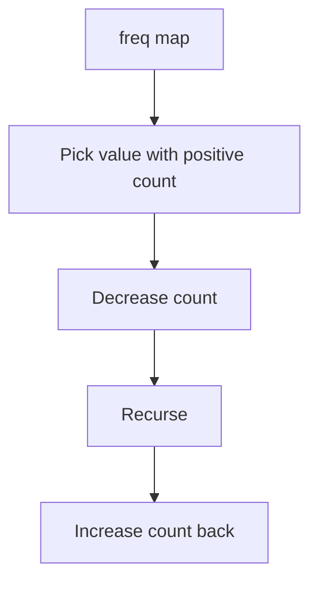

### C++ code

```cpp
vector<vector<int>> permuteUnique(vector<int>& nums) {
    map<int, int> freq;
    for (int x : nums) freq[x]++;

    vector<vector<int>> ans;
    vector<int> path;
    int n = nums.size();

    function<void()> dfs = [&]() {
        if ((int)path.size() == n) {
            ans.push_back(path);
            return;
        }

        for (auto& [x, cnt] : freq) {
            if (cnt == 0) continue;

            cnt--;
            path.push_back(x);

            dfs();

            path.pop_back();
            cnt++;
        }
    };

    dfs();
    return ans;
}
```

### 1-minute mental trick

> Duplicates? Do not choose index. Choose value using frequency.

---

# 12. Subsets

Problem:

```text
nums = [1, 2, 3]

Output:
[]
[1]
[2]
[3]
[1,2]
[1,3]
[2,3]
[1,2,3]
```

## Include / Exclude Pattern

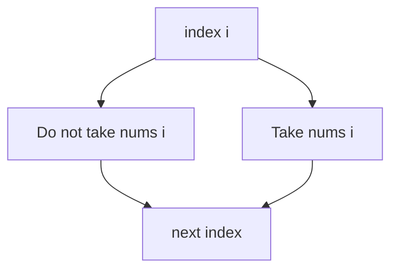

### C++ code

```cpp
vector<vector<int>> subsets(vector<int>& nums) {
    vector<vector<int>> ans;
    vector<int> path;

    function<void(int)> dfs = [&](int i) {
        if (i == (int)nums.size()) {
            ans.push_back(path);
            return;
        }

        dfs(i + 1);

        path.push_back(nums[i]);
        dfs(i + 1);
        path.pop_back();
    };

    dfs(0);
    return ans;
}
```

### 1-minute mental trick

> Subset = every element has two choices: take or skip.

---

# 13. Combination Sum

Problem:

```text
candidates = [2, 3, 6, 7]
target = 7

Output:
[2,2,3]
[7]
```

## LCCM

```text
Level      = index / candidate position
Choices    = take current or skip current
Check      = remaining >= 0
Move       = take same index again or move next
Base case  = remaining == 0
```

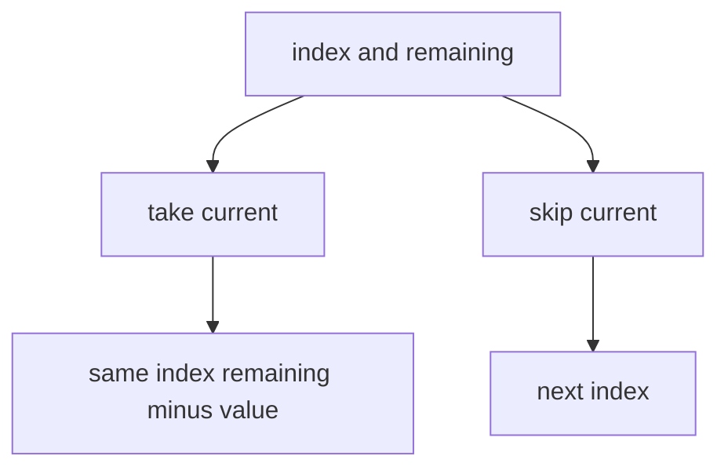

### C++ code

```cpp
vector<vector<int>> combinationSum(vector<int>& cand, int target) {
    vector<vector<int>> ans;
    vector<int> path;

    function<void(int, int)> dfs = [&](int idx, int rem) {
        if (rem == 0) {
            ans.push_back(path);
            return;
        }

        if (idx == (int)cand.size() || rem < 0) return;

        path.push_back(cand[idx]);
        dfs(idx, rem - cand[idx]);
        path.pop_back();

        dfs(idx + 1, rem);
    };

    dfs(0, target);
    return ans;
}
```

### 1-minute mental trick

> If reuse allowed, taking keeps same index.  
> If reuse not allowed, taking moves to next index.

---

# 14. Aggregation Pattern

Not all recursion returns all paths. Some recursion aggregates result.

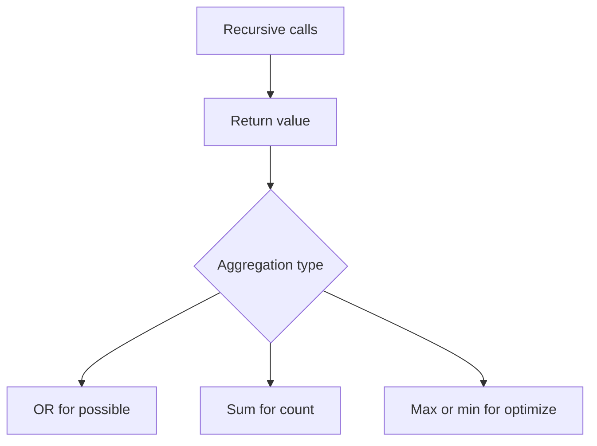

| Problem asks | Initial value | Aggregate |
|---|---|---|
| possible or not | false | OR |
| number of ways | 0 | addition |
| maximum answer | very small | max |
| minimum answer | very large | min |

---

# 15. Word Break

Problem:

```text
target = "algomonster"
words = ["algo", "monster"]

Output:
true
```

## LCCM

```text
Level      = start index in target
Choices    = word matching prefix at start
Check      = target substring equals word
Move       = recurse start + word.length
Base case  = start == target.length
Aggregation = OR
```

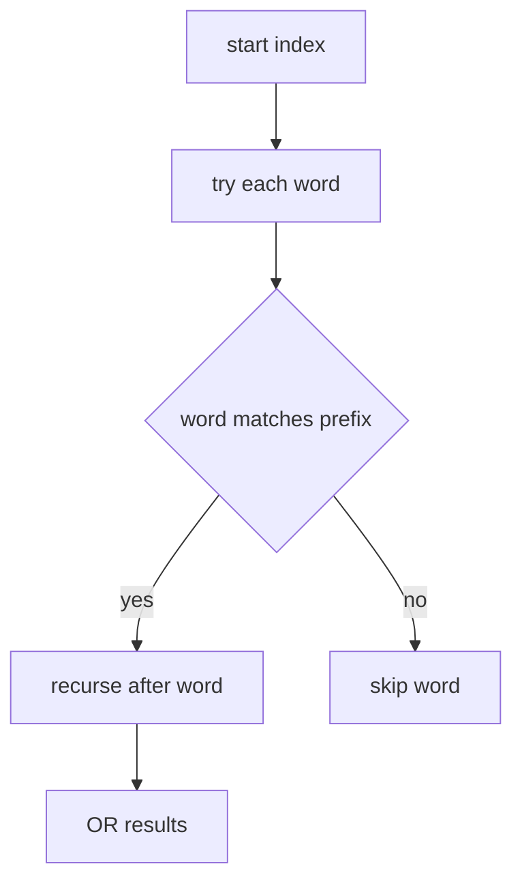

### C++ code

```cpp
bool wordBreak(string s, vector<string>& words) {
    int n = s.size();
    vector<int> memo(n + 1, -1);

    function<bool(int)> dfs = [&](int start) -> bool {
        if (start == n) return true;
        if (memo[start] != -1) return memo[start];

        for (string& w : words) {
            int len = w.size();

            if (start + len <= n && s.substr(start, len) == w) {
                if (dfs(start + len)) {
                    return memo[start] = true;
                }
            }
        }

        return memo[start] = false;
    };

    return dfs(0);
}
```

### 1-minute mental trick

> Word break = partition string by valid dictionary prefixes.

---

# 16. Decode Ways

Problem:

```text
"12"

Can decode as:
1 2 -> AB
12  -> L

Answer = 2
```

## LCCM

```text
Level      = current index
Choices    = take 1 digit or take 2 digits
Check      = valid range 1..26 and no leading zero
Move       = recurse to next index
Aggregation = sum
```

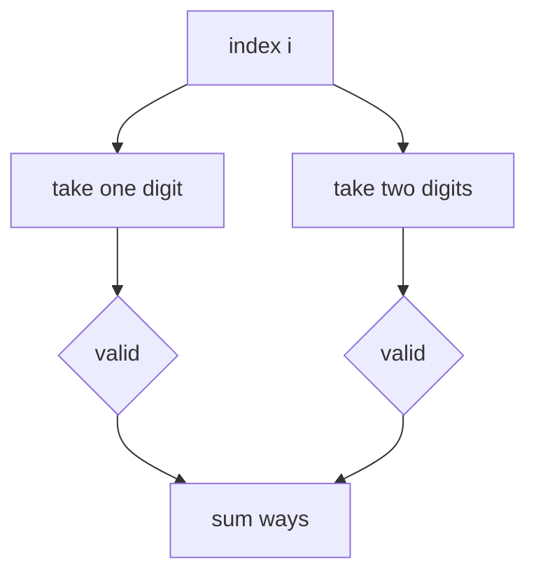

### C++ code

```cpp
int numDecodings(string s) {
    int n = s.size();
    vector<int> memo(n + 1, -1);

    function<int(int)> dfs = [&](int i) -> int {
        if (i == n) return 1;
        if (s[i] == '0') return 0;
        if (memo[i] != -1) return memo[i];

        int ways = dfs(i + 1);

        if (i + 1 < n) {
            int val = (s[i] - '0') * 10 + (s[i + 1] - '0');
            if (val <= 26) {
                ways += dfs(i + 2);
            }
        }

        return memo[i] = ways;
    };

    return dfs(0);
}
```

### 1-minute mental trick

> At each index, decide: consume 1 digit or 2 digits.

---

# 17. Tower of Hanoi

Problem:

Move `n` disks from source to target using auxiliary.

Rules:
1. Move one disk at a time.
2. Bigger disk cannot be placed on smaller disk.

## Recursive idea

```text
Move n-1 disks from source to auxiliary
Move largest disk from source to target
Move n-1 disks from auxiliary to target
```

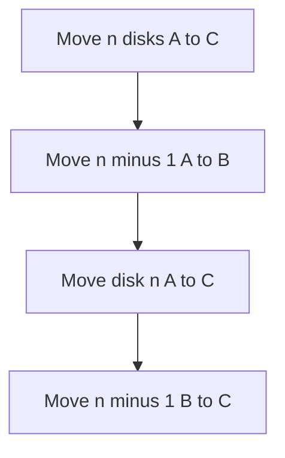

### C++ code

```cpp
void towerOfHanoi(int n, char source, char auxiliary, char target) {
    if (n == 0) return;

    towerOfHanoi(n - 1, source, target, auxiliary);

    cout << "Move disk " << n << " from "
         << source << " to " << target << "\n";

    towerOfHanoi(n - 1, auxiliary, source, target);
}
```

### Number of moves

```text
moves(n) = 2^n - 1
```

### 1-minute mental trick

> To move big disk, first clear everything above it.

---

# 18. GCD Using Recursion

Euclid:

```text
gcd(a, b) = gcd(b, a % b)
gcd(a, 0) = a
```

Example:

```text
gcd(8, 5)
= gcd(5, 3)
= gcd(3, 2)
= gcd(2, 1)
= gcd(1, 0)
= 1
```

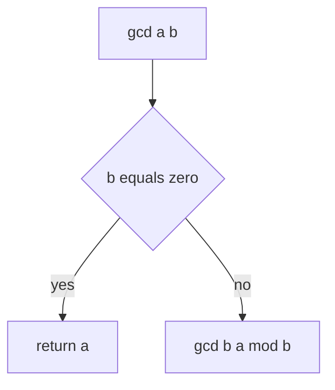

### C++ code

```cpp
long long gcdRec(long long a, long long b) {
    if (b == 0) return a;
    return gcdRec(b, a % b);
}
```

### Java code

```java
static long gcd(long a, long b) {
    if (b == 0) return a;
    return gcd(b, a % b);
}
```

### 1-minute mental trick

> Keep replacing bigger problem by remainder problem.

---

# 19. Fibonacci

Formula:

```text
fib(0) = 0
fib(1) = 1
fib(n) = fib(n-1) + fib(n-2)
```

### Simple recursion

```cpp
long long fib(int n) {
    if (n == 0) return 0;
    if (n == 1) return 1;
    return fib(n - 1) + fib(n - 2);
}
```

### Better memoized version

```cpp
long long fibMemo(int n, vector<long long>& dp) {
    if (n <= 1) return n;
    if (dp[n] != -1) return dp[n];

    return dp[n] = fibMemo(n - 1, dp) + fibMemo(n - 2, dp);
}
```

### 1-minute mental trick

> If recursion recomputes same state again and again, add memoization.

---

# 20. K Knights on Board

Problem idea:

Place `k` knights on an `n x n` board so that no knight attacks another.

## Knight attack moves

```text
dx = {1, 1, 2, 2, -1, -1, -2, -2}
dy = {2, -2, 1, -1, 2, -2, 1, -1}
```

## LCCM version 1

```text
Level      = number of knights placed
Choices    = all board cells
Check      = cell empty and not attacked
Move       = place knight -> recurse -> remove knight
```

Better version:

```text
Level      = board cell index from 0 to n*n
Choices    = place or not place
Check      = only if placing
Move       = go to next cell
Base case  = placed == k
```

```mermaid
flowchart TD
    A[cell index] --> B[Do not place]
    A --> C[Try place]
    C --> D{safe}
    D -->|yes| E[place and recurse]
    D -->|no| F[skip]
```

### Safety check

Only need to check previously placed knights if scanning left to right.

```cpp
bool safeKnight(vector<vector<int>>& board, int r, int c) {
    int n = board.size();
    vector<int> dx = {-1, -1, -2, -2};
    vector<int> dy = {-2, 2, -1, 1};

    for (int i = 0; i < 4; i++) {
        int nr = r + dx[i];
        int nc = c + dy[i];

        if (nr >= 0 && nr < n && nc >= 0 && nc < n &&
            board[nr][nc]) {
            return false;
        }
    }

    return true;
}
```

### C++ count code

```cpp
int countKKnights(int n, int k) {
    vector<vector<int>> board(n, vector<int>(n, 0));
    int ans = 0;

    function<void(int, int)> dfs = [&](int cell, int placed) {
        if (placed == k) {
            ans++;
            return;
        }

        if (cell == n * n) return;

        int r = cell / n;
        int c = cell % n;

        // Option 1: do not place
        dfs(cell + 1, placed);

        // Option 2: place if safe
        if (safeKnight(board, r, c)) {
            board[r][c] = 1;
            dfs(cell + 1, placed + 1);
            board[r][c] = 0;
        }
    };

    dfs(0, 0);
    return ans;
}
```

### 1-minute mental trick

> Board placement problems:  
> Level = cell index, Choice = place or skip.

---

# 21. K Queens / N Queens Pattern

Problem:

Place queens so no two attack each other.

## Common design

```text
Level      = row
Choices    = column in that row
Check      = column and diagonals are safe
Move       = place queen -> next row -> remove
```

```mermaid
flowchart TD
    A[row] --> B[try each column]
    B --> C{column diagonal safe}
    C -->|yes| D[place queen]
    D --> E[next row]
    C -->|no| F[skip column]
```

### C++ N Queens skeleton

```cpp
vector<vector<string>> solveNQueens(int n) {
    vector<vector<string>> ans;
    vector<string> board(n, string(n, '.'));

    vector<int> col(n, 0);
    vector<int> diag1(2 * n, 0);
    vector<int> diag2(2 * n, 0);

    function<void(int)> dfs = [&](int row) {
        if (row == n) {
            ans.push_back(board);
            return;
        }

        for (int c = 0; c < n; c++) {
            int d1 = row + c;
            int d2 = row - c + n;

            if (col[c] || diag1[d1] || diag2[d2]) continue;

            board[row][c] = 'Q';
            col[c] = diag1[d1] = diag2[d2] = 1;

            dfs(row + 1);

            board[row][c] = '.';
            col[c] = diag1[d1] = diag2[d2] = 0;
        }
    };

    dfs(0);
    return ans;
}
```

### 1-minute mental trick

> Queens are row-by-row.  
> One row = one level.  
> Columns are choices.

---

# 22. Brute Force vs Backtracking

```mermaid
flowchart LR
    A[Brute force] --> B[Generate everything]
    B --> C[Check at end]
    D[Backtracking] --> E[Check during generation]
    E --> F[Prune early]
```

### Key idea from notes

In brute force:
```text
Generate all possibilities and check correctness.
```

In backtracking:
```text
Check constraints while building the answer.
```

---

# 23. Choosing the Generator

When solving brute force/backtracking:

```text
1. Decide what to generate.
2. Decide what constraints to check.
3. Decide how to move.
```

Example from notes:

```text
If choosing mapping for letters to digits,
generator can be:
- letters one by one
- numbers one by one
Choose the one with fewer possibilities.
```

### Mental trick

> Better generator = fewer branches.

---

# 24. Complexity Quick Guide

```mermaid
flowchart TD
    A[Backtracking complexity] --> B[choices per level]
    B --> C[levels]
    C --> D[rough complexity choices power levels]
```

Examples:

```text
Subsets: 2^n
Permutations: n!
Phone keypad: about 4^n
Valid parentheses: Catalan number
N Queens: roughly n!
```

### Backtracking cost formula

```text
Time ≈ number of states * cost of check
```

### 1-minute mental trick

> Count branches in recursion tree.  
> That is your time complexity.

---

# 25. Final LCCM Checklist

Before coding, write this:

```text
Level:
Choices:
Check:
Move:
Base case:
Answer type:
```

```mermaid
flowchart TD
    A[Before coding] --> B[Write LCCM]
    B --> C[Draw 2 levels of tree]
    C --> D[Write base case]
    D --> E[Write add recurse remove]
```

## Quick examples

### Subsets

```text
Level      = index
Choices    = take or skip
Check      = none
Move       = recurse i + 1
Base case  = i == n
```

### Permutations

```text
Level      = position
Choices    = unused element
Check      = used[i] == false
Move       = mark add recurse remove unmark
Base case  = path size == n
```

### Palindrome partition

```text
Level      = start index
Choices    = end index
Check      = substring is palindrome
Move       = add substring recurse end+1 remove
Base case  = start == n
```

### Word break

```text
Level      = start index
Choices    = dictionary words
Check      = word matches prefix
Move       = recurse start + word length
Base case  = start == n
Aggregation = OR
```

### Decode ways

```text
Level      = index
Choices    = one digit or two digits
Check      = valid 1 to 26
Move       = recurse i+1 or i+2
Base case  = i == n
Aggregation = sum
```

### K Knights

```text
Level      = cell index
Choices    = place or skip
Check      = safe from knight attack
Move       = next cell
Base case  = placed == k or cell == n*n
```

---

# 26. Final 1-Minute Revision Sheet

```text
Recursion:
Base case + smaller call.

Backtracking:
Choose -> Check -> Add -> Recurse -> Remove.

LCCM:
Level, Choice, Check, Move.

Generate all:
Save answer at base case.

Count:
Return sum of child answers.

Possible:
Return OR of child answers.

Optimize:
Return max or min of child answers.

Duplicates:
Use frequency map instead of raw index choices.

Board:
Level can be row or cell index.

Memoization:
Use when same state repeats.
```

---

END
