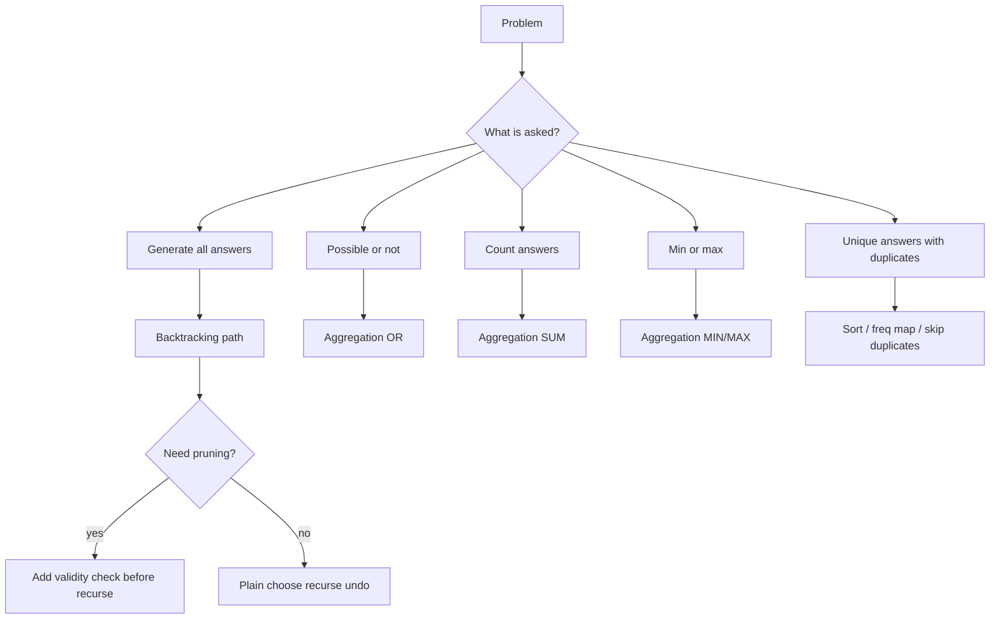
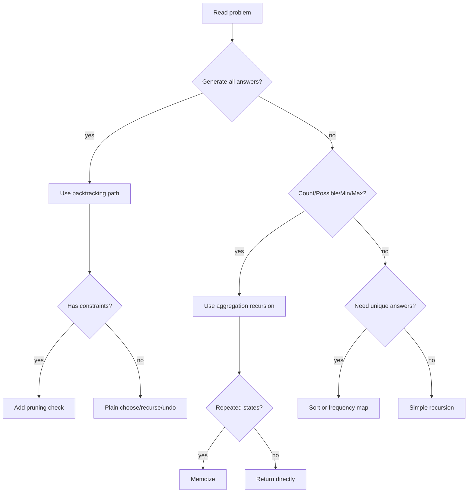

# 🌳 Tree Visualization Upgrade

This edition upgrades dry runs into:

- recursion trees
- execution flow trees
- choose → recurse → backtrack visualization
- state transition diagrams
- pruning visualization

This format is ideal for:
- FAANG recursion rounds
- CP recursion visualization
- faster pattern recognition
- debugging recursion mentally

---

# Backtracking Patterns LCCM Master Guide

> Rebuilt from `000_BACKTRACKING_PATTERNS_ALGOMONSTER.md` into the same **001-style phase-wise CP + FAANG master guide** format.

This guide includes:

- Clickable index
- LCCM template for every problem
- Input / output / example
- Brute-force thinking when useful
- Optimal recursion / backtracking idea
- C++ code
- Recursion tree
- Index-by-index dry run
- Pattern recognition cheat sheet

---

## Clickable Index

### Core Framework

- [0. One-Minute Master Map](#0-one-minute-master-map)
- [1. LCCM Framework](#1-lccm-framework)
- [2. Universal Templates](#2-universal-templates)
- [3. How To Read A Recursion Tree](#3-how-to-read-a-recursion-tree)
- [4. Phase Map](#4-phase-map)


### Phase 1 — Core Combinatorial Search

- [P1. Generate All Strings From Choices](#p1-generate-all-strings-from-choices)
- [P2. Letter Combinations of a Phone Number](#p2-letter-combinations-of-a-phone-number)

### Phase 2 — Backtracking With Pruning

- [P3. Palindrome Partitioning](#p3-palindrome-partitioning)

### Phase 3 — Backtracking With Additional State

- [P4. Generate Valid Parentheses](#p4-generate-valid-parentheses)
- [P5. Permutations](#p5-permutations)

### Phase 4 — Aggregation / Return Value Backtracking

- [P6. Word Break](#p6-word-break)
- [P7. Number of Ways to Decode a Message](#p7-number-of-ways-to-decode-a-message)
- [P8. Coin Change Minimum Coins](#p8-coin-change-minimum-coins)

### Phase 5 — Deduplication Patterns

- [P9. Three Sum Without Duplicate Triplets](#p9-three-sum-without-duplicate-triplets)

### Phase 6 — Combination Style Backtracking

- [P10. Combination Sum](#p10-combination-sum)
- [P11. Subsets](#p11-subsets)

### Final Revision

- [Backtracking Pattern Recognition Table](#backtracking-pattern-recognition-table)
- [LCCM Decision Tree](#lccm-decision-tree)
- [Common Mistakes](#common-mistakes)
- [Interview One-Liners](#interview-one-liners)
- [Final 5-Second Pattern Identification Drill](#final-5-second-pattern-identification-drill)

---

# 0. One-Minute Master Map

```text
Recursion      = solve smaller version of same problem.
Backtracking   = try choice -> recurse -> undo choice.
Pruning        = skip branch early when it can never become valid.
Additional state = carry values like used[], open/close, remaining sum.
Aggregation    = recursive calls return values and parent combines them.
Deduplication  = sort / frequency map / skip same-level duplicate choices.
```



# 1. LCCM Framework

LCCM is the fastest way to convert a backtracking problem into code.

| Letter | Meaning | Question |
|---|---|---|
| L | Level | What does one recursive call represent? |
| C | Choice | What choices are available at this level? |
| C | Check / Constraint | Is this choice valid? Can I prune? |
| M | Move | How do I apply, recurse, and undo? |

```text
Level      =
Choices    =
Check      =
Move       =
Base case  =
Answer     =
```

# 2. Universal Templates

## 2.1 Backtracking Template - Generate All Answers

```cpp
void rec(int level) {
    if (base_case) {
        ans.push_back(path);
        return;
    }

    for (auto choice : choices) {
        if (!isSafe(choice)) continue;

        // choose
        path.push_back(choice);

        // explore
        rec(next_level);

        // undo
        path.pop_back();
    }
}
```

## 2.2 Aggregation Template

Use this when the problem asks for:

- possible or not
- number of ways
- minimum / maximum value

```cpp
ReturnType dfs(State state) {
    if (base_case) return base_value;

    ReturnType ans = initial_value;

    for (auto choice : choices) {
        if (!valid(choice)) continue;

        ReturnType child = dfs(next_state);
        ans = aggregate(ans, child);
    }

    return ans;
}
```

| Problem asks | Return type | Initial value | Aggregate |
|---|---:|---:|---|
| possible? | bool | false | OR |
| count ways | int / long long | 0 | + |
| maximum | int | -INF | max |
| minimum | int | INF | min |

## 2.3 Deduplication Template

```cpp
sort(nums.begin(), nums.end());

for (int i = start; i < n; i++) {
    if (i > start && nums[i] == nums[i - 1]) continue;

    path.push_back(nums[i]);
    dfs(i + 1);
    path.pop_back();
}
```

# 3. How To Read A Recursion Tree

A recursion tree shows **choices**.  
A recursion stack shows **execution order**.

For backtracking, each node should show:

```text
(level, path, extra state)
```

Example:

```text
level 0: ""
├── choose a -> level 1: "a"
│   ├── choose a -> level 2: "aa"
│   └── choose b -> level 2: "ab"
└── choose b -> level 1: "b"
    ├── choose a -> level 2: "ba"
    └── choose b -> level 2: "bb"
```

# 4. Phase Map

| Phase | Pattern | Main idea |
|---|---|---|
| 1 | Core combinatorial search | Add -> recurse -> remove |
| 2 | Backtracking with pruning | Skip invalid choices early |
| 3 | Additional state | Carry used/open/close/counts |
| 4 | Aggregation recursion | Return bool/count/min/max |
| 5 | Deduplication | Sort/frequency map/skip duplicates |
| 6 | Combination style | Take/skip by index |

---


# Phase 1 — Core Combinatorial Search

# P1. Generate All Strings From Choices

**Difficulty:** Easy  

**Pattern:** `LCCM: Level=index, Choice=character, Constraint=index<n, Move=add→recurse→remove`


## Problem Statement

Given possible characters at each position, generate all strings. Example choices are {a,b} for each of 2 positions.

## Input

```text
dfs(level=0, path="")

├── choose 'a'
│   │
│   ├── path="a"
│   ├── dfs(level=1)
│   │
│   ├── choose 'a'
│   │   ├── path="aa"
│   │   ├── dfs(level=2)
│   │   └── ✅ OUTPUT "aa"
│   │
│   └── BACKTRACK
│       path="a"
│
│   ├── choose 'b'
│   │   ├── path="ab"
│   │   ├── dfs(level=2)
│   │   └── ✅ OUTPUT "ab"
│   │
│   └── BACKTRACK
│       path=""
│
└── choose 'b'
    │
    ├── path="b"
    ├── dfs(level=1)
    │
    ├── choose 'a'
    │   └── ✅ OUTPUT "ba"
    │
    └── choose 'b'
        └── ✅ OUTPUT "bb"

FINAL:
    aa
    ab
    ba
    bb
```

## Complexity

Time O(k^n * n), Space O(n) recursion path, excluding output.

## Mental Model

> Use LCCM first: identify level, choices, constraint, and move before coding.

## Pattern Trigger


Use this when the problem asks to generate all combinations/strings/subsets by trying choices recursively.


---


---

# P2. Letter Combinations of a Phone Number

**Difficulty:** Medium  

**Pattern:** `LCCM: Level=digit index, Choice=letter mapped from digit`


## Problem Statement

Given digits 2-9, return all possible letter combinations based on phone keypad mapping.

## Input

```text
digits = "23"
```

## Output

```text
["ad","ae","af","bd","be","bf","cd","ce","cf"]
```

## Optimal Backtracking Idea

For each digit, iterate over mapped letters. Add letter, recurse to next digit, then remove letter.

## LCCM


```text
Level = index in digits
Choices = letters mapped from digits[level]
Constraint = level < digits.size()
Move = add letter → recurse(level+1) → remove letter
```


## Recursion Tree

```text
rec(0, "")
├── choose 'a' from digit 2 -> rec(1, "a")
│   ├── choose 'd' -> "ad" ✅
│   ├── choose 'e' -> "ae" ✅
│   └── choose 'f' -> "af" ✅
├── choose 'b' from digit 2 -> rec(1, "b")
│   ├── choose 'd' -> "bd" ✅
│   ├── choose 'e' -> "be" ✅
│   └── choose 'f' -> "bf" ✅
└── choose 'c' from digit 2 -> rec(1, "c")
    ├── choose 'd' -> "cd" ✅
    ├── choose 'e' -> "ce" ✅
    └── choose 'f' -> "cf" ✅
```

## C++ Code

```cpp
#include <bits/stdc++.h>
using namespace std;

vector<string> letterCombinations(string digits) {
    if (digits.empty()) return {};

    vector<string> mp(10);
    mp[2] = "abc";
    mp[3] = "def";
    mp[4] = "ghi";
    mp[5] = "jkl";
    mp[6] = "mno";
    mp[7] = "pqrs";
    mp[8] = "tuv";
    mp[9] = "wxyz";

    vector<string> ans;
    string path;

    function<void(int)> dfs = [&](int level) {
        if (level == (int)digits.size()) {
            ans.push_back(path);
            return;
        }

        int digit = digits[level] - '0';

        for (char ch : mp[digit]) {
            path.push_back(ch);
            dfs(level + 1);
            path.pop_back();
        }
    };

    dfs(0);
    return ans;
}
```

## 🌳 Tree-Style Index-by-Index Dry Run

```text
digits = "23"

mapping:
    2 -> abc
    3 -> def

level=0, digit='2', path=""
    choose 'a'
    path="a"

level=1, digit='3', path="a"
    choose 'd' -> path="ad" -> output
    remove 'd' -> path="a"

    choose 'e' -> path="ae" -> output
    remove 'e' -> path="a"

    choose 'f' -> path="af" -> output
    remove 'f' -> path="a"

backtrack from 'a'
path=""

level=0
    choose 'b'
    path="b"

level=1
    choose d/e/f
    output "bd", "be", "bf"

backtrack from 'b'

level=0
    choose 'c'
    path="c"

level=1
    choose d/e/f
    output "cd", "ce", "cf"

Final:
    ad ae af bd be bf cd ce cf
```

## Complexity

Time O(4^n * n), Space O(n) recursion path, excluding output.

## Mental Model

> Use LCCM first: identify level, choices, constraint, and move before coding.

## Pattern Trigger


Use this when the problem asks to generate all combinations/strings/subsets by trying choices recursively.


---


---

# Phase 2 — Backtracking With Pruning

# P3. Palindrome Partitioning

**Difficulty:** Medium  

**Pattern:** `LCCM: Level=start index, Choice=substring start..end, Constraint=substring is palindrome`


## Problem Statement

Given a string s, partition it so every substring is a palindrome. Return all valid partitions.

## Input

```text
s = "aab"
```

## Output

```text
[["a","a","b"], ["aa","b"]]
```

## Optimal Backtracking Idea

At each start index, try every ending index. Only recurse if s[start..end] is palindrome. Non-palindromes are pruned.

## LCCM


```text
Level = start index
Choices = substring s[start..end]
Constraint = substring must be palindrome
Move = add substring → recurse(end+1) → remove substring
```


## Recursion Tree

```text
rec(start=0, path=[])
├── choose "a" ✅ palindrome -> rec(1, ["a"])
│   ├── choose "a" ✅ -> rec(2, ["a","a"])
│   │   └── choose "b" ✅ -> rec(3, ["a","a","b"]) ✅ output
│   └── choose "ab" ❌ prune
├── choose "aa" ✅ palindrome -> rec(2, ["aa"])
│   └── choose "b" ✅ -> rec(3, ["aa","b"]) ✅ output
└── choose "aab" ❌ prune
```

## C++ Code

```cpp
#include <bits/stdc++.h>
using namespace std;

bool isPal(const string& s, int l, int r) {
    while (l < r) {
        if (s[l] != s[r]) return false;
        l++;
        r--;
    }
    return true;
}

vector<vector<string>> partition(string s) {
    vector<vector<string>> ans;
    vector<string> path;
    int n = s.size();

    function<void(int)> dfs = [&](int start) {
        if (start == n) {
            ans.push_back(path);
            return;
        }

        for (int end = start; end < n; end++) {
            if (!isPal(s, start, end)) continue;

            path.push_back(s.substr(start, end - start + 1));
            dfs(end + 1);
            path.pop_back();
        }
    };

    dfs(0);
    return ans;
}
```

## 🌳 Tree-Style Index-by-Index Dry Run

```text
s = "aab"

start=0, path=[]
    try substring s[0..0] = "a"
    "a" is palindrome
    add "a"
    path=["a"]
    recurse start=1

start=1, path=["a"]
    try s[1..1] = "a"
    palindrome
    path=["a","a"]
    recurse start=2

start=2, path=["a","a"]
    try s[2..2] = "b"
    palindrome
    path=["a","a","b"]
    recurse start=3

start=3
    start == n
    output ["a","a","b"]

backtrack:
    remove "b" -> ["a","a"]
    remove second "a" -> ["a"]

start=1
    try s[1..2] = "ab"
    not palindrome
    prune

backtrack:
    remove first "a" -> []

start=0
    try s[0..1] = "aa"
    palindrome
    path=["aa"]
    recurse start=2

start=2
    choose "b"
    path=["aa","b"]
    start=3
    output ["aa","b"]

start=0
    try s[0..2] = "aab"
    not palindrome
    prune

Final output:
    ["a","a","b"]
    ["aa","b"]
```

## Complexity

Time O(n * 2^n), Space O(n) recursion path, excluding output.

## Mental Model

> Use LCCM first: identify level, choices, constraint, and move before coding.

## Pattern Trigger


Use this when some choices can be rejected immediately before recursion.


---


---

# Phase 3 — Backtracking With Additional State

# P4. Generate Valid Parentheses

**Difficulty:** Medium  

**Pattern:** `Additional state: open count and close count`


## Problem Statement

Generate all valid parentheses strings with n pairs.

## Input

```text
dfs(path="", open=0, close=0)

└── add '('
    │
    ├── path="("
    ├── open=1 close=0
    │
    ├── add '('
    │   │
    │   ├── path="(("
    │   ├── open=2 close=0
    │   │
    │   └── add ')'
    │       │
    │       ├── path="(()"
    │       ├── open=2 close=1
    │       │
    │       └── add ')'
    │           ├── path="(())"
    │           └── ✅ OUTPUT
    │
    └── add ')'
        │
        ├── path="()"
        ├── open=1 close=1
        │
        └── add '('
            │
            ├── path="()("
            └── add ')'
                ├── path="()()"
                └── ✅ OUTPUT

FINAL:
    (())
    ()()
```

## Complexity

Time O(Catalan(n) * n), Space O(n).

## Mental Model

> Use LCCM first: identify level, choices, constraint, and move before coding.

## Pattern Trigger


Use this when path alone is not enough; you must carry extra state like `used`, `open`, `close`, or counts.


---


---

# P5. Permutations

**Difficulty:** Medium  

**Pattern:** `Additional state: used boolean array`


## Problem Statement

Given distinct characters, generate all permutations.

## Input

```text
s = "abc"
```

## Output

```text
abc
acb
bac
bca
cab
cba
```

## Optimal Backtracking Idea

At each level choose any unused character. Mark it used, recurse, then unmark while backtracking.

## LCCM


```text
Level = position in permutation
Choices = unused characters
Constraint = each character used once
Move = mark used → add → recurse → remove → unmark
```


## Recursion Tree

```text
rec(path="")
├── choose a
│   ├── choose b
│   │   └── choose c -> abc ✅
│   └── choose c
│       └── choose b -> acb ✅
├── choose b
│   ├── choose a
│   │   └── choose c -> bac ✅
│   └── choose c
│       └── choose a -> bca ✅
└── choose c
    ├── choose a
    │   └── choose b -> cab ✅
    └── choose b
        └── choose a -> cba ✅
```

## C++ Code

```cpp
#include <bits/stdc++.h>
using namespace std;

vector<string> permutations(string s) {
    int n = s.size();
    vector<string> ans;
    string path;
    vector<bool> used(n, false);

    function<void()> dfs = [&]() {
        if ((int)path.size() == n) {
            ans.push_back(path);
            return;
        }

        for (int i = 0; i < n; i++) {
            if (used[i]) continue;

            used[i] = true;
            path.push_back(s[i]);

            dfs();

            path.pop_back();
            used[i] = false;
        }
    };

    dfs();
    return ans;
}
```

## 🌳 Tree-Style Index-by-Index Dry Run

```text
s = "abc"

path="", used=[false,false,false]

level=0:
    choose index 0 -> 'a'
    path="a"
    used=[true,false,false]

level=1:
    index 0 already used, skip

    choose index 1 -> 'b'
    path="ab"
    used=[true,true,false]

level=2:
    choose index 2 -> 'c'
    path="abc"
    used=[true,true,true]

path length == 3
output "abc"

backtrack:
    remove 'c'
    used[2]=false
    path="ab"

backtrack:
    remove 'b'
    used[1]=false
    path="a"

level=1:
    choose index 2 -> 'c'
    path="ac"

level=2:
    choose remaining index 1 -> 'b'
    path="acb"
    output "acb"

After finishing branch starting with 'a':
    output abc, acb

Then choose 'b' first:
    output bac, bca

Then choose 'c' first:
    output cab, cba
```

## Complexity

Time O(n! * n), Space O(n).

## Mental Model

> Use LCCM first: identify level, choices, constraint, and move before coding.

## Pattern Trigger


Use this when path alone is not enough; you must carry extra state like `used`, `open`, `close`, or counts.


---


---

# Phase 4 — Aggregation / Return Value Backtracking

# P6. Word Break

**Difficulty:** Medium  

**Pattern:** `Aggregation OR: does any branch return true?`


## Problem Statement

Given a string and dictionary words, return true if string can be segmented into dictionary words.

## Input

```text
target = "algomonster"
words = ["algo", "monster"]
```

## Output

```text
true
```

## Optimal Backtracking Idea

At index start, try every dictionary word matching the prefix. If any recursive branch reaches the end, return true.

## LCCM


```text
Level = start index in target
Choices = dictionary words matching prefix
Constraint = word must match target[start..]
Move = recurse(start + word.length), aggregate OR
```


## Recursion Tree

```text
rec(start=0, remaining="algomonster")
└── choose "algo" ✅ matches prefix
    rec(start=4, remaining="monster")
    └── choose "monster" ✅ matches prefix
        rec(start=11)
        start == target.length ✅ true
```

## C++ Code

```cpp
#include <bits/stdc++.h>
using namespace std;

bool wordBreak(string target, vector<string>& words) {
    int n = target.size();
    vector<int> memo(n + 1, -1);

    function<bool(int)> dfs = [&](int start) -> bool {
        if (start == n) return true;
        if (memo[start] != -1) return memo[start];

        for (string& word : words) {
            int len = word.size();

            if (start + len <= n && target.substr(start, len) == word) {
                if (dfs(start + len)) {
                    return memo[start] = true;
                }
            }
        }

        return memo[start] = false;
    };

    return dfs(0);
}
```

## 🌳 Tree-Style Index-by-Index Dry Run

```text
target = "algomonster"
words = ["algo", "monster"]

start=0
    remaining string = "algomonster"

    try word "algo"
        target.substr(0,4) = "algo"
        match found
        recurse start = 0 + 4 = 4

start=4
    remaining string = "monster"

    try word "algo"
        target.substr(4,4) = "mons"
        not match

    try word "monster"
        target.substr(4,7) = "monster"
        match found
        recurse start = 4 + 7 = 11

start=11
    start == target.length
    return true

Aggregation:
    dfs(11) returns true
    dfs(4) returns true
    dfs(0) returns true

Answer = true
```

## Complexity

Without memo can be exponential. With memo: O(n * number_of_words * word_length).

## Mental Model

> Use LCCM first: identify level, choices, constraint, and move before coding.

## Pattern Trigger


Use this when recursion must **return a value** instead of only printing paths: true/false, count, min, or max.


---


---

# P7. Number of Ways to Decode a Message

**Difficulty:** Medium  

**Pattern:** `Aggregation SUM: number of valid branches`


## Problem Statement

Given a digit string, count how many ways it can be decoded where 1=A, 2=B, ..., 26=Z.

## Input

```text
s = "123"
```

## Output

```text
3
```

## Optimal Backtracking Idea

At each index choose one digit if valid, and choose two digits if valid between 10 and 26. Sum results from both choices.

## LCCM


```text
Level = current index i
Choices = 1 digit or 2 digits
Constraint = valid number 1..26, no leading zero
Move = recurse next index, aggregate SUM
```


## Recursion Tree

```text
rec(0, "123")
├── take "1" -> rec(1, "23")
│   ├── take "2" -> rec(2, "3")
│   │   └── take "3" -> rec(3) ✅ 1 way: A B C
│   └── take "23" -> rec(3) ✅ 1 way: A W
└── take "12" -> rec(2, "3")
    └── take "3" -> rec(3) ✅ 1 way: L C

Total = 3
```

## C++ Code

```cpp
#include <bits/stdc++.h>
using namespace std;

int numDecodings(string s) {
    int n = s.size();
    vector<int> memo(n + 1, -1);

    function<int(int)> dfs = [&](int i) -> int {
        if (i == n) return 1;
        if (s[i] == '0') return 0;
        if (memo[i] != -1) return memo[i];

        int ways = 0;

        ways += dfs(i + 1);

        if (i + 1 < n) {
            int val = (s[i] - '0') * 10 + (s[i + 1] - '0');
            if (val >= 10 && val <= 26) {
                ways += dfs(i + 2);
            }
        }

        return memo[i] = ways;
    };

    return dfs(0);
}
```

## 🌳 Tree-Style Index-by-Index Dry Run

```text
s = "123"

i=0, char='1'
    one digit "1" is valid
    ways += dfs(1)

    two digits "12" is valid
    ways += dfs(2)

dfs(1), remaining="23"
    one digit "2" valid
    ways += dfs(2)

    two digits "23" valid
    ways += dfs(3)

dfs(2), remaining="3"
    one digit "3" valid
    ways += dfs(3)

    no two-digit choice

dfs(3)
    i == n
    return 1

Now aggregate:
    dfs(2) = 1
        represents "3" -> C

    dfs(1) = dfs(2) + dfs(3)
           = 1 + 1
           = 2
        represents "2","3" -> B C
        and "23" -> W

    dfs(0) = dfs(1) + dfs(2)
           = 2 + 1
           = 3

Answer = 3
Decodings:
    1 2 3 -> A B C
    1 23  -> A W
    12 3  -> L C
```

## Complexity

With memo O(n), Space O(n).

## Mental Model

> Use LCCM first: identify level, choices, constraint, and move before coding.

## Pattern Trigger


Use this when recursion must **return a value** instead of only printing paths: true/false, count, min, or max.


---


---

# P8. Coin Change Minimum Coins

**Difficulty:** Medium  

**Pattern:** `Aggregation MIN: take or skip coin`


## Problem Statement

Given coin denominations and amount, find minimum number of coins needed. Coins can be used unlimited times.

## Input

```text
coins = [1, 2, 5]
amount = 11
```

## Output

```text
3  // 5 + 5 + 1
```

## Optimal Backtracking Idea

At each coin index, either take current coin and stay at same index, or skip it and move to next index. Aggregate with min.

## LCCM


```text
Level = coin index
Choices = take coin or skip coin
Constraint = remaining sum must not go below zero
Move = take → same index, skip → next index, aggregate MIN
```


## Recursion Tree

```text
rec(index=0, sum=11)
├── take coin 1 -> rec(0, 10)
│   └── ...
└── skip coin 1 -> rec(1, 11)
    ├── take coin 2 -> rec(1, 9)
    └── skip coin 2 -> rec(2, 11)
        ├── take coin 5 -> rec(2, 6)
        │   ├── take coin 5 -> rec(2, 1)
        │   └── ...
        └── skip coin 5 -> invalid
Valid best path:
    take 5 -> take 5 -> take 1 = 3 coins
```

## C++ Code

```cpp
#include <bits/stdc++.h>
using namespace std;

int coinChange(vector<int>& coins, int amount) {
    const int INF = 1e9;
    int n = coins.size();

    vector<vector<int>> memo(n + 1, vector<int>(amount + 1, -1));

    function<int(int,int)> dfs = [&](int idx, int rem) -> int {
        if (rem == 0) return 0;
        if (idx == n) return INF;
        if (rem < 0) return INF;

        if (memo[idx][rem] != -1) return memo[idx][rem];

        int take = INF;
        if (rem >= coins[idx]) {
            take = 1 + dfs(idx, rem - coins[idx]);
        }

        int skip = dfs(idx + 1, rem);

        return memo[idx][rem] = min(take, skip);
    };

    int ans = dfs(0, amount);
    return ans >= INF ? -1 : ans;
}
```

## 🌳 Tree-Style Index-by-Index Dry Run

```text
coins = [1, 2, 5]
amount = 11

Goal:
    minimum coins to make 11

rec(index=0, rem=11), coin=1
    Choice 1: take coin 1
        rem becomes 10
        coins used +1
        stay index=0 because unlimited use

    Choice 2: skip coin 1
        move index=1
        rem still 11

Important valid path:
    skip coin 1 initially
    skip coin 2 initially
    take coin 5

State:
    rec(index=2, rem=11), coin=5
        take 5
        rem=6
        coins=1

    rec(index=2, rem=6)
        take 5
        rem=1
        coins=2

    rec(index=2, rem=1)
        cannot take 5
        skip coin 5
        invalid at end

So pure 5s cannot finish.

Another valid path:
    take 5
    take 5
    then use coin 1

Path:
    11 -> 6 by taking 5
    6  -> 1 by taking 5
    1  -> 0 by taking 1

Total coins = 3

Aggregation:
    return minimum among all valid branches

Answer = 3
```

## Complexity

With memo O(n * amount), Space O(n * amount).

## Mental Model

> Use LCCM first: identify level, choices, constraint, and move before coding.

## Pattern Trigger


Use this when recursion must **return a value** instead of only printing paths: true/false, count, min, or max.


---


---

# Phase 5 — Deduplication Patterns

# P9. Three Sum Without Duplicate Triplets

**Difficulty:** Medium  

**Pattern:** `Sort + fixed i + two pointers + skip duplicates`


## Problem Statement

Given nums, return unique triplets [a,b,c] such that a+b+c=0.

## Input

```text
nums = [-1, 0, 1, 2, -1, -4]
```

## Output

```text
[[-1,-1,2], [-1,0,1]]
```

## Optimal Backtracking Idea

Sort. Fix i. Then run two-sum using left/right. Skip duplicate i, duplicate left, and duplicate right.

## LCCM


```text
Level = fixed index i
Choices = left/right movement
Constraint = skip duplicate values
Move = if sum too small left++, if too large right--, if equal record and skip duplicates
```


## Recursion Tree

```text
Sorted nums = [-4, -1, -1, 0, 1, 2]

i = 0 -> -4
    twoSum target = 4 -> no pair

i = 1 -> -1
    twoSum target = 1
    find (-1, 2) -> [-1, -1, 2]
    find (0, 1)  -> [-1, 0, 1]

i = 2 -> -1 duplicate of previous i -> skip
```

## C++ Code

```cpp
#include <bits/stdc++.h>
using namespace std;

vector<vector<int>> threeSum(vector<int>& nums) {
    sort(nums.begin(), nums.end());
    int n = nums.size();

    vector<vector<int>> res;

    for (int i = 0; i < n; i++) {
        if (i > 0 && nums[i] == nums[i - 1]) continue;

        int left = i + 1;
        int right = n - 1;

        while (left < right) {
            int sum = nums[i] + nums[left] + nums[right];

            if (sum == 0) {
                res.push_back({nums[i], nums[left], nums[right]});

                left++;
                right--;

                while (left < right && nums[left] == nums[left - 1]) left++;
                while (left < right && nums[right] == nums[right + 1]) right--;
            } else if (sum < 0) {
                left++;
            } else {
                right--;
            }
        }
    }

    return res;
}
```

## 🌳 Tree-Style Index-by-Index Dry Run

```text
nums = [-1, 0, 1, 2, -1, -4]

Sort:
    [-4, -1, -1, 0, 1, 2]

i=0, nums[i]=-4
    left=1 (-1), right=5 (2)
    sum = -4 + -1 + 2 = -3
    sum < 0, move left++

    left=2 (-1), right=5 (2)
    sum=-3
    move left++

    left=3 (0), right=5 (2)
    sum=-2
    move left++

    left=4 (1), right=5 (2)
    sum=-1
    move left++

    stop, no triplet for i=0

i=1, nums[i]=-1
    left=2 (-1), right=5 (2)
    sum = -1 + -1 + 2 = 0
    output [-1,-1,2]

    move left++, right--
    left=3 (0), right=4 (1)

    sum = -1 + 0 + 1 = 0
    output [-1,0,1]

    move left++, right--
    stop

i=2, nums[i]=-1
    nums[i] == nums[i-1]
    duplicate fixed value
    skip

Final:
    [-1,-1,2]
    [-1,0,1]
```

## Complexity

Time O(n²), Space O(1) excluding output.

## Mental Model

> Use LCCM first: identify level, choices, constraint, and move before coding.

## Pattern Trigger


Use this when sorted input has duplicates and output must avoid duplicate combinations/triplets.


---


---

# Phase 6 — Combination Style Backtracking

# P10. Combination Sum

**Difficulty:** Medium  

**Pattern:** `Index based take/skip, unlimited reuse`


## Problem Statement

Given candidates and target, return all unique combinations where candidates sum to target. Same number can be reused unlimited times.

## Input

```text
candidates = [2, 3, 6, 7]
target = 7
```

## Output

```text
[[2,2,3], [7]]
```

## Optimal Backtracking Idea

At index i, either take candidates[i] and stay at i, or skip it and move to i+1.

## LCCM


```text
Level = candidate index
Choices = take current candidate or skip it
Constraint = remaining target >= 0
Move = take → same index, skip → index+1
```


## Recursion Tree

```text
rec(i=0, rem=7, path=[])
├── take 2 -> rec(0, rem=5, [2])
│   ├── take 2 -> rec(0, rem=3, [2,2])
│   │   ├── take 2 -> rec(0, rem=1, [2,2,2])
│   │   │   └── take 2 -> rem=-1 ❌
│   │   └── skip 2 -> rec(1, rem=3, [2,2])
│   │       └── take 3 -> rec(1, rem=0, [2,2,3]) ✅
│   └── ...
└── skip 2 -> rec(1, rem=7, [])
    └── skip 3 -> skip 6 -> take 7 -> [7] ✅
```

## C++ Code

```cpp
#include <bits/stdc++.h>
using namespace std;

vector<vector<int>> combinationSum(vector<int>& candidates, int target) {
    vector<vector<int>> ans;
    vector<int> path;
    int n = candidates.size();

    function<void(int,int)> dfs = [&](int idx, int rem) {
        if (rem == 0) {
            ans.push_back(path);
            return;
        }

        if (idx == n || rem < 0) return;

        path.push_back(candidates[idx]);
        dfs(idx, rem - candidates[idx]);
        path.pop_back();

        dfs(idx + 1, rem);
    };

    dfs(0, target);
    return ans;
}
```

## 🌳 Tree-Style Index-by-Index Dry Run

```text
candidates = [2, 3, 6, 7]
target = 7

rec(idx=0, rem=7, path=[])

Take 2:
    path=[2]
    rem=5
    stay idx=0 because 2 can be reused

Take 2 again:
    path=[2,2]
    rem=3
    stay idx=0

Try taking 2 again:
    path=[2,2,2]
    rem=1

Try taking 2 again:
    rem=-1
    invalid
    backtrack

Skip 2:
    idx=1, rem=3, path=[2,2]

Take 3:
    path=[2,2,3]
    rem=0
    valid combination found
    output [2,2,3]

Backtrack to root and skip 2:
    idx=1, rem=7, path=[]

Try 3 branches:
    3 + 3 = 6, remaining 1 -> cannot finish
    skip 3

Try 6:
    remaining 1 -> cannot finish
    skip 6

Try 7:
    path=[7]
    rem=0
    output [7]

Final:
    [2,2,3]
    [7]
```

## Complexity

Exponential in target/min_candidate, Space O(target/min_candidate).

## Mental Model

> Use LCCM first: identify level, choices, constraint, and move before coding.

## Pattern Trigger


Use this when the problem asks to generate all combinations/strings/subsets by trying choices recursively.


---


---

# P11. Subsets

**Difficulty:** Easy  

**Pattern:** `Include / exclude at every index`


## Problem Statement

Given distinct numbers, return all subsets.

## Input

```text
dfs(idx=0, path=[])

├── INCLUDE 1
│   │
│   ├── path=[1]
│   ├── dfs(idx=1)
│   │
│   ├── INCLUDE 2
│   │   │
│   │   ├── path=[1,2]
│   │   │
│   │   ├── INCLUDE 3
│   │   │   └── ✅ [1,2,3]
│   │   │
│   │   └── EXCLUDE 3
│   │       └── ✅ [1,2]
│   │
│   └── EXCLUDE 2
│       │
│       ├── INCLUDE 3
│       │   └── ✅ [1,3]
│       │
│       └── EXCLUDE 3
│           └── ✅ [1]
│
└── EXCLUDE 1
    │
    ├── INCLUDE 2
    │   ├── INCLUDE 3 -> ✅ [2,3]
    │   └── EXCLUDE 3 -> ✅ [2]
    │
    └── EXCLUDE 2
        ├── INCLUDE 3 -> ✅ [3]
        └── EXCLUDE 3 -> ✅ []

FINAL SUBSETS:
    [1,2,3]
    [1,2]
    [1,3]
    [1]
    [2,3]
    [2]
    [3]
    []
```

## Complexity

Time O(n * 2^n), Space O(n) recursion path, excluding output.

## Mental Model

> Use LCCM first: identify level, choices, constraint, and move before coding.

## Pattern Trigger


Use this when the problem asks to generate all combinations/strings/subsets by trying choices recursively.


---


# Final Backtracking Revision Sheet

## Universal Backtracking Checklist

```text
1. What is LEVEL?
2. What are CHOICES at this level?
3. What CONSTRAINT rejects bad choices?
4. What is MOVE?
       add
       recurse
       remove
5. Is this:
       all results?
       true/false?
       count ways?
       min/max?
6. Do I need extra state?
       used[]
       open/close
       remaining sum
       start index
7. Do I need deduplication?
       sort
       skip same value
```

---

# Fast Pattern Recognition

| Problem Shape | Pattern |
|---|---|
| Generate all strings | Basic combinatorial search |
| Phone digits | Choices depend on digit |
| Palindrome cuts | Backtracking with pruning |
| Parentheses | Additional state open/close |
| Permutations | used[] state |
| Word break | OR aggregation |
| Decode ways | SUM aggregation |
| Coin change min | MIN aggregation |
| 3Sum | Sort + two pointers + dedup |
| Combination sum | Take/skip with reuse |
| Subsets | Include/exclude |

---

# Interview One-Liners

```text
Backtracking:
At each level, try every valid choice, recurse, then undo the choice.

Pruning:
Do not recurse into branches that can never lead to a valid answer.

Additional state:
When path alone is not enough, carry extra variables like used[], open, close, or remaining sum.

Aggregation:
If recursion returns true/count/min/max, combine child answers using OR, SUM, MIN, or MAX.

Deduplication:
Sort first, then skip repeated values at the same decision level.
```

---

🔥 End of handbook.


---


# Backtracking Pattern Recognition Table

| Problem shape | Level | Choices | Check | Move |
|---|---|---|---|---|
| generate strings | index | characters | length limit | push/recurse/pop |
| phone keypad | digit index | mapped letters | digit has mapping | push/recurse/pop |
| palindrome partition | start index | end index / substring | substring palindrome | push/recurse(end+1)/pop |
| valid parentheses | path length | '(' or ')' | open < n, close < open | push/recurse/pop |
| permutation | path position | unused element | used[i] == false | mark/push/recurse/pop/unmark |
| word break | start index | matching word | prefix match | dfs(start + len) |
| decode ways | index | one digit / two digits | valid number 1..26 | sum dfs(i+1), dfs(i+2) |
| coin change | index + remaining | take / skip | remaining >= 0 | take same idx, skip idx+1 |
| 3Sum | fixed i | left/right pair | skip duplicates | two pointer movement |
| combination sum | index + remaining | take / skip | remaining >= 0 | take same idx or next idx |
| subsets | index | include / exclude | none | push/recurse/pop/recurse |

# LCCM Decision Tree



# Common Mistakes

## 1. Saving answer too early

Wrong:

```cpp
ans.push_back(path); // too early
```

Correct:

```cpp
if (base_case) {
    ans.push_back(path);
    return;
}
```

## 2. Forgetting undo step

Wrong:

```cpp
path.push_back(x);
dfs(...);
// missing pop_back
```

Correct:

```cpp
path.push_back(x);
dfs(...);
path.pop_back();
```

## 3. Wrong duplicate handling

For duplicate permutations, use frequency map.  
For combination / subset duplicates, sort and skip same-level duplicates.

## 4. Wrong level design

| Problem | Good level |
|---|---|
| strings | index / position |
| phone digits | digit index |
| subsets | index |
| permutation | path position |
| palindrome partition | start index |
| combination sum | index + remaining sum |
| word break | start index |
| decode ways | current index |

## 5. No pruning

Add pruning when:

- remaining target < 0
- close > open
- open > n
- substring is not palindrome
- word prefix does not match
- duplicate choice appears at same level

# Interview One-Liners

```text
Backtracking is recursion with choose, explore, and undo.
LCCM helps design recursion: Level, Choice, Check, Move.
For generate-all problems, save only at the base case.
For invalid branches, prune before recursion.
For possible/count/min/max problems, use aggregation recursion.
For repeated states, add memoization.
For duplicates, sort or use frequency map.
```

# Final 5-Second Pattern Identification Drill

| If you see... | Think... |
|---|---|
| Generate all combinations | Backtracking |
| Generate strings of fixed length | Level = position |
| Phone digits | Choice depends on current digit |
| Palindrome split | Level = start index, choice = cut |
| Valid parentheses | Extra state: open / close |
| Permutation | used[] or frequency map |
| Possible or not | OR aggregation |
| Count ways | SUM aggregation |
| Minimum coins | MIN aggregation |
| Duplicate triplets | Sort + skip duplicates |
| Combination sum | Take / skip by index |
| Subsets | Include / exclude |

---

🔥 End of 000-style-upgraded-to-001 handbook.
