# Recursion + Backtracking LCCM Master Guide

> Mermaid recursion trees updated to visual branch-style layout similar to the provided screenshot.


> Fully updated: dry run sections are now branch-style Mermaid recursion trees for visual learning.

> Built from your uploaded `006_RECURSION_BACKTRACKING.md` and PDF notes: AlgoMonster backtracking patterns, Recursion-1, Recursion-2, and K-Knights notes.

This is a **phase-wise CP + FAANG style master guide** with:

- Clickable index
- LCCM template for every problem
- Input / output / example
- Brute-force thinking when useful
- Optimal recursion / backtracking idea
- C++ code
- Recursion tree
- Mermaid tree-style dry run for better branch visualization
- Pattern recognition cheat sheet

---

## Clickable Index

### Core Framework

- [0. One-Minute Master Map](#0-one-minute-master-map)
- [1. LCCM Framework](#1-lccm-framework)
- [2. Universal Templates](#2-universal-templates)
- [3. How To Read A Recursion Tree](#3-how-to-read-a-recursion-tree)
- [4. Phase Map](#4-phase-map)

### Phase 1 - Recursion Foundation

- [P1. Factorial](#p1-factorial)
- [P2. Fibonacci Recursion Tree](#p2-fibonacci-recursion-tree)
- [P3. Count Valid Parentheses With Max Depth K](#p3-count-valid-parentheses-with-max-depth-k)
- [P4. Tower of Hanoi](#p4-tower-of-hanoi)

### Phase 2 - Generate All / Enumeration

- [P5. Generate Strings of Length N](#p5-generate-strings-of-length-n)
- [P6. Phone Keypad Letter Combinations](#p6-phone-keypad-letter-combinations)
- [P7. Subsets / Power Set](#p7-subsets--power-set)
- [P8. Generate Permutations](#p8-generate-permutations)
- [P9. Unique Permutations With Duplicates](#p9-unique-permutations-with-duplicates)

### Phase 3 - Backtracking With Pruning

- [P10. Generate Valid Parentheses](#p10-generate-valid-parentheses)
- [P11. Palindrome Partitioning](#p11-palindrome-partitioning)
- [P12. Combination Sum - Reuse Allowed](#p12-combination-sum---reuse-allowed)
- [P13. Combination Sum II - Reuse Not Allowed + Duplicates](#p13-combination-sum-ii---reuse-not-allowed--duplicates)

### Phase 4 - K-th Solution / Count-and-Skip Recursion

- [P14. K-th Permutation](#p14-k-th-permutation)
- [P15. K-th Subset In Lexicographic Binary Order](#p15-k-th-subset-in-lexicographic-binary-order)
- [P16. K-th Valid Parentheses](#p16-k-th-valid-parentheses)

### Phase 5 - Aggregation Recursion

- [P17. Word Break - Possible Or Not](#p17-word-break---possible-or-not)
- [P18. Decode Ways - Count Ways](#p18-decode-ways---count-ways)
- [P19. Min Cost Climbing Stairs - Min Aggregation](#p19-min-cost-climbing-stairs---min-aggregation)

### Phase 6 - Board Placement / Constraint Search

- [P20. N Queens / K Queens](#p20-n-queens--k-queens)
- [P21. K Knights](#p21-k-knights)
- [P22. Rat in a Maze](#p22-rat-in-a-maze)
- [P23. Sudoku Solver](#p23-sudoku-solver)

### Final Revision

- [Backtracking Pattern Recognition Table](#backtracking-pattern-recognition-table)
- [LCCM Decision Tree](#lccm-decision-tree)
- [Common Mistakes](#common-mistakes)
- [Interview One-Liners](#interview-one-liners)

---


# 0. One-Minute Master Map

```text
Recursion      = solve smaller version of same problem.
Backtracking   = try choice -> recurse -> undo choice.
Pruning        = skip branch early when it can never become valid.
Aggregation    = recursive calls return values and parent combines them.
Memoization    = cache repeated states.
```

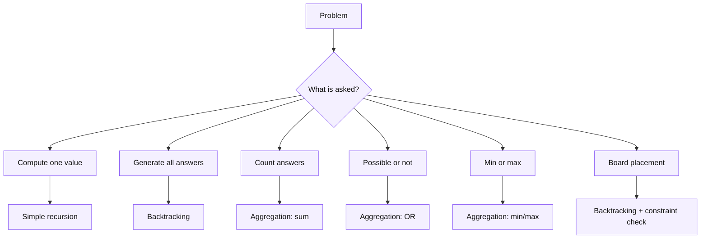

# 1. LCCM Framework

LCCM is the fastest way to convert a recursion/backtracking problem into code.

| Letter | Meaning | Question |
|---|---|---|
| L | Level | What does one recursive call represent? |
| C | Choice | What choices are available at this level? |
| C | Check / Constraint | Is this choice valid? Can I prune? |
| M | Move | How do I apply, recurse, and undo? |

```text
L = Level
C = Choice
C = Check / Constraint
M = Move
```

## LCCM Writing Template

Before coding, write this:

```text
Level      =
Choices    =
Check      =
Move       =
Base case  =
Answer     =
```

# 2. Universal Templates

## 2.1 Simple Recursion Template

```cpp
ReturnType rec(State state) {
    if (base_case) {
        return base_answer;
    }

    ReturnType child = rec(smaller_state);
    return combine(current, child);
}
```

## 2.2 Backtracking Template - Generate All Answers

```cpp
void rec(int level) {
    // base case
    if (base_case) {
        ans.push_back(path);
        return;
    }

    // choices
    for (int i = 0; i < totalChoices; i++) {
        if (!isSafe(level, i)) continue;

        // move: choose
        apply(level, i);

        // recurse
        rec(level + 1);

        // undo: backtrack
        undo(level, i);
    }
}
```

## 2.3 Aggregation Template

Use this when the problem asks for:

- possible or not
- number of ways
- min / max value

```cpp
ReturnType dfs(State state) {
    if (base_case) return base_value;

    ReturnType ans = initial_value;

    for (auto choice : choices) {
        if (!valid(choice)) continue;

        ReturnType child = dfs(next_state);
        ans = aggregate(ans, child);
    }

    return ans;
}
```

| Problem asks | Return type | Initial value | Aggregate |
|---|---:|---:|---|
| possible? | bool | false | OR |
| count ways | int / long long | 0 | + |
| maximum | int | -INF | max |
| minimum | int | INF | min |

# 3. How To Read A Recursion Tree

A recursion tree shows **choices**.
A recursion stack shows **execution order**.

For backtracking, each node should show:

```text
(level, path, extra state)
```

Example:

```text
level 0: ""
├── choose a -> level 1: "a"
│   ├── choose a -> level 2: "aa"
│   └── choose b -> level 2: "ab"
└── choose b -> level 1: "b"
    ├── choose a -> level 2: "ba"
    └── choose b -> level 2: "bb"
```

# 4. Phase Map

| Phase | Pattern | Main idea |
|---|---|---|
| 1 | Simple recursion | Base case + smaller problem |
| 2 | Generate all | Save answer only at base case |
| 3 | Backtracking + pruning | Skip invalid branches early |
| 4 | K-th solution | Count branch size and skip whole branches |
| 5 | Aggregation | Return value from recursion and combine |
| 6 | Board placement | Maintain board / used state and validate moves |

---


# P1. Factorial

## Problem Statement

Given `n`, calculate `n!`.

## Input

```text
n = 5
```

## Output

```text
120
```

## LCCM

```text
Level      = current n
Choices    = no multiple choices; only reduce n by 1
Check      = n == 0 is base case
Move       = return n * fact(n - 1)
Base case  = fact(0) = 1
Answer     = factorial value
```

## Recursion Formula

```text
fact(n) = n * fact(n - 1)
fact(0) = 1
```

## C++ Code

```cpp
#include <bits/stdc++.h>
using namespace std;

long long fact(int n) {
    if (n == 0) return 1;
    return 1LL * n * fact(n - 1);
}

int main() {
    int n;
    cin >> n;
    cout << fact(n) << '\n';
}
```

## Recursion Tree For `n = 5`

```text
fact(5)
└── 5 * fact(4)
    └── 4 * fact(3)
        └── 3 * fact(2)
            └── 2 * fact(1)
                └── 1 * fact(0)
                    └── 1
```

## Mermaid Tree Dry Run

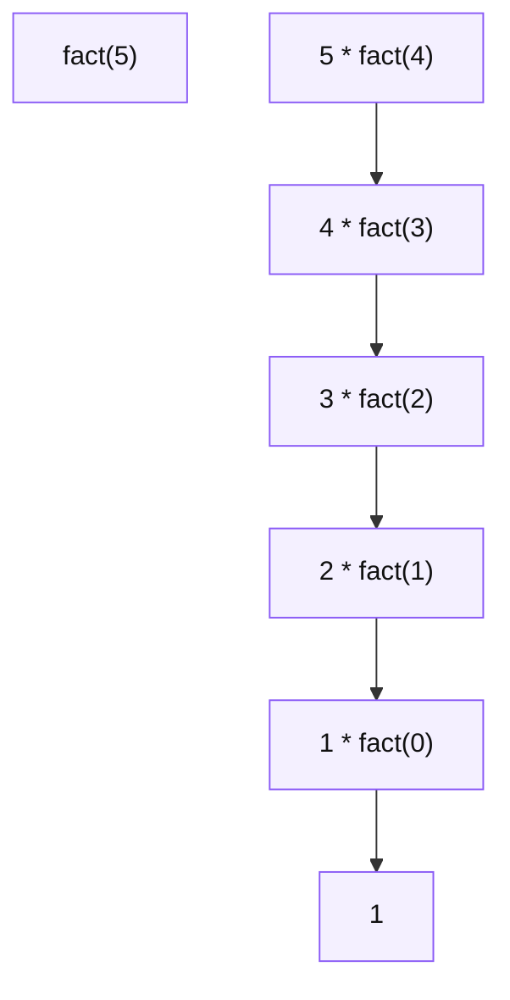

```text
fact(5)
└── 5 * fact(4)
    └── 4 * fact(3)
        └── 3 * fact(2)
            └── 2 * fact(1)
                └── 1 * fact(0)
                    └── 1
```


## Mental Model

> Simple recursion is not about choices. It is about reducing the problem until base case.

---

# P2. Fibonacci Recursion Tree

## Problem Statement

Given `n`, calculate the nth Fibonacci number.

```text
fib(0) = 0
fib(1) = 1
fib(n) = fib(n - 1) + fib(n - 2)
```

## Input

```text
n = 5
```

## Output

```text
5
```

## LCCM

```text
Level      = current n
Choices    = two recursive branches: n-1 and n-2
Check      = n <= 1 is base case
Move       = return fib(n-1) + fib(n-2)
Base case  = fib(0)=0, fib(1)=1
Answer     = nth Fibonacci number
```

## Brute Recursion Code

```cpp
int fib(int n) {
    if (n <= 1) return n;
    return fib(n - 1) + fib(n - 2);
}
```

## Recursion Tree For `fib(5)`

```text
fib(5)
├── fib(4)
│   ├── fib(3)
│   │   ├── fib(2)
│   │   │   ├── fib(1) = 1
│   │   │   └── fib(0) = 0
│   │   └── fib(1) = 1
│   └── fib(2)
│       ├── fib(1) = 1
│       └── fib(0) = 0
└── fib(3)
    ├── fib(2)
    │   ├── fib(1) = 1
    │   └── fib(0) = 0
    └── fib(1) = 1
```

## Observation

`fib(3)`, `fib(2)` repeat many times.
This is why memoization is needed.

## Memoized Code

```cpp
#include <bits/stdc++.h>
using namespace std;

int fib(int n, vector<int>& dp) {
    if (n <= 1) return n;
    if (dp[n] != -1) return dp[n];

    return dp[n] = fib(n - 1, dp) + fib(n - 2, dp);
}

int main() {
    int n;
    cin >> n;
    vector<int> dp(n + 1, -1);
    cout << fib(n, dp) << '\n';
}
```

## Mermaid Tree Dry Run

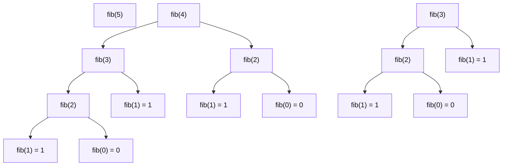

```text
fib(5)
├── fib(4)
│   ├── fib(3)
│   │   ├── fib(2)
│   │   │   ├── fib(1) = 1
│   │   │   └── fib(0) = 0
│   │   └── fib(1) = 1
│   └── fib(2)
│       ├── fib(1) = 1
│       └── fib(0) = 0
└── fib(3)
    ├── fib(2)
    │   ├── fib(1) = 1
    │   └── fib(0) = 0
    └── fib(1) = 1
```


## Mental Model

> If the recursion tree has repeated states, add memoization.

---

# P3. Count Valid Parentheses With Max Depth K

## Problem Statement

Count all valid parentheses strings of length `n` where maximum depth is at most `k`.

This comes from the notes where recursion state uses:

```text
i = current position
j = current depth
k = max allowed depth
```

## Input

```text
n = 4
k = 2
```

## Output

```text
2
```

Valid strings:

```text
(())
()()
```

## LCCM

```text
Level      = index i from 0 to n
Choices    = add '(' or ')'
Check      = depth must be between 0 and k
Move       = '(' increases depth, ')' decreases depth
Base case  = i == n; valid only if depth == 0
Answer     = count of valid strings
```

## C++ Code

```cpp
#include <bits/stdc++.h>
using namespace std;

int n, k;

int rec(int i, int depth, string path) {
    // pruning invalid states
    if (depth < 0 || depth > k) return 0;

    // base case
    if (i == n) {
        if (depth == 0) {
            cout << path << '\n';
            return 1;
        }
        return 0;
    }

    // choice 1: add '('
    int ans = rec(i + 1, depth + 1, path + '(');

    // choice 2: add ')'
    ans += rec(i + 1, depth - 1, path + ')');

    return ans;
}

int main() {
    cin >> n >> k;
    cout << "count = " << rec(0, 0, "") << '\n';
}
```

## Recursion Tree For `n = 4, k = 2`

```text
(0,0," ")
├── '(' -> (1,1,"(")
│   ├── '(' -> (2,2,"((")
│   │   ├── '(' -> (3,3,"(((") INVALID depth > k
│   │   └── ')' -> (3,1,"(()")
│   │       ├── '(' -> (4,2,"(()(") invalid end depth != 0
│   │       └── ')' -> (4,0,"(())") VALID
│   └── ')' -> (2,0,"()")
│       ├── '(' -> (3,1,"()(")
│       │   ├── '(' -> (4,2,"()(('") invalid end depth != 0
│       │   └── ')' -> (4,0,"()()") VALID
│       └── ')' -> (3,-1,"())") INVALID
└── ')' -> (1,-1,")") INVALID
```

## Mermaid Tree Dry Run

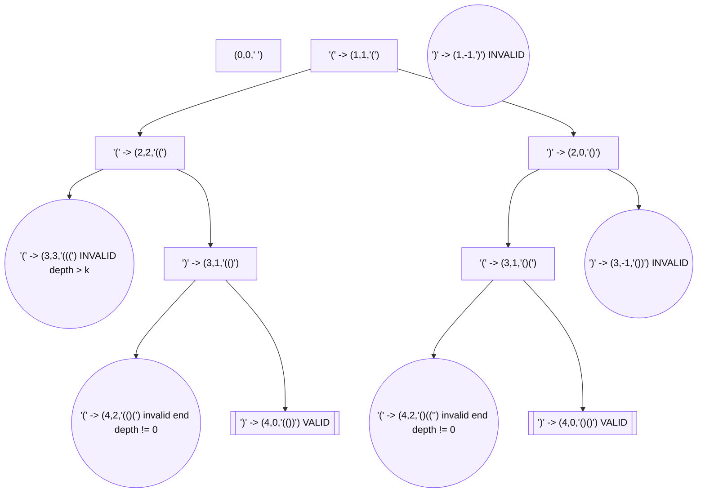

```text
(0,0," ")
├── '(' -> (1,1,"(")
│   ├── '(' -> (2,2,"((")
│   │   ├── '(' -> (3,3,"(((") INVALID depth > k
│   │   └── ')' -> (3,1,"(()")
│   │       ├── '(' -> (4,2,"(()(") invalid end depth != 0
│   │       └── ')' -> (4,0,"(())") VALID
│   └── ')' -> (2,0,"()")
│       ├── '(' -> (3,1,"()(")
│       │   ├── '(' -> (4,2,"()(('") invalid end depth != 0
│       │   └── ')' -> (4,0,"()()") VALID
│       └── ')' -> (3,-1,"())") INVALID
└── ')' -> (1,-1,")") INVALID
```


## Mental Model

> Depth is the number of currently open brackets. It can never become negative and cannot exceed k.

---

# P4. Tower of Hanoi

## Problem Statement

Move `n` disks from source rod `A` to destination rod `C` using helper rod `B`.

Rules:

1. Move one disk at a time.
2. Only the top disk can be moved.
3. A bigger disk cannot be placed over a smaller disk.

## Input

```text
n = 3
```

## Output

```text
A -> C
A -> B
C -> B
A -> C
B -> A
B -> C
A -> C
```

## LCCM

```text
Level      = number of disks n
Choices    = no loop choices; fixed 3-step recursive process
Check      = n == 0 stop
Move       = move n-1 to helper, move biggest, move n-1 to destination
Base case  = n == 0
Answer     = sequence of moves
```

## Idea

To move `n` disks from `A` to `C`:

1. Move `n-1` disks from `A` to `B` using `C`.
2. Move disk `n` from `A` to `C`.
3. Move `n-1` disks from `B` to `C` using `A`.

## C++ Code

```cpp
#include <bits/stdc++.h>
using namespace std;

void hanoi(int n, char source, char helper, char dest) {
    if (n == 0) return;

    hanoi(n - 1, source, dest, helper);
    cout << source << " -> " << dest << '\n';
    hanoi(n - 1, helper, source, dest);
}

int main() {
    int n;
    cin >> n;
    hanoi(n, 'A', 'B', 'C');
}
```

## Recursion Tree For `n = 3`

```text
hanoi(3, A, B, C)
├── hanoi(2, A, C, B)
│   ├── hanoi(1, A, B, C)
│   │   ├── hanoi(0)
│   │   ├── move A -> C
│   │   └── hanoi(0)
│   ├── move A -> B
│   └── hanoi(1, C, A, B)
│       ├── hanoi(0)
│       ├── move C -> B
│       └── hanoi(0)
├── move A -> C
└── hanoi(2, B, A, C)
    ├── hanoi(1, B, C, A)
    │   ├── move B -> A
    ├── move B -> C
    └── hanoi(1, A, B, C)
        ├── move A -> C
```

## Mermaid Tree Dry Run

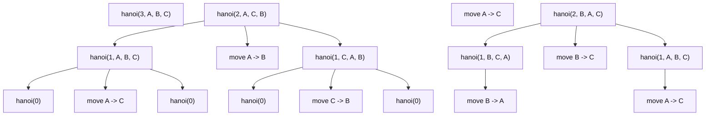

```text
hanoi(3, A, B, C)
├── hanoi(2, A, C, B)
│   ├── hanoi(1, A, B, C)
│   │   ├── hanoi(0)
│   │   ├── move A -> C
│   │   └── hanoi(0)
│   ├── move A -> B
│   └── hanoi(1, C, A, B)
│       ├── hanoi(0)
│       ├── move C -> B
│       └── hanoi(0)
├── move A -> C
└── hanoi(2, B, A, C)
    ├── hanoi(1, B, C, A)
    │   ├── move B -> A
    ├── move B -> C
    └── hanoi(1, A, B, C)
        ├── move A -> C
```


## Complexity

```text
Moves = 2^n - 1
Time  = O(2^n)
```

## Mental Model

> First clear the biggest disk, move it, then rebuild the smaller tower on top of it.

---

# P5. Generate Strings of Length N

## Problem Statement

Given characters `{a, b}` and length `n`, generate all strings of length `n`.

## Input

```text
n = 2
chars = a b
```

## Output

```text
aa
ab
ba
bb
```

## LCCM

```text
Level      = index / position in string
Choices    = 'a' or 'b'
Check      = none
Move       = push char -> recurse -> pop char
Base case  = path.size() == n
Answer     = all generated strings
```

## C++ Code

```cpp
#include <bits/stdc++.h>
using namespace std;

int n;
vector<string> ans;
string path;
vector<char> choices = {'a', 'b'};

// L = current position / path length
// C = choose one character from choices
// C = no restriction here
// M = add char -> recurse -> remove char
void rec(int level) {
    // base case
    if (level == n) {
        ans.push_back(path);
        return;
    }

    // choices
    for (int i = 0; i < (int)choices.size(); i++) {
        char ch = choices[i];

        // move: choose
        path.push_back(ch);

        // recurse to next level
        rec(level + 1);

        // undo: backtrack
        path.pop_back();
    }
}

int main() {
    cin >> n;

    rec(0);

    for (string s : ans) {
        cout << s << '\n';
    }
    return 0;
}
```

## Recursion Tree For `n = 2`

```text
level 0: ""
├── choose a -> level 1: "a"
│   ├── choose a -> level 2: "aa" save
│   └── choose b -> level 2: "ab" save
└── choose b -> level 1: "b"
    ├── choose a -> level 2: "ba" save
    └── choose b -> level 2: "bb" save
```

## Mermaid Tree Dry Run

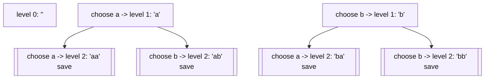

```text
level 0: ""
├── choose a -> level 1: "a"
│   ├── choose a -> level 2: "aa" save
│   └── choose b -> level 2: "ab" save
└── choose b -> level 1: "b"
    ├── choose a -> level 2: "ba" save
    └── choose b -> level 2: "bb" save
```


## Mental Model

> One level fills one position. Choices are the characters allowed at that position.

---

# P6. Phone Keypad Letter Combinations

## Problem Statement

Given a string of digits, return all possible letter combinations based on phone keypad mapping.

## Input

```text
digits = "23"
```

## Output

```text
ad ae af bd be bf cd ce cf
```

## LCCM

```text
Level      = index in digits
Choices    = letters mapped from digits[level]
Check      = digit must have mapping
Move       = add letter -> recurse(level+1) -> remove letter
Base case  = level == digits.size()
Answer     = all combinations
```

## C++ Code

```cpp
#include <bits/stdc++.h>
using namespace std;

string digits;
string path;
vector<string> ans;
vector<string> keyboard = {
    "", "", "abc", "def", "ghi", "jkl",
    "mno", "pqrs", "tuv", "wxyz"
};

bool isSafeDigit(char d) {
    return d >= '2' && d <= '9';
}

// L = index in digits
// C = all letters mapped to digits[level]
// C = digit must be from 2 to 9
// M = add letter -> recurse -> remove letter
void rec(int level) {
    // base case
    if (level == (int)digits.size()) {
        ans.push_back(path);
        return;
    }

    if (!isSafeDigit(digits[level])) return;

    int digit = digits[level] - '0';
    string letters = keyboard[digit];

    // choices
    for (int i = 0; i < (int)letters.size(); i++) {
        char ch = letters[i];

        // move
        path.push_back(ch);
        rec(level + 1);
        path.pop_back();
    }
}

vector<string> letterCombinations(string inputDigits) {
    digits = inputDigits;
    ans.clear();
    path.clear();

    if (digits.empty()) return ans;

    rec(0);
    return ans;
}
```

## Recursion Tree For `digits = "23"`

```text
level 0 digit 2 choices: a,b,c
├── a
│   ├── d -> ad
│   ├── e -> ae
│   └── f -> af
├── b
│   ├── d -> bd
│   ├── e -> be
│   └── f -> bf
└── c
    ├── d -> cd
    ├── e -> ce
    └── f -> cf
```

## Mermaid Tree Dry Run

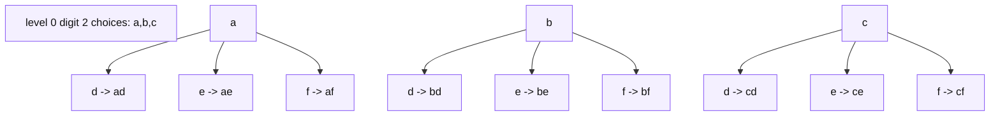

```text
level 0 digit 2 choices: a,b,c
├── a
│   ├── d -> ad
│   ├── e -> ae
│   └── f -> af
├── b
│   ├── d -> bd
│   ├── e -> be
│   └── f -> bf
└── c
    ├── d -> cd
    ├── e -> ce
    └── f -> cf
```


## Mental Model

> One digit equals one level. Letters mapped to that digit are choices.

---

# P7. Subsets / Power Set

## Problem Statement

Given an array of distinct integers, generate all subsets.

## Input

```text
nums = [1, 2, 3]
```

## Output

```text
[]
[1]
[2]
[3]
[1,2]
[1,3]
[2,3]
[1,2,3]
```

## LCCM

```text
Level      = index i in nums
Choices    = skip nums[i] or take nums[i]
Check      = i <= n
Move       = skip branch, take branch with push/pop
Base case  = i == nums.size()
Answer     = all subsets
```

## C++ Code - Include / Exclude

```cpp
#include <bits/stdc++.h>
using namespace std;

vector<int> nums;
vector<int> path;
vector<vector<int>> ans;

bool isSafeIndex(int level) {
    return level <= (int)nums.size();
}

// L = index of current element
// C = skip nums[level] or take nums[level]
// C = level must be inside array boundary
// M = recurse skip, then push -> recurse take -> pop
void rec(int level) {
    if (!isSafeIndex(level)) return;

    // base case
    if (level == (int)nums.size()) {
        ans.push_back(path);
        return;
    }

    // choice 1: do not take nums[level]
    rec(level + 1);

    // choice 2: take nums[level]
    path.push_back(nums[level]);
    rec(level + 1);
    path.pop_back();
}

vector<vector<int>> subsets(vector<int>& input) {
    nums = input;
    path.clear();
    ans.clear();

    rec(0);
    return ans;
}
```

## Recursion Tree For `[1,2]`

```text
i=0 path=[]
├── skip 1 -> i=1 path=[]
│   ├── skip 2 -> i=2 path=[] save
│   └── take 2 -> i=2 path=[2] save
└── take 1 -> i=1 path=[1]
    ├── skip 2 -> i=2 path=[1] save
    └── take 2 -> i=2 path=[1,2] save
```

## Mermaid Tree Dry Run

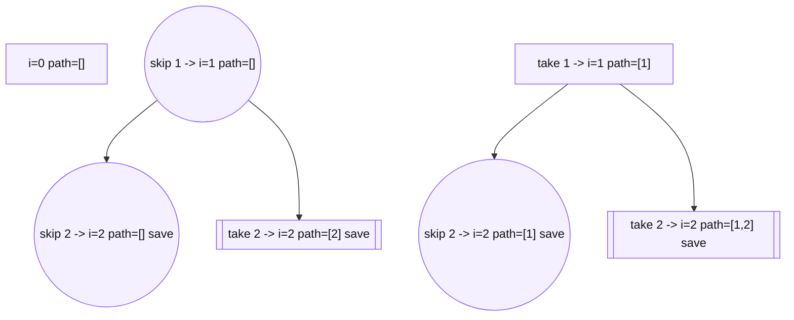

```text
i=0 path=[]
├── skip 1 -> i=1 path=[]
│   ├── skip 2 -> i=2 path=[] save
│   └── take 2 -> i=2 path=[2] save
└── take 1 -> i=1 path=[1]
    ├── skip 2 -> i=2 path=[1] save
    └── take 2 -> i=2 path=[1,2] save
```

## Mermaid Tree Dry Run


```text
i=0 path=[]
├── skip 1 -> i=1 path=[]
│   ├── skip 2 -> i=2 path=[] save
│   └── take 2 -> i=2 path=[2] save
└── take 1 -> i=1 path=[1]
    ├── skip 2 -> i=2 path=[1] save
    └── take 2 -> i=2 path=[1,2] save
```


## Mental Model

> Subset means every element asks: should I enter the answer or not?

---

# P8. Generate Permutations

## Problem Statement

Given distinct values, generate all permutations.

## Input

```text
nums = [1, 2, 3]
```

## Output

```text
[1,2,3]
[1,3,2]
[2,1,3]
[2,3,1]
[3,1,2]
[3,2,1]
```

## LCCM

```text
Level      = position in permutation
Choices    = any unused element
Check      = used[i] == false
Move       = mark used -> push -> recurse -> pop -> unmark
Base case  = path.size() == nums.size()
Answer     = all permutations
```

## C++ Code

```cpp
#include <bits/stdc++.h>
using namespace std;

vector<int> nums;
vector<int> used;
vector<int> path;
vector<vector<int>> ans;

bool isSafe(int index) {
    return used[index] == 0;
}

// L = position in permutation
// C = any unused index
// C = used[index] must be false
// M = mark used -> push -> recurse -> pop -> unmark
void rec(int level) {
    // base case
    if (level == (int)nums.size()) {
        ans.push_back(path);
        return;
    }

    // choices: try every unused element
    for (int i = 0; i < (int)nums.size(); i++) {
        if (!isSafe(i)) continue;

        used[i] = 1;
        path.push_back(nums[i]);

        rec(level + 1);

        path.pop_back();
        used[i] = 0;
    }
}

vector<vector<int>> permute(vector<int>& input) {
    nums = input;
    used.assign(nums.size(), 0);
    path.clear();
    ans.clear();

    rec(0);
    return ans;
}
```

## Recursion Tree For `[1,2,3]`

```text
[]
├── 1
│   ├── 1,2
│   │   └── 1,2,3 save
│   └── 1,3
│       └── 1,3,2 save
├── 2
│   ├── 2,1
│   │   └── 2,1,3 save
│   └── 2,3
│       └── 2,3,1 save
└── 3
    ├── 3,1
    │   └── 3,1,2 save
    └── 3,2
        └── 3,2,1 save
```

## Mermaid Tree Dry Run

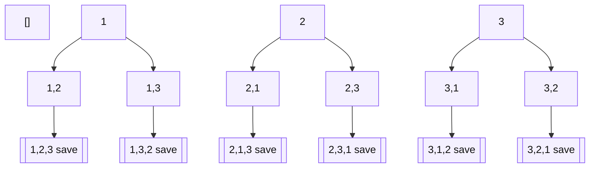

```text
[]
├── 1
│   ├── 1,2
│   │   └── 1,2,3 save
│   └── 1,3
│       └── 1,3,2 save
├── 2
│   ├── 2,1
│   │   └── 2,1,3 save
│   └── 2,3
│       └── 2,3,1 save
└── 3
    ├── 3,1
    │   └── 3,1,2 save
    └── 3,2
        └── 3,2,1 save
```


## Mental Model

> Permutation fills positions. At every position, choose one unused item.

---

# P9. Unique Permutations With Duplicates

## Problem Statement

Given an array that may contain duplicates, generate unique permutations.

## Input

```text
nums = [1, 2, 2]
```

## Output

```text
[1,2,2]
[2,1,2]
[2,2,1]
```

## Why Normal Used Array Can Duplicate

If you treat both `2`s as different indexes, you generate same value order multiple times.

Better approach:

```text
Choose value, not index.
Maintain frequency map.
```

## LCCM

```text
Level      = position in permutation
Choices    = values with freq[value] > 0
Check      = freq[value] must be positive
Move       = freq-- -> push -> recurse -> pop -> freq++
Base case  = path.size() == n
Answer     = unique permutations
```

## C++ Code

```cpp
#include <bits/stdc++.h>
using namespace std;

map<int, int> freq;
vector<int> path;
vector<vector<int>> ans;
int n;

bool isSafe(int value) {
    return freq[value] > 0;
}

// L = position in permutation
// C = each distinct value from frequency map
// C = frequency[value] must be positive
// M = freq-- -> push -> recurse -> pop -> freq++
void rec(int level) {
    // base case
    if (level == n) {
        ans.push_back(path);
        return;
    }

    // choices: choose value, not index
    for (auto it = freq.begin(); it != freq.end(); it++) {
        int value = it->first;

        if (!isSafe(value)) continue;

        freq[value]--;
        path.push_back(value);

        rec(level + 1);

        path.pop_back();
        freq[value]++;
    }
}

vector<vector<int>> permuteUnique(vector<int>& nums) {
    freq.clear();
    path.clear();
    ans.clear();
    n = nums.size();

    for (int x : nums) freq[x]++;

    rec(0);
    return ans;
}
```

## Recursion Tree For `[1,2,2]`

```text
freq = {1:1, 2:2}
[]
├── choose 1 -> [1], freq {1:0,2:2}
│   └── choose 2 -> [1,2], freq {1:0,2:1}
│       └── choose 2 -> [1,2,2] save
└── choose 2 -> [2], freq {1:1,2:1}
    ├── choose 1 -> [2,1], freq {1:0,2:1}
    │   └── choose 2 -> [2,1,2] save
    └── choose 2 -> [2,2], freq {1:1,2:0}
        └── choose 1 -> [2,2,1] save
```

## Mermaid Tree Dry Run

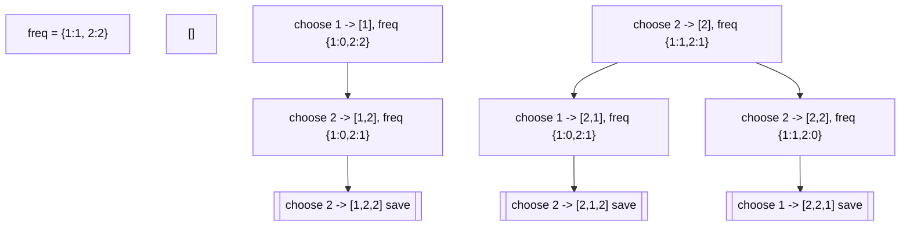

```text
freq = {1:1, 2:2}
[]
├── choose 1 -> [1], freq {1:0,2:2}
│   └── choose 2 -> [1,2], freq {1:0,2:1}
│       └── choose 2 -> [1,2,2] save
└── choose 2 -> [2], freq {1:1,2:1}
    ├── choose 1 -> [2,1], freq {1:0,2:1}
    │   └── choose 2 -> [2,1,2] save
    └── choose 2 -> [2,2], freq {1:1,2:0}
        └── choose 1 -> [2,2,1] save
```


## Mental Model

> Duplicates? Use frequency map. Choice is value, not index.

---

# P10. Generate Valid Parentheses

## Problem Statement

Generate all valid parentheses combinations for `n` pairs.

## Input

```text
n = 2
```

## Output

```text
(())
()()
```

## LCCM

```text
Level      = current path length
Choices    = add '(' or ')'
Check      = open < n, close < open
Move       = push char -> update count -> recurse -> undo
Base case  = path.size() == 2*n
Answer     = valid strings
```

## C++ Code

```cpp
#include <bits/stdc++.h>
using namespace std;

int n;
string path;
vector<string> ans;

bool isSafeOpen(int open) {
    return open < n;
}

bool isSafeClose(int open, int close) {
    return close < open;
}

// L = current position in string
// C = add '(' or ')'
// C = open < n, close < open
// M = add bracket -> recurse -> remove bracket
void rec(int level, int open, int close) {
    // base case
    if (level == 2 * n) {
        ans.push_back(path);
        return;
    }

    // choice 1: add '('
    if (isSafeOpen(open)) {
        path.push_back('(');
        rec(level + 1, open + 1, close);
        path.pop_back();
    }

    // choice 2: add ')'
    if (isSafeClose(open, close)) {
        path.push_back(')');
        rec(level + 1, open, close + 1);
        path.pop_back();
    }
}

vector<string> generateParenthesis(int inputN) {
    n = inputN;
    path.clear();
    ans.clear();

    rec(0, 0, 0);
    return ans;
}
```

## Recursion Tree For `n = 2`

```text
"" (open=0, close=0)
└── "(" (1,0)
    ├── "((" (2,0)
    │   └── "(()" (2,1)
    │       └── "(())" (2,2) save
    └── "()" (1,1)
        └── "()(" (2,1)
            └── "()()" (2,2) save
```

## Mermaid Tree Dry Run

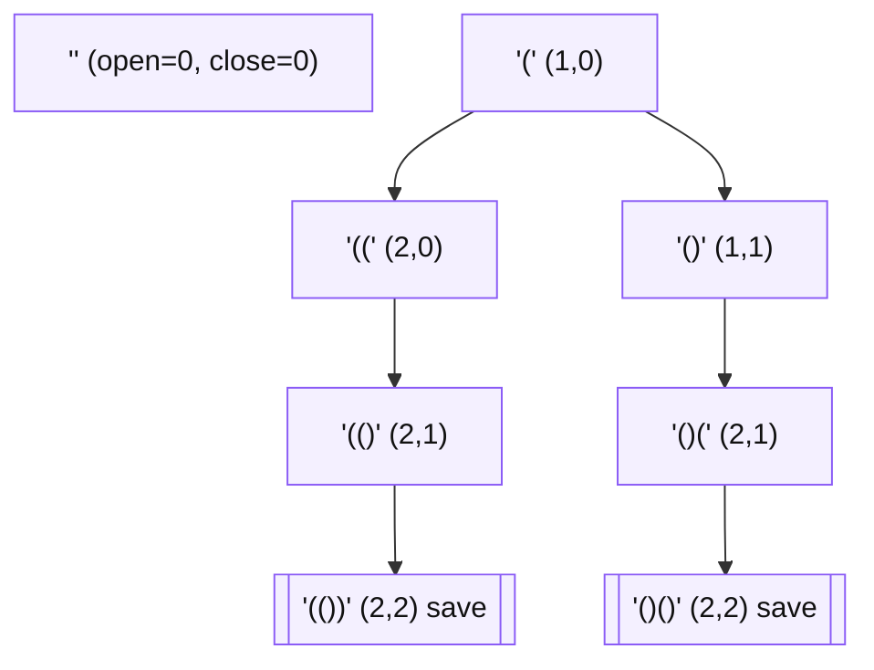

```text
"" (open=0, close=0)
└── "(" (1,0)
    ├── "((" (2,0)
    │   └── "(()" (2,1)
    │       └── "(())" (2,2) save
    └── "()" (1,1)
        └── "()(" (2,1)
            └── "()()" (2,2) save
```


## Mental Model

> Opening bracket creates permission. Closing bracket spends permission.

---

# P11. Palindrome Partitioning

## Problem Statement

Partition string `s` such that every substring in the partition is a palindrome.

## Input

```text
s = "aab"
```

## Output

```text
["a", "a", "b"]
["aa", "b"]
```

## LCCM

```text
Level      = start index of next substring
Choices    = every end index from start to n-1
Check      = s[start..end] must be palindrome
Move       = push substring -> dfs(end+1) -> pop
Base case  = start == s.size()
Answer     = all palindrome partitions
```

## C++ Code

```cpp
#include <bits/stdc++.h>
using namespace std;

string s;
vector<string> path;
vector<vector<string>> ans;

bool isPalindrome(int l, int r) {
    while (l < r) {
        if (s[l] != s[r]) return false;
        l++;
        r--;
    }
    return true;
}

bool isSafe(int start, int end) {
    return isPalindrome(start, end);
}

// L = start index of next substring
// C = end index from start to n-1
// C = substring s[start..end] must be palindrome
// M = push substring -> recurse(end + 1) -> pop
void rec(int start) {
    // base case
    if (start == (int)s.size()) {
        ans.push_back(path);
        return;
    }

    // choices: all possible cuts
    for (int end = start; end < (int)s.size(); end++) {
        if (!isSafe(start, end)) continue;

        path.push_back(s.substr(start, end - start + 1));
        rec(end + 1);
        path.pop_back();
    }
}

vector<vector<string>> partition(string input) {
    s = input;
    path.clear();
    ans.clear();

    rec(0);
    return ans;
}
```

## Recursion Tree For `"aab"`

```text
start=0 path=[]
├── choose s[0..0] = "a" palindrome
│   └── start=1 path=["a"]
│       ├── choose s[1..1] = "a" palindrome
│       │   └── start=2 path=["a","a"]
│       │       └── choose s[2..2] = "b" -> save ["a","a","b"]
│       └── choose s[1..2] = "ab" not palindrome prune
├── choose s[0..1] = "aa" palindrome
│   └── start=2 path=["aa"]
│       └── choose s[2..2] = "b" -> save ["aa","b"]
└── choose s[0..2] = "aab" not palindrome prune
```

## Mermaid Tree Dry Run

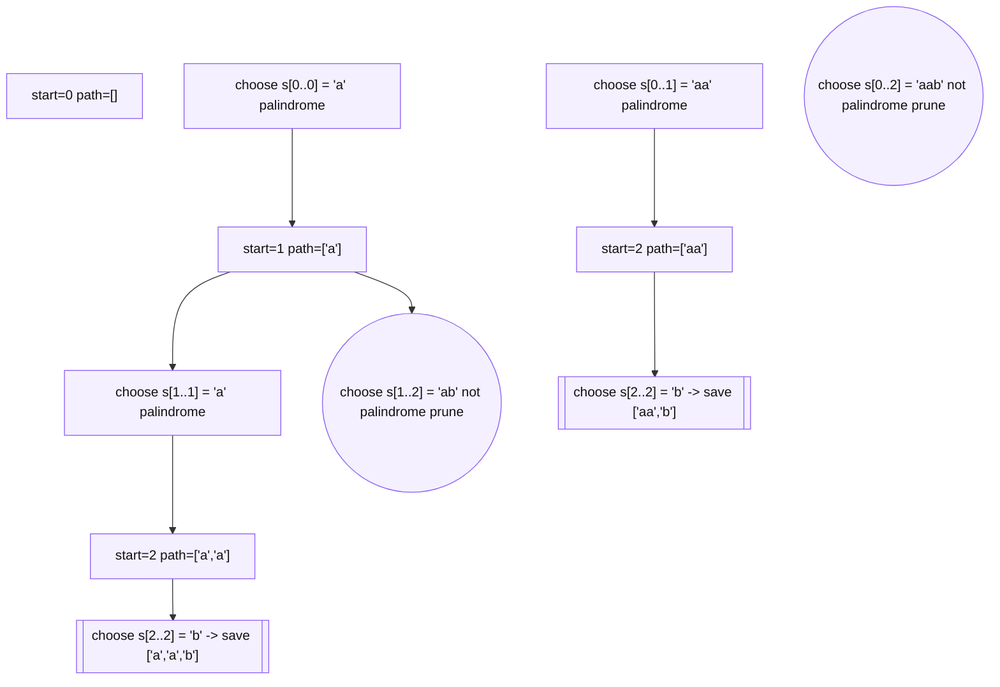

```text
start=0 path=[]
├── choose s[0..0] = "a" palindrome
│   └── start=1 path=["a"]
│       ├── choose s[1..1] = "a" palindrome
│       │   └── start=2 path=["a","a"]
│       │       └── choose s[2..2] = "b" -> save ["a","a","b"]
│       └── choose s[1..2] = "ab" not palindrome prune
├── choose s[0..1] = "aa" palindrome
│   └── start=2 path=["aa"]
│       └── choose s[2..2] = "b" -> save ["aa","b"]
└── choose s[0..2] = "aab" not palindrome prune
```


## Mental Model

> Partitioning problems usually mean: Level = start index, Choice = next cut.

---

# P12. Combination Sum - Reuse Allowed

## Problem Statement

Given candidates and target, return all combinations where numbers can be reused unlimited times.

## Input

```text
candidates = [2, 3, 6, 7]
target = 7
```

## Output

```text
[2,2,3]
[7]
```

## LCCM

```text
Level      = index idx + remaining sum rem
Choices    = take candidates[idx] or skip it
Check      = rem >= 0
Move       = take keeps same idx; skip moves idx+1
Base case  = rem == 0
Answer     = all valid combinations
```

## C++ Code

```cpp
#include <bits/stdc++.h>
using namespace std;

vector<int> cand;
vector<int> path;
vector<vector<int>> ans;

bool isSafe(int idx, int rem) {
    if (idx >= (int)cand.size()) return false;
    if (rem < 0) return false;
    return true;
}

// L = candidate index + remaining target
// C = take current OR skip current
// C = remaining target cannot be negative
// M = take keeps same index; skip moves to next index
void rec(int idx, int rem) {
    // base case
    if (rem == 0) {
        ans.push_back(path);
        return;
    }

    if (!isSafe(idx, rem)) return;

    // choice 1: take cand[idx], reuse allowed
    path.push_back(cand[idx]);
    rec(idx, rem - cand[idx]);
    path.pop_back();

    // choice 2: skip cand[idx]
    rec(idx + 1, rem);
}

vector<vector<int>> combinationSum(vector<int>& candidates, int target) {
    cand = candidates;
    path.clear();
    ans.clear();

    rec(0, target);
    return ans;
}
```

## Recursion Tree For target 7

```text
(idx=0, rem=7, path=[]), cand[0]=2
├── take 2 -> (0,5,[2])
│   ├── take 2 -> (0,3,[2,2])
│   │   ├── take 2 -> (0,1,[2,2,2]) eventually invalid
│   │   └── skip 2 -> (1,3,[2,2])
│   │       └── take 3 -> (1,0,[2,2,3]) save
│   └── skip 2 -> try 3,6,7
└── skip 2 -> (1,7,[])
    ├── try 3 branches
    └── skip to 7 -> take 7 -> rem=0 save [7]
```

## Mermaid Tree Dry Run

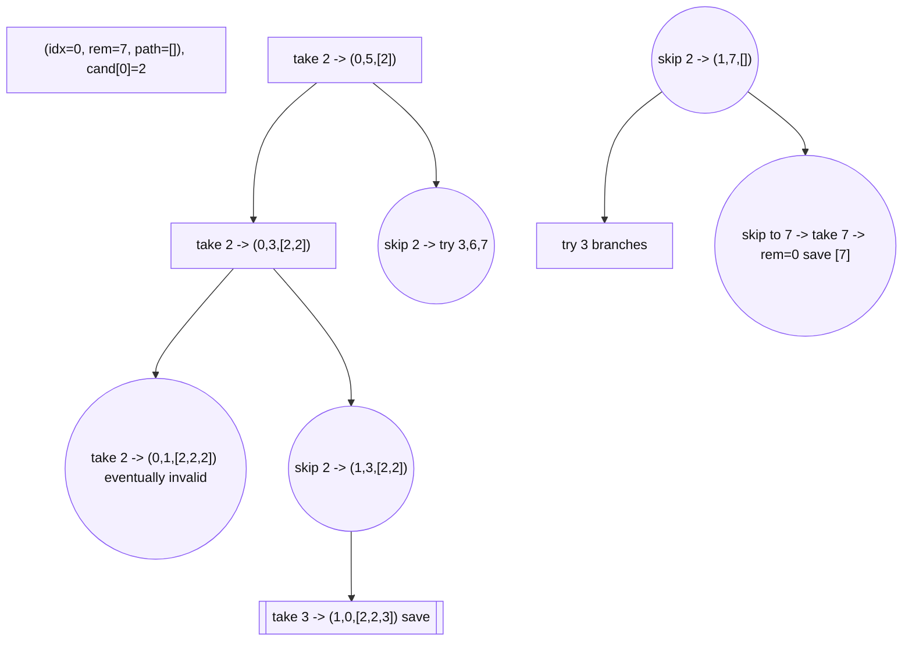

```text
(idx=0, rem=7, path=[]), cand[0]=2
├── take 2 -> (0,5,[2])
│   ├── take 2 -> (0,3,[2,2])
│   │   ├── take 2 -> (0,1,[2,2,2]) eventually invalid
│   │   └── skip 2 -> (1,3,[2,2])
│   │       └── take 3 -> (1,0,[2,2,3]) save
│   └── skip 2 -> try 3,6,7
└── skip 2 -> (1,7,[])
    ├── try 3 branches
    └── skip to 7 -> take 7 -> rem=0 save [7]
```


## Mental Model

> Reuse allowed means after taking a number, stay on same index.

---

# P13. Combination Sum II - Reuse Not Allowed + Duplicates

## Problem Statement

Each candidate can be used once. Input may contain duplicates. Return unique combinations that sum to target.

## Input

```text
candidates = [10,1,2,7,6,1,5]
target = 8
```

## Output

```text
[1,1,6]
[1,2,5]
[1,7]
[2,6]
```

## LCCM

```text
Level      = start index
Choices    = choose i from start to n-1
Check      = skip duplicate candidates at same level; rem >= candidates[i]
Move       = push candidates[i] -> dfs(i+1, rem-candidates[i]) -> pop
Base case  = rem == 0
Answer     = unique combinations
```

## C++ Code

```cpp
#include <bits/stdc++.h>
using namespace std;

vector<int> a;
vector<int> path;
vector<vector<int>> ans;

bool isSafe(int i, int start, int rem) {
    // same-level duplicate skip
    if (i > start && a[i] == a[i - 1]) return false;

    // sorted array pruning
    if (a[i] > rem) return false;

    return true;
}

// L = start index
// C = choose any i from start to n-1
// C = skip duplicate at same level and value must fit rem
// M = push a[i] -> recurse(i + 1) -> pop
void rec(int start, int rem) {
    // base case
    if (rem == 0) {
        ans.push_back(path);
        return;
    }

    // choices
    for (int i = start; i < (int)a.size(); i++) {
        if (!isSafe(i, start, rem)) continue;

        path.push_back(a[i]);
        rec(i + 1, rem - a[i]);
        path.pop_back();
    }
}

vector<vector<int>> combinationSum2(vector<int>& candidates, int target) {
    a = candidates;
    sort(a.begin(), a.end());
    path.clear();
    ans.clear();

    rec(0, target);
    return ans;
}
```

## Duplicate Rule

```text
if (i > start && a[i] == a[i - 1]) continue;
```

This means:

- Skip duplicate only at the same recursion level.
- Do not skip duplicates that are part of a deeper valid path like `[1,1,6]`.

## Recursion Tree Snippet

```text
sorted = [1,1,2,5,6,7,10]
start=0 rem=8 path=[]
├── choose index 0 value 1 -> start=1 rem=7 path=[1]
│   ├── choose index 1 value 1 -> path=[1,1], rem=6
│   │   └── choose 6 -> [1,1,6] save
│   ├── choose 2 -> path=[1,2], rem=5
│   │   └── choose 5 -> [1,2,5] save
│   └── choose 7 -> [1,7] save
├── index 1 value 1 skipped at same level
└── choose 2 -> path=[2], rem=6
    └── choose 6 -> [2,6] save
```

## Mermaid Tree Dry Run

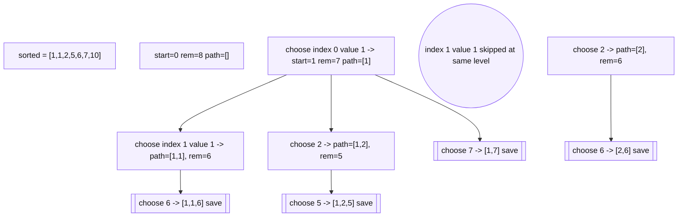

```text
sorted = [1,1,2,5,6,7,10]
start=0 rem=8 path=[]
├── choose index 0 value 1 -> start=1 rem=7 path=[1]
│   ├── choose index 1 value 1 -> path=[1,1], rem=6
│   │   └── choose 6 -> [1,1,6] save
│   ├── choose 2 -> path=[1,2], rem=5
│   │   └── choose 5 -> [1,2,5] save
│   └── choose 7 -> [1,7] save
├── index 1 value 1 skipped at same level
└── choose 2 -> path=[2], rem=6
    └── choose 6 -> [2,6] save
```

## Mental Model

> Reuse not allowed means next recursion starts from `i+1`. Duplicates need same-level skip.

---


# Phase 4 - K-th Solution / Count-and-Skip Recursion

## Why K-th Solution Is Different

Normal backtracking generates every answer:

```text
choose -> recurse -> save all answers
```

K-th solution recursion does **not** generate all answers. It counts how many answers exist under each branch. If a whole branch has fewer than `k` answers, skip that complete branch.

```text
for each choice in sorted order:
    branchCount = number of solutions if I choose this

    if k > branchCount:
        k -= branchCount       // skip this whole branch
    else:
        choose this branch     // answer is inside this branch
```

## LCCM For K-th Solution

```text
Level      = current position in answer
Choices    = choices in required order, usually lexicographic
Check      = choice must be valid
Move       = count branch -> skip branch OR enter branch
Base case  = answer length complete / state complete
Answer     = only the k-th answer, not all answers
```

## Universal K-th Template

```cpp
// Count-and-skip recursion template
// L = answer position / recursion level
// C = choices in sorted / lexicographic order
// C = choice must be valid
// M = count branch, skip or choose
void rec(int level) {
    if (base_case) {
        return;
    }

    for (int choice = firstChoice; choice <= lastChoice; choice++) {
        if (!isSafe(choice)) continue;

        long long branchCount = countWaysIfChoose(choice);

        if (k > branchCount) {
            // skip this full subtree
            k -= branchCount;
        } else {
            // k-th answer lies inside this subtree
            apply(choice);
            rec(level + 1);
            return;
        }
    }
}
```

## Core Mental Model

```text
Backtracking asks: generate all branches.
K-th recursion asks: which branch contains the k-th answer?
```

---

# P14. K-th Permutation

## Problem Statement

Given `n` and `k`, return the k-th permutation of numbers `1..n` in lexicographic order.

## Input

```text
n = 4
k = 9
```

## Output

```text
2314
```

## Example Order For n = 3

```text
1: 123
2: 132
3: 213
4: 231
5: 312
6: 321
```

## LCCM

```text
Level      = position in permutation
Choices    = unused numbers in increasing order
Check      = number must be unused
Move       = each choice fixes one number; branch size = factorial(remaining positions)
Base case  = permutation length == n
Answer     = k-th permutation
```

## Brute Force Thinking

Generate all permutations, sort them, return `ans[k-1]`.

Problem:

```text
n! permutations are too many.
```

## Optimal Count-and-Skip Idea

At each position:

```text
If remaining positions = r
then each candidate at current position contributes r! permutations.
```

For `n = 4`, first position branch sizes:

```text
1 _ _ _ -> 3! = 6 permutations
2 _ _ _ -> 3! = 6 permutations
3 _ _ _ -> 3! = 6 permutations
4 _ _ _ -> 3! = 6 permutations
```

For `k = 9`:

```text
k = 9
choice 1 has 6 permutations, skip them
k = 9 - 6 = 3
choice 2 contains answer
answer starts with 2
```

## C++ Code - Simple Notes Style, No Lambda

```cpp
#include <bits/stdc++.h>
using namespace std;

int n;
long long k;
vector<int> used;
vector<long long> fact;
string answer;

bool isSafe(int value) {
    return used[value] == 0;
}

long long countBranch(int remainingPositions) {
    return fact[remainingPositions];
}

// L = current position in permutation
// C = unused numbers from 1 to n in increasing order
// C = number must be unused
// M = count branch -> skip branch OR choose and recurse
void rec(int level) {
    // base case
    if (level == n) {
        return;
    }

    int remainingPositions = n - level - 1;
    long long branchSize = countBranch(remainingPositions);

    // choices in lexicographic order
    for (int value = 1; value <= n; value++) {
        if (!isSafe(value)) continue;

        if (k > branchSize) {
            // k-th answer is not in this branch
            k -= branchSize;
        } else {
            // k-th answer is inside this branch
            used[value] = 1;
            answer.push_back(char('0' + value));

            rec(level + 1);
            return;
        }
    }
}

string kthPermutation(int inputN, long long inputK) {
    n = inputN;
    k = inputK;

    used.assign(n + 1, 0);
    fact.assign(n + 1, 1);
    answer.clear();

    for (int i = 1; i <= n; i++) {
        fact[i] = fact[i - 1] * i;
    }

    rec(0);
    return answer;
}

int main() {
    cin >> n >> k;
    cout << kthPermutation(n, k) << '\n';
    return 0;
}
```

## Recursion Tree For `n = 4, k = 9`

```text
level 0, k=9
├── choose 1: branch size 6 -> skip, k=3
└── choose 2: branch size 6 -> enter, answer = 2

level 1, remaining numbers = 1,3,4, k=3
├── choose 1: branch size 2 -> skip, k=1
└── choose 3: branch size 2 -> enter, answer = 23

level 2, remaining numbers = 1,4, k=1
└── choose 1: branch size 1 -> enter, answer = 231

level 3, remaining number = 4
└── choose 4 -> answer = 2314
```

## Mermaid Tree Dry Run

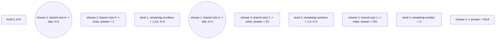

```text
level 0, k=9
├── choose 1: branch size 6 -> skip, k=3
└── choose 2: branch size 6 -> enter, answer = 2

level 1, remaining numbers = 1,3,4, k=3
├── choose 1: branch size 2 -> skip, k=1
└── choose 3: branch size 2 -> enter, answer = 23

level 2, remaining numbers = 1,4, k=1
└── choose 1: branch size 1 -> enter, answer = 231

level 3, remaining number = 4
└── choose 4 -> answer = 2314
```


## Complexity

```text
Time  = O(n^2) with used array scanning
Space = O(n)
```

## Mental Model

> K-th permutation = factorial blocks. Skip whole blocks until k lands inside one block.

---

# P15. K-th Subset In Lexicographic Binary Order

## Problem Statement

Given an array of `n` elements, return the k-th subset if subsets are generated by binary take/not-take order.

For `nums = [1,2,3]`, one common binary recursion order is:

```text
1: []
2: [3]
3: [2]
4: [2,3]
5: [1]
6: [1,3]
7: [1,2]
8: [1,2,3]
```

This is produced when recursion does:

```text
not take first
then take first
```

## Input

```text
nums = [1, 2, 3]
k = 6
```

## Output

```text
[1, 3]
```

## LCCM

```text
Level      = index in nums
Choices    = not take OR take
Check      = level must be inside array
Move       = branch size for each choice = 2^(remaining elements)
Base case  = level == n
Answer     = k-th subset
```

## Key Count Formula

At index `level`, after deciding current element, remaining elements are:

```text
remaining = n - level - 1
```

Number of subsets under each branch:

```text
2^remaining
```

## C++ Code - Simple Notes Style, No Lambda

```cpp
#include <bits/stdc++.h>
using namespace std;

vector<int> nums;
vector<int> answer;
long long k;
int n;

bool isSafeIndex(int level) {
    return level <= n;
}

long long countBranch(int remainingElements) {
    return 1LL << remainingElements;
}

// L = current index
// C = not take nums[level] OR take nums[level]
// C = level must be inside boundary
// M = count not-take branch, skip or enter; then take branch if needed
void rec(int level) {
    if (!isSafeIndex(level)) return;

    // base case
    if (level == n) {
        return;
    }

    int remainingElements = n - level - 1;
    long long branchSize = countBranch(remainingElements);

    // choice 1: not take nums[level]
    if (k <= branchSize) {
        rec(level + 1);
        return;
    }

    // skip all subsets where nums[level] is not taken
    k -= branchSize;

    // choice 2: take nums[level]
    answer.push_back(nums[level]);
    rec(level + 1);
}

vector<int> kthSubset(vector<int>& input, long long inputK) {
    nums = input;
    n = nums.size();
    k = inputK;
    answer.clear();

    rec(0);
    return answer;
}

int main() {
    int m;
    cin >> m >> k;

    vector<int> input(m);
    for (int i = 0; i < m; i++) cin >> input[i];

    vector<int> result = kthSubset(input, k);

    for (int x : result) cout << x << ' ';
    cout << '\n';

    return 0;
}
```

## Recursion Tree For `[1,2,3]`

```text
level 0: decide 1
├── not take 1 -> 4 subsets: [], [3], [2], [2,3]
└── take 1     -> 4 subsets: [1], [1,3], [1,2], [1,2,3]
```

For `k = 6`:

```text
not-take 1 branch has 4 subsets
k = 6 > 4, skip it
k = 2
take 1

level 1: decide 2
not-take 2 branch has 2 subsets: [1], [1,3]
k = 2 <= 2, enter not-take 2

level 2: decide 3
not-take 3 branch has 1 subset: [1]
k = 2 > 1, skip
k = 1
take 3
answer = [1,3]
```

## Mermaid Tree Dry Run

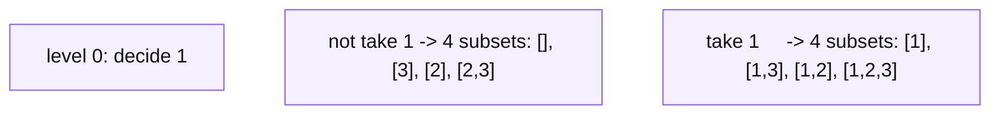

```text
level 0: decide 1
├── not take 1 -> 4 subsets: [], [3], [2], [2,3]
└── take 1     -> 4 subsets: [1], [1,3], [1,2], [1,2,3]
```


## Mental Model

> K-th subset = binary tree blocks. Each take/not-take branch has `2^remaining` answers.

---

# P16. K-th Valid Parentheses

## Problem Statement

Given `n` pairs of parentheses and `k`, return the k-th valid parentheses string in lexicographic order where `'(' < ')'`.

## Input

```text
n = 3
k = 4
```

## All Valid Parentheses For n = 3

```text
1: ((()))
2: (()())
3: (())()
4: ()(())
5: ()()()
```

## Output

```text
()(())
```

## LCCM

```text
Level      = current position in string
Choices    = '(' first, then ')'
Check      = open < n, close < open
Move       = count valid completions after choice; skip or choose
Base case  = path length == 2*n
Answer     = k-th valid parentheses string
```

## Count Function

We need to know how many valid completions exist from state:

```text
open  = number of '(' used
close = number of ')' used
```

Use memoized recursion:

```text
count(open, close)
```

## C++ Code - Simple Notes Style, No Lambda

```cpp
#include <bits/stdc++.h>
using namespace std;

int n;
long long k;
string answer;
long long memo[35][35];

bool isSafeOpen(int open) {
    return open < n;
}

bool isSafeClose(int open, int close) {
    return close < open;
}

long long countWays(int open, int close) {
    // invalid state
    if (open > n || close > open) return 0;

    // base case
    if (open == n && close == n) return 1;

    if (memo[open][close] != -1) return memo[open][close];

    long long ways = 0;

    // choice 1: add '('
    if (isSafeOpen(open)) {
        ways += countWays(open + 1, close);
    }

    // choice 2: add ')'
    if (isSafeClose(open, close)) {
        ways += countWays(open, close + 1);
    }

    return memo[open][close] = ways;
}

// L = current position / path length
// C = '(' first, then ')'
// C = open < n, close < open
// M = count branch -> skip OR choose
void rec(int open, int close) {
    // base case
    if ((int)answer.size() == 2 * n) {
        return;
    }

    // choice 1: try '(' first because '(' is lexicographically smaller
    if (isSafeOpen(open)) {
        long long branchCount = countWays(open + 1, close);

        if (k <= branchCount) {
            answer.push_back('(');
            rec(open + 1, close);
            return;
        } else {
            k -= branchCount;
        }
    }

    // choice 2: try ')'
    if (isSafeClose(open, close)) {
        long long branchCount = countWays(open, close + 1);

        if (k <= branchCount) {
            answer.push_back(')');
            rec(open, close + 1);
            return;
        } else {
            k -= branchCount;
        }
    }
}

string kthParentheses(int inputN, long long inputK) {
    n = inputN;
    k = inputK;
    answer.clear();
    memset(memo, -1, sizeof(memo));

    rec(0, 0);
    return answer;
}

int main() {
    cin >> n >> k;
    cout << kthParentheses(n, k) << '\n';
    return 0;
}
```

## Recursion Tree For `n = 3, k = 4`

```text
start: open=0 close=0 k=4
only '(' possible -> answer = "("

state "(" open=1 close=0
try '(' branch: count = 3 strings
k=4 > 3, skip this branch
k=1
try ')' -> answer = "()"

state "()" open=1 close=1
try '(' branch: count = 2 strings
k=1 <= 2, enter
answer = "()("

continue lexicographically inside that branch
answer = "()(())"
```

## Mermaid Tree Dry Run

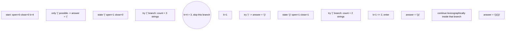

```text
start: open=0 close=0 k=4
only '(' possible -> answer = "("

state "(" open=1 close=0
try '(' branch: count = 3 strings
k=4 > 3, skip this branch
k=1
try ')' -> answer = "()"

state "()" open=1 close=1
try '(' branch: count = 2 strings
k=1 <= 2, enter
answer = "()("

continue lexicographically inside that branch
answer = "()(())"
```


## Mental Model

> K-th valid parentheses = Catalan-style counting + lexicographic branch skipping.

---

# K-th Solution Pattern Recognition Table

| Problem type | Branch count | Choice order | Key idea |
|---|---:|---|---|
| K-th permutation | `(remaining)!` | increasing unused numbers | factorial blocks |
| K-th subset | `2^remaining` | not-take, then take | binary blocks |
| K-th valid parentheses | DP count state | `'('`, then `')'` | Catalan branch count |
| K-th grid path | DP paths from cell | lexicographic moves | skip path-count blocks |
| K-th lexicographic string | power / DP count | alphabet order | skip character branches |

## Common Mistakes In K-th Problems

### 1. Generating all answers first

This is usually too slow.

```text
Wrong for large n:
generate all -> sort -> return k-th
```

### 2. Forgetting that k is usually 1-indexed

Most K-th problems use:

```text
k = 1 means first answer
```

### 3. Wrong choice order

K-th depends completely on order.

```text
lexicographic order means choices must be tried sorted.
```

### 4. Not checking branch count before entering

Correct approach:

```text
count branch first
then decide skip or enter
```

## Final K-th One-Liner

> K-th recursion = ordered DFS + count subtree size + skip full subtrees.

---

# P17. Word Break - Possible Or Not

## Problem Statement

Given a string and dictionary, determine whether the string can be segmented into dictionary words.

## Input

```text
s = "algomonster"
words = ["algo", "monster"]
```

## Output

```text
true
```

## LCCM

```text
Level      = start index in string
Choices    = dictionary words that match prefix from start
Check      = s.substr(start, len) == word
Move       = dfs(start + word.length)
Base case  = start == s.size()
Answer     = OR of child results
```

## C++ Code With Memoization

```cpp
#include <bits/stdc++.h>
using namespace std;

string s;
vector<string> words;
vector<int> memo;

bool isSafe(int start, string word) {
    int len = word.size();
    if (start + len > (int)s.size()) return false;
    return s.substr(start, len) == word;
}

// L = start index in target string
// C = any dictionary word matching prefix from start
// C = s[start..start+len-1] == word
// M = recurse from start + word.length()
bool rec(int start) {
    // base case
    if (start == (int)s.size()) return true;

    if (memo[start] != -1) return memo[start];

    // choices
    for (int i = 0; i < (int)words.size(); i++) {
        string word = words[i];

        if (!isSafe(start, word)) continue;

        if (rec(start + word.size())) {
            return memo[start] = true;
        }
    }

    return memo[start] = false;
}

bool wordBreak(string input, vector<string>& wordDict) {
    s = input;
    words = wordDict;
    memo.assign(s.size() + 1, -1);

    return rec(0);
}
```

## Recursion Tree

```text
start=0, s="algomonster"
└── choose "algo" because prefix matches
    └── start=4, remaining="monster"
        └── choose "monster" because prefix matches
            └── start=11 == n -> true
```

## Mermaid Tree Dry Run

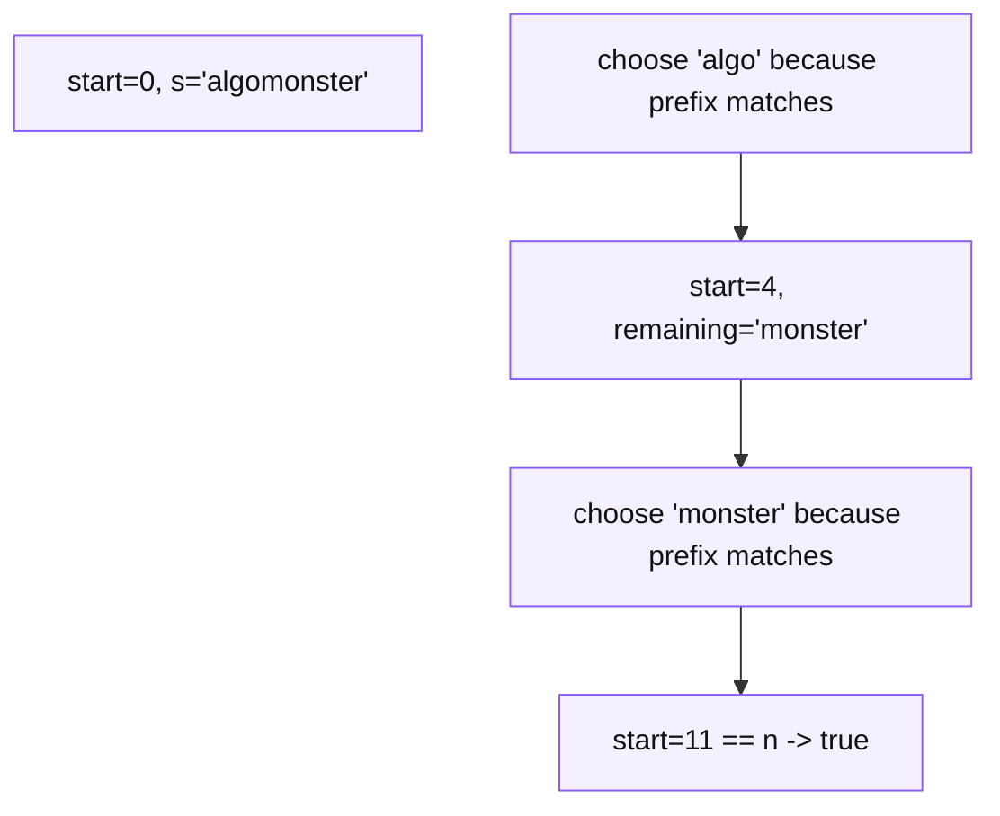

```text
start=0, s="algomonster"
└── choose "algo" because prefix matches
    └── start=4, remaining="monster"
        └── choose "monster" because prefix matches
            └── start=11 == n -> true
```


## Mental Model

> Word Break = partition string by valid dictionary prefixes.

---

# P18. Decode Ways - Count Ways

## Problem Statement

Given a digit string, count how many ways it can be decoded where:

```text
1 -> A
2 -> B
...
26 -> Z
```

## Input

```text
s = "12"
```

## Output

```text
2
```

Because:

```text
1 2 -> AB
12  -> L
```

## LCCM

```text
Level      = index i in string
Choices    = take one digit or take two digits
Check      = one digit cannot be '0'; two-digit number must be 10..26
Move       = dfs(i+1) or dfs(i+2)
Base case  = i == n returns 1
Answer     = count ways = sum of valid child ways
```

## C++ Code

```cpp
#include <bits/stdc++.h>
using namespace std;

string s;
vector<int> memo;

bool isSafeOneDigit(int i) {
    return s[i] != '0';
}

bool isSafeTwoDigits(int i) {
    if (i + 1 >= (int)s.size()) return false;

    int value = (s[i] - '0') * 10 + (s[i + 1] - '0');
    return value >= 10 && value <= 26;
}

// L = index in digit string
// C = take one digit OR take two digits
// C = one digit cannot be 0, two digits must be 10..26
// M = recurse(i + 1) or recurse(i + 2)
int rec(int i) {
    // base case
    if (i == (int)s.size()) return 1;

    if (!isSafeOneDigit(i)) return 0;
    if (memo[i] != -1) return memo[i];

    int ways = 0;

    // choice 1: take one digit
    ways += rec(i + 1);

    // choice 2: take two digits
    if (isSafeTwoDigits(i)) {
        ways += rec(i + 2);
    }

    return memo[i] = ways;
}

int numDecodings(string input) {
    s = input;
    memo.assign(s.size() + 1, -1);

    return rec(0);
}
```

## Recursion Tree For `"226"`

```text
i=0 "226"
├── take "2" -> i=1 "26"
│   ├── take "2" -> i=2 "6"
│   │   └── take "6" -> i=3 save 1
│   └── take "26" -> i=3 save 1
└── take "22" -> i=2 "6"
    └── take "6" -> i=3 save 1
```

## Mermaid Tree Dry Run

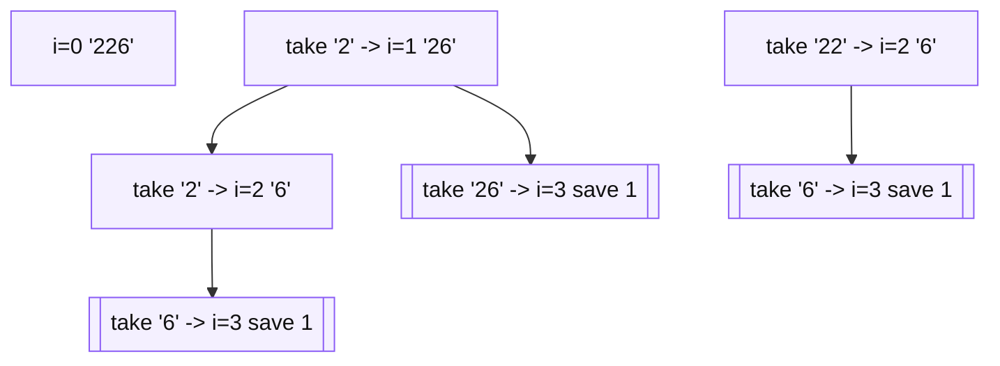

```text
i=0 "226"
├── take "2" -> i=1 "26"
│   ├── take "2" -> i=2 "6"
│   │   └── take "6" -> i=3 save 1
│   └── take "26" -> i=3 save 1
└── take "22" -> i=2 "6"
    └── take "6" -> i=3 save 1
```

Total = 3 ways.

## Mermaid Tree Dry Run

```mermaid
flowchart TD
    classDef default fill:#f4f0ff,stroke:#8b5cf6,color:#111,stroke-width:1px;
    N0["i=0 '226'"]
    N1["take '2' -> i=1 '26'"]
    N2["take '2' -> i=2 '6'"]
    N3[["take '6' -> i=3 save 1"]]
    N4[["take '26' -> i=3 save 1"]]
    N5["take '22' -> i=2 '6'"]
    N6[["take '6' -> i=3 save 1"]]
    N1 --> N2
    N2 --> N3
    N1 --> N4
    N5 --> N6
```

```text
i=0 "226"
├── take "2" -> i=1 "26"
│   ├── take "2" -> i=2 "6"
│   │   └── take "6" -> i=3 save 1
│   └── take "26" -> i=3 save 1
└── take "22" -> i=2 "6"
    └── take "6" -> i=3 save 1
```


## Aggregation

```text
Count ways => sum aggregation
```

## Mental Model

> At every index, choose valid chunk length: one digit or two digits.

---

# P19. Min Cost Climbing Stairs - Min Aggregation

## Problem Statement

Given cost array, you can climb 1 or 2 steps. Return minimum cost to reach the top.

## Input

```text
cost = [10, 15, 20]
```

## Output

```text
15
```

## LCCM

```text
Level      = current stair index i
Choices    = jump 1 step or 2 steps
Check      = if i >= n, cost is 0
Move       = cost[i] + min(dfs(i+1), dfs(i+2))
Base case  = i >= n returns 0
Answer     = min(dfs(0), dfs(1))
```

## C++ Code

```cpp
#include <bits/stdc++.h>
using namespace std;

vector<int> cost;
vector<int> memo;

bool isSafe(int i) {
    return i < (int)cost.size();
}

// L = current stair index
// C = jump 1 step OR jump 2 steps
// C = if index is beyond top, cost is 0
// M = cost[i] + min(rec(i+1), rec(i+2))
int rec(int i) {
    // base case: reached top or beyond top
    if (!isSafe(i)) return 0;

    if (memo[i] != -1) return memo[i];

    int oneStep = rec(i + 1);
    int twoStep = rec(i + 2);

    return memo[i] = cost[i] + min(oneStep, twoStep);
}

int minCostClimbingStairs(vector<int>& inputCost) {
    cost = inputCost;
    memo.assign(cost.size(), -1);

    return min(rec(0), rec(1));
}
```

## Recursion Tree For `[10,15,20]`

```text
dfs(0)
├── pay 10 + dfs(1)
│   ├── pay 15 + dfs(2)
│   └── pay 15 + dfs(3)
└── pay 10 + dfs(2)
```

## Mermaid Tree Dry Run

```mermaid
flowchart TD
    classDef default fill:#f4f0ff,stroke:#8b5cf6,color:#111,stroke-width:1px;
    N0["dfs(0)"]
    N1["pay 10 + dfs(1)"]
    N2["pay 15 + dfs(2)"]
    N3["pay 15 + dfs(3)"]
    N4["pay 10 + dfs(2)"]
    N1 --> N2
    N1 --> N3
```

```text
dfs(0)
├── pay 10 + dfs(1)
│   ├── pay 15 + dfs(2)
│   └── pay 15 + dfs(3)
└── pay 10 + dfs(2)
```

Start can be stair 0 or 1.

```text
dfs(0) = 10 + min(15,20) = 25
dfs(1) = 15 + min(20,0) = 15
answer = min(25,15) = 15
```

## Mental Model

> If the problem asks minimum, recursion returns cost and parent takes min.

---

# P20. N Queens / K Queens

## Problem Statement

Place `n` queens on an `n x n` chessboard so that no two queens attack each other.

For K-Queens variation, count ways to place exactly `k` queens.

## Input

```text
n = 4
```

## Output

```text
2 solutions
```

## LCCM For N Queens

```text
Level      = row number
Choices    = column number in current row
Check      = column and diagonals must be safe
Move       = place queen -> recurse(row+1) -> remove queen
Base case  = row == n
Answer     = all boards / count
```

## Why Level = Row?

Because in N-Queens, each row must contain exactly one queen.
So we decide row by row.

## C++ Code

```cpp
#include <bits/stdc++.h>
using namespace std;

int n;
vector<pair<int, int>> queens;
vector<vector<pair<int, int>>> allSolutions;

bool canPlace(int row, int col) {
    for (int i = 0; i < (int)queens.size(); i++) {
        int oldRow = queens[i].first;
        int oldCol = queens[i].second;

        // same column
        if (oldCol == col) return false;

        // same diagonal
        if (abs(oldRow - row) == abs(oldCol - col)) return false;
    }
    return true;
}

// L = row number
// C = choose one column in this row
// C = no previous queen attacks this cell
// M = place queen -> recurse next row -> remove queen
void rec(int row) {
    // base case
    if (row == n) {
        allSolutions.push_back(queens);
        return;
    }

    // choices: columns in current row
    for (int col = 0; col < n; col++) {
        if (!canPlace(row, col)) continue;

        queens.push_back({row, col});
        rec(row + 1);
        queens.pop_back();
    }
}

vector<vector<string>> solveNQueens(int inputN) {
    n = inputN;
    queens.clear();
    allSolutions.clear();

    rec(0);

    vector<vector<string>> boards;
    for (int i = 0; i < (int)allSolutions.size(); i++) {
        vector<string> board(n, string(n, '.'));

        for (int j = 0; j < (int)allSolutions[i].size(); j++) {
            int r = allSolutions[i][j].first;
            int c = allSolutions[i][j].second;
            board[r][c] = 'Q';
        }

        boards.push_back(board);
    }

    return boards;
}
```

## Recursion Tree For `n = 4` Snippet

```text
row 0
├── place Q at col 0
│   ├── row 1 col 0 invalid same col
│   ├── row 1 col 1 invalid diagonal
│   ├── row 1 col 2 valid
│   └── row 1 col 3 valid
├── place Q at col 1
│   └── explore safe columns
├── place Q at col 2
└── place Q at col 3
```

## Mermaid Tree Dry Run

```mermaid
flowchart TD
    classDef default fill:#f4f0ff,stroke:#8b5cf6,color:#111,stroke-width:1px;
    N0["row 0"]
    N1["place Q at col 0"]
    N2(("row 1 col 0 invalid same col"))
    N3(("row 1 col 1 invalid diagonal"))
    N4[["row 1 col 2 valid"]]
    N5[["row 1 col 3 valid"]]
    N6["place Q at col 1"]
    N7["explore safe columns"]
    N8["place Q at col 2"]
    N9["place Q at col 3"]
    N1 --> N2
    N1 --> N3
    N1 --> N4
    N1 --> N5
    N6 --> N7
```

```text
row 0
├── place Q at col 0
│   ├── row 1 col 0 invalid same col
│   ├── row 1 col 1 invalid diagonal
│   ├── row 1 col 2 valid
│   └── row 1 col 3 valid
├── place Q at col 1
│   └── explore safe columns
├── place Q at col 2
└── place Q at col 3
```

## Mermaid Tree Dry Run

```mermaid
flowchart TD
    classDef default fill:#f4f0ff,stroke:#8b5cf6,color:#111,stroke-width:1px;
    N0["row 0"]
    N1["place Q at col 0"]
    N2(("row 1 col 0 invalid same col"))
    N3(("row 1 col 1 invalid diagonal"))
    N4[["row 1 col 2 valid"]]
    N5[["row 1 col 3 valid"]]
    N6["place Q at col 1"]
    N7["explore safe columns"]
    N8["place Q at col 2"]
    N9["place Q at col 3"]
    N1 --> N2
    N1 --> N3
    N1 --> N4
    N1 --> N5
    N6 --> N7
```

```text
row 0
├── place Q at col 0
│   ├── row 1 col 0 invalid same col
│   ├── row 1 col 1 invalid diagonal
│   ├── row 1 col 2 valid
│   └── row 1 col 3 valid
├── place Q at col 1
│   └── explore safe columns
├── place Q at col 2
└── place Q at col 3
```


## K Queens Variation

If placing exactly `k` queens on `n x n`, level can be linear cell index.

```text
Level      = cell number from 0 to n*n - 1
Choices    = place queen or skip cell
Check      = if placing, cell must be safe
Move       = choose / recurse / undo
Base case  = placed == k
```

## Mental Model

> Board placement problems are about designing the level. For queens, row as level is natural.

---

# P21. K Knights

## Problem Statement

Count ways to place `k` knights on an `n x n` board such that no two knights attack each other.

## Input

```text
n = 3
k = 2
```

## Output

```text
Number of valid placements
```

## LCCM

```text
Level      = number of knights placed OR current cell index
Choices    = choose next cell to place knight
Check      = new knight must not be attacked by previous knights
Move       = place -> recurse -> remove
Base case  = placed == k
Answer     = count ways
```

## Important Trick From Notes

When scanning cells in increasing order, you only need to check already placed knights.
So checking previous attack positions is enough.

Knight directions:

```cpp
int dx[8] = {1,1,2,2,-1,-1,-2,-2};
int dy[8] = {2,-2,1,-1,2,-2,1,-1};
```

For forward-only placement optimization, you can check only previous cells depending on traversal order.

## C++ Code - Cell Index Backtracking

```cpp
#include <bits/stdc++.h>
using namespace std;

int n, k;
long long ans = 0;
int board[15][15];

// Knight attack moves
int dx[8] = {1, 1, 2, 2, -1, -1, -2, -2};
int dy[8] = {2, -2, 1, -1, 2, -2, 1, -1};

bool isSafe(int row, int col) {
    for (int pos = 0; pos < 8; pos++) {
        int newRow = row + dx[pos];
        int newCol = col + dy[pos];

        if (newRow >= 0 && newRow < n && newCol >= 0 && newCol < n) {
            if (board[newRow][newCol] == 1) return false;
        }
    }
    return true;
}

// L = number of knights placed
// C = choose one cell after the last chosen cell
// C = cell must be empty and safe from previous knights
// M = place knight -> recurse -> remove knight
void rec(int level, int lastRow, int lastCol) {
    // base case
    if (level == k) {
        ans++;
        return;
    }

    // choices: cells after previous chosen cell only
    // This avoids counting the same placement k! times.
    for (int row = lastRow; row < n; row++) {
        for (int col = 0; col < n; col++) {
            if (row == lastRow && col <= lastCol) continue;

            if (board[row][col] == 1) continue;
            if (!isSafe(row, col)) continue;

            board[row][col] = 1;
            rec(level + 1, row, col);
            board[row][col] = 0;
        }
    }
}

int main() {
    cin >> n >> k;
    memset(board, 0, sizeof(board));

    rec(0, 0, -1);

    cout << ans << '\n';
    return 0;
}
```

## Recursion Tree For `n=2, k=2`

Cells are indexed:

```text
0 1
2 3
```

Knights do not attack each other on a 2x2 board.

```text
cell=0 placed=0
├── place 0 -> cell=1 placed=1
│   ├── place 1 -> placed=2 save
│   ├── skip 1
│   │   ├── place 2 -> save
│   │   └── place 3 -> save
└── skip 0
    ├── place 1 -> later pair with 2 or 3
    └── skip 1 -> pair 2 and 3
```

Total ways = choose any 2 cells from 4 = 6.

## Mermaid Tree Dry Run

```mermaid
flowchart TD
    classDef default fill:#f4f0ff,stroke:#8b5cf6,color:#111,stroke-width:1px;
    A[Start] --> B[Explore branches]
    B --> C[Save / prune / return]
```


## Formula Notes For Small K

From the notes, for `k=2`, there are known OEIS / combinatorial formulas to count non-attacking knight pairs quickly. But for learning backtracking, implement DFS first.

## Mental Model

> K-Knights is board placement where check means: would this new knight attack any previous knight?

---

# P22. Rat in a Maze

## Problem Statement

Given an `n x n` grid with blocked cells, find all paths from `(0,0)` to `(n-1,n-1)`.

Allowed moves: `D, L, R, U`.

## Input

```text
maze =
1 0 0 0
1 1 0 1
1 1 0 0
0 1 1 1
```

## Output

```text
DDRDRR
DRDDRR
```

## LCCM

```text
Level      = current cell (r, c)
Choices    = move D/L/R/U
Check      = inside grid, open cell, not visited
Move       = mark visited -> recurse -> unmark
Base case  = r == n-1 && c == n-1
Answer     = all paths
```

## C++ Code

```cpp
#include <bits/stdc++.h>
using namespace std;

int n;
vector<vector<int>> maze;
vector<vector<int>> visited;
vector<string> ans;
string path;

string direction = "DLRU";
int dr[4] = {1, 0, 0, -1};
int dc[4] = {0, -1, 1, 0};

bool isSafe(int row, int col) {
    if (row < 0 || row >= n || col < 0 || col >= n) return false;
    if (maze[row][col] == 0) return false;
    if (visited[row][col] == 1) return false;
    return true;
}

// L = current cell (row, col)
// C = move D, L, R, U
// C = next cell must be inside, open, and unvisited
// M = mark visited -> move -> recurse -> unmark
void rec(int row, int col) {
    // base case
    if (row == n - 1 && col == n - 1) {
        ans.push_back(path);
        return;
    }

    visited[row][col] = 1;

    // choices: 4 directions
    for (int i = 0; i < 4; i++) {
        int newRow = row + dr[i];
        int newCol = col + dc[i];

        if (!isSafe(newRow, newCol)) continue;

        path.push_back(direction[i]);
        rec(newRow, newCol);
        path.pop_back();
    }

    visited[row][col] = 0;
}

vector<string> findPath(vector<vector<int>>& inputMaze) {
    maze = inputMaze;
    n = maze.size();
    visited.assign(n, vector<int>(n, 0));
    ans.clear();
    path.clear();

    if (n > 0 && maze[0][0] == 1) {
        rec(0, 0);
    }

    return ans;
}
```

## Recursion Tree Snippet

```text
(0,0)
└── D -> (1,0)
    ├── D -> (2,0)
    │   └── R -> (2,1)
    │       └── D -> (3,1)
    │           └── R -> (3,2)
    │               └── R -> (3,3) save DDRDRR
    └── R -> (1,1)
        └── D -> (2,1)
            └── D/R... save DRDDRR
```

## Mermaid Tree Dry Run

```mermaid
flowchart TD
    classDef default fill:#f4f0ff,stroke:#8b5cf6,color:#111,stroke-width:1px;
    N0["(0,0)"]
    N1["D -> (1,0)"]
    N2["D -> (2,0)"]
    N3["R -> (2,1)"]
    N4["D -> (3,1)"]
    N5["R -> (3,2)"]
    N6[["R -> (3,3) save DDRDRR"]]
    N7["R -> (1,1)"]
    N8["D -> (2,1)"]
    N9[["D/R... save DRDDRR"]]
    N1 --> N2
    N2 --> N3
    N3 --> N4
    N4 --> N5
    N5 --> N6
    N1 --> N7
    N7 --> N8
    N8 --> N9
```

```text
(0,0)
└── D -> (1,0)
    ├── D -> (2,0)
    │   └── R -> (2,1)
    │       └── D -> (3,1)
    │           └── R -> (3,2)
    │               └── R -> (3,3) save DDRDRR
    └── R -> (1,1)
        └── D -> (2,1)
            └── D/R... save DRDDRR
```

## Mental Model

> Grid backtracking = current cell as level, directions as choices, visited as additional state.

---

# P23. Sudoku Solver

## Problem Statement

Fill a 9x9 Sudoku board so every row, column, and 3x3 box contains digits 1 to 9.

## LCCM

```text
Level      = empty cell index
Choices    = digits 1..9
Check      = digit must be valid in row, column, and box
Move       = place digit -> recurse -> remove digit
Base case  = no empty cells left
Answer     = solved board
```

## C++ Code

```cpp
#include <bits/stdc++.h>
using namespace std;

class Solution {
public:
    bool isSafe(vector<vector<char>>& board, int row, int col, char digit) {
        for (int i = 0; i < 9; i++) {
            // row check
            if (board[row][i] == digit) return false;

            // column check
            if (board[i][col] == digit) return false;

            // 3x3 box check
            int boxRow = 3 * (row / 3) + i / 3;
            int boxCol = 3 * (col / 3) + i % 3;
            if (board[boxRow][boxCol] == digit) return false;
        }
        return true;
    }

    // L = next empty cell
    // C = digits '1' to '9'
    // C = digit must be safe in row, column, and box
    // M = place digit -> recurse -> remove digit
    bool rec(vector<vector<char>>& board) {
        for (int row = 0; row < 9; row++) {
            for (int col = 0; col < 9; col++) {
                if (board[row][col] == '.') {
                    // choices: try digits 1 to 9
                    for (char digit = '1'; digit <= '9'; digit++) {
                        if (!isSafe(board, row, col, digit)) continue;

                        board[row][col] = digit;

                        if (rec(board)) return true;

                        board[row][col] = '.';
                    }

                    // no digit worked for this empty cell
                    return false;
                }
            }
        }

        // no empty cell left
        return true;
    }

    void solveSudoku(vector<vector<char>>& board) {
        rec(board);
    }
};
```

## Recursion Tree Snippet

```text
first empty cell = (0,2)
├── try 1 invalid row/box
├── try 2 invalid row/box
├── try 3 valid
│   └── next empty cell
│       ├── try 1 ...
│       └── if dead end, backtrack
└── try 4 valid ...
```

## Mermaid Tree Dry Run

```mermaid
flowchart TD
    classDef default fill:#f4f0ff,stroke:#8b5cf6,color:#111,stroke-width:1px;
    N0["first empty cell = (0,2)"]
    N1(("try 1 invalid row/box"))
    N2(("try 2 invalid row/box"))
    N3[["try 3 valid"]]
    N4["next empty cell"]
    N5["try 1 ..."]
    N6["if dead end, backtrack"]
    N7[["try 4 valid ..."]]
    N3 --> N4
    N4 --> N5
    N4 --> N6
```

```text
first empty cell = (0,2)
├── try 1 invalid row/box
├── try 2 invalid row/box
├── try 3 valid
│   └── next empty cell
│       ├── try 1 ...
│       └── if dead end, backtrack
└── try 4 valid ...
```

## Mermaid Tree Dry Run

```mermaid
flowchart TD
    classDef default fill:#f4f0ff,stroke:#8b5cf6,color:#111,stroke-width:1px;
    N0["first empty cell = (0,2)"]
    N1(("try 1 invalid row/box"))
    N2(("try 2 invalid row/box"))
    N3[["try 3 valid"]]
    N4["next empty cell"]
    N5["try 1 ..."]
    N6["if dead end, backtrack"]
    N7[["try 4 valid ..."]]
    N3 --> N4
    N4 --> N5
    N4 --> N6
```

```text
first empty cell = (0,2)
├── try 1 invalid row/box
├── try 2 invalid row/box
├── try 3 valid
│   └── next empty cell
│       ├── try 1 ...
│       └── if dead end, backtrack
└── try 4 valid ...
```


## Mental Model

> Sudoku is backtracking where the constraint check is stronger than the recursion itself.

---

# Backtracking Pattern Recognition Table

| Problem keyword | Level | Choice | Check | Move |
|---|---|---|---|---|
| generate strings | position | character | usually none | push/recurse/pop |
| phone keypad | digit index | mapped letters | digit valid | push/recurse/pop |
| subsets | index | take / skip | none | recurse branches |
| permutations | position | unused item | used false | mark/push/recurse/pop/unmark |
| duplicate permutations | position | value with freq > 0 | freq positive | freq--/push/recurse/pop/freq++ |
| partitions | start index | end index / cut | substring valid | push/recurse from end+1/pop |
| combination sum | index + rem | take / skip | rem >= 0 | take same idx or next idx |
| word break | start index | matching word | prefix match | dfs(start+len) |
| decode ways | index | one digit / two digits | valid number | dfs(i+1), dfs(i+2) |
| n queens | row | column | col + diagonals safe | place/recurse/remove |
| k knights | cell / placed count | place or skip | not attacked | place/recurse/remove |
| maze | cell | direction | inside/open/unvisited | mark/recurse/unmark |
| sudoku | empty cell | digit 1..9 | row/col/box valid | place/recurse/remove |

# LCCM Decision Tree

```mermaid
flowchart TD
    classDef default fill:#f4f0ff,stroke:#8b5cf6,color:#111,stroke-width:1px;
    A[Read problem] --> B{Generate all answers?}
    B -->|yes| C[Use backtracking path]
    B -->|no| D{Count/Possible/Min/Max?}
    D -->|yes| E[Use aggregation recursion]
    D -->|no| F{Board or grid?}
    F -->|yes| G[Use placement/grid state + validity]
    F -->|no| H[Simple recursion]

    C --> I{Has constraints?}
    I -->|yes| J[Add pruning check]
    I -->|no| K[Plain choose/recurse/undo]

    E --> L{Repeated states?}
    L -->|yes| M[Memoize]
    L -->|no| N[Return directly]
```

# Common Mistakes

## 1. Saving answer before base case

Wrong:

```cpp
ans.push_back(path); // too early
```

Correct:

```cpp
if (base_case) {
    ans.push_back(path);
    return;
}
```

## 2. Forgetting undo step

Wrong:

```cpp
path.push_back(x);
dfs(...);
// missing pop_back
```

Correct:

```cpp
path.push_back(x);
dfs(...);
path.pop_back();
```

## 3. Wrong duplicate handling

For unique permutations, use frequency map.
For combination sum II, sort and skip same-level duplicates.

## 4. Wrong level design

Examples:

| Problem | Good level |
|---|---|
| subsets | index |
| permutation | path position |
| palindrome partition | start index |
| n queens | row |
| k knights | cell index or placed count |
| sudoku | next empty cell |

## 5. No pruning

Add pruning when:

- remaining target < 0
- depth invalid
- board cell unsafe
- remaining cells are not enough
- substring is not palindrome

# Interview One-Liners

```text
Recursion solves a smaller instance of the same problem.
Backtracking is recursion with choose, explore, and undo.
LCCM helps design recursion: Level, Choice, Check, Move.
For generate-all problems, save only at the base case.
For possible/count/min/max problems, use aggregation recursion.
For repeated states, add memoization.
For board problems, maintain extra state to make validity checks fast.
```

# Final 5-Second Pattern Identification Drill

| You see | Think |
|---|---|
| all combinations | backtracking |
| all permutations | used array or freq map |
| all subsets | take / skip |
| string partition | start index + next cut |
| valid parentheses | open/close counts |
| dictionary segmentation | word break + memo |
| decode digit string | one/two choice + count ways |
| place queens/knights | board placement + safe check |
| maze paths | grid DFS + visited |
| sudoku | choose empty cell + try digits |

# Source Notes Integrated

This guide integrates ideas from your uploaded notes:

- LCCM: Level, Choice, Check/Constraint, Move
- Combinatorial search template
- Backtracking with pruning
- Additional state pattern
- Aggregation recursion: OR / count / min / max
- Recursion tree vs recursion stack
- Generate all options / permutations with duplicates
- N-Queens and K-Knights board placement thinking
- Tower of Hanoi recursive breakdown

