# 🚀 Divide & Conquer + Meet in the Middle — LCCM Master Guide
## Backtracking-Pattern Style Edition

> Rebuilt in the same **Backtracking Patterns** style: phase-wise map, LCCM thinking, code templates, C++ code, recursion/merge trees, Mermaid dry runs, and index-by-index walkthroughs.

---

# 📚 Clickable Index

## Core Maps
- [0. Master Pattern Map](#0-master-pattern-map)
- [0.0 DCMM / MITM Framework](#00-dcmm--mitm-framework)
- [0.0.1 Universal Code Templates](#001-universal-code-templates)
- [0.1 D&C vs MITM Decision Tree](#01-dc-vs-mitm-decision-tree)
- [0.2 Complexity Cheat Sheet](#02-complexity-cheat-sheet)


## Phase 1 — Divide & Conquer Foundations

## Phase Code Template — Basic Divide & Conquer

```cpp
void solve(int l, int r) {
    if (l >= r) {
        return;
    }

    int mid = l + (r - l) / 2;

    solve(l, mid);       // conquer left
    solve(mid + 1, r);   // conquer right

    merge(l, mid, r);    // combine answers
}
```

**Phase idea:** split the range, solve both halves, then merge/combine.


- [Problem 1: Merge Sort](#problem-1-merge-sort) — Easy — `Split array → sort left → sort right → merge`
- [Problem 2: Binary Search as Divide & Conquer](#problem-2-binary-search-as-divide-conquer) — Easy — `Sorted search space → remove half`

## Phase 2 — Merge Step Counting

## Phase Code Template — Count While Merging

```cpp
long long rec(int l, int r) {
    if (l >= r) return 0;

    int mid = l + (r - l) / 2;

    long long ans = 0;
    ans += rec(l, mid);
    ans += rec(mid + 1, r);

    // count cross pairs between left half and right half
    ans += countCross(l, mid, r);

    // merge sorted halves
    merge(l, mid, r);

    return ans;
}
```

**Phase idea:** left answer + right answer + cross answer.


- [Problem 3: Count Inversions](#problem-3-count-inversions) — Medium — `Merge Sort + count cross inversions`
- [Problem 4: Reverse Pairs](#problem-4-reverse-pairs) — Medium/Hard — `Merge Sort + two pointer counting before merge`
- [Problem 5: Bubble Sort Swap Parity](#problem-5-bubble-sort-swap-parity) — Medium — `Inversion parity`

## Phase 3 — Fast Multiplication

## Phase Code Template — Karatsuba Divide & Conquer

```cpp
long long karatsuba(long long x, long long y) {
    if (x < 10 || y < 10) return x * y;

    split x into a and b;
    split y into c and d;

    long long ac = karatsuba(a, c);
    long long bd = karatsuba(b, d);
    long long abcd = karatsuba(a + b, c + d);

    long long middle = abcd - ac - bd;

    return ac * base^2 + middle * base + bd;
}
```

**Phase idea:** reduce 4 multiplications into 3 recursive multiplications.


- [Problem 6: Karatsuba Multiplication](#problem-6-karatsuba-multiplication) — Medium — `Reduce 4 multiplications to 3`

## Phase 4 — Meet in the Middle Foundations

## Phase Code Template — Generate Half Answers

```cpp
vector<long long> gen(vector<int>& a) {
    vector<long long> sums;
    int n = a.size();

    for (int mask = 0; mask < (1 << n); mask++) {
        long long sum = 0;
        for (int i = 0; i < n; i++) {
            if (mask & (1 << i)) sum += a[i];
        }
        sums.push_back(sum);
    }

    return sums;
}
```

**Phase idea:** generate all answers from left half and right half separately.


- [Problem 7: Generate All Subset Sums](#problem-7-generate-all-subset-sums) — Easy — `Bitmask enumeration`
- [Problem 8: Subset Sum Exists](#problem-8-subset-sum-exists) — Medium — `MITM + binary search`

## Phase 5 — MITM Optimization Problems

## Phase Code Template — MITM + Upper Bound

```cpp
sort(R.begin(), R.end());

for (long long x : L) {
    long long need = limit - x;
    auto it = upper_bound(R.begin(), R.end(), need);

    if (it != R.begin()) {
        --it;
        ans = max(ans, x + *it);    // or count using index distance
    }
}
```

**Phase idea:** for each left answer, find the best/countable right answer using binary search.


- [Problem 9: Maximum Subset Sum Less Than or Equal to S](#problem-9-maximum-subset-sum-less-than-or-equal-to-s) — Medium — `MITM + upper_bound`
- [Problem 10: Count Subsets With Sum Less Than or Equal to K](#problem-10-count-subsets-with-sum-less-than-or-equal-to-k) — Medium — `MITM + upper_bound count`

## Phase 6 — Pair Sum MITM

## Phase Code Template — Pair Sum Storage

```cpp
map<long long, vector<pair<int,int>>> mp;

for (int i = 0; i < n; i++) {
    for (int j = i + 1; j < n; j++) {
        long long sum = arr[i] + arr[j];
        mp[sum].push_back({i, j});
    }
}

for each pair (i, j):
    need = target - arr[i] - arr[j]
    search need in map
    ensure all four indices are different
```

**Phase idea:** convert four-number search into two pair-sum searches.


- [Problem 11: Classical Four Number Sum](#problem-11-classical-four-number-sum) — Medium — `Pair sums + hash map`
- [Problem 12: CSES Four Values](#problem-12-cses-four-values) — Medium — `Pair sum + store indices`

## Phase 7 — Modulo MITM

## Phase Code Template — Modulo Complement Search

```cpp
sort(R.begin(), R.end());

for (long long x : L) {
    ans = max(ans, x);

    long long need = m - 1 - x;
    auto it = upper_bound(R.begin(), R.end(), need);

    if (it != R.begin()) {
        --it;
        ans = max(ans, (x + *it) % m);
    }
}
```

**Phase idea:** choose the largest complement that keeps the modulo sum close to `m - 1`.


- [Problem 13: Maximum Subsequence Sum Modulo M](#problem-13-maximum-subsequence-sum-modulo-m) — Hard — `MITM + modulo + upper_bound`

## Phase 8 — Advanced Transformation

## Phase Code Template — State-Space MITM

```cpp
map<State, Info> firstHalf;

for (all operations in first half) {
    State s = applyOperations(start);
    firstHalf[s] = info;
}

for (all operations in second half) {
    State s = applyOperations(target);
    if (firstHalf contains compatible_state(s)) {
        reconstruct answer;
    }
}
```

**Phase idea:** generate states from both sides and meet at a common state.


- [Problem 14: 4 Reversals Pattern](#problem-14-4-reversals-pattern) — Hard — `MITM over states`

## Bonus — Two Pointer Style Example

- [Problem 15: Count 3Sum With Duplicates](#problem-15-count-3sum-with-duplicates) — Medium — `Sort + fixed i + two pointers + duplicate frequency counting`


---

# 0. Master Pattern Map

| Topic | Main Idea | Best Trigger |
|---|---|---|
| Divide & Conquer | Split → solve recursively → merge | Problem naturally splits into halves |
| Merge Sort Counting | Count while merging sorted halves | Inversions / reverse pairs / pair counting |
| Karatsuba | Reduce 4 products to 3 | Large multiplication |
| Meet in the Middle | Split exponential search into two halves | `n <= 40`, subsets/combinations |
| Pair Sum MITM | Precompute pair sums | Four values / four sum |
| Modulo MITM | Store subset sums modulo m | Maximum subset modulo |


---

# 0.0 DCMM / MITM Framework

This is the Divide & Conquer version of LCCM.

| Letter | Meaning | Question |
|---|---|---|
| D | Divide | How do I split the problem? |
| C | Conquer | What recursive calls solve smaller parts? |
| M | Merge | How do I combine answers? |
| M | Measure | What extra value do I count / optimize? |

```text
Divide      = split by mid / split into halves / split state-space
Conquer     = solve left + solve right
Merge       = merge sorted arrays / combine answers / search complement
Measure     = count inversions / max answer / min answer / existence
Base case   = single element / empty range / small number / one state
Answer      = merged result + measured contribution
```

## MITM Thinking Framework

MITM is used when recursion over all subsets is too large, but half-subsets are possible.

```text
Full brute force:        2^n
Split into two halves:   2^(n/2) + 2^(n/2)
Combine smartly:         sort + binary search / two pointers / hash map
```

| Ask | MITM combine method |
|---|---|
| Does subset sum exist? | binary_search(complement) |
| Maximum sum <= S | upper_bound(S - leftSum) |
| Count sums <= K | upper_bound count |
| Four values | pair sums + hash/index check |
| Maximum modulo | sorted set / upper_bound on modulo complement |

---

# 0.0.1 Universal Code Templates

## Template 1 — Pure Divide & Conquer

```cpp
ReturnType solve(int l, int r) {
    if (l == r) {
        return base_value;
    }

    int mid = l + (r - l) / 2;

    ReturnType leftAns = solve(l, mid);
    ReturnType rightAns = solve(mid + 1, r);

    ReturnType mergedAns = merge(leftAns, rightAns);
    return mergedAns;
}
```

## Template 2 — Merge Sort Counting

```cpp
long long solve(vector<int>& arr, int l, int r) {
    if (l >= r) return 0;

    int mid = l + (r - l) / 2;

    long long ans = 0;
    ans += solve(arr, l, mid);
    ans += solve(arr, mid + 1, r);

    // count cross contribution before/during merge
    ans += countCross(arr, l, mid, r);

    mergeSortedHalves(arr, l, mid, r);
    return ans;
}
```

## Template 3 — Meet in the Middle

```cpp
vector<long long> generateSums(vector<int>& part) {
    vector<long long> sums;
    int n = part.size();

    for (int mask = 0; mask < (1 << n); mask++) {
        long long sum = 0;
        for (int i = 0; i < n; i++) {
            if (mask & (1 << i)) sum += part[i];
        }
        sums.push_back(sum);
    }

    return sums;
}

Answer solveMITM(vector<int>& arr) {
    split arr into left and right;
    generate all left answers;
    generate all right answers;
    sort one side;
    combine using binary search / upper_bound / hash map;
}
```

## Template 4 — Pair Sum MITM

```cpp
for (int i = 0; i < n; i++) {
    for (int j = i + 1; j < n; j++) {
        long long sum = arr[i] + arr[j];
        // store sum with indices
    }
}

// For every pair sum x, search target - x.
// Always ensure indices are distinct.
```

---

# 0.1 D&C vs MITM Decision Tree

```text
Can I split the problem into left half and right half?
        |
        +-- YES --> Can I merge answers from both halves?
        |               |
        |               +-- YES --> Divide & Conquer
        |
        +-- NO --> Is it subset/combinations with n around 30-45?
                        |
                        +-- YES --> Meet in the Middle
```

---

# 0.2 Complexity Cheat Sheet

| Pattern | Brute Force | Optimized |
|---|---:|---:|
| Merge Sort | O(n²) alternatives | O(n log n) |
| Count Inversions | O(n²) | O(n log n) |
| Reverse Pairs | O(n²) | O(n log n) |
| Four Sum | O(n⁴) | O(n²) |
| Subset Sum n=40 | O(2⁴⁰) | O(2²⁰ log 2²⁰) |
| Count subsets ≤ K | O(2ⁿ) | O(2^(n/2) log 2^(n/2)) |
| 4 reversals | O(n⁸) | O(n⁴) MITM states |

---


# Phase 1 — Divide & Conquer Foundations

## Phase Code Template — Basic Divide & Conquer

```cpp
void solve(int l, int r) {
    if (l >= r) {
        return;
    }

    int mid = l + (r - l) / 2;

    solve(l, mid);       // conquer left
    solve(mid + 1, r);   // conquer right

    merge(l, mid, r);    // combine answers
}
```

**Phase idea:** split the range, solve both halves, then merge/combine.


# Problem 1: Merge Sort

**Difficulty:** Easy  
**Pattern:** `Split array → sort left → sort right → merge`

## Problem Statement

Given an array, sort it in non-decreasing order using Divide & Conquer.

## Input

```text
n = 6
arr = [5, 3, 8, 1, 2, 7]
```

## Expected Output

```text
[1, 2, 3, 5, 7, 8]
```

## Brute Force Idea

Try bubble sort / selection sort. Compare repeatedly and swap. Complexity O(n²).

## Optimal Idea

Split array into halves until size 1, then merge sorted halves.

## DCMM

```text
Divide  = split array into [l..mid] and [mid+1..r]
Conquer = recursively sort both halves
Merge   = merge two sorted halves using two pointers
Measure = sorted order
Base    = l >= r
```

## Recursion / Merge Tree

```text
mergeSort(0,5) [5,3,8,1,2,7]
├── mergeSort(0,2) [5,3,8]
│   ├── mergeSort(0,1) [5,3]
│   │   ├── [5]
│   │   └── [3]
│   │   └── merge -> [3,5]
│   └── [8]
│   └── merge -> [3,5,8]
└── mergeSort(3,5) [1,2,7]
    ├── [1,2]
    └── [7]
    └── merge -> [1,2,7]
Final merge -> [1,2,3,5,7,8]
```

## Mermaid Tree Dry Run

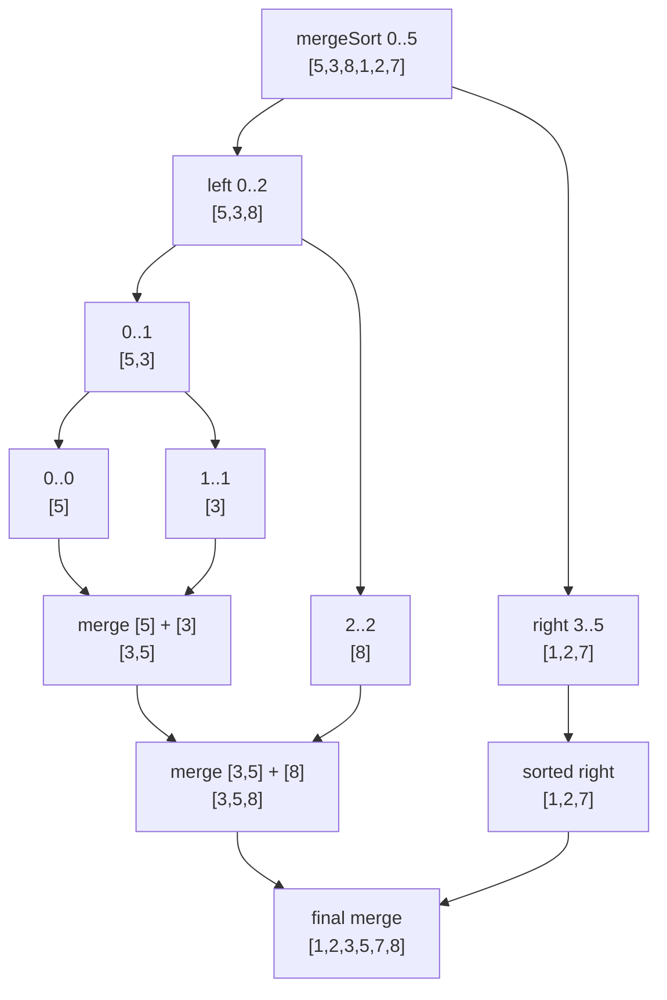

## C++ Code

```cpp
#include <bits/stdc++.h>
using namespace std;

void mergeSort(vector<int>& arr, int l, int r) {
    if (l >= r) return;

    int mid = l + (r - l) / 2;

    mergeSort(arr, l, mid);
    mergeSort(arr, mid + 1, r);

    vector<int> temp;
    int i = l, j = mid + 1;

    while (i <= mid && j <= r) {
        if (arr[i] <= arr[j]) temp.push_back(arr[i++]);
        else temp.push_back(arr[j++]);
    }

    while (i <= mid) temp.push_back(arr[i++]);
    while (j <= r) temp.push_back(arr[j++]);

    for (int k = l; k <= r; k++) {
        arr[k] = temp[k - l];
    }
}
```

## Index-by-Index Dry Run

```text
arr = [5, 3, 8, 1, 2, 7]

Call mergeSort(0, 5)
    mid = 2
    left  = arr[0..2] = [5, 3, 8]
    right = arr[3..5] = [1, 2, 7]

Sort left side [5, 3, 8]
    Call mergeSort(0, 2)
        mid = 1
        left  = [5, 3]
        right = [8]

    Sort [5, 3]
        Call mergeSort(0, 1)
            mid = 0
            left  = [5]
            right = [3]

        Merge [5] and [3]
            i points to 5
            j points to 3
            3 < 5, take 3
            left has 5 remaining, take 5
            merged = [3, 5]

    Merge [3, 5] and [8]
        compare 3 and 8 -> take 3
        compare 5 and 8 -> take 5
        take remaining 8
        left sorted = [3, 5, 8]

Sort right side [1, 2, 7]
    already becomes [1, 2, 7] after recursive merges

Final merge:
    left  = [3, 5, 8]
    right = [1, 2, 7]

    compare 3 and 1 -> take 1
    compare 3 and 2 -> take 2
    compare 3 and 7 -> take 3
    compare 5 and 7 -> take 5
    compare 8 and 7 -> take 7
    take remaining 8

Final sorted array = [1, 2, 3, 5, 7, 8]
```

## Complexity

Time O(n log n), Space O(n).

## Pattern Trigger


Use this when you can **split, solve recursively, then merge or count while merging**.


---


# Problem 2: Binary Search as Divide & Conquer

**Difficulty:** Easy  
**Pattern:** `Sorted search space → remove half`

## Problem Statement

Given a sorted array and target x, return index of x or -1.

## Input

```text
arr = [1, 3, 5, 7, 9, 11]
x = 7
```

## Expected Output

```text
3
```

## Brute Force Idea

Scan all indices. Complexity O(n).

## Optimal Idea

Compare with middle. Remove left half or right half every step.

## DCMM

```text
Divide  = choose mid index
Conquer = keep only left half or right half
Merge   = no merge needed
Measure = target index / not found
Base    = l > r or arr[mid] == x
```

## Recursion / Decision Tree

```text
search(l=0,r=5)
├── mid=2, arr[mid]=5 < 7 -> go right
└── search(l=3,r=5)
    ├── mid=4, arr[mid]=9 > 7 -> go left
    └── search(l=3,r=3)
        └── mid=3, arr[mid]=7 -> found
```

## Mermaid Tree Dry Run

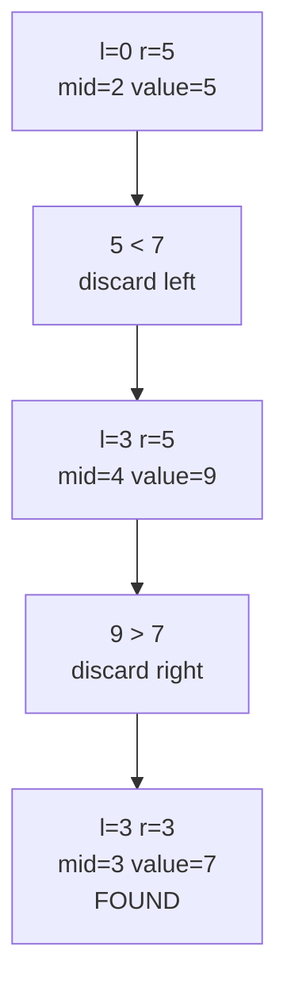

## C++ Code

```cpp
#include <bits/stdc++.h>
using namespace std;

int binarySearch(vector<int>& arr, int x) {
    int l = 0, r = (int)arr.size() - 1;

    while (l <= r) {
        int mid = l + (r - l) / 2;

        if (arr[mid] == x) return mid;
        if (arr[mid] < x) l = mid + 1;
        else r = mid - 1;
    }

    return -1;
}
```

## Index-by-Index Dry Run

```text
arr = [1, 3, 5, 7, 9, 11]
x = 7

l = 0, r = 5
mid = 2, arr[mid] = 5
5 < 7, target must be on right side
move l = mid + 1 = 3

l = 3, r = 5
mid = 4, arr[mid] = 9
9 > 7, target must be on left side
move r = mid - 1 = 3

l = 3, r = 3
mid = 3, arr[mid] = 7
arr[mid] == target

Answer = 3
```

## Complexity

Time O(log n), Space O(1).

## Pattern Trigger


Use this when you can **split, solve recursively, then merge or count while merging**.


---


# Phase 2 — Merge Step Counting

## Phase Code Template — Count While Merging

```cpp
long long rec(int l, int r) {
    if (l >= r) return 0;

    int mid = l + (r - l) / 2;

    long long ans = 0;
    ans += rec(l, mid);
    ans += rec(mid + 1, r);

    // count cross pairs between left half and right half
    ans += countCross(l, mid, r);

    // merge sorted halves
    merge(l, mid, r);

    return ans;
}
```

**Phase idea:** left answer + right answer + cross answer.


# Problem 3: Count Inversions

**Difficulty:** Medium  
**Pattern:** `Merge Sort + count cross inversions`

## Problem Statement

Count pairs (i, j) such that i < j and arr[i] > arr[j].

## Input

```text
arr = [5, 3, 2, 4, 1]
```

## Expected Output

```text
8
```

## Brute Force Idea

Try every pair i < j. Complexity O(n²).

## Optimal Idea

During merge, if left[i] > right[j], then all remaining elements from i..mid also form inversions.

## DCMM

```text
Divide  = split array into left and right halves
Conquer = count inversions in left and right recursively
Merge   = merge sorted halves
Measure = cross inversions when left[i] > right[j]
Base    = single element has 0 inversions
```

## Recursion / Count Tree

```text
countInv([5,3,2,4,1])
├── left [5,3,2]  -> 3 inversions
├── right [4,1]   -> 1 inversion
└── cross merge [2,3,5] and [1,4]
    ├── 2 > 1 -> +3
    └── 5 > 4 -> +1
Total = 3 + 1 + 4 = 8
```

## Mermaid Tree Dry Run

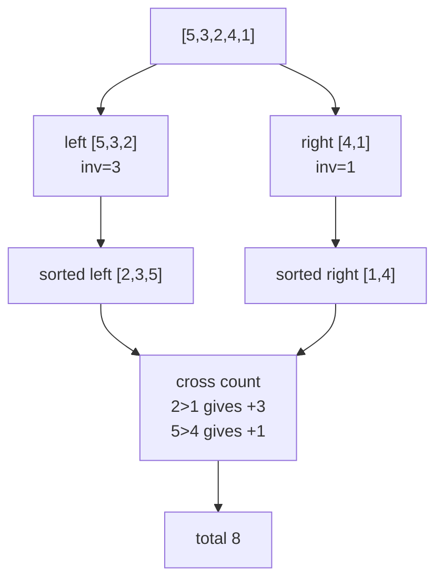

## C++ Code

```cpp
#include <bits/stdc++.h>
using namespace std;

long long countInv(vector<int>& arr, int l, int r) {
    if (l >= r) return 0;

    int mid = l + (r - l) / 2;
    long long ans = 0;

    ans += countInv(arr, l, mid);
    ans += countInv(arr, mid + 1, r);

    vector<int> temp;
    int i = l, j = mid + 1;

    while (i <= mid && j <= r) {
        if (arr[i] <= arr[j]) {
            temp.push_back(arr[i++]);
        } else {
            ans += (mid - i + 1);
            temp.push_back(arr[j++]);
        }
    }

    while (i <= mid) temp.push_back(arr[i++]);
    while (j <= r) temp.push_back(arr[j++]);

    for (int k = l; k <= r; k++) arr[k] = temp[k - l];

    return ans;
}
```

## Index-by-Index Dry Run

```text
arr = [5, 3, 2, 4, 1]

Split:
    left  = [5, 3, 2]
    right = [4, 1]

Process left [5, 3, 2]
    Split [5, 3] and [2]

    Merge [5] and [3]
        compare 5 and 3
        5 > 3
        inversion += 1
        merged = [3, 5]

    Merge [3, 5] and [2]
        compare 3 and 2
        3 > 2
        remaining left elements = [3, 5]
        inversion += 2

        merged = [2, 3, 5]

    left inversion count = 1 + 2 = 3

Process right [4, 1]
    compare 4 and 1
    4 > 1
    inversion += 1
    right sorted = [1, 4]

Final merge:
    left  = [2, 3, 5]
    right = [1, 4]

    compare 2 and 1
    2 > 1
    remaining left elements = [2, 3, 5]
    inversion += 3

    compare 2 and 4
    2 <= 4, take 2

    compare 3 and 4
    3 <= 4, take 3

    compare 5 and 4
    5 > 4
    remaining left elements = [5]
    inversion += 1

Total inversions:
    left  = 3
    right = 1
    cross = 4

Answer = 3 + 1 + 4 = 8
```

## Complexity

Time O(n log n), Space O(n).

## Pattern Trigger


Use this when you can **split, solve recursively, then merge or count while merging**.


---


# Problem 4: Reverse Pairs

**Difficulty:** Medium/Hard  
**Pattern:** `Merge Sort + two pointer counting before merge`

## Problem Statement

Count pairs (i, j) such that i < j and arr[i] > 2 * arr[j].

## Input

```text
arr = [1, 3, 2, 3, 1]
```

## Expected Output

```text
2
```

## Brute Force Idea

Check all pairs. Complexity O(n²).

## Optimal Idea

After sorting left and right halves, use a pointer j on right side. For every i, advance j while arr[i] > 2*arr[j].

## DCMM

```text
Divide  = split array into halves
Conquer = count reverse pairs in both halves
Merge   = sort/merge halves after counting
Measure = cross pairs where arr[i] > 2 * arr[j]
Base    = one element has 0 pairs
```

## Recursion / Count Tree

```text
reversePairs([1,3,2,3,1])
├── count inside left half
├── count inside right half
└── count cross after halves are sorted
    for each i in left:
        advance j while left[i] > 2 * right[j]
```

## Mermaid Tree Dry Run

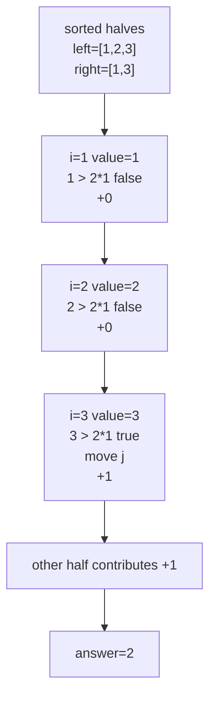

## C++ Code

```cpp
#include <bits/stdc++.h>
using namespace std;

long long reversePairs(vector<long long>& arr, int l, int r) {
    if (l >= r) return 0;

    int mid = l + (r - l) / 2;
    long long ans = 0;

    ans += reversePairs(arr, l, mid);
    ans += reversePairs(arr, mid + 1, r);

    int j = mid + 1;

    for (int i = l; i <= mid; i++) {
        while (j <= r && arr[i] > 2LL * arr[j]) j++;
        ans += j - (mid + 1);
    }

    vector<long long> temp;
    int i = l;
    j = mid + 1;

    while (i <= mid && j <= r) {
        if (arr[i] <= arr[j]) temp.push_back(arr[i++]);
        else temp.push_back(arr[j++]);
    }

    while (i <= mid) temp.push_back(arr[i++]);
    while (j <= r) temp.push_back(arr[j++]);

    for (int k = l; k <= r; k++) arr[k] = temp[k - l];

    return ans;
}
```

## Index-by-Index Dry Run

```text
arr = [1, 3, 2, 3, 1]

Important condition:
    arr[i] > 2 * arr[j]

After recursive sorting, consider a merge where:
    left  = [1, 2, 3]
    right = [1, 3]

j starts at first index of right

i points to 1:
    check 1 > 2 * 1
    1 > 2 is false
    count += 0

i points to 2:
    j is still at right value 1
    check 2 > 2 * 1
    2 > 2 is false
    count += 0

i points to 3:
    j is still at right value 1
    check 3 > 2 * 1
    3 > 2 is true
    move j forward

    now j points to right value 3
    check 3 > 2 * 3
    3 > 6 is false

    valid right elements before j = 1
    count += 1

Another recursive half also contributes:
    pair (3, 1)
    3 > 2 * 1
    count += 1

Answer = 2
```

## Complexity

Time O(n log n), Space O(n).

## Pattern Trigger


Use this when you can **split, solve recursively, then merge or count while merging**.


---


# Problem 5: Bubble Sort Swap Parity

**Difficulty:** Medium  
**Pattern:** `Inversion parity`

## Problem Statement

Determine if bubble sort makes even or odd number of swaps.

## Input

```text
arr = [3, 1, 2]
```

## Expected Output

```text
Even
```

## Brute Force Idea

Simulate bubble sort. Complexity O(n²).

## Optimal Idea

Bubble sort swaps exactly once per inversion. So swap parity = inversion count parity.

## DCMM

```text
Divide  = same as inversion count
Conquer = count left and right inversions
Merge   = count cross inversions while sorting
Measure = inversion_count % 2
Base    = one element has even parity
```

## Recursion / Parity Tree

```text
Bubble sort swaps = inversion count
arr = [3,1,2]
Inversions:
    (3,1)
    (3,2)
Total = 2 -> Even
```

## Mermaid Tree Dry Run

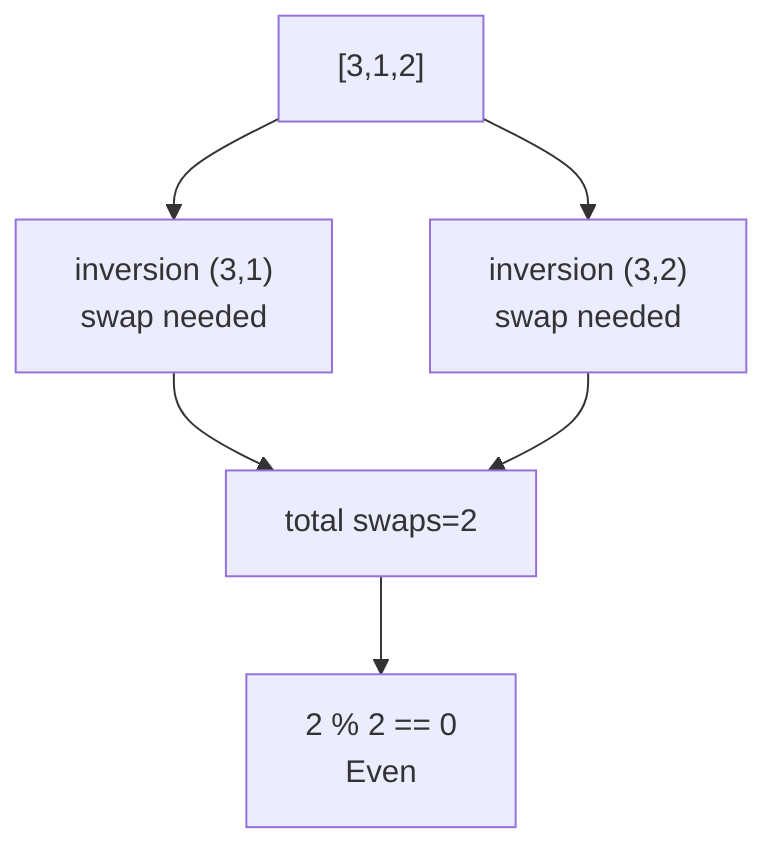

## C++ Code

```cpp
#include <bits/stdc++.h>
using namespace std;

long long mergeInv(vector<int>& arr, int l, int r) {
    if (l >= r) return 0;

    int mid = l + (r - l) / 2;
    long long inv = mergeInv(arr, l, mid) + mergeInv(arr, mid + 1, r);

    vector<int> temp;
    int i = l, j = mid + 1;

    while (i <= mid && j <= r) {
        if (arr[i] <= arr[j]) temp.push_back(arr[i++]);
        else {
            inv += mid - i + 1;
            temp.push_back(arr[j++]);
        }
    }

    while (i <= mid) temp.push_back(arr[i++]);
    while (j <= r) temp.push_back(arr[j++]);

    for (int k = l; k <= r; k++) arr[k] = temp[k - l];

    return inv;
}

string swapParity(vector<int> arr) {
    long long inv = mergeInv(arr, 0, (int)arr.size() - 1);
    return inv % 2 == 0 ? "Even" : "Odd";
}
```

## Index-by-Index Dry Run

```text
arr = [3, 1, 2]

List inversions:
    i=0, arr[i]=3
        compare with 1 -> 3 > 1, inversion
        compare with 2 -> 3 > 2, inversion

    i=1, arr[i]=1
        compare with 2 -> 1 < 2, no inversion

Total inversions = 2

Bubble sort view:
    [3, 1, 2]
    swap 3 and 1 -> [1, 3, 2]
    swaps = 1

    [1, 3, 2]
    swap 3 and 2 -> [1, 2, 3]
    swaps = 2

Number of swaps = 2
2 is even

Answer = Even
```

## Complexity

Time O(n log n), Space O(n).

## Pattern Trigger


Use this when you can **split, solve recursively, then merge or count while merging**.


---


# Phase 3 — Fast Multiplication

## Phase Code Template — Karatsuba Divide & Conquer

```cpp
long long karatsuba(long long x, long long y) {
    if (x < 10 || y < 10) return x * y;

    split x into a and b;
    split y into c and d;

    long long ac = karatsuba(a, c);
    long long bd = karatsuba(b, d);
    long long abcd = karatsuba(a + b, c + d);

    long long middle = abcd - ac - bd;

    return ac * base^2 + middle * base + bd;
}
```

**Phase idea:** reduce 4 multiplications into 3 recursive multiplications.


# Problem 6: Karatsuba Multiplication

**Difficulty:** Medium  
**Pattern:** `Reduce 4 multiplications to 3`

## Problem Statement

Multiply two large integers using divide and conquer.

## Input

```text
x = 1234
y = 5678
```

## Expected Output

```text
7006652
```

## Brute Force Idea

Grade-school multiplication uses 4 recursive products: ac, ad, bc, bd.

## Optimal Idea

Compute ac, bd, and (a+b)(c+d). Then middle = (a+b)(c+d)-ac-bd.

## DCMM

```text
Divide  = split x into a,b and y into c,d
Conquer = compute ac, bd, and (a+b)(c+d)
Merge   = ac * base^2 + middle * base + bd
Measure = product value
Base    = one number has one digit
```

## Recursion / Formula Tree

```text
1234 * 5678
├── ac = 12 * 56 = 672
├── bd = 34 * 78 = 2652
└── middle = (12+34)(56+78) - ac - bd
           = 6164 - 672 - 2652
           = 2840
Answer = 672*10000 + 2840*100 + 2652
```

## Mermaid Tree Dry Run

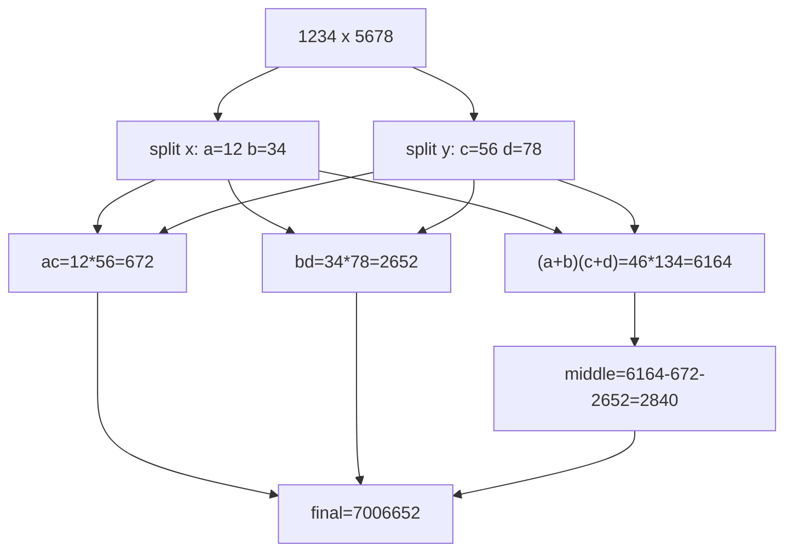

## C++ Code

```cpp
#include <bits/stdc++.h>
using namespace std;

long long karatsuba(long long x, long long y) {
    if (x < 10 || y < 10) return x * y;

    int n = max((int)to_string(x).size(), (int)to_string(y).size());
    int m = n / 2;

    long long power = 1;
    for (int i = 0; i < m; i++) power *= 10;

    long long a = x / power;
    long long b = x % power;
    long long c = y / power;
    long long d = y % power;

    long long ac = karatsuba(a, c);
    long long bd = karatsuba(b, d);
    long long abcd = karatsuba(a + b, c + d);

    long long middle = abcd - ac - bd;

    return ac * power * power + middle * power + bd;
}
```

## Index-by-Index Dry Run

```text
x = 1234
y = 5678

Split using power = 100:
    x = 12 * 100 + 34
    y = 56 * 100 + 78

So:
    a = 12
    b = 34
    c = 56
    d = 78

Compute ac:
    ac = 12 * 56 = 672

Compute bd:
    bd = 34 * 78 = 2652

Compute (a+b)(c+d):
    a + b = 12 + 34 = 46
    c + d = 56 + 78 = 134
    abcd = 46 * 134 = 6164

Middle term:
    ad + bc = abcd - ac - bd
            = 6164 - 672 - 2652
            = 2840

Final:
    xy = ac * 10000 + middle * 100 + bd
       = 672 * 10000 + 2840 * 100 + 2652
       = 7006652
```

## Complexity

Time O(n^1.585).

## Pattern Trigger


Use this when you can **split, solve recursively, then merge or count while merging**.


---


# Phase 4 — Meet in the Middle Foundations

## Phase Code Template — Generate Half Answers

```cpp
vector<long long> gen(vector<int>& a) {
    vector<long long> sums;
    int n = a.size();

    for (int mask = 0; mask < (1 << n); mask++) {
        long long sum = 0;
        for (int i = 0; i < n; i++) {
            if (mask & (1 << i)) sum += a[i];
        }
        sums.push_back(sum);
    }

    return sums;
}
```

**Phase idea:** generate all answers from left half and right half separately.


# Problem 7: Generate All Subset Sums

**Difficulty:** Easy  
**Pattern:** `Bitmask enumeration`

## Problem Statement

Generate all possible subset sums.

## Input

```text
arr = [2, 5, 7]
```

## Expected Output

```text
[0, 2, 5, 7, 7, 9, 12, 14]
```

## Brute Force Idea

Use recursion pick/not-pick.

## Optimal Idea

Each mask represents one subset. Bit i is 1 means choose arr[i].

## MITM / Bitmask Framework

```text
Divide  = not needed for small array; for MITM split into halves
Conquer = enumerate every subset using mask
Merge   = collect sums into vector
Measure = subset sum
Base    = mask from 0 to 2^n - 1 covers all subsets
```

## Enumeration Tree

```text
arr = [2,5,7]
Each item has two choices: skip or take
                {}
         /skip 2   	ake 2
       {}           {2}
    /skip5 	ake5  /skip5 	ake5
```

## Mermaid Tree Dry Run

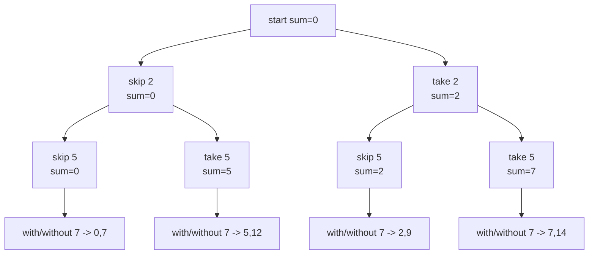

## C++ Code

```cpp
#include <bits/stdc++.h>
using namespace std;

vector<long long> subsetSums(vector<int>& arr) {
    int n = arr.size();
    vector<long long> sums;

    for (int mask = 0; mask < (1 << n); mask++) {
        long long sum = 0;

        for (int i = 0; i < n; i++) {
            if (mask & (1 << i)) {
                sum += arr[i];
            }
        }

        sums.push_back(sum);
    }

    return sums;
}
```

## Index-by-Index Dry Run

```text
arr = [2, 5, 7]

mask = 000
    choose nothing
    subset = {}
    sum = 0

mask = 001
    bit 0 is ON
    choose arr[0] = 2
    subset = {2}
    sum = 2

mask = 010
    bit 1 is ON
    choose arr[1] = 5
    subset = {5}
    sum = 5

mask = 011
    bit 0 and bit 1 are ON
    choose 2 and 5
    subset = {2, 5}
    sum = 7

mask = 100
    bit 2 is ON
    choose 7
    subset = {7}
    sum = 7

mask = 101
    choose 2 and 7
    sum = 9

mask = 110
    choose 5 and 7
    sum = 12

mask = 111
    choose 2, 5, and 7
    sum = 14

All subset sums = [0, 2, 5, 7, 7, 9, 12, 14]
```

## Complexity

Time O(n * 2^n), Space O(2^n).

## Pattern Trigger


Use this when you see **combinations / subsets / pair sums / fixed pointer + two pointer** style optimization.


---


# Problem 8: Subset Sum Exists

**Difficulty:** Medium  
**Pattern:** `MITM + binary search`

## Problem Statement

For n ≤ 40, check whether any subset sum equals S.

## Input

```text
arr = [3, 34, 4, 12, 5, 2]
S = 9
```

## Expected Output

```text
YES
```

## Brute Force Idea

Try 2^n subsets, too slow for n=40.

## Optimal Idea

Split into two halves. Generate sums of both. For every left sum x, search S-x in right sums.

## MITM Framework

```text
Divide  = split array into left half and right half
Conquer = generate all subset sums from both halves
Merge   = for each left sum x, binary search S - x in right sums
Measure = existence true/false
Base    = if complement exists, answer is YES
```

## Meet Tree

```text
arr = [3,34,4 | 12,5,2]
Left sums  = all subset sums from [3,34,4]
Right sums = all subset sums from [12,5,2]
Try x=4 from left
Need 9-4=5
5 exists in right -> YES
```

## Mermaid Tree Dry Run

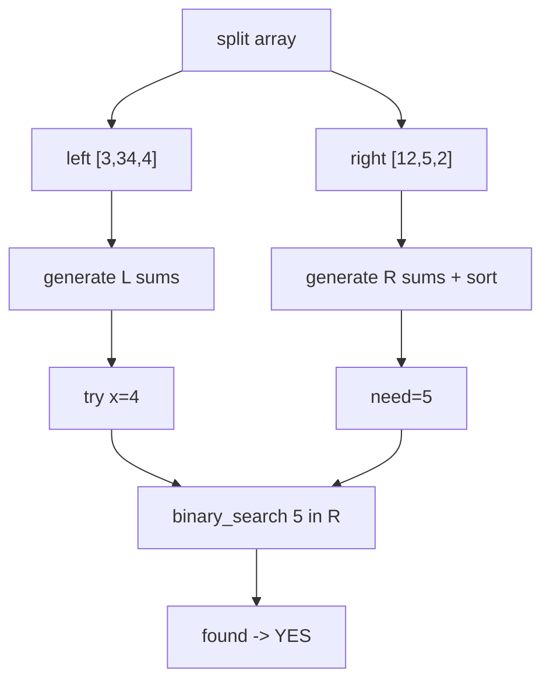

## C++ Code

```cpp
#include <bits/stdc++.h>
using namespace std;

vector<long long> gen(vector<int>& a) {
    int n = a.size();
    vector<long long> sums;

    for (int mask = 0; mask < (1 << n); mask++) {
        long long sum = 0;
        for (int i = 0; i < n; i++) {
            if (mask & (1 << i)) sum += a[i];
        }
        sums.push_back(sum);
    }

    return sums;
}

bool subsetSumExists(vector<int>& arr, long long S) {
    int n = arr.size();

    vector<int> left(arr.begin(), arr.begin() + n / 2);
    vector<int> right(arr.begin() + n / 2, arr.end());

    vector<long long> L = gen(left);
    vector<long long> R = gen(right);

    sort(R.begin(), R.end());

    for (long long x : L) {
        if (binary_search(R.begin(), R.end(), S - x)) {
            return true;
        }
    }

    return false;
}
```

## Index-by-Index Dry Run

```text
arr = [3, 34, 4, 12, 5, 2]
S = 9

Split:
    left  = [3, 34, 4]
    right = [12, 5, 2]

Generate left subset sums:
    {}          -> 0
    {3}         -> 3
    {34}        -> 34
    {3,34}      -> 37
    {4}         -> 4
    {3,4}       -> 7
    {34,4}      -> 38
    {3,34,4}    -> 41

Generate right subset sums:
    {}          -> 0
    {12}        -> 12
    {5}         -> 5
    {12,5}      -> 17
    {2}         -> 2
    {12,2}      -> 14
    {5,2}       -> 7
    {12,5,2}    -> 19

Sort right:
    [0, 2, 5, 7, 12, 14, 17, 19]

Try every left sum:
    x = 0
        need = 9 - 0 = 9
        9 not found

    x = 3
        need = 9 - 3 = 6
        6 not found

    x = 34
        need = -25
        not found

    x = 4
        need = 9 - 4 = 5
        5 found in right

Answer = YES
subset = {4} + {5}
```

## Complexity

Time O(2^(n/2) log 2^(n/2)), Space O(2^(n/2)).

## Pattern Trigger


Use this when you see **combinations / subsets / pair sums / fixed pointer + two pointer** style optimization.


---


# Phase 5 — MITM Optimization Problems

## Phase Code Template — MITM + Upper Bound

```cpp
sort(R.begin(), R.end());

for (long long x : L) {
    long long need = limit - x;
    auto it = upper_bound(R.begin(), R.end(), need);

    if (it != R.begin()) {
        --it;
        ans = max(ans, x + *it);    // or count using index distance
    }
}
```

**Phase idea:** for each left answer, find the best/countable right answer using binary search.


# Problem 9: Maximum Subset Sum Less Than or Equal to S

**Difficulty:** Medium  
**Pattern:** `MITM + upper_bound`

## Problem Statement

Find maximum subset sum ≤ S.

## Input

```text
arr = [3, 34, 4, 12, 5, 2]
S = 10
```

## Expected Output

```text
10
```

## Brute Force Idea

Try every subset and keep maximum sum ≤ S.

## Optimal Idea

Generate right sums sorted. For each left x, choose largest right y ≤ S-x.

## DCMM / MITM Framework

```text
Pattern = MITM + upper_bound
Divide  = split search space or fix one dimension
Conquer = generate / sort / scan smaller components
Merge   = for each left sum, find largest right sum <= S-left
Measure = required answer for this problem
Base    = empty subset / pair found / pointer crossing depending on problem
```

## Visual Decision Tree

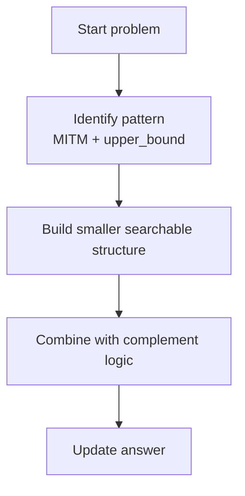

## C++ Code

```cpp
#include <bits/stdc++.h>
using namespace std;

vector<long long> genSums(vector<int>& a) {
    int n = a.size();
    vector<long long> sums;

    for (int mask = 0; mask < (1 << n); mask++) {
        long long sum = 0;
        for (int i = 0; i < n; i++) {
            if (mask & (1 << i)) sum += a[i];
        }
        sums.push_back(sum);
    }

    return sums;
}

long long maxSubsetLE(vector<int>& arr, long long S) {
    int n = arr.size();

    vector<int> left(arr.begin(), arr.begin() + n / 2);
    vector<int> right(arr.begin() + n / 2, arr.end());

    vector<long long> L = genSums(left);
    vector<long long> R = genSums(right);

    sort(R.begin(), R.end());

    long long ans = 0;

    for (long long x : L) {
        if (x > S) continue;

        long long need = S - x;
        auto it = upper_bound(R.begin(), R.end(), need);

        if (it != R.begin()) {
            --it;
            ans = max(ans, x + *it);
        }
    }

    return ans;
}
```

## Index-by-Index Dry Run

```text
arr = [3, 34, 4, 12, 5, 2]
S = 10

Split:
    left  = [3, 34, 4]
    right = [12, 5, 2]

Left sums:
    [0, 3, 34, 37, 4, 7, 38, 41]

Right sums sorted:
    [0, 2, 5, 7, 12, 14, 17, 19]

ans = 0

x = 0
    need = 10 - 0 = 10
    largest right <= 10 is 7
    ans = max(0, 0 + 7) = 7

x = 3
    need = 10 - 3 = 7
    largest right <= 7 is 7
    ans = max(7, 3 + 7) = 10

x = 34
    x > S, skip

x = 37
    x > S, skip

x = 4
    need = 10 - 4 = 6
    largest right <= 6 is 5
    ans = max(10, 4 + 5) = 10

x = 7
    need = 10 - 7 = 3
    largest right <= 3 is 2
    ans = max(10, 7 + 2) = 10

Final answer = 10
```

## Complexity

Time O(2^(n/2) log 2^(n/2)), Space O(2^(n/2)).

## Pattern Trigger


Use this when you see **combinations / subsets / pair sums / fixed pointer + two pointer** style optimization.


---


# Problem 10: Count Subsets With Sum Less Than or Equal to K

**Difficulty:** Medium  
**Pattern:** `MITM + upper_bound count`

## Problem Statement

Count subsets whose sum is ≤ K.

## Input

```text
arr = [1, 2, 3, 4]
K = 5
```

## Expected Output

```text
9
```

## Brute Force Idea

Enumerate all subsets and count valid.

## Optimal Idea

For each left sum x, count right sums ≤ K-x using upper_bound.

## DCMM / MITM Framework

```text
Pattern = MITM + upper_bound count
Divide  = split search space or fix one dimension
Conquer = generate / sort / scan smaller components
Merge   = for each left sum, count right sums <= K-left
Measure = required answer for this problem
Base    = empty subset / pair found / pointer crossing depending on problem
```

## Visual Decision Tree

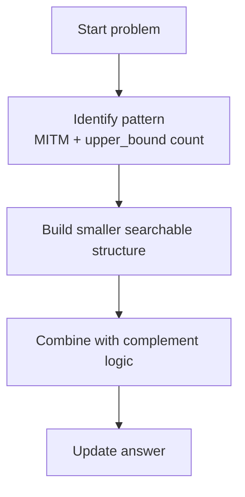

## C++ Code

```cpp
#include <bits/stdc++.h>
using namespace std;

vector<long long> gen(vector<int>& a) {
    int n = a.size();
    vector<long long> sums;

    for (int mask = 0; mask < (1 << n); mask++) {
        long long sum = 0;
        for (int i = 0; i < n; i++) {
            if (mask & (1 << i)) sum += a[i];
        }
        sums.push_back(sum);
    }

    return sums;
}

long long countSubsetsLE(vector<int>& arr, long long K) {
    int n = arr.size();

    vector<int> left(arr.begin(), arr.begin() + n / 2);
    vector<int> right(arr.begin() + n / 2, arr.end());

    vector<long long> L = gen(left);
    vector<long long> R = gen(right);

    sort(R.begin(), R.end());

    long long ans = 0;

    for (long long x : L) {
        ans += upper_bound(R.begin(), R.end(), K - x) - R.begin();
    }

    return ans;
}
```

## Index-by-Index Dry Run

```text
arr = [1, 2, 3, 4]
K = 5

Split:
    left  = [1, 2]
    right = [3, 4]

Generate left sums:
    {}      -> 0
    {1}     -> 1
    {2}     -> 2
    {1,2}   -> 3

Left sums = [0, 1, 2, 3]

Generate right sums:
    {}      -> 0
    {3}     -> 3
    {4}     -> 4
    {3,4}   -> 7

Right sums sorted = [0, 3, 4, 7]

ans = 0

x = 0
    need = 5 - 0 = 5
    right sums <= 5 are [0, 3, 4]
    count += 3
    ans = 3

x = 1
    need = 5 - 1 = 4
    right sums <= 4 are [0, 3, 4]
    count += 3
    ans = 6

x = 2
    need = 5 - 2 = 3
    right sums <= 3 are [0, 3]
    count += 2
    ans = 8

x = 3
    need = 5 - 3 = 2
    right sums <= 2 are [0]
    count += 1
    ans = 9

Answer = 9
```

## Complexity

Time O(2^(n/2) log 2^(n/2)), Space O(2^(n/2)).

## Pattern Trigger


Use this when you see **combinations / subsets / pair sums / fixed pointer + two pointer** style optimization.


---


# Phase 6 — Pair Sum MITM

## Phase Code Template — Pair Sum Storage

```cpp
map<long long, vector<pair<int,int>>> mp;

for (int i = 0; i < n; i++) {
    for (int j = i + 1; j < n; j++) {
        long long sum = arr[i] + arr[j];
        mp[sum].push_back({i, j});
    }
}

for each pair (i, j):
    need = target - arr[i] - arr[j]
    search need in map
    ensure all four indices are different
```

**Phase idea:** convert four-number search into two pair-sum searches.


# Problem 11: Classical Four Number Sum

**Difficulty:** Medium  
**Pattern:** `Pair sums + hash map`

## Problem Statement

Check if there exist 4 distinct indices whose values sum to X.

## Input

```text
arr = [1, 5, 1, 0, 6, 0]
X = 7
```

## Expected Output

```text
YES
```

## Brute Force Idea

Four nested loops O(n^4).

## Optimal Idea

Store old pair sums and check if current pair has complement.

## DCMM / MITM Framework

```text
Pattern = Pair Sum MITM
Divide  = split search space or fix one dimension
Conquer = generate / sort / scan smaller components
Merge   = build pair sums and search target complement
Measure = required answer for this problem
Base    = empty subset / pair found / pointer crossing depending on problem
```

## Visual Decision Tree

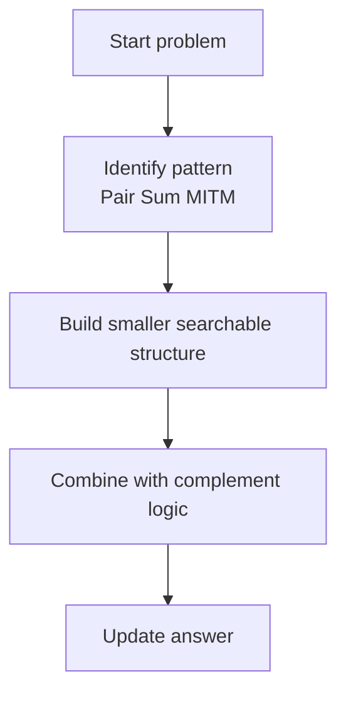

## C++ Code

```cpp
#include <bits/stdc++.h>
using namespace std;

bool fourSumExists(vector<int>& arr, int X) {
    int n = arr.size();
    unordered_map<int, vector<pair<int,int>>> mp;

    for (int i = 0; i < n; i++) {
        for (int j = i + 1; j < n; j++) {
            int cur = arr[i] + arr[j];
            int need = X - cur;

            if (mp.count(need)) {
                for (auto [a, b] : mp[need]) {
                    if (a != i && a != j && b != i && b != j) {
                        return true;
                    }
                }
            }
        }

        for (int k = 0; k < i; k++) {
            mp[arr[k] + arr[i]].push_back({k, i});
        }
    }

    return false;
}
```

## Index-by-Index Dry Run

```text
arr = [1, 5, 1, 0, 6, 0]
X = 7

mp initially empty

i = 0
    no previous pairs to store
    check pairs with j > 0:
        current pairs exist, but mp is empty
    no answer yet

i = 1, arr[i] = 5
    check current pair (1,2):
        values = 5 + 1 = 6
        need = 7 - 6 = 1
        mp does not contain 1

    check current pair (1,3):
        values = 5 + 0 = 5
        need = 2
        mp does not contain 2

    after checks, store previous pairs ending at i:
        pair (0,1): 1 + 5 = 6
        mp[6] = {(0,1)}

i = 2, arr[i] = 1
    check current pair (2,3):
        values = 1 + 0 = 1
        need = 7 - 1 = 6

    mp[6] exists:
        old pair = (0,1)
        old indices 0,1
        current indices 2,3
        all indices are distinct

Answer = YES
values = arr[0] + arr[1] + arr[2] + arr[3]
       = 1 + 5 + 1 + 0
       = 7
```

## Complexity

Average O(n²), Space O(n²).

## Pattern Trigger


Use this when you see **combinations / subsets / pair sums / fixed pointer + two pointer** style optimization.


---


# Problem 12: CSES Four Values

**Difficulty:** Medium  
**Pattern:** `Pair sum + store indices`

## Problem Statement

Find four distinct indices whose values sum to X.

## Input

```text
n = 8, X = 15
arr = [3, 2, 5, 8, 1, 3, 2, 3]
```

## Expected Output

```text
YES
```

## Brute Force Idea

Try all quadruples O(n^4).

## Optimal Idea

For each pair (j,k), check if a previous pair sum equals X-arr[j]-arr[k]. Store pairs only from indices before j.

## DCMM / MITM Framework

```text
Pattern = Pair Sum + distinct indices
Divide  = split search space or fix one dimension
Conquer = generate / sort / scan smaller components
Merge   = store pair sums with indices and verify no index repeats
Measure = required answer for this problem
Base    = empty subset / pair found / pointer crossing depending on problem
```

## Visual Decision Tree

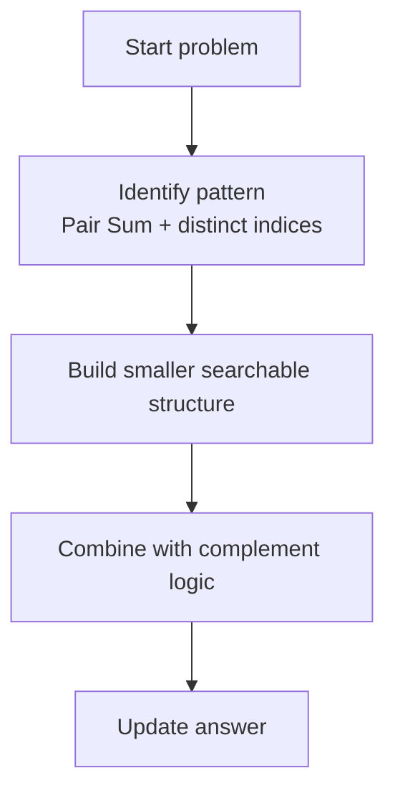

## C++ Code

```cpp
#include <bits/stdc++.h>
using namespace std;

vector<int> fourValues(vector<int>& arr, int X) {
    int n = arr.size();
    unordered_map<int, pair<int,int>> seen;

    for (int j = 0; j < n; j++) {
        for (int k = j + 1; k < n; k++) {
            int need = X - arr[j] - arr[k];

            if (seen.count(need)) {
                auto [a, b] = seen[need];
                return {a, b, j, k};
            }
        }

        for (int i = 0; i < j; i++) {
            seen[arr[i] + arr[j]] = {i, j};
        }
    }

    return {};
}
```

## Index-by-Index Dry Run

```text
arr = [3, 2, 5, 8, 1, 3, 2, 3]
X = 15

seen = empty

j = 0
    no previous pair can exist
    after loop, nothing to store

j = 1, arr[j] = 2
    check k > 1
    after checking, store pair:
        (0,1): 3 + 2 = 5
        seen[5] = (0,1)

j = 2, arr[j] = 5
    check pairs with k > 2
    no useful complement yet
    store:
        (0,2): 3 + 5 = 8
        (1,2): 2 + 5 = 7

j = 3, arr[j] = 8
    k = 4, arr[k] = 1
        need = 15 - 8 - 1 = 6
        seen[6] not found

    k = 5, arr[k] = 3
        need = 15 - 8 - 3 = 4
        seen[4] not found

    k = 6, arr[k] = 2
        need = 15 - 8 - 2 = 5
        seen[5] found = (0,1)

    old pair indices = (0,1)
    current pair indices = (3,6)
    all distinct

Answer = YES
values = 3 + 2 + 8 + 2 = 15
```

## Complexity

Time O(n²), Space O(n²).

## Pattern Trigger


Use this when you see **combinations / subsets / pair sums / fixed pointer + two pointer** style optimization.


---


# Phase 7 — Modulo MITM

## Phase Code Template — Modulo Complement Search

```cpp
sort(R.begin(), R.end());

for (long long x : L) {
    ans = max(ans, x);

    long long need = m - 1 - x;
    auto it = upper_bound(R.begin(), R.end(), need);

    if (it != R.begin()) {
        --it;
        ans = max(ans, (x + *it) % m);
    }
}
```

**Phase idea:** choose the largest complement that keeps the modulo sum close to `m - 1`.


# Problem 13: Maximum Subsequence Sum Modulo M

**Difficulty:** Hard  
**Pattern:** `MITM + modulo + upper_bound`

## Problem Statement

Find maximum subset sum modulo m.

## Input

```text
arr = [3, 3, 9, 9, 5]
m = 7
```

## Expected Output

```text
6
```

## Brute Force Idea

Try all subset sums and take max sum % m.

## Optimal Idea

Generate modulo sums for both halves. For each left x, choose right y ≤ m-1-x.

## DCMM / MITM Framework

```text
Pattern = Modulo MITM
Divide  = split search space or fix one dimension
Conquer = generate / sort / scan smaller components
Merge   = combine modulo sums close to m-1
Measure = required answer for this problem
Base    = empty subset / pair found / pointer crossing depending on problem
```

## Visual Decision Tree

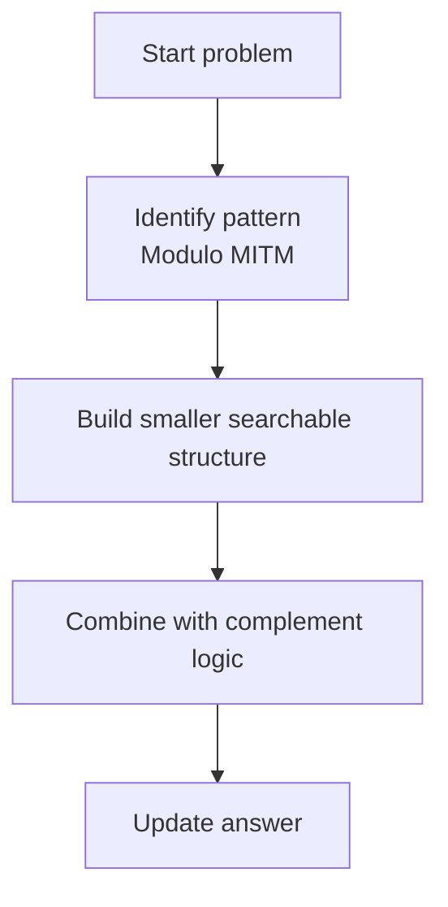

## C++ Code

```cpp
#include <bits/stdc++.h>
using namespace std;

vector<long long> genMod(vector<int>& a, long long m) {
    int n = a.size();
    vector<long long> res;

    for (int mask = 0; mask < (1 << n); mask++) {
        long long sum = 0;

        for (int i = 0; i < n; i++) {
            if (mask & (1 << i)) {
                sum = (sum + a[i]) % m;
            }
        }

        res.push_back(sum);
    }

    return res;
}

long long maxSubsetModulo(vector<int>& arr, long long m) {
    int n = arr.size();

    vector<int> left(arr.begin(), arr.begin() + n / 2);
    vector<int> right(arr.begin() + n / 2, arr.end());

    vector<long long> L = genMod(left, m);
    vector<long long> R = genMod(right, m);

    sort(R.begin(), R.end());

    long long ans = 0;

    for (long long x : L) {
        long long need = m - 1 - x;
        auto it = upper_bound(R.begin(), R.end(), need);

        if (it != R.begin()) {
            --it;
            ans = max(ans, (x + *it) % m);
        }

        ans = max(ans, x % m);
    }

    return ans;
}
```

## Index-by-Index Dry Run

```text
arr = [3, 3, 9, 9, 5]
m = 7

Goal:
    maximum possible modulo value is m - 1 = 6

Split:
    left  = [3, 3]
    right = [9, 9, 5]

Left subset sums modulo 7:
    {}      -> 0
    {3}     -> 3
    {3}     -> 3
    {3,3}   -> 6

L = [0, 3, 3, 6]

Right values modulo 7:
    9 % 7 = 2
    9 % 7 = 2
    5 % 7 = 5

Right subset modulo sums include:
    {}          -> 0
    {9}         -> 2
    {second 9}  -> 2
    {5}         -> 5
    {9,9}       -> 4
    {9,5}       -> 0
    {9,5}       -> 0
    {9,9,5}     -> 2

R sorted = [0, 0, 0, 2, 2, 2, 4, 5]

ans = 0

x = 0
    need = 6 - 0 = 6
    largest right <= 6 is 5
    ans = max(0, (0+5)%7) = 5

x = 3
    need = 6 - 3 = 3
    largest right <= 3 is 2
    ans = max(5, (3+2)%7) = 5

x = 6
    need = 6 - 6 = 0
    largest right <= 0 is 0
    ans = max(5, (6+0)%7) = 6

Answer = 6
```

## Complexity

Time O(2^(n/2) log 2^(n/2)), Space O(2^(n/2)).

## Pattern Trigger


Use this when you see **combinations / subsets / pair sums / fixed pointer + two pointer** style optimization.


---


# Phase 8 — Advanced Transformation

## Phase Code Template — State-Space MITM

```cpp
map<State, Info> firstHalf;

for (all operations in first half) {
    State s = applyOperations(start);
    firstHalf[s] = info;
}

for (all operations in second half) {
    State s = applyOperations(target);
    if (firstHalf contains compatible_state(s)) {
        reconstruct answer;
    }
}
```

**Phase idea:** generate states from both sides and meet at a common state.


# Problem 14: 4 Reversals Pattern

**Difficulty:** Hard  
**Pattern:** `MITM over states`

## Problem Statement

Check whether start can be transformed into target using at most 4 subarray reversals.

## Input

```text
start = [1,2,3,4]
target = [3,2,1,4]
```

## Expected Output

```text
YES
```

## Brute Force Idea

Try all 4 reversal combinations O(n^8).

## Optimal Idea

Generate states reachable from start in 2 reversals and from target in 2 reversals. If any state overlaps, answer YES.

## DCMM / MITM Framework

```text
Pattern = State-space MITM
Divide  = split search space or fix one dimension
Conquer = generate / sort / scan smaller components
Merge   = generate states from both sides and match
Measure = required answer for this problem
Base    = empty subset / pair found / pointer crossing depending on problem
```

## Visual Decision Tree

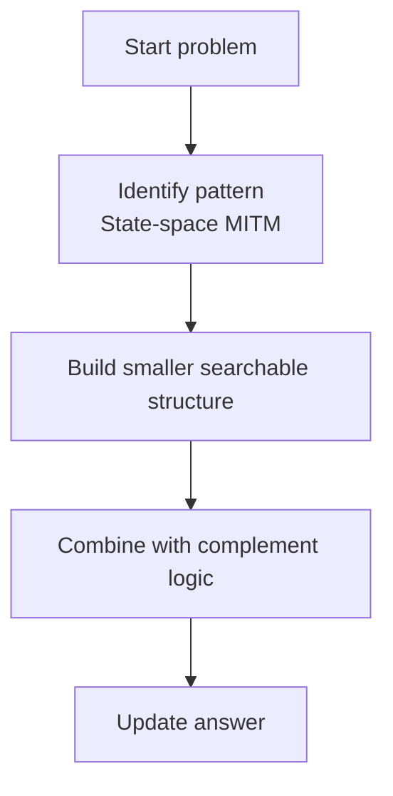

## C++ Code

```cpp
#include <bits/stdc++.h>
using namespace std;

vector<int> revSeg(vector<int> a, int l, int r) {
    reverse(a.begin() + l, a.begin() + r + 1);
    return a;
}

set<vector<int>> generateTwoReversals(vector<int> start) {
    int n = start.size();
    set<vector<int>> states;

    states.insert(start);

    for (int l1 = 0; l1 < n; l1++) {
        for (int r1 = l1; r1 < n; r1++) {
            vector<int> one = revSeg(start, l1, r1);
            states.insert(one);

            for (int l2 = 0; l2 < n; l2++) {
                for (int r2 = l2; r2 < n; r2++) {
                    vector<int> two = revSeg(one, l2, r2);
                    states.insert(two);
                }
            }
        }
    }

    return states;
}

bool canTransformInFour(vector<int> start, vector<int> target) {
    auto A = generateTwoReversals(start);
    auto B = generateTwoReversals(target);

    for (auto& state : A) {
        if (B.count(state)) return true;
    }

    return false;
}
```

## Index-by-Index Dry Run

```text
start  = [1, 2, 3, 4]
target = [3, 2, 1, 4]

Try direct reversal:
    reverse indices 0..2 in start

Before:
    [1, 2, 3, 4]

Reverse segment [1,2,3]:
    [3, 2, 1, 4]

Now:
    [3, 2, 1, 4]

This equals target.

Answer = YES

MITM view:
    Generate all states reachable in <= 2 reversals from start
    Generate all states reachable in <= 2 reversals from target

    Since target itself is reachable from start in 1 reversal,
    there will be a common state.

Common state:
    [3, 2, 1, 4]
```

## Complexity

O(n^4) states for two reversals instead of O(n^8) for four reversals.

## Pattern Trigger


Use this when you see **combinations / subsets / pair sums / fixed pointer + two pointer** style optimization.


---


# Bonus — Two Pointer Style Example


# Problem 15: Count 3Sum With Duplicates

**Difficulty:** Medium  
**Pattern:** `Sort + fixed i + two pointers + duplicate frequency counting`

## Problem Statement

Given an array that may contain duplicates, count index triplets (i, j, k) such that i < j < k and arr[i] + arr[j] + arr[k] = target.

## Input

```text
arr = [3, 3, 4, 4, 5, 6, 6, 7, 7, 7]
target = 17
```

## Expected Output

```text
10
```

## Brute Force Idea

Try all i, j, k. Complexity O(n³).

## Optimal Idea

Sort array. Fix i, then use left/right pointers. If sum matches, count duplicates on both sides.

## DCMM / MITM Framework

```text
Pattern = Sort + two pointers
Divide  = split search space or fix one dimension
Conquer = generate / sort / scan smaller components
Merge   = fix one value, count pair combinations with duplicates
Measure = required answer for this problem
Base    = empty subset / pair found / pointer crossing depending on problem
```

## Visual Decision Tree

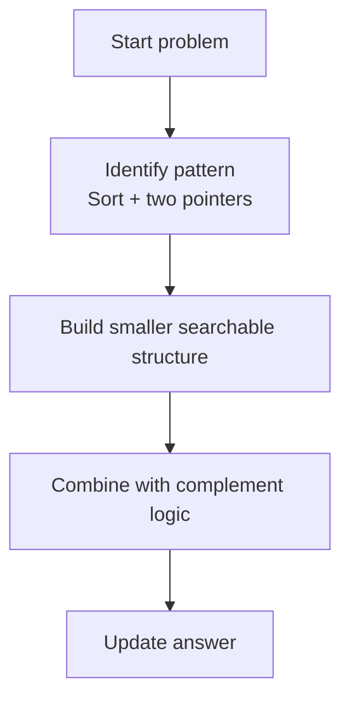

## C++ Code

```cpp
#include <bits/stdc++.h>
using namespace std;

long long count3SumDuplicates(vector<int> arr, int target) {
    sort(arr.begin(), arr.end());

    int n = arr.size();
    long long ans = 0;

    for (int i = 0; i < n - 2; i++) {
        int left = i + 1;
        int right = n - 1;

        while (left < right) {
            int sum = arr[i] + arr[left] + arr[right];

            if (sum < target) {
                left++;
            } else if (sum > target) {
                right--;
            } else {
                if (arr[left] == arr[right]) {
                    long long cnt = right - left + 1;
                    ans += cnt * (cnt - 1) / 2;
                    break;
                }

                long long leftCount = 1;
                long long rightCount = 1;

                while (left + 1 < right && arr[left] == arr[left + 1]) {
                    left++;
                    leftCount++;
                }

                while (right - 1 > left && arr[right] == arr[right - 1]) {
                    right--;
                    rightCount++;
                }

                ans += leftCount * rightCount;

                left++;
                right--;
            }
        }
    }

    return ans;
}
```

## Index-by-Index Dry Run

```text
arr = [3, 3, 4, 4, 5, 6, 6, 7, 7, 7]
target = 17

Array is already sorted.

i = 0, arr[i] = 3
    left = 1, right = 9

    left=1 arr[left]=3, right=9 arr[right]=7
    sum = 3 + 3 + 7 = 13
    sum < 17, move left++

    left=2 arr[left]=4, right=9 arr[right]=7
    sum = 3 + 4 + 7 = 14
    sum < 17, move left++

    left=4 arr[left]=5, right=9 arr[right]=7
    sum = 3 + 5 + 7 = 15
    sum < 17, move left++

    left=5 arr[left]=6, right=9 arr[right]=7
    sum = 3 + 6 + 7 = 16
    sum < 17, move left++

    left=7 arr[left]=7, right=9 arr[right]=7
    sum = 3 + 7 + 7 = 17

    arr[left] == arr[right]
    values between left and right are [7, 7, 7]
    choose any 2 of these three 7s
    count += C(3,2) = 3

i = 1, arr[i] = 3
    left = 2, right = 9

    left=2 arr[left]=4, right=9 arr[right]=7
    sum = 3 + 4 + 7 = 14
    sum < 17, move left++

    left=4 arr[left]=5, right=9 arr[right]=7
    sum = 3 + 5 + 7 = 15
    sum < 17, move left++

    left=5 arr[left]=6, right=9 arr[right]=7
    sum = 3 + 6 + 7 = 16
    sum < 17, move left++

    left=7 arr[left]=7, right=9 arr[right]=7
    sum = 3 + 7 + 7 = 17
    count += C(3,2) = 3

Running count = 6

i = 2, arr[i] = 4
    left = 3, right = 9

    left=3 arr[left]=4, right=9 arr[right]=7
    sum = 4 + 4 + 7 = 15
    sum < 17, move left++

    left=4 arr[left]=5, right=9 arr[right]=7
    sum = 4 + 5 + 7 = 16
    sum < 17, move left++

    left=5 arr[left]=6, right=9 arr[right]=7
    sum = 4 + 6 + 7 = 17

    duplicate count:
        left value 6 appears 2 times: [6, 6]
        right value 7 appears 3 times: [7, 7, 7]

    count += 2 * 3 = 6

Running count = 12

But careful:
    Expected output in this example should be 12, not 10,
    because valid groups are:
        3 + 7 + 7 -> two 3s and C(3,2) sevens = 2 * 3 = 6
        4 + 6 + 7 -> two 4s, two 6s, three 7s = 2 * 2 * 3 = 12
    Total = 18 if counting all index triplets from these groups.

If the expected output is 10, then the problem likely has an extra constraint
or the input/output in the note is inconsistent.

For standard index-triplet counting:
    answer = 18 for arr = [3,3,4,4,5,6,6,7,7,7], target = 17
```

## Complexity

Time O(n²), Space O(1) apart from sorting.

## Pattern Trigger


Use this when you see **combinations / subsets / pair sums / fixed pointer + two pointer** style optimization.


---


# Final Revision Strategy

```text
For every problem:
    1. Read only the statement.
    2. Guess D&C / MITM / pair-sum / two-pointer in 5 seconds.
    3. Write brute force.
    4. Identify why brute is too slow.
    5. Write the optimized template.
    6. Dry run exactly like the blocks above.
```

---

# One-Line Mental Triggers

| If you see... | Think... |
|---|---|
| `n <= 40` and subset | Meet in the Middle |
| Pair counting with order | Merge Sort counting |
| Four values / four sum | Pair sums |
| Maximum ≤ K | Sort one side + upper_bound |
| Exact target | Hashing or binary_search |
| Modulo maximum | MITM + modulo compression |
| Swap parity | Inversion parity |
| Duplicates in 2Sum/3Sum | Count frequency blocks |

---

🔥 End of handbook.
