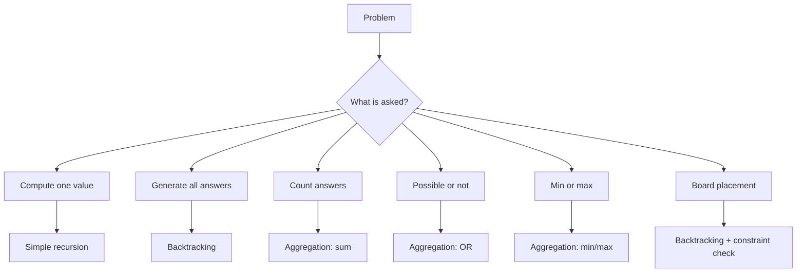
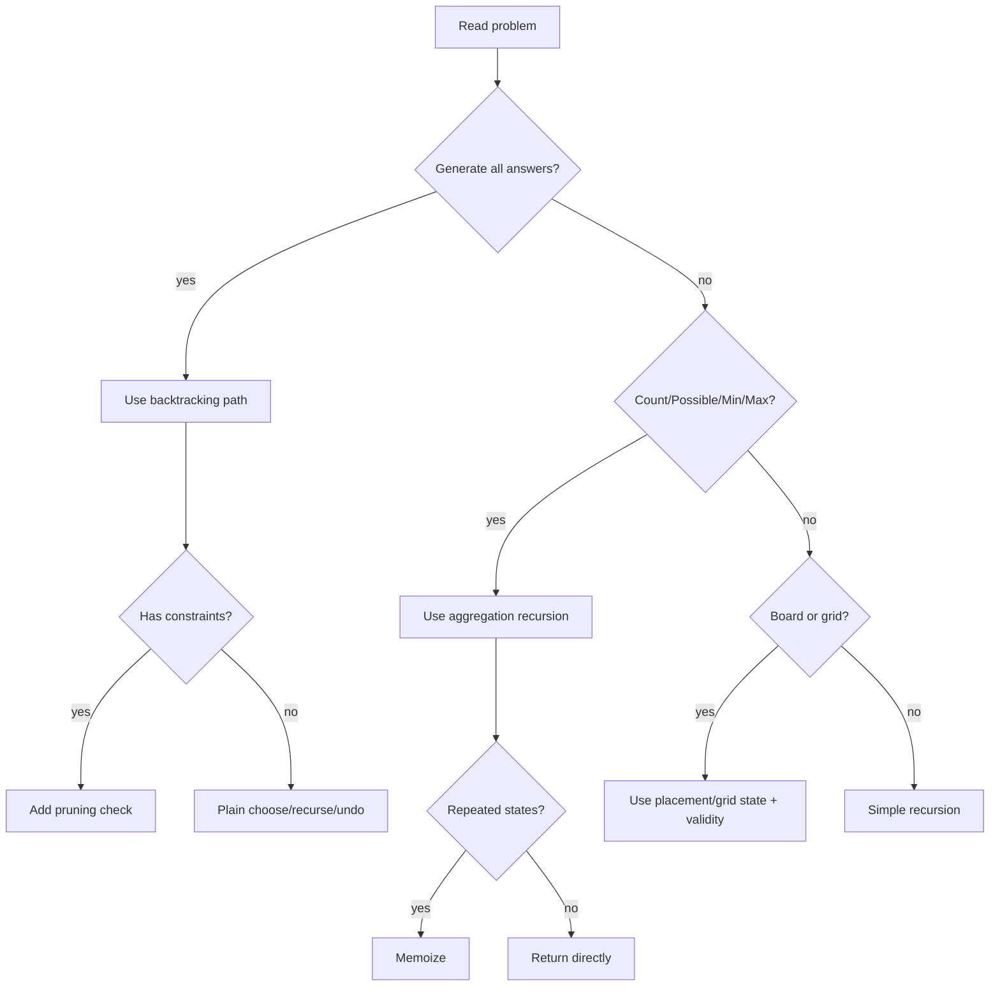

# Recursion + Backtracking LCCM Master Guide

> Built from your uploaded `006_RECURSION_BACKTRACKING.md` and PDF notes: AlgoMonster backtracking patterns, Recursion-1, Recursion-2, and K-Knights notes.

This is a **phase-wise CP + FAANG style master guide** with:

- Clickable index
- LCCM template for every problem
- Input / output / example
- Brute-force thinking when useful
- Optimal recursion / backtracking idea
- C++ code
- Recursion tree
- Index-by-index dry run
- Pattern recognition cheat sheet

---

## Clickable Index

### Core Framework

- [0. One-Minute Master Map](#0-one-minute-master-map)
- [1. LCCM Framework](#1-lccm-framework)
- [2. Universal Templates](#2-universal-templates)
- [3. How To Read A Recursion Tree](#3-how-to-read-a-recursion-tree)
- [4. Phase Map](#4-phase-map)

### Phase 1 - Recursion Foundation

- [P1. Factorial](#p1-factorial)
- [P2. Fibonacci Recursion Tree](#p2-fibonacci-recursion-tree)
- [P3. Count Valid Parentheses With Max Depth K](#p3-count-valid-parentheses-with-max-depth-k)
- [P4. Tower of Hanoi](#p4-tower-of-hanoi)

### Phase 2 - Generate All / Enumeration

- [P5. Generate Strings of Length N](#p5-generate-strings-of-length-n)
- [P6. Phone Keypad Letter Combinations](#p6-phone-keypad-letter-combinations)
- [P7. Subsets / Power Set](#p7-subsets--power-set)
- [P8. Generate Permutations](#p8-generate-permutations)
- [P9. Unique Permutations With Duplicates](#p9-unique-permutations-with-duplicates)

### Phase 3 - Backtracking With Pruning

- [P10. Generate Valid Parentheses](#p10-generate-valid-parentheses)
- [P11. Palindrome Partitioning](#p11-palindrome-partitioning)
- [P12. Combination Sum - Reuse Allowed](#p12-combination-sum---reuse-allowed)
- [P13. Combination Sum II - Reuse Not Allowed + Duplicates](#p13-combination-sum-ii---reuse-not-allowed--duplicates)

### Phase 4 - Aggregation Recursion

- [P14. Word Break - Possible Or Not](#p14-word-break---possible-or-not)
- [P15. Decode Ways - Count Ways](#p15-decode-ways---count-ways)
- [P16. Min Cost Climbing Stairs - Min Aggregation](#p16-min-cost-climbing-stairs---min-aggregation)

### Phase 5 - Board Placement / Constraint Search

- [P17. N Queens / K Queens](#p17-n-queens--k-queens)
- [P18. K Knights](#p18-k-knights)
- [P19. Rat in a Maze](#p19-rat-in-a-maze)
- [P20. Sudoku Solver](#p20-sudoku-solver)

### Final Revision

- [Backtracking Pattern Recognition Table](#backtracking-pattern-recognition-table)
- [LCCM Decision Tree](#lccm-decision-tree)
- [Common Mistakes](#common-mistakes)
- [Interview One-Liners](#interview-one-liners)

---


# 0. One-Minute Master Map

```text
Recursion      = solve smaller version of same problem.
Backtracking   = try choice -> recurse -> undo choice.
Pruning        = skip branch early when it can never become valid.
Aggregation    = recursive calls return values and parent combines them.
Memoization    = cache repeated states.
```



# 1. LCCM Framework

LCCM is the fastest way to convert a recursion/backtracking problem into code.

| Letter | Meaning | Question |
|---|---|---|
| L | Level | What does one recursive call represent? |
| C | Choice | What choices are available at this level? |
| C | Check / Constraint | Is this choice valid? Can I prune? |
| M | Move | How do I apply, recurse, and undo? |

```text
L = Level
C = Choice
C = Check / Constraint
M = Move
```

## LCCM Writing Template

Before coding, write this:

```text
Level      =
Choices    =
Check      =
Move       =
Base case  =
Answer     =
```

# 2. Universal Templates

## 2.1 Simple Recursion Template

```cpp
ReturnType rec(State state) {
    if (base_case) {
        return base_answer;
    }

    ReturnType child = rec(smaller_state);
    return combine(current, child);
}
```

## 2.2 Backtracking Template - Generate All Answers

```cpp
void dfs(int level) {
    if (base_case) {
        ans.push_back(path);
        return;
    }

    for (auto choice : choices) {
        if (!valid(choice)) continue;

        // move
        apply(choice);
        dfs(next_level);
        undo(choice);
    }
}
```

## 2.3 Aggregation Template

Use this when the problem asks for:

- possible or not
- number of ways
- min / max value

```cpp
ReturnType dfs(State state) {
    if (base_case) return base_value;

    ReturnType ans = initial_value;

    for (auto choice : choices) {
        if (!valid(choice)) continue;

        ReturnType child = dfs(next_state);
        ans = aggregate(ans, child);
    }

    return ans;
}
```

| Problem asks | Return type | Initial value | Aggregate |
|---|---:|---:|---|
| possible? | bool | false | OR |
| count ways | int / long long | 0 | + |
| maximum | int | -INF | max |
| minimum | int | INF | min |

# 3. How To Read A Recursion Tree

A recursion tree shows **choices**.
A recursion stack shows **execution order**.

For backtracking, each node should show:

```text
(level, path, extra state)
```

Example:

```text
level 0: ""
├── choose a -> level 1: "a"
│   ├── choose a -> level 2: "aa"
│   └── choose b -> level 2: "ab"
└── choose b -> level 1: "b"
    ├── choose a -> level 2: "ba"
    └── choose b -> level 2: "bb"
```

# 4. Phase Map

| Phase | Pattern | Main idea |
|---|---|---|
| 1 | Simple recursion | Base case + smaller problem |
| 2 | Generate all | Save answer only at base case |
| 3 | Backtracking + pruning | Skip invalid branches early |
| 4 | Aggregation | Return value from recursion and combine |
| 5 | Board placement | Maintain board / used state and validate moves |

---


# P1. Factorial

## Problem Statement

Given `n`, calculate `n!`.

## Input

```text
n = 5
```

## Output

```text
120
```

## LCCM

```text
Level      = current n
Choices    = no multiple choices; only reduce n by 1
Check      = n == 0 is base case
Move       = return n * fact(n - 1)
Base case  = fact(0) = 1
Answer     = factorial value
```

## Recursion Formula

```text
fact(n) = n * fact(n - 1)
fact(0) = 1
```

## C++ Code

```cpp
#include <bits/stdc++.h>
using namespace std;

long long fact(int n) {
    if (n == 0) return 1;
    return 1LL * n * fact(n - 1);
}

int main() {
    int n;
    cin >> n;
    cout << fact(n) << '\n';
}
```

## Recursion Tree For `n = 5`

```text
fact(5)
└── 5 * fact(4)
    └── 4 * fact(3)
        └── 3 * fact(2)
            └── 2 * fact(1)
                └── 1 * fact(0)
                    └── 1
```

## Index-by-Index Dry Run

| Call | n | Action | Return |
|---:|---:|---|---:|
| 1 | 5 | call fact(4) | pending |
| 2 | 4 | call fact(3) | pending |
| 3 | 3 | call fact(2) | pending |
| 4 | 2 | call fact(1) | pending |
| 5 | 1 | call fact(0) | pending |
| 6 | 0 | base case | 1 |
| unwind | 1 | 1 * 1 | 1 |
| unwind | 2 | 2 * 1 | 2 |
| unwind | 3 | 3 * 2 | 6 |
| unwind | 4 | 4 * 6 | 24 |
| unwind | 5 | 5 * 24 | 120 |

## Mental Model

> Simple recursion is not about choices. It is about reducing the problem until base case.

---

# P2. Fibonacci Recursion Tree

## Problem Statement

Given `n`, calculate the nth Fibonacci number.

```text
fib(0) = 0
fib(1) = 1
fib(n) = fib(n - 1) + fib(n - 2)
```

## Input

```text
n = 5
```

## Output

```text
5
```

## LCCM

```text
Level      = current n
Choices    = two recursive branches: n-1 and n-2
Check      = n <= 1 is base case
Move       = return fib(n-1) + fib(n-2)
Base case  = fib(0)=0, fib(1)=1
Answer     = nth Fibonacci number
```

## Brute Recursion Code

```cpp
int fib(int n) {
    if (n <= 1) return n;
    return fib(n - 1) + fib(n - 2);
}
```

## Recursion Tree For `fib(5)`

```text
fib(5)
├── fib(4)
│   ├── fib(3)
│   │   ├── fib(2)
│   │   │   ├── fib(1) = 1
│   │   │   └── fib(0) = 0
│   │   └── fib(1) = 1
│   └── fib(2)
│       ├── fib(1) = 1
│       └── fib(0) = 0
└── fib(3)
    ├── fib(2)
    │   ├── fib(1) = 1
    │   └── fib(0) = 0
    └── fib(1) = 1
```

## Observation

`fib(3)`, `fib(2)` repeat many times.
This is why memoization is needed.

## Memoized Code

```cpp
#include <bits/stdc++.h>
using namespace std;

int fib(int n, vector<int>& dp) {
    if (n <= 1) return n;
    if (dp[n] != -1) return dp[n];

    return dp[n] = fib(n - 1, dp) + fib(n - 2, dp);
}

int main() {
    int n;
    cin >> n;
    vector<int> dp(n + 1, -1);
    cout << fib(n, dp) << '\n';
}
```

## Dry Run Table For `fib(5)` With Memo

| State | First time? | Computed from | Value |
|---:|---|---|---:|
| fib(0) | yes | base | 0 |
| fib(1) | yes | base | 1 |
| fib(2) | yes | fib(1)+fib(0) | 1 |
| fib(3) | yes | fib(2)+fib(1) | 2 |
| fib(4) | yes | fib(3)+fib(2) | 3 |
| fib(5) | yes | fib(4)+fib(3) | 5 |

## Mental Model

> If the recursion tree has repeated states, add memoization.

---

# P3. Count Valid Parentheses With Max Depth K

## Problem Statement

Count all valid parentheses strings of length `n` where maximum depth is at most `k`.

This comes from the notes where recursion state uses:

```text
i = current position
j = current depth
k = max allowed depth
```

## Input

```text
n = 4
k = 2
```

## Output

```text
2
```

Valid strings:

```text
(())
()()
```

## LCCM

```text
Level      = index i from 0 to n
Choices    = add '(' or ')'
Check      = depth must be between 0 and k
Move       = '(' increases depth, ')' decreases depth
Base case  = i == n; valid only if depth == 0
Answer     = count of valid strings
```

## C++ Code

```cpp
#include <bits/stdc++.h>
using namespace std;

int n, k;

int rec(int i, int depth, string path) {
    // pruning invalid states
    if (depth < 0 || depth > k) return 0;

    // base case
    if (i == n) {
        if (depth == 0) {
            cout << path << '\n';
            return 1;
        }
        return 0;
    }

    // choice 1: add '('
    int ans = rec(i + 1, depth + 1, path + '(');

    // choice 2: add ')'
    ans += rec(i + 1, depth - 1, path + ')');

    return ans;
}

int main() {
    cin >> n >> k;
    cout << "count = " << rec(0, 0, "") << '\n';
}
```

## Recursion Tree For `n = 4, k = 2`

```text
(0,0," ")
├── '(' -> (1,1,"(")
│   ├── '(' -> (2,2,"((")
│   │   ├── '(' -> (3,3,"(((") INVALID depth > k
│   │   └── ')' -> (3,1,"(()")
│   │       ├── '(' -> (4,2,"(()(") invalid end depth != 0
│   │       └── ')' -> (4,0,"(())") VALID
│   └── ')' -> (2,0,"()")
│       ├── '(' -> (3,1,"()(")
│       │   ├── '(' -> (4,2,"()(('") invalid end depth != 0
│       │   └── ')' -> (4,0,"()()") VALID
│       └── ')' -> (3,-1,"())") INVALID
└── ')' -> (1,-1,")") INVALID
```

## Index-by-Index Dry Run

| Step | i | depth | path | Decision |
|---:|---:|---:|---|---|
| 1 | 0 | 0 | empty | start |
| 2 | 1 | 1 | `(` | valid |
| 3 | 2 | 2 | `((` | valid |
| 4 | 3 | 3 | `(((` | prune: depth > k |
| 5 | 3 | 1 | `(()` | valid |
| 6 | 4 | 0 | `(())` | save |
| 7 | 2 | 0 | `()` | valid |
| 8 | 3 | 1 | `()(` | valid |
| 9 | 4 | 0 | `()()` | save |

## Mental Model

> Depth is the number of currently open brackets. It can never become negative and cannot exceed k.

---

# P4. Tower of Hanoi

## Problem Statement

Move `n` disks from source rod `A` to destination rod `C` using helper rod `B`.

Rules:

1. Move one disk at a time.
2. Only the top disk can be moved.
3. A bigger disk cannot be placed over a smaller disk.

## Input

```text
n = 3
```

## Output

```text
A -> C
A -> B
C -> B
A -> C
B -> A
B -> C
A -> C
```

## LCCM

```text
Level      = number of disks n
Choices    = no loop choices; fixed 3-step recursive process
Check      = n == 0 stop
Move       = move n-1 to helper, move biggest, move n-1 to destination
Base case  = n == 0
Answer     = sequence of moves
```

## Idea

To move `n` disks from `A` to `C`:

1. Move `n-1` disks from `A` to `B` using `C`.
2. Move disk `n` from `A` to `C`.
3. Move `n-1` disks from `B` to `C` using `A`.

## C++ Code

```cpp
#include <bits/stdc++.h>
using namespace std;

void hanoi(int n, char source, char helper, char dest) {
    if (n == 0) return;

    hanoi(n - 1, source, dest, helper);
    cout << source << " -> " << dest << '\n';
    hanoi(n - 1, helper, source, dest);
}

int main() {
    int n;
    cin >> n;
    hanoi(n, 'A', 'B', 'C');
}
```

## Recursion Tree For `n = 3`

```text
hanoi(3, A, B, C)
├── hanoi(2, A, C, B)
│   ├── hanoi(1, A, B, C)
│   │   ├── hanoi(0)
│   │   ├── move A -> C
│   │   └── hanoi(0)
│   ├── move A -> B
│   └── hanoi(1, C, A, B)
│       ├── hanoi(0)
│       ├── move C -> B
│       └── hanoi(0)
├── move A -> C
└── hanoi(2, B, A, C)
    ├── hanoi(1, B, C, A)
    │   ├── move B -> A
    ├── move B -> C
    └── hanoi(1, A, B, C)
        ├── move A -> C
```

## Move Dry Run For `n = 3`

| Move | Disk | From | To |
|---:|---:|---|---|
| 1 | 1 | A | C |
| 2 | 2 | A | B |
| 3 | 1 | C | B |
| 4 | 3 | A | C |
| 5 | 1 | B | A |
| 6 | 2 | B | C |
| 7 | 1 | A | C |

## Complexity

```text
Moves = 2^n - 1
Time  = O(2^n)
```

## Mental Model

> First clear the biggest disk, move it, then rebuild the smaller tower on top of it.

---

# P5. Generate Strings of Length N

## Problem Statement

Given characters `{a, b}` and length `n`, generate all strings of length `n`.

## Input

```text
n = 2
chars = a b
```

## Output

```text
aa
ab
ba
bb
```

## LCCM

```text
Level      = index / position in string
Choices    = 'a' or 'b'
Check      = none
Move       = push char -> recurse -> pop char
Base case  = path.size() == n
Answer     = all generated strings
```

## C++ Code

```cpp
#include <bits/stdc++.h>
using namespace std;

void dfs(int n, string& path, vector<string>& ans) {
    if ((int)path.size() == n) {
        ans.push_back(path);
        return;
    }

    for (char ch : {'a', 'b'}) {
        path.push_back(ch);     // move: choose
        dfs(n, path, ans);      // recurse
        path.pop_back();        // undo
    }
}

int main() {
    int n;
    cin >> n;
    vector<string> ans;
    string path;

    dfs(n, path, ans);

    for (string& s : ans) cout << s << '\n';
}
```

## Recursion Tree For `n = 2`

```text
level 0: ""
├── choose a -> level 1: "a"
│   ├── choose a -> level 2: "aa" save
│   └── choose b -> level 2: "ab" save
└── choose b -> level 1: "b"
    ├── choose a -> level 2: "ba" save
    └── choose b -> level 2: "bb" save
```

## Index-by-Index Dry Run

| Step | level/path size | path before | choice | path after | action |
|---:|---:|---|---|---|---|
| 1 | 0 | empty | a | a | recurse |
| 2 | 1 | a | a | aa | save |
| 3 | 1 | a | b | ab | save |
| 4 | 0 | empty | b | b | recurse |
| 5 | 1 | b | a | ba | save |
| 6 | 1 | b | b | bb | save |

## Mental Model

> One level fills one position. Choices are the characters allowed at that position.

---

# P6. Phone Keypad Letter Combinations

## Problem Statement

Given a string of digits, return all possible letter combinations based on phone keypad mapping.

## Input

```text
digits = "23"
```

## Output

```text
ad ae af bd be bf cd ce cf
```

## LCCM

```text
Level      = index in digits
Choices    = letters mapped from digits[level]
Check      = digit must have mapping
Move       = add letter -> recurse(level+1) -> remove letter
Base case  = level == digits.size()
Answer     = all combinations
```

## C++ Code

```cpp
#include <bits/stdc++.h>
using namespace std;

vector<string> mp = {
    "", "", "abc", "def", "ghi", "jkl",
    "mno", "pqrs", "tuv", "wxyz"
};

bool isSafeDigit(char digit) {
    return digit >= '2' && digit <= '9';
}

void dfs(int level, string& digits, string& path, vector<string>& ans) {
    if (level == (int)digits.size()) {
        ans.push_back(path);
        return;
    }

    if (!isSafeDigit(digits[level])) return;

    int d = digits[level] - '0';

    for (char ch : mp[d]) {
        path.push_back(ch);
        dfs(level + 1, digits, path, ans);
        path.pop_back();
    }
}

vector<string> letterCombinations(string digits) {
    if (digits.empty()) return {};

    vector<string> ans;
    string path;

    dfs(0, digits, path, ans);
    return ans;
}
```

## Recursion Tree For `digits = "23"`

```text
level 0 digit 2 choices: a,b,c
├── a
│   ├── d -> ad
│   ├── e -> ae
│   └── f -> af
├── b
│   ├── d -> bd
│   ├── e -> be
│   └── f -> bf
└── c
    ├── d -> cd
    ├── e -> ce
    └── f -> cf
```

## Index-by-Index Dry Run

| Step | level | digit | choices | path before | choose | path after |
|---:|---:|---:|---|---|---|---|
| 1 | 0 | 2 | abc | empty | a | a |
| 2 | 1 | 3 | def | a | d | ad save |
| 3 | 1 | 3 | def | a | e | ae save |
| 4 | 1 | 3 | def | a | f | af save |
| 5 | 0 | 2 | abc | empty | b | b |
| 6 | 1 | 3 | def | b | d/e/f | bd/be/bf |
| 7 | 0 | 2 | abc | empty | c | c |
| 8 | 1 | 3 | def | c | d/e/f | cd/ce/cf |

## Mental Model

> One digit equals one level. Letters mapped to that digit are choices.

---

# P7. Subsets / Power Set

## Problem Statement

Given an array of distinct integers, generate all subsets.

## Input

```text
nums = [1, 2, 3]
```

## Output

```text
[]
[1]
[2]
[3]
[1,2]
[1,3]
[2,3]
[1,2,3]
```

## LCCM

```text
Level      = index i in nums
Choices    = skip nums[i] or take nums[i]
Check      = i <= n
Move       = skip branch, take branch with push/pop
Base case  = i == nums.size()
Answer     = all subsets
```

## C++ Code - Include / Exclude

```cpp
#include <bits/stdc++.h>
using namespace std;

bool isSafeIndex(int i, int n) {
    return i <= n;
}

void dfs(int i, vector<int>& nums, vector<int>& path, vector<vector<int>>& ans) {
    int n = nums.size();

    if (i == n) {
        ans.push_back(path);
        return;
    }

    if (!isSafeIndex(i, n)) return;

    // choice 1: skip nums[i]
    dfs(i + 1, nums, path, ans);

    // choice 2: take nums[i]
    path.push_back(nums[i]);
    dfs(i + 1, nums, path, ans);
    path.pop_back();
}

vector<vector<int>> subsets(vector<int>& nums) {
    vector<vector<int>> ans;
    vector<int> path;

    dfs(0, nums, path, ans);
    return ans;
}
```

## Recursion Tree For `[1,2]`

```text
i=0 path=[]
├── skip 1 -> i=1 path=[]
│   ├── skip 2 -> i=2 path=[] save
│   └── take 2 -> i=2 path=[2] save
└── take 1 -> i=1 path=[1]
    ├── skip 2 -> i=2 path=[1] save
    └── take 2 -> i=2 path=[1,2] save
```

## Index-by-Index Dry Run For `[1,2,3]`

| i | nums[i] | Decision | Path after decision |
|---:|---:|---|---|
| 0 | 1 | skip | [] |
| 1 | 2 | skip | [] |
| 2 | 3 | skip | [] save |
| 2 | 3 | take | [3] save |
| 1 | 2 | take | [2] |
| 2 | 3 | skip | [2] save |
| 2 | 3 | take | [2,3] save |
| 0 | 1 | take | [1] |
| 1 | 2 | skip/take | [1], [1,2] |

## Mental Model

> Subset means every element asks: should I enter the answer or not?

---

# P8. Generate Permutations

## Problem Statement

Given distinct values, generate all permutations.

## Input

```text
nums = [1, 2, 3]
```

## Output

```text
[1,2,3]
[1,3,2]
[2,1,3]
[2,3,1]
[3,1,2]
[3,2,1]
```

## LCCM

```text
Level      = position in permutation
Choices    = any unused element
Check      = used[i] == false
Move       = mark used -> push -> recurse -> pop -> unmark
Base case  = path.size() == nums.size()
Answer     = all permutations
```

## C++ Code

```cpp
#include <bits/stdc++.h>
using namespace std;

bool isSafe(int i, vector<int>& used) {
    return used[i] == 0;
}

void dfs(vector<int>& nums, vector<int>& used, vector<int>& path, vector<vector<int>>& ans) {
    int n = nums.size();

    if ((int)path.size() == n) {
        ans.push_back(path);
        return;
    }

    for (int i = 0; i < n; i++) {
        if (!isSafe(i, used)) continue;

        used[i] = 1;
        path.push_back(nums[i]);

        dfs(nums, used, path, ans);

        path.pop_back();
        used[i] = 0;
    }
}

vector<vector<int>> permute(vector<int>& nums) {
    int n = nums.size();
    vector<vector<int>> ans;
    vector<int> path;
    vector<int> used(n, 0);

    dfs(nums, used, path, ans);
    return ans;
}
```

## Recursion Tree For `[1,2,3]`

```text
[]
├── 1
│   ├── 1,2
│   │   └── 1,2,3 save
│   └── 1,3
│       └── 1,3,2 save
├── 2
│   ├── 2,1
│   │   └── 2,1,3 save
│   └── 2,3
│       └── 2,3,1 save
└── 3
    ├── 3,1
    │   └── 3,1,2 save
    └── 3,2
        └── 3,2,1 save
```

## Index-by-Index Dry Run

| level | path | used indexes | available choices |
|---:|---|---|---|
| 0 | [] | none | 1,2,3 |
| 1 | [1] | 0 | 2,3 |
| 2 | [1,2] | 0,1 | 3 |
| 3 | [1,2,3] | 0,1,2 | save |
| 2 | [1,3] | 0,2 | 2 |
| 3 | [1,3,2] | 0,2,1 | save |

## Mental Model

> Permutation fills positions. At every position, choose one unused item.

---

# P9. Unique Permutations With Duplicates

## Problem Statement

Given an array that may contain duplicates, generate unique permutations.

## Input

```text
nums = [1, 2, 2]
```

## Output

```text
[1,2,2]
[2,1,2]
[2,2,1]
```

## Why Normal Used Array Can Duplicate

If you treat both `2`s as different indexes, you generate same value order multiple times.

Better approach:

```text
Choose value, not index.
Maintain frequency map.
```

## LCCM

```text
Level      = position in permutation
Choices    = values with freq[value] > 0
Check      = freq[value] must be positive
Move       = freq-- -> push -> recurse -> pop -> freq++
Base case  = path.size() == n
Answer     = unique permutations
```

## C++ Code

```cpp
#include <bits/stdc++.h>
using namespace std;

bool isSafe(int cnt) {
    return cnt > 0;
}

void dfs(map<int, int>& freq, int n, vector<int>& path, vector<vector<int>>& ans) {
    if ((int)path.size() == n) {
        ans.push_back(path);
        return;
    }

    for (auto& [x, cnt] : freq) {
        if (!isSafe(cnt)) continue;

        cnt--;
        path.push_back(x);

        dfs(freq, n, path, ans);

        path.pop_back();
        cnt++;
    }
}

vector<vector<int>> permuteUnique(vector<int>& nums) {
    map<int, int> freq;
    for (int x : nums) freq[x]++;

    vector<vector<int>> ans;
    vector<int> path;
    int n = nums.size();

    dfs(freq, n, path, ans);
    return ans;
}
```

## Recursion Tree For `[1,2,2]`

```text
freq = {1:1, 2:2}
[]
├── choose 1 -> [1], freq {1:0,2:2}
│   └── choose 2 -> [1,2], freq {1:0,2:1}
│       └── choose 2 -> [1,2,2] save
└── choose 2 -> [2], freq {1:1,2:1}
    ├── choose 1 -> [2,1], freq {1:0,2:1}
    │   └── choose 2 -> [2,1,2] save
    └── choose 2 -> [2,2], freq {1:1,2:0}
        └── choose 1 -> [2,2,1] save
```

## Index-by-Index Dry Run

| level | path | freq before | choose | freq after |
|---:|---|---|---|---|
| 0 | [] | 1:1, 2:2 | 1 | 1:0, 2:2 |
| 1 | [1] | 1:0, 2:2 | 2 | 1:0, 2:1 |
| 2 | [1,2] | 1:0, 2:1 | 2 | 1:0, 2:0 save |
| 0 | [] | 1:1, 2:2 | 2 | 1:1, 2:1 |
| 1 | [2] | 1:1, 2:1 | 1 | 1:0, 2:1 |
| 2 | [2,1] | 1:0, 2:1 | 2 | save |

## Mental Model

> Duplicates? Use frequency map. Choice is value, not index.

---

# P10. Generate Valid Parentheses

## Problem Statement

Generate all valid parentheses combinations for `n` pairs.

## Input

```text
n = 2
```

## Output

```text
(())
()()
```

## LCCM

```text
Level      = current path length
Choices    = add '(' or ')'
Check      = open < n, close < open
Move       = push char -> update count -> recurse -> undo
Base case  = path.size() == 2*n
Answer     = valid strings
```

## C++ Code

```cpp
#include <bits/stdc++.h>
using namespace std;

bool canAddOpen(int open, int n) {
    return open < n;
}

bool canAddClose(int close, int open) {
    return close < open;
}

void dfs(int open, int close, int n, string& path, vector<string>& ans) {
    if ((int)path.size() == 2 * n) {
        ans.push_back(path);
        return;
    }

    if (canAddOpen(open, n)) {
        path.push_back('(');
        dfs(open + 1, close, n, path, ans);
        path.pop_back();
    }

    if (canAddClose(close, open)) {
        path.push_back(')');
        dfs(open, close + 1, n, path, ans);
        path.pop_back();
    }
}

vector<string> generateParenthesis(int n) {
    vector<string> ans;
    string path;

    dfs(0, 0, n, path, ans);
    return ans;
}
```

## Recursion Tree For `n = 2`

```text
"" (open=0, close=0)
└── "(" (1,0)
    ├── "((" (2,0)
    │   └── "(()" (2,1)
    │       └── "(())" (2,2) save
    └── "()" (1,1)
        └── "()(" (2,1)
            └── "()()" (2,2) save
```

## Index-by-Index Dry Run

| path | open | close | Can add `(`? | Can add `)`? | Action |
|---|---:|---:|---|---|---|
| empty | 0 | 0 | yes | no | add `(` |
| `(` | 1 | 0 | yes | yes | branch both |
| `((` | 2 | 0 | no | yes | add `)` |
| `(()` | 2 | 1 | no | yes | add `)` save |
| `()` | 1 | 1 | yes | no | add `(` |
| `()(` | 2 | 1 | no | yes | add `)` save |

## Mental Model

> Opening bracket creates permission. Closing bracket spends permission.

---

# P11. Palindrome Partitioning

## Problem Statement

Partition string `s` such that every substring in the partition is a palindrome.

## Input

```text
s = "aab"
```

## Output

```text
["a", "a", "b"]
["aa", "b"]
```

## LCCM

```text
Level      = start index of next substring
Choices    = every end index from start to n-1
Check      = s[start..end] must be palindrome
Move       = push substring -> dfs(end+1) -> pop
Base case  = start == s.size()
Answer     = all palindrome partitions
```

## C++ Code

```cpp
#include <bits/stdc++.h>
using namespace std;

bool isPal(const string& s, int l, int r) {
    while (l < r) {
        if (s[l] != s[r]) return false;
        l++;
        r--;
    }
    return true;
}

bool isSafe(const string& s, int start, int end) {
    return isPal(s, start, end);
}

void dfs(int start, string& s, vector<string>& path, vector<vector<string>>& ans) {
    int n = s.size();

    if (start == n) {
        ans.push_back(path);
        return;
    }

    for (int end = start; end < n; end++) {
        if (!isSafe(s, start, end)) continue;

        path.push_back(s.substr(start, end - start + 1));
        dfs(end + 1, s, path, ans);
        path.pop_back();
    }
}

vector<vector<string>> partition(string s) {
    vector<vector<string>> ans;
    vector<string> path;

    dfs(0, s, path, ans);
    return ans;
}
```

## Recursion Tree For `"aab"`

```text
start=0 path=[]
├── choose s[0..0] = "a" palindrome
│   └── start=1 path=["a"]
│       ├── choose s[1..1] = "a" palindrome
│       │   └── start=2 path=["a","a"]
│       │       └── choose s[2..2] = "b" -> save ["a","a","b"]
│       └── choose s[1..2] = "ab" not palindrome prune
├── choose s[0..1] = "aa" palindrome
│   └── start=2 path=["aa"]
│       └── choose s[2..2] = "b" -> save ["aa","b"]
└── choose s[0..2] = "aab" not palindrome prune
```

## Index-by-Index Dry Run

| start | end | substring | palindrome? | action |
|---:|---:|---|---|---|
| 0 | 0 | a | yes | push, dfs(1) |
| 1 | 1 | a | yes | push, dfs(2) |
| 2 | 2 | b | yes | push, dfs(3), save |
| 1 | 2 | ab | no | prune |
| 0 | 1 | aa | yes | push, dfs(2) |
| 2 | 2 | b | yes | save |
| 0 | 2 | aab | no | prune |

## Mental Model

> Partitioning problems usually mean: Level = start index, Choice = next cut.

---

# P12. Combination Sum - Reuse Allowed

## Problem Statement

Given candidates and target, return all combinations where numbers can be reused unlimited times.

## Input

```text
candidates = [2, 3, 6, 7]
target = 7
```

## Output

```text
[2,2,3]
[7]
```

## LCCM

```text
Level      = index idx + remaining sum rem
Choices    = take candidates[idx] or skip it
Check      = rem >= 0
Move       = take keeps same idx; skip moves idx+1
Base case  = rem == 0
Answer     = all valid combinations
```

## C++ Code

```cpp
#include <bits/stdc++.h>
using namespace std;

bool isSafe(int idx, int rem, int n) {
    return idx < n && rem >= 0;
}

void dfs(int idx, int rem, vector<int>& cand, vector<int>& path, vector<vector<int>>& ans) {
    int n = cand.size();

    if (rem == 0) {
        ans.push_back(path);
        return;
    }

    if (!isSafe(idx, rem, n)) return;

    // take current, reuse allowed, so idx remains same
    path.push_back(cand[idx]);
    dfs(idx, rem - cand[idx], cand, path, ans);
    path.pop_back();

    // skip current
    dfs(idx + 1, rem, cand, path, ans);
}

vector<vector<int>> combinationSum(vector<int>& cand, int target) {
    vector<vector<int>> ans;
    vector<int> path;

    dfs(0, target, cand, path, ans);
    return ans;
}
```

## Recursion Tree For target 7

```text
(idx=0, rem=7, path=[]), cand[0]=2
├── take 2 -> (0,5,[2])
│   ├── take 2 -> (0,3,[2,2])
│   │   ├── take 2 -> (0,1,[2,2,2]) eventually invalid
│   │   └── skip 2 -> (1,3,[2,2])
│   │       └── take 3 -> (1,0,[2,2,3]) save
│   └── skip 2 -> try 3,6,7
└── skip 2 -> (1,7,[])
    ├── try 3 branches
    └── skip to 7 -> take 7 -> rem=0 save [7]
```

## Index-by-Index Dry Run

| idx | candidate | rem | path | decision |
|---:|---:|---:|---|---|
| 0 | 2 | 7 | [] | take 2 |
| 0 | 2 | 5 | [2] | take 2 |
| 0 | 2 | 3 | [2,2] | skip 2, try 3 |
| 1 | 3 | 3 | [2,2] | take 3 |
| 1 | 3 | 0 | [2,2,3] | save |
| 0 | 2 | 7 | [] | skip 2 |
| 3 | 7 | 7 | [] | take 7 |
| 3 | 7 | 0 | [7] | save |

## Mental Model

> Reuse allowed means after taking a number, stay on same index.

---

# P13. Combination Sum II - Reuse Not Allowed + Duplicates

## Problem Statement

Each candidate can be used once. Input may contain duplicates. Return unique combinations that sum to target.

## Input

```text
candidates = [10,1,2,7,6,1,5]
target = 8
```

## Output

```text
[1,1,6]
[1,2,5]
[1,7]
[2,6]
```

## LCCM

```text
Level      = start index
Choices    = choose i from start to n-1
Check      = skip duplicate candidates at same level; rem >= candidates[i]
Move       = push candidates[i] -> dfs(i+1, rem-candidates[i]) -> pop
Base case  = rem == 0
Answer     = unique combinations
```

## C++ Code

```cpp
#include <bits/stdc++.h>
using namespace std;

bool isSafe(int i, int start, vector<int>& a, int rem) {
    if (i > start && a[i] == a[i - 1]) return false; // same-level duplicate skip
    if (a[i] > rem) return false;
    return true;
}

void dfs(int start, int rem, vector<int>& a, vector<int>& path, vector<vector<int>>& ans) {
    int n = a.size();

    if (rem == 0) {
        ans.push_back(path);
        return;
    }

    for (int i = start; i < n; i++) {
        if (i > start && a[i] == a[i - 1]) continue; // same-level duplicate skip
        if (a[i] > rem) break;

        if (!isSafe(i, start, a, rem)) continue;

        path.push_back(a[i]);
        dfs(i + 1, rem - a[i], a, path, ans);
        path.pop_back();
    }
}

vector<vector<int>> combinationSum2(vector<int>& a, int target) {
    sort(a.begin(), a.end());

    vector<vector<int>> ans;
    vector<int> path;

    dfs(0, target, a, path, ans);
    return ans;
}
```

## Duplicate Rule

```text
if (i > start && a[i] == a[i - 1]) continue;
```

This means:

- Skip duplicate only at the same recursion level.
- Do not skip duplicates that are part of a deeper valid path like `[1,1,6]`.

## Recursion Tree Snippet

```text
sorted = [1,1,2,5,6,7,10]
start=0 rem=8 path=[]
├── choose index 0 value 1 -> start=1 rem=7 path=[1]
│   ├── choose index 1 value 1 -> path=[1,1], rem=6
│   │   └── choose 6 -> [1,1,6] save
│   ├── choose 2 -> path=[1,2], rem=5
│   │   └── choose 5 -> [1,2,5] save
│   └── choose 7 -> [1,7] save
├── index 1 value 1 skipped at same level
└── choose 2 -> path=[2], rem=6
    └── choose 6 -> [2,6] save
```

## Mental Model

> Reuse not allowed means next recursion starts from `i+1`. Duplicates need same-level skip.

---

# P14. Word Break - Possible Or Not

## Problem Statement

Given a string and dictionary, determine whether the string can be segmented into dictionary words.

## Input

```text
s = "algomonster"
words = ["algo", "monster"]
```

## Output

```text
true
```

## LCCM

```text
Level      = start index in string
Choices    = dictionary words that match prefix from start
Check      = s.substr(start, len) == word
Move       = dfs(start + word.length)
Base case  = start == s.size()
Answer     = OR of child results
```

## C++ Code With Memoization

```cpp
#include <bits/stdc++.h>
using namespace std;

bool isSafe(string& s, int start, string& word) {
    int len = word.size();
    if (start + len > (int)s.size()) return false;
    return s.substr(start, len) == word;
}

bool dfs(int start, string& s, vector<string>& words, vector<int>& memo) {
    int n = s.size();

    if (start == n) return true;
    if (memo[start] != -1) return memo[start];

    for (string& w : words) {
        if (!isSafe(s, start, w)) continue;

        if (dfs(start + (int)w.size(), s, words, memo)) {
            return memo[start] = true;
        }
    }

    return memo[start] = false;
}

bool wordBreak(string s, vector<string>& words) {
    int n = s.size();
    vector<int> memo(n + 1, -1);

    return dfs(0, s, words, memo);
}
```

## Recursion Tree

```text
start=0, s="algomonster"
└── choose "algo" because prefix matches
    └── start=4, remaining="monster"
        └── choose "monster" because prefix matches
            └── start=11 == n -> true
```

## Index-by-Index Dry Run

| start | remaining string | tried word | matches? | next |
|---:|---|---|---|---:|
| 0 | algomonster | algo | yes | 4 |
| 4 | monster | algo | no | - |
| 4 | monster | monster | yes | 11 |
| 11 | empty | base | true | return |

## Aggregation

```text
Possible or not => OR aggregation
```

## Mental Model

> Word Break = partition string by valid dictionary prefixes.

---

# P15. Decode Ways - Count Ways

## Problem Statement

Given a digit string, count how many ways it can be decoded where:

```text
1 -> A
2 -> B
...
26 -> Z
```

## Input

```text
s = "12"
```

## Output

```text
2
```

Because:

```text
1 2 -> AB
12  -> L
```

## LCCM

```text
Level      = index i in string
Choices    = take one digit or take two digits
Check      = one digit cannot be '0'; two-digit number must be 10..26
Move       = dfs(i+1) or dfs(i+2)
Base case  = i == n returns 1
Answer     = count ways = sum of valid child ways
```

## C++ Code

```cpp
#include <bits/stdc++.h>
using namespace std;

bool isSafeOneDigit(string& s, int i) {
    return s[i] != '0';
}

bool isSafeTwoDigits(string& s, int i) {
    if (i + 1 >= (int)s.size()) return false;

    int val = (s[i] - '0') * 10 + (s[i + 1] - '0');
    return val >= 10 && val <= 26;
}

int dfs(int i, string& s, vector<int>& memo) {
    int n = s.size();

    if (i == n) return 1;
    if (!isSafeOneDigit(s, i)) return 0;
    if (memo[i] != -1) return memo[i];

    int ways = 0;

    // take one digit
    ways += dfs(i + 1, s, memo);

    // take two digits
    if (isSafeTwoDigits(s, i)) {
        ways += dfs(i + 2, s, memo);
    }

    return memo[i] = ways;
}

int numDecodings(string s) {
    int n = s.size();
    vector<int> memo(n + 1, -1);

    return dfs(0, s, memo);
}
```

## Recursion Tree For `"226"`

```text
i=0 "226"
├── take "2" -> i=1 "26"
│   ├── take "2" -> i=2 "6"
│   │   └── take "6" -> i=3 save 1
│   └── take "26" -> i=3 save 1
└── take "22" -> i=2 "6"
    └── take "6" -> i=3 save 1
```

Total = 3 ways.

## Index-by-Index Dry Run For `"226"`

| i | char | valid one? | valid two? | ways |
|---:|---|---|---|---:|
| 2 | 6 | yes -> dfs(3)=1 | no | 1 |
| 1 | 2 | yes -> dfs(2)=1 | 26 yes -> dfs(3)=1 | 2 |
| 0 | 2 | yes -> dfs(1)=2 | 22 yes -> dfs(2)=1 | 3 |

## Aggregation

```text
Count ways => sum aggregation
```

## Mental Model

> At every index, choose valid chunk length: one digit or two digits.

---

# P16. Min Cost Climbing Stairs - Min Aggregation

## Problem Statement

Given cost array, you can climb 1 or 2 steps. Return minimum cost to reach the top.

## Input

```text
cost = [10, 15, 20]
```

## Output

```text
15
```

## LCCM

```text
Level      = current stair index i
Choices    = jump 1 step or 2 steps
Check      = if i >= n, cost is 0
Move       = cost[i] + min(dfs(i+1), dfs(i+2))
Base case  = i >= n returns 0
Answer     = min(dfs(0), dfs(1))
```

## C++ Code

```cpp
#include <bits/stdc++.h>
using namespace std;

bool isSafe(int i, int n) {
    return i < n;
}

int dfs(int i, vector<int>& cost, vector<int>& memo) {
    int n = cost.size();

    if (!isSafe(i, n)) return 0;
    if (memo[i] != -1) return memo[i];

    int one = dfs(i + 1, cost, memo);
    int two = dfs(i + 2, cost, memo);

    return memo[i] = cost[i] + min(one, two);
}

int minCostClimbingStairs(vector<int>& cost) {
    int n = cost.size();
    vector<int> memo(n, -1);

    return min(dfs(0, cost, memo), dfs(1, cost, memo));
}
```

## Recursion Tree For `[10,15,20]`

```text
dfs(0)
├── pay 10 + dfs(1)
│   ├── pay 15 + dfs(2)
│   └── pay 15 + dfs(3)
└── pay 10 + dfs(2)
```

Start can be stair 0 or 1.

```text
dfs(0) = 10 + min(15,20) = 25
dfs(1) = 15 + min(20,0) = 15
answer = min(25,15) = 15
```

## Mental Model

> If the problem asks minimum, recursion returns cost and parent takes min.

---

# P17. N Queens / K Queens

## Problem Statement

Place `n` queens on an `n x n` chessboard so that no two queens attack each other.

For K-Queens variation, count ways to place exactly `k` queens.

## Input

```text
n = 4
```

## Output

```text
2 solutions
```

## LCCM For N Queens

```text
Level      = row number
Choices    = column number in current row
Check      = column and diagonals must be safe
Move       = place queen -> recurse(row+1) -> remove queen
Base case  = row == n
Answer     = all boards / count
```

## Why Level = Row?

Because in N-Queens, each row must contain exactly one queen.
So we decide row by row.

## C++ Code

```cpp
#include <bits/stdc++.h>
using namespace std;

bool isSafe(int row, int colNo, int n, vector<int>& col, vector<int>& diag1, vector<int>& diag2) {
    if (col[colNo]) return false;
    if (diag1[row + colNo]) return false;
    if (diag2[row - colNo + n]) return false;
    return true;
}

void dfs(int row, int n, vector<string>& board, vector<int>& col,
         vector<int>& diag1, vector<int>& diag2, vector<vector<string>>& ans) {
    if (row == n) {
        ans.push_back(board);
        return;
    }

    for (int c = 0; c < n; c++) {
        if (!isSafe(row, c, n, col, diag1, diag2)) continue;

        board[row][c] = 'Q';
        col[c] = diag1[row + c] = diag2[row - c + n] = 1;

        dfs(row + 1, n, board, col, diag1, diag2, ans);

        board[row][c] = '.';
        col[c] = diag1[row + c] = diag2[row - c + n] = 0;
    }
}

vector<vector<string>> solveNQueens(int n) {
    vector<vector<string>> ans;
    vector<string> board(n, string(n, '.'));

    vector<int> col(n, 0);
    vector<int> diag1(2 * n, 0); // row + col
    vector<int> diag2(2 * n, 0); // row - col + n

    dfs(0, n, board, col, diag1, diag2, ans);
    return ans;
}
```

## Recursion Tree For `n = 4` Snippet

```text
row 0
├── place Q at col 0
│   ├── row 1 col 0 invalid same col
│   ├── row 1 col 1 invalid diagonal
│   ├── row 1 col 2 valid
│   └── row 1 col 3 valid
├── place Q at col 1
│   └── explore safe columns
├── place Q at col 2
└── place Q at col 3
```

## Index-by-Index Dry Run For One Valid Board

One valid solution for `n=4`:

```text
.Q..
...Q
Q...
..Q.
```

| row | chosen col | col used | diag1 row+col | diag2 row-col+n | valid? |
|---:|---:|---|---:|---:|---|
| 0 | 1 | no | 1 | 3 | yes |
| 1 | 3 | no | 4 | 2 | yes |
| 2 | 0 | no | 2 | 6 | yes |
| 3 | 2 | no | 5 | 5 | yes |

## K Queens Variation

If placing exactly `k` queens on `n x n`, level can be linear cell index.

```text
Level      = cell number from 0 to n*n - 1
Choices    = place queen or skip cell
Check      = if placing, cell must be safe
Move       = choose / recurse / undo
Base case  = placed == k
```

## Mental Model

> Board placement problems are about designing the level. For queens, row as level is natural.

---

# P18. K Knights

## Problem Statement

Count ways to place `k` knights on an `n x n` board such that no two knights attack each other.

## Input

```text
n = 3
k = 2
```

## Output

```text
Number of valid placements
```

## LCCM

```text
Level      = number of knights placed OR current cell index
Choices    = choose next cell to place knight
Check      = new knight must not be attacked by previous knights
Move       = place -> recurse -> remove
Base case  = placed == k
Answer     = count ways
```

## Important Trick From Notes

When scanning cells in increasing order, you only need to check already placed knights.
So checking previous attack positions is enough.

Knight directions:

```cpp
int dx[8] = {1,1,2,2,-1,-1,-2,-2};
int dy[8] = {2,-2,1,-1,2,-2,1,-1};
```

For forward-only placement optimization, you can check only previous cells depending on traversal order.

## C++ Code - Cell Index Backtracking

```cpp
#include <bits/stdc++.h>
using namespace std;

int n, k;
long long ans = 0;
vector<vector<int>> board;

int dx[8] = {1,1,2,2,-1,-1,-2,-2};
int dy[8] = {2,-2,1,-1,2,-2,1,-1};

bool safe(int r, int c) {
    for (int d = 0; d < 8; d++) {
        int nr = r + dx[d];
        int nc = c + dy[d];
        if (nr >= 0 && nr < n && nc >= 0 && nc < n && board[nr][nc]) {
            return false;
        }
    }
    return true;
}

void dfs(int cell, int placed) {
    if (placed == k) {
        ans++;
        return;
    }

    if (cell == n * n) return;

    // pruning: remaining cells not enough
    int remainingCells = n * n - cell;
    if (placed + remainingCells < k) return;

    int r = cell / n;
    int c = cell % n;

    // choice 1: place knight if safe
    if (safe(r, c)) {
        board[r][c] = 1;
        dfs(cell + 1, placed + 1);
        board[r][c] = 0;
    }

    // choice 2: skip this cell
    dfs(cell + 1, placed);
}

int main() {
    cin >> n >> k;
    board.assign(n, vector<int>(n, 0));
    dfs(0, 0);
    cout << ans << '\n';
}
```

## Recursion Tree For `n=2, k=2`

Cells are indexed:

```text
0 1
2 3
```

Knights do not attack each other on a 2x2 board.

```text
cell=0 placed=0
├── place 0 -> cell=1 placed=1
│   ├── place 1 -> placed=2 save
│   ├── skip 1
│   │   ├── place 2 -> save
│   │   └── place 3 -> save
└── skip 0
    ├── place 1 -> later pair with 2 or 3
    └── skip 1 -> pair 2 and 3
```

Total ways = choose any 2 cells from 4 = 6.

## Index-by-Index Dry Run For `n=3, k=2`

Board indexes:

```text
0 1 2
3 4 5
6 7 8
```

| Step | cell | row,col | placed | decision | safe? |
|---:|---:|---|---:|---|---|
| 1 | 0 | (0,0) | 0 | place | yes |
| 2 | 1 | (0,1) | 1 | place | yes |
| 3 | - | - | 2 | save placement | - |
| 4 | 1 | (0,1) | 1 | skip | - |
| 5 | 2 | (0,2) | 1 | place | yes |
| 6 | - | - | 2 | save placement | - |
| 7 | 5 | (1,2) | 1 | place? | no if attacked by (0,0)? yes, knight attacks (1,2) |

## Formula Notes For Small K

From the notes, for `k=2`, there are known OEIS / combinatorial formulas to count non-attacking knight pairs quickly. But for learning backtracking, implement DFS first.

## Mental Model

> K-Knights is board placement where check means: would this new knight attack any previous knight?

---

# P19. Rat in a Maze

## Problem Statement

Given an `n x n` grid with blocked cells, find all paths from `(0,0)` to `(n-1,n-1)`.

Allowed moves: `D, L, R, U`.

## Input

```text
maze =
1 0 0 0
1 1 0 1
1 1 0 0
0 1 1 1
```

## Output

```text
DDRDRR
DRDDRR
```

## LCCM

```text
Level      = current cell (r, c)
Choices    = move D/L/R/U
Check      = inside grid, open cell, not visited
Move       = mark visited -> recurse -> unmark
Base case  = r == n-1 && c == n-1
Answer     = all paths
```

## C++ Code

```cpp
#include <bits/stdc++.h>
using namespace std;

string dir = "DLRU";
int dr[4] = {1, 0, 0, -1};
int dc[4] = {0, -1, 1, 0};

bool isSafe(int r, int c, vector<vector<int>>& maze, vector<vector<int>>& vis) {
    int n = maze.size();

    if (r < 0 || r >= n || c < 0 || c >= n) return false;
    if (maze[r][c] == 0) return false;
    if (vis[r][c]) return false;

    return true;
}

void dfs(int r, int c, vector<vector<int>>& maze, vector<vector<int>>& vis,
         string& path, vector<string>& ans) {
    int n = maze.size();

    if (r == n - 1 && c == n - 1) {
        ans.push_back(path);
        return;
    }

    vis[r][c] = 1;

    for (int i = 0; i < 4; i++) {
        int nr = r + dr[i];
        int nc = c + dc[i];

        if (!isSafe(nr, nc, maze, vis)) continue;

        path.push_back(dir[i]);
        dfs(nr, nc, maze, vis, path, ans);
        path.pop_back();
    }

    vis[r][c] = 0;
}

vector<string> findPath(vector<vector<int>>& maze) {
    int n = maze.size();
    vector<string> ans;
    string path;
    vector<vector<int>> vis(n, vector<int>(n, 0));

    if (n > 0 && maze[0][0] == 1) {
        dfs(0, 0, maze, vis, path, ans);
    }

    return ans;
}
```

## Recursion Tree Snippet

```text
(0,0)
└── D -> (1,0)
    ├── D -> (2,0)
    │   └── R -> (2,1)
    │       └── D -> (3,1)
    │           └── R -> (3,2)
    │               └── R -> (3,3) save DDRDRR
    └── R -> (1,1)
        └── D -> (2,1)
            └── D/R... save DRDDRR
```

## Mental Model

> Grid backtracking = current cell as level, directions as choices, visited as additional state.

---

# P20. Sudoku Solver

## Problem Statement

Fill a 9x9 Sudoku board so every row, column, and 3x3 box contains digits 1 to 9.

## LCCM

```text
Level      = empty cell index
Choices    = digits 1..9
Check      = digit must be valid in row, column, and box
Move       = place digit -> recurse -> remove digit
Base case  = no empty cells left
Answer     = solved board
```

## C++ Code

```cpp
#include <bits/stdc++.h>
using namespace std;

class Solution {
public:
    bool isValid(vector<vector<char>>& board, int r, int c, char ch) {
        for (int i = 0; i < 9; i++) {
            if (board[r][i] == ch) return false;
            if (board[i][c] == ch) return false;

            int br = 3 * (r / 3) + i / 3;
            int bc = 3 * (c / 3) + i % 3;
            if (board[br][bc] == ch) return false;
        }
        return true;
    }

    bool solve(vector<vector<char>>& board) {
        for (int r = 0; r < 9; r++) {
            for (int c = 0; c < 9; c++) {
                if (board[r][c] == '.') {
                    for (char ch = '1'; ch <= '9'; ch++) {
                        if (!isValid(board, r, c, ch)) continue;

                        board[r][c] = ch;
                        if (solve(board)) return true;
                        board[r][c] = '.';
                    }
                    return false;
                }
            }
        }
        return true;
    }

    void solveSudoku(vector<vector<char>>& board) {
        solve(board);
    }
};
```

## Recursion Tree Snippet

```text
first empty cell = (0,2)
├── try 1 invalid row/box
├── try 2 invalid row/box
├── try 3 valid
│   └── next empty cell
│       ├── try 1 ...
│       └── if dead end, backtrack
└── try 4 valid ...
```

## Index-by-Index Dry Run Pattern

| Empty cell | Try digit | Row valid? | Col valid? | Box valid? | Action |
|---|---:|---|---|---|---|
| (0,2) | 1 | no | - | - | skip |
| (0,2) | 3 | yes | yes | yes | place |
| next empty | 1..9 | check | check | check | continue |
| dead end | - | - | - | - | undo previous digit |

## Mental Model

> Sudoku is backtracking where the constraint check is stronger than the recursion itself.

---

# Backtracking Pattern Recognition Table

| Problem keyword | Level | Choice | Check | Move |
|---|---|---|---|---|
| generate strings | position | character | usually none | push/recurse/pop |
| phone keypad | digit index | mapped letters | digit valid | push/recurse/pop |
| subsets | index | take / skip | none | recurse branches |
| permutations | position | unused item | used false | mark/push/recurse/pop/unmark |
| duplicate permutations | position | value with freq > 0 | freq positive | freq--/push/recurse/pop/freq++ |
| partitions | start index | end index / cut | substring valid | push/recurse from end+1/pop |
| combination sum | index + rem | take / skip | rem >= 0 | take same idx or next idx |
| word break | start index | matching word | prefix match | dfs(start+len) |
| decode ways | index | one digit / two digits | valid number | dfs(i+1), dfs(i+2) |
| n queens | row | column | col + diagonals safe | place/recurse/remove |
| k knights | cell / placed count | place or skip | not attacked | place/recurse/remove |
| maze | cell | direction | inside/open/unvisited | mark/recurse/unmark |
| sudoku | empty cell | digit 1..9 | row/col/box valid | place/recurse/remove |

# LCCM Decision Tree



# Common Mistakes

## 1. Saving answer before base case

Wrong:

```cpp
ans.push_back(path); // too early
```

Correct:

```cpp
if (base_case) {
    ans.push_back(path);
    return;
}
```

## 2. Forgetting undo step

Wrong:

```cpp
path.push_back(x);
dfs(...);
// missing pop_back
```

Correct:

```cpp
path.push_back(x);
dfs(...);
path.pop_back();
```

## 3. Wrong duplicate handling

For unique permutations, use frequency map.
For combination sum II, sort and skip same-level duplicates.

## 4. Wrong level design

Examples:

| Problem | Good level |
|---|---|
| subsets | index |
| permutation | path position |
| palindrome partition | start index |
| n queens | row |
| k knights | cell index or placed count |
| sudoku | next empty cell |

## 5. No pruning

Add pruning when:

- remaining target < 0
- depth invalid
- board cell unsafe
- remaining cells are not enough
- substring is not palindrome

# Interview One-Liners

```text
Recursion solves a smaller instance of the same problem.
Backtracking is recursion with choose, explore, and undo.
LCCM helps design recursion: Level, Choice, Check, Move.
For generate-all problems, save only at the base case.
For possible/count/min/max problems, use aggregation recursion.
For repeated states, add memoization.
For board problems, maintain extra state to make validity checks fast.
```

# Final 5-Second Pattern Identification Drill

| You see | Think |
|---|---|
| all combinations | backtracking |
| all permutations | used array or freq map |
| all subsets | take / skip |
| string partition | start index + next cut |
| valid parentheses | open/close counts |
| dictionary segmentation | word break + memo |
| decode digit string | one/two choice + count ways |
| place queens/knights | board placement + safe check |
| maze paths | grid DFS + visited |
| sudoku | choose empty cell + try digits |

# Source Notes Integrated

This guide integrates ideas from your uploaded notes:

- LCCM: Level, Choice, Check/Constraint, Move
- Combinatorial search template
- Backtracking with pruning
- Additional state pattern
- Aggregation recursion: OR / count / min / max
- Recursion tree vs recursion stack
- Generate all options / permutations with duplicates
- N-Queens and K-Knights board placement thinking
- Tower of Hanoi recursive breakdown

