# Graph Algorithms Pattern-Wise Visual Reference

Reference notes made from the attached graph PDFs, kept in the same learning order:

1. Introduction  
2. Overview  
3. DFS  
4. BFS  
5. DFS tree and cycle detection  
6. Multi-source BFS  
7. Topological ordering  
8. Short notes and 0-1 BFS  
9. Dijkstra  
10. Bellman-Ford  
11. Floyd-Warshall  
12. Graph formulation  
13. MST  

The goal is visual learning: Mermaid diagrams, step-by-step examples, intuition, C++ templates, Java helpers where useful, and 1-minute mental tricks.

---

## 0. Master Graph Mental Map

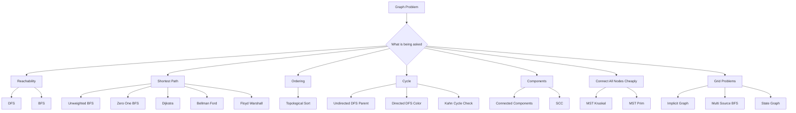

### 1-minute mental trick

> First identify what the **node** is and what the **edge** is.  
> After that, the algorithm usually becomes obvious.

---

# Part 1. Graph Introduction

## 1. What is a graph

A graph is:

```text
G = (V, E)

V = set of vertices or nodes
E = set of edges
```

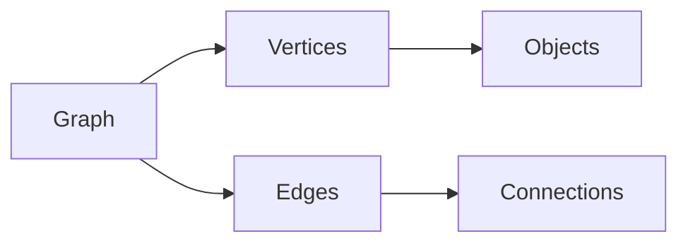

Example:

```text
V = {1, 2, 3, 4}
E = {(1,2), (2,3), (2,4), (3,4)}
```

### 1-minute mental trick

> Nodes are things.  
> Edges are relationships between things.

---

## 2. Numbered and unnumbered graphs

In CP, nodes are usually numbered:

```text
1, 2, 3, ..., n
```

If the graph is unnumbered, map each object to an integer.

```cpp
unordered_map<string, int> id;
int getId(string s) {
    if (!id.count(s)) id[s] = id.size() + 1;
    return id[s];
}
```

---

## 3. Weighted and unweighted graphs

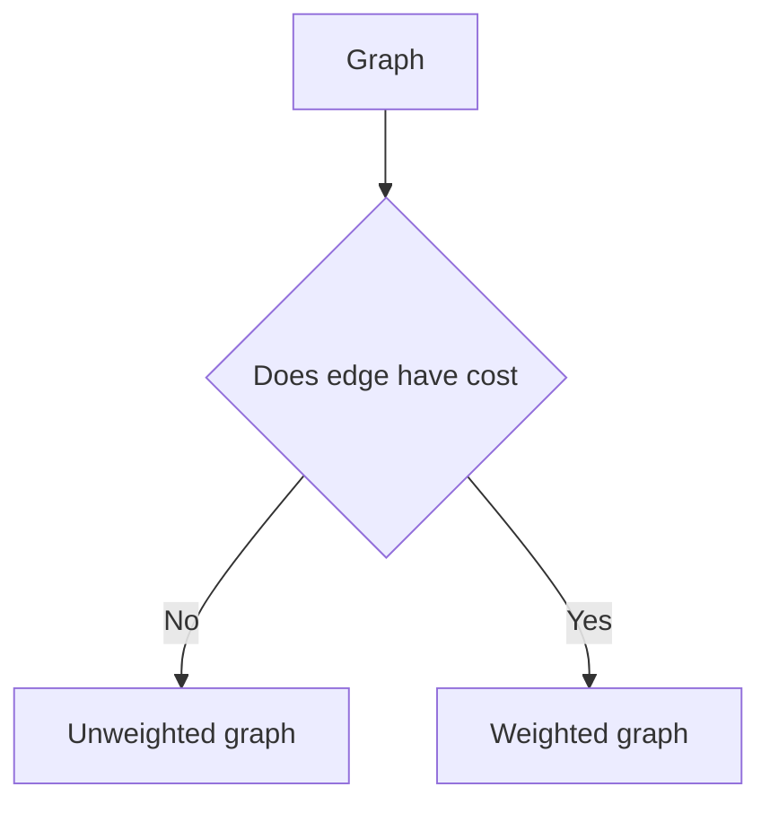

Unweighted edge:

```text
1 -- 2
```

Weighted edge:

```text
1 -- 2 with cost 5
```

### Mental trick

> If every edge has same cost, think BFS.  
> If edge costs differ, think shortest path algorithms.

---

## 4. Directed and undirected graphs

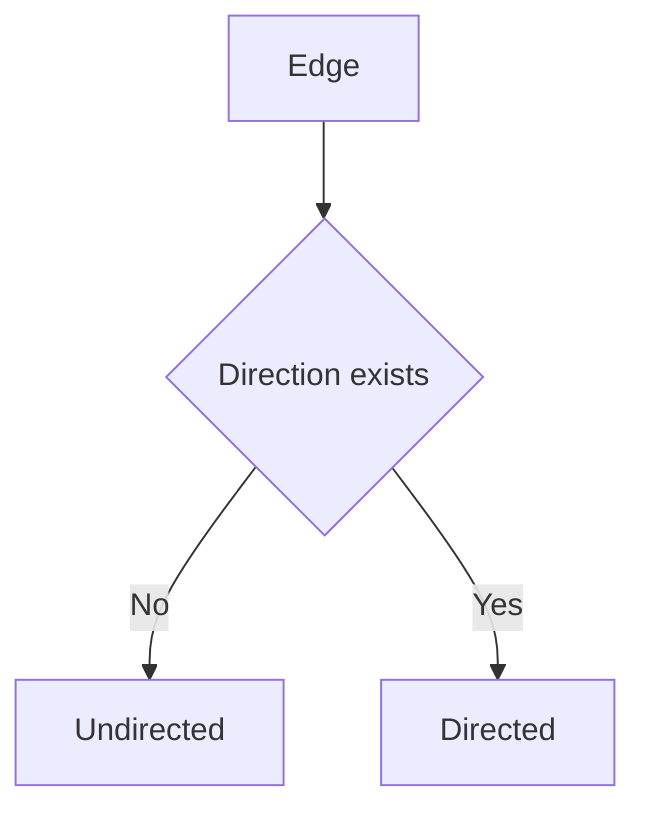

Undirected edge:

```text
u -- v
```

Add both:

```cpp
g[u].push_back(v);
g[v].push_back(u);
```

Directed edge:

```text
u -> v
```

Add one:

```cpp
g[u].push_back(v);
```

### Common mistake

For directed graph, do **not** add reverse edge unless the problem says it exists.

---

## 5. Degree

For undirected graph:

```text
degree(node) = number of neighbours
```

For directed graph:

```text
indegree  = number of incoming edges
outdegree = number of outgoing edges
```

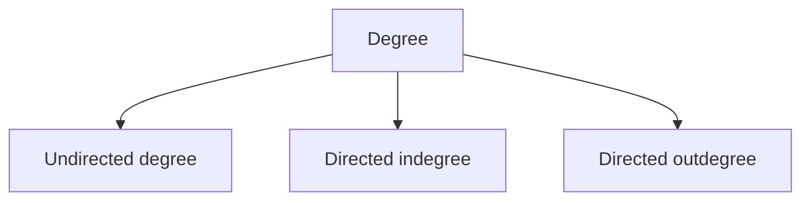

---

## 6. Sparse and dense graphs

```text
N = number of nodes
M = number of edges
```

Sparse graph:

```text
M is much smaller than N squared
```

Dense graph:

```text
M is close to N squared
```

### Mental trick

> Sparse graph: use adjacency list.  
> Dense graph: adjacency matrix can be acceptable.

---

## 7. Path, cycle, isolated node

Path:

```text
sequence of vertices where consecutive vertices have an edge
```

Cycle:

```text
path where first node and last node are same
```

Isolated node:

```text
node with no edges
```

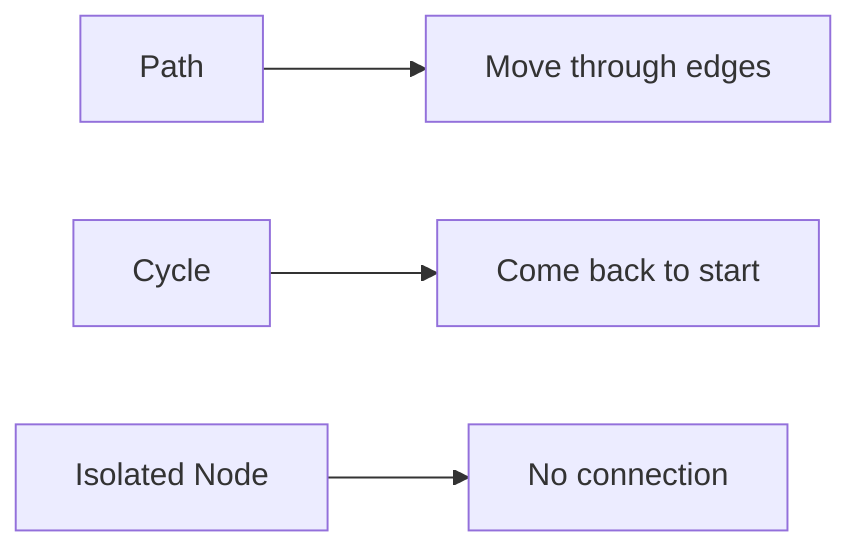

---

## 8. Reachability and connected graph

`v` is reachable from `u` if there is a path from `u` to `v`.

Connected graph:

```text
Every node can reach every other node
```

For directed graph, reachability can be one-way.

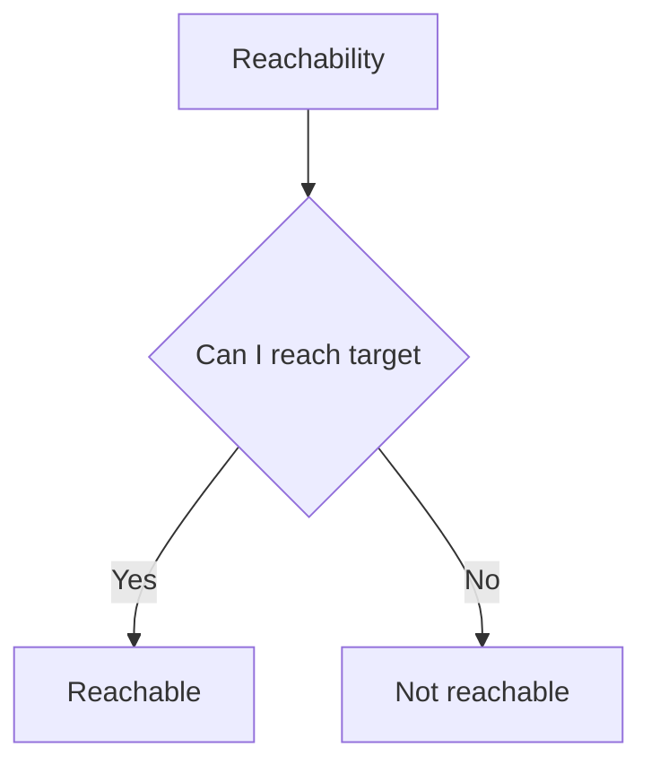

---

## 9. Strongly Connected Component

In a directed graph, an SCC is a group of nodes where every node can reach every other node inside the group.

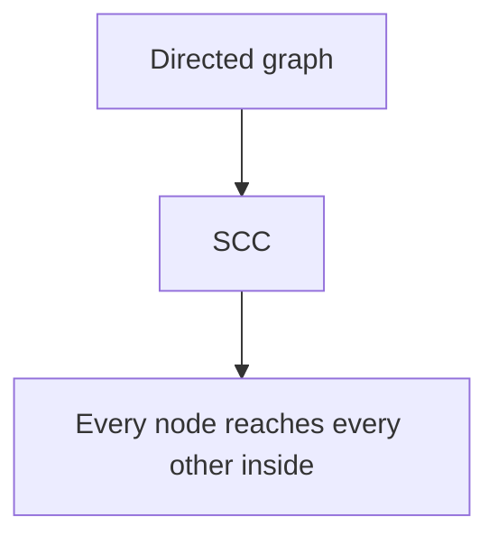

### Key observations

```text
1. In a directed cycle, all nodes in that cycle are in the same SCC.
2. Each node belongs to exactly one SCC.
```

---

## 10. Self loop and multiple edges

Self loop:

```text
u -> u
```

Multiple edges:

```text
more than one edge between same pair of nodes
```

Simple graph:

```text
No self loop and no multiple edges
```

Multi graph:

```text
Has self loop or multiple edges
```

---

## 11. Subgraph

Vertex induced subgraph:

```text
Choose some vertices and keep edges between chosen vertices.
```

Edge induced subgraph:

```text
Choose some edges and keep endpoints of those edges.
```

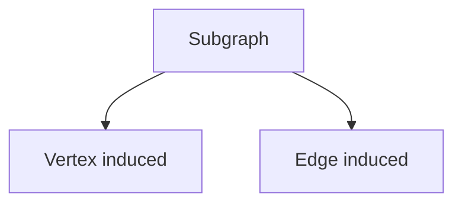

---

## 12. DAG and tree

DAG:

```text
Directed Acyclic Graph
```

Tree:

```text
Connected acyclic undirected graph
```

For a tree:

```text
V = N
E = N - 1
There is exactly one simple path between any two nodes.
```

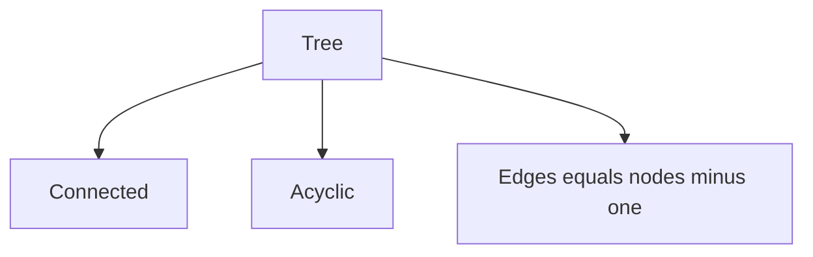

---

# Part 2. Graph Representation

## 13. Adjacency matrix

Use matrix `mat[u][v]`.

```text
mat[u][v] = 1 if edge exists
mat[u][v] = 0 otherwise
```

For weighted graph:

```text
mat[u][v] = weight
mat[u][v] = INF if no edge
```

```cpp
vector<vector<int>> mat(n + 1, vector<int>(n + 1, 0));

mat[u][v] = 1;
mat[v][u] = 1; // only for undirected
```

### Pros and cons

| Operation | Time |
|---|---|
| Check edge u v | O(1) |
| Insert edge | O(1) |
| Delete edge | O(1) |
| Memory | O(N squared) |

---

## 14. Edge list

Store only edges.

```cpp
struct Edge {
    int u, v, w;
};

vector<Edge> edges;
```

Useful for:
- Kruskal
- Bellman-Ford
- reading input first

Memory:

```text
O(M)
```

---

## 15. Adjacency list

Most used representation.

```cpp
vector<vector<int>> g(n + 1);

g[u].push_back(v);
g[v].push_back(u); // only undirected
```

Weighted:

```cpp
vector<vector<pair<int,int>>> g(n + 1);

g[u].push_back({v, w});
g[v].push_back({u, w}); // only undirected
```

Memory:

```text
O(N + M) for directed
O(N + 2M) for undirected
```

### 1-minute mental trick

> Matrix answers “is there an edge fast?”  
> List answers “who are my neighbours fast?”

---

# Part 3. DFS

## 16. DFS intuition

DFS means:

```text
Keep going deeper until no more node is left to explore.
```

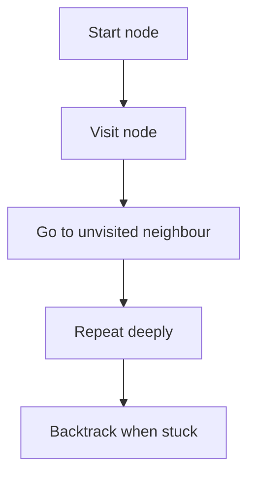

DFS is useful for:
- reachability
- connected components
- component size
- bipartite check
- cycle detection
- DFS tree

---

## 17. DFS LCCM style

```text
Level  = current node
Choice = all neighbours
Check  = neighbour not visited
Move   = dfs neighbour
```

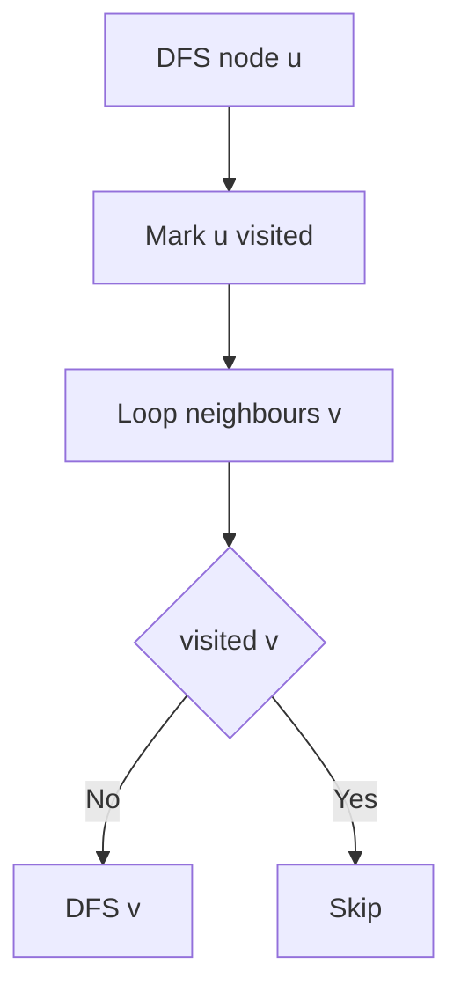

### C++ DFS template

```cpp
vector<vector<int>> g;
vector<int> vis;

void dfs(int u) {
    vis[u] = 1;

    for (int v : g[u]) {
        if (!vis[v]) {
            dfs(v);
        }
    }
}
```

### Java DFS template

```java
static ArrayList<Integer>[] g;
static boolean[] vis;

static void dfs(int u) {
    vis[u] = true;

    for (int v : g[u]) {
        if (!vis[v]) {
            dfs(v);
        }
    }
}
```

---

## 18. Connected components

Problem types:

```text
1. Number of components
2. Size of each component
3. List of components
4. Query whether x and y are in same component
```

### Idea

Run DFS from every unvisited node.  
Each DFS call discovers one component.

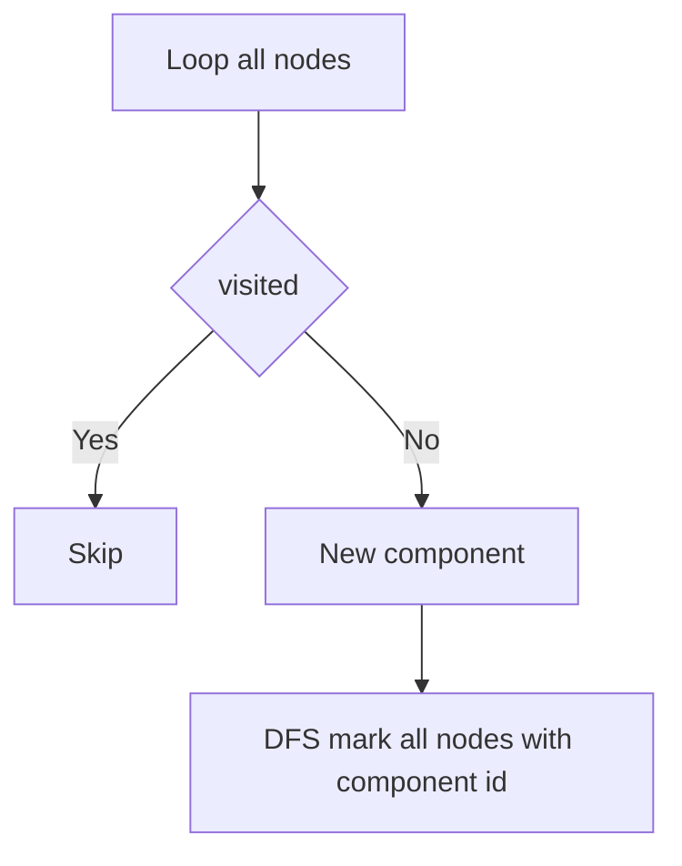

### C++ code

```cpp
int n, m;
vector<vector<int>> g;
vector<int> comp;
vector<int> compSize;

void dfsComponent(int u, int id) {
    comp[u] = id;
    compSize[id]++;

    for (int v : g[u]) {
        if (comp[v] == 0) {
            dfsComponent(v, id);
        }
    }
}

void findComponents() {
    comp.assign(n + 1, 0);
    compSize.assign(n + 1, 0);

    int id = 0;
    for (int i = 1; i <= n; i++) {
        if (comp[i] == 0) {
            id++;
            dfsComponent(i, id);
        }
    }

    cout << "components = " << id << "\n";
}
```

### Query

```cpp
bool sameComponent(int x, int y) {
    return comp[x] == comp[y];
}
```

### 1-minute mental trick

> One DFS from an unvisited node = one full component.

---

## 19. Bipartite graph

A graph is bipartite if it can be colored using two colors so that no edge connects nodes of same color.

Equivalent:

```text
No odd cycle
```

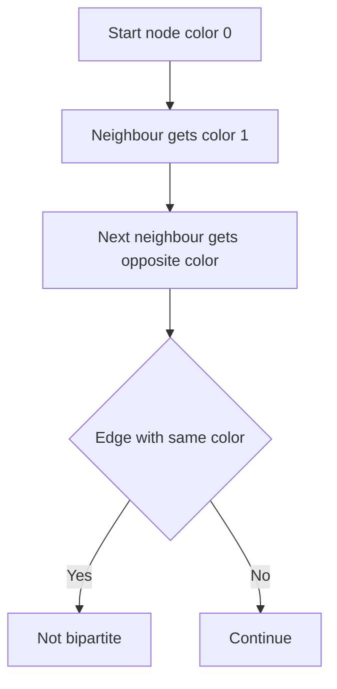

### C++ code

```cpp
bool isBipartite(int n, vector<vector<int>>& g) {
    vector<int> color(n + 1, -1);

    function<bool(int, int)> dfs = [&](int u, int c) {
        color[u] = c;

        for (int v : g[u]) {
            if (color[v] == -1) {
                if (!dfs(v, c ^ 1)) return false;
            } else if (color[v] == color[u]) {
                return false;
            }
        }

        return true;
    };

    for (int i = 1; i <= n; i++) {
        if (color[i] == -1) {
            if (!dfs(i, 0)) return false;
        }
    }

    return true;
}
```

### Number of ways to bipartition connected components

For `c` connected components, each component can flip colors.

```text
ways = 2^c
```

### 1-minute mental trick

> Bipartite means alternate colors.  
> Same color edge means odd cycle.

---

# Part 4. BFS

## 20. BFS intuition

BFS explores level by level.

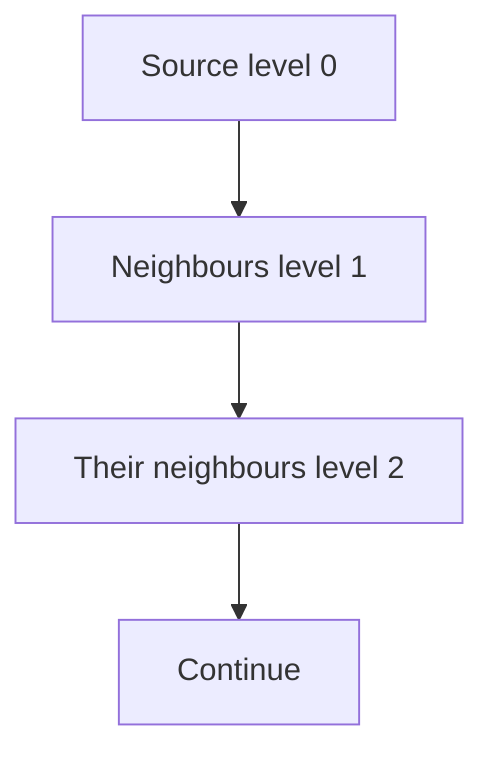

BFS is best for shortest path when all edge weights are equal.

```text
Time = O(V + E)
```

---

## 21. BFS template

```cpp
vector<int> bfs(int n, vector<vector<int>>& g, int src) {
    const int INF = 1e9;
    vector<int> dist(n + 1, INF);
    queue<int> q;

    dist[src] = 0;
    q.push(src);

    while (!q.empty()) {
        int u = q.front();
        q.pop();

        for (int v : g[u]) {
            if (dist[v] == INF) {
                dist[v] = dist[u] + 1;
                q.push(v);
            }
        }
    }

    return dist;
}
```

### Java BFS

```java
static int[] bfs(int n, ArrayList<Integer>[] g, int src) {
    int INF = 1_000_000_000;
    int[] dist = new int[n + 1];
    Arrays.fill(dist, INF);

    Queue<Integer> q = new ArrayDeque<>();
    dist[src] = 0;
    q.add(src);

    while (!q.isEmpty()) {
        int u = q.poll();

        for (int v : g[u]) {
            if (dist[v] == INF) {
                dist[v] = dist[u] + 1;
                q.add(v);
            }
        }
    }

    return dist;
}
```

### 1-minute mental trick

> BFS first time visiting a node gives shortest distance in unweighted graph.

---

## 22. BFS on grid implicit graph

Grid does not explicitly give nodes and edges.

Node:

```text
cell coordinate (row, col)
```

Edges:

```text
move up, down, left, right
```

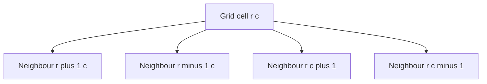

### C++ grid BFS

```cpp
using State = pair<int,int>;

int shortestGridPath(vector<string>& grid, State start, State finish) {
    int n = grid.size();
    int m = grid[0].size();

    const int INF = 1e9;
    vector<vector<int>> dist(n, vector<int>(m, INF));

    int dr[4] = {1, -1, 0, 0};
    int dc[4] = {0, 0, 1, -1};

    auto valid = [&](int r, int c) {
        return r >= 0 && r < n && c >= 0 && c < m && grid[r][c] != '#';
    };

    queue<State> q;
    dist[start.first][start.second] = 0;
    q.push(start);

    while (!q.empty()) {
        auto [r, c] = q.front();
        q.pop();

        for (int k = 0; k < 4; k++) {
            int nr = r + dr[k];
            int nc = c + dc[k];

            if (valid(nr, nc) && dist[nr][nc] == INF) {
                dist[nr][nc] = dist[r][c] + 1;
                q.push({nr, nc});
            }
        }
    }

    return dist[finish.first][finish.second];
}
```

### Step-by-step grid thinking

```text
1. Define state = cell coordinate.
2. Define valid moves = four directions.
3. Define blocked cells.
4. Run BFS from source.
5. Distance to finish is answer.
```

---

## 23. Print shortest path using parent

To print path, store parent of every node.

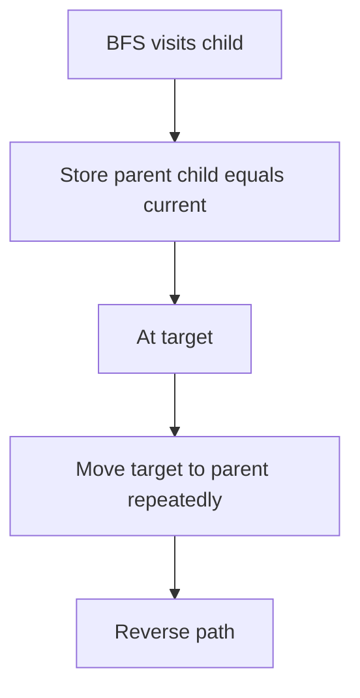

### C++ code

```cpp
vector<int> shortestPath(int n, vector<vector<int>>& g, int src, int target) {
    vector<int> dist(n + 1, -1);
    vector<int> parent(n + 1, -1);
    queue<int> q;

    dist[src] = 0;
    q.push(src);

    while (!q.empty()) {
        int u = q.front();
        q.pop();

        for (int v : g[u]) {
            if (dist[v] == -1) {
                dist[v] = dist[u] + 1;
                parent[v] = u;
                q.push(v);
            }
        }
    }

    if (dist[target] == -1) return {};

    vector<int> path;
    for (int cur = target; cur != -1; cur = parent[cur]) {
        path.push_back(cur);
    }

    reverse(path.begin(), path.end());
    return path;
}
```

---

# Part 5. DFS Tree and Cycle Detection

## 24. Cycle detection in undirected graph

In undirected graph, if a visited neighbour is not parent, cycle exists.

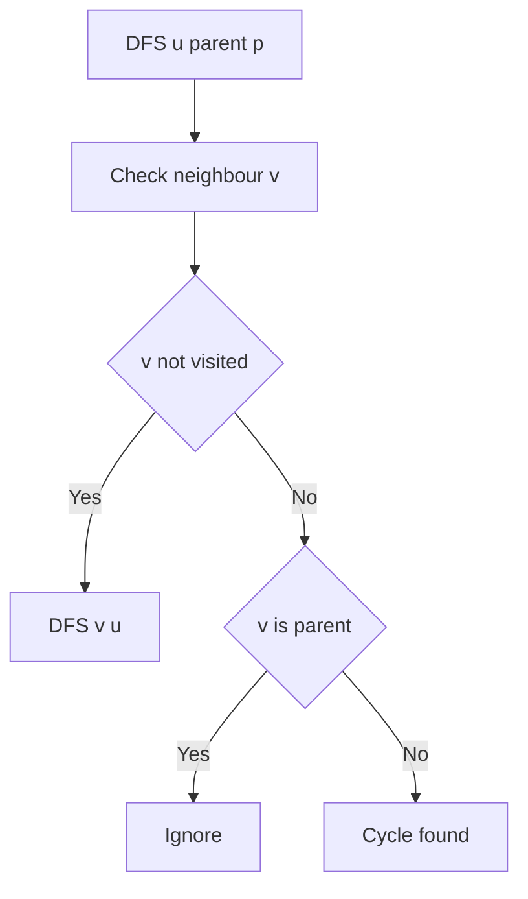

### C++ code

```cpp
bool hasCycleUndirected(int n, vector<vector<int>>& g) {
    vector<int> vis(n + 1, 0);

    function<bool(int, int)> dfs = [&](int u, int parent) {
        vis[u] = 1;

        for (int v : g[u]) {
            if (!vis[v]) {
                if (dfs(v, u)) return true;
            } else if (v != parent) {
                return true;
            }
        }

        return false;
    };

    for (int i = 1; i <= n; i++) {
        if (!vis[i]) {
            if (dfs(i, -1)) return true;
        }
    }

    return false;
}
```

### Important limitation

This simple parent method assumes simple graph.  
For self loops and multi-edges, handle at input.

---

## 25. Cycle detection in directed graph using colors

Color meaning:

```text
0 = unvisited
1 = currently exploring
2 = fully explored
```

If during DFS we find edge to color `1`, that is a back edge and a cycle exists.

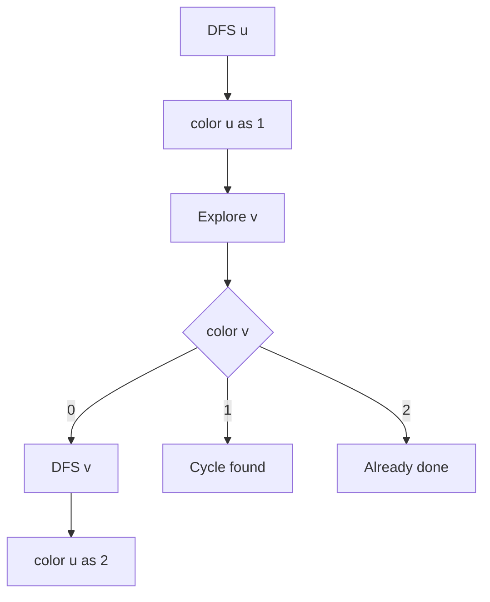

### C++ code

```cpp
bool hasCycleDirected(int n, vector<vector<int>>& g) {
    vector<int> color(n + 1, 0);

    function<bool(int)> dfs = [&](int u) {
        color[u] = 1;

        for (int v : g[u]) {
            if (color[v] == 0) {
                if (dfs(v)) return true;
            } else if (color[v] == 1) {
                return true;
            }
        }

        color[u] = 2;
        return false;
    };

    for (int i = 1; i <= n; i++) {
        if (color[i] == 0) {
            if (dfs(i)) return true;
        }
    }

    return false;
}
```

### 1-minute mental trick

> Directed cycle = edge to a node still inside current recursion stack.

---

## 26. Print one cycle in directed graph

Store parent. When you see edge `u -> v` where `v` is currently exploring, walk parent from `u` back to `v`.

```cpp
vector<int> findDirectedCycle(int n, vector<vector<int>>& g) {
    vector<int> color(n + 1, 0), parent(n + 1, -1);
    vector<int> cycle;

    function<bool(int)> dfs = [&](int u) {
        color[u] = 1;

        for (int v : g[u]) {
            if (color[v] == 0) {
                parent[v] = u;
                if (dfs(v)) return true;
            } else if (color[v] == 1) {
                cycle.push_back(v);
                int cur = u;

                while (cur != v) {
                    cycle.push_back(cur);
                    cur = parent[cur];
                }

                cycle.push_back(v);
                reverse(cycle.begin(), cycle.end());
                return true;
            }
        }

        color[u] = 2;
        return false;
    };

    for (int i = 1; i <= n; i++) {
        if (color[i] == 0 && dfs(i)) break;
    }

    return cycle;
}
```

---

## 27. Nodes that are part of any directed cycle

Idea from notes:

```text
When a back edge finds a cycle, mark contribution on parent path.
Use partial sum over DFS finish order to avoid overcounting.
```

Simple practical method for CP:

```text
Use SCC algorithm. Any SCC with size > 1 is part of a cycle.
A node with self loop is also part of a cycle.
```

### Mental trick

> In directed graphs, cycle membership is easiest through SCC.

---

# Part 6. Multi-Source BFS

## 28. What is multi-source BFS

Start BFS from many sources at once.

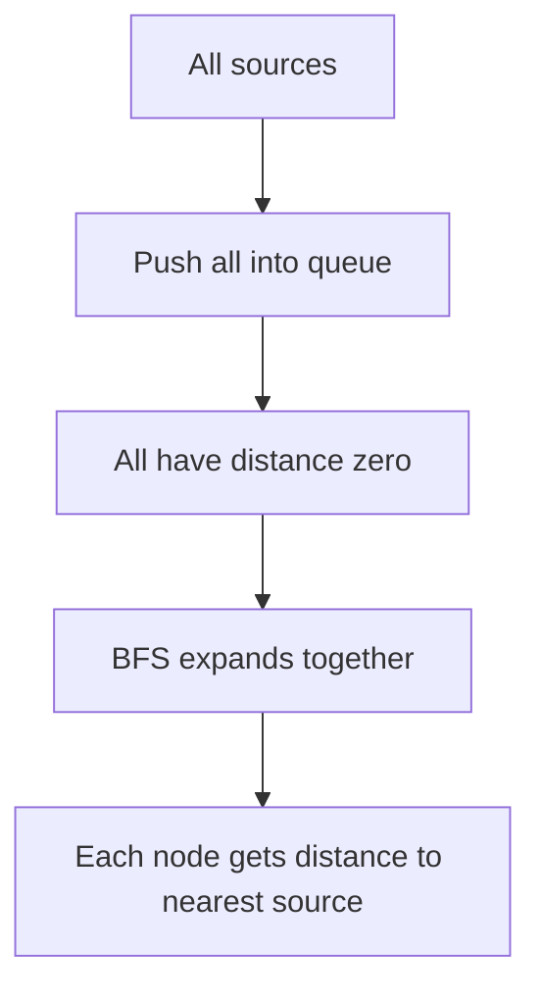

### Use cases

- nearest monster
- nearest exit
- nearest hospital
- rotting oranges
- fire spread
- distance to closest special cell

### C++ template

```cpp
vector<int> multiSourceBFS(int n, vector<vector<int>>& g, vector<int> sources) {
    const int INF = 1e9;
    vector<int> dist(n + 1, INF);
    queue<int> q;

    for (int s : sources) {
        dist[s] = 0;
        q.push(s);
    }

    while (!q.empty()) {
        int u = q.front();
        q.pop();

        for (int v : g[u]) {
            if (dist[v] == INF) {
                dist[v] = dist[u] + 1;
                q.push(v);
            }
        }
    }

    return dist;
}
```

### 1-minute mental trick

> Multi-source BFS is like adding a fake super source connected to all sources with zero cost.

---

## 29. Monster escape pattern

Given:
- person `P`
- monsters `M`
- exits `E`

Need escape if person reaches an exit before any monster.

Condition:

```text
distPerson[exit] < distMonster[exit]
```

But instead of BFS from every monster separately:

```text
Push all monsters into one queue.
Run one multi-source BFS.
```

```mermaid
flowchart TD
    A[All monsters in queue] --> B[Compute nearest monster distance]
    C[Person BFS] --> D[Compute person distance]
    B --> E[Compare at exits]
    D --> E
```

### Grid multi-source BFS

```cpp
vector<vector<int>> multiSourceGridBFS(vector<string>& grid, vector<pair<int,int>> sources) {
    int n = grid.size();
    int m = grid[0].size();

    const int INF = 1e9;
    vector<vector<int>> dist(n, vector<int>(m, INF));

    queue<pair<int,int>> q;
    for (auto [r, c] : sources) {
        dist[r][c] = 0;
        q.push({r, c});
    }

    int dr[4] = {1, -1, 0, 0};
    int dc[4] = {0, 0, 1, -1};

    auto valid = [&](int r, int c) {
        return r >= 0 && r < n && c >= 0 && c < m && grid[r][c] != '#';
    };

    while (!q.empty()) {
        auto [r, c] = q.front();
        q.pop();

        for (int k = 0; k < 4; k++) {
            int nr = r + dr[k];
            int nc = c + dc[k];

            if (valid(nr, nc) && dist[nr][nc] == INF) {
                dist[nr][nc] = dist[r][c] + 1;
                q.push({nr, nc});
            }
        }
    }

    return dist;
}
```

---

# Part 7. Topological Ordering

## 30. Topological sort meaning

Topological ordering is an ordering of nodes in a DAG such that every edge goes forward.

```text
For every edge u -> v, u appears before v.
```

```mermaid
flowchart LR
    A[u] --> B[v]
    C[Topological order] --> D[u before v]
```

Only works for:

```text
DAG = Directed Acyclic Graph
```

There can be multiple valid topological orders.

---

## 31. DFS topological sort

Idea:

```text
When DFS finishes a node completely, push it into topo.
Then reverse topo.
```

```mermaid
flowchart TD
    A[DFS u] --> B[DFS all neighbours]
    B --> C[Push u after children]
    C --> D[Reverse final list]
```

### C++ code

```cpp
vector<int> topoDFS(int n, vector<vector<int>>& g) {
    vector<int> vis(n + 1, 0), topo;

    function<void(int)> dfs = [&](int u) {
        vis[u] = 1;

        for (int v : g[u]) {
            if (!vis[v]) dfs(v);
        }

        topo.push_back(u);
    };

    for (int i = 1; i <= n; i++) {
        if (!vis[i]) dfs(i);
    }

    reverse(topo.begin(), topo.end());
    return topo;
}
```

---

## 32. Kahn algorithm using BFS

Idea:

```text
Repeatedly remove nodes with indegree zero.
```

```mermaid
flowchart TD
    A[Compute indegree] --> B[Push indegree zero nodes]
    B --> C[Pop node into topo]
    C --> D[Decrease indegree of neighbours]
    D --> E{Neighbour indegree zero}
    E -->|Yes| B
    E -->|No| C
```

### C++ code

```cpp
vector<int> topoKahn(int n, vector<vector<int>>& g) {
    vector<int> indeg(n + 1, 0);

    for (int u = 1; u <= n; u++) {
        for (int v : g[u]) {
            indeg[v]++;
        }
    }

    queue<int> q;
    for (int i = 1; i <= n; i++) {
        if (indeg[i] == 0) q.push(i);
    }

    vector<int> topo;

    while (!q.empty()) {
        int u = q.front();
        q.pop();

        topo.push_back(u);

        for (int v : g[u]) {
            indeg[v]--;
            if (indeg[v] == 0) {
                q.push(v);
            }
        }
    }

    return topo;
}
```

### Cycle check using Kahn

```cpp
bool hasCycleUsingKahn(int n, vector<vector<int>>& g) {
    vector<int> topo = topoKahn(n, g);
    return (int)topo.size() != n;
}
```

---

## 33. Lexicographically smallest topological order

Use priority queue instead of normal queue.

```cpp
vector<int> lexicographicallySmallestTopo(int n, vector<vector<int>>& g) {
    vector<int> indeg(n + 1, 0);

    for (int u = 1; u <= n; u++) {
        for (int v : g[u]) indeg[v]++;
    }

    priority_queue<int, vector<int>, greater<int>> pq;

    for (int i = 1; i <= n; i++) {
        if (indeg[i] == 0) pq.push(i);
    }

    vector<int> topo;

    while (!pq.empty()) {
        int u = pq.top();
        pq.pop();

        topo.push_back(u);

        for (int v : g[u]) {
            indeg[v]--;
            if (indeg[v] == 0) pq.push(v);
        }
    }

    return topo;
}
```

### 1-minute mental trick

> Topological sort = dependency order.  
> Indegree zero means “nothing is blocking me.”

---

## 34. DP on DAG using topological order

Use topological order to solve states in valid dependency order.

Example: longest path in DAG.

```mermaid
flowchart TD
    A[Get topo order] --> B[Process nodes in topo order]
    B --> C[Relax outgoing edges]
    C --> D[dp v equals max dp v and dp u plus 1]
```

### C++ code

```cpp
int longestPathDAG(int n, vector<vector<int>>& g) {
    vector<int> topo = topoKahn(n, g);
    vector<int> dp(n + 1, 0);

    for (int u : topo) {
        for (int v : g[u]) {
            dp[v] = max(dp[v], dp[u] + 1);
        }
    }

    return *max_element(dp.begin(), dp.end());
}
```

### Mental trick

> DP on DAG is just shortest or longest path after topological ordering.

---

# Part 8. Shortest Path Overview

## 35. Which shortest path algorithm

```mermaid
flowchart TD
    A[Shortest Path Problem] --> B{Edge weights}
    B -->|All 1| C[BFS]
    B -->|Only 0 and 1| D[Zero One BFS]
    B -->|Non negative| E[Dijkstra]
    B -->|Has negative edge| F[Bellman Ford]
    B -->|All pairs query| G[Floyd Warshall]
```

| Problem | Algorithm | Time |
|---|---|---|
| Unweighted SSSP | BFS | O(V + E) |
| 0 or 1 weights | 0-1 BFS | O(V + E) |
| Non-negative weights | Dijkstra | O(E log E) or O(E log V) |
| Negative edges | Bellman-Ford | O(VE) |
| All pairs shortest path | Floyd-Warshall | O(V cubed) |

### 1-minute mental trick

> All edge weights equal: queue.  
> Weights 0 and 1: deque.  
> Non-negative weights: priority queue.  
> Negative edges: Bellman-Ford.  
> All pairs: Floyd-Warshall.

---

# Part 9. 0-1 BFS

## 36. 0-1 BFS idea

Used when edge weights are only `0` or `1`.

```text
If weight is 0, push front.
If weight is 1, push back.
```

```mermaid
flowchart TD
    A[Relax edge u to v] --> B{weight}
    B -->|0| C[push front]
    B -->|1| D[push back]
```

### C++ code

```cpp
vector<int> zeroOneBFS(int n, vector<vector<pair<int,int>>>& g, int src) {
    const int INF = 1e9;
    vector<int> dist(n + 1, INF);
    deque<int> dq;

    dist[src] = 0;
    dq.push_front(src);

    while (!dq.empty()) {
        int u = dq.front();
        dq.pop_front();

        for (auto [v, w] : g[u]) {
            if (dist[v] > dist[u] + w) {
                dist[v] = dist[u] + w;

                if (w == 0) dq.push_front(v);
                else dq.push_back(v);
            }
        }
    }

    return dist;
}
```

### Why not normal BFS

Normal BFS assumes every edge cost is `1`.  
Here zero edges should be processed earlier.

---

## 37. Grid with wall break as 0-1 BFS

Question:

```text
Find minimum number of walls to break to reach end.
```

Model:

```text
Node = cell
Edge cost = 0 if next cell is empty
Edge cost = 1 if next cell is wall
```

Then apply 0-1 BFS.

```cpp
int minWallsToBreak(vector<string>& grid, pair<int,int> start, pair<int,int> finish) {
    int n = grid.size();
    int m = grid[0].size();
    const int INF = 1e9;

    vector<vector<int>> dist(n, vector<int>(m, INF));
    deque<pair<int,int>> dq;

    int dr[4] = {1, -1, 0, 0};
    int dc[4] = {0, 0, 1, -1};

    auto valid = [&](int r, int c) {
        return r >= 0 && r < n && c >= 0 && c < m;
    };

    dist[start.first][start.second] = 0;
    dq.push_front(start);

    while (!dq.empty()) {
        auto [r, c] = dq.front();
        dq.pop_front();

        for (int k = 0; k < 4; k++) {
            int nr = r + dr[k];
            int nc = c + dc[k];

            if (!valid(nr, nc)) continue;

            int w = (grid[nr][nc] == '#');

            if (dist[nr][nc] > dist[r][c] + w) {
                dist[nr][nc] = dist[r][c] + w;

                if (w == 0) dq.push_front({nr, nc});
                else dq.push_back({nr, nc});
            }
        }
    }

    return dist[finish.first][finish.second];
}
```

### 1-minute mental trick

> 0 cost means urgent, push front.  
> 1 cost means later, push back.

---

# Part 10. Dijkstra

## 38. Dijkstra intuition

Dijkstra solves single source shortest path for non-negative weights.

Basic idea:

```text
Always take the currently known least distance node.
Relax its neighbours.
```

```mermaid
flowchart TD
    A[Source distance zero] --> B[Priority queue]
    B --> C[Take minimum distance node]
    C --> D[Relax all outgoing edges]
    D --> B
```

### Relaxation

For edge `u -> v` with weight `w`:

```text
if dist[v] > dist[u] + w:
    dist[v] = dist[u] + w
```

---

## 39. C++ Dijkstra template

```cpp
vector<long long> dijkstra(int n, vector<vector<pair<int,int>>>& g, int src) {
    const long long INF = 4e18;
    vector<long long> dist(n + 1, INF);

    priority_queue<
        pair<long long,int>,
        vector<pair<long long,int>>,
        greater<pair<long long,int>>
    > pq;

    dist[src] = 0;
    pq.push({0, src});

    while (!pq.empty()) {
        auto [du, u] = pq.top();
        pq.pop();

        if (du != dist[u]) continue;

        for (auto [v, w] : g[u]) {
            if (dist[v] > dist[u] + w) {
                dist[v] = dist[u] + w;
                pq.push({dist[v], v});
            }
        }
    }

    return dist;
}
```

### Java Dijkstra helper

```java
static long[] dijkstra(int n, ArrayList<int[]>[] g, int src) {
    long INF = Long.MAX_VALUE / 4;
    long[] dist = new long[n + 1];
    Arrays.fill(dist, INF);

    PriorityQueue<long[]> pq = new PriorityQueue<>(Comparator.comparingLong(a -> a[0]));

    dist[src] = 0;
    pq.add(new long[]{0, src});

    while (!pq.isEmpty()) {
        long[] cur = pq.poll();
        long d = cur[0];
        int u = (int)cur[1];

        if (d != dist[u]) continue;

        for (int[] edge : g[u]) {
            int v = edge[0];
            int w = edge[1];

            if (dist[v] > dist[u] + w) {
                dist[v] = dist[u] + w;
                pq.add(new long[]{dist[v], v});
            }
        }
    }

    return dist;
}
```

### Complexity

```text
O(E log E)
```

Often written as:

```text
O((V + E) log V)
```

---

## 40. Dijkstra limitation

Dijkstra does not work with negative edges.

```mermaid
flowchart TD
    A[Dijkstra fixes shortest node] --> B[Negative edge later may improve it]
    B --> C[Algorithm assumption breaks]
```

### 1-minute mental trick

> Dijkstra trusts that once the smallest distance is picked, it will not improve.  
> Negative edges can break this trust.

---

## 41. Dijkstra on state graph

Sometimes node is not just city.

Example fuel problem:

```text
state = (city, fuel remaining)
```

Each original city becomes multiple states.

```mermaid
flowchart TD
    A[Original city] --> B[State city fuel zero]
    A --> C[State city fuel one]
    A --> D[State city fuel two]
```

### General state graph template

```text
1. Decide state.
2. Decide transitions.
3. Decide transition cost.
4. Run shortest path algorithm.
```

### C++ skeleton

```cpp
struct State {
    int node;
    int fuel;
};

struct Item {
    long long dist;
    int node;
    int fuel;

    bool operator>(const Item& other) const {
        return dist > other.dist;
    }
};
```

### Mental trick

> If the same city can be reached with different useful conditions, include that condition in the state.

---

# Part 11. Bellman-Ford

## 42. Bellman-Ford intuition

Bellman-Ford handles negative edges and can detect negative cycles.

Main idea:

```text
Relax all edges V minus 1 times.
```

Why `V - 1`?

```text
A shortest simple path has at most V - 1 edges.
```

```mermaid
flowchart TD
    A[Initialize dist source zero] --> B[Repeat V minus 1 times]
    B --> C[Relax every edge]
    C --> D[Distances improve gradually]
```

### C++ code

```cpp
struct Edge {
    int u, v;
    long long w;
};

vector<long long> bellmanFord(int n, vector<Edge>& edges, int src) {
    const long long INF = 4e18;
    vector<long long> dist(n + 1, INF);

    dist[src] = 0;

    for (int iter = 1; iter <= n - 1; iter++) {
        bool changed = false;

        for (auto e : edges) {
            if (dist[e.u] == INF) continue;

            if (dist[e.v] > dist[e.u] + e.w) {
                dist[e.v] = dist[e.u] + e.w;
                changed = true;
            }
        }

        if (!changed) break;
    }

    return dist;
}
```

---

## 43. Detect negative cycle

After `V - 1` relaxations, do one more relaxation.  
If anything still improves, a negative cycle is reachable.

```cpp
bool hasNegativeCycle(int n, vector<Edge>& edges, int src) {
    const long long INF = 4e18;
    vector<long long> dist(n + 1, INF);

    dist[src] = 0;

    for (int iter = 1; iter <= n - 1; iter++) {
        for (auto e : edges) {
            if (dist[e.u] != INF && dist[e.v] > dist[e.u] + e.w) {
                dist[e.v] = dist[e.u] + e.w;
            }
        }
    }

    for (auto e : edges) {
        if (dist[e.u] != INF && dist[e.v] > dist[e.u] + e.w) {
            return true;
        }
    }

    return false;
}
```

### Nodes affected by negative cycle

If a node can still relax on nth iteration, it is affected by a negative cycle.  
To find all nodes reachable from negative cycle:
1. Mark nodes relaxed on nth iteration.
2. Run DFS or BFS from them in original graph.

### 1-minute mental trick

> If distance keeps decreasing even after V minus 1 rounds, a negative cycle is feeding it.

---

# Part 12. Floyd-Warshall

## 44. Floyd-Warshall intuition

Floyd-Warshall solves all-pairs shortest path.

It tries every node as an intermediate node.

```text
dist[i][j] = min(dist[i][j], dist[i][k] + dist[k][j])
```

```mermaid
flowchart LR
    A[i] --> B[k]
    B --> C[j]
    D[Compare i to j direct] --> E[with i to k to j]
```

### C++ code

```cpp
vector<vector<long long>> floydWarshall(int n, vector<vector<long long>> dist) {
    const long long INF = 4e18;

    for (int k = 1; k <= n; k++) {
        for (int i = 1; i <= n; i++) {
            for (int j = 1; j <= n; j++) {
                if (dist[i][k] == INF || dist[k][j] == INF) continue;

                dist[i][j] = min(dist[i][j], dist[i][k] + dist[k][j]);
            }
        }
    }

    return dist;
}
```

### Initialization

```cpp
const long long INF = 4e18;
vector<vector<long long>> dist(n + 1, vector<long long>(n + 1, INF));

for (int i = 1; i <= n; i++) {
    dist[i][i] = 0;
}

for (auto [u, v, w] : edges) {
    dist[u][v] = min(dist[u][v], w); // handle multiple edges
}
```

---

## 45. Floyd path reconstruction

Maintain parent array.

```cpp
vector<vector<int>> parent(n + 1, vector<int>(n + 1));

for (int i = 1; i <= n; i++) {
    for (int j = 1; j <= n; j++) {
        parent[i][j] = i;
    }
}

if (dist[i][j] > dist[i][k] + dist[k][j]) {
    dist[i][j] = dist[i][k] + dist[k][j];
    parent[i][j] = parent[k][j];
}
```

Print path:

```cpp
void printPath(int i, int j, vector<vector<int>>& parent) {
    if (i == j) {
        cout << i << " ";
        return;
    }

    printPath(i, parent[i][j], parent);
    cout << j << " ";
}
```

---

## 46. Transitive closure

To find reachability between all pairs:

```text
reach[i][j] = reach[i][j] OR reach[i][k] AND reach[k][j]
```

```cpp
void transitiveClosure(int n, vector<vector<int>>& reach) {
    for (int k = 1; k <= n; k++) {
        for (int i = 1; i <= n; i++) {
            for (int j = 1; j <= n; j++) {
                reach[i][j] = reach[i][j] || (reach[i][k] && reach[k][j]);
            }
        }
    }
}
```

---

## 47. Negative cycle using Floyd-Warshall

After Floyd:

```text
if dist[i][i] < 0, negative cycle exists
```

```cpp
bool hasNegativeCycleFloyd(vector<vector<long long>>& dist, int n) {
    for (int i = 1; i <= n; i++) {
        if (dist[i][i] < 0) return true;
    }
    return false;
}
```

### 1-minute mental trick

> Floyd asks: can going through k improve i to j?

---

# Part 13. Graph Formulation

## 48. How to formulate graph problems

From notes:

```text
Problem statement -> extract graph
1. What does a node represent?
2. What does an edge represent?
3. What is the cost of an edge?
4. Which algorithm fits?
```

```mermaid
flowchart TD
    A[Problem statement] --> B[Define node]
    B --> C[Define edge]
    C --> D[Define cost]
    D --> E[Choose algorithm]
```

### Algorithm selection after formulation

| Edge cost | Algorithm |
|---|---|
| all edges cost 1 | BFS |
| cost 0 or 1 | 0-1 BFS |
| non-negative | Dijkstra |
| negative edges | Bellman-Ford |
| all pairs | Floyd-Warshall |

---

## 49. Wall breaking formulation

Question 1:

```text
Find minimum walls to break from S to E.
```

Model:

```text
Node = cell
Edge cost = 0 if moving into empty cell
Edge cost = 1 if moving into wall
Algorithm = 0-1 BFS
```

Question 2:

```text
Find minimum moves if you can break at most k walls.
```

Model:

```text
Node = (row, col, walls_broken)
Edge cost = 1 move
Constraint = walls_broken <= k
Algorithm = BFS over state graph
```

```mermaid
flowchart TD
    A[Grid cell] --> B[State row col broken]
    B --> C[Move to next cell]
    C --> D{Is wall}
    D -->|Yes| E[broken plus one]
    D -->|No| F[broken same]
```

### C++ BFS with at most k wall breaks

```cpp
int shortestPathBreakK(vector<string>& grid, pair<int,int> start,
                       pair<int,int> finish, int k) {
    int n = grid.size();
    int m = grid[0].size();

    const int INF = 1e9;
    vector<vector<vector<int>>> dist(
        n, vector<vector<int>>(m, vector<int>(k + 1, INF))
    );

    queue<tuple<int,int,int>> q;

    dist[start.first][start.second][0] = 0;
    q.push({start.first, start.second, 0});

    int dr[4] = {1, -1, 0, 0};
    int dc[4] = {0, 0, 1, -1};

    auto valid = [&](int r, int c) {
        return r >= 0 && r < n && c >= 0 && c < m;
    };

    while (!q.empty()) {
        auto [r, c, broken] = q.front();
        q.pop();

        for (int dir = 0; dir < 4; dir++) {
            int nr = r + dr[dir];
            int nc = c + dc[dir];

            if (!valid(nr, nc)) continue;

            int nb = broken + (grid[nr][nc] == '#');

            if (nb <= k && dist[nr][nc][nb] == INF) {
                dist[nr][nc][nb] = dist[r][c][broken] + 1;
                q.push({nr, nc, nb});
            }
        }
    }

    int ans = INF;
    for (int broken = 0; broken <= k; broken++) {
        ans = min(ans, dist[finish.first][finish.second][broken]);
    }

    return ans;
}
```

### 1-minute mental trick

> If a condition changes future possibilities, add it to the state.

---

## 50. Fuel shortest path formulation

Problem idea:

```text
Cars have fuel capacity k.
Traveling edge consumes petrol.
Buying petrol costs money depending on city.
```

State:

```text
(city, fuel_remaining)
```

Transitions:

```text
Buy one fuel at current city.
Move to neighbour if enough fuel.
```

```mermaid
flowchart TD
    A[city fuel] --> B[buy fuel]
    A --> C[travel edge]
    B --> D[city fuel plus one]
    C --> E[next city fuel minus distance]
```

### Dijkstra state template

```cpp
struct Node {
    long long cost;
    int city;
    int fuel;

    bool operator>(const Node& other) const {
        return cost > other.cost;
    }
};
```

### Mental trick

> If money is minimized and edge costs vary, use Dijkstra on expanded states.

---

## 51. Binary string transformation formulation

Problem idea from notes:

```text
Start string -> end string
Each move changes bits.
Some strings are banned.
Find minimum moves.
```

Model:

```text
Node = binary string
Edge = one allowed transformation
Blocked nodes = banned strings
Algorithm = BFS
```

```mermaid
flowchart TD
    A[Start string] --> B[Flip one bit]
    B --> C[New string]
    C --> D{Banned}
    D -->|No| E[BFS continue]
    D -->|Yes| F[Skip]
```

### C++ skeleton

```cpp
int minStringMoves(string start, string target, unordered_set<string>& banned) {
    queue<string> q;
    unordered_map<string, int> dist;

    if (banned.count(start)) return -1;

    dist[start] = 0;
    q.push(start);

    while (!q.empty()) {
        string cur = q.front();
        q.pop();

        if (cur == target) return dist[cur];

        for (int i = 0; i < (int)cur.size(); i++) {
            string nxt = cur;
            nxt[i] = (nxt[i] == '0' ? '1' : '0');

            if (!banned.count(nxt) && !dist.count(nxt)) {
                dist[nxt] = dist[cur] + 1;
                q.push(nxt);
            }
        }
    }

    return -1;
}
```

---

# Part 14. MST

## 52. Minimum Spanning Tree

Given:

```text
N nodes, M weighted edges
Choose N - 1 edges
All nodes connected
Minimum sum of edge weights
```

```mermaid
flowchart TD
    A[Weighted connected graph] --> B[Choose N minus 1 edges]
    B --> C[No cycle]
    C --> D[All nodes connected]
    D --> E[Minimum total cost]
```

### 1-minute mental trick

> MST connects all nodes with minimum wiring cost.

---

## 53. Kruskal algorithm

Idea:

```text
Sort edges by weight.
Take smallest edge if it connects two different components.
Use DSU.
```

```mermaid
flowchart TD
    A[Sort edges] --> B[Take smallest edge]
    B --> C{Same component}
    C -->|Yes| D[Skip edge]
    C -->|No| E[Add edge and union]
    E --> F{N minus 1 edges chosen}
```

### DSU code

```cpp
struct DSU {
    vector<int> parent, size;

    DSU(int n) {
        parent.resize(n + 1);
        size.assign(n + 1, 1);

        for (int i = 1; i <= n; i++) {
            parent[i] = i;
        }
    }

    int find(int x) {
        if (parent[x] == x) return x;
        return parent[x] = find(parent[x]);
    }

    bool unite(int a, int b) {
        a = find(a);
        b = find(b);

        if (a == b) return false;

        if (size[a] < size[b]) swap(a, b);

        parent[b] = a;
        size[a] += size[b];

        return true;
    }
};
```

### Kruskal code

```cpp
struct EdgeMST {
    int u, v;
    long long w;
};

long long kruskal(int n, vector<EdgeMST>& edges) {
    sort(edges.begin(), edges.end(), [](const EdgeMST& a, const EdgeMST& b) {
        return a.w < b.w;
    });

    DSU dsu(n);
    long long cost = 0;
    int used = 0;

    for (auto e : edges) {
        if (dsu.unite(e.u, e.v)) {
            cost += e.w;
            used++;

            if (used == n - 1) break;
        }
    }

    if (used != n - 1) return -1; // graph not connected
    return cost;
}
```

### Complexity

```text
O(E log E)
```

---

## 54. Maximum spanning tree

Two easy methods:

Method 1:

```text
Sort edges descending and run Kruskal.
```

Method 2:

```text
Negate all weights, find MST, negate final answer.
```

### Mental trick

> Minimum spanning tree picks smallest safe edge.  
> Maximum spanning tree picks largest safe edge.

---

## 55. Node activation cost with MST

Problem idea:

```text
Nodes are plants.
Edges are pipes or wires.
Each plant can be activated individually with cost c[i].
Find minimum cost to activate/connect all plants.
```

Model:

```text
Add super node 0.
Connect 0 to each node i with edge cost c[i].
Run MST.
```

```mermaid
flowchart TD
    A[Super node] --> B[Plant 1]
    A --> C[Plant 2]
    A --> D[Plant 3]
    B --> E[Original edges]
    C --> E
    D --> E
```

### C++ idea

```cpp
for (int i = 1; i <= n; i++) {
    edges.push_back({0, i, activationCost[i]});
}

long long ans = kruskal(n + 1, edges);
```

### 1-minute mental trick

> If node has a cost, convert it into an edge from a super node.

---

# Part 15. Final Pattern Checklist

## 56. Graph algorithm decision checklist

```mermaid
flowchart TD
    A[Read problem] --> B[Find nodes and edges]
    B --> C{Need reachability}
    C -->|Yes| D[DFS or BFS]
    C -->|No| E{Need shortest path}
    E -->|Yes| F[Choose by edge weights]
    E -->|No| G{Need ordering}
    G -->|Yes| H[Topological sort]
    G -->|No| I{Need connect all cheaply}
    I -->|Yes| J[MST]
    I -->|No| K[Think components cycles SCC flow]
```

## 57. One-page memory sheet

```text
Graph = V plus E

Representations:
Matrix -> O(N squared), edge check O(1)
Edge list -> O(M), useful for Kruskal and Bellman-Ford
Adj list -> O(N plus M), most used

DFS:
Reachability, components, bipartite, cycle

BFS:
Unweighted shortest path, grid shortest path

Multi-source BFS:
Nearest source distance

0-1 BFS:
Weights only 0 or 1, use deque

Dijkstra:
Non-negative weighted shortest path

Bellman-Ford:
Negative edges, negative cycle

Floyd-Warshall:
All-pairs shortest path, O(N cubed)

Topological sort:
Only DAG, dependency ordering

MST:
Connect all nodes with minimum total edge cost

Graph formulation:
Node, edge, cost, algorithm
```

## 58. Final mental tricks

```text
1. If all edges same cost -> BFS.
2. If weight is 0 or 1 -> 0-1 BFS.
3. If non-negative weights -> Dijkstra.
4. If negative edge exists -> Bellman-Ford.
5. If all pairs -> Floyd-Warshall.
6. If dependencies -> Topological sort.
7. If connect all with minimum cost -> MST.
8. If grid has extra condition -> add condition to state.
9. If multiple starting points -> multi-source BFS.
10. If node has cost -> super node trick.
```

---

END
