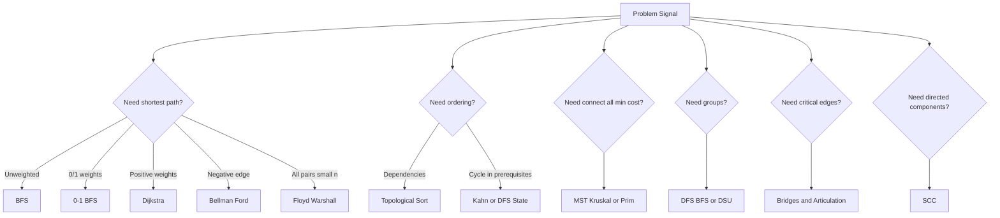
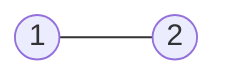
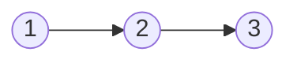
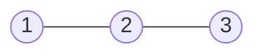
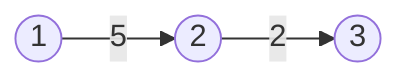
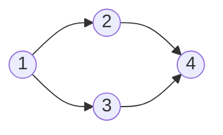
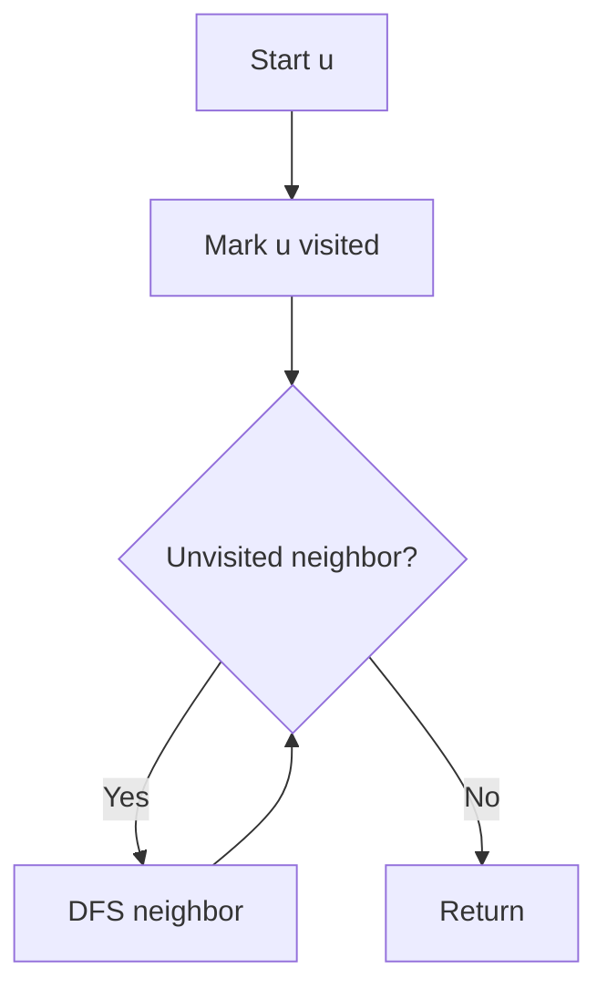
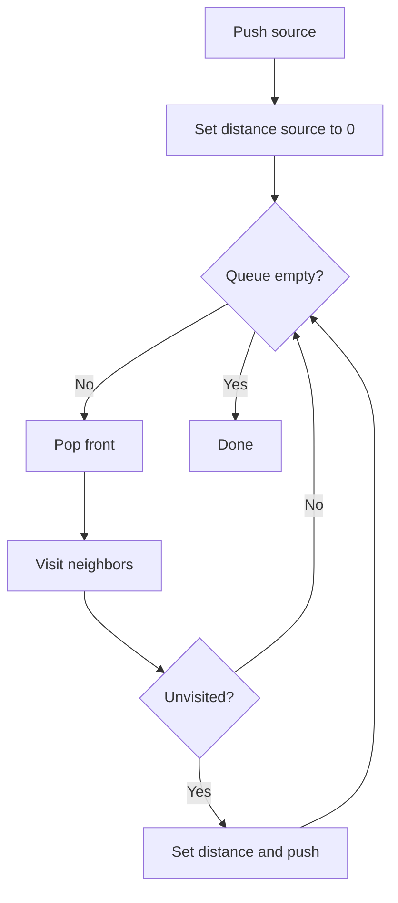

# Graph Algorithms Complete Handbook — CP + DSA / FAANG

> Goal: one complete graph notebook for Competitive Programming and DSA interviews.
>
> Rendering rule used in this file:
>
> - Mental maps and term diagrams use **safe Mermaid only**.
> - All problem dry runs use **plain text tree style**, like recursion/backtracking notes.
> - No Mermaid is used inside dry-run sections, so you will not get `Unable to render rich display` there.

---

## Clickable Index

### 0. Master Maps
- [0.1 Graph Master Map](#01-graph-master-map)
- [0.2 Algorithm Selection Map](#02-algorithm-selection-map)
- [0.3 CP + DSA Graph Roadmap](#03-cp--dsa-graph-roadmap)

### 1. Graph Basics
- [1.1 Core Terms](#11-core-terms)
- [1.2 Graph Representation](#12-graph-representation)
- [1.3 Input Templates](#13-input-templates)
- [1.4 Graph Modelling Checklist](#14-graph-modelling-checklist)

### 2. Traversal
- [2.1 DFS](#21-dfs-depth-first-search)
- [2.2 BFS](#22-bfs-breadth-first-search)
- [2.3 Connected Components](#23-connected-components)
- [2.4 Bipartite Check](#24-bipartite-check)
- [2.5 Grid BFS / DFS](#25-grid-bfs--dfs)
- [2.6 Multi-Source BFS](#26-multi-source-bfs)
- [2.7 0-1 BFS](#27-0-1-bfs)

### 3. Cycles and DAG
- [3.1 Cycle Detection in Undirected Graph](#31-cycle-detection-in-undirected-graph)
- [3.2 Cycle Detection in Directed Graph](#32-cycle-detection-in-directed-graph)
- [3.3 Topological Sort — DFS](#33-topological-sort--dfs)
- [3.4 Topological Sort — Kahn](#34-topological-sort--kahn)
- [3.5 DAG DP](#35-dag-dp)

### 4. Shortest Path
- [4.1 BFS Shortest Path](#41-bfs-shortest-path)
- [4.2 Dijkstra](#42-dijkstra)
- [4.3 Bellman-Ford](#43-bellman-ford)
- [4.4 Floyd-Warshall](#44-floyd-warshall)
- [4.5 Shortest Path Formulation Patterns](#45-shortest-path-formulation-patterns)

### 5. MST and DSU
- [5.1 DSU](#51-dsu-disjoint-set-union)
- [5.2 Kruskal MST](#52-kruskal-mst)
- [5.3 Prim MST](#53-prim-mst)
- [5.4 MST Pattern Problems](#54-mst-pattern-problems)

### 6. Advanced CP Graphs
- [6.1 SCC — Kosaraju](#61-scc--kosaraju)
- [6.2 Bridges](#62-bridges)
- [6.3 Articulation Points](#63-articulation-points)
- [6.4 Euler Path / Circuit](#64-euler-path--circuit)
- [6.5 LCA Binary Lifting](#65-lca-binary-lifting)
- [6.6 Tree Diameter](#66-tree-diameter)
- [6.7 Tree DP / Rerooting Intro](#67-tree-dp--rerooting-intro)
- [6.8 Network Flow Intro](#68-network-flow-intro)
- [6.9 Bipartite Matching Intro](#69-bipartite-matching-intro)

### 7. Practice Problem Pack
- [P1. Number of Connected Components](#p1-number-of-connected-components)
- [P2. Shortest Path in Unweighted Graph](#p2-shortest-path-in-unweighted-graph)
- [P3. Escape from Monsters](#p3-escape-from-monsters)
- [P4. Course Schedule](#p4-course-schedule)
- [P5. Network Delay](#p5-network-delay)
- [P6. Cheapest Path With 0/1 Edges](#p6-cheapest-path-with-01-edges)
- [P7. Negative Cycle Detection](#p7-negative-cycle-detection)
- [P8. All Pairs Shortest Path](#p8-all-pairs-shortest-path)
- [P9. Minimum Cost to Connect Cities](#p9-minimum-cost-to-connect-cities)
- [P10. Count Islands](#p10-count-islands)
- [P11. Rotten Oranges](#p11-rotten-oranges)
- [P12. Alien Dictionary](#p12-alien-dictionary)
- [P13. Redundant Connection](#p13-redundant-connection)
- [P14. Number of Provinces](#p14-number-of-provinces)
- [P15. Cheapest Flights With K Stops](#p15-cheapest-flights-with-k-stops)
- [P16. Bridges in Graph](#p16-bridges-in-graph)
- [P17. Strongly Connected Components](#p17-strongly-connected-components)
- [P18. LCA Queries](#p18-lca-queries)

### 8. Final Revision
- [8.1 Complexity Table](#81-complexity-table)
- [8.2 Pattern Recognition Table](#82-pattern-recognition-table)
- [8.3 Template Pack](#83-template-pack)
- [8.4 Common Bugs](#84-common-bugs)

---

# 0.1 Graph Master Map

```mermaid
graph TD
    A[Graphs] --> B[Basics]
    A --> C[Traversal]
    A --> D[Cycles and DAG]
    A --> E[Shortest Path]
    A --> F[MST and DSU]
    A --> G[Advanced CP]

    B --> B1[Nodes]
    B --> B2[Edges]
    B --> B3[Directed]
    B --> B4[Undirected]
    B --> B5[Weighted]

    C --> C1[DFS]
    C --> C2[BFS]
    C --> C3[Grid BFS]
    C --> C4[Multi Source BFS]
    C --> C5[0-1 BFS]

    D --> D1[Undirected Cycle]
    D --> D2[Directed Cycle]
    D --> D3[Topological Sort]
    D --> D4[DAG DP]

    E --> E1[BFS]
    E --> E2[Dijkstra]
    E --> E3[Bellman Ford]
    E --> E4[Floyd Warshall]

    F --> F1[DSU]
    F --> F2[Kruskal]
    F --> F3[Prim]

    G --> G1[SCC]
    G --> G2[Bridges]
    G --> G3[Articulation]
    G --> G4[LCA]
    G --> G5[Flow]
```



# 0.2 Algorithm Selection Map



# 0.3 CP + DSA Graph Roadmap

| Phase | Topics | Target |
|---|---|---|
| 1 | representation, DFS, BFS | foundation |
| 2 | components, bipartite, grid BFS | interview medium |
| 3 | cycle detection, topo sort | course/dependency problems |
| 4 | shortest path: BFS, 0-1 BFS, Dijkstra | CP + FAANG core |
| 5 | Bellman-Ford, Floyd-Warshall | advanced shortest path |
| 6 | DSU, MST | greedy graph patterns |
| 7 | SCC, bridges, articulation | CP intermediate/advanced |
| 8 | LCA, tree DP, rerooting | tree graph mastery |
| 9 | flow, matching | advanced CP |

---

# 1.1 Core Terms

## Node and Edge



- `1` and `2` are nodes / vertices.
- `(1,2)` is an edge.

## Directed Graph



Direction matters. You can move only along the arrow.

## Undirected Graph



Edge works both ways.

## Weighted Graph



Each edge has cost.

## DAG



DAG = Directed Acyclic Graph. Used in prerequisites, build order, dependency ordering, DP on graph.

---

# 1.2 Graph Representation

## Edge List

Best for algorithms that process edges directly.

```cpp
vector<tuple<int,int,int>> edges; // u, v, w
```

Used in:

- Bellman-Ford
- Kruskal
- sorting edges

## Adjacency List

Best for sparse graph and traversal.

```cpp
vector<vector<int>> g(n + 1);
```

Weighted version:

```cpp
vector<vector<pair<int,int>>> g(n + 1); // {neighbor, weight}
```

## Adjacency Matrix

Best for dense graph or Floyd-Warshall.

```cpp
vector<vector<long long>> dist(n + 1, vector<long long>(n + 1, INF));
```

---

# 1.3 Input Templates

## Undirected Unweighted

```cpp
int n, m;
cin >> n >> m;
vector<vector<int>> g(n + 1);

for (int i = 0; i < m; i++) {
    int u, v;
    cin >> u >> v;
    g[u].push_back(v);
    g[v].push_back(u);
}
```

## Directed Unweighted

```cpp
int n, m;
cin >> n >> m;
vector<vector<int>> g(n + 1);

for (int i = 0; i < m; i++) {
    int u, v;
    cin >> u >> v;
    g[u].push_back(v);
}
```

## Weighted Directed

```cpp
int n, m;
cin >> n >> m;
vector<vector<pair<int,int>>> g(n + 1);

for (int i = 0; i < m; i++) {
    int u, v, w;
    cin >> u >> v >> w;
    g[u].push_back({v, w});
}
```

---

# 1.4 Graph Modelling Checklist

Before choosing an algorithm, answer this:

```text
Node       = What is one state? city, cell, word, course, mask?
Edge       = What transition is allowed?
Cost       = 1, 0/1, positive, negative?
Source     = one source or many sources?
Target     = one node, boundary, all nodes, minimum among many?
Visited    = node only or state tuple?
Answer     = distance, count, possible, order, min cost?
```

Examples:

| Problem | Node | Edge | Algorithm |
|---|---|---|---|
| Grid shortest path | `(r,c)` | 4-direction move | BFS |
| Word ladder | word | change one char | BFS |
| Course schedule | course | prerequisite | Topo |
| Network delay | city | weighted road | Dijkstra |
| Cheapest 0/1 path | node | 0/1 edge | 0-1 BFS |
| Build roads min cost | city | weighted connection | MST |

---

# 2.1 DFS Depth First Search

## Idea

DFS goes deep, then backtracks.



## C++ Code

```cpp
#include <bits/stdc++.h>
using namespace std;

vector<vector<int>> g;
vector<int> vis;

void dfs(int u) {
    vis[u] = 1;
    for (int v : g[u]) {
        if (!vis[v]) dfs(v);
    }
}

int main() {
    int n, m;
    cin >> n >> m;
    g.assign(n + 1, {});

    for (int i = 0; i < m; i++) {
        int u, v;
        cin >> u >> v;
        g[u].push_back(v);
        g[v].push_back(u);
    }

    vis.assign(n + 1, 0);
    dfs(1);
}
```

## Tree-Wise Dry Run

Graph:

```text
1 -- 2
1 -- 3
2 -- 4
2 -- 5
3 -- 6
```

```text
dfs(1) | visit 1
├── neighbor 2 unvisited
│   └── dfs(2) | visit 2
│       ├── neighbor 1 already visited -> skip
│       ├── neighbor 4 unvisited
│       │   └── dfs(4) | visit 4 -> return
│       └── neighbor 5 unvisited
│           └── dfs(5) | visit 5 -> return
└── neighbor 3 unvisited
    └── dfs(3) | visit 3
        ├── neighbor 1 already visited -> skip
        └── neighbor 6 unvisited
            └── dfs(6) | visit 6 -> return
```

## Index-by-Index Dry Run

| Step | Current call | Neighbor checked | Action | Visited |
|---:|---|---|---|---|
| 1 | dfs(1) | — | visit 1 | {1} |
| 2 | dfs(1) | 2 | call dfs(2) | {1} |
| 3 | dfs(2) | — | visit 2 | {1,2} |
| 4 | dfs(2) | 1 | visited, skip | {1,2} |
| 5 | dfs(2) | 4 | call dfs(4) | {1,2} |
| 6 | dfs(4) | — | visit 4, return | {1,2,4} |
| 7 | dfs(2) | 5 | call dfs(5) | {1,2,4} |
| 8 | dfs(5) | — | visit 5, return | {1,2,4,5} |
| 9 | dfs(1) | 3 | call dfs(3) | {1,2,4,5} |
| 10 | dfs(3) | 6 | call dfs(6) | {1,2,3,4,5} |
| 11 | dfs(6) | — | visit 6, return | {1,2,3,4,5,6} |

---

# 2.2 BFS Breadth First Search

## Idea

BFS explores level by level. It gives shortest path in unweighted graph.



## C++ Code

```cpp
#include <bits/stdc++.h>
using namespace std;

int main() {
    int n, m;
    cin >> n >> m;
    vector<vector<int>> g(n + 1);

    for (int i = 0; i < m; i++) {
        int u, v;
        cin >> u >> v;
        g[u].push_back(v);
        g[v].push_back(u);
    }

    int src;
    cin >> src;

    vector<int> dist(n + 1, -1);
    queue<int> q;

    dist[src] = 0;
    q.push(src);

    while (!q.empty()) {
        int u = q.front();
        q.pop();

        for (int v : g[u]) {
            if (dist[v] == -1) {
                dist[v] = dist[u] + 1;
                q.push(v);
            }
        }
    }

    for (int i = 1; i <= n; i++) cout << dist[i] << ' ';
}
```

## Tree-Wise Dry Run

```text
Level 0: 1 | dist[1]=0
├── Level 1: 2 | dist[2]=1
│   ├── Level 2: 4 | dist[4]=2
│   └── Level 2: 5 | dist[5]=2
└── Level 1: 3 | dist[3]=1
    └── Level 2: 6 | dist[6]=2
```

## Index-by-Index Queue Dry Run

| Step | Queue before | Pop | Newly pushed | Distance update |
|---:|---|---:|---|---|
| 1 | [1] | 1 | 2, 3 | d2=1, d3=1 |
| 2 | [2,3] | 2 | 4, 5 | d4=2, d5=2 |
| 3 | [3,4,5] | 3 | 6 | d6=2 |
| 4 | [4,5,6] | 4 | none | — |
| 5 | [5,6] | 5 | none | — |
| 6 | [6] | 6 | none | — |

---

# 2.3 Connected Components

## Problem Statement

Given an undirected graph, count connected components.

## Input

```text
6 3
1 2
2 3
4 5
```

## Output

```text
3
```

## C++ Code

```cpp
#include <bits/stdc++.h>
using namespace std;

vector<vector<int>> g;
vector<int> vis;

void dfs(int u) {
    vis[u] = 1;
    for (int v : g[u]) {
        if (!vis[v]) dfs(v);
    }
}

int main() {
    int n, m;
    cin >> n >> m;
    g.assign(n + 1, {});

    for (int i = 0; i < m; i++) {
        int u, v;
        cin >> u >> v;
        g[u].push_back(v);
        g[v].push_back(u);
    }

    vis.assign(n + 1, 0);
    int components = 0;

    for (int i = 1; i <= n; i++) {
        if (!vis[i]) {
            components++;
            dfs(i);
        }
    }

    cout << components << '\n';
}
```

## Tree-Wise Dry Run

```text
for i = 1..6
├── i=1 unvisited -> components=1
│   └── dfs(1)
│       └── dfs(2)
│           └── dfs(3)
├── i=2 visited -> skip
├── i=3 visited -> skip
├── i=4 unvisited -> components=2
│   └── dfs(4)
│       └── dfs(5)
├── i=5 visited -> skip
└── i=6 unvisited -> components=3
    └── dfs(6)
```

## Index-by-Index Dry Run

| i | visited before? | Action | components |
|---:|---|---|---:|
| 1 | no | start dfs(1), visits 1,2,3 | 1 |
| 2 | yes | skip | 1 |
| 3 | yes | skip | 1 |
| 4 | no | start dfs(4), visits 4,5 | 2 |
| 5 | yes | skip | 2 |
| 6 | no | start dfs(6) | 3 |

---

# 2.4 Bipartite Check

## Idea

A graph is bipartite if every node can be colored with two colors and no edge connects same color.

## C++ Code

```cpp
#include <bits/stdc++.h>
using namespace std;

bool isBipartite(int n, vector<vector<int>>& g) {
    vector<int> color(n + 1, -1);

    for (int start = 1; start <= n; start++) {
        if (color[start] != -1) continue;

        queue<int> q;
        color[start] = 0;
        q.push(start);

        while (!q.empty()) {
            int u = q.front();
            q.pop();

            for (int v : g[u]) {
                if (color[v] == -1) {
                    color[v] = color[u] ^ 1;
                    q.push(v);
                } else if (color[v] == color[u]) {
                    return false;
                }
            }
        }
    }

    return true;
}
```

## Tree-Wise Dry Run

Graph:

```text
1 -- 2
1 -- 3
2 -- 4
3 -- 4
```

```text
start 1 -> color[1]=0
├── neighbor 2 uncolored -> color[2]=1
├── neighbor 3 uncolored -> color[3]=1
├── pop 2
│   └── neighbor 4 uncolored -> color[4]=0
└── pop 3
    └── neighbor 4 already color 0, different from color[3]=1 -> ok
```

## Index-by-Index Dry Run

| Step | Node | Action | Colors |
|---:|---:|---|---|
| 1 | 1 | color 0 | 1:0 |
| 2 | 2 | color opposite of 1 | 1:0, 2:1 |
| 3 | 3 | color opposite of 1 | 1:0, 2:1, 3:1 |
| 4 | 4 | color opposite of 2 | 1:0, 2:1, 3:1, 4:0 |
| 5 | edge 3-4 | colors differ | valid |

---

# 2.5 Grid BFS / DFS

## Idea

A grid is an implicit graph.

```text
cell (r,c) = node
move up/down/left/right = edge
wall/block = no edge
```

## C++ Grid Template

```cpp
int dx[4] = {1, -1, 0, 0};
int dy[4] = {0, 0, 1, -1};

bool inside(int x, int y, int n, int m) {
    return x >= 0 && y >= 0 && x < n && y < m;
}
```

## Tree-Wise Dry Run

Grid:

```text
S . .
# # .
. . T
```

```text
BFS from S=(0,0)
├── level 0: (0,0)
├── level 1: (0,1)
├── level 2: (0,2)
├── level 3: (1,2)
└── level 4: (2,2) target
```

---

# 2.6 Multi-Source BFS

## Idea

Push all sources first with distance `0`. Then normal BFS.

Used for:

- nearest monster
- nearest zero
- fire spread
- rotting oranges
- nearest hospital

## C++ Code

```cpp
#include <bits/stdc++.h>
using namespace std;

const int INF = 1e9;
int dx[4] = {1, -1, 0, 0};
int dy[4] = {0, 0, 1, -1};

vector<vector<int>> multiSourceBFS(vector<string>& grid, vector<pair<int,int>> sources) {
    int n = grid.size(), m = grid[0].size();
    vector<vector<int>> dist(n, vector<int>(m, INF));
    queue<pair<int,int>> q;

    for (auto [x, y] : sources) {
        dist[x][y] = 0;
        q.push({x, y});
    }

    while (!q.empty()) {
        auto [x, y] = q.front();
        q.pop();

        for (int d = 0; d < 4; d++) {
            int nx = x + dx[d], ny = y + dy[d];
            if (nx < 0 || ny < 0 || nx >= n || ny >= m) continue;
            if (grid[nx][ny] == '#') continue;

            if (dist[nx][ny] > dist[x][y] + 1) {
                dist[nx][ny] = dist[x][y] + 1;
                q.push({nx, ny});
            }
        }
    }

    return dist;
}
```

## Tree-Wise Dry Run

Grid:

```text
M . .
. # .
. . M
```

```text
Initial queue:
├── (0,0) dist=0
└── (2,2) dist=0

Expansion tree:
├── source (0,0)
│   ├── (0,1) dist=1
│   │   └── (0,2) dist=2
│   └── (1,0) dist=1
│       └── (2,0) dist=2
└── source (2,2)
    ├── (1,2) dist=1
    │   └── (0,2) already has dist=2
    └── (2,1) dist=1
        └── (2,0) already has dist=2
```

## Index-by-Index Queue Dry Run

| Step | Queue before | Pop | Push | Meaning |
|---:|---|---|---|---|
| 1 | [(0,0),(2,2)] | (0,0) | (0,1),(1,0) | wave from first monster |
| 2 | [(2,2),(0,1),(1,0)] | (2,2) | (1,2),(2,1) | wave from second monster |
| 3 | [(0,1),(1,0),(1,2),(2,1)] | (0,1) | (0,2) | dist 2 |
| 4 | [...] | (1,0) | (2,0) | dist 2 |

---

# 2.7 0-1 BFS

## Idea

For edge weights only `0` and `1`:

```text
weight 0 -> push_front
weight 1 -> push_back
```

## C++ Code

```cpp
#include <bits/stdc++.h>
using namespace std;
const int INF = 1e9;

vector<int> zeroOneBFS(int n, vector<vector<pair<int,int>>>& g, int src) {
    vector<int> dist(n + 1, INF);
    deque<int> dq;

    dist[src] = 0;
    dq.push_front(src);

    while (!dq.empty()) {
        int u = dq.front();
        dq.pop_front();

        for (auto [v, w] : g[u]) {
            if (dist[v] > dist[u] + w) {
                dist[v] = dist[u] + w;
                if (w == 0) dq.push_front(v);
                else dq.push_back(v);
            }
        }
    }

    return dist;
}
```

## Tree-Wise Dry Run

Graph:

```text
1 --0--> 2
1 --1--> 3
2 --1--> 4
3 --0--> 4
```

```text
start dq=[1], d1=0
└── pop 1
    ├── edge 1->2 cost 0 -> d2=0 -> push_front 2
    └── edge 1->3 cost 1 -> d3=1 -> push_back 3
        dq becomes [2,3]
        └── pop 2
            └── edge 2->4 cost 1 -> d4=1 -> push_back 4
                dq becomes [3,4]
                └── pop 3
                    └── edge 3->4 cost 0 -> candidate 1, no improvement
```

## Index-by-Index Dry Run

| Step | dq before | pop | Relax | dq after | dist |
|---:|---|---:|---|---|---|
| 1 | [1] | 1 | 1->2 cost0 | [2] | d2=0 |
| 2 | [2] then [2,3] | 1 | 1->3 cost1 | [2,3] | d3=1 |
| 3 | [2,3] | 2 | 2->4 cost1 | [3,4] | d4=1 |
| 4 | [3,4] | 3 | 3->4 cost0 no improve | [4] | d4=1 |

---

# 3.1 Cycle Detection in Undirected Graph

## Idea

If DFS reaches a visited node that is not parent, cycle exists.

## C++ Code

```cpp
bool dfsCycle(int u, int parent, vector<vector<int>>& g, vector<int>& vis) {
    vis[u] = 1;

    for (int v : g[u]) {
        if (!vis[v]) {
            if (dfsCycle(v, u, g, vis)) return true;
        } else if (v != parent) {
            return true;
        }
    }

    return false;
}
```

## Tree-Wise Dry Run

Input edges:

```text
1-2, 2-3, 3-1
```

```text
dfs(1, parent=-1)
└── dfs(2, parent=1)
    ├── neighbor 1 is parent -> ignore
    └── dfs(3, parent=2)
        ├── neighbor 2 is parent -> ignore
        └── neighbor 1 is visited and 1 != parent
            └── cycle found
```

---

# 3.2 Cycle Detection in Directed Graph

## Idea

Use state array:

```text
0 = unvisited
1 = currently in recursion stack
2 = fully processed
```

If DFS sees state `1`, cycle exists.

## C++ Code

```cpp
bool dfsDirectedCycle(int u, vector<vector<int>>& g, vector<int>& state) {
    state[u] = 1;

    for (int v : g[u]) {
        if (state[v] == 0) {
            if (dfsDirectedCycle(v, g, state)) return true;
        } else if (state[v] == 1) {
            return true;
        }
    }

    state[u] = 2;
    return false;
}
```

## Tree-Wise Dry Run

```text
dfs(1) -> state[1]=1
└── dfs(2) -> state[2]=1
    └── dfs(3) -> state[3]=1
        └── edge 3->1
            └── state[1]=1 means 1 is in current call path
                └── directed cycle found
```

---

# 3.3 Topological Sort — DFS

## Idea

In DAG, node is pushed after processing all children. Reverse the order.

## C++ Code

```cpp
void dfsTopo(int u, vector<vector<int>>& g, vector<int>& vis, vector<int>& topo) {
    vis[u] = 1;
    for (int v : g[u]) {
        if (!vis[v]) dfsTopo(v, g, vis, topo);
    }
    topo.push_back(u);
}
```

## Tree-Wise Dry Run

Graph:

```text
1 -> 2
1 -> 3
2 -> 4
3 -> 4
```

```text
dfs(1)
├── dfs(2)
│   └── dfs(4)
│       └── push 4
│   └── push 2
├── dfs(3)
│   └── neighbor 4 already visited
│   └── push 3
└── push 1

before reverse = [4,2,3,1]
after reverse  = [1,3,2,4]
```

---

# 3.4 Topological Sort — Kahn

## Idea

Use indegree and queue of zero-indegree nodes.

## C++ Code

```cpp
vector<int> topoKahn(int n, vector<vector<int>>& g) {
    vector<int> indeg(n + 1, 0);
    for (int u = 1; u <= n; u++) {
        for (int v : g[u]) indeg[v]++;
    }

    queue<int> q;
    for (int i = 1; i <= n; i++) {
        if (indeg[i] == 0) q.push(i);
    }

    vector<int> topo;
    while (!q.empty()) {
        int u = q.front();
        q.pop();
        topo.push_back(u);

        for (int v : g[u]) {
            indeg[v]--;
            if (indeg[v] == 0) q.push(v);
        }
    }

    return topo;
}
```

## Tree-Wise Dry Run

```text
Initial indegree:
1:0, 2:1, 3:1, 4:2

Queue=[1]
└── pop 1 -> topo=[1]
    ├── remove 1->2 -> indeg[2]=0 -> push 2
    └── remove 1->3 -> indeg[3]=0 -> push 3
        Queue=[2,3]
        ├── pop 2 -> topo=[1,2]
        │   └── remove 2->4 -> indeg[4]=1
        └── pop 3 -> topo=[1,2,3]
            └── remove 3->4 -> indeg[4]=0 -> push 4
                └── pop 4 -> topo=[1,2,3,4]
```

---

# 3.5 DAG DP

## Idea

If graph is DAG, process nodes in topological order and relax transitions.

Used for:

- longest path in DAG
- count paths in DAG
- minimum cost with dependencies

## C++ Template

```cpp
vector<int> topo = topoKahn(n, g);
vector<long long> dp(n + 1, 0);
dp[src] = 1;

for (int u : topo) {
    for (int v : g[u]) {
        dp[v] += dp[u]; // count paths example
    }
}
```

## Tree-Wise Dry Run

```text
topo order = [1,2,3,4]
dp[1]=1
├── process 1 -> add to 2 and 3
│   ├── dp[2]=1
│   └── dp[3]=1
├── process 2 -> add to 4 -> dp[4]=1
└── process 3 -> add to 4 -> dp[4]=2
```

---

# 4.1 BFS Shortest Path

Same as BFS when all edges have cost 1.

## Tree-Wise Dry Run

```text
source 1 distance 0
├── nodes reachable in 1 edge: 2,3
│   ├── nodes reachable in 2 edges from 2: 4,5
│   └── nodes reachable in 2 edges from 3: 6
└── first time visiting a node gives shortest distance
```

---

# 4.2 Dijkstra

## Use When

- weighted graph
- non-negative weights
- single-source shortest path

## C++ Code

```cpp
#include <bits/stdc++.h>
using namespace std;
const long long INF = 4e18;

vector<long long> dijkstra(int n, vector<vector<pair<int,int>>>& g, int src) {
    vector<long long> dist(n + 1, INF);
    priority_queue<pair<long long,int>, vector<pair<long long,int>>, greater<pair<long long,int>>> pq;

    dist[src] = 0;
    pq.push({0, src});

    while (!pq.empty()) {
        auto [du, u] = pq.top();
        pq.pop();

        if (du != dist[u]) continue;

        for (auto [v, w] : g[u]) {
            if (dist[v] > dist[u] + w) {
                dist[v] = dist[u] + w;
                pq.push({dist[v], v});
            }
        }
    }

    return dist;
}
```

## Tree-Wise Dry Run

Input:

```text
1->2 cost 2
1->3 cost 5
2->3 cost 1
2->4 cost 2
3->5 cost 1
4->5 cost 3
```

```text
pq={(0,1)}, dist[1]=0
└── pop 1
    ├── relax 1->2 -> dist[2]=2
    └── relax 1->3 -> dist[3]=5
        pq={(2,2),(5,3)}
        └── pop 2
            ├── relax 2->3 -> dist[3]=3 better than 5
            └── relax 2->4 -> dist[4]=4
                pq={(3,3),(4,4),(5,3 old)}
                └── pop 3
                    └── relax 3->5 -> dist[5]=4
```

## Index-by-Index Dry Run

| Step | Pop | Relaxation | Dist array for nodes 1..5 |
|---:|---|---|---|
| 1 | 1 | d2=2, d3=5 | [0,2,5,INF,INF] |
| 2 | 2 | d3=3, d4=4 | [0,2,3,4,INF] |
| 3 | 3 | d5=4 | [0,2,3,4,4] |
| 4 | 4 | no improvement | [0,2,3,4,4] |
| 5 | 5 | done | [0,2,3,4,4] |

---

# 4.3 Bellman-Ford

## Use When

- negative edges exist
- need negative cycle detection

## C++ Code

```cpp
struct Edge {
    int u, v;
    long long w;
};

vector<long long> bellmanFord(int n, vector<Edge>& edges, int src) {
    const long long INF = 4e18;
    vector<long long> dist(n + 1, INF);
    dist[src] = 0;

    for (int i = 1; i <= n - 1; i++) {
        bool changed = false;
        for (auto e : edges) {
            if (dist[e.u] != INF && dist[e.v] > dist[e.u] + e.w) {
                dist[e.v] = dist[e.u] + e.w;
                changed = true;
            }
        }
        if (!changed) break;
    }

    return dist;
}
```

## Negative Cycle Check

```cpp
bool hasNegativeCycle(int n, vector<Edge>& edges, vector<long long>& dist) {
    const long long INF = 4e18;
    for (auto e : edges) {
        if (dist[e.u] != INF && dist[e.v] > dist[e.u] + e.w) {
            return true;
        }
    }
    return false;
}
```

## Tree-Wise Dry Run

```text
Start dist[src]=0
├── pass 1 over all edges
│   └── paths with at most 1 edge become correct
├── pass 2 over all edges
│   └── paths with at most 2 edges become correct
├── ...
├── pass n-1
│   └── all shortest simple paths are considered
└── extra pass
    ├── if any distance improves -> negative cycle
    └── otherwise -> final distances
```

---

# 4.4 Floyd-Warshall

## Use When

- all-pairs shortest path
- `n` is small
- `O(n^3)` is acceptable

## C++ Code

```cpp
const long long INF = 4e18;

for (int k = 1; k <= n; k++) {
    for (int i = 1; i <= n; i++) {
        for (int j = 1; j <= n; j++) {
            if (dist[i][k] == INF || dist[k][j] == INF) continue;
            dist[i][j] = min(dist[i][j], dist[i][k] + dist[k][j]);
        }
    }
}
```

## Tree-Wise Dry Run

```text
k = 1 | allow node 1 as middle
└── update every pair (i,j)

k = 2 | allow nodes {1,2} as middle
└── dist[1][3] = min(direct 10, dist[1][2] + dist[2][3]) = 6

k = 3 | allow nodes {1,2,3} as middle
└── final matrix ready
```

## Matrix Example

| From/To | 1 | 2 | 3 |
|---|---:|---:|---:|
| 1 | 0 | 4 | 10 |
| 2 | INF | 0 | 2 |
| 3 | INF | INF | 0 |

After `k=2`:

```text
dist[1][3] = min(10, 4 + 2) = 6
```

---

# 4.5 Shortest Path Formulation Patterns

| Signal | Algorithm |
|---|---|
| Minimum moves in grid | BFS |
| Multiple starts | Multi-source BFS |
| 0/1 edge cost | 0-1 BFS |
| Positive road times | Dijkstra |
| Negative edges | Bellman-Ford |
| All pair queries | Floyd-Warshall |
| State includes coupons/stops/mask | BFS/Dijkstra on state graph |

## State Graph Example

```text
state = (node, usedCoupon)
edge  = move to neighbor with coupon unchanged or used
answer = min dist[target][0], dist[target][1]
```

---

# 5.1 DSU Disjoint Set Union

## Idea

DSU maintains groups/components.

Used for:

- connectivity queries
- cycle detection in undirected graph
- Kruskal MST
- redundant connection

## C++ Code

```cpp
struct DSU {
    vector<int> parent, sz;

    DSU(int n) {
        parent.resize(n + 1);
        sz.assign(n + 1, 1);
        iota(parent.begin(), parent.end(), 0);
    }

    int find(int x) {
        if (parent[x] == x) return x;
        return parent[x] = find(parent[x]);
    }

    bool unite(int a, int b) {
        a = find(a);
        b = find(b);
        if (a == b) return false;
        if (sz[a] < sz[b]) swap(a, b);
        parent[b] = a;
        sz[a] += sz[b];
        return true;
    }
};
```

## Tree-Wise Dry Run

```text
Initial:
├── {1}
├── {2}
├── {3}
└── {4}

union(1,2)
└── {1,2}, {3}, {4}

union(2,3)
└── find(2)=1, find(3)=3 -> merge
    └── {1,2,3}, {4}

union(1,3)
└── find(1)=1, find(3)=1 -> already same -> cycle/redundant edge
```

---

# 5.2 Kruskal MST

## Idea

Sort edges by weight. Add edge if DSU says it connects different components.

## C++ Code

```cpp
struct Edge {
    int u, v;
    long long w;
};

long long kruskal(int n, vector<Edge>& edges) {
    sort(edges.begin(), edges.end(), [](Edge a, Edge b) {
        return a.w < b.w;
    });

    DSU dsu(n);
    long long cost = 0;
    int used = 0;

    for (auto e : edges) {
        if (dsu.unite(e.u, e.v)) {
            cost += e.w;
            used++;
        }
    }

    if (used != n - 1) return -1;
    return cost;
}
```

## Tree-Wise Dry Run

Edges sorted:

```text
1-2:1
2-3:2
3-4:3
1-3:4
2-4:7
```

```text
Start components: {1},{2},{3},{4}
├── take 1-2 cost 1 -> {1,2},{3},{4}
├── take 2-3 cost 2 -> {1,2,3},{4}
├── take 3-4 cost 3 -> {1,2,3,4}
└── chosen edges = 3 = n-1 -> MST cost = 6
```

---

# 5.3 Prim MST

## Idea

Grow one connected tree. Always choose cheapest edge from visited set to unvisited node.

## C++ Code

```cpp
long long primMST(int n, vector<vector<pair<int,int>>>& g) {
    vector<int> used(n + 1, 0);
    priority_queue<pair<int,int>, vector<pair<int,int>>, greater<pair<int,int>>> pq;

    pq.push({0, 1});
    long long cost = 0;
    int count = 0;

    while (!pq.empty()) {
        auto [w, u] = pq.top();
        pq.pop();

        if (used[u]) continue;
        used[u] = 1;
        cost += w;
        count++;

        for (auto [v, wt] : g[u]) {
            if (!used[v]) pq.push({wt, v});
        }
    }

    if (count != n) return -1;
    return cost;
}
```

## Tree-Wise Dry Run

```text
visited={1}
└── push edges from 1
    └── pick cheapest crossing edge 1-2
        └── visited={1,2}
            └── push edges from 2
                └── pick cheapest crossing edge 2-3
                    └── visited={1,2,3}
                        └── continue until all nodes visited
```

---

# 5.4 MST Pattern Problems

| Problem signal | Think |
|---|---|
| connect all cities minimum cost | MST |
| n nodes, weighted undirected edges | MST |
| choose n-1 edges | MST |
| avoid cycle while minimizing cost | Kruskal + DSU |
| graph already adjacency list | Prim can be natural |

---

# 6.1 SCC — Kosaraju

## Idea

Strongly Connected Component = every node can reach every other node inside component.

Kosaraju:

1. DFS original graph, push nodes by finish time.
2. Reverse graph.
3. Process nodes in reverse finish order on reversed graph.

## C++ Code

```cpp
void dfs1(int u, vector<vector<int>>& g, vector<int>& vis, vector<int>& order) {
    vis[u] = 1;
    for (int v : g[u]) if (!vis[v]) dfs1(v, g, vis, order);
    order.push_back(u);
}

void dfs2(int u, vector<vector<int>>& rg, vector<int>& comp, int cid) {
    comp[u] = cid;
    for (int v : rg[u]) if (comp[v] == -1) dfs2(v, rg, comp, cid);
}

vector<int> kosaraju(int n, vector<vector<int>>& g) {
    vector<vector<int>> rg(n + 1);
    for (int u = 1; u <= n; u++) {
        for (int v : g[u]) rg[v].push_back(u);
    }

    vector<int> vis(n + 1, 0), order;
    for (int i = 1; i <= n; i++) if (!vis[i]) dfs1(i, g, vis, order);

    reverse(order.begin(), order.end());
    vector<int> comp(n + 1, -1);
    int cid = 0;

    for (int u : order) {
        if (comp[u] == -1) dfs2(u, rg, comp, cid++);
    }

    return comp;
}
```

## Tree-Wise Dry Run

```text
Original graph:
1 -> 2 -> 3 -> 1, 3 -> 4, 4 -> 5 -> 4

Pass 1 finish order:
└── DFS from 1 visits 1,2,3,4,5
    └── push by finish: [5,4,3,2,1]

Reverse order for pass 2:
└── [1,2,3,4,5]
    ├── start 1 in reversed graph -> reaches 1,2,3 -> SCC 0
    └── start 4 -> reaches 4,5 -> SCC 1
```

---

# 6.2 Bridges

## Idea

Bridge = edge whose removal increases number of components.

Use DFS timestamps:

```text
tin[u] = entry time
low[u] = earliest reachable ancestor from subtree of u
edge u-v is bridge if low[v] > tin[u]
```

## C++ Code

```cpp
int timer = 0;
vector<int> tin, low, vis;
vector<pair<int,int>> bridges;

void dfsBridge(int u, int p, vector<vector<int>>& g) {
    vis[u] = 1;
    tin[u] = low[u] = timer++;

    for (int v : g[u]) {
        if (v == p) continue;
        if (vis[v]) {
            low[u] = min(low[u], tin[v]);
        } else {
            dfsBridge(v, u, g);
            low[u] = min(low[u], low[v]);
            if (low[v] > tin[u]) {
                bridges.push_back({u, v});
            }
        }
    }
}
```

## Tree-Wise Dry Run

Graph:

```text
1-2-3 forms chain, and 2-4-5-2 forms cycle
```

```text
dfs(1)
└── dfs(2)
    ├── dfs(3)
    │   └── low[3] cannot reach ancestor of 2
    │       └── low[3] > tin[2] -> edge 2-3 is bridge
    └── dfs(4)
        └── dfs(5)
            └── back edge 5->2 updates low[5]
                └── low[4] becomes tin[2], so 2-4 not bridge
```

---

# 6.3 Articulation Points

## Idea

Articulation point = removing this node increases components.

Rules:

```text
root is articulation if it has more than 1 DFS child
non-root u is articulation if some child v has low[v] >= tin[u]
```

## C++ Code

```cpp
int timerAP = 0;
vector<int> tinAP, lowAP, visAP, isArt;

void dfsAP(int u, int p, vector<vector<int>>& g) {
    visAP[u] = 1;
    tinAP[u] = lowAP[u] = timerAP++;
    int children = 0;

    for (int v : g[u]) {
        if (v == p) continue;
        if (visAP[v]) {
            lowAP[u] = min(lowAP[u], tinAP[v]);
        } else {
            dfsAP(v, u, g);
            lowAP[u] = min(lowAP[u], lowAP[v]);
            if (p != -1 && lowAP[v] >= tinAP[u]) {
                isArt[u] = 1;
            }
            children++;
        }
    }

    if (p == -1 && children > 1) isArt[u] = 1;
}
```

## Tree-Wise Dry Run

```text
dfs root 1
├── child subtree A
└── child subtree B

If root has two DFS children:
└── removing root separates A and B -> articulation

For non-root u:
└── if child v cannot reach ancestor of u
    └── low[v] >= tin[u]
        └── removing u disconnects v subtree -> articulation
```

---

# 6.4 Euler Path / Circuit

## Undirected Graph Rules

| Case | Condition |
|---|---|
| Euler circuit | all vertices have even degree |
| Euler path | exactly 0 or 2 odd degree vertices |
| none | more than 2 odd degree vertices |

Graph must be connected ignoring isolated nodes.

## Tree-Wise Dry Run

```text
Degrees:
1:2, 2:2, 3:2
└── all even -> Euler circuit exists

Degrees:
1:1, 2:2, 3:1
└── exactly two odd nodes -> Euler path exists, starts at one odd and ends at other
```

---

# 6.5 LCA Binary Lifting

## Idea

Precompute `up[u][j]` = 2^j-th ancestor of `u`.

## C++ Code

```cpp
const int LOG = 20;
vector<vector<int>> up;
vector<int> depth;
vector<vector<int>> tree;

void dfsLCA(int u, int p) {
    up[u][0] = p;
    for (int j = 1; j < LOG; j++) {
        up[u][j] = up[up[u][j - 1]][j - 1];
    }

    for (int v : tree[u]) {
        if (v == p) continue;
        depth[v] = depth[u] + 1;
        dfsLCA(v, u);
    }
}

int lca(int a, int b) {
    if (depth[a] < depth[b]) swap(a, b);

    int diff = depth[a] - depth[b];
    for (int j = LOG - 1; j >= 0; j--) {
        if (diff & (1 << j)) a = up[a][j];
    }

    if (a == b) return a;

    for (int j = LOG - 1; j >= 0; j--) {
        if (up[a][j] != up[b][j]) {
            a = up[a][j];
            b = up[b][j];
        }
    }

    return up[a][0];
}
```

## Tree-Wise Dry Run

Tree:

```text
1
├── 2
│   ├── 4
│   └── 5
└── 3
```

Query `lca(4,5)`:

```text
4 and 5 same depth
├── highest jump where ancestors differ? none before parent
└── parent of both = 2 -> LCA = 2
```

Query `lca(4,3)`:

```text
4 depth=2, 3 depth=1
├── lift 4 by 1 -> becomes 2
├── now compare 2 and 3
└── parents are both 1 -> LCA = 1
```

---

# 6.6 Tree Diameter

## Idea

Diameter = longest path in tree.

Two BFS/DFS method:

1. BFS from any node -> farthest node `A`.
2. BFS from `A` -> farthest node `B`.
3. Distance `A-B` is diameter.

## Tree-Wise Dry Run

```text
start from 1
└── farthest found = 5

start from 5
└── farthest found = 6
    └── distance 5 to 6 = diameter
```

---

# 6.7 Tree DP / Rerooting Intro

## Tree DP Pattern

```text
dp[u] = answer for subtree rooted at u
```

Example subtree size:

```cpp
void dfsSize(int u, int p) {
    sub[u] = 1;
    for (int v : tree[u]) {
        if (v == p) continue;
        dfsSize(v, u);
        sub[u] += sub[v];
    }
}
```

## Tree-Wise Dry Run

```text
dfs(1)
├── dfs(2)
│   ├── dfs(4) -> sub[4]=1
│   └── dfs(5) -> sub[5]=1
│   └── sub[2]=1+1+1=3
└── dfs(3) -> sub[3]=1
└── sub[1]=1+3+1=5
```

---

# 6.8 Network Flow Intro

## When to Think Flow

| Signal | Think |
|---|---|
| maximum amount from source to sink | max flow |
| capacity on edges | flow |
| assign resources with constraints | bipartite matching / flow |
| minimum cut | max-flow min-cut |

## Core Mental Model

```text
source -> capacity edges -> sink
flow cannot exceed capacity
flow conservation at intermediate nodes
```

For interviews, flow is uncommon. For CP, Dinic is the standard next algorithm.

---

# 6.9 Bipartite Matching Intro

## When to Use

- assign applicants to jobs
- match workers to tasks
- pair left-side nodes with right-side nodes

## Simple DFS Kuhn Template

```cpp
bool tryKuhn(int u, vector<vector<int>>& g, vector<int>& mt, vector<int>& seen) {
    if (seen[u]) return false;
    seen[u] = 1;

    for (int v : g[u]) {
        if (mt[v] == -1 || tryKuhn(mt[v], g, mt, seen)) {
            mt[v] = u;
            return true;
        }
    }
    return false;
}
```

## Tree-Wise Dry Run

```text
try match left node A
├── job 1 free -> match A-1
try match left node B
├── job 1 occupied by A
│   └── try to move A to another job
└── if A can move, B gets job 1
```

---

# P1. Number of Connected Components

## Problem Statement

Given `n` nodes and `m` undirected edges, find number of connected components.

## Input

```text
6 3
1 2
2 3
4 5
```

## Output

```text
3
```

## C++ Code

```cpp
#include <bits/stdc++.h>
using namespace std;

void dfs(int u, vector<vector<int>>& g, vector<int>& vis) {
    vis[u] = 1;
    for (int v : g[u]) if (!vis[v]) dfs(v, g, vis);
}

int main() {
    int n, m;
    cin >> n >> m;
    vector<vector<int>> g(n + 1);

    for (int i = 0; i < m; i++) {
        int u, v;
        cin >> u >> v;
        g[u].push_back(v);
        g[v].push_back(u);
    }

    vector<int> vis(n + 1, 0);
    int ans = 0;

    for (int i = 1; i <= n; i++) {
        if (!vis[i]) {
            ans++;
            dfs(i, g, vis);
        }
    }

    cout << ans << '\n';
}
```

## Tree-Wise Dry Run

```text
for i=1..6
├── i=1 unvisited -> ans=1
│   └── dfs(1)
│       └── dfs(2)
│           └── dfs(3)
├── i=2 visited -> skip
├── i=3 visited -> skip
├── i=4 unvisited -> ans=2
│   └── dfs(4)
│       └── dfs(5)
├── i=5 visited -> skip
└── i=6 unvisited -> ans=3
    └── dfs(6)
```

## Index-by-Index Dry Run

| i | Before | Action | ans |
|---:|---|---|---:|
| 1 | unvisited | visit component {1,2,3} | 1 |
| 2 | visited | skip | 1 |
| 3 | visited | skip | 1 |
| 4 | unvisited | visit component {4,5} | 2 |
| 5 | visited | skip | 2 |
| 6 | unvisited | visit component {6} | 3 |

---

# P2. Shortest Path in Unweighted Graph

## Problem Statement

Given unweighted graph and source `s`, print shortest distance from source to every node.

## Input

```text
6 5
1 2
1 3
2 4
2 5
3 6
1
```

## Output

```text
0 1 1 2 2 2
```

## C++ Code

```cpp
#include <bits/stdc++.h>
using namespace std;

int main() {
    int n, m;
    cin >> n >> m;
    vector<vector<int>> g(n + 1);

    for (int i = 0; i < m; i++) {
        int u, v;
        cin >> u >> v;
        g[u].push_back(v);
        g[v].push_back(u);
    }

    int src;
    cin >> src;

    vector<int> dist(n + 1, -1);
    queue<int> q;
    dist[src] = 0;
    q.push(src);

    while (!q.empty()) {
        int u = q.front();
        q.pop();

        for (int v : g[u]) {
            if (dist[v] == -1) {
                dist[v] = dist[u] + 1;
                q.push(v);
            }
        }
    }

    for (int i = 1; i <= n; i++) cout << dist[i] << ' ';
}
```

## Tree-Wise Dry Run

```text
source 1, dist=0
├── visit 2 from 1 -> dist[2]=1
│   ├── visit 4 from 2 -> dist[4]=2
│   └── visit 5 from 2 -> dist[5]=2
└── visit 3 from 1 -> dist[3]=1
    └── visit 6 from 3 -> dist[6]=2
```

---

# P3. Escape from Monsters

## Problem Statement

Given grid with walls `#`, empty `.`, player `A`, monsters `M`, determine if player can escape to boundary before monsters.

## Input

```text
5 5
#####
#A..#
#.M.#
#...#
####.
```

## Output

```text
YES
```

## Technique

```text
1. Multi-source BFS from monsters -> monsterDist
2. BFS from player -> playerDist
3. Player can enter cell only when playerTime < monsterTime
```

## C++ Code

```cpp
#include <bits/stdc++.h>
using namespace std;

const int INF = 1e9;
int dx[4] = {1, -1, 0, 0};
int dy[4] = {0, 0, 1, -1};

vector<vector<int>> bfs(vector<string>& grid, vector<pair<int,int>> src) {
    int n = grid.size(), m = grid[0].size();
    vector<vector<int>> dist(n, vector<int>(m, INF));
    queue<pair<int,int>> q;

    for (auto [x, y] : src) {
        dist[x][y] = 0;
        q.push({x, y});
    }

    while (!q.empty()) {
        auto [x, y] = q.front();
        q.pop();

        for (int d = 0; d < 4; d++) {
            int nx = x + dx[d], ny = y + dy[d];
            if (nx < 0 || ny < 0 || nx >= n || ny >= m) continue;
            if (grid[nx][ny] == '#') continue;

            if (dist[nx][ny] > dist[x][y] + 1) {
                dist[nx][ny] = dist[x][y] + 1;
                q.push({nx, ny});
            }
        }
    }
    return dist;
}
```

## Tree-Wise Dry Run

```text
Phase 1: Monster BFS
├── push all M with time 0
├── expand time 1 cells
└── expand time 2 cells

Phase 2: Player BFS
└── start A with time 0
    ├── try next cell
    │   ├── if wall -> reject
    │   ├── if playerTime+1 >= monsterTime -> reject
    │   └── else push cell
    └── if boundary reached safely -> YES
```

---

# P4. Course Schedule

## Problem Statement

Given courses and prerequisites `u -> v`, decide whether all courses can be completed.

## Input

```text
4 3
1 2
2 3
3 4
```

## Output

```text
YES
```

## C++ Code — Kahn

```cpp
#include <bits/stdc++.h>
using namespace std;

int main() {
    int n, m;
    cin >> n >> m;
    vector<vector<int>> g(n + 1);
    vector<int> indeg(n + 1, 0);

    for (int i = 0; i < m; i++) {
        int u, v;
        cin >> u >> v;
        g[u].push_back(v);
        indeg[v]++;
    }

    queue<int> q;
    for (int i = 1; i <= n; i++) if (indeg[i] == 0) q.push(i);

    int taken = 0;
    while (!q.empty()) {
        int u = q.front();
        q.pop();
        taken++;

        for (int v : g[u]) {
            indeg[v]--;
            if (indeg[v] == 0) q.push(v);
        }
    }

    cout << (taken == n ? "YES" : "NO") << '\n';
}
```

## Tree-Wise Dry Run

```text
indegree:
1:0, 2:1, 3:1, 4:1

queue=[1]
└── take 1
    └── indeg[2] becomes 0 -> push 2
        └── take 2
            └── indeg[3] becomes 0 -> push 3
                └── take 3
                    └── indeg[4] becomes 0 -> push 4
                        └── take 4
                            └── taken=4=n -> YES
```

---

# P5. Network Delay

## Problem Statement

Given weighted directed edges and start node `k`, find time for signal to reach all nodes.

## Input

```text
4 3
2 1 1
2 3 1
3 4 1
2
```

## Output

```text
2
```

## C++ Code

```cpp
#include <bits/stdc++.h>
using namespace std;
const long long INF = 4e18;

int main() {
    int n, m;
    cin >> n >> m;
    vector<vector<pair<int,int>>> g(n + 1);

    for (int i = 0; i < m; i++) {
        int u, v, w;
        cin >> u >> v >> w;
        g[u].push_back({v, w});
    }

    int k;
    cin >> k;

    vector<long long> dist(n + 1, INF);
    priority_queue<pair<long long,int>, vector<pair<long long,int>>, greater<pair<long long,int>>> pq;

    dist[k] = 0;
    pq.push({0, k});

    while (!pq.empty()) {
        auto [du, u] = pq.top();
        pq.pop();
        if (du != dist[u]) continue;

        for (auto [v, w] : g[u]) {
            if (dist[v] > dist[u] + w) {
                dist[v] = dist[u] + w;
                pq.push({dist[v], v});
            }
        }
    }

    long long ans = 0;
    for (int i = 1; i <= n; i++) {
        if (dist[i] == INF) {
            cout << -1 << '\n';
            return 0;
        }
        ans = max(ans, dist[i]);
    }
    cout << ans << '\n';
}
```

## Tree-Wise Dry Run

```text
start k=2, dist[2]=0
└── pop 2
    ├── relax 2->1 -> d1=1
    └── relax 2->3 -> d3=1
        └── pop 3
            └── relax 3->4 -> d4=2
                └── max distance among all nodes = 2
```

---

# P6. Cheapest Path With 0/1 Edges

## Problem Statement

Given graph with edge weights only `0` and `1`, find shortest distance from source to all nodes.

## Input

```text
4 4
1 2 0
1 3 1
2 4 1
3 4 0
1
```

## Output

```text
0 0 1 1
```

## C++ Code

```cpp
#include <bits/stdc++.h>
using namespace std;
const int INF = 1e9;

int main() {
    int n, m;
    cin >> n >> m;
    vector<vector<pair<int,int>>> g(n + 1);

    for (int i = 0; i < m; i++) {
        int u, v, w;
        cin >> u >> v >> w;
        g[u].push_back({v, w});
    }

    int src;
    cin >> src;

    vector<int> dist(n + 1, INF);
    deque<int> dq;
    dist[src] = 0;
    dq.push_front(src);

    while (!dq.empty()) {
        int u = dq.front();
        dq.pop_front();

        for (auto [v, w] : g[u]) {
            if (dist[v] > dist[u] + w) {
                dist[v] = dist[u] + w;
                if (w == 0) dq.push_front(v);
                else dq.push_back(v);
            }
        }
    }

    for (int i = 1; i <= n; i++) cout << dist[i] << ' ';
}
```

## Tree-Wise Dry Run

```text
dq=[1]
└── pop 1
    ├── edge 1->2 cost 0 -> d2=0 -> push_front 2
    └── edge 1->3 cost 1 -> d3=1 -> push_back 3
        dq=[2,3]
        └── pop 2
            └── edge 2->4 cost 1 -> d4=1 -> push_back 4
                dq=[3,4]
                └── pop 3
                    └── edge 3->4 cost 0 -> candidate=1, no better
```

---

# P7. Negative Cycle Detection

## Problem Statement

Given weighted directed graph, detect whether a negative cycle is reachable from source.

## Input

```text
3 3
1 2 1
2 3 -1
3 1 -1
1
```

## Output

```text
YES
```

## C++ Code

```cpp
#include <bits/stdc++.h>
using namespace std;
const long long INF = 4e18;

struct Edge { int u, v; long long w; };

int main() {
    int n, m;
    cin >> n >> m;
    vector<Edge> edges(m);
    for (auto &e : edges) cin >> e.u >> e.v >> e.w;

    int src;
    cin >> src;

    vector<long long> dist(n + 1, INF);
    dist[src] = 0;

    for (int i = 1; i <= n - 1; i++) {
        for (auto e : edges) {
            if (dist[e.u] != INF && dist[e.v] > dist[e.u] + e.w) {
                dist[e.v] = dist[e.u] + e.w;
            }
        }
    }

    bool neg = false;
    for (auto e : edges) {
        if (dist[e.u] != INF && dist[e.v] > dist[e.u] + e.w) neg = true;
    }

    cout << (neg ? "YES" : "NO") << '\n';
}
```

## Tree-Wise Dry Run

```text
After n-1 passes:
└── shortest simple paths should be fixed

Extra pass:
└── check every edge u->v
    ├── if dist[v] > dist[u] + w
    │   └── distance can still improve -> negative cycle exists
    └── otherwise no negative cycle
```

---

# P8. All Pairs Shortest Path

## Problem Statement

Given weighted directed graph and queries `(u,v)`, answer shortest path from `u` to `v`.

## Input

```text
3 3
1 2 4
2 3 2
1 3 10
2
1 3
3 1
```

## Output

```text
6
-1
```

## C++ Code

```cpp
#include <bits/stdc++.h>
using namespace std;
const long long INF = 4e18;

int main() {
    int n, m;
    cin >> n >> m;
    vector<vector<long long>> dist(n + 1, vector<long long>(n + 1, INF));

    for (int i = 1; i <= n; i++) dist[i][i] = 0;

    for (int i = 0; i < m; i++) {
        int u, v;
        long long w;
        cin >> u >> v >> w;
        dist[u][v] = min(dist[u][v], w);
    }

    for (int k = 1; k <= n; k++) {
        for (int i = 1; i <= n; i++) {
            for (int j = 1; j <= n; j++) {
                if (dist[i][k] == INF || dist[k][j] == INF) continue;
                dist[i][j] = min(dist[i][j], dist[i][k] + dist[k][j]);
            }
        }
    }

    int q;
    cin >> q;
    while (q--) {
        int u, v;
        cin >> u >> v;
        cout << (dist[u][v] == INF ? -1 : dist[u][v]) << '\n';
    }
}
```

## Tree-Wise Dry Run

```text
Initial:
1->2 = 4
2->3 = 2
1->3 = 10

k=1:
└── using 1 as middle gives no better path

k=2:
└── check 1 -> 2 -> 3
    └── 4 + 2 = 6 < 10
        └── dist[1][3] = 6

Query 1 3 -> 6
Query 3 1 -> unreachable -> -1
```

---

# P9. Minimum Cost to Connect Cities

## Problem Statement

Given cities and weighted undirected edges, connect all cities with minimum total cost.

## Input

```text
4 5
1 2 1
1 3 4
2 3 2
2 4 7
3 4 3
```

## Output

```text
6
```

## C++ Code — Kruskal

```cpp
#include <bits/stdc++.h>
using namespace std;

struct DSU {
    vector<int> p, sz;
    DSU(int n) {
        p.resize(n + 1);
        sz.assign(n + 1, 1);
        iota(p.begin(), p.end(), 0);
    }
    int find(int x) {
        if (p[x] == x) return x;
        return p[x] = find(p[x]);
    }
    bool unite(int a, int b) {
        a = find(a); b = find(b);
        if (a == b) return false;
        if (sz[a] < sz[b]) swap(a, b);
        p[b] = a;
        sz[a] += sz[b];
        return true;
    }
};

struct Edge { int u, v; long long w; };

int main() {
    int n, m;
    cin >> n >> m;
    vector<Edge> edges(m);
    for (auto &e : edges) cin >> e.u >> e.v >> e.w;

    sort(edges.begin(), edges.end(), [](Edge a, Edge b) { return a.w < b.w; });

    DSU dsu(n);
    long long cost = 0;
    int used = 0;

    for (auto e : edges) {
        if (dsu.unite(e.u, e.v)) {
            cost += e.w;
            used++;
        }
    }

    cout << (used == n - 1 ? cost : -1) << '\n';
}
```

## Tree-Wise Dry Run

```text
Sorted edges:
1-2 cost 1
2-3 cost 2
3-4 cost 3
1-3 cost 4
2-4 cost 7

Kruskal:
├── take 1-2 -> cost=1, components {1,2},{3},{4}
├── take 2-3 -> cost=3, components {1,2,3},{4}
├── take 3-4 -> cost=6, components {1,2,3,4}
└── used edges = 3 = n-1 -> answer 6
```

---

# P10. Count Islands

## Problem Statement

Given grid of `1` land and `0` water, count islands.

## Input

```text
4 5
11000
11000
00100
00011
```

## Output

```text
3
```

## C++ Code

```cpp
#include <bits/stdc++.h>
using namespace std;

int dx[4] = {1, -1, 0, 0};
int dy[4] = {0, 0, 1, -1};

void dfs(int x, int y, vector<string>& grid, vector<vector<int>>& vis) {
    int n = grid.size(), m = grid[0].size();
    vis[x][y] = 1;

    for (int d = 0; d < 4; d++) {
        int nx = x + dx[d], ny = y + dy[d];
        if (nx < 0 || ny < 0 || nx >= n || ny >= m) continue;
        if (grid[nx][ny] == '0' || vis[nx][ny]) continue;
        dfs(nx, ny, grid, vis);
    }
}

int main() {
    int n, m;
    cin >> n >> m;
    vector<string> grid(n);
    for (auto &row : grid) cin >> row;

    vector<vector<int>> vis(n, vector<int>(m, 0));
    int islands = 0;

    for (int i = 0; i < n; i++) {
        for (int j = 0; j < m; j++) {
            if (grid[i][j] == '1' && !vis[i][j]) {
                islands++;
                dfs(i, j, grid, vis);
            }
        }
    }

    cout << islands << '\n';
}
```

## Tree-Wise Dry Run

```text
scan grid row by row
├── first land at (0,0) -> island=1
│   └── DFS marks connected block: (0,0),(0,1),(1,0),(1,1)
├── next unvisited land at (2,2) -> island=2
│   └── DFS marks only (2,2)
└── next unvisited land at (3,3) -> island=3
    └── DFS marks (3,3),(3,4)
```

---

# P11. Rotten Oranges

## Problem Statement

Each minute, rotten oranges rot adjacent fresh oranges. Return minimum minutes to rot all, or `-1`.

## Input

```text
3 3
2 1 1
1 1 0
0 1 1
```

## Output

```text
4
```

## Technique

Multi-source BFS from all rotten oranges.

## Tree-Wise Dry Run

```text
minute 0:
└── rotten sources: all cells with 2

minute 1:
└── fresh neighbors become rotten

minute 2:
└── next layer rots

continue until queue empty
└── if any fresh remains -> -1
└── else answer = max minute
```

---

# P12. Alien Dictionary

## Problem Statement

Given sorted words in alien language, find one possible character order.

## Technique

Compare adjacent words. First different character gives directed edge.

## Tree-Wise Dry Run

Words:

```text
baa
abcd
abca
cab
cad
```

```text
compare baa and abcd:
└── b != a -> edge b -> a

compare abcd and abca:
└── d != a -> edge d -> a

compare abca and cab:
└── a != c -> edge a -> c

compare cab and cad:
└── b != d -> edge b -> d

Then topological sort characters.
```

---

# P13. Redundant Connection

## Problem Statement

Given an undirected graph that started as a tree and one extra edge was added, find the extra edge.

## C++ Idea

Use DSU. First edge whose endpoints already belong to same component is redundant.

## Tree-Wise Dry Run

Edges:

```text
1-2, 1-3, 2-3
```

```text
edge 1-2
└── different components -> union

edge 1-3
└── different components -> union

edge 2-3
└── find(2) == find(3)
    └── adding this edge creates cycle -> redundant edge = 2-3
```

---

# P14. Number of Provinces

## Problem Statement

Given adjacency matrix of cities, count connected components.

## Technique

Use DFS/BFS/DSU over matrix.

## Tree-Wise Dry Run

```text
scan city 1
└── unvisited -> province=1
    └── DFS visits all connected cities

scan next unvisited city
└── province++
```

---

# P15. Cheapest Flights With K Stops

## Problem Statement

Find cheapest price from `src` to `dst` with at most `k` stops.

## Key Model

State includes stops used.

```text
state = (city, stopsUsed)
edge = flight to next city, stopsUsed+1
answer = min cost to dst with stopsUsed <= k+1 edges
```

## Tree-Wise Dry Run

```text
start (src, 0 edges), cost=0
├── take flight src->a, cost c1, edges=1
│   ├── take a->dst, edges=2
│   └── take a->b, edges=2
└── take flight src->dst directly, cost c2, edges=1

Only accept paths with edges <= k+1.
```

---

# P16. Bridges in Graph

Same as section [6.2 Bridges](#62-bridges).

## Tree-Wise Dry Run

```text
dfs parent-child tree
└── after child v returns:
    ├── if low[v] > tin[u]
    │   └── edge u-v is bridge
    └── else subtree has back edge to ancestor -> not bridge
```

---

# P17. Strongly Connected Components

Same as section [6.1 SCC — Kosaraju](#61-scc--kosaraju).

## Tree-Wise Dry Run

```text
Pass 1 original graph:
└── produce finish order

Pass 2 reversed graph:
└── each DFS gives one SCC
```

---

# P18. LCA Queries

Same as section [6.5 LCA Binary Lifting](#65-lca-binary-lifting).

## Tree-Wise Dry Run

```text
Query lca(a,b)
├── lift deeper node until same depth
├── if same node -> answer
└── lift both upward from high powers to low powers
    └── parent after final lift is LCA
```

---

# 8.1 Complexity Table

| Algorithm | Time | Space | Use |
|---|---:|---:|---|
| DFS | O(V+E) | O(V) | reachability/components |
| BFS | O(V+E) | O(V) | unweighted shortest path |
| Multi-source BFS | O(V+E) | O(V) | nearest source/spread |
| 0-1 BFS | O(V+E) | O(V) | 0/1 weights |
| Dijkstra | O((V+E)logV) | O(V+E) | non-negative weights |
| Bellman-Ford | O(VE) | O(V) | negative edges/cycles |
| Floyd-Warshall | O(V^3) | O(V^2) | all-pairs shortest path |
| Topological Sort | O(V+E) | O(V) | DAG order |
| DSU | almost O(1) amortized | O(V) | components/connectivity |
| Kruskal | O(ElogE) | O(V) | MST |
| Prim | O(ElogV) | O(V+E) | MST |
| SCC Kosaraju | O(V+E) | O(V+E) | directed components |
| Bridges | O(V+E) | O(V) | critical edges |
| LCA binary lifting | O(NlogN) build, O(logN) query | O(NlogN) | tree ancestor queries |

---

# 8.2 Pattern Recognition Table

| Problem words | Pattern |
|---|---|
| minimum moves | BFS |
| nearest source | multi-source BFS |
| 0/1 cost | 0-1 BFS |
| positive weights | Dijkstra |
| negative edge | Bellman-Ford |
| all pair shortest path | Floyd-Warshall |
| prerequisite / dependency | Topological sort |
| can complete all tasks | cycle detection in directed graph |
| connected groups | DFS/BFS/DSU |
| minimum cost to connect all | MST |
| redundant edge | DSU |
| critical connection | bridge |
| remove node disconnects graph | articulation point |
| mutual reachability in directed graph | SCC |
| ancestor queries in tree | LCA |
| tree longest path | diameter |
| assign left to right | bipartite matching |
| capacity source sink | max flow |

---

# 8.3 Template Pack

## DFS

```cpp
void dfs(int u) {
    vis[u] = 1;
    for (int v : g[u]) {
        if (!vis[v]) dfs(v);
    }
}
```

## BFS

```cpp
queue<int> q;
dist[src] = 0;
q.push(src);

while (!q.empty()) {
    int u = q.front(); q.pop();
    for (int v : g[u]) {
        if (dist[v] == -1) {
            dist[v] = dist[u] + 1;
            q.push(v);
        }
    }
}
```

## Dijkstra

```cpp
priority_queue<pair<long long,int>, vector<pair<long long,int>>, greater<pair<long long,int>>> pq;
dist[src] = 0;
pq.push({0, src});

while (!pq.empty()) {
    auto [du, u] = pq.top(); pq.pop();
    if (du != dist[u]) continue;

    for (auto [v, w] : g[u]) {
        if (dist[v] > dist[u] + w) {
            dist[v] = dist[u] + w;
            pq.push({dist[v], v});
        }
    }
}
```

## Topological Sort Kahn

```cpp
queue<int> q;
for (int i = 1; i <= n; i++) if (indeg[i] == 0) q.push(i);

while (!q.empty()) {
    int u = q.front(); q.pop();
    topo.push_back(u);
    for (int v : g[u]) {
        indeg[v]--;
        if (indeg[v] == 0) q.push(v);
    }
}
```

## DSU

```cpp
int find(int x) {
    if (parent[x] == x) return x;
    return parent[x] = find(parent[x]);
}

bool unite(int a, int b) {
    a = find(a); b = find(b);
    if (a == b) return false;
    if (sz[a] < sz[b]) swap(a, b);
    parent[b] = a;
    sz[a] += sz[b];
    return true;
}
```

---

# 8.4 Common Bugs

| Bug | Fix |
|---|---|
| forgetting undirected reverse edge | add both `g[u].push_back(v)` and `g[v].push_back(u)` |
| using DFS for shortest path unweighted | use BFS |
| using Dijkstra with negative edges | use Bellman-Ford |
| not skipping stale Dijkstra states | `if (du != dist[u]) continue;` |
| recursive DFS stack overflow | use iterative DFS or increase stack in CP if allowed |
| topological sort on cyclic graph | check `topo.size() == n` |
| 0-1 BFS using normal queue | use deque |
| Floyd-Warshall overflow with INF | check `dist[i][k] != INF && dist[k][j] != INF` |
| bridge code ignores parent edge wrongly in multigraph | track edge id for robust solution |
| LCA `up[root][0]` invalid | set root parent to root |

---

# Final Mental Model

```text
Graph solving = modelling + algorithm selection + implementation discipline.

1. Convert problem into nodes and edges.
2. Identify edge cost type.
3. Identify source/target form.
4. Pick algorithm.
5. Write template.
6. Dry run with queue/stack/tree.
```
