# Graph Algorithms Master Handbook — CP + FAANG

> Built from your graph notes: introduction, overview, DFS, BFS, cycle detection, multi-source BFS, topological ordering, 0-1 BFS, Dijkstra, Bellman-Ford, Floyd-Warshall, MST, graph formulation, graph modelling, and shortest-path formulation.

---

## Clickable Index

### Part A — Graph Basics
1. [Graph Mental Map](#1-graph-mental-map)
2. [Core Terms with Diagrams](#2-core-terms-with-diagrams)
3. [Graph Representation](#3-graph-representation)
4. [Graph Input Templates](#4-graph-input-templates)

### Part B — Traversal
5. [DFS — Depth First Search](#5-dfs--depth-first-search)
6. [BFS — Breadth First Search](#6-bfs--breadth-first-search)
7. [Connected Components](#7-connected-components)
8. [Bipartite Graph Check](#8-bipartite-graph-check)

### Part C — Cycles and DAG
9. [Cycle Detection in Undirected Graph](#9-cycle-detection-in-undirected-graph)
10. [Cycle Detection in Directed Graph](#10-cycle-detection-in-directed-graph)
11. [Topological Ordering — DFS Method](#11-topological-ordering--dfs-method)
12. [Topological Ordering — Kahn Algorithm](#12-topological-ordering--kahn-algorithm)

### Part D — Shortest Path
13. [Shortest Path Decision Map](#13-shortest-path-decision-map)
14. [Unweighted Shortest Path — BFS](#14-unweighted-shortest-path--bfs)
15. [Multi-Source BFS](#15-multi-source-bfs)
16. [0-1 BFS](#16-0-1-bfs)
17. [Dijkstra](#17-dijkstra)
18. [Bellman-Ford](#18-bellman-ford)
19. [Floyd-Warshall](#19-floyd-warshall)

### Part E — MST and Modelling
20. [Minimum Spanning Tree](#20-minimum-spanning-tree)
21. [Kruskal + DSU](#21-kruskal--dsu)
22. [Prim Algorithm](#22-prim-algorithm)
23. [Graph Formulation Checklist](#23-graph-formulation-checklist)
24. [Graph Modelling Ideas](#24-graph-modelling-ideas)

### Part F — Practice Problems
25. [Problem 1 — Number of Connected Components](#25-problem-1--number-of-connected-components)
26. [Problem 2 — Shortest Path in Unweighted Graph](#26-problem-2--shortest-path-in-unweighted-graph)
27. [Problem 3 — Escape from Monsters](#27-problem-3--escape-from-monsters)
28. [Problem 4 — Course Schedule](#28-problem-4--course-schedule)
29. [Problem 5 — Network Delay](#29-problem-5--network-delay)
30. [Problem 6 — Cheapest Path with 0/1 Edges](#30-problem-6--cheapest-path-with-01-edges)
31. [Problem 7 — Negative Cycle Detection](#31-problem-7--negative-cycle-detection)
32. [Problem 8 — All Pairs Shortest Path](#32-problem-8--all-pairs-shortest-path)
33. [Problem 9 — Minimum Cost to Connect Cities](#33-problem-9--minimum-cost-to-connect-cities)

---

# 1. Graph Mental Map

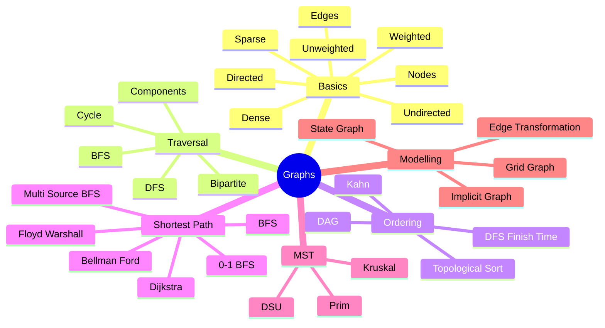

## Fast Algorithm Selection

| Situation | Use |
|---|---|
| Reachability / components | DFS or BFS |
| Shortest path, unweighted | BFS |
| Multiple starting points | Multi-source BFS |
| Edge weights only 0 and 1 | 0-1 BFS |
| Non-negative weights | Dijkstra |
| Negative edges, detect negative cycle | Bellman-Ford |
| All-pairs shortest path | Floyd-Warshall |
| Directed acyclic dependency order | Topological sort |
| Minimum connection cost | MST: Kruskal / Prim |

---

# 2. Core Terms with Diagrams

## Node and Edge

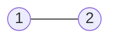

- `1` and `2` are vertices/nodes.
- `(1,2)` is an edge.

## Directed Graph

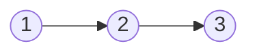

Edge has direction. You can travel only in arrow direction.

## Undirected Graph

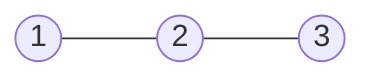

Edge can be used both ways.

## Weighted Graph

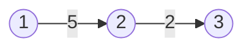

Each edge has cost/weight.

## Unweighted Graph


Every edge is treated as cost `1`.

## Path

A path is a sequence of vertices where every consecutive pair has an edge.

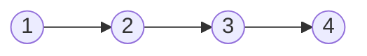

Path: `1 -> 2 -> 3 -> 4`

## Cycle

A cycle starts and ends at the same vertex.

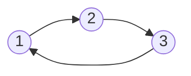

## DAG

DAG means **Directed Acyclic Graph**.

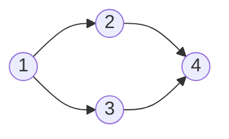

DAG is used in dependency problems, course schedule, build order, task ordering.

---

# 3. Graph Representation

## Edge List

Best when input gives edges and algorithm processes edges directly.

```cpp
vector<tuple<int,int,int>> edges; // u, v, weight
```

Example:

```text
n = 4, m = 3
1 2 5
2 3 7
3 4 1
```

Stored as:

```cpp
edges.push_back({1,2,5});
edges.push_back({2,3,7});
edges.push_back({3,4,1});
```

Useful for:

- Bellman-Ford
- Kruskal
- Sorting edges by weight

## Adjacency List

Best for DFS, BFS, Dijkstra, Prim.

```cpp
vector<vector<int>> g(n + 1);
```

Undirected:

```cpp
g[u].push_back(v);
g[v].push_back(u);
```

Directed:

```cpp
g[u].push_back(v);
```

Weighted:

```cpp
vector<vector<pair<int,int>>> g(n + 1); // neighbor, weight
g[u].push_back({v, w});
```

## Adjacency Matrix

Best for dense graph or Floyd-Warshall.

```cpp
vector<vector<long long>> dist(n, vector<long long>(n, INF));
```

Space: `O(n^2)`

---

# 4. Graph Input Templates

## Unweighted Undirected Graph

```cpp
int n, m;
cin >> n >> m;

vector<vector<int>> g(n + 1);

for (int i = 0; i < m; i++) {
    int u, v;
    cin >> u >> v;
    g[u].push_back(v);
    g[v].push_back(u);
}
```

## Unweighted Directed Graph

```cpp
int n, m;
cin >> n >> m;

vector<vector<int>> g(n + 1);

for (int i = 0; i < m; i++) {
    int u, v;
    cin >> u >> v;
    g[u].push_back(v);
}
```

## Weighted Directed Graph

```cpp
int n, m;
cin >> n >> m;

vector<vector<pair<int,int>>> g(n + 1);

for (int i = 0; i < m; i++) {
    int u, v, w;
    cin >> u >> v >> w;
    g[u].push_back({v, w});
}
```

---

# 5. DFS — Depth First Search

## Idea

DFS keeps going deeper until it cannot go further, then comes back.

```mermaid
flowchart TD
  A[Start node u] --> B[mark visited[u] = true]
  B --> C{Any unvisited neighbor v?}
  C -- yes --> D[DFS v]
  D --> C
  C -- no --> E[Return]
```

## C++ Template

```cpp
#include <bits/stdc++.h>
using namespace std;

int n, m;
vector<vector<int>> g;
vector<int> visited;

void dfs(int u) {
    visited[u] = 1;

    for (int v : g[u]) {
        if (!visited[v]) {
            dfs(v);
        }
    }
}

int main() {
    cin >> n >> m;
    g.assign(n + 1, {});

    for (int i = 0; i < m; i++) {
        int u, v;
        cin >> u >> v;
        g[u].push_back(v);
        g[v].push_back(u);
    }

    visited.assign(n + 1, 0);

    dfs(1);
}
```

## DFS Tree Dry Run

Graph:

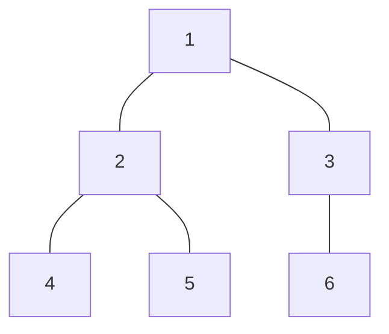

Adjacency:

```text
1: 2, 3
2: 1, 4, 5
3: 1, 6
4: 2
5: 2
6: 3
```

DFS from `1`:

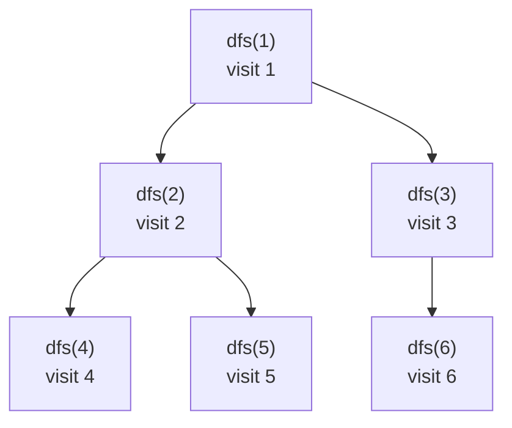

Index-by-index call trace:

| Step | Call | Action | Visited |
|---:|---|---|---|
| 1 | dfs(1) | mark 1 | {1} |
| 2 | dfs(2) | mark 2 | {1,2} |
| 3 | dfs(4) | mark 4, return | {1,2,4} |
| 4 | dfs(5) | mark 5, return | {1,2,4,5} |
| 5 | return to 1 | next neighbor 3 | {1,2,4,5} |
| 6 | dfs(3) | mark 3 | {1,2,3,4,5} |
| 7 | dfs(6) | mark 6, return | {1,2,3,4,5,6} |

Time complexity: `O(V + E)`

---

# 6. BFS — Breadth First Search

## Idea

BFS explores level by level. It is powerful for shortest path in unweighted graphs.

```mermaid
flowchart TD
  A[Push source into queue] --> B[dist[source] = 0]
  B --> C{Queue not empty?}
  C -- yes --> D[pop front node u]
  D --> E[Explore all neighbors v]
  E --> F{v unvisited?}
  F -- yes --> G[dist[v] = dist[u] + 1 and push v]
  F -- no --> C
  G --> C
  C -- no --> H[Done]
```

## C++ Template

```cpp
#include <bits/stdc++.h>
using namespace std;

int main() {
    int n, m;
    cin >> n >> m;

    vector<vector<int>> g(n + 1);

    for (int i = 0; i < m; i++) {
        int u, v;
        cin >> u >> v;
        g[u].push_back(v);
        g[v].push_back(u);
    }

    int src;
    cin >> src;

    vector<int> dist(n + 1, -1);
    queue<int> q;

    dist[src] = 0;
    q.push(src);

    while (!q.empty()) {
        int u = q.front();
        q.pop();

        for (int v : g[u]) {
            if (dist[v] == -1) {
                dist[v] = dist[u] + 1;
                q.push(v);
            }
        }
    }

    for (int i = 1; i <= n; i++) {
        cout << i << " " << dist[i] << "\n";
    }
}
```

## BFS Tree Dry Run

Graph:


BFS from `1`:


Index-by-index queue trace:

| Step | Queue Before | Pop | Newly Added | Distance Update |
|---:|---|---:|---|---|
| 1 | [1] | 1 | 2, 3 | d[2]=1, d[3]=1 |
| 2 | [2,3] | 2 | 4, 5 | d[4]=2, d[5]=2 |
| 3 | [3,4,5] | 3 | 6 | d[6]=2 |
| 4 | [4,5,6] | 4 | none | — |
| 5 | [5,6] | 5 | none | — |
| 6 | [6] | 6 | none | — |

---

# 7. Connected Components

## Problem Statement

Given an undirected graph, count how many connected components exist.

## Input

```text
6 3
1 2
2 3
4 5
```

## Output

```text
3
```

Components:

```text
{1,2,3}, {4,5}, {6}
```

## Diagram

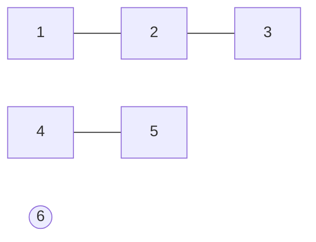

## C++ Code

```cpp
#include <bits/stdc++.h>
using namespace std;

vector<vector<int>> g;
vector<int> visited;

void dfs(int u) {
    visited[u] = 1;

    for (int v : g[u]) {
        if (!visited[v]) {
            dfs(v);
        }
    }
}

int main() {
    int n, m;
    cin >> n >> m;

    g.assign(n + 1, {});

    for (int i = 0; i < m; i++) {
        int u, v;
        cin >> u >> v;
        g[u].push_back(v);
        g[v].push_back(u);
    }

    visited.assign(n + 1, 0);

    int components = 0;

    for (int i = 1; i <= n; i++) {
        if (!visited[i]) {
            components++;
            dfs(i);
        }
    }

    cout << components << "\n";
}
```

## Tree Dry Run

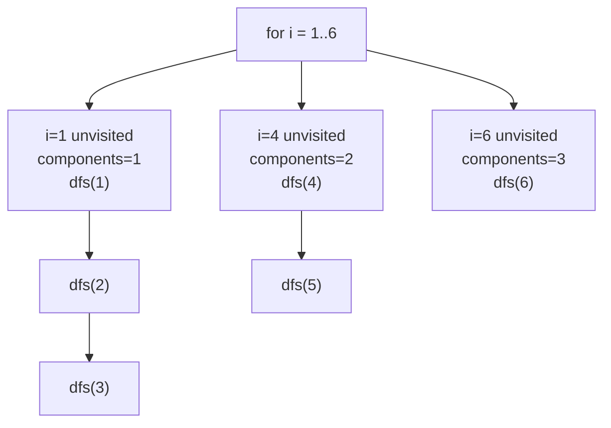

---

# 8. Bipartite Graph Check

## Idea

A graph is bipartite if we can color every node with two colors such that no adjacent nodes have the same color.

## Diagram

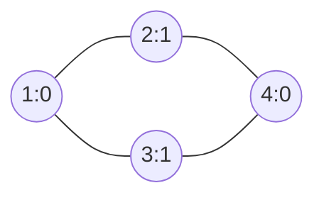

## C++ Code

```cpp
#include <bits/stdc++.h>
using namespace std;

bool isBipartite(int n, vector<vector<int>>& g) {
    vector<int> color(n + 1, -1);

    for (int start = 1; start <= n; start++) {
        if (color[start] != -1) continue;

        queue<int> q;
        color[start] = 0;
        q.push(start);

        while (!q.empty()) {
            int u = q.front();
            q.pop();

            for (int v : g[u]) {
                if (color[v] == -1) {
                    color[v] = color[u] ^ 1;
                    q.push(v);
                } else if (color[v] == color[u]) {
                    return false;
                }
            }
        }
    }

    return true;
}

int main() {
    int n, m;
    cin >> n >> m;

    vector<vector<int>> g(n + 1);

    for (int i = 0; i < m; i++) {
        int u, v;
        cin >> u >> v;
        g[u].push_back(v);
        g[v].push_back(u);
    }

    cout << (isBipartite(n, g) ? "YES" : "NO") << "\n";
}
```

---

# 9. Cycle Detection in Undirected Graph

## Key Idea

In undirected graph DFS, if we reach an already visited node which is **not the parent**, then a cycle exists.

## Diagram

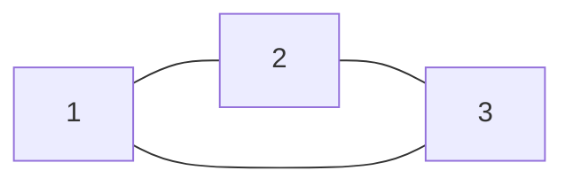

## C++ Code

```cpp
#include <bits/stdc++.h>
using namespace std;

vector<vector<int>> g;
vector<int> visited;

bool dfsCycle(int u, int parent) {
    visited[u] = 1;

    for (int v : g[u]) {
        if (!visited[v]) {
            if (dfsCycle(v, u)) return true;
        } else if (v != parent) {
            return true;
        }
    }

    return false;
}

int main() {
    int n, m;
    cin >> n >> m;

    g.assign(n + 1, {});

    for (int i = 0; i < m; i++) {
        int u, v;
        cin >> u >> v;
        g[u].push_back(v);
        g[v].push_back(u);
    }

    visited.assign(n + 1, 0);

    bool hasCycle = false;

    for (int i = 1; i <= n; i++) {
        if (!visited[i]) {
            if (dfsCycle(i, -1)) {
                hasCycle = true;
                break;
            }
        }
    }

    cout << (hasCycle ? "YES" : "NO") << "\n";
}
```

## Tree Dry Run

Input:

```text
3 3
1 2
2 3
3 1
```

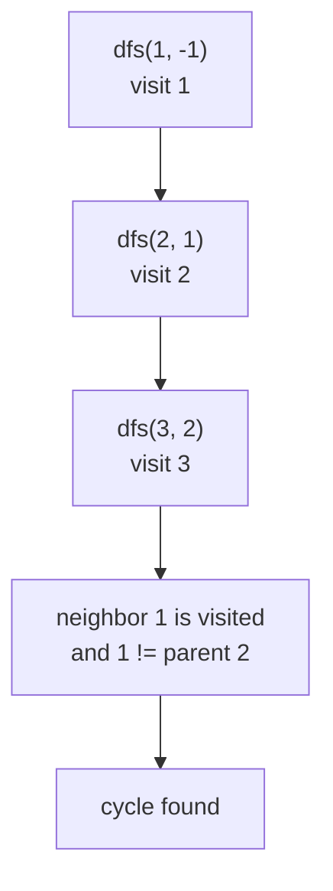

---

# 10. Cycle Detection in Directed Graph

## Key Idea

Use 3 states:

| State | Meaning |
|---:|---|
| 0 | unvisited |
| 1 | currently in recursion stack |
| 2 | fully processed |

If DFS reaches a node with state `1`, then there is a back edge and cycle exists.

## Diagram

```mermaid
graph LR
  1 --> 2
  2 --> 3
  3 --> 1
```

## C++ Code

```cpp
#include <bits/stdc++.h>
using namespace std;

vector<vector<int>> g;
vector<int> state;

bool dfsCycleDirected(int u) {
    state[u] = 1;

    for (int v : g[u]) {
        if (state[v] == 0) {
            if (dfsCycleDirected(v)) return true;
        } else if (state[v] == 1) {
            return true;
        }
    }

    state[u] = 2;
    return false;
}

int main() {
    int n, m;
    cin >> n >> m;

    g.assign(n + 1, {});

    for (int i = 0; i < m; i++) {
        int u, v;
        cin >> u >> v;
        g[u].push_back(v);
    }

    state.assign(n + 1, 0);

    bool hasCycle = false;

    for (int i = 1; i <= n; i++) {
        if (state[i] == 0) {
            if (dfsCycleDirected(i)) {
                hasCycle = true;
                break;
            }
        }
    }

    cout << (hasCycle ? "YES" : "NO") << "\n";
}
```

## Tree Dry Run

```mermaid
graph TD
  A["dfs(1)<br/>state[1]=1"] --> B["dfs(2)<br/>state[2]=1"]
  B --> C["dfs(3)<br/>state[3]=1"]
  C --> D["edge 3 -> 1"]
  D --> E["state[1] == 1<br/>cycle found"]
```

---

# 11. Topological Ordering — DFS Method

## Idea

In DAG, if `u -> v`, then `u` must come before `v`.

DFS method:

1. Run DFS.
2. Push node after all neighbors are processed.
3. Reverse the final vector.

## Diagram

```mermaid
graph LR
  1 --> 2
  1 --> 3
  2 --> 4
  3 --> 4
```

One valid topological order:

```text
1 3 2 4
```

Another valid order:

```text
1 2 3 4
```

## C++ Code

```cpp
#include <bits/stdc++.h>
using namespace std;

vector<vector<int>> g;
vector<int> visited;
vector<int> topo;

void dfs(int u) {
    visited[u] = 1;

    for (int v : g[u]) {
        if (!visited[v]) {
            dfs(v);
        }
    }

    topo.push_back(u);
}

int main() {
    int n, m;
    cin >> n >> m;

    g.assign(n + 1, {});

    for (int i = 0; i < m; i++) {
        int u, v;
        cin >> u >> v;
        g[u].push_back(v);
    }

    visited.assign(n + 1, 0);

    for (int i = 1; i <= n; i++) {
        if (!visited[i]) {
            dfs(i);
        }
    }

    reverse(topo.begin(), topo.end());

    for (int x : topo) cout << x << " ";
    cout << "\n";
}
```

## Tree Dry Run

```mermaid
graph TD
  A["dfs(1)"] --> B["dfs(2)"]
  B --> C["dfs(4)<br/>push 4"]
  B --> D["push 2"]
  A --> E["dfs(3)<br/>4 already visited<br/>push 3"]
  A --> F["push 1"]
  F --> G["topo before reverse: 4,2,3,1"]
  G --> H["after reverse: 1,3,2,4"]
```

---

# 12. Topological Ordering — Kahn Algorithm

## Idea

Kahn uses indegree:

1. Count indegree of every node.
2. Push all nodes with indegree `0`.
3. Pop a node, add to topo.
4. Remove its outgoing edges by decreasing indegree of neighbors.
5. If neighbor indegree becomes `0`, push it.

## C++ Code

```cpp
#include <bits/stdc++.h>
using namespace std;

int main() {
    int n, m;
    cin >> n >> m;

    vector<vector<int>> g(n + 1);
    vector<int> indeg(n + 1, 0);

    for (int i = 0; i < m; i++) {
        int u, v;
        cin >> u >> v;
        g[u].push_back(v);
        indeg[v]++;
    }

    queue<int> q;

    for (int i = 1; i <= n; i++) {
        if (indeg[i] == 0) q.push(i);
    }

    vector<int> topo;

    while (!q.empty()) {
        int u = q.front();
        q.pop();

        topo.push_back(u);

        for (int v : g[u]) {
            indeg[v]--;
            if (indeg[v] == 0) {
                q.push(v);
            }
        }
    }

    if ((int)topo.size() != n) {
        cout << "Cycle exists\n";
    } else {
        for (int x : topo) cout << x << " ";
        cout << "\n";
    }
}
```

## Queue Dry Run

Input:

```text
4 4
1 2
1 3
2 4
3 4
```

```mermaid
graph TD
  A["Initial indegree<br/>1:0, 2:1, 3:1, 4:2"] --> B["Queue = [1]"]
  B --> C["pop 1<br/>topo=[1]"]
  C --> D["decrease indegree 2 and 3<br/>both become 0"]
  D --> E["Queue=[2,3]"]
  E --> F["pop 2<br/>topo=[1,2]<br/>indegree[4]=1"]
  F --> G["pop 3<br/>topo=[1,2,3]<br/>indegree[4]=0"]
  G --> H["Queue=[4]"]
  H --> I["pop 4<br/>topo=[1,2,3,4]"]
```

---

# 13. Shortest Path Decision Map

```mermaid
flowchart TD
  A[Need shortest path?] --> B{Weighted?}
  B -- No --> C[BFS]
  B -- Yes --> D{Weights are only 0 and 1?}
  D -- Yes --> E[0-1 BFS]
  D -- No --> F{Any negative weight?}
  F -- No --> G[Dijkstra]
  F -- Yes --> H{Need detect negative cycle?}
  H -- Yes --> I[Bellman-Ford]
  H -- No --> J[Bellman-Ford]
  A --> K{All pairs?}
  K -- Yes --> L[Floyd-Warshall]
```

---

# 14. Unweighted Shortest Path — BFS

## Problem Statement

Given an unweighted graph and source `s`, find shortest distance from `s` to all nodes.

## C++ Code

```cpp
vector<int> shortestPathUnweighted(int n, vector<vector<int>>& g, int src) {
    vector<int> dist(n + 1, -1);
    queue<int> q;

    dist[src] = 0;
    q.push(src);

    while (!q.empty()) {
        int u = q.front();
        q.pop();

        for (int v : g[u]) {
            if (dist[v] == -1) {
                dist[v] = dist[u] + 1;
                q.push(v);
            }
        }
    }

    return dist;
}
```

## Tree Dry Run

```mermaid
graph TD
  A["src=1<br/>dist[1]=0"] --> B["level 1<br/>2,3"]
  B --> C["level 2<br/>4,5,6"]
```

---

# 15. Multi-Source BFS

## Idea

Start BFS from many sources at the same time.

Used for:

- nearest monster
- nearest hospital
- nearest zero/one in grid
- fire spread
- rotting oranges
- shortest escape path with multiple dangers

## Diagram

```mermaid
graph TD
  M1["Monster M1<br/>dist=0"] --> A["cell A<br/>dist=1"]
  M2["Monster M2<br/>dist=0"] --> B["cell B<br/>dist=1"]
  A --> C["cell C<br/>dist=2"]
  B --> C
```

## C++ Grid Template

```cpp
#include <bits/stdc++.h>
using namespace std;

const int INF = 1e9;
int dx[4] = {1, -1, 0, 0};
int dy[4] = {0, 0, 1, -1};

vector<vector<int>> multiSourceBFS(vector<string>& grid, vector<pair<int,int>> sources) {
    int n = grid.size();
    int m = grid[0].size();

    vector<vector<int>> dist(n, vector<int>(m, INF));
    queue<pair<int,int>> q;

    for (auto [x, y] : sources) {
        dist[x][y] = 0;
        q.push({x, y});
    }

    while (!q.empty()) {
        auto [x, y] = q.front();
        q.pop();

        for (int dir = 0; dir < 4; dir++) {
            int nx = x + dx[dir];
            int ny = y + dy[dir];

            if (nx < 0 || ny < 0 || nx >= n || ny >= m) continue;
            if (grid[nx][ny] == '#') continue;

            if (dist[nx][ny] > dist[x][y] + 1) {
                dist[nx][ny] = dist[x][y] + 1;
                q.push({nx, ny});
            }
        }
    }

    return dist;
}
```

## Tree Dry Run

Grid:

```text
M . .
. # .
. . M
```

```mermaid
graph TD
  A["Level 0<br/>(0,0), (2,2)"] --> B["Level 1<br/>(0,1), (1,0), (1,2), (2,1)"]
  B --> C["Level 2<br/>(0,2), (2,0)"]
```

---

# 16. 0-1 BFS

## Idea

If edge weights are only `0` and `1`, use deque:

- weight `0` edge: push front
- weight `1` edge: push back

This works like Dijkstra optimized for binary weights.

## C++ Code

```cpp
#include <bits/stdc++.h>
using namespace std;

const int INF = 1e9;

vector<int> zeroOneBFS(int n, vector<vector<pair<int,int>>>& g, int src) {
    vector<int> dist(n + 1, INF);
    deque<int> dq;

    dist[src] = 0;
    dq.push_front(src);

    while (!dq.empty()) {
        int u = dq.front();
        dq.pop_front();

        for (auto [v, w] : g[u]) {
            if (dist[v] > dist[u] + w) {
                dist[v] = dist[u] + w;

                if (w == 0) {
                    dq.push_front(v);
                } else {
                    dq.push_back(v);
                }
            }
        }
    }

    return dist;
}
```

## Dry Run

Graph:

```mermaid
graph LR
  1 -- 0 --> 2
  1 -- 1 --> 3
  2 -- 1 --> 4
  3 -- 0 --> 4
```

```mermaid
graph TD
  A["dq=[1], d[1]=0"] --> B["pop 1"]
  B --> C["edge 1->2 w=0<br/>d[2]=0<br/>push_front 2"]
  B --> D["edge 1->3 w=1<br/>d[3]=1<br/>push_back 3"]
  C --> E["dq=[2,3]"]
  E --> F["pop 2<br/>edge 2->4 w=1<br/>d[4]=1<br/>push_back 4"]
  F --> G["dq=[3,4]"]
  G --> H["pop 3<br/>edge 3->4 w=0<br/>d[4] remains 1"]
```

---

# 17. Dijkstra

## Use When

- Single-source shortest path
- Weighted graph
- No negative edge weights

## Idea

Always expand the currently known smallest distance.

## C++ Code

```cpp
#include <bits/stdc++.h>
using namespace std;

const long long INF = 4e18;

vector<long long> dijkstra(int n, vector<vector<pair<int,int>>>& g, int src) {
    vector<long long> dist(n + 1, INF);

    priority_queue<
        pair<long long,int>,
        vector<pair<long long,int>>,
        greater<pair<long long,int>>
    > pq;

    dist[src] = 0;
    pq.push({0, src});

    while (!pq.empty()) {
        auto [du, u] = pq.top();
        pq.pop();

        if (du != dist[u]) continue;

        for (auto [v, w] : g[u]) {
            if (dist[v] > dist[u] + w) {
                dist[v] = dist[u] + w;
                pq.push({dist[v], v});
            }
        }
    }

    return dist;
}
```

## Problem Statement

Given weighted graph and source, find shortest distance from source to all nodes.

## Input

```text
5 6
1 2 2
1 3 5
2 3 1
2 4 2
3 5 1
4 5 3
1
```

## Output

```text
0 2 3 4 4
```

## Tree Dry Run

```mermaid
graph TD
  A["pq={(0,1)}<br/>dist[1]=0"] --> B["pop 1"]
  B --> C["relax 1->2: d[2]=2"]
  B --> D["relax 1->3: d[3]=5"]
  C --> E["pq={(2,2),(5,3)}"]
  E --> F["pop 2"]
  F --> G["relax 2->3: d[3]=3"]
  F --> H["relax 2->4: d[4]=4"]
  G --> I["pq={(3,3),(5,3),(4,4)}"]
  I --> J["pop 3"]
  J --> K["relax 3->5: d[5]=4"]
```

Index-by-index table:

| Step | Pop | Relaxation | Distance Array |
|---:|---|---|---|
| 1 | 1 | d2=2, d3=5 | `[0,2,5,INF,INF]` |
| 2 | 2 | d3=3, d4=4 | `[0,2,3,4,INF]` |
| 3 | 3 | d5=4 | `[0,2,3,4,4]` |
| 4 | 4 | no improvement | `[0,2,3,4,4]` |
| 5 | 5 | done | `[0,2,3,4,4]` |

---

# 18. Bellman-Ford

## Use When

- Graph has negative edges.
- Need to detect negative cycle.
- Single-source shortest path.

## Idea

Relax all edges `n - 1` times.

Why `n - 1`?

A shortest simple path can contain at most `n - 1` edges.

## C++ Code

```cpp
#include <bits/stdc++.h>
using namespace std;

const long long INF = 4e18;

struct Edge {
    int u, v;
    long long w;
};

int main() {
    int n, m;
    cin >> n >> m;

    vector<Edge> edges;

    for (int i = 0; i < m; i++) {
        int u, v;
        long long w;
        cin >> u >> v >> w;
        edges.push_back({u, v, w});
    }

    int src;
    cin >> src;

    vector<long long> dist(n + 1, INF);
    dist[src] = 0;

    for (int i = 1; i <= n - 1; i++) {
        bool changed = false;

        for (auto e : edges) {
            if (dist[e.u] != INF && dist[e.v] > dist[e.u] + e.w) {
                dist[e.v] = dist[e.u] + e.w;
                changed = true;
            }
        }

        if (!changed) break;
    }

    bool negativeCycle = false;

    for (auto e : edges) {
        if (dist[e.u] != INF && dist[e.v] > dist[e.u] + e.w) {
            negativeCycle = true;
        }
    }

    if (negativeCycle) {
        cout << "Negative cycle exists\n";
    } else {
        for (int i = 1; i <= n; i++) {
            cout << dist[i] << " ";
        }
        cout << "\n";
    }
}
```

## Dry Run Tree

```mermaid
graph TD
  A["Iteration 1<br/>relax all edges"] --> B["some distances improve"]
  B --> C["Iteration 2<br/>relax all edges"]
  C --> D["some distances improve"]
  D --> E["... up to n-1 iterations"]
  E --> F["One extra pass"]
  F --> G{"Any relaxation possible?"}
  G -- yes --> H["Negative cycle"]
  G -- no --> I["Shortest distances final"]
```

---

# 19. Floyd-Warshall

## Use When

- Need all-pairs shortest path.
- `n` is small enough for `O(n^3)`.
- Can handle negative edges but not negative cycles.

## Core Formula

```text
dist[i][j] = min(dist[i][j], dist[i][k] + dist[k][j])
```

Meaning:

Should shortest path from `i` to `j` improve if we allow `k` as an intermediate node?

## C++ Code

```cpp
#include <bits/stdc++.h>
using namespace std;

const long long INF = 4e18;

int main() {
    int n, m;
    cin >> n >> m;

    vector<vector<long long>> dist(n + 1, vector<long long>(n + 1, INF));

    for (int i = 1; i <= n; i++) {
        dist[i][i] = 0;
    }

    for (int i = 0; i < m; i++) {
        int u, v;
        long long w;
        cin >> u >> v >> w;
        dist[u][v] = min(dist[u][v], w);
    }

    for (int k = 1; k <= n; k++) {
        for (int i = 1; i <= n; i++) {
            for (int j = 1; j <= n; j++) {
                if (dist[i][k] == INF || dist[k][j] == INF) continue;
                dist[i][j] = min(dist[i][j], dist[i][k] + dist[k][j]);
            }
        }
    }

    int q;
    cin >> q;

    while (q--) {
        int u, v;
        cin >> u >> v;

        if (dist[u][v] == INF) cout << -1 << "\n";
        else cout << dist[u][v] << "\n";
    }
}
```

## Tree Dry Run

```mermaid
graph TD
  A["k=1<br/>allow node 1 as intermediate"] --> B["update all i,j"]
  B --> C["k=2<br/>allow node 1,2 as intermediates"]
  C --> D["update all i,j"]
  D --> E["k=3<br/>allow node 1,2,3 as intermediates"]
  E --> F["final matrix"]
```

## Matrix Example

Initial:

| From/To | 1 | 2 | 3 |
|---|---:|---:|---:|
| 1 | 0 | 4 | INF |
| 2 | INF | 0 | 2 |
| 3 | 1 | INF | 0 |

When `k = 2`:

`dist[1][3] = min(INF, dist[1][2] + dist[2][3]) = 6`

---

# 20. Minimum Spanning Tree

## Definition

Given:

- `n` nodes
- `m` weighted edges

Choose exactly `n - 1` edges such that:

1. All nodes are connected.
2. Total edge weight is minimum.
3. No cycle is formed.

## Diagram

```mermaid
graph LR
  1 -- 1 --- 2
  1 -- 4 --- 3
  2 -- 2 --- 3
  2 -- 7 --- 4
  3 -- 3 --- 4
```

MST chooses:

```text
1-2 weight 1
2-3 weight 2
3-4 weight 3
Total = 6
```

---

# 21. Kruskal + DSU

## Idea

1. Sort edges by weight.
2. Pick smallest edge if it does not create cycle.
3. Use DSU to check cycle.
4. Stop when selected edges = `n - 1`.

## C++ Code

```cpp
#include <bits/stdc++.h>
using namespace std;

struct DSU {
    vector<int> parent, sz;

    DSU(int n) {
        parent.resize(n + 1);
        sz.assign(n + 1, 1);

        for (int i = 1; i <= n; i++) {
            parent[i] = i;
        }
    }

    int find(int x) {
        if (parent[x] == x) return x;
        return parent[x] = find(parent[x]);
    }

    bool unite(int a, int b) {
        a = find(a);
        b = find(b);

        if (a == b) return false;

        if (sz[a] < sz[b]) swap(a, b);

        parent[b] = a;
        sz[a] += sz[b];

        return true;
    }
};

struct Edge {
    int u, v;
    long long w;
};

int main() {
    int n, m;
    cin >> n >> m;

    vector<Edge> edges(m);

    for (auto &e : edges) {
        cin >> e.u >> e.v >> e.w;
    }

    sort(edges.begin(), edges.end(), [](Edge a, Edge b) {
        return a.w < b.w;
    });

    DSU dsu(n);

    long long mstCost = 0;
    vector<Edge> chosen;

    for (auto e : edges) {
        if (dsu.unite(e.u, e.v)) {
            mstCost += e.w;
            chosen.push_back(e);
        }
    }

    if ((int)chosen.size() != n - 1) {
        cout << "MST not possible\n";
    } else {
        cout << mstCost << "\n";
    }
}
```

## Tree Dry Run

Edges sorted:

```text
1-2:1
2-3:2
3-4:3
1-3:4
2-4:7
```

```mermaid
graph TD
  A["Start<br/>components: {1},{2},{3},{4}"] --> B["take 1-2 weight 1<br/>{1,2},{3},{4}"]
  B --> C["take 2-3 weight 2<br/>{1,2,3},{4}"]
  C --> D["take 3-4 weight 3<br/>{1,2,3,4}"]
  D --> E["chosen edges = n-1<br/>MST complete<br/>cost=6"]
```

---

# 22. Prim Algorithm

## Idea

Grow MST from a starting node.

At each step, choose minimum edge that connects visited set to unvisited node.

## C++ Code

```cpp
#include <bits/stdc++.h>
using namespace std;

long long primMST(int n, vector<vector<pair<int,int>>>& g) {
    vector<int> used(n + 1, 0);

    priority_queue<
        pair<int,int>,
        vector<pair<int,int>>,
        greater<pair<int,int>>
    > pq;

    pq.push({0, 1});

    long long cost = 0;
    int count = 0;

    while (!pq.empty()) {
        auto [w, u] = pq.top();
        pq.pop();

        if (used[u]) continue;

        used[u] = 1;
        cost += w;
        count++;

        for (auto [v, wt] : g[u]) {
            if (!used[v]) {
                pq.push({wt, v});
            }
        }
    }

    if (count != n) return -1;
    return cost;
}

int main() {
    int n, m;
    cin >> n >> m;

    vector<vector<pair<int,int>>> g(n + 1);

    for (int i = 0; i < m; i++) {
        int u, v, w;
        cin >> u >> v >> w;
        g[u].push_back({v, w});
        g[v].push_back({u, w});
    }

    cout << primMST(n, g) << "\n";
}
```

## Tree Dry Run

```mermaid
graph TD
  A["visited={1}<br/>pq has edges from 1"] --> B["pick smallest edge 1-2"]
  B --> C["visited={1,2}<br/>push edges from 2"]
  C --> D["pick smallest crossing edge 2-3"]
  D --> E["visited={1,2,3}"]
  E --> F["continue until all nodes visited"]
```

---

# 23. Graph Formulation Checklist

When problem statement does not directly say graph, extract graph yourself.

## Step 1 — What is a node?

Examples:

| Problem | Node |
|---|---|
| Grid shortest path | cell `(r,c)` |
| Word ladder | word |
| Lock combination | string/state |
| Course schedule | course |
| City road problem | city |
| DP + BFS state | `(position, mask)` |

## Step 2 — What is an edge?

Examples:

| Problem | Edge |
|---|---|
| Move up/down/left/right | neighboring cell |
| Change one character | word to word |
| Take prerequisite | course dependency |
| Break wall | state transition with cost |
| Teleport | special transition |

## Step 3 — What is edge cost?

| Cost Type | Algorithm |
|---|---|
| all cost 1 | BFS |
| cost 0/1 | 0-1 BFS |
| positive arbitrary cost | Dijkstra |
| negative cost | Bellman-Ford |
| all pairs | Floyd-Warshall |

## Step 4 — What is source?

| Source Type | Algorithm |
|---|---|
| one source | BFS / Dijkstra |
| many sources | Multi-source BFS / multi-source Dijkstra |
| all nodes | Floyd-Warshall or run single-source repeatedly |

## Step 5 — What is target?

- one target
- any boundary cell
- all nodes
- minimum among many candidate targets

---

# 24. Graph Modelling Ideas

## Grid as Graph

Each cell is node.

```mermaid
graph TD
  A["(0,0)"] --- B["(0,1)"]
  A --- C["(1,0)"]
  B --- D["(1,1)"]
  C --- D
```

## State Graph

Node can include extra state.

Example:

```text
(row, col, brokenWalls)
```

Used when you can break up to `k` walls.

## Edge Transformation

If one original edge has weight `w`, sometimes convert it into chain of `w` unit edges for BFS, but this can explode memory. Better use Dijkstra if weights are large.

## Complement Graph

Sometimes edges are not explicitly given. You may need to think:

```text
Can go to any node except blocked or already connected nodes.
```

Be careful: complete graph has `O(n^2)` edges.

---

# 25. Problem 1 — Number of Connected Components

## Problem Statement

Given `n` nodes and `m` undirected edges, find number of connected components.

## Input

```text
6 3
1 2
2 3
4 5
```

## Output

```text
3
```

## C++ Code

```cpp
#include <bits/stdc++.h>
using namespace std;

void dfs(int u, vector<vector<int>>& g, vector<int>& vis) {
    vis[u] = 1;

    for (int v : g[u]) {
        if (!vis[v]) dfs(v, g, vis);
    }
}

int main() {
    int n, m;
    cin >> n >> m;

    vector<vector<int>> g(n + 1);

    for (int i = 0; i < m; i++) {
        int u, v;
        cin >> u >> v;
        g[u].push_back(v);
        g[v].push_back(u);
    }

    vector<int> vis(n + 1, 0);

    int ans = 0;

    for (int i = 1; i <= n; i++) {
        if (!vis[i]) {
            ans++;
            dfs(i, g, vis);
        }
    }

    cout << ans << "\n";
}
```

## Index-by-Index Tree Dry Run

```mermaid
graph TD
  A["i=1<br/>unvisited<br/>ans=1"] --> B["dfs(1)"]
  B --> C["dfs(2)"]
  C --> D["dfs(3)"]
  A --> E["i=2 visited<br/>skip"]
  A --> F["i=3 visited<br/>skip"]
  A --> G["i=4 unvisited<br/>ans=2"]
  G --> H["dfs(4)"]
  H --> I["dfs(5)"]
  A --> J["i=6 unvisited<br/>ans=3"]
```

---

# 26. Problem 2 — Shortest Path in Unweighted Graph

## Problem Statement

Given unweighted graph and source `s`, print shortest distance from `s` to every node.

## Input

```text
6 5
1 2
1 3
2 4
2 5
3 6
1
```

## Output

```text
0 1 1 2 2 2
```

## C++ Code

```cpp
#include <bits/stdc++.h>
using namespace std;

int main() {
    int n, m;
    cin >> n >> m;

    vector<vector<int>> g(n + 1);

    for (int i = 0; i < m; i++) {
        int u, v;
        cin >> u >> v;
        g[u].push_back(v);
        g[v].push_back(u);
    }

    int src;
    cin >> src;

    vector<int> dist(n + 1, -1);
    queue<int> q;

    dist[src] = 0;
    q.push(src);

    while (!q.empty()) {
        int u = q.front();
        q.pop();

        for (int v : g[u]) {
            if (dist[v] == -1) {
                dist[v] = dist[u] + 1;
                q.push(v);
            }
        }
    }

    for (int i = 1; i <= n; i++) cout << dist[i] << " ";
}
```

## Tree Dry Run

```mermaid
graph TD
  A["Level 0<br/>1<br/>dist=0"] --> B["Level 1<br/>2<br/>dist=1"]
  A --> C["Level 1<br/>3<br/>dist=1"]
  B --> D["Level 2<br/>4<br/>dist=2"]
  B --> E["Level 2<br/>5<br/>dist=2"]
  C --> F["Level 2<br/>6<br/>dist=2"]
```

---

# 27. Problem 3 — Escape from Monsters

## Problem Statement

Given a grid with walls `#`, empty cells `.`, player `A`, and monsters `M`, determine if player can escape to boundary before any monster reaches that cell.

## Input

```text
5 5
#####
#A..#
#.M.#
#...#
####.
```

## Output

```text
YES
```

## Technique

1. Run multi-source BFS from all monsters to compute `monsterDist`.
2. Run BFS from player.
3. Player can move to `(x,y)` only if:

```text
playerDist[x][y] < monsterDist[x][y]
```

## C++ Code

```cpp
#include <bits/stdc++.h>
using namespace std;

const int INF = 1e9;
int dx[4] = {1, -1, 0, 0};
int dy[4] = {0, 0, 1, -1};

vector<vector<int>> bfs(vector<string>& grid, vector<pair<int,int>> src) {
    int n = grid.size(), m = grid[0].size();

    vector<vector<int>> dist(n, vector<int>(m, INF));
    queue<pair<int,int>> q;

    for (auto [x, y] : src) {
        dist[x][y] = 0;
        q.push({x, y});
    }

    while (!q.empty()) {
        auto [x, y] = q.front();
        q.pop();

        for (int d = 0; d < 4; d++) {
            int nx = x + dx[d];
            int ny = y + dy[d];

            if (nx < 0 || ny < 0 || nx >= n || ny >= m) continue;
            if (grid[nx][ny] == '#') continue;

            if (dist[nx][ny] > dist[x][y] + 1) {
                dist[nx][ny] = dist[x][y] + 1;
                q.push({nx, ny});
            }
        }
    }

    return dist;
}

int main() {
    int n, m;
    cin >> n >> m;

    vector<string> grid(n);
    for (auto &row : grid) cin >> row;

    pair<int,int> start;
    vector<pair<int,int>> monsters;

    for (int i = 0; i < n; i++) {
        for (int j = 0; j < m; j++) {
            if (grid[i][j] == 'A') start = {i, j};
            if (grid[i][j] == 'M') monsters.push_back({i, j});
        }
    }

    auto md = bfs(grid, monsters);

    vector<vector<int>> pd(n, vector<int>(m, INF));
    queue<pair<int,int>> q;

    pd[start.first][start.second] = 0;
    q.push(start);

    while (!q.empty()) {
        auto [x, y] = q.front();
        q.pop();

        if (x == 0 || y == 0 || x == n - 1 || y == m - 1) {
            if (pd[x][y] < md[x][y]) {
                cout << "YES\n";
                return 0;
            }
        }

        for (int d = 0; d < 4; d++) {
            int nx = x + dx[d];
            int ny = y + dy[d];

            if (nx < 0 || ny < 0 || nx >= n || ny >= m) continue;
            if (grid[nx][ny] == '#') continue;
            if (pd[nx][ny] != INF) continue;

            if (pd[x][y] + 1 < md[nx][ny]) {
                pd[nx][ny] = pd[x][y] + 1;
                q.push({nx, ny});
            }
        }
    }

    cout << "NO\n";
}
```

## Tree Dry Run

```mermaid
graph TD
  A["Step 1<br/>All monsters pushed into queue"] --> B["monsterDist built level by level"]
  B --> C["Step 2<br/>Player starts BFS"]
  C --> D{"Next cell safe?<br/>playerTime + 1 < monsterTime"}
  D -- yes --> E["move player"]
  D -- no --> F["block this move"]
  E --> G{"Reached boundary safely?"}
  G -- yes --> H["YES"]
  G -- no --> C
```

---

# 28. Problem 4 — Course Schedule

## Problem Statement

Given `n` courses and prerequisite edges `u -> v`, return if all courses can be completed.

This is cycle detection in directed graph. If cycle exists, impossible.

## Input

```text
4 3
1 2
2 3
3 4
```

## Output

```text
YES
```

## C++ Code — Kahn

```cpp
#include <bits/stdc++.h>
using namespace std;

int main() {
    int n, m;
    cin >> n >> m;

    vector<vector<int>> g(n + 1);
    vector<int> indeg(n + 1, 0);

    for (int i = 0; i < m; i++) {
        int u, v;
        cin >> u >> v;
        g[u].push_back(v);
        indeg[v]++;
    }

    queue<int> q;

    for (int i = 1; i <= n; i++) {
        if (indeg[i] == 0) q.push(i);
    }

    int taken = 0;

    while (!q.empty()) {
        int u = q.front();
        q.pop();
        taken++;

        for (int v : g[u]) {
            indeg[v]--;
            if (indeg[v] == 0) q.push(v);
        }
    }

    cout << (taken == n ? "YES" : "NO") << "\n";
}
```

## Tree Dry Run

```mermaid
graph TD
  A["indegree zero nodes enter queue"] --> B["take course u"]
  B --> C["remove outgoing edges"]
  C --> D["new zero indegree courses enter queue"]
  D --> E{"taken == n?"}
  E -- yes --> F["YES"]
  E -- no --> G["NO cycle exists"]
```

---

# 29. Problem 5 — Network Delay

## Problem Statement

Given directed weighted edges and starting node `k`, find time for signal to reach all nodes.

## Input

```text
4 3
2 1 1
2 3 1
3 4 1
2
```

## Output

```text
2
```

## C++ Code

```cpp
#include <bits/stdc++.h>
using namespace std;

const long long INF = 4e18;

int main() {
    int n, m;
    cin >> n >> m;

    vector<vector<pair<int,int>>> g(n + 1);

    for (int i = 0; i < m; i++) {
        int u, v, w;
        cin >> u >> v >> w;
        g[u].push_back({v, w});
    }

    int k;
    cin >> k;

    vector<long long> dist(n + 1, INF);

    priority_queue<
        pair<long long,int>,
        vector<pair<long long,int>>,
        greater<pair<long long,int>>
    > pq;

    dist[k] = 0;
    pq.push({0, k});

    while (!pq.empty()) {
        auto [du, u] = pq.top();
        pq.pop();

        if (du != dist[u]) continue;

        for (auto [v, w] : g[u]) {
            if (dist[v] > dist[u] + w) {
                dist[v] = dist[u] + w;
                pq.push({dist[v], v});
            }
        }
    }

    long long ans = 0;

    for (int i = 1; i <= n; i++) {
        if (dist[i] == INF) {
            cout << -1 << "\n";
            return 0;
        }
        ans = max(ans, dist[i]);
    }

    cout << ans << "\n";
}
```

## Tree Dry Run

```mermaid
graph TD
  A["start k=2<br/>dist[2]=0"] --> B["pop 2"]
  B --> C["relax 2->1<br/>d1=1"]
  B --> D["relax 2->3<br/>d3=1"]
  D --> E["pop 3"]
  E --> F["relax 3->4<br/>d4=2"]
  F --> G["answer=max distance=2"]
```

---

# 30. Problem 6 — Cheapest Path with 0/1 Edges

## Problem Statement

Given graph where edge weights are only `0` and `1`, find shortest path from source to all nodes.

## Input

```text
4 4
1 2 0
1 3 1
2 4 1
3 4 0
1
```

## Output

```text
0 0 1 1
```

## C++ Code

```cpp
#include <bits/stdc++.h>
using namespace std;

const int INF = 1e9;

int main() {
    int n, m;
    cin >> n >> m;

    vector<vector<pair<int,int>>> g(n + 1);

    for (int i = 0; i < m; i++) {
        int u, v, w;
        cin >> u >> v >> w;
        g[u].push_back({v, w});
    }

    int src;
    cin >> src;

    vector<int> dist(n + 1, INF);
    deque<int> dq;

    dist[src] = 0;
    dq.push_front(src);

    while (!dq.empty()) {
        int u = dq.front();
        dq.pop_front();

        for (auto [v, w] : g[u]) {
            if (dist[v] > dist[u] + w) {
                dist[v] = dist[u] + w;

                if (w == 0) dq.push_front(v);
                else dq.push_back(v);
            }
        }
    }

    for (int i = 1; i <= n; i++) cout << dist[i] << " ";
}
```

## Tree Dry Run

```mermaid
graph TD
  A["dq=[1]"] --> B["pop 1"]
  B --> C["1->2 w=0<br/>push_front 2"]
  B --> D["1->3 w=1<br/>push_back 3"]
  C --> E["dq=[2,3]"]
  E --> F["pop 2"]
  F --> G["2->4 w=1<br/>push_back 4"]
```

---

# 31. Problem 7 — Negative Cycle Detection

## Problem Statement

Given weighted directed graph, detect whether a negative cycle is reachable from source.

## Input

```text
3 3
1 2 1
2 3 -1
3 1 -1
1
```

## Output

```text
YES
```

## C++ Code

```cpp
#include <bits/stdc++.h>
using namespace std;

const long long INF = 4e18;

struct Edge {
    int u, v;
    long long w;
};

int main() {
    int n, m;
    cin >> n >> m;

    vector<Edge> edges(m);

    for (auto &e : edges) {
        cin >> e.u >> e.v >> e.w;
    }

    int src;
    cin >> src;

    vector<long long> dist(n + 1, INF);
    dist[src] = 0;

    for (int i = 1; i <= n - 1; i++) {
        for (auto e : edges) {
            if (dist[e.u] != INF && dist[e.v] > dist[e.u] + e.w) {
                dist[e.v] = dist[e.u] + e.w;
            }
        }
    }

    bool hasNegativeCycle = false;

    for (auto e : edges) {
        if (dist[e.u] != INF && dist[e.v] > dist[e.u] + e.w) {
            hasNegativeCycle = true;
        }
    }

    cout << (hasNegativeCycle ? "YES" : "NO") << "\n";
}
```

## Tree Dry Run

```mermaid
graph TD
  A["After n-1 relaxations"] --> B["Run one more relaxation"]
  B --> C{"Can any dist improve?"}
  C -- yes --> D["Negative cycle exists"]
  C -- no --> E["No negative cycle"]
```

---

# 32. Problem 8 — All Pairs Shortest Path

## Problem Statement

Given weighted directed graph and queries `(u,v)`, answer shortest path from `u` to `v`.

## Input

```text
3 3
1 2 4
2 3 2
1 3 10
2
1 3
3 1
```

## Output

```text
6
-1
```

## C++ Code

```cpp
#include <bits/stdc++.h>
using namespace std;

const long long INF = 4e18;

int main() {
    int n, m;
    cin >> n >> m;

    vector<vector<long long>> dist(n + 1, vector<long long>(n + 1, INF));

    for (int i = 1; i <= n; i++) dist[i][i] = 0;

    for (int i = 0; i < m; i++) {
        int u, v;
        long long w;
        cin >> u >> v >> w;
        dist[u][v] = min(dist[u][v], w);
    }

    for (int k = 1; k <= n; k++) {
        for (int i = 1; i <= n; i++) {
            for (int j = 1; j <= n; j++) {
                if (dist[i][k] == INF || dist[k][j] == INF) continue;
                dist[i][j] = min(dist[i][j], dist[i][k] + dist[k][j]);
            }
        }
    }

    int q;
    cin >> q;

    while (q--) {
        int u, v;
        cin >> u >> v;

        if (dist[u][v] == INF) cout << -1 << "\n";
        else cout << dist[u][v] << "\n";
    }
}
```

## Tree Dry Run

```mermaid
graph TD
  A["k=1<br/>allow 1 as middle"] --> B["k=2<br/>allow 2 as middle"]
  B --> C["dist[1][3] = min(10, dist[1][2]+dist[2][3])"]
  C --> D["dist[1][3] = 6"]
  D --> E["k=3<br/>finish"]
```

---

# 33. Problem 9 — Minimum Cost to Connect Cities

## Problem Statement

Given `n` cities and weighted undirected edges, connect all cities with minimum total cost.

## Input

```text
4 5
1 2 1
1 3 4
2 3 2
2 4 7
3 4 3
```

## Output

```text
6
```

## C++ Code — Kruskal

```cpp
#include <bits/stdc++.h>
using namespace std;

struct DSU {
    vector<int> p, sz;

    DSU(int n) {
        p.resize(n + 1);
        sz.assign(n + 1, 1);
        iota(p.begin(), p.end(), 0);
    }

    int find(int x) {
        if (p[x] == x) return x;
        return p[x] = find(p[x]);
    }

    bool unite(int a, int b) {
        a = find(a);
        b = find(b);

        if (a == b) return false;

        if (sz[a] < sz[b]) swap(a, b);
        p[b] = a;
        sz[a] += sz[b];

        return true;
    }
};

struct Edge {
    int u, v;
    long long w;
};

int main() {
    int n, m;
    cin >> n >> m;

    vector<Edge> edges(m);

    for (auto &e : edges) {
        cin >> e.u >> e.v >> e.w;
    }

    sort(edges.begin(), edges.end(), [](Edge a, Edge b) {
        return a.w < b.w;
    });

    DSU dsu(n);
    long long cost = 0;
    int used = 0;

    for (auto e : edges) {
        if (dsu.unite(e.u, e.v)) {
            cost += e.w;
            used++;
        }
    }

    if (used != n - 1) cout << -1 << "\n";
    else cout << cost << "\n";
}
```

## Tree Dry Run

```mermaid
graph TD
  A["sort edges"] --> B["take 1-2 cost 1"]
  B --> C["take 2-3 cost 2"]
  C --> D["take 3-4 cost 3"]
  D --> E["used edges = 3 = n-1"]
  E --> F["answer = 6"]
```

---

# Final Revision Sheet

## Algorithm Complexity

| Algorithm | Time | Space | Main Use |
|---|---:|---:|---|
| DFS | `O(V+E)` | `O(V)` | reachability/components |
| BFS | `O(V+E)` | `O(V)` | unweighted shortest path |
| Multi-source BFS | `O(V+E)` | `O(V)` | nearest source/spread |
| 0-1 BFS | `O(V+E)` | `O(V)` | 0/1 weighted edges |
| Dijkstra | `O((V+E)logV)` | `O(V+E)` | non-negative weights |
| Bellman-Ford | `O(VE)` | `O(V)` | negative edges/cycle |
| Floyd-Warshall | `O(V^3)` | `O(V^2)` | all-pairs shortest path |
| Topo DFS | `O(V+E)` | `O(V)` | DAG ordering |
| Kahn | `O(V+E)` | `O(V)` | DAG ordering/cycle |
| Kruskal | `O(ElogE)` | `O(V)` | MST |
| Prim | `O(ElogV)` | `O(V+E)` | MST |

## Memory Decision

| Graph Type | Representation |
|---|---|
| Sparse graph | adjacency list |
| Dense graph | adjacency matrix |
| Edge sorting needed | edge list |
| Grid | implicit graph |
| All-pairs | matrix |
| Kruskal | edge list |
| Dijkstra | weighted adjacency list |

## Interview Pattern Recognition

| Keywords in Problem | Think |
|---|---|
| minimum moves | BFS |
| nearest source | multi-source BFS |
| can complete all tasks | topo/cycle |
| prerequisite | DAG/topo |
| road cost | Dijkstra/MST |
| connect all nodes minimum cost | MST |
| negative edge | Bellman-Ford |
| all pair queries | Floyd-Warshall |
| grid escape | BFS + safety condition |
| only 0/1 cost | 0-1 BFS |
| dependency ordering | topological sort |

---

# Graph Template Pack

## DFS Template

```cpp
void dfs(int u) {
    vis[u] = 1;
    for (int v : g[u]) {
        if (!vis[v]) dfs(v);
    }
}
```

## BFS Template

```cpp
queue<int> q;
dist[src] = 0;
q.push(src);

while (!q.empty()) {
    int u = q.front();
    q.pop();

    for (int v : g[u]) {
        if (dist[v] == -1) {
            dist[v] = dist[u] + 1;
            q.push(v);
        }
    }
}
```

## Dijkstra Template

```cpp
priority_queue<pair<long long,int>, vector<pair<long long,int>>, greater<pair<long long,int>>> pq;
dist[src] = 0;
pq.push({0, src});

while (!pq.empty()) {
    auto [du, u] = pq.top();
    pq.pop();

    if (du != dist[u]) continue;

    for (auto [v, w] : g[u]) {
        if (dist[v] > dist[u] + w) {
            dist[v] = dist[u] + w;
            pq.push({dist[v], v});
        }
    }
}
```

## Topo Kahn Template

```cpp
queue<int> q;

for (int i = 1; i <= n; i++) {
    if (indeg[i] == 0) q.push(i);
}

while (!q.empty()) {
    int u = q.front();
    q.pop();

    topo.push_back(u);

    for (int v : g[u]) {
        indeg[v]--;
        if (indeg[v] == 0) q.push(v);
    }
}
```

## DSU Template

```cpp
struct DSU {
    vector<int> p, sz;

    DSU(int n) {
        p.resize(n + 1);
        sz.assign(n + 1, 1);
        iota(p.begin(), p.end(), 0);
    }

    int find(int x) {
        if (p[x] == x) return x;
        return p[x] = find(p[x]);
    }

    bool unite(int a, int b) {
        a = find(a);
        b = find(b);

        if (a == b) return false;

        if (sz[a] < sz[b]) swap(a, b);
        p[b] = a;
        sz[a] += sz[b];

        return true;
    }
};
```

---

# One-Page Graph Algorithm Decision Tree

```mermaid
flowchart TD
  A[Read problem] --> B{Can model as graph?}
  B -- Grid / State / City / Course / Word --> C[Define node and edge]
  C --> D{Need reachability only?}
  D -- yes --> E[DFS/BFS]
  D -- no --> F{Need shortest path?}
  F -- unweighted --> G[BFS]
  F -- many sources --> H[Multi-source BFS]
  F -- 0/1 weight --> I[0-1 BFS]
  F -- positive weight --> J[Dijkstra]
  F -- negative edge --> K[Bellman-Ford]
  F -- all pairs --> L[Floyd-Warshall]
  C --> M{Need ordering?}
  M -- yes --> N[Topological Sort]
  C --> O{Need connect all nodes with min cost?}
  O -- yes --> P[MST Kruskal/Prim]
```
