# 009_TREE_CP_DSA_MASTER_NOTE

> CP + DSA tree notes created from your Tree Application notes, Binary Lifting notes, and Tree/Union-Find reference.  
> Style: clickable index → problem statement → input/output → example → idea → Mermaid diagram → C++ code → index-by-index dry run.

---

## Clickable Index

### Part 0 — Master Map
- [0.1 Tree Recognition Map](#01-tree-recognition-map)
- [0.2 Which Tree Technique To Use?](#02-which-tree-technique-to-use)

### Part 1 — Tree Basics
- [1. What Is A Tree?](#1-what-is-a-tree)
- [2. Rooted vs Unrooted Tree](#2-rooted-vs-unrooted-tree)
- [3. Build Parent, Depth, Leaf, Child Count, Subtree Size](#3-build-parent-depth-leaf-child-count-subtree-size)

### Part 2 — Core DFS Problems
- [4. Problem 1: Compute Tree Properties](#4-problem-1-compute-tree-properties)
- [5. Problem 2: Print Path From u To v](#5-problem-2-print-path-from-u-to-v)
- [6. Problem 3: Tree Diameter](#6-problem-3-tree-diameter)
- [7. Problem 4: Center Of Tree](#7-problem-4-center-of-tree)
- [8. Problem 5: Centroid Of Tree](#8-problem-5-centroid-of-tree)
- [9. Problem 6: Sum Of All Pair Distances](#9-problem-6-sum-of-all-pair-distances)

### Part 3 — Binary Lifting + LCA
- [10. Binary Lifting Framework](#10-binary-lifting-framework)
- [11. Problem 7: K-th Ancestor](#11-problem-7-k-th-ancestor)
- [12. Problem 8: LCA Using Binary Lifting](#12-problem-8-lca-using-binary-lifting)
- [13. Problem 9: Distance Between Two Nodes](#13-problem-9-distance-between-two-nodes)
- [14. Problem 10: LCA With Dynamic Root](#14-problem-10-lca-with-dynamic-root)

### Part 4 — Prefix / Difference On Tree
- [15. Problem 11: Path XOR Query](#15-problem-11-path-xor-query)
- [16. Problem 12: Path Update And Point Query](#16-problem-12-path-update-and-point-query)

### Part 5 — Path Aggregates With Binary Lifting
- [17. Binary Lifting Aggregate Framework](#17-binary-lifting-aggregate-framework)
- [18. Problem 13: Path GCD Query](#18-problem-13-path-gcd-query)
- [19. Problem 14: Path Minimum Edge Query](#19-problem-14-path-minimum-edge-query)

### Part 6 — DSU / Union Find For Tree-Like Connectivity
- [20. Problem 15: Detect Cycle Using DSU](#20-problem-15-detect-cycle-using-dsu)
- [21. Final CP/DSA Tree Checklist](#21-final-cpdsa-tree-checklist)

---

# Part 0 — Master Map

## 0.1 Tree Recognition Map

A tree is not just a graph. In CP/DSA, tree usually means:

```text
N nodes
N - 1 edges
Connected
No cycle
Exactly one simple path between any two nodes
```

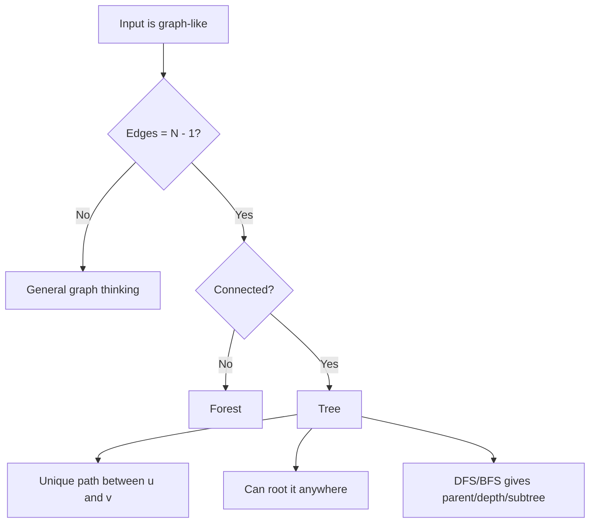

### Mental trigger

```text
Unique path?      -> Tree path / LCA
Subtree?          -> Root the tree
Many u-v queries? -> LCA / Binary lifting
Path updates?     -> Difference on tree
Balance node?     -> Centroid
Longest path?     -> Diameter
```

---

## 0.2 Which Tree Technique To Use?

```mermaid
flowchart TD
    A[Tree Problem] --> B{What is asked?}

    B --> C[Parent / depth / subtree]
    C --> C1[One DFS]

    B --> D[Path u to v]
    D --> D1[DFS once if one query]
    D --> D2[LCA if many queries]

    B --> E[Distance u-v]
    E --> E1[depth[u]+depth[v]-2*depth[lca]]

    B --> F[K-th ancestor]
    F --> F1[Binary lifting]

    B --> G[Path sum/xor]
    G --> G1[Prefix from root]

    B --> H[Path update]
    H --> H1[Tree difference + postorder]

    B --> I[Path min/gcd/max]
    I --> I1[Binary lifting aggregate]

    B --> J[Longest path]
    J --> J1[Diameter using 2 BFS/DFS]

    B --> K[Balanced root]
    K --> K1[Centroid]
```

---

# Part 1 — Tree Basics

## 1. What Is A Tree?

### Concept

A tree is a connected acyclic graph. The most important CP observation:

```text
Between any two nodes u and v, there is exactly one simple path.
```

### Example

```text
n = 7
edges:
1 2
1 3
2 4
2 5
3 6
3 7
```

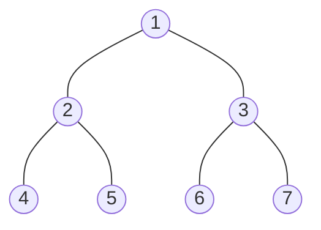

### Why this matters

For general graph, shortest path may need BFS/Dijkstra.  
For tree, the path is unique, so many problems become DFS + parent/depth/subtree.

---

## 2. Rooted vs Unrooted Tree

### Unrooted Tree

No parent-child relation.

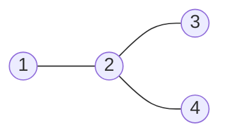

### Rooted Tree

Choose a root, usually `1` unless problem says otherwise.

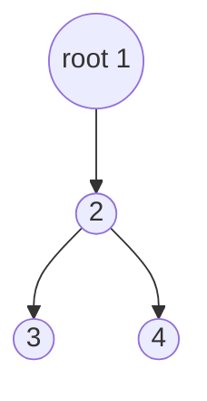

### Rooting creates these values

| Value | Meaning |
|---|---|
| `parent[u]` | node before `u` toward root |
| `depth[u]` | distance from root |
| `subtree[u]` | number of nodes inside subtree of `u` |
| `children[u]` | neighbors excluding parent |
| `leaf[u]` | no child after rooting |

### CP rule

```text
If problem mentions subtree, ancestor, descendant, parent, depth, root the tree first.
```

---

## 3. Build Parent, Depth, Leaf, Child Count, Subtree Size

### Generic C++ Template

```cpp
#include <bits/stdc++.h>
using namespace std;

int n;
vector<vector<int>> g;
vector<int> parentNode, depthNode, subtreeSize, childCount, isLeaf;

void dfsBuild(int u, int p) {
    parentNode[u] = p;
    subtreeSize[u] = 1;
    childCount[u] = 0;

    for (int v : g[u]) {
        if (v == p) continue;

        depthNode[v] = depthNode[u] + 1;
        childCount[u]++;

        dfsBuild(v, u);

        subtreeSize[u] += subtreeSize[v];
    }

    isLeaf[u] = (childCount[u] == 0);
}

int main() {
    cin >> n;
    g.assign(n + 1, {});

    for (int i = 0; i < n - 1; i++) {
        int u, v;
        cin >> u >> v;
        g[u].push_back(v);
        g[v].push_back(u);
    }

    parentNode.assign(n + 1, 0);
    depthNode.assign(n + 1, 0);
    subtreeSize.assign(n + 1, 0);
    childCount.assign(n + 1, 0);
    isLeaf.assign(n + 1, 0);

    dfsBuild(1, 0);

    for (int i = 1; i <= n; i++) {
        cout << i << " parent=" << parentNode[i]
             << " depth=" << depthNode[i]
             << " subtree=" << subtreeSize[i]
             << " child=" << childCount[i]
             << " leaf=" << isLeaf[i] << "\n";
    }
}
```

---

# Part 2 — Core DFS Problems

## 4. Problem 1: Compute Tree Properties

### Problem Statement

Given an undirected tree with `n` nodes, root it at node `1`. For every node, compute:

```text
parent[u]
depth[u]
subtreeSize[u]
childCount[u]
isLeaf[u]
```

### Input

```text
7
1 2
1 3
2 4
2 5
3 6
3 7
```

### Output

```text
node parent depth subtree child leaf
1    0      0     7       2     0
2    1      1     3       2     0
3    1      1     3       2     0
4    2      2     1       0     1
5    2      2     1       0     1
6    3      2     1       0     1
7    3      2     1       0     1
```

### How It Works

DFS goes downward to children, then returns subtree information upward.

```mermaid
flowchart TD
    A[Enter node u] --> B[Set parent[u] = p]
    B --> C[Set subtree[u] = 1]
    C --> D[Visit every child v]
    D --> E[depth[v] = depth[u] + 1]
    E --> F[DFS child v]
    F --> G[subtree[u] += subtree[v]]
    G --> H[After all children, leaf if childCount = 0]
```

### Index-by-Index Dry Run

Tree:

```text
        1
      /   \
     2     3
    / \   / \
   4   5 6   7
```

DFS timeline:

```text
index 0: enter 1, subtree[1]=1
index 1: go 1 -> 2, parent[2]=1, depth[2]=1
index 2: go 2 -> 4, parent[4]=2, depth[4]=2
index 3: 4 has no child, subtree[4]=1, leaf[4]=1
index 4: return to 2, subtree[2]=1+subtree[4]=2
index 5: go 2 -> 5, parent[5]=2, depth[5]=2
index 6: 5 leaf, subtree[5]=1
index 7: return to 2, subtree[2]=2+1=3
index 8: return to 1, subtree[1]=1+3=4
index 9: go 1 -> 3
index 10: visit 6 and 7 similarly, subtree[3]=3
index 11: return to 1, subtree[1]=4+3=7
```

---

## 5. Problem 2: Print Path From u To v

### Problem Statement

Given a tree and two nodes `u` and `v`, print the unique path from `u` to `v`.

### Input

```text
7
1 2
1 3
2 4
2 5
3 6
3 7
4 7
```

### Output

```text
4 2 1 3 7
```

### Idea

Because a tree has exactly one path between two nodes, DFS from `u` until `v`. Maintain a `path` vector.

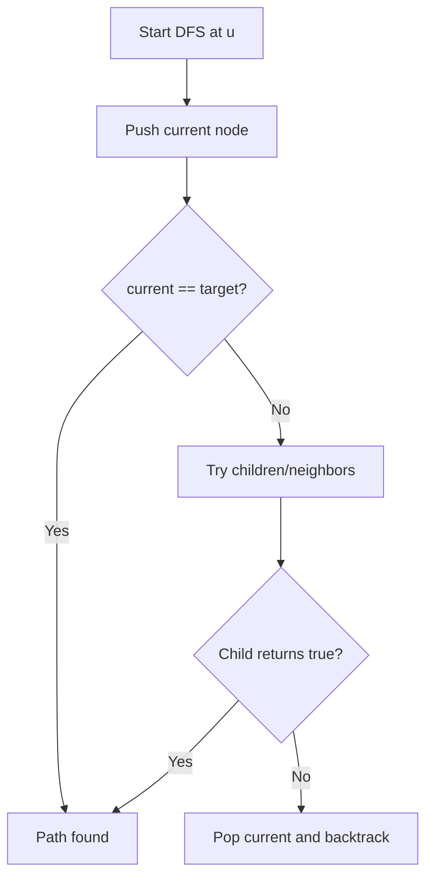

### C++ Code

```cpp
#include <bits/stdc++.h>
using namespace std;

int n, src, target;
vector<vector<int>> g;
vector<int> path;

bool dfsPath(int u, int p) {
    path.push_back(u);

    if (u == target) return true;

    for (int v : g[u]) {
        if (v == p) continue;
        if (dfsPath(v, u)) return true;
    }

    path.pop_back();
    return false;
}

int main() {
    cin >> n;
    g.assign(n + 1, {});

    for (int i = 0; i < n - 1; i++) {
        int u, v;
        cin >> u >> v;
        g[u].push_back(v);
        g[v].push_back(u);
    }

    cin >> src >> target;
    dfsPath(src, 0);

    for (int x : path) cout << x << " ";
    cout << "\n";
}
```

### Index-by-Index Dry Run

Query: path `4 -> 7`

```text
index 0: path = [4]
index 1: from 4 go to 2, path = [4, 2]
index 2: from 2 go to 1, path = [4, 2, 1]
index 3: from 1 go to 3, path = [4, 2, 1, 3]
index 4: from 3 go to 7, path = [4, 2, 1, 3, 7]
index 5: current == target, return true all the way
```

---

## 6. Problem 3: Tree Diameter

### Problem Statement

Given a tree, find its diameter length.

Diameter means:

```text
Longest shortest path between any two nodes.
```

### Input

```text
7
1 2
2 3
3 4
2 5
5 6
6 7
```

### Output

```text
5
```

One diameter path is:

```text
4 -> 3 -> 2 -> 5 -> 6 -> 7
```

Length = 5 edges.

### Idea

Use 2 BFS/DFS:

```text
1. Pick any node x.
2. Find farthest node y from x.
3. Find farthest node z from y.
4. dist(y,z) is diameter.
```

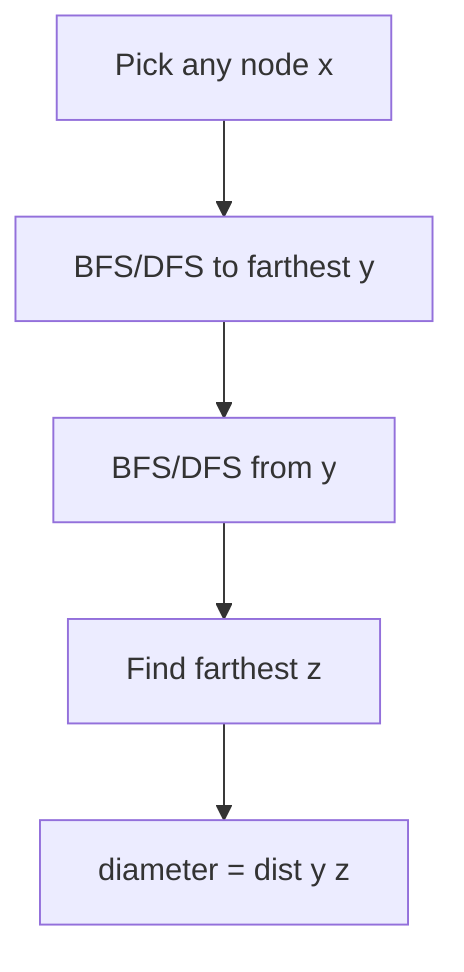

### C++ Code

```cpp
#include <bits/stdc++.h>
using namespace std;

int n;
vector<vector<int>> g;

pair<int,int> farthest(int src) {
    vector<int> dist(n + 1, -1);
    queue<int> q;

    dist[src] = 0;
    q.push(src);

    while (!q.empty()) {
        int u = q.front();
        q.pop();

        for (int v : g[u]) {
            if (dist[v] == -1) {
                dist[v] = dist[u] + 1;
                q.push(v);
            }
        }
    }

    int node = src;
    for (int i = 1; i <= n; i++) {
        if (dist[i] > dist[node]) node = i;
    }

    return {node, dist[node]};
}

int main() {
    cin >> n;
    g.assign(n + 1, {});

    for (int i = 0; i < n - 1; i++) {
        int u, v;
        cin >> u >> v;
        g[u].push_back(v);
        g[v].push_back(u);
    }

    auto [y, d1] = farthest(1);
    auto [z, diameter] = farthest(y);

    cout << diameter << "\n";
}
```

### Index-by-Index Dry Run

```text
Tree edges:
1-2, 2-3, 3-4, 2-5, 5-6, 6-7
```

First BFS from `1`:

```text
index 0: dist[1]=0
index 1: visit 2, dist[2]=1
index 2: visit 3 and 5, dist=2
index 3: visit 4 and 6, dist=3
index 4: visit 7, dist[7]=4
farthest y = 7
```

Second BFS from `7`:

```text
index 0: dist[7]=0
index 1: visit 6, dist[6]=1
index 2: visit 5, dist[5]=2
index 3: visit 2, dist[2]=3
index 4: visit 1 and 3, dist=4
index 5: visit 4, dist[4]=5
farthest z = 4
answer = 5
```

---

## 7. Problem 4: Center Of Tree

### Problem Statement

Given a tree, find its center node(s).

Center means:

```text
Middle of any diameter path.
```

A tree can have:

```text
1 center if diameter length is even
2 centers if diameter length is odd
```

### Input

```text
6
1 2
2 3
3 4
4 5
5 6
```

### Output

```text
3 4
```

### Idea

Find a diameter path. The center is the middle node or middle two nodes.

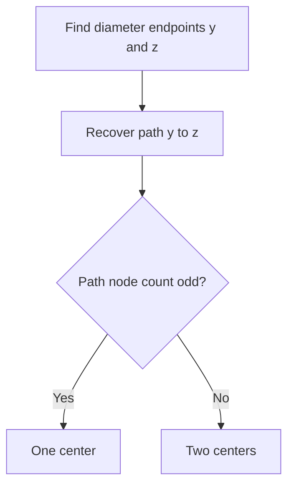

### C++ Code

```cpp
#include <bits/stdc++.h>
using namespace std;

int n;
vector<vector<int>> g;

pair<int, vector<int>> bfsParent(int src) {
    vector<int> dist(n + 1, -1), par(n + 1, 0);
    queue<int> q;
    dist[src] = 0;
    q.push(src);

    while (!q.empty()) {
        int u = q.front();
        q.pop();

        for (int v : g[u]) {
            if (dist[v] == -1) {
                dist[v] = dist[u] + 1;
                par[v] = u;
                q.push(v);
            }
        }
    }

    int far = src;
    for (int i = 1; i <= n; i++) {
        if (dist[i] > dist[far]) far = i;
    }

    return {far, par};
}

int main() {
    cin >> n;
    g.assign(n + 1, {});

    for (int i = 0; i < n - 1; i++) {
        int u, v;
        cin >> u >> v;
        g[u].push_back(v);
        g[v].push_back(u);
    }

    auto [y, p1] = bfsParent(1);
    auto [z, par] = bfsParent(y);

    vector<int> path;
    int cur = z;
    while (cur != 0) {
        path.push_back(cur);
        if (cur == y) break;
        cur = par[cur];
    }

    int m = path.size();
    if (m % 2 == 1) {
        cout << path[m / 2] << "\n";
    } else {
        cout << path[m / 2 - 1] << " " << path[m / 2] << "\n";
    }
}
```

### Dry Run

Path:

```text
1 - 2 - 3 - 4 - 5 - 6
```

Diameter path nodes:

```text
[1, 2, 3, 4, 5, 6]
```

```text
index 0: m = 6 nodes
index 1: m is even
index 2: centers are path[2] and path[3]
index 3: answer = 3 and 4
```

---

## 8. Problem 5: Centroid Of Tree

### Problem Statement

Find a centroid of a tree.

Centroid means:

```text
A node such that if removed, every remaining component has size <= n/2.
```

### Input

```text
7
1 2
1 3
2 4
2 5
3 6
3 7
```

### Output

```text
1
```

### Idea

Start from root. If any child subtree has size `> n/2`, move to that child. Repeat until no such child exists.

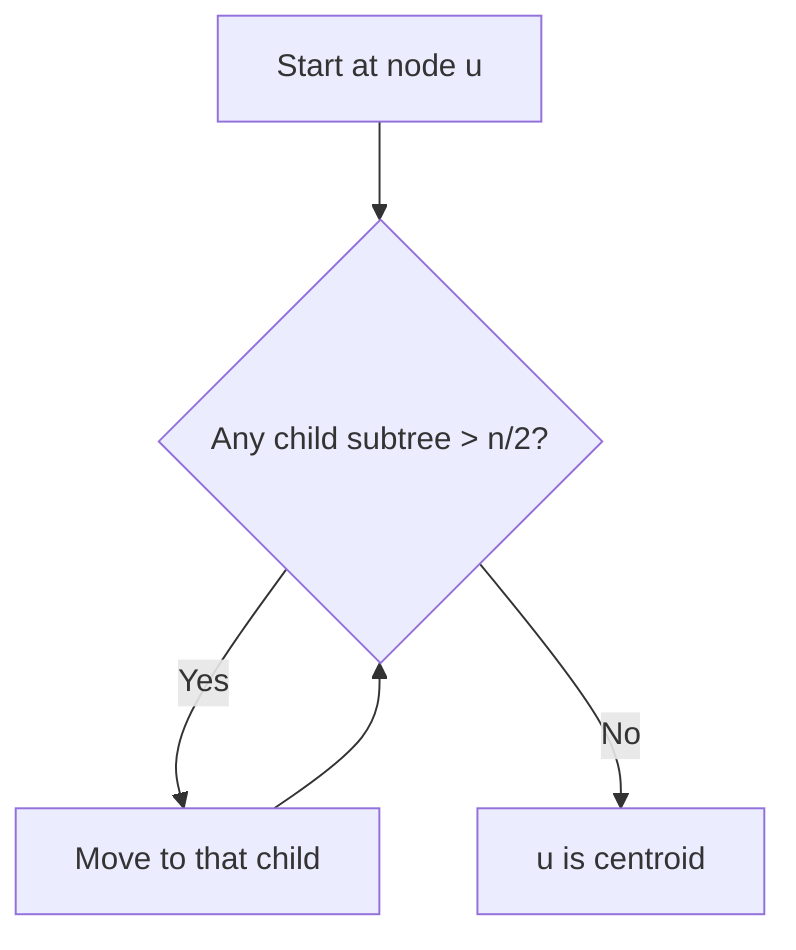

### Important Difference

```text
Center   = middle of diameter
Centroid = balance point by component size
```

They are not always the same.

### C++ Code

```cpp
#include <bits/stdc++.h>
using namespace std;

int n;
vector<vector<int>> g;
vector<int> sub;

void dfsSub(int u, int p) {
    sub[u] = 1;
    for (int v : g[u]) {
        if (v == p) continue;
        dfsSub(v, u);
        sub[u] += sub[v];
    }
}

int findCentroid(int u, int p) {
    for (int v : g[u]) {
        if (v == p) continue;
        if (sub[v] > n / 2) {
            return findCentroid(v, u);
        }
    }
    return u;
}

int main() {
    cin >> n;
    g.assign(n + 1, {});
    sub.assign(n + 1, 0);

    for (int i = 0; i < n - 1; i++) {
        int u, v;
        cin >> u >> v;
        g[u].push_back(v);
        g[v].push_back(u);
    }

    dfsSub(1, 0);
    cout << findCentroid(1, 0) << "\n";
}
```

### Index-by-Index Dry Run

Balanced tree:

```text
        1
      /   \
     2     3
    / \   / \
   4   5 6   7
```

```text
index 0: n = 7, n/2 = 3
index 1: subtree[2] = 3, not > 3
index 2: subtree[3] = 3, not > 3
index 3: no child subtree > 3
index 4: node 1 is centroid
```

---

## 9. Problem 6: Sum Of All Pair Distances

### Problem Statement

Given a tree with `n` nodes, compute:

```text
sum of dist(i, j) for all 1 <= i < j <= n
```

### Input

```text
5
1 2
2 3
2 4
4 5
```

### Output

```text
18
```

### Idea

Do not calculate distance for every pair. Count contribution of every edge.

If removing an edge creates parts:

```text
s nodes on one side
n - s nodes on other side
```

Then number of pairs using this edge:

```text
s * (n - s)
```

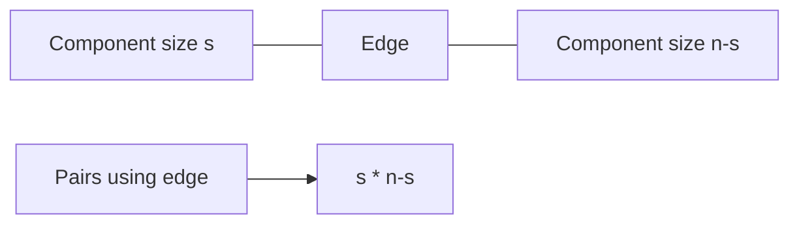

### C++ Code

```cpp
#include <bits/stdc++.h>
using namespace std;

int n;
vector<vector<int>> g;
vector<int> sub;
long long ans = 0;

void dfs(int u, int p) {
    sub[u] = 1;

    for (int v : g[u]) {
        if (v == p) continue;

        dfs(v, u);
        sub[u] += sub[v];

        long long s = sub[v];
        ans += s * (n - s);
    }
}

int main() {
    cin >> n;
    g.assign(n + 1, {});
    sub.assign(n + 1, 0);

    for (int i = 0; i < n - 1; i++) {
        int u, v;
        cin >> u >> v;
        g[u].push_back(v);
        g[v].push_back(u);
    }

    dfs(1, 0);
    cout << ans << "\n";
}
```

### Index-by-Index Dry Run

Tree:

```text
1 - 2 - 3
    |
    4 - 5
```

Subtree sizes when rooted at `1`:

```text
sub[3] = 1
sub[5] = 1
sub[4] = 2
sub[2] = 4
sub[1] = 5
```

Edge contribution:

```text
index 0: edge 2-3, s=1, contribution=1*(5-1)=4
index 1: edge 4-5, s=1, contribution=4
index 2: edge 2-4, s=2, contribution=2*(5-2)=6
index 3: edge 1-2, s=4, contribution=4*(5-4)=4
index 4: total = 4+4+6+4 = 18
```

---

# Part 3 — Binary Lifting + LCA

## 10. Binary Lifting Framework

### Core Idea

Any number can be broken into powers of 2.

```text
13 = 8 + 4 + 1
13 = 1101 binary
```

So to jump 13 ancestors:

```text
jump 8, then jump 4, then jump 1
```

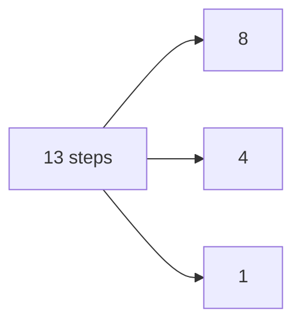

### Table Meaning

```text
up[u][i] = 2^i-th ancestor of node u
```

### Recurrence

```text
up[u][i] = up[ up[u][i-1] ][i-1]
```

```mermaid
flowchart TD
    A[u] --> B[2^(i-1) ancestor]
    B --> C[Another 2^(i-1) jump]
    C --> D[2^i ancestor]
```

### Complexity

| Operation | Complexity |
|---|---|
| Build | `O(n log n)` |
| Query | `O(log n)` |
| Memory | `O(n log n)` |

---

## 11. Problem 7: K-th Ancestor

### Problem Statement

Given a rooted tree and queries `(u, k)`, return the `k`-th ancestor of node `u`. If it does not exist, return `-1`.

### Input

```text
7 4
1 2
1 3
2 4
2 5
3 6
3 7
4 1
4 2
4 3
7 2
```

### Output

```text
2
1
-1
1
```

### C++ Code

```cpp
#include <bits/stdc++.h>
using namespace std;

const int LOG = 20;
int n, q;
vector<vector<int>> g;
vector<vector<int>> up;
vector<int> depth;

void dfs(int u, int p) {
    up[u][0] = p;

    for (int i = 1; i < LOG; i++) {
        if (up[u][i - 1] == -1) up[u][i] = -1;
        else up[u][i] = up[up[u][i - 1]][i - 1];
    }

    for (int v : g[u]) {
        if (v == p) continue;
        depth[v] = depth[u] + 1;
        dfs(v, u);
    }
}

int kthAncestor(int u, int k) {
    for (int i = LOG - 1; i >= 0; i--) {
        if ((k >> i) & 1) {
            u = up[u][i];
            if (u == -1) return -1;
        }
    }
    return u;
}

int main() {
    cin >> n >> q;
    g.assign(n + 1, {});
    up.assign(n + 1, vector<int>(LOG, -1));
    depth.assign(n + 1, 0);

    for (int i = 0; i < n - 1; i++) {
        int u, v;
        cin >> u >> v;
        g[u].push_back(v);
        g[v].push_back(u);
    }

    dfs(1, -1);

    while (q--) {
        int u, k;
        cin >> u >> k;
        cout << kthAncestor(u, k) << "\n";
    }
}
```

### Dry Run: Query `(4, 2)`

```text
Tree: 1 -> 2 -> 4
Need 2nd ancestor of 4
```

Binary of `k = 2`:

```text
2 = 10 binary
```

```text
index 0: start u = 4
index 1: bit 1 is set, jump 2^1 = 2 steps
index 2: up[4][1] = 1
index 3: answer = 1
```

---

## 12. Problem 8: LCA Using Binary Lifting

### Problem Statement

Given a tree and queries `(u, v)`, find the lowest common ancestor of `u` and `v`.

### Input

```text
7 3
1 2
1 3
2 4
2 5
3 6
3 7
4 5
4 6
6 7
```

### Output

```text
2
1
3
```

### Idea

```text
1. If depths differ, lift the deeper node.
2. If both nodes become same, that node is LCA.
3. Otherwise jump both upward from largest power to smallest.
4. Their immediate parent is LCA.
```

```mermaid
flowchart TD
    A[Nodes u and v] --> B{depth[u] < depth[v]?}
    B -->|Yes| C[swap]
    B -->|No| D[Lift deeper node]
    C --> D
    D --> E{u == v?}
    E -->|Yes| F[return u]
    E -->|No| G[For i from LOG-1 to 0]
    G --> H{up[u][i] != up[v][i]?}
    H -->|Yes| I[u=up[u][i], v=up[v][i]]
    H -->|No| J[skip]
    I --> G
    J --> G
    G --> K[return parent of u]
```

### C++ Code

```cpp
#include <bits/stdc++.h>
using namespace std;

const int LOG = 20;
int n, q;
vector<vector<int>> g, up;
vector<int> depth;

void dfs(int u, int p) {
    up[u][0] = p;

    for (int i = 1; i < LOG; i++) {
        if (up[u][i - 1] == -1) up[u][i] = -1;
        else up[u][i] = up[up[u][i - 1]][i - 1];
    }

    for (int v : g[u]) {
        if (v == p) continue;
        depth[v] = depth[u] + 1;
        dfs(v, u);
    }
}

int lca(int u, int v) {
    if (depth[u] < depth[v]) swap(u, v);

    int diff = depth[u] - depth[v];

    for (int i = LOG - 1; i >= 0; i--) {
        if ((diff >> i) & 1) {
            u = up[u][i];
        }
    }

    if (u == v) return u;

    for (int i = LOG - 1; i >= 0; i--) {
        if (up[u][i] != up[v][i]) {
            u = up[u][i];
            v = up[v][i];
        }
    }

    return up[u][0];
}

int main() {
    cin >> n >> q;
    g.assign(n + 1, {});
    up.assign(n + 1, vector<int>(LOG, -1));
    depth.assign(n + 1, 0);

    for (int i = 0; i < n - 1; i++) {
        int u, v;
        cin >> u >> v;
        g[u].push_back(v);
        g[v].push_back(u);
    }

    dfs(1, -1);

    while (q--) {
        int u, v;
        cin >> u >> v;
        cout << lca(u, v) << "\n";
    }
}
```

### Index-by-Index Dry Run: `LCA(4, 6)`

Tree:

```text
        1
      /   \
     2     3
    / \   / \
   4   5 6   7
```

```text
index 0: u=4, v=6, depth both = 2
index 1: depths equal, no lifting needed
index 2: check high jumps; 2^1 ancestors are both -1 or same root area, skip if same
index 3: check 2^0 ancestors: up[4][0]=2, up[6][0]=3, different
index 4: move u=2, v=3
index 5: loop ends, parent of u = up[2][0] = 1
index 6: answer = 1
```

---

## 13. Problem 9: Distance Between Two Nodes

### Problem Statement

Given a tree and queries `(u, v)`, return the number of edges on path from `u` to `v`.

### Formula

```text
dist(u, v) = depth[u] + depth[v] - 2 * depth[lca(u, v)]
```

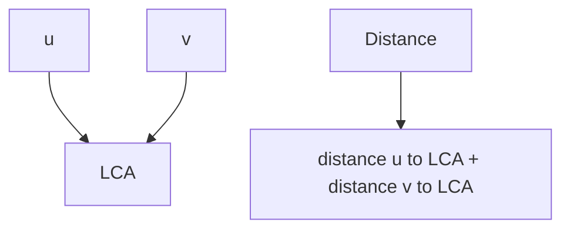

### Input

```text
7 3
1 2
1 3
2 4
2 5
3 6
3 7
4 5
4 6
6 7
```

### Output

```text
2
4
2
```

### C++ Add-On Function

```cpp
int distTree(int u, int v) {
    int w = lca(u, v);
    return depth[u] + depth[v] - 2 * depth[w];
}
```

### Dry Run: `dist(4, 6)`

```text
index 0: depth[4] = 2
index 1: depth[6] = 2
index 2: lca(4, 6) = 1
index 3: depth[1] = 0
index 4: distance = 2 + 2 - 2*0 = 4
```

---

## 14. Problem 10: LCA With Dynamic Root

### Problem Statement

Given a fixed tree, answer queries:

```text
LCA of u and v if the tree was rooted at x
```

### Idea

Compute three normal LCAs using original root:

```text
l = lca(u, v)
a = lca(u, x)
b = lca(v, x)
```

Answer is deepest among `{l, a, b}`.

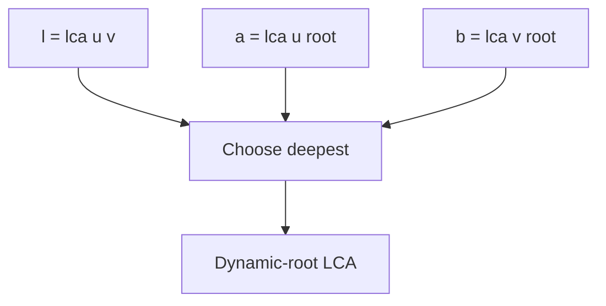

### C++ Code

```cpp
int lcaDynamicRoot(int u, int v, int root) {
    int l = lca(u, v);
    int a = lca(u, root);
    int b = lca(v, root);

    int ans = l;
    if (depth[a] > depth[ans]) ans = a;
    if (depth[b] > depth[ans]) ans = b;

    return ans;
}
```

### Dry Run

Tree:

```text
        1
      /   \
     2     3
    / \   / \
   4   5 6   7
```

Query:

```text
u = 4, v = 5, root = 2
```

```text
index 0: l = lca(4,5) = 2
index 1: a = lca(4,2) = 2
index 2: b = lca(5,2) = 2
index 3: deepest among {2,2,2} = 2
index 4: answer = 2
```

---

# Part 4 — Prefix / Difference On Tree

## 15. Problem 11: Path XOR Query

### Problem Statement

Given a weighted tree where each edge has a value, answer queries:

```text
XOR of all edge weights on path u to v
```

### Input

```text
5 3
1 2 4
1 3 7
2 4 1
2 5 6
4 5
3 4
2 3
```

### Output

```text
7
2
3
```

### Idea

Store:

```text
prefixXor[u] = XOR from root to u
```

Then:

```text
pathXor(u, v) = prefixXor[u] XOR prefixXor[v]
```

Because common root-to-LCA part cancels out.

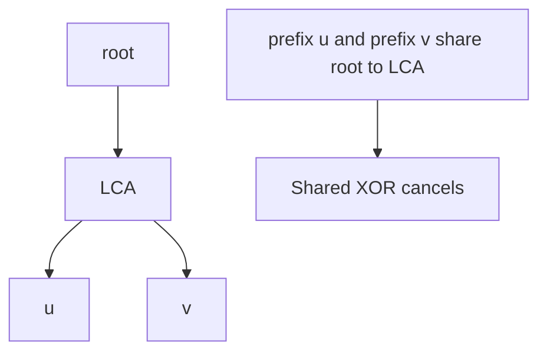

### C++ Code

```cpp
#include <bits/stdc++.h>
using namespace std;

int n, q;
vector<vector<pair<int,int>>> g;
vector<int> pref;

void dfs(int u, int p) {
    for (auto [v, w] : g[u]) {
        if (v == p) continue;
        pref[v] = pref[u] ^ w;
        dfs(v, u);
    }
}

int main() {
    cin >> n >> q;
    g.assign(n + 1, {});
    pref.assign(n + 1, 0);

    for (int i = 0; i < n - 1; i++) {
        int u, v, w;
        cin >> u >> v >> w;
        g[u].push_back({v, w});
        g[v].push_back({u, w});
    }

    dfs(1, 0);

    while (q--) {
        int u, v;
        cin >> u >> v;
        cout << (pref[u] ^ pref[v]) << "\n";
    }
}
```

### Dry Run

Edges:

```text
1-2 weight 4
1-3 weight 7
2-4 weight 1
2-5 weight 6
```

Prefix:

```text
pref[1] = 0
pref[2] = 4
pref[3] = 7
pref[4] = 4 XOR 1 = 5
pref[5] = 4 XOR 6 = 2
```

Query `4 5`:

```text
index 0: path 4 -> 2 -> 5
index 1: weights = 1 XOR 6 = 7
index 2: pref[4] XOR pref[5] = 5 XOR 2 = 7
```

---

## 16. Problem 12: Path Update And Point Query

### Problem Statement

Given a tree and `q` updates:

```text
add x to every node on path u to v
```

After all updates, print final value at every node.

### Input

```text
5
1 2
1 3
2 4
2 5
2
4 5 10
3 4 5
```

### Output

```text
5 15 5 15 10
```

### Idea

For update `(u, v, x)`:

```text
add[u] += x
add[v] += x
add[lca(u,v)] -= x
add[parent[lca(u,v)]] -= x
```

Then process nodes in postorder, pushing child value to parent.

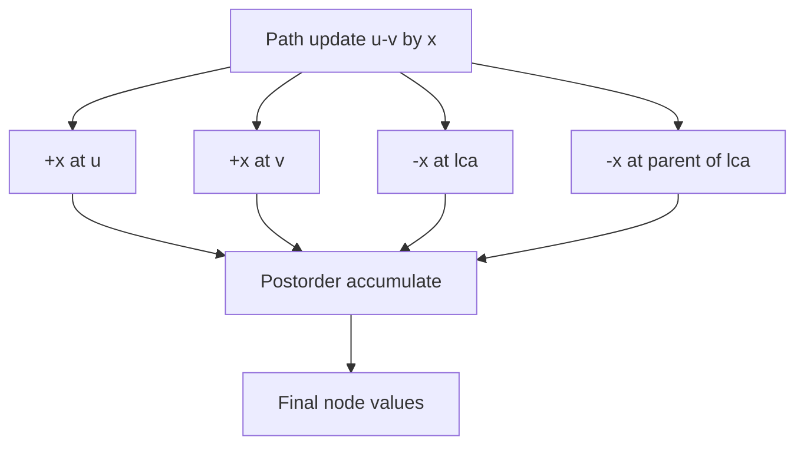

### C++ Code

```cpp
// Requires lca(), parentNode[], and postorder vector built by DFS.
vector<long long> add;
vector<int> order;

void dfsOrder(int u, int p) {
    parentNode[u] = p;

    for (int v : g[u]) {
        if (v == p) continue;
        dfsOrder(v, u);
    }

    order.push_back(u); // child before parent
}

void updatePath(int u, int v, long long x) {
    int w = lca(u, v);

    add[u] += x;
    add[v] += x;
    add[w] -= x;

    if (parentNode[w] != 0 && parentNode[w] != -1) {
        add[parentNode[w]] -= x;
    }
}

void finalizeValues() {
    for (int u : order) {
        if (parentNode[u] != 0 && parentNode[u] != -1) {
            add[parentNode[u]] += add[u];
        }
    }
}
```

### Index-by-Index Dry Run

Tree:

```text
        1
      /   \
     2     3
    / \
   4   5
```

Updates:

```text
1) add 10 on path 4 -> 5
2) add 5 on path 3 -> 4
```

Update 1:

```text
index 0: lca(4,5)=2
index 1: add[4]+=10
index 2: add[5]+=10
index 3: add[2]-=10
index 4: add[parent[2]=1]-=10
```

Update 2:

```text
index 5: lca(3,4)=1
index 6: add[3]+=5
index 7: add[4]+=5
index 8: add[1]-=5
index 9: parent[1] does not exist, skip
```

Before accumulation:

```text
add[1] = -15
add[2] = -10
add[3] = 5
add[4] = 15
add[5] = 10
```

Postorder accumulation:

```text
index 10: node 4 pushes 15 to 2, add[2]=5
index 11: node 5 pushes 10 to 2, add[2]=15
index 12: node 2 pushes 15 to 1, add[1]=0
index 13: node 3 pushes 5 to 1, add[1]=5
index 14: final = [5,15,5,15,10]
```

---

# Part 5 — Path Aggregates With Binary Lifting

## 17. Binary Lifting Aggregate Framework

### When To Use

Use prefix for reversible operations:

```text
XOR, sum with root prefix, parity
```

Use aggregate binary lifting for:

```text
min edge on path
max edge on path
gcd on path
sum of edge weights with upward jumps
```

### Table Meaning

```text
up[u][i]  = 2^i-th ancestor of u
agg[u][i] = aggregate from u upward for 2^i edges/nodes
```

```mermaid
flowchart TD
    A[u] --> B[First half: agg[u][i-1]]
    B --> C[mid = up[u][i-1]]
    C --> D[Second half: agg[mid][i-1]]
    D --> E[agg[u][i] = combine both]
```

### Generic Recurrence

```cpp
up[u][i] = up[ up[u][i - 1] ][i - 1];
agg[u][i] = combine(agg[u][i - 1], agg[ up[u][i - 1] ][i - 1]);
```

### Identity Values

| Operation | Identity |
|---|---|
| sum | `0` |
| xor | `0` |
| gcd | `0` |
| min | `+INF` |
| max | `-INF` |

---

## 18. Problem 13: Path GCD Query

### Problem Statement

Given a tree with value `val[u]` on every node. For each query `(u, v)`, return:

```text
GCD of all node values on path u to v
```

### Input

```text
5 3
12 18 6 9 15
1 2
1 3
2 4
2 5
4 5
3 4
1 5
```

### Output

```text
3
3
3
```

### Idea

While lifting nodes upward, collect GCD of every jumped segment.

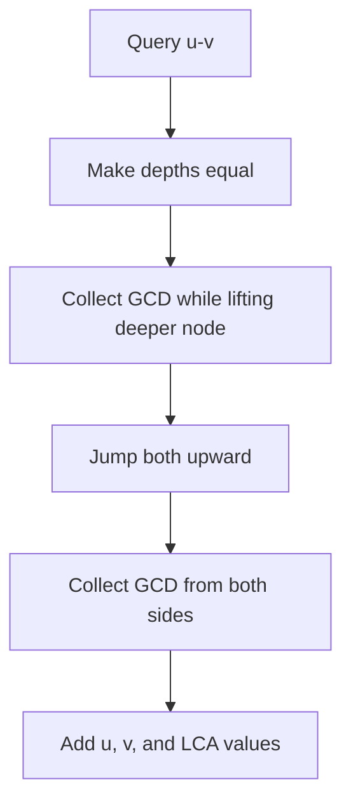

### C++ Code

```cpp
#include <bits/stdc++.h>
using namespace std;

const int LOG = 20;
int n, q;
vector<vector<int>> g, up, gcdUp;
vector<int> depth, val;

int gcdInt(int a, int b) {
    if (b == 0) return a;
    return gcdInt(b, a % b);
}

void dfs(int u, int p) {
    up[u][0] = p;
    gcdUp[u][0] = val[u];

    for (int i = 1; i < LOG; i++) {
        if (up[u][i - 1] == -1) {
            up[u][i] = -1;
            gcdUp[u][i] = gcdUp[u][i - 1];
        } else {
            int mid = up[u][i - 1];
            up[u][i] = up[mid][i - 1];
            gcdUp[u][i] = gcdInt(gcdUp[u][i - 1], gcdUp[mid][i - 1]);
        }
    }

    for (int v : g[u]) {
        if (v == p) continue;
        depth[v] = depth[u] + 1;
        dfs(v, u);
    }
}

int pathGcd(int u, int v) {
    int ans = 0;

    if (depth[u] < depth[v]) swap(u, v);

    int diff = depth[u] - depth[v];
    for (int i = LOG - 1; i >= 0; i--) {
        if ((diff >> i) & 1) {
            ans = gcdInt(ans, gcdUp[u][i]);
            u = up[u][i];
        }
    }

    if (u == v) return gcdInt(ans, val[u]);

    for (int i = LOG - 1; i >= 0; i--) {
        if (up[u][i] != up[v][i]) {
            ans = gcdInt(ans, gcdUp[u][i]);
            ans = gcdInt(ans, gcdUp[v][i]);
            u = up[u][i];
            v = up[v][i];
        }
    }

    ans = gcdInt(ans, val[u]);
    ans = gcdInt(ans, val[v]);
    ans = gcdInt(ans, val[up[u][0]]);

    return ans;
}

int main() {
    cin >> n >> q;
    g.assign(n + 1, {});
    up.assign(n + 1, vector<int>(LOG, -1));
    gcdUp.assign(n + 1, vector<int>(LOG, 0));
    depth.assign(n + 1, 0);
    val.assign(n + 1, 0);

    for (int i = 1; i <= n; i++) cin >> val[i];

    for (int i = 0; i < n - 1; i++) {
        int u, v;
        cin >> u >> v;
        g[u].push_back(v);
        g[v].push_back(u);
    }

    dfs(1, -1);

    while (q--) {
        int u, v;
        cin >> u >> v;
        cout << pathGcd(u, v) << "\n";
    }
}
```

### Dry Run: `pathGcd(4,5)`

Values:

```text
val[1]=12, val[2]=18, val[4]=9, val[5]=15
path 4 -> 2 -> 5
```

```text
index 0: u=4, v=5, same depth
index 1: up[4][0]=2, up[5][0]=2, same, do not jump
index 2: now u and v are direct children of LCA
index 3: ans = gcd(0, val[4]=9) = 9
index 4: ans = gcd(9, val[5]=15) = 3
index 5: ans = gcd(3, val[2]=18) = 3
index 6: answer = 3
```

---

## 19. Problem 14: Path Minimum Edge Query

### Problem Statement

Given a weighted tree, answer queries:

```text
minimum edge weight on path u to v
```

### Input

```text
5 3
1 2 4
1 3 7
2 4 1
2 5 6
4 5
3 4
2 3
```

### Output

```text
1
1
4
```

### Idea

Push edge weight to child node:

```text
edge(parent -> child) weight is stored at child
```

Then use binary lifting aggregate with `min`.

```mermaid
flowchart TD
    A[Edge weight parent-child] --> B[Store weight at child]
    B --> C[minUp[u][i] = min edge in 2^i upward jump]
    C --> D[During query, lift and take min]
```

### C++ Code

```cpp
#include <bits/stdc++.h>
using namespace std;

const int LOG = 20;
const int INF = 1e9;

int n, q;
vector<vector<pair<int,int>>> g;
vector<vector<int>> up, mn;
vector<int> depth;

void dfs(int u, int p, int w) {
    up[u][0] = p;
    mn[u][0] = w;

    for (int i = 1; i < LOG; i++) {
        if (up[u][i - 1] == -1) {
            up[u][i] = -1;
            mn[u][i] = mn[u][i - 1];
        } else {
            int mid = up[u][i - 1];
            up[u][i] = up[mid][i - 1];
            mn[u][i] = min(mn[u][i - 1], mn[mid][i - 1]);
        }
    }

    for (auto [v, weight] : g[u]) {
        if (v == p) continue;
        depth[v] = depth[u] + 1;
        dfs(v, u, weight);
    }
}

int pathMin(int u, int v) {
    int ans = INF;

    if (depth[u] < depth[v]) swap(u, v);

    int diff = depth[u] - depth[v];
    for (int i = LOG - 1; i >= 0; i--) {
        if ((diff >> i) & 1) {
            ans = min(ans, mn[u][i]);
            u = up[u][i];
        }
    }

    if (u == v) return ans;

    for (int i = LOG - 1; i >= 0; i--) {
        if (up[u][i] != up[v][i]) {
            ans = min(ans, mn[u][i]);
            ans = min(ans, mn[v][i]);
            u = up[u][i];
            v = up[v][i];
        }
    }

    ans = min(ans, mn[u][0]);
    ans = min(ans, mn[v][0]);

    return ans;
}

int main() {
    cin >> n >> q;
    g.assign(n + 1, {});
    up.assign(n + 1, vector<int>(LOG, -1));
    mn.assign(n + 1, vector<int>(LOG, INF));
    depth.assign(n + 1, 0);

    for (int i = 0; i < n - 1; i++) {
        int u, v, w;
        cin >> u >> v >> w;
        g[u].push_back({v, w});
        g[v].push_back({u, w});
    }

    dfs(1, -1, INF);

    while (q--) {
        int u, v;
        cin >> u >> v;
        cout << pathMin(u, v) << "\n";
    }
}
```

### Dry Run: `pathMin(3,4)`

Path:

```text
3 -> 1 -> 2 -> 4
weights: 7, 4, 1
```

```text
index 0: u=4 deeper than 3, lift 4 by one if needed
index 1: collect edge 4->2 weight 1, ans=1
index 2: now compare ancestors of 2 and 3
index 3: final add edge 2->1 weight 4 and 3->1 weight 7
index 4: min(1,4,7)=1
```

---

# Part 6 — DSU / Union Find For Tree-Like Connectivity

## 20. Problem 15: Detect Cycle Using DSU

### Problem Statement

Given an undirected graph with `n` nodes and `m` edges, detect if adding edges creates a cycle.

### Why It Matters For Trees

A graph is a tree if:

```text
m = n - 1
and no cycle
and connected
```

DSU helps test cycle/connectivity quickly.

### Input

```text
4 4
1 2
2 3
3 4
4 2
```

### Output

```text
Cycle found
```

### Mermaid Diagram

```mermaid
flowchart TD
    A[Read edge u-v] --> B[Find root of u]
    B --> C[Find root of v]
    C --> D{same root?}
    D -->|Yes| E[Cycle found]
    D -->|No| F[Union components]
```

### C++ Code

```cpp
#include <bits/stdc++.h>
using namespace std;

struct DSU {
    vector<int> parent, sz;

    DSU(int n) {
        parent.resize(n + 1);
        sz.assign(n + 1, 1);
        iota(parent.begin(), parent.end(), 0);
    }

    int find(int x) {
        if (parent[x] == x) return x;
        return parent[x] = find(parent[x]);
    }

    bool unite(int a, int b) {
        a = find(a);
        b = find(b);

        if (a == b) return false;

        if (sz[a] < sz[b]) swap(a, b);
        parent[b] = a;
        sz[a] += sz[b];
        return true;
    }
};

int main() {
    int n, m;
    cin >> n >> m;

    DSU dsu(n);
    bool cycle = false;

    for (int i = 0; i < m; i++) {
        int u, v;
        cin >> u >> v;

        if (!dsu.unite(u, v)) {
            cycle = true;
        }
    }

    cout << (cycle ? "Cycle found" : "No cycle") << "\n";
}
```

### Dry Run

Edges:

```text
1-2, 2-3, 3-4, 4-2
```

```text
index 0: union(1,2), different roots, merge
index 1: union(2,3), different roots, merge
index 2: union(3,4), different roots, merge
index 3: union(4,2), root(4) == root(2)
index 4: cycle found
```

---

# 21. Final CP/DSA Tree Checklist

## Must-Know Tree Forms

| Level | Topic | Must Know? |
|---|---|---|
| Basic | Tree properties: parent/depth/subtree/leaf | Yes |
| Basic | DFS path from u to v | Yes |
| Basic | Diameter | Yes |
| Basic | Center | Yes |
| Intermediate | Centroid | Yes for CP |
| Intermediate | Sum of all pair distances | Yes |
| Intermediate | LCA | Yes |
| Intermediate | Distance using LCA | Yes |
| Advanced | Binary lifting K-th ancestor | Yes |
| Advanced | Dynamic root LCA | CP useful |
| Advanced | Path update point query | Very useful |
| Advanced | Path XOR / prefix on tree | Useful |
| Advanced | Path min/max/gcd aggregate | Useful |
| Advanced | DSU for cycle/connectivity | Yes |

## Pattern Recognition In 5 Seconds

```text
Question says ancestor?          -> LCA / Binary lifting
Question says kth parent?        -> Binary lifting
Question says distance u-v?      -> LCA + depth formula
Question says update path?       -> Tree difference
Question says query path min?    -> Binary lifting aggregate
Question says XOR path?          -> prefix XOR
Question says longest path?      -> diameter
Question says middle of tree?    -> center
Question says balanced root?     -> centroid
Question says connected/cycle?   -> DSU or DFS
```

## Best Practice Order

```text
1. DFS tree values
2. Path finding
3. Diameter
4. Center
5. Subtree contribution problems
6. LCA
7. Distance queries
8. Binary lifting kth ancestor
9. Prefix/difference on tree
10. Path aggregate queries
11. Centroid
12. DSU
```

## Minimum Practice Set

| Form | Practice Count |
|---|---:|
| DFS parent/depth/subtree | 5 |
| Diameter/center | 5 |
| Contribution by edge/subtree | 5 |
| LCA + distance | 8 |
| Binary lifting | 5 |
| Path update/difference | 5 |
| Path aggregate | 5 |
| Centroid | 3 |
| DSU | 5 |

---

# Quick Templates

## Tree DFS Template

```cpp
void dfs(int u, int p) {
    parent[u] = p;
    sub[u] = 1;

    for (int v : g[u]) {
        if (v == p) continue;
        depth[v] = depth[u] + 1;
        dfs(v, u);
        sub[u] += sub[v];
    }
}
```

## LCA Template

```cpp
int lca(int u, int v) {
    if (depth[u] < depth[v]) swap(u, v);

    int diff = depth[u] - depth[v];
    for (int i = LOG - 1; i >= 0; i--) {
        if ((diff >> i) & 1) u = up[u][i];
    }

    if (u == v) return u;

    for (int i = LOG - 1; i >= 0; i--) {
        if (up[u][i] != up[v][i]) {
            u = up[u][i];
            v = up[v][i];
        }
    }

    return up[u][0];
}
```

## Distance Template

```cpp
int dist(int u, int v) {
    int w = lca(u, v);
    return depth[u] + depth[v] - 2 * depth[w];
}
```

## Tree Difference Template

```cpp
void updatePath(int u, int v, long long x) {
    int w = lca(u, v);
    add[u] += x;
    add[v] += x;
    add[w] -= x;
    if (parent[w] != 0) add[parent[w]] -= x;
}
```

## DSU Template

```cpp
struct DSU {
    vector<int> p, sz;
    DSU(int n) {
        p.resize(n + 1);
        sz.assign(n + 1, 1);
        iota(p.begin(), p.end(), 0);
    }
    int find(int x) {
        return p[x] == x ? x : p[x] = find(p[x]);
    }
    bool unite(int a, int b) {
        a = find(a), b = find(b);
        if (a == b) return false;
        if (sz[a] < sz[b]) swap(a, b);
        p[b] = a;
        sz[a] += sz[b];
        return true;
    }
};
```
