# Trees + Binary Lifting + Union Find Pattern-Wise Visual Reference

Made from the attached notes in order:

1. Tree application ideas  
2. Binary lifting framework and forms  
3. Union Find / DSU  

Includes Mermaid diagrams, step-by-step examples, intuition, small C++ code, Java helpers where useful, and 1-minute mental tricks.

---

## 0. One-Minute Master Map

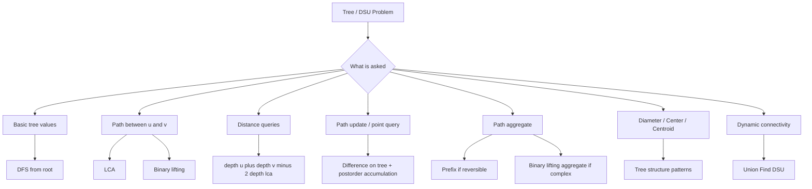

### 1-minute mental trick

> Tree = connected graph with no cycle.  
> DSU = fast component manager.  
> Binary lifting = jump upward in powers of two.

---

# Part 1. Tree Basics

## 1. What is a tree?

A tree has:

```text
N nodes
N - 1 edges
All nodes connected
No cycle
Exactly one simple path between any two nodes
```

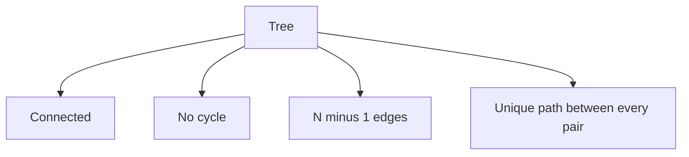

### Intuition

Because there is only one path between `u` and `v`, DFS and BFS both find the same path.

### C++ adjacency list

```cpp
int n;
vector<vector<int>> g;

void readTree() {
    cin >> n;
    g.assign(n + 1, {});

    for (int i = 0; i < n - 1; i++) {
        int u, v;
        cin >> u >> v;
        g[u].push_back(v);
        g[v].push_back(u);
    }
}
```

---

## 2. Rooted vs unrooted tree

Unrooted tree:

```text
No parent-child relationship.
```

Rooted tree:

```text
Choose one node as root.
Then parent, child, depth, subtree become meaningful.
```

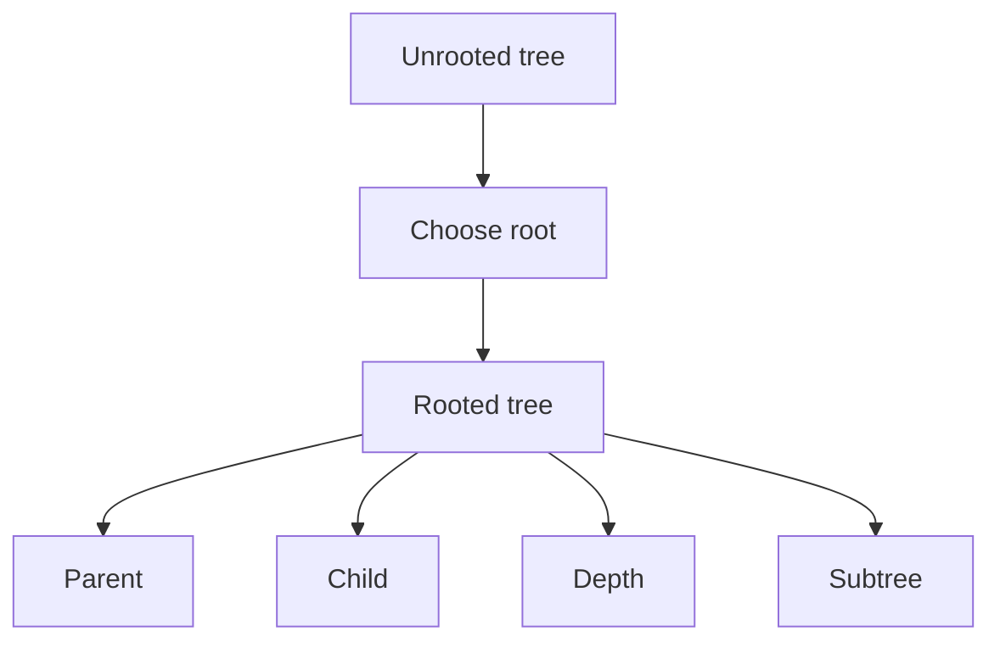

### Important note

Most tree problems become easier after rooting the tree.

### Mental trick

> If the problem says “subtree,” root the tree first.

---

## 3. Tree vocabulary

| Term | Meaning |
|---|---|
| root | chosen top node |
| parent | previous node toward root |
| child | neighbour below current node |
| leaf | node with no child |
| depth | distance from root |
| level | same as depth in many problems |
| subtree | node plus all descendants |

---

## 4. Compute parent, depth, leaf, child count, subtree size

### Values to compute

For every node:

```text
isLeaf[node]
depth[node]
subtreeSize[node]
parent[node]
numChild[node]
```

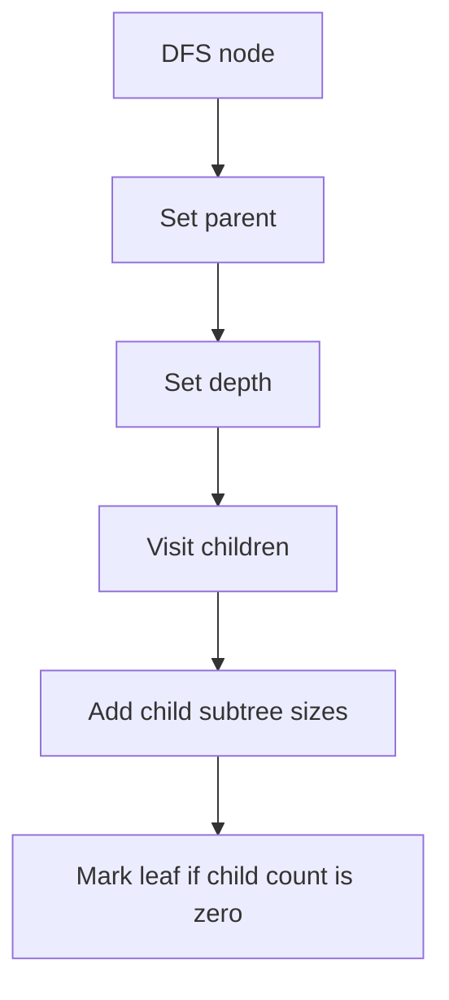

### C++ code

```cpp
int n;
vector<vector<int>> g;
vector<int> parentNode, depthNode, subtreeSize, numChild, isLeaf;

void dfsTree(int u, int p) {
    parentNode[u] = p;
    subtreeSize[u] = 1;
    numChild[u] = 0;

    for (int v : g[u]) {
        if (v == p) continue;

        depthNode[v] = depthNode[u] + 1;
        numChild[u]++;

        dfsTree(v, u);

        subtreeSize[u] += subtreeSize[v];
    }

    isLeaf[u] = (numChild[u] == 0);
}
```

### Java helper

```java
static ArrayList<Integer>[] g;
static int[] parent, depth, sub, childCount;
static boolean[] isLeaf;

static void dfsTree(int u, int p) {
    parent[u] = p;
    sub[u] = 1;

    for (int v : g[u]) {
        if (v == p) continue;

        depth[v] = depth[u] + 1;
        childCount[u]++;

        dfsTree(v, u);
        sub[u] += sub[v];
    }

    isLeaf[u] = childCount[u] == 0;
}
```

### 1-minute mental trick

> Tree DFS returns information from children to parent.

---

# Part 2. Tree Paths

## 5. Path from u to v

Because tree has unique path, we can find it with DFS parent tracking.

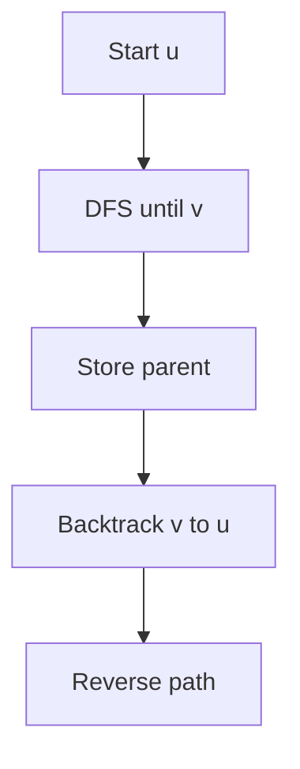

### C++ code

```cpp
bool dfsFindPath(int u, int p, int target, vector<int>& path) {
    path.push_back(u);

    if (u == target) return true;

    for (int v : g[u]) {
        if (v == p) continue;

        if (dfsFindPath(v, u, target, path)) {
            return true;
        }
    }

    path.pop_back();
    return false;
}
```

### Example

```text
If path is 2 -> 5 -> 7 -> 9
DFS finds target 9, then path vector already stores the route.
```

---

## 6. Tree diameter

Diameter:

```text
Longest shortest path between any two nodes.
```

In a tree, diameter is always between two leaves.

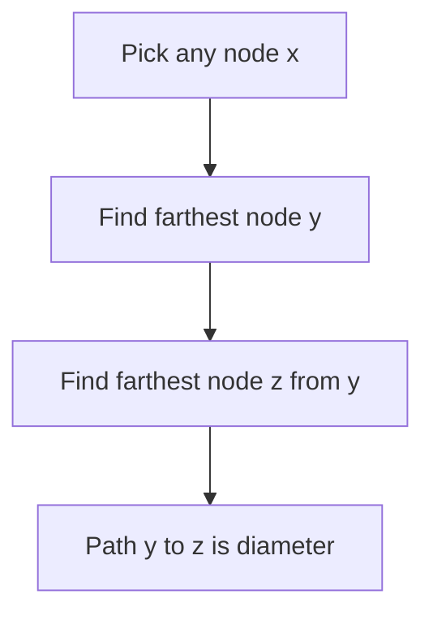

### Why 2 DFS works

From any node, the farthest node is one end of a diameter.  
Then farthest from that end gives the other end.

### C++ code

```cpp
pair<int,int> farthestNode(int src, int n) {
    vector<int> dist(n + 1, -1);
    queue<int> q;

    dist[src] = 0;
    q.push(src);

    while (!q.empty()) {
        int u = q.front();
        q.pop();

        for (int v : g[u]) {
            if (dist[v] == -1) {
                dist[v] = dist[u] + 1;
                q.push(v);
            }
        }
    }

    int best = src;
    for (int i = 1; i <= n; i++) {
        if (dist[i] > dist[best]) best = i;
    }

    return {best, dist[best]};
}

int treeDiameter(int n) {
    auto [y, d1] = farthestNode(1, n);
    auto [z, diameter] = farthestNode(y, n);
    return diameter;
}
```

### 1-minute mental trick

> Diameter = farthest from farthest.

---

## 7. Number of diameters in a tree

From notes:

```text
If one center:
    count pairs across different center-subtrees at distance diameter/2.

If two centers:
    answer = count nodes at distance floor(d/2) from one center side
             times count nodes at distance floor(d/2) from other center side.
```

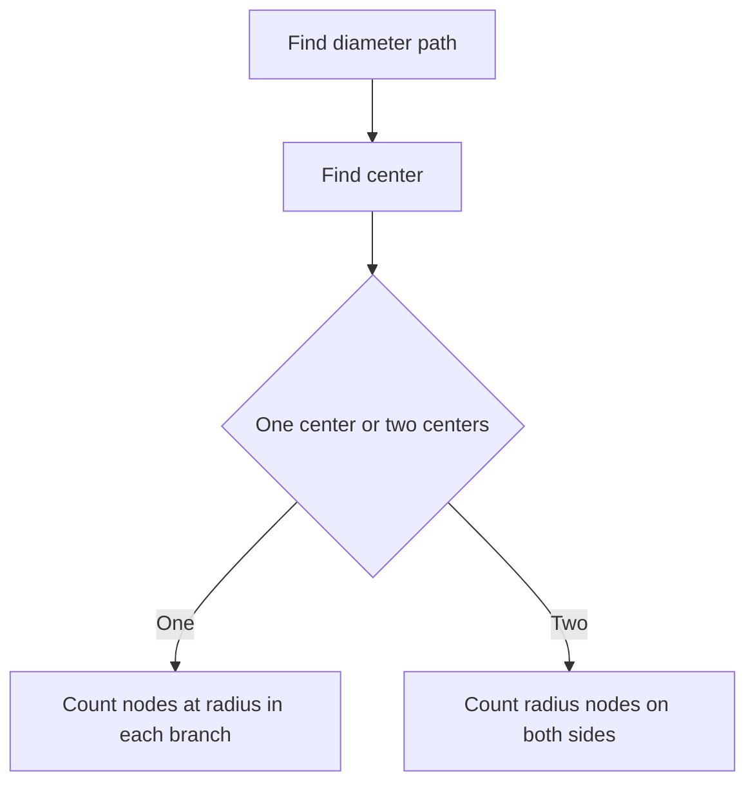

### Mental trick

> Every diameter passes through tree center.

---

## 8. Center of a tree

Center:

```text
Middle node or middle edge of the diameter.
```

Properties:
- center is property of tree
- every diameter passes through center
- one tree has at most two centers

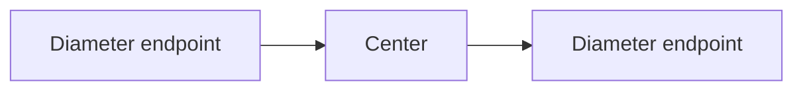

### Finding center from diameter path

```cpp
vector<int> getCenterFromDiameterPath(vector<int>& path) {
    int len = path.size();

    if (len % 2 == 1) {
        return {path[len / 2]};
    } else {
        return {path[len / 2 - 1], path[len / 2]};
    }
}
```

### 1-minute mental trick

> Center is the middle of the longest path.

---

## 9. Centroid of a tree

Centroid:

```text
A node such that after rooting the tree at that node,
every component/subtree has size <= N/2.
```

A tree has:
```text
at least 1 centroid
at most 2 centroids
```

Center is not always centroid.

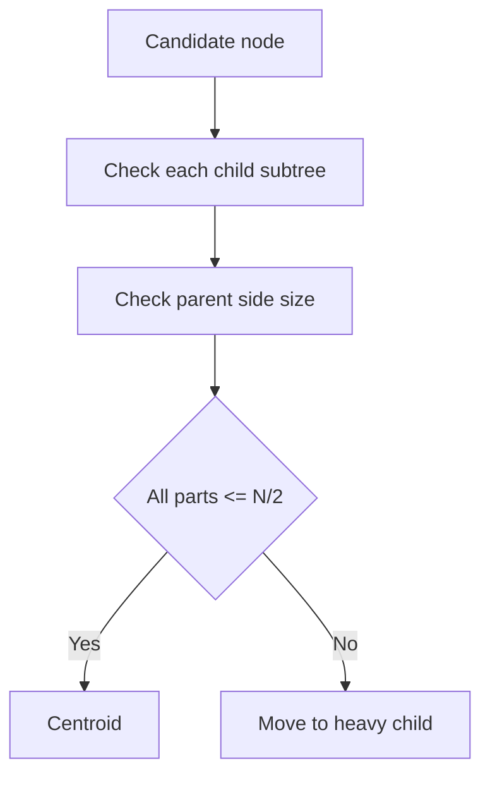

### C++ find centroid

```cpp
int findCentroid(int u, int p, int n) {
    for (int v : g[u]) {
        if (v == p) continue;

        if (subtreeSize[v] > n / 2) {
            return findCentroid(v, u, n);
        }
    }

    return u;
}
```

For exact centroid check:

```cpp
bool isCentroid(int u, int n) {
    int largestPart = n - subtreeSize[u]; // parent side

    for (int v : g[u]) {
        if (parentNode[v] == u) {
            largestPart = max(largestPart, subtreeSize[v]);
        }
    }

    return largestPart <= n / 2;
}
```

### 1-minute mental trick

> Centroid is balance point: no piece after cutting it is bigger than half.

---

## 10. Sum of all pair distances in a tree

For each edge, count how many node pairs use that edge.

If removing edge separates tree into:

```text
size = s
other side = n - s
```

Then contribution:

```text
s * (n - s)
```

For weighted edge with weight `w`:

```text
w * s * (n - s)
```

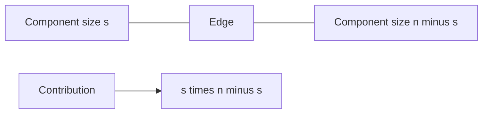

### C++ code

```cpp
long long sumAllPairDistances(int n) {
    long long ans = 0;

    function<void(int,int)> dfs = [&](int u, int p) {
        subtreeSize[u] = 1;

        for (int v : g[u]) {
            if (v == p) continue;

            dfs(v, u);
            subtreeSize[u] += subtreeSize[v];

            long long s = subtreeSize[v];
            ans += s * (n - s);
        }
    };

    dfs(1, 0);
    return ans;
}
```

### 1-minute mental trick

> Count edge contribution, not pair by pair.

---

## 11. Ancestor value minimization idea

From notes:

```text
For each node x, find min abs(val[x] - val[y])
where y is an ancestor of x.
```

Technique:

```text
During DFS, maintain a multiset of values currently on root-to-node path.
For node x, closest value is predecessor or successor of val[x].
```

```cpp
multiset<int> pathValues;
vector<int> val, ans;

void dfsClosestAncestorValue(int u, int p) {
    auto it = pathValues.lower_bound(val[u]);

    int best = INT_MAX;

    if (it != pathValues.end()) {
        best = min(best, abs(val[u] - *it));
    }

    if (it != pathValues.begin()) {
        --it;
        best = min(best, abs(val[u] - *it));
    }

    ans[u] = best;

    pathValues.insert(val[u]);

    for (int v : g[u]) {
        if (v != p) dfsClosestAncestorValue(v, u);
    }

    pathValues.erase(pathValues.find(val[u]));
}
```

### Mental trick

> DFS path state = current ancestors only.

---

# Part 3. Binary Lifting

## 12. Binary lifting core idea

Any number can be represented using powers of two.

Example:

```text
13 = 8 + 4 + 1
13 in binary = 1101
```

So to jump 13 steps:

```text
jump 8, then 4, then 1
```

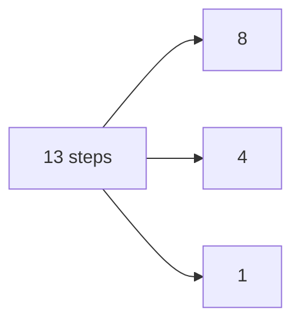

### Binary lifting table

```text
up[node][i] = 2^i-th ancestor of node
```

Recurrence:

```text
up[node][i] = up[ up[node][i-1] ][i-1]
```

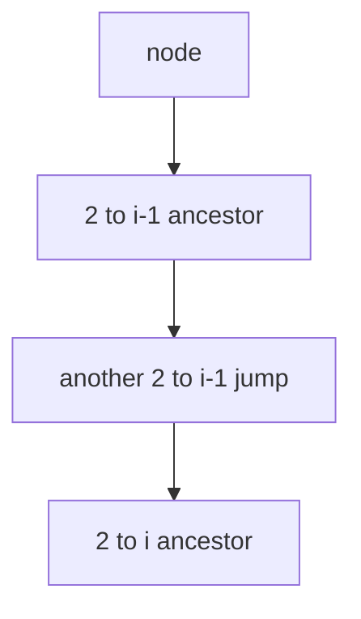

### 1-minute mental trick

> Store jumps of size 1, 2, 4, 8.  
> Any big jump is a sum of these.

---

## 13. K-th ancestor / K-th next element

### C++ generic jump

```cpp
int kthAncestor(int node, long long k, vector<vector<int>>& up) {
    int LOG = up[0].size();

    for (int i = LOG - 1; i >= 0; i--) {
        if ((k >> i) & 1LL) {
            node = up[node][i];
            if (node == -1) break;
        }
    }

    return node;
}
```

### Functional graph version

Every node has one outgoing edge.

```cpp
const int LOG = 31;

vector<vector<int>> jump;

int kthNext(int node, int k) {
    for (int i = LOG - 1; i >= 0; i--) {
        if ((k >> i) & 1) {
            node = jump[node][i];
        }
    }

    return node;
}
```

### Build table

```cpp
void buildFunctionalGraph(int n) {
    for (int j = 1; j < LOG; j++) {
        for (int node = 1; node <= n; node++) {
            jump[node][j] = jump[jump[node][j - 1]][j - 1];
        }
    }
}
```

---

## 14. LCA using binary lifting

LCA:

```text
Lowest Common Ancestor of u and v
```

Steps:
1. Bring deeper node up to same depth.
2. Jump both nodes upward while their ancestors differ.
3. Parent of either node is LCA.

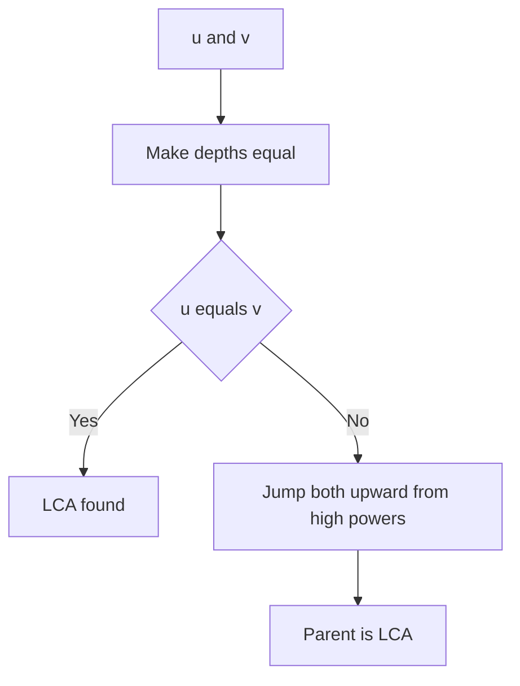

### C++ code

```cpp
const int LOG = 20;

vector<vector<int>> up;
vector<int> depth;
vector<vector<int>> tree;

void dfsLCA(int u, int p) {
    up[u][0] = p;

    for (int i = 1; i < LOG; i++) {
        if (up[u][i - 1] == -1) {
            up[u][i] = -1;
        } else {
            up[u][i] = up[up[u][i - 1]][i - 1];
        }
    }

    for (int v : tree[u]) {
        if (v == p) continue;

        depth[v] = depth[u] + 1;
        dfsLCA(v, u);
    }
}

int lca(int u, int v) {
    if (depth[u] < depth[v]) swap(u, v);

    int diff = depth[u] - depth[v];

    for (int i = LOG - 1; i >= 0; i--) {
        if ((diff >> i) & 1) {
            u = up[u][i];
        }
    }

    if (u == v) return u;

    for (int i = LOG - 1; i >= 0; i--) {
        if (up[u][i] != up[v][i]) {
            u = up[u][i];
            v = up[v][i];
        }
    }

    return up[u][0];
}
```

### Java helper

```java
static final int LOG = 20;
static int[][] up;
static int[] depth;
static ArrayList<Integer>[] tree;

static void dfsLCA(int u, int p) {
    up[u][0] = p;

    for (int i = 1; i < LOG; i++) {
        if (up[u][i - 1] == -1) up[u][i] = -1;
        else up[u][i] = up[up[u][i - 1]][i - 1];
    }

    for (int v : tree[u]) {
        if (v == p) continue;

        depth[v] = depth[u] + 1;
        dfsLCA(v, u);
    }
}

static int lca(int u, int v) {
    if (depth[u] < depth[v]) {
        int t = u; u = v; v = t;
    }

    int diff = depth[u] - depth[v];

    for (int i = LOG - 1; i >= 0; i--) {
        if (((diff >> i) & 1) == 1) {
            u = up[u][i];
        }
    }

    if (u == v) return u;

    for (int i = LOG - 1; i >= 0; i--) {
        if (up[u][i] != up[v][i]) {
            u = up[u][i];
            v = up[v][i];
        }
    }

    return up[u][0];
}
```

### 1-minute mental trick

> LCA = first make height same, then jump together.

---

## 15. Distance between two nodes

Formula:

```text
dist(u, v) = depth[u] + depth[v] - 2 * depth[lca(u, v)]
```

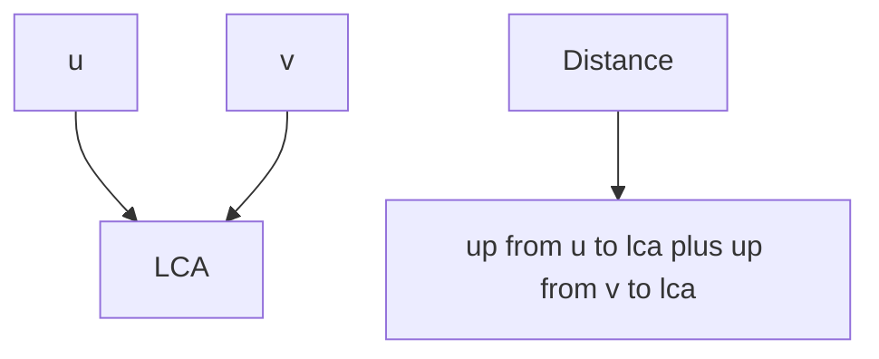

### C++ code

```cpp
int distanceTree(int u, int v) {
    int w = lca(u, v);
    return depth[u] + depth[v] - 2 * depth[w];
}
```

---

## 16. LCA with dynamic root

Query:

```text
Find LCA of u and v when tree is rooted at x.
```

Compute:

```text
l = lca(u, v)
a = lca(u, x)
b = lca(v, x)
```

Answer is the deepest among `l, a, b`.

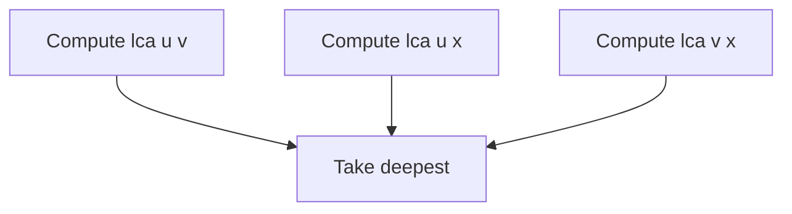

### C++ code

```cpp
int lcaWithRoot(int u, int v, int root) {
    int l = lca(u, v);
    int a = lca(u, root);
    int b = lca(v, root);

    int ans = l;

    if (depth[a] > depth[ans]) ans = a;
    if (depth[b] > depth[ans]) ans = b;

    return ans;
}
```

### 1-minute mental trick

> Dynamic root LCA = deepest among three LCAs.

---

# Part 4. Prefix and Partial Sum on Trees

## 17. Path XOR using prefix

For XOR path queries:

```text
prefix[x] = XOR from root to x
pathXor(u, v) = prefix[u] XOR prefix[v]
```

For edge weights, if prefix stores XOR of edges from root:

```text
pathXor(u, v) = prefix[u] XOR prefix[v]
```

```cpp
vector<int> prefixXor;

void dfsPrefixXor(int u, int p, int edgeXor) {
    prefixXor[u] = prefixXor[p] ^ edgeXor;

    for (auto [v, w] : weightedTree[u]) {
        if (v == p) continue;
        dfsPrefixXor(v, u, w);
    }
}

int getPathXor(int u, int v) {
    return prefixXor[u] ^ prefixXor[v];
}
```

### Mental trick

> XOR cancels repeated root-to-LCA part automatically.

---

## 18. Path update and point query

Problem:

```text
Add z to all nodes on path u to v.
After all queries, find final value at each node.
```

Difference trick:

```text
add[u] += z
add[v] += z
add[lca] -= z
add[parent[lca]] -= z
```

Then accumulate from children to parent.

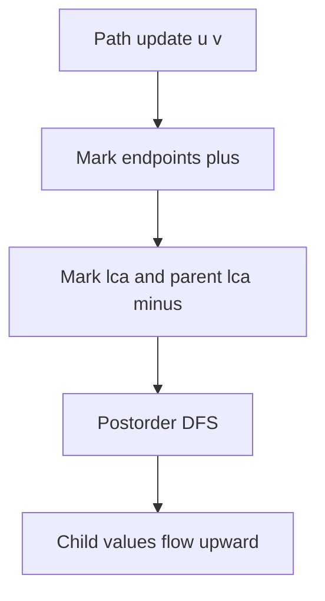

### C++ code

```cpp
vector<long long> addValue;
vector<int> order;

void dfsOrder(int u, int p) {
    parentNode[u] = p;

    for (int v : tree[u]) {
        if (v == p) continue;
        dfsOrder(v, u);
    }

    order.push_back(u); // children before parent
}

void applyPathUpdate(int u, int v, long long z) {
    int w = lca(u, v);

    addValue[u] += z;
    addValue[v] += z;
    addValue[w] -= z;

    if (parentNode[w] != -1) {
        addValue[parentNode[w]] -= z;
    }
}

void finalizeValues() {
    for (int u : order) {
        if (parentNode[u] != -1) {
            addValue[parentNode[u]] += addValue[u];
        }
    }
}
```

### 1-minute mental trick

> Put + at path ends, put - where paths meet, then pull values upward.

---

# Part 5. Complex Path Aggregates With Binary Lifting

## 19. When prefix is enough vs binary lifting needed

Prefix works well for reversible operations:

```text
sum, XOR
```

Binary lifting aggregate is useful for:

```text
min edge on path
max edge on path
gcd on path
complex path aggregate
```

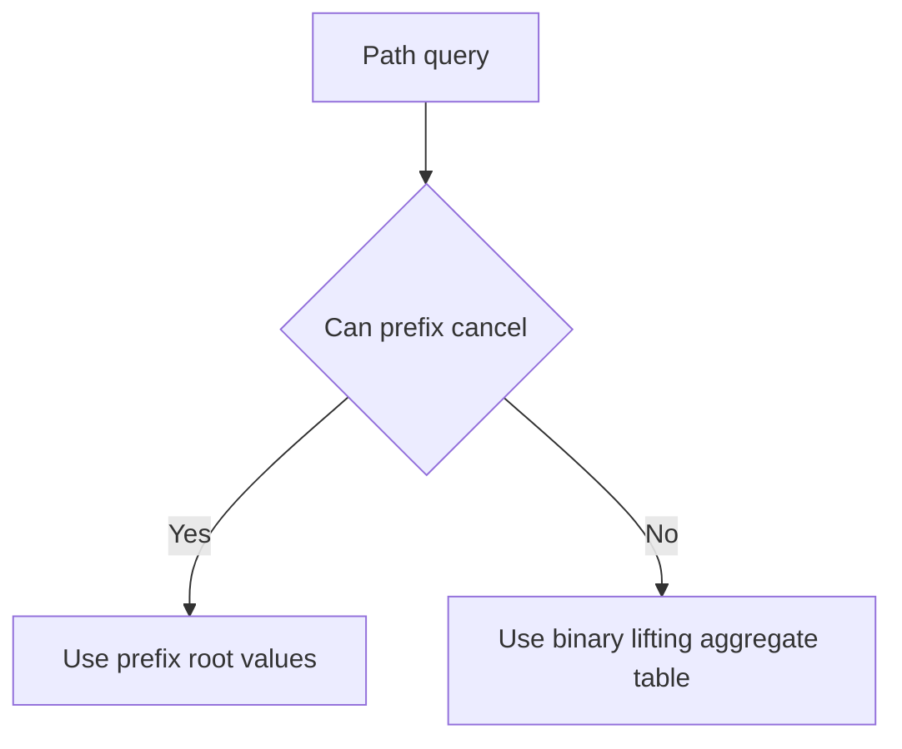

### Identity values

| Operation | Identity |
|---|---|
| sum | 0 |
| xor | 0 |
| gcd | 0 |
| min | +INF |
| max | -INF |

---

## 20. Binary lifting aggregate framework

Store:

```text
up[node][i]  = 2^i ancestor
agg[node][i] = aggregate from node upward for 2^i steps
```

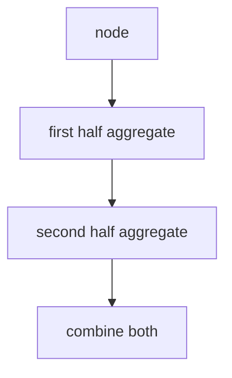

### Recurrence

```cpp
up[u][i] = up[ up[u][i - 1] ][i - 1];

agg[u][i] = combine(
    agg[u][i - 1],
    agg[ up[u][i - 1] ][i - 1]
);
```

---

## 21. Path GCD queries

Given node values, find GCD on path `u -> v`.

### C++ code

```cpp
int gcdInt(int a, int b) {
    if (b == 0) return a;
    return gcdInt(b, a % b);
}

vector<vector<int>> gcdUp;
vector<int> valueNode;

void dfsGcd(int u, int p) {
    up[u][0] = p;
    gcdUp[u][0] = valueNode[u];

    for (int i = 1; i < LOG; i++) {
        if (up[u][i - 1] == -1) {
            up[u][i] = -1;
            gcdUp[u][i] = gcdUp[u][i - 1];
        } else {
            int mid = up[u][i - 1];
            up[u][i] = up[mid][i - 1];
            gcdUp[u][i] = gcdInt(gcdUp[u][i - 1], gcdUp[mid][i - 1]);
        }
    }

    for (int v : tree[u]) {
        if (v != p) {
            depth[v] = depth[u] + 1;
            dfsGcd(v, u);
        }
    }
}
```

### Query skeleton

```cpp
int pathGcd(int u, int v) {
    int ans = 0;

    if (depth[u] < depth[v]) swap(u, v);

    int diff = depth[u] - depth[v];

    for (int i = LOG - 1; i >= 0; i--) {
        if ((diff >> i) & 1) {
            ans = gcdInt(ans, gcdUp[u][i]);
            u = up[u][i];
        }
    }

    if (u == v) {
        return gcdInt(ans, valueNode[u]);
    }

    for (int i = LOG - 1; i >= 0; i--) {
        if (up[u][i] != up[v][i]) {
            ans = gcdInt(ans, gcdUp[u][i]);
            ans = gcdInt(ans, gcdUp[v][i]);

            u = up[u][i];
            v = up[v][i];
        }
    }

    ans = gcdInt(ans, valueNode[u]);
    ans = gcdInt(ans, valueNode[v]);
    ans = gcdInt(ans, valueNode[up[u][0]]);

    return ans;
}
```

### 1-minute mental trick

> While jumping, collect answer from every jumped segment.

---

## 22. Path sum / min edge queries

For edge weights, push edge value down to child node.

```text
edge(parent -> child) value is stored at child
```

### Path sum query

```cpp
vector<vector<long long>> sumUp;
vector<long long> edgeToParent;

long long pathSum(int u, int v) {
    long long ans = 0;

    if (depth[u] < depth[v]) swap(u, v);

    int diff = depth[u] - depth[v];

    for (int i = LOG - 1; i >= 0; i--) {
        if ((diff >> i) & 1) {
            ans += sumUp[u][i];
            u = up[u][i];
        }
    }

    if (u == v) return ans;

    for (int i = LOG - 1; i >= 0; i--) {
        if (up[u][i] != up[v][i]) {
            ans += sumUp[u][i];
            ans += sumUp[v][i];

            u = up[u][i];
            v = up[v][i];
        }
    }

    ans += sumUp[u][0];
    ans += sumUp[v][0];

    return ans;
}
```

### Path minimum edge query

Replace `+` with `min`.

```cpp
const long long INF = 4e18;
vector<vector<long long>> minUp;

long long pathMinEdge(int u, int v) {
    long long ans = INF;

    if (depth[u] < depth[v]) swap(u, v);

    int diff = depth[u] - depth[v];

    for (int i = LOG - 1; i >= 0; i--) {
        if ((diff >> i) & 1) {
            ans = min(ans, minUp[u][i]);
            u = up[u][i];
        }
    }

    if (u == v) return ans;

    for (int i = LOG - 1; i >= 0; i--) {
        if (up[u][i] != up[v][i]) {
            ans = min(ans, minUp[u][i]);
            ans = min(ans, minUp[v][i]);

            u = up[u][i];
            v = up[v][i];
        }
    }

    ans = min(ans, minUp[u][0]);
    ans = min(ans, minUp[v][0]);

    return ans;
}
```

---

# Part 6. Sparse Table

## 23. Sparse table for RMQ

Sparse table answers static range queries.

Best for idempotent operations:

```text
min, max, gcd
```

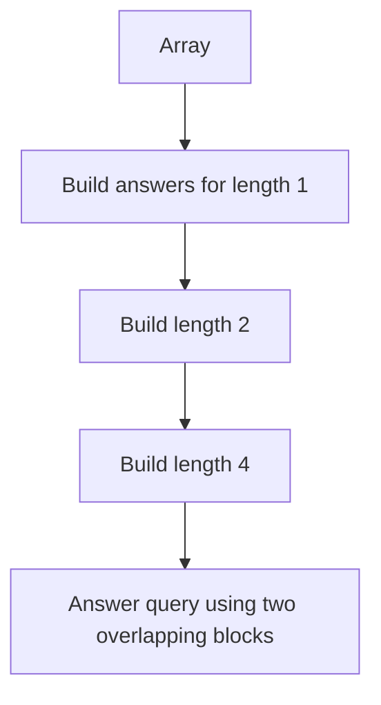

### C++ code for range minimum

```cpp
struct SparseTable {
    int n, LOG;
    vector<vector<int>> st;
    vector<int> lg;

    SparseTable(vector<int>& a) {
        n = a.size();
        LOG = 1;

        while ((1 << LOG) <= n) LOG++;

        st.assign(LOG, vector<int>(n));
        lg.assign(n + 1, 0);

        for (int i = 2; i <= n; i++) {
            lg[i] = lg[i / 2] + 1;
        }

        for (int i = 0; i < n; i++) {
            st[0][i] = a[i];
        }

        for (int j = 1; j < LOG; j++) {
            for (int i = 0; i + (1 << j) <= n; i++) {
                st[j][i] = min(st[j - 1][i],
                               st[j - 1][i + (1 << (j - 1))]);
            }
        }
    }

    int queryMin(int l, int r) {
        int j = lg[r - l + 1];

        return min(st[j][l],
                   st[j][r - (1 << j) + 1]);
    }
};
```

### 1-minute mental trick

> Sparse table stores power-of-two blocks.

---

# Part 7. K-th Greater Element With Binary Jumping

## 24. K-th next greater element

First compute next greater index `nge[i]`.  
Then binary lift over `nge`.

```text
next[i][0] = nge[i]
next[i][j] = next[ next[i][j-1] ][j-1]
```


### C++ code

```cpp
vector<int> nextGreater(vector<int>& a) {
    int n = a.size();
    vector<int> nge(n, n);
    stack<int> st;

    for (int i = n - 1; i >= 0; i--) {
        while (!st.empty() && a[st.top()] <= a[i]) {
            st.pop();
        }

        if (!st.empty()) nge[i] = st.top();

        st.push(i);
    }

    return nge;
}

int kthGreaterIndex(vector<int>& a, int start, int k) {
    int n = a.size();
    const int LOG = 20;

    vector<int> nge = nextGreater(a);
    vector<vector<int>> nxt(n + 1, vector<int>(LOG, n));

    for (int i = 0; i < n; i++) {
        nxt[i][0] = nge[i];
    }

    for (int j = 1; j < LOG; j++) {
        for (int i = 0; i <= n; i++) {
            nxt[i][j] = nxt[nxt[i][j - 1]][j - 1];
        }
    }

    int cur = start;

    for (int j = LOG - 1; j >= 0; j--) {
        if ((k >> j) & 1) {
            cur = nxt[cur][j];
        }
    }

    return cur == n ? -1 : cur;
}
```

---

# Part 8. Union Find / DSU

## 25. DSU intuition

DSU manages components.

Operations:

```text
find(x)  -> representative of x's component
merge(x, y) -> connect components of x and y
```

```mermaid
flowchart TD
    A[Node x] --> B[find x]
    B --> C[Representative]
    D[merge x y] --> E[Find representatives]
    E --> F[Attach smaller component to larger]
```

### Use cases

- dynamic connectivity
- Kruskal MST
- count components after adding edges
- process removal queries in reverse
- group merging

---

## 26. Basic DSU

```cpp
struct DSU {
    vector<int> parent;
    vector<int> size;

    DSU(int n) {
        parent.resize(n + 1);
        size.assign(n + 1, 1);

        for (int i = 1; i <= n; i++) {
            parent[i] = i;
        }
    }

    int find(int x) {
        if (parent[x] == x) return x;
        return find(parent[x]);
    }

    bool merge(int a, int b) {
        a = find(a);
        b = find(b);

        if (a == b) return false;

        parent[a] = b;
        size[b] += size[a];

        return true;
    }
};
```

### Problem

Without optimization, `find` can become `O(N)`.

---

## 27. Union by size / rank

Always attach smaller component to larger component.

```mermaid
flowchart TD
    A[Find root a] --> C{size a < size b}
    B[Find root b] --> C
    C -->|Yes| D[Attach a under b]
    C -->|No| E[Attach b under a]
```

### Optimized merge

```cpp
bool merge(int a, int b) {
    a = find(a);
    b = find(b);

    if (a == b) return false;

    if (size[a] < size[b]) swap(a, b);

    parent[b] = a;
    size[a] += size[b];

    return true;
}
```

---

## 28. Path compression

During `find`, directly connect every visited node to representative.

```mermaid
flowchart LR
    A[x] --> B[parent]
    B --> C[root]
    A -.after compression.-> C
```

### Optimized find

```cpp
int find(int x) {
    if (parent[x] == x) return x;

    return parent[x] = find(parent[x]);
}
```

### Final DSU template

```cpp
struct DSU {
    vector<int> parent;
    vector<int> size;

    DSU(int n) {
        parent.resize(n + 1);
        size.assign(n + 1, 1);

        for (int i = 1; i <= n; i++) {
            parent[i] = i;
        }
    }

    int find(int x) {
        if (parent[x] == x) return x;
        return parent[x] = find(parent[x]);
    }

    bool merge(int a, int b) {
        a = find(a);
        b = find(b);

        if (a == b) return false;

        if (size[a] < size[b]) swap(a, b);

        parent[b] = a;
        size[a] += size[b];

        return true;
    }

    bool same(int a, int b) {
        return find(a) == find(b);
    }

    int componentSize(int x) {
        return size[find(x)];
    }
};
```

### Complexity

With path compression + union by size/rank:

```text
Almost O(1) per operation
Technically O(alpha(n))
```

### 1-minute mental trick

> DSU is a family system: every person points to family head.

---

## 29. Count components with DSU

```cpp
int countComponents(int n, vector<pair<int,int>>& edges) {
    DSU dsu(n);
    int components = n;

    for (auto [u, v] : edges) {
        if (dsu.merge(u, v)) {
            components--;
        }
    }

    return components;
}
```

---

## 30. Removal queries trick

DSU supports adding edges easily, not deleting.

So for removal queries:

```text
Process offline in reverse.
Removal becomes addition.
```

```mermaid
flowchart TD
    A[Original removals] --> B[Reverse order]
    B --> C[Add edges back]
    C --> D[Answer components after each reverse step]
```

### Example

```text
Edges removed in order:
e1, e2, e3

Reverse process:
Start graph after all removals.
Add e3.
Add e2.
Add e1.
```

### Mental trick

> DSU cannot delete, so reverse time.

---

## 31. DSU and MST

Kruskal uses DSU:

```text
Sort edges by weight.
If endpoints are in different components, take edge.
Merge components.
```

```cpp
struct Edge {
    int u, v;
    long long w;
};

long long kruskal(int n, vector<Edge>& edges) {
    sort(edges.begin(), edges.end(), [](Edge& a, Edge& b) {
        return a.w < b.w;
    });

    DSU dsu(n);
    long long ans = 0;
    int used = 0;

    for (auto e : edges) {
        if (dsu.merge(e.u, e.v)) {
            ans += e.w;
            used++;
        }
    }

    return used == n - 1 ? ans : -1;
}
```

---

# Part 9. Final Quick Notes

## 32. Tree quick notes

```text
Tree:
N nodes, N - 1 edges, connected, no cycle.

Rooted tree:
Parent, child, depth, subtree.

DFS values:
subtree[u] = 1 + sum subtree[child]

Diameter:
farthest from farthest.

Center:
middle of diameter.

Centroid:
all parts after removal have size <= N/2.

Distance:
depth[u] + depth[v] - 2 * depth[lca]
```

---

## 33. Binary lifting quick notes

```text
up[u][i] = 2^i ancestor of u
up[u][i] = up[up[u][i-1]][i-1]

K-th ancestor:
break k into binary bits.

LCA:
1. equalize depth
2. jump both
3. parent is answer

Dynamic root LCA:
deepest among:
lca(u,v), lca(u,root), lca(v,root)

Path update:
+ at endpoints, - at lca and parent[lca], then postorder accumulate.

Path aggregate:
jump and combine segments.
```

---

## 34. DSU quick notes

```text
find(x):
representative of component.

merge(x, y):
connect two components.

Optimization:
path compression + union by size.

Use DSU for:
connectivity
component count
Kruskal MST
offline reverse deletions
```

---

## 35. Final decision map

```mermaid
flowchart TD
    A[Problem] --> B{Tree or dynamic components}

    B -->|Tree path query| C[LCA / Binary lifting]
    B -->|Tree subtree values| D[DFS subtree]
    B -->|Tree longest path| E[Diameter]
    B -->|Balanced root| F[Centroid]
    B -->|Path update point query| G[Partial sum on tree]
    B -->|Path min max gcd| H[Binary lifting aggregate]
    B -->|Connectivity changes by adding edges| I[DSU]
    B -->|Removing edges offline| J[Reverse + DSU]
```

---

END
