# Dynamic Programming Pattern-Wise Visual Reference

Made from the attached DP notes in order:

1. Recursion mindset and LCCM  
2. Intro to DP  
3. DP framework  
4. DP forms  
5. Form 1: take / not take, knapsack, subset sum  
6. Form 2: ending at index, LIS, partitions  
7. Form 3: matching DP  
8. Form 4: interval / left-right DP  
9. Form 5: game DP  
10. Automata / string-state DP  
11. State-space reduction and optimisations  
12. Practice drills

This file is for quick CP/DSA reference with Mermaid diagrams, step-by-step examples, C++ code, Java helpers where useful, and 1-minute mental tricks.

---

## 0. Master DP Mental Map

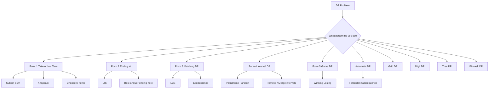

### 1-minute mental trick

> DP is recursion plus memory.  
> First write recursion state. Then cache it.

---

# Part 1. Recursion Mindset Before DP

## 1. What is recursion?

Recursion is a function calling itself.

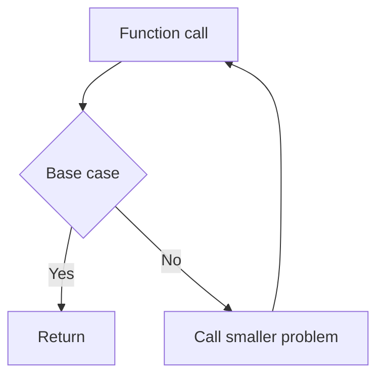

### Factorial

```text
fact x = x * fact x minus 1
fact 0 = 1
```

```cpp
long long fact(int x) {
    if (x == 0) return 1;
    return 1LL * x * fact(x - 1);
}
```

### Fibonacci

```text
fib x = fib x minus 1 + fib x minus 2
fib 0 = 0
fib 1 = 1
```

```cpp
long long fib(int x) {
    if (x <= 1) return x;
    return fib(x - 1) + fib(x - 2);
}
```

### Step example

```text
fib 5
= fib 4 + fib 3
= fib 3 + fib 2 + fib 2 + fib 1
```

Many states repeat. That is why DP helps.

---

## 2. Induction mindset

For recursion, assume smaller answers are correct.

```text
Normal induction:
if f x depends on f x minus 1,
assume f x minus 1 is correct.

Strong induction:
if f x depends on many smaller values,
assume all f 0 to f x minus 1 are correct.
```

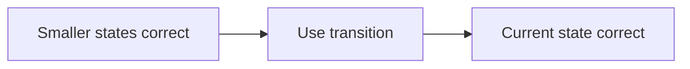

### Mental trick

> Trust smaller states. Design how current state uses them.

---

## 3. LCCM Framework

LCCM is your framework for writing recursion and DP.

```text
L = Level
C = Choice
C = Check
M = Move
```

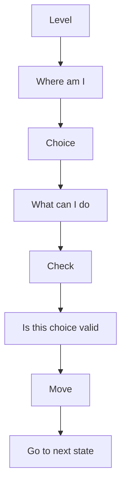

### LCCM table

| Part | Question |
|---|---|
| Level | What does one recursive call represent? |
| Choice | What options do I have at this state? |
| Check | Which choices are invalid? |
| Move | How does the state change after choice? |

---

## 4. LCCM example: stairs

Problem:

```text
Person is at stair x.
Can jump x to x plus 1 or x to x plus 2.
How many ways to reach N from 0?
```

### LCCM

```text
Level  = current stair
Choice = jump 1 or jump 2
Check  = stair cannot exceed N
Move   = go to stair plus jump
```

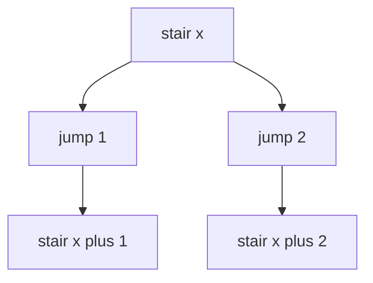

### C++ code

```cpp
int waysStairs(int x, int n) {
    if (x == n) return 1;
    if (x > n) return 0;

    return waysStairs(x + 1, n) + waysStairs(x + 2, n);
}
```

### DP version

```cpp
int waysStairsDP(int n) {
    vector<int> dp(n + 2, -1);

    function<int(int)> rec = [&](int x) {
        if (x == n) return 1;
        if (x > n) return 0;

        if (dp[x] != -1) return dp[x];

        return dp[x] = rec(x + 1) + rec(x + 2);
    };

    return rec(0);
}
```

---

## 5. N Queens LCCM

Two possible LCCM designs from notes:

### Method 1

```text
Level  = cell
Choice = place or not place
Check  = no attack from previous queens
Move   = next cell
```

### Method 2

```text
Level  = row
Choice = column
Check  = no attack from previous queens
Move   = place queen and move to next row
```

Method 2 is cleaner because each row must have one queen.

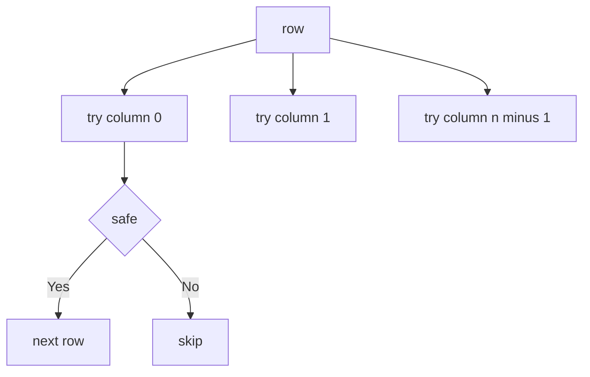

---

# Part 2. Intro to DP

## 6. What is DP?

DP is:

```text
Recursion or backtracking with memoization.
```

If the same state appears again, return already computed value.

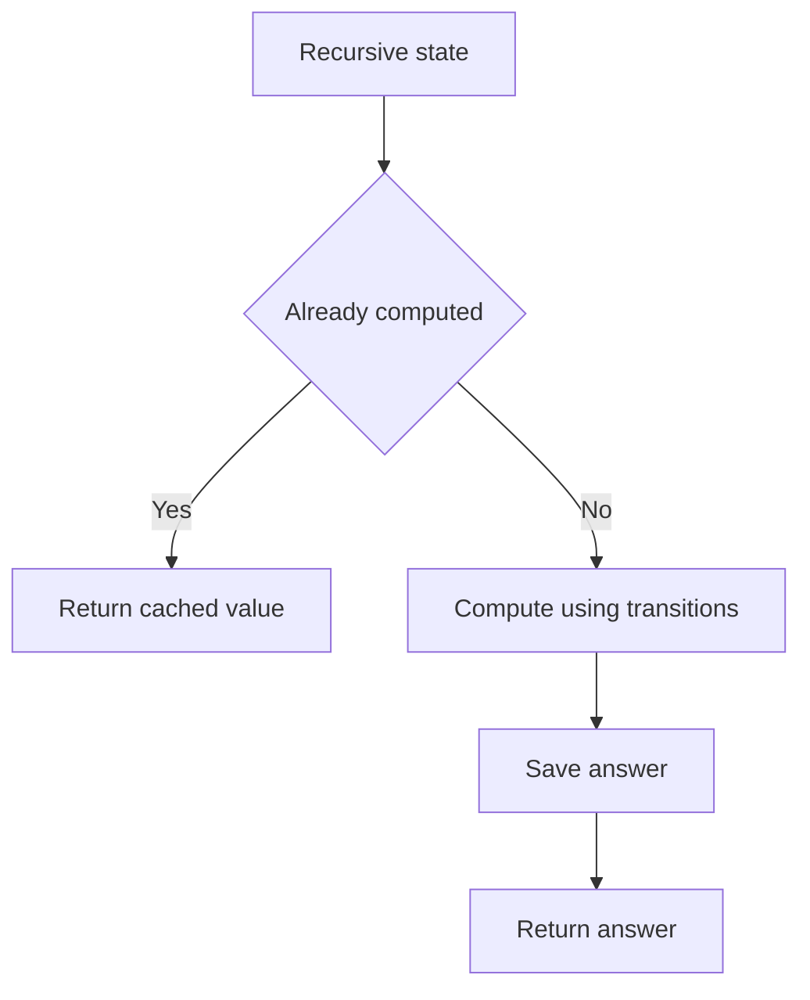

### DP needs two properties

1. **Overlapping subproblems**  
   Same state repeats.

2. **Optimal substructure**  
   Answer of current state can be built using answers of smaller states.

---

## 7. DP coding style from notes

Always code in this order:

```text
1. Pruning
2. Base case
3. Cache check
4. Compute
5. Save and return
```

```cpp
int rec(int state) {
    // 1. pruning
    if (invalid(state)) return INVALID_VALUE;

    // 2. base case
    if (base(state)) return BASE_VALUE;

    // 3. cache check
    if (dp[state] != -1) return dp[state];

    // 4. compute
    int ans = 0;

    // transitions here

    // 5. save and return
    return dp[state] = ans;
}
```

### 1-minute mental trick

> Never directly trust a dp array value unless you know it was computed.  
> Use cache check or a done array.

---

## 8. General DP framework

From the notes:

```text
1. Look for the form of the problem.
2. Decide state and meaning.
3. Decide transitions.
4. Check time complexity.
5. Code.
```

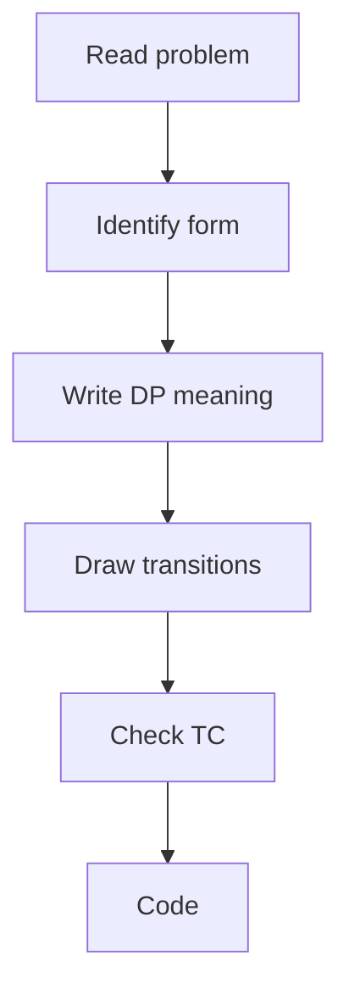

### Time complexity formula

```text
TC = number of states * average transitions per state
```

More generally:

```text
TC = S * (1 + T)
```

Where:
- `S` = number of states
- `T` = average transitions per state

---

## 9. Base case return values

| Problem type | Invalid state | Valid finished state |
|---|---:|---:|
| Count ways | 0 | 1 |
| Minimize | +INF | 0 |
| Maximize | -INF | 0 |
| Possible or not | false | true |

### Mental trick

> Invalid return should never be chosen.  
> Valid finished return should add no extra cost.

---

# Part 3. DP Forms

## 10. DP form identification

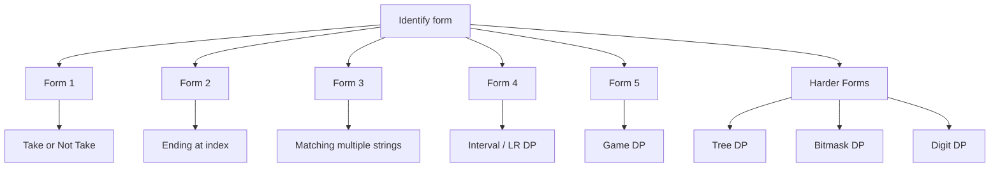

### Quick recognition table

| Clue in problem | Likely form |
|---|---|
| choose subset, subsequence, items | Form 1 |
| best answer ending at i | Form 2 |
| two strings, match, edit | Form 3 |
| substring, interval, l r | Form 4 |
| players alternate, win lose | Form 5 |
| forbidden subsequence / pattern | Automata DP |
| grid moves | Grid DP |
| tree structure | Tree DP |
| all subsets of small n | Bitmask DP |

---

# Part 4. Form 1: Take or Not Take

## 11. Form 1 idea

Use when each item has choices:

```text
take
not take
```

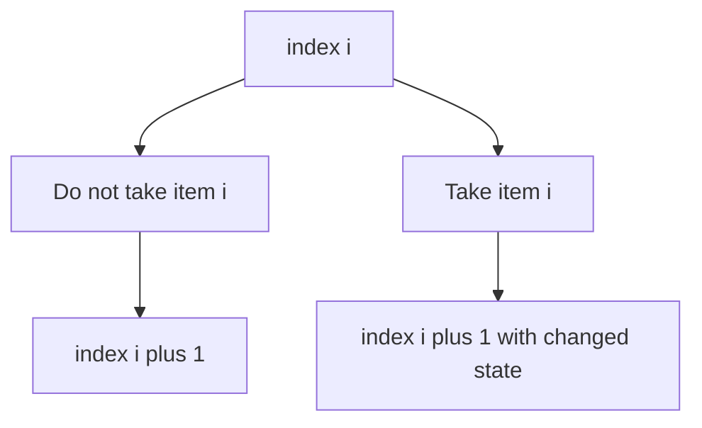

### Generic state

```text
dp(level, extra_state)
```

Examples of `extra_state`:
- sum left
- weight left
- count left
- last taken
- time left
- mask
- remainder

---

## 12. Subset sum possible

Problem:

```text
Given array a and target T.
Check if some subset has sum T.
```

### LCCM

```text
Level  = index
Choice = take or not take
Check  = remaining sum cannot go negative
Move   = next index
```

### State meaning

```text
dp(level, rem) = can we create sum rem using items from level to n-1
```

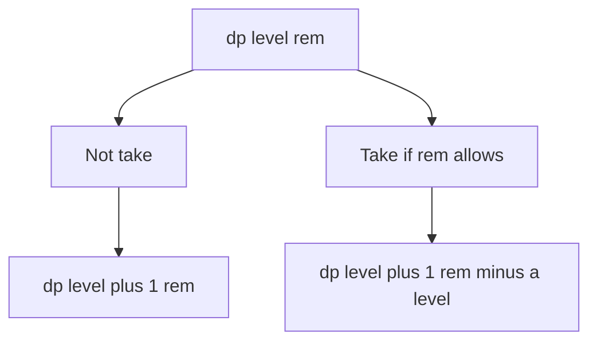

### C++ code

```cpp
bool subsetSum(vector<int>& a, int T) {
    int n = a.size();
    vector<vector<int>> dp(n + 1, vector<int>(T + 1, -1));

    function<int(int,int)> rec = [&](int level, int rem) {
        if (rem < 0) return 0;

        if (level == n) {
            return rem == 0;
        }

        if (dp[level][rem] != -1) return dp[level][rem];

        int ans = rec(level + 1, rem);

        if (rem >= a[level]) {
            ans = ans || rec(level + 1, rem - a[level]);
        }

        return dp[level][rem] = ans;
    };

    return rec(0, T);
}
```

### Java helper

```java
static int[][] dp;
static int[] a;

static int subsetRec(int level, int rem) {
    if (rem < 0) return 0;

    if (level == a.length) {
        return rem == 0 ? 1 : 0;
    }

    if (dp[level][rem] != -1) return dp[level][rem];

    int ans = subsetRec(level + 1, rem);

    if (rem >= a[level]) {
        ans |= subsetRec(level + 1, rem - a[level]);
    }

    return dp[level][rem] = ans;
}
```

### 1-minute mental trick

> For many queries, use `rem` instead of `sum_taken`.  
> It gives reusable DP for different targets.

---

## 13. Printing subset sum solution

After computing DP, reconstruct path.

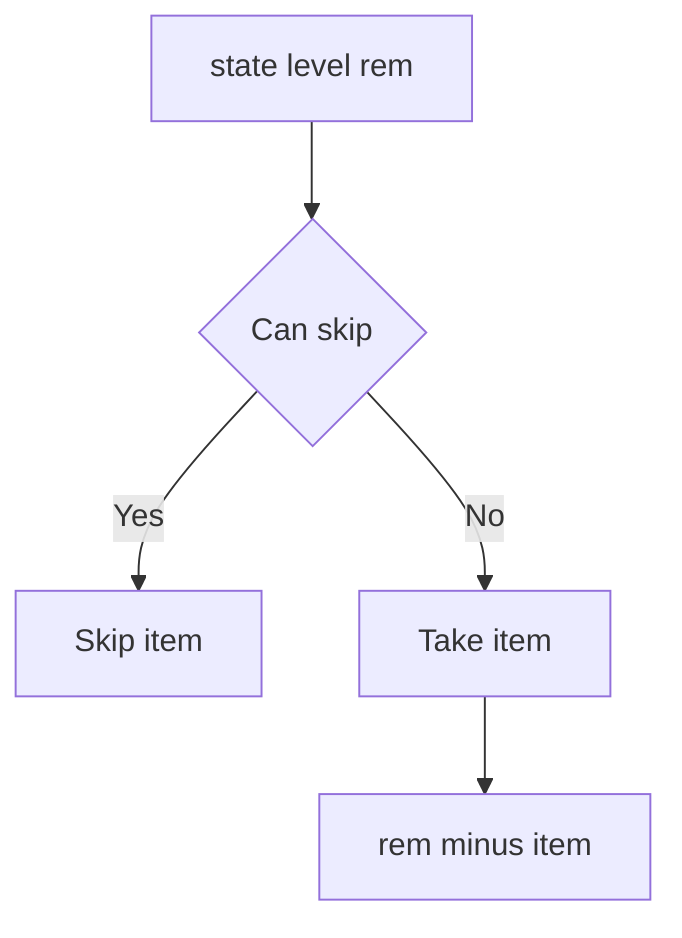

### C++ code

```cpp
vector<int> printSubset(vector<int>& a, int T) {
    int n = a.size();
    vector<vector<int>> dp(n + 1, vector<int>(T + 1, -1));

    function<int(int,int)> rec = [&](int level, int rem) {
        if (rem < 0) return 0;
        if (level == n) return rem == 0;
        if (dp[level][rem] != -1) return dp[level][rem];

        int ans = rec(level + 1, rem);
        if (rem >= a[level]) {
            ans |= rec(level + 1, rem - a[level]);
        }
        return dp[level][rem] = ans;
    };

    vector<int> chosen;
    if (!rec(0, T)) return chosen;

    int level = 0, rem = T;
    while (level < n) {
        if (rec(level + 1, rem)) {
            level++;
        } else {
            chosen.push_back(a[level]);
            rem -= a[level];
            level++;
        }
    }

    return chosen;
}
```

---

## 14. 0/1 Knapsack

Problem:

```text
Each item has weight w[i] and value v[i].
Capacity W.
Take each item at most once.
Maximize value.
```

### State meaning

```text
dp(level, weight_left) = max value from items level to n-1
```

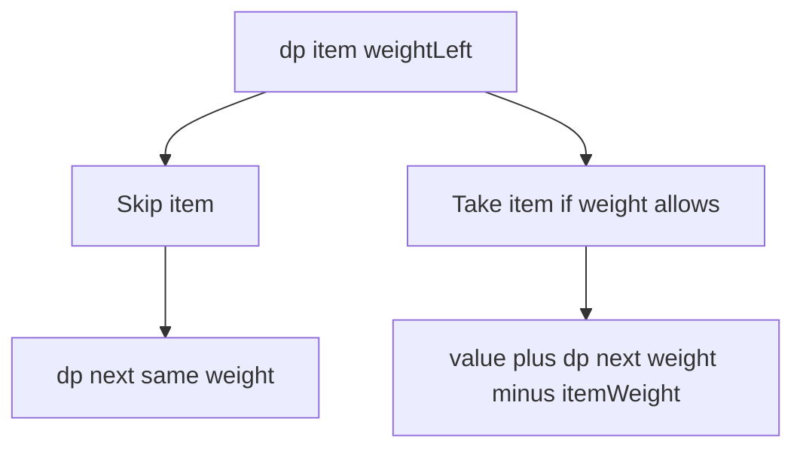

### C++ code

```cpp
int knapsack01(vector<int>& w, vector<int>& val, int W) {
    int n = w.size();
    vector<vector<int>> dp(n + 1, vector<int>(W + 1, -1));

    function<int(int,int)> rec = [&](int level, int left) {
        if (left < 0) return (int)-1e9;

        if (level == n) return 0;

        if (dp[level][left] != -1) return dp[level][left];

        int ans = rec(level + 1, left);

        if (w[level] <= left) {
            ans = max(ans, val[level] + rec(level + 1, left - w[level]));
        }

        return dp[level][left] = ans;
    };

    return rec(0, W);
}
```

### State rotation trick

If `W` is huge but total value is small:

```text
dp(i, profit) = minimum weight needed to make profit using items i..n
```

Answer is max profit such that:

```text
dp(0, profit) <= W
```

### C++ value-based knapsack

```cpp
int knapsackByValue(vector<int>& w, vector<int>& val, int W) {
    int n = w.size();
    int maxProfit = accumulate(val.begin(), val.end(), 0);
    const int INF = 1e9;

    vector<vector<int>> dp(n + 1, vector<int>(maxProfit + 1, INF));

    for (int i = 0; i <= n; i++) dp[i][0] = 0;

    for (int i = n - 1; i >= 0; i--) {
        for (int p = 0; p <= maxProfit; p++) {
            dp[i][p] = dp[i + 1][p];

            if (p >= val[i]) {
                dp[i][p] = min(dp[i][p], w[i] + dp[i + 1][p - val[i]]);
            }
        }
    }

    int ans = 0;
    for (int p = 0; p <= maxProfit; p++) {
        if (dp[0][p] <= W) ans = p;
    }

    return ans;
}
```

### 1-minute mental trick

> If capacity is too large, rotate state from weight to profit.

---

## 15. Vacation / no consecutive same activity

Problem style:

```text
For each day choose one activity.
Cannot choose same activity on consecutive days.
Maximize points.
```

### State

```text
dp(day, previousActivity) = max points from this day onward
```

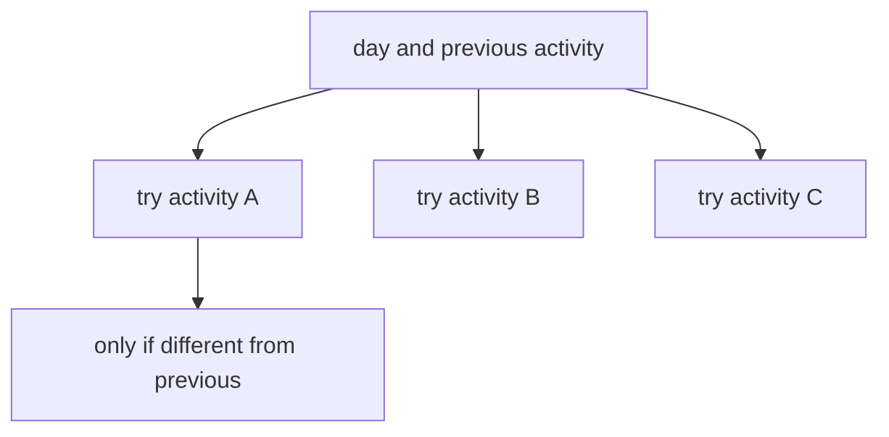

### C++ code

```cpp
int vacation(vector<array<int,3>>& points) {
    int n = points.size();
    vector<vector<int>> dp(n + 1, vector<int>(4, -1));

    function<int(int,int)> rec = [&](int day, int prev) {
        if (day == n) return 0;

        if (dp[day][prev] != -1) return dp[day][prev];

        int ans = 0;

        for (int act = 0; act < 3; act++) {
            if (act == prev) continue;

            ans = max(ans, points[day][act] + rec(day + 1, act));
        }

        return dp[day][prev] = ans;
    };

    return rec(0, 3);
}
```

### Common mistake from notes

Do not directly return `dp[day][prev]` if `prev = -1` and your array cannot index `-1`.  
Use sentinel index like `3`.

---

## 16. Boredom / Delete and Earn

Problem idea:

```text
If you take value x, you cannot take x-1 or x+1.
Multiple equal x values combine as freq[x] * x.
```

### Key insight from notes

Do not iterate on original indices. Iterate on numbers.

```text
take x     -> gain freq[x] * x and move to x + 2
not take x -> move to x + 1
```


### C++ code

```cpp
long long deleteAndEarn(vector<int>& a) {
    int mx = 0;
    for (int x : a) mx = max(mx, x);

    vector<long long> freq(mx + 2, 0);
    for (int x : a) freq[x]++;

    vector<long long> dp(mx + 3, -1);

    function<long long(int)> rec = [&](int x) {
        if (x > mx) return 0LL;

        if (dp[x] != -1) return dp[x];

        long long take = freq[x] * x + rec(x + 2);
        long long skip = rec(x + 1);

        return dp[x] = max(take, skip);
    };

    return rec(1);
}
```

### 1-minute mental trick

> If taking value affects neighbouring values, compress by value frequency.

---

# Part 5. Form 2: Ending at i

## 17. Form 2 idea

Use when the answer is:

```text
best answer ending at index i
```

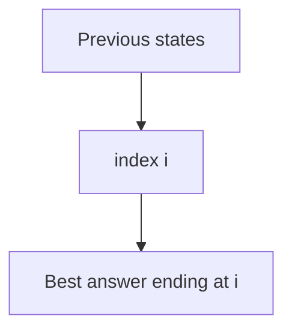

### Generic state

```text
dp[i] = best answer ending at i
```

Examples:
- LIS ending at i
- longest regular bracket sequence ending at i
- max subarray ending at i
- best partition ending at i

---

## 18. LIS O n squared

Problem:

```text
Find longest increasing subsequence.
```

### State

```text
dp[i] = length of LIS ending at i
```

### Transition

```text
dp[i] = 1 + max dp[j]
where j < i and a[j] < a[i]
```

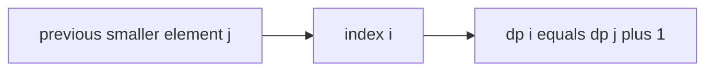

### C++ code

```cpp
int lisN2(vector<int>& a) {
    int n = a.size();
    vector<int> dp(n, 1);

    int ans = 1;

    for (int i = 0; i < n; i++) {
        for (int j = 0; j < i; j++) {
            if (a[j] < a[i]) {
                dp[i] = max(dp[i], dp[j] + 1);
            }
        }

        ans = max(ans, dp[i]);
    }

    return ans;
}
```

---

## 19. LIS O n log n

Notes idea:

Maintain partial solutions efficiently.

For each length, store the smallest possible tail value.

```text
tail[len] = minimum possible last value of increasing subsequence of length len
```

If two partial solutions have same length, keep the one with smaller last value.

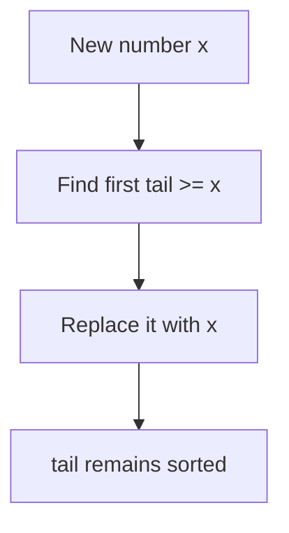

### Step example

```text
a = [1, 5, 7, 10, 9, 6, 8, 2, 3]

tail changes:
1
1 5
1 5 7
1 5 7 10
1 5 7 9
1 5 6 9
1 5 6 8
1 2 6 8
1 2 3 8

answer = 4
```

### C++ code

```cpp
int lisNlogN(vector<int>& a) {
    vector<int> tail;

    for (int x : a) {
        auto it = lower_bound(tail.begin(), tail.end(), x);

        if (it == tail.end()) {
            tail.push_back(x);
        } else {
            *it = x;
        }
    }

    return tail.size();
}
```

### 1-minute mental trick

> For LIS, smaller tail is always better for future growth.

---

## 20. Longest bitonic subsequence

Bitonic means:

```text
strictly increasing then strictly decreasing
```

Compute:
- LIS ending at i from left
- LIS ending at i from right, which acts like decreasing side

```text
bitonic[i] = inc[i] + dec[i] - 1
```

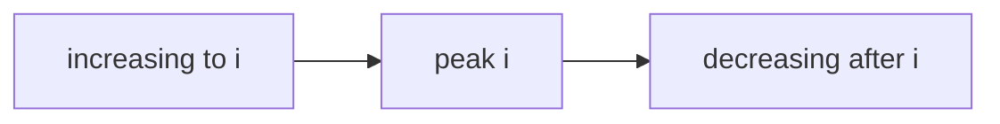

### C++ code

```cpp
int longestBitonic(vector<int>& a) {
    int n = a.size();
    vector<int> inc(n, 1), dec(n, 1);

    for (int i = 0; i < n; i++) {
        for (int j = 0; j < i; j++) {
            if (a[j] < a[i]) inc[i] = max(inc[i], inc[j] + 1);
        }
    }

    for (int i = n - 1; i >= 0; i--) {
        for (int j = n - 1; j > i; j--) {
            if (a[j] < a[i]) dec[i] = max(dec[i], dec[j] + 1);
        }
    }

    int ans = 1;
    for (int i = 0; i < n; i++) {
        ans = max(ans, inc[i] + dec[i] - 1);
    }

    return ans;
}
```

---

## 21. Partition DP: minimum cuts for palindrome partition

Problem:

```text
s = "abacddaba"
Break into minimum number of palindromic parts.
```

### Form identification

Partition / substring ending at `i` means Form 2 plus palindrome precompute.

### State

```text
dp[i] = minimum palindromic parts needed for s[0..i]
```

Transition:

```text
dp[i] = min over j:
1 + dp[j-1], if s[j..i] is palindrome
```

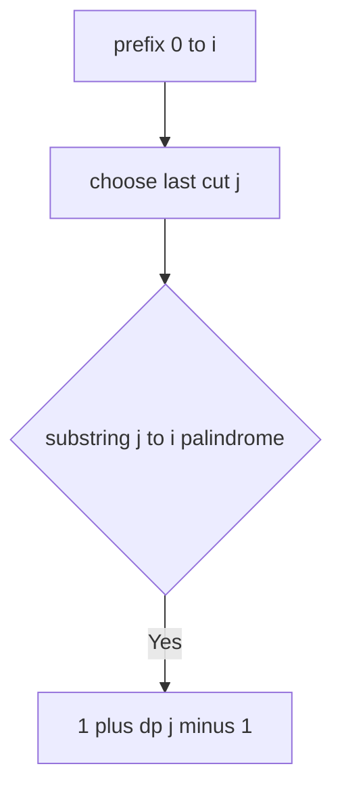

### Precompute palindrome

```text
pal[l][r] = pal[l+1][r-1] and s[l] == s[r]
```

### C++ code

```cpp
int minPalindromeParts(string s) {
    int n = s.size();
    vector<vector<int>> pal(n, vector<int>(n, 0));

    for (int len = 1; len <= n; len++) {
        for (int l = 0; l + len - 1 < n; l++) {
            int r = l + len - 1;

            if (len == 1) pal[l][r] = 1;
            else if (len == 2) pal[l][r] = (s[l] == s[r]);
            else pal[l][r] = (s[l] == s[r] && pal[l + 1][r - 1]);
        }
    }

    const int INF = 1e9;
    vector<int> dp(n, INF);

    for (int i = 0; i < n; i++) {
        for (int j = 0; j <= i; j++) {
            if (pal[j][i]) {
                if (j == 0) dp[i] = 1;
                else dp[i] = min(dp[i], 1 + dp[j - 1]);
            }
        }
    }

    return dp[n - 1];
}
```

### 1-minute mental trick

> Partition DP: choose the last segment.

---

## 22. George and Job: choose K non-overlapping segments

Problem pattern:

```text
Choose k segments each of length m.
Maximize sum.
```

### State

```text
dp(i, x) = best sum using prefix up to i with x segments
```

Transition:

```text
skip i:
dp(i-1, x)

take segment ending at i:
dp(i-m, x-1) + sum(i-m+1..i)
```

```mermaid
flowchart TD
    A[dp i x] --> B[Skip index i]
    A --> C[Take segment ending at i]
    B --> D[dp i minus 1 x]
    C --> E[dp i minus m x minus 1 plus segment sum]
```

### C++ code

```cpp
long long maxKSegments(vector<int>& a, int m, int k) {
    int n = a.size();
    vector<long long> pref(n + 1, 0);

    for (int i = 0; i < n; i++) {
        pref[i + 1] = pref[i] + a[i];
    }

    auto sumSegment = [&](int l, int r) {
        return pref[r + 1] - pref[l];
    };

    vector<vector<long long>> dp(n + 1, vector<long long>(k + 1, 0));

    for (int i = 1; i <= n; i++) {
        for (int x = 0; x <= k; x++) {
            dp[i][x] = dp[i - 1][x];

            if (x > 0 && i >= m) {
                long long seg = sumSegment(i - m, i - 1);
                dp[i][x] = max(dp[i][x], dp[i - m][x - 1] + seg);
            }
        }
    }

    return dp[n][k];
}
```

---

# Part 6. Form 3: Matching DP

## 23. Form 3 idea

Use when there are:

```text
multiple strings
multiple arrays
matching / editing / aligning
```

```mermaid
flowchart TD
    A[dp i j] --> B[Use char from both]
    A --> C[Use char from first]
    A --> D[Use char from second]
```

### Common state

```text
dp(i, j) = answer for suffix s1[i..] and s2[j..]
```

---

## 24. LCS

Problem:

```text
Longest common subsequence of s and t.
```

### State

```text
dp(i, j) = LCS length of s[i..] and t[j..]
```

### Transition

```text
if s[i] == t[j]:
    1 + dp(i+1, j+1)
else:
    max(dp(i+1, j), dp(i, j+1))
```

```mermaid
flowchart TD
    A[dp i j] --> B{characters match}
    B -->|Yes| C[1 plus dp i plus 1 j plus 1]
    B -->|No| D[max skip s or skip t]
```

### C++ code

```cpp
int lcs(string s, string t) {
    int n = s.size(), m = t.size();
    vector<vector<int>> dp(n + 1, vector<int>(m + 1, -1));

    function<int(int,int)> rec = [&](int i, int j) {
        if (i == n || j == m) return 0;

        if (dp[i][j] != -1) return dp[i][j];

        if (s[i] == t[j]) {
            return dp[i][j] = 1 + rec(i + 1, j + 1);
        }

        return dp[i][j] = max(rec(i + 1, j), rec(i, j + 1));
    };

    return rec(0, 0);
}
```

### Java helper

```java
static int[][] dp;
static String s, t;

static int lcsRec(int i, int j) {
    if (i == s.length() || j == t.length()) return 0;

    if (dp[i][j] != -1) return dp[i][j];

    if (s.charAt(i) == t.charAt(j)) {
        return dp[i][j] = 1 + lcsRec(i + 1, j + 1);
    }

    return dp[i][j] = Math.max(lcsRec(i + 1, j), lcsRec(i, j + 1));
}
```

---

## 25. Edit distance

Problem:

```text
Minimum operations to convert s to t.
Operations: insert, delete, replace.
```

### State

```text
dp(i, j) = min cost to convert s[i..] into t[j..]
```

### Transition

If same:

```text
dp(i, j) = dp(i+1, j+1)
```

Else choose:
- replace: `1 + dp(i+1, j+1)`
- delete: `1 + dp(i+1, j)`
- insert: `1 + dp(i, j+1)`

```mermaid
flowchart TD
    A[dp i j] --> B[Replace both move]
    A --> C[Delete from s]
    A --> D[Insert into s]
```

### C++ code

```cpp
int editDistance(string s, string t) {
    int n = s.size(), m = t.size();
    vector<vector<int>> dp(n + 1, vector<int>(m + 1, -1));

    function<int(int,int)> rec = [&](int i, int j) {
        if (i == n) return m - j;
        if (j == m) return n - i;

        if (dp[i][j] != -1) return dp[i][j];

        if (s[i] == t[j]) return dp[i][j] = rec(i + 1, j + 1);

        int replaceCost = 1 + rec(i + 1, j + 1);
        int deleteCost = 1 + rec(i + 1, j);
        int insertCost = 1 + rec(i, j + 1);

        return dp[i][j] = min({replaceCost, deleteCost, insertCost});
    };

    return rec(0, 0);
}
```

### 1-minute mental trick

> Matching DP: pointers on strings decide what to consume.

---

# Part 7. Form 4: Interval / Left-Right DP

## 26. Form 4 idea

Use when solving every substring/subarray/interval.

```text
dp(l, r) = answer for interval l..r
```

```mermaid
flowchart TD
    A[Interval l r] --> B[Shrink left]
    A --> C[Shrink right]
    A --> D[Split at mid]
```

Examples:
- palindrome check
- matrix chain multiplication
- merge stones
- burst balloons
- remove intervals

---

## 27. Palindrome table using interval DP

```text
pal[l][r] = true if s[l..r] is palindrome
```

Transition:

```text
pal[l][r] = s[l] == s[r] and pal[l+1][r-1]
```

```mermaid
flowchart TD
    A[pal l r] --> B[Compare outer chars]
    A --> C[Need inner pal l plus 1 r minus 1]
```

### C++ code

```cpp
vector<vector<int>> buildPalindromeTable(string s) {
    int n = s.size();
    vector<vector<int>> pal(n, vector<int>(n, 0));

    for (int len = 1; len <= n; len++) {
        for (int l = 0; l + len - 1 < n; l++) {
            int r = l + len - 1;

            if (len == 1) pal[l][r] = 1;
            else if (len == 2) pal[l][r] = (s[l] == s[r]);
            else pal[l][r] = (s[l] == s[r] && pal[l + 1][r - 1]);
        }
    }

    return pal;
}
```

### Iterative order

For interval DP, fill by increasing length:

```text
length 1
length 2
length 3
...
```

### 1-minute mental trick

> Interval DP depends on smaller intervals, so iterate by length.

---

# Part 8. Form 5: Game DP

## 28. Form 5 idea

Use when players alternate turns.

Typical state:

```text
dp(state) = can current player win from this state
```

```mermaid
flowchart TD
    A[Current state] --> B[Try move 1]
    A --> C[Try move 2]
    A --> D[Try move 3]
    B --> E[Opponent state]
    E --> F{Opponent losing}
    F -->|Yes| G[Current wins]
```

### Winning rule

```text
Current state is winning if there exists at least one move to a losing state.
Current state is losing if all moves go to winning states.
```

---

## 29. Divisor game style

Game:

```text
Given x.
Move to x - d where d divides x, d not equal 1 and d not equal x.
If no move, current player loses.
```

### State

```text
dp[x] = can current player win with number x
```

### Transition

```text
dp[x] = true if any valid divisor d makes dp[x-d] false
```

```mermaid
flowchart TD
    A[state x] --> B[choose divisor d]
    B --> C[state x minus d]
    C --> D{losing for opponent}
    D -->|Yes| E[x is winning]
```

### C++ code

```cpp
bool divisorGameWin(int X) {
    vector<int> dp(X + 1, -1);

    function<int(int)> rec = [&](int x) {
        if (x <= 1) return 0;

        if (dp[x] != -1) return dp[x];

        for (int d = 2; d * d <= x; d++) {
            if (x % d == 0) {
                if (!rec(x - d)) return dp[x] = 1;

                int other = x / d;
                if (other != d && other != x) {
                    if (!rec(x - other)) return dp[x] = 1;
                }
            }
        }

        return dp[x] = 0;
    };

    return rec(X);
}
```

### 1-minute mental trick

> In game DP, winning means you can move opponent into losing.

---

# Part 9. Grid DP

## 30. Grid max value path

Problem:

```text
From top-left to bottom-right.
Move only down or right.
Find maximum value path.
```

### State

```text
dp[i][j] = maximum value from cell i,j to bottom-right
```

### Transition

```text
dp[i][j] = grid[i][j] + max(dp[i+1][j], dp[i][j+1])
```

```mermaid
flowchart TD
    A[cell i j] --> B[move down]
    A --> C[move right]
    B --> D[dp i plus 1 j]
    C --> E[dp i j plus 1]
```

### C++ recursive memo

```cpp
int maxGridPath(vector<vector<int>>& grid) {
    int n = grid.size();
    int m = grid[0].size();

    vector<vector<int>> dp(n, vector<int>(m, INT_MIN));

    function<int(int,int)> rec = [&](int i, int j) {
        if (i == n - 1 && j == m - 1) return grid[i][j];

        if (dp[i][j] != INT_MIN) return dp[i][j];

        int ans = INT_MIN;

        if (i + 1 < n) ans = max(ans, rec(i + 1, j));
        if (j + 1 < m) ans = max(ans, rec(i, j + 1));

        return dp[i][j] = grid[i][j] + ans;
    };

    return rec(0, 0);
}
```

### C++ iterative

```cpp
int maxGridPathIter(vector<vector<int>>& grid) {
    int n = grid.size();
    int m = grid[0].size();

    vector<vector<int>> dp(n, vector<int>(m, INT_MIN));

    for (int i = n - 1; i >= 0; i--) {
        for (int j = m - 1; j >= 0; j--) {
            if (i == n - 1 && j == m - 1) {
                dp[i][j] = grid[i][j];
            } else {
                int best = INT_MIN;
                if (i + 1 < n) best = max(best, dp[i + 1][j]);
                if (j + 1 < m) best = max(best, dp[i][j + 1]);
                dp[i][j] = grid[i][j] + best;
            }
        }
    }

    return dp[0][0];
}
```

---

## 31. Two-path grid DP optimization idea

Notes idea:

```text
If two paths move from start to end and collect values,
make both move at the same time.
```

For two walkers:

```text
state = row1, col1, row2
col2 can be derived from steps:
row1 + col1 = row2 + col2
so col2 = row1 + col1 - row2
```

This reduces 4D state to 3D.

```mermaid
flowchart TD
    A[two walkers] --> B[move same time]
    B --> C[derive one coordinate]
    C --> D[state reduction]
```

### 1-minute mental trick

> If two agents take same number of steps, one coordinate may be derived.

---

# Part 10. Automata / String-State DP

## 32. Forbidden subsequence problem

Example:

```text
Remove minimum cost characters so string does not contain subsequence hard.
```

State:

```text
dp(level, match) = min cost from level onward
where match is how many characters of target are already matched
```

Choice:
- delete current char and pay cost
- keep current char and update match if it advances target

```mermaid
flowchart TD
    A[index and match] --> B[Delete char pay cost]
    A --> C[Keep char]
    C --> D{char matches target match}
    D -->|Yes| E[match plus 1]
    D -->|No| F[same match]
```

### C++ code for target "hard"

```cpp
long long avoidHard(string s, vector<int>& cost) {
    string t = "hard";
    int n = s.size();
    const long long INF = 4e18;

    vector<vector<long long>> dp(n + 1, vector<long long>(4, -1));

    function<long long(int,int)> rec = [&](int i, int match) {
        if (match == 4) return INF;
        if (i == n) return 0LL;

        if (dp[i][match] != -1) return dp[i][match];

        long long deleteChar = cost[i] + rec(i + 1, match);

        long long keepChar;
        if (s[i] == t[match]) {
            keepChar = rec(i + 1, match + 1);
        } else {
            keepChar = rec(i + 1, match);
        }

        return dp[i][match] = min(deleteChar, keepChar);
    };

    return rec(0, 0);
}
```

### Iterative style

```cpp
long long avoidHardIter(string s, vector<int>& cost) {
    string t = "hard";
    const long long INF = 4e18;

    vector<long long> dp(4, INF);
    dp[0] = 0;

    for (int i = 0; i < (int)s.size(); i++) {
        vector<long long> ndp = dp;

        for (int match = 0; match < 4; match++) {
            // delete
            ndp[match] = min(ndp[match], dp[match] + cost[i]);

            // keep
            if (s[i] == t[match]) {
                if (match + 1 < 4) {
                    ndp[match + 1] = min(ndp[match + 1], dp[match]);
                }
            } else {
                ndp[match] = min(ndp[match], dp[match]);
            }
        }

        dp = ndp;
    }

    return *min_element(dp.begin(), dp.end());
}
```

### 1-minute mental trick

> For forbidden subsequence, state is how much of forbidden word is already matched.

---

## 33. Count binary strings not containing pattern

Example:

```text
Count binary strings of length n that do not contain "0010" as substring.
```

State:

```text
dp(index, automata_state)
```

Automata state means longest prefix of pattern that is suffix of current built string.

```mermaid
flowchart LR
    A[state 0] -->|0| B[state 1]
    B -->|0| C[state 2]
    C -->|1| D[state 3]
    D -->|0| E[forbidden]
```

### Simple KMP automata builder

```cpp
vector<vector<int>> buildAutomata(string pat) {
    int m = pat.size();
    vector<vector<int>> go(m + 1, vector<int>(2, 0));

    for (int state = 0; state <= m; state++) {
        for (int bit = 0; bit <= 1; bit++) {
            string cur = pat.substr(0, state);
            cur.push_back(char('0' + bit));

            int nxt = min(m, (int)cur.size());

            while (nxt > 0) {
                string pref = pat.substr(0, nxt);
                string suff = cur.substr(cur.size() - nxt);

                if (pref == suff) break;
                nxt--;
            }

            go[state][bit] = nxt;
        }
    }

    return go;
}
```

### Count code

```cpp
long long countAvoidPattern(int n, string pat) {
    int m = pat.size();
    auto go = buildAutomata(pat);

    vector<vector<long long>> dp(n + 1, vector<long long>(m, -1));

    function<long long(int,int)> rec = [&](int idx, int state) {
        if (state == m) return 0LL;
        if (idx == n) return 1LL;

        if (dp[idx][state] != -1) return dp[idx][state];

        long long ans = 0;

        for (int bit = 0; bit <= 1; bit++) {
            int nxt = go[state][bit];

            if (nxt != m) {
                ans += rec(idx + 1, nxt);
            }
        }

        return dp[idx][state] = ans;
    };

    return rec(0, 0);
}
```

### 1-minute mental trick

> Automata DP remembers only useful suffix, not whole string.

---

# Part 11. Partition DP

## 34. Split array into K parts minimizing sum of max of each part

Problem:

```text
Given array, split into k parts.
Cost of each part = max element in that part.
Minimize sum of part costs.
```

Important note from notes:

```text
min of sum over partitions is DP.
Binary search is not directly suitable here.
```

### State

```text
dp(level, kRem) = minimum cost to split a[level..n-1] into kRem parts
```

### Transition

Choose the end of first part.

```mermaid
flowchart TD
    A[dp level kRem] --> B[choose cut i]
    B --> C[first part level to i]
    C --> D[max of first part plus dp i plus 1 kRem minus 1]
```

### C++ code

```cpp
int splitMinSumOfMax(vector<int>& a, int k) {
    int n = a.size();
    const int INF = 1e9;

    vector<vector<int>> dp(n + 1, vector<int>(k + 1, -1));

    function<int(int,int)> rec = [&](int level, int kRem) {
        if (kRem < 0) return INF;

        if (level == n) {
            return kRem == 0 ? 0 : INF;
        }

        if (kRem == 0) return INF;

        if (dp[level][kRem] != -1) return dp[level][kRem];

        int ans = INF;
        int mx = -INF;

        for (int i = level; i < n; i++) {
            mx = max(mx, a[i]);
            ans = min(ans, mx + rec(i + 1, kRem - 1));
        }

        return dp[level][kRem] = ans;
    };

    return rec(0, k);
}
```

### Generate cuts after DP

```cpp
vector<int> generateCuts(vector<int>& a, int k) {
    int n = a.size();
    const int INF = 1e9;

    vector<vector<int>> dp(n + 1, vector<int>(k + 1, -1));

    function<int(int,int)> rec = [&](int level, int kRem) {
        if (level == n) return kRem == 0 ? 0 : INF;
        if (kRem == 0) return INF;
        if (dp[level][kRem] != -1) return dp[level][kRem];

        int ans = INF;
        int mx = -INF;

        for (int i = level; i < n; i++) {
            mx = max(mx, a[i]);
            ans = min(ans, mx + rec(i + 1, kRem - 1));
        }

        return dp[level][kRem] = ans;
    };

    rec(0, k);

    vector<int> cuts;
    int level = 0, kRem = k;

    while (level < n && kRem > 0) {
        int mx = -INF;

        for (int i = level; i < n; i++) {
            mx = max(mx, a[i]);

            if (rec(level, kRem) == mx + rec(i + 1, kRem - 1)) {
                cuts.push_back(i);
                level = i + 1;
                kRem--;
                break;
            }
        }
    }

    return cuts;
}
```

### 1-minute mental trick

> Partition DP: choose first cut or last cut.

---

## 35. Split array into K parts maximizing sum of max

Same state, change min to max.

```text
dp(level, kRem) = maximum cost to split suffix into kRem parts
```

Invalid return becomes `-INF`.

```cpp
int splitMaxSumOfMax(vector<int>& a, int k) {
    int n = a.size();
    const int NEG = -1e9;

    vector<vector<int>> dp(n + 1, vector<int>(k + 1, INT_MIN));

    function<int(int,int)> rec = [&](int level, int kRem) {
        if (level == n) return kRem == 0 ? 0 : NEG;
        if (kRem == 0) return NEG;

        if (dp[level][kRem] != INT_MIN) return dp[level][kRem];

        int ans = NEG;
        int mx = NEG;

        for (int i = level; i < n; i++) {
            mx = max(mx, a[i]);
            ans = max(ans, mx + rec(i + 1, kRem - 1));
        }

        return dp[level][kRem] = ans;
    };

    return rec(0, k);
}
```

---

# Part 12. Practice Drill Patterns

## 36. Maximum score divisible by K

Common state from notes:

```text
dp(level, remainder) = max score from suffix such that current remainder is known
```

If adding a number changes remainder:

```text
newRem = (rem + a[level]) % k
```

```mermaid
flowchart TD
    A[dp level rem] --> B[Take number]
    A --> C[Skip number]
    B --> D[dp level plus 1 newRem]
    C --> E[dp level plus 1 rem]
```

### C++ skeleton

```cpp
int maxSumDivisibleByK(vector<int>& a, int k) {
    const int NEG = -1e9;
    vector<int> dp(k, NEG);
    dp[0] = 0;

    for (int x : a) {
        vector<int> ndp = dp;

        for (int r = 0; r < k; r++) {
            if (dp[r] == NEG) continue;

            int nr = (r + x) % k;
            ndp[nr] = max(ndp[nr], dp[r] + x);
        }

        dp = ndp;
    }

    return dp[0];
}
```

---

## 37. Longest regular bracket sequence

Pattern:

```text
dp[i] = length of longest regular bracket sequence ending at i
```

For `s[i] == ')'`, find matching `'('`.

```mermaid
flowchart TD
    A[index i closing bracket] --> B[Find matching opening bracket]
    B --> C[Add previous valid block]
```

### C++ code

```cpp
pair<int,int> longestRegularBracket(string s) {
    int n = s.size();
    vector<int> dp(n, 0);
    int best = 0, count = 1;

    for (int i = 0; i < n; i++) {
        if (s[i] == ')') {
            int j = i - 1;

            if (j >= 0) j -= dp[j];

            if (j >= 0 && s[j] == '(') {
                dp[i] = i - j + 1;

                if (j - 1 >= 0) {
                    dp[i] += dp[j - 1];
                }
            }
        }

        if (dp[i] > best) {
            best = dp[i];
            count = 1;
        } else if (dp[i] == best && best > 0) {
            count++;
        }
    }

    if (best == 0) count = 1;
    return {best, count};
}
```

---

# Part 13. Optimisation Notes

## 38. Recursive to iterative conversion

If recursion depends on smaller index:

```text
rec(i) depends on rec(i+1)
```

Then iterative order goes reverse.

If:

```text
rec(i) depends on rec(i-1)
```

Then iterative order goes forward.

```mermaid
flowchart TD
    A[Recursive dependency] --> B[Find required smaller states]
    B --> C[Iterate so required states are already computed]
```

### Mental trick

> Iterative DP is just filling states in dependency order.

---

## 39. Space optimisation

If:

```text
dp[i] depends only on dp[i-1]
```

Use two rows or one row.

### 0/1 knapsack one-dimensional

```cpp
int knapsack1D(vector<int>& w, vector<int>& val, int W) {
    int n = w.size();
    vector<int> dp(W + 1, 0);

    for (int i = 0; i < n; i++) {
        for (int cap = W; cap >= w[i]; cap--) {
            dp[cap] = max(dp[cap], val[i] + dp[cap - w[i]]);
        }
    }

    return dp[W];
}
```

Why reverse?

```text
To avoid taking same item multiple times.
```

### Unbounded knapsack one-dimensional

```cpp
int unboundedKnapsack(vector<int>& w, vector<int>& val, int W) {
    vector<int> dp(W + 1, 0);

    for (int i = 0; i < (int)w.size(); i++) {
        for (int cap = w[i]; cap <= W; cap++) {
            dp[cap] = max(dp[cap], val[i] + dp[cap - w[i]]);
        }
    }

    return dp[W];
}
```

### Mental trick

> 0/1 knapsack goes backward.  
> Unbounded knapsack goes forward.

---

## 40. State-space reduction

Notes idea:

If one variable can be derived from others, do not store it.

Example two-walker grid:

```text
step = r1 + c1 = r2 + c2
c2 = r1 + c1 - r2
```

So:

```text
dp(r1, c1, r2)
```

instead of:

```text
dp(r1, c1, r2, c2)
```

```mermaid
flowchart TD
    A[Too many state variables] --> B[Find equation between variables]
    B --> C[Remove derived variable]
```

### 1-minute mental trick

> Every state variable must carry independent information.

---

# Part 14. Final DP Checklist

## 41. LCCM plus DP checklist

Before coding, write:

```text
Level:
Choice:
Check:
Move:

DP state:
DP meaning:
Transition:
Base case:
Invalid return:
Time complexity:
```

```mermaid
flowchart TD
    A[Problem] --> B[Write LCCM]
    B --> C[Identify DP form]
    C --> D[Write state meaning]
    D --> E[Draw transitions]
    E --> F[Base cases]
    F --> G[TC check]
    G --> H[Code]
```

---

## 42. Form-wise one-page notes

### Form 1

```text
Take / not take.
State often has index plus remaining resource.
Examples: subset sum, knapsack, vacation.
```

### Form 2

```text
Best answer ending at i.
Examples: LIS, longest bracket, partitions ending at i.
```

### Form 3

```text
Multiple strings or arrays.
State uses pointers.
Examples: LCS, edit distance.
```

### Form 4

```text
Interval l r.
Fill by increasing length.
Examples: palindrome table, merge intervals.
```

### Form 5

```text
Game DP.
Winning if any move goes to losing state.
```

### Automata DP

```text
Track matched prefix of forbidden pattern.
Use KMP automata if pattern transitions are complex.
```

---

## 43. Final 1-minute revision sheet

```text
DP = recursion + memoization.

Coding order:
pruning
base case
cache check
compute
save and return

TC:
number of states times transitions per state

Base values:
count invalid 0 valid 1
min invalid INF valid 0
max invalid -INF valid 0
possible invalid false valid true

Form 1:
take / not take

Form 2:
ending at i

Form 3:
matching strings

Form 4:
interval l r

Form 5:
game win lose

State rotation:
choose dimensions based on smaller constraints.

State reduction:
remove variables that can be derived.

Printing answer:
run DP first, then walk transitions that preserve optimal answer.
```

---

END
