# Ultimate Ad Hoc Problems Master Guide  
## Forms, Patterns, Dry Runs, C++ Templates, FAANG/OA + Codeforces CM Practice

> Ad hoc problems are observation problems.  
> The goal is not to memorize one algorithm, but to learn how to read, dry run, split cases, find invariants, and implement cleanly.

---

# Clickable Index

- [0. What Are Ad Hoc Problems?](#0-what-are-ad-hoc-problems)
- [1. How to Think in Ad Hoc](#1-how-to-think-in-ad-hoc)
- [2. Master Decision Flow](#2-master-decision-flow)
- [3. Pattern Map](#3-pattern-map)
- [4. Core C++ Template Pack](#4-core-c-template-pack)
- [5. Form A: Direct Simulation](#5-form-a-direct-simulation)
- [6. Form B: Casework](#6-form-b-casework)
- [7. Form C: Counting and Frequency](#7-form-c-counting-and-frequency)
- [8. Form D: String Rules and Parsing](#8-form-d-string-rules-and-parsing)
- [9. Form E: Grid and Matrix Ad Hoc](#9-form-e-grid-and-matrix-ad-hoc)
- [10. Form F: Parity and Remainder Observation](#10-form-f-parity-and-remainder-observation)
- [11. Form G: Min Max Boundary Tracking](#11-form-g-min-max-boundary-tracking)
- [12. Form H: Sorting Observation](#12-form-h-sorting-observation)
- [13. Form I: Constructive Ad Hoc](#13-form-i-constructive-ad-hoc)
- [14. Form J: Operation Process Problems](#14-form-j-operation-process-problems)
- [15. Form K: Formula After Dry Run](#15-form-k-formula-after-dry-run)
- [16. Form L: Index Mapping and Inverse Mapping](#16-form-l-index-mapping-and-inverse-mapping)
- [17. Form M: Formatting and Output Construction](#17-form-m-formatting-and-output-construction)
- [18. Form N: Edge-Case Driven Problems](#18-form-n-edge-case-driven-problems)
- [19. Form O: Observation + Invariant](#19-form-o-observation--invariant)
- [20. FAANG/OA Ad Hoc Patterns](#20-faangoa-ad-hoc-patterns)
- [21. Codeforces Ad Hoc Rating Ladder](#21-codeforces-ad-hoc-rating-ladder)
- [22. Difficulty-Sorted Problem Set](#22-difficulty-sorted-problem-set)
- [23. Final Revision Sheet](#23-final-revision-sheet)

---

# 0. What Are Ad Hoc Problems?

Ad hoc problems are problems where the solution is usually not a famous algorithm like DP, graph, segment tree, or binary search.

They usually need:

```text
careful reading
manual dry run
small examples
case analysis
edge case handling
simple implementation
```

Ad hoc does **not** mean random.

It means:

```text
The main trick is problem-specific observation.
```

## Examples of Ad Hoc Thinking

| Problem Type | Hidden Trick |
|---|---|
| Long word abbreviation | check length and format output |
| Move robot on grid | count x and y displacement |
| Beautiful matrix | find position and Manhattan distance |
| Mountain array | climb then descend |
| Bulb switcher | perfect squares only |
| Roman numeral | special subtractive cases |
| Spiral matrix | maintain four boundaries |
| Stack validation | simulate pushes and pops |

---

# 1. How to Think in Ad Hoc

## The Real Ad Hoc Loop

```text
1. Read statement slowly.
2. Translate rules into your own words.
3. Write tiny examples.
4. Dry run manually.
5. Find what actually changes.
6. Check if counts / parity / min max / sorting is enough.
7. Write cases.
8. Code simply.
9. Test edge cases.
```

## What You Should Ask

```text
Can I simulate it?
Can I count instead of store everything?
Does parity decide?
Does sorting reveal answer?
Do I only need min/max/first/last?
Can I build any valid answer?
Can small cases reveal a formula?
Is the operation reversible?
Are there impossible cases?
```

## Common Ad Hoc Mistakes

| Mistake | Fix |
|---|---|
| coding immediately | dry run first |
| overusing advanced algorithms | check if simple observation works |
| missing `n = 1` | test tiny cases |
| wrong output format | copy format carefully |
| off-by-one | define index meaning |
| integer overflow | use `long long` |
| forgetting reset per test | initialize inside `solve()` |
| overcomplicated casework | simplify by invariant |

---

# 2. Master Decision Flow

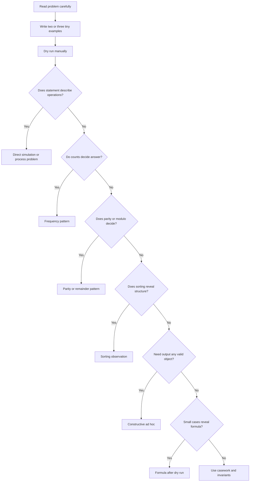

---

# 3. Pattern Map

```mermaid
flowchart TD
    A["Ad Hoc"] --> B["Simulation"]
    A --> C["Casework"]
    A --> D["Frequency"]
    A --> E["String Rules"]
    A --> F["Grid Rules"]
    A --> G["Parity"]
    A --> H["Boundary Tracking"]
    A --> I["Sorting"]
    A --> J["Constructive"]
    A --> K["Formula"]
    A --> L["Index Mapping"]
    A --> M["Formatting"]
    A --> N["Edge Cases"]
    A --> O["Invariant"]

    B --> B1["Follow operations"]
    C --> C1["Split by conditions"]
    D --> D1["Counts enough"]
    E --> E1["Scan characters"]
    F --> F1["Rows columns neighbours"]
    G --> G1["Odd even modulo"]
    H --> H1["Min max first last"]
    I --> I1["Compare after sort"]
    J --> J1["Build valid object"]
    K --> K1["Derive equation"]
    L --> L1["Map positions"]
    M --> M1["Output rules"]
    N --> N1["Tiny impossible cases"]
    O --> O1["Preserved property"]
```

---

# 4. Core C++ Template Pack

## 4.1 Basic Multi-Test Template

```cpp
#include <bits/stdc++.h>
using namespace std;

using ll = long long;

void solve() {
    // read input
    // apply observation
    // print answer
}

int main() {
    ios::sync_with_stdio(false);
    cin.tie(nullptr);

    int T = 1;
    cin >> T;

    while (T--) {
        solve();
    }

    return 0;
}
```

## 4.2 YES / NO Helper

```cpp
void printYes(bool ok) {
    cout << (ok ? "YES" : "NO") << '\n';
}
```

## 4.3 Vector Print Helper

```cpp
template <class T>
void printVector(const vector<T>& a) {
    for (int i = 0; i < (int)a.size(); i++) {
        if (i) cout << ' ';
        cout << a[i];
    }
    cout << '\n';
}
```

## 4.4 Safe Sum Helper

```cpp
long long sumVector(const vector<int>& a) {
    long long s = 0;

    for (int x : a) {
        s += x;
    }

    return s;
}
```

---

# 5. Form A: Direct Simulation

## Pattern

Follow the rule exactly.

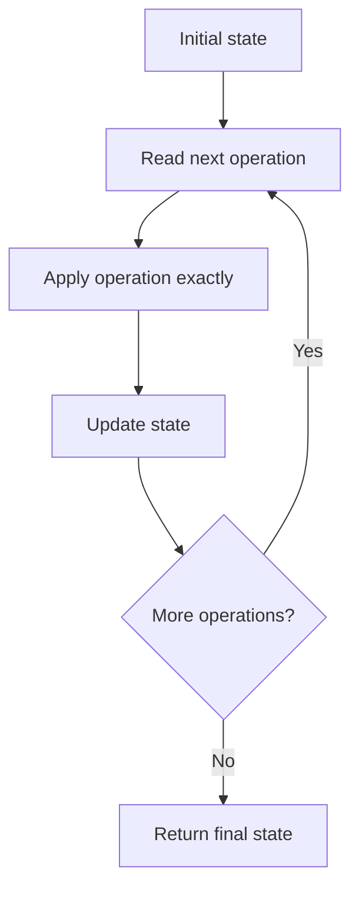

## Recognition Signals

| Signal | Meaning |
|---|---|
| operations are given | simulate |
| game/process described | simulate |
| state changes step by step | maintain variables/data structure |
| final state asked | direct process |

## Template

```cpp
for (auto op : operations) {
    if (op == "type one") {
        // update state
    } else if (op == "type two") {
        // update state
    } else {
        // update state
    }
}
```

## Example A1: Baseball Game

### Problem Idea

Operations:

```text
integer -> add score
"+" -> sum previous two scores
"D" -> double previous score
"C" -> remove previous score
```

### Dry Run

```text
operations = ["5","2","C","D","+"]

scores = []

"5":
scores = [5]

"2":
scores = [5,2]

"C":
remove last
scores = [5]

"D":
double last = 10
scores = [5,10]

"+":
5 + 10 = 15
scores = [5,10,15]

sum = 30
```

### C++

```cpp
int calPoints(vector<string>& operations) {
    vector<int> scores;

    for (string op : operations) {
        if (op == "+") {
            int n = scores.size();
            scores.push_back(scores[n - 1] + scores[n - 2]);
        } else if (op == "D") {
            scores.push_back(2 * scores.back());
        } else if (op == "C") {
            scores.pop_back();
        } else {
            scores.push_back(stoi(op));
        }
    }

    int ans = 0;
    for (int x : scores) ans += x;

    return ans;
}
```

### Complexity

```text
Time: O(n)
Space: O(n)
```

### Mistakes

- Calling `scores.back()` when empty.
- Forgetting that `+` uses last two valid scores.
- Using string comparison incorrectly.

---

## Example A2: Crawler Log Folder

### Dry Run

```text
logs = ["d1/","d2/","../","d21/","./"]

depth = 0
"d1/"  -> depth 1
"d2/"  -> depth 2
"../"  -> depth 1
"d21/" -> depth 2
"./"   -> depth 2

answer = 2
```

### C++

```cpp
int minOperations(vector<string>& logs) {
    int depth = 0;

    for (string log : logs) {
        if (log == "./") {
            continue;
        } else if (log == "../") {
            if (depth > 0) depth--;
        } else {
            depth++;
        }
    }

    return depth;
}
```

---

# 6. Form B: Casework

## Pattern

Split into clear cases.

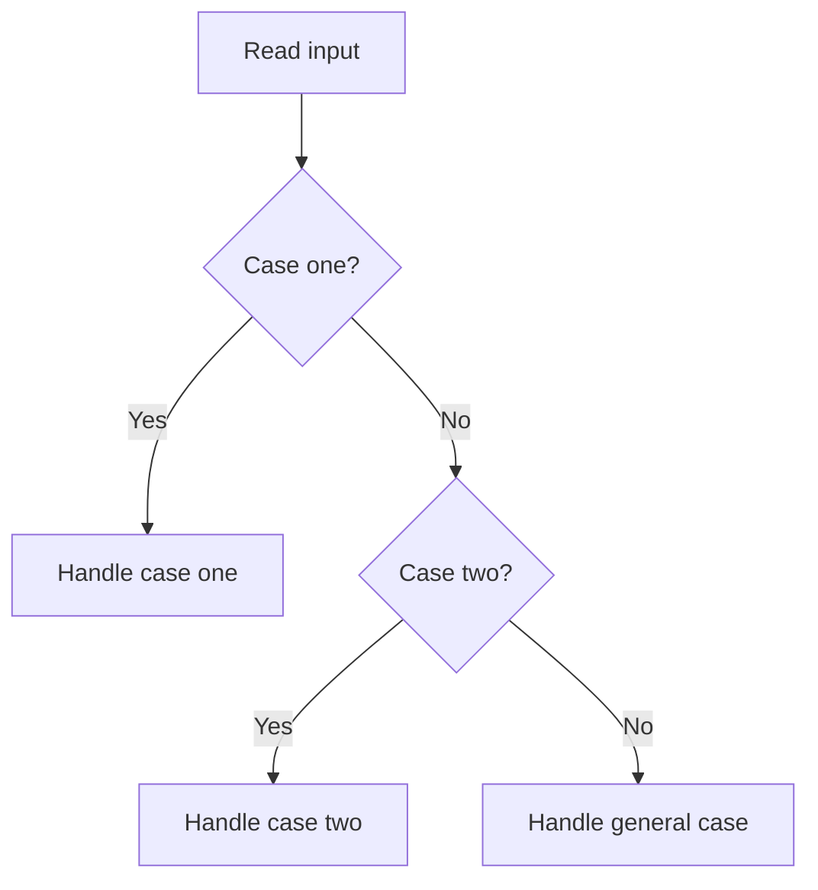

## Recognition Signals

| Signal | Meaning |
|---|---|
| many constraints | split cases |
| different behavior for small n | handle separately |
| parity changes answer | even/odd cases |
| impossible cases exist | check first |

## Template

```cpp
if (special_case) {
    // handle
} else if (another_case) {
    // handle
} else {
    // general case
}
```

## Example B1: Valid Mountain Array

### Dry Run

```text
arr = [0,3,2,1]

Step 1: climb
0 < 3, i = 1

Step 2: check peak
i is not 0
i is not n-1

Step 3: descend
3 > 2, i = 2
2 > 1, i = 3

i == n - 1, valid
```

### C++

```cpp
bool validMountainArray(vector<int>& arr) {
    int n = arr.size();
    int i = 0;

    while (i + 1 < n && arr[i] < arr[i + 1]) {
        i++;
    }

    if (i == 0 || i == n - 1) return false;

    while (i + 1 < n && arr[i] > arr[i + 1]) {
        i++;
    }

    return i == n - 1;
}
```

### Complexity

```text
Time: O(n)
Space: O(1)
```

### Traps

- `[1,2,3]` is not mountain.
- `[3,2,1]` is not mountain.
- Equal adjacent values break mountain.

---

## Example B2: Lemonade Change

### Dry Run

```text
bills = [5,5,5,10,20]

five = 0, ten = 0

5  -> five = 1
5  -> five = 2
5  -> five = 3
10 -> need one 5, five = 2, ten = 1
20 -> prefer 10 + 5, five = 1, ten = 0

true
```

### C++

```cpp
bool lemonadeChange(vector<int>& bills) {
    int five = 0;
    int ten = 0;

    for (int bill : bills) {
        if (bill == 5) {
            five++;
        } else if (bill == 10) {
            if (five == 0) return false;
            five--;
            ten++;
        } else {
            if (ten > 0 && five > 0) {
                ten--;
                five--;
            } else if (five >= 3) {
                five -= 3;
            } else {
                return false;
            }
        }
    }

    return true;
}
```

---

# 7. Form C: Counting and Frequency

## Pattern

If order does not matter, count.

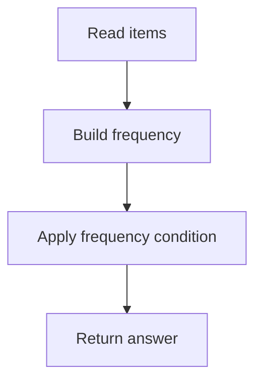

## Recognition Signals

| Signal | Meaning |
|---|---|
| repeated values/chars | frequency |
| anagrams | count/sort signature |
| unique occurrence | frequency + set |
| majority | count or voting |
| pairs from equal values | combinations from counts |

## Template

```cpp
unordered_map<int, int> freq;

for (int x : a) {
    freq[x]++;
}

for (auto [value, count] : freq) {
    // use count
}
```

## Example C1: Unique Number of Occurrences

### Dry Run

```text
arr = [1,2,2,1,1,3]

freq:
1 -> 3
2 -> 2
3 -> 1

occurrence counts:
3, 2, 1

all unique -> true
```

### C++

```cpp
bool uniqueOccurrences(vector<int>& arr) {
    unordered_map<int, int> freq;

    for (int x : arr) {
        freq[x]++;
    }

    unordered_set<int> seen;

    for (auto [value, count] : freq) {
        if (seen.count(count)) return false;
        seen.insert(count);
    }

    return true;
}
```

---

## Example C2: Majority Element With Boyer Moore

### Dry Run

```text
nums = [2,2,1,1,1,2,2]

candidate = none, count = 0

2 -> candidate 2, count 1
2 -> count 2
1 -> count 1
1 -> count 0
1 -> candidate 1, count 1
2 -> count 0
2 -> candidate 2, count 1

answer = 2
```

### Intuition

Majority element cannot be fully cancelled by all other elements.

### C++

```cpp
int majorityElement(vector<int>& nums) {
    int candidate = 0;
    int count = 0;

    for (int x : nums) {
        if (count == 0) {
            candidate = x;
            count = 1;
        } else if (x == candidate) {
            count++;
        } else {
            count--;
        }
    }

    return candidate;
}
```

---

# 8. Form D: String Rules and Parsing

## Pattern

Scan characters and apply rules.

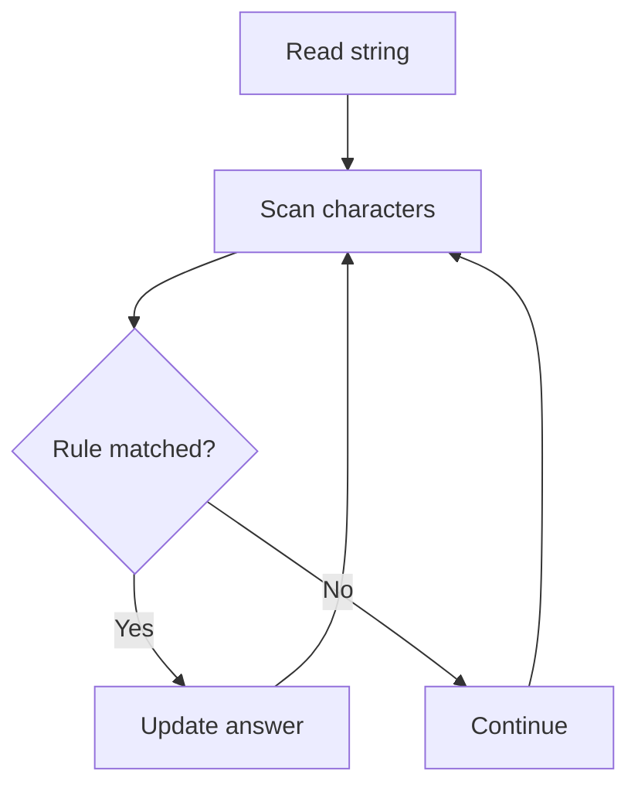

## Recognition Signals

| Signal | Meaning |
|---|---|
| lowercase/uppercase | character transform |
| vowels/consonants | filter/count |
| tokens like parentheses | parser scan |
| compare strings ignoring case | normalize |
| repeated groups | run-length scan |

## Example D1: Goal Parser Interpretation

### Dry Run

```text
command = "G()(al)"

i = 0, char G
append "G"

i = 1, sees "()"
append "o"

i = 3, sees "(al)"
append "al"

answer = "Goal"
```

### C++

```cpp
string interpret(string command) {
    string ans;

    for (int i = 0; i < (int)command.size(); i++) {
        if (command[i] == 'G') {
            ans.push_back('G');
        } else if (command[i] == '(' && command[i + 1] == ')') {
            ans.push_back('o');
            i++;
        } else {
            ans += "al";
            i += 3;
        }
    }

    return ans;
}
```

---

## Example D2: String Compression

### Dry Run

```text
chars = ["a","a","b","b","c","c","c"]

group a length 2 -> write a 2
group b length 2 -> write b 2
group c length 3 -> write c 3

compressed = ["a","2","b","2","c","3"]
length = 6
```

### C++

```cpp
int compress(vector<char>& chars) {
    int n = chars.size();
    int write = 0;
    int i = 0;

    while (i < n) {
        char c = chars[i];
        int j = i;

        while (j < n && chars[j] == c) {
            j++;
        }

        chars[write++] = c;

        int len = j - i;

        if (len > 1) {
            string s = to_string(len);
            for (char digit : s) {
                chars[write++] = digit;
            }
        }

        i = j;
    }

    return write;
}
```

---

# 9. Form E: Grid and Matrix Ad Hoc

## Pattern

Check rows, columns, diagonals, neighbours, or simulate boundaries.

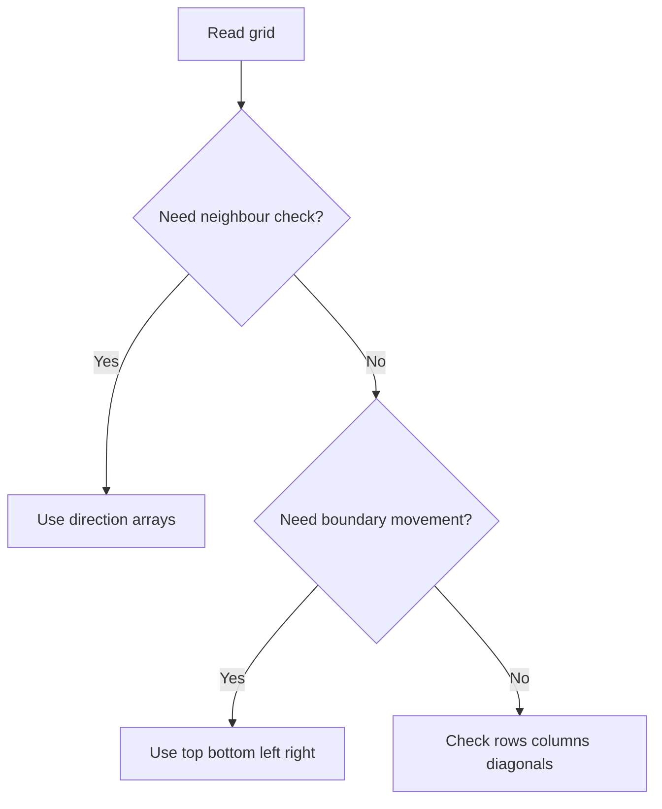

## Template: Direction Arrays

```cpp
int dr[4] = {1, -1, 0, 0};
int dc[4] = {0, 0, 1, -1};
```

## Example E1: Island Perimeter

### Dry Run Table

Grid:

```text
1 1
1 0
```

| Cell | Up | Down | Left | Right | Contribution |
|---|---|---|---|---|---|
| `(0,0)` | border | land | border | land | 2 |
| `(0,1)` | border | water | land | border | 3 |
| `(1,0)` | land | border | border | water | 3 |

Total:

```text
2 + 3 + 3 = 8
```

### C++

```cpp
int islandPerimeter(vector<vector<int>>& grid) {
    int n = grid.size();
    int m = grid[0].size();

    int dr[4] = {1, -1, 0, 0};
    int dc[4] = {0, 0, 1, -1};

    int ans = 0;

    for (int r = 0; r < n; r++) {
        for (int c = 0; c < m; c++) {
            if (grid[r][c] == 0) continue;

            for (int k = 0; k < 4; k++) {
                int nr = r + dr[k];
                int nc = c + dc[k];

                if (nr < 0 || nr >= n || nc < 0 || nc >= m || grid[nr][nc] == 0) {
                    ans++;
                }
            }
        }
    }

    return ans;
}
```

## Example E2: Spiral Matrix

### Boundary Idea

```text
top row
right column
bottom row
left column
shrink boundaries
repeat
```

### C++

```cpp
vector<int> spiralOrder(vector<vector<int>>& matrix) {
    int top = 0;
    int bottom = matrix.size() - 1;
    int left = 0;
    int right = matrix[0].size() - 1;

    vector<int> ans;

    while (top <= bottom && left <= right) {
        for (int c = left; c <= right; c++) {
            ans.push_back(matrix[top][c]);
        }
        top++;

        for (int r = top; r <= bottom; r++) {
            ans.push_back(matrix[r][right]);
        }
        right--;

        if (top <= bottom) {
            for (int c = right; c >= left; c--) {
                ans.push_back(matrix[bottom][c]);
            }
            bottom--;
        }

        if (left <= right) {
            for (int r = bottom; r >= top; r--) {
                ans.push_back(matrix[r][left]);
            }
            left++;
        }
    }

    return ans;
}
```

---

# 10. Form F: Parity and Remainder Observation

## Pattern

Odd/even or modulo class decides.

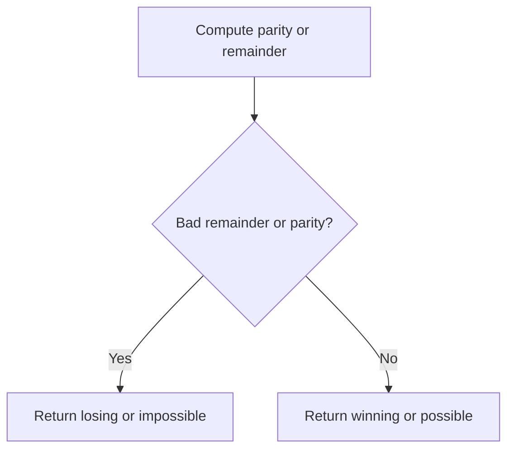

## Example F1: Nim Game

### Dry Run

```text
n = 1 -> win
n = 2 -> win
n = 3 -> win
n = 4 -> lose
n = 5 -> win
n = 6 -> win
n = 7 -> win
n = 8 -> lose
```

Pattern:

```text
multiples of 4 lose
```

### C++

```cpp
bool canWinNim(int n) {
    return n % 4 != 0;
}
```

## Example F2: Coin Piles

Problem:

```text
You can remove 2 from one pile and 1 from another.
Can both piles become zero?
```

Observation:

```text
a + b must be divisible by 3.
max(a,b) <= 2 * min(a,b)
```

### C++

```cpp
bool canEmptyCoinPiles(long long a, long long b) {
    if ((a + b) % 3 != 0) return false;
    if (max(a, b) > 2 * min(a, b)) return false;
    return true;
}
```

---

# 11. Form G: Min Max Boundary Tracking

## Pattern

Only track boundary information.

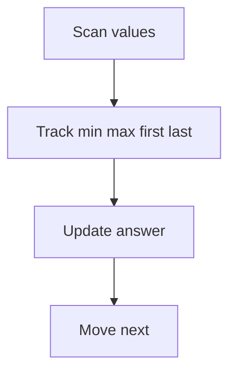

## Example G1: Maximum Difference Between Increasing Elements

### Dry Run

```text
nums = [7,1,5,4]

mn = 7
i = 1, x = 1
x <= mn, update mn = 1

i = 2, x = 5
x > mn, best = 4

i = 3, x = 4
x > mn, best remains 4

answer = 4
```

### C++

```cpp
int maximumDifference(vector<int>& nums) {
    int mn = nums[0];
    int best = -1;

    for (int i = 1; i < (int)nums.size(); i++) {
        if (nums[i] > mn) {
            best = max(best, nums[i] - mn);
        }

        mn = min(mn, nums[i]);
    }

    return best;
}
```

## Example G2: Arrival of the General

Observation:

```text
Move tallest first occurrence to front.
Move shortest last occurrence to back.
If tallest index is after shortest index, one swap overlaps.
```

### C++ Skeleton

```cpp
int arrivalSwaps(vector<int>& a) {
    int n = a.size();

    int maxPos = 0;
    int minPos = 0;

    for (int i = 0; i < n; i++) {
        if (a[i] > a[maxPos]) maxPos = i;
        if (a[i] <= a[minPos]) minPos = i;
    }

    int ans = maxPos + (n - 1 - minPos);

    if (maxPos > minPos) ans--;

    return ans;
}
```

---

# 12. Form H: Sorting Observation

## Pattern

Sort to reveal neighbours/extremes/order.

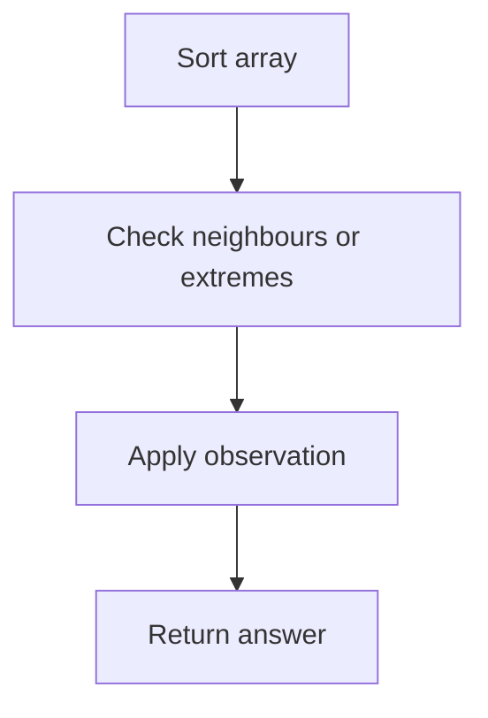

## Example H1: Maximum Product of Three Numbers

### Dry Run

```text
nums = [-10, -10, 5, 2]
sorted = [-10, -10, 2, 5]

option 1:
largest three = -10 * 2 * 5 = -100

option 2:
two smallest and largest = -10 * -10 * 5 = 500

answer = 500
```

### C++

```cpp
int maximumProduct(vector<int>& nums) {
    sort(nums.begin(), nums.end());

    int n = nums.size();

    int option1 = nums[n - 1] * nums[n - 2] * nums[n - 3];
    int option2 = nums[0] * nums[1] * nums[n - 1];

    return max(option1, option2);
}
```

## Example H2: Minimum Difference Between Highest and Lowest of K Scores

### Dry Run

```text
nums = [9,4,1,7], k = 2
sorted = [1,4,7,9]

windows:
[1,4] diff 3
[4,7] diff 3
[7,9] diff 2

answer = 2
```

### C++

```cpp
int minimumDifference(vector<int>& nums, int k) {
    sort(nums.begin(), nums.end());

    int ans = INT_MAX;

    for (int i = 0; i + k - 1 < (int)nums.size(); i++) {
        ans = min(ans, nums[i + k - 1] - nums[i]);
    }

    return ans;
}
```

---

# 13. Form I: Constructive Ad Hoc

## Pattern

Build any valid answer.

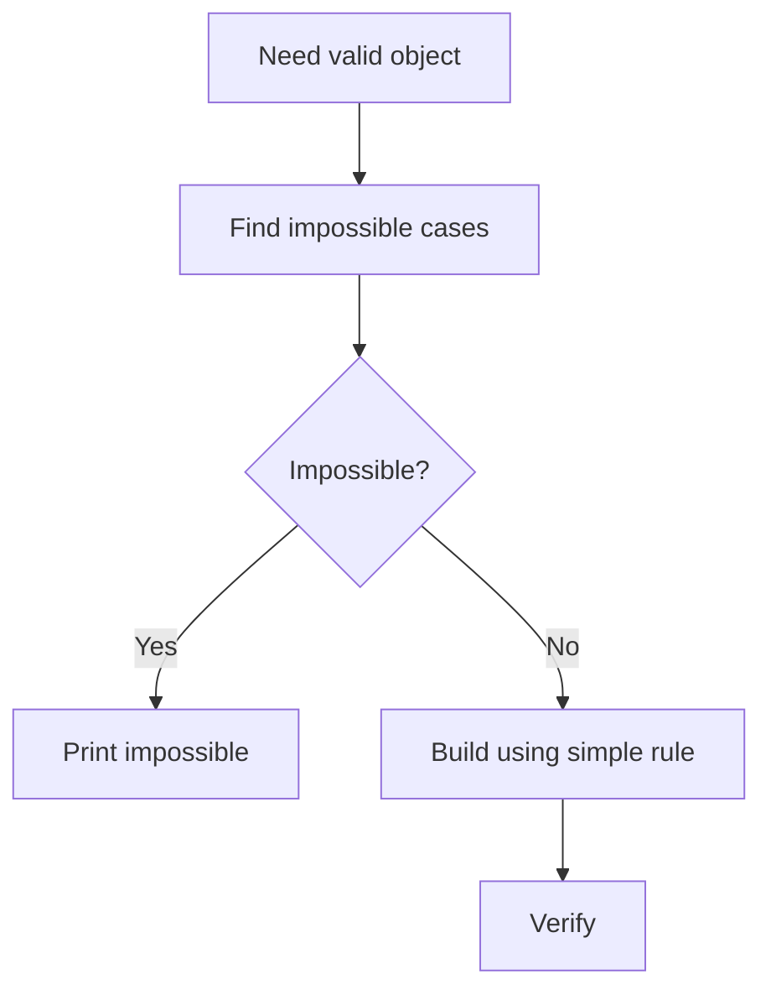

## Example I1: DI String Match

### Dry Run

```text
s = IDID
low = 0
high = 4

I -> choose low 0, low = 1
D -> choose high 4, high = 3
I -> choose low 1, low = 2
D -> choose high 3, high = 2
last -> 2

answer = [0,4,1,3,2]
```

### C++

```cpp
vector<int> diStringMatch(string s) {
    int n = s.size();
    int low = 0;
    int high = n;

    vector<int> ans;

    for (char c : s) {
        if (c == 'I') {
            ans.push_back(low++);
        } else {
            ans.push_back(high--);
        }
    }

    ans.push_back(low);
    return ans;
}
```

## Example I2: Beautiful Permutation

### Rule

```text
For n = 1, answer is 1.
For n = 2 or 3, impossible.
For n >= 4, print evens then odds.
```

### C++

```cpp
vector<int> beautifulPermutation(int n) {
    if (n == 1) return {1};
    if (n <= 3) return {};

    vector<int> ans;

    for (int x = 2; x <= n; x += 2) {
        ans.push_back(x);
    }

    for (int x = 1; x <= n; x += 2) {
        ans.push_back(x);
    }

    return ans;
}
```

---

# 14. Form J: Operation Process Problems

## Pattern

Maintain state after each operation.

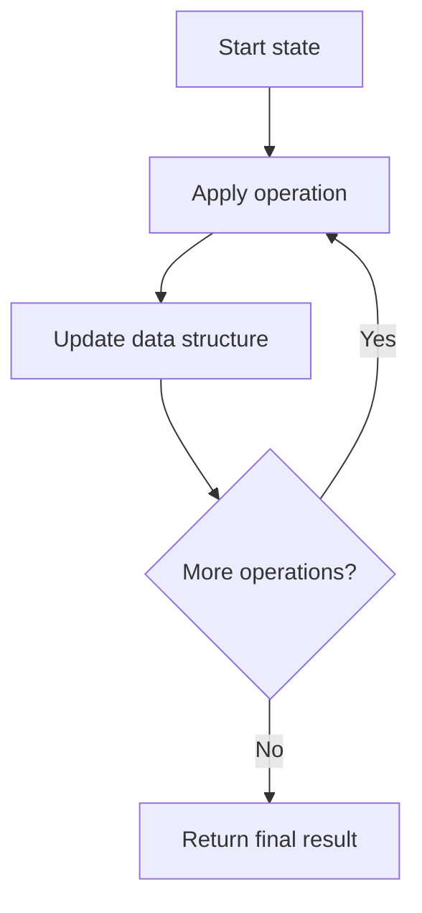

## Example J1: Robot Return to Origin

### Dry Run

```text
moves = "UDLR"

start = (0,0)
U -> (0,1)
D -> (0,0)
L -> (-1,0)
R -> (0,0)

answer = true
```

### C++

```cpp
bool judgeCircle(string moves) {
    int x = 0;
    int y = 0;

    for (char c : moves) {
        if (c == 'U') y++;
        else if (c == 'D') y--;
        else if (c == 'R') x++;
        else if (c == 'L') x--;
    }

    return x == 0 && y == 0;
}
```

## Example J2: Validate Stack Sequences

### Dry Run

```text
pushed = [1,2,3,4,5]
popped = [4,5,3,2,1]

push 1 -> stack [1]
push 2 -> stack [1,2]
push 3 -> stack [1,2,3]
push 4 -> stack [1,2,3,4], pop 4
push 5 -> stack [1,2,3,5], pop 5
pop 3
pop 2
pop 1

valid
```

### C++

```cpp
bool validateStackSequences(vector<int>& pushed, vector<int>& popped) {
    vector<int> st;
    int j = 0;

    for (int x : pushed) {
        st.push_back(x);

        while (!st.empty() && j < (int)popped.size() && st.back() == popped[j]) {
            st.pop_back();
            j++;
        }
    }

    return j == (int)popped.size();
}
```

---

# 15. Form K: Formula After Dry Run

## Pattern

Small cases reveal equation.

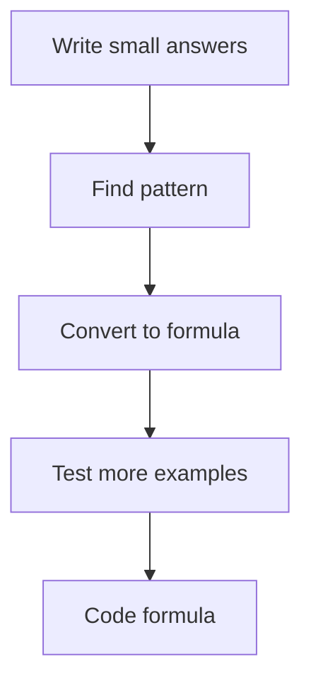

## Example K1: Bulb Switcher

### Dry Run

```text
n = 1 -> bulbs on: 1 -> answer 1
n = 2 -> bulbs on: 1 -> answer 1
n = 3 -> bulbs on: 1 -> answer 1
n = 4 -> bulbs on: 1,4 -> answer 2
n = 9 -> bulbs on: 1,4,9 -> answer 3
```

### Observation

```text
Bulb i is toggled once for each divisor of i.
Only perfect squares have odd number of divisors.
So answer = floor(sqrt(n)).
```

### C++

```cpp
int bulbSwitch(int n) {
    return (int)sqrt(n);
}
```

## Example K2: Minimum Moves to Equal Array Elements

### Observation

Incrementing `n - 1` elements by 1 is same as decrementing one element by 1.  
Make all elements equal to minimum.

### C++

```cpp
int minMoves(vector<int>& nums) {
    int mn = *min_element(nums.begin(), nums.end());

    long long ans = 0;

    for (int x : nums) {
        ans += x - mn;
    }

    return (int)ans;
}
```

---

# 16. Form L: Index Mapping and Inverse Mapping

## Pattern

Map value to position, or invert a relation.

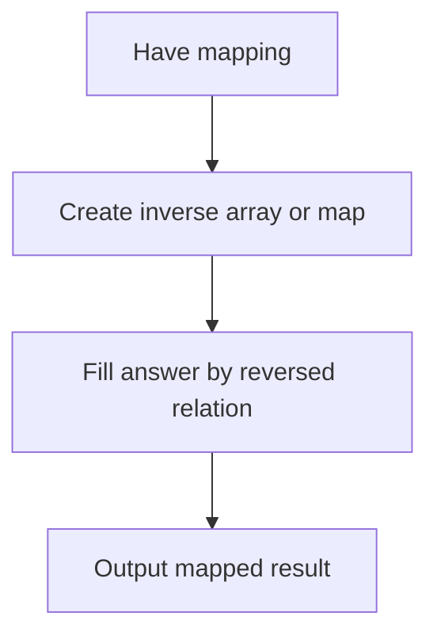

## Example L1: Presents

Problem idea:

```text
p[i] = person who receives gift from i.
Need output who gave gift to each person.
```

### Dry Run

```text
p = [2,3,4,1]

person 1 gives to 2 -> ans[2] = 1
person 2 gives to 3 -> ans[3] = 2
person 3 gives to 4 -> ans[4] = 3
person 4 gives to 1 -> ans[1] = 4

answer = [4,1,2,3]
```

### C++

```cpp
vector<int> inverseGift(vector<int>& p) {
    int n = p.size();
    vector<int> ans(n + 1);

    for (int giver = 1; giver <= n; giver++) {
        int receiver = p[giver - 1];
        ans[receiver] = giver;
    }

    vector<int> res;

    for (int person = 1; person <= n; person++) {
        res.push_back(ans[person]);
    }

    return res;
}
```

---

# 17. Form M: Formatting and Output Construction

## Pattern

The logic is simple, but output format is the main challenge.

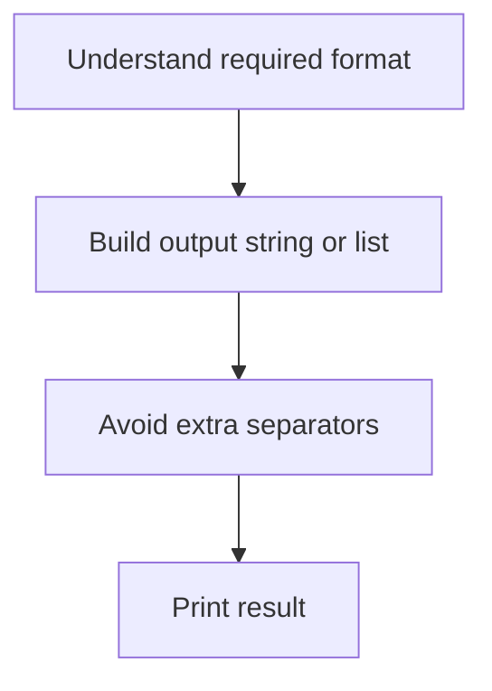

## Example M1: Helpful Maths

### Dry Run

```text
s = "3+2+1"

extract digits:
3, 2, 1

sort:
1, 2, 3

output:
1+2+3
```

### C++

```cpp
string helpfulMaths(string s) {
    vector<char> digits;

    for (char c : s) {
        if (isdigit(c)) digits.push_back(c);
    }

    sort(digits.begin(), digits.end());

    string ans;

    for (int i = 0; i < (int)digits.size(); i++) {
        if (i) ans.push_back('+');
        ans.push_back(digits[i]);
    }

    return ans;
}
```

---

# 18. Form N: Edge-Case Driven Problems

## Pattern

Most wrong answers come from one tiny special case.

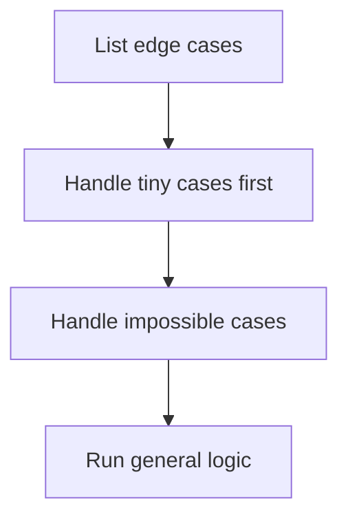

## Edge Cases to Always Test

```text
n = 0
n = 1
n = 2
all equal
all different
already sorted
reverse sorted
zero values
negative values
duplicate values
empty string
one character string
maximum constraints
```

## Example N1: Text Justification

Key cases:

```text
last line
line with one word
normal line with many words
extra spaces distributed left first
```

---

# 19. Form O: Observation + Invariant

## Pattern

Find a property that never changes, or a condition that must always hold.

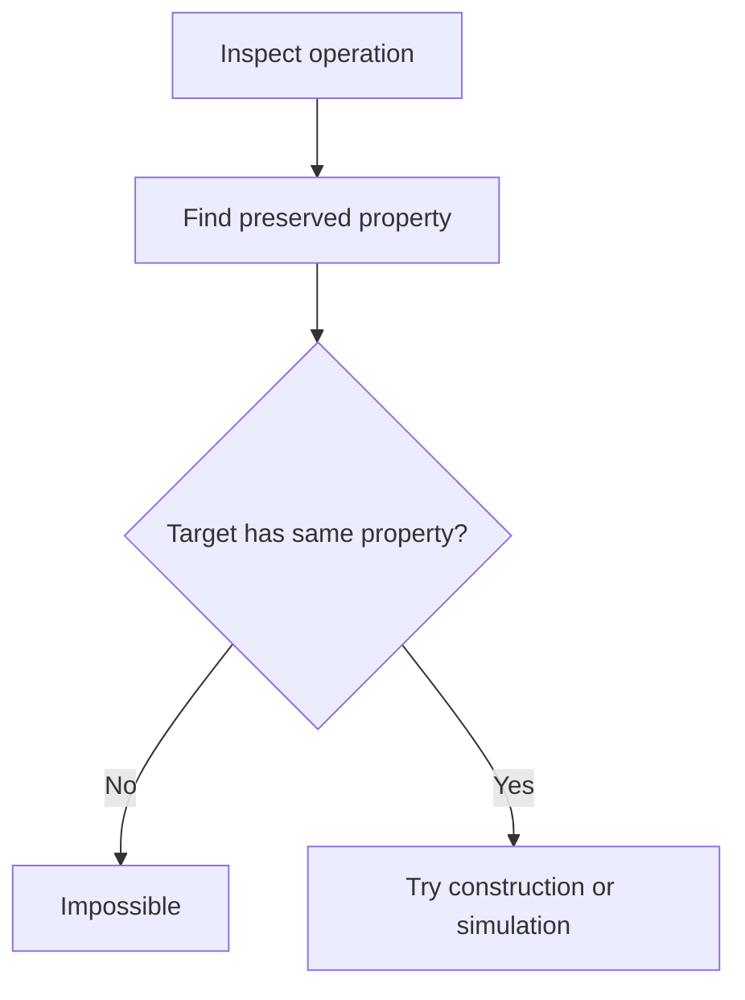

## Example O1: Coin Piles

Invariant:

```text
Each move removes total 3 coins.
No pile can be more than double the other.
```

C++ shown in parity section.

---

# 20. FAANG/OA Ad Hoc Patterns

| Pattern | Recognition Signal | Tactic | Example |
|---|---|---|---|
| process simulation | operations list | stack/vector/counters | Baseball Game |
| parser scan | symbolic string | scan by token | Goal Parser |
| boundary formatting | output line rules | handle last/single cases | Text Justification |
| state design | O(1) operations | map + list/vector | LRU Cache, RandomizedSet |
| matrix simulation | movement or update rules | boundaries / encoded states | Spiral Matrix, Game of Life |
| formula from process | repeated operation | derive invariant | Bulb Switcher |
| case-heavy validation | many invalid states | early returns | Valid Number |
| frequency signature | grouping strings | sort/count key | Group Anagrams |
| index placement | values map to positions | cyclic swap/mark | First Missing Positive |

---

# 21. Codeforces Ad Hoc Rating Ladder

| Level | Rating Range | Focus |
|---|---:|---|
| Newbie | 800 | implementation, strings, counts |
| Pupil | 900-1100 | casework, sorting observation |
| Specialist | 1200-1400 | constructive + invariants |
| Expert | 1500-1700 | non-obvious observation |
| CM | 1800-2000 | proof, invariant, tricky construction |

## Training Rule

```text
Solve 30 problems at each rating band before moving up.
Upsolve every failed problem.
Write the hidden observation in one sentence.
```

---

# 22. Difficulty-Sorted Problem Set

## 22.1 Newbie

| # | Problem | Platform | Link | Form | Tactic |
|---:|---|---|---|---|---|
| 1 | Robot Return to Origin | LeetCode | https://leetcode.com/problems/robot-return-to-origin/ | Process | coordinate counters |
| 2 | Goal Parser Interpretation | LeetCode | https://leetcode.com/problems/goal-parser-interpretation/ | String | scan |
| 3 | Baseball Game | LeetCode | https://leetcode.com/problems/baseball-game/ | Simulation | vector stack |
| 4 | Valid Mountain Array | LeetCode | https://leetcode.com/problems/valid-mountain-array/ | Casework | climb descend |
| 5 | Island Perimeter | LeetCode | https://leetcode.com/problems/island-perimeter/ | Grid | exposed sides |
| 6 | Add Digits | LeetCode | https://leetcode.com/problems/add-digits/ | Formula | digital root |
| 7 | Nim Game | LeetCode | https://leetcode.com/problems/nim-game/ | Modulo | multiples of 4 |
| 8 | Maximum Product of Three Numbers | LeetCode | https://leetcode.com/problems/maximum-product-of-three-numbers/ | Sorting | extremes |
| 9 | Missing Number | CSES | https://cses.fi/problemset/task/1083 | Formula | expected sum |
| 10 | Weird Algorithm | CSES | https://cses.fi/problemset/task/1068 | Simulation | Collatz |

## 22.2 Easy-Medium

| # | Problem | Platform | Link | Form | Tactic |
|---:|---|---|---|---|---|
| 1 | Lemonade Change | LeetCode | https://leetcode.com/problems/lemonade-change/ | Casework | bill counters |
| 2 | Partition Array Into Three Parts | LeetCode | https://leetcode.com/problems/partition-array-into-three-parts-with-equal-sum/ | Prefix case | count target parts |
| 3 | String Compression | LeetCode | https://leetcode.com/problems/string-compression/ | String | run length |
| 4 | Spiral Matrix | LeetCode | https://leetcode.com/problems/spiral-matrix/ | Grid | four boundaries |
| 5 | Validate Stack Sequences | LeetCode | https://leetcode.com/problems/validate-stack-sequences/ | Process | stack |
| 6 | Asteroid Collision | LeetCode | https://leetcode.com/problems/asteroid-collision/ | Simulation | collision stack |
| 7 | Group Anagrams | LeetCode | https://leetcode.com/problems/group-anagrams/ | Frequency | signature |
| 8 | Relative Sort Array | LeetCode | https://leetcode.com/problems/relative-sort-array/ | Sorting | custom order |
| 9 | Repetitions | CSES | https://cses.fi/problemset/task/1069 | String | longest run |
| 10 | Increasing Array | CSES | https://cses.fi/problemset/task/1094 | Boundary | previous max |

## 22.3 Medium

| # | Problem | Platform | Link | Form | Tactic |
|---:|---|---|---|---|---|
| 1 | Game of Life | LeetCode | https://leetcode.com/problems/game-of-life/ | Grid simulation | encode states |
| 2 | Bulb Switcher | LeetCode | https://leetcode.com/problems/bulb-switcher/ | Formula | square count |
| 3 | Poor Pigs | LeetCode | https://leetcode.com/problems/poor-pigs/ | Formula | states per pig |
| 4 | Integer to Roman | LeetCode | https://leetcode.com/problems/integer-to-roman/ | Direct mapping | symbols |
| 5 | Roman to Integer | LeetCode | https://leetcode.com/problems/roman-to-integer/ | String rule | subtractive cases |
| 6 | Zigzag Conversion | LeetCode | https://leetcode.com/problems/zigzag-conversion/ | Simulation | direction flag |
| 7 | Count and Say | LeetCode | https://leetcode.com/problems/count-and-say/ | Process | run length |
| 8 | Product of Array Except Self | LeetCode | https://leetcode.com/problems/product-of-array-except-self/ | Boundary | prefix suffix |
| 9 | Next Permutation | LeetCode | https://leetcode.com/problems/next-permutation/ | Sorting observation | pivot suffix |
| 10 | Palindrome Reorder | CSES | https://cses.fi/problemset/task/1755 | Frequency | odd count |
| 11 | Coin Piles | CSES | https://cses.fi/problemset/task/1754 | Invariant | sum and max |
| 12 | Gray Code | CSES | https://cses.fi/problemset/task/2205 | Constructive | xor formula |

## 22.4 Hard / FAANG-Heavy

| # | Problem | Platform | Link | Form | Tactic |
|---:|---|---|---|---|---|
| 1 | First Missing Positive | LeetCode | https://leetcode.com/problems/first-missing-positive/ | Index placement | cyclic marking |
| 2 | Text Justification | LeetCode | https://leetcode.com/problems/text-justification/ | Formatting | space distribution |
| 3 | Candy | LeetCode | https://leetcode.com/problems/candy/ | Casework | two passes |
| 4 | Insert Delete GetRandom O1 | LeetCode | https://leetcode.com/problems/insert-delete-getrandom-o1/ | State design | vector + map |
| 5 | LRU Cache | LeetCode | https://leetcode.com/problems/lru-cache/ | State process | list + map |
| 6 | Basic Calculator II | LeetCode | https://leetcode.com/problems/basic-calculator-ii/ | Parser | stack |
| 7 | The Skyline Problem | LeetCode | https://leetcode.com/problems/the-skyline-problem/ | Sweep observation | events |
| 8 | Trapping Rain Water | LeetCode | https://leetcode.com/problems/trapping-rain-water/ | Boundary | two pointers |
| 9 | Creating Strings | CSES | https://cses.fi/problemset/task/1622 | Construction | permutations |
| 10 | Chessboard and Queens | CSES | https://cses.fi/problemset/task/1624 | Case/grid | constraints |

## 22.5 Codeforces Beginner to CM Observation Practice

| # | Problem | Link | Form |
|---:|---|---|---|
| 1 | Way Too Long Words | https://codeforces.com/problemset/problem/71/A | formatting |
| 2 | Team | https://codeforces.com/problemset/problem/231/A | counting |
| 3 | Next Round | https://codeforces.com/problemset/problem/158/A | threshold |
| 4 | Bit++ | https://codeforces.com/problemset/problem/282/A | string operation |
| 5 | Beautiful Matrix | https://codeforces.com/problemset/problem/263/A | grid position |
| 6 | Helpful Maths | https://codeforces.com/problemset/problem/339/A | sorting chars |
| 7 | Stones on the Table | https://codeforces.com/problemset/problem/266/A | adjacent count |
| 8 | Boy or Girl | https://codeforces.com/problemset/problem/236/A | distinct count |
| 9 | String Task | https://codeforces.com/problemset/problem/118/A | char filtering |
| 10 | Domino Piling | https://codeforces.com/problemset/problem/50/A | formula |
| 11 | Nearly Lucky Number | https://codeforces.com/problemset/problem/110/A | digit count |
| 12 | Arrival of the General | https://codeforces.com/problemset/problem/144/A | position tracking |
| 13 | Presents | https://codeforces.com/problemset/problem/136/A | inverse mapping |
| 14 | HQ9+ | https://codeforces.com/problemset/problem/133/A | char existence |
| 15 | Petya and Strings | https://codeforces.com/problemset/problem/112/A | compare |
| 16 | Bear and Big Brother | https://codeforces.com/problemset/problem/791/A | simulation |
| 17 | Elephant | https://codeforces.com/problemset/problem/617/A | ceil formula |
| 18 | Anton and Danik | https://codeforces.com/problemset/problem/734/A | frequency |
| 19 | Translation | https://codeforces.com/problemset/problem/41/A | reverse |
| 20 | Word | https://codeforces.com/problemset/problem/59/A | case count |
| 21 | Drinks | https://codeforces.com/problemset/problem/200/B | average |
| 22 | Tram | https://codeforces.com/problemset/problem/116/A | simulation |
| 23 | Queue at the School | https://codeforces.com/problemset/problem/266/B | process |
| 24 | George and Accommodation | https://codeforces.com/problemset/problem/467/A | counting |
| 25 | Soldier and Bananas | https://codeforces.com/problemset/problem/546/A | formula |
| 26 | Word Capitalization | https://codeforces.com/problemset/problem/281/A | string |
| 27 | Wrong Subtraction | https://codeforces.com/problemset/problem/977/A | simulation |
| 28 | In Search of an Easy Problem | https://codeforces.com/problemset/problem/1030/A | any bad flag |
| 29 | I Wanna Be the Guy | https://codeforces.com/problemset/problem/469/A | set coverage |
| 30 | Calculating Function | https://codeforces.com/problemset/problem/486/A | parity formula |

---

# 23. Final Revision Sheet

## Fast Recognition Table

| Ask Yourself | If Yes |
|---|---|
| Does it describe steps? | simulate |
| Are there many special conditions? | casework |
| Does only count matter? | frequency |
| Is it about characters? | string scan |
| Is it about grid neighbours? | direction arrays |
| Does odd/even matter? | parity |
| Does min/max/first/last matter? | boundary tracking |
| Does order not matter? | sort |
| Does it ask for any valid output? | constructive |
| Do small examples show sequence? | formula |
| Is relation reversed? | inverse mapping |
| Is output formatting tricky? | build string carefully |

## Debug Checklist

```text
1. Test n = 1.
2. Test n = 2.
3. Test all equal.
4. Test sorted.
5. Test reverse sorted.
6. Test zero.
7. Test negative if allowed.
8. Test duplicate values.
9. Check output format.
10. Check integer overflow.
```

## Ad Hoc Mindset

```text
Do not force advanced algorithms.
First understand the process.
Then dry run.
Then observe.
Then code the simplest correct rule.
```

---

# Appendix: GitHub-Safe Mermaid Rules

- Use quoted labels like `A["text"]`.
- Avoid raw square brackets inside node labels.
- Keep one arrow statement per line.
