# Ad Hoc Ultra Master Guide  
## FAANG + Codeforces/CM Observation Training with C++ and Mermaid

> Ad hoc problems are not random. They are “observation + edge case + clean implementation” problems.  
> This file is designed like a prefix-sum style pattern book: form → recognition → tactic → dry run → diagram → code → traps → variants.

---

# Clickable Index

- [0. What Ad Hoc Really Means](#0-what-ad-hoc-really-means)
- [1. Ultra Thinking Framework](#1-ultra-thinking-framework)
- [2. Master Decision Tree](#2-master-decision-tree)
- [3. Pattern Map](#3-pattern-map)
- [4. C++ Base Template](#4-c-base-template)
- [5. Form A: Direct Simulation](#5-form-a-direct-simulation)
- [6. Form B: Casework](#6-form-b-casework)
- [7. Form C: Frequency / Counting](#7-form-c-frequency--counting)
- [8. Form D: String Rules](#8-form-d-string-rules)
- [9. Form E: Grid / Matrix Observation](#9-form-e-grid--matrix-observation)
- [10. Form F: Parity / Modulo / Game Observation](#10-form-f-parity--modulo--game-observation)
- [11. Form G: Boundary Tracking](#11-form-g-boundary-tracking)
- [12. Form H: Sorting Observation](#12-form-h-sorting-observation)
- [13. Form I: Constructive Ad Hoc](#13-form-i-constructive-ad-hoc)
- [14. Form J: Operation / Stack Process](#14-form-j-operation--stack-process)
- [15. Form K: Formula After Dry Run](#15-form-k-formula-after-dry-run)
- [16. Form L: State Design Ad Hoc](#16-form-l-state-design-ad-hoc)
- [17. Codeforces Observation Ladder](#17-codeforces-observation-ladder)
- [18. Final Revision Checklist](#18-final-revision-checklist)

---

# 0. What Ad Hoc Really Means

Ad hoc problems usually do not say:

```text
Use DP
Use graph
Use binary search
Use segment tree
```

Instead, they say something like:

```text
simulate this process
check if this condition is possible
construct any valid answer
count based on simple rule
follow weird string operation
```

## The Real Skill

```text
Read carefully
→ dry run small cases
→ discover invariant or rule
→ handle edge cases
→ implement simply
```

## Common Signals

| Signal | Form |
|---|---|
| “perform operations” | Simulation / Stack process |
| “is it possible?” | Casework / invariant |
| “return any valid” | Constructive |
| “characters appear” | Frequency / string scan |
| “grid cell neighbours” | Matrix observation |
| “odd/even” | Parity |
| “minimum/maximum index/value” | Boundary tracking |
| “sort maybe helps” | Sorting observation |
| “answers for small n show pattern” | Formula |

---

# 1. Ultra Thinking Framework

## The 7-Step Ad Hoc Loop

```text
1. Restate the problem in your own words.
2. Dry run tiny inputs.
3. Identify what information actually matters.
4. Remove irrelevant details.
5. Create cases or invariant.
6. Test the rule on edge cases.
7. Code the simplest version.
```

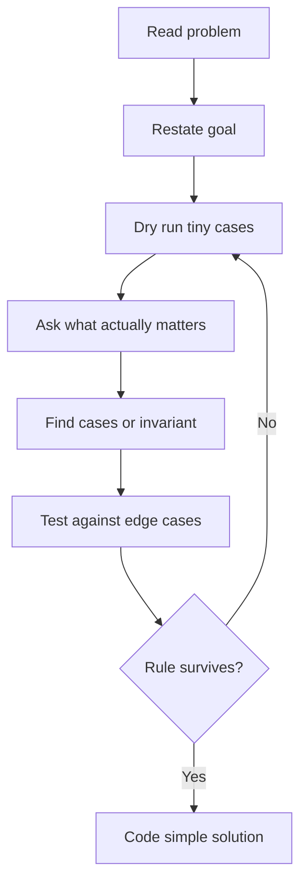
```mermaid
flowchart TD
    A["Read problem"] --> B["Restate goal"]
    B --> C["Dry run tiny cases"]
    C --> D["Ask what actually matters"]
    D --> E["Find cases or invariant"]
    E --> F["Test against edge cases"]
    F --> G{"Rule survives?"}
    G -->|Yes| H["Code simple solution"]
    G -->|No| C
```

## Ad Hoc Invariant Checklist

| Question | Why |
|---|---|
| Does total sum matter? | formula/casework |
| Does parity matter? | odd/even invariant |
| Do only counts matter? | frequency |
| Does order matter? | scan/simulation |
| Does sorted order matter? | sort observation |
| Can I build answer greedily? | constructive |
| Can I reverse process? | operation problems |
| Is there a fixed boundary? | min/max/first/last |


## Timeline Dry Run Model

Use this model when a problem is not recursive but still has a step-by-step process.

The timeline model answers three questions:

| Question | Meaning |
|---|---|
| What event happens now? | current operation / index / token |
| What state changes? | stack, counters, pointer, boundary, answer |
| Why do we move next? | rule applied from problem statement |

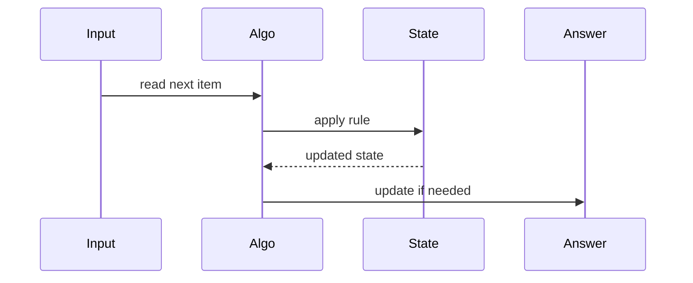
```mermaid
sequenceDiagram
    participant Input
    participant Algo
    participant State
    participant Answer

    Input->>Algo: read next item
    Algo->>State: apply rule
    State-->>Algo: updated state
    Algo->>Answer: update if needed
```

Best use in this handbook:

```text
Mental Model Diagram
Timeline Dry Run
Index-by-Index Table
C++ Code
```

---

# 2. Master Decision Tree

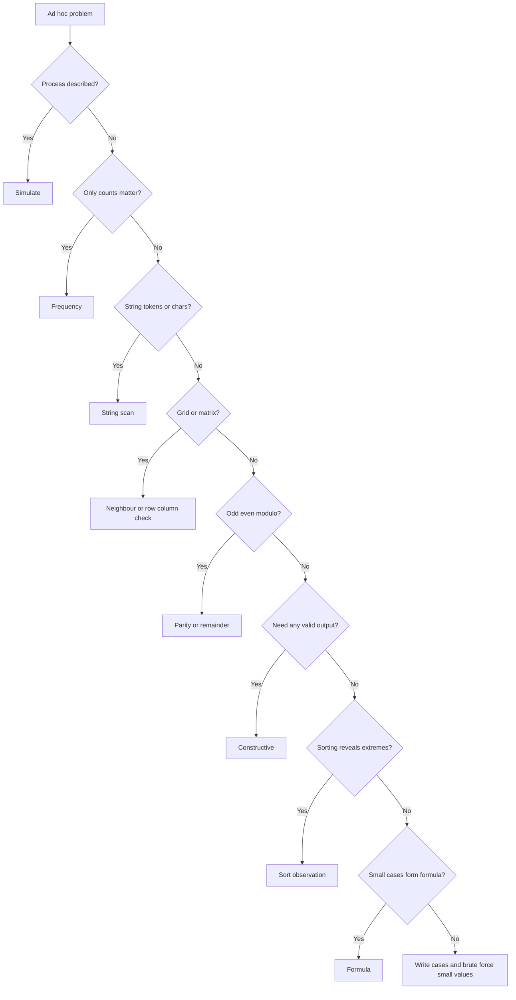
```mermaid
flowchart TD
    A["Ad hoc problem"] --> B{"Process described?"}
    B -->|Yes| C["Simulate"]
    B -->|No| D{"Only counts matter?"}
    D -->|Yes| E["Frequency"]
    D -->|No| F{"String tokens or chars?"}
    F -->|Yes| G["String scan"]
    F -->|No| H{"Grid or matrix?"}
    H -->|Yes| I["Neighbour or row column check"]
    H -->|No| J{"Odd even modulo?"}
    J -->|Yes| K["Parity or remainder"]
    J -->|No| L{"Need any valid output?"}
    L -->|Yes| M["Constructive"]
    L -->|No| N{"Sorting reveals extremes?"}
    N -->|Yes| O["Sort observation"]
    N -->|No| P{"Small cases form formula?"}
    P -->|Yes| Q["Formula"]
    P -->|No| R["Write cases and brute force small values"]
```

---

# 3. Pattern Map


```mermaid
flowchart TD
    A["Ad Hoc Forms"] --> B["Direct Simulation"]
    A --> C["Casework"]
    A --> D["Frequency"]
    A --> E["String Rules"]
    A --> F["Grid"]
    A --> G["Parity"]
    A --> H["Boundary"]
    A --> I["Sorting"]
    A --> J["Constructive"]
    A --> K["Formula"]
    A --> L["State Design"]

    B --> B1["Vector stack"]
    B --> B2["Counters"]
    B --> B3["Queue"]

    C --> C1["n equals one"]
    C --> C2["Impossible cases"]
    C --> C3["Split by sign"]

    D --> D1["Map count"]
    D --> D2["Set of counts"]
    D --> D3["Boyer Moore"]

    E --> E1["Token parsing"]
    E --> E2["Two pointers"]
    E --> E3["Run length"]

    F --> F1["Directions"]
    F --> F2["Diagonal check"]
    F --> F3["Boundary simulation"]

    G --> G1["Modulo losing states"]
    G --> G2["Parity invariant"]

    H --> H1["Min so far"]
    H --> H2["Last position"]
    H --> H3["Two boundaries"]

    I --> I1["Extremes"]
    I --> I2["Neighbour gaps"]
    I --> I3["Custom order"]

    J --> J1["Low high"]
    J --> J2["Evens odds"]
    J --> J3["Build sequence"]

    K --> K1["sqrt formula"]
    K --> K2["sum formula"]
    K --> K3["digital root"]

    L --> L1["Vector plus map"]
    L --> L2["Linked list plus map"]
```

---

# 4. C++ Base Template

```cpp
#include <bits/stdc++.h>
using namespace std;

using ll = long long;

void solve() {
    // read input
    // apply observation
    // print answer
}

int main() {
    ios::sync_with_stdio(false);
    cin.tie(nullptr);

    int T = 1;
    cin >> T;

    while (T--) {
        solve();
    }

    return 0;
}
```

## Useful Helpers

```cpp
void yes(bool ok) {
    cout << (ok ? "YES" : "NO") << '\n';
}

template <class T>
void printVector(const vector<T>& a) {
    for (int i = 0; i < (int)a.size(); i++) {
        if (i) cout << ' ';
        cout << a[i];
    }
    cout << '\n';
}
```

---

# 5. Form A: Direct Simulation

## Recognition

Use this when the problem gives rules and asks for final state.

| Signal | Example |
|---|---|
| operation list | Baseball Game |
| movement commands | Robot Return to Origin |
| folder logs | Crawler Log Folder |
| repeated generated sequence | Count and Say |

## Tactic

```text
Choose state
Loop through operations
Apply rule exactly
Return final state
```

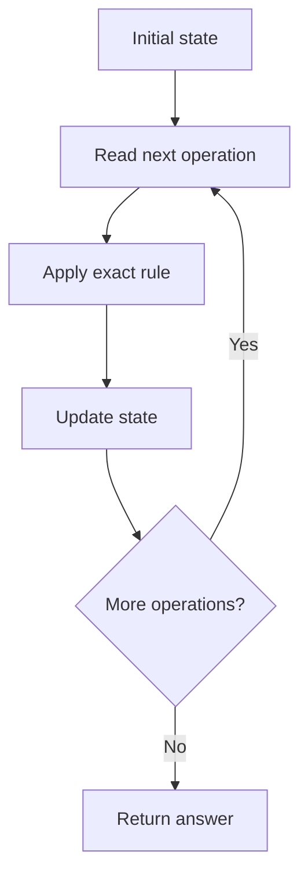
```mermaid
flowchart TD
    A["Initial state"] --> B["Read next operation"]
    B --> C["Apply exact rule"]
    C --> D["Update state"]
    D --> E{"More operations?"}
    E -->|Yes| B
    E -->|No| F["Return answer"]
```

---

## Problem A1: Baseball Game

**Link:** https://leetcode.com/problems/baseball-game/

### Statement

Given operations, calculate final score.

| Operation | Meaning |
|---|---|
| integer | push score |
| `+` | push sum of last two scores |
| `D` | push double last score |
| `C` | remove last score |

### Recognition Signals

- Operations depend on previous valid scores.
- Need undo/remove.
- Stack-like behaviour.

### Wrong Intuition

Do not keep a simple running sum only, because `C`, `D`, and `+` need previous scores.

### Correct Approach

Use vector as stack.

### Dry Run

```text
operations = ["5", "2", "C", "D", "+"]
```

| Step | Operation | Stack Before | Action | Stack After |
|---:|---|---|---|---|
| 1 | 5 | `[]` | push 5 | `[5]` |
| 2 | 2 | `[5]` | push 2 | `[5,2]` |
| 3 | C | `[5,2]` | pop | `[5]` |
| 4 | D | `[5]` | push 10 | `[5,10]` |
| 5 | + | `[5,10]` | push 15 | `[5,10,15]` |

Total = `30`.

### Timeline Dry Run

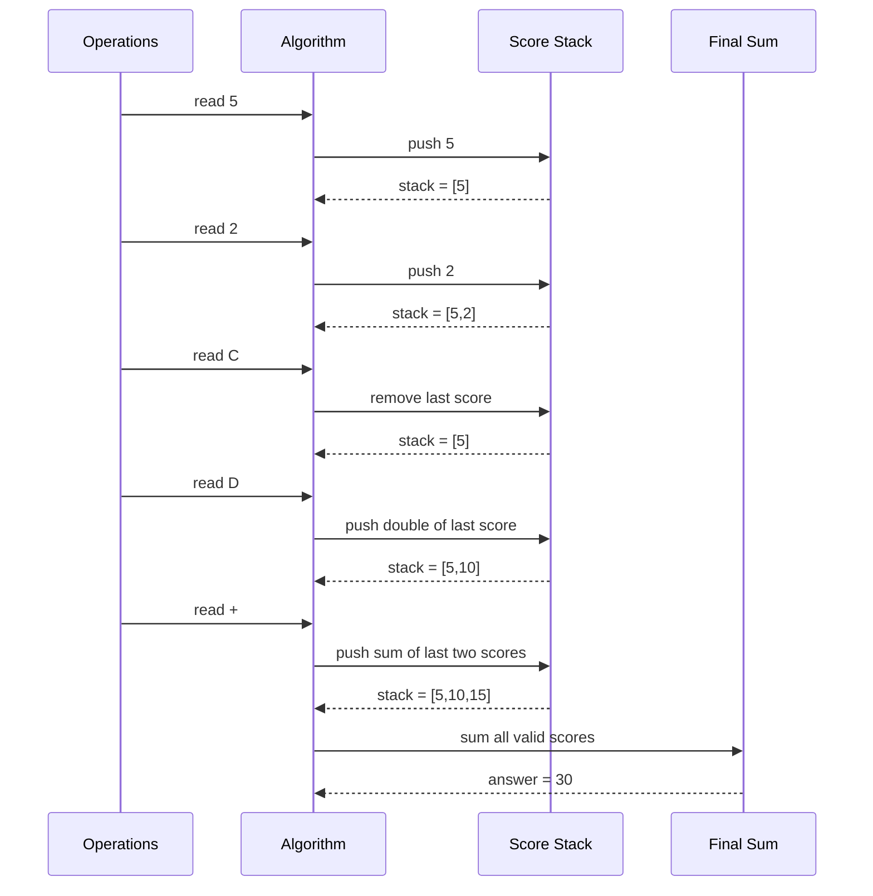
```mermaid
sequenceDiagram
    participant Ops as Operations
    participant Algo as Algorithm
    participant Stack as Score Stack
    participant Ans as Final Sum

    Ops->>Algo: read 5
    Algo->>Stack: push 5
    Stack-->>Algo: stack = [5]

    Ops->>Algo: read 2
    Algo->>Stack: push 2
    Stack-->>Algo: stack = [5,2]

    Ops->>Algo: read C
    Algo->>Stack: remove last score
    Stack-->>Algo: stack = [5]

    Ops->>Algo: read D
    Algo->>Stack: push double of last score
    Stack-->>Algo: stack = [5,10]

    Ops->>Algo: read +
    Algo->>Stack: push sum of last two scores
    Stack-->>Algo: stack = [5,10,15]

    Algo->>Ans: sum all valid scores
    Ans-->>Algo: answer = 30
```

### Mermaid Flow

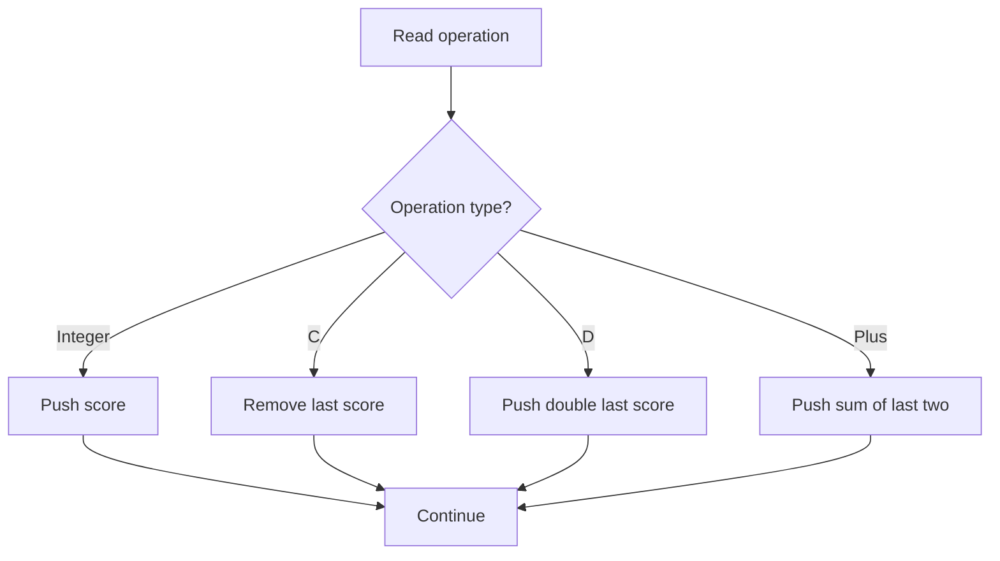
```mermaid
flowchart TD
    A["Read operation"] --> B{"Operation type?"}
    B -->|Integer| C["Push score"]
    B -->|C| D["Remove last score"]
    B -->|D| E["Push double last score"]
    B -->|Plus| F["Push sum of last two"]
    C --> G["Continue"]
    D --> G
    E --> G
    F --> G
```

### C++

```cpp
int calPoints(vector<string>& operations) {
    vector<int> st;

    for (string op : operations) {
        if (op == "+") {
            int n = st.size();
            st.push_back(st[n - 1] + st[n - 2]);
        } else if (op == "D") {
            st.push_back(2 * st.back());
        } else if (op == "C") {
            st.pop_back();
        } else {
            st.push_back(stoi(op));
        }
    }

    int ans = 0;
    for (int x : st) ans += x;
    return ans;
}
```

### Complexity

```text
Time: O(n)
Space: O(n)
```

### Variants

| Variant | Change |
|---|---|
| operations with undo | stack |
| calculator operations | stack |
| browser history | two stacks / index |

---

## Problem A2: Robot Return to Origin

**Link:** https://leetcode.com/problems/robot-return-to-origin/

### Statement

Robot starts at `(0,0)`. Moves are `U`, `D`, `L`, `R`. Return true if robot returns to origin.

### Recognition Signals

- Direct movement simulation.
- Only final coordinate matters.
- No need to store path.

### Approach

Track `x` and `y`.

### Dry Run

```text
moves = "UDLR"
```

| Move | x | y |
|---|---:|---:|
| start | 0 | 0 |
| U | 0 | 1 |
| D | 0 | 0 |
| L | -1 | 0 |
| R | 0 | 0 |

Return `true`.

### Timeline Dry Run

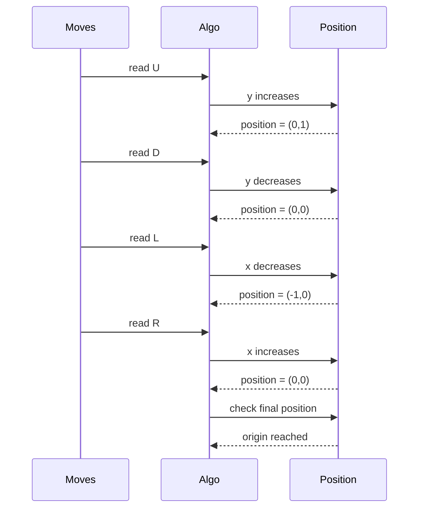
```mermaid
sequenceDiagram
    participant Moves
    participant Algo
    participant Position

    Moves->>Algo: read U
    Algo->>Position: y increases
    Position-->>Algo: position = (0,1)

    Moves->>Algo: read D
    Algo->>Position: y decreases
    Position-->>Algo: position = (0,0)

    Moves->>Algo: read L
    Algo->>Position: x decreases
    Position-->>Algo: position = (-1,0)

    Moves->>Algo: read R
    Algo->>Position: x increases
    Position-->>Algo: position = (0,0)

    Algo->>Position: check final position
    Position-->>Algo: origin reached
```

### Mermaid Flow

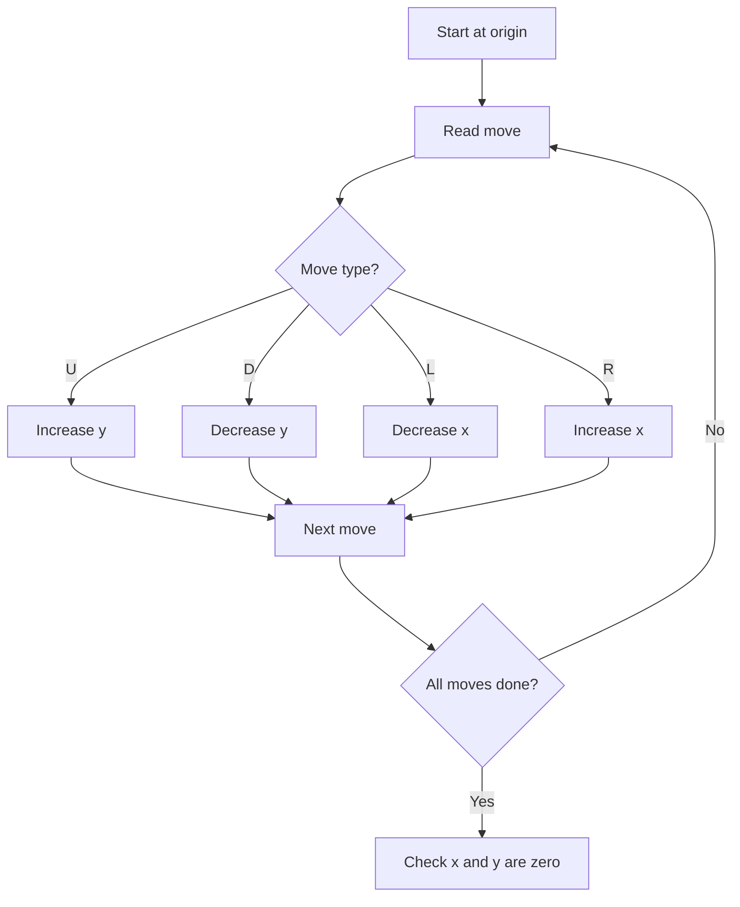
```mermaid
flowchart TD
    A["Start at origin"] --> B["Read move"]
    B --> C{"Move type?"}
    C -->|U| D["Increase y"]
    C -->|D| E["Decrease y"]
    C -->|L| F["Decrease x"]
    C -->|R| G["Increase x"]
    D --> H["Next move"]
    E --> H
    F --> H
    G --> H
    H --> I{"All moves done?"}
    I -->|No| B
    I -->|Yes| J["Check x and y are zero"]
```

### C++

```cpp
bool judgeCircle(string moves) {
    int x = 0;
    int y = 0;

    for (char c : moves) {
        if (c == 'U') y++;
        else if (c == 'D') y--;
        else if (c == 'L') x--;
        else if (c == 'R') x++;
    }

    return x == 0 && y == 0;
}
```

### Complexity

```text
Time: O(n)
Space: O(1)
```

---

## Problem A3: Count and Say

**Link:** https://leetcode.com/problems/count-and-say/

### Statement

Generate the `n-th` count-and-say string. Each term describes the previous term.

### Recognition Signals

- Repeated process.
- Need build next state from previous state.
- Run-length counting.

### Approach

Start with `"1"`. Repeat `n-1` times. Convert current string into run-length description.

### Dry Run

```text
n = 5
```

| Term | String | Explanation |
|---:|---|---|
| 1 | `1` | base |
| 2 | `11` | one 1 |
| 3 | `21` | two 1s |
| 4 | `1211` | one 2, one 1 |
| 5 | `111221` | one 1, one 2, two 1s |

### Timeline Dry Run

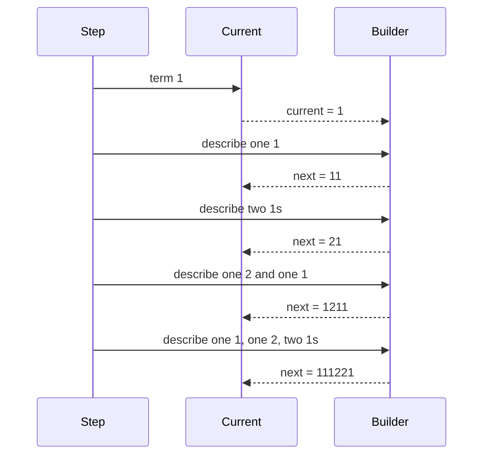
```mermaid
sequenceDiagram
    participant Step
    participant Current
    participant Builder

    Step->>Current: term 1
    Current-->>Builder: current = 1

    Step->>Builder: describe one 1
    Builder-->>Current: next = 11

    Step->>Builder: describe two 1s
    Builder-->>Current: next = 21

    Step->>Builder: describe one 2 and one 1
    Builder-->>Current: next = 1211

    Step->>Builder: describe one 1, one 2, two 1s
    Builder-->>Current: next = 111221
```

### Mermaid Flow

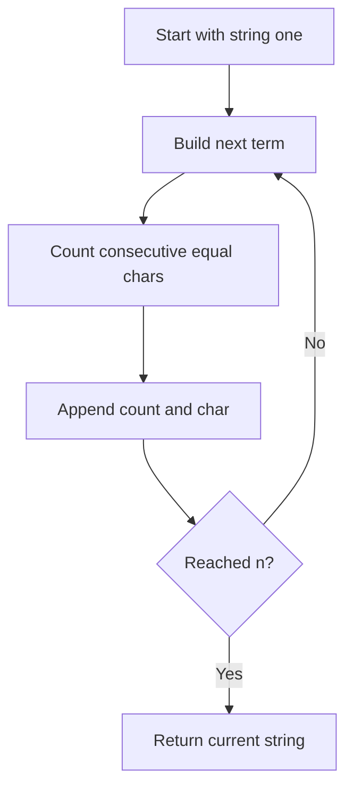
```mermaid
flowchart TD
    A["Start with string one"] --> B["Build next term"]
    B --> C["Count consecutive equal chars"]
    C --> D["Append count and char"]
    D --> E{"Reached n?"}
    E -->|No| B
    E -->|Yes| F["Return current string"]
```

### C++

```cpp
string countAndSay(int n) {
    string cur = "1";

    for (int step = 2; step <= n; step++) {
        string nxt;

        for (int i = 0; i < (int)cur.size();) {
            int j = i;

            while (j < (int)cur.size() && cur[j] == cur[i]) {
                j++;
            }

            nxt += to_string(j - i);
            nxt.push_back(cur[i]);

            i = j;
        }

        cur = nxt;
    }

    return cur;
}
```

### Complexity

```text
Time: O(total generated length)
Space: O(current string length)
```

---

# 6. Form B: Casework

## Recognition

Use when solution depends on separate conditions.

| Signal | Example |
|---|---|
| special small n | Beautiful Permutation |
| impossible cases | Coin Piles |
| different behaviour by bill/value | Lemonade Change |
| shape validation | Valid Mountain Array |

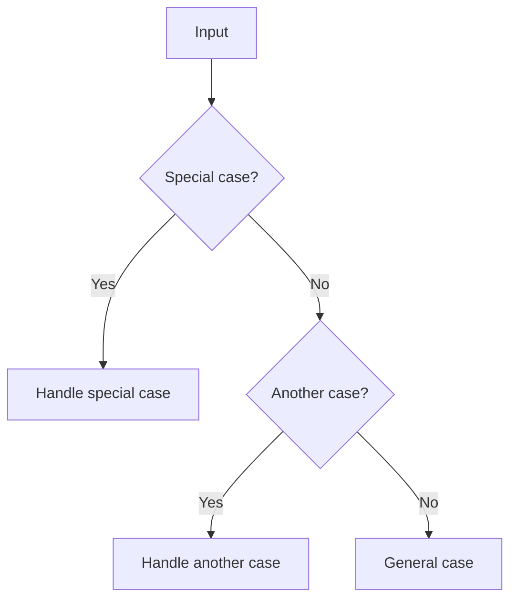
```mermaid
flowchart TD
    A["Input"] --> B{"Special case?"}
    B -->|Yes| C["Handle special case"]
    B -->|No| D{"Another case?"}
    D -->|Yes| E["Handle another case"]
    D -->|No| F["General case"]
```

---

## Problem B1: Valid Mountain Array

**Link:** https://leetcode.com/problems/valid-mountain-array/

### Statement

Array is valid mountain if it strictly increases then strictly decreases, with peak not at start or end.

### Recognition Signals

- Shape validation.
- Strict inequality.
- Edge cases matter.

### Wrong Intuition

Checking if there is one maximum is not enough. Duplicates or flat parts invalidate.

### Approach

Climb while increasing, validate peak, then descend while decreasing.

### Dry Run

```text
arr = [0,3,2,1]
```

| Phase | Index | Condition | Result |
|---|---:|---|---|
| climb | 0 | `0 < 3` | move |
| climb stops | 1 | `3 < 2` false | peak |
| peak check | 1 | not first or last | ok |
| descend | 1 | `3 > 2` | move |
| descend | 2 | `2 > 1` | move |
| end | 3 | reached end | valid |

### Timeline Dry Run

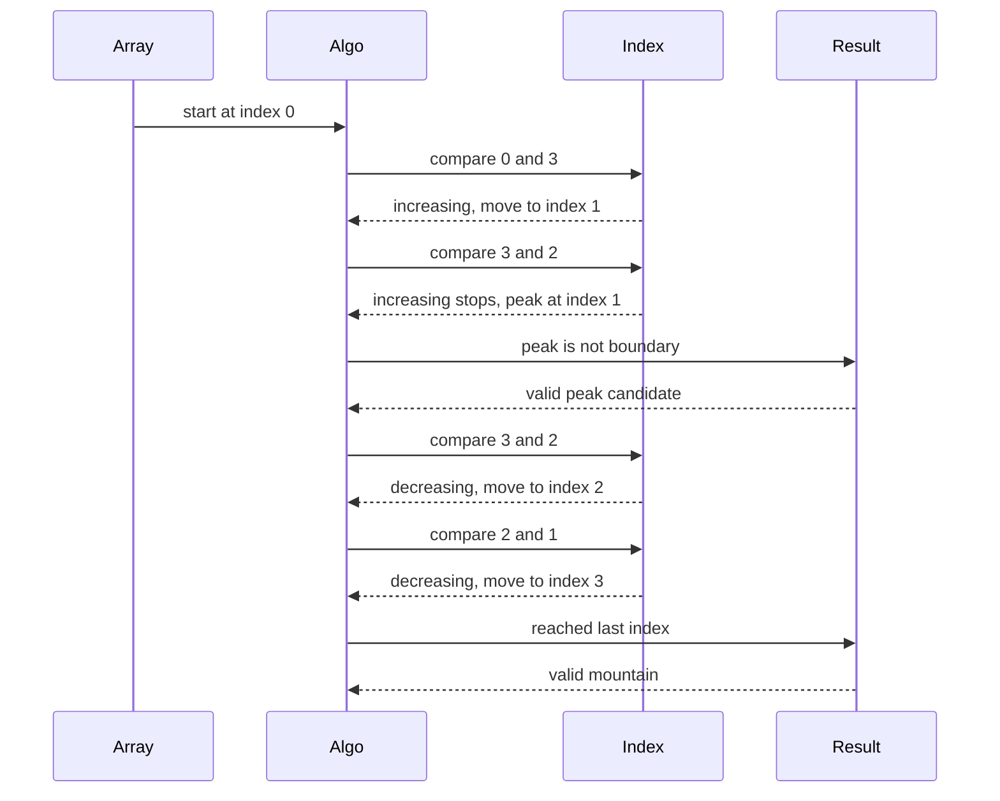
```mermaid
sequenceDiagram
    participant Array
    participant Algo
    participant Index
    participant Result

    Array->>Algo: start at index 0
    Algo->>Index: compare 0 and 3
    Index-->>Algo: increasing, move to index 1

    Algo->>Index: compare 3 and 2
    Index-->>Algo: increasing stops, peak at index 1

    Algo->>Result: peak is not boundary
    Result-->>Algo: valid peak candidate

    Algo->>Index: compare 3 and 2
    Index-->>Algo: decreasing, move to index 2

    Algo->>Index: compare 2 and 1
    Index-->>Algo: decreasing, move to index 3

    Algo->>Result: reached last index
    Result-->>Algo: valid mountain
```

### Mermaid Flow

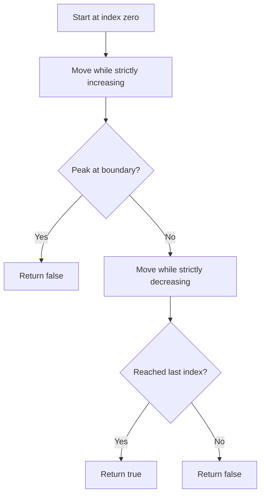
```mermaid
flowchart TD
    A["Start at index zero"] --> B["Move while strictly increasing"]
    B --> C{"Peak at boundary?"}
    C -->|Yes| D["Return false"]
    C -->|No| E["Move while strictly decreasing"]
    E --> F{"Reached last index?"}
    F -->|Yes| G["Return true"]
    F -->|No| H["Return false"]
```

### C++

```cpp
bool validMountainArray(vector<int>& arr) {
    int n = arr.size();
    int i = 0;

    while (i + 1 < n && arr[i] < arr[i + 1]) i++;

    if (i == 0 || i == n - 1) return false;

    while (i + 1 < n && arr[i] > arr[i + 1]) i++;

    return i == n - 1;
}
```

### Traps

| Trap | Example |
|---|---|
| flat part | `[0,2,2,1]` |
| only increasing | `[1,2,3]` |
| only decreasing | `[3,2,1]` |

---

## Problem B2: Lemonade Change

**Link:** https://leetcode.com/problems/lemonade-change/

### Statement

Each lemonade costs 5. Customers pay with 5, 10, or 20. Return whether correct change can be given.

### Recognition Signals

- Multiple cases by bill value.
- State is counts of bills.
- Need greedy case for 20.

### Approach

Track number of 5 and 10 bills. For 20, prefer using 10+5 over 5+5+5.

### Dry Run

```text
bills = [5,5,5,10,20]
```

| Bill | Five Before | Ten Before | Action | Five After | Ten After |
|---:|---:|---:|---|---:|---:|
| 5 | 0 | 0 | take 5 | 1 | 0 |
| 5 | 1 | 0 | take 5 | 2 | 0 |
| 5 | 2 | 0 | take 5 | 3 | 0 |
| 10 | 3 | 0 | give 5 | 2 | 1 |
| 20 | 2 | 1 | give 10 and 5 | 1 | 0 |

### Timeline Dry Run

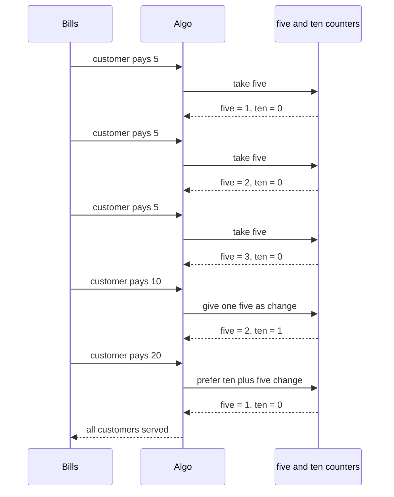
```mermaid
sequenceDiagram
    participant Bills
    participant Algo
    participant Cash as five and ten counters

    Bills->>Algo: customer pays 5
    Algo->>Cash: take five
    Cash-->>Algo: five = 1, ten = 0

    Bills->>Algo: customer pays 5
    Algo->>Cash: take five
    Cash-->>Algo: five = 2, ten = 0

    Bills->>Algo: customer pays 5
    Algo->>Cash: take five
    Cash-->>Algo: five = 3, ten = 0

    Bills->>Algo: customer pays 10
    Algo->>Cash: give one five as change
    Cash-->>Algo: five = 2, ten = 1

    Bills->>Algo: customer pays 20
    Algo->>Cash: prefer ten plus five change
    Cash-->>Algo: five = 1, ten = 0

    Algo-->>Bills: all customers served
```

### Mermaid Flow

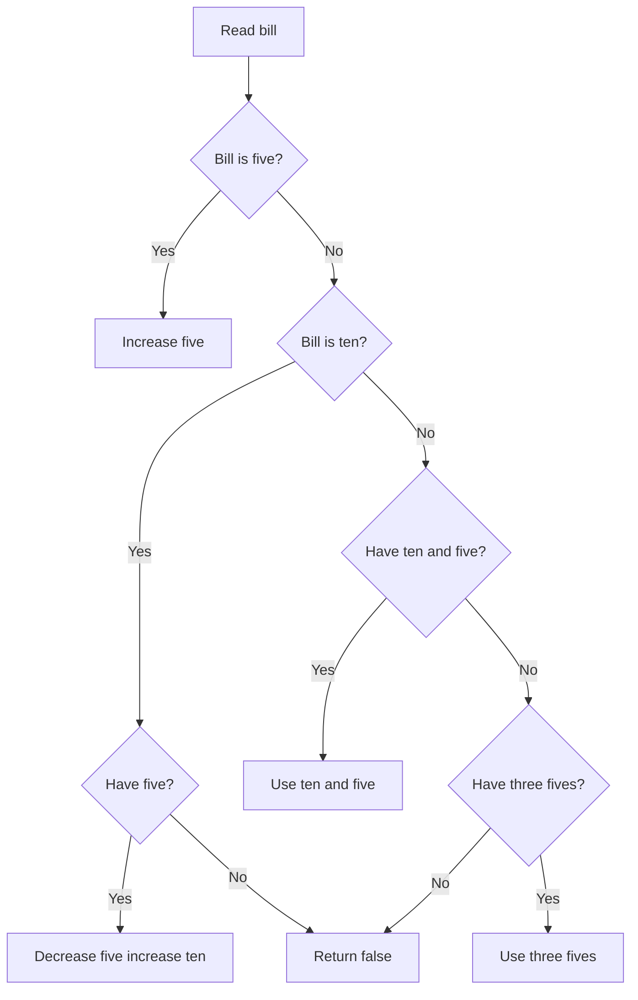
```mermaid
flowchart TD
    A["Read bill"] --> B{"Bill is five?"}
    B -->|Yes| C["Increase five"]
    B -->|No| D{"Bill is ten?"}
    D -->|Yes| E{"Have five?"}
    E -->|Yes| F["Decrease five increase ten"]
    E -->|No| G["Return false"]
    D -->|No| H{"Have ten and five?"}
    H -->|Yes| I["Use ten and five"]
    H -->|No| J{"Have three fives?"}
    J -->|Yes| K["Use three fives"]
    J -->|No| G
```

### C++

```cpp
bool lemonadeChange(vector<int>& bills) {
    int five = 0;
    int ten = 0;

    for (int bill : bills) {
        if (bill == 5) {
            five++;
        } else if (bill == 10) {
            if (five == 0) return false;
            five--;
            ten++;
        } else {
            if (ten > 0 && five > 0) {
                ten--;
                five--;
            } else if (five >= 3) {
                five -= 3;
            } else {
                return false;
            }
        }
    }

    return true;
}
```

---

## Problem B3: Partition Array Into Three Parts With Equal Sum

**Link:** https://leetcode.com/problems/partition-array-into-three-parts-with-equal-sum/

### Statement

Can array be split into three non-empty parts with equal sum?

### Recognition Signals

- Total sum condition.
- Prefix accumulation.
- Need count repeated target segments.

### Approach

Total must be divisible by 3. Count how many times running sum reaches target.

### Dry Run

```text
arr = [0,2,1,-6,6,-7,9,1,2,0,1]
total = 9
target = 3
```

| Index | Value | Running Sum | Action |
|---:|---:|---:|---|
| 0 | 0 | 0 | continue |
| 1 | 2 | 2 | continue |
| 2 | 1 | 3 | found part 1, reset |
| 3 | -6 | -6 | continue |
| 4 | 6 | 0 | continue |
| 5 | -7 | -7 | continue |
| 6 | 9 | 2 | continue |
| 7 | 1 | 3 | found part 2, reset |
| 8 | 2 | 2 | continue |
| 9 | 0 | 2 | continue |
| 10 | 1 | 3 | found part 3 |

Answer: `true`.

### Timeline Dry Run

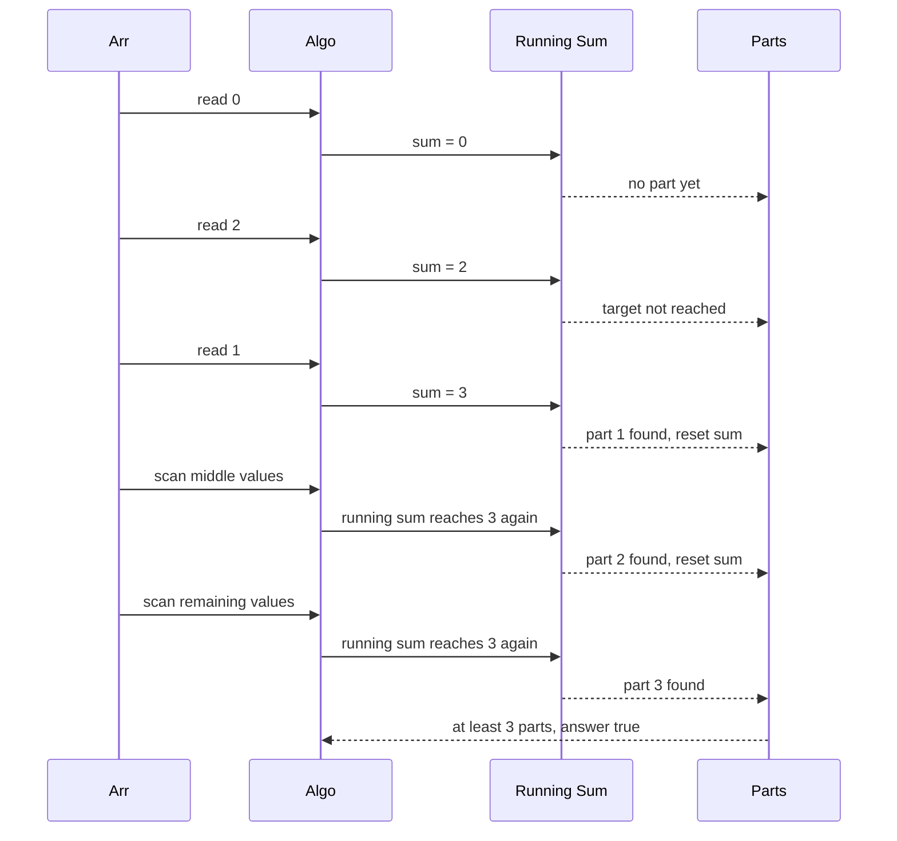
```mermaid
sequenceDiagram
    participant Arr
    participant Algo
    participant Sum as Running Sum
    participant Parts

    Arr->>Algo: read 0
    Algo->>Sum: sum = 0
    Sum-->>Parts: no part yet

    Arr->>Algo: read 2
    Algo->>Sum: sum = 2
    Sum-->>Parts: target not reached

    Arr->>Algo: read 1
    Algo->>Sum: sum = 3
    Sum-->>Parts: part 1 found, reset sum

    Arr->>Algo: scan middle values
    Algo->>Sum: running sum reaches 3 again
    Sum-->>Parts: part 2 found, reset sum

    Arr->>Algo: scan remaining values
    Algo->>Sum: running sum reaches 3 again
    Sum-->>Parts: part 3 found

    Parts-->>Algo: at least 3 parts, answer true
```

### C++

```cpp
bool canThreePartsEqualSum(vector<int>& arr) {
    int total = accumulate(arr.begin(), arr.end(), 0);

    if (total % 3 != 0) return false;

    int target = total / 3;
    int sum = 0;
    int parts = 0;

    for (int x : arr) {
        sum += x;

        if (sum == target) {
            parts++;
            sum = 0;
        }
    }

    return parts >= 3;
}
```

---

# 7. Form C: Frequency / Counting

## Recognition

Use when order does not matter.

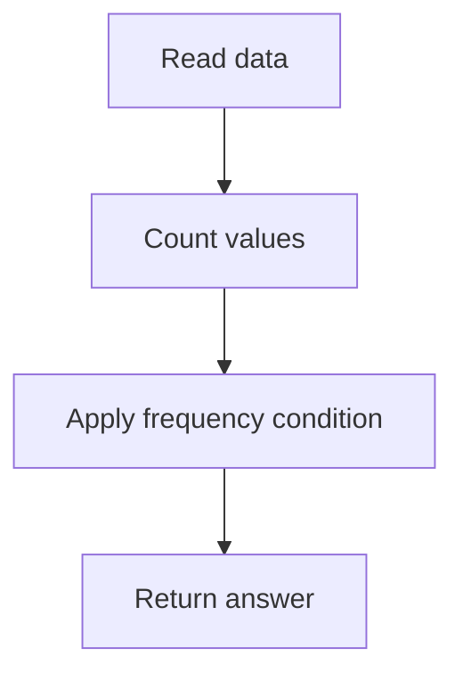
```mermaid
flowchart TD
    A["Read data"] --> B["Count values"]
    B --> C["Apply frequency condition"]
    C --> D["Return answer"]
```

---

## Problem C1: Unique Number of Occurrences

**Link:** https://leetcode.com/problems/unique-number-of-occurrences/

### Statement

Return true if occurrence counts of all values are unique.

### Approach

Map value to frequency, then check duplicate frequencies using set.

### Dry Run

```text
arr = [1,2,2,1,1,3]
```

| Value | Count |
|---:|---:|
| 1 | 3 |
| 2 | 2 |
| 3 | 1 |

Counts `{3,2,1}` are unique.

### Timeline Dry Run

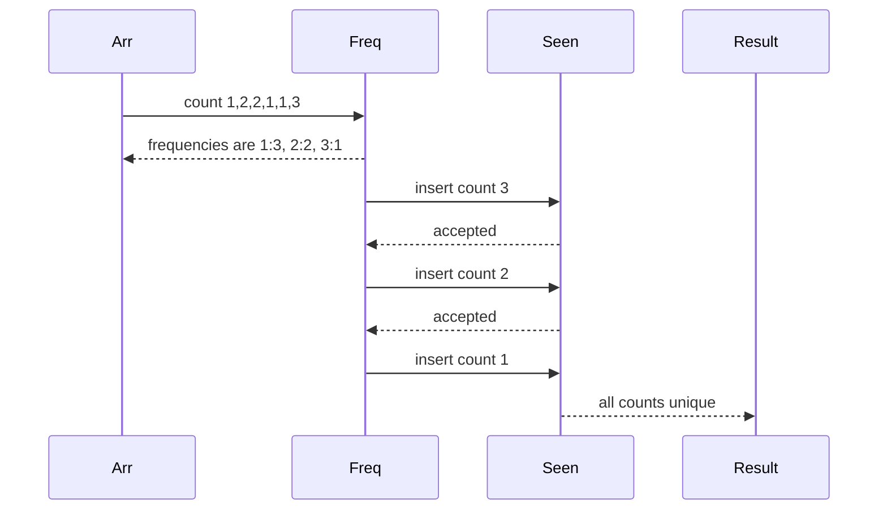
```mermaid
sequenceDiagram
    participant Arr
    participant Freq
    participant Seen
    participant Result

    Arr->>Freq: count 1,2,2,1,1,3
    Freq-->>Arr: frequencies are 1:3, 2:2, 3:1

    Freq->>Seen: insert count 3
    Seen-->>Freq: accepted

    Freq->>Seen: insert count 2
    Seen-->>Freq: accepted

    Freq->>Seen: insert count 1
    Seen-->>Result: all counts unique
```

### Mermaid Flow

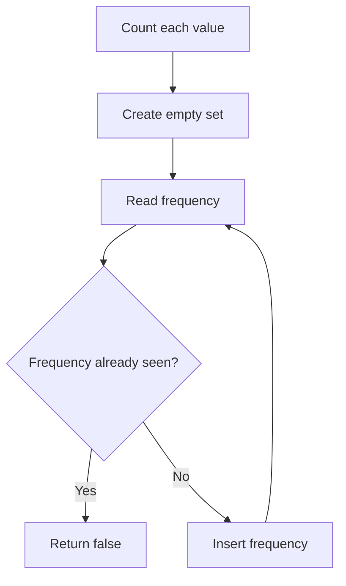
```mermaid
flowchart TD
    A["Count each value"] --> B["Create empty set"]
    B --> C["Read frequency"]
    C --> D{"Frequency already seen?"}
    D -->|Yes| E["Return false"]
    D -->|No| F["Insert frequency"]
    F --> C
```

### C++

```cpp
bool uniqueOccurrences(vector<int>& arr) {
    unordered_map<int, int> freq;

    for (int x : arr) freq[x]++;

    unordered_set<int> seen;

    for (auto [value, count] : freq) {
        if (seen.count(count)) return false;
        seen.insert(count);
    }

    return true;
}
```

---

## Problem C2: Majority Element

**Link:** https://leetcode.com/problems/majority-element/

### Statement

Find element appearing more than `n / 2`.

### Approach

Boyer-Moore cancels one majority with one non-majority. Majority remains.

### Dry Run

```text
nums = [2,2,1,1,1,2,2]
```

| x | Candidate Before | Count Before | Candidate After | Count After |
|---:|---:|---:|---:|---:|
| 2 | none | 0 | 2 | 1 |
| 2 | 2 | 1 | 2 | 2 |
| 1 | 2 | 2 | 2 | 1 |
| 1 | 2 | 1 | 2 | 0 |
| 1 | 2 | 0 | 1 | 1 |
| 2 | 1 | 1 | 1 | 0 |
| 2 | 1 | 0 | 2 | 1 |

Answer: `2`.

### Timeline Dry Run

```mermaid
sequenceDiagram
    participant Nums
    participant Algo
    participant State as Candidate and Count

    Nums->>Algo: read 2
    Algo->>State: count is zero, candidate becomes 2
    State-->>Algo: candidate = 2, count = 1

    Nums->>Algo: read 2
    Algo->>State: same as candidate, increase count
    State-->>Algo: candidate = 2, count = 2

    Nums->>Algo: read 1
    Algo->>State: different, cancel one vote
    State-->>Algo: candidate = 2, count = 1

    Nums->>Algo: read 1
    Algo->>State: different, cancel one vote
    State-->>Algo: candidate = 2, count = 0

    Nums->>Algo: read 1
    Algo->>State: count is zero, candidate becomes 1
    State-->>Algo: candidate = 1, count = 1

    Nums->>Algo: read 2 then 2
    Algo->>State: votes cancel then candidate becomes 2
    State-->>Algo: final candidate = 2
```

### C++

```cpp
int majorityElement(vector<int>& nums) {
    int candidate = 0;
    int count = 0;

    for (int x : nums) {
        if (count == 0) {
            candidate = x;
            count = 1;
        } else if (x == candidate) {
            count++;
        } else {
            count--;
        }
    }

    return candidate;
}
```

---

## Problem C3: Palindrome Reorder

**Link:** https://cses.fi/problemset/task/1755

### Statement

Given uppercase string, reorder it into a palindrome if possible.

### Recognition Signals

- Only character counts matter.
- Palindrome allows at most one odd count.

### Approach

Count characters. If more than one odd count, impossible. Build half + middle + reverse half.

### Dry Run

```text
s = "AAAACACBA"
```

| Char | Count |
|---|---:|
| A | 5 |
| B | 1 |
| C | 3 |

Odd counts = 3, impossible.

For:

```text
s = "AAAACAC"
```

| Char | Count |
|---|---:|
| A | 5 |
| C | 2 |

Half = `AAC`, middle = `A`, reverse half = `CAA`.  
Answer = `AACA CAA` → `AACACAA`.

### Timeline Dry Run

```mermaid
sequenceDiagram
    participant S as String
    participant Freq
    participant Builder
    participant Result

    S->>Freq: count characters
    Freq-->>S: A = 5, C = 2

    Freq->>Builder: odd count is A
    Builder-->>Freq: middle = A

    Freq->>Builder: add half of each count
    Builder-->>Freq: left = AAC

    Builder->>Result: reverse left
    Result-->>Builder: right = CAA

    Builder->>Result: left + middle + right
    Result-->>S: AACACAA
```

### C++

```cpp
string palindromeReorder(string s) {
    vector<int> freq(26, 0);

    for (char c : s) freq[c - 'A']++;

    int odd = 0;
    int oddIndex = -1;

    for (int i = 0; i < 26; i++) {
        if (freq[i] % 2) {
            odd++;
            oddIndex = i;
        }
    }

    if (odd > 1) return "NO SOLUTION";

    string left, mid;

    for (int i = 0; i < 26; i++) {
        left += string(freq[i] / 2, char('A' + i));
    }

    if (oddIndex != -1) {
        mid = string(freq[oddIndex] % 2, char('A' + oddIndex));
    }

    string right = left;
    reverse(right.begin(), right.end());

    return left + mid + right;
}
```

---

# 8. Form D: String Rules

## Recognition

Use when characters, tokens, formatting, or adjacent groups matter.

```mermaid
flowchart TD
    A["Scan string"] --> B{"Current token type?"}
    B -->|Type one| C["Apply rule one"]
    B -->|Type two| D["Apply rule two"]
    B -->|Other| E["Apply default rule"]
```

---

## Problem D1: Goal Parser Interpretation

**Link:** https://leetcode.com/problems/goal-parser-interpretation/

### Statement

Interpret `G`, `()`, and `(al)`.

### Approach

Scan and map token to output.

### Dry Run

| Input Token | Output | Answer |
|---|---|---|
| G | G | G |
| () | o | Go |
| (al) | al | Goal |

### Timeline Dry Run

```mermaid
sequenceDiagram
    participant Command
    participant Algo
    participant Output

    Command->>Algo: read G
    Algo->>Output: append G
    Output-->>Algo: output = G

    Command->>Algo: read empty parentheses
    Algo->>Output: append o
    Output-->>Algo: output = Go

    Command->>Algo: read al token
    Algo->>Output: append al
    Output-->>Algo: output = Goal
```

### C++

```cpp
string interpret(string command) {
    string ans;

    for (int i = 0; i < (int)command.size(); i++) {
        if (command[i] == 'G') {
            ans.push_back('G');
        } else if (command[i] == '(' && command[i + 1] == ')') {
            ans.push_back('o');
            i++;
        } else {
            ans += "al";
            i += 3;
        }
    }

    return ans;
}
```

---

## Problem D2: String Compression

**Link:** https://leetcode.com/problems/string-compression/

### Statement

Compress consecutive groups in-place: `["a","a","b"]` becomes `["a","2","b"]`.

### Recognition Signals

- Consecutive runs.
- Need write pointer.
- In-place modification.

### Approach

Use two pointers: one to scan groups, one to write compressed output.

### Dry Run

```text
chars = ["a","a","b","b","c","c","c"]
```

| Group | Count | Write |
|---|---:|---|
| a | 2 | `a2` |
| b | 2 | `b2` |
| c | 3 | `c3` |

Compressed prefix: `a2b2c3`.

### Timeline Dry Run

```mermaid
sequenceDiagram
    participant Chars
    participant Scanner
    participant Writer

    Chars->>Scanner: scan group a a
    Scanner->>Writer: write a and 2
    Writer-->>Scanner: compressed prefix = a2

    Chars->>Scanner: scan group b b
    Scanner->>Writer: write b and 2
    Writer-->>Scanner: compressed prefix = a2b2

    Chars->>Scanner: scan group c c c
    Scanner->>Writer: write c and 3
    Writer-->>Scanner: compressed prefix = a2b2c3
```

### Mermaid Flow

```mermaid
flowchart TD
    A["Start group"] --> B["Move until character changes"]
    B --> C["Write group character"]
    C --> D{"Count greater than one?"}
    D -->|Yes| E["Write count digits"]
    D -->|No| F["Skip count"]
    E --> G["Next group"]
    F --> G
```

### C++

```cpp
int compress(vector<char>& chars) {
    int n = chars.size();
    int write = 0;

    for (int i = 0; i < n;) {
        char c = chars[i];
        int j = i;

        while (j < n && chars[j] == c) {
            j++;
        }

        chars[write++] = c;

        int count = j - i;
        if (count > 1) {
            string s = to_string(count);
            for (char digit : s) {
                chars[write++] = digit;
            }
        }

        i = j;
    }

    return write;
}
```

---

## Problem D3: Roman to Integer

**Link:** https://leetcode.com/problems/roman-to-integer/

### Statement

Convert Roman numeral to integer. If a smaller value appears before larger value, subtract it.

### Approach

Scan left to right. If current value is less than next value, subtract; otherwise add.

### Dry Run

```text
s = "MCMXCIV"
```

| Char | Value | Next | Action | Total |
|---|---:|---:|---|---:|
| M | 1000 | 100 | add | 1000 |
| C | 100 | 1000 | subtract | 900 |
| M | 1000 | 10 | add | 1900 |
| X | 10 | 100 | subtract | 1890 |
| C | 100 | 1 | add | 1990 |
| I | 1 | 5 | subtract | 1989 |
| V | 5 | none | add | 1994 |

### Timeline Dry Run

```mermaid
sequenceDiagram
    participant Roman
    participant Algo
    participant Total

    Roman->>Algo: read M before C
    Algo->>Total: add 1000
    Total-->>Algo: total = 1000

    Roman->>Algo: read C before M
    Algo->>Total: subtract 100
    Total-->>Algo: total = 900

    Roman->>Algo: read M before X
    Algo->>Total: add 1000
    Total-->>Algo: total = 1900

    Roman->>Algo: read X before C
    Algo->>Total: subtract 10
    Total-->>Algo: total = 1890

    Roman->>Algo: read C, I, V
    Algo->>Total: add C, subtract I, add V
    Total-->>Algo: total = 1994
```

### C++

```cpp
int romanToInt(string s) {
    unordered_map<char, int> val = {
        {'I', 1}, {'V', 5}, {'X', 10}, {'L', 50},
        {'C', 100}, {'D', 500}, {'M', 1000}
    };

    int ans = 0;

    for (int i = 0; i < (int)s.size(); i++) {
        if (i + 1 < (int)s.size() && val[s[i]] < val[s[i + 1]]) {
            ans -= val[s[i]];
        } else {
            ans += val[s[i]];
        }
    }

    return ans;
}
```

---

# 9. Form E: Grid / Matrix Observation

## Recognition

Use for row, column, diagonal, neighbour, or boundary rules.

```mermaid
flowchart TD
    A["Grid problem"] --> B{"Neighbour based?"}
    B -->|Yes| C["Use direction arrays"]
    B -->|No| D{"Diagonal based?"}
    D -->|Yes| E["Compare diagonal cells"]
    D -->|No| F["Use boundary simulation"]
```

---

## Problem E1: Island Perimeter

**Link:** https://leetcode.com/problems/island-perimeter/

### Approach

Each land side touching water or boundary contributes one.

### Dry Run

```text
grid:
1 1
1 0
```

| Cell | Up | Down | Left | Right | Add |
|---|---|---|---|---|---:|
| `(0,0)` | outside | land | outside | land | 2 |
| `(0,1)` | outside | water | land | outside | 3 |
| `(1,0)` | land | outside | outside | water | 3 |

Answer = `8`.

### Timeline Dry Run

```mermaid
sequenceDiagram
    participant Grid
    participant Algo
    participant Perimeter

    Grid->>Algo: visit land cell (0,0)
    Algo->>Perimeter: up outside and left outside
    Perimeter-->>Algo: add 2

    Grid->>Algo: visit land cell (0,1)
    Algo->>Perimeter: up outside, right outside, down water
    Perimeter-->>Algo: add 3

    Grid->>Algo: visit land cell (1,0)
    Algo->>Perimeter: left outside, down outside, right water
    Perimeter-->>Algo: add 3

    Perimeter-->>Grid: total perimeter = 8
```

### C++

```cpp
int islandPerimeter(vector<vector<int>>& grid) {
    int n = grid.size();
    int m = grid[0].size();

    int dr[4] = {1, -1, 0, 0};
    int dc[4] = {0, 0, 1, -1};

    int ans = 0;

    for (int r = 0; r < n; r++) {
        for (int c = 0; c < m; c++) {
            if (grid[r][c] == 0) continue;

            for (int k = 0; k < 4; k++) {
                int nr = r + dr[k];
                int nc = c + dc[k];

                if (nr < 0 || nr >= n || nc < 0 || nc >= m || grid[nr][nc] == 0) {
                    ans++;
                }
            }
        }
    }

    return ans;
}
```

---

## Problem E2: Spiral Matrix

**Link:** https://leetcode.com/problems/spiral-matrix/

### Statement

Return all elements of matrix in spiral order.

### Approach

Maintain four boundaries: top, bottom, left, right.

### Dry Run

```text
matrix:
1 2 3
4 5 6
7 8 9
```

| Step | Direction | Elements |
|---:|---|---|
| 1 | left to right top row | 1 2 3 |
| 2 | top to bottom right col | 6 9 |
| 3 | right to left bottom row | 8 7 |
| 4 | bottom to top left col | 4 |
| 5 | inner row | 5 |

Answer: `1 2 3 6 9 8 7 4 5`.

### Timeline Dry Run

```mermaid
sequenceDiagram
    participant Matrix
    participant Algo
    participant Bounds
    participant Ans

    Matrix->>Algo: start with full boundaries
    Bounds-->>Algo: top=0, bottom=2, left=0, right=2

    Algo->>Ans: traverse top row
    Ans-->>Algo: add 1,2,3
    Algo->>Bounds: increase top

    Algo->>Ans: traverse right column
    Ans-->>Algo: add 6,9
    Algo->>Bounds: decrease right

    Algo->>Ans: traverse bottom row
    Ans-->>Algo: add 8,7
    Algo->>Bounds: decrease bottom

    Algo->>Ans: traverse left column
    Ans-->>Algo: add 4
    Algo->>Bounds: increase left

    Algo->>Ans: traverse inner cell
    Ans-->>Matrix: final order 1,2,3,6,9,8,7,4,5
```

### Mermaid Flow

```mermaid
flowchart TD
    A["Have top bottom left right"] --> B["Traverse top row"]
    B --> C["Increase top"]
    C --> D["Traverse right column"]
    D --> E["Decrease right"]
    E --> F{"Rows still valid?"}
    F -->|Yes| G["Traverse bottom row"]
    G --> H["Decrease bottom"]
    H --> I{"Columns still valid?"}
    I -->|Yes| J["Traverse left column"]
    J --> K["Increase left"]
    K --> L{"Boundaries valid?"}
    L -->|Yes| B
    L -->|No| M["Return answer"]
```

### C++

```cpp
vector<int> spiralOrder(vector<vector<int>>& matrix) {
    int n = matrix.size();
    int m = matrix[0].size();

    int top = 0;
    int bottom = n - 1;
    int left = 0;
    int right = m - 1;

    vector<int> ans;

    while (top <= bottom && left <= right) {
        for (int c = left; c <= right; c++) {
            ans.push_back(matrix[top][c]);
        }
        top++;

        for (int r = top; r <= bottom; r++) {
            ans.push_back(matrix[r][right]);
        }
        right--;

        if (top <= bottom) {
            for (int c = right; c >= left; c--) {
                ans.push_back(matrix[bottom][c]);
            }
            bottom--;
        }

        if (left <= right) {
            for (int r = bottom; r >= top; r--) {
                ans.push_back(matrix[r][left]);
            }
            left++;
        }
    }

    return ans;
}
```

---

# 10. Form F: Parity / Modulo / Game Observation

## Recognition

Use when odd/even or remainders determine states.

```mermaid
flowchart TD
    A["Write small cases"] --> B["Mark win lose or possible impossible"]
    B --> C["Find modulo pattern"]
    C --> D["Implement condition"]
```

---

## Problem F1: Nim Game

Already shown above. Key formula:

```cpp
return n % 4 != 0;
```

---

## Problem F2: Bulb Switcher

**Link:** https://leetcode.com/problems/bulb-switcher/

### Statement

Bulbs toggle by divisor rounds. Count bulbs left on.

### Approach

Only perfect squares have odd number of divisors.

### Dry Run

| Bulb | Divisors | Toggle Count | Final |
|---:|---|---:|---|
| 1 | 1 | 1 | on |
| 2 | 1,2 | 2 | off |
| 3 | 1,3 | 2 | off |
| 4 | 1,2,4 | 3 | on |
| 9 | 1,3,9 | 3 | on |

Answer for `n` is `floor(sqrt(n))`.

### Timeline Dry Run

```mermaid
sequenceDiagram
    participant Bulb
    participant Divisors
    participant State
    participant Answer

    Bulb->>Divisors: bulb 1 has divisor 1
    Divisors->>State: odd toggles
    State-->>Answer: bulb 1 stays on

    Bulb->>Divisors: bulb 2 has divisors 1 and 2
    Divisors->>State: even toggles
    State-->>Answer: bulb 2 off

    Bulb->>Divisors: bulb 4 has divisors 1,2,4
    Divisors->>State: odd toggles
    State-->>Answer: bulb 4 on

    Answer-->>Bulb: only perfect squares remain on
```

### C++

```cpp
int bulbSwitch(int n) {
    return (int)sqrt(n);
}
```

---

# 11. Form G: Boundary Tracking

## Recognition

Use when answer depends on min/max/first/last/nearest.

```mermaid
flowchart TD
    A["Scan array"] --> B["Update boundary value"]
    B --> C["Use boundary to update answer"]
    C --> D["Next element"]
```

---

## Problem G1: Maximum Difference Between Increasing Elements

Already shown. Key idea: track minimum before current element.

---

## Problem G2: Product of Array Except Self

**Link:** https://leetcode.com/problems/product-of-array-except-self/

### Statement

Return array where `ans[i]` is product of all values except `nums[i]`, without division.

### Approach

Use product of left side and right side.

### Dry Run

```text
nums = [1,2,3,4]
```

| i | Left Product Before | ans after left pass |
|---:|---:|---|
| 0 | 1 | `[1,_,_,_]` |
| 1 | 1 | `[1,1,_,_]` |
| 2 | 2 | `[1,1,2,_]` |
| 3 | 6 | `[1,1,2,6]` |

Right pass:

| i | Right Product Before | ans updated |
|---:|---:|---|
| 3 | 1 | `[1,1,2,6]` |
| 2 | 4 | `[1,1,8,6]` |
| 1 | 12 | `[1,12,8,6]` |
| 0 | 24 | `[24,12,8,6]` |

### Timeline Dry Run

```mermaid
sequenceDiagram
    participant Nums
    participant LeftPass
    participant RightPass
    participant Ans

    Nums->>LeftPass: scan left to right
    LeftPass->>Ans: store product before each index
    Ans-->>LeftPass: ans = [1,1,2,6]

    Nums->>RightPass: scan right to left
    RightPass->>Ans: multiply product after each index
    Ans-->>RightPass: index 3 unchanged
    Ans-->>RightPass: index 2 becomes 8
    Ans-->>RightPass: index 1 becomes 12
    Ans-->>RightPass: index 0 becomes 24

    Ans-->>Nums: final answer = [24,12,8,6]
```

### C++

```cpp
vector<int> productExceptSelf(vector<int>& nums) {
    int n = nums.size();
    vector<int> ans(n, 1);

    int left = 1;
    for (int i = 0; i < n; i++) {
        ans[i] = left;
        left *= nums[i];
    }

    int right = 1;
    for (int i = n - 1; i >= 0; i--) {
        ans[i] *= right;
        right *= nums[i];
    }

    return ans;
}
```

---

# 12. Form H: Sorting Observation

## Recognition

Use when sorted order exposes extremes, adjacent gaps, or custom order.

```mermaid
flowchart TD
    A["Sort input"] --> B{"Need extremes?"}
    B -->|Yes| C["Compare smallest and largest cases"]
    B -->|No| D{"Need gaps?"}
    D -->|Yes| E["Compare neighbours"]
    D -->|No| F["Use custom order"]
```

---

## Problem H1: Maximum Product of Three Numbers

Already shown.

---

## Problem H2: Minimum Difference Between Highest and Lowest of K Scores

**Link:** https://leetcode.com/problems/minimum-difference-between-highest-and-lowest-of-k-scores/

### Statement

Choose `k` scores minimizing difference between max and min.

### Approach

Sort scores. Any chosen group minimizing range will be contiguous in sorted order.

### Dry Run

```text
nums = [9,4,1,7], k = 2
sorted = [1,4,7,9]
```

| Window | Difference |
|---|---:|
| `[1,4]` | 3 |
| `[4,7]` | 3 |
| `[7,9]` | 2 |

Answer: `2`.

### Timeline Dry Run

```mermaid
sequenceDiagram
    participant Nums
    participant Algo
    participant Window
    participant Best

    Nums->>Algo: sort values
    Algo-->>Nums: sorted = [1,4,7,9]

    Algo->>Window: check [1,4]
    Window->>Best: diff = 3
    Best-->>Algo: best = 3

    Algo->>Window: check [4,7]
    Window->>Best: diff = 3
    Best-->>Algo: best = 3

    Algo->>Window: check [7,9]
    Window->>Best: diff = 2
    Best-->>Algo: best = 2
```

### C++

```cpp
int minimumDifference(vector<int>& nums, int k) {
    sort(nums.begin(), nums.end());

    int ans = INT_MAX;

    for (int i = 0; i + k - 1 < (int)nums.size(); i++) {
        ans = min(ans, nums[i + k - 1] - nums[i]);
    }

    return ans;
}
```

---

# 13. Form I: Constructive Ad Hoc

## Recognition

Use when output can be any valid object.

```mermaid
flowchart TD
    A["Need construct answer"] --> B["Find impossible cases"]
    B --> C{"Impossible?"}
    C -->|Yes| D["Print impossible"]
    C -->|No| E["Build simple valid object"]
    E --> F["Verify constraints"]
```

---

## Problem I1: DI String Match

Already shown.

---

## Problem I2: CSES Beautiful Permutation

Already shown.

---

## Problem I3: CSES Two Sets

**Link:** https://cses.fi/problemset/task/1092

### Statement

Split numbers `1..n` into two sets with equal sum.

### Approach

Total sum must be even. Then greedily take largest numbers until reaching half.

### Dry Run

```text
n = 7
total = 28
target = 14
```

| Pick Candidate | Target Before | Action | Target After |
|---:|---:|---|---:|
| 7 | 14 | take | 7 |
| 6 | 7 | take | 1 |
| 5 | 1 | skip | 1 |
| 4 | 1 | skip | 1 |
| 3 | 1 | skip | 1 |
| 2 | 1 | skip | 1 |
| 1 | 1 | take | 0 |

Set A = `{7,6,1}`. Set B = `{2,3,4,5}`.

### Timeline Dry Run

```mermaid
sequenceDiagram
    participant N
    participant Algo
    participant Target
    participant Sets

    N->>Algo: n = 7
    Algo->>Target: total = 28, target = 14

    Algo->>Target: try 7
    Target->>Sets: take 7 into set A
    Sets-->>Target: target = 7

    Algo->>Target: try 6
    Target->>Sets: take 6 into set A
    Sets-->>Target: target = 1

    Algo->>Target: skip 5,4,3,2
    Target-->>Algo: target still 1

    Algo->>Target: try 1
    Target->>Sets: take 1 into set A
    Sets-->>Target: target = 0

    Sets-->>N: remaining values go to set B
```

### C++

```cpp
pair<vector<int>, vector<int>> twoSets(int n) {
    long long total = 1LL * n * (n + 1) / 2;

    if (total % 2) return {{}, {}};

    long long target = total / 2;
    vector<int> a, b;
    vector<int> used(n + 1, 0);

    for (int x = n; x >= 1; x--) {
        if (target >= x) {
            a.push_back(x);
            used[x] = 1;
            target -= x;
        }
    }

    for (int x = 1; x <= n; x++) {
        if (!used[x]) b.push_back(x);
    }

    return {a, b};
}
```

---

# 14. Form J: Operation / Stack Process

## Recognition

Use when operations interact with previous unresolved items.

```mermaid
flowchart TD
    A["Read current item"] --> B{"Interacts with stack top?"}
    B -->|Yes| C["Resolve interaction"]
    C --> B
    B -->|No| D["Push current item"]
```

---

## Problem J1: Validate Stack Sequences

Already shown.

---

## Problem J2: Asteroid Collision

Already shown.

---

## Problem J3: Remove All Adjacent Duplicates In String

**Link:** https://leetcode.com/problems/remove-all-adjacent-duplicates-in-string/

### Statement

Repeatedly remove adjacent equal characters.

### Approach

Use stack. If current char equals top, pop top; else push current.

### Dry Run

```text
s = "abbaca"
```

| Char | Stack Before | Action | Stack After |
|---|---|---|---|
| a | empty | push | a |
| b | a | push | ab |
| b | ab | pop b | a |
| a | a | pop a | empty |
| c | empty | push | c |
| a | c | push | ca |

Answer: `ca`.

### Timeline Dry Run

```mermaid
sequenceDiagram
    participant S as String
    participant Algo
    participant Stack

    S->>Algo: read a
    Algo->>Stack: push a
    Stack-->>Algo: stack = a

    S->>Algo: read b
    Algo->>Stack: push b
    Stack-->>Algo: stack = ab

    S->>Algo: read b
    Algo->>Stack: top equals current, pop b
    Stack-->>Algo: stack = a

    S->>Algo: read a
    Algo->>Stack: top equals current, pop a
    Stack-->>Algo: stack is empty

    S->>Algo: read c then a
    Algo->>Stack: push c, push a
    Stack-->>S: final stack = ca
```

### C++

```cpp
string removeDuplicates(string s) {
    string st;

    for (char c : s) {
        if (!st.empty() && st.back() == c) {
            st.pop_back();
        } else {
            st.push_back(c);
        }
    }

    return st;
}
```

---

# 15. Form K: Formula After Dry Run

## Recognition

Use when small values reveal repeated numeric pattern.

```mermaid
flowchart TD
    A["List answers for small n"] --> B["Find sequence"]
    B --> C["Derive formula"]
    C --> D["Test formula"]
    D --> E["Code"]
```

---

## Problem K1: Add Digits

**Link:** https://leetcode.com/problems/add-digits/

### Statement

Repeatedly add digits until one digit remains.

### Approach

Digital root formula.

### Dry Run

```text
num = 38
3 + 8 = 11
1 + 1 = 2
```

Modulo pattern:

| num | answer |
|---:|---:|
| 1 | 1 |
| 2 | 2 |
| 9 | 9 |
| 10 | 1 |
| 18 | 9 |
| 19 | 1 |

### Timeline Dry Run

```mermaid
sequenceDiagram
    participant Num
    participant Algo
    participant Sum
    participant Formula

    Num->>Algo: start with 38
    Algo->>Sum: add digits 3 and 8
    Sum-->>Algo: result = 11

    Algo->>Sum: add digits 1 and 1
    Sum-->>Algo: result = 2

    Num->>Formula: use digital root pattern
    Formula-->>Algo: 1 + (num - 1) mod 9
    Algo-->>Num: answer = 2
```

### C++

```cpp
int addDigits(int num) {
    if (num == 0) return 0;
    return 1 + (num - 1) % 9;
}
```

---

## Problem K2: Domino Piling

**Link:** https://codeforces.com/problemset/problem/50/A

### Statement

Given `m x n` board, place maximum dominoes of size `2 x 1`.

### Approach

Each domino covers 2 cells. Maximum is floor of area divided by 2.

### Dry Run

```text
m = 2, n = 4
area = 8
answer = 4
```

```text
m = 3, n = 3
area = 9
answer = 4
```

### Timeline Dry Run

```mermaid
sequenceDiagram
    participant Board
    participant Algo
    participant Cells
    participant Dominoes

    Board->>Algo: read m and n
    Algo->>Cells: compute total cells = m times n
    Cells-->>Algo: area = 9

    Algo->>Dominoes: each domino covers 2 cells
    Dominoes-->>Algo: maximum dominoes = floor(area / 2)

    Algo-->>Board: answer = 4
```

### C++

```cpp
int dominoPiling(int m, int n) {
    return (m * n) / 2;
}
```

---

# 16. Form L: State Design Ad Hoc

## Recognition

Use when problem asks to design operations with strict complexity.

| Signal | Data Structure |
|---|---|
| insert/delete/random O(1) | vector + map |
| least recently used | list + map |
| browser/back history | stacks or vector index |

---

## Problem L1: Insert Delete GetRandom O(1)

**Link:** https://leetcode.com/problems/insert-delete-getrandom-o1/

### Statement

Design data structure supporting insert, remove, and getRandom in average O(1).

### Approach

Use vector for random access and hashmap from value to index. For delete, swap with last element and pop.

### Dry Run

```text
insert 10 -> arr [10], pos {10:0}
insert 20 -> arr [10,20], pos {10:0,20:1}
remove 10:
swap 10 with last 20
arr [20]
pos {20:0}
```

### Timeline Dry Run

```mermaid
sequenceDiagram
    participant Op as Operation
    participant Vec as Values Vector
    participant Map as Position Map

    Op->>Vec: insert 10
    Vec-->>Map: values = [10], pos[10] = 0

    Op->>Vec: insert 20
    Vec-->>Map: values = [10,20], pos[20] = 1

    Op->>Map: remove 10, find index 0
    Map-->>Vec: last value is 20
    Vec->>Vec: move 20 to index 0 and pop back
    Vec-->>Map: values = [20], pos[20] = 0

    Map->>Map: erase 10
```

### Mermaid Flow

```mermaid
flowchart TD
    A["Remove value x"] --> B["Find index of x"]
    B --> C["Get last value"]
    C --> D["Move last value into x position"]
    D --> E["Update last value index"]
    E --> F["Pop vector back"]
    F --> G["Erase x from map"]
```

### C++

```cpp
class RandomizedSet {
    vector<int> values;
    unordered_map<int, int> pos;

public:
    bool insert(int val) {
        if (pos.count(val)) return false;

        pos[val] = values.size();
        values.push_back(val);
        return true;
    }

    bool remove(int val) {
        if (!pos.count(val)) return false;

        int idx = pos[val];
        int last = values.back();

        values[idx] = last;
        pos[last] = idx;

        values.pop_back();
        pos.erase(val);

        return true;
    }

    int getRandom() {
        int idx = rand() % values.size();
        return values[idx];
    }
};
```

---

## Problem L2: LRU Cache

**Link:** https://leetcode.com/problems/lru-cache/

### Statement

Design LRU cache with O(1) get and put.

### Approach

Use list for recency order and hashmap from key to list iterator. Front is most recent, back is least recent.

### Dry Run

```text
capacity = 2
put(1,1) -> [1]
put(2,2) -> [2,1]
get(1) -> move 1 front -> [1,2]
put(3,3) -> evict 2 -> [3,1]
```

### Timeline Dry Run

```mermaid
sequenceDiagram
    participant Op as Operation
    participant List as Recency List
    participant Map as Key Map

    Op->>List: put 1
    List-->>Map: order = [1]

    Op->>List: put 2
    List-->>Map: order = [2,1]

    Op->>List: get 1
    List->>List: move 1 to front
    List-->>Map: order = [1,2]

    Op->>List: put 3
    List->>List: capacity full, evict back key 2
    List-->>Map: order = [3,1]
```

### C++

```cpp
class LRUCache {
    int cap;
    list<pair<int, int>> order;
    unordered_map<int, list<pair<int, int>>::iterator> mp;

public:
    LRUCache(int capacity) {
        cap = capacity;
    }

    int get(int key) {
        if (!mp.count(key)) return -1;

        auto it = mp[key];
        int value = it->second;

        order.erase(it);
        order.push_front({key, value});
        mp[key] = order.begin();

        return value;
    }

    void put(int key, int value) {
        if (mp.count(key)) {
            order.erase(mp[key]);
        } else if ((int)order.size() == cap) {
            auto last = order.back();
            mp.erase(last.first);
            order.pop_back();
        }

        order.push_front({key, value});
        mp[key] = order.begin();
    }
};
```

---

# 17. Codeforces Observation Ladder

## Beginner to Pupil

| # | Problem | Link | Form | Solve Approach |
|---:|---|---|---|---|
| 1 | Way Too Long Words | https://codeforces.com/problemset/problem/71/A | String formatting | abbreviate if length greater than 10 |
| 2 | Team | https://codeforces.com/problemset/problem/231/A | Counting | count if at least two teammates know |
| 3 | Next Round | https://codeforces.com/problemset/problem/158/A | Threshold case | count positive scores at least kth score |
| 4 | Bit++ | https://codeforces.com/problemset/problem/282/A | String operation | detect plus or minus |
| 5 | Beautiful Matrix | https://codeforces.com/problemset/problem/263/A | Grid position | Manhattan distance to center |
| 6 | Helpful Maths | https://codeforces.com/problemset/problem/339/A | Sorting chars | collect digits and sort |
| 7 | Stones on the Table | https://codeforces.com/problemset/problem/266/A | Adjacent count | count equal adjacent pairs |
| 8 | Boy or Girl | https://codeforces.com/problemset/problem/236/A | Distinct count | set size parity |
| 9 | String Task | https://codeforces.com/problemset/problem/118/A | Char filtering | remove vowels and add dots |
| 10 | Domino Piling | https://codeforces.com/problemset/problem/50/A | Formula | area divided by two |

## Pupil to Specialist

| # | Problem | Link | Form | Solve Approach |
|---:|---|---|---|---|
| 1 | Nearly Lucky Number | https://codeforces.com/problemset/problem/110/A | Digit count | count 4 and 7, check lucky count |
| 2 | Arrival of the General | https://codeforces.com/problemset/problem/144/A | Position tracking | first max, last min |
| 3 | Presents | https://codeforces.com/problemset/problem/136/A | Inverse mapping | output inverse permutation |
| 4 | HQ9+ | https://codeforces.com/problemset/problem/133/A | Char existence | check H, Q, or 9 |
| 5 | Petya and Strings | https://codeforces.com/problemset/problem/112/A | String compare | lowercase both |
| 6 | Bear and Big Brother | https://codeforces.com/problemset/problem/791/A | Simulation | multiply until larger |
| 7 | Elephant | https://codeforces.com/problemset/problem/617/A | Formula | ceil x divided by 5 |
| 8 | Anton and Danik | https://codeforces.com/problemset/problem/734/A | Frequency | count A and D |
| 9 | Translation | https://codeforces.com/problemset/problem/41/A | Reverse string | compare with reverse |
| 10 | Word | https://codeforces.com/problemset/problem/59/A | Case count | convert by majority |

## Specialist to Expert Observation

| # | Problem | Link | Form | Solve Approach |
|---:|---|---|---|---|
| 1 | Books | https://codeforces.com/problemset/problem/279/B | Simulation/window | longest positive sum under time |
| 2 | Dragons | https://codeforces.com/problemset/problem/230/A | Sorting observation | fight weakest possible first |
| 3 | Puzzles | https://codeforces.com/problemset/problem/337/A | Sorted gap | min range of k sorted values |
| 4 | I Wanna Be the Guy | https://codeforces.com/problemset/problem/469/A | Set coverage | check all levels collected |
| 5 | Queue at the School | https://codeforces.com/problemset/problem/266/B | Simulation | swap BG for t seconds |
| 6 | Cheap Travel | https://codeforces.com/problemset/problem/466/A | Casework formula | compare ticket bundles |
| 7 | Taxi | https://codeforces.com/problemset/problem/158/B | Counting groups | pack group sizes |
| 8 | K-th Not Divisible | https://codeforces.com/problemset/problem/1352/C | Formula | blocks of n have n minus one valid numbers |
| 9 | Even Array | https://codeforces.com/problemset/problem/1367/B | Parity mismatch | count misplaced parity |
| 10 | Fair Division | https://codeforces.com/problemset/problem/1472/B | Parity/count | count ones and twos |

---

# 18. Final Revision Checklist

## Recognition Cheat Sheet

```text
Operations? -> simulation
Previous unresolved items? -> stack
Many ifs? -> casework
Counts enough? -> frequency
Characters? -> string scan
Grid? -> directions or boundaries
Odd/even? -> parity
Modulo? -> remainder pattern
Min/max/first/last? -> boundary tracking
Order irrelevant but extremes matter? -> sort
Any valid answer? -> constructive
Small cases show sequence? -> formula
Design O(1)? -> vector/list plus hashmap
```

## Edge Cases

| Edge Case | Why Important |
|---|---|
| n = 1 | breaks loops |
| empty string | parsing issue |
| all equal | strict inequalities |
| duplicates | frequency/sort |
| negative numbers | product/sum |
| zero | division/formula |
| already valid | simulation |
| impossible case | constructive/casework |
| max values | overflow |

## Coding Rules

- Use `long long` for sums/products.
- Guard `i + 1` access.
- Reset state for each test case.
- Keep output format exact.
- Prefer simple variables over complex structures unless needed.
- After deriving rule, test on tiny examples.

## Mindset

```text
Ad hoc is not about memorizing solutions.
Ad hoc is about reducing a weird statement into one clean observation.
```

---

# Appendix: GitHub-Safe Mermaid Rules

- Use quoted labels: `A["text"]`.
- Avoid raw square brackets inside node text.
- Keep one arrow statement per line.
- Avoid symbols like `a[i]` inside node labels; write words instead.
