# Ultimate Ad Hoc Problems Guide
## Forms, Patterns, Tactics, Intuition + C++ Playbook

> Goal: learn how to solve problems that do not clearly fit classic topics like prefix sum, DP, graph, greedy, or binary search. Ad hoc problems are about observation, simulation, casework, implementation accuracy, and hidden structure.

---

# Clickable Index

- [0. What Are Ad Hoc Problems?](#0-what-are-ad-hoc-problems)
- [1. Recognition Signals](#1-recognition-signals)
- [2. Master Ad Hoc Thinking Flow](#2-master-ad-hoc-thinking-flow)
- [3. Ad Hoc vs Greedy vs Constructive vs Simulation](#3-ad-hoc-vs-greedy-vs-constructive-vs-simulation)
- [4. C++ Template Pack](#4-c-template-pack)
- [5. Form A: Direct Formula / Observation](#5-form-a-direct-formula--observation)
- [6. Form B: Casework](#6-form-b-casework)
- [7. Form C: Simple Simulation](#7-form-c-simple-simulation)
- [8. Form D: String Manipulation](#8-form-d-string-manipulation)
- [9. Form E: Counting and Frequency](#9-form-e-counting-and-frequency)
- [10. Form F: Parity and Modulo Observation](#10-form-f-parity-and-modulo-observation)
- [11. Form G: Sorting-Based Observation](#11-form-g-sorting-based-observation)
- [12. Form H: Min/Max Tracking](#12-form-h-minmax-tracking)
- [13. Form I: Grid / Matrix Ad Hoc](#13-form-i-grid--matrix-ad-hoc)
- [14. Form J: Index and Boundary Tricks](#14-form-j-index-and-boundary-tricks)
- [15. Form K: Pattern Repetition / Periodicity](#15-form-k-pattern-repetition--periodicity)
- [16. Form L: Small Constraints Brute Force](#16-form-l-small-constraints-brute-force)
- [17. Form M: Implementation Heavy Problems](#17-form-m-implementation-heavy-problems)
- [18. Form N: Invariant Observation](#18-form-n-invariant-observation)
- [19. FAANG/OA Ad Hoc Patterns](#19-faangoa-ad-hoc-patterns)
- [20. Codeforces / CM Ad Hoc Escalation](#20-codeforces--cm-ad-hoc-escalation)
- [21. Difficulty-Sorted Problem Set](#21-difficulty-sorted-problem-set)
- [22. Final Revision Checklist](#22-final-revision-checklist)

---

# 0. What Are Ad Hoc Problems?

Ad hoc problems are problems where:

```text
There is no big standard algorithm.
You must observe the condition and implement the logic carefully.
```

They usually test:

- observation
- case analysis
- clean implementation
- edge cases
- simulation
- string/array manipulation
- parity/modulo tricks
- constraints reading

## One-Line Definition

```text
Ad hoc = solve from the statement itself, not from a memorized algorithm.
```

---

# 1. Recognition Signals

| Signal in Problem | Likely Ad Hoc Form |
|---|---|
| constraints are small or simple | brute force / simulation |
| many conditions in statement | casework |
| output YES/NO based on simple property | formula / observation |
| string has simple operations | string manipulation |
| values are only 0/1 or odd/even | parity / counting |
| asks to implement game/rules | simulation |
| no obvious data structure needed | direct logic |
| sample explanation gives the trick | observation |
| answer depends on first/last/min/max | boundary trick |
| problem is from CF A/B | often ad hoc |
| problem has weird story but simple math | observation |

---

# 2. Master Ad Hoc Thinking Flow

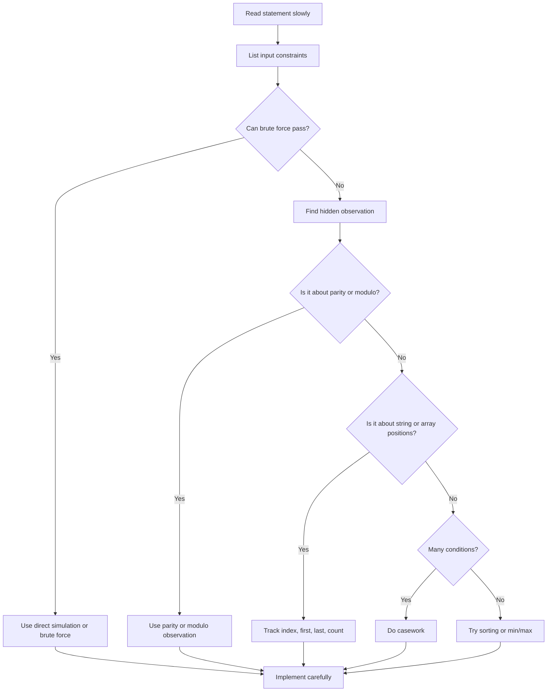

## 5-Minute Ad Hoc Method

```text
1. Restate the problem in simple words.
2. Write what must be true for YES/NO.
3. Try smallest examples.
4. Look for parity, count, min/max, first/last.
5. Check if sorting simplifies.
6. Split into cases.
7. Implement directly.
8. Test edge cases.
```

---

# 3. Ad Hoc vs Greedy vs Constructive vs Simulation

| Type | Question | Output |
|---|---|---|
| Ad Hoc | what direct observation solves it? | answer/value/YES-NO |
| Greedy | what local choice is safe? | optimum |
| Constructive | can I build any valid object? | object/operations |
| Simulation | can I follow rules exactly? | final state |

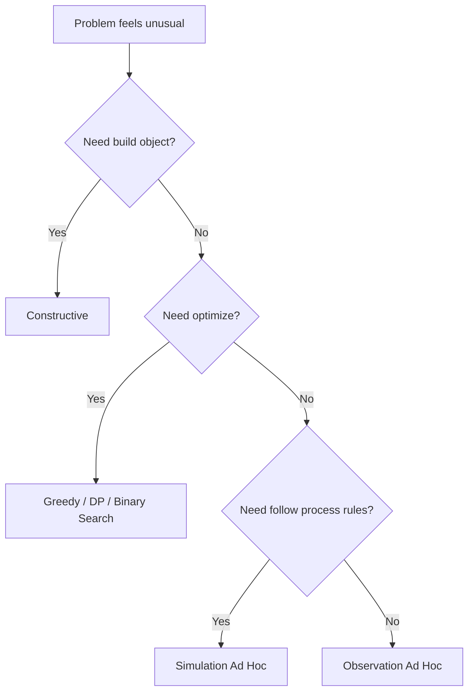

---

# 4. C++ Template Pack

## Multi-Test Template

```cpp
#include <bits/stdc++.h>
using namespace std;

using ll = long long;

void solve() {
    // read input
    // implement direct logic
}

int main() {
    ios::sync_with_stdio(false);
    cin.tie(nullptr);

    int T;
    cin >> T;

    while (T--) {
        solve();
    }

    return 0;
}
```

## YES/NO Helper

```cpp
void printYes(bool ok) {
    cout << (ok ? "YES" : "NO") << '\n';
}
```

## Frequency Helper

```cpp
map<int, int> getFreq(const vector<int>& a) {
    map<int, int> freq;

    for (int x : a) {
        freq[x]++;
    }

    return freq;
}
```

---

# 5. Form A: Direct Formula / Observation

## Pattern

The answer follows from a simple formula.

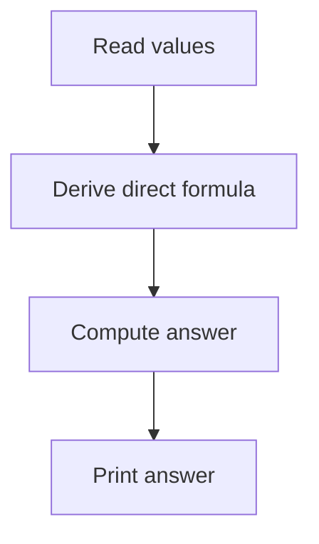

## Use When

| Signal | Example Observation |
|---|---|
| arithmetic relation | sum, difference, average |
| only min/max matters | answer uses extreme values |
| repeated pattern | formula by n |
| YES/NO condition | direct inequality |
| one operation type | operation count formula |

## Example A1: Minimum Moves to Equal Array Elements

Observation:

```text
Incrementing n minus one elements is equivalent to decrementing one element.
So reduce all numbers to minimum.
answer = sum of value minus minimum
```

```cpp
int minMoves(vector<int>& nums) {
    int mn = *min_element(nums.begin(), nums.end());
    int ans = 0;

    for (int x : nums) {
        ans += x - mn;
    }

    return ans;
}
```

## Example A2: Add Digits

```cpp
int addDigits(int num) {
    if (num == 0) return 0;
    return 1 + (num - 1) % 9;
}
```

---

# 6. Form B: Casework

## Pattern

Split the problem into complete cases.

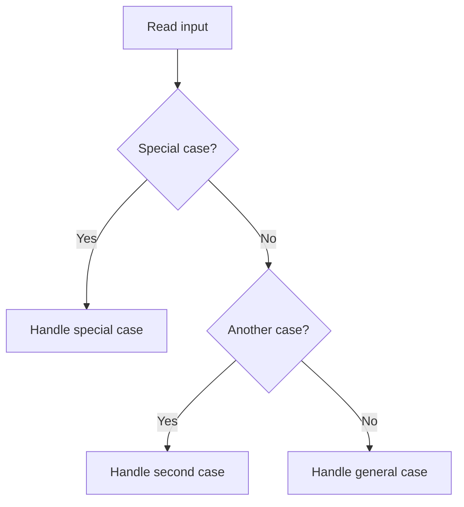

## Casework Rules

```text
Cases must be complete.
Cases must not conflict.
Simpler impossible cases first.
Special small n first.
Then general case.
```

## Example B1: Valid Triangle

```cpp
bool isTriangle(int a, int b, int c) {
    vector<int> s = {a, b, c};
    sort(s.begin(), s.end());

    return s[0] + s[1] > s[2];
}
```

---

# 7. Form C: Simple Simulation

## Pattern

Follow the rules exactly.

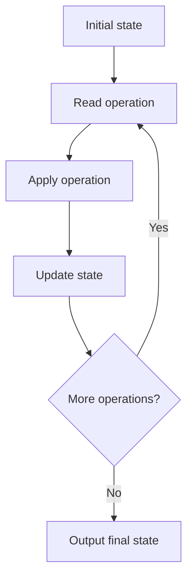

## Example C1: Baseball Game

```cpp
int calPoints(vector<string>& operations) {
    vector<int> st;

    for (string op : operations) {
        if (op == "+") {
            int n = st.size();
            st.push_back(st[n - 1] + st[n - 2]);
        } else if (op == "D") {
            st.push_back(2 * st.back());
        } else if (op == "C") {
            st.pop_back();
        } else {
            st.push_back(stoi(op));
        }
    }

    return accumulate(st.begin(), st.end(), 0);
}
```

---

# 8. Form D: String Manipulation

## Pattern

Use direct string operations: count, reverse, compare, build, replace.

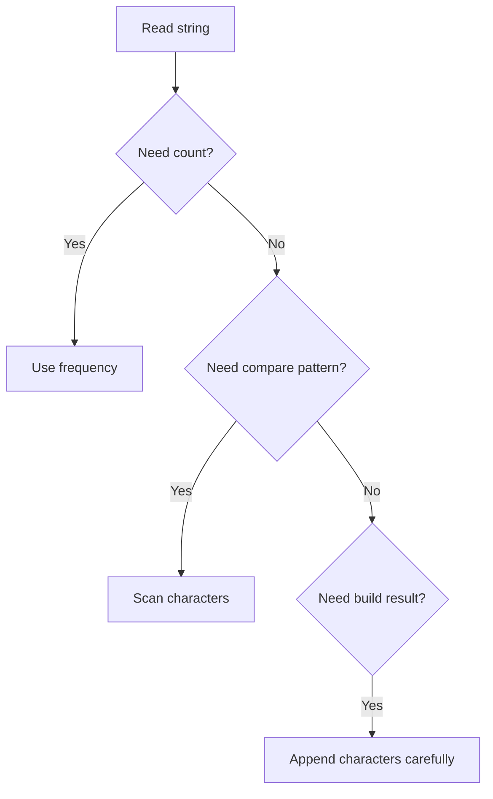

## Example D1: Valid Palindrome

```cpp
bool isPalindromeString(string s) {
    int l = 0;
    int r = (int)s.size() - 1;

    while (l < r) {
        if (s[l] != s[r]) return false;
        l++;
        r--;
    }

    return true;
}
```

## Example D2: Defanging IP Address

```cpp
string defangIPaddr(string address) {
    string ans;

    for (char c : address) {
        if (c == '.') {
            ans += "[.]";
        } else {
            ans += c;
        }
    }

    return ans;
}
```

---

# 9. Form E: Counting and Frequency

## Pattern

Count occurrences and use them to decide.

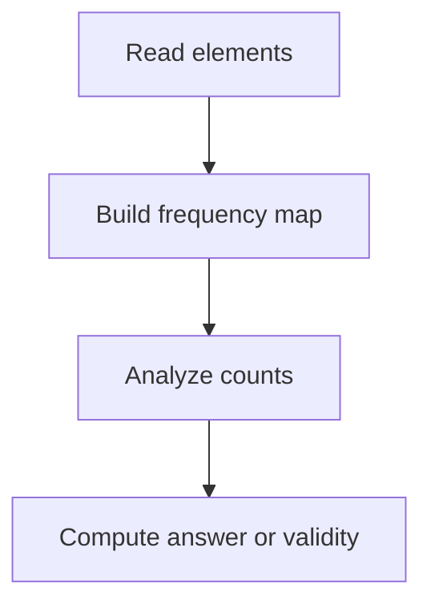

## Example E1: Can Make Palindrome From Letters

```cpp
bool canMakePalindrome(string s) {
    vector<int> cnt(26, 0);

    for (char c : s) {
        cnt[c - 'a']++;
    }

    int odd = 0;

    for (int x : cnt) {
        if (x % 2) odd++;
    }

    return odd <= 1;
}
```

## Example E2: Majority Element

```cpp
int majorityElement(vector<int>& nums) {
    int candidate = 0;
    int balance = 0;

    for (int x : nums) {
        if (balance == 0) {
            candidate = x;
        }

        if (x == candidate) balance++;
        else balance--;
    }

    return candidate;
}
```

---

# 10. Form F: Parity and Modulo Observation

## Pattern

The answer depends only on odd/even or remainder.

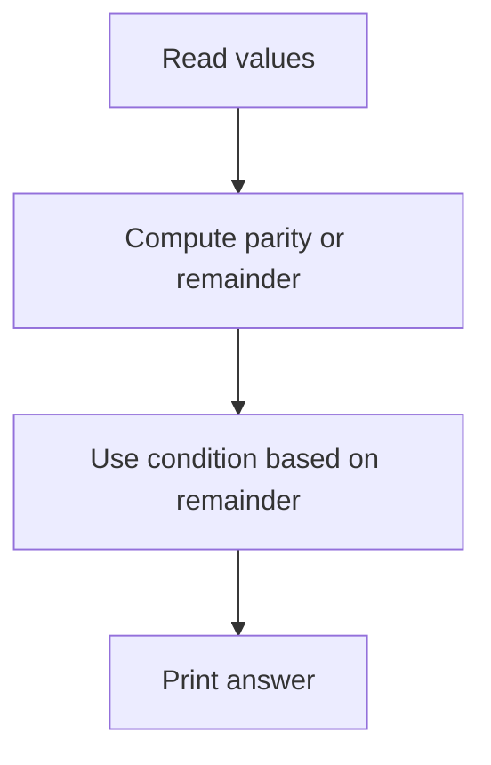

## Common Observations

| Observation | Meaning |
|---|---|
| sum even/odd | partition or pairing possible |
| count odd numbers | parity of result |
| modulo cycle | repeated pattern |
| `x % k` | bucket by remainder |
| alternating turns | parity of moves |

## Example F1: Can Pair All Numbers With Even Sum

```cpp
bool canPairEvenSum(vector<int>& a) {
    int odd = 0;

    for (int x : a) {
        if (x % 2) odd++;
    }

    return odd % 2 == 0;
}
```

---

# 11. Form G: Sorting-Based Observation

## Pattern

Sorting reveals adjacency, extremes, grouping, or pairing.

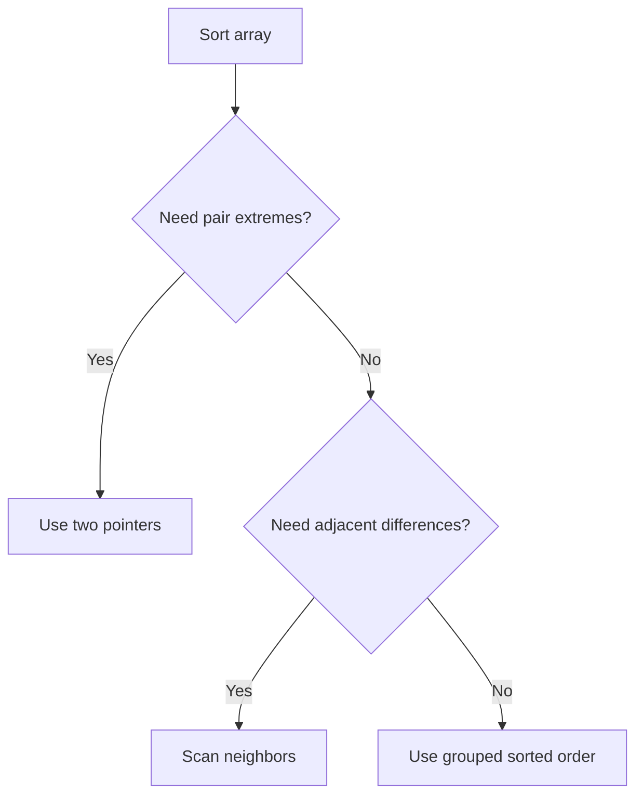

## Example G1: Minimum Difference Between Any Pair

```cpp
int minDifferencePair(vector<int>& a) {
    sort(a.begin(), a.end());

    int best = INT_MAX;

    for (int i = 1; i < (int)a.size(); i++) {
        best = min(best, a[i] - a[i - 1]);
    }

    return best;
}
```

---

# 12. Form H: Min/Max Tracking

## Pattern

Track extreme values during a scan.

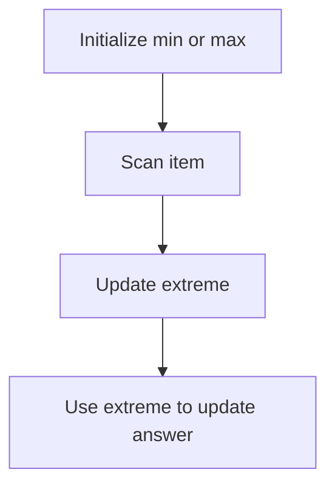

## Example H1: Maximum Difference

```cpp
int maximumDifference(vector<int>& nums) {
    int mn = nums[0];
    int ans = -1;

    for (int i = 1; i < (int)nums.size(); i++) {
        if (nums[i] > mn) {
            ans = max(ans, nums[i] - mn);
        }

        mn = min(mn, nums[i]);
    }

    return ans;
}
```

---

# 13. Form I: Grid / Matrix Ad Hoc

## Pattern

Grid ad hoc usually needs careful loops and boundary checks.

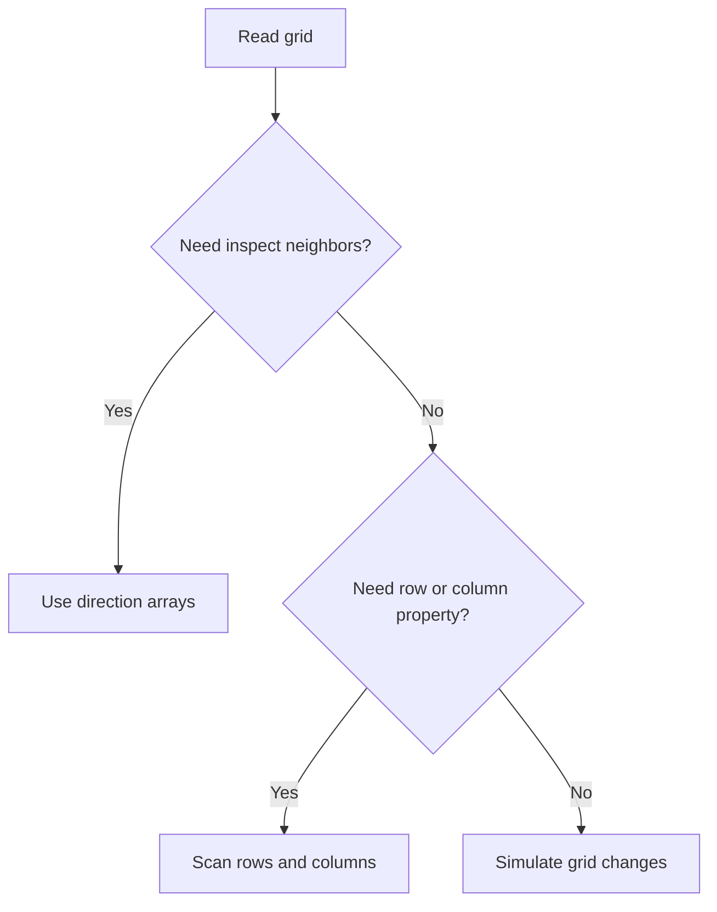

## Direction Arrays

```cpp
int dr[4] = {1, -1, 0, 0};
int dc[4] = {0, 0, 1, -1};
```

## Example I1: Count Neighbor Cells

```cpp
int countNeighbors(vector<vector<int>>& grid, int r, int c) {
    int n = grid.size();
    int m = grid[0].size();

    int dr[4] = {1, -1, 0, 0};
    int dc[4] = {0, 0, 1, -1};

    int cnt = 0;

    for (int k = 0; k < 4; k++) {
        int nr = r + dr[k];
        int nc = c + dc[k];

        if (nr >= 0 && nr < n && nc >= 0 && nc < m) {
            cnt += grid[nr][nc];
        }
    }

    return cnt;
}
```

---

# 14. Form J: Index and Boundary Tricks

## Pattern

Many ad hoc problems are solved by careful first/last/index logic.

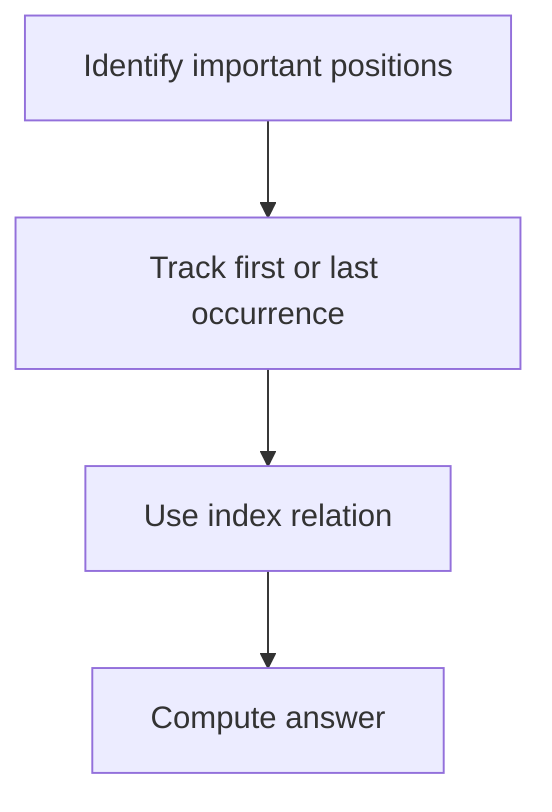

## Common Index Tricks

| Trick | Use |
|---|---|
| first occurrence | earliest possible start |
| last occurrence | segment end |
| `i + 1` | convert zero-index to one-index |
| `n - i - 1` | mirror index |
| sentinel | avoid boundary if/else |
| circular index | modulo movement |

## Example J1: First Unique Character

```cpp
int firstUniqChar(string s) {
    vector<int> cnt(26, 0);

    for (char c : s) {
        cnt[c - 'a']++;
    }

    for (int i = 0; i < (int)s.size(); i++) {
        if (cnt[s[i] - 'a'] == 1) return i;
    }

    return -1;
}
```

---

# 15. Form K: Pattern Repetition / Periodicity

## Pattern

Find a repeating cycle and reduce large input using modulo.

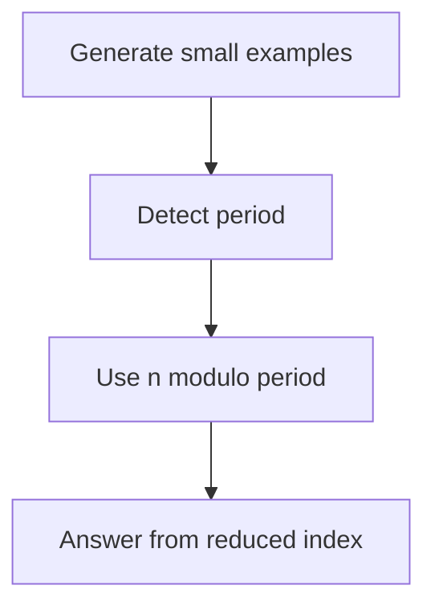

## Example K1: Day of the Week After N Days

```cpp
string dayAfter(vector<string>& days, string start, long long n) {
    int idx = 0;

    for (int i = 0; i < 7; i++) {
        if (days[i] == start) {
            idx = i;
            break;
        }
    }

    return days[(idx + n) % 7];
}
```

---

# 16. Form L: Small Constraints Brute Force

## Pattern

If constraints are tiny, brute force is the correct ad hoc solution.

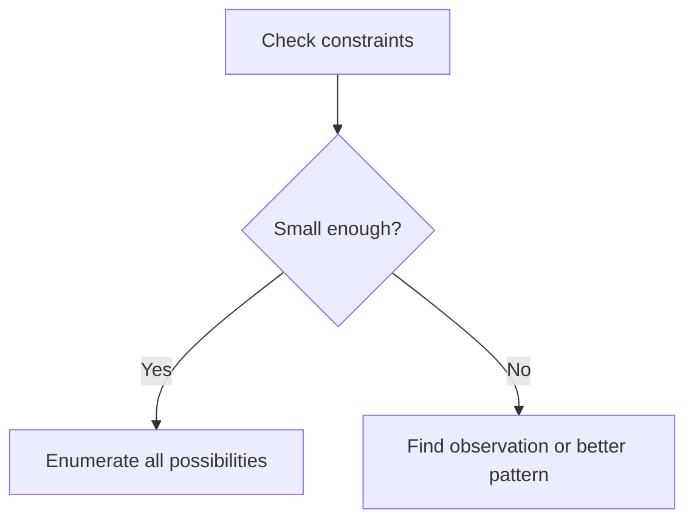

## Constraint Guide

| Constraint | Likely Allowed |
|---:|---|
| `n <= 10` | permutations/backtracking |
| `n <= 20` | bitmask |
| `n <= 100` | `O(n^3)` sometimes |
| `n <= 2000` | `O(n^2)` |
| `n <= 2e5` | `O(n log n)` or `O(n)` |

## Example L1: Count Valid Pairs Small N

```cpp
int countPairsSmall(vector<int>& a, int target) {
    int n = a.size();
    int ans = 0;

    for (int i = 0; i < n; i++) {
        for (int j = i + 1; j < n; j++) {
            if (a[i] + a[j] == target) {
                ans++;
            }
        }
    }

    return ans;
}
```

---

# 17. Form M: Implementation Heavy Problems

## Pattern

No hard algorithm, but many details.

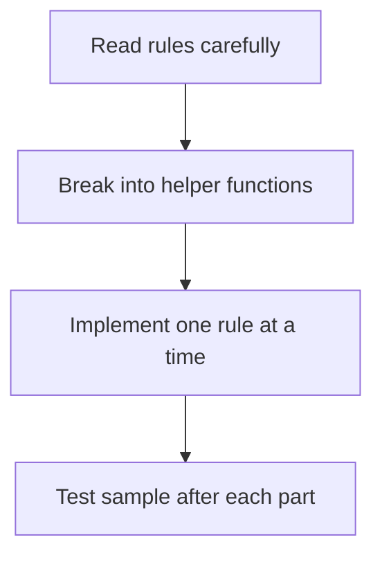

## Example M1: Tic Tac Toe Winner

```cpp
string tictactoe(vector<vector<int>>& moves) {
    vector<vector<char>> board(3, vector<char>(3, '.'));

    for (int i = 0; i < (int)moves.size(); i++) {
        int r = moves[i][0];
        int c = moves[i][1];

        board[r][c] = (i % 2 == 0 ? 'A' : 'B');
    }

    auto win = [&](char ch) {
        for (int i = 0; i < 3; i++) {
            if (board[i][0] == ch && board[i][1] == ch && board[i][2] == ch) return true;
            if (board[0][i] == ch && board[1][i] == ch && board[2][i] == ch) return true;
        }

        if (board[0][0] == ch && board[1][1] == ch && board[2][2] == ch) return true;
        if (board[0][2] == ch && board[1][1] == ch && board[2][0] == ch) return true;

        return false;
    };

    if (win('A')) return "A";
    if (win('B')) return "B";

    return moves.size() == 9 ? "Draw" : "Pending";
}
```

---

# 18. Form N: Invariant Observation

## Pattern

Find something that never changes.

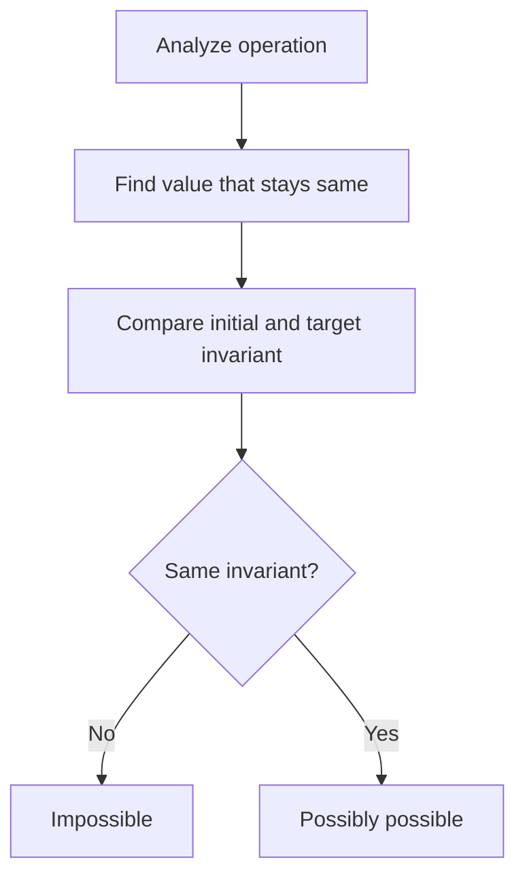

## Common Invariants

| Operation | Possible Invariant |
|---|---|
| swap | multiset of values |
| reverse | multiset of values |
| add same to all | differences |
| move one from A to B | total sum |
| flip bits | parity/count relation |
| rotate | cyclic order |
| gcd operations | divisibility |

## Example N1: Can Transform By Swaps

```cpp
bool canTransformBySwaps(vector<int> a, vector<int> b) {
    sort(a.begin(), a.end());
    sort(b.begin(), b.end());

    return a == b;
}
```

---

# 19. FAANG/OA Ad Hoc Patterns

| Pattern | Recognition Signal | Tactic | Example Problems |
|---|---|---|---|
| direct string build | replace/format string | scan and append | Defanging IP |
| simulation | game/process rules | stack/vector | Baseball Game, Asteroid Collision |
| frequency property | duplicates/anagram/count | map/count array | Valid Anagram |
| parity logic | odd/even condition | count parity | Can Place Flowers |
| min/max tracking | best value from scan | maintain extreme | Best Time to Buy Stock |
| index logic | first/last occurrence | count positions | First Unique Character |
| matrix implementation | row/col rules | loops/helpers | Tic Tac Toe |
| cyclic pattern | repeating states | modulo period | Day of Week |
| simple sorting | order observation | sort and scan | Minimum Difference |

---

# 20. Codeforces / CM Ad Hoc Escalation

| Level | Ad Hoc Skill |
|---|---|
| Newbie | direct conditions, parity, simple formula |
| Pupil | casework, sort observation, strings |
| Specialist | hidden invariant, operation simulation |
| Expert | non-obvious cases, constructive-ad-hoc mix |
| CM | fast observation under pressure, proof by invariant |

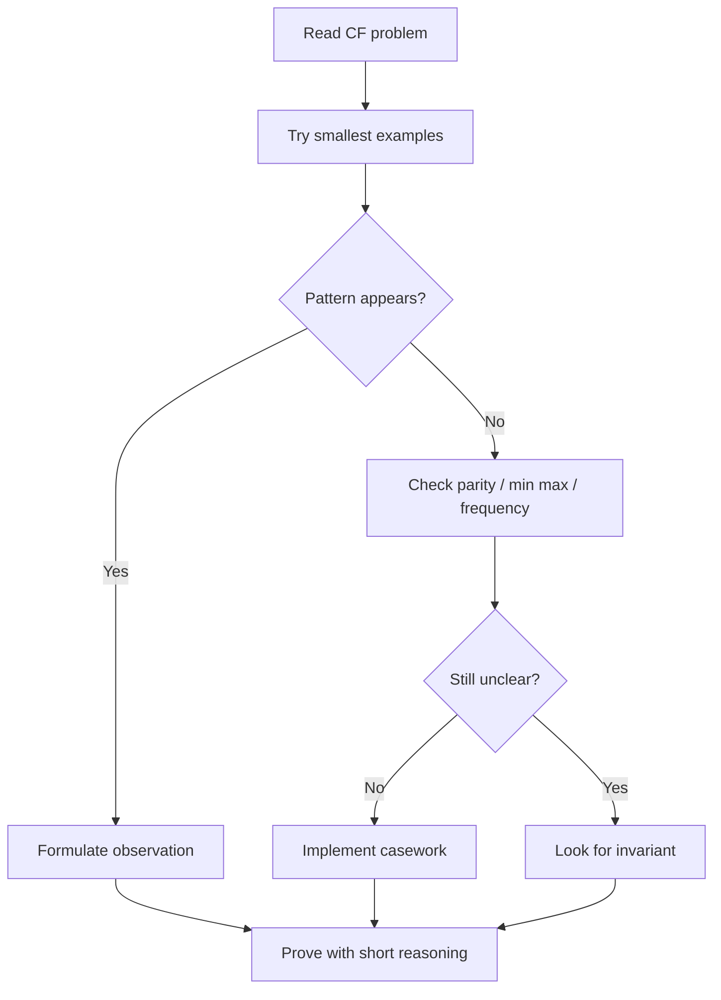

---

# 21. Difficulty-Sorted Problem Set

## 21.1 Newbie Problems

| # | Problem | Platform | Link | Form | Pattern | Tactic | Intuition | Implementation |
|---:|---|---|---|---|---|---|---|---|
| 1 | Defanging an IP Address | LeetCode | https://leetcode.com/problems/defanging-an-ip-address/ | D | string build | replace dot | scan and append | string |
| 2 | Shuffle the Array | LeetCode | https://leetcode.com/problems/shuffle-the-array/ | J | index pattern | two halves | output x y order | loop |
| 3 | Richest Customer Wealth | LeetCode | https://leetcode.com/problems/richest-customer-wealth/ | H | max tracking | row sum | answer is maximum row sum | loop |
| 4 | Number of Good Pairs | LeetCode | https://leetcode.com/problems/number-of-good-pairs/ | E | frequency | count previous equal | each new equal makes pairs | map |
| 5 | Goal Parser Interpretation | LeetCode | https://leetcode.com/problems/goal-parser-interpretation/ | D | string parse | scan tokens | implement grammar directly | string |
| 6 | CSES Weird Algorithm | CSES | https://cses.fi/problemset/task/1068 | C | simulation | follow rule | Collatz process | loop |
| 7 | CSES Repetitions | CSES | https://cses.fi/problemset/task/1069 | H | max run | track current run | longest equal consecutive chars | scan |
| 8 | Codeforces Watermelon | Codeforces | https://codeforces.com/problemset/problem/4/A | F | parity | even and greater than two | split into positive even parts | condition |

## 21.2 Easy-Medium Problems

| # | Problem | Platform | Link | Form | Pattern | Tactic | Intuition | Implementation |
|---:|---|---|---|---|---|---|---|---|
| 1 | Valid Anagram | LeetCode | https://leetcode.com/problems/valid-anagram/ | E | frequency | count letters | anagrams have same counts | array |
| 2 | First Unique Character | LeetCode | https://leetcode.com/problems/first-unique-character-in-a-string/ | J | first index | frequency then scan | first char with count one | array |
| 3 | Baseball Game | LeetCode | https://leetcode.com/problems/baseball-game/ | C | simulation | stack vector | operations affect previous scores | vector |
| 4 | Robot Return to Origin | LeetCode | https://leetcode.com/problems/robot-return-to-origin/ | C | simulation | coordinate count | final position must be origin | counters |
| 5 | Find Pivot Index | LeetCode | https://leetcode.com/problems/find-pivot-index/ | A | formula | total and left sum | right sum derived from total | loop |
| 6 | Can Place Flowers | LeetCode | https://leetcode.com/problems/can-place-flowers/ | B | casework scan | check neighbors | plant if both sides empty | loop |
| 7 | Toeplitz Matrix | LeetCode | https://leetcode.com/problems/toeplitz-matrix/ | I | diagonal check | compare top-left | same diagonal values equal | grid |
| 8 | CSES Missing Number | CSES | https://cses.fi/problemset/task/1083 | A | formula | expected sum minus actual | one number missing | sum |
| 9 | CSES Increasing Array | CSES | https://cses.fi/problemset/task/1094 | H | max so far | raise values | each value at least previous | scan |
| 10 | Codeforces Way Too Long Words | Codeforces | https://codeforces.com/problemset/problem/71/A | D | string format | abbreviation | if length > 10 compress middle | string |
| 11 | Codeforces Team | Codeforces | https://codeforces.com/problemset/problem/231/A | E | count votes | sum row | solve if at least two sure | loop |
| 12 | Codeforces Beautiful Matrix | Codeforces | https://codeforces.com/problemset/problem/263/A | I | grid position | distance to center | move one to center | grid |
| 13 | AtCoder Placing Marbles | AtCoder | https://atcoder.jp/contests/abc081/tasks/abc081_a | E | count chars | count ones | direct count | string |

## 21.3 Medium Problems

| # | Problem | Platform | Link | Form | Pattern | Tactic | Intuition | Implementation |
|---:|---|---|---|---|---|---|---|---|
| 1 | Asteroid Collision | LeetCode | https://leetcode.com/problems/asteroid-collision/ | C | stack simulation | resolve collisions | only opposite directions collide | stack |
| 2 | Valid Tic-Tac-Toe State | LeetCode | https://leetcode.com/problems/valid-tic-tac-toe-state/ | M | implementation casework | counts and wins | board validity has strict rules | grid |
| 3 | Spiral Matrix | LeetCode | https://leetcode.com/problems/spiral-matrix/ | I | boundary simulation | top/bottom/left/right | shrink boundaries | loops |
| 4 | Set Matrix Zeroes | LeetCode | https://leetcode.com/problems/set-matrix-zeroes/ | I | marker trick | first row/col markers | avoid extra memory | grid |
| 5 | Game of Life | LeetCode | https://leetcode.com/problems/game-of-life/ | I | grid simulation | encode states | next depends on old neighbors | grid |
| 6 | Rotate Image | LeetCode | https://leetcode.com/problems/rotate-image/ | I | matrix transform | transpose + reverse | rotation decomposes into two operations | grid |
| 7 | Insert Delete GetRandom O1 | LeetCode | https://leetcode.com/problems/insert-delete-getrandom-o1/ | M | implementation | vector + map | swap delete maintains O1 | DS |
| 8 | CSES Number Spiral | CSES | https://cses.fi/problemset/task/1071 | A/B | formula casework | layer max square | answer depends on coordinate parity | math |
| 9 | AtCoder Card Game for Two | AtCoder | https://atcoder.jp/contests/abc088/tasks/abc088_b | G | sorting simulation | alternate picks | largest available each turn | sort |
| 10 | AtCoder Daydream | AtCoder | https://atcoder.jp/contests/abs/tasks/arc065_a | D/K | suffix pattern | reverse and match | reverse makes greedy matching easier | string |
| 11 | AtCoder Traveling | AtCoder | https://atcoder.jp/contests/abs/tasks/arc089_a | F/N | parity + distance | time feasibility | need enough time and matching parity | math |
| 12 | CSES Coin Piles | CSES | https://cses.fi/problemset/task/1754 | F/A | modulo formula | sum and max condition | operations remove 3 total with balance | math |
| 13 | CSES Palindrome Reorder | CSES | https://cses.fi/problemset/task/1755 | E/D | frequency construction | odd count | at most one odd char | string |

## 21.4 Expert / CM Ad Hoc

| # | Problem | Platform | Link | Form | Pattern | Tactic | Intuition | Implementation |
|---:|---|---|---|---|---|---|---|---|
| 1 | Text Justification | LeetCode | https://leetcode.com/problems/text-justification/ | M | formatting | distribute spaces | line width exact | strings |
| 2 | Integer to Roman | LeetCode | https://leetcode.com/problems/integer-to-roman/ | M | rule implementation | value-symbol pairs | subtract largest symbol repeatedly | string |
| 3 | Roman to Integer | LeetCode | https://leetcode.com/problems/roman-to-integer/ | M | rule implementation | subtract before larger | special pairs encoded by order | scan |
| 4 | Valid Number | LeetCode | https://leetcode.com/problems/valid-number/ | M | parser casework | flags | implementation-heavy validation | string |
| 5 | Basic Calculator II | LeetCode | https://leetcode.com/problems/basic-calculator-ii/ | C/M | expression simulation | stack current sign | multiplication has priority | stack |
| 6 | Zigzag Conversion | LeetCode | https://leetcode.com/problems/zigzag-conversion/ | K/C | pattern simulation | direction changes | rows repeat in zigzag | strings |
| 7 | Codeforces Xenia and Ringroad | Codeforces | https://codeforces.com/problemset/problem/339/B | J/K | circular movement | modulo distance | move forward around ring | loop |
| 8 | Codeforces Calculating Function | Codeforces | https://codeforces.com/problemset/problem/486/A | A/F | parity formula | n odd/even | alternating sum has formula | math |
| 9 | Codeforces Expression | Codeforces | https://codeforces.com/problemset/problem/479/A | B | casework | try all forms | only few operation orders | brute cases |
| 10 | Codeforces HQ9+ | Codeforces | https://codeforces.com/problemset/problem/133/A | D | char search | contains H Q or 9 | only these produce output | scan |
| 11 | Codeforces Dubstep | Codeforces | https://codeforces.com/problemset/problem/208/A | D/M | string parsing | replace WUB | parse words separated by WUB | string |
| 12 | Codeforces Even Odds | Codeforces | https://codeforces.com/problemset/problem/318/A | A/B | formula casework | odds first then evens | sequence split into two parts | math |

---

# 22. Final Revision Checklist

## Recognition

- [ ] Is there a simple observation?
- [ ] Are constraints small enough for brute force?
- [ ] Does answer depend on parity/modulo?
- [ ] Does sorting reveal something?
- [ ] Are first/last/min/max important?
- [ ] Is it just simulation?
- [ ] Are there many cases?
- [ ] Is output formatting tricky?

## Implementation

- [ ] Use `long long` for sums.
- [ ] Handle `n = 1`.
- [ ] Handle empty string or single char.
- [ ] Check zero-index vs one-index.
- [ ] Match exact output format.
- [ ] Do not overuse advanced algorithms.
- [ ] Dry run sample manually.

## Ad Hoc Problem-Solving Loop

```text
Read
→ simplify
→ test tiny cases
→ observe
→ casework
→ implement
→ edge tests
```

## One-Minute Mental Checklist

```text
Could answer be formula?
Could parity decide?
Could count/frequency decide?
Could min/max decide?
Could first/last index decide?
Could sorting make it obvious?
Could simple simulation pass?
```

---

# Appendix A: Problem-to-Form Quick Lookup

| Problem Type | Form | Main Tool |
|---|---|---|
| simple formula | A | math |
| many if/else | B | casework |
| process rules | C | simulation |
| string replacement/check | D | scan |
| duplicates/counts | E | map/frequency |
| odd/even/remainder | F | modulo |
| order matters | G | sort |
| best extreme | H | min/max |
| grid rules | I | loops/directions |
| first/last position | J | indices |
| repeated cycle | K | modulo period |
| tiny constraints | L | brute force |
| many details | M | helper functions |
| unchanged property | N | invariant |

---

# Appendix B: GitHub-Safe Mermaid Rules

- Use quoted labels like `A["text"]`.
- Do not put raw square brackets inside labels.
- Keep one arrow statement per line.
- Avoid dense math notation in node labels.
- Use simple words instead of symbols where possible.
