# 📘 Constructive Algorithms Visual Handbook

> Mermaid fix version: every diagram uses safe quoted labels for GitHub rendering.

# 📌 What Changed in This Version

- Fixed all Mermaid diagrams with safe labels.
- Removed risky symbols from diagram node text.
- Added expanded frameworks, forms, tactics, dry runs, proof cards, and C++ examples.

---

# 📘 Constructive Algorithms Visual Handbook
## Beginner → FAANG / OA → Codeforces / Competitive Master Level

> Goal: learn constructive algorithms visually, like a pattern notebook.
>
> Constructive problems usually ask you to **build one valid answer**, not necessarily the best one.

---

# 📑 Clickable Index

## Core
- [1. What Is Constructive Algorithms?](#1-what-is-constructive-algorithms)
- [2. Recognition Signals](#2-recognition-signals)
- [3. Master Framework](#3-master-framework)
- [4. Constructive vs Greedy vs DP vs Brute Force](#4-constructive-vs-greedy-vs-dp-vs-brute-force)

## Beginner Frameworks
- [5. Framework A: Direct Construction](#5-framework-a-direct-construction)
- [6. Framework B: Fill Array With Constraints](#6-framework-b-fill-array-with-constraints)
- [7. Framework C: Permutation Construction](#7-framework-c-permutation-construction)
- [8. Framework D: Alternating High-Low Construction](#8-framework-d-alternating-high-low-construction)
- [9. Framework E: Left-to-Right Valid Building](#9-framework-e-left-to-right-valid-building)

## FAANG / OA Frameworks
- [10. Framework F: Frequency-Based Construction](#10-framework-f-frequency-based-construction)
- [11. Framework G: Heap-Based Construction](#11-framework-g-heap-based-construction)
- [12. Framework H: Prefix-Valid Construction](#12-framework-h-prefix-valid-construction)
- [13. Framework I: Simulation Construction](#13-framework-i-simulation-construction)
- [14. Framework J: Segment / Interval Construction](#14-framework-j-segment--interval-construction)

## Advanced CP Frameworks
- [15. Framework K: Math Construction](#15-framework-k-math-construction)
- [16. Framework L: Number Theory Construction](#16-framework-l-number-theory-construction)
- [17. Framework M: Bitwise Construction](#17-framework-m-bitwise-construction)
- [18. Framework N: Graph Construction](#18-framework-n-graph-construction)
- [19. Framework O: Reverse Construction](#19-framework-o-reverse-construction)
- [20. Framework P: Transformation Construction](#20-framework-p-transformation-construction)
- [21. Framework Q: Binary Search + Constructive Check](#21-framework-q-binary-search--constructive-check)

## Proof, Dry Runs, and Contest Thinking
- [22. How to Prove Constructive Solutions](#22-how-to-prove-constructive-solutions)
- [23. Invariant Proof Template](#23-invariant-proof-template)
- [24. Greedy Exchange Argument Inside Constructive Problems](#24-greedy-exchange-argument-inside-constructive-problems)
- [25. Dry Run Method for OA / Contest](#25-dry-run-method-for-oa--contest)
- [26. Common Mistakes](#26-common-mistakes)
- [27. Pattern Cheat Sheet](#27-pattern-cheat-sheet)
- [28. C++ Template Library](#28-c-template-library)

---

# 1. What Is Constructive Algorithms?

A constructive algorithm builds an answer step-by-step.

You usually do **not** search all answers.

You try to find a direct way to produce **any valid answer**.

## Core Idea

| Idea | Meaning |
|---|---|
| Build step-by-step | Create answer gradually |
| Maintain validity | Do not break important constraints |
| Use observations | Find hidden structure |
| Not brute force | Avoid trying all possibilities |
| Often mixed with greedy | Pick a safe next element |

---

## Visual Mental Model

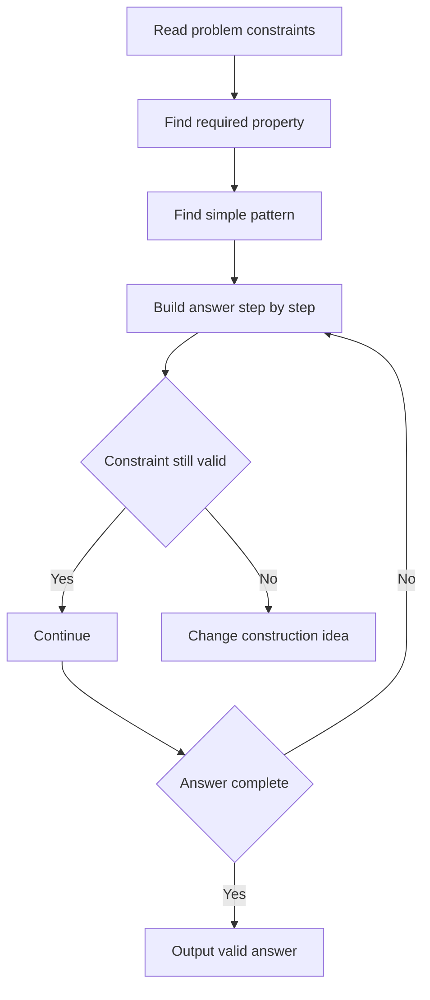
```mermaid
flowchart TD
    A["Read problem constraints"] --> B["Find required property"]
    B --> C["Find simple pattern"]
    C --> D["Build answer step by step"]
    D --> E{"Constraint still valid"}
    E -->|Yes| F["Continue"]
    E -->|No| G["Change construction idea"]
    F --> H{"Answer complete"}
    H -->|No| D
    H -->|Yes| I["Output valid answer"]
```

---

# 2. Recognition Signals

Constructive problems often contain these phrases:

| Phrase | Likely Meaning |
|---|---|
| Construct any | Need one valid answer |
| Find any valid | Multiple answers allowed |
| Output one possible | No optimization required |
| Rearrange | Permutation/order construction |
| Build sequence | Array/string construction |
| Is it possible? If yes output | Feasibility + construction |
| Print matrix/grid | Structured construction |
| Choose values satisfying | Math construction |

---

## Quick Recognition Flow

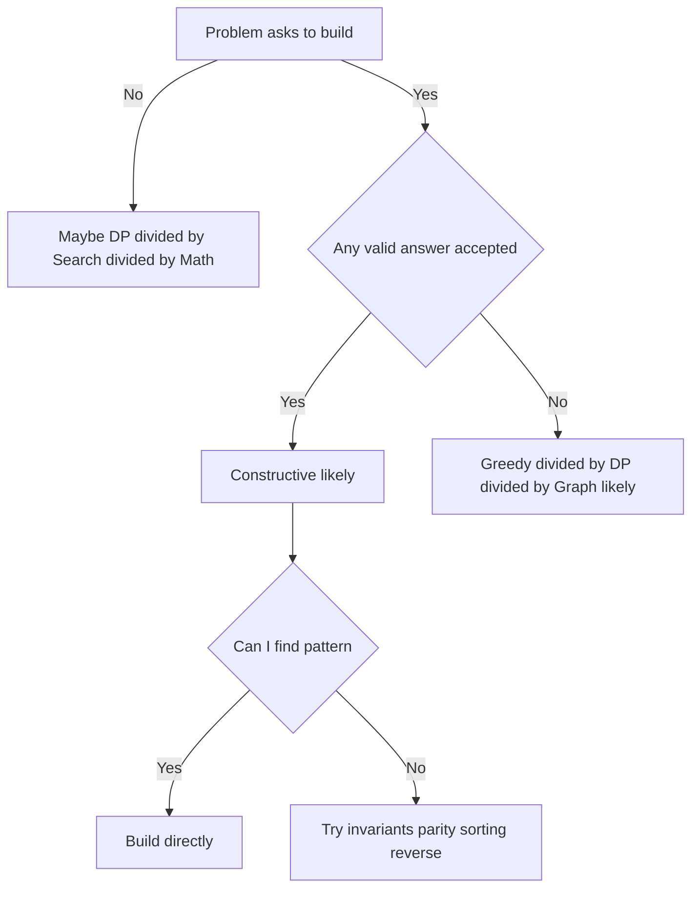
```mermaid
flowchart TD
    A["Problem asks to build"] -->|No| B["Maybe DP divided by Search divided by Math"]
    A -->|Yes| C{"Any valid answer accepted"}
    C -->|Yes| D["Constructive likely"]
    C -->|No| E["Greedy divided by DP divided by Graph likely"]
    D --> F{"Can I find pattern"}
    F -->|Yes| G["Build directly"]
    F -->|No| H["Try invariants parity sorting reverse"]
```

---

# 3. Master Framework

For almost every constructive problem, use this framework:

## 5-Step Constructive Framework

| Step | Question |
|---|---|
| 1 | What must be true in the final answer? |
| 2 | What is the smallest/simple valid case? |
| 3 | Can I build left-to-right, right-to-left, or from middle? |
| 4 | What invariant must never break? |
| 5 | Can I prove every constraint is satisfied? |

---

## Master Diagram

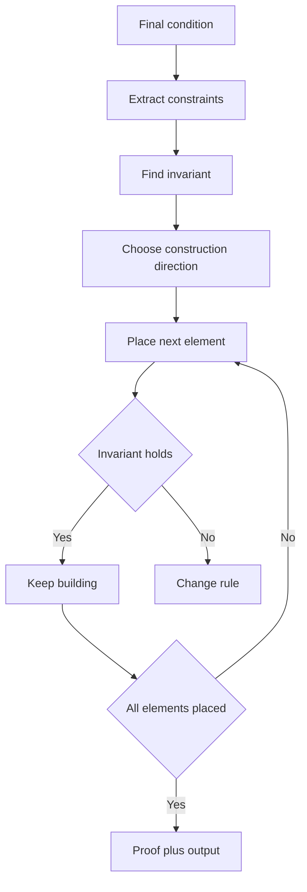
```mermaid
flowchart TD
    A["Final condition"] --> B["Extract constraints"]
    B --> C["Find invariant"]
    C --> D["Choose construction direction"]
    D --> E["Place next element"]
    E --> F{"Invariant holds"}
    F -->|Yes| G["Keep building"]
    F -->|No| H["Change rule"]
    G --> I{"All elements placed"}
    I -->|No| E
    I -->|Yes| J["Proof plus output"]
```

---

# 4. Constructive vs Greedy vs DP vs Brute Force

| Type | What You Do | When Used |
|---|---|---|
| Constructive | Build any valid answer | "Output any" |
| Greedy | Pick locally best choice | Optimization or feasibility |
| DP | Try states and transitions | Future choices affect result |
| Brute force | Try all possibilities | Very small constraints |

---

## Decision Diagram

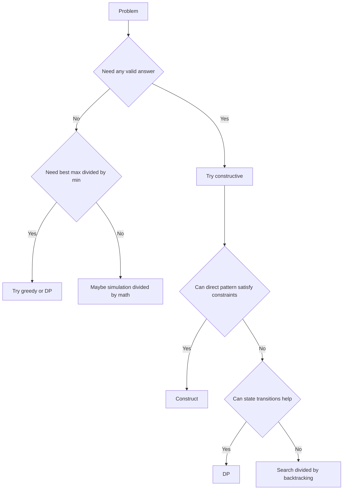
```mermaid
flowchart TD
    A["Problem"] --> B{"Need any valid answer"}
    B -->|Yes| C["Try constructive"]
    B -->|No| D{"Need best max divided by min"}
    D -->|Yes| E["Try greedy or DP"]
    D -->|No| F["Maybe simulation divided by math"]
    C --> G{"Can direct pattern satisfy constraints"}
    G -->|Yes| H["Construct"]
    G -->|No| I{"Can state transitions help"}
    I -->|Yes| J["DP"]
    I -->|No| K["Search divided by backtracking"]
```

---

# 5. Framework A: Direct Construction

## Concept

Use a known formula or simple rule to build the answer.

## Pattern Table

| Pattern | Construction |
|---|---|
| Need increasing array | `1,2,3,...,n` |
| Need decreasing array | `n,n-1,...,1` |
| Need even first | `2,4,6,...,1,3,5,...` |
| Need odd first | `1,3,5,...,2,4,6,...` |
| Need alternating signs | `+, -, +, -` |

---

## Example: Construct Array `1..n`

### Problem
Construct array of size `n` containing numbers from `1` to `n`.

### C++ Code

```cpp
#include <bits/stdc++.h>
using namespace std;

vector<int> build(int n) {
    vector<int> ans;
    for (int i = 1; i <= n; i++) {
        ans.push_back(i);
    }
    return ans;
}
```

### Dry Run

For `n = 5`

| Step | Added | Array |
|---|---:|---|
| 1 | 1 | `[1]` |
| 2 | 2 | `[1,2]` |
| 3 | 3 | `[1,2,3]` |
| 4 | 4 | `[1,2,3,4]` |
| 5 | 5 | `[1,2,3,4,5]` |

---

## Mermaid Flow

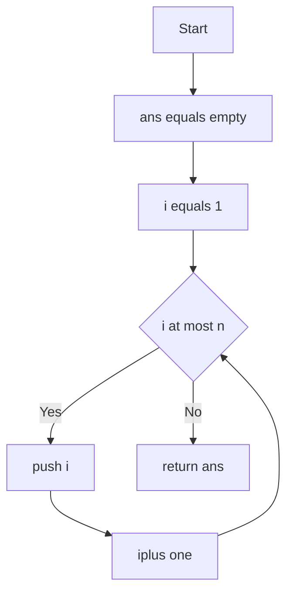
```mermaid
flowchart TD
    A["Start"] --> B["ans equals empty"]
    B --> C["i equals 1"]
    C --> D{"i at most n"}
    D -->|Yes| E["push i"]
    E --> F["iplus one"]
    F --> D
    D -->|No| G["return ans"]
```

---

# 6. Framework B: Fill Array With Constraints

## Concept

You are given constraints like:
- sum must be `S`
- values must be within `[L, R]`
- length must be `n`

You fill positions while preserving feasibility.

---

## Common Forms

| Form | Use |
|---|---|
| Fill from left | Simple distribution |
| Fill from right | Lexicographically smaller/larger |
| Use max first | Reduce remaining quickly |
| Use min first | Preserve future capacity |
| Balance evenly | Avoid large difference |

---

## Feasibility Formula

If array length is `n`, each value in `[L, R]`, target sum `S`:

```text
minimum possible = n * L
maximum possible = n * R
valid iff n*L <= S <= n*R
```

---

## Flowchart

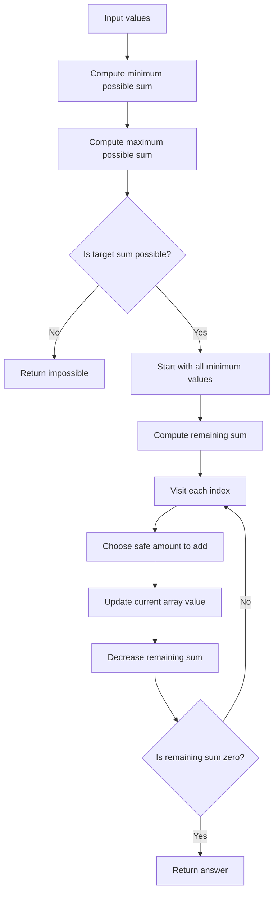
```mermaid
flowchart TD
    A["Input values"] --> B["Compute minimum possible sum"]
    B --> C["Compute maximum possible sum"]
    C --> D{"Is target sum possible?"}
    D -->|No| E["Return impossible"]
    D -->|Yes| F["Start with all minimum values"]
    F --> G["Compute remaining sum"]
    G --> H["Visit each index"]
    H --> I["Choose safe amount to add"]
    I --> J["Update current array value"]
    J --> K["Decrease remaining sum"]
    K --> L{"Is remaining sum zero?"}
    L -->|Yes| M["Return answer"]
    L -->|No| H
```

---

## Example: Build Array of Size `n` With Sum `S`

### Problem
Build array of size `n`.
Each value must be between `1` and `10`.
Total sum must be `S`.

### C++ Code

```cpp
#include <bits/stdc++.h>
using namespace std;

vector<int> buildArrayWithSum(int n, int S) {
    int L = 1, R = 10;

    if (S < n * L || S > n * R) {
        return {}; // impossible
    }

    vector<int> a(n, L);
    int remaining = S - n * L;

    for (int i = 0; i < n; i++) {
        int add = min(remaining, R - L);
        a[i] += add;
        remaining -= add;
    }

    return a;
}
```

---

## Dry Run

Input:

```text
n = 4, S = 23
L = 1, R = 10
```

Initial:

```text
a = [1,1,1,1]
sum = 4
remaining = 23 - 4 = 19
```

| Index | Add | Array | Remaining |
|---:|---:|---|---:|
| 0 | 9 | `[10,1,1,1]` | 10 |
| 1 | 9 | `[10,10,1,1]` | 1 |
| 2 | 1 | `[10,10,2,1]` | 0 |
| 3 | 0 | `[10,10,2,1]` | 0 |

Final:

```text
[10,10,2,1]
```

---

## Proof

Invariant:

```text
Every value always stays inside [1,10].
Remaining sum is always achievable because we never add more than capacity.
```

---

# 7. Framework C: Permutation Construction

## Concept

Build an ordering of `1..n` satisfying some condition.

Common constraints:
- no adjacent values differ by `1`
- avoid fixed points
- make sum/prefix condition valid
- lexicographically smallest/largest

---

## Pattern Table

| Constraint | Construction Idea |
|---|---|
| Avoid adjacent diff 1 | Evens then odds |
| No fixed point | Rotate permutation |
| Need alternating high-low | two pointers |
| Need lexicographically small | choose smallest safe |
| Need maximize local difference | alternate extremes |

---

## Example: Beautiful Permutation

### Problem
Construct permutation `1..n` such that no two adjacent numbers differ by `1`.

### Key Observation

All even numbers differ by at least `2`.
All odd numbers differ by at least `2`.

So:

```text
evens first, odds second
```

---

## Diagram

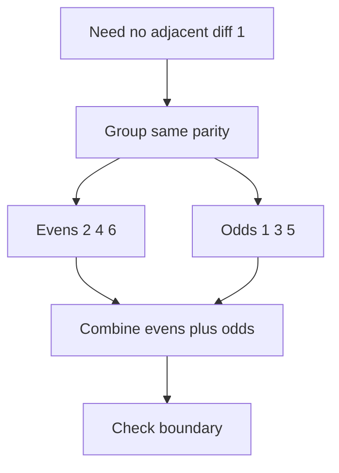
```mermaid
flowchart TD
    A["Need no adjacent diff 1"] --> B["Group same parity"]
    B --> C["Evens 2 4 6"]
    B --> D["Odds 1 3 5"]
    C --> E["Combine evens plus odds"]
    D --> E
    E --> F["Check boundary"]
```

---

## C++ Code

```cpp
#include <bits/stdc++.h>
using namespace std;

vector<int> beautifulPermutation(int n) {
    if (n == 1) return {1};
    if (n <= 3) return {}; // impossible for 2,3

    vector<int> ans;

    for (int x = 2; x <= n; x += 2) {
        ans.push_back(x);
    }

    for (int x = 1; x <= n; x += 2) {
        ans.push_back(x);
    }

    return ans;
}
```

---

## Dry Run

For `n = 5`

| Phase | Added | Result |
|---|---|---|
| Evens | 2 | `[2]` |
| Evens | 4 | `[2,4]` |
| Odds | 1 | `[2,4,1]` |
| Odds | 3 | `[2,4,1,3]` |
| Odds | 5 | `[2,4,1,3,5]` |

Check:

| Pair | Difference |
|---|---:|
| 2,4 | 2 |
| 4,1 | 3 |
| 1,3 | 2 |
| 3,5 | 2 |

Valid.

---

## Proof

1. Adjacent evens differ by `2`.
2. Adjacent odds differ by `2`.
3. Boundary between last even and first odd is not `1` for valid `n >= 4`.
4. Therefore no adjacent difference is `1`.

---

# 8. Framework D: Alternating High-Low Construction

## Concept

Use smallest and largest values alternately.

Useful when:
- need large adjacent differences
- need wave pattern
- need avoid monotonic order
- need distribute extremes

---

## Visual

```text
low, high, low+1, high-1, low+2, high-2
```

---

## Mermaid

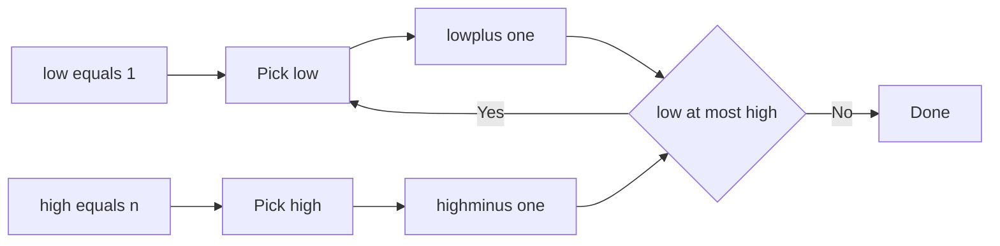
```mermaid
flowchart LR
    A["low equals 1"] --> C["Pick low"]
    B["high equals n"] --> D["Pick high"]
    C --> E["lowplus one"]
    D --> F["highminus one"]
    E --> G{"low at most high"}
    F --> G
    G -->|Yes| C
    G -->|No| H["Done"]
```

---

## Example: Build Zigzag Permutation

### Problem
Build a permutation where values alternate low/high.

### C++ Code

```cpp
#include <bits/stdc++.h>
using namespace std;

vector<int> alternatingPermutation(int n) {
    int low = 1, high = n;
    vector<int> ans;

    while (low <= high) {
        ans.push_back(low);
        low++;

        if (low <= high) {
            ans.push_back(high);
            high--;
        }
    }

    return ans;
}
```

---

## Dry Run

For `n = 7`

| Step | Pick | low | high | Result |
|---:|---:|---:|---:|---|
| 1 | 1 | 2 | 7 | `[1]` |
| 2 | 7 | 2 | 6 | `[1,7]` |
| 3 | 2 | 3 | 6 | `[1,7,2]` |
| 4 | 6 | 3 | 5 | `[1,7,2,6]` |
| 5 | 3 | 4 | 5 | `[1,7,2,6,3]` |
| 6 | 5 | 4 | 4 | `[1,7,2,6,3,5]` |
| 7 | 4 | 5 | 4 | `[1,7,2,6,3,5,4]` |

---

# 9. Framework E: Left-to-Right Valid Building

## Concept

Build from left to right while checking the local condition.

Common in:
- strings
- arrays
- parentheses
- prefix constraints

---

## Pattern

```text
For each position:
    choose a value that keeps prefix valid
```

---

## Diagram

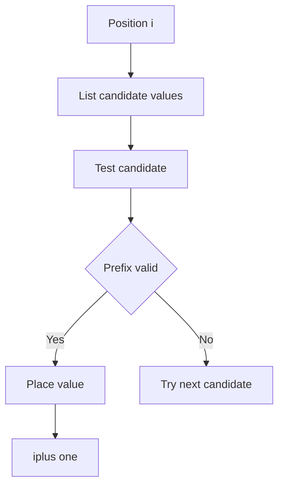
```mermaid
flowchart TD
    A["Position i"] --> B["List candidate values"]
    B --> C["Test candidate"]
    C --> D{"Prefix valid"}
    D -->|Yes| E["Place value"]
    D -->|No| F["Try next candidate"]
    E --> G["iplus one"]
```

---

## Example: Build Binary String With No Adjacent Equal

### C++ Code

```cpp
#include <bits/stdc++.h>
using namespace std;

string alternatingBinaryString(int n) {
    string s;

    for (int i = 0; i < n; i++) {
        if (i % 2 == 0) s += '0';
        else s += '1';
    }

    return s;
}
```

---

## Dry Run

`n = 6`

| i | char | string |
|---:|---|---|
| 0 | 0 | `0` |
| 1 | 1 | `01` |
| 2 | 0 | `010` |
| 3 | 1 | `0101` |
| 4 | 0 | `01010` |
| 5 | 1 | `010101` |

---

# 10. Framework F: Frequency-Based Construction

## Concept

Count frequencies first, then build answer based on counts.

Useful for:
- strings
- arrays with repeated values
- rearrangement
- grouping

---

## Table

| Problem Type | Data Structure |
|---|---|
| Count chars | `map<char,int>` |
| Count numbers | `unordered_map<int,int>` |
| Need max freq each step | max heap |
| Need ordered keys | `map` / `set` |

---

## Flowchart

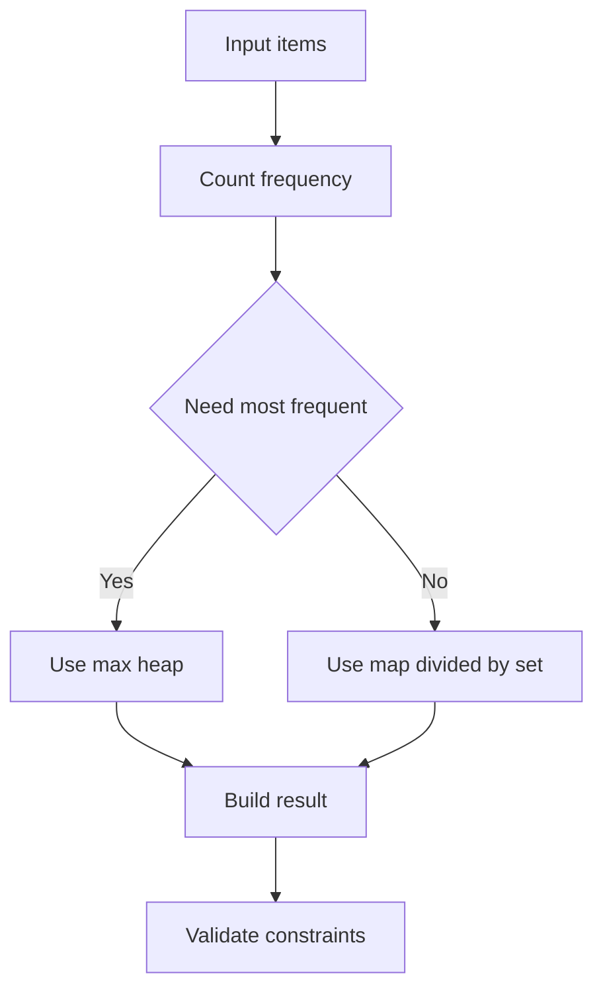
```mermaid
flowchart TD
    A["Input items"] --> B["Count frequency"]
    B --> C{"Need most frequent"}
    C -->|Yes| D["Use max heap"]
    C -->|No| E["Use map divided by set"]
    D --> F["Build result"]
    E --> F
    F --> G["Validate constraints"]
```

---

## Example: Rearrange String by Frequency Blocks

### Problem
Group same characters together in sorted order.

### C++ Code

```cpp
#include <bits/stdc++.h>
using namespace std;

string groupByFrequency(string s) {
    map<char, int> freq;

    for (char c : s) {
        freq[c]++;
    }

    string ans;

    for (auto [ch, count] : freq) {
        ans += string(count, ch);
    }

    return ans;
}
```

---

## Dry Run

Input:

```text
s = "baca"
```

| Char | Frequency |
|---|---:|
| a | 2 |
| b | 1 |
| c | 1 |

Build:

| Step | Add | Result |
|---|---|---|
| 1 | `aa` | `aa` |
| 2 | `b` | `aab` |
| 3 | `c` | `aabc` |

---

# 11. Framework G: Heap-Based Construction

## Concept

Use heap when you must repeatedly choose the best available item.

Common in FAANG/OA:
- Reorganize String
- Task Scheduler
- Avoid adjacent duplicates
- Rearrange Barcodes

---

## When to Use Heap

| Signal | Heap Reason |
|---|---|
| Pick most frequent each step | max heap |
| Pick smallest available | min heap |
| Cooldown / unavailable items | heap + queue |
| Dynamic choices | heap changes after each step |

---

## Reorganize String

### Problem
Rearrange string so no two adjacent characters are same.

---

## Visual Strategy

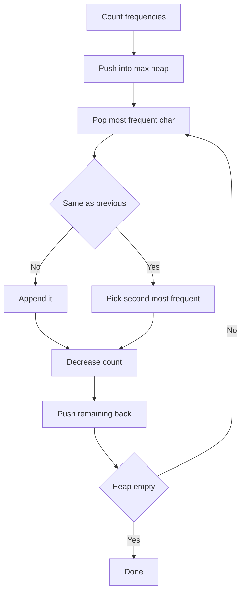
```mermaid
flowchart TD
    A["Count frequencies"] --> B["Push into max heap"]
    B --> C["Pop most frequent char"]
    C --> D{"Same as previous"}
    D -->|No| E["Append it"]
    D -->|Yes| F["Pick second most frequent"]
    E --> G["Decrease count"]
    F --> G
    G --> H["Push remaining back"]
    H --> I{"Heap empty"}
    I -->|No| C
    I -->|Yes| J["Done"]
```

---

## C++ Code

```cpp
#include <bits/stdc++.h>
using namespace std;

string reorganizeString(string s) {
    unordered_map<char, int> freq;

    for (char c : s) {
        freq[c]++;
    }

    priority_queue<pair<int, char>> pq;

    for (auto [ch, count] : freq) {
        pq.push({count, ch});
    }

    string ans;

    while (pq.size() >= 2) {
        auto first = pq.top();
        pq.pop();

        auto second = pq.top();
        pq.pop();

        ans += first.second;
        ans += second.second;

        first.first--;
        second.first--;

        if (first.first > 0) pq.push(first);
        if (second.first > 0) pq.push(second);
    }

    if (!pq.empty()) {
        auto last = pq.top();
        pq.pop();

        if (last.first > 1) return "";
        if (!ans.empty() && ans.back() == last.second) return "";

        ans += last.second;
    }

    return ans;
}
```

---

## Dry Run

Input:

```text
s = "aaabbc"
```

Frequencies:

| char | count |
|---|---:|
| a | 3 |
| b | 2 |
| c | 1 |

Steps:

| Step | Pick 1 | Pick 2 | Result | Remaining |
|---:|---|---|---|---|
| 1 | a | b | `ab` | a:2,b:1,c:1 |
| 2 | a | c | `abac` | a:1,b:1 |
| 3 | b | a | `abacba` | none |

Valid:

```text
a b a c b a
```

No adjacent equal.

---

## Proof Idea

Always taking two most frequent different characters prevents the most frequent character from accumulating too much.

Feasibility condition:

```text
max_frequency <= (n + 1) / 2
```

If max frequency is bigger, impossible.

---

# 12. Framework H: Prefix-Valid Construction

## Concept

Every prefix must satisfy a condition.

Examples:
- valid parentheses
- prefix sum non-negative
- no prefix violates limit
- lexicographically smallest valid sequence

---

## Important Invariant

```text
After each step, prefix is valid.
```

---

## Example: Construct Valid Parentheses

### Problem
Build any valid parentheses string with `n` pairs.

### Simple Construction

```text
((...))
```

### C++ Code

```cpp
#include <bits/stdc++.h>
using namespace std;

string validParentheses(int n) {
    string ans;

    for (int i = 0; i < n; i++) ans += '(';
    for (int i = 0; i < n; i++) ans += ')';

    return ans;
}
```

---

## Dry Run

`n = 3`

| Step | Add | Balance | String |
|---:|---|---:|---|
| 1 | `(` | 1 | `(` |
| 2 | `(` | 2 | `((` |
| 3 | `(` | 3 | `(((` |
| 4 | `)` | 2 | `((()` |
| 5 | `)` | 1 | `((())` |
| 6 | `)` | 0 | `((()))` |

Invariant:

```text
balance never negative
final balance = 0
```

---

## More Flexible Construction

Choose `(` if possible, otherwise `)`.

```cpp
#include <bits/stdc++.h>
using namespace std;

string buildParentheses(int n) {
    int open = 0, close = 0;
    string ans;

    while ((int)ans.size() < 2 * n) {
        if (open < n) {
            ans += '(';
            open++;
        } else {
            ans += ')';
            close++;
        }
    }

    return ans;
}
```

---

# 13. Framework I: Simulation Construction

## Concept

Sometimes the answer is built by simulating rules.

Common:
- robot movement
- queues
- stack processes
- games
- scheduling

---

## Flow

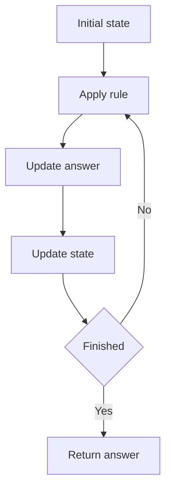
```mermaid
flowchart TD
    A["Initial state"] --> B["Apply rule"]
    B --> C["Update answer"]
    C --> D["Update state"]
    D --> E{"Finished"}
    E -->|No| B
    E -->|Yes| F["Return answer"]
```

---

## Example: Spiral Matrix Construction

### Problem
Fill `n x n` matrix with numbers from `1` to `n^2`.

### C++ Code

```cpp
#include <bits/stdc++.h>
using namespace std;

vector<vector<int>> spiralMatrix(int n) {
    vector<vector<int>> mat(n, vector<int>(n, 0));

    int top = 0, bottom = n - 1;
    int left = 0, right = n - 1;
    int value = 1;

    while (top <= bottom && left <= right) {
        for (int c = left; c <= right; c++) mat[top][c] = value++;
        top++;

        for (int r = top; r <= bottom; r++) mat[r][right] = value++;
        right--;

        if (top <= bottom) {
            for (int c = right; c >= left; c--) mat[bottom][c] = value++;
            bottom--;
        }

        if (left <= right) {
            for (int r = bottom; r >= top; r--) mat[r][left] = value++;
            left++;
        }
    }

    return mat;
}
```

---

## Dry Run for `n = 3`

| Step | Matrix |
|---|---|
| Fill top row | `1 2 3 / 0 0 0 / 0 0 0` |
| Fill right col | `1 2 3 / 0 0 4 / 0 0 5` |
| Fill bottom row | `1 2 3 / 0 0 4 / 7 6 5` |
| Fill left col | `1 2 3 / 8 0 4 / 7 6 5` |
| Fill center | `1 2 3 / 8 9 4 / 7 6 5` |

Final:

```text
1 2 3
8 9 4
7 6 5
```

---

# 14. Framework J: Segment / Interval Construction

## Concept

Build answer in chunks instead of single elements.

Useful when:
- repeated blocks
- ranges
- intervals
- partitioning array/string

---

## Example: Partition Array Into Blocks

### Problem
Construct array of length `n` using repeated block `[1,2,3]`.

### C++ Code

```cpp
#include <bits/stdc++.h>
using namespace std;

vector<int> blockConstruction(int n) {
    vector<int> ans;
    vector<int> block = {1, 2, 3};

    for (int i = 0; i < n; i++) {
        ans.push_back(block[i % 3]);
    }

    return ans;
}
```

---

## Dry Run

`n = 8`

| i | value | result |
|---:|---:|---|
| 0 | 1 | `[1]` |
| 1 | 2 | `[1,2]` |
| 2 | 3 | `[1,2,3]` |
| 3 | 1 | `[1,2,3,1]` |
| 4 | 2 | `[1,2,3,1,2]` |
| 5 | 3 | `[1,2,3,1,2,3]` |
| 6 | 1 | `[1,2,3,1,2,3,1]` |
| 7 | 2 | `[1,2,3,1,2,3,1,2]` |

---

# 15. Framework K: Math Construction

## Concept

Use math formulas to construct answer directly.

Common:
- sum formulas
- parity
- divisibility
- modular arithmetic
- triangular numbers

---

## Pattern Table

| Math Property | Construction Idea |
|---|---|
| Even sum | split into pairs |
| Odd/even parity | choose numbers by parity |
| Divisibility by k | use multiples of k |
| Sum 1..n | use `n(n+1)/2` |
| Need equal sum sets | check total parity |

---

## Example: Split `1..n` Into Two Equal Sum Sets

### Problem
Partition numbers `1..n` into two sets with equal sum.

### Observation

Total sum:

```text
n(n+1)/2
```

If total sum is odd, impossible.

---

## Flowchart

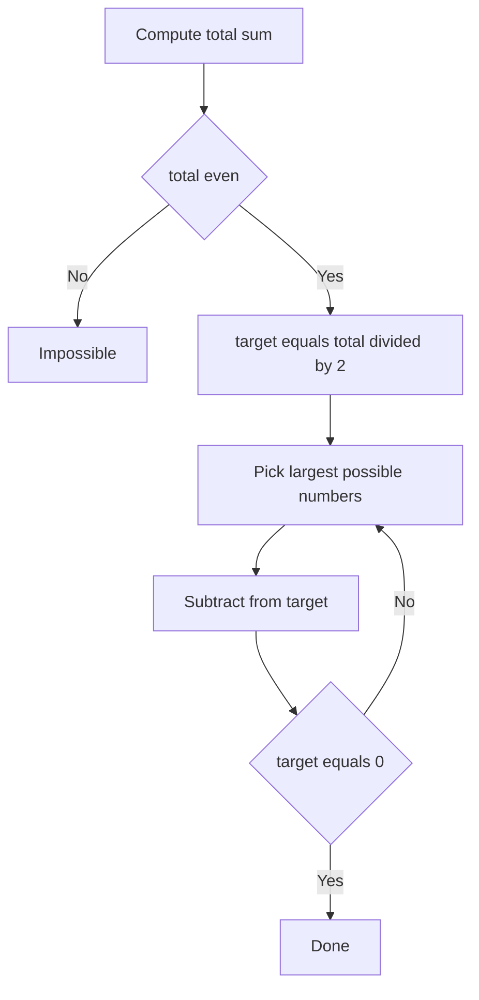
```mermaid
flowchart TD
    A["Compute total sum"] --> B{"total even"}
    B -->|No| C["Impossible"]
    B -->|Yes| D["target equals total divided by 2"]
    D --> E["Pick largest possible numbers"]
    E --> F["Subtract from target"]
    F --> G{"target equals 0"}
    G -->|Yes| H["Done"]
    G -->|No| E
```

---

## C++ Code

```cpp
#include <bits/stdc++.h>
using namespace std;

pair<vector<int>, vector<int>> equalSumPartition(int n) {
    long long total = 1LL * n * (n + 1) / 2;

    if (total % 2 == 1) {
        return {{}, {}};
    }

    long long target = total / 2;
    vector<int> setA, setB;
    vector<int> used(n + 1, 0);

    for (int x = n; x >= 1; x--) {
        if (x <= target) {
            setA.push_back(x);
            used[x] = 1;
            target -= x;
        }
    }

    for (int x = 1; x <= n; x++) {
        if (!used[x]) setB.push_back(x);
    }

    return {setA, setB};
}
```

---

## Dry Run

`n = 7`

Total:

```text
7*8/2 = 28
target = 14
```

| x | target before | take? | setA | target after |
|---:|---:|---|---|---:|
| 7 | 14 | yes | `[7]` | 7 |
| 6 | 7 | yes | `[7,6]` | 1 |
| 5 | 1 | no | `[7,6]` | 1 |
| 4 | 1 | no | `[7,6]` | 1 |
| 3 | 1 | no | `[7,6]` | 1 |
| 2 | 1 | no | `[7,6]` | 1 |
| 1 | 1 | yes | `[7,6,1]` | 0 |

Set A:

```text
7 + 6 + 1 = 14
```

Set B:

```text
2 + 3 + 4 + 5 = 14
```

---

# 16. Framework L: Number Theory Construction

## Concept

Use divisibility, gcd, lcm, primes, parity.

---

## Common Forms

| Goal | Construction |
|---|---|
| Need gcd > 1 | use multiples of same number |
| Need coprime | use consecutive numbers |
| Need even numbers | use `2,4,6...` |
| Need odd numbers | use `1,3,5...` |
| Need modulo class | use numbers `x % k = r` |

---

## Example: Build Array With GCD Greater Than 1

### Problem
Construct `n` positive numbers whose gcd is at least `2`.

### Construction

Use all even numbers.

### C++ Code

```cpp
#include <bits/stdc++.h>
using namespace std;

vector<int> gcdGreaterThanOne(int n) {
    vector<int> ans;

    for (int i = 1; i <= n; i++) {
        ans.push_back(2 * i);
    }

    return ans;
}
```

---

## Dry Run

`n = 5`

```text
[2,4,6,8,10]
```

GCD:

```text
gcd(2,4,6,8,10) = 2
```

Valid.

---

# 17. Framework M: Bitwise Construction

## Concept

Use binary properties:
- set bits
- xor
- and
- or
- powers of two

---

## Pattern Table

| Requirement | Construction |
|---|---|
| XOR = 0 | use pairs `x,x` |
| OR large | include powers of two |
| AND positive | all numbers share one bit |
| Unique powers | use `1,2,4,8...` |
| Toggle property | use xor pairs |

---

## Example: Construct Array With XOR = 0

### C++ Code

```cpp
#include <bits/stdc++.h>
using namespace std;

vector<int> xorZeroArray(int n) {
    vector<int> ans;

    for (int i = 1; i <= n / 2; i++) {
        ans.push_back(i);
        ans.push_back(i);
    }

    if (n % 2 == 1) {
        ans.push_back(0);
    }

    return ans;
}
```

---

## Dry Run

`n = 5`

| Step | Add | XOR so far |
|---:|---|---:|
| 1 | 1 | 1 |
| 2 | 1 | 0 |
| 3 | 2 | 2 |
| 4 | 2 | 0 |
| 5 | 0 | 0 |

Final:

```text
[1,1,2,2,0]
```

---

## Why Works

```text
x XOR x = 0
0 XOR y = y
```

Pairs cancel out.

---

# 18. Framework N: Graph Construction

## Concept

Build a graph satisfying:
- connected
- tree
- degree constraints
- bipartite
- cycle/no cycle
- exact number of edges

---

## Basic Graph Constructions

| Required Graph | Construction |
|---|---|
| Tree | chain of `n-1` edges |
| Connected graph | start with tree, add extra edges |
| Bipartite | split nodes into two groups |
| Star | connect all nodes to 1 |
| Cycle | connect `i` to `i+1`, last to first |

---

## Example: Construct Connected Graph With `n` Nodes and `m` Edges

### Idea

1. First build a chain to ensure connected.
2. Add extra edges until edge count is `m`.

---

## Flowchart

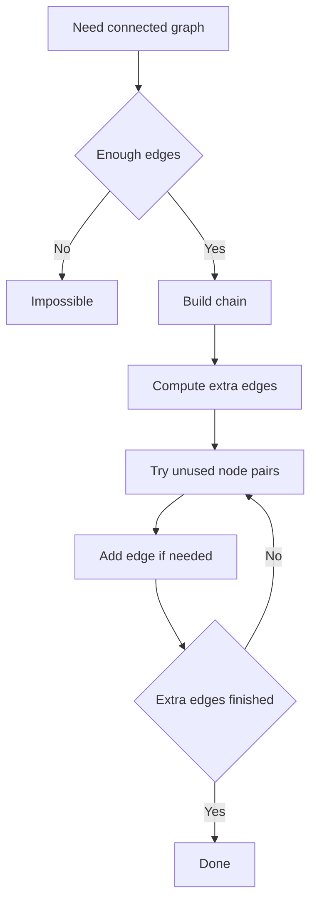
```mermaid
flowchart TD
    A["Need connected graph"] --> B{"Enough edges"}
    B -->|No| C["Impossible"]
    B -->|Yes| D["Build chain"]
    D --> E["Compute extra edges"]
    E --> F["Try unused node pairs"]
    F --> G["Add edge if needed"]
    G --> H{"Extra edges finished"}
    H -->|Yes| I["Done"]
    H -->|No| F
```

---

## C++ Code

```cpp
#include <bits/stdc++.h>
using namespace std;

vector<pair<int,int>> connectedGraph(int n, int m) {
    if (m < n - 1) return {};

    int maxEdges = n * (n - 1) / 2;
    if (m > maxEdges) return {};

    vector<pair<int,int>> edges;
    set<pair<int,int>> used;

    // Build chain
    for (int i = 1; i < n; i++) {
        edges.push_back({i, i + 1});
        used.insert({i, i + 1});
    }

    int extra = m - (n - 1);

    for (int u = 1; u <= n && extra > 0; u++) {
        for (int v = u + 1; v <= n && extra > 0; v++) {
            if (!used.count({u, v})) {
                edges.push_back({u, v});
                used.insert({u, v});
                extra--;
            }
        }
    }

    return edges;
}
```

---

## Dry Run

`n = 4, m = 5`

Chain edges:

```text
1-2
2-3
3-4
```

Need extra:

```text
5 - 3 = 2
```

Add:

```text
1-3
1-4
```

Final edges:

| Edge |
|---|
| 1-2 |
| 2-3 |
| 3-4 |
| 1-3 |
| 1-4 |

Connected and has exactly 5 edges.

---

# 19. Framework O: Reverse Construction

## Concept

Sometimes forward construction is hard.

Build backwards from final condition.

Common examples:
- operations that reduce a number
- deleting elements
- reverse simulation
- target to source

---

## Flowchart

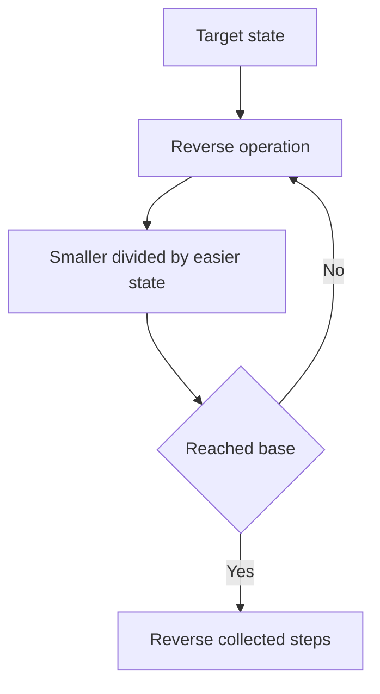
```mermaid
flowchart TD
    A["Target state"] --> B["Reverse operation"]
    B --> C["Smaller divided by easier state"]
    C --> D{"Reached base"}
    D -->|No| B
    D -->|Yes| E["Reverse collected steps"]
```

---

## Example: Build Number From 1 Using Operations

### Problem
Construct operations to reach `n` from `1`.
Allowed:
- multiply by 2
- add 1

### Reverse Idea

From `n`:
- if even, divide by 2
- if odd, subtract 1

Then reverse operations.

---

## C++ Code

```cpp
#include <bits/stdc++.h>
using namespace std;

vector<string> buildNumberOps(int n) {
    vector<string> reverseOps;

    while (n > 1) {
        if (n % 2 == 0) {
            reverseOps.push_back("multiply by 2");
            n /= 2;
        } else {
            reverseOps.push_back("add 1");
            n -= 1;
        }
    }

    reverse(reverseOps.begin(), reverseOps.end());
    return reverseOps;
}
```

---

## Dry Run

Target `n = 13`

Reverse:

| n | Reverse action | Forward action stored |
|---:|---|---|
| 13 | subtract 1 | add 1 |
| 12 | divide by 2 | multiply by 2 |
| 6 | divide by 2 | multiply by 2 |
| 3 | subtract 1 | add 1 |
| 2 | divide by 2 | multiply by 2 |
| 1 | stop | stop |

Forward operations:

```text
multiply by 2
add 1
multiply by 2
multiply by 2
add 1
```

Forward check:

```text
1 -> 2 -> 3 -> 6 -> 12 -> 13
```

---

# 20. Framework P: Transformation Construction

## Concept

Transform an easy valid structure into required structure.

Examples:
- start sorted, then swap
- start identity permutation, rotate
- start empty graph, add edges
- start all minimum values, distribute remaining

---

## Pattern

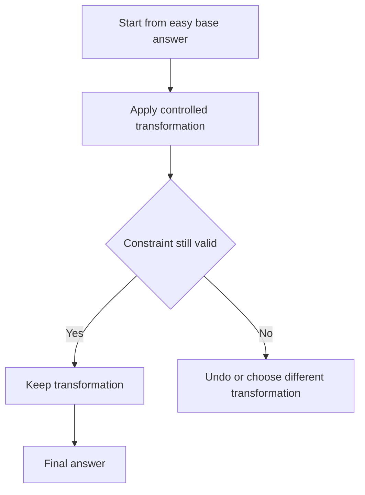
```mermaid
flowchart TD
    A["Start from easy base answer"] --> B["Apply controlled transformation"]
    B --> C{"Constraint still valid"}
    C -->|Yes| D["Keep transformation"]
    C -->|No| E["Undo or choose different transformation"]
    D --> F["Final answer"]
```

---

## Example: Derangement by Rotation

### Problem
Construct permutation `p` of `1..n` such that `p[i] != i`.

### Construction

Rotate identity permutation left by 1.

For `n = 5`:

```text
identity: 1 2 3 4 5
rotated : 2 3 4 5 1
```

No element stays in original position.

---

## C++ Code

```cpp
#include <bits/stdc++.h>
using namespace std;

vector<int> derangement(int n) {
    if (n == 1) return {};

    vector<int> p(n);

    for (int i = 0; i < n; i++) {
        p[i] = i + 1;
    }

    rotate(p.begin(), p.begin() + 1, p.end());

    return p;
}
```

---

## Dry Run

`n = 4`

| Index | Original | Rotated |
|---:|---:|---:|
| 1 | 1 | 2 |
| 2 | 2 | 3 |
| 3 | 3 | 4 |
| 4 | 4 | 1 |

All positions changed.

---

# 21. Framework Q: Binary Search + Constructive Check

## Concept

Sometimes you need minimum/maximum value, but each candidate can be checked constructively.

---

## Pattern

```text
binary search answer
    can(x):
        try to construct valid object under x
```

---

## Flowchart

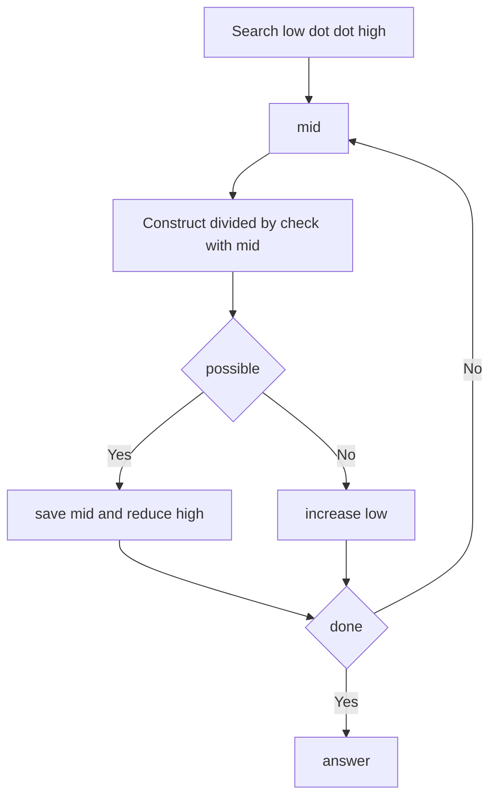
```mermaid
flowchart TD
    A["Search low dot dot high"] --> B["mid"]
    B --> C["Construct divided by check with mid"]
    C --> D{"possible"}
    D -->|Yes| E["save mid and reduce high"]
    D -->|No| F["increase low"]
    E --> G{"done"}
    F --> G
    G -->|No| B
    G -->|Yes| H["answer"]
```

---

## Example: Split Array Into At Most `k` Parts With Max Sum <= X

### C++ Code

```cpp
#include <bits/stdc++.h>
using namespace std;

bool canSplit(vector<int>& a, int k, long long maxAllowed) {
    int parts = 1;
    long long current = 0;

    for (int x : a) {
        if (x > maxAllowed) return false;

        if (current + x <= maxAllowed) {
            current += x;
        } else {
            parts++;
            current = x;
        }
    }

    return parts <= k;
}

long long minimizeLargestPartSum(vector<int>& a, int k) {
    long long low = *max_element(a.begin(), a.end());
    long long high = accumulate(a.begin(), a.end(), 0LL);
    long long ans = high;

    while (low <= high) {
        long long mid = (low + high) / 2;

        if (canSplit(a, k, mid)) {
            ans = mid;
            high = mid - 1;
        } else {
            low = mid + 1;
        }
    }

    return ans;
}
```

---

## Dry Run

Array:

```text
[7,2,5,10,8], k = 2
```

Try `X = 18`:

| Step | x | current | parts |
|---:|---:|---:|---:|
| 1 | 7 | 7 | 1 |
| 2 | 2 | 9 | 1 |
| 3 | 5 | 14 | 1 |
| 4 | 10 | 10 | 2 |
| 5 | 8 | 18 | 2 |

Possible.

Try smaller.

Answer becomes `18`.

---

# 22. How to Prove Constructive Solutions

Constructive proof usually has 3 parts:

| Part | Meaning |
|---|---|
| Existence | Show answer can be built |
| Validity | Show constraints hold |
| Completeness | Show all required items used |

---

## Proof Framework

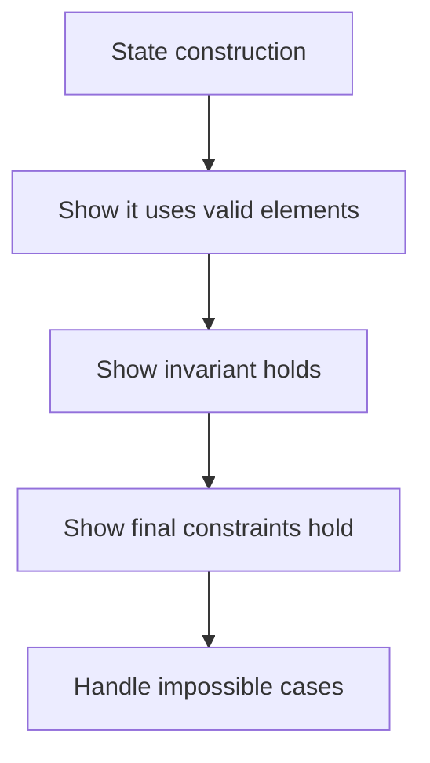
```mermaid
flowchart TD
    A["State construction"] --> B["Show it uses valid elements"]
    B --> C["Show invariant holds"]
    C --> D["Show final constraints hold"]
    D --> E["Handle impossible cases"]
```

---

## Simple Proof Template

```text
Construction:
    Describe how you build the answer.

Invariant:
    State the property that remains true after every step.

Why invariant holds:
    Explain why each added element does not break the property.

Final correctness:
    After all steps, all elements are used and constraints are satisfied.

Impossible cases:
    Explain why no answer can exist for excluded inputs.
```

---

# 23. Invariant Proof Template

## What Is an Invariant?

An invariant is a rule that stays true during construction.

Examples:
- prefix sum never negative
- no adjacent equal
- all chosen values are within range
- graph remains connected
- gcd remains greater than 1

---

## Invariant Diagram

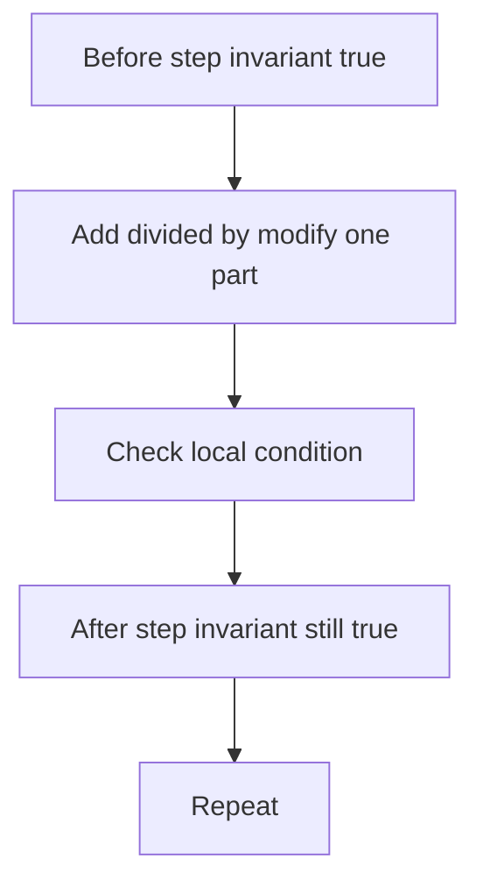
```mermaid
flowchart TD
    A["Before step invariant true"] --> B["Add divided by modify one part"]
    B --> C["Check local condition"]
    C --> D["After step invariant still true"]
    D --> E["Repeat"]
```

---

## Example: Array Sum Construction

Invariant:

```text
Every a[i] is between L and R.
Remaining sum never exceeds remaining capacity.
```

Why it holds:
- Start with all `L`.
- Add at most `R-L` to any position.
- Stop when remaining becomes zero.

---

# 24. Greedy Exchange Argument Inside Constructive Problems

Some constructive problems use a greedy choice.

Example:
- Choose largest possible number for equal-sum partition.
- Choose most frequent char in string rearrangement.
- Choose smallest safe value for lexicographically smallest answer.

---

## Exchange Argument Pattern

```text
Assume an optimal/valid solution does not use our greedy choice.
Show we can swap its choice with our greedy choice.
After swap, the solution is still valid.
Therefore greedy choice is safe.
```

---

## Visual

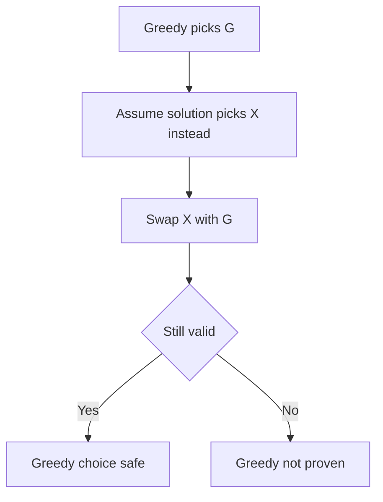
```mermaid
flowchart TD
    A["Greedy picks G"] --> B["Assume solution picks X instead"]
    B --> C["Swap X with G"]
    C --> D{"Still valid"}
    D -->|Yes| E["Greedy choice safe"]
    D -->|No| F["Greedy not proven"]
```

---

## Example: Equal Sum Partition Choosing Largest Possible

Why largest possible works:

1. Target is positive.
2. If `x <= target`, taking `x` cannot exceed the required sum.
3. Taking large numbers reduces target quickly.
4. Remaining target can be filled by smaller numbers due to consecutive numbers structure.

This is a constructive greedy proof.

---

# 25. Dry Run Method for OA / Contest

For every constructive solution, dry run like this:

| Check | Question |
|---|---|
| Smallest input | What happens for n=1? |
| Impossible input | Does code print impossible? |
| Boundary | n=2, n=3, max n |
| Constraint | Are all values valid? |
| Count | Did we use exactly n items? |
| Duplicates | Are duplicates allowed? |
| Final property | Does output satisfy rule? |

---

## Dry Run Template

```text
Input:
Construction rule:
Step table:
Final answer:
Check constraints:
Conclusion:
```

---

# 26. Common Mistakes

| Mistake | Fix |
|---|---|
| Ignoring impossible cases | Check feasibility first |
| Breaking invariant | Validate after each step |
| Overcomplicating | Try parity/sorting first |
| Using brute force | Look for direct pattern |
| Missing small n | Test n=1,2,3 |
| Duplicate when permutation needed | Track used values |
| Not proving construction | Write invariant proof |

---

# 27. Pattern Cheat Sheet

| Level | Framework | Keywords |
|---|---|---|
| Beginner | Direct construction | build sequence |
| Beginner | Fill with sum | sum, range |
| Beginner | Permutation | rearrange 1..n |
| Beginner | Alternating | high-low |
| FAANG | Frequency | characters, counts |
| FAANG | Heap | avoid adjacent |
| FAANG | Prefix-valid | parentheses, prefix |
| FAANG | Simulation | process rules |
| Advanced | Math | parity, formula |
| Advanced | Number theory | gcd, mod |
| Advanced | Bitwise | xor, and, or |
| Advanced | Graph | tree, connected |
| Advanced | Reverse | target to source |
| Advanced | Transform | rotate/swap |
| Advanced | Binary search + build | minimize maximum |

---

# 28. C++ Template Library

## Template 1: Print Vector

```cpp
template <class T>
void printVector(const vector<T>& a) {
    for (auto x : a) cout << x << ' ';
    cout << '\\n';
}
```

---

## Template 2: Feasibility Before Construction

```cpp
bool possibleSumArray(int n, int L, int R, int S) {
    return 1LL * n * L <= S && S <= 1LL * n * R;
}
```

---

## Template 3: Check Permutation

```cpp
bool isPermutation(vector<int>& p) {
    int n = p.size();
    vector<int> seen(n + 1, 0);

    for (int x : p) {
        if (x < 1 || x > n) return false;
        if (seen[x]) return false;
        seen[x] = 1;
    }

    return true;
}
```

---

## Template 4: Check No Adjacent Equal

```cpp
bool noAdjacentEqual(const string& s) {
    for (int i = 1; i < (int)s.size(); i++) {
        if (s[i] == s[i - 1]) return false;
    }
    return true;
}
```

---

## Template 5: Check No Adjacent Difference 1

```cpp
bool noAdjacentDiffOne(vector<int>& a) {
    for (int i = 1; i < (int)a.size(); i++) {
        if (abs(a[i] - a[i - 1]) == 1) return false;
    }
    return true;
}
```

---


---

# 29. Expanded Framework Map: Concepts, Forms, Tactics, Examples

This section groups constructive algorithms by **concept framework**.
Use it like a contest/OA checklist.

---

## 29.1 Framework: Feasibility First, Then Build

### Concept

Before constructing, prove whether an answer is possible.

### Forms

| Form | Typical Condition |
|---|---|
| Sum range | `minSum <= S <= maxSum` |
| Permutation | all values must be unique |
| Graph | `n - 1 <= m <= n(n-1)/2` |
| String rearrangement | max frequency limit |
| Parentheses | open count = close count |

### Tactics

| Tactic | Why It Helps |
|---|---|
| Check impossible case first | avoids invalid construction |
| Compute minimum/maximum possible | fast feasibility |
| Build from easiest valid base | simpler proof |
| Validate output with helper | catches hidden mistakes |

### Example: Construct `n` Numbers in `[L,R]` With Sum `S`

```cpp
#include <bits/stdc++.h>
using namespace std;

vector<int> constructBoundedSum(int n, int L, int R, int S) {
    long long minSum = 1LL * n * L;
    long long maxSum = 1LL * n * R;

    if (S < minSum || S > maxSum) return {};

    vector<int> ans(n, L);
    int rem = S - minSum;

    for (int i = 0; i < n; i++) {
        int add = min(rem, R - L);
        ans[i] += add;
        rem -= add;
    }

    return ans;
}
```

### Dry Run

Input:

```text
n = 5, L = 2, R = 7, S = 23
```

| Step | Action | Array | Remaining |
|---:|---|---|---:|
| 0 | start with L | `[2,2,2,2,2]` | 13 |
| 1 | add 5 to index 0 | `[7,2,2,2,2]` | 8 |
| 2 | add 5 to index 1 | `[7,7,2,2,2]` | 3 |
| 3 | add 3 to index 2 | `[7,7,5,2,2]` | 0 |

### Mermaid

```mermaid
flowchart TD
    A["Input n L R S"] --> B["Compute minSum and maxSum"]
    B --> C{"S inside valid range"}
    C -->|No| D["Return impossible"]
    C -->|Yes| E["Set every value to L"]
    E --> F["Distribute remaining sum"]
    F --> G{"Remaining is zero"}
    G -->|Yes| H["Return answer"]
    G -->|No| F
```

---

## 29.2 Framework: Choose Smallest Safe Value

### Concept

Build lexicographically smallest valid answer by choosing the smallest value that does not break future feasibility.

### Forms

| Form | Example |
|---|---|
| Smallest unused safe number | permutation problems |
| Smallest character allowed | string construction |
| Smallest value preserving sum | bounded array |
| Smallest edge preserving graph property | graph construction |

### Tactics

| Tactic | Reason |
|---|---|
| Try candidates in increasing order | gives lexicographically smallest |
| Check future feasibility | prevents dead end |
| Maintain used set | avoids duplicates |

### Example: Lexicographically Smallest Derangement

Problem: build permutation `p` of `1..n` such that `p[i] != i`.

```cpp
#include <bits/stdc++.h>
using namespace std;

vector<int> smallestDerangement(int n) {
    if (n == 1) return {};

    vector<int> p(n);
    iota(p.begin(), p.end(), 1);

    for (int i = 0; i + 1 < n; i += 2) {
        swap(p[i], p[i + 1]);
    }

    if (n % 2 == 1) {
        swap(p[n - 1], p[n - 2]);
    }

    return p;
}
```

### Dry Run

`n = 5`

| Step | Operation | Permutation |
|---:|---|---|
| 0 | identity | `[1,2,3,4,5]` |
| 1 | swap 1 and 2 | `[2,1,3,4,5]` |
| 2 | swap 3 and 4 | `[2,1,4,3,5]` |
| 3 | odd fix swap last two | `[2,1,4,5,3]` |

Check:

| i | p[i] | valid? |
|---:|---:|---|
| 1 | 2 | yes |
| 2 | 1 | yes |
| 3 | 4 | yes |
| 4 | 5 | yes |
| 5 | 3 | yes |

### Mermaid

```mermaid
flowchart TD
    A["Start with identity permutation"] --> B["Swap adjacent pairs"]
    B --> C{"n is odd"}
    C -->|No| D["Return permutation"]
    C -->|Yes| E["Swap last two values"]
    E --> D
```

---

## 29.3 Framework: Use Parity Classes

### Concept

Separate values into odds and evens.

This is powerful because parity controls:
- adjacent difference
- sum parity
- divisibility by 2
- alternating constraints

### Forms

| Form | Construction |
|---|---|
| evens then odds | avoid adjacent difference 1 |
| odds then evens | parity grouping |
| alternate odd/even | parity alternating |
| choose all even | gcd at least 2 |

### Tactics

| Tactic | Use |
|---|---|
| group same parity | avoid close values |
| alternate parity | force odd sums/differences |
| count parity | prove impossible |

### Example: Permutation With Adjacent Sum Odd

If adjacent sum must be odd, every adjacent pair must be one odd and one even.

```cpp
#include <bits/stdc++.h>
using namespace std;

vector<int> alternateParityPermutation(int n) {
    vector<int> odd, even;

    for (int x = 1; x <= n; x++) {
        if (x % 2) odd.push_back(x);
        else even.push_back(x);
    }

    if (abs((int)odd.size() - (int)even.size()) > 1) return {};

    vector<int> ans;
    bool useOdd = odd.size() >= even.size();

    int i = 0, j = 0;

    while (i < (int)odd.size() || j < (int)even.size()) {
        if (useOdd) {
            if (i < (int)odd.size()) ans.push_back(odd[i++]);
        } else {
            if (j < (int)even.size()) ans.push_back(even[j++]);
        }
        useOdd = !useOdd;
    }

    return ans;
}
```

### Dry Run

`n = 5`

Odd:

```text
1 3 5
```

Even:

```text
2 4
```

| Step | Pick | Result |
|---:|---:|---|
| 1 | 1 | `[1]` |
| 2 | 2 | `[1,2]` |
| 3 | 3 | `[1,2,3]` |
| 4 | 4 | `[1,2,3,4]` |
| 5 | 5 | `[1,2,3,4,5]` |

Adjacent sums:

```text
1+2=3, 2+3=5, 3+4=7, 4+5=9
```

All odd.

### Mermaid

```mermaid
flowchart TD
    A["Split numbers into odd and even groups"] --> B{"Counts differ by at most one"}
    B -->|No| C["Impossible"]
    B -->|Yes| D["Start with larger group"]
    D --> E["Alternate odd and even picks"]
    E --> F["Return permutation"]
```

---

## 29.4 Framework: Build From Extremes

### Concept

Use two pointers: smallest and largest.

Good for:
- wave arrays
- maximizing adjacent differences
- avoiding local traps
- balancing values

### Forms

| Form | Example Output |
|---|---|
| low, high, low+1, high-1 | `1 7 2 6 3 5 4` |
| high, low, high-1, low+1 | `7 1 6 2 5 3 4` |
| pairs from ends | `(1,n), (2,n-1)` |

### Example: Maximize Adjacent Differences Heuristically

```cpp
#include <bits/stdc++.h>
using namespace std;

vector<int> extremePermutation(int n) {
    int l = 1, r = n;
    vector<int> ans;

    while (l <= r) {
        ans.push_back(l++);
        if (l <= r) ans.push_back(r--);
    }

    return ans;
}
```

### Dry Run

`n = 6`

| Step | l | r | Add | Result |
|---:|---:|---:|---:|---|
| 1 | 1 | 6 | 1 | `[1]` |
| 2 | 2 | 6 | 6 | `[1,6]` |
| 3 | 2 | 5 | 2 | `[1,6,2]` |
| 4 | 3 | 5 | 5 | `[1,6,2,5]` |
| 5 | 3 | 4 | 3 | `[1,6,2,5,3]` |
| 6 | 4 | 4 | 4 | `[1,6,2,5,3,4]` |

---

## 29.5 Framework: Matrix/Grid Construction

### Concept

Grid constructive problems often depend on:
- checkerboard pattern
- row/column parity
- borders first
- spiral/layers
- diagonal filling

### Pattern Table

| Grid Need | Construction |
|---|---|
| no adjacent equal | checkerboard |
| fill numbers 1..n*m | row-major |
| spiral order | boundary simulation |
| diagonal property | fill by `i+j` |
| chess-like | parity of `i+j` |

### Example: Checkerboard Grid

```cpp
#include <bits/stdc++.h>
using namespace std;

vector<string> checkerboard(int n, int m) {
    vector<string> grid(n, string(m, '.'));

    for (int i = 0; i < n; i++) {
        for (int j = 0; j < m; j++) {
            if ((i + j) % 2 == 0) grid[i][j] = 'A';
            else grid[i][j] = 'B';
        }
    }

    return grid;
}
```

### Dry Run

`n = 3, m = 4`

| Cell rule | Output |
|---|---|
| `(i+j)%2==0 -> A` | `ABAB` |
| alternating | `BABA` |
| alternating | `ABAB` |

Final:

```text
ABAB
BABA
ABAB
```

### Mermaid

```mermaid
flowchart TD
    A["For every cell i j"] --> B{"Is i plus j even"}
    B -->|Yes| C["Place A"]
    B -->|No| D["Place B"]
    C --> E["Next cell"]
    D --> E
```

---

## 29.6 Framework: Local Repair

### Concept

Build something simple first, then repair bad positions locally.

Useful when:
- only few conflicts appear
- bad adjacent pairs can be swapped
- fixed points can be repaired
- final answer almost valid

### Forms

| Form | Repair |
|---|---|
| fixed point in permutation | swap with neighbor |
| adjacent equal chars | swap with later different char |
| bad parity position | swap odd/even |
| graph degree violation | move edge |

### Example: Repair Fixed Points

```cpp
#include <bits/stdc++.h>
using namespace std;

vector<int> repairFixedPoints(vector<int> p) {
    int n = p.size();

    for (int i = 0; i < n; i++) {
        if (p[i] == i + 1) {
            if (i + 1 < n) swap(p[i], p[i + 1]);
            else swap(p[i], p[i - 1]);
        }
    }

    for (int i = 0; i < n; i++) {
        if (p[i] == i + 1) return {};
    }

    return p;
}
```

### Dry Run

Input:

```text
[1,3,2,4]
```

| i | Problem? | Repair | Array |
|---:|---|---|---|
| 1 | p[1]=1 fixed | swap with next | `[3,1,2,4]` |
| 2 | ok | none | `[3,1,2,4]` |
| 3 | ok | none | `[3,1,2,4]` |
| 4 | p[4]=4 fixed | swap with previous | `[3,1,4,2]` |

---

## 29.7 Framework: Construct by Sorting

### Concept

Sorting often exposes a construction order.

### Forms

| Sort By | Use |
|---|---|
| increasing value | smallest safe first |
| decreasing value | largest safe first |
| frequency | handle repeated items |
| end time | interval construction |
| custom comparator | match required property |

### Example: Arrange Pairs by First Value

```cpp
#include <bits/stdc++.h>
using namespace std;

vector<pair<int,int>> constructSortedPairs(vector<pair<int,int>> v) {
    sort(v.begin(), v.end());
    return v;
}
```

### Dry Run

Input:

```text
(3,5), (1,9), (2,4)
```

Sorted:

```text
(1,9), (2,4), (3,5)
```

---

## 29.8 Framework: Construct Lexicographically Smallest Answer

### Concept

At each position, try smallest candidate that still allows completion.

### Generic Template

```cpp
for each position:
    for candidate from smallest to largest:
        if candidate is safe and future possible:
            place candidate
            break
```

### Example: Smallest Binary String With K Ones

```cpp
#include <bits/stdc++.h>
using namespace std;

string smallestBinaryWithKOnes(int n, int k) {
    string ans;

    for (int i = 0; i < n; i++) {
        int remainingPositions = n - i - 1;

        if (k <= remainingPositions) {
            ans += '0';
        } else {
            ans += '1';
            k--;
        }
    }

    return ans;
}
```

### Dry Run

`n = 5, k = 2`

| i | remaining positions | k | choose | result |
|---:|---:|---:|---|---|
| 0 | 4 | 2 | 0 | `0` |
| 1 | 3 | 2 | 0 | `00` |
| 2 | 2 | 2 | 0 | `000` |
| 3 | 1 | 2 | 1 | `0001` |
| 4 | 0 | 1 | 1 | `00011` |

---

## 29.9 Framework: Construct by Blocks

### Concept

Repeat a valid block.

If a block satisfies local constraints, repeating it may satisfy global constraints.

### Forms

| Block | Use |
|---|---|
| `01` | alternating binary |
| `abc` | avoid same char nearby |
| `123` | periodic array |
| `LRUD` | movement cycles |
| rows/columns | grid construction |

### Example: Repeat Pattern Without Adjacent Equal

```cpp
#include <bits/stdc++.h>
using namespace std;

string repeatABC(int n) {
    string block = "abc";
    string ans;

    for (int i = 0; i < n; i++) {
        ans += block[i % 3];
    }

    return ans;
}
```

### Dry Run

`n = 8`

| i | i % 3 | char | result |
|---:|---:|---|---|
| 0 | 0 | a | `a` |
| 1 | 1 | b | `ab` |
| 2 | 2 | c | `abc` |
| 3 | 0 | a | `abca` |
| 4 | 1 | b | `abcab` |
| 5 | 2 | c | `abcabc` |
| 6 | 0 | a | `abcabca` |
| 7 | 1 | b | `abcabcab` |

---

## 29.10 Framework: Construct With Operations

### Concept

Instead of outputting final object, output operations that create it.

### Common Forms

| Operation Type | Strategy |
|---|---|
| add/subtract | reverse from target |
| swap | transform identity |
| rotate | shift bad positions |
| merge/split | build components |
| flip bits | use xor difference |

### Example: Convert String A to B With Bit Flips

```cpp
#include <bits/stdc++.h>
using namespace std;

vector<int> flipPositions(string a, string b) {
    vector<int> ops;

    for (int i = 0; i < (int)a.size(); i++) {
        if (a[i] != b[i]) {
            ops.push_back(i);
            a[i] = b[i];
        }
    }

    return ops;
}
```

### Dry Run

`a = 0101`, `b = 1100`

| i | a[i] | b[i] | flip? | operations |
|---:|---|---|---|---|
| 0 | 0 | 1 | yes | `[0]` |
| 1 | 1 | 1 | no | `[0]` |
| 2 | 0 | 0 | no | `[0]` |
| 3 | 1 | 0 | yes | `[0,3]` |

---

## 29.11 Contest Proof Mini-Cards

### Card 1: Range Fill Proof

```text
We start with minimum valid values.
Each operation adds only within remaining capacity.
Therefore every element remains valid.
Since total remaining sum becomes zero, final sum is correct.
```

### Card 2: Parity Proof

```text
The construction separates values by parity.
Inside one parity group, adjacent differences are at least 2.
The only risky point is the boundary, which is checked separately.
Therefore the adjacency condition holds.
```

### Card 3: Heap String Proof

```text
At each step, we append two most frequent different characters.
Thus no equal adjacent characters are created inside the pair.
The next step starts after a different character.
If one character frequency exceeds half the length rounded up, impossible.
Otherwise the heap process finishes.
```

### Card 4: Graph Connectivity Proof

```text
The first n-1 edges form a chain, so all nodes are connected.
Adding extra edges cannot disconnect a graph.
Therefore the final graph is connected and has exactly m edges.
```

---

## 29.12 Better OA/Contest Checklist

Before submitting constructive code:

| Test Type | Example |
|---|---|
| smallest valid | `n=1` |
| smallest impossible | `n=2 or n=3` |
| max boundary | largest `n` |
| odd/even | both parity cases |
| duplicate risk | permutation check |
| range risk | min/max values |
| leftover risk | remaining sum zero |
| graph risk | edge count exactly `m` |

---


# Final Mental Model

```mermaid
flowchart TD
    A["Constructive Problem"] --> B["Find final property"]
    B --> C["Find impossible cases"]
    C --> D["Pick framework"]
    D --> E["Build answer"]
    E --> F["Maintain invariant"]
    F --> G["Dry run small cases"]
    G --> H["Prove validity"]
    H --> I["Submit"]
```

---

# One-Line Summary

```text
Constructive Algorithms = Observation + Invariant + Step-by-step valid building.
```
