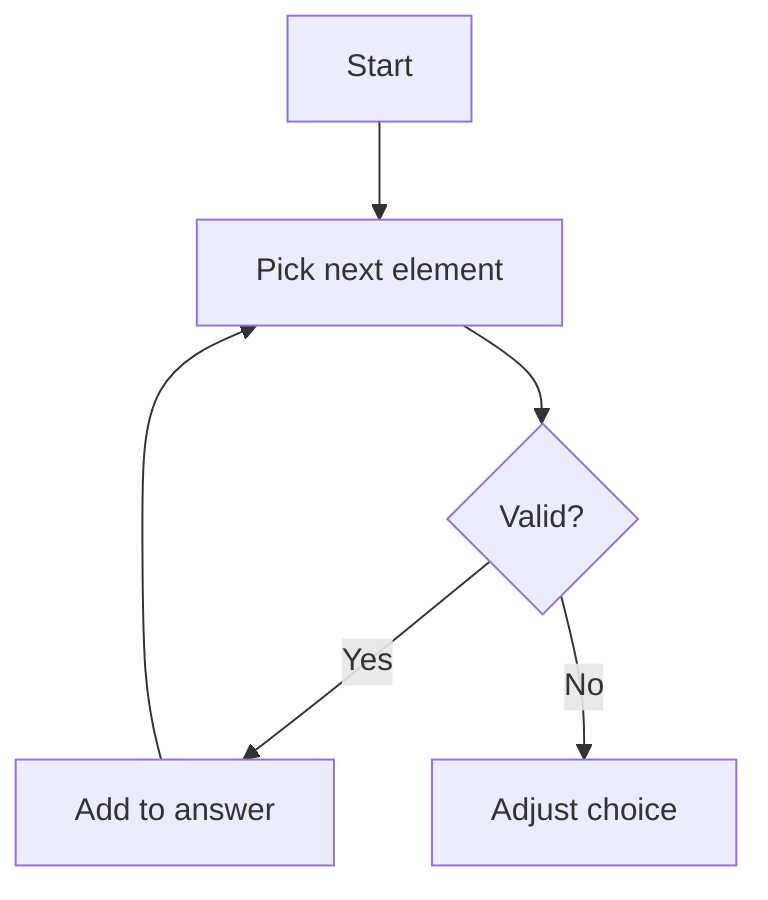
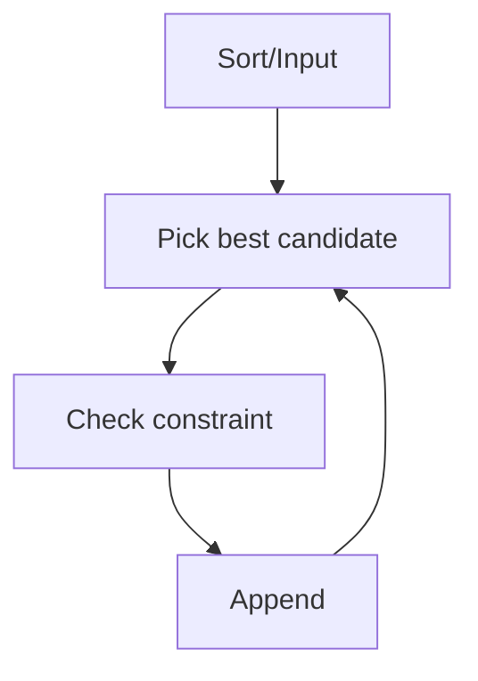
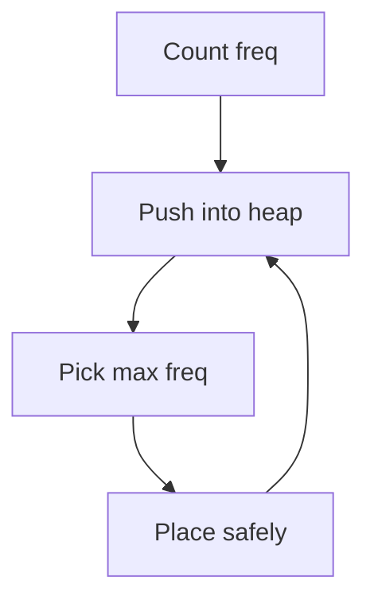

# 🧩 Constructive Algorithms — Visual Guide (Beginner → FAANG → CM)

## 📌 Table of Contents
- [1. Core Concept](#1-core-concept)
- [2. Recognition Signals](#2-recognition-signals)
- [3. Frameworks](#3-frameworks)
- [4. Beginner Patterns](#4-beginner-patterns)
- [5. FAANG Patterns](#5-faang-patterns)
- [6. Advanced / CP Patterns](#6-advanced--cp-patterns)
- [7. Tactics Cheat Sheet](#7-tactics-cheat-sheet)
- [8. Dry Run Examples](#8-dry-run-examples)
- [9. C++ Templates](#9-c-templates)

---

# 1. Core Concept
Build solution step-by-step while maintaining validity.



---

# 2. Recognition Signals
| Signal | Meaning |
|------|--------|
| Construct any | Multiple valid answers |
| Rearrange | Order matters |
| Build sequence | Step-by-step |

---

# 3. Frameworks

## 🔹 Framework 1: Greedy Build


## 🔹 Framework 2: Frequency / Heap


---

# 4. Beginner Patterns

| Pattern | Idea |
|--------|-----|
| Permutation | Arrange numbers |
| Fill array | Maintain sum |
| Alternate | even/odd |

---

# 5. FAANG Patterns

| Pattern | Idea |
|--------|-----|
| String rearrange | avoid adjacency |
| Heap build | dynamic greedy |
| Partition | segments |

---

# 6. Advanced / CP Patterns

| Pattern | Idea |
|--------|-----|
| Math construction | formula-based |
| Graph build | structure |
| Bit construction | XOR tricks |

---

# 7. Tactics Cheat Sheet

- Maintain invariant
- Build smallest first
- Reverse thinking
- Validate each step

---

# 8. Dry Run Examples

## Example: Rearrange String (no adjacent same)

Input: aaabbc

Step:
- Pick a → result: a
- Pick b → ab
- Pick a → aba
- Pick b → abab
- Pick a → ababa
- Pick c → ababac

---

# 9. C++ Templates

## 🔹 Greedy Construct
```cpp
vector<int> construct(vector<int>& nums) {
    sort(nums.begin(), nums.end());
    vector<int> ans;
    for (int x : nums) {
        ans.push_back(x);
    }
    return ans;
}
```

## 🔹 Heap Construct
```cpp
string reorganize(string s) {
    unordered_map<char,int> freq;
    for(char c:s) freq[c]++;

    priority_queue<pair<int,char>> pq;
    for(auto &p:freq) pq.push({p.second,p.first});

    string res="";
    while(pq.size()>1){
        auto a=pq.top(); pq.pop();
        auto b=pq.top(); pq.pop();

        res+=a.second;
        res+=b.second;

        if(--a.first>0) pq.push(a);
        if(--b.first>0) pq.push(b);
    }

    if(!pq.empty()){
        if(pq.top().first>1) return "";
        res+=pq.top().second;
    }
    return res;
}
```

---

# 🎯 Final Insight
Constructive = build valid solution step-by-step using logic, not brute force.
