# Competitive Programming STL & Problem Solving Notes

> Clean markdown notes made from the uploaded handwritten PDFs.  
> Includes Mermaid diagrams, easy-to-follow explanations, and C++ templates.

---

## 0. Problem Solving Strategy

### Time split in contest

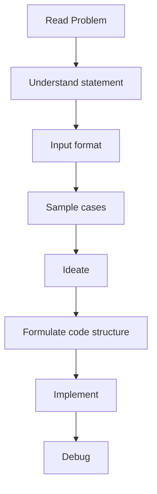

Recommended rough split:

| Step | Goal | Time |
|---|---|---:|
| Read | statement + input + samples | 5 min |
| Ideate | brute force, pattern, constraints, eliminate | 25 min |
| Formulate | decide variables, functions, STL, parameters | 1-2 min |
| Code | implementation | 15-20 min |
| Debug | test and fix | 10 min |

### Ideation checklist

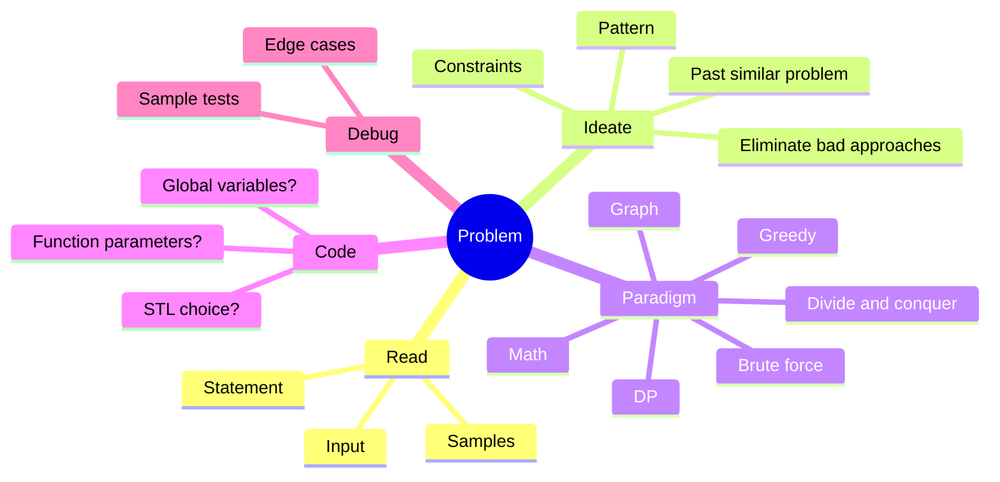

### Important habits

- Start with brute force, then optimize.
- Use constraints to reject impossible complexities.
- Try to identify the known pattern: stack, sliding window, prefix sum, greedy, DP, graph, math.
- Read other accepted code after solving to learn cleaner implementations.
- For interview/company problems: solve all given questions, read editorials, then code yourself.

---

## 1. Balanced Brackets / Parentheses

### Core idea

For only `(` and `)`, maintain `depth`:

- `(` increases depth.
- `)` decreases depth.
- At the end, depth must be `0`.
- During scanning, depth must never become negative.

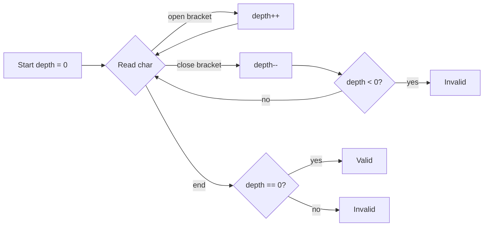

### C++: single bracket type

```cpp
#include <bits/stdc++.h>
using namespace std;

bool isBalancedParentheses(const string& s) {
    int depth = 0;
    for (char ch : s) {
        if (ch == '(') depth++;
        else if (ch == ')') depth--;

        if (depth < 0) return false;
    }
    return depth == 0;
}
```

### Multiple bracket types

For `()`, `{}`, `[]`, use stack. The last opened bracket must match the first incoming closing bracket.

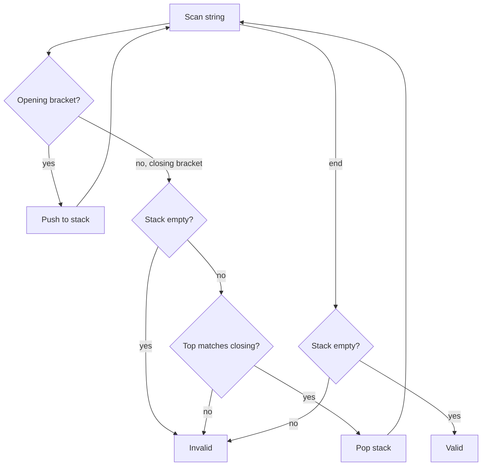

### C++: stack + map

```cpp
#include <bits/stdc++.h>
using namespace std;

bool isBalanced(const string& s) {
    map<char, char> closeToOpen = {
        {')', '('},
        {'}', '{'},
        {']', '['}
    };

    stack<char> st;

    for (char ch : s) {
        if (ch == '(' || ch == '{' || ch == '[') {
            st.push(ch);
        } else if (closeToOpen.count(ch)) {
            if (st.empty() || st.top() != closeToOpen[ch]) return false;
            st.pop();
        }
    }

    return st.empty();
}
```

### Range query on balanced parentheses

For a range `[l, r]` in a parentheses string, using prefix depth:

- `depth[i]` = balance after processing index `i`.
- Range is balanced if:
  - `depth[l-1] == depth[r]`
  - minimum depth inside range never goes below `depth[l-1]`.

```mermaid
flowchart LR
    A[Query l,r] --> B[base = depth[l-1]]
    B --> C{depth[r] == base?}
    C -->|no| D[Not balanced]
    C -->|yes| E{min depth in l..r >= base?}
    E -->|yes| F[Balanced]
    E -->|no| D
```

---

## 2. Sliding Window: Subarray Maintenance

Sliding window is used when we need answers for every window/subarray of length `k`, such as:

- minimum / maximum in every window
- number of distinct elements
- median / mean of each window
- cost of each window

### General template

```mermaid
flowchart TD
    A[Loop i from 0 to n-1] --> B[Insert arr[i]]
    B --> C{i-k >= 0?}
    C -->|yes| D[Remove arr[i-k]]
    C -->|no| E[Skip remove]
    D --> F{i >= k-1?}
    E --> F
    F -->|yes| G[Answer current window]
    F -->|no| A
    G --> A
```

```cpp
for (int i = 0; i < n; i++) {
    ds.insert(arr[i]);

    if (i - k >= 0) {
        ds.erase(arr[i - k]);
    }

    if (i >= k - 1) {
        cout << ds.answer() << '\n';
    }
}
```

---

## 3. Sliding Window Minimum

### Using multiset

Operations needed:

- insert incoming element
- remove outgoing element
- get minimum

```cpp
#include <bits/stdc++.h>
using namespace std;

vector<int> slidingWindowMinMultiset(vector<int>& a, int k) {
    multiset<int> ms;
    vector<int> ans;

    for (int i = 0; i < (int)a.size(); i++) {
        ms.insert(a[i]);

        if (i - k >= 0) {
            ms.erase(ms.find(a[i - k])); // erase only one occurrence
        }

        if (i >= k - 1) {
            ans.push_back(*ms.begin());
        }
    }
    return ans;
}
```

Complexity: `O(n log k)`.

### Using monotonic deque

Maintain elements in increasing order. The minimum is always at the front.

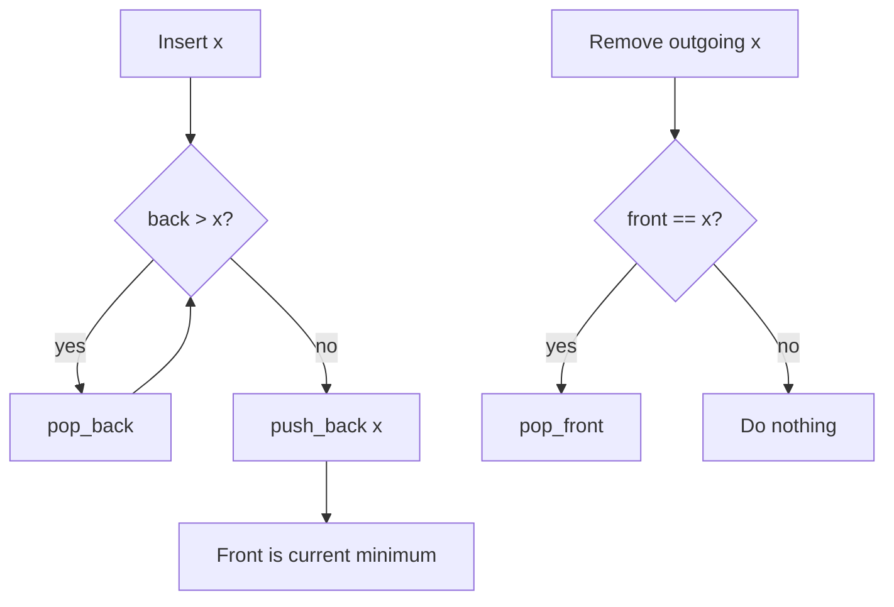

Each element is pushed once and popped at most once, so total time is `O(n)`.

```cpp
#include <bits/stdc++.h>
using namespace std;

struct MonotoneMinDeque {
    deque<int> dq;

    void insert(int x) {
        while (!dq.empty() && dq.back() > x) dq.pop_back();
        dq.push_back(x);
    }

    void erase(int x) {
        if (!dq.empty() && dq.front() == x) dq.pop_front();
    }

    int getMin() const {
        return dq.front();
    }
};

vector<int> slidingWindowMin(vector<int>& a, int k) {
    MonotoneMinDeque ds;
    vector<int> ans;

    for (int i = 0; i < (int)a.size(); i++) {
        ds.insert(a[i]);

        if (i - k >= 0) ds.erase(a[i - k]);

        if (i >= k - 1) ans.push_back(ds.getMin());
    }

    return ans;
}
```

---

## 4. Sliding Window Cost / Make All Elements Equal

Problem: for every window of size `k`, find minimum cost to make all elements equal, where cost is sum of absolute differences.

For values `a1, a2, ..., ak`, minimize:

```text
|x-a1| + |x-a2| + ... + |x-ak|
```

The minimum occurs at the median.

```mermaid
flowchart TD
    A[Window values] --> B[Find median]
    B --> C[Cost = sum abs(ai - median)]
    C --> D[Maintain two multisets]
```

### Data structure

Maintain two multisets:

- `lo`: smaller half, contains the median at `*lo.rbegin()`
- `hi`: larger half
- `leftSum`: sum of `lo`
- `rightSum`: sum of `hi`

Balance rule:

```text
lo.size() == hi.size() OR lo.size() == hi.size() + 1
```

Cost:

```text
leftCost  = median * lo.size() - leftSum
rightCost = rightSum - median * hi.size()
totalCost = leftCost + rightCost
```

### C++

```cpp
#include <bits/stdc++.h>
using namespace std;

struct SlidingCost {
    multiset<long long> lo, hi;
    long long leftSum = 0, rightSum = 0;

    long long median() const {
        return *lo.rbegin();
    }

    void rebalance() {
        while (lo.size() < hi.size()) {
            auto it = hi.begin();
            long long x = *it;
            hi.erase(it);
            rightSum -= x;
            lo.insert(x);
            leftSum += x;
        }

        while (lo.size() > hi.size() + 1) {
            auto it = prev(lo.end());
            long long x = *it;
            lo.erase(it);
            leftSum -= x;
            hi.insert(x);
            rightSum += x;
        }
    }

    void insert(long long x) {
        if (lo.empty() || x <= median()) {
            lo.insert(x);
            leftSum += x;
        } else {
            hi.insert(x);
            rightSum += x;
        }
        rebalance();
    }

    void erase(long long x) {
        auto itLo = lo.find(x);
        if (itLo != lo.end()) {
            lo.erase(itLo);
            leftSum -= x;
        } else {
            auto itHi = hi.find(x);
            hi.erase(itHi);
            rightSum -= x;
        }
        rebalance();
    }

    long long cost() const {
        long long m = median();
        long long leftCost = m * (long long)lo.size() - leftSum;
        long long rightCost = rightSum - m * (long long)hi.size();
        return leftCost + rightCost;
    }
};
```

---

## 5. Mean, Variance, Median, Mode Dashboard

Design a dynamic structure supporting:

- `insert(x)`
- `remove(x)`
- `mean()`
- `variance()`
- `median()`
- `mode()`

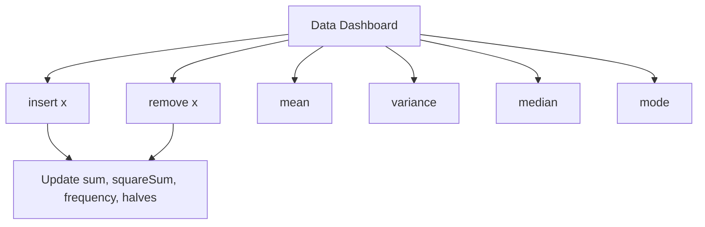

### Formulas

```text
mean = sum / count
variance = (sum of squares / count) - mean^2
mode = element with highest frequency
median = middle value after sorting
```

### C++ structure

```cpp
#include <bits/stdc++.h>
using namespace std;

struct DataDashboard {
    long long sum = 0, squareSum = 0;
    int count = 0;

    map<int, int> freq;
    multiset<pair<int, int>> freqOrder; // {frequency, value}

    multiset<int> lo, hi; // median halves

    void rebalanceMedian() {
        while (lo.size() < hi.size()) {
            int x = *hi.begin();
            hi.erase(hi.begin());
            lo.insert(x);
        }
        while (lo.size() > hi.size() + 1) {
            int x = *lo.rbegin();
            lo.erase(prev(lo.end()));
            hi.insert(x);
        }
    }

    void addToMedian(int x) {
        if (lo.empty() || x <= *lo.rbegin()) lo.insert(x);
        else hi.insert(x);
        rebalanceMedian();
    }

    void removeFromMedian(int x) {
        auto itLo = lo.find(x);
        if (itLo != lo.end()) lo.erase(itLo);
        else hi.erase(hi.find(x));
        rebalanceMedian();
    }

    void insert(int x) {
        count++;
        sum += x;
        squareSum += 1LL * x * x;

        if (freq[x] > 0) freqOrder.erase(freqOrder.find({freq[x], x}));
        freq[x]++;
        freqOrder.insert({freq[x], x});

        addToMedian(x);
    }

    void remove(int x) {
        count--;
        sum -= x;
        squareSum -= 1LL * x * x;

        freqOrder.erase(freqOrder.find({freq[x], x}));
        freq[x]--;
        if (freq[x] > 0) freqOrder.insert({freq[x], x});
        else freq.erase(x);

        removeFromMedian(x);
    }

    double mean() const {
        return (double)sum / count;
    }

    double variance() const {
        double mu = mean();
        return (double)squareSum / count - mu * mu;
    }

    double median() const {
        if (count % 2 == 1) return *lo.rbegin();
        return (*lo.rbegin() + *hi.begin()) / 2.0;
    }

    int mode() const {
        return freqOrder.rbegin()->second;
    }
};
```

---

## 6. Prefix Sum and Subarray Sum Equals X

A subarray is a continuous segment of an array.

Number of subarrays in an array of size `n`:

```text
n * (n + 1) / 2
```

Using prefix sums:

```text
sum(l, r) = pref[r] - pref[l-1]
```

To count subarrays with sum `x`, for every `r` find how many previous prefix sums equal:

```text
pref[l-1] = pref[r] - x
```

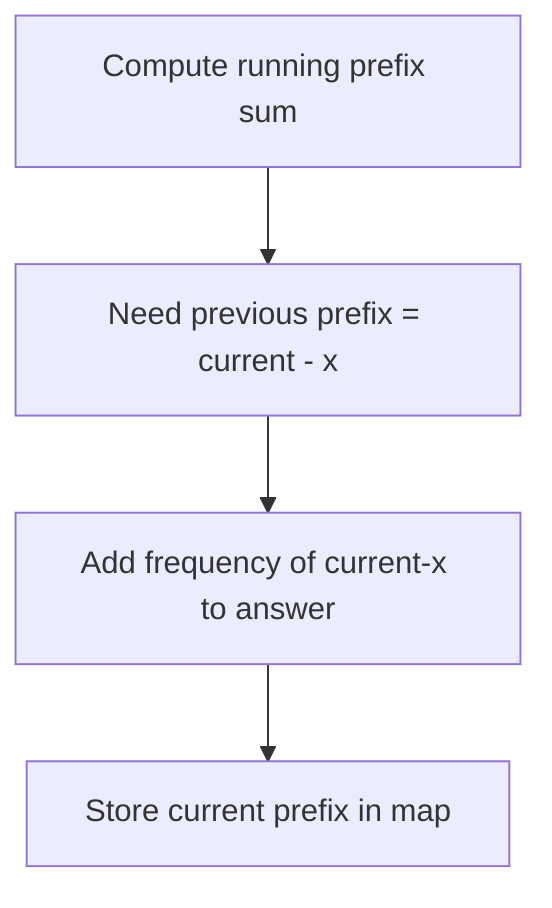

### C++ count only

```cpp
#include <bits/stdc++.h>
using namespace std;

long long countSubarraysWithSumX(vector<int>& a, long long x) {
    map<long long, long long> freq;
    freq[0] = 1;

    long long pref = 0, ans = 0;
    for (int v : a) {
        pref += v;
        ans += freq[pref - x];
        freq[pref]++;
    }
    return ans;
}
```

### C++ print all ranges

```cpp
#include <bits/stdc++.h>
using namespace std;

void printSubarraysWithSumX(vector<int>& a, long long x) {
    map<long long, vector<int>> pos;
    pos[0].push_back(-1);

    long long pref = 0;
    for (int i = 0; i < (int)a.size(); i++) {
        pref += a[i];

        long long need = pref - x;
        for (int leftMinusOne : pos[need]) {
            cout << "[" << leftMinusOne + 1 << ", " << i << "]\n";
        }

        pos[pref].push_back(i);
    }
}
```

---

## 7. Stack Mastery: Next Greater Element

For each index, find the next greater element to the right.

Use a monotonic stack of indices. Traverse from right to left.

```mermaid
flowchart TD
    A[Start from right] --> B{stack not empty and arr[top] <= arr[i]?}
    B -->|yes| C[pop]
    C --> B
    B -->|no| D{stack empty?}
    D -->|yes| E[nge[i] = n]
    D -->|no| F[nge[i] = top]
    E --> G[push i]
    F --> G
    G --> A
```

```cpp
#include <bits/stdc++.h>
using namespace std;

vector<int> nextGreaterIndex(vector<int>& a) {
    int n = a.size();
    vector<int> nge(n, n);
    stack<int> st;

    for (int i = n - 1; i >= 0; i--) {
        while (!st.empty() && a[st.top()] <= a[i]) {
            st.pop();
        }
        if (!st.empty()) nge[i] = st.top();
        st.push(i);
    }
    return nge;
}
```

Amortized complexity is `O(n)` because each index is pushed once and popped at most once.

---

## 8. Trapping Rain Water

For each bar, trapped water depends on the nearest boundary bars.

### Stack approach

When current bar is greater than the stack top, the popped bar can become the bottom of trapped water.

```mermaid
flowchart TD
    A[Loop i from 0 to n-1] --> B{stack not empty and height[top] < height[i]?}
    B -->|yes| C[bottom = pop]
    C --> D{stack empty?}
    D -->|yes| E[break]
    D -->|no| F[left = stack.top]
    F --> G[width = i-left-1]
    G --> H[height = min(a[left],a[i])-a[bottom]]
    H --> I[ans += width*height]
    I --> B
    B -->|no| J[push i]
```

```cpp
#include <bits/stdc++.h>
using namespace std;

int trapRainWater(vector<int>& h) {
    int n = h.size();
    int ans = 0;
    stack<int> st;

    for (int i = 0; i < n; i++) {
        while (!st.empty() && h[st.top()] < h[i]) {
            int bottom = st.top();
            st.pop();

            if (st.empty()) break;

            int left = st.top();
            int width = i - left - 1;
            int height = min(h[left], h[i]) - h[bottom];
            ans += width * height;
        }
        st.push(i);
    }

    return ans;
}
```

---

## 9. Range Mapping / Interval Coverage

Queries:

1. Insert range `[l, r]`
2. Check whether point `x` is covered by any range

### Offline version

Store all left endpoints and right endpoints separately, then sort.

For point `x`:

```text
covered intervals = total intervals - intervals ending before x - intervals starting after x
```

```text
ending before x = count(r < x)
starting after x = count(l > x)
```

Use `lower_bound` and `upper_bound`.

```cpp
#include <bits/stdc++.h>
using namespace std;

bool isCoveredOffline(vector<pair<int,int>>& ranges, int x) {
    vector<int> L, R;
    for (auto [l, r] : ranges) {
        L.push_back(l);
        R.push_back(r);
    }
    sort(L.begin(), L.end());
    sort(R.begin(), R.end());

    int n = ranges.size();
    int startingAfter = n - (upper_bound(L.begin(), L.end(), x) - L.begin());
    int endingBefore = lower_bound(R.begin(), R.end(), x) - R.begin();

    return n - startingAfter - endingBefore > 0;
}
```

### Online version: maintain merged intervals

Use `set<pair<int,int>>` containing non-overlapping intervals.

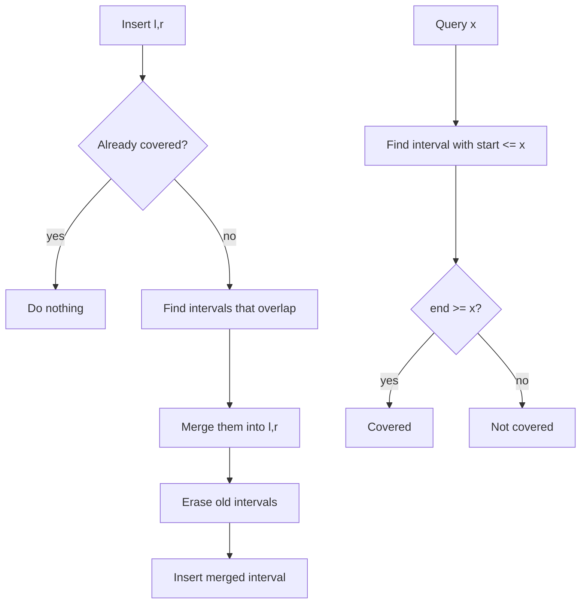

```cpp
#include <bits/stdc++.h>
using namespace std;

struct RangeCover {
    set<pair<int,int>> ranges;

    bool covered(int x) {
        auto it = ranges.upper_bound({x, INT_MAX});
        if (it == ranges.begin()) return false;
        --it;
        return it->second >= x;
    }

    void insertRange(int l, int r) {
        auto it = ranges.lower_bound({l, INT_MIN});

        if (it != ranges.begin()) {
            auto prevIt = prev(it);
            if (prevIt->second >= l - 1) it = prevIt;
        }

        while (it != ranges.end() && it->first <= r + 1) {
            l = min(l, it->first);
            r = max(r, it->second);
            it = ranges.erase(it);
        }

        ranges.insert({l, r});
    }
};
```

---

## 10. Top K Sum

Maintain sum of top `k` elements dynamically.

Two common implementations:

1. Priority queue: good when only removing min/max from top side.
2. Two multisets: better when arbitrary `remove(x)` is needed.

### Two multiset method

- `top`: contains the largest `k` elements.
- `rest`: contains the overflow elements.
- `sumTop`: sum of elements in `top`.

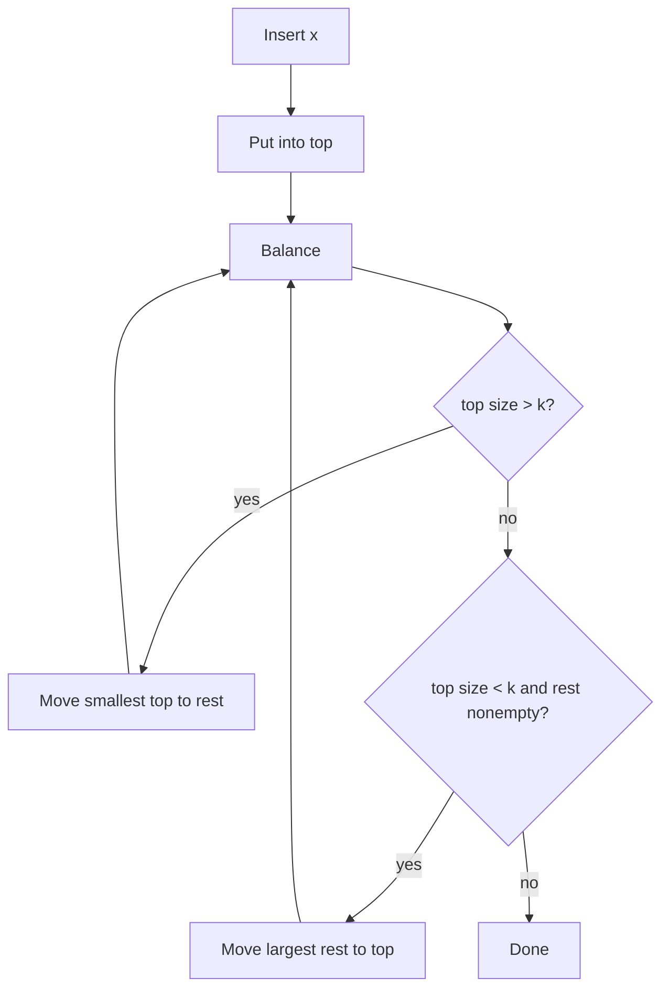

```cpp
#include <bits/stdc++.h>
using namespace std;

struct TopKSum {
    int k;
    long long sumTop = 0;
    multiset<int> top, rest;

    TopKSum(int k) : k(k) {}

    void balance() {
        while ((int)top.size() > k) {
            auto it = top.begin(); // smallest among top k
            int x = *it;
            sumTop -= x;
            top.erase(it);
            rest.insert(x);
        }

        while ((int)top.size() < k && !rest.empty()) {
            auto it = prev(rest.end()); // largest among rest
            int x = *it;
            rest.erase(it);
            top.insert(x);
            sumTop += x;
        }

        while (!top.empty() && !rest.empty() && *top.begin() < *rest.rbegin()) {
            int smallTop = *top.begin();
            int bigRest = *rest.rbegin();

            top.erase(top.begin());
            rest.erase(prev(rest.end()));

            top.insert(bigRest);
            rest.insert(smallTop);

            sumTop += bigRest - smallTop;
        }
    }

    void insert(int x) {
        top.insert(x);
        sumTop += x;
        balance();
    }

    void remove(int x) {
        auto itTop = top.find(x);
        if (itTop != top.end()) {
            top.erase(itTop);
            sumTop -= x;
        } else {
            auto itRest = rest.find(x);
            if (itRest != rest.end()) rest.erase(itRest);
        }
        balance();
    }

    long long getSum() const {
        return sumTop;
    }
};
```

---

## 11. Priority Queue Notes

Default C++ `priority_queue<int>` is a max heap.

```cpp
priority_queue<int> maxHeap;
```

For min heap:

```cpp
priority_queue<int, vector<int>, greater<int>> minHeap;
```

Trick: you can insert negative values in a max heap to simulate a min heap.

```cpp
priority_queue<int> pq;
pq.push(-x);      // insert x
int minimum = -pq.top();
```

Always check before popping:

```cpp
if (!pq.empty()) {
    pq.pop();
}
```

---

## 12. Stack and Queue Basics

### Stack

LIFO: last in, first out.

Operations:

```cpp
stack<int> st;
st.push(x);
st.pop();
int top = st.top();
bool empty = st.empty();
```

### Queue

FIFO: first in, first out.

```cpp
queue<int> q;
q.push(x);
q.pop();
int front = q.front();
bool empty = q.empty();
```

### Implement stack using two queues

Costly pop version:

```cpp
#include <bits/stdc++.h>
using namespace std;

struct StackUsingQueues {
    queue<int> q1, q2;

    void push(int x) {
        q1.push(x);
    }

    int pop() {
        while (q1.size() > 1) {
            q2.push(q1.front());
            q1.pop();
        }
        int ans = q1.front();
        q1.pop();
        swap(q1, q2);
        return ans;
    }

    int top() {
        while (q1.size() > 1) {
            q2.push(q1.front());
            q1.pop();
        }
        int ans = q1.front();
        q2.push(ans);
        q1.pop();
        swap(q1, q2);
        return ans;
    }

    bool empty() const {
        return q1.empty();
    }
};
```

---

## 13. Contribution Technique

Instead of enumerating every subarray/subsequence, calculate how much each element contributes to the final answer.

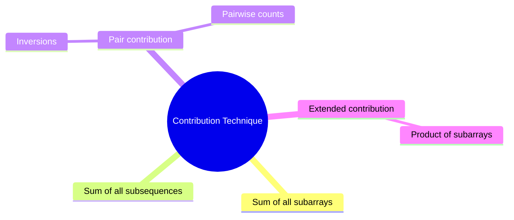

### Sum of all subarrays

Element `a[i]` appears in:

```text
(i + 1) * (n - i)
```

subarrays.

So:

```text
answer = Σ a[i] * (i + 1) * (n - i)
```

```cpp
long long sumOfAllSubarrays(vector<int>& a) {
    long long ans = 0;
    int n = a.size();
    for (int i = 0; i < n; i++) {
        ans += 1LL * a[i] * (i + 1) * (n - i);
    }
    return ans;
}
```

### Sum of all subsequences

Each element appears in `2^(n-1)` subsequences.

```text
answer = Σ a[i] * 2^(n-1)
```

```cpp
long long sumOfAllSubsequences(vector<int>& a) {
    int n = a.size();
    long long ways = 1LL << (n - 1); // only safe for small n
    long long ans = 0;
    for (int x : a) ans += x * ways;
    return ans;
}
```

### Product of all subarrays sum

For each ending position, maintain sum of products of all subarrays ending there.

```text
sop = sop * a[i] + a[i]
ans += sop
```

```cpp
long long sumProductOfAllSubarrays(vector<int>& a) {
    long long ans = 0, sop = 0;
    for (long long x : a) {
        sop = sop * x + x;
        ans += sop;
    }
    return ans;
}
```

---

## 14. Pattern Matching / Coordinate Geometry Printing

For star-pattern questions, first define the canvas:

- rows
- columns
- coordinates `(i, j)`

Then write a function deciding whether a coordinate prints `*` or space.

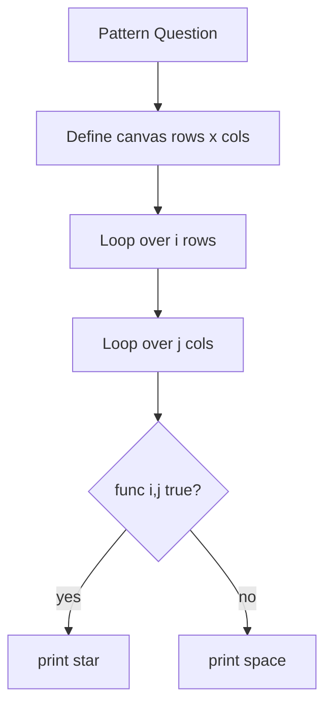

### Template

```cpp
#include <bits/stdc++.h>
using namespace std;

bool printStar(int i, int j, int rows, int cols) {
    // Example: main diagonal
    return i == j;
}

int main() {
    int rows = 5, cols = 5;
    for (int i = 0; i < rows; i++) {
        for (int j = 0; j < cols; j++) {
            cout << (printStar(i, j, rows, cols) ? '*' : ' ');
        }
        cout << '\n';
    }
}
```

### Repeating columns

To repeat after every `k` columns, use modulo:

```cpp
func(i, j % k, rows, k);
```

---

## 15. Molecular Formula Parser

Problem type: parse chemical formula like:

```text
K4(ON(SO3)2)2
```

Expected output is sorted by element names with counts.

### Key ideas

- Use recursion for bracketed subproblems.
- Use `map<string,int>` because final output needs sorted keys.
- Parse element names: capital letter followed by lowercase letters.
- Parse number after element/bracket; default count is `1`.
- Merge maps by adding counts.

```mermaid
flowchart TD
    A[parse range l..r] --> B{Current char}
    B -->|Capital letter| C[Parse element]
    C --> D[Parse number if any]
    D --> E[Add to map]
    B -->|'('| F[Find matching bracket]
    F --> G[Parse inside recursively]
    G --> H[Parse multiplier]
    H --> I[Multiply inside map]
    I --> J[Merge]
    E --> A
    J --> A
```

### C++ parser

```cpp
#include <bits/stdc++.h>
using namespace std;

class FormulaParser {
public:
    string s;
    int n;

    int readNumber(int& i) {
        int num = 0;
        while (i < n && isdigit(s[i])) {
            num = num * 10 + (s[i] - '0');
            i++;
        }
        return num == 0 ? 1 : num;
    }

    string readElement(int& i) {
        string name;
        name += s[i++]; // capital letter
        while (i < n && islower(s[i])) {
            name += s[i++];
        }
        return name;
    }

    map<string, int> parse(int& i) {
        map<string, int> result;

        while (i < n && s[i] != ')') {
            if (isupper(s[i])) {
                string element = readElement(i);
                int count = readNumber(i);
                result[element] += count;
            } else if (s[i] == '(') {
                i++; // skip '('
                auto inside = parse(i);
                i++; // skip ')'
                int multiplier = readNumber(i);

                for (auto [element, count] : inside) {
                    result[element] += count * multiplier;
                }
            }
        }

        return result;
    }

    string countOfAtoms(string formula) {
        s = formula;
        n = s.size();
        int i = 0;
        auto counts = parse(i);

        string ans;
        for (auto [element, count] : counts) {
            ans += element;
            if (count > 1) ans += to_string(count);
        }
        return ans;
    }
};
```

---

## 16. Choosing the Right STL

| Need | STL / Technique |
|---|---|
| LIFO | `stack` |
| FIFO | `queue` |
| min/max top only | `priority_queue` |
| sorted values + duplicates + arbitrary erase | `multiset` |
| key-value frequency | `map` / `unordered_map` |
| range coverage / merged intervals | `set<pair<int,int>>` |
| window min/max in O(n) | monotonic deque |
| next greater/smaller | monotonic stack |
| subarray sum equals x | prefix sum + map |
| median dynamically | two multisets |
| top k dynamically with remove | two multisets |

---

## 17. Common Mistakes

- Using `mset.erase(x)` when you only want to erase one copy. Use `mset.erase(mset.find(x))`.
- Calling `top()`, `front()`, `back()`, `pop()` on an empty STL container.
- Forgetting `i + k` is usually exclusive in window ranges.
- For sliding window, forgetting to remove `arr[i-k]`.
- For prefix sums, forgetting to initialize `freq[0] = 1`.
- For maps/multisets, forgetting logarithmic complexity.
- In custom comparators, never return true for equal items; it may cause runtime issues.

---

## 18. Final Revision Flow

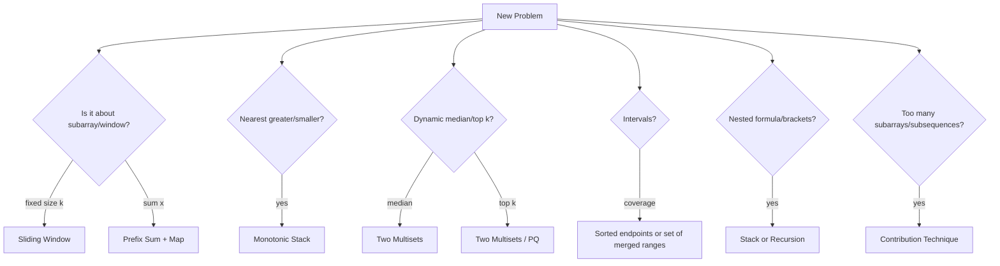

---

## 19. Minimal C++ Setup

```cpp
#include <bits/stdc++.h>
using namespace std;

using ll = long long;

int main() {
    ios::sync_with_stdio(false);
    cin.tie(nullptr);

    // solve here

    return 0;
}
```

