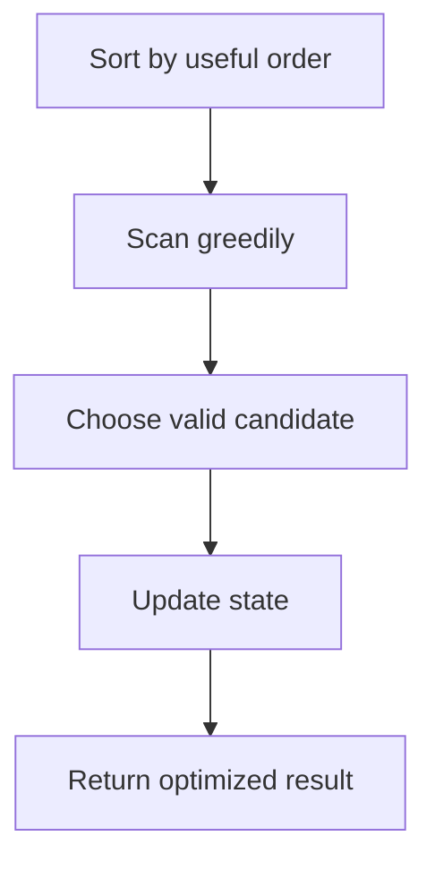
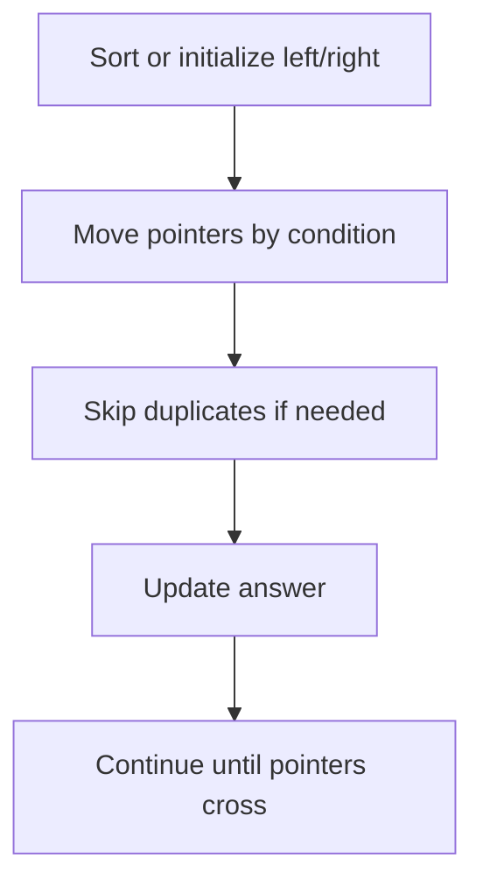
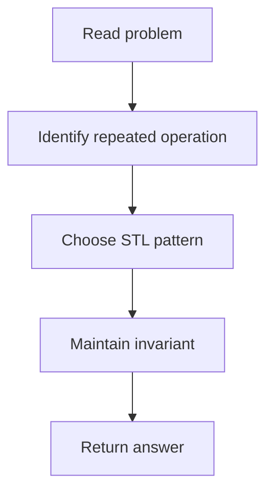
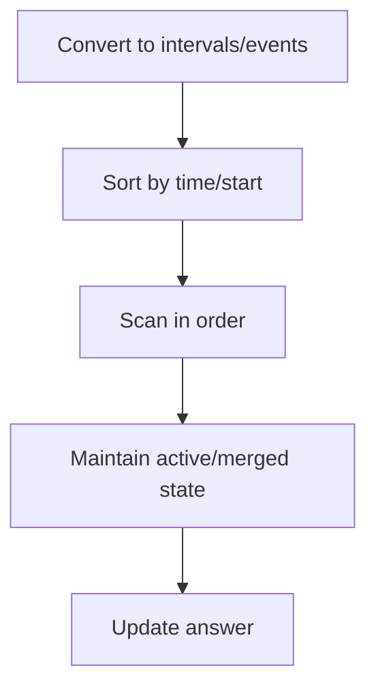
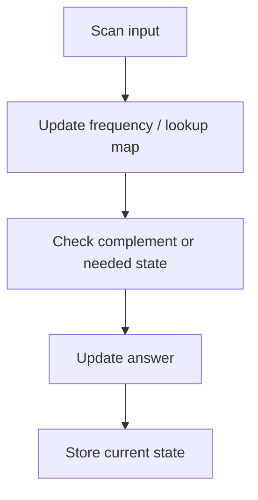
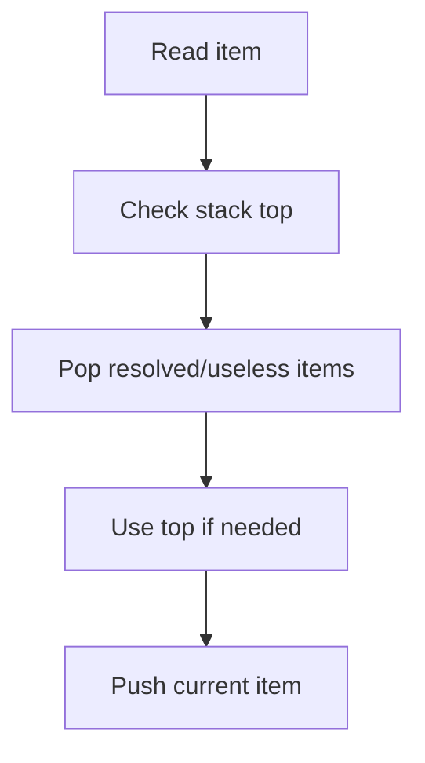

# STL Problem Solutions — Collapsible Hints + Code

> Problem-only version generated from your STL Ultimate Problem Set. Each problem has hints, a Mermaid solution flow, and collapsible solution/code sections.

## Clickable Index

- [Easy — Contains Duplicate](#easy-contains-duplicate)
- [Easy — Merge Sorted Array](#easy-merge-sorted-array)
- [Easy — Move Zeroes](#easy-move-zeroes)
- [Easy — Remove Duplicates from Sorted Array](#easy-remove-duplicates-from-sorted-array)
- [Medium — Sort Colors](#medium-sort-colors)
- [Medium — Next Permutation](#medium-next-permutation)
- [Medium — Merge Intervals](#medium-merge-intervals)
- [Medium — Product of Array Except Self](#medium-product-of-array-except-self)
- [Hard — First Missing Positive](#hard-first-missing-positive)
- [Hard — Trapping Rain Water](#hard-trapping-rain-water)
- [CM — CSES Collecting Numbers](#cm-cses-collecting-numbers)
- [CM — CSES Josephus Problem I](#cm-cses-josephus-problem-i)
- [Easy — Valid Anagram](#easy-valid-anagram)
- [Easy — Valid Palindrome](#easy-valid-palindrome)
- [Easy — Ransom Note](#easy-ransom-note)
- [Medium — Group Anagrams](#medium-group-anagrams)
- [Medium — Longest Substring Without Repeating Characters](#medium-longest-substring-without-repeating-characters)
- [Medium — Minimum Window Substring](#medium-minimum-window-substring)
- [Medium — Decode String](#medium-decode-string)
- [Hard — Text Justification](#hard-text-justification)
- [Hard — Substring with Concatenation of All Words](#hard-substring-with-concatenation-of-all-words)
- [CM — CSES String Matching](#cm-cses-string-matching)
- [Easy — Valid Parentheses](#easy-valid-parentheses)
- [Easy — Baseball Game](#easy-baseball-game)
- [Easy — Remove All Adjacent Duplicates In String](#easy-remove-all-adjacent-duplicates-in-string)
- [Medium — Min Stack](#medium-min-stack)
- [Medium — Evaluate Reverse Polish Notation](#medium-evaluate-reverse-polish-notation)
- [Medium — Daily Temperatures](#medium-daily-temperatures)
- [Hard — Basic Calculator](#hard-basic-calculator)
- [Hard — Largest Rectangle in Histogram](#hard-largest-rectangle-in-histogram)
- [CM — CSES Nearest Smaller Values](#cm-cses-nearest-smaller-values)
- [Easy — Implement Queue using Stacks](#easy-implement-queue-using-stacks)
- [Easy — Number of Recent Calls](#easy-number-of-recent-calls)
- [Medium — Rotting Oranges](#medium-rotting-oranges)
- [Medium — Number of Islands](#medium-number-of-islands)
- [Medium — Open the Lock](#medium-open-the-lock)
- [Hard — Sliding Puzzle](#hard-sliding-puzzle)
- [CM — CSES Labyrinth](#cm-cses-labyrinth)
- [CM — CSES Monsters](#cm-cses-monsters)
- [Easy — Last Stone Weight](#easy-last-stone-weight)
- [Easy — Kth Largest Element in a Stream](#easy-kth-largest-element-in-a-stream)
- [Medium — Kth Largest Element in an Array](#medium-kth-largest-element-in-an-array)
- [Medium — Top K Frequent Elements](#medium-top-k-frequent-elements)
- [Medium — K Closest Points to Origin](#medium-k-closest-points-to-origin)
- [Medium — Task Scheduler](#medium-task-scheduler)
- [Hard — Find Median from Data Stream](#hard-find-median-from-data-stream)
- [Hard — Merge k Sorted Lists](#hard-merge-k-sorted-lists)
- [Hard — IPO](#hard-ipo)
- [CM — CSES Flight Discount](#cm-cses-flight-discount)
- [Easy — Contains Duplicate III](#easy-contains-duplicate-iii)
- [Medium — My Calendar I](#medium-my-calendar-i)
- [Medium — Exam Room](#medium-exam-room)
- [Medium — Time Based Key-Value Store](#medium-time-based-key-value-store)
- [Hard — My Calendar III](#hard-my-calendar-iii)
- [CM — CSES Traffic Lights](#cm-cses-traffic-lights)
- [CM — CSES Room Allocation](#cm-cses-room-allocation)
- [CM — CSES Sliding Median](#cm-cses-sliding-median)
- [Easy — Two Sum](#easy-two-sum)
- [Easy — Majority Element](#easy-majority-element)
- [Easy — First Unique Character in a String](#easy-first-unique-character-in-a-string)
- [Medium — Subarray Sum Equals K](#medium-subarray-sum-equals-k)
- [Medium — Longest Consecutive Sequence](#medium-longest-consecutive-sequence)
- [Medium — LRU Cache](#medium-lru-cache)
- [Hard — All O one Data Structure](#hard-all-o-one-data-structure)
- [CM — CSES Sum of Four Values](#cm-cses-sum-of-four-values)
- [CM — CSES Subarray Sums II](#cm-cses-subarray-sums-ii)
- [Easy — Meeting Rooms](#easy-meeting-rooms)
- [Medium — Non-overlapping Intervals](#medium-non-overlapping-intervals)
- [Medium — Minimum Number of Arrows to Burst Balloons](#medium-minimum-number-of-arrows-to-burst-balloons)
- [Medium — Queue Reconstruction by Height](#medium-queue-reconstruction-by-height)
- [Medium — Largest Number](#medium-largest-number)
- [Hard — Russian Doll Envelopes](#hard-russian-doll-envelopes)
- [Hard — Maximum Profit in Job Scheduling](#hard-maximum-profit-in-job-scheduling)
- [CM — CSES Movie Festival](#cm-cses-movie-festival)
- [CM — CSES Tasks and Deadlines](#cm-cses-tasks-and-deadlines)
- [Easy — Squares of a Sorted Array](#easy-squares-of-a-sorted-array)
- [Easy — Intersection of Two Arrays](#easy-intersection-of-two-arrays)
- [Medium — 3Sum](#medium-3sum)
- [Medium — 4Sum](#medium-4sum)
- [Medium — Find K Closest Elements](#medium-find-k-closest-elements)
- [Hard — Median of Two Sorted Arrays](#hard-median-of-two-sorted-arrays)
- [CM — CSES Sum of Two Values](#cm-cses-sum-of-two-values)
- [CM — CSES Sum of Three Values](#cm-cses-sum-of-three-values)
- [Easy — Binary Search](#easy-binary-search)
- [Easy — Search Insert Position](#easy-search-insert-position)
- [Medium — Find First and Last Position of Element in Sorted Array](#medium-find-first-and-last-position-of-element-in-sorted-array)
- [Medium — Search a 2D Matrix](#medium-search-a-2d-matrix)
- [Medium — Successful Pairs of Spells and Potions](#medium-successful-pairs-of-spells-and-potions)
- [Hard — Count of Smaller Numbers After Self](#hard-count-of-smaller-numbers-after-self)
- [CM — CSES Factory Machines](#cm-cses-factory-machines)
- [CM — CSES Subarray Sums I](#cm-cses-subarray-sums-i)
- [Easy — Next Greater Element I](#easy-next-greater-element-i)
- [Medium — Online Stock Span](#medium-online-stock-span)
- [Medium — Sum of Subarray Minimums](#medium-sum-of-subarray-minimums)
- [Hard — Maximal Rectangle](#hard-maximal-rectangle)
- [Medium — Sliding Window Maximum](#medium-sliding-window-maximum)
- [Medium — Longest Continuous Subarray With Absolute Diff Less Than or Equal to Limit](#medium-longest-continuous-subarray-with-absolute-diff-less-than-or-equal-to-limit)
- [Medium — Constrained Subsequence Sum](#medium-constrained-subsequence-sum)
- [Hard — Shortest Subarray with Sum at Least K](#hard-shortest-subarray-with-sum-at-least-k)
- [CM — CSES Sliding Window Minimum](#cm-cses-sliding-window-minimum)
- [Hard — Sliding Window Median](#hard-sliding-window-median)
- [CM — CSES Sliding Cost](#cm-cses-sliding-cost)
- [Medium — Insert Interval](#medium-insert-interval)
- [Medium — Meeting Rooms II](#medium-meeting-rooms-ii)
- [Medium — Car Pooling](#medium-car-pooling)
- [Hard — Employee Free Time](#hard-employee-free-time)
- [CM — CSES Restaurant Customers](#cm-cses-restaurant-customers)
- [Hard — Maximum Performance of a Team](#hard-maximum-performance-of-a-team)
- [CM — CSES Concert Tickets](#cm-cses-concert-tickets)
- [Medium — Reverse Pairs](#medium-reverse-pairs)
- [Hard — Create Sorted Array through Instructions](#hard-create-sorted-array-through-instructions)
- [CM — CSES Nested Ranges Count](#cm-cses-nested-ranges-count)
- [CM — CSES Salary Queries](#cm-cses-salary-queries)
- [Medium — Partition Equal Subset Sum](#medium-partition-equal-subset-sum)
- [Medium — Last Stone Weight II](#medium-last-stone-weight-ii)
- [CM — CSES Money Sums](#cm-cses-money-sums)
- [CM — CSES School Excursion](#cm-cses-school-excursion)
- [CM — CSES List Removals](#cm-cses-list-removals)
- [CM — CSES Josephus Problem II](#cm-cses-josephus-problem-ii)
- [Easy — CSES Weird Algorithm](#easy-cses-weird-algorithm)
- [CM — CSES Nested Ranges Check](#cm-cses-nested-ranges-check)
- [CM — CSES Movie Festival II](#cm-cses-movie-festival-ii)
- [CM — CSES Collecting Numbers II](#cm-cses-collecting-numbers-ii)

---

<a id="easy-contains-duplicate"></a>

## 1. Easy — Contains Duplicate

**Platform:** LeetCode  
**Link:** [Contains Duplicate](https://leetcode.com/problems/contains-duplicate/)  
**Pattern:** `sort or set`  
**Form:** `duplicates`

### Mermaid Solution Flow



<details>
<summary>Hints</summary>

- Form: **duplicates**
- Pattern: **sort or set**
- Tactic: **sort and compare neighbours**
- Core intuition: duplicates become adjacent
- First write brute force, then identify which repeated operation the STL structure removes.

</details>

<details>
<summary>Approach</summary>

- **Brute idea:** Try direct simulation / nested loops based on the problem form.
- **Bottleneck:** Repeated operation becomes expensive.
- **Optimal idea:** Use **sort or set** with tactic: **sort and compare neighbours**.
- **Invariant:** The chosen STL structure always keeps the needed candidates/state ready.
- **Complexity:** Usually `O(n log n)` or `O(log n)` per operation.

</details>

<details>
<summary>Code / Template</summary>

```cpp
bool containsDuplicate(vector<int>& nums) {
    unordered_set<int> seen;

    for (int x : nums) {
        if (seen.count(x)) return true;
        seen.insert(x);
    }

    return false;
}
```

</details>

<details>
<summary>1-Minute Mental Map</summary>

```text
Problem clue : duplicates
Think        : sort or set
Do           : sort and compare neighbours
Why          : duplicates become adjacent
```

</details>

[Back to index](#clickable-index)

---

<a id="easy-merge-sorted-array"></a>

## 2. Easy — Merge Sorted Array

**Platform:** LeetCode  
**Link:** [Merge Sorted Array](https://leetcode.com/problems/merge-sorted-array/)  
**Pattern:** `two pointers`  
**Form:** `merge arrays`

### Mermaid Solution Flow



<details>
<summary>Hints</summary>

- Form: **merge arrays**
- Pattern: **two pointers**
- Tactic: **fill from back**
- Core intuition: largest final position is safe
- First write brute force, then identify which repeated operation the STL structure removes.

</details>

<details>
<summary>Approach</summary>

- **Brute idea:** Try direct simulation / nested loops based on the problem form.
- **Bottleneck:** Repeated operation becomes expensive.
- **Optimal idea:** Use **two pointers** with tactic: **fill from back**.
- **Invariant:** The chosen STL structure always keeps the needed candidates/state ready.
- **Complexity:** Usually `O(n)`.

</details>

<details>
<summary>Code / Template</summary>

```cpp
void merge(vector<int>& nums1, int m, vector<int>& nums2, int n) {
    int i = m - 1;
    int j = n - 1;
    int k = m + n - 1;

    while (j >= 0) {
        if (i >= 0 && nums1[i] > nums2[j]) {
            nums1[k--] = nums1[i--];
        } else {
            nums1[k--] = nums2[j--];
        }
    }
}
```

</details>

<details>
<summary>1-Minute Mental Map</summary>

```text
Problem clue : merge arrays
Think        : two pointers
Do           : fill from back
Why          : largest final position is safe
```

</details>

[Back to index](#clickable-index)

---

<a id="easy-move-zeroes"></a>

## 3. Easy — Move Zeroes

**Platform:** LeetCode  
**Link:** [Move Zeroes](https://leetcode.com/problems/move-zeroes/)  
**Pattern:** `write pointer`  
**Form:** `stable partition`

### Mermaid Solution Flow



<details>
<summary>Hints</summary>

- Form: **stable partition**
- Pattern: **write pointer**
- Tactic: **overwrite nonzero**
- Core intuition: keep order with one pass
- First write brute force, then identify which repeated operation the STL structure removes.

</details>

<details>
<summary>Approach</summary>

- **Brute idea:** Try direct simulation / nested loops based on the problem form.
- **Bottleneck:** Repeated operation becomes expensive.
- **Optimal idea:** Use **write pointer** with tactic: **overwrite nonzero**.
- **Invariant:** The chosen STL structure always keeps the needed candidates/state ready.
- **Complexity:** Depends on implementation; target should match constraints..

</details>

<details>
<summary>Code / Template</summary>

```cpp
// Template for pattern: write pointer
// Form: stable partition

void solve() {
    // 1. Identify repeated operation.
    // 2. Use STL structure for: overwrite nonzero.
    // 3. Maintain invariant.
    // 4. Return answer.
}
```

</details>

<details>
<summary>1-Minute Mental Map</summary>

```text
Problem clue : stable partition
Think        : write pointer
Do           : overwrite nonzero
Why          : keep order with one pass
```

</details>

[Back to index](#clickable-index)

---

<a id="easy-remove-duplicates-from-sorted-array"></a>

## 4. Easy — Remove Duplicates from Sorted Array

**Platform:** LeetCode  
**Link:** [Remove Duplicates from Sorted Array](https://leetcode.com/problems/remove-duplicates-from-sorted-array/)  
**Pattern:** `slow-fast pointer`  
**Form:** `compact sorted array`

### Mermaid Solution Flow


<details>
<summary>Hints</summary>

- Form: **compact sorted array**
- Pattern: **slow-fast pointer**
- Tactic: **write unique**
- Core intuition: sorted duplicates are grouped
- First write brute force, then identify which repeated operation the STL structure removes.

</details>

<details>
<summary>Approach</summary>

- **Brute idea:** Try direct simulation / nested loops based on the problem form.
- **Bottleneck:** Repeated operation becomes expensive.
- **Optimal idea:** Use **slow-fast pointer** with tactic: **write unique**.
- **Invariant:** The chosen STL structure always keeps the needed candidates/state ready.
- **Complexity:** Depends on implementation; target should match constraints..

</details>

<details>
<summary>Code / Template</summary>

```cpp
sort(a.begin(), a.end());

int l = 0;
int r = (int)a.size() - 1;

while (l < r) {
    int sum = a[l] + a[r];

    if (sum == target) {
        // found
        l++;
        r--;
    } else if (sum < target) {
        l++;
    } else {
        r--;
    }
}
```

</details>

<details>
<summary>1-Minute Mental Map</summary>

```text
Problem clue : compact sorted array
Think        : slow-fast pointer
Do           : write unique
Why          : sorted duplicates are grouped
```

</details>

[Back to index](#clickable-index)

---

<a id="medium-sort-colors"></a>

## 5. Medium — Sort Colors

**Platform:** LeetCode  
**Link:** [Sort Colors](https://leetcode.com/problems/sort-colors/)  
**Pattern:** `Dutch flag`  
**Form:** `3-way partition`

### Mermaid Solution Flow


<details>
<summary>Hints</summary>

- Form: **3-way partition**
- Pattern: **Dutch flag**
- Tactic: **low mid high**
- Core intuition: place each color region
- First write brute force, then identify which repeated operation the STL structure removes.

</details>

<details>
<summary>Approach</summary>

- **Brute idea:** Try direct simulation / nested loops based on the problem form.
- **Bottleneck:** Repeated operation becomes expensive.
- **Optimal idea:** Use **Dutch flag** with tactic: **low mid high**.
- **Invariant:** The chosen STL structure always keeps the needed candidates/state ready.
- **Complexity:** Depends on implementation; target should match constraints..

</details>

<details>
<summary>Code / Template</summary>

```cpp
// Template for pattern: Dutch flag
// Form: 3-way partition

void solve() {
    // 1. Identify repeated operation.
    // 2. Use STL structure for: low mid high.
    // 3. Maintain invariant.
    // 4. Return answer.
}
```

</details>

<details>
<summary>1-Minute Mental Map</summary>

```text
Problem clue : 3-way partition
Think        : Dutch flag
Do           : low mid high
Why          : place each color region
```

</details>

[Back to index](#clickable-index)

---

<a id="medium-next-permutation"></a>

## 6. Medium — Next Permutation

**Platform:** LeetCode  
**Link:** [Next Permutation](https://leetcode.com/problems/next-permutation/)  
**Pattern:** `STL algorithm logic`  
**Form:** `permutation`

### Mermaid Solution Flow


<details>
<summary>Hints</summary>

- Form: **permutation**
- Pattern: **STL algorithm logic**
- Tactic: **pivot suffix reverse**
- Core intuition: next lexicographic order changes suffix
- First write brute force, then identify which repeated operation the STL structure removes.

</details>

<details>
<summary>Approach</summary>

- **Brute idea:** Try direct simulation / nested loops based on the problem form.
- **Bottleneck:** Repeated operation becomes expensive.
- **Optimal idea:** Use **STL algorithm logic** with tactic: **pivot suffix reverse**.
- **Invariant:** The chosen STL structure always keeps the needed candidates/state ready.
- **Complexity:** Depends on implementation; target should match constraints..

</details>

<details>
<summary>Code / Template</summary>

```cpp
// Template for pattern: STL algorithm logic
// Form: permutation

void solve() {
    // 1. Identify repeated operation.
    // 2. Use STL structure for: pivot suffix reverse.
    // 3. Maintain invariant.
    // 4. Return answer.
}
```

</details>

<details>
<summary>1-Minute Mental Map</summary>

```text
Problem clue : permutation
Think        : STL algorithm logic
Do           : pivot suffix reverse
Why          : next lexicographic order changes suffix
```

</details>

[Back to index](#clickable-index)

---

<a id="medium-merge-intervals"></a>

## 7. Medium — Merge Intervals

**Platform:** LeetCode  
**Link:** [Merge Intervals](https://leetcode.com/problems/merge-intervals/)  
**Pattern:** `sort and merge`  
**Form:** `intervals`

### Mermaid Solution Flow



<details>
<summary>Hints</summary>

- Form: **intervals**
- Pattern: **sort and merge**
- Tactic: **compare start with current end**
- Core intuition: overlap extends interval
- First write brute force, then identify which repeated operation the STL structure removes.

</details>

<details>
<summary>Approach</summary>

- **Brute idea:** Try direct simulation / nested loops based on the problem form.
- **Bottleneck:** Repeated operation becomes expensive.
- **Optimal idea:** Use **sort and merge** with tactic: **compare start with current end**.
- **Invariant:** The chosen STL structure always keeps the needed candidates/state ready.
- **Complexity:** Usually `O(n log n)`.

</details>

<details>
<summary>Code / Template</summary>

```cpp
vector<vector<int>> merge(vector<vector<int>>& intervals) {
    sort(intervals.begin(), intervals.end());

    vector<vector<int>> ans;

    for (auto cur : intervals) {
        if (ans.empty() || ans.back()[1] < cur[0]) {
            ans.push_back(cur);
        } else {
            ans.back()[1] = max(ans.back()[1], cur[1]);
        }
    }

    return ans;
}
```

</details>

<details>
<summary>1-Minute Mental Map</summary>

```text
Problem clue : intervals
Think        : sort and merge
Do           : compare start with current end
Why          : overlap extends interval
```

</details>

[Back to index](#clickable-index)

---

<a id="medium-product-of-array-except-self"></a>

## 8. Medium — Product of Array Except Self

**Platform:** LeetCode  
**Link:** [Product of Array Except Self](https://leetcode.com/problems/product-of-array-except-self/)  
**Pattern:** `prefix suffix`  
**Form:** `array scan`

### Mermaid Solution Flow


<details>
<summary>Hints</summary>

- Form: **array scan**
- Pattern: **prefix suffix**
- Tactic: **two passes**
- Core intuition: answer is left product times right product
- First write brute force, then identify which repeated operation the STL structure removes.

</details>

<details>
<summary>Approach</summary>

- **Brute idea:** Try direct simulation / nested loops based on the problem form.
- **Bottleneck:** Repeated operation becomes expensive.
- **Optimal idea:** Use **prefix suffix** with tactic: **two passes**.
- **Invariant:** The chosen STL structure always keeps the needed candidates/state ready.
- **Complexity:** Usually `O(n)`.

</details>

<details>
<summary>Code / Template</summary>

```cpp
// Template for pattern: prefix suffix
// Form: array scan

void solve() {
    // 1. Identify repeated operation.
    // 2. Use STL structure for: two passes.
    // 3. Maintain invariant.
    // 4. Return answer.
}
```

</details>

<details>
<summary>1-Minute Mental Map</summary>

```text
Problem clue : array scan
Think        : prefix suffix
Do           : two passes
Why          : answer is left product times right product
```

</details>

[Back to index](#clickable-index)

---

<a id="hard-first-missing-positive"></a>

## 9. Hard — First Missing Positive

**Platform:** LeetCode  
**Link:** [First Missing Positive](https://leetcode.com/problems/first-missing-positive/)  
**Pattern:** `cyclic sort`  
**Form:** `index placement`

### Mermaid Solution Flow


<details>
<summary>Hints</summary>

- Form: **index placement**
- Pattern: **cyclic sort**
- Tactic: **put x at x minus one**
- Core intuition: array index acts as hash
- First write brute force, then identify which repeated operation the STL structure removes.

</details>

<details>
<summary>Approach</summary>

- **Brute idea:** Try direct simulation / nested loops based on the problem form.
- **Bottleneck:** Repeated operation becomes expensive.
- **Optimal idea:** Use **cyclic sort** with tactic: **put x at x minus one**.
- **Invariant:** The chosen STL structure always keeps the needed candidates/state ready.
- **Complexity:** Usually `O(n log n)`.

</details>

<details>
<summary>Code / Template</summary>

```cpp
sort(a.begin(), a.end());

int l = 0;
int r = (int)a.size() - 1;

while (l < r) {
    int sum = a[l] + a[r];

    if (sum == target) {
        // found
        l++;
        r--;
    } else if (sum < target) {
        l++;
    } else {
        r--;
    }
}
```

</details>

<details>
<summary>1-Minute Mental Map</summary>

```text
Problem clue : index placement
Think        : cyclic sort
Do           : put x at x minus one
Why          : array index acts as hash
```

</details>

[Back to index](#clickable-index)

---

<a id="hard-trapping-rain-water"></a>

## 10. Hard — Trapping Rain Water

**Platform:** LeetCode  
**Link:** [Trapping Rain Water](https://leetcode.com/problems/trapping-rain-water/)  
**Pattern:** `two pointers or prefix max`  
**Form:** `boundary arrays`

### Mermaid Solution Flow


<details>
<summary>Hints</summary>

- Form: **boundary arrays**
- Pattern: **two pointers or prefix max**
- Tactic: **left max right max**
- Core intuition: water depends on smaller wall
- First write brute force, then identify which repeated operation the STL structure removes.

</details>

<details>
<summary>Approach</summary>

- **Brute idea:** Try direct simulation / nested loops based on the problem form.
- **Bottleneck:** Repeated operation becomes expensive.
- **Optimal idea:** Use **two pointers or prefix max** with tactic: **left max right max**.
- **Invariant:** The chosen STL structure always keeps the needed candidates/state ready.
- **Complexity:** Usually `O(n)`.

</details>

<details>
<summary>Code / Template</summary>

```cpp
sort(a.begin(), a.end());

int l = 0;
int r = (int)a.size() - 1;

while (l < r) {
    int sum = a[l] + a[r];

    if (sum == target) {
        // found
        l++;
        r--;
    } else if (sum < target) {
        l++;
    } else {
        r--;
    }
}
```

</details>

<details>
<summary>1-Minute Mental Map</summary>

```text
Problem clue : boundary arrays
Think        : two pointers or prefix max
Do           : left max right max
Why          : water depends on smaller wall
```

</details>

[Back to index](#clickable-index)

---

<a id="cm-cses-collecting-numbers"></a>

## 11. CM — CSES Collecting Numbers

**Platform:** CSES  
**Link:** [CSES Collecting Numbers](https://cses.fi/problemset/task/2216)  
**Pattern:** `positions array`  
**Form:** `permutation order`

### Mermaid Solution Flow


<details>
<summary>Hints</summary>

- Form: **permutation order**
- Pattern: **positions array**
- Tactic: **count breaks**
- Core intuition: new round starts when position decreases
- First write brute force, then identify which repeated operation the STL structure removes.

</details>

<details>
<summary>Approach</summary>

- **Brute idea:** Try direct simulation / nested loops based on the problem form.
- **Bottleneck:** Repeated operation becomes expensive.
- **Optimal idea:** Use **positions array** with tactic: **count breaks**.
- **Invariant:** The chosen STL structure always keeps the needed candidates/state ready.
- **Complexity:** Depends on implementation; target should match constraints..

</details>

<details>
<summary>Code / Template</summary>

```cpp
// Template for pattern: positions array
// Form: permutation order

void solve() {
    // 1. Identify repeated operation.
    // 2. Use STL structure for: count breaks.
    // 3. Maintain invariant.
    // 4. Return answer.
}
```

</details>

<details>
<summary>1-Minute Mental Map</summary>

```text
Problem clue : permutation order
Think        : positions array
Do           : count breaks
Why          : new round starts when position decreases
```

</details>

[Back to index](#clickable-index)

---

<a id="cm-cses-josephus-problem-i"></a>

## 12. CM — CSES Josephus Problem I

**Platform:** CSES  
**Link:** [CSES Josephus Problem I](https://cses.fi/problemset/task/2162)  
**Pattern:** `queue/vector`  
**Form:** `simulation`

### Mermaid Solution Flow


<details>
<summary>Hints</summary>

- Form: **simulation**
- Pattern: **queue/vector**
- Tactic: **rotate remove**
- Core intuition: circular process needs efficient order
- First write brute force, then identify which repeated operation the STL structure removes.

</details>

<details>
<summary>Approach</summary>

- **Brute idea:** Try direct simulation / nested loops based on the problem form.
- **Bottleneck:** Repeated operation becomes expensive.
- **Optimal idea:** Use **queue/vector** with tactic: **rotate remove**.
- **Invariant:** The chosen STL structure always keeps the needed candidates/state ready.
- **Complexity:** Depends on implementation; target should match constraints..

</details>

<details>
<summary>Code / Template</summary>

```cpp
// Template for pattern: queue/vector
// Form: simulation

void solve() {
    // 1. Identify repeated operation.
    // 2. Use STL structure for: rotate remove.
    // 3. Maintain invariant.
    // 4. Return answer.
}
```

</details>

<details>
<summary>1-Minute Mental Map</summary>

```text
Problem clue : simulation
Think        : queue/vector
Do           : rotate remove
Why          : circular process needs efficient order
```

</details>

[Back to index](#clickable-index)

---

<a id="easy-valid-anagram"></a>

## 13. Easy — Valid Anagram

**Platform:** LeetCode  
**Link:** [Valid Anagram](https://leetcode.com/problems/valid-anagram/)  
**Pattern:** `count array`  
**Form:** `frequency`

### Mermaid Solution Flow



<details>
<summary>Hints</summary>

- Form: **frequency**
- Pattern: **count array**
- Tactic: **compare counts**
- Core intuition: same letters means same count vector
- First write brute force, then identify which repeated operation the STL structure removes.

</details>

<details>
<summary>Approach</summary>

- **Brute idea:** Try direct simulation / nested loops based on the problem form.
- **Bottleneck:** Repeated operation becomes expensive.
- **Optimal idea:** Use **count array** with tactic: **compare counts**.
- **Invariant:** The chosen STL structure always keeps the needed candidates/state ready.
- **Complexity:** Depends on implementation; target should match constraints..

</details>

<details>
<summary>Code / Template</summary>

```cpp
bool isAnagram(string s, string t) {
    if (s.size() != t.size()) return false;

    array<int, 26> cnt{};

    for (char c : s) cnt[c - 'a']++;
    for (char c : t) cnt[c - 'a']--;

    for (int x : cnt) {
        if (x != 0) return false;
    }

    return true;
}
```

</details>

<details>
<summary>1-Minute Mental Map</summary>

```text
Problem clue : frequency
Think        : count array
Do           : compare counts
Why          : same letters means same count vector
```

</details>

[Back to index](#clickable-index)

---

<a id="easy-valid-palindrome"></a>

## 14. Easy — Valid Palindrome

**Platform:** LeetCode  
**Link:** [Valid Palindrome](https://leetcode.com/problems/valid-palindrome/)  
**Pattern:** `two pointers`  
**Form:** `palindrome`

### Mermaid Solution Flow


<details>
<summary>Hints</summary>

- Form: **palindrome**
- Pattern: **two pointers**
- Tactic: **skip non-alnum**
- Core intuition: compare mirrored valid chars
- First write brute force, then identify which repeated operation the STL structure removes.

</details>

<details>
<summary>Approach</summary>

- **Brute idea:** Try direct simulation / nested loops based on the problem form.
- **Bottleneck:** Repeated operation becomes expensive.
- **Optimal idea:** Use **two pointers** with tactic: **skip non-alnum**.
- **Invariant:** The chosen STL structure always keeps the needed candidates/state ready.
- **Complexity:** Usually `O(n)`.

</details>

<details>
<summary>Code / Template</summary>

```cpp
sort(a.begin(), a.end());

int l = 0;
int r = (int)a.size() - 1;

while (l < r) {
    int sum = a[l] + a[r];

    if (sum == target) {
        // found
        l++;
        r--;
    } else if (sum < target) {
        l++;
    } else {
        r--;
    }
}
```

</details>

<details>
<summary>1-Minute Mental Map</summary>

```text
Problem clue : palindrome
Think        : two pointers
Do           : skip non-alnum
Why          : compare mirrored valid chars
```

</details>

[Back to index](#clickable-index)

---

<a id="easy-ransom-note"></a>

## 15. Easy — Ransom Note

**Platform:** LeetCode  
**Link:** [Ransom Note](https://leetcode.com/problems/ransom-note/)  
**Pattern:** `count chars`  
**Form:** `frequency need`

### Mermaid Solution Flow


<details>
<summary>Hints</summary>

- Form: **frequency need**
- Pattern: **count chars**
- Tactic: **decrement available**
- Core intuition: magazine supplies letters
- First write brute force, then identify which repeated operation the STL structure removes.

</details>

<details>
<summary>Approach</summary>

- **Brute idea:** Try direct simulation / nested loops based on the problem form.
- **Bottleneck:** Repeated operation becomes expensive.
- **Optimal idea:** Use **count chars** with tactic: **decrement available**.
- **Invariant:** The chosen STL structure always keeps the needed candidates/state ready.
- **Complexity:** Depends on implementation; target should match constraints..

</details>

<details>
<summary>Code / Template</summary>

```cpp
unordered_map<int,int> freq;

for (int x : a) {
    freq[x]++;
}

// Example: iterate frequencies
for (auto [value, count] : freq) {
    // process value and count
}
```

</details>

<details>
<summary>1-Minute Mental Map</summary>

```text
Problem clue : frequency need
Think        : count chars
Do           : decrement available
Why          : magazine supplies letters
```

</details>

[Back to index](#clickable-index)

---

<a id="medium-group-anagrams"></a>

## 16. Medium — Group Anagrams

**Platform:** LeetCode  
**Link:** [Group Anagrams](https://leetcode.com/problems/group-anagrams/)  
**Pattern:** `map by key`  
**Form:** `grouping`

### Mermaid Solution Flow


<details>
<summary>Hints</summary>

- Form: **grouping**
- Pattern: **map by key**
- Tactic: **sorted string as key**
- Core intuition: anagrams share canonical form
- First write brute force, then identify which repeated operation the STL structure removes.

</details>

<details>
<summary>Approach</summary>

- **Brute idea:** Try direct simulation / nested loops based on the problem form.
- **Bottleneck:** Repeated operation becomes expensive.
- **Optimal idea:** Use **map by key** with tactic: **sorted string as key**.
- **Invariant:** The chosen STL structure always keeps the needed candidates/state ready.
- **Complexity:** Usually `O(n log n)` or `O(log n)` per operation.

</details>

<details>
<summary>Code / Template</summary>

```cpp
unordered_map<int,int> freq;

for (int x : a) {
    freq[x]++;
}

// Example: iterate frequencies
for (auto [value, count] : freq) {
    // process value and count
}
```

</details>

<details>
<summary>1-Minute Mental Map</summary>

```text
Problem clue : grouping
Think        : map by key
Do           : sorted string as key
Why          : anagrams share canonical form
```

</details>

[Back to index](#clickable-index)

---

<a id="medium-longest-substring-without-repeating-characters"></a>

## 17. Medium — Longest Substring Without Repeating Characters

**Platform:** LeetCode  
**Link:** [Longest Substring Without Repeating Characters](https://leetcode.com/problems/longest-substring-without-repeating-characters/)  
**Pattern:** `sliding set/map`  
**Form:** `window`

### Mermaid Solution Flow


<details>
<summary>Hints</summary>

- Form: **window**
- Pattern: **sliding set/map**
- Tactic: **move left past duplicate**
- Core intuition: window invariant has unique chars
- First write brute force, then identify which repeated operation the STL structure removes.

</details>

<details>
<summary>Approach</summary>

- **Brute idea:** Try direct simulation / nested loops based on the problem form.
- **Bottleneck:** Repeated operation becomes expensive.
- **Optimal idea:** Use **sliding set/map** with tactic: **move left past duplicate**.
- **Invariant:** The chosen STL structure always keeps the needed candidates/state ready.
- **Complexity:** Usually `O(n log n)` or `O(log n)` per operation.

</details>

<details>
<summary>Code / Template</summary>

```cpp
unordered_map<int,int> freq;

for (int x : a) {
    freq[x]++;
}

// Example: iterate frequencies
for (auto [value, count] : freq) {
    // process value and count
}
```

</details>

<details>
<summary>1-Minute Mental Map</summary>

```text
Problem clue : window
Think        : sliding set/map
Do           : move left past duplicate
Why          : window invariant has unique chars
```

</details>

[Back to index](#clickable-index)

---

<a id="medium-minimum-window-substring"></a>

## 18. Medium — Minimum Window Substring

**Platform:** LeetCode  
**Link:** [Minimum Window Substring](https://leetcode.com/problems/minimum-window-substring/)  
**Pattern:** `map counts`  
**Form:** `covering window`

### Mermaid Solution Flow


<details>
<summary>Hints</summary>

- Form: **covering window**
- Pattern: **map counts**
- Tactic: **expand then shrink**
- Core intuition: smallest valid window after coverage
- First write brute force, then identify which repeated operation the STL structure removes.

</details>

<details>
<summary>Approach</summary>

- **Brute idea:** Try direct simulation / nested loops based on the problem form.
- **Bottleneck:** Repeated operation becomes expensive.
- **Optimal idea:** Use **map counts** with tactic: **expand then shrink**.
- **Invariant:** The chosen STL structure always keeps the needed candidates/state ready.
- **Complexity:** Usually `O(n log n)` or `O(log n)` per operation.

</details>

<details>
<summary>Code / Template</summary>

```cpp
unordered_map<int,int> freq;

for (int x : a) {
    freq[x]++;
}

// Example: iterate frequencies
for (auto [value, count] : freq) {
    // process value and count
}
```

</details>

<details>
<summary>1-Minute Mental Map</summary>

```text
Problem clue : covering window
Think        : map counts
Do           : expand then shrink
Why          : smallest valid window after coverage
```

</details>

[Back to index](#clickable-index)

---

<a id="medium-decode-string"></a>

## 19. Medium — Decode String

**Platform:** LeetCode  
**Link:** [Decode String](https://leetcode.com/problems/decode-string/)  
**Pattern:** `stack`  
**Form:** `nested parsing`

### Mermaid Solution Flow



<details>
<summary>Hints</summary>

- Form: **nested parsing**
- Pattern: **stack**
- Tactic: **save previous state**
- Core intuition: brackets nest last-in-first-out
- First write brute force, then identify which repeated operation the STL structure removes.

</details>

<details>
<summary>Approach</summary>

- **Brute idea:** Try direct simulation / nested loops based on the problem form.
- **Bottleneck:** Repeated operation becomes expensive.
- **Optimal idea:** Use **stack** with tactic: **save previous state**.
- **Invariant:** The chosen STL structure always keeps the needed candidates/state ready.
- **Complexity:** Depends on implementation; target should match constraints..

</details>

<details>
<summary>Code / Template</summary>

```cpp
// Template for pattern: stack
// Form: nested parsing

void solve() {
    // 1. Identify repeated operation.
    // 2. Use STL structure for: save previous state.
    // 3. Maintain invariant.
    // 4. Return answer.
}
```

</details>

<details>
<summary>1-Minute Mental Map</summary>

```text
Problem clue : nested parsing
Think        : stack
Do           : save previous state
Why          : brackets nest last-in-first-out
```

</details>

[Back to index](#clickable-index)

---

<a id="hard-text-justification"></a>

## 20. Hard — Text Justification

**Platform:** LeetCode  
**Link:** [Text Justification](https://leetcode.com/problems/text-justification/)  
**Pattern:** `vector group`  
**Form:** `formatting`

### Mermaid Solution Flow


<details>
<summary>Hints</summary>

- Form: **formatting**
- Pattern: **vector group**
- Tactic: **distribute spaces**
- Core intuition: each line is greedy group
- First write brute force, then identify which repeated operation the STL structure removes.

</details>

<details>
<summary>Approach</summary>

- **Brute idea:** Try direct simulation / nested loops based on the problem form.
- **Bottleneck:** Repeated operation becomes expensive.
- **Optimal idea:** Use **vector group** with tactic: **distribute spaces**.
- **Invariant:** The chosen STL structure always keeps the needed candidates/state ready.
- **Complexity:** Depends on implementation; target should match constraints..

</details>

<details>
<summary>Code / Template</summary>

```cpp
// Template for pattern: vector group
// Form: formatting

void solve() {
    // 1. Identify repeated operation.
    // 2. Use STL structure for: distribute spaces.
    // 3. Maintain invariant.
    // 4. Return answer.
}
```

</details>

<details>
<summary>1-Minute Mental Map</summary>

```text
Problem clue : formatting
Think        : vector group
Do           : distribute spaces
Why          : each line is greedy group
```

</details>

[Back to index](#clickable-index)

---

<a id="hard-substring-with-concatenation-of-all-words"></a>

## 21. Hard — Substring with Concatenation of All Words

**Platform:** LeetCode  
**Link:** [Substring with Concatenation of All Words](https://leetcode.com/problems/substring-with-concatenation-of-all-words/)  
**Pattern:** `hash map`  
**Form:** `fixed word window`

### Mermaid Solution Flow

```mermaid
flowchart TD
    A0["Scan input"]
    A1["Update frequency / lookup map"]
    A0 --> A1
    A2["Check complement or needed state"]
    A1 --> A2
    A3["Update answer"]
    A2 --> A3
    A4["Store current state"]
    A3 --> A4
```

<details>
<summary>Hints</summary>

- Form: **fixed word window**
- Pattern: **hash map**
- Tactic: **scan by offset**
- Core intuition: words align by length
- First write brute force, then identify which repeated operation the STL structure removes.

</details>

<details>
<summary>Approach</summary>

- **Brute idea:** Try direct simulation / nested loops based on the problem form.
- **Bottleneck:** Repeated operation becomes expensive.
- **Optimal idea:** Use **hash map** with tactic: **scan by offset**.
- **Invariant:** The chosen STL structure always keeps the needed candidates/state ready.
- **Complexity:** Usually `O(n log n)` or `O(log n)` per operation.

</details>

<details>
<summary>Code / Template</summary>

```cpp
unordered_map<int,int> freq;

for (int x : a) {
    freq[x]++;
}

// Example: iterate frequencies
for (auto [value, count] : freq) {
    // process value and count
}
```

</details>

<details>
<summary>1-Minute Mental Map</summary>

```text
Problem clue : fixed word window
Think        : hash map
Do           : scan by offset
Why          : words align by length
```

</details>

[Back to index](#clickable-index)

---

<a id="cm-cses-string-matching"></a>

## 22. CM — CSES String Matching

**Platform:** CSES  
**Link:** [CSES String Matching](https://cses.fi/problemset/task/1753)  
**Pattern:** `string algorithm`  
**Form:** `pattern search`

### Mermaid Solution Flow

```mermaid
flowchart TD
    A0["Read problem"]
    A1["Identify repeated operation"]
    A0 --> A1
    A2["Choose STL pattern"]
    A1 --> A2
    A3["Maintain invariant"]
    A2 --> A3
    A4["Return answer"]
    A3 --> A4
```

<details>
<summary>Hints</summary>

- Form: **pattern search**
- Pattern: **string algorithm**
- Tactic: **prefix/hash**
- Core intuition: repeated pattern matching needs linear scan
- First write brute force, then identify which repeated operation the STL structure removes.

</details>

<details>
<summary>Approach</summary>

- **Brute idea:** Try direct simulation / nested loops based on the problem form.
- **Bottleneck:** Repeated operation becomes expensive.
- **Optimal idea:** Use **string algorithm** with tactic: **prefix/hash**.
- **Invariant:** The chosen STL structure always keeps the needed candidates/state ready.
- **Complexity:** Depends on implementation; target should match constraints..

</details>

<details>
<summary>Code / Template</summary>

```cpp
// Template for pattern: string algorithm
// Form: pattern search

void solve() {
    // 1. Identify repeated operation.
    // 2. Use STL structure for: prefix/hash.
    // 3. Maintain invariant.
    // 4. Return answer.
}
```

</details>

<details>
<summary>1-Minute Mental Map</summary>

```text
Problem clue : pattern search
Think        : string algorithm
Do           : prefix/hash
Why          : repeated pattern matching needs linear scan
```

</details>

[Back to index](#clickable-index)

---

<a id="easy-valid-parentheses"></a>

## 23. Easy — Valid Parentheses

**Platform:** LeetCode  
**Link:** [Valid Parentheses](https://leetcode.com/problems/valid-parentheses/)  
**Pattern:** `stack`  
**Form:** `bracket matching`

### Mermaid Solution Flow

```mermaid
flowchart TD
    A0["Read item"]
    A1["Check stack top"]
    A0 --> A1
    A2["Pop resolved/useless items"]
    A1 --> A2
    A3["Use top if needed"]
    A2 --> A3
    A4["Push current item"]
    A3 --> A4
```

<details>
<summary>Hints</summary>

- Form: **bracket matching**
- Pattern: **stack**
- Tactic: **push open pop close**
- Core intuition: latest open must close first
- First write brute force, then identify which repeated operation the STL structure removes.

</details>

<details>
<summary>Approach</summary>

- **Brute idea:** Try direct simulation / nested loops based on the problem form.
- **Bottleneck:** Repeated operation becomes expensive.
- **Optimal idea:** Use **stack** with tactic: **push open pop close**.
- **Invariant:** The chosen STL structure always keeps the needed candidates/state ready.
- **Complexity:** Depends on implementation; target should match constraints..

</details>

<details>
<summary>Code / Template</summary>

```cpp
bool isValid(string s) {
    stack<char> st;
    unordered_map<char,char> mp = {{')','('}, {']','['}, {'}','{'}};

    for (char c : s) {
        if (c == '(' || c == '[' || c == '{') {
            st.push(c);
        } else {
            if (st.empty() || st.top() != mp[c]) return false;
            st.pop();
        }
    }

    return st.empty();
}
```

</details>

<details>
<summary>1-Minute Mental Map</summary>

```text
Problem clue : bracket matching
Think        : stack
Do           : push open pop close
Why          : latest open must close first
```

</details>

[Back to index](#clickable-index)

---

<a id="easy-baseball-game"></a>

## 24. Easy — Baseball Game

**Platform:** LeetCode  
**Link:** [Baseball Game](https://leetcode.com/problems/baseball-game/)  
**Pattern:** `stack/vector`  
**Form:** `operation history`

### Mermaid Solution Flow

```mermaid
flowchart TD
    A0["Read item"]
    A1["Check stack top"]
    A0 --> A1
    A2["Pop resolved/useless items"]
    A1 --> A2
    A3["Use top if needed"]
    A2 --> A3
    A4["Push current item"]
    A3 --> A4
```

<details>
<summary>Hints</summary>

- Form: **operation history**
- Pattern: **stack/vector**
- Tactic: **store scores**
- Core intuition: operations reference previous scores
- First write brute force, then identify which repeated operation the STL structure removes.

</details>

<details>
<summary>Approach</summary>

- **Brute idea:** Try direct simulation / nested loops based on the problem form.
- **Bottleneck:** Repeated operation becomes expensive.
- **Optimal idea:** Use **stack/vector** with tactic: **store scores**.
- **Invariant:** The chosen STL structure always keeps the needed candidates/state ready.
- **Complexity:** Depends on implementation; target should match constraints..

</details>

<details>
<summary>Code / Template</summary>

```cpp
// Template for pattern: stack/vector
// Form: operation history

void solve() {
    // 1. Identify repeated operation.
    // 2. Use STL structure for: store scores.
    // 3. Maintain invariant.
    // 4. Return answer.
}
```

</details>

<details>
<summary>1-Minute Mental Map</summary>

```text
Problem clue : operation history
Think        : stack/vector
Do           : store scores
Why          : operations reference previous scores
```

</details>

[Back to index](#clickable-index)

---

<a id="easy-remove-all-adjacent-duplicates-in-string"></a>

## 25. Easy — Remove All Adjacent Duplicates In String

**Platform:** LeetCode  
**Link:** [Remove All Adjacent Duplicates In String](https://leetcode.com/problems/remove-all-adjacent-duplicates-in-string/)  
**Pattern:** `stack string`  
**Form:** `cancellation`

### Mermaid Solution Flow

```mermaid
flowchart TD
    A0["Read item"]
    A1["Check stack top"]
    A0 --> A1
    A2["Pop resolved/useless items"]
    A1 --> A2
    A3["Use top if needed"]
    A2 --> A3
    A4["Push current item"]
    A3 --> A4
```

<details>
<summary>Hints</summary>

- Form: **cancellation**
- Pattern: **stack string**
- Tactic: **pop equal top**
- Core intuition: adjacent equal cancels latest
- First write brute force, then identify which repeated operation the STL structure removes.

</details>

<details>
<summary>Approach</summary>

- **Brute idea:** Try direct simulation / nested loops based on the problem form.
- **Bottleneck:** Repeated operation becomes expensive.
- **Optimal idea:** Use **stack string** with tactic: **pop equal top**.
- **Invariant:** The chosen STL structure always keeps the needed candidates/state ready.
- **Complexity:** Depends on implementation; target should match constraints..

</details>

<details>
<summary>Code / Template</summary>

```cpp
// Template for pattern: stack string
// Form: cancellation

void solve() {
    // 1. Identify repeated operation.
    // 2. Use STL structure for: pop equal top.
    // 3. Maintain invariant.
    // 4. Return answer.
}
```

</details>

<details>
<summary>1-Minute Mental Map</summary>

```text
Problem clue : cancellation
Think        : stack string
Do           : pop equal top
Why          : adjacent equal cancels latest
```

</details>

[Back to index](#clickable-index)

---

<a id="medium-min-stack"></a>

## 26. Medium — Min Stack

**Platform:** LeetCode  
**Link:** [Min Stack](https://leetcode.com/problems/min-stack/)  
**Pattern:** `auxiliary stack`  
**Form:** `stack with min`

### Mermaid Solution Flow

```mermaid
flowchart TD
    A0["Read item"]
    A1["Check stack top"]
    A0 --> A1
    A2["Pop resolved/useless items"]
    A1 --> A2
    A3["Use top if needed"]
    A2 --> A3
    A4["Push current item"]
    A3 --> A4
```

<details>
<summary>Hints</summary>

- Form: **stack with min**
- Pattern: **auxiliary stack**
- Tactic: **store current min**
- Core intuition: min must rollback with pop
- First write brute force, then identify which repeated operation the STL structure removes.

</details>

<details>
<summary>Approach</summary>

- **Brute idea:** Try direct simulation / nested loops based on the problem form.
- **Bottleneck:** Repeated operation becomes expensive.
- **Optimal idea:** Use **auxiliary stack** with tactic: **store current min**.
- **Invariant:** The chosen STL structure always keeps the needed candidates/state ready.
- **Complexity:** Depends on implementation; target should match constraints..

</details>

<details>
<summary>Code / Template</summary>

```cpp
// Template for pattern: auxiliary stack
// Form: stack with min

void solve() {
    // 1. Identify repeated operation.
    // 2. Use STL structure for: store current min.
    // 3. Maintain invariant.
    // 4. Return answer.
}
```

</details>

<details>
<summary>1-Minute Mental Map</summary>

```text
Problem clue : stack with min
Think        : auxiliary stack
Do           : store current min
Why          : min must rollback with pop
```

</details>

[Back to index](#clickable-index)

---

<a id="medium-evaluate-reverse-polish-notation"></a>

## 27. Medium — Evaluate Reverse Polish Notation

**Platform:** LeetCode  
**Link:** [Evaluate Reverse Polish Notation](https://leetcode.com/problems/evaluate-reverse-polish-notation/)  
**Pattern:** `stack`  
**Form:** `expression eval`

### Mermaid Solution Flow

```mermaid
flowchart TD
    A0["Read item"]
    A1["Check stack top"]
    A0 --> A1
    A2["Pop resolved/useless items"]
    A1 --> A2
    A3["Use top if needed"]
    A2 --> A3
    A4["Push current item"]
    A3 --> A4
```

<details>
<summary>Hints</summary>

- Form: **expression eval**
- Pattern: **stack**
- Tactic: **apply operator to top two**
- Core intuition: postfix puts operands before operator
- First write brute force, then identify which repeated operation the STL structure removes.

</details>

<details>
<summary>Approach</summary>

- **Brute idea:** Try direct simulation / nested loops based on the problem form.
- **Bottleneck:** Repeated operation becomes expensive.
- **Optimal idea:** Use **stack** with tactic: **apply operator to top two**.
- **Invariant:** The chosen STL structure always keeps the needed candidates/state ready.
- **Complexity:** Depends on implementation; target should match constraints..

</details>

<details>
<summary>Code / Template</summary>

```cpp
// Template for pattern: stack
// Form: expression eval

void solve() {
    // 1. Identify repeated operation.
    // 2. Use STL structure for: apply operator to top two.
    // 3. Maintain invariant.
    // 4. Return answer.
}
```

</details>

<details>
<summary>1-Minute Mental Map</summary>

```text
Problem clue : expression eval
Think        : stack
Do           : apply operator to top two
Why          : postfix puts operands before operator
```

</details>

[Back to index](#clickable-index)

---

<a id="medium-daily-temperatures"></a>

## 28. Medium — Daily Temperatures

**Platform:** LeetCode  
**Link:** [Daily Temperatures](https://leetcode.com/problems/daily-temperatures/)  
**Pattern:** `monotonic stack`  
**Form:** `next greater`

### Mermaid Solution Flow

```mermaid
flowchart TD
    A0["Read item"]
    A1["Check stack top"]
    A0 --> A1
    A2["Pop resolved/useless items"]
    A1 --> A2
    A3["Use top if needed"]
    A2 --> A3
    A4["Push current item"]
    A3 --> A4
```

<details>
<summary>Hints</summary>

- Form: **next greater**
- Pattern: **monotonic stack**
- Tactic: **store indices**
- Core intuition: warmer day resolves colder days
- First write brute force, then identify which repeated operation the STL structure removes.

</details>

<details>
<summary>Approach</summary>

- **Brute idea:** Try direct simulation / nested loops based on the problem form.
- **Bottleneck:** Repeated operation becomes expensive.
- **Optimal idea:** Use **monotonic stack** with tactic: **store indices**.
- **Invariant:** The chosen STL structure always keeps the needed candidates/state ready.
- **Complexity:** Usually `O(n)`.

</details>

<details>
<summary>Code / Template</summary>

```cpp
vector<int> dailyTemperatures(vector<int>& t) {
    int n = t.size();
    vector<int> ans(n, 0);
    stack<int> st;

    for (int i = 0; i < n; i++) {
        while (!st.empty() && t[i] > t[st.top()]) {
            int j = st.top();
            st.pop();
            ans[j] = i - j;
        }

        st.push(i);
    }

    return ans;
}
```

</details>

<details>
<summary>1-Minute Mental Map</summary>

```text
Problem clue : next greater
Think        : monotonic stack
Do           : store indices
Why          : warmer day resolves colder days
```

</details>

[Back to index](#clickable-index)

---

<a id="hard-basic-calculator"></a>

## 29. Hard — Basic Calculator

**Platform:** LeetCode  
**Link:** [Basic Calculator](https://leetcode.com/problems/basic-calculator/)  
**Pattern:** `stack/sign`  
**Form:** `expression parsing`

### Mermaid Solution Flow

```mermaid
flowchart TD
    A0["Read item"]
    A1["Check stack top"]
    A0 --> A1
    A2["Pop resolved/useless items"]
    A1 --> A2
    A3["Use top if needed"]
    A2 --> A3
    A4["Push current item"]
    A3 --> A4
```

<details>
<summary>Hints</summary>

- Form: **expression parsing**
- Pattern: **stack/sign**
- Tactic: **push context at parenthesis**
- Core intuition: parentheses change sign context
- First write brute force, then identify which repeated operation the STL structure removes.

</details>

<details>
<summary>Approach</summary>

- **Brute idea:** Try direct simulation / nested loops based on the problem form.
- **Bottleneck:** Repeated operation becomes expensive.
- **Optimal idea:** Use **stack/sign** with tactic: **push context at parenthesis**.
- **Invariant:** The chosen STL structure always keeps the needed candidates/state ready.
- **Complexity:** Depends on implementation; target should match constraints..

</details>

<details>
<summary>Code / Template</summary>

```cpp
// Template for pattern: stack/sign
// Form: expression parsing

void solve() {
    // 1. Identify repeated operation.
    // 2. Use STL structure for: push context at parenthesis.
    // 3. Maintain invariant.
    // 4. Return answer.
}
```

</details>

<details>
<summary>1-Minute Mental Map</summary>

```text
Problem clue : expression parsing
Think        : stack/sign
Do           : push context at parenthesis
Why          : parentheses change sign context
```

</details>

[Back to index](#clickable-index)

---

<a id="hard-largest-rectangle-in-histogram"></a>

## 30. Hard — Largest Rectangle in Histogram

**Platform:** LeetCode  
**Link:** [Largest Rectangle in Histogram](https://leetcode.com/problems/largest-rectangle-in-histogram/)  
**Pattern:** `monotonic stack`  
**Form:** `nearest smaller`

### Mermaid Solution Flow

```mermaid
flowchart TD
    A0["Read item"]
    A1["Check stack top"]
    A0 --> A1
    A2["Pop resolved/useless items"]
    A1 --> A2
    A3["Use top if needed"]
    A2 --> A3
    A4["Push current item"]
    A3 --> A4
```

<details>
<summary>Hints</summary>

- Form: **nearest smaller**
- Pattern: **monotonic stack**
- Tactic: **pop when height drops**
- Core intuition: popped bar finds maximal width
- First write brute force, then identify which repeated operation the STL structure removes.

</details>

<details>
<summary>Approach</summary>

- **Brute idea:** Try direct simulation / nested loops based on the problem form.
- **Bottleneck:** Repeated operation becomes expensive.
- **Optimal idea:** Use **monotonic stack** with tactic: **pop when height drops**.
- **Invariant:** The chosen STL structure always keeps the needed candidates/state ready.
- **Complexity:** Usually `O(n)`.

</details>

<details>
<summary>Code / Template</summary>

```cpp
int largestRectangleArea(vector<int>& h) {
    stack<int> st;
    int ans = 0;
    int n = h.size();

    for (int i = 0; i <= n; i++) {
        int cur = (i == n ? 0 : h[i]);

        while (!st.empty() && h[st.top()] > cur) {
            int height = h[st.top()];
            st.pop();

            int left = st.empty() ? -1 : st.top();
            int width = i - left - 1;

            ans = max(ans, height * width);
        }

        st.push(i);
    }

    return ans;
}
```

</details>

<details>
<summary>1-Minute Mental Map</summary>

```text
Problem clue : nearest smaller
Think        : monotonic stack
Do           : pop when height drops
Why          : popped bar finds maximal width
```

</details>

[Back to index](#clickable-index)

---

<a id="cm-cses-nearest-smaller-values"></a>

## 31. CM — CSES Nearest Smaller Values

**Platform:** CSES  
**Link:** [CSES Nearest Smaller Values](https://cses.fi/problemset/task/1645)  
**Pattern:** `monotonic stack`  
**Form:** `nearest smaller`

### Mermaid Solution Flow

```mermaid
flowchart TD
    A0["Read item"]
    A1["Check stack top"]
    A0 --> A1
    A2["Pop resolved/useless items"]
    A1 --> A2
    A3["Use top if needed"]
    A2 --> A3
    A4["Push current item"]
    A3 --> A4
```

<details>
<summary>Hints</summary>

- Form: **nearest smaller**
- Pattern: **monotonic stack**
- Tactic: **remove bigger candidates**
- Core intuition: remaining top is nearest smaller
- First write brute force, then identify which repeated operation the STL structure removes.

</details>

<details>
<summary>Approach</summary>

- **Brute idea:** Try direct simulation / nested loops based on the problem form.
- **Bottleneck:** Repeated operation becomes expensive.
- **Optimal idea:** Use **monotonic stack** with tactic: **remove bigger candidates**.
- **Invariant:** The chosen STL structure always keeps the needed candidates/state ready.
- **Complexity:** Usually `O(n)`.

</details>

<details>
<summary>Code / Template</summary>

```cpp
vector<int> nextGreaterRight(vector<int>& a) {
    int n = a.size();
    vector<int> ans(n, -1);
    stack<int> st;

    for (int i = 0; i < n; i++) {
        while (!st.empty() && a[st.top()] < a[i]) {
            ans[st.top()] = a[i];
            st.pop();
        }

        st.push(i);
    }

    return ans;
}
```

</details>

<details>
<summary>1-Minute Mental Map</summary>

```text
Problem clue : nearest smaller
Think        : monotonic stack
Do           : remove bigger candidates
Why          : remaining top is nearest smaller
```

</details>

[Back to index](#clickable-index)

---

<a id="easy-implement-queue-using-stacks"></a>

## 32. Easy — Implement Queue using Stacks

**Platform:** LeetCode  
**Link:** [Implement Queue using Stacks](https://leetcode.com/problems/implement-queue-using-stacks/)  
**Pattern:** `two stacks`  
**Form:** `data structure design`

### Mermaid Solution Flow

```mermaid
flowchart TD
    A0["Read item"]
    A1["Check stack top"]
    A0 --> A1
    A2["Pop resolved/useless items"]
    A1 --> A2
    A3["Use top if needed"]
    A2 --> A3
    A4["Push current item"]
    A3 --> A4
```

<details>
<summary>Hints</summary>

- Form: **data structure design**
- Pattern: **two stacks**
- Tactic: **move only when needed**
- Core intuition: reverse stack gives FIFO
- First write brute force, then identify which repeated operation the STL structure removes.

</details>

<details>
<summary>Approach</summary>

- **Brute idea:** Try direct simulation / nested loops based on the problem form.
- **Bottleneck:** Repeated operation becomes expensive.
- **Optimal idea:** Use **two stacks** with tactic: **move only when needed**.
- **Invariant:** The chosen STL structure always keeps the needed candidates/state ready.
- **Complexity:** Depends on implementation; target should match constraints..

</details>

<details>
<summary>Code / Template</summary>

```cpp
// Template for pattern: two stacks
// Form: data structure design

void solve() {
    // 1. Identify repeated operation.
    // 2. Use STL structure for: move only when needed.
    // 3. Maintain invariant.
    // 4. Return answer.
}
```

</details>

<details>
<summary>1-Minute Mental Map</summary>

```text
Problem clue : data structure design
Think        : two stacks
Do           : move only when needed
Why          : reverse stack gives FIFO
```

</details>

[Back to index](#clickable-index)

---

<a id="easy-number-of-recent-calls"></a>

## 33. Easy — Number of Recent Calls

**Platform:** LeetCode  
**Link:** [Number of Recent Calls](https://leetcode.com/problems/number-of-recent-calls/)  
**Pattern:** `queue`  
**Form:** `time window`

### Mermaid Solution Flow

```mermaid
flowchart TD
    A0["Read problem"]
    A1["Identify repeated operation"]
    A0 --> A1
    A2["Choose STL pattern"]
    A1 --> A2
    A3["Maintain invariant"]
    A2 --> A3
    A4["Return answer"]
    A3 --> A4
```

<details>
<summary>Hints</summary>

- Form: **time window**
- Pattern: **queue**
- Tactic: **pop old calls**
- Core intuition: queue holds valid recent calls
- First write brute force, then identify which repeated operation the STL structure removes.

</details>

<details>
<summary>Approach</summary>

- **Brute idea:** Try direct simulation / nested loops based on the problem form.
- **Bottleneck:** Repeated operation becomes expensive.
- **Optimal idea:** Use **queue** with tactic: **pop old calls**.
- **Invariant:** The chosen STL structure always keeps the needed candidates/state ready.
- **Complexity:** Depends on implementation; target should match constraints..

</details>

<details>
<summary>Code / Template</summary>

```cpp
// Template for pattern: queue
// Form: time window

void solve() {
    // 1. Identify repeated operation.
    // 2. Use STL structure for: pop old calls.
    // 3. Maintain invariant.
    // 4. Return answer.
}
```

</details>

<details>
<summary>1-Minute Mental Map</summary>

```text
Problem clue : time window
Think        : queue
Do           : pop old calls
Why          : queue holds valid recent calls
```

</details>

[Back to index](#clickable-index)

---

<a id="medium-rotting-oranges"></a>

## 34. Medium — Rotting Oranges

**Platform:** LeetCode  
**Link:** [Rotting Oranges](https://leetcode.com/problems/rotting-oranges/)  
**Pattern:** `multi-source queue`  
**Form:** `grid BFS`

### Mermaid Solution Flow

```mermaid
flowchart TD
    A0["Read problem"]
    A1["Identify repeated operation"]
    A0 --> A1
    A2["Choose STL pattern"]
    A1 --> A2
    A3["Maintain invariant"]
    A2 --> A3
    A4["Return answer"]
    A3 --> A4
```

<details>
<summary>Hints</summary>

- Form: **grid BFS**
- Pattern: **multi-source queue**
- Tactic: **start all rotten**
- Core intuition: infection spreads by layers
- First write brute force, then identify which repeated operation the STL structure removes.

</details>

<details>
<summary>Approach</summary>

- **Brute idea:** Try direct simulation / nested loops based on the problem form.
- **Bottleneck:** Repeated operation becomes expensive.
- **Optimal idea:** Use **multi-source queue** with tactic: **start all rotten**.
- **Invariant:** The chosen STL structure always keeps the needed candidates/state ready.
- **Complexity:** Depends on implementation; target should match constraints..

</details>

<details>
<summary>Code / Template</summary>

```cpp
// Template for pattern: multi-source queue
// Form: grid BFS

void solve() {
    // 1. Identify repeated operation.
    // 2. Use STL structure for: start all rotten.
    // 3. Maintain invariant.
    // 4. Return answer.
}
```

</details>

<details>
<summary>1-Minute Mental Map</summary>

```text
Problem clue : grid BFS
Think        : multi-source queue
Do           : start all rotten
Why          : infection spreads by layers
```

</details>

[Back to index](#clickable-index)

---

<a id="medium-number-of-islands"></a>

## 35. Medium — Number of Islands

**Platform:** LeetCode  
**Link:** [Number of Islands](https://leetcode.com/problems/number-of-islands/)  
**Pattern:** `BFS/DFS queue`  
**Form:** `flood fill`

### Mermaid Solution Flow

```mermaid
flowchart TD
    A0["Read problem"]
    A1["Identify repeated operation"]
    A0 --> A1
    A2["Choose STL pattern"]
    A1 --> A2
    A3["Maintain invariant"]
    A2 --> A3
    A4["Return answer"]
    A3 --> A4
```

<details>
<summary>Hints</summary>

- Form: **flood fill**
- Pattern: **BFS/DFS queue**
- Tactic: **mark visited**
- Core intuition: each BFS consumes one island
- First write brute force, then identify which repeated operation the STL structure removes.

</details>

<details>
<summary>Approach</summary>

- **Brute idea:** Try direct simulation / nested loops based on the problem form.
- **Bottleneck:** Repeated operation becomes expensive.
- **Optimal idea:** Use **BFS/DFS queue** with tactic: **mark visited**.
- **Invariant:** The chosen STL structure always keeps the needed candidates/state ready.
- **Complexity:** Depends on implementation; target should match constraints..

</details>

<details>
<summary>Code / Template</summary>

```cpp
// Template for pattern: BFS/DFS queue
// Form: flood fill

void solve() {
    // 1. Identify repeated operation.
    // 2. Use STL structure for: mark visited.
    // 3. Maintain invariant.
    // 4. Return answer.
}
```

</details>

<details>
<summary>1-Minute Mental Map</summary>

```text
Problem clue : flood fill
Think        : BFS/DFS queue
Do           : mark visited
Why          : each BFS consumes one island
```

</details>

[Back to index](#clickable-index)

---

<a id="medium-open-the-lock"></a>

## 36. Medium — Open the Lock

**Platform:** LeetCode  
**Link:** [Open the Lock](https://leetcode.com/problems/open-the-lock/)  
**Pattern:** `queue states`  
**Form:** `state BFS`

### Mermaid Solution Flow

```mermaid
flowchart TD
    A0["Read problem"]
    A1["Identify repeated operation"]
    A0 --> A1
    A2["Choose STL pattern"]
    A1 --> A2
    A3["Maintain invariant"]
    A2 --> A3
    A4["Return answer"]
    A3 --> A4
```

<details>
<summary>Hints</summary>

- Form: **state BFS**
- Pattern: **queue states**
- Tactic: **generate neighbours**
- Core intuition: shortest moves in unweighted state graph
- First write brute force, then identify which repeated operation the STL structure removes.

</details>

<details>
<summary>Approach</summary>

- **Brute idea:** Try direct simulation / nested loops based on the problem form.
- **Bottleneck:** Repeated operation becomes expensive.
- **Optimal idea:** Use **queue states** with tactic: **generate neighbours**.
- **Invariant:** The chosen STL structure always keeps the needed candidates/state ready.
- **Complexity:** Depends on implementation; target should match constraints..

</details>

<details>
<summary>Code / Template</summary>

```cpp
// Template for pattern: queue states
// Form: state BFS

void solve() {
    // 1. Identify repeated operation.
    // 2. Use STL structure for: generate neighbours.
    // 3. Maintain invariant.
    // 4. Return answer.
}
```

</details>

<details>
<summary>1-Minute Mental Map</summary>

```text
Problem clue : state BFS
Think        : queue states
Do           : generate neighbours
Why          : shortest moves in unweighted state graph
```

</details>

[Back to index](#clickable-index)

---

<a id="hard-sliding-puzzle"></a>

## 37. Hard — Sliding Puzzle

**Platform:** LeetCode  
**Link:** [Sliding Puzzle](https://leetcode.com/problems/sliding-puzzle/)  
**Pattern:** `queue + set`  
**Form:** `state BFS`

### Mermaid Solution Flow

```mermaid
flowchart TD
    A0["Read problem"]
    A1["Identify repeated operation"]
    A0 --> A1
    A2["Choose STL pattern"]
    A1 --> A2
    A3["Maintain invariant"]
    A2 --> A3
    A4["Return answer"]
    A3 --> A4
```

<details>
<summary>Hints</summary>

- Form: **state BFS**
- Pattern: **queue + set**
- Tactic: **encode board string**
- Core intuition: each move is one edge
- First write brute force, then identify which repeated operation the STL structure removes.

</details>

<details>
<summary>Approach</summary>

- **Brute idea:** Try direct simulation / nested loops based on the problem form.
- **Bottleneck:** Repeated operation becomes expensive.
- **Optimal idea:** Use **queue + set** with tactic: **encode board string**.
- **Invariant:** The chosen STL structure always keeps the needed candidates/state ready.
- **Complexity:** Usually `O(n log n)` or `O(log n)` per operation.

</details>

<details>
<summary>Code / Template</summary>

```cpp
// Template for pattern: queue + set
// Form: state BFS

void solve() {
    // 1. Identify repeated operation.
    // 2. Use STL structure for: encode board string.
    // 3. Maintain invariant.
    // 4. Return answer.
}
```

</details>

<details>
<summary>1-Minute Mental Map</summary>

```text
Problem clue : state BFS
Think        : queue + set
Do           : encode board string
Why          : each move is one edge
```

</details>

[Back to index](#clickable-index)

---

<a id="cm-cses-labyrinth"></a>

## 38. CM — CSES Labyrinth

**Platform:** CSES  
**Link:** [CSES Labyrinth](https://cses.fi/problemset/task/1193)  
**Pattern:** `BFS queue`  
**Form:** `grid shortest path`

### Mermaid Solution Flow

```mermaid
flowchart TD
    A0["Read problem"]
    A1["Identify repeated operation"]
    A0 --> A1
    A2["Choose STL pattern"]
    A1 --> A2
    A3["Maintain invariant"]
    A2 --> A3
    A4["Return answer"]
    A3 --> A4
```

<details>
<summary>Hints</summary>

- Form: **grid shortest path**
- Pattern: **BFS queue**
- Tactic: **parent reconstruction**
- Core intuition: BFS gives shortest path
- First write brute force, then identify which repeated operation the STL structure removes.

</details>

<details>
<summary>Approach</summary>

- **Brute idea:** Try direct simulation / nested loops based on the problem form.
- **Bottleneck:** Repeated operation becomes expensive.
- **Optimal idea:** Use **BFS queue** with tactic: **parent reconstruction**.
- **Invariant:** The chosen STL structure always keeps the needed candidates/state ready.
- **Complexity:** Depends on implementation; target should match constraints..

</details>

<details>
<summary>Code / Template</summary>

```cpp
// Template for pattern: BFS queue
// Form: grid shortest path

void solve() {
    // 1. Identify repeated operation.
    // 2. Use STL structure for: parent reconstruction.
    // 3. Maintain invariant.
    // 4. Return answer.
}
```

</details>

<details>
<summary>1-Minute Mental Map</summary>

```text
Problem clue : grid shortest path
Think        : BFS queue
Do           : parent reconstruction
Why          : BFS gives shortest path
```

</details>

[Back to index](#clickable-index)

---

<a id="cm-cses-monsters"></a>

## 39. CM — CSES Monsters

**Platform:** CSES  
**Link:** [CSES Monsters](https://cses.fi/problemset/task/1194)  
**Pattern:** `BFS twice`  
**Form:** `multi-source escape`

### Mermaid Solution Flow

```mermaid
flowchart TD
    A0["Read problem"]
    A1["Identify repeated operation"]
    A0 --> A1
    A2["Choose STL pattern"]
    A1 --> A2
    A3["Maintain invariant"]
    A2 --> A3
    A4["Return answer"]
    A3 --> A4
```

<details>
<summary>Hints</summary>

- Form: **multi-source escape**
- Pattern: **BFS twice**
- Tactic: **compare monster time**
- Core intuition: escape only if player arrives earlier
- First write brute force, then identify which repeated operation the STL structure removes.

</details>

<details>
<summary>Approach</summary>

- **Brute idea:** Try direct simulation / nested loops based on the problem form.
- **Bottleneck:** Repeated operation becomes expensive.
- **Optimal idea:** Use **BFS twice** with tactic: **compare monster time**.
- **Invariant:** The chosen STL structure always keeps the needed candidates/state ready.
- **Complexity:** Depends on implementation; target should match constraints..

</details>

<details>
<summary>Code / Template</summary>

```cpp
// Template for pattern: BFS twice
// Form: multi-source escape

void solve() {
    // 1. Identify repeated operation.
    // 2. Use STL structure for: compare monster time.
    // 3. Maintain invariant.
    // 4. Return answer.
}
```

</details>

<details>
<summary>1-Minute Mental Map</summary>

```text
Problem clue : multi-source escape
Think        : BFS twice
Do           : compare monster time
Why          : escape only if player arrives earlier
```

</details>

[Back to index](#clickable-index)

---

<a id="easy-last-stone-weight"></a>

## 40. Easy — Last Stone Weight

**Platform:** LeetCode  
**Link:** [Last Stone Weight](https://leetcode.com/problems/last-stone-weight/)  
**Pattern:** `max heap`  
**Form:** `repeated max`

### Mermaid Solution Flow

```mermaid
flowchart TD
    A0["Read candidate"]
    A1["Push into heap"]
    A0 --> A1
    A2["Remove invalid/excess items"]
    A1 --> A2
    A3["Heap top is best"]
    A2 --> A3
    A4["Use answer"]
    A3 --> A4
```

<details>
<summary>Hints</summary>

- Form: **repeated max**
- Pattern: **max heap**
- Tactic: **smash two largest**
- Core intuition: only largest stones matter
- First write brute force, then identify which repeated operation the STL structure removes.

</details>

<details>
<summary>Approach</summary>

- **Brute idea:** Try direct simulation / nested loops based on the problem form.
- **Bottleneck:** Repeated operation becomes expensive.
- **Optimal idea:** Use **max heap** with tactic: **smash two largest**.
- **Invariant:** The chosen STL structure always keeps the needed candidates/state ready.
- **Complexity:** Usually `O(n log k)` or `O(n log n)`.

</details>

<details>
<summary>Code / Template</summary>

```cpp
// Heap template: keep current best item.
priority_queue<int> maxHeap;

for (int x : values) {
    maxHeap.push(x);
}

while (!maxHeap.empty()) {
    int best = maxHeap.top();
    maxHeap.pop();

    // process best
}
```

</details>

<details>
<summary>1-Minute Mental Map</summary>

```text
Problem clue : repeated max
Think        : max heap
Do           : smash two largest
Why          : only largest stones matter
```

</details>

[Back to index](#clickable-index)

---

<a id="easy-kth-largest-element-in-a-stream"></a>

## 41. Easy — Kth Largest Element in a Stream

**Platform:** LeetCode  
**Link:** [Kth Largest Element in a Stream](https://leetcode.com/problems/kth-largest-element-in-a-stream/)  
**Pattern:** `min heap size k`  
**Form:** `stream kth`

### Mermaid Solution Flow

```mermaid
flowchart TD
    A0["Read candidate"]
    A1["Push into heap"]
    A0 --> A1
    A2["Remove invalid/excess items"]
    A1 --> A2
    A3["Heap top is best"]
    A2 --> A3
    A4["Use answer"]
    A3 --> A4
```

<details>
<summary>Hints</summary>

- Form: **stream kth**
- Pattern: **min heap size k**
- Tactic: **pop smaller extras**
- Core intuition: heap stores top k
- First write brute force, then identify which repeated operation the STL structure removes.

</details>

<details>
<summary>Approach</summary>

- **Brute idea:** Try direct simulation / nested loops based on the problem form.
- **Bottleneck:** Repeated operation becomes expensive.
- **Optimal idea:** Use **min heap size k** with tactic: **pop smaller extras**.
- **Invariant:** The chosen STL structure always keeps the needed candidates/state ready.
- **Complexity:** Usually `O(n log k)` or `O(n log n)`.

</details>

<details>
<summary>Code / Template</summary>

```cpp
// Heap template: keep current best item.
priority_queue<int> maxHeap;

for (int x : values) {
    maxHeap.push(x);
}

while (!maxHeap.empty()) {
    int best = maxHeap.top();
    maxHeap.pop();

    // process best
}
```

</details>

<details>
<summary>1-Minute Mental Map</summary>

```text
Problem clue : stream kth
Think        : min heap size k
Do           : pop smaller extras
Why          : heap stores top k
```

</details>

[Back to index](#clickable-index)

---

<a id="medium-kth-largest-element-in-an-array"></a>

## 42. Medium — Kth Largest Element in an Array

**Platform:** LeetCode  
**Link:** [Kth Largest Element in an Array](https://leetcode.com/problems/kth-largest-element-in-an-array/)  
**Pattern:** `heap/quickselect`  
**Form:** `kth largest`

### Mermaid Solution Flow

```mermaid
flowchart TD
    A0["Read candidate"]
    A1["Push into heap"]
    A0 --> A1
    A2["Remove invalid/excess items"]
    A1 --> A2
    A3["Heap top is best"]
    A2 --> A3
    A4["Use answer"]
    A3 --> A4
```

<details>
<summary>Hints</summary>

- Form: **kth largest**
- Pattern: **heap/quickselect**
- Tactic: **keep k largest**
- Core intuition: kth is min of top k
- First write brute force, then identify which repeated operation the STL structure removes.

</details>

<details>
<summary>Approach</summary>

- **Brute idea:** Try direct simulation / nested loops based on the problem form.
- **Bottleneck:** Repeated operation becomes expensive.
- **Optimal idea:** Use **heap/quickselect** with tactic: **keep k largest**.
- **Invariant:** The chosen STL structure always keeps the needed candidates/state ready.
- **Complexity:** Usually `O(n log k)` or `O(n log n)`.

</details>

<details>
<summary>Code / Template</summary>

```cpp
// Heap template: keep current best item.
priority_queue<int> maxHeap;

for (int x : values) {
    maxHeap.push(x);
}

while (!maxHeap.empty()) {
    int best = maxHeap.top();
    maxHeap.pop();

    // process best
}
```

</details>

<details>
<summary>1-Minute Mental Map</summary>

```text
Problem clue : kth largest
Think        : heap/quickselect
Do           : keep k largest
Why          : kth is min of top k
```

</details>

[Back to index](#clickable-index)

---

<a id="medium-top-k-frequent-elements"></a>

## 43. Medium — Top K Frequent Elements

**Platform:** LeetCode  
**Link:** [Top K Frequent Elements](https://leetcode.com/problems/top-k-frequent-elements/)  
**Pattern:** `map + heap`  
**Form:** `frequency top k`

### Mermaid Solution Flow

```mermaid
flowchart TD
    A0["Read candidate"]
    A1["Push into heap"]
    A0 --> A1
    A2["Remove invalid/excess items"]
    A1 --> A2
    A3["Heap top is best"]
    A2 --> A3
    A4["Use answer"]
    A3 --> A4
```

<details>
<summary>Hints</summary>

- Form: **frequency top k**
- Pattern: **map + heap**
- Tactic: **heap by count**
- Core intuition: frequency decides rank
- First write brute force, then identify which repeated operation the STL structure removes.

</details>

<details>
<summary>Approach</summary>

- **Brute idea:** Try direct simulation / nested loops based on the problem form.
- **Bottleneck:** Repeated operation becomes expensive.
- **Optimal idea:** Use **map + heap** with tactic: **heap by count**.
- **Invariant:** The chosen STL structure always keeps the needed candidates/state ready.
- **Complexity:** Usually `O(n log k)` or `O(n log n)`.

</details>

<details>
<summary>Code / Template</summary>

```cpp
vector<int> topKFrequent(vector<int>& nums, int k) {
    unordered_map<int,int> freq;
    for (int x : nums) freq[x]++;

    priority_queue<pair<int,int>, vector<pair<int,int>>, greater<pair<int,int>>> pq;

    for (auto [x, c] : freq) {
        pq.push({c, x});

        if ((int)pq.size() > k) pq.pop();
    }

    vector<int> ans;

    while (!pq.empty()) {
        ans.push_back(pq.top().second);
        pq.pop();
    }

    return ans;
}
```

</details>

<details>
<summary>1-Minute Mental Map</summary>

```text
Problem clue : frequency top k
Think        : map + heap
Do           : heap by count
Why          : frequency decides rank
```

</details>

[Back to index](#clickable-index)

---

<a id="medium-k-closest-points-to-origin"></a>

## 44. Medium — K Closest Points to Origin

**Platform:** LeetCode  
**Link:** [K Closest Points to Origin](https://leetcode.com/problems/k-closest-points-to-origin/)  
**Pattern:** `heap`  
**Form:** `top k by distance`

### Mermaid Solution Flow

```mermaid
flowchart TD
    A0["Read candidate"]
    A1["Push into heap"]
    A0 --> A1
    A2["Remove invalid/excess items"]
    A1 --> A2
    A3["Heap top is best"]
    A2 --> A3
    A4["Use answer"]
    A3 --> A4
```

<details>
<summary>Hints</summary>

- Form: **top k by distance**
- Pattern: **heap**
- Tactic: **compare squared distance**
- Core intuition: no need sqrt
- First write brute force, then identify which repeated operation the STL structure removes.

</details>

<details>
<summary>Approach</summary>

- **Brute idea:** Try direct simulation / nested loops based on the problem form.
- **Bottleneck:** Repeated operation becomes expensive.
- **Optimal idea:** Use **heap** with tactic: **compare squared distance**.
- **Invariant:** The chosen STL structure always keeps the needed candidates/state ready.
- **Complexity:** Usually `O(n log k)` or `O(n log n)`.

</details>

<details>
<summary>Code / Template</summary>

```cpp
// Heap template: keep current best item.
priority_queue<int> maxHeap;

for (int x : values) {
    maxHeap.push(x);
}

while (!maxHeap.empty()) {
    int best = maxHeap.top();
    maxHeap.pop();

    // process best
}
```

</details>

<details>
<summary>1-Minute Mental Map</summary>

```text
Problem clue : top k by distance
Think        : heap
Do           : compare squared distance
Why          : no need sqrt
```

</details>

[Back to index](#clickable-index)

---

<a id="medium-task-scheduler"></a>

## 45. Medium — Task Scheduler

**Platform:** LeetCode  
**Link:** [Task Scheduler](https://leetcode.com/problems/task-scheduler/)  
**Pattern:** `max heap + cooldown`  
**Form:** `greedy scheduling`

### Mermaid Solution Flow

```mermaid
flowchart TD
    A0["Read candidate"]
    A1["Push into heap"]
    A0 --> A1
    A2["Remove invalid/excess items"]
    A1 --> A2
    A3["Heap top is best"]
    A2 --> A3
    A4["Use answer"]
    A3 --> A4
```

<details>
<summary>Hints</summary>

- Form: **greedy scheduling**
- Pattern: **max heap + cooldown**
- Tactic: **always use most frequent**
- Core intuition: reduce future bottleneck
- First write brute force, then identify which repeated operation the STL structure removes.

</details>

<details>
<summary>Approach</summary>

- **Brute idea:** Try direct simulation / nested loops based on the problem form.
- **Bottleneck:** Repeated operation becomes expensive.
- **Optimal idea:** Use **max heap + cooldown** with tactic: **always use most frequent**.
- **Invariant:** The chosen STL structure always keeps the needed candidates/state ready.
- **Complexity:** Usually `O(n log k)` or `O(n log n)`.

</details>

<details>
<summary>Code / Template</summary>

```cpp
// Heap template: keep current best item.
priority_queue<int> maxHeap;

for (int x : values) {
    maxHeap.push(x);
}

while (!maxHeap.empty()) {
    int best = maxHeap.top();
    maxHeap.pop();

    // process best
}
```

</details>

<details>
<summary>1-Minute Mental Map</summary>

```text
Problem clue : greedy scheduling
Think        : max heap + cooldown
Do           : always use most frequent
Why          : reduce future bottleneck
```

</details>

[Back to index](#clickable-index)

---

<a id="hard-find-median-from-data-stream"></a>

## 46. Hard — Find Median from Data Stream

**Platform:** LeetCode  
**Link:** [Find Median from Data Stream](https://leetcode.com/problems/find-median-from-data-stream/)  
**Pattern:** `two heaps`  
**Form:** `dynamic median`

### Mermaid Solution Flow

```mermaid
flowchart TD
    A0["Read candidate"]
    A1["Push into heap"]
    A0 --> A1
    A2["Remove invalid/excess items"]
    A1 --> A2
    A3["Heap top is best"]
    A2 --> A3
    A4["Use answer"]
    A3 --> A4
```

<details>
<summary>Hints</summary>

- Form: **dynamic median**
- Pattern: **two heaps**
- Tactic: **balance sizes**
- Core intuition: median lies between halves
- First write brute force, then identify which repeated operation the STL structure removes.

</details>

<details>
<summary>Approach</summary>

- **Brute idea:** Try direct simulation / nested loops based on the problem form.
- **Bottleneck:** Repeated operation becomes expensive.
- **Optimal idea:** Use **two heaps** with tactic: **balance sizes**.
- **Invariant:** The chosen STL structure always keeps the needed candidates/state ready.
- **Complexity:** Usually `O(n log k)` or `O(n log n)`.

</details>

<details>
<summary>Code / Template</summary>

```cpp
class MedianFinder {
    priority_queue<int> low;
    priority_queue<int, vector<int>, greater<int>> high;

public:
    void addNum(int num) {
        if (low.empty() || num <= low.top()) low.push(num);
        else high.push(num);

        if (low.size() > high.size() + 1) {
            high.push(low.top());
            low.pop();
        }

        if (high.size() > low.size()) {
            low.push(high.top());
            high.pop();
        }
    }

    double findMedian() {
        if (low.size() == high.size()) {
            return (low.top() + high.top()) / 2.0;
        }

        return low.top();
    }
};
```

</details>

<details>
<summary>1-Minute Mental Map</summary>

```text
Problem clue : dynamic median
Think        : two heaps
Do           : balance sizes
Why          : median lies between halves
```

</details>

[Back to index](#clickable-index)

---

<a id="hard-merge-k-sorted-lists"></a>

## 47. Hard — Merge k Sorted Lists

**Platform:** LeetCode  
**Link:** [Merge k Sorted Lists](https://leetcode.com/problems/merge-k-sorted-lists/)  
**Pattern:** `min heap`  
**Form:** `k-way merge`

### Mermaid Solution Flow

```mermaid
flowchart TD
    A0["Read candidate"]
    A1["Push into heap"]
    A0 --> A1
    A2["Remove invalid/excess items"]
    A1 --> A2
    A3["Heap top is best"]
    A2 --> A3
    A4["Use answer"]
    A3 --> A4
```

<details>
<summary>Hints</summary>

- Form: **k-way merge**
- Pattern: **min heap**
- Tactic: **push next from same list**
- Core intuition: smallest head is next answer
- First write brute force, then identify which repeated operation the STL structure removes.

</details>

<details>
<summary>Approach</summary>

- **Brute idea:** Try direct simulation / nested loops based on the problem form.
- **Bottleneck:** Repeated operation becomes expensive.
- **Optimal idea:** Use **min heap** with tactic: **push next from same list**.
- **Invariant:** The chosen STL structure always keeps the needed candidates/state ready.
- **Complexity:** Usually `O(n log k)` or `O(n log n)`.

</details>

<details>
<summary>Code / Template</summary>

```cpp
// Heap template: keep current best item.
priority_queue<int> maxHeap;

for (int x : values) {
    maxHeap.push(x);
}

while (!maxHeap.empty()) {
    int best = maxHeap.top();
    maxHeap.pop();

    // process best
}
```

</details>

<details>
<summary>1-Minute Mental Map</summary>

```text
Problem clue : k-way merge
Think        : min heap
Do           : push next from same list
Why          : smallest head is next answer
```

</details>

[Back to index](#clickable-index)

---

<a id="hard-ipo"></a>

## 48. Hard — IPO

**Platform:** LeetCode  
**Link:** [IPO](https://leetcode.com/problems/ipo/)  
**Pattern:** `sort + max heap`  
**Form:** `greedy selection`

### Mermaid Solution Flow

```mermaid
flowchart TD
    A0["Read candidate"]
    A1["Push into heap"]
    A0 --> A1
    A2["Remove invalid/excess items"]
    A1 --> A2
    A3["Heap top is best"]
    A2 --> A3
    A4["Use answer"]
    A3 --> A4
```

<details>
<summary>Hints</summary>

- Form: **greedy selection**
- Pattern: **sort + max heap**
- Tactic: **add affordable profits**
- Core intuition: choose best available project
- First write brute force, then identify which repeated operation the STL structure removes.

</details>

<details>
<summary>Approach</summary>

- **Brute idea:** Try direct simulation / nested loops based on the problem form.
- **Bottleneck:** Repeated operation becomes expensive.
- **Optimal idea:** Use **sort + max heap** with tactic: **add affordable profits**.
- **Invariant:** The chosen STL structure always keeps the needed candidates/state ready.
- **Complexity:** Usually `O(n log k)` or `O(n log n)`.

</details>

<details>
<summary>Code / Template</summary>

```cpp
// Heap template: keep current best item.
priority_queue<int> maxHeap;

for (int x : values) {
    maxHeap.push(x);
}

while (!maxHeap.empty()) {
    int best = maxHeap.top();
    maxHeap.pop();

    // process best
}
```

</details>

<details>
<summary>1-Minute Mental Map</summary>

```text
Problem clue : greedy selection
Think        : sort + max heap
Do           : add affordable profits
Why          : choose best available project
```

</details>

[Back to index](#clickable-index)

---

<a id="cm-cses-flight-discount"></a>

## 49. CM — CSES Flight Discount

**Platform:** CSES  
**Link:** [CSES Flight Discount](https://cses.fi/problemset/task/1195)  
**Pattern:** `priority queue`  
**Form:** `shortest path state`

### Mermaid Solution Flow

```mermaid
flowchart TD
    A0["Read candidate"]
    A1["Push into heap"]
    A0 --> A1
    A2["Remove invalid/excess items"]
    A1 --> A2
    A3["Heap top is best"]
    A2 --> A3
    A4["Use answer"]
    A3 --> A4
```

<details>
<summary>Hints</summary>

- Form: **shortest path state**
- Pattern: **priority queue**
- Tactic: **Dijkstra with used coupon state**
- Core intuition: heap picks shortest state
- First write brute force, then identify which repeated operation the STL structure removes.

</details>

<details>
<summary>Approach</summary>

- **Brute idea:** Try direct simulation / nested loops based on the problem form.
- **Bottleneck:** Repeated operation becomes expensive.
- **Optimal idea:** Use **priority queue** with tactic: **Dijkstra with used coupon state**.
- **Invariant:** The chosen STL structure always keeps the needed candidates/state ready.
- **Complexity:** Usually `O(n log k)` or `O(n log n)`.

</details>

<details>
<summary>Code / Template</summary>

```cpp
// Template for pattern: priority queue
// Form: shortest path state

void solve() {
    // 1. Identify repeated operation.
    // 2. Use STL structure for: Dijkstra with used coupon state.
    // 3. Maintain invariant.
    // 4. Return answer.
}
```

</details>

<details>
<summary>1-Minute Mental Map</summary>

```text
Problem clue : shortest path state
Think        : priority queue
Do           : Dijkstra with used coupon state
Why          : heap picks shortest state
```

</details>

[Back to index](#clickable-index)

---

<a id="easy-contains-duplicate-iii"></a>

## 50. Easy — Contains Duplicate III

**Platform:** LeetCode  
**Link:** [Contains Duplicate III](https://leetcode.com/problems/contains-duplicate-iii/)  
**Pattern:** `set window`  
**Form:** `nearby value`

### Mermaid Solution Flow

```mermaid
flowchart TD
    A0["Read problem"]
    A1["Identify repeated operation"]
    A0 --> A1
    A2["Choose STL pattern"]
    A1 --> A2
    A3["Maintain invariant"]
    A2 --> A3
    A4["Return answer"]
    A3 --> A4
```

<details>
<summary>Hints</summary>

- Form: **nearby value**
- Pattern: **set window**
- Tactic: **lower_bound x minus t**
- Core intuition: closest candidate is around lower bound
- First write brute force, then identify which repeated operation the STL structure removes.

</details>

<details>
<summary>Approach</summary>

- **Brute idea:** Try direct simulation / nested loops based on the problem form.
- **Bottleneck:** Repeated operation becomes expensive.
- **Optimal idea:** Use **set window** with tactic: **lower_bound x minus t**.
- **Invariant:** The chosen STL structure always keeps the needed candidates/state ready.
- **Complexity:** Usually `O(n log n)` or `O(log n)` per operation.

</details>

<details>
<summary>Code / Template</summary>

```cpp
// Template for pattern: set window
// Form: nearby value

void solve() {
    // 1. Identify repeated operation.
    // 2. Use STL structure for: lower_bound x minus t.
    // 3. Maintain invariant.
    // 4. Return answer.
}
```

</details>

<details>
<summary>1-Minute Mental Map</summary>

```text
Problem clue : nearby value
Think        : set window
Do           : lower_bound x minus t
Why          : closest candidate is around lower bound
```

</details>

[Back to index](#clickable-index)

---

<a id="medium-my-calendar-i"></a>

## 51. Medium — My Calendar I

**Platform:** LeetCode  
**Link:** [My Calendar I](https://leetcode.com/problems/my-calendar-i/)  
**Pattern:** `set ordered intervals`  
**Form:** `interval booking`

### Mermaid Solution Flow

```mermaid
flowchart TD
    A0["Convert to intervals/events"]
    A1["Sort by time/start"]
    A0 --> A1
    A2["Scan in order"]
    A1 --> A2
    A3["Maintain active/merged state"]
    A2 --> A3
    A4["Update answer"]
    A3 --> A4
```

<details>
<summary>Hints</summary>

- Form: **interval booking**
- Pattern: **set ordered intervals**
- Tactic: **check prev and next**
- Core intuition: only neighbours can overlap
- First write brute force, then identify which repeated operation the STL structure removes.

</details>

<details>
<summary>Approach</summary>

- **Brute idea:** Try direct simulation / nested loops based on the problem form.
- **Bottleneck:** Repeated operation becomes expensive.
- **Optimal idea:** Use **set ordered intervals** with tactic: **check prev and next**.
- **Invariant:** The chosen STL structure always keeps the needed candidates/state ready.
- **Complexity:** Usually `O(n log n)` or `O(log n)` per operation.

</details>

<details>
<summary>Code / Template</summary>

```cpp
int maxOverlap(vector<pair<int,int>>& intervals) {
    vector<pair<int,int>> events;

    for (auto [l, r] : intervals) {
        events.push_back({l, +1});
        events.push_back({r, -1});
    }

    sort(events.begin(), events.end());

    int active = 0;
    int best = 0;

    for (auto [time, delta] : events) {
        active += delta;
        best = max(best, active);
    }

    return best;
}
```

</details>

<details>
<summary>1-Minute Mental Map</summary>

```text
Problem clue : interval booking
Think        : set ordered intervals
Do           : check prev and next
Why          : only neighbours can overlap
```

</details>

[Back to index](#clickable-index)

---

<a id="medium-exam-room"></a>

## 52. Medium — Exam Room

**Platform:** LeetCode  
**Link:** [Exam Room](https://leetcode.com/problems/exam-room/)  
**Pattern:** `set`  
**Form:** `dynamic gaps`

### Mermaid Solution Flow

```mermaid
flowchart TD
    A0["Read problem"]
    A1["Identify repeated operation"]
    A0 --> A1
    A2["Choose STL pattern"]
    A1 --> A2
    A3["Maintain invariant"]
    A2 --> A3
    A4["Return answer"]
    A3 --> A4
```

<details>
<summary>Hints</summary>

- Form: **dynamic gaps**
- Pattern: **set**
- Tactic: **maintain occupied seats**
- Core intuition: best seat depends on gaps
- First write brute force, then identify which repeated operation the STL structure removes.

</details>

<details>
<summary>Approach</summary>

- **Brute idea:** Try direct simulation / nested loops based on the problem form.
- **Bottleneck:** Repeated operation becomes expensive.
- **Optimal idea:** Use **set** with tactic: **maintain occupied seats**.
- **Invariant:** The chosen STL structure always keeps the needed candidates/state ready.
- **Complexity:** Usually `O(n log n)` or `O(log n)` per operation.

</details>

<details>
<summary>Code / Template</summary>

```cpp
// Template for pattern: set
// Form: dynamic gaps

void solve() {
    // 1. Identify repeated operation.
    // 2. Use STL structure for: maintain occupied seats.
    // 3. Maintain invariant.
    // 4. Return answer.
}
```

</details>

<details>
<summary>1-Minute Mental Map</summary>

```text
Problem clue : dynamic gaps
Think        : set
Do           : maintain occupied seats
Why          : best seat depends on gaps
```

</details>

[Back to index](#clickable-index)

---

<a id="medium-time-based-key-value-store"></a>

## 53. Medium — Time Based Key-Value Store

**Platform:** LeetCode  
**Link:** [Time Based Key-Value Store](https://leetcode.com/problems/time-based-key-value-store/)  
**Pattern:** `map/vector`  
**Form:** `ordered versions`

### Mermaid Solution Flow

```mermaid
flowchart TD
    A0["Scan input"]
    A1["Update frequency / lookup map"]
    A0 --> A1
    A2["Check complement or needed state"]
    A1 --> A2
    A3["Update answer"]
    A2 --> A3
    A4["Store current state"]
    A3 --> A4
```

<details>
<summary>Hints</summary>

- Form: **ordered versions**
- Pattern: **map/vector**
- Tactic: **upper_bound timestamp**
- Core intuition: latest previous value is answer
- First write brute force, then identify which repeated operation the STL structure removes.

</details>

<details>
<summary>Approach</summary>

- **Brute idea:** Try direct simulation / nested loops based on the problem form.
- **Bottleneck:** Repeated operation becomes expensive.
- **Optimal idea:** Use **map/vector** with tactic: **upper_bound timestamp**.
- **Invariant:** The chosen STL structure always keeps the needed candidates/state ready.
- **Complexity:** Usually `O(n log n)` or `O(log n)` per operation.

</details>

<details>
<summary>Code / Template</summary>

```cpp
unordered_map<int,int> freq;

for (int x : a) {
    freq[x]++;
}

// Example: iterate frequencies
for (auto [value, count] : freq) {
    // process value and count
}
```

</details>

<details>
<summary>1-Minute Mental Map</summary>

```text
Problem clue : ordered versions
Think        : map/vector
Do           : upper_bound timestamp
Why          : latest previous value is answer
```

</details>

[Back to index](#clickable-index)

---

<a id="hard-my-calendar-iii"></a>

## 54. Hard — My Calendar III

**Platform:** LeetCode  
**Link:** [My Calendar III](https://leetcode.com/problems/my-calendar-iii/)  
**Pattern:** `map ordered events`  
**Form:** `sweep events`

### Mermaid Solution Flow

```mermaid
flowchart TD
    A0["Scan input"]
    A1["Update frequency / lookup map"]
    A0 --> A1
    A2["Check complement or needed state"]
    A1 --> A2
    A3["Update answer"]
    A2 --> A3
    A4["Store current state"]
    A3 --> A4
```

<details>
<summary>Hints</summary>

- Form: **sweep events**
- Pattern: **map ordered events**
- Tactic: **active count scan**
- Core intuition: maximum overlap is prefix of events
- First write brute force, then identify which repeated operation the STL structure removes.

</details>

<details>
<summary>Approach</summary>

- **Brute idea:** Try direct simulation / nested loops based on the problem form.
- **Bottleneck:** Repeated operation becomes expensive.
- **Optimal idea:** Use **map ordered events** with tactic: **active count scan**.
- **Invariant:** The chosen STL structure always keeps the needed candidates/state ready.
- **Complexity:** Usually `O(n log n)` or `O(log n)` per operation.

</details>

<details>
<summary>Code / Template</summary>

```cpp
int maxOverlap(vector<pair<int,int>>& intervals) {
    vector<pair<int,int>> events;

    for (auto [l, r] : intervals) {
        events.push_back({l, +1});
        events.push_back({r, -1});
    }

    sort(events.begin(), events.end());

    int active = 0;
    int best = 0;

    for (auto [time, delta] : events) {
        active += delta;
        best = max(best, active);
    }

    return best;
}
```

</details>

<details>
<summary>1-Minute Mental Map</summary>

```text
Problem clue : sweep events
Think        : map ordered events
Do           : active count scan
Why          : maximum overlap is prefix of events
```

</details>

[Back to index](#clickable-index)

---

<a id="cm-cses-traffic-lights"></a>

## 55. CM — CSES Traffic Lights

**Platform:** CSES  
**Link:** [CSES Traffic Lights](https://cses.fi/problemset/task/1163)  
**Pattern:** `set + multiset`  
**Form:** `dynamic intervals`

### Mermaid Solution Flow

```mermaid
flowchart TD
    A0["Convert to intervals/events"]
    A1["Sort by time/start"]
    A0 --> A1
    A2["Scan in order"]
    A1 --> A2
    A3["Maintain active/merged state"]
    A2 --> A3
    A4["Update answer"]
    A3 --> A4
```

<details>
<summary>Hints</summary>

- Form: **dynamic intervals**
- Pattern: **set + multiset**
- Tactic: **split segment**
- Core intuition: longest gap after each insertion
- First write brute force, then identify which repeated operation the STL structure removes.

</details>

<details>
<summary>Approach</summary>

- **Brute idea:** Try direct simulation / nested loops based on the problem form.
- **Bottleneck:** Repeated operation becomes expensive.
- **Optimal idea:** Use **set + multiset** with tactic: **split segment**.
- **Invariant:** The chosen STL structure always keeps the needed candidates/state ready.
- **Complexity:** Usually `O(n log n)` or `O(log n)` per operation.

</details>

<details>
<summary>Code / Template</summary>

```cpp
int maxOverlap(vector<pair<int,int>>& intervals) {
    vector<pair<int,int>> events;

    for (auto [l, r] : intervals) {
        events.push_back({l, +1});
        events.push_back({r, -1});
    }

    sort(events.begin(), events.end());

    int active = 0;
    int best = 0;

    for (auto [time, delta] : events) {
        active += delta;
        best = max(best, active);
    }

    return best;
}
```

</details>

<details>
<summary>1-Minute Mental Map</summary>

```text
Problem clue : dynamic intervals
Think        : set + multiset
Do           : split segment
Why          : longest gap after each insertion
```

</details>

[Back to index](#clickable-index)

---

<a id="cm-cses-room-allocation"></a>

## 56. CM — CSES Room Allocation

**Platform:** CSES  
**Link:** [CSES Room Allocation](https://cses.fi/problemset/task/1164)  
**Pattern:** `set/heap`  
**Form:** `interval resources`

### Mermaid Solution Flow

```mermaid
flowchart TD
    A0["Read candidate"]
    A1["Push into heap"]
    A0 --> A1
    A2["Remove invalid/excess items"]
    A1 --> A2
    A3["Heap top is best"]
    A2 --> A3
    A4["Use answer"]
    A3 --> A4
```

<details>
<summary>Hints</summary>

- Form: **interval resources**
- Pattern: **set/heap**
- Tactic: **reuse earliest finishing room**
- Core intuition: sorted endings choose available room
- First write brute force, then identify which repeated operation the STL structure removes.

</details>

<details>
<summary>Approach</summary>

- **Brute idea:** Try direct simulation / nested loops based on the problem form.
- **Bottleneck:** Repeated operation becomes expensive.
- **Optimal idea:** Use **set/heap** with tactic: **reuse earliest finishing room**.
- **Invariant:** The chosen STL structure always keeps the needed candidates/state ready.
- **Complexity:** Usually `O(n log k)` or `O(n log n)`.

</details>

<details>
<summary>Code / Template</summary>

```cpp
// Heap template: keep current best item.
priority_queue<int> maxHeap;

for (int x : values) {
    maxHeap.push(x);
}

while (!maxHeap.empty()) {
    int best = maxHeap.top();
    maxHeap.pop();

    // process best
}
```

</details>

<details>
<summary>1-Minute Mental Map</summary>

```text
Problem clue : interval resources
Think        : set/heap
Do           : reuse earliest finishing room
Why          : sorted endings choose available room
```

</details>

[Back to index](#clickable-index)

---

<a id="cm-cses-sliding-median"></a>

## 57. CM — CSES Sliding Median

**Platform:** CSES  
**Link:** [CSES Sliding Median](https://cses.fi/problemset/task/1076)  
**Pattern:** `two multisets`  
**Form:** `window median`

### Mermaid Solution Flow

```mermaid
flowchart TD
    A0["Insert/delete value"]
    A1["Maintain sorted buckets/halves"]
    A0 --> A1
    A2["Rebalance if needed"]
    A1 --> A2
    A3["Read boundary value"]
    A2 --> A3
    A4["Return answer"]
    A3 --> A4
```

<details>
<summary>Hints</summary>

- Form: **window median**
- Pattern: **two multisets**
- Tactic: **balance halves**
- Core intuition: median is max of lower half
- First write brute force, then identify which repeated operation the STL structure removes.

</details>

<details>
<summary>Approach</summary>

- **Brute idea:** Try direct simulation / nested loops based on the problem form.
- **Bottleneck:** Repeated operation becomes expensive.
- **Optimal idea:** Use **two multisets** with tactic: **balance halves**.
- **Invariant:** The chosen STL structure always keeps the needed candidates/state ready.
- **Complexity:** Usually `O(n log n)` or `O(log n)` per operation.

</details>

<details>
<summary>Code / Template</summary>

```cpp
struct TwoHalves {
    multiset<int> low, high;

    void rebalance() {
        while (low.size() > high.size() + 1) {
            high.insert(*low.rbegin());
            low.erase(prev(low.end()));
        }

        while (high.size() > low.size()) {
            low.insert(*high.begin());
            high.erase(high.begin());
        }
    }

    void add(int x) {
        if (low.empty() || x <= *low.rbegin()) low.insert(x);
        else high.insert(x);

        rebalance();
    }

    void remove(int x) {
        auto it = low.find(x);

        if (it != low.end()) low.erase(it);
        else high.erase(high.find(x));

        rebalance();
    }

    int median() {
        return *low.rbegin();
    }
};
```

</details>

<details>
<summary>1-Minute Mental Map</summary>

```text
Problem clue : window median
Think        : two multisets
Do           : balance halves
Why          : median is max of lower half
```

</details>

[Back to index](#clickable-index)

---

<a id="easy-two-sum"></a>

## 58. Easy — Two Sum

**Platform:** LeetCode  
**Link:** [Two Sum](https://leetcode.com/problems/two-sum/)  
**Pattern:** `unordered_map`  
**Form:** `complement lookup`

### Mermaid Solution Flow

```mermaid
flowchart TD
    A0["Scan input"]
    A1["Update frequency / lookup map"]
    A0 --> A1
    A2["Check complement or needed state"]
    A1 --> A2
    A3["Update answer"]
    A2 --> A3
    A4["Store current state"]
    A3 --> A4
```

<details>
<summary>Hints</summary>

- Form: **complement lookup**
- Pattern: **unordered_map**
- Tactic: **store seen value index**
- Core intuition: target needs previous complement
- First write brute force, then identify which repeated operation the STL structure removes.

</details>

<details>
<summary>Approach</summary>

- **Brute idea:** Try direct simulation / nested loops based on the problem form.
- **Bottleneck:** Repeated operation becomes expensive.
- **Optimal idea:** Use **unordered_map** with tactic: **store seen value index**.
- **Invariant:** The chosen STL structure always keeps the needed candidates/state ready.
- **Complexity:** Usually `O(n log n)` or `O(log n)` per operation.

</details>

<details>
<summary>Code / Template</summary>

```cpp
vector<int> twoSum(vector<int>& nums, int target) {
    unordered_map<int,int> pos;

    for (int i = 0; i < (int)nums.size(); i++) {
        int need = target - nums[i];

        if (pos.count(need)) {
            return {pos[need], i};
        }

        pos[nums[i]] = i;
    }

    return {};
}
```

</details>

<details>
<summary>1-Minute Mental Map</summary>

```text
Problem clue : complement lookup
Think        : unordered_map
Do           : store seen value index
Why          : target needs previous complement
```

</details>

[Back to index](#clickable-index)

---

<a id="easy-majority-element"></a>

## 59. Easy — Majority Element

**Platform:** LeetCode  
**Link:** [Majority Element](https://leetcode.com/problems/majority-element/)  
**Pattern:** `map/count`  
**Form:** `frequency`

### Mermaid Solution Flow

```mermaid
flowchart TD
    A0["Scan input"]
    A1["Update frequency / lookup map"]
    A0 --> A1
    A2["Check complement or needed state"]
    A1 --> A2
    A3["Update answer"]
    A2 --> A3
    A4["Store current state"]
    A3 --> A4
```

<details>
<summary>Hints</summary>

- Form: **frequency**
- Pattern: **map/count**
- Tactic: **count occurrences**
- Core intuition: majority crosses n/2
- First write brute force, then identify which repeated operation the STL structure removes.

</details>

<details>
<summary>Approach</summary>

- **Brute idea:** Try direct simulation / nested loops based on the problem form.
- **Bottleneck:** Repeated operation becomes expensive.
- **Optimal idea:** Use **map/count** with tactic: **count occurrences**.
- **Invariant:** The chosen STL structure always keeps the needed candidates/state ready.
- **Complexity:** Usually `O(n log n)` or `O(log n)` per operation.

</details>

<details>
<summary>Code / Template</summary>

```cpp
unordered_map<int,int> freq;

for (int x : a) {
    freq[x]++;
}

// Example: iterate frequencies
for (auto [value, count] : freq) {
    // process value and count
}
```

</details>

<details>
<summary>1-Minute Mental Map</summary>

```text
Problem clue : frequency
Think        : map/count
Do           : count occurrences
Why          : majority crosses n/2
```

</details>

[Back to index](#clickable-index)

---

<a id="easy-first-unique-character-in-a-string"></a>

## 60. Easy — First Unique Character in a String

**Platform:** LeetCode  
**Link:** [First Unique Character in a String](https://leetcode.com/problems/first-unique-character-in-a-string/)  
**Pattern:** `count array/map`  
**Form:** `frequency`

### Mermaid Solution Flow

```mermaid
flowchart TD
    A0["Scan input"]
    A1["Update frequency / lookup map"]
    A0 --> A1
    A2["Check complement or needed state"]
    A1 --> A2
    A3["Update answer"]
    A2 --> A3
    A4["Store current state"]
    A3 --> A4
```

<details>
<summary>Hints</summary>

- Form: **frequency**
- Pattern: **count array/map**
- Tactic: **two passes**
- Core intuition: unique means count one
- First write brute force, then identify which repeated operation the STL structure removes.

</details>

<details>
<summary>Approach</summary>

- **Brute idea:** Try direct simulation / nested loops based on the problem form.
- **Bottleneck:** Repeated operation becomes expensive.
- **Optimal idea:** Use **count array/map** with tactic: **two passes**.
- **Invariant:** The chosen STL structure always keeps the needed candidates/state ready.
- **Complexity:** Usually `O(n log n)` or `O(log n)` per operation.

</details>

<details>
<summary>Code / Template</summary>

```cpp
unordered_map<int,int> freq;

for (int x : a) {
    freq[x]++;
}

// Example: iterate frequencies
for (auto [value, count] : freq) {
    // process value and count
}
```

</details>

<details>
<summary>1-Minute Mental Map</summary>

```text
Problem clue : frequency
Think        : count array/map
Do           : two passes
Why          : unique means count one
```

</details>

[Back to index](#clickable-index)

---

<a id="medium-subarray-sum-equals-k"></a>

## 61. Medium — Subarray Sum Equals K

**Platform:** LeetCode  
**Link:** [Subarray Sum Equals K](https://leetcode.com/problems/subarray-sum-equals-k/)  
**Pattern:** `map frequency`  
**Form:** `prefix equality`

### Mermaid Solution Flow

```mermaid
flowchart TD
    A0["Scan input"]
    A1["Update frequency / lookup map"]
    A0 --> A1
    A2["Check complement or needed state"]
    A1 --> A2
    A3["Update answer"]
    A2 --> A3
    A4["Store current state"]
    A3 --> A4
```

<details>
<summary>Hints</summary>

- Form: **prefix equality**
- Pattern: **map frequency**
- Tactic: **count previous prefix**
- Core intuition: equal difference gives sum k
- First write brute force, then identify which repeated operation the STL structure removes.

</details>

<details>
<summary>Approach</summary>

- **Brute idea:** Try direct simulation / nested loops based on the problem form.
- **Bottleneck:** Repeated operation becomes expensive.
- **Optimal idea:** Use **map frequency** with tactic: **count previous prefix**.
- **Invariant:** The chosen STL structure always keeps the needed candidates/state ready.
- **Complexity:** Usually `O(n log n)` or `O(log n)` per operation.

</details>

<details>
<summary>Code / Template</summary>

```cpp
long long countSubarraySumK(vector<int>& a, long long k) {
    unordered_map<long long,long long> freq;
    freq[0] = 1;

    long long pref = 0;
    long long ans = 0;

    for (int x : a) {
        pref += x;
        ans += freq[pref - k];
        freq[pref]++;
    }

    return ans;
}
```

</details>

<details>
<summary>1-Minute Mental Map</summary>

```text
Problem clue : prefix equality
Think        : map frequency
Do           : count previous prefix
Why          : equal difference gives sum k
```

</details>

[Back to index](#clickable-index)

---

<a id="medium-longest-consecutive-sequence"></a>

## 62. Medium — Longest Consecutive Sequence

**Platform:** LeetCode  
**Link:** [Longest Consecutive Sequence](https://leetcode.com/problems/longest-consecutive-sequence/)  
**Pattern:** `unordered_set`  
**Form:** `set lookup`

### Mermaid Solution Flow

```mermaid
flowchart TD
    A0["Read problem"]
    A1["Identify repeated operation"]
    A0 --> A1
    A2["Choose STL pattern"]
    A1 --> A2
    A3["Maintain invariant"]
    A2 --> A3
    A4["Return answer"]
    A3 --> A4
```

<details>
<summary>Hints</summary>

- Form: **set lookup**
- Pattern: **unordered_set**
- Tactic: **start only at sequence beginning**
- Core intuition: each number processed once
- First write brute force, then identify which repeated operation the STL structure removes.

</details>

<details>
<summary>Approach</summary>

- **Brute idea:** Try direct simulation / nested loops based on the problem form.
- **Bottleneck:** Repeated operation becomes expensive.
- **Optimal idea:** Use **unordered_set** with tactic: **start only at sequence beginning**.
- **Invariant:** The chosen STL structure always keeps the needed candidates/state ready.
- **Complexity:** Usually `O(n log n)` or `O(log n)` per operation.

</details>

<details>
<summary>Code / Template</summary>

```cpp
// Template for pattern: unordered_set
// Form: set lookup

void solve() {
    // 1. Identify repeated operation.
    // 2. Use STL structure for: start only at sequence beginning.
    // 3. Maintain invariant.
    // 4. Return answer.
}
```

</details>

<details>
<summary>1-Minute Mental Map</summary>

```text
Problem clue : set lookup
Think        : unordered_set
Do           : start only at sequence beginning
Why          : each number processed once
```

</details>

[Back to index](#clickable-index)

---

<a id="medium-lru-cache"></a>

## 63. Medium — LRU Cache

**Platform:** LeetCode  
**Link:** [LRU Cache](https://leetcode.com/problems/lru-cache/)  
**Pattern:** `list + unordered_map`  
**Form:** `design`

### Mermaid Solution Flow

```mermaid
flowchart TD
    A0["Scan input"]
    A1["Update frequency / lookup map"]
    A0 --> A1
    A2["Check complement or needed state"]
    A1 --> A2
    A3["Update answer"]
    A2 --> A3
    A4["Store current state"]
    A3 --> A4
```

<details>
<summary>Hints</summary>

- Form: **design**
- Pattern: **list + unordered_map**
- Tactic: **map key to list iterator**
- Core intuition: O(1) move to front
- First write brute force, then identify which repeated operation the STL structure removes.

</details>

<details>
<summary>Approach</summary>

- **Brute idea:** Try direct simulation / nested loops based on the problem form.
- **Bottleneck:** Repeated operation becomes expensive.
- **Optimal idea:** Use **list + unordered_map** with tactic: **map key to list iterator**.
- **Invariant:** The chosen STL structure always keeps the needed candidates/state ready.
- **Complexity:** Usually `O(n log n)` or `O(log n)` per operation.

</details>

<details>
<summary>Code / Template</summary>

```cpp
class LRUCache {
    int cap;
    list<pair<int,int>> order;
    unordered_map<int, list<pair<int,int>>::iterator> where;

public:
    LRUCache(int capacity) : cap(capacity) {}

    int get(int key) {
        if (!where.count(key)) return -1;

        auto it = where[key];
        int value = it->second;

        order.erase(it);
        order.push_front({key, value});
        where[key] = order.begin();

        return value;
    }

    void put(int key, int value) {
        if (where.count(key)) {
            order.erase(where[key]);
        } else if ((int)order.size() == cap) {
            where.erase(order.back().first);
            order.pop_back();
        }

        order.push_front({key, value});
        where[key] = order.begin();
    }
};
```

</details>

<details>
<summary>1-Minute Mental Map</summary>

```text
Problem clue : design
Think        : list + unordered_map
Do           : map key to list iterator
Why          : O(1) move to front
```

</details>

[Back to index](#clickable-index)

---

<a id="hard-all-o-one-data-structure"></a>

## 64. Hard — All O one Data Structure

**Platform:** LeetCode  
**Link:** [All O one Data Structure](https://leetcode.com/problems/all-oone-data-structure/)  
**Pattern:** `list + map`  
**Form:** `design counts`

### Mermaid Solution Flow

```mermaid
flowchart TD
    A0["Scan input"]
    A1["Update frequency / lookup map"]
    A0 --> A1
    A2["Check complement or needed state"]
    A1 --> A2
    A3["Update answer"]
    A2 --> A3
    A4["Store current state"]
    A3 --> A4
```

<details>
<summary>Hints</summary>

- Form: **design counts**
- Pattern: **list + map**
- Tactic: **buckets by frequency**
- Core intuition: O(1) min and max buckets
- First write brute force, then identify which repeated operation the STL structure removes.

</details>

<details>
<summary>Approach</summary>

- **Brute idea:** Try direct simulation / nested loops based on the problem form.
- **Bottleneck:** Repeated operation becomes expensive.
- **Optimal idea:** Use **list + map** with tactic: **buckets by frequency**.
- **Invariant:** The chosen STL structure always keeps the needed candidates/state ready.
- **Complexity:** Usually `O(n log n)` or `O(log n)` per operation.

</details>

<details>
<summary>Code / Template</summary>

```cpp
class AllOne {
    map<string,int> keyFreq;
    map<int,set<string>> freqKeys;

    void eraseFromFreq(const string& key, int f) {
        freqKeys[f].erase(key);

        if (freqKeys[f].empty()) {
            freqKeys.erase(f);
        }
    }

public:
    void inc(string key) {
        int oldFreq = keyFreq[key];

        if (oldFreq > 0) eraseFromFreq(key, oldFreq);

        int newFreq = oldFreq + 1;
        keyFreq[key] = newFreq;
        freqKeys[newFreq].insert(key);
    }

    void dec(string key) {
        int oldFreq = keyFreq[key];

        eraseFromFreq(key, oldFreq);

        int newFreq = oldFreq - 1;

        if (newFreq == 0) {
            keyFreq.erase(key);
        } else {
            keyFreq[key] = newFreq;
            freqKeys[newFreq].insert(key);
        }
    }

    string getMaxKey() {
        if (freqKeys.empty()) return "";
        return *freqKeys.rbegin()->second.rbegin();
    }

    string getMinKey() {
        if (freqKeys.empty()) return "";
        return *freqKeys.begin()->second.rbegin();
    }
};
```

</details>

<details>
<summary>1-Minute Mental Map</summary>

```text
Problem clue : design counts
Think        : list + map
Do           : buckets by frequency
Why          : O(1) min and max buckets
```

</details>

[Back to index](#clickable-index)

---

<a id="cm-cses-sum-of-four-values"></a>

## 65. CM — CSES Sum of Four Values

**Platform:** CSES  
**Link:** [CSES Sum of Four Values](https://cses.fi/problemset/task/1642)  
**Pattern:** `map pairs`  
**Form:** `pair sum lookup`

### Mermaid Solution Flow

```mermaid
flowchart TD
    A0["Scan input"]
    A1["Update frequency / lookup map"]
    A0 --> A1
    A2["Check complement or needed state"]
    A1 --> A2
    A3["Update answer"]
    A2 --> A3
    A4["Store current state"]
    A3 --> A4
```

<details>
<summary>Hints</summary>

- Form: **pair sum lookup**
- Pattern: **map pairs**
- Tactic: **store earlier pairs**
- Core intuition: two pairs form target
- First write brute force, then identify which repeated operation the STL structure removes.

</details>

<details>
<summary>Approach</summary>

- **Brute idea:** Try direct simulation / nested loops based on the problem form.
- **Bottleneck:** Repeated operation becomes expensive.
- **Optimal idea:** Use **map pairs** with tactic: **store earlier pairs**.
- **Invariant:** The chosen STL structure always keeps the needed candidates/state ready.
- **Complexity:** Usually `O(n log n)` or `O(log n)` per operation.

</details>

<details>
<summary>Code / Template</summary>

```cpp
unordered_map<int,int> freq;

for (int x : a) {
    freq[x]++;
}

// Example: iterate frequencies
for (auto [value, count] : freq) {
    // process value and count
}
```

</details>

<details>
<summary>1-Minute Mental Map</summary>

```text
Problem clue : pair sum lookup
Think        : map pairs
Do           : store earlier pairs
Why          : two pairs form target
```

</details>

[Back to index](#clickable-index)

---

<a id="cm-cses-subarray-sums-ii"></a>

## 66. CM — CSES Subarray Sums II

**Platform:** CSES  
**Link:** [CSES Subarray Sums II](https://cses.fi/problemset/task/1661)  
**Pattern:** `map frequency`  
**Form:** `prefix count`

### Mermaid Solution Flow

```mermaid
flowchart TD
    A0["Scan input"]
    A1["Update frequency / lookup map"]
    A0 --> A1
    A2["Check complement or needed state"]
    A1 --> A2
    A3["Update answer"]
    A2 --> A3
    A4["Store current state"]
    A3 --> A4
```

<details>
<summary>Hints</summary>

- Form: **prefix count**
- Pattern: **map frequency**
- Tactic: **count prefix minus x**
- Core intuition: every old prefix creates subarray
- First write brute force, then identify which repeated operation the STL structure removes.

</details>

<details>
<summary>Approach</summary>

- **Brute idea:** Try direct simulation / nested loops based on the problem form.
- **Bottleneck:** Repeated operation becomes expensive.
- **Optimal idea:** Use **map frequency** with tactic: **count prefix minus x**.
- **Invariant:** The chosen STL structure always keeps the needed candidates/state ready.
- **Complexity:** Usually `O(n log n)` or `O(log n)` per operation.

</details>

<details>
<summary>Code / Template</summary>

```cpp
long long countSubarraySumK(vector<int>& a, long long k) {
    unordered_map<long long,long long> freq;
    freq[0] = 1;

    long long pref = 0;
    long long ans = 0;

    for (int x : a) {
        pref += x;
        ans += freq[pref - k];
        freq[pref]++;
    }

    return ans;
}
```

</details>

<details>
<summary>1-Minute Mental Map</summary>

```text
Problem clue : prefix count
Think        : map frequency
Do           : count prefix minus x
Why          : every old prefix creates subarray
```

</details>

[Back to index](#clickable-index)

---

<a id="easy-meeting-rooms"></a>

## 67. Easy — Meeting Rooms

**Platform:** LeetCode  
**Link:** [Meeting Rooms](https://leetcode.com/problems/meeting-rooms/)  
**Pattern:** `sort by start`  
**Form:** `intervals`

### Mermaid Solution Flow

```mermaid
flowchart TD
    A0["Convert to intervals/events"]
    A1["Sort by time/start"]
    A0 --> A1
    A2["Scan in order"]
    A1 --> A2
    A3["Maintain active/merged state"]
    A2 --> A3
    A4["Update answer"]
    A3 --> A4
```

<details>
<summary>Hints</summary>

- Form: **intervals**
- Pattern: **sort by start**
- Tactic: **compare previous end**
- Core intuition: overlap violates room
- First write brute force, then identify which repeated operation the STL structure removes.

</details>

<details>
<summary>Approach</summary>

- **Brute idea:** Try direct simulation / nested loops based on the problem form.
- **Bottleneck:** Repeated operation becomes expensive.
- **Optimal idea:** Use **sort by start** with tactic: **compare previous end**.
- **Invariant:** The chosen STL structure always keeps the needed candidates/state ready.
- **Complexity:** Usually `O(n log n)`.

</details>

<details>
<summary>Code / Template</summary>

```cpp
int maxOverlap(vector<pair<int,int>>& intervals) {
    vector<pair<int,int>> events;

    for (auto [l, r] : intervals) {
        events.push_back({l, +1});
        events.push_back({r, -1});
    }

    sort(events.begin(), events.end());

    int active = 0;
    int best = 0;

    for (auto [time, delta] : events) {
        active += delta;
        best = max(best, active);
    }

    return best;
}
```

</details>

<details>
<summary>1-Minute Mental Map</summary>

```text
Problem clue : intervals
Think        : sort by start
Do           : compare previous end
Why          : overlap violates room
```

</details>

[Back to index](#clickable-index)

---

<a id="medium-non-overlapping-intervals"></a>

## 68. Medium — Non-overlapping Intervals

**Platform:** LeetCode  
**Link:** [Non-overlapping Intervals](https://leetcode.com/problems/non-overlapping-intervals/)  
**Pattern:** `greedy sort by end`  
**Form:** `interval removal`

### Mermaid Solution Flow

```mermaid
flowchart TD
    A0["Convert to intervals/events"]
    A1["Sort by time/start"]
    A0 --> A1
    A2["Scan in order"]
    A1 --> A2
    A3["Maintain active/merged state"]
    A2 --> A3
    A4["Update answer"]
    A3 --> A4
```

<details>
<summary>Hints</summary>

- Form: **interval removal**
- Pattern: **greedy sort by end**
- Tactic: **keep earliest ending**
- Core intuition: more space for future intervals
- First write brute force, then identify which repeated operation the STL structure removes.

</details>

<details>
<summary>Approach</summary>

- **Brute idea:** Try direct simulation / nested loops based on the problem form.
- **Bottleneck:** Repeated operation becomes expensive.
- **Optimal idea:** Use **greedy sort by end** with tactic: **keep earliest ending**.
- **Invariant:** The chosen STL structure always keeps the needed candidates/state ready.
- **Complexity:** Usually `O(n log n)`.

</details>

<details>
<summary>Code / Template</summary>

```cpp
int maxOverlap(vector<pair<int,int>>& intervals) {
    vector<pair<int,int>> events;

    for (auto [l, r] : intervals) {
        events.push_back({l, +1});
        events.push_back({r, -1});
    }

    sort(events.begin(), events.end());

    int active = 0;
    int best = 0;

    for (auto [time, delta] : events) {
        active += delta;
        best = max(best, active);
    }

    return best;
}
```

</details>

<details>
<summary>1-Minute Mental Map</summary>

```text
Problem clue : interval removal
Think        : greedy sort by end
Do           : keep earliest ending
Why          : more space for future intervals
```

</details>

[Back to index](#clickable-index)

---

<a id="medium-minimum-number-of-arrows-to-burst-balloons"></a>

## 69. Medium — Minimum Number of Arrows to Burst Balloons

**Platform:** LeetCode  
**Link:** [Minimum Number of Arrows to Burst Balloons](https://leetcode.com/problems/minimum-number-of-arrows-to-burst-balloons/)  
**Pattern:** `sort by end`  
**Form:** `interval stabbing`

### Mermaid Solution Flow

```mermaid
flowchart TD
    A0["Convert to intervals/events"]
    A1["Sort by time/start"]
    A0 --> A1
    A2["Scan in order"]
    A1 --> A2
    A3["Maintain active/merged state"]
    A2 --> A3
    A4["Update answer"]
    A3 --> A4
```

<details>
<summary>Hints</summary>

- Form: **interval stabbing**
- Pattern: **sort by end**
- Tactic: **shoot at end**
- Core intuition: one arrow covers all overlapping intervals
- First write brute force, then identify which repeated operation the STL structure removes.

</details>

<details>
<summary>Approach</summary>

- **Brute idea:** Try direct simulation / nested loops based on the problem form.
- **Bottleneck:** Repeated operation becomes expensive.
- **Optimal idea:** Use **sort by end** with tactic: **shoot at end**.
- **Invariant:** The chosen STL structure always keeps the needed candidates/state ready.
- **Complexity:** Usually `O(n log n)`.

</details>

<details>
<summary>Code / Template</summary>

```cpp
int maxOverlap(vector<pair<int,int>>& intervals) {
    vector<pair<int,int>> events;

    for (auto [l, r] : intervals) {
        events.push_back({l, +1});
        events.push_back({r, -1});
    }

    sort(events.begin(), events.end());

    int active = 0;
    int best = 0;

    for (auto [time, delta] : events) {
        active += delta;
        best = max(best, active);
    }

    return best;
}
```

</details>

<details>
<summary>1-Minute Mental Map</summary>

```text
Problem clue : interval stabbing
Think        : sort by end
Do           : shoot at end
Why          : one arrow covers all overlapping intervals
```

</details>

[Back to index](#clickable-index)

---

<a id="medium-queue-reconstruction-by-height"></a>

## 70. Medium — Queue Reconstruction by Height

**Platform:** LeetCode  
**Link:** [Queue Reconstruction by Height](https://leetcode.com/problems/queue-reconstruction-by-height/)  
**Pattern:** `sort + insert`  
**Form:** `custom sorting`

### Mermaid Solution Flow

```mermaid
flowchart TD
    A0["Sort by useful order"]
    A1["Scan greedily"]
    A0 --> A1
    A2["Choose valid candidate"]
    A1 --> A2
    A3["Update state"]
    A2 --> A3
    A4["Return optimized result"]
    A3 --> A4
```

<details>
<summary>Hints</summary>

- Form: **custom sorting**
- Pattern: **sort + insert**
- Tactic: **tall first**
- Core intuition: shorter people do not affect taller count
- First write brute force, then identify which repeated operation the STL structure removes.

</details>

<details>
<summary>Approach</summary>

- **Brute idea:** Try direct simulation / nested loops based on the problem form.
- **Bottleneck:** Repeated operation becomes expensive.
- **Optimal idea:** Use **sort + insert** with tactic: **tall first**.
- **Invariant:** The chosen STL structure always keeps the needed candidates/state ready.
- **Complexity:** Usually `O(n log n)`.

</details>

<details>
<summary>Code / Template</summary>

```cpp
sort(a.begin(), a.end());

int l = 0;
int r = (int)a.size() - 1;

while (l < r) {
    int sum = a[l] + a[r];

    if (sum == target) {
        // found
        l++;
        r--;
    } else if (sum < target) {
        l++;
    } else {
        r--;
    }
}
```

</details>

<details>
<summary>1-Minute Mental Map</summary>

```text
Problem clue : custom sorting
Think        : sort + insert
Do           : tall first
Why          : shorter people do not affect taller count
```

</details>

[Back to index](#clickable-index)

---

<a id="medium-largest-number"></a>

## 71. Medium — Largest Number

**Platform:** LeetCode  
**Link:** [Largest Number](https://leetcode.com/problems/largest-number/)  
**Pattern:** `custom string sort`  
**Form:** `comparator`

### Mermaid Solution Flow

```mermaid
flowchart TD
    A0["Sort by useful order"]
    A1["Scan greedily"]
    A0 --> A1
    A2["Choose valid candidate"]
    A1 --> A2
    A3["Update state"]
    A2 --> A3
    A4["Return optimized result"]
    A3 --> A4
```

<details>
<summary>Hints</summary>

- Form: **comparator**
- Pattern: **custom string sort**
- Tactic: **compare ab vs ba**
- Core intuition: best concatenation order
- First write brute force, then identify which repeated operation the STL structure removes.

</details>

<details>
<summary>Approach</summary>

- **Brute idea:** Try direct simulation / nested loops based on the problem form.
- **Bottleneck:** Repeated operation becomes expensive.
- **Optimal idea:** Use **custom string sort** with tactic: **compare ab vs ba**.
- **Invariant:** The chosen STL structure always keeps the needed candidates/state ready.
- **Complexity:** Usually `O(n log n)`.

</details>

<details>
<summary>Code / Template</summary>

```cpp
sort(a.begin(), a.end());

int l = 0;
int r = (int)a.size() - 1;

while (l < r) {
    int sum = a[l] + a[r];

    if (sum == target) {
        // found
        l++;
        r--;
    } else if (sum < target) {
        l++;
    } else {
        r--;
    }
}
```

</details>

<details>
<summary>1-Minute Mental Map</summary>

```text
Problem clue : comparator
Think        : custom string sort
Do           : compare ab vs ba
Why          : best concatenation order
```

</details>

[Back to index](#clickable-index)

---

<a id="hard-russian-doll-envelopes"></a>

## 72. Hard — Russian Doll Envelopes

**Platform:** LeetCode  
**Link:** [Russian Doll Envelopes](https://leetcode.com/problems/russian-doll-envelopes/)  
**Pattern:** `sort + LIS`  
**Form:** `2D sorting`

### Mermaid Solution Flow

```mermaid
flowchart TD
    A0["Sort by useful order"]
    A1["Scan greedily"]
    A0 --> A1
    A2["Choose valid candidate"]
    A1 --> A2
    A3["Update state"]
    A2 --> A3
    A4["Return optimized result"]
    A3 --> A4
```

<details>
<summary>Hints</summary>

- Form: **2D sorting**
- Pattern: **sort + LIS**
- Tactic: **width asc height desc**
- Core intuition: avoid equal width nesting
- First write brute force, then identify which repeated operation the STL structure removes.

</details>

<details>
<summary>Approach</summary>

- **Brute idea:** Try direct simulation / nested loops based on the problem form.
- **Bottleneck:** Repeated operation becomes expensive.
- **Optimal idea:** Use **sort + LIS** with tactic: **width asc height desc**.
- **Invariant:** The chosen STL structure always keeps the needed candidates/state ready.
- **Complexity:** Usually `O(n log n)`.

</details>

<details>
<summary>Code / Template</summary>

```cpp
sort(a.begin(), a.end());

int l = 0;
int r = (int)a.size() - 1;

while (l < r) {
    int sum = a[l] + a[r];

    if (sum == target) {
        // found
        l++;
        r--;
    } else if (sum < target) {
        l++;
    } else {
        r--;
    }
}
```

</details>

<details>
<summary>1-Minute Mental Map</summary>

```text
Problem clue : 2D sorting
Think        : sort + LIS
Do           : width asc height desc
Why          : avoid equal width nesting
```

</details>

[Back to index](#clickable-index)

---

<a id="hard-maximum-profit-in-job-scheduling"></a>

## 73. Hard — Maximum Profit in Job Scheduling

**Platform:** LeetCode  
**Link:** [Maximum Profit in Job Scheduling](https://leetcode.com/problems/maximum-profit-in-job-scheduling/)  
**Pattern:** `sort + DP + binary search`  
**Form:** `weighted intervals`

### Mermaid Solution Flow

```mermaid
flowchart TD
    A0["Sort / use ordered structure"]
    A1["Define target condition"]
    A0 --> A1
    A2["Use lower_bound / binary search"]
    A1 --> A2
    A3["Check candidate index"]
    A2 --> A3
    A4["Return answer"]
    A3 --> A4
```

<details>
<summary>Hints</summary>

- Form: **weighted intervals**
- Pattern: **sort + DP + binary search**
- Tactic: **previous compatible job**
- Core intuition: choose job or skip
- First write brute force, then identify which repeated operation the STL structure removes.

</details>

<details>
<summary>Approach</summary>

- **Brute idea:** Try direct simulation / nested loops based on the problem form.
- **Bottleneck:** Repeated operation becomes expensive.
- **Optimal idea:** Use **sort + DP + binary search** with tactic: **previous compatible job**.
- **Invariant:** The chosen STL structure always keeps the needed candidates/state ready.
- **Complexity:** Usually `O(n log n)`.

</details>

<details>
<summary>Code / Template</summary>

```cpp
int maxOverlap(vector<pair<int,int>>& intervals) {
    vector<pair<int,int>> events;

    for (auto [l, r] : intervals) {
        events.push_back({l, +1});
        events.push_back({r, -1});
    }

    sort(events.begin(), events.end());

    int active = 0;
    int best = 0;

    for (auto [time, delta] : events) {
        active += delta;
        best = max(best, active);
    }

    return best;
}
```

</details>

<details>
<summary>1-Minute Mental Map</summary>

```text
Problem clue : weighted intervals
Think        : sort + DP + binary search
Do           : previous compatible job
Why          : choose job or skip
```

</details>

[Back to index](#clickable-index)

---

<a id="cm-cses-movie-festival"></a>

## 74. CM — CSES Movie Festival

**Platform:** CSES  
**Link:** [CSES Movie Festival](https://cses.fi/problemset/task/1629)  
**Pattern:** `sort by end`  
**Form:** `activity selection`

### Mermaid Solution Flow

```mermaid
flowchart TD
    A0["Sort by useful order"]
    A1["Scan greedily"]
    A0 --> A1
    A2["Choose valid candidate"]
    A1 --> A2
    A3["Update state"]
    A2 --> A3
    A4["Return optimized result"]
    A3 --> A4
```

<details>
<summary>Hints</summary>

- Form: **activity selection**
- Pattern: **sort by end**
- Tactic: **take earliest finishing**
- Core intuition: greedy maximizes remaining time
- First write brute force, then identify which repeated operation the STL structure removes.

</details>

<details>
<summary>Approach</summary>

- **Brute idea:** Try direct simulation / nested loops based on the problem form.
- **Bottleneck:** Repeated operation becomes expensive.
- **Optimal idea:** Use **sort by end** with tactic: **take earliest finishing**.
- **Invariant:** The chosen STL structure always keeps the needed candidates/state ready.
- **Complexity:** Usually `O(n log n)`.

</details>

<details>
<summary>Code / Template</summary>

```cpp
sort(a.begin(), a.end());

int l = 0;
int r = (int)a.size() - 1;

while (l < r) {
    int sum = a[l] + a[r];

    if (sum == target) {
        // found
        l++;
        r--;
    } else if (sum < target) {
        l++;
    } else {
        r--;
    }
}
```

</details>

<details>
<summary>1-Minute Mental Map</summary>

```text
Problem clue : activity selection
Think        : sort by end
Do           : take earliest finishing
Why          : greedy maximizes remaining time
```

</details>

[Back to index](#clickable-index)

---

<a id="cm-cses-tasks-and-deadlines"></a>

## 75. CM — CSES Tasks and Deadlines

**Platform:** CSES  
**Link:** [CSES Tasks and Deadlines](https://cses.fi/problemset/task/1630)  
**Pattern:** `sort by duration`  
**Form:** `scheduling`

### Mermaid Solution Flow

```mermaid
flowchart TD
    A0["Sort by useful order"]
    A1["Scan greedily"]
    A0 --> A1
    A2["Choose valid candidate"]
    A1 --> A2
    A3["Update state"]
    A2 --> A3
    A4["Return optimized result"]
    A3 --> A4
```

<details>
<summary>Hints</summary>

- Form: **scheduling**
- Pattern: **sort by duration**
- Tactic: **process shortest duration first?**
- Core intuition: minimize accumulated finish effect
- First write brute force, then identify which repeated operation the STL structure removes.

</details>

<details>
<summary>Approach</summary>

- **Brute idea:** Try direct simulation / nested loops based on the problem form.
- **Bottleneck:** Repeated operation becomes expensive.
- **Optimal idea:** Use **sort by duration** with tactic: **process shortest duration first?**.
- **Invariant:** The chosen STL structure always keeps the needed candidates/state ready.
- **Complexity:** Usually `O(n log n)`.

</details>

<details>
<summary>Code / Template</summary>

```cpp
sort(a.begin(), a.end());

int l = 0;
int r = (int)a.size() - 1;

while (l < r) {
    int sum = a[l] + a[r];

    if (sum == target) {
        // found
        l++;
        r--;
    } else if (sum < target) {
        l++;
    } else {
        r--;
    }
}
```

</details>

<details>
<summary>1-Minute Mental Map</summary>

```text
Problem clue : scheduling
Think        : sort by duration
Do           : process shortest duration first?
Why          : minimize accumulated finish effect
```

</details>

[Back to index](#clickable-index)

---

<a id="easy-squares-of-a-sorted-array"></a>

## 76. Easy — Squares of a Sorted Array

**Platform:** LeetCode  
**Link:** [Squares of a Sorted Array](https://leetcode.com/problems/squares-of-a-sorted-array/)  
**Pattern:** `two pointers`  
**Form:** `sorted transform`

### Mermaid Solution Flow

```mermaid
flowchart TD
    A0["Sort or initialize left/right"]
    A1["Move pointers by condition"]
    A0 --> A1
    A2["Skip duplicates if needed"]
    A1 --> A2
    A3["Update answer"]
    A2 --> A3
    A4["Continue until pointers cross"]
    A3 --> A4
```

<details>
<summary>Hints</summary>

- Form: **sorted transform**
- Pattern: **two pointers**
- Tactic: **fill from back**
- Core intuition: largest square at ends
- First write brute force, then identify which repeated operation the STL structure removes.

</details>

<details>
<summary>Approach</summary>

- **Brute idea:** Try direct simulation / nested loops based on the problem form.
- **Bottleneck:** Repeated operation becomes expensive.
- **Optimal idea:** Use **two pointers** with tactic: **fill from back**.
- **Invariant:** The chosen STL structure always keeps the needed candidates/state ready.
- **Complexity:** Usually `O(n)`.

</details>

<details>
<summary>Code / Template</summary>

```cpp
sort(a.begin(), a.end());

int l = 0;
int r = (int)a.size() - 1;

while (l < r) {
    int sum = a[l] + a[r];

    if (sum == target) {
        // found
        l++;
        r--;
    } else if (sum < target) {
        l++;
    } else {
        r--;
    }
}
```

</details>

<details>
<summary>1-Minute Mental Map</summary>

```text
Problem clue : sorted transform
Think        : two pointers
Do           : fill from back
Why          : largest square at ends
```

</details>

[Back to index](#clickable-index)

---

<a id="easy-intersection-of-two-arrays"></a>

## 77. Easy — Intersection of Two Arrays

**Platform:** LeetCode  
**Link:** [Intersection of Two Arrays](https://leetcode.com/problems/intersection-of-two-arrays/)  
**Pattern:** `sort unique`  
**Form:** `set operations`

### Mermaid Solution Flow

```mermaid
flowchart TD
    A0["Sort by useful order"]
    A1["Scan greedily"]
    A0 --> A1
    A2["Choose valid candidate"]
    A1 --> A2
    A3["Update state"]
    A2 --> A3
    A4["Return optimized result"]
    A3 --> A4
```

<details>
<summary>Hints</summary>

- Form: **set operations**
- Pattern: **sort unique**
- Tactic: **two pointers**
- Core intuition: sorted arrays reveal equal values
- First write brute force, then identify which repeated operation the STL structure removes.

</details>

<details>
<summary>Approach</summary>

- **Brute idea:** Try direct simulation / nested loops based on the problem form.
- **Bottleneck:** Repeated operation becomes expensive.
- **Optimal idea:** Use **sort unique** with tactic: **two pointers**.
- **Invariant:** The chosen STL structure always keeps the needed candidates/state ready.
- **Complexity:** Usually `O(n log n)`.

</details>

<details>
<summary>Code / Template</summary>

```cpp
sort(a.begin(), a.end());

int l = 0;
int r = (int)a.size() - 1;

while (l < r) {
    int sum = a[l] + a[r];

    if (sum == target) {
        // found
        l++;
        r--;
    } else if (sum < target) {
        l++;
    } else {
        r--;
    }
}
```

</details>

<details>
<summary>1-Minute Mental Map</summary>

```text
Problem clue : set operations
Think        : sort unique
Do           : two pointers
Why          : sorted arrays reveal equal values
```

</details>

[Back to index](#clickable-index)

---

<a id="medium-3sum"></a>

## 78. Medium — 3Sum

**Platform:** LeetCode  
**Link:** [3Sum](https://leetcode.com/problems/3sum/)  
**Pattern:** `sort + two pointers`  
**Form:** `sorted triples`

### Mermaid Solution Flow

```mermaid
flowchart TD
    A0["Sort or initialize left/right"]
    A1["Move pointers by condition"]
    A0 --> A1
    A2["Skip duplicates if needed"]
    A1 --> A2
    A3["Update answer"]
    A2 --> A3
    A4["Continue until pointers cross"]
    A3 --> A4
```

<details>
<summary>Hints</summary>

- Form: **sorted triples**
- Pattern: **sort + two pointers**
- Tactic: **skip duplicates**
- Core intuition: fixing one reduces to two sum
- First write brute force, then identify which repeated operation the STL structure removes.

</details>

<details>
<summary>Approach</summary>

- **Brute idea:** Try direct simulation / nested loops based on the problem form.
- **Bottleneck:** Repeated operation becomes expensive.
- **Optimal idea:** Use **sort + two pointers** with tactic: **skip duplicates**.
- **Invariant:** The chosen STL structure always keeps the needed candidates/state ready.
- **Complexity:** Usually `O(n)`.

</details>

<details>
<summary>Code / Template</summary>

```cpp
vector<vector<int>> threeSum(vector<int>& nums) {
    sort(nums.begin(), nums.end());

    vector<vector<int>> ans;
    int n = nums.size();

    for (int i = 0; i < n; i++) {
        if (i && nums[i] == nums[i - 1]) continue;

        int l = i + 1, r = n - 1;

        while (l < r) {
            long long sum = 1LL * nums[i] + nums[l] + nums[r];

            if (sum == 0) {
                ans.push_back({nums[i], nums[l], nums[r]});
                l++;
                r--;

                while (l < r && nums[l] == nums[l - 1]) l++;
                while (l < r && nums[r] == nums[r + 1]) r--;
            } else if (sum < 0) {
                l++;
            } else {
                r--;
            }
        }
    }

    return ans;
}
```

</details>

<details>
<summary>1-Minute Mental Map</summary>

```text
Problem clue : sorted triples
Think        : sort + two pointers
Do           : skip duplicates
Why          : fixing one reduces to two sum
```

</details>

[Back to index](#clickable-index)

---

<a id="medium-4sum"></a>

## 79. Medium — 4Sum

**Platform:** LeetCode  
**Link:** [4Sum](https://leetcode.com/problems/4sum/)  
**Pattern:** `nested fix + two pointers`  
**Form:** `sorted quadruples`

### Mermaid Solution Flow

```mermaid
flowchart TD
    A0["Sort or initialize left/right"]
    A1["Move pointers by condition"]
    A0 --> A1
    A2["Skip duplicates if needed"]
    A1 --> A2
    A3["Update answer"]
    A2 --> A3
    A4["Continue until pointers cross"]
    A3 --> A4
```

<details>
<summary>Hints</summary>

- Form: **sorted quadruples**
- Pattern: **nested fix + two pointers**
- Tactic: **skip duplicates**
- Core intuition: reduce dimension stepwise
- First write brute force, then identify which repeated operation the STL structure removes.

</details>

<details>
<summary>Approach</summary>

- **Brute idea:** Try direct simulation / nested loops based on the problem form.
- **Bottleneck:** Repeated operation becomes expensive.
- **Optimal idea:** Use **nested fix + two pointers** with tactic: **skip duplicates**.
- **Invariant:** The chosen STL structure always keeps the needed candidates/state ready.
- **Complexity:** Usually `O(n)`.

</details>

<details>
<summary>Code / Template</summary>

```cpp
sort(a.begin(), a.end());

int l = 0;
int r = (int)a.size() - 1;

while (l < r) {
    int sum = a[l] + a[r];

    if (sum == target) {
        // found
        l++;
        r--;
    } else if (sum < target) {
        l++;
    } else {
        r--;
    }
}
```

</details>

<details>
<summary>1-Minute Mental Map</summary>

```text
Problem clue : sorted quadruples
Think        : nested fix + two pointers
Do           : skip duplicates
Why          : reduce dimension stepwise
```

</details>

[Back to index](#clickable-index)

---

<a id="medium-find-k-closest-elements"></a>

## 80. Medium — Find K Closest Elements

**Platform:** LeetCode  
**Link:** [Find K Closest Elements](https://leetcode.com/problems/find-k-closest-elements/)  
**Pattern:** `lower_bound or binary`  
**Form:** `sorted window`

### Mermaid Solution Flow

```mermaid
flowchart TD
    A0["Sort / use ordered structure"]
    A1["Define target condition"]
    A0 --> A1
    A2["Use lower_bound / binary search"]
    A1 --> A2
    A3["Check candidate index"]
    A2 --> A3
    A4["Return answer"]
    A3 --> A4
```

<details>
<summary>Hints</summary>

- Form: **sorted window**
- Pattern: **lower_bound or binary**
- Tactic: **choose window**
- Core intuition: answer is contiguous around x
- First write brute force, then identify which repeated operation the STL structure removes.

</details>

<details>
<summary>Approach</summary>

- **Brute idea:** Try direct simulation / nested loops based on the problem form.
- **Bottleneck:** Repeated operation becomes expensive.
- **Optimal idea:** Use **lower_bound or binary** with tactic: **choose window**.
- **Invariant:** The chosen STL structure always keeps the needed candidates/state ready.
- **Complexity:** Depends on implementation; target should match constraints..

</details>

<details>
<summary>Code / Template</summary>

```cpp
sort(a.begin(), a.end());

int l = 0;
int r = (int)a.size() - 1;

while (l < r) {
    int sum = a[l] + a[r];

    if (sum == target) {
        // found
        l++;
        r--;
    } else if (sum < target) {
        l++;
    } else {
        r--;
    }
}
```

</details>

<details>
<summary>1-Minute Mental Map</summary>

```text
Problem clue : sorted window
Think        : lower_bound or binary
Do           : choose window
Why          : answer is contiguous around x
```

</details>

[Back to index](#clickable-index)

---

<a id="hard-median-of-two-sorted-arrays"></a>

## 81. Hard — Median of Two Sorted Arrays

**Platform:** LeetCode  
**Link:** [Median of Two Sorted Arrays](https://leetcode.com/problems/median-of-two-sorted-arrays/)  
**Pattern:** `binary search`  
**Form:** `partition`

### Mermaid Solution Flow

```mermaid
flowchart TD
    A0["Sort / use ordered structure"]
    A1["Define target condition"]
    A0 --> A1
    A2["Use lower_bound / binary search"]
    A1 --> A2
    A3["Check candidate index"]
    A2 --> A3
    A4["Return answer"]
    A3 --> A4
```

<details>
<summary>Hints</summary>

- Form: **partition**
- Pattern: **binary search**
- Tactic: **partition smaller array**
- Core intuition: left half must be <= right half
- First write brute force, then identify which repeated operation the STL structure removes.

</details>

<details>
<summary>Approach</summary>

- **Brute idea:** Try direct simulation / nested loops based on the problem form.
- **Bottleneck:** Repeated operation becomes expensive.
- **Optimal idea:** Use **binary search** with tactic: **partition smaller array**.
- **Invariant:** The chosen STL structure always keeps the needed candidates/state ready.
- **Complexity:** Depends on implementation; target should match constraints..

</details>

<details>
<summary>Code / Template</summary>

```cpp
// Template for pattern: binary search
// Form: partition

void solve() {
    // 1. Identify repeated operation.
    // 2. Use STL structure for: partition smaller array.
    // 3. Maintain invariant.
    // 4. Return answer.
}
```

</details>

<details>
<summary>1-Minute Mental Map</summary>

```text
Problem clue : partition
Think        : binary search
Do           : partition smaller array
Why          : left half must be <= right half
```

</details>

[Back to index](#clickable-index)

---

<a id="cm-cses-sum-of-two-values"></a>

## 82. CM — CSES Sum of Two Values

**Platform:** CSES  
**Link:** [CSES Sum of Two Values](https://cses.fi/problemset/task/1640)  
**Pattern:** `sort pairs`  
**Form:** `pair sum`

### Mermaid Solution Flow

```mermaid
flowchart TD
    A0["Sort by useful order"]
    A1["Scan greedily"]
    A0 --> A1
    A2["Choose valid candidate"]
    A1 --> A2
    A3["Update state"]
    A2 --> A3
    A4["Return optimized result"]
    A3 --> A4
```

<details>
<summary>Hints</summary>

- Form: **pair sum**
- Pattern: **sort pairs**
- Tactic: **two pointers**
- Core intuition: sorted sum moves predictably
- First write brute force, then identify which repeated operation the STL structure removes.

</details>

<details>
<summary>Approach</summary>

- **Brute idea:** Try direct simulation / nested loops based on the problem form.
- **Bottleneck:** Repeated operation becomes expensive.
- **Optimal idea:** Use **sort pairs** with tactic: **two pointers**.
- **Invariant:** The chosen STL structure always keeps the needed candidates/state ready.
- **Complexity:** Usually `O(n log n)`.

</details>

<details>
<summary>Code / Template</summary>

```cpp
sort(a.begin(), a.end());

int l = 0;
int r = (int)a.size() - 1;

while (l < r) {
    int sum = a[l] + a[r];

    if (sum == target) {
        // found
        l++;
        r--;
    } else if (sum < target) {
        l++;
    } else {
        r--;
    }
}
```

</details>

<details>
<summary>1-Minute Mental Map</summary>

```text
Problem clue : pair sum
Think        : sort pairs
Do           : two pointers
Why          : sorted sum moves predictably
```

</details>

[Back to index](#clickable-index)

---

<a id="cm-cses-sum-of-three-values"></a>

## 83. CM — CSES Sum of Three Values

**Platform:** CSES  
**Link:** [CSES Sum of Three Values](https://cses.fi/problemset/task/1641)  
**Pattern:** `sort + two pointers`  
**Form:** `triple sum`

### Mermaid Solution Flow

```mermaid
flowchart TD
    A0["Sort or initialize left/right"]
    A1["Move pointers by condition"]
    A0 --> A1
    A2["Skip duplicates if needed"]
    A1 --> A2
    A3["Update answer"]
    A2 --> A3
    A4["Continue until pointers cross"]
    A3 --> A4
```

<details>
<summary>Hints</summary>

- Form: **triple sum**
- Pattern: **sort + two pointers**
- Tactic: **fix one**
- Core intuition: remaining pair is two sum
- First write brute force, then identify which repeated operation the STL structure removes.

</details>

<details>
<summary>Approach</summary>

- **Brute idea:** Try direct simulation / nested loops based on the problem form.
- **Bottleneck:** Repeated operation becomes expensive.
- **Optimal idea:** Use **sort + two pointers** with tactic: **fix one**.
- **Invariant:** The chosen STL structure always keeps the needed candidates/state ready.
- **Complexity:** Usually `O(n)`.

</details>

<details>
<summary>Code / Template</summary>

```cpp
sort(a.begin(), a.end());

int l = 0;
int r = (int)a.size() - 1;

while (l < r) {
    int sum = a[l] + a[r];

    if (sum == target) {
        // found
        l++;
        r--;
    } else if (sum < target) {
        l++;
    } else {
        r--;
    }
}
```

</details>

<details>
<summary>1-Minute Mental Map</summary>

```text
Problem clue : triple sum
Think        : sort + two pointers
Do           : fix one
Why          : remaining pair is two sum
```

</details>

[Back to index](#clickable-index)

---

<a id="easy-binary-search"></a>

## 84. Easy — Binary Search

**Platform:** LeetCode  
**Link:** [Binary Search](https://leetcode.com/problems/binary-search/)  
**Pattern:** `lower_bound`  
**Form:** `sorted search`

### Mermaid Solution Flow

```mermaid
flowchart TD
    A0["Sort / use ordered structure"]
    A1["Define target condition"]
    A0 --> A1
    A2["Use lower_bound / binary search"]
    A1 --> A2
    A3["Check candidate index"]
    A2 --> A3
    A4["Return answer"]
    A3 --> A4
```

<details>
<summary>Hints</summary>

- Form: **sorted search**
- Pattern: **lower_bound**
- Tactic: **compare mid**
- Core intuition: sorted halves eliminate
- First write brute force, then identify which repeated operation the STL structure removes.

</details>

<details>
<summary>Approach</summary>

- **Brute idea:** Try direct simulation / nested loops based on the problem form.
- **Bottleneck:** Repeated operation becomes expensive.
- **Optimal idea:** Use **lower_bound** with tactic: **compare mid**.
- **Invariant:** The chosen STL structure always keeps the needed candidates/state ready.
- **Complexity:** Depends on implementation; target should match constraints..

</details>

<details>
<summary>Code / Template</summary>

```cpp
int searchInsert(vector<int>& nums, int target) {
    return lower_bound(nums.begin(), nums.end(), target) - nums.begin();
}
```

</details>

<details>
<summary>1-Minute Mental Map</summary>

```text
Problem clue : sorted search
Think        : lower_bound
Do           : compare mid
Why          : sorted halves eliminate
```

</details>

[Back to index](#clickable-index)

---

<a id="easy-search-insert-position"></a>

## 85. Easy — Search Insert Position

**Platform:** LeetCode  
**Link:** [Search Insert Position](https://leetcode.com/problems/search-insert-position/)  
**Pattern:** `lower_bound`  
**Form:** `insertion index`

### Mermaid Solution Flow

```mermaid
flowchart TD
    A0["Sort / use ordered structure"]
    A1["Define target condition"]
    A0 --> A1
    A2["Use lower_bound / binary search"]
    A1 --> A2
    A3["Check candidate index"]
    A2 --> A3
    A4["Return answer"]
    A3 --> A4
```

<details>
<summary>Hints</summary>

- Form: **insertion index**
- Pattern: **lower_bound**
- Tactic: **first not less**
- Core intuition: insert before first bigger/equal
- First write brute force, then identify which repeated operation the STL structure removes.

</details>

<details>
<summary>Approach</summary>

- **Brute idea:** Try direct simulation / nested loops based on the problem form.
- **Bottleneck:** Repeated operation becomes expensive.
- **Optimal idea:** Use **lower_bound** with tactic: **first not less**.
- **Invariant:** The chosen STL structure always keeps the needed candidates/state ready.
- **Complexity:** Depends on implementation; target should match constraints..

</details>

<details>
<summary>Code / Template</summary>

```cpp
int searchInsert(vector<int>& nums, int target) {
    return lower_bound(nums.begin(), nums.end(), target) - nums.begin();
}
```

</details>

<details>
<summary>1-Minute Mental Map</summary>

```text
Problem clue : insertion index
Think        : lower_bound
Do           : first not less
Why          : insert before first bigger/equal
```

</details>

[Back to index](#clickable-index)

---

<a id="medium-find-first-and-last-position-of-element-in-sorted-array"></a>

## 86. Medium — Find First and Last Position of Element in Sorted Array

**Platform:** LeetCode  
**Link:** [Find First and Last Position of Element in Sorted Array](https://leetcode.com/problems/find-first-and-last-position-of-element-in-sorted-array/)  
**Pattern:** `lower and upper bound`  
**Form:** `range equal`

### Mermaid Solution Flow

```mermaid
flowchart TD
    A0["Read problem"]
    A1["Identify repeated operation"]
    A0 --> A1
    A2["Choose STL pattern"]
    A1 --> A2
    A3["Maintain invariant"]
    A2 --> A3
    A4["Return answer"]
    A3 --> A4
```

<details>
<summary>Hints</summary>

- Form: **range equal**
- Pattern: **lower and upper bound**
- Tactic: **endpoints**
- Core intuition: equal block is contiguous
- First write brute force, then identify which repeated operation the STL structure removes.

</details>

<details>
<summary>Approach</summary>

- **Brute idea:** Try direct simulation / nested loops based on the problem form.
- **Bottleneck:** Repeated operation becomes expensive.
- **Optimal idea:** Use **lower and upper bound** with tactic: **endpoints**.
- **Invariant:** The chosen STL structure always keeps the needed candidates/state ready.
- **Complexity:** Depends on implementation; target should match constraints..

</details>

<details>
<summary>Code / Template</summary>

```cpp
// Template for pattern: lower and upper bound
// Form: range equal

void solve() {
    // 1. Identify repeated operation.
    // 2. Use STL structure for: endpoints.
    // 3. Maintain invariant.
    // 4. Return answer.
}
```

</details>

<details>
<summary>1-Minute Mental Map</summary>

```text
Problem clue : range equal
Think        : lower and upper bound
Do           : endpoints
Why          : equal block is contiguous
```

</details>

[Back to index](#clickable-index)

---

<a id="medium-search-a-2d-matrix"></a>

## 87. Medium — Search a 2D Matrix

**Platform:** LeetCode  
**Link:** [Search a 2D Matrix](https://leetcode.com/problems/search-a-2d-matrix/)  
**Pattern:** `binary search`  
**Form:** `flattened search`

### Mermaid Solution Flow

```mermaid
flowchart TD
    A0["Sort / use ordered structure"]
    A1["Define target condition"]
    A0 --> A1
    A2["Use lower_bound / binary search"]
    A1 --> A2
    A3["Check candidate index"]
    A2 --> A3
    A4["Return answer"]
    A3 --> A4
```

<details>
<summary>Hints</summary>

- Form: **flattened search**
- Pattern: **binary search**
- Tactic: **index mapping**
- Core intuition: matrix acts like sorted array
- First write brute force, then identify which repeated operation the STL structure removes.

</details>

<details>
<summary>Approach</summary>

- **Brute idea:** Try direct simulation / nested loops based on the problem form.
- **Bottleneck:** Repeated operation becomes expensive.
- **Optimal idea:** Use **binary search** with tactic: **index mapping**.
- **Invariant:** The chosen STL structure always keeps the needed candidates/state ready.
- **Complexity:** Depends on implementation; target should match constraints..

</details>

<details>
<summary>Code / Template</summary>

```cpp
unordered_map<int,int> freq;

for (int x : a) {
    freq[x]++;
}

// Example: iterate frequencies
for (auto [value, count] : freq) {
    // process value and count
}
```

</details>

<details>
<summary>1-Minute Mental Map</summary>

```text
Problem clue : flattened search
Think        : binary search
Do           : index mapping
Why          : matrix acts like sorted array
```

</details>

[Back to index](#clickable-index)

---

<a id="medium-successful-pairs-of-spells-and-potions"></a>

## 88. Medium — Successful Pairs of Spells and Potions

**Platform:** LeetCode  
**Link:** [Successful Pairs of Spells and Potions](https://leetcode.com/problems/successful-pairs-of-spells-and-potions/)  
**Pattern:** `sort + lower_bound`  
**Form:** `count threshold`

### Mermaid Solution Flow

```mermaid
flowchart TD
    A0["Sort / use ordered structure"]
    A1["Define target condition"]
    A0 --> A1
    A2["Use lower_bound / binary search"]
    A1 --> A2
    A3["Check candidate index"]
    A2 --> A3
    A4["Return answer"]
    A3 --> A4
```

<details>
<summary>Hints</summary>

- Form: **count threshold**
- Pattern: **sort + lower_bound**
- Tactic: **need ceil(success/spell)**
- Core intuition: all later potions work
- First write brute force, then identify which repeated operation the STL structure removes.

</details>

<details>
<summary>Approach</summary>

- **Brute idea:** Try direct simulation / nested loops based on the problem form.
- **Bottleneck:** Repeated operation becomes expensive.
- **Optimal idea:** Use **sort + lower_bound** with tactic: **need ceil(success/spell)**.
- **Invariant:** The chosen STL structure always keeps the needed candidates/state ready.
- **Complexity:** Usually `O(n log n)`.

</details>

<details>
<summary>Code / Template</summary>

```cpp
sort(a.begin(), a.end());

int l = 0;
int r = (int)a.size() - 1;

while (l < r) {
    int sum = a[l] + a[r];

    if (sum == target) {
        // found
        l++;
        r--;
    } else if (sum < target) {
        l++;
    } else {
        r--;
    }
}
```

</details>

<details>
<summary>1-Minute Mental Map</summary>

```text
Problem clue : count threshold
Think        : sort + lower_bound
Do           : need ceil(success/spell)
Why          : all later potions work
```

</details>

[Back to index](#clickable-index)

---

<a id="hard-count-of-smaller-numbers-after-self"></a>

## 89. Hard — Count of Smaller Numbers After Self

**Platform:** LeetCode  
**Link:** [Count of Smaller Numbers After Self](https://leetcode.com/problems/count-of-smaller-numbers-after-self/)  
**Pattern:** `Fenwick/PBDS`  
**Form:** `order count`

### Mermaid Solution Flow

```mermaid
flowchart TD
    A0["Compress/index values"]
    A1["Process in chosen order"]
    A0 --> A1
    A2["Query rank/count/kth"]
    A1 --> A2
    A3["Update structure"]
    A2 --> A3
    A4["Store answer"]
    A3 --> A4
```

<details>
<summary>Hints</summary>

- Form: **order count**
- Pattern: **Fenwick/PBDS**
- Tactic: **insert from right**
- Core intuition: count previously inserted smaller
- First write brute force, then identify which repeated operation the STL structure removes.

</details>

<details>
<summary>Approach</summary>

- **Brute idea:** Try direct simulation / nested loops based on the problem form.
- **Bottleneck:** Repeated operation becomes expensive.
- **Optimal idea:** Use **Fenwick/PBDS** with tactic: **insert from right**.
- **Invariant:** The chosen STL structure always keeps the needed candidates/state ready.
- **Complexity:** Usually `O(n log n)` or `O(log n)` per operation.

</details>

<details>
<summary>Code / Template</summary>

```cpp
#include <ext/pb_ds/assoc_container.hpp>
using namespace __gnu_pbds;

template<class T>
using ordered_set = tree<T, null_type, less<T>, rb_tree_tag,
tree_order_statistics_node_update>;

ordered_set<int> os;

os.insert(10);
os.insert(20);

int countLess = os.order_of_key(20);
int kth = *os.find_by_order(0);
```

</details>

<details>
<summary>1-Minute Mental Map</summary>

```text
Problem clue : order count
Think        : Fenwick/PBDS
Do           : insert from right
Why          : count previously inserted smaller
```

</details>

[Back to index](#clickable-index)

---

<a id="cm-cses-factory-machines"></a>

## 90. CM — CSES Factory Machines

**Platform:** CSES  
**Link:** [CSES Factory Machines](https://cses.fi/problemset/task/1620)  
**Pattern:** `binary search`  
**Form:** `answer search`

### Mermaid Solution Flow

```mermaid
flowchart TD
    A0["Sort / use ordered structure"]
    A1["Define target condition"]
    A0 --> A1
    A2["Use lower_bound / binary search"]
    A1 --> A2
    A3["Check candidate index"]
    A2 --> A3
    A4["Return answer"]
    A3 --> A4
```

<details>
<summary>Hints</summary>

- Form: **answer search**
- Pattern: **binary search**
- Tactic: **check products by time**
- Core intuition: time feasibility monotonic
- First write brute force, then identify which repeated operation the STL structure removes.

</details>

<details>
<summary>Approach</summary>

- **Brute idea:** Try direct simulation / nested loops based on the problem form.
- **Bottleneck:** Repeated operation becomes expensive.
- **Optimal idea:** Use **binary search** with tactic: **check products by time**.
- **Invariant:** The chosen STL structure always keeps the needed candidates/state ready.
- **Complexity:** Depends on implementation; target should match constraints..

</details>

<details>
<summary>Code / Template</summary>

```cpp
// Template for pattern: binary search
// Form: answer search

void solve() {
    // 1. Identify repeated operation.
    // 2. Use STL structure for: check products by time.
    // 3. Maintain invariant.
    // 4. Return answer.
}
```

</details>

<details>
<summary>1-Minute Mental Map</summary>

```text
Problem clue : answer search
Think        : binary search
Do           : check products by time
Why          : time feasibility monotonic
```

</details>

[Back to index](#clickable-index)

---

<a id="cm-cses-subarray-sums-i"></a>

## 91. CM — CSES Subarray Sums I

**Platform:** CSES  
**Link:** [CSES Subarray Sums I](https://cses.fi/problemset/task/1660)  
**Pattern:** `two pointers`  
**Form:** `positive window`

### Mermaid Solution Flow

```mermaid
flowchart TD
    A0["Sort or initialize left/right"]
    A1["Move pointers by condition"]
    A0 --> A1
    A2["Skip duplicates if needed"]
    A1 --> A2
    A3["Update answer"]
    A2 --> A3
    A4["Continue until pointers cross"]
    A3 --> A4
```

<details>
<summary>Hints</summary>

- Form: **positive window**
- Pattern: **two pointers**
- Tactic: **monotonic sum**
- Core intuition: positive values allow moving left
- First write brute force, then identify which repeated operation the STL structure removes.

</details>

<details>
<summary>Approach</summary>

- **Brute idea:** Try direct simulation / nested loops based on the problem form.
- **Bottleneck:** Repeated operation becomes expensive.
- **Optimal idea:** Use **two pointers** with tactic: **monotonic sum**.
- **Invariant:** The chosen STL structure always keeps the needed candidates/state ready.
- **Complexity:** Usually `O(n)`.

</details>

<details>
<summary>Code / Template</summary>

```cpp
sort(a.begin(), a.end());

int l = 0;
int r = (int)a.size() - 1;

while (l < r) {
    int sum = a[l] + a[r];

    if (sum == target) {
        // found
        l++;
        r--;
    } else if (sum < target) {
        l++;
    } else {
        r--;
    }
}
```

</details>

<details>
<summary>1-Minute Mental Map</summary>

```text
Problem clue : positive window
Think        : two pointers
Do           : monotonic sum
Why          : positive values allow moving left
```

</details>

[Back to index](#clickable-index)

---

<a id="easy-next-greater-element-i"></a>

## 92. Easy — Next Greater Element I

**Platform:** LeetCode  
**Link:** [Next Greater Element I](https://leetcode.com/problems/next-greater-element-i/)  
**Pattern:** `monotonic stack + map`  
**Form:** `next greater`

### Mermaid Solution Flow

```mermaid
flowchart TD
    A0["Read item"]
    A1["Check stack top"]
    A0 --> A1
    A2["Pop resolved/useless items"]
    A1 --> A2
    A3["Use top if needed"]
    A2 --> A3
    A4["Push current item"]
    A3 --> A4
```

<details>
<summary>Hints</summary>

- Form: **next greater**
- Pattern: **monotonic stack + map**
- Tactic: **precompute next greater**
- Core intuition: decreasing stack waits for greater
- First write brute force, then identify which repeated operation the STL structure removes.

</details>

<details>
<summary>Approach</summary>

- **Brute idea:** Try direct simulation / nested loops based on the problem form.
- **Bottleneck:** Repeated operation becomes expensive.
- **Optimal idea:** Use **monotonic stack + map** with tactic: **precompute next greater**.
- **Invariant:** The chosen STL structure always keeps the needed candidates/state ready.
- **Complexity:** Usually `O(n)`.

</details>

<details>
<summary>Code / Template</summary>

```cpp
vector<int> nextGreaterRight(vector<int>& a) {
    int n = a.size();
    vector<int> ans(n, -1);
    stack<int> st;

    for (int i = 0; i < n; i++) {
        while (!st.empty() && a[st.top()] < a[i]) {
            ans[st.top()] = a[i];
            st.pop();
        }

        st.push(i);
    }

    return ans;
}
```

</details>

<details>
<summary>1-Minute Mental Map</summary>

```text
Problem clue : next greater
Think        : monotonic stack + map
Do           : precompute next greater
Why          : decreasing stack waits for greater
```

</details>

[Back to index](#clickable-index)

---

<a id="medium-online-stock-span"></a>

## 93. Medium — Online Stock Span

**Platform:** LeetCode  
**Link:** [Online Stock Span](https://leetcode.com/problems/online-stock-span/)  
**Pattern:** `compressed stack`  
**Form:** `previous greater`

### Mermaid Solution Flow

```mermaid
flowchart TD
    A0["Read item"]
    A1["Check stack top"]
    A0 --> A1
    A2["Pop resolved/useless items"]
    A1 --> A2
    A3["Use top if needed"]
    A2 --> A3
    A4["Push current item"]
    A3 --> A4
```

<details>
<summary>Hints</summary>

- Form: **previous greater**
- Pattern: **compressed stack**
- Tactic: **store price and span**
- Core intuition: merge weaker previous days
- First write brute force, then identify which repeated operation the STL structure removes.

</details>

<details>
<summary>Approach</summary>

- **Brute idea:** Try direct simulation / nested loops based on the problem form.
- **Bottleneck:** Repeated operation becomes expensive.
- **Optimal idea:** Use **compressed stack** with tactic: **store price and span**.
- **Invariant:** The chosen STL structure always keeps the needed candidates/state ready.
- **Complexity:** Depends on implementation; target should match constraints..

</details>

<details>
<summary>Code / Template</summary>

```cpp
// Template for pattern: compressed stack
// Form: previous greater

void solve() {
    // 1. Identify repeated operation.
    // 2. Use STL structure for: store price and span.
    // 3. Maintain invariant.
    // 4. Return answer.
}
```

</details>

<details>
<summary>1-Minute Mental Map</summary>

```text
Problem clue : previous greater
Think        : compressed stack
Do           : store price and span
Why          : merge weaker previous days
```

</details>

[Back to index](#clickable-index)

---

<a id="medium-sum-of-subarray-minimums"></a>

## 94. Medium — Sum of Subarray Minimums

**Platform:** LeetCode  
**Link:** [Sum of Subarray Minimums](https://leetcode.com/problems/sum-of-subarray-minimums/)  
**Pattern:** `prev/next smaller`  
**Form:** `contribution`

### Mermaid Solution Flow

```mermaid
flowchart TD
    A0["Read problem"]
    A1["Identify repeated operation"]
    A0 --> A1
    A2["Choose STL pattern"]
    A1 --> A2
    A3["Maintain invariant"]
    A2 --> A3
    A4["Return answer"]
    A3 --> A4
```

<details>
<summary>Hints</summary>

- Form: **contribution**
- Pattern: **prev/next smaller**
- Tactic: **count span**
- Core intuition: each value contributes as minimum
- First write brute force, then identify which repeated operation the STL structure removes.

</details>

<details>
<summary>Approach</summary>

- **Brute idea:** Try direct simulation / nested loops based on the problem form.
- **Bottleneck:** Repeated operation becomes expensive.
- **Optimal idea:** Use **prev/next smaller** with tactic: **count span**.
- **Invariant:** The chosen STL structure always keeps the needed candidates/state ready.
- **Complexity:** Depends on implementation; target should match constraints..

</details>

<details>
<summary>Code / Template</summary>

```cpp
// Template for pattern: prev/next smaller
// Form: contribution

void solve() {
    // 1. Identify repeated operation.
    // 2. Use STL structure for: count span.
    // 3. Maintain invariant.
    // 4. Return answer.
}
```

</details>

<details>
<summary>1-Minute Mental Map</summary>

```text
Problem clue : contribution
Think        : prev/next smaller
Do           : count span
Why          : each value contributes as minimum
```

</details>

[Back to index](#clickable-index)

---

<a id="hard-maximal-rectangle"></a>

## 95. Hard — Maximal Rectangle

**Platform:** LeetCode  
**Link:** [Maximal Rectangle](https://leetcode.com/problems/maximal-rectangle/)  
**Pattern:** `stack per row`  
**Form:** `matrix histogram`

### Mermaid Solution Flow

```mermaid
flowchart TD
    A0["Read item"]
    A1["Check stack top"]
    A0 --> A1
    A2["Pop resolved/useless items"]
    A1 --> A2
    A3["Use top if needed"]
    A2 --> A3
    A4["Push current item"]
    A3 --> A4
```

<details>
<summary>Hints</summary>

- Form: **matrix histogram**
- Pattern: **stack per row**
- Tactic: **heights build histogram**
- Core intuition: each row becomes histogram problem
- First write brute force, then identify which repeated operation the STL structure removes.

</details>

<details>
<summary>Approach</summary>

- **Brute idea:** Try direct simulation / nested loops based on the problem form.
- **Bottleneck:** Repeated operation becomes expensive.
- **Optimal idea:** Use **stack per row** with tactic: **heights build histogram**.
- **Invariant:** The chosen STL structure always keeps the needed candidates/state ready.
- **Complexity:** Depends on implementation; target should match constraints..

</details>

<details>
<summary>Code / Template</summary>

```cpp
// Template for pattern: stack per row
// Form: matrix histogram

void solve() {
    // 1. Identify repeated operation.
    // 2. Use STL structure for: heights build histogram.
    // 3. Maintain invariant.
    // 4. Return answer.
}
```

</details>

<details>
<summary>1-Minute Mental Map</summary>

```text
Problem clue : matrix histogram
Think        : stack per row
Do           : heights build histogram
Why          : each row becomes histogram problem
```

</details>

[Back to index](#clickable-index)

---

<a id="medium-sliding-window-maximum"></a>

## 96. Medium — Sliding Window Maximum

**Platform:** LeetCode  
**Link:** [Sliding Window Maximum](https://leetcode.com/problems/sliding-window-maximum/)  
**Pattern:** `monotonic deque`  
**Form:** `window max`

### Mermaid Solution Flow

```mermaid
flowchart TD
    A0["Move window/index"]
    A1["Remove expired front"]
    A0 --> A1
    A2["Remove worse back values"]
    A1 --> A2
    A3["Push current index"]
    A2 --> A3
    A4["Front gives answer"]
    A3 --> A4
```

<details>
<summary>Hints</summary>

- Form: **window max**
- Pattern: **monotonic deque**
- Tactic: **remove weaker old values**
- Core intuition: front always best
- First write brute force, then identify which repeated operation the STL structure removes.

</details>

<details>
<summary>Approach</summary>

- **Brute idea:** Try direct simulation / nested loops based on the problem form.
- **Bottleneck:** Repeated operation becomes expensive.
- **Optimal idea:** Use **monotonic deque** with tactic: **remove weaker old values**.
- **Invariant:** The chosen STL structure always keeps the needed candidates/state ready.
- **Complexity:** Usually `O(n)`.

</details>

<details>
<summary>Code / Template</summary>

```cpp
vector<int> maxSlidingWindow(vector<int>& nums, int k) {
    deque<int> dq;
    vector<int> ans;

    for (int i = 0; i < (int)nums.size(); i++) {
        while (!dq.empty() && dq.front() <= i - k) dq.pop_front();
        while (!dq.empty() && nums[dq.back()] <= nums[i]) dq.pop_back();

        dq.push_back(i);

        if (i >= k - 1) ans.push_back(nums[dq.front()]);
    }

    return ans;
}
```

</details>

<details>
<summary>1-Minute Mental Map</summary>

```text
Problem clue : window max
Think        : monotonic deque
Do           : remove weaker old values
Why          : front always best
```

</details>

[Back to index](#clickable-index)

---

<a id="medium-longest-continuous-subarray-with-absolute-diff-less-than-or-equal-to-limit"></a>

## 97. Medium — Longest Continuous Subarray With Absolute Diff Less Than or Equal to Limit

**Platform:** LeetCode  
**Link:** [Longest Continuous Subarray With Absolute Diff Less Than or Equal to Limit](https://leetcode.com/problems/longest-continuous-subarray-with-absolute-diff-less-than-or-equal-to-limit/)  
**Pattern:** `two deques`  
**Form:** `window min max`

### Mermaid Solution Flow

```mermaid
flowchart TD
    A0["Move window/index"]
    A1["Remove expired front"]
    A0 --> A1
    A2["Remove worse back values"]
    A1 --> A2
    A3["Push current index"]
    A2 --> A3
    A4["Front gives answer"]
    A3 --> A4
```

<details>
<summary>Hints</summary>

- Form: **window min max**
- Pattern: **two deques**
- Tactic: **maintain max-min**
- Core intuition: valid window bounded by extremes
- First write brute force, then identify which repeated operation the STL structure removes.

</details>

<details>
<summary>Approach</summary>

- **Brute idea:** Try direct simulation / nested loops based on the problem form.
- **Bottleneck:** Repeated operation becomes expensive.
- **Optimal idea:** Use **two deques** with tactic: **maintain max-min**.
- **Invariant:** The chosen STL structure always keeps the needed candidates/state ready.
- **Complexity:** Depends on implementation; target should match constraints..

</details>

<details>
<summary>Code / Template</summary>

```cpp
// Template for pattern: two deques
// Form: window min max

void solve() {
    // 1. Identify repeated operation.
    // 2. Use STL structure for: maintain max-min.
    // 3. Maintain invariant.
    // 4. Return answer.
}
```

</details>

<details>
<summary>1-Minute Mental Map</summary>

```text
Problem clue : window min max
Think        : two deques
Do           : maintain max-min
Why          : valid window bounded by extremes
```

</details>

[Back to index](#clickable-index)

---

<a id="medium-constrained-subsequence-sum"></a>

## 98. Medium — Constrained Subsequence Sum

**Platform:** LeetCode  
**Link:** [Constrained Subsequence Sum](https://leetcode.com/problems/constrained-subsequence-sum/)  
**Pattern:** `monotonic deque`  
**Form:** `DP window max`

### Mermaid Solution Flow

```mermaid
flowchart TD
    A0["Move window/index"]
    A1["Remove expired front"]
    A0 --> A1
    A2["Remove worse back values"]
    A1 --> A2
    A3["Push current index"]
    A2 --> A3
    A4["Front gives answer"]
    A3 --> A4
```

<details>
<summary>Hints</summary>

- Form: **DP window max**
- Pattern: **monotonic deque**
- Tactic: **keep best dp in range**
- Core intuition: transition needs max previous
- First write brute force, then identify which repeated operation the STL structure removes.

</details>

<details>
<summary>Approach</summary>

- **Brute idea:** Try direct simulation / nested loops based on the problem form.
- **Bottleneck:** Repeated operation becomes expensive.
- **Optimal idea:** Use **monotonic deque** with tactic: **keep best dp in range**.
- **Invariant:** The chosen STL structure always keeps the needed candidates/state ready.
- **Complexity:** Usually `O(n)`.

</details>

<details>
<summary>Code / Template</summary>

```cpp
vector<int> windowMax(vector<int>& a, int k) {
    deque<int> dq;
    vector<int> ans;

    for (int i = 0; i < (int)a.size(); i++) {
        while (!dq.empty() && dq.front() <= i - k) dq.pop_front();
        while (!dq.empty() && a[dq.back()] <= a[i]) dq.pop_back();

        dq.push_back(i);

        if (i >= k - 1) ans.push_back(a[dq.front()]);
    }

    return ans;
}
```

</details>

<details>
<summary>1-Minute Mental Map</summary>

```text
Problem clue : DP window max
Think        : monotonic deque
Do           : keep best dp in range
Why          : transition needs max previous
```

</details>

[Back to index](#clickable-index)

---

<a id="hard-shortest-subarray-with-sum-at-least-k"></a>

## 99. Hard — Shortest Subarray with Sum at Least K

**Platform:** LeetCode  
**Link:** [Shortest Subarray with Sum at Least K](https://leetcode.com/problems/shortest-subarray-with-sum-at-least-k/)  
**Pattern:** `increasing prefix deque`  
**Form:** `prefix deque`

### Mermaid Solution Flow

```mermaid
flowchart TD
    A0["Move window/index"]
    A1["Remove expired front"]
    A0 --> A1
    A2["Remove worse back values"]
    A1 --> A2
    A3["Push current index"]
    A2 --> A3
    A4["Front gives answer"]
    A3 --> A4
```

<details>
<summary>Hints</summary>

- Form: **prefix deque**
- Pattern: **increasing prefix deque**
- Tactic: **discard dominated prefixes**
- Core intuition: smaller earlier prefix is better
- First write brute force, then identify which repeated operation the STL structure removes.

</details>

<details>
<summary>Approach</summary>

- **Brute idea:** Try direct simulation / nested loops based on the problem form.
- **Bottleneck:** Repeated operation becomes expensive.
- **Optimal idea:** Use **increasing prefix deque** with tactic: **discard dominated prefixes**.
- **Invariant:** The chosen STL structure always keeps the needed candidates/state ready.
- **Complexity:** Usually `O(n)`.

</details>

<details>
<summary>Code / Template</summary>

```cpp
// Template for pattern: increasing prefix deque
// Form: prefix deque

void solve() {
    // 1. Identify repeated operation.
    // 2. Use STL structure for: discard dominated prefixes.
    // 3. Maintain invariant.
    // 4. Return answer.
}
```

</details>

<details>
<summary>1-Minute Mental Map</summary>

```text
Problem clue : prefix deque
Think        : increasing prefix deque
Do           : discard dominated prefixes
Why          : smaller earlier prefix is better
```

</details>

[Back to index](#clickable-index)

---

<a id="cm-cses-sliding-window-minimum"></a>

## 100. CM — CSES Sliding Window Minimum

**Platform:** CSES  
**Link:** [CSES Sliding Window Minimum](https://cses.fi/problemset/task/3221)  
**Pattern:** `monotonic deque`  
**Form:** `window min`

### Mermaid Solution Flow

```mermaid
flowchart TD
    A0["Move window/index"]
    A1["Remove expired front"]
    A0 --> A1
    A2["Remove worse back values"]
    A1 --> A2
    A3["Push current index"]
    A2 --> A3
    A4["Front gives answer"]
    A3 --> A4
```

<details>
<summary>Hints</summary>

- Form: **window min**
- Pattern: **monotonic deque**
- Tactic: **same as max reversed**
- Core intuition: front is minimum candidate
- First write brute force, then identify which repeated operation the STL structure removes.

</details>

<details>
<summary>Approach</summary>

- **Brute idea:** Try direct simulation / nested loops based on the problem form.
- **Bottleneck:** Repeated operation becomes expensive.
- **Optimal idea:** Use **monotonic deque** with tactic: **same as max reversed**.
- **Invariant:** The chosen STL structure always keeps the needed candidates/state ready.
- **Complexity:** Usually `O(n)`.

</details>

<details>
<summary>Code / Template</summary>

```cpp
vector<int> windowMax(vector<int>& a, int k) {
    deque<int> dq;
    vector<int> ans;

    for (int i = 0; i < (int)a.size(); i++) {
        while (!dq.empty() && dq.front() <= i - k) dq.pop_front();
        while (!dq.empty() && a[dq.back()] <= a[i]) dq.pop_back();

        dq.push_back(i);

        if (i >= k - 1) ans.push_back(a[dq.front()]);
    }

    return ans;
}
```

</details>

<details>
<summary>1-Minute Mental Map</summary>

```text
Problem clue : window min
Think        : monotonic deque
Do           : same as max reversed
Why          : front is minimum candidate
```

</details>

[Back to index](#clickable-index)

---

<a id="hard-sliding-window-median"></a>

## 101. Hard — Sliding Window Median

**Platform:** LeetCode  
**Link:** [Sliding Window Median](https://leetcode.com/problems/sliding-window-median/)  
**Pattern:** `two multisets/heaps`  
**Form:** `dynamic median`

### Mermaid Solution Flow

```mermaid
flowchart TD
    A0["Read candidate"]
    A1["Push into heap"]
    A0 --> A1
    A2["Remove invalid/excess items"]
    A1 --> A2
    A3["Heap top is best"]
    A2 --> A3
    A4["Use answer"]
    A3 --> A4
```

<details>
<summary>Hints</summary>

- Form: **dynamic median**
- Pattern: **two multisets/heaps**
- Tactic: **insert erase balance**
- Core intuition: median is boundary of halves
- First write brute force, then identify which repeated operation the STL structure removes.

</details>

<details>
<summary>Approach</summary>

- **Brute idea:** Try direct simulation / nested loops based on the problem form.
- **Bottleneck:** Repeated operation becomes expensive.
- **Optimal idea:** Use **two multisets/heaps** with tactic: **insert erase balance**.
- **Invariant:** The chosen STL structure always keeps the needed candidates/state ready.
- **Complexity:** Usually `O(n log k)` or `O(n log n)`.

</details>

<details>
<summary>Code / Template</summary>

```cpp
// Heap template: keep current best item.
priority_queue<int> maxHeap;

for (int x : values) {
    maxHeap.push(x);
}

while (!maxHeap.empty()) {
    int best = maxHeap.top();
    maxHeap.pop();

    // process best
}
```

</details>

<details>
<summary>1-Minute Mental Map</summary>

```text
Problem clue : dynamic median
Think        : two multisets/heaps
Do           : insert erase balance
Why          : median is boundary of halves
```

</details>

[Back to index](#clickable-index)

---

<a id="cm-cses-sliding-cost"></a>

## 102. CM — CSES Sliding Cost

**Platform:** CSES  
**Link:** [CSES Sliding Cost](https://cses.fi/problemset/task/1077)  
**Pattern:** `two multisets + sums`  
**Form:** `median cost`

### Mermaid Solution Flow

```mermaid
flowchart TD
    A0["Insert/delete value"]
    A1["Maintain sorted buckets/halves"]
    A0 --> A1
    A2["Rebalance if needed"]
    A1 --> A2
    A3["Read boundary value"]
    A2 --> A3
    A4["Return answer"]
    A3 --> A4
```

<details>
<summary>Hints</summary>

- Form: **median cost**
- Pattern: **two multisets + sums**
- Tactic: **maintain sums**
- Core intuition: median minimizes absolute deviation
- First write brute force, then identify which repeated operation the STL structure removes.

</details>

<details>
<summary>Approach</summary>

- **Brute idea:** Try direct simulation / nested loops based on the problem form.
- **Bottleneck:** Repeated operation becomes expensive.
- **Optimal idea:** Use **two multisets + sums** with tactic: **maintain sums**.
- **Invariant:** The chosen STL structure always keeps the needed candidates/state ready.
- **Complexity:** Usually `O(n log n)` or `O(log n)` per operation.

</details>

<details>
<summary>Code / Template</summary>

```cpp
struct TwoHalves {
    multiset<int> low, high;

    void rebalance() {
        while (low.size() > high.size() + 1) {
            high.insert(*low.rbegin());
            low.erase(prev(low.end()));
        }

        while (high.size() > low.size()) {
            low.insert(*high.begin());
            high.erase(high.begin());
        }
    }

    void add(int x) {
        if (low.empty() || x <= *low.rbegin()) low.insert(x);
        else high.insert(x);

        rebalance();
    }

    void remove(int x) {
        auto it = low.find(x);

        if (it != low.end()) low.erase(it);
        else high.erase(high.find(x));

        rebalance();
    }

    int median() {
        return *low.rbegin();
    }
};
```

</details>

<details>
<summary>1-Minute Mental Map</summary>

```text
Problem clue : median cost
Think        : two multisets + sums
Do           : maintain sums
Why          : median minimizes absolute deviation
```

</details>

[Back to index](#clickable-index)

---

<a id="medium-insert-interval"></a>

## 103. Medium — Insert Interval

**Platform:** LeetCode  
**Link:** [Insert Interval](https://leetcode.com/problems/insert-interval/)  
**Pattern:** `three phases`  
**Form:** `insert merge`

### Mermaid Solution Flow

```mermaid
flowchart TD
    A0["Read problem"]
    A1["Identify repeated operation"]
    A0 --> A1
    A2["Choose STL pattern"]
    A1 --> A2
    A3["Maintain invariant"]
    A2 --> A3
    A4["Return answer"]
    A3 --> A4
```

<details>
<summary>Hints</summary>

- Form: **insert merge**
- Pattern: **three phases**
- Tactic: **before overlap after**
- Core intuition: only overlap group changes
- First write brute force, then identify which repeated operation the STL structure removes.

</details>

<details>
<summary>Approach</summary>

- **Brute idea:** Try direct simulation / nested loops based on the problem form.
- **Bottleneck:** Repeated operation becomes expensive.
- **Optimal idea:** Use **three phases** with tactic: **before overlap after**.
- **Invariant:** The chosen STL structure always keeps the needed candidates/state ready.
- **Complexity:** Depends on implementation; target should match constraints..

</details>

<details>
<summary>Code / Template</summary>

```cpp
// Template for pattern: three phases
// Form: insert merge

void solve() {
    // 1. Identify repeated operation.
    // 2. Use STL structure for: before overlap after.
    // 3. Maintain invariant.
    // 4. Return answer.
}
```

</details>

<details>
<summary>1-Minute Mental Map</summary>

```text
Problem clue : insert merge
Think        : three phases
Do           : before overlap after
Why          : only overlap group changes
```

</details>

[Back to index](#clickable-index)

---

<a id="medium-meeting-rooms-ii"></a>

## 104. Medium — Meeting Rooms II

**Platform:** LeetCode  
**Link:** [Meeting Rooms II](https://leetcode.com/problems/meeting-rooms-ii/)  
**Pattern:** `min heap or sweep`  
**Form:** `room count`

### Mermaid Solution Flow

```mermaid
flowchart TD
    A0["Read candidate"]
    A1["Push into heap"]
    A0 --> A1
    A2["Remove invalid/excess items"]
    A1 --> A2
    A3["Heap top is best"]
    A2 --> A3
    A4["Use answer"]
    A3 --> A4
```

<details>
<summary>Hints</summary>

- Form: **room count**
- Pattern: **min heap or sweep**
- Tactic: **active meetings**
- Core intuition: max simultaneous rooms needed
- First write brute force, then identify which repeated operation the STL structure removes.

</details>

<details>
<summary>Approach</summary>

- **Brute idea:** Try direct simulation / nested loops based on the problem form.
- **Bottleneck:** Repeated operation becomes expensive.
- **Optimal idea:** Use **min heap or sweep** with tactic: **active meetings**.
- **Invariant:** The chosen STL structure always keeps the needed candidates/state ready.
- **Complexity:** Usually `O(n log k)` or `O(n log n)`.

</details>

<details>
<summary>Code / Template</summary>

```cpp
// Heap template: keep current best item.
priority_queue<int> maxHeap;

for (int x : values) {
    maxHeap.push(x);
}

while (!maxHeap.empty()) {
    int best = maxHeap.top();
    maxHeap.pop();

    // process best
}
```

</details>

<details>
<summary>1-Minute Mental Map</summary>

```text
Problem clue : room count
Think        : min heap or sweep
Do           : active meetings
Why          : max simultaneous rooms needed
```

</details>

[Back to index](#clickable-index)

---

<a id="medium-car-pooling"></a>

## 105. Medium — Car Pooling

**Platform:** LeetCode  
**Link:** [Car Pooling](https://leetcode.com/problems/car-pooling/)  
**Pattern:** `sweep/difference`  
**Form:** `range events`

### Mermaid Solution Flow

```mermaid
flowchart TD
    A0["Convert to intervals/events"]
    A1["Sort by time/start"]
    A0 --> A1
    A2["Scan in order"]
    A1 --> A2
    A3["Maintain active/merged state"]
    A2 --> A3
    A4["Update answer"]
    A3 --> A4
```

<details>
<summary>Hints</summary>

- Form: **range events**
- Pattern: **sweep/difference**
- Tactic: **passenger delta**
- Core intuition: active passengers must fit capacity
- First write brute force, then identify which repeated operation the STL structure removes.

</details>

<details>
<summary>Approach</summary>

- **Brute idea:** Try direct simulation / nested loops based on the problem form.
- **Bottleneck:** Repeated operation becomes expensive.
- **Optimal idea:** Use **sweep/difference** with tactic: **passenger delta**.
- **Invariant:** The chosen STL structure always keeps the needed candidates/state ready.
- **Complexity:** Depends on implementation; target should match constraints..

</details>

<details>
<summary>Code / Template</summary>

```cpp
int maxOverlap(vector<pair<int,int>>& intervals) {
    vector<pair<int,int>> events;

    for (auto [l, r] : intervals) {
        events.push_back({l, +1});
        events.push_back({r, -1});
    }

    sort(events.begin(), events.end());

    int active = 0;
    int best = 0;

    for (auto [time, delta] : events) {
        active += delta;
        best = max(best, active);
    }

    return best;
}
```

</details>

<details>
<summary>1-Minute Mental Map</summary>

```text
Problem clue : range events
Think        : sweep/difference
Do           : passenger delta
Why          : active passengers must fit capacity
```

</details>

[Back to index](#clickable-index)

---

<a id="hard-employee-free-time"></a>

## 106. Hard — Employee Free Time

**Platform:** LeetCode  
**Link:** [Employee Free Time](https://leetcode.com/problems/employee-free-time/)  
**Pattern:** `merge all`  
**Form:** `interval union`

### Mermaid Solution Flow

```mermaid
flowchart TD
    A0["Convert to intervals/events"]
    A1["Sort by time/start"]
    A0 --> A1
    A2["Scan in order"]
    A1 --> A2
    A3["Maintain active/merged state"]
    A2 --> A3
    A4["Update answer"]
    A3 --> A4
```

<details>
<summary>Hints</summary>

- Form: **interval union**
- Pattern: **merge all**
- Tactic: **gaps after merge**
- Core intuition: free time is complement of busy union
- First write brute force, then identify which repeated operation the STL structure removes.

</details>

<details>
<summary>Approach</summary>

- **Brute idea:** Try direct simulation / nested loops based on the problem form.
- **Bottleneck:** Repeated operation becomes expensive.
- **Optimal idea:** Use **merge all** with tactic: **gaps after merge**.
- **Invariant:** The chosen STL structure always keeps the needed candidates/state ready.
- **Complexity:** Depends on implementation; target should match constraints..

</details>

<details>
<summary>Code / Template</summary>

```cpp
int maxOverlap(vector<pair<int,int>>& intervals) {
    vector<pair<int,int>> events;

    for (auto [l, r] : intervals) {
        events.push_back({l, +1});
        events.push_back({r, -1});
    }

    sort(events.begin(), events.end());

    int active = 0;
    int best = 0;

    for (auto [time, delta] : events) {
        active += delta;
        best = max(best, active);
    }

    return best;
}
```

</details>

<details>
<summary>1-Minute Mental Map</summary>

```text
Problem clue : interval union
Think        : merge all
Do           : gaps after merge
Why          : free time is complement of busy union
```

</details>

[Back to index](#clickable-index)

---

<a id="cm-cses-restaurant-customers"></a>

## 107. CM — CSES Restaurant Customers

**Platform:** CSES  
**Link:** [CSES Restaurant Customers](https://cses.fi/problemset/task/1619)  
**Pattern:** `events sort`  
**Form:** `active count`

### Mermaid Solution Flow

```mermaid
flowchart TD
    A0["Sort by useful order"]
    A1["Scan greedily"]
    A0 --> A1
    A2["Choose valid candidate"]
    A1 --> A2
    A3["Update state"]
    A2 --> A3
    A4["Return optimized result"]
    A3 --> A4
```

<details>
<summary>Hints</summary>

- Form: **active count**
- Pattern: **events sort**
- Tactic: **arrival +1 leave -1**
- Core intuition: maximum active customers
- First write brute force, then identify which repeated operation the STL structure removes.

</details>

<details>
<summary>Approach</summary>

- **Brute idea:** Try direct simulation / nested loops based on the problem form.
- **Bottleneck:** Repeated operation becomes expensive.
- **Optimal idea:** Use **events sort** with tactic: **arrival +1 leave -1**.
- **Invariant:** The chosen STL structure always keeps the needed candidates/state ready.
- **Complexity:** Usually `O(n log n)`.

</details>

<details>
<summary>Code / Template</summary>

```cpp
sort(a.begin(), a.end());

int l = 0;
int r = (int)a.size() - 1;

while (l < r) {
    int sum = a[l] + a[r];

    if (sum == target) {
        // found
        l++;
        r--;
    } else if (sum < target) {
        l++;
    } else {
        r--;
    }
}
```

</details>

<details>
<summary>1-Minute Mental Map</summary>

```text
Problem clue : active count
Think        : events sort
Do           : arrival +1 leave -1
Why          : maximum active customers
```

</details>

[Back to index](#clickable-index)

---

<a id="hard-maximum-performance-of-a-team"></a>

## 108. Hard — Maximum Performance of a Team

**Platform:** LeetCode  
**Link:** [Maximum Performance of a Team](https://leetcode.com/problems/maximum-performance-of-a-team/)  
**Pattern:** `min heap`  
**Form:** `top k with sorted factor`

### Mermaid Solution Flow

```mermaid
flowchart TD
    A0["Read candidate"]
    A1["Push into heap"]
    A0 --> A1
    A2["Remove invalid/excess items"]
    A1 --> A2
    A3["Heap top is best"]
    A2 --> A3
    A4["Use answer"]
    A3 --> A4
```

<details>
<summary>Hints</summary>

- Form: **top k with sorted factor**
- Pattern: **min heap**
- Tactic: **remove smallest speed**
- Core intuition: efficiency fixed by sorted order
- First write brute force, then identify which repeated operation the STL structure removes.

</details>

<details>
<summary>Approach</summary>

- **Brute idea:** Try direct simulation / nested loops based on the problem form.
- **Bottleneck:** Repeated operation becomes expensive.
- **Optimal idea:** Use **min heap** with tactic: **remove smallest speed**.
- **Invariant:** The chosen STL structure always keeps the needed candidates/state ready.
- **Complexity:** Usually `O(n log k)` or `O(n log n)`.

</details>

<details>
<summary>Code / Template</summary>

```cpp
// Heap template: keep current best item.
priority_queue<int> maxHeap;

for (int x : values) {
    maxHeap.push(x);
}

while (!maxHeap.empty()) {
    int best = maxHeap.top();
    maxHeap.pop();

    // process best
}
```

</details>

<details>
<summary>1-Minute Mental Map</summary>

```text
Problem clue : top k with sorted factor
Think        : min heap
Do           : remove smallest speed
Why          : efficiency fixed by sorted order
```

</details>

[Back to index](#clickable-index)

---

<a id="cm-cses-concert-tickets"></a>

## 109. CM — CSES Concert Tickets

**Platform:** CSES  
**Link:** [CSES Concert Tickets](https://cses.fi/problemset/task/1091)  
**Pattern:** `multiset`  
**Form:** `sorted ticket allocation`

### Mermaid Solution Flow

```mermaid
flowchart TD
    A0["Insert/delete value"]
    A1["Maintain sorted buckets/halves"]
    A0 --> A1
    A2["Rebalance if needed"]
    A1 --> A2
    A3["Read boundary value"]
    A2 --> A3
    A4["Return answer"]
    A3 --> A4
```

<details>
<summary>Hints</summary>

- Form: **sorted ticket allocation**
- Pattern: **multiset**
- Tactic: **upper_bound budget**
- Core intuition: assign most expensive affordable ticket
- First write brute force, then identify which repeated operation the STL structure removes.

</details>

<details>
<summary>Approach</summary>

- **Brute idea:** Try direct simulation / nested loops based on the problem form.
- **Bottleneck:** Repeated operation becomes expensive.
- **Optimal idea:** Use **multiset** with tactic: **upper_bound budget**.
- **Invariant:** The chosen STL structure always keeps the needed candidates/state ready.
- **Complexity:** Usually `O(n log n)` or `O(log n)` per operation.

</details>

<details>
<summary>Code / Template</summary>

```cpp
sort(a.begin(), a.end());

int l = 0;
int r = (int)a.size() - 1;

while (l < r) {
    int sum = a[l] + a[r];

    if (sum == target) {
        // found
        l++;
        r--;
    } else if (sum < target) {
        l++;
    } else {
        r--;
    }
}
```

</details>

<details>
<summary>1-Minute Mental Map</summary>

```text
Problem clue : sorted ticket allocation
Think        : multiset
Do           : upper_bound budget
Why          : assign most expensive affordable ticket
```

</details>

[Back to index](#clickable-index)

---

<a id="medium-reverse-pairs"></a>

## 110. Medium — Reverse Pairs

**Platform:** LeetCode  
**Link:** [Reverse Pairs](https://leetcode.com/problems/reverse-pairs/)  
**Pattern:** `merge/Fenwick`  
**Form:** `pair count`

### Mermaid Solution Flow

```mermaid
flowchart TD
    A0["Compress/index values"]
    A1["Process in chosen order"]
    A0 --> A1
    A2["Query rank/count/kth"]
    A1 --> A2
    A3["Update structure"]
    A2 --> A3
    A4["Store answer"]
    A3 --> A4
```

<details>
<summary>Hints</summary>

- Form: **pair count**
- Pattern: **merge/Fenwick**
- Tactic: **compress values and doubled values**
- Core intuition: count previous bigger than twice
- First write brute force, then identify which repeated operation the STL structure removes.

</details>

<details>
<summary>Approach</summary>

- **Brute idea:** Try direct simulation / nested loops based on the problem form.
- **Bottleneck:** Repeated operation becomes expensive.
- **Optimal idea:** Use **merge/Fenwick** with tactic: **compress values and doubled values**.
- **Invariant:** The chosen STL structure always keeps the needed candidates/state ready.
- **Complexity:** Depends on implementation; target should match constraints..

</details>

<details>
<summary>Code / Template</summary>

```cpp
// Template for pattern: merge/Fenwick
// Form: pair count

void solve() {
    // 1. Identify repeated operation.
    // 2. Use STL structure for: compress values and doubled values.
    // 3. Maintain invariant.
    // 4. Return answer.
}
```

</details>

<details>
<summary>1-Minute Mental Map</summary>

```text
Problem clue : pair count
Think        : merge/Fenwick
Do           : compress values and doubled values
Why          : count previous bigger than twice
```

</details>

[Back to index](#clickable-index)

---

<a id="hard-create-sorted-array-through-instructions"></a>

## 111. Hard — Create Sorted Array through Instructions

**Platform:** LeetCode  
**Link:** [Create Sorted Array through Instructions](https://leetcode.com/problems/create-sorted-array-through-instructions/)  
**Pattern:** `Fenwick + compression`  
**Form:** `dynamic rank count`

### Mermaid Solution Flow

```mermaid
flowchart TD
    A0["Compress/index values"]
    A1["Process in chosen order"]
    A0 --> A1
    A2["Query rank/count/kth"]
    A1 --> A2
    A3["Update structure"]
    A2 --> A3
    A4["Store answer"]
    A3 --> A4
```

<details>
<summary>Hints</summary>

- Form: **dynamic rank count**
- Pattern: **Fenwick + compression**
- Tactic: **count less and greater**
- Core intuition: insertion cost from ranks
- First write brute force, then identify which repeated operation the STL structure removes.

</details>

<details>
<summary>Approach</summary>

- **Brute idea:** Try direct simulation / nested loops based on the problem form.
- **Bottleneck:** Repeated operation becomes expensive.
- **Optimal idea:** Use **Fenwick + compression** with tactic: **count less and greater**.
- **Invariant:** The chosen STL structure always keeps the needed candidates/state ready.
- **Complexity:** Depends on implementation; target should match constraints..

</details>

<details>
<summary>Code / Template</summary>

```cpp
// Template for pattern: Fenwick + compression
// Form: dynamic rank count

void solve() {
    // 1. Identify repeated operation.
    // 2. Use STL structure for: count less and greater.
    // 3. Maintain invariant.
    // 4. Return answer.
}
```

</details>

<details>
<summary>1-Minute Mental Map</summary>

```text
Problem clue : dynamic rank count
Think        : Fenwick + compression
Do           : count less and greater
Why          : insertion cost from ranks
```

</details>

[Back to index](#clickable-index)

---

<a id="cm-cses-nested-ranges-count"></a>

## 112. CM — CSES Nested Ranges Count

**Platform:** CSES  
**Link:** [CSES Nested Ranges Count](https://cses.fi/problemset/task/2169)  
**Pattern:** `sort + Fenwick`  
**Form:** `intervals contain count`

### Mermaid Solution Flow

```mermaid
flowchart TD
    A0["Convert to intervals/events"]
    A1["Sort by time/start"]
    A0 --> A1
    A2["Scan in order"]
    A1 --> A2
    A3["Maintain active/merged state"]
    A2 --> A3
    A4["Update answer"]
    A3 --> A4
```

<details>
<summary>Hints</summary>

- Form: **intervals contain count**
- Pattern: **sort + Fenwick**
- Tactic: **compress right endpoints**
- Core intuition: containment becomes rank query
- First write brute force, then identify which repeated operation the STL structure removes.

</details>

<details>
<summary>Approach</summary>

- **Brute idea:** Try direct simulation / nested loops based on the problem form.
- **Bottleneck:** Repeated operation becomes expensive.
- **Optimal idea:** Use **sort + Fenwick** with tactic: **compress right endpoints**.
- **Invariant:** The chosen STL structure always keeps the needed candidates/state ready.
- **Complexity:** Usually `O(n log n)`.

</details>

<details>
<summary>Code / Template</summary>

```cpp
int maxOverlap(vector<pair<int,int>>& intervals) {
    vector<pair<int,int>> events;

    for (auto [l, r] : intervals) {
        events.push_back({l, +1});
        events.push_back({r, -1});
    }

    sort(events.begin(), events.end());

    int active = 0;
    int best = 0;

    for (auto [time, delta] : events) {
        active += delta;
        best = max(best, active);
    }

    return best;
}
```

</details>

<details>
<summary>1-Minute Mental Map</summary>

```text
Problem clue : intervals contain count
Think        : sort + Fenwick
Do           : compress right endpoints
Why          : containment becomes rank query
```

</details>

[Back to index](#clickable-index)

---

<a id="cm-cses-salary-queries"></a>

## 113. CM — CSES Salary Queries

**Platform:** CSES  
**Link:** [CSES Salary Queries](https://cses.fi/problemset/task/1144)  
**Pattern:** `compression + Fenwick`  
**Form:** `dynamic range count`

### Mermaid Solution Flow

```mermaid
flowchart TD
    A0["Compress/index values"]
    A1["Process in chosen order"]
    A0 --> A1
    A2["Query rank/count/kth"]
    A1 --> A2
    A3["Update structure"]
    A2 --> A3
    A4["Store answer"]
    A3 --> A4
```

<details>
<summary>Hints</summary>

- Form: **dynamic range count**
- Pattern: **compression + Fenwick**
- Tactic: **update old new salary**
- Core intuition: query count in salary range
- First write brute force, then identify which repeated operation the STL structure removes.

</details>

<details>
<summary>Approach</summary>

- **Brute idea:** Try direct simulation / nested loops based on the problem form.
- **Bottleneck:** Repeated operation becomes expensive.
- **Optimal idea:** Use **compression + Fenwick** with tactic: **update old new salary**.
- **Invariant:** The chosen STL structure always keeps the needed candidates/state ready.
- **Complexity:** Depends on implementation; target should match constraints..

</details>

<details>
<summary>Code / Template</summary>

```cpp
// Template for pattern: compression + Fenwick
// Form: dynamic range count

void solve() {
    // 1. Identify repeated operation.
    // 2. Use STL structure for: update old new salary.
    // 3. Maintain invariant.
    // 4. Return answer.
}
```

</details>

<details>
<summary>1-Minute Mental Map</summary>

```text
Problem clue : dynamic range count
Think        : compression + Fenwick
Do           : update old new salary
Why          : query count in salary range
```

</details>

[Back to index](#clickable-index)

---

<a id="medium-partition-equal-subset-sum"></a>

## 114. Medium — Partition Equal Subset Sum

**Platform:** LeetCode  
**Link:** [Partition Equal Subset Sum](https://leetcode.com/problems/partition-equal-subset-sum/)  
**Pattern:** `bitset DP`  
**Form:** `subset sum`

### Mermaid Solution Flow

```mermaid
flowchart TD
    A0["Read problem"]
    A1["Identify repeated operation"]
    A0 --> A1
    A2["Choose STL pattern"]
    A1 --> A2
    A3["Maintain invariant"]
    A2 --> A3
    A4["Return answer"]
    A3 --> A4
```

<details>
<summary>Hints</summary>

- Form: **subset sum**
- Pattern: **bitset DP**
- Tactic: **shift by number**
- Core intuition: possible sums move by x
- First write brute force, then identify which repeated operation the STL structure removes.

</details>

<details>
<summary>Approach</summary>

- **Brute idea:** Try direct simulation / nested loops based on the problem form.
- **Bottleneck:** Repeated operation becomes expensive.
- **Optimal idea:** Use **bitset DP** with tactic: **shift by number**.
- **Invariant:** The chosen STL structure always keeps the needed candidates/state ready.
- **Complexity:** Usually `O(n log n)` or `O(log n)` per operation.

</details>

<details>
<summary>Code / Template</summary>

```cpp
// Template for pattern: bitset DP
// Form: subset sum

void solve() {
    // 1. Identify repeated operation.
    // 2. Use STL structure for: shift by number.
    // 3. Maintain invariant.
    // 4. Return answer.
}
```

</details>

<details>
<summary>1-Minute Mental Map</summary>

```text
Problem clue : subset sum
Think        : bitset DP
Do           : shift by number
Why          : possible sums move by x
```

</details>

[Back to index](#clickable-index)

---

<a id="medium-last-stone-weight-ii"></a>

## 115. Medium — Last Stone Weight II

**Platform:** LeetCode  
**Link:** [Last Stone Weight II](https://leetcode.com/problems/last-stone-weight-ii/)  
**Pattern:** `bitset DP`  
**Form:** `subset balance`

### Mermaid Solution Flow

```mermaid
flowchart TD
    A0["Read problem"]
    A1["Identify repeated operation"]
    A0 --> A1
    A2["Choose STL pattern"]
    A1 --> A2
    A3["Maintain invariant"]
    A2 --> A3
    A4["Return answer"]
    A3 --> A4
```

<details>
<summary>Hints</summary>

- Form: **subset balance**
- Pattern: **bitset DP**
- Tactic: **find closest half**
- Core intuition: split stones into two groups
- First write brute force, then identify which repeated operation the STL structure removes.

</details>

<details>
<summary>Approach</summary>

- **Brute idea:** Try direct simulation / nested loops based on the problem form.
- **Bottleneck:** Repeated operation becomes expensive.
- **Optimal idea:** Use **bitset DP** with tactic: **find closest half**.
- **Invariant:** The chosen STL structure always keeps the needed candidates/state ready.
- **Complexity:** Usually `O(n log n)` or `O(log n)` per operation.

</details>

<details>
<summary>Code / Template</summary>

```cpp
// Template for pattern: bitset DP
// Form: subset balance

void solve() {
    // 1. Identify repeated operation.
    // 2. Use STL structure for: find closest half.
    // 3. Maintain invariant.
    // 4. Return answer.
}
```

</details>

<details>
<summary>1-Minute Mental Map</summary>

```text
Problem clue : subset balance
Think        : bitset DP
Do           : find closest half
Why          : split stones into two groups
```

</details>

[Back to index](#clickable-index)

---

<a id="cm-cses-money-sums"></a>

## 116. CM — CSES Money Sums

**Platform:** CSES  
**Link:** [CSES Money Sums](https://cses.fi/problemset/task/1745)  
**Pattern:** `bitset/vector DP`  
**Form:** `possible sums`

### Mermaid Solution Flow

```mermaid
flowchart TD
    A0["Read problem"]
    A1["Identify repeated operation"]
    A0 --> A1
    A2["Choose STL pattern"]
    A1 --> A2
    A3["Maintain invariant"]
    A2 --> A3
    A4["Return answer"]
    A3 --> A4
```

<details>
<summary>Hints</summary>

- Form: **possible sums**
- Pattern: **bitset/vector DP**
- Tactic: **shift states**
- Core intuition: every coin creates new sums
- First write brute force, then identify which repeated operation the STL structure removes.

</details>

<details>
<summary>Approach</summary>

- **Brute idea:** Try direct simulation / nested loops based on the problem form.
- **Bottleneck:** Repeated operation becomes expensive.
- **Optimal idea:** Use **bitset/vector DP** with tactic: **shift states**.
- **Invariant:** The chosen STL structure always keeps the needed candidates/state ready.
- **Complexity:** Usually `O(n log n)` or `O(log n)` per operation.

</details>

<details>
<summary>Code / Template</summary>

```cpp
// Template for pattern: bitset/vector DP
// Form: possible sums

void solve() {
    // 1. Identify repeated operation.
    // 2. Use STL structure for: shift states.
    // 3. Maintain invariant.
    // 4. Return answer.
}
```

</details>

<details>
<summary>1-Minute Mental Map</summary>

```text
Problem clue : possible sums
Think        : bitset/vector DP
Do           : shift states
Why          : every coin creates new sums
```

</details>

[Back to index](#clickable-index)

---

<a id="cm-cses-school-excursion"></a>

## 117. CM — CSES School Excursion

**Platform:** CSES  
**Link:** [CSES School Excursion](https://cses.fi/problemset/task/1706)  
**Pattern:** `DSU + bitset DP`  
**Form:** `component sizes`

### Mermaid Solution Flow

```mermaid
flowchart TD
    A0["Read problem"]
    A1["Identify repeated operation"]
    A0 --> A1
    A2["Choose STL pattern"]
    A1 --> A2
    A3["Maintain invariant"]
    A2 --> A3
    A4["Return answer"]
    A3 --> A4
```

<details>
<summary>Hints</summary>

- Form: **component sizes**
- Pattern: **DSU + bitset DP**
- Tactic: **shift by component size**
- Core intuition: choose connected group sizes
- First write brute force, then identify which repeated operation the STL structure removes.

</details>

<details>
<summary>Approach</summary>

- **Brute idea:** Try direct simulation / nested loops based on the problem form.
- **Bottleneck:** Repeated operation becomes expensive.
- **Optimal idea:** Use **DSU + bitset DP** with tactic: **shift by component size**.
- **Invariant:** The chosen STL structure always keeps the needed candidates/state ready.
- **Complexity:** Usually `O(n log n)` or `O(log n)` per operation.

</details>

<details>
<summary>Code / Template</summary>

```cpp
// Template for pattern: DSU + bitset DP
// Form: component sizes

void solve() {
    // 1. Identify repeated operation.
    // 2. Use STL structure for: shift by component size.
    // 3. Maintain invariant.
    // 4. Return answer.
}
```

</details>

<details>
<summary>1-Minute Mental Map</summary>

```text
Problem clue : component sizes
Think        : DSU + bitset DP
Do           : shift by component size
Why          : choose connected group sizes
```

</details>

[Back to index](#clickable-index)

---

<a id="cm-cses-list-removals"></a>

## 118. CM — CSES List Removals

**Platform:** CSES  
**Link:** [CSES List Removals](https://cses.fi/problemset/task/1749)  
**Pattern:** `PBDS/Fenwick`  
**Form:** `kth alive removal`

### Mermaid Solution Flow

```mermaid
flowchart TD
    A0["Compress/index values"]
    A1["Process in chosen order"]
    A0 --> A1
    A2["Query rank/count/kth"]
    A1 --> A2
    A3["Update structure"]
    A2 --> A3
    A4["Store answer"]
    A3 --> A4
```

<details>
<summary>Hints</summary>

- Form: **kth alive removal**
- Pattern: **PBDS/Fenwick**
- Tactic: **find kth alive index**
- Core intuition: order structure simulates deletion
- First write brute force, then identify which repeated operation the STL structure removes.

</details>

<details>
<summary>Approach</summary>

- **Brute idea:** Try direct simulation / nested loops based on the problem form.
- **Bottleneck:** Repeated operation becomes expensive.
- **Optimal idea:** Use **PBDS/Fenwick** with tactic: **find kth alive index**.
- **Invariant:** The chosen STL structure always keeps the needed candidates/state ready.
- **Complexity:** Usually `O(n log n)` or `O(log n)` per operation.

</details>

<details>
<summary>Code / Template</summary>

```cpp
#include <ext/pb_ds/assoc_container.hpp>
using namespace __gnu_pbds;

template<class T>
using ordered_set = tree<T, null_type, less<T>, rb_tree_tag,
tree_order_statistics_node_update>;

ordered_set<int> os;

os.insert(10);
os.insert(20);

int countLess = os.order_of_key(20);
int kth = *os.find_by_order(0);
```

</details>

<details>
<summary>1-Minute Mental Map</summary>

```text
Problem clue : kth alive removal
Think        : PBDS/Fenwick
Do           : find kth alive index
Why          : order structure simulates deletion
```

</details>

[Back to index](#clickable-index)

---

<a id="cm-cses-josephus-problem-ii"></a>

## 119. CM — CSES Josephus Problem II

**Platform:** CSES  
**Link:** [CSES Josephus Problem II](https://cses.fi/problemset/task/2163)  
**Pattern:** `PBDS`  
**Form:** `cyclic kth removal`

### Mermaid Solution Flow

```mermaid
flowchart TD
    A0["Compress/index values"]
    A1["Process in chosen order"]
    A0 --> A1
    A2["Query rank/count/kth"]
    A1 --> A2
    A3["Update structure"]
    A2 --> A3
    A4["Store answer"]
    A3 --> A4
```

<details>
<summary>Hints</summary>

- Form: **cyclic kth removal**
- Pattern: **PBDS**
- Tactic: **find by order and erase**
- Core intuition: dynamic circle needs kth alive
- First write brute force, then identify which repeated operation the STL structure removes.

</details>

<details>
<summary>Approach</summary>

- **Brute idea:** Try direct simulation / nested loops based on the problem form.
- **Bottleneck:** Repeated operation becomes expensive.
- **Optimal idea:** Use **PBDS** with tactic: **find by order and erase**.
- **Invariant:** The chosen STL structure always keeps the needed candidates/state ready.
- **Complexity:** Usually `O(n log n)` or `O(log n)` per operation.

</details>

<details>
<summary>Code / Template</summary>

```cpp
#include <ext/pb_ds/assoc_container.hpp>
using namespace __gnu_pbds;

template<class T>
using ordered_set = tree<T, null_type, less<T>, rb_tree_tag,
tree_order_statistics_node_update>;

ordered_set<int> os;

os.insert(10);
os.insert(20);

int countLess = os.order_of_key(20);
int kth = *os.find_by_order(0);
```

</details>

<details>
<summary>1-Minute Mental Map</summary>

```text
Problem clue : cyclic kth removal
Think        : PBDS
Do           : find by order and erase
Why          : dynamic circle needs kth alive
```

</details>

[Back to index](#clickable-index)

---

<a id="easy-cses-weird-algorithm"></a>

## 120. Easy — CSES Weird Algorithm

**Platform:** CSES  
**Link:** [CSES Weird Algorithm](https://cses.fi/problemset/task/1068)  
**Pattern:** `vector output`  
**Form:** `simulation`

### Mermaid Solution Flow

```mermaid
flowchart TD
    A0["Read problem"]
    A1["Identify repeated operation"]
    A0 --> A1
    A2["Choose STL pattern"]
    A1 --> A2
    A3["Maintain invariant"]
    A2 --> A3
    A4["Return answer"]
    A3 --> A4
```

<details>
<summary>Hints</summary>

- Form: **simulation**
- Pattern: **vector output**
- Tactic: **while loop**
- Core intuition: direct process
- First write brute force, then identify which repeated operation the STL structure removes.

</details>

<details>
<summary>Approach</summary>

- **Brute idea:** Try direct simulation / nested loops based on the problem form.
- **Bottleneck:** Repeated operation becomes expensive.
- **Optimal idea:** Use **vector output** with tactic: **while loop**.
- **Invariant:** The chosen STL structure always keeps the needed candidates/state ready.
- **Complexity:** Depends on implementation; target should match constraints..

</details>

<details>
<summary>Code / Template</summary>

```cpp
// Template for pattern: vector output
// Form: simulation

void solve() {
    // 1. Identify repeated operation.
    // 2. Use STL structure for: while loop.
    // 3. Maintain invariant.
    // 4. Return answer.
}
```

</details>

<details>
<summary>1-Minute Mental Map</summary>

```text
Problem clue : simulation
Think        : vector output
Do           : while loop
Why          : direct process
```

</details>

[Back to index](#clickable-index)

---

<a id="cm-cses-nested-ranges-check"></a>

## 121. CM — CSES Nested Ranges Check

**Platform:** CSES  
**Link:** [CSES Nested Ranges Check](https://cses.fi/problemset/task/2168)  
**Pattern:** `sort + scan`  
**Form:** `interval containment`

### Mermaid Solution Flow

```mermaid
flowchart TD
    A0["Convert to intervals/events"]
    A1["Sort by time/start"]
    A0 --> A1
    A2["Scan in order"]
    A1 --> A2
    A3["Maintain active/merged state"]
    A2 --> A3
    A4["Update answer"]
    A3 --> A4
```

<details>
<summary>Hints</summary>

- Form: **interval containment**
- Pattern: **sort + scan**
- Tactic: **max right min right**
- Core intuition: containment becomes ordered check
- First write brute force, then identify which repeated operation the STL structure removes.

</details>

<details>
<summary>Approach</summary>

- **Brute idea:** Try direct simulation / nested loops based on the problem form.
- **Bottleneck:** Repeated operation becomes expensive.
- **Optimal idea:** Use **sort + scan** with tactic: **max right min right**.
- **Invariant:** The chosen STL structure always keeps the needed candidates/state ready.
- **Complexity:** Usually `O(n log n)`.

</details>

<details>
<summary>Code / Template</summary>

```cpp
int maxOverlap(vector<pair<int,int>>& intervals) {
    vector<pair<int,int>> events;

    for (auto [l, r] : intervals) {
        events.push_back({l, +1});
        events.push_back({r, -1});
    }

    sort(events.begin(), events.end());

    int active = 0;
    int best = 0;

    for (auto [time, delta] : events) {
        active += delta;
        best = max(best, active);
    }

    return best;
}
```

</details>

<details>
<summary>1-Minute Mental Map</summary>

```text
Problem clue : interval containment
Think        : sort + scan
Do           : max right min right
Why          : containment becomes ordered check
```

</details>

[Back to index](#clickable-index)

---

<a id="cm-cses-movie-festival-ii"></a>

## 122. CM — CSES Movie Festival II

**Platform:** CSES  
**Link:** [CSES Movie Festival II](https://cses.fi/problemset/task/1632)  
**Pattern:** `multiset endings`  
**Form:** `k resources`

### Mermaid Solution Flow

```mermaid
flowchart TD
    A0["Insert/delete value"]
    A1["Maintain sorted buckets/halves"]
    A0 --> A1
    A2["Rebalance if needed"]
    A1 --> A2
    A3["Read boundary value"]
    A2 --> A3
    A4["Return answer"]
    A3 --> A4
```

<details>
<summary>Hints</summary>

- Form: **k resources**
- Pattern: **multiset endings**
- Tactic: **assign latest possible watcher**
- Core intuition: preserve earlier watchers
- First write brute force, then identify which repeated operation the STL structure removes.

</details>

<details>
<summary>Approach</summary>

- **Brute idea:** Try direct simulation / nested loops based on the problem form.
- **Bottleneck:** Repeated operation becomes expensive.
- **Optimal idea:** Use **multiset endings** with tactic: **assign latest possible watcher**.
- **Invariant:** The chosen STL structure always keeps the needed candidates/state ready.
- **Complexity:** Usually `O(n log n)` or `O(log n)` per operation.

</details>

<details>
<summary>Code / Template</summary>

```cpp
// Template for pattern: multiset endings
// Form: k resources

void solve() {
    // 1. Identify repeated operation.
    // 2. Use STL structure for: assign latest possible watcher.
    // 3. Maintain invariant.
    // 4. Return answer.
}
```

</details>

<details>
<summary>1-Minute Mental Map</summary>

```text
Problem clue : k resources
Think        : multiset endings
Do           : assign latest possible watcher
Why          : preserve earlier watchers
```

</details>

[Back to index](#clickable-index)

---

<a id="cm-cses-collecting-numbers-ii"></a>

## 123. CM — CSES Collecting Numbers II

**Platform:** CSES  
**Link:** [CSES Collecting Numbers II](https://cses.fi/problemset/task/2217)  
**Pattern:** `set of breaks`  
**Form:** `permutation updates`

### Mermaid Solution Flow

```mermaid
flowchart TD
    A0["Read problem"]
    A1["Identify repeated operation"]
    A0 --> A1
    A2["Choose STL pattern"]
    A1 --> A2
    A3["Maintain invariant"]
    A2 --> A3
    A4["Return answer"]
    A3 --> A4
```

<details>
<summary>Hints</summary>

- Form: **permutation updates**
- Pattern: **set of breaks**
- Tactic: **update local neighbours**
- Core intuition: swap changes only local rounds
- First write brute force, then identify which repeated operation the STL structure removes.

</details>

<details>
<summary>Approach</summary>

- **Brute idea:** Try direct simulation / nested loops based on the problem form.
- **Bottleneck:** Repeated operation becomes expensive.
- **Optimal idea:** Use **set of breaks** with tactic: **update local neighbours**.
- **Invariant:** The chosen STL structure always keeps the needed candidates/state ready.
- **Complexity:** Usually `O(n log n)` or `O(log n)` per operation.

</details>

<details>
<summary>Code / Template</summary>

```cpp
// Template for pattern: set of breaks
// Form: permutation updates

void solve() {
    // 1. Identify repeated operation.
    // 2. Use STL structure for: update local neighbours.
    // 3. Maintain invariant.
    // 4. Return answer.
}
```

</details>

<details>
<summary>1-Minute Mental Map</summary>

```text
Problem clue : permutation updates
Think        : set of breaks
Do           : update local neighbours
Why          : swap changes only local rounds
```

</details>

[Back to index](#clickable-index)

---

