# AlgoZenith STL / DSA Practice Notes
> **Note:** This file is built from the problem titles you provided. Some descriptions and code are pattern-based templates, not official AlgoZenith statements or guaranteed accepted solutions.
## Clickable Index
- [All One](#all-one) — **Novice**- [Infix-Postfix](#infix-postfix) — **Novice**- [Queue From Stack](#queue-from-stack) — **Easy**- [Mode of Distances](#mode-of-distances) — **Easy**- [Towers AZ101](#towers-az101) — **Easy**- [Diversify the Array](#diversify-the-array) — **Easy**- [Maximum Element in each subarray AZ101](#maximum-element-in-each-subarray-az101) — **Easy**- [Queue AZ101](#queue-az101) — **Easy**- [Max Diff](#max-diff) — **Easy**- [Sort by Roll Number](#sort-by-roll-number) — **Easy**- [Special Heap](#special-heap) — **Easy**- [Maximum Rate Subarray](#maximum-rate-subarray) — **Medium**- [Smart Sale](#smart-sale) — **Medium**- [Generating Permutations AZ101](#generating-permutations-az101) — **Medium**- [Happy Neighborhood](#happy-neighborhood) — **Medium**- [Longest Segment](#longest-segment) — **Medium**- [Set AZ101](#set-az101) — **Medium**- [Solve Intervals 3](#solve-intervals-3) — **Medium**- [ADDMUL](#addmul) — **Medium**- [Multimap AZ101](#multimap-az101) — **Medium**- [LFU Cache](#lfu-cache) — **Medium**- [Distinct Characters AZ101](#distinct-characters-az101) — **Medium**- [Support Queries II](#support-queries-ii) — **Medium**- [Support Queries I](#support-queries-i) — **Medium**- [Powers of Two](#powers-of-two) — **Medium**- [FMBQUEUE](#fmbqueue) — **Medium**- [Next Permutation](#next-permutation) — **Medium**- [Deque AZ101](#deque-az101) — **Medium**- [Indexed Set](#indexed-set) — **Medium**- [Set Queries AZ101](#set-queries-az101) — **Medium**- [Running Mean, Median and Mode AZ101](#running-mean,-median-and-mode-az101) — **Medium**- [Find The Sum](#find-the-sum) — **Medium**- [Game on Deque AZ101](#game-on-deque-az101) — **Medium**- [Duplicate Products](#duplicate-products) — **Medium**- [Powers Of Two](#powers-of-two) — **Medium**- [The Social Network](#the-social-network) — **Medium**- [Bachata Dance](#bachata-dance) — **Medium**- [Evaluating Boolean Expressions](#evaluating-boolean-expressions) — **Medium**- [Substrings Galore](#substrings-galore) — **Medium**- [Subsegment Sort](#subsegment-sort) — **Medium**- [Gas Station](#gas-station) — **Medium**- [Nearly Sorted Arrays](#nearly-sorted-arrays) — **Medium**- [Queue using 2 Stacks AZ101](#queue-using-2-stacks-az101) — **Medium**- [Hamming Distance](#hamming-distance) — **Medium**- [Priority Queue](#priority-queue) — **Medium**- [Elections](#elections) — **Medium**- [Multiset AZ101](#multiset-az101) — **Medium**- [Set Operations AZ101](#set-operations-az101) — **Medium**- [Subarrays](#subarrays) — **Hard**- [STL Searching](#stl-searching) — **Hard**- [Pocket Money](#pocket-money) — **Hard**- [Find The Triplet](#find-the-triplet) — **Hard**- [Sports Meet](#sports-meet) — **Hard**- [Fountains](#fountains) — **Hard**- [Nearest Neighbouring City](#nearest-neighbouring-city) — **Extreme**- [Maximum Number of Customers AZ101](#maximum-number-of-customers-az101) — **Unrated**
---
## Roadmap Mermaid Diagram
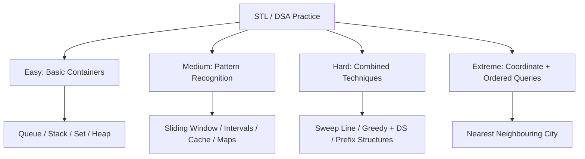

---
## Summary Table
| Problem | Difficulty | Description | Brute Thinking | Optimal Approach |
|---|---|---|---|---|
| [All One](#all-one) | Novice | Maintain keys with counts and return any key with maximum/minimum count. | Scan all keys after each update. | HashMap + frequency buckets / doubly linked list. |
| [Infix-Postfix](#infix-postfix) | Novice | Convert an infix expression like A+B*C into postfix ABC*+. | Try to manually reorder operators by repeated scans. | Stack + operator precedence. |
| [Queue From Stack](#queue-from-stack) | Easy | Implement queue behavior using stacks. | Move all elements on every operation. | Two stacks: input stack and output stack. |
| [Mode of Distances](#mode-of-distances) | Easy | Find the most frequent distance/value. | Count every value repeatedly. | Frequency map. |
| [Towers AZ101](#towers-az101) | Easy | Place elements onto towers/groups according to ordering. | Try every tower linearly. | Multiset/lower_bound greedy. |
| [Diversify the Array](#diversify-the-array) | Easy | Maximize or count distinct values after operations. | Try removing/changing elements one by one. | Frequency map + set. |
| [Maximum Element in each subarray AZ101](#maximum-element-in-each-subarray-az101) | Easy | Find maximum for every window of size k. | Scan each window. | Monotonic deque. |
| [Queue AZ101](#queue-az101) | Easy | Perform basic queue operations. | Use vector and erase front. | Queue STL. |
| [Max Diff](#max-diff) | Easy | Find maximum difference under ordering constraint. | Check all pairs. | Track prefix minimum. |
| [Sort by Roll Number](#sort-by-roll-number) | Easy | Sort records by roll number. | Manual sorting. | STL sort with comparator. |
| [Special Heap](#special-heap) | Easy | Maintain elements under special priority. | Sort after every insert. | Priority queue with comparator. |
| [Maximum Rate Subarray](#maximum-rate-subarray) | Medium | Find best subarray satisfying a rate/condition. | Try all subarrays. | Sliding window or prefix sums. |
| [Smart Sale](#smart-sale) | Medium | Minimize remaining items/types after removals. | Remove greedily by scanning frequencies each time. | Frequency map + sort/heap. |
| [Generating Permutations AZ101](#generating-permutations-az101) | Medium | Generate permutations of elements. | Manually construct all orders. | Backtracking or next_permutation. |
| [Happy Neighborhood](#happy-neighborhood) | Medium | Optimize grouping/arrangement under neighbor constraints. | Try all arrangements. | Greedy + sorting/frequency. |
| [Longest Segment](#longest-segment) | Medium | Find longest valid contiguous segment. | Test all l,r pairs. | Sliding window / two pointers. |
| [Set AZ101](#set-az101) | Medium | Use ordered unique values. | Linear search in vector. | set operations. |
| [Solve Intervals 3](#solve-intervals-3) | Medium | Maintain/merge intervals dynamically. | Compare against every interval. | Ordered set of intervals + lower_bound. |
| [ADDMUL](#addmul) | Medium | Process add/multiply updates efficiently. | Update every element each query. | Lazy math transformation. |
| [Multimap AZ101](#multimap-az101) | Medium | Store multiple values for the same key. | Map key to vector manually. | multimap / map of vectors. |
| [LFU Cache](#lfu-cache) | Medium | Evict least frequently used item. | Scan all items on eviction. | HashMap + frequency lists. |
| [Distinct Characters AZ101](#distinct-characters-az101) | Medium | Count distinct characters in substring/window. | Recount each query/window. | Frequency array + sliding window. |
| [Support Queries II](#support-queries-ii) | Medium | Answer dynamic set-like queries. | Scan all elements per query. | Ordered set/multiset with lower_bound. |
| [Support Queries I](#support-queries-i) | Medium | Support insert/delete/query operations. | Recompute after each operation. | Map/set depending on query. |
| [Powers of Two](#powers-of-two) | Medium | Check if pairs/values relate to powers of two. | Try all pairs. | Hashing + iterate powers. |
| [FMBQUEUE](#fmbqueue) | Medium | Simulate special queue operations. | Use vector shifting. | Deque. |
| [Next Permutation](#next-permutation) | Medium | Find next lexicographic permutation. | Generate all permutations then find next. | Pivot + suffix reverse. |
| [Deque AZ101](#deque-az101) | Medium | Use double-ended operations. | Vector with costly front operations. | Deque STL. |
| [Indexed Set](#indexed-set) | Medium | Support kth element / count smaller. | Sort every query. | PBDS ordered set. |
| [Set Queries AZ101](#set-queries-az101) | Medium | Perform ordered-set queries. | Scan all values. | set + lower_bound/upper_bound. |
| [Running Mean, Median and Mode AZ101](#running-mean,-median-and-mode-az101) | Medium | Maintain stream statistics. | Sort/recount after each insert. | Two heaps/multisets + frequency map. |
| [Find The Sum](#find-the-sum) | Medium | Answer sum-related queries. | Nested loops. | Prefix sums / hashing. |
| [Game on Deque AZ101](#game-on-deque-az101) | Medium | Simulate game operations on deque. | Simulate all operations for every query. | Deque + cycle/preprocessing observation. |
| [Duplicate Products](#duplicate-products) | Medium | Detect duplicate product names/ids. | Compare every pair. | Frequency map/set. |
| [Powers Of Two](#powers-of-two) | Medium | Variant of powers-of-two pair/property check. | Try every pair. | Hash counts + powers iteration. |
| [The Social Network](#the-social-network) | Medium | Maintain groups/connections. | Check all relations repeatedly. | DSU or sets. |
| [Bachata Dance](#bachata-dance) | Medium | Pair/group people optimally. | Try all pairings. | Greedy + sorting. |
| [Evaluating Boolean Expressions](#evaluating-boolean-expressions) | Medium | Evaluate expression with logical operators. | Recursive parsing by repeated scans. | Stack parser. |
| [Substrings Galore](#substrings-galore) | Medium | Count substrings satisfying property. | Generate all substrings. | Sliding window / hashing. |
| [Subsegment Sort](#subsegment-sort) | Medium | Reason about sorting subsegments. | Sort every candidate segment. | Greedy + ordered structure. |
| [Gas Station](#gas-station) | Medium | Find valid start around circular route. | Try every start. | Greedy one-pass. |
| [Nearly Sorted Arrays](#nearly-sorted-arrays) | Medium | Sort k-nearly sorted array. | Full sort. | Min-heap of size k+1. |
| [Queue using 2 Stacks AZ101](#queue-using-2-stacks-az101) | Medium | Queue implementation via stacks. | Move on every operation. | Amortized two-stack queue. |
| [Hamming Distance](#hamming-distance) | Medium | Compute bit differences. | Compare every bit for every pair. | Bit counting. |
| [Priority Queue](#priority-queue) | Medium | Use heap operations. | Re-sort vector repeatedly. | Priority queue. |
| [Elections](#elections) | Medium | Track current leader/winner. | Recompute all counts each vote. | Frequency map + heap/tie rule. |
| [Multiset AZ101](#multiset-az101) | Medium | Store sorted values with duplicates. | Vector + sort after changes. | multiset. |
| [Set Operations AZ101](#set-operations-az101) | Medium | Union/intersection/difference. | Nested comparison. | STL set algorithms or two pointers. |
| [Subarrays](#subarrays) | Hard | Count/analyze subarrays. | Enumerate all subarrays. | Prefix sums / monotonic structures. |
| [STL Searching](#stl-searching) | Hard | Use binary search style queries. | Linear search. | lower_bound/upper_bound. |
| [Pocket Money](#pocket-money) | Hard | Optimize distribution/spending choices. | Try all choices. | Greedy + multiset/heap. |
| [Find The Triplet](#find-the-triplet) | Hard | Find triplet satisfying condition. | Triple nested loops. | Sort + two pointers. |
| [Sports Meet](#sports-meet) | Hard | Schedule/assign intervals/events. | Try all assignments. | Sweep line / greedy. |
| [Fountains](#fountains) | Hard | Choose optimal fountain coverage/values. | Try all pairs/combinations. | Prefix/suffix max + greedy. |
| [Nearest Neighbouring City](#nearest-neighbouring-city) | Extreme | Answer nearest city queries. | Check all cities per query. | Coordinate grouping + ordered sets. |
| [Maximum Number of Customers AZ101](#maximum-number-of-customers-az101) | Unrated | Find maximum simultaneous customers. | Check overlaps pairwise. | Sweep line events. |

---
## 1. All One
**Difficulty:** Novice

### Problem Description
Maintain keys with counts and return any key with maximum/minimum count.

### Brute Force Thinking
Scan all keys after each update.

### Optimal Approach
HashMap + frequency buckets / doubly linked list.

### Key Invariant
The STL structure always stores just enough information to answer the next query efficiently.

### Flowchart
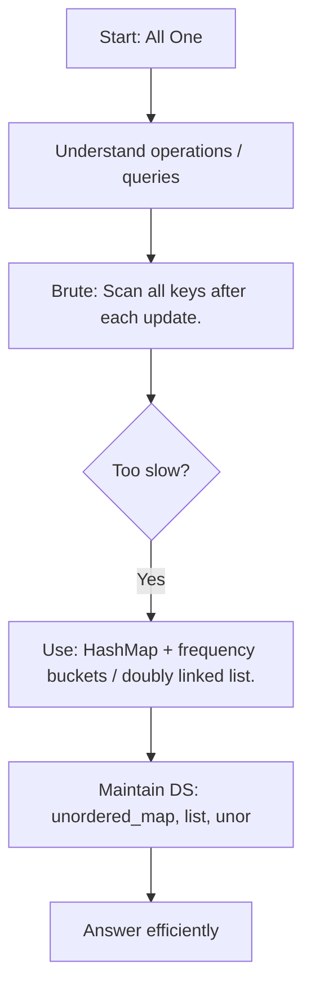

### C++ Pattern Code
```cpp
// Pattern template for: All One
// Main idea: use unordered_map<string,int>, list<bucket>, unordered_map<int,iterator>

void solve() {
    // 1. Read input
    // 2. Maintain the required STL structure
    // 3. Answer queries / compute result using the invariant
}
```

### Dry Run Table
| Step | Thinking | State |
|---|---|---|
| 1 | Read input | initialize STL structure |
| 2 | Apply brute idea mentally | too slow for constraints |
| 3 | Maintain invariant | use optimal DS |
| 4 | Produce answer | O(log n), O(n), or O(n log n) depending on pattern |

### Visual Diagram
```text
Input -> choose STL structure -> maintain invariant -> answer query/result
```

---
## 2. Infix-Postfix
**Difficulty:** Novice

### Problem Description
Convert an infix expression like A+B*C into postfix ABC*+.

### Brute Force Thinking
Try to manually reorder operators by repeated scans.

### Optimal Approach
Stack + operator precedence.

### Key Invariant
The STL structure always stores just enough information to answer the next query efficiently.

### Flowchart
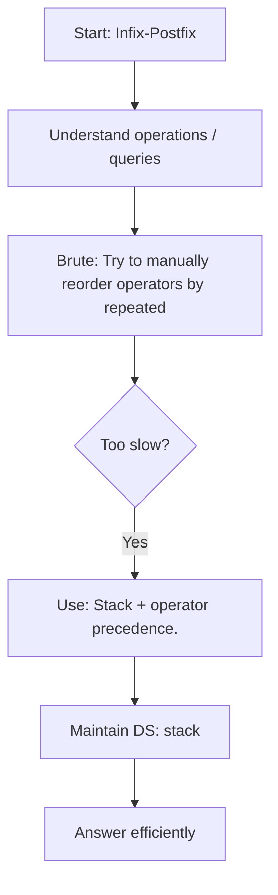

### C++ Pattern Code
```cpp
// Pattern template for: Infix-Postfix
// Main idea: use stack<char>

void solve() {
    // 1. Read input
    // 2. Maintain the required STL structure
    // 3. Answer queries / compute result using the invariant
}
```

### Dry Run Table
| Step | Thinking | State |
|---|---|---|
| 1 | Read input | initialize STL structure |
| 2 | Apply brute idea mentally | too slow for constraints |
| 3 | Maintain invariant | use optimal DS |
| 4 | Produce answer | O(log n), O(n), or O(n log n) depending on pattern |

### Visual Diagram
```text
Input -> choose STL structure -> maintain invariant -> answer query/result
```

---
## 3. Queue From Stack
**Difficulty:** Easy

### Problem Description
Implement queue behavior using stacks.

### Brute Force Thinking
Move all elements on every operation.

### Optimal Approach
Two stacks: input stack and output stack.

### Key Invariant
The output stack contains elements in dequeue order when needed.

### Flowchart
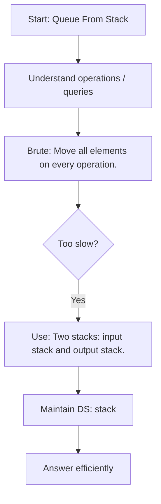

### C++ Pattern Code
```cpp
class MyQueue {
    stack<int> in, out;

    void shift() {
        if (out.empty()) {
            while (!in.empty()) {
                out.push(in.top());
                in.pop();
            }
        }
    }

public:
    void push(int x) { in.push(x); }

    int pop() {
        shift();
        int x = out.top();
        out.pop();
        return x;
    }

    int front() {
        shift();
        return out.top();
    }
};
```

### Dry Run Table
| Operation | in stack | out stack | Result |
|---|---|---|---|
| push 1 | [1] | [] | - |
| push 2 | [1,2] | [] | - |
| pop | [] | [2] | 1 |
| front | [] | [2] | 2 |

### Visual Diagram
```text
Push side: in stack
Pop side : out stack
When out is empty, move in -> out
```

---
## 4. Mode of Distances
**Difficulty:** Easy

### Problem Description
Find the most frequent distance/value.

### Brute Force Thinking
Count every value repeatedly.

### Optimal Approach
Frequency map.

### Key Invariant
The STL structure always stores just enough information to answer the next query efficiently.

### Flowchart
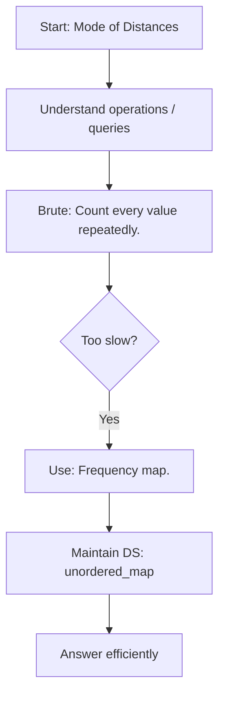

### C++ Pattern Code
```cpp
// Pattern template for: Mode of Distances
// Main idea: use unordered_map<int,int>

void solve() {
    // 1. Read input
    // 2. Maintain the required STL structure
    // 3. Answer queries / compute result using the invariant
}
```

### Dry Run Table
| Step | Thinking | State |
|---|---|---|
| 1 | Read input | initialize STL structure |
| 2 | Apply brute idea mentally | too slow for constraints |
| 3 | Maintain invariant | use optimal DS |
| 4 | Produce answer | O(log n), O(n), or O(n log n) depending on pattern |

### Visual Diagram
```text
Input -> choose STL structure -> maintain invariant -> answer query/result
```

---
## 5. Towers AZ101
**Difficulty:** Easy

### Problem Description
Place elements onto towers/groups according to ordering.

### Brute Force Thinking
Try every tower linearly.

### Optimal Approach
Multiset/lower_bound greedy.

### Key Invariant
The STL structure always stores just enough information to answer the next query efficiently.

### Flowchart
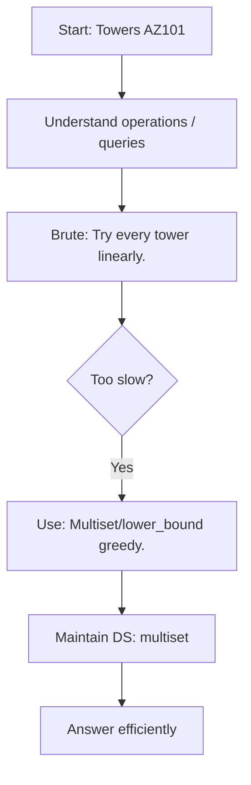

### C++ Pattern Code
```cpp
// Pattern template for: Towers AZ101
// Main idea: use multiset<int>

void solve() {
    // 1. Read input
    // 2. Maintain the required STL structure
    // 3. Answer queries / compute result using the invariant
}
```

### Dry Run Table
| Step | Thinking | State |
|---|---|---|
| 1 | Read input | initialize STL structure |
| 2 | Apply brute idea mentally | too slow for constraints |
| 3 | Maintain invariant | use optimal DS |
| 4 | Produce answer | O(log n), O(n), or O(n log n) depending on pattern |

### Visual Diagram
```text
Input -> choose STL structure -> maintain invariant -> answer query/result
```

---
## 6. Diversify the Array
**Difficulty:** Easy

### Problem Description
Maximize or count distinct values after operations.

### Brute Force Thinking
Try removing/changing elements one by one.

### Optimal Approach
Frequency map + set.

### Key Invariant
The STL structure always stores just enough information to answer the next query efficiently.

### Flowchart
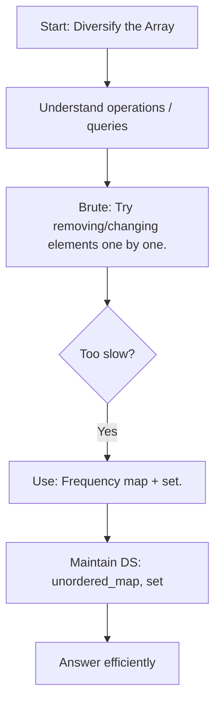

### C++ Pattern Code
```cpp
// Pattern template for: Diversify the Array
// Main idea: use unordered_map<int,int>, set<int>

void solve() {
    // 1. Read input
    // 2. Maintain the required STL structure
    // 3. Answer queries / compute result using the invariant
}
```

### Dry Run Table
| Step | Thinking | State |
|---|---|---|
| 1 | Read input | initialize STL structure |
| 2 | Apply brute idea mentally | too slow for constraints |
| 3 | Maintain invariant | use optimal DS |
| 4 | Produce answer | O(log n), O(n), or O(n log n) depending on pattern |

### Visual Diagram
```text
Input -> choose STL structure -> maintain invariant -> answer query/result
```

---
## 7. Maximum Element in each subarray AZ101
**Difficulty:** Easy

### Problem Description
Find maximum for every window of size k.

### Brute Force Thinking
Scan each window.

### Optimal Approach
Monotonic deque.

### Key Invariant
The deque/window stores only useful candidates for the current range.

### Flowchart
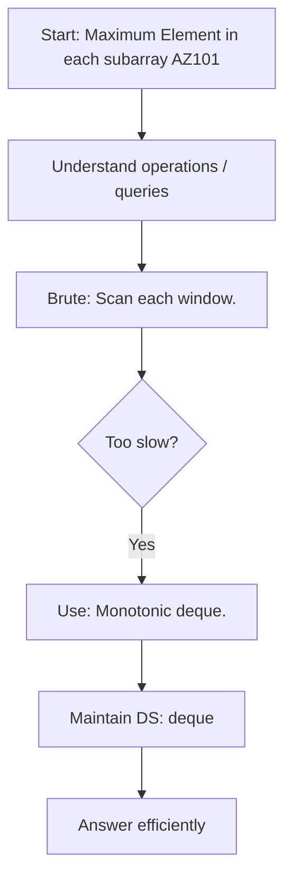

### C++ Pattern Code
```cpp
vector<int> slidingMaximum(vector<int>& a, int k) {
    deque<int> dq;
    vector<int> ans;
    for (int i = 0; i < (int)a.size(); i++) {
        while (!dq.empty() && dq.front() <= i - k) dq.pop_front();
        while (!dq.empty() && a[dq.back()] <= a[i]) dq.pop_back();
        dq.push_back(i);
        if (i >= k - 1) ans.push_back(a[dq.front()]);
    }
    return ans;
}
```

### Dry Run Table
| Step | Window | Deque meaning | Answer |
|---|---|---|---|
| 1 | [1,3,-1] | decreasing indices | 3 |
| 2 | [3,-1,-3] | max at front | 3 |
| 3 | [-1,-3,5] | remove smaller before 5 | 5 |

### Visual Diagram
```text
Window moves left -> right
[ a b c ] d e f
Deque keeps only useful candidates
```

---
## 8. Queue AZ101
**Difficulty:** Easy

### Problem Description
Perform basic queue operations.

### Brute Force Thinking
Use vector and erase front.

### Optimal Approach
Queue STL.

### Key Invariant
The output stack contains elements in dequeue order when needed.

### Flowchart
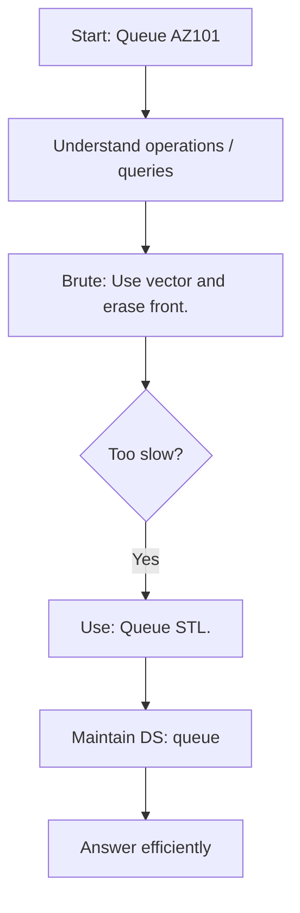

### C++ Pattern Code
```cpp
// Pattern template for: Queue AZ101
// Main idea: use queue<int>

void solve() {
    // 1. Read input
    // 2. Maintain the required STL structure
    // 3. Answer queries / compute result using the invariant
}
```

### Dry Run Table
| Step | Thinking | State |
|---|---|---|
| 1 | Read input | initialize STL structure |
| 2 | Apply brute idea mentally | too slow for constraints |
| 3 | Maintain invariant | use optimal DS |
| 4 | Produce answer | O(log n), O(n), or O(n log n) depending on pattern |

### Visual Diagram
```text
Push side: in stack
Pop side : out stack
When out is empty, move in -> out
```

---
## 9. Max Diff
**Difficulty:** Easy

### Problem Description
Find maximum difference under ordering constraint.

### Brute Force Thinking
Check all pairs.

### Optimal Approach
Track prefix minimum.

### Key Invariant
The STL structure always stores just enough information to answer the next query efficiently.

### Flowchart
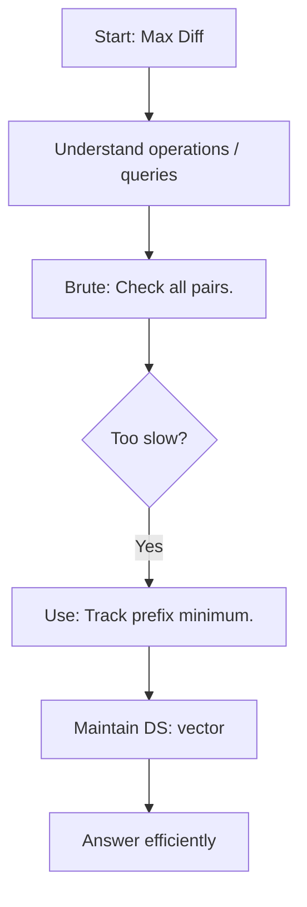

### C++ Pattern Code
```cpp
// Pattern template for: Max Diff
// Main idea: use vector<int>

void solve() {
    // 1. Read input
    // 2. Maintain the required STL structure
    // 3. Answer queries / compute result using the invariant
}
```

### Dry Run Table
| Step | Thinking | State |
|---|---|---|
| 1 | Read input | initialize STL structure |
| 2 | Apply brute idea mentally | too slow for constraints |
| 3 | Maintain invariant | use optimal DS |
| 4 | Produce answer | O(log n), O(n), or O(n log n) depending on pattern |

### Visual Diagram
```text
Input -> choose STL structure -> maintain invariant -> answer query/result
```

---
## 10. Sort by Roll Number
**Difficulty:** Easy

### Problem Description
Sort records by roll number.

### Brute Force Thinking
Manual sorting.

### Optimal Approach
STL sort with comparator.

### Key Invariant
The STL structure always stores just enough information to answer the next query efficiently.

### Flowchart
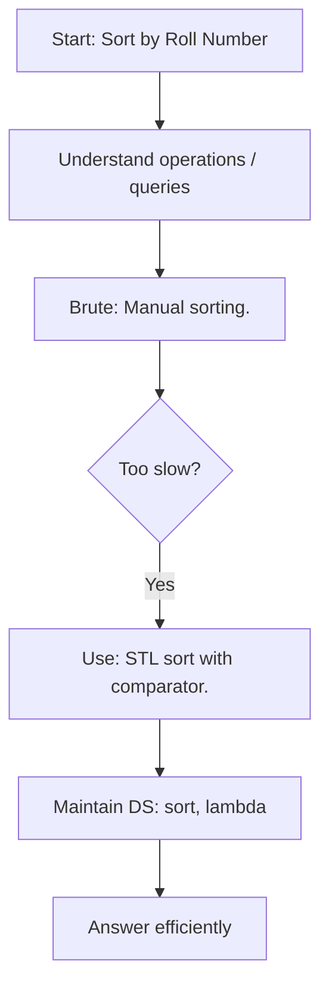

### C++ Pattern Code
```cpp
// Pattern template for: Sort by Roll Number
// Main idea: use sort, lambda

void solve() {
    // 1. Read input
    // 2. Maintain the required STL structure
    // 3. Answer queries / compute result using the invariant
}
```

### Dry Run Table
| Step | Thinking | State |
|---|---|---|
| 1 | Read input | initialize STL structure |
| 2 | Apply brute idea mentally | too slow for constraints |
| 3 | Maintain invariant | use optimal DS |
| 4 | Produce answer | O(log n), O(n), or O(n log n) depending on pattern |

### Visual Diagram
```text
Input -> choose STL structure -> maintain invariant -> answer query/result
```

---
## 11. Special Heap
**Difficulty:** Easy

### Problem Description
Maintain elements under special priority.

### Brute Force Thinking
Sort after every insert.

### Optimal Approach
Priority queue with comparator.

### Key Invariant
The STL structure always stores just enough information to answer the next query efficiently.

### Flowchart
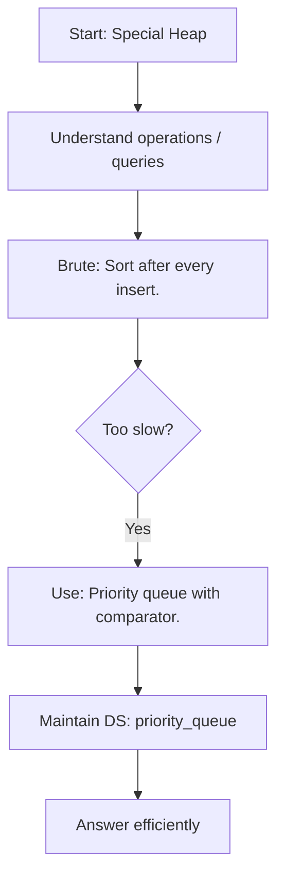

### C++ Pattern Code
```cpp
// Pattern template for: Special Heap
// Main idea: use priority_queue

void solve() {
    // 1. Read input
    // 2. Maintain the required STL structure
    // 3. Answer queries / compute result using the invariant
}
```

### Dry Run Table
| Step | Thinking | State |
|---|---|---|
| 1 | Read input | initialize STL structure |
| 2 | Apply brute idea mentally | too slow for constraints |
| 3 | Maintain invariant | use optimal DS |
| 4 | Produce answer | O(log n), O(n), or O(n log n) depending on pattern |

### Visual Diagram
```text
Input -> choose STL structure -> maintain invariant -> answer query/result
```

---
## 12. Maximum Rate Subarray
**Difficulty:** Medium

### Problem Description
Find best subarray satisfying a rate/condition.

### Brute Force Thinking
Try all subarrays.

### Optimal Approach
Sliding window or prefix sums.

### Key Invariant
The STL structure always stores just enough information to answer the next query efficiently.

### Flowchart
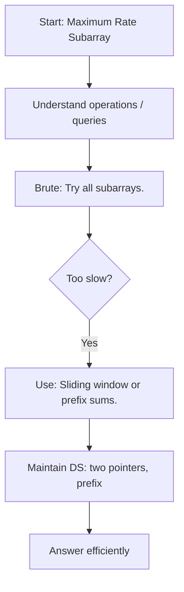

### C++ Pattern Code
```cpp
// Pattern template for: Maximum Rate Subarray
// Main idea: use two pointers, prefix

void solve() {
    // 1. Read input
    // 2. Maintain the required STL structure
    // 3. Answer queries / compute result using the invariant
}
```

### Dry Run Table
| Step | Thinking | State |
|---|---|---|
| 1 | Read input | initialize STL structure |
| 2 | Apply brute idea mentally | too slow for constraints |
| 3 | Maintain invariant | use optimal DS |
| 4 | Produce answer | O(log n), O(n), or O(n log n) depending on pattern |

### Visual Diagram
```text
Input -> choose STL structure -> maintain invariant -> answer query/result
```

---
## 13. Smart Sale
**Difficulty:** Medium

### Problem Description
Minimize remaining items/types after removals.

### Brute Force Thinking
Remove greedily by scanning frequencies each time.

### Optimal Approach
Frequency map + sort/heap.

### Key Invariant
The STL structure always stores just enough information to answer the next query efficiently.

### Flowchart
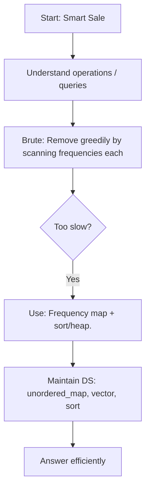

### C++ Pattern Code
```cpp
// Pattern template for: Smart Sale
// Main idea: use unordered_map, vector, sort

void solve() {
    // 1. Read input
    // 2. Maintain the required STL structure
    // 3. Answer queries / compute result using the invariant
}
```

### Dry Run Table
| Step | Thinking | State |
|---|---|---|
| 1 | Read input | initialize STL structure |
| 2 | Apply brute idea mentally | too slow for constraints |
| 3 | Maintain invariant | use optimal DS |
| 4 | Produce answer | O(log n), O(n), or O(n log n) depending on pattern |

### Visual Diagram
```text
Input -> choose STL structure -> maintain invariant -> answer query/result
```

---
## 14. Generating Permutations AZ101
**Difficulty:** Medium

### Problem Description
Generate permutations of elements.

### Brute Force Thinking
Manually construct all orders.

### Optimal Approach
Backtracking or next_permutation.

### Key Invariant
The STL structure always stores just enough information to answer the next query efficiently.

### Flowchart
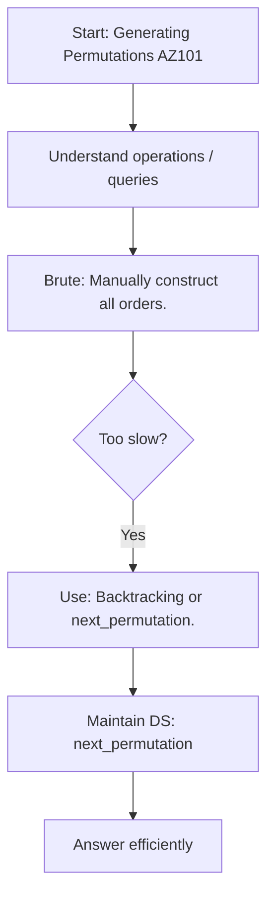

### C++ Pattern Code
```cpp
// Pattern template for: Generating Permutations AZ101
// Main idea: use next_permutation

void solve() {
    // 1. Read input
    // 2. Maintain the required STL structure
    // 3. Answer queries / compute result using the invariant
}
```

### Dry Run Table
| Step | Thinking | State |
|---|---|---|
| 1 | Read input | initialize STL structure |
| 2 | Apply brute idea mentally | too slow for constraints |
| 3 | Maintain invariant | use optimal DS |
| 4 | Produce answer | O(log n), O(n), or O(n log n) depending on pattern |

### Visual Diagram
```text
Input -> choose STL structure -> maintain invariant -> answer query/result
```

---
## 15. Happy Neighborhood
**Difficulty:** Medium

### Problem Description
Optimize grouping/arrangement under neighbor constraints.

### Brute Force Thinking
Try all arrangements.

### Optimal Approach
Greedy + sorting/frequency.

### Key Invariant
The STL structure always stores just enough information to answer the next query efficiently.

### Flowchart
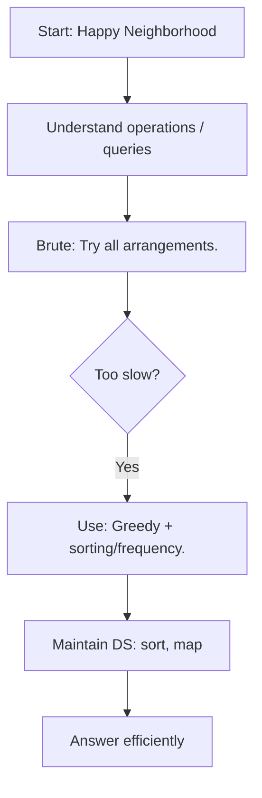

### C++ Pattern Code
```cpp
// Pattern template for: Happy Neighborhood
// Main idea: use sort, map

void solve() {
    // 1. Read input
    // 2. Maintain the required STL structure
    // 3. Answer queries / compute result using the invariant
}
```

### Dry Run Table
| Step | Thinking | State |
|---|---|---|
| 1 | Read input | initialize STL structure |
| 2 | Apply brute idea mentally | too slow for constraints |
| 3 | Maintain invariant | use optimal DS |
| 4 | Produce answer | O(log n), O(n), or O(n log n) depending on pattern |

### Visual Diagram
```text
Input -> choose STL structure -> maintain invariant -> answer query/result
```

---
## 16. Longest Segment
**Difficulty:** Medium

### Problem Description
Find longest valid contiguous segment.

### Brute Force Thinking
Test all l,r pairs.

### Optimal Approach
Sliding window / two pointers.

### Key Invariant
The STL structure always stores just enough information to answer the next query efficiently.

### Flowchart
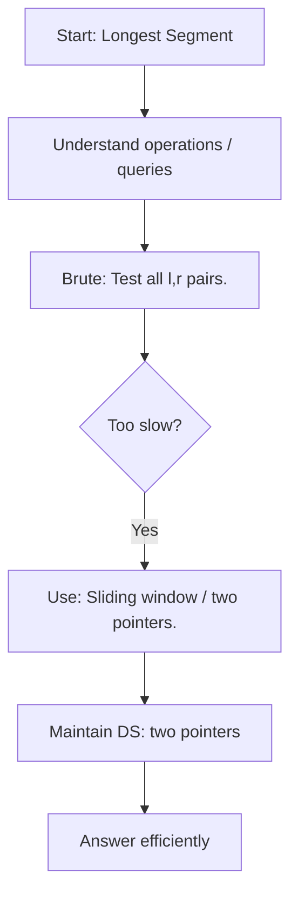

### C++ Pattern Code
```cpp
// Pattern template for: Longest Segment
// Main idea: use two pointers

void solve() {
    // 1. Read input
    // 2. Maintain the required STL structure
    // 3. Answer queries / compute result using the invariant
}
```

### Dry Run Table
| Step | Thinking | State |
|---|---|---|
| 1 | Read input | initialize STL structure |
| 2 | Apply brute idea mentally | too slow for constraints |
| 3 | Maintain invariant | use optimal DS |
| 4 | Produce answer | O(log n), O(n), or O(n log n) depending on pattern |

### Visual Diagram
```text
Input -> choose STL structure -> maintain invariant -> answer query/result
```

---
## 17. Set AZ101
**Difficulty:** Medium

### Problem Description
Use ordered unique values.

### Brute Force Thinking
Linear search in vector.

### Optimal Approach
set operations.

### Key Invariant
The ordered set remains sorted after each operation.

### Flowchart
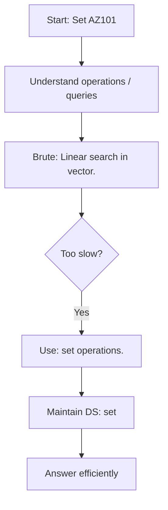

### C++ Pattern Code
```cpp
// Pattern template for: Set AZ101
// Main idea: use set<int>

void solve() {
    // 1. Read input
    // 2. Maintain the required STL structure
    // 3. Answer queries / compute result using the invariant
}
```

### Dry Run Table
| Step | Thinking | State |
|---|---|---|
| 1 | Read input | initialize STL structure |
| 2 | Apply brute idea mentally | too slow for constraints |
| 3 | Maintain invariant | use optimal DS |
| 4 | Produce answer | O(log n), O(n), or O(n log n) depending on pattern |

### Visual Diagram
```text
Input -> choose STL structure -> maintain invariant -> answer query/result
```

---
## 18. Solve Intervals 3
**Difficulty:** Medium

### Problem Description
Maintain/merge intervals dynamically.

### Brute Force Thinking
Compare against every interval.

### Optimal Approach
Ordered set of intervals + lower_bound.

### Key Invariant
The set always stores sorted, non-overlapping intervals.

### Flowchart
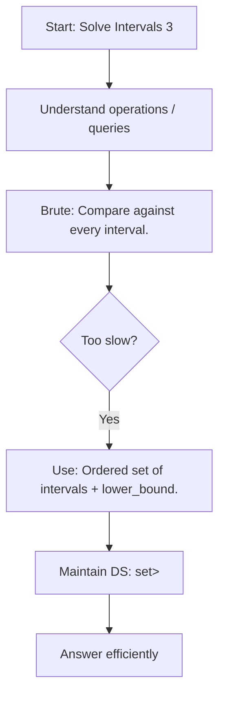

### C++ Pattern Code
```cpp
struct RangeCover {
    set<pair<int,int>> ranges;

    void insertRange(int l, int r) {
        auto it = ranges.lower_bound({l, INT_MIN});
        if (it != ranges.begin()) {
            auto p = prev(it);
            if (p->second >= l - 1) it = p;
        }
        while (it != ranges.end() && it->first <= r + 1) {
            l = min(l, it->first);
            r = max(r, it->second);
            it = ranges.erase(it);
        }
        ranges.insert({l, r});
    }
};
```

### Dry Run Table
| Step | Action | Ranges |
|---|---|---|
| 1 | Start | [1,3], [7,10], [13,16] |
| 2 | Insert [4,12] | touches [1,3] |
| 3 | Merge | [1,12], [13,16] |
| 4 | Merge adjacent [13,16] | [1,16] |

### Visual Diagram
```text
Before: [1,3]   [7,10]   [13,16]
Insert:     [4,12]
After : [1,16]
```

---
## 19. ADDMUL
**Difficulty:** Medium

### Problem Description
Process add/multiply updates efficiently.

### Brute Force Thinking
Update every element each query.

### Optimal Approach
Lazy math transformation.

### Key Invariant
The STL structure always stores just enough information to answer the next query efficiently.

### Flowchart
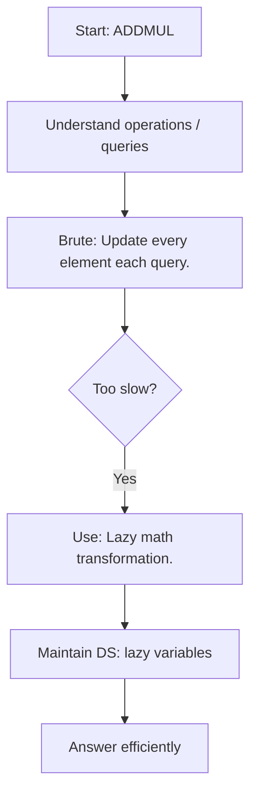

### C++ Pattern Code
```cpp
// Pattern template for: ADDMUL
// Main idea: use lazy variables

void solve() {
    // 1. Read input
    // 2. Maintain the required STL structure
    // 3. Answer queries / compute result using the invariant
}
```

### Dry Run Table
| Step | Thinking | State |
|---|---|---|
| 1 | Read input | initialize STL structure |
| 2 | Apply brute idea mentally | too slow for constraints |
| 3 | Maintain invariant | use optimal DS |
| 4 | Produce answer | O(log n), O(n), or O(n log n) depending on pattern |

### Visual Diagram
```text
Input -> choose STL structure -> maintain invariant -> answer query/result
```

---
## 20. Multimap AZ101
**Difficulty:** Medium

### Problem Description
Store multiple values for the same key.

### Brute Force Thinking
Map key to vector manually.

### Optimal Approach
multimap / map of vectors.

### Key Invariant
The STL structure always stores just enough information to answer the next query efficiently.

### Flowchart
```mermaid
flowchart TD
    A["Start: Multimap AZ101"] --> B["Understand operations / queries"]
    B --> C["Brute: Map key to vector manually."]
    C --> D{"Too slow?"}
    D -->|Yes| E["Use: multimap / map of vectors."]
    E --> F["Maintain DS: multimap<int,int>"]
    F --> G["Answer efficiently"]
```

### C++ Pattern Code
```cpp
// Pattern template for: Multimap AZ101
// Main idea: use multimap<int,int>

void solve() {
    // 1. Read input
    // 2. Maintain the required STL structure
    // 3. Answer queries / compute result using the invariant
}
```

### Dry Run Table
| Step | Thinking | State |
|---|---|---|
| 1 | Read input | initialize STL structure |
| 2 | Apply brute idea mentally | too slow for constraints |
| 3 | Maintain invariant | use optimal DS |
| 4 | Produce answer | O(log n), O(n), or O(n log n) depending on pattern |

### Visual Diagram
```text
Input -> choose STL structure -> maintain invariant -> answer query/result
```

---
## 21. LFU Cache
**Difficulty:** Medium

### Problem Description
Evict least frequently used item.

### Brute Force Thinking
Scan all items on eviction.

### Optimal Approach
HashMap + frequency lists.

### Key Invariant
Frequency buckets remain updated after every access/update.

### Flowchart
```mermaid
flowchart TD
    A["Start: LFU Cache"] --> B["Understand operations / queries"]
    B --> C["Brute: Scan all items on eviction."]
    C --> D{"Too slow?"}
    D -->|Yes| E["Use: HashMap + frequency lists."]
    E --> F["Maintain DS: unordered_map, list"]
    F --> G["Answer efficiently"]
```

### C++ Pattern Code
```cpp
// Pattern template for: LFU Cache
// Main idea: use unordered_map, list

void solve() {
    // 1. Read input
    // 2. Maintain the required STL structure
    // 3. Answer queries / compute result using the invariant
}
```

### Dry Run Table
| Step | Thinking | State |
|---|---|---|
| 1 | Read input | initialize STL structure |
| 2 | Apply brute idea mentally | too slow for constraints |
| 3 | Maintain invariant | use optimal DS |
| 4 | Produce answer | O(log n), O(n), or O(n log n) depending on pattern |

### Visual Diagram
```text
Input -> choose STL structure -> maintain invariant -> answer query/result
```

---
## 22. Distinct Characters AZ101
**Difficulty:** Medium

### Problem Description
Count distinct characters in substring/window.

### Brute Force Thinking
Recount each query/window.

### Optimal Approach
Frequency array + sliding window.

### Key Invariant
The STL structure always stores just enough information to answer the next query efficiently.

### Flowchart
```mermaid
flowchart TD
    A["Start: Distinct Characters AZ101"] --> B["Understand operations / queries"]
    B --> C["Brute: Recount each query/window."]
    C --> D{"Too slow?"}
    D -->|Yes| E["Use: Frequency array + sliding window."]
    E --> F["Maintain DS: array<int,26>"]
    F --> G["Answer efficiently"]
```

### C++ Pattern Code
```cpp
// Pattern template for: Distinct Characters AZ101
// Main idea: use array<int,26>

void solve() {
    // 1. Read input
    // 2. Maintain the required STL structure
    // 3. Answer queries / compute result using the invariant
}
```

### Dry Run Table
| Step | Thinking | State |
|---|---|---|
| 1 | Read input | initialize STL structure |
| 2 | Apply brute idea mentally | too slow for constraints |
| 3 | Maintain invariant | use optimal DS |
| 4 | Produce answer | O(log n), O(n), or O(n log n) depending on pattern |

### Visual Diagram
```text
Input -> choose STL structure -> maintain invariant -> answer query/result
```

---
## 23. Support Queries II
**Difficulty:** Medium

### Problem Description
Answer dynamic set-like queries.

### Brute Force Thinking
Scan all elements per query.

### Optimal Approach
Ordered set/multiset with lower_bound.

### Key Invariant
The STL structure always stores just enough information to answer the next query efficiently.

### Flowchart
```mermaid
flowchart TD
    A["Start: Support Queries II"] --> B["Understand operations / queries"]
    B --> C["Brute: Scan all elements per query."]
    C --> D{"Too slow?"}
    D -->|Yes| E["Use: Ordered set/multiset with lower_bound."]
    E --> F["Maintain DS: set/multiset"]
    F --> G["Answer efficiently"]
```

### C++ Pattern Code
```cpp
// Pattern template for: Support Queries II
// Main idea: use set/multiset

void solve() {
    // 1. Read input
    // 2. Maintain the required STL structure
    // 3. Answer queries / compute result using the invariant
}
```

### Dry Run Table
| Step | Thinking | State |
|---|---|---|
| 1 | Read input | initialize STL structure |
| 2 | Apply brute idea mentally | too slow for constraints |
| 3 | Maintain invariant | use optimal DS |
| 4 | Produce answer | O(log n), O(n), or O(n log n) depending on pattern |

### Visual Diagram
```text
Input -> choose STL structure -> maintain invariant -> answer query/result
```

---
## 24. Support Queries I
**Difficulty:** Medium

### Problem Description
Support insert/delete/query operations.

### Brute Force Thinking
Recompute after each operation.

### Optimal Approach
Map/set depending on query.

### Key Invariant
The STL structure always stores just enough information to answer the next query efficiently.

### Flowchart
```mermaid
flowchart TD
    A["Start: Support Queries I"] --> B["Understand operations / queries"]
    B --> C["Brute: Recompute after each operation."]
    C --> D{"Too slow?"}
    D -->|Yes| E["Use: Map/set depending on query."]
    E --> F["Maintain DS: set/map"]
    F --> G["Answer efficiently"]
```

### C++ Pattern Code
```cpp
// Pattern template for: Support Queries I
// Main idea: use set/map

void solve() {
    // 1. Read input
    // 2. Maintain the required STL structure
    // 3. Answer queries / compute result using the invariant
}
```

### Dry Run Table
| Step | Thinking | State |
|---|---|---|
| 1 | Read input | initialize STL structure |
| 2 | Apply brute idea mentally | too slow for constraints |
| 3 | Maintain invariant | use optimal DS |
| 4 | Produce answer | O(log n), O(n), or O(n log n) depending on pattern |

### Visual Diagram
```text
Input -> choose STL structure -> maintain invariant -> answer query/result
```

---
## 25. Powers of Two
**Difficulty:** Medium

### Problem Description
Check if pairs/values relate to powers of two.

### Brute Force Thinking
Try all pairs.

### Optimal Approach
Hashing + iterate powers.

### Key Invariant
The STL structure always stores just enough information to answer the next query efficiently.

### Flowchart
```mermaid
flowchart TD
    A["Start: Powers of Two"] --> B["Understand operations / queries"]
    B --> C["Brute: Try all pairs."]
    C --> D{"Too slow?"}
    D -->|Yes| E["Use: Hashing + iterate powers."]
    E --> F["Maintain DS: unordered_map"]
    F --> G["Answer efficiently"]
```

### C++ Pattern Code
```cpp
// Pattern template for: Powers of Two
// Main idea: use unordered_map

void solve() {
    // 1. Read input
    // 2. Maintain the required STL structure
    // 3. Answer queries / compute result using the invariant
}
```

### Dry Run Table
| Step | Thinking | State |
|---|---|---|
| 1 | Read input | initialize STL structure |
| 2 | Apply brute idea mentally | too slow for constraints |
| 3 | Maintain invariant | use optimal DS |
| 4 | Produce answer | O(log n), O(n), or O(n log n) depending on pattern |

### Visual Diagram
```text
Input -> choose STL structure -> maintain invariant -> answer query/result
```

---
## 26. FMBQUEUE
**Difficulty:** Medium

### Problem Description
Simulate special queue operations.

### Brute Force Thinking
Use vector shifting.

### Optimal Approach
Deque.

### Key Invariant
The STL structure always stores just enough information to answer the next query efficiently.

### Flowchart
```mermaid
flowchart TD
    A["Start: FMBQUEUE"] --> B["Understand operations / queries"]
    B --> C["Brute: Use vector shifting."]
    C --> D{"Too slow?"}
    D -->|Yes| E["Use: Deque."]
    E --> F["Maintain DS: deque<int>"]
    F --> G["Answer efficiently"]
```

### C++ Pattern Code
```cpp
// Pattern template for: FMBQUEUE
// Main idea: use deque<int>

void solve() {
    // 1. Read input
    // 2. Maintain the required STL structure
    // 3. Answer queries / compute result using the invariant
}
```

### Dry Run Table
| Step | Thinking | State |
|---|---|---|
| 1 | Read input | initialize STL structure |
| 2 | Apply brute idea mentally | too slow for constraints |
| 3 | Maintain invariant | use optimal DS |
| 4 | Produce answer | O(log n), O(n), or O(n log n) depending on pattern |

### Visual Diagram
```text
Input -> choose STL structure -> maintain invariant -> answer query/result
```

---
## 27. Next Permutation
**Difficulty:** Medium

### Problem Description
Find next lexicographic permutation.

### Brute Force Thinking
Generate all permutations then find next.

### Optimal Approach
Pivot + suffix reverse.

### Key Invariant
The STL structure always stores just enough information to answer the next query efficiently.

### Flowchart
```mermaid
flowchart TD
    A["Start: Next Permutation"] --> B["Understand operations / queries"]
    B --> C["Brute: Generate all permutations then find next."]
    C --> D{"Too slow?"}
    D -->|Yes| E["Use: Pivot + suffix reverse."]
    E --> F["Maintain DS: vector, reverse"]
    F --> G["Answer efficiently"]
```

### C++ Pattern Code
```cpp
void nextPermutation(vector<int>& a) {
    int n = a.size();
    int i = n - 2;
    while (i >= 0 && a[i] >= a[i + 1]) i--;

    if (i >= 0) {
        int j = n - 1;
        while (a[j] <= a[i]) j--;
        swap(a[i], a[j]);
    }

    reverse(a.begin() + i + 1, a.end());
}
```

### Dry Run Table
| Step | Thinking | State |
|---|---|---|
| 1 | Read input | initialize STL structure |
| 2 | Apply brute idea mentally | too slow for constraints |
| 3 | Maintain invariant | use optimal DS |
| 4 | Produce answer | O(log n), O(n), or O(n log n) depending on pattern |

### Visual Diagram
```text
Input -> choose STL structure -> maintain invariant -> answer query/result
```

---
## 28. Deque AZ101
**Difficulty:** Medium

### Problem Description
Use double-ended operations.

### Brute Force Thinking
Vector with costly front operations.

### Optimal Approach
Deque STL.

### Key Invariant
The deque/window stores only useful candidates for the current range.

### Flowchart
```mermaid
flowchart TD
    A["Start: Deque AZ101"] --> B["Understand operations / queries"]
    B --> C["Brute: Vector with costly front operations."]
    C --> D{"Too slow?"}
    D -->|Yes| E["Use: Deque STL."]
    E --> F["Maintain DS: deque<int>"]
    F --> G["Answer efficiently"]
```

### C++ Pattern Code
```cpp
// Pattern template for: Deque AZ101
// Main idea: use deque<int>

void solve() {
    // 1. Read input
    // 2. Maintain the required STL structure
    // 3. Answer queries / compute result using the invariant
}
```

### Dry Run Table
| Step | Thinking | State |
|---|---|---|
| 1 | Read input | initialize STL structure |
| 2 | Apply brute idea mentally | too slow for constraints |
| 3 | Maintain invariant | use optimal DS |
| 4 | Produce answer | O(log n), O(n), or O(n log n) depending on pattern |

### Visual Diagram
```text
Window moves left -> right
[ a b c ] d e f
Deque keeps only useful candidates
```

---
## 29. Indexed Set
**Difficulty:** Medium

### Problem Description
Support kth element / count smaller.

### Brute Force Thinking
Sort every query.

### Optimal Approach
PBDS ordered set.

### Key Invariant
The ordered set remains sorted after each operation.

### Flowchart
```mermaid
flowchart TD
    A["Start: Indexed Set"] --> B["Understand operations / queries"]
    B --> C["Brute: Sort every query."]
    C --> D{"Too slow?"}
    D -->|Yes| E["Use: PBDS ordered set."]
    E --> F["Maintain DS: tree ordered_set"]
    F --> G["Answer efficiently"]
```

### C++ Pattern Code
```cpp
// Pattern template for: Indexed Set
// Main idea: use tree ordered_set

void solve() {
    // 1. Read input
    // 2. Maintain the required STL structure
    // 3. Answer queries / compute result using the invariant
}
```

### Dry Run Table
| Step | Thinking | State |
|---|---|---|
| 1 | Read input | initialize STL structure |
| 2 | Apply brute idea mentally | too slow for constraints |
| 3 | Maintain invariant | use optimal DS |
| 4 | Produce answer | O(log n), O(n), or O(n log n) depending on pattern |

### Visual Diagram
```text
Input -> choose STL structure -> maintain invariant -> answer query/result
```

---
## 30. Set Queries AZ101
**Difficulty:** Medium

### Problem Description
Perform ordered-set queries.

### Brute Force Thinking
Scan all values.

### Optimal Approach
set + lower_bound/upper_bound.

### Key Invariant
The ordered set remains sorted after each operation.

### Flowchart
```mermaid
flowchart TD
    A["Start: Set Queries AZ101"] --> B["Understand operations / queries"]
    B --> C["Brute: Scan all values."]
    C --> D{"Too slow?"}
    D -->|Yes| E["Use: set + lower_bound/upper_bound."]
    E --> F["Maintain DS: set<int>"]
    F --> G["Answer efficiently"]
```

### C++ Pattern Code
```cpp
// Pattern template for: Set Queries AZ101
// Main idea: use set<int>

void solve() {
    // 1. Read input
    // 2. Maintain the required STL structure
    // 3. Answer queries / compute result using the invariant
}
```

### Dry Run Table
| Step | Thinking | State |
|---|---|---|
| 1 | Read input | initialize STL structure |
| 2 | Apply brute idea mentally | too slow for constraints |
| 3 | Maintain invariant | use optimal DS |
| 4 | Produce answer | O(log n), O(n), or O(n log n) depending on pattern |

### Visual Diagram
```text
Input -> choose STL structure -> maintain invariant -> answer query/result
```

---
## 31. Running Mean, Median and Mode AZ101
**Difficulty:** Medium

### Problem Description
Maintain stream statistics.

### Brute Force Thinking
Sort/recount after each insert.

### Optimal Approach
Two heaps/multisets + frequency map.

### Key Invariant
The STL structure always stores just enough information to answer the next query efficiently.

### Flowchart
```mermaid
flowchart TD
    A["Start: Running Mean, Median and Mode AZ101"] --> B["Understand operations / queries"]
    B --> C["Brute: Sort/recount after each insert."]
    C --> D{"Too slow?"}
    D -->|Yes| E["Use: Two heaps/multisets + frequency map."]
    E --> F["Maintain DS: multiset, unordered_map"]
    F --> G["Answer efficiently"]
```

### C++ Pattern Code
```cpp
multiset<int> low, high;

void rebalance() {
    while (low.size() > high.size() + 1) {
        high.insert(*low.rbegin());
        low.erase(prev(low.end()));
    }
    while (high.size() > low.size()) {
        low.insert(*high.begin());
        high.erase(high.begin());
    }
}

void addNumber(int x) {
    if (low.empty() || x <= *low.rbegin()) low.insert(x);
    else high.insert(x);
    rebalance();
}

double median() {
    if (low.size() == high.size())
        return (*low.rbegin() + *high.begin()) / 2.0;
    return *low.rbegin();
}
```

### Dry Run Table
| Step | Thinking | State |
|---|---|---|
| 1 | Read input | initialize STL structure |
| 2 | Apply brute idea mentally | too slow for constraints |
| 3 | Maintain invariant | use optimal DS |
| 4 | Produce answer | O(log n), O(n), or O(n log n) depending on pattern |

### Visual Diagram
```text
Input -> choose STL structure -> maintain invariant -> answer query/result
```

---
## 32. Find The Sum
**Difficulty:** Medium

### Problem Description
Answer sum-related queries.

### Brute Force Thinking
Nested loops.

### Optimal Approach
Prefix sums / hashing.

### Key Invariant
The STL structure always stores just enough information to answer the next query efficiently.

### Flowchart
```mermaid
flowchart TD
    A["Start: Find The Sum"] --> B["Understand operations / queries"]
    B --> C["Brute: Nested loops."]
    C --> D{"Too slow?"}
    D -->|Yes| E["Use: Prefix sums / hashing."]
    E --> F["Maintain DS: prefix sum"]
    F --> G["Answer efficiently"]
```

### C++ Pattern Code
```cpp
// Pattern template for: Find The Sum
// Main idea: use prefix sum

void solve() {
    // 1. Read input
    // 2. Maintain the required STL structure
    // 3. Answer queries / compute result using the invariant
}
```

### Dry Run Table
| Step | Thinking | State |
|---|---|---|
| 1 | Read input | initialize STL structure |
| 2 | Apply brute idea mentally | too slow for constraints |
| 3 | Maintain invariant | use optimal DS |
| 4 | Produce answer | O(log n), O(n), or O(n log n) depending on pattern |

### Visual Diagram
```text
Input -> choose STL structure -> maintain invariant -> answer query/result
```

---
## 33. Game on Deque AZ101
**Difficulty:** Medium

### Problem Description
Simulate game operations on deque.

### Brute Force Thinking
Simulate all operations for every query.

### Optimal Approach
Deque + cycle/preprocessing observation.

### Key Invariant
The deque/window stores only useful candidates for the current range.

### Flowchart
```mermaid
flowchart TD
    A["Start: Game on Deque AZ101"] --> B["Understand operations / queries"]
    B --> C["Brute: Simulate all operations for every query."]
    C --> D{"Too slow?"}
    D -->|Yes| E["Use: Deque + cycle/preprocessing observation."]
    E --> F["Maintain DS: deque<int>"]
    F --> G["Answer efficiently"]
```

### C++ Pattern Code
```cpp
// Pattern template for: Game on Deque AZ101
// Main idea: use deque<int>

void solve() {
    // 1. Read input
    // 2. Maintain the required STL structure
    // 3. Answer queries / compute result using the invariant
}
```

### Dry Run Table
| Step | Thinking | State |
|---|---|---|
| 1 | Read input | initialize STL structure |
| 2 | Apply brute idea mentally | too slow for constraints |
| 3 | Maintain invariant | use optimal DS |
| 4 | Produce answer | O(log n), O(n), or O(n log n) depending on pattern |

### Visual Diagram
```text
Window moves left -> right
[ a b c ] d e f
Deque keeps only useful candidates
```

---
## 34. Duplicate Products
**Difficulty:** Medium

### Problem Description
Detect duplicate product names/ids.

### Brute Force Thinking
Compare every pair.

### Optimal Approach
Frequency map/set.

### Key Invariant
The STL structure always stores just enough information to answer the next query efficiently.

### Flowchart
```mermaid
flowchart TD
    A["Start: Duplicate Products"] --> B["Understand operations / queries"]
    B --> C["Brute: Compare every pair."]
    C --> D{"Too slow?"}
    D -->|Yes| E["Use: Frequency map/set."]
    E --> F["Maintain DS: unordered_map"]
    F --> G["Answer efficiently"]
```

### C++ Pattern Code
```cpp
// Pattern template for: Duplicate Products
// Main idea: use unordered_map

void solve() {
    // 1. Read input
    // 2. Maintain the required STL structure
    // 3. Answer queries / compute result using the invariant
}
```

### Dry Run Table
| Step | Thinking | State |
|---|---|---|
| 1 | Read input | initialize STL structure |
| 2 | Apply brute idea mentally | too slow for constraints |
| 3 | Maintain invariant | use optimal DS |
| 4 | Produce answer | O(log n), O(n), or O(n log n) depending on pattern |

### Visual Diagram
```text
Input -> choose STL structure -> maintain invariant -> answer query/result
```

---
## 35. Powers Of Two
**Difficulty:** Medium

### Problem Description
Variant of powers-of-two pair/property check.

### Brute Force Thinking
Try every pair.

### Optimal Approach
Hash counts + powers iteration.

### Key Invariant
The STL structure always stores just enough information to answer the next query efficiently.

### Flowchart
```mermaid
flowchart TD
    A["Start: Powers Of Two"] --> B["Understand operations / queries"]
    B --> C["Brute: Try every pair."]
    C --> D{"Too slow?"}
    D -->|Yes| E["Use: Hash counts + powers iteration."]
    E --> F["Maintain DS: unordered_map"]
    F --> G["Answer efficiently"]
```

### C++ Pattern Code
```cpp
// Pattern template for: Powers Of Two
// Main idea: use unordered_map

void solve() {
    // 1. Read input
    // 2. Maintain the required STL structure
    // 3. Answer queries / compute result using the invariant
}
```

### Dry Run Table
| Step | Thinking | State |
|---|---|---|
| 1 | Read input | initialize STL structure |
| 2 | Apply brute idea mentally | too slow for constraints |
| 3 | Maintain invariant | use optimal DS |
| 4 | Produce answer | O(log n), O(n), or O(n log n) depending on pattern |

### Visual Diagram
```text
Input -> choose STL structure -> maintain invariant -> answer query/result
```

---
## 36. The Social Network
**Difficulty:** Medium

### Problem Description
Maintain groups/connections.

### Brute Force Thinking
Check all relations repeatedly.

### Optimal Approach
DSU or sets.

### Key Invariant
The STL structure always stores just enough information to answer the next query efficiently.

### Flowchart
```mermaid
flowchart TD
    A["Start: The Social Network"] --> B["Understand operations / queries"]
    B --> C["Brute: Check all relations repeatedly."]
    C --> D{"Too slow?"}
    D -->|Yes| E["Use: DSU or sets."]
    E --> F["Maintain DS: DSU"]
    F --> G["Answer efficiently"]
```

### C++ Pattern Code
```cpp
// Pattern template for: The Social Network
// Main idea: use DSU

void solve() {
    // 1. Read input
    // 2. Maintain the required STL structure
    // 3. Answer queries / compute result using the invariant
}
```

### Dry Run Table
| Step | Thinking | State |
|---|---|---|
| 1 | Read input | initialize STL structure |
| 2 | Apply brute idea mentally | too slow for constraints |
| 3 | Maintain invariant | use optimal DS |
| 4 | Produce answer | O(log n), O(n), or O(n log n) depending on pattern |

### Visual Diagram
```text
Input -> choose STL structure -> maintain invariant -> answer query/result
```

---
## 37. Bachata Dance
**Difficulty:** Medium

### Problem Description
Pair/group people optimally.

### Brute Force Thinking
Try all pairings.

### Optimal Approach
Greedy + sorting.

### Key Invariant
The STL structure always stores just enough information to answer the next query efficiently.

### Flowchart
```mermaid
flowchart TD
    A["Start: Bachata Dance"] --> B["Understand operations / queries"]
    B --> C["Brute: Try all pairings."]
    C --> D{"Too slow?"}
    D -->|Yes| E["Use: Greedy + sorting."]
    E --> F["Maintain DS: sort"]
    F --> G["Answer efficiently"]
```

### C++ Pattern Code
```cpp
// Pattern template for: Bachata Dance
// Main idea: use sort

void solve() {
    // 1. Read input
    // 2. Maintain the required STL structure
    // 3. Answer queries / compute result using the invariant
}
```

### Dry Run Table
| Step | Thinking | State |
|---|---|---|
| 1 | Read input | initialize STL structure |
| 2 | Apply brute idea mentally | too slow for constraints |
| 3 | Maintain invariant | use optimal DS |
| 4 | Produce answer | O(log n), O(n), or O(n log n) depending on pattern |

### Visual Diagram
```text
Input -> choose STL structure -> maintain invariant -> answer query/result
```

---
## 38. Evaluating Boolean Expressions
**Difficulty:** Medium

### Problem Description
Evaluate expression with logical operators.

### Brute Force Thinking
Recursive parsing by repeated scans.

### Optimal Approach
Stack parser.

### Key Invariant
The STL structure always stores just enough information to answer the next query efficiently.

### Flowchart
```mermaid
flowchart TD
    A["Start: Evaluating Boolean Expressions"] --> B["Understand operations / queries"]
    B --> C["Brute: Recursive parsing by repeated scans."]
    C --> D{"Too slow?"}
    D -->|Yes| E["Use: Stack parser."]
    E --> F["Maintain DS: stack<char>"]
    F --> G["Answer efficiently"]
```

### C++ Pattern Code
```cpp
// Pattern template for: Evaluating Boolean Expressions
// Main idea: use stack<char>

void solve() {
    // 1. Read input
    // 2. Maintain the required STL structure
    // 3. Answer queries / compute result using the invariant
}
```

### Dry Run Table
| Step | Thinking | State |
|---|---|---|
| 1 | Read input | initialize STL structure |
| 2 | Apply brute idea mentally | too slow for constraints |
| 3 | Maintain invariant | use optimal DS |
| 4 | Produce answer | O(log n), O(n), or O(n log n) depending on pattern |

### Visual Diagram
```text
Input -> choose STL structure -> maintain invariant -> answer query/result
```

---
## 39. Substrings Galore
**Difficulty:** Medium

### Problem Description
Count substrings satisfying property.

### Brute Force Thinking
Generate all substrings.

### Optimal Approach
Sliding window / hashing.

### Key Invariant
The STL structure always stores just enough information to answer the next query efficiently.

### Flowchart
```mermaid
flowchart TD
    A["Start: Substrings Galore"] --> B["Understand operations / queries"]
    B --> C["Brute: Generate all substrings."]
    C --> D{"Too slow?"}
    D -->|Yes| E["Use: Sliding window / hashing."]
    E --> F["Maintain DS: two pointers, map"]
    F --> G["Answer efficiently"]
```

### C++ Pattern Code
```cpp
// Pattern template for: Substrings Galore
// Main idea: use two pointers, map

void solve() {
    // 1. Read input
    // 2. Maintain the required STL structure
    // 3. Answer queries / compute result using the invariant
}
```

### Dry Run Table
| Step | Thinking | State |
|---|---|---|
| 1 | Read input | initialize STL structure |
| 2 | Apply brute idea mentally | too slow for constraints |
| 3 | Maintain invariant | use optimal DS |
| 4 | Produce answer | O(log n), O(n), or O(n log n) depending on pattern |

### Visual Diagram
```text
Input -> choose STL structure -> maintain invariant -> answer query/result
```

---
## 40. Subsegment Sort
**Difficulty:** Medium

### Problem Description
Reason about sorting subsegments.

### Brute Force Thinking
Sort every candidate segment.

### Optimal Approach
Greedy + ordered structure.

### Key Invariant
The STL structure always stores just enough information to answer the next query efficiently.

### Flowchart
```mermaid
flowchart TD
    A["Start: Subsegment Sort"] --> B["Understand operations / queries"]
    B --> C["Brute: Sort every candidate segment."]
    C --> D{"Too slow?"}
    D -->|Yes| E["Use: Greedy + ordered structure."]
    E --> F["Maintain DS: set/multiset"]
    F --> G["Answer efficiently"]
```

### C++ Pattern Code
```cpp
// Pattern template for: Subsegment Sort
// Main idea: use set/multiset

void solve() {
    // 1. Read input
    // 2. Maintain the required STL structure
    // 3. Answer queries / compute result using the invariant
}
```

### Dry Run Table
| Step | Thinking | State |
|---|---|---|
| 1 | Read input | initialize STL structure |
| 2 | Apply brute idea mentally | too slow for constraints |
| 3 | Maintain invariant | use optimal DS |
| 4 | Produce answer | O(log n), O(n), or O(n log n) depending on pattern |

### Visual Diagram
```text
Input -> choose STL structure -> maintain invariant -> answer query/result
```

---
## 41. Gas Station
**Difficulty:** Medium

### Problem Description
Find valid start around circular route.

### Brute Force Thinking
Try every start.

### Optimal Approach
Greedy one-pass.

### Key Invariant
The STL structure always stores just enough information to answer the next query efficiently.

### Flowchart
```mermaid
flowchart TD
    A["Start: Gas Station"] --> B["Understand operations / queries"]
    B --> C["Brute: Try every start."]
    C --> D{"Too slow?"}
    D -->|Yes| E["Use: Greedy one-pass."]
    E --> F["Maintain DS: prefix balance"]
    F --> G["Answer efficiently"]
```

### C++ Pattern Code
```cpp
int canCompleteCircuit(vector<int>& gas, vector<int>& cost) {
    int total = 0, tank = 0, start = 0;
    for (int i = 0; i < (int)gas.size(); i++) {
        int diff = gas[i] - cost[i];
        total += diff;
        tank += diff;
        if (tank < 0) {
            start = i + 1;
            tank = 0;
        }
    }
    return total >= 0 ? start : -1;
}
```

### Dry Run Table
| i | gas-cost | tank | start |
|---|---:|---:|---:|
| 0 | -2 | 0 reset | 1 |
| 1 | -2 | 0 reset | 2 |
| 2 | 3 | 3 | 2 |
| 3 | 1 | 4 | 2 |

### Visual Diagram
```text
Input -> choose STL structure -> maintain invariant -> answer query/result
```

---
## 42. Nearly Sorted Arrays
**Difficulty:** Medium

### Problem Description
Sort k-nearly sorted array.

### Brute Force Thinking
Full sort.

### Optimal Approach
Min-heap of size k+1.

### Key Invariant
The STL structure always stores just enough information to answer the next query efficiently.

### Flowchart
```mermaid
flowchart TD
    A["Start: Nearly Sorted Arrays"] --> B["Understand operations / queries"]
    B --> C["Brute: Full sort."]
    C --> D{"Too slow?"}
    D -->|Yes| E["Use: Min-heap of size k+1."]
    E --> F["Maintain DS: priority_queue min heap"]
    F --> G["Answer efficiently"]
```

### C++ Pattern Code
```cpp
vector<int> sortNearlySorted(vector<int>& a, int k) {
    priority_queue<int, vector<int>, greater<int>> pq;
    vector<int> ans;

    for (int x : a) {
        pq.push(x);
        if ((int)pq.size() > k) {
            ans.push_back(pq.top());
            pq.pop();
        }
    }

    while (!pq.empty()) {
        ans.push_back(pq.top());
        pq.pop();
    }

    return ans;
}
```

### Dry Run Table
| Step | Thinking | State |
|---|---|---|
| 1 | Read input | initialize STL structure |
| 2 | Apply brute idea mentally | too slow for constraints |
| 3 | Maintain invariant | use optimal DS |
| 4 | Produce answer | O(log n), O(n), or O(n log n) depending on pattern |

### Visual Diagram
```text
Input -> choose STL structure -> maintain invariant -> answer query/result
```

---
## 43. Queue using 2 Stacks AZ101
**Difficulty:** Medium

### Problem Description
Queue implementation via stacks.

### Brute Force Thinking
Move on every operation.

### Optimal Approach
Amortized two-stack queue.

### Key Invariant
The output stack contains elements in dequeue order when needed.

### Flowchart
```mermaid
flowchart TD
    A["Start: Queue using 2 Stacks AZ101"] --> B["Understand operations / queries"]
    B --> C["Brute: Move on every operation."]
    C --> D{"Too slow?"}
    D -->|Yes| E["Use: Amortized two-stack queue."]
    E --> F["Maintain DS: stack<int>"]
    F --> G["Answer efficiently"]
```

### C++ Pattern Code
```cpp
class MyQueue {
    stack<int> in, out;

    void shift() {
        if (out.empty()) {
            while (!in.empty()) {
                out.push(in.top());
                in.pop();
            }
        }
    }

public:
    void push(int x) { in.push(x); }

    int pop() {
        shift();
        int x = out.top();
        out.pop();
        return x;
    }

    int front() {
        shift();
        return out.top();
    }
};
```

### Dry Run Table
| Operation | in stack | out stack | Result |
|---|---|---|---|
| push 1 | [1] | [] | - |
| push 2 | [1,2] | [] | - |
| pop | [] | [2] | 1 |
| front | [] | [2] | 2 |

### Visual Diagram
```text
Push side: in stack
Pop side : out stack
When out is empty, move in -> out
```

---
## 44. Hamming Distance
**Difficulty:** Medium

### Problem Description
Compute bit differences.

### Brute Force Thinking
Compare every bit for every pair.

### Optimal Approach
Bit counting.

### Key Invariant
The STL structure always stores just enough information to answer the next query efficiently.

### Flowchart
```mermaid
flowchart TD
    A["Start: Hamming Distance"] --> B["Understand operations / queries"]
    B --> C["Brute: Compare every bit for every pair."]
    C --> D{"Too slow?"}
    D -->|Yes| E["Use: Bit counting."]
    E --> F["Maintain DS: bit operations"]
    F --> G["Answer efficiently"]
```

### C++ Pattern Code
```cpp
// Pattern template for: Hamming Distance
// Main idea: use bit operations

void solve() {
    // 1. Read input
    // 2. Maintain the required STL structure
    // 3. Answer queries / compute result using the invariant
}
```

### Dry Run Table
| Step | Thinking | State |
|---|---|---|
| 1 | Read input | initialize STL structure |
| 2 | Apply brute idea mentally | too slow for constraints |
| 3 | Maintain invariant | use optimal DS |
| 4 | Produce answer | O(log n), O(n), or O(n log n) depending on pattern |

### Visual Diagram
```text
Input -> choose STL structure -> maintain invariant -> answer query/result
```

---
## 45. Priority Queue
**Difficulty:** Medium

### Problem Description
Use heap operations.

### Brute Force Thinking
Re-sort vector repeatedly.

### Optimal Approach
Priority queue.

### Key Invariant
The output stack contains elements in dequeue order when needed.

### Flowchart
```mermaid
flowchart TD
    A["Start: Priority Queue"] --> B["Understand operations / queries"]
    B --> C["Brute: Re-sort vector repeatedly."]
    C --> D{"Too slow?"}
    D -->|Yes| E["Use: Priority queue."]
    E --> F["Maintain DS: priority_queue"]
    F --> G["Answer efficiently"]
```

### C++ Pattern Code
```cpp
// Pattern template for: Priority Queue
// Main idea: use priority_queue

void solve() {
    // 1. Read input
    // 2. Maintain the required STL structure
    // 3. Answer queries / compute result using the invariant
}
```

### Dry Run Table
| Step | Thinking | State |
|---|---|---|
| 1 | Read input | initialize STL structure |
| 2 | Apply brute idea mentally | too slow for constraints |
| 3 | Maintain invariant | use optimal DS |
| 4 | Produce answer | O(log n), O(n), or O(n log n) depending on pattern |

### Visual Diagram
```text
Push side: in stack
Pop side : out stack
When out is empty, move in -> out
```

---
## 46. Elections
**Difficulty:** Medium

### Problem Description
Track current leader/winner.

### Brute Force Thinking
Recompute all counts each vote.

### Optimal Approach
Frequency map + heap/tie rule.

### Key Invariant
The STL structure always stores just enough information to answer the next query efficiently.

### Flowchart
```mermaid
flowchart TD
    A["Start: Elections"] --> B["Understand operations / queries"]
    B --> C["Brute: Recompute all counts each vote."]
    C --> D{"Too slow?"}
    D -->|Yes| E["Use: Frequency map + heap/tie rule."]
    E --> F["Maintain DS: map, heap"]
    F --> G["Answer efficiently"]
```

### C++ Pattern Code
```cpp
// Pattern template for: Elections
// Main idea: use map, heap

void solve() {
    // 1. Read input
    // 2. Maintain the required STL structure
    // 3. Answer queries / compute result using the invariant
}
```

### Dry Run Table
| Step | Thinking | State |
|---|---|---|
| 1 | Read input | initialize STL structure |
| 2 | Apply brute idea mentally | too slow for constraints |
| 3 | Maintain invariant | use optimal DS |
| 4 | Produce answer | O(log n), O(n), or O(n log n) depending on pattern |

### Visual Diagram
```text
Input -> choose STL structure -> maintain invariant -> answer query/result
```

---
## 47. Multiset AZ101
**Difficulty:** Medium

### Problem Description
Store sorted values with duplicates.

### Brute Force Thinking
Vector + sort after changes.

### Optimal Approach
multiset.

### Key Invariant
The STL structure always stores just enough information to answer the next query efficiently.

### Flowchart
```mermaid
flowchart TD
    A["Start: Multiset AZ101"] --> B["Understand operations / queries"]
    B --> C["Brute: Vector + sort after changes."]
    C --> D{"Too slow?"}
    D -->|Yes| E["Use: multiset."]
    E --> F["Maintain DS: multiset<int>"]
    F --> G["Answer efficiently"]
```

### C++ Pattern Code
```cpp
// Pattern template for: Multiset AZ101
// Main idea: use multiset<int>

void solve() {
    // 1. Read input
    // 2. Maintain the required STL structure
    // 3. Answer queries / compute result using the invariant
}
```

### Dry Run Table
| Step | Thinking | State |
|---|---|---|
| 1 | Read input | initialize STL structure |
| 2 | Apply brute idea mentally | too slow for constraints |
| 3 | Maintain invariant | use optimal DS |
| 4 | Produce answer | O(log n), O(n), or O(n log n) depending on pattern |

### Visual Diagram
```text
Input -> choose STL structure -> maintain invariant -> answer query/result
```

---
## 48. Set Operations AZ101
**Difficulty:** Medium

### Problem Description
Union/intersection/difference.

### Brute Force Thinking
Nested comparison.

### Optimal Approach
STL set algorithms or two pointers.

### Key Invariant
The ordered set remains sorted after each operation.

### Flowchart
```mermaid
flowchart TD
    A["Start: Set Operations AZ101"] --> B["Understand operations / queries"]
    B --> C["Brute: Nested comparison."]
    C --> D{"Too slow?"}
    D -->|Yes| E["Use: STL set algorithms or two pointers."]
    E --> F["Maintain DS: set, set_union"]
    F --> G["Answer efficiently"]
```

### C++ Pattern Code
```cpp
// Pattern template for: Set Operations AZ101
// Main idea: use set, set_union

void solve() {
    // 1. Read input
    // 2. Maintain the required STL structure
    // 3. Answer queries / compute result using the invariant
}
```

### Dry Run Table
| Step | Thinking | State |
|---|---|---|
| 1 | Read input | initialize STL structure |
| 2 | Apply brute idea mentally | too slow for constraints |
| 3 | Maintain invariant | use optimal DS |
| 4 | Produce answer | O(log n), O(n), or O(n log n) depending on pattern |

### Visual Diagram
```text
Input -> choose STL structure -> maintain invariant -> answer query/result
```

---
## 49. Subarrays
**Difficulty:** Hard

### Problem Description
Count/analyze subarrays.

### Brute Force Thinking
Enumerate all subarrays.

### Optimal Approach
Prefix sums / monotonic structures.

### Key Invariant
The STL structure always stores just enough information to answer the next query efficiently.

### Flowchart
```mermaid
flowchart TD
    A["Start: Subarrays"] --> B["Understand operations / queries"]
    B --> C["Brute: Enumerate all subarrays."]
    C --> D{"Too slow?"}
    D -->|Yes| E["Use: Prefix sums / monotonic structures."]
    E --> F["Maintain DS: prefix, deque"]
    F --> G["Answer efficiently"]
```

### C++ Pattern Code
```cpp
// Pattern template for: Subarrays
// Main idea: use prefix, deque

void solve() {
    // 1. Read input
    // 2. Maintain the required STL structure
    // 3. Answer queries / compute result using the invariant
}
```

### Dry Run Table
| Step | Thinking | State |
|---|---|---|
| 1 | Read input | initialize STL structure |
| 2 | Apply brute idea mentally | too slow for constraints |
| 3 | Maintain invariant | use optimal DS |
| 4 | Produce answer | O(log n), O(n), or O(n log n) depending on pattern |

### Visual Diagram
```text
Input -> choose STL structure -> maintain invariant -> answer query/result
```

---
## 50. STL Searching
**Difficulty:** Hard

### Problem Description
Use binary search style queries.

### Brute Force Thinking
Linear search.

### Optimal Approach
lower_bound/upper_bound.

### Key Invariant
The STL structure always stores just enough information to answer the next query efficiently.

### Flowchart
```mermaid
flowchart TD
    A["Start: STL Searching"] --> B["Understand operations / queries"]
    B --> C["Brute: Linear search."]
    C --> D{"Too slow?"}
    D -->|Yes| E["Use: lower_bound/upper_bound."]
    E --> F["Maintain DS: binary search"]
    F --> G["Answer efficiently"]
```

### C++ Pattern Code
```cpp
// Pattern template for: STL Searching
// Main idea: use binary search

void solve() {
    // 1. Read input
    // 2. Maintain the required STL structure
    // 3. Answer queries / compute result using the invariant
}
```

### Dry Run Table
| Step | Thinking | State |
|---|---|---|
| 1 | Read input | initialize STL structure |
| 2 | Apply brute idea mentally | too slow for constraints |
| 3 | Maintain invariant | use optimal DS |
| 4 | Produce answer | O(log n), O(n), or O(n log n) depending on pattern |

### Visual Diagram
```text
Input -> choose STL structure -> maintain invariant -> answer query/result
```

---
## 51. Pocket Money
**Difficulty:** Hard

### Problem Description
Optimize distribution/spending choices.

### Brute Force Thinking
Try all choices.

### Optimal Approach
Greedy + multiset/heap.

### Key Invariant
The STL structure always stores just enough information to answer the next query efficiently.

### Flowchart
```mermaid
flowchart TD
    A["Start: Pocket Money"] --> B["Understand operations / queries"]
    B --> C["Brute: Try all choices."]
    C --> D{"Too slow?"}
    D -->|Yes| E["Use: Greedy + multiset/heap."]
    E --> F["Maintain DS: multiset"]
    F --> G["Answer efficiently"]
```

### C++ Pattern Code
```cpp
// Pattern template for: Pocket Money
// Main idea: use multiset

void solve() {
    // 1. Read input
    // 2. Maintain the required STL structure
    // 3. Answer queries / compute result using the invariant
}
```

### Dry Run Table
| Step | Thinking | State |
|---|---|---|
| 1 | Read input | initialize STL structure |
| 2 | Apply brute idea mentally | too slow for constraints |
| 3 | Maintain invariant | use optimal DS |
| 4 | Produce answer | O(log n), O(n), or O(n log n) depending on pattern |

### Visual Diagram
```text
Input -> choose STL structure -> maintain invariant -> answer query/result
```

---
## 52. Find The Triplet
**Difficulty:** Hard

### Problem Description
Find triplet satisfying condition.

### Brute Force Thinking
Triple nested loops.

### Optimal Approach
Sort + two pointers.

### Key Invariant
The STL structure always stores just enough information to answer the next query efficiently.

### Flowchart
```mermaid
flowchart TD
    A["Start: Find The Triplet"] --> B["Understand operations / queries"]
    B --> C["Brute: Triple nested loops."]
    C --> D{"Too slow?"}
    D -->|Yes| E["Use: Sort + two pointers."]
    E --> F["Maintain DS: sort"]
    F --> G["Answer efficiently"]
```

### C++ Pattern Code
```cpp
bool hasTriplet(vector<int>& a, int target) {
    sort(a.begin(), a.end());
    int n = a.size();
    for (int i = 0; i < n; i++) {
        int l = i + 1, r = n - 1;
        while (l < r) {
            int sum = a[i] + a[l] + a[r];
            if (sum == target) return true;
            if (sum < target) l++;
            else r--;
        }
    }
    return false;
}
```

### Dry Run Table
| Step | Thinking | State |
|---|---|---|
| 1 | Read input | initialize STL structure |
| 2 | Apply brute idea mentally | too slow for constraints |
| 3 | Maintain invariant | use optimal DS |
| 4 | Produce answer | O(log n), O(n), or O(n log n) depending on pattern |

### Visual Diagram
```text
Fix i, then move two pointers:
a[i] + a[l] + a[r]
if small -> l++
if large -> r--
```

---
## 53. Sports Meet
**Difficulty:** Hard

### Problem Description
Schedule/assign intervals/events.

### Brute Force Thinking
Try all assignments.

### Optimal Approach
Sweep line / greedy.

### Key Invariant
The STL structure always stores just enough information to answer the next query efficiently.

### Flowchart
```mermaid
flowchart TD
    A["Start: Sports Meet"] --> B["Understand operations / queries"]
    B --> C["Brute: Try all assignments."]
    C --> D{"Too slow?"}
    D -->|Yes| E["Use: Sweep line / greedy."]
    E --> F["Maintain DS: events sort"]
    F --> G["Answer efficiently"]
```

### C++ Pattern Code
```cpp
// Pattern template for: Sports Meet
// Main idea: use events sort

void solve() {
    // 1. Read input
    // 2. Maintain the required STL structure
    // 3. Answer queries / compute result using the invariant
}
```

### Dry Run Table
| Step | Thinking | State |
|---|---|---|
| 1 | Read input | initialize STL structure |
| 2 | Apply brute idea mentally | too slow for constraints |
| 3 | Maintain invariant | use optimal DS |
| 4 | Produce answer | O(log n), O(n), or O(n log n) depending on pattern |

### Visual Diagram
```text
Input -> choose STL structure -> maintain invariant -> answer query/result
```

---
## 54. Fountains
**Difficulty:** Hard

### Problem Description
Choose optimal fountain coverage/values.

### Brute Force Thinking
Try all pairs/combinations.

### Optimal Approach
Prefix/suffix max + greedy.

### Key Invariant
The STL structure always stores just enough information to answer the next query efficiently.

### Flowchart
```mermaid
flowchart TD
    A["Start: Fountains"] --> B["Understand operations / queries"]
    B --> C["Brute: Try all pairs/combinations."]
    C --> D{"Too slow?"}
    D -->|Yes| E["Use: Prefix/suffix max + greedy."]
    E --> F["Maintain DS: prefix/suffix arrays"]
    F --> G["Answer efficiently"]
```

### C++ Pattern Code
```cpp
// Pattern template for: Fountains
// Main idea: use prefix/suffix arrays

void solve() {
    // 1. Read input
    // 2. Maintain the required STL structure
    // 3. Answer queries / compute result using the invariant
}
```

### Dry Run Table
| Step | Thinking | State |
|---|---|---|
| 1 | Read input | initialize STL structure |
| 2 | Apply brute idea mentally | too slow for constraints |
| 3 | Maintain invariant | use optimal DS |
| 4 | Produce answer | O(log n), O(n), or O(n log n) depending on pattern |

### Visual Diagram
```text
Input -> choose STL structure -> maintain invariant -> answer query/result
```

---
## 55. Nearest Neighbouring City
**Difficulty:** Extreme

### Problem Description
Answer nearest city queries.

### Brute Force Thinking
Check all cities per query.

### Optimal Approach
Coordinate grouping + ordered sets.

### Key Invariant
The STL structure always stores just enough information to answer the next query efficiently.

### Flowchart
```mermaid
flowchart TD
    A["Start: Nearest Neighbouring City"] --> B["Understand operations / queries"]
    B --> C["Brute: Check all cities per query."]
    C --> D{"Too slow?"}
    D -->|Yes| E["Use: Coordinate grouping + ordered sets."]
    E --> F["Maintain DS: map, set"]
    F --> G["Answer efficiently"]
```

### C++ Pattern Code
```cpp
// Pattern template for: Nearest Neighbouring City
// Main idea: use map, set

void solve() {
    // 1. Read input
    // 2. Maintain the required STL structure
    // 3. Answer queries / compute result using the invariant
}
```

### Dry Run Table
| Step | Thinking | State |
|---|---|---|
| 1 | Read input | initialize STL structure |
| 2 | Apply brute idea mentally | too slow for constraints |
| 3 | Maintain invariant | use optimal DS |
| 4 | Produce answer | O(log n), O(n), or O(n log n) depending on pattern |

### Visual Diagram
```text
Input -> choose STL structure -> maintain invariant -> answer query/result
```

---
## 56. Maximum Number of Customers AZ101
**Difficulty:** Unrated

### Problem Description
Find maximum simultaneous customers.

### Brute Force Thinking
Check overlaps pairwise.

### Optimal Approach
Sweep line events.

### Key Invariant
The STL structure always stores just enough information to answer the next query efficiently.

### Flowchart
```mermaid
flowchart TD
    A["Start: Maximum Number of Customers AZ101"] --> B["Understand operations / queries"]
    B --> C["Brute: Check overlaps pairwise."]
    C --> D{"Too slow?"}
    D -->|Yes| E["Use: Sweep line events."]
    E --> F["Maintain DS: sort events"]
    F --> G["Answer efficiently"]
```

### C++ Pattern Code
```cpp
int maxCustomers(vector<pair<int,int>>& intervals) {
    vector<pair<int,int>> events;
    for (auto [l, r] : intervals) {
        events.push_back({l, +1});
        events.push_back({r, -1});
    }
    sort(events.begin(), events.end());

    int cur = 0, best = 0;
    for (auto [time, delta] : events) {
        cur += delta;
        best = max(best, cur);
    }
    return best;
}
```

### Dry Run Table
| Step | Thinking | State |
|---|---|---|
| 1 | Read input | initialize STL structure |
| 2 | Apply brute idea mentally | too slow for constraints |
| 3 | Maintain invariant | use optimal DS |
| 4 | Produce answer | O(log n), O(n), or O(n log n) depending on pattern |

### Visual Diagram
```text
Input -> choose STL structure -> maintain invariant -> answer query/result
```

---


---

## Final Revision Table: Problem → Approach Notes

| Problem | Approach Notes |
|---|---|
| All One | HashMap + frequency buckets / doubly linked list. |
| Infix-Postfix | Stack + operator precedence. |
| Queue From Stack | Two stacks: input stack and output stack. |
| Mode of Distances | Frequency map. |
| Towers AZ101 | Multiset/lower_bound greedy. |
| Diversify the Array | Frequency map + set. |
| Maximum Element in each subarray AZ101 | Monotonic deque. |
| Queue AZ101 | Queue STL. |
| Max Diff | Track prefix minimum. |
| Sort by Roll Number | STL sort with comparator. |
| Special Heap | Priority queue with comparator. |
| Maximum Rate Subarray | Sliding window or prefix sums. |
| Smart Sale | Frequency map + sort/heap. |
| Generating Permutations AZ101 | Backtracking or next_permutation. |
| Happy Neighborhood | Greedy + sorting/frequency. |
| Longest Segment | Sliding window / two pointers. |
| Set AZ101 | set operations. |
| Solve Intervals 3 | Ordered set of intervals + lower_bound. |
| ADDMUL | Lazy math transformation. |
| Multimap AZ101 | multimap / map of vectors. |
| LFU Cache | HashMap + frequency lists. |
| Distinct Characters AZ101 | Frequency array + sliding window. |
| Support Queries II | Ordered set/multiset with lower_bound. |
| Support Queries I | Map/set depending on query. |
| Powers of Two | Hashing + iterate powers. |
| FMBQUEUE | Deque. |
| Next Permutation | Pivot + suffix reverse. |
| Deque AZ101 | Deque STL. |
| Indexed Set | PBDS ordered set. |
| Set Queries AZ101 | set + lower_bound/upper_bound. |
| Running Mean, Median and Mode AZ101 | Two heaps/multisets + frequency map. |
| Find The Sum | Prefix sums / hashing. |
| Game on Deque AZ101 | Deque + cycle/preprocessing observation. |
| Duplicate Products | Frequency map/set. |
| Powers Of Two | Hash counts + powers iteration. |
| The Social Network | DSU or sets. |
| Bachata Dance | Greedy + sorting. |
| Evaluating Boolean Expressions | Stack parser. |
| Substrings Galore | Sliding window / hashing. |
| Subsegment Sort | Greedy + ordered structure. |
| Gas Station | Greedy one-pass. |
| Nearly Sorted Arrays | Min-heap of size k+1. |
| Queue using 2 Stacks AZ101 | Amortized two-stack queue. |
| Hamming Distance | Bit counting. |
| Priority Queue | Priority queue. |
| Elections | Frequency map + heap/tie rule. |
| Multiset AZ101 | multiset. |
| Set Operations AZ101 | STL set algorithms or two pointers. |
| Subarrays | Prefix sums / monotonic structures. |
| STL Searching | lower_bound/upper_bound. |
| Pocket Money | Greedy + multiset/heap. |
| Find The Triplet | Sort + two pointers. |
| Sports Meet | Sweep line / greedy. |
| Fountains | Prefix/suffix max + greedy. |
| Nearest Neighbouring City | Coordinate grouping + ordered sets. |
| Maximum Number of Customers AZ101 | Sweep line events. |
