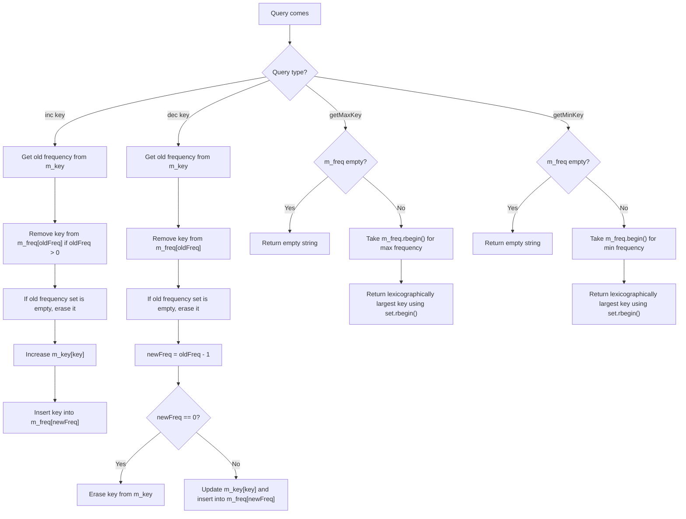

# All One — Complete Notes

## 1. Problem Statement

Design a data structure `AllOne` that supports the following operations:

| Operation | Meaning |
|---|---|
| `inc key` | Increase frequency of `key` by `1`. If key does not exist, insert it with frequency `1`. |
| `dec key` | Decrease frequency of `key` by `1`. If frequency becomes `0`, remove the key. It is guaranteed key exists before decrement. |
| `getMaxKey` | Return the key with maximum frequency. If multiple keys have maximum frequency, return lexicographically largest key. If empty, return `""`. |
| `getMinKey` | Return the key with minimum frequency. If multiple keys have minimum frequency, return lexicographically largest key. If empty, return `""`. |

## 2. Constraints

| Constraint | Value |
|---|---|
| Number of queries | `1 ≤ Q ≤ 10^5` |
| Key length | `1 ≤ |key| ≤ 20` |
| Time limit | `1 sec` |
| Memory | `256 MB` |

---

## 3. Brute Force Thinking

A simple approach is:

- Store frequency of each key in a map.
- For `getMaxKey`, scan all keys and find maximum frequency.
- For `getMinKey`, scan all keys and find minimum frequency.

### Problem with brute force

If there are `Q = 10^5` queries:

| Operation | Brute Complexity |
|---|---|
| `inc` | `O(1)` or `O(log n)` |
| `dec` | `O(1)` or `O(log n)` |
| `getMaxKey` | `O(n)` |
| `getMinKey` | `O(n)` |

If many queries are `getMaxKey` / `getMinKey`, this becomes too slow.

---

## 4. Optimal Approach

We maintain two maps:

```cpp
map<string, int> m_key;
map<int, set<string>> m_freq;
```

### Meaning

| Data Structure | Stores |
|---|---|
| `m_key` | `key -> frequency` |
| `m_freq` | `frequency -> set of keys having that frequency` |

Why `set<string>`?

Because if multiple keys have the same frequency, we need the **lexicographically largest key**.

In C++:

```cpp
*m_freq[f].rbegin()
```

gives the lexicographically largest key for frequency `f`.

---

## 5. Key Idea

### For `inc key`

Suppose:

```text
hello has frequency 2
```

After `inc hello`:

```text
hello frequency becomes 3
```

So we must:

1. Remove `"hello"` from `m_freq[2]`.
2. If `m_freq[2]` becomes empty, erase frequency `2`.
3. Increase `m_key["hello"]`.
4. Insert `"hello"` into `m_freq[3]`.

---

### For `dec key`

Suppose:

```text
hello has frequency 3
```

After `dec hello`:

```text
hello frequency becomes 2
```

So we must:

1. Remove `"hello"` from `m_freq[3]`.
2. If `m_freq[3]` becomes empty, erase frequency `3`.
3. Decrease `m_key["hello"]`.
4. If new frequency is `0`, erase `"hello"` from `m_key`.
5. Otherwise insert `"hello"` into `m_freq[2]`.

---

### For `getMaxKey`

`m_freq` is ordered by frequency.

So:

```cpp
auto it = m_freq.rbegin();
```

points to the maximum frequency.

Then:

```cpp
*it->second.rbegin()
```

gives the lexicographically largest key among keys with maximum frequency.

---

### For `getMinKey`

`m_freq.begin()` points to the minimum frequency.

Then:

```cpp
*it->second.rbegin()
```

gives the lexicographically largest key among keys with minimum frequency.

---

## 6. Mermaid Logic Flow



---

## 7. C++ Code

```cpp
#include <bits/stdc++.h>
using namespace std;

class AllOne {
private:
    map<string, int> m_key;
    map<int, set<string>> m_freq;

    void removeFromFreq(string key, int freq) {
        m_freq[freq].erase(key);

        if (m_freq[freq].empty()) {
            m_freq.erase(freq);
        }
    }

public:
    AllOne() {
    }

    void inc(string key) {
        int oldFreq = 0;

        if (m_key.count(key)) {
            oldFreq = m_key[key];
            removeFromFreq(key, oldFreq);
        }

        int newFreq = oldFreq + 1;

        m_key[key] = newFreq;
        m_freq[newFreq].insert(key);
    }

    void dec(string key) {
        int oldFreq = m_key[key];

        removeFromFreq(key, oldFreq);

        int newFreq = oldFreq - 1;

        if (newFreq == 0) {
            m_key.erase(key);
        } else {
            m_key[key] = newFreq;
            m_freq[newFreq].insert(key);
        }
    }

    string getMaxKey() {
        if (m_freq.empty()) return "";

        auto it = m_freq.rbegin();

        return *it->second.rbegin();
    }

    string getMinKey() {
        if (m_freq.empty()) return "";

        auto it = m_freq.begin();

        return *it->second.rbegin();
    }
};

int main() {
    int Q;
    cin >> Q;

    AllOne ds;

    while (Q--) {
        string query;
        cin >> query;

        if (query == "inc") {
            string key;
            cin >> key;
            ds.inc(key);
        } else if (query == "dec") {
            string key;
            cin >> key;
            ds.dec(key);
        } else if (query == "getMaxKey") {
            cout << ds.getMaxKey() << '\n';
        } else if (query == "getMinKey") {
            cout << ds.getMinKey() << '\n';
        }
    }

    return 0;
}
```

---

## 8. Complexity

Let:

```text
N = number of unique keys
```

| Operation | Complexity | Reason |
|---|---:|---|
| `inc` | `O(log N)` | map/set erase and insert |
| `dec` | `O(log N)` | map/set erase and insert |
| `getMaxKey` | `O(1)` / `O(log N)` iterator access | `rbegin()` on map and set |
| `getMinKey` | `O(1)` / `O(log N)` iterator access | `begin()` on map, `rbegin()` on set |

In practice:

```text
All operations are logarithmic because map and set are balanced BSTs.
```

---

## 9. Sample Input

```text
7
inc hello
inc hello
getMaxKey
getMinKey
inc bye
getMaxKey
getMinKey
```

## 10. Sample Output

```text
hello
hello
hello
bye
```

---

## 11. Dry Run

### Initial State

| Structure | State |
|---|---|
| `m_key` | `{}` |
| `m_freq` | `{}` |

---

### Query 1: `inc hello`

`hello` does not exist.

So insert with frequency `1`.

| Structure | State |
|---|---|
| `m_key` | `hello -> 1` |
| `m_freq` | `1 -> {hello}` |

---

### Query 2: `inc hello`

Old frequency:

```text
hello -> 1
```

Remove `hello` from frequency `1`.

Then increase to frequency `2`.

| Structure | State |
|---|---|
| `m_key` | `hello -> 2` |
| `m_freq` | `2 -> {hello}` |

---

### Query 3: `getMaxKey`

Maximum frequency is:

```text
2
```

Keys at frequency `2`:

```text
{hello}
```

Answer:

```text
hello
```

---

### Query 4: `getMinKey`

Minimum frequency is also:

```text
2
```

Keys at frequency `2`:

```text
{hello}
```

Answer:

```text
hello
```

---

### Query 5: `inc bye`

`bye` does not exist.

Insert with frequency `1`.

| Structure | State |
|---|---|
| `m_key` | `hello -> 2`, `bye -> 1` |
| `m_freq` | `1 -> {bye}`, `2 -> {hello}` |

---

### Query 6: `getMaxKey`

Maximum frequency:

```text
2
```

Keys:

```text
{hello}
```

Answer:

```text
hello
```

---

### Query 7: `getMinKey`

Minimum frequency:

```text
1
```

Keys:

```text
{bye}
```

Answer:

```text
bye
```

---

## 12. Full Dry Run Table

| Query | Action | `m_key` | `m_freq` | Output |
|---|---|---|---|---|
| `inc hello` | insert hello with freq 1 | `hello:1` | `1:{hello}` | - |
| `inc hello` | move hello 1 → 2 | `hello:2` | `2:{hello}` | - |
| `getMaxKey` | max freq = 2 | `hello:2` | `2:{hello}` | `hello` |
| `getMinKey` | min freq = 2 | `hello:2` | `2:{hello}` | `hello` |
| `inc bye` | insert bye with freq 1 | `hello:2, bye:1` | `1:{bye}, 2:{hello}` | - |
| `getMaxKey` | max freq = 2 | `hello:2, bye:1` | `1:{bye}, 2:{hello}` | `hello` |
| `getMinKey` | min freq = 1 | `hello:2, bye:1` | `1:{bye}, 2:{hello}` | `bye` |

---

## 13. Visual Diagram

After:

```text
inc hello
inc hello
inc bye
```

State is:

```text
m_key
----------------
hello -> 2
bye   -> 1
```

```text
m_freq
----------------
1 -> { bye }
2 -> { hello }
```

So:

```text
getMaxKey:
highest frequency = 2
keys = {hello}
answer = hello
```

```text
getMinKey:
lowest frequency = 1
keys = {bye}
answer = bye
```

---

## 14. Important Edge Cases

| Case | What to do |
|---|---|
| `getMaxKey` on empty DS | return `""` |
| `getMinKey` on empty DS | return `""` |
| `dec key` makes frequency `0` | remove key completely |
| old frequency set becomes empty | erase that frequency from `m_freq` |
| multiple keys same frequency | return lexicographically largest key using `rbegin()` |

---

## 15. Common Mistakes

| Mistake | Why it is wrong |
|---|---|
| Not erasing empty frequency from `m_freq` | `getMinKey` / `getMaxKey` may see empty frequency |
| Using `begin()` on set instead of `rbegin()` | gives lexicographically smallest, but problem asks largest |
| Forgetting to erase key from old frequency | key appears in multiple frequency groups |
| Not removing key from `m_key` when freq becomes 0 | deleted key still exists |
| Using unordered_map for `m_freq` | cannot quickly get min/max frequency |

---

## 16. 1-Minute Mental Map

```text
All One = two-level mapping problem.

m_key:
    key -> frequency

m_freq:
    frequency -> sorted keys

inc:
    remove key from old freq
    add key to new freq

dec:
    remove key from old freq
    if new freq is 0, delete key
    else add key to new freq

getMaxKey:
    m_freq.rbegin()
    key = set.rbegin()

getMinKey:
    m_freq.begin()
    key = set.rbegin()

Why set.rbegin?
    because same frequency needs lexicographically largest key.

Why map for frequency?
    because need smallest and largest frequency quickly.
```

---

## 17. One-Line Revision

```text
Use key→freq map and freq→sorted keys map; move key between frequency buckets on inc/dec; min/max frequency comes from map begin/rbegin.
```