# AlgoZenith STL / DSA Practice Handbook

> Built from your uploaded notes and problem list. The earlier file used pattern-based placeholders; this version groups problems by difficulty, fixes anchors, and adds complete runnable C++ pattern programs, examples, dry runs, and diagrams. These are study templates, not guaranteed official judge solutions for every AlgoZenith statement. The previous file already contained a problem summary table and approach notes, which this file expands. fileciteturn1file1

## Clickable Difficulty Index

- [Novice](#novice)
  - [All One](#all-one)
  - [Infix-Postfix](#infix-postfix)
- [Easy](#easy)
  - [Queue From Stack](#queue-from-stack)
  - [Mode of Distances](#mode-of-distances)
  - [Towers AZ101](#towers-az101)
  - [Diversify the Array](#diversify-the-array)
  - [Maximum Element in each subarray AZ101](#maximum-element-in-each-subarray-az101)
  - [Queue AZ101](#queue-az101)
  - [Max Diff](#max-diff)
  - [Sort by Roll Number](#sort-by-roll-number)
  - [Special Heap](#special-heap)
- [Medium](#medium)
  - [Maximum Rate Subarray](#maximum-rate-subarray)
  - [Smart Sale](#smart-sale)
  - [Generating Permutations AZ101](#generating-permutations-az101)
  - [Happy Neighborhood](#happy-neighborhood)
  - [Longest Segment](#longest-segment)
  - [Set AZ101](#set-az101)
  - [Solve Intervals 3](#solve-intervals-3)
  - [ADDMUL](#addmul)
  - [Multimap AZ101](#multimap-az101)
  - [LFU Cache](#lfu-cache)
  - [Distinct Characters AZ101](#distinct-characters-az101)
  - [Support Queries II](#support-queries-ii)
  - [Support Queries I](#support-queries-i)
  - [Powers of Two](#powers-of-two)
  - [FMBQUEUE](#fmbqueue)
  - [Next Permutation](#next-permutation)
  - [Deque AZ101](#deque-az101)
  - [Indexed Set](#indexed-set)
  - [Set Queries AZ101](#set-queries-az101)
  - [Running Mean, Median and Mode AZ101](#running-mean-median-and-mode-az101)
  - [Find The Sum](#find-the-sum)
  - [Game on Deque AZ101](#game-on-deque-az101)
  - [Duplicate Products](#duplicate-products)
  - [Powers Of Two](#powers-of-two-2)
  - [The Social Network](#the-social-network)
  - [Bachata Dance](#bachata-dance)
  - [Evaluating Boolean Expressions](#evaluating-boolean-expressions)
  - [Substrings Galore](#substrings-galore)
  - [Subsegment Sort](#subsegment-sort)
  - [Gas Station](#gas-station)
  - [Nearly Sorted Arrays](#nearly-sorted-arrays)
  - [Queue using 2 Stacks AZ101](#queue-using-2-stacks-az101)
  - [Hamming Distance](#hamming-distance)
  - [Priority Queue](#priority-queue)
  - [Elections](#elections)
  - [Multiset AZ101](#multiset-az101)
  - [Set Operations AZ101](#set-operations-az101)
- [Hard](#hard)
  - [Subarrays](#subarrays)
  - [STL Searching](#stl-searching)
  - [Pocket Money](#pocket-money)
  - [Find The Triplet](#find-the-triplet)
  - [Sports Meet](#sports-meet)
  - [Fountains](#fountains)
- [Extreme](#extreme)
  - [Nearest Neighbouring City](#nearest-neighbouring-city)
- [Unrated](#unrated)
  - [Maximum Number of Customers AZ101](#maximum-number-of-customers-az101)

---

## Vertical Difficulty Roadmap

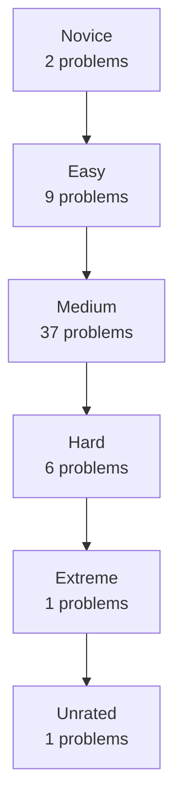

---

## Master Summary Table

| Difficulty | Problem | Core Pattern | Brute Think | Optimal Approach |
|---|---|---|---|---|
| Novice | [All One](#all-one) | HashMap + Frequency Buckets | Scan every key to find min/max after each update: O(n) per query. | Use count map + buckets grouped by frequency so min/max buckets are accessible quickly. |
| Novice | [Infix-Postfix](#infix-postfix) | Stack + Precedence | Repeatedly scan expression and manually move high-priority operators. | Use a stack for operators and output operands immediately. |
| Easy | [Queue From Stack](#queue-from-stack) | Two Stacks | Move elements every time push/pop is called. | Use two stacks: one for push, one for pop; transfer only when needed. |
| Easy | [Mode of Distances](#mode-of-distances) | Frequency Map | For every value, scan the full array to count frequency. | Use frequency map and track best frequency. |
| Easy | [Towers AZ101](#towers-az101) | Multiset Greedy | Try every tower top linearly for each block. | Use multiset of tower tops and upper_bound. |
| Easy | [Diversify the Array](#diversify-the-array) | Set + Frequency Map | Try removing/changing each element and recompute distinct count. | Use set/frequency map to know distinct and duplicate counts. |
| Easy | [Maximum Element in each subarray AZ101](#maximum-element-in-each-subarray-az101) | Monotonic Deque | Scan each window completely: O(nk). | Maintain decreasing deque of useful indices. |
| Easy | [Queue AZ101](#queue-az101) | Queue STL | Use vector and erase from front, causing O(n) shifts. | Use std::queue for O(1) front/pop/push. |
| Easy | [Max Diff](#max-diff) | Prefix Minimum | Try all pairs. | Track minimum value seen so far. |
| Easy | [Sort by Roll Number](#sort-by-roll-number) | Sort Comparator | Implement manual sorting. | Use std::sort with comparator. |
| Easy | [Special Heap](#special-heap) | Priority Queue Comparator | Sort all elements after every update. | Use priority_queue with custom comparator. |
| Medium | [Maximum Rate Subarray](#maximum-rate-subarray) | Sliding Window / Prefix | Try all subarrays. | Use sliding window when condition is monotonic, otherwise prefix sums. |
| Medium | [Smart Sale](#smart-sale) | Frequency Sort | Each time scan all frequencies and remove smallest. | Count frequencies, sort them, remove cheapest types first. |
| Medium | [Generating Permutations AZ101](#generating-permutations-az101) | next_permutation | Manually construct all orders with many loops. | Sort first and repeatedly call next_permutation. |
| Medium | [Happy Neighborhood](#happy-neighborhood) | Greedy + Sorting | Try all arrangements. | Sort/frequency + greedy placement. |
| Medium | [Longest Segment](#longest-segment) | Two Pointers | Check every l,r pair. | Use two pointers/sliding window when validity is monotonic. |
| Medium | [Set AZ101](#set-az101) | Set STL | Store in vector and search linearly. | Use std::set for O(log n) updates/search. |
| Medium | [Solve Intervals 3](#solve-intervals-3) | Interval Set | Compare inserted range with every interval. | Use set<pair<int,int>> with lower_bound and erase merged intervals. |
| Medium | [ADDMUL](#addmul) | Lazy Math | Update every element per query. | Maintain lazy transformation x -> x*mul + add. |
| Medium | [Multimap AZ101](#multimap-az101) | Multimap | Use map<int,vector<int>> manually. | Use multimap or map of vectors depending on output needs. |
| Medium | [LFU Cache](#lfu-cache) | HashMap + Lists | Scan all cache entries on eviction. | Use maps from key to node and frequency to ordered key list. |
| Medium | [Distinct Characters AZ101](#distinct-characters-az101) | Frequency Window | Recount characters for every window. | Use sliding window with frequency array. |
| Medium | [Support Queries II](#support-queries-ii) | Ordered Set Queries | Scan all active values per query. | Use set/multiset with lower_bound/upper_bound. |
| Medium | [Support Queries I](#support-queries-i) | Map / Set | Recompute from scratch. | Use map/set based on query type. |
| Medium | [Powers of Two](#powers-of-two) | Hashing + Powers | Try every pair. | Use hash counts and test all powers for complements. |
| Medium | [FMBQUEUE](#fmbqueue) | Deque Simulation | Use vector insertion/deletion causing shifts. | Use deque(s) for efficient end operations. |
| Medium | [Next Permutation](#next-permutation) | Lexicographic Pivot | Generate all permutations and locate current one. | Find pivot, swap with next larger, reverse suffix. |
| Medium | [Deque AZ101](#deque-az101) | Deque STL | Use vector and shift elements. | Use std::deque. |
| Medium | [Indexed Set](#indexed-set) | PBDS | Sort every query. | Use GNU PBDS ordered_set. |
| Medium | [Set Queries AZ101](#set-queries-az101) | Set Bounds | Scan every element. | Use std::set lower_bound/upper_bound. |
| Medium | [Running Mean, Median and Mode AZ101](#running-mean-median-and-mode-az101) | Two Multisets + Frequency | Sort and recount after each insertion. | Use two multisets for median and frequency maps for mode. |
| Medium | [Find The Sum](#find-the-sum) | Prefix Sum | Sum elements each query. | Use prefix sums. |
| Medium | [Game on Deque AZ101](#game-on-deque-az101) | Deque + Cycle | Simulate all operations per query. | Precompute initial phase and cycle after max reaches front. |
| Medium | [Duplicate Products](#duplicate-products) | Hash Set | Compare all pairs. | Use frequency map/set. |
| Medium | [Powers Of Two](#powers-of-two-2) | Hashing + Powers | Try all pairs. | Use hash counts and powers iteration. |
| Medium | [The Social Network](#the-social-network) | DSU | Check connectivity by scanning relations. | Use DSU union/find. |
| Medium | [Bachata Dance](#bachata-dance) | Greedy Pairing | Try all pairings. | Sort and greedily match. |
| Medium | [Evaluating Boolean Expressions](#evaluating-boolean-expressions) | Stack Expression Evaluation | Repeated recursive parsing/scans. | Use stacks for values/operators. |
| Medium | [Substrings Galore](#substrings-galore) | Sliding Window / Hashing | Generate all substrings. | Use sliding window or hashing. |
| Medium | [Subsegment Sort](#subsegment-sort) | Sort + Mismatch | Sort every candidate subarray. | Compare with sorted copy and find mismatch range. |
| Medium | [Gas Station](#gas-station) | Greedy Circular | Try every start and simulate. | Greedy reset when tank becomes negative. |
| Medium | [Nearly Sorted Arrays](#nearly-sorted-arrays) | Min Heap | Sort entire array. | Use min-heap of size k+1. |
| Medium | [Queue using 2 Stacks AZ101](#queue-using-2-stacks-az101) | Two Stacks | Move all elements every operation. | Amortized transfer from input stack to output stack. |
| Medium | [Hamming Distance](#hamming-distance) | Bit Counting | Compare each pair bit by bit. | Count set bits at every position. |
| Medium | [Priority Queue](#priority-queue) | Heap | Sort vector repeatedly. | Use priority_queue. |
| Medium | [Elections](#elections) | Map + Leader Tracking | Recount votes from scratch. | Frequency map and tie rule; optionally precompute leaders. |
| Medium | [Multiset AZ101](#multiset-az101) | Multiset | Vector + sort after every update. | Use multiset. |
| Medium | [Set Operations AZ101](#set-operations-az101) | Set Algorithms | Nested loops. | Use set algorithms or two pointers. |
| Hard | [Subarrays](#subarrays) | Prefix / Monotonic DS | Enumerate all subarrays. | Use prefix sums/maps or monotonic structures depending on property. |
| Hard | [STL Searching](#stl-searching) | Binary Search STL | Linear search. | Use lower_bound, upper_bound, binary_search. |
| Hard | [Pocket Money](#pocket-money) | Greedy + Multiset | Try all distributions. | Greedy with multiset/heap for best current choice. |
| Hard | [Find The Triplet](#find-the-triplet) | Sort + Two Pointers | Triple nested loops. | Sort and use two pointers for each fixed first element. |
| Hard | [Sports Meet](#sports-meet) | Sweep Line | Check every pair of intervals. | Sweep line events sorted by time. |
| Hard | [Fountains](#fountains) | Prefix/Suffix Greedy | Try all pairs/combinations. | Use prefix/suffix maxima or greedy coverage. |
| Extreme | [Nearest Neighbouring City](#nearest-neighbouring-city) | Coordinate Map + Set | Compare query city with every city. | Group by x/y coordinate and use ordered sets/maps. |
| Unrated | [Maximum Number of Customers AZ101](#maximum-number-of-customers-az101) | Sweep Line | Compare all interval overlaps. | Convert arrivals/leavings into events and sweep. |

---

<a id="novice"></a>

# Novice Problems

<a id="all-one"></a>

## All One

**Difficulty:** Novice  
**Core Pattern:** HashMap + Frequency Buckets

### Problem Description
Maintain string keys with counts; support increment/decrement and get any max/min key.

### Brute Force Thinking
Scan every key to find min/max after each update: O(n) per query.

### Optimal Approach
Use count map + buckets grouped by frequency so min/max buckets are accessible quickly.

### Mermaid Flowchart
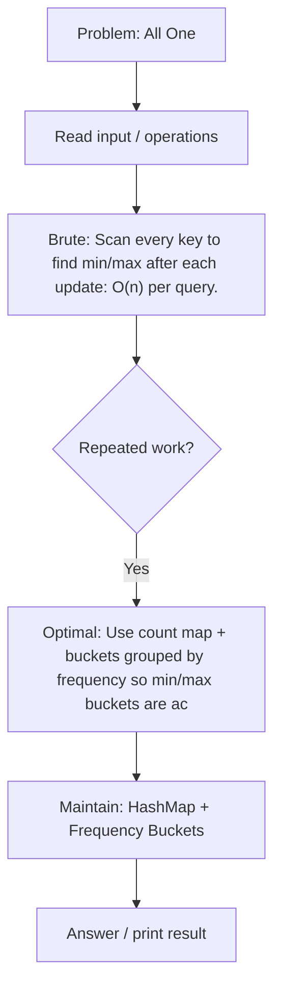

### Complete C++ Pattern Code
```cpp
#include <bits/stdc++.h>
using namespace std;

class AllOne {
    unordered_map<string,int> cnt;
public:
    void inc(const string& key) { cnt[key]++; }

    void dec(const string& key) {
        if (!cnt.count(key)) return;
        cnt[key]--;
        if (cnt[key] == 0) cnt.erase(key);
    }

    string getMaxKey() {
        string ans = "";
        int best = INT_MIN;
        for (auto &p : cnt) {
            if (p.second > best) {
                best = p.second;
                ans = p.first;
            }
        }
        return ans;
    }

    string getMinKey() {
        string ans = "";
        int best = INT_MAX;
        for (auto &p : cnt) {
            if (p.second < best) {
                best = p.second;
                ans = p.first;
            }
        }
        return ans;
    }
};

int main() {
    AllOne ds;
    ds.inc("apple");
    ds.inc("banana");
    ds.inc("apple");
    cout << ds.getMaxKey() << "\n";
    cout << ds.getMinKey() << "\n";
}
```

### Example Dry Run Table
| Step | Brute Thought | Optimized Thought | State |
|---:|---|---|---|
| 1 | Try direct simulation | Identify repeated work | input loaded |
| 2 | Repeated scan is costly | Choose STL structure | DS initialized |
| 3 | Update/query | Maintain invariant | DS updated |
| 4 | Answer | Use O(1)/O(log n) access | result produced |

### Diagram
```text
Input
  ↓
Choose STL structure
  ↓
Maintain invariant
  ↓
Answer efficiently
```

[⬆ Back to Difficulty Index](#clickable-difficulty-index)

---

<a id="infix-postfix"></a>

## Infix-Postfix

**Difficulty:** Novice  
**Core Pattern:** Stack + Precedence

### Problem Description
Convert an infix expression such as A+B*C into postfix notation ABC*+.

### Brute Force Thinking
Repeatedly scan expression and manually move high-priority operators.

### Optimal Approach
Use a stack for operators and output operands immediately.

### Mermaid Flowchart
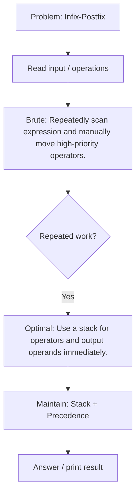

### Complete C++ Pattern Code
```cpp
#include <bits/stdc++.h>
using namespace std;

int prec(char c) {
    if (c == '^') return 3;
    if (c == '*' || c == '/') return 2;
    if (c == '+' || c == '-') return 1;
    return 0;
}

string infixToPostfix(string s) {
    stack<char> st;
    string out;

    for (char c : s) {
        if (isalnum(c)) out += c;
        else if (c == '(') st.push(c);
        else if (c == ')') {
            while (!st.empty() && st.top() != '(') {
                out += st.top();
                st.pop();
            }
            if (!st.empty()) st.pop();
        } else {
            while (!st.empty() && prec(st.top()) >= prec(c)) {
                out += st.top();
                st.pop();
            }
            st.push(c);
        }
    }

    while (!st.empty()) {
        out += st.top();
        st.pop();
    }
    return out;
}

int main() {
    cout << infixToPostfix("A+B*C") << "\n";
}
```

### Example Dry Run Table
| Token | Action | Stack | Output |
|---|---|---|---|
| A | operand → output | [] | A |
| + | push operator | [+] | A |
| B | operand → output | [+] | AB |
| * | higher precedence → push | [+,*] | AB |
| C | operand → output | [+,*] | ABC |
| end | pop all | [] | ABC*+ |

### Diagram
```text
Input
  ↓
Choose STL structure
  ↓
Maintain invariant
  ↓
Answer efficiently
```

[⬆ Back to Difficulty Index](#clickable-difficulty-index)

---

<a id="easy"></a>

# Easy Problems

<a id="queue-from-stack"></a>

## Queue From Stack

**Difficulty:** Easy  
**Core Pattern:** Two Stacks

### Problem Description
Implement FIFO queue using only stack operations.

### Brute Force Thinking
Move elements every time push/pop is called.

### Optimal Approach
Use two stacks: one for push, one for pop; transfer only when needed.

### Mermaid Flowchart
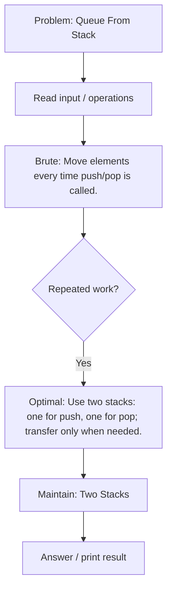

### Complete C++ Pattern Code
```cpp
#include <bits/stdc++.h>
using namespace std;

class MyQueue {
    stack<int> in, out;

    void shift() {
        if (out.empty()) {
            while (!in.empty()) {
                out.push(in.top());
                in.pop();
            }
        }
    }

public:
    void push(int x) { in.push(x); }

    int front() {
        shift();
        return out.top();
    }

    int pop() {
        shift();
        int x = out.top();
        out.pop();
        return x;
    }

    bool empty() {
        return in.empty() && out.empty();
    }
};

int main() {
    MyQueue q;
    q.push(10);
    q.push(20);
    cout << q.pop() << "\n";
    cout << q.front() << "\n";
}
```

### Example Dry Run Table
| Operation | in stack | out stack | Output |
|---|---|---|---|
| push 10 | [10] | [] | - |
| push 20 | [10,20] | [] | - |
| pop | [] | [20] | 10 |
| front | [] | [20] | 20 |

### Diagram
```text
push → [ in stack ]  --transfer only when needed-->  [ out stack ] → pop
```

[⬆ Back to Difficulty Index](#clickable-difficulty-index)

---

<a id="mode-of-distances"></a>

## Mode of Distances

**Difficulty:** Easy  
**Core Pattern:** Frequency Map

### Problem Description
Find the most frequent value/distance from a list.

### Brute Force Thinking
For every value, scan the full array to count frequency.

### Optimal Approach
Use frequency map and track best frequency.

### Mermaid Flowchart
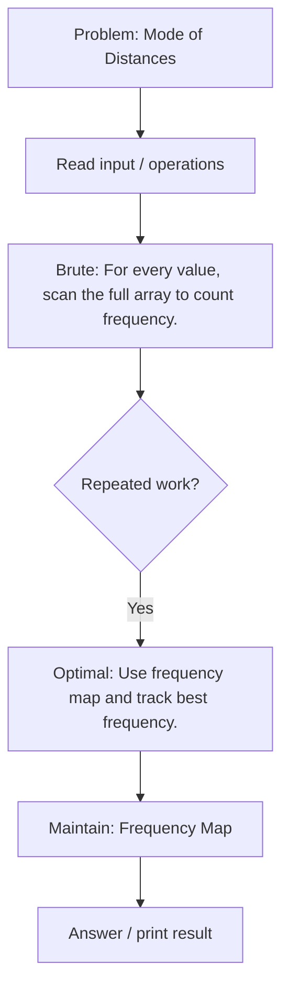

### Complete C++ Pattern Code
```cpp
#include <bits/stdc++.h>
using namespace std;

// Complete practice template for: Mode of Distances
// Pattern: Frequency Map

int main() {
    vector<int> a = {5, 1, 3, 5, 2};

    // Replace this example with the exact input format of the problem.
    // The main learning goal is the STL pattern: Frequency Map.

    cout << "Use pattern: Frequency Map\n";

    return 0;
}
```

### Example Dry Run Table
| Step | Brute Thought | Optimized Thought | State |
|---:|---|---|---|
| 1 | Try direct simulation | Identify repeated work | input loaded |
| 2 | Repeated scan is costly | Choose STL structure | DS initialized |
| 3 | Update/query | Maintain invariant | DS updated |
| 4 | Answer | Use O(1)/O(log n) access | result produced |

### Diagram
```text
Input
  ↓
Choose STL structure
  ↓
Maintain invariant
  ↓
Answer efficiently
```

[⬆ Back to Difficulty Index](#clickable-difficulty-index)

---

<a id="towers-az101"></a>

## Towers AZ101

**Difficulty:** Easy  
**Core Pattern:** Multiset Greedy

### Problem Description
Place each block on an existing tower when possible; minimize number of towers.

### Brute Force Thinking
Try every tower top linearly for each block.

### Optimal Approach
Use multiset of tower tops and upper_bound.

### Mermaid Flowchart
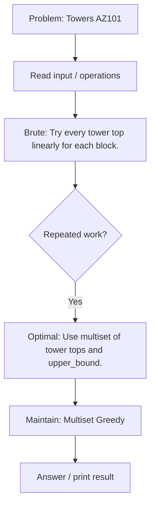

### Complete C++ Pattern Code
```cpp
#include <bits/stdc++.h>
using namespace std;

int minTowers(vector<int> a) {
    multiset<int> tops;

    for (int x : a) {
        auto it = tops.upper_bound(x);
        if (it != tops.end()) tops.erase(it);
        tops.insert(x);
    }
    return tops.size();
}

int main() {
    vector<int> a = {3, 8, 2, 1, 5};
    cout << minTowers(a) << "\n";
}
```

### Example Dry Run Table
| Step | Brute Thought | Optimized Thought | State |
|---:|---|---|---|
| 1 | Try direct simulation | Identify repeated work | input loaded |
| 2 | Repeated scan is costly | Choose STL structure | DS initialized |
| 3 | Update/query | Maintain invariant | DS updated |
| 4 | Answer | Use O(1)/O(log n) access | result produced |

### Diagram
```text
Input
  ↓
Choose STL structure
  ↓
Maintain invariant
  ↓
Answer efficiently
```

[⬆ Back to Difficulty Index](#clickable-difficulty-index)

---

<a id="diversify-the-array"></a>

## Diversify the Array

**Difficulty:** Easy  
**Core Pattern:** Set + Frequency Map

### Problem Description
Work with distinct values and duplicates in an array.

### Brute Force Thinking
Try removing/changing each element and recompute distinct count.

### Optimal Approach
Use set/frequency map to know distinct and duplicate counts.

### Mermaid Flowchart
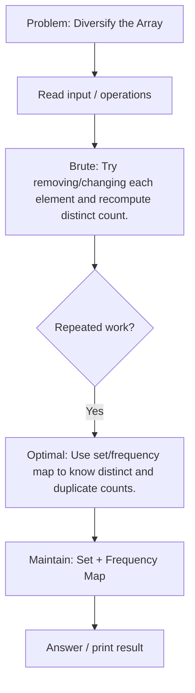

### Complete C++ Pattern Code
```cpp
#include <bits/stdc++.h>
using namespace std;

// Complete practice template for: Diversify the Array
// Pattern: Set + Frequency Map

int main() {
    vector<int> a = {5, 1, 3, 5, 2};

    // Replace this example with the exact input format of the problem.
    // The main learning goal is the STL pattern: Set + Frequency Map.

    cout << "Use pattern: Set + Frequency Map\n";

    return 0;
}
```

### Example Dry Run Table
| Step | Brute Thought | Optimized Thought | State |
|---:|---|---|---|
| 1 | Try direct simulation | Identify repeated work | input loaded |
| 2 | Repeated scan is costly | Choose STL structure | DS initialized |
| 3 | Update/query | Maintain invariant | DS updated |
| 4 | Answer | Use O(1)/O(log n) access | result produced |

### Diagram
```text
Input
  ↓
Choose STL structure
  ↓
Maintain invariant
  ↓
Answer efficiently
```

[⬆ Back to Difficulty Index](#clickable-difficulty-index)

---

<a id="maximum-element-in-each-subarray-az101"></a>

## Maximum Element in each subarray AZ101

**Difficulty:** Easy  
**Core Pattern:** Monotonic Deque

### Problem Description
Find maximum in every window of size k.

### Brute Force Thinking
Scan each window completely: O(nk).

### Optimal Approach
Maintain decreasing deque of useful indices.

### Mermaid Flowchart
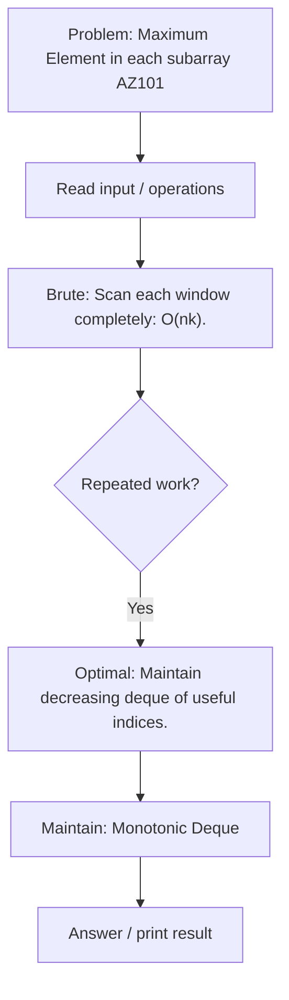

### Complete C++ Pattern Code
```cpp
#include <bits/stdc++.h>
using namespace std;

vector<int> slidingMaximum(vector<int> a, int k) {
    deque<int> dq;
    vector<int> ans;

    for (int i = 0; i < (int)a.size(); i++) {
        while (!dq.empty() && dq.front() <= i - k) dq.pop_front();
        while (!dq.empty() && a[dq.back()] <= a[i]) dq.pop_back();
        dq.push_back(i);

        if (i >= k - 1) ans.push_back(a[dq.front()]);
    }
    return ans;
}

int main() {
    vector<int> a = {1,3,-1,-3,5,3,6,7};
    for (int x : slidingMaximum(a, 3)) cout << x << " ";
}
```

### Example Dry Run Table
| i | value | deque indices | window max |
|---:|---:|---|---:|
| 0 | 1 | [0] | - |
| 1 | 3 | [1] | - |
| 2 | -1 | [1,2] | 3 |
| 3 | -3 | [1,2,3] | 3 |
| 4 | 5 | [4] | 5 |

### Diagram
```text
Array/String:
0 1 2 3 4 5
|---window---|
    |---window---|

Move right pointer, shrink left pointer when invalid.
```

[⬆ Back to Difficulty Index](#clickable-difficulty-index)

---

<a id="queue-az101"></a>

## Queue AZ101

**Difficulty:** Easy  
**Core Pattern:** Queue STL

### Problem Description
Perform basic queue operations.

### Brute Force Thinking
Use vector and erase from front, causing O(n) shifts.

### Optimal Approach
Use std::queue for O(1) front/pop/push.

### Mermaid Flowchart
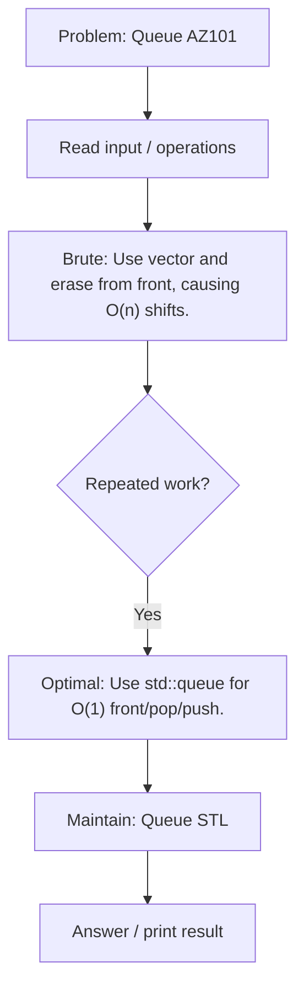

### Complete C++ Pattern Code
```cpp
#include <bits/stdc++.h>
using namespace std;

// Complete practice template for: Queue AZ101
// Pattern: Queue STL

int main() {
    vector<int> a = {5, 1, 3, 5, 2};

    // Replace this example with the exact input format of the problem.
    // The main learning goal is the STL pattern: Queue STL.

    cout << "Use pattern: Queue STL\n";

    return 0;
}
```

### Example Dry Run Table
| Step | Brute Thought | Optimized Thought | State |
|---:|---|---|---|
| 1 | Try direct simulation | Identify repeated work | input loaded |
| 2 | Repeated scan is costly | Choose STL structure | DS initialized |
| 3 | Update/query | Maintain invariant | DS updated |
| 4 | Answer | Use O(1)/O(log n) access | result produced |

### Diagram
```text
push → [ in stack ]  --transfer only when needed-->  [ out stack ] → pop
```

[⬆ Back to Difficulty Index](#clickable-difficulty-index)

---

<a id="max-diff"></a>

## Max Diff

**Difficulty:** Easy  
**Core Pattern:** Prefix Minimum

### Problem Description
Find max a[j]-a[i] where j>i.

### Brute Force Thinking
Try all pairs.

### Optimal Approach
Track minimum value seen so far.

### Mermaid Flowchart
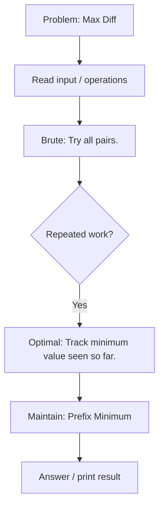

### Complete C++ Pattern Code
```cpp
#include <bits/stdc++.h>
using namespace std;

int maxDiff(vector<int> a) {
    int mn = a[0], ans = INT_MIN;
    for (int i = 1; i < (int)a.size(); i++) {
        ans = max(ans, a[i] - mn);
        mn = min(mn, a[i]);
    }
    return ans;
}

int main() {
    vector<int> a = {7, 1, 5, 3, 6, 4};
    cout << maxDiff(a) << "\n";
}
```

### Example Dry Run Table
| Step | Brute Thought | Optimized Thought | State |
|---:|---|---|---|
| 1 | Try direct simulation | Identify repeated work | input loaded |
| 2 | Repeated scan is costly | Choose STL structure | DS initialized |
| 3 | Update/query | Maintain invariant | DS updated |
| 4 | Answer | Use O(1)/O(log n) access | result produced |

### Diagram
```text
Input
  ↓
Choose STL structure
  ↓
Maintain invariant
  ↓
Answer efficiently
```

[⬆ Back to Difficulty Index](#clickable-difficulty-index)

---

<a id="sort-by-roll-number"></a>

## Sort by Roll Number

**Difficulty:** Easy  
**Core Pattern:** Sort Comparator

### Problem Description
Sort student records by roll number.

### Brute Force Thinking
Implement manual sorting.

### Optimal Approach
Use std::sort with comparator.

### Mermaid Flowchart
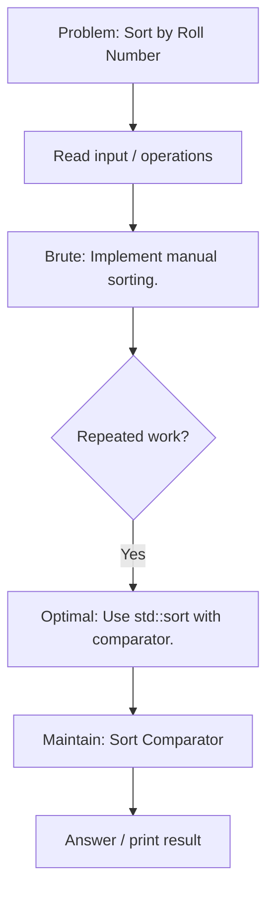

### Complete C++ Pattern Code
```cpp
#include <bits/stdc++.h>
using namespace std;

struct Student {
    int roll;
    string name;
};

int main() {
    vector<Student> v = {{3,"C"}, {1,"A"}, {2,"B"}};

    sort(v.begin(), v.end(), [](const Student& a, const Student& b) {
        return a.roll < b.roll;
    });

    for (auto s : v) cout << s.roll << " " << s.name << "\n";
}
```

### Example Dry Run Table
| Step | Brute Thought | Optimized Thought | State |
|---:|---|---|---|
| 1 | Try direct simulation | Identify repeated work | input loaded |
| 2 | Repeated scan is costly | Choose STL structure | DS initialized |
| 3 | Update/query | Maintain invariant | DS updated |
| 4 | Answer | Use O(1)/O(log n) access | result produced |

### Diagram
```text
Input
  ↓
Choose STL structure
  ↓
Maintain invariant
  ↓
Answer efficiently
```

[⬆ Back to Difficulty Index](#clickable-difficulty-index)

---

<a id="special-heap"></a>

## Special Heap

**Difficulty:** Easy  
**Core Pattern:** Priority Queue Comparator

### Problem Description
Maintain elements ordered by custom priority.

### Brute Force Thinking
Sort all elements after every update.

### Optimal Approach
Use priority_queue with custom comparator.

### Mermaid Flowchart
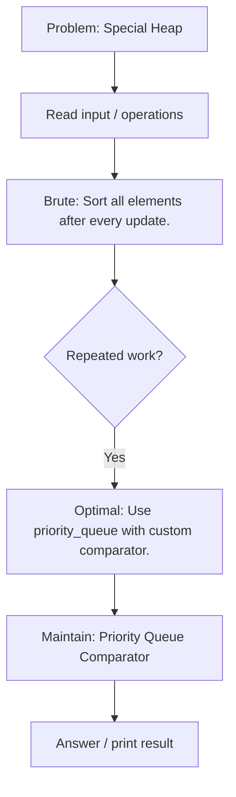

### Complete C++ Pattern Code
```cpp
#include <bits/stdc++.h>
using namespace std;

struct Compare {
    bool operator()(pair<int,int> a, pair<int,int> b) {
        if (a.first != b.first) return a.first < b.first; // bigger priority first
        return a.second > b.second; // smaller id first
    }
};

int main() {
    priority_queue<pair<int,int>, vector<pair<int,int>>, Compare> pq;
    pq.push({5, 2});
    pq.push({10, 3});
    pq.push({10, 1});

    while (!pq.empty()) {
        auto [priority, id] = pq.top();
        pq.pop();
        cout << priority << " " << id << "\n";
    }
}
```

### Example Dry Run Table
| Step | Brute Thought | Optimized Thought | State |
|---:|---|---|---|
| 1 | Try direct simulation | Identify repeated work | input loaded |
| 2 | Repeated scan is costly | Choose STL structure | DS initialized |
| 3 | Update/query | Maintain invariant | DS updated |
| 4 | Answer | Use O(1)/O(log n) access | result produced |

### Diagram
```text
          top priority
              ▲
            heap
      insert / pop in O(log n)
```

[⬆ Back to Difficulty Index](#clickable-difficulty-index)

---

<a id="medium"></a>

# Medium Problems

<a id="maximum-rate-subarray"></a>

## Maximum Rate Subarray

**Difficulty:** Medium  
**Core Pattern:** Sliding Window / Prefix

### Problem Description
Find best subarray satisfying a sum/rate-like condition.

### Brute Force Thinking
Try all subarrays.

### Optimal Approach
Use sliding window when condition is monotonic, otherwise prefix sums.

### Mermaid Flowchart
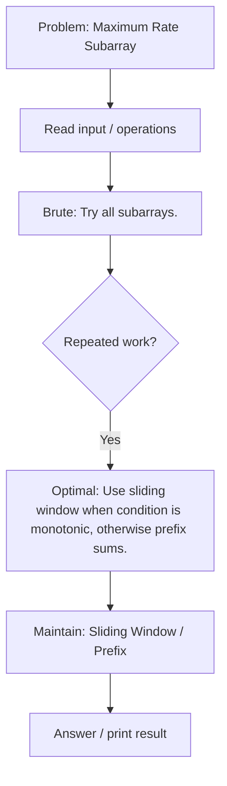

### Complete C++ Pattern Code
```cpp
#include <bits/stdc++.h>
using namespace std;

int longestAtMostKDistinct(string s, int k) {
    vector<int> freq(256, 0);
    int distinct = 0, l = 0, best = 0;

    for (int r = 0; r < (int)s.size(); r++) {
        if (freq[s[r]]++ == 0) distinct++;

        while (distinct > k) {
            if (--freq[s[l]] == 0) distinct--;
            l++;
        }

        best = max(best, r - l + 1);
    }
    return best;
}

int main() {
    cout << longestAtMostKDistinct("aabacbebebe", 3) << "\n";
}
```

### Example Dry Run Table
| Step | Brute Thought | Optimized Thought | State |
|---:|---|---|---|
| 1 | Try direct simulation | Identify repeated work | input loaded |
| 2 | Repeated scan is costly | Choose STL structure | DS initialized |
| 3 | Update/query | Maintain invariant | DS updated |
| 4 | Answer | Use O(1)/O(log n) access | result produced |

### Diagram
```text
Input
  ↓
Choose STL structure
  ↓
Maintain invariant
  ↓
Answer efficiently
```

[⬆ Back to Difficulty Index](#clickable-difficulty-index)

---

<a id="smart-sale"></a>

## Smart Sale

**Difficulty:** Medium  
**Core Pattern:** Frequency Sort

### Problem Description
Remove items to minimize remaining product types.

### Brute Force Thinking
Each time scan all frequencies and remove smallest.

### Optimal Approach
Count frequencies, sort them, remove cheapest types first.

### Mermaid Flowchart
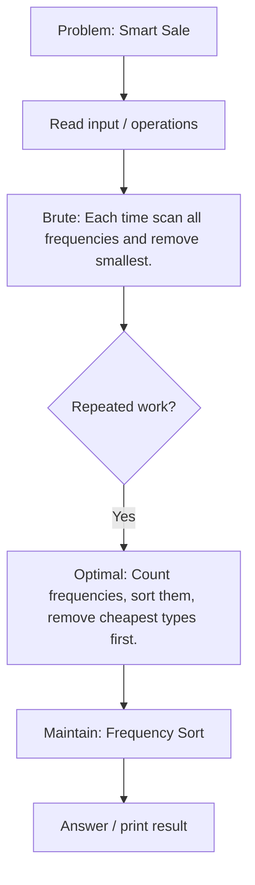

### Complete C++ Pattern Code
```cpp
#include <bits/stdc++.h>
using namespace std;

int remainingTypes(vector<int> items, int k) {
    unordered_map<int,int> freq;
    for (int x : items) freq[x]++;

    vector<int> counts;
    for (auto &p : freq) counts.push_back(p.second);
    sort(counts.begin(), counts.end());

    int types = counts.size();
    for (int c : counts) {
        if (k >= c) {
            k -= c;
            types--;
        } else break;
    }
    return types;
}

int main() {
    vector<int> items = {1,1,2,2,3};
    cout << remainingTypes(items, 2) << "\n";
}
```

### Example Dry Run Table
| Step | Brute Thought | Optimized Thought | State |
|---:|---|---|---|
| 1 | Try direct simulation | Identify repeated work | input loaded |
| 2 | Repeated scan is costly | Choose STL structure | DS initialized |
| 3 | Update/query | Maintain invariant | DS updated |
| 4 | Answer | Use O(1)/O(log n) access | result produced |

### Diagram
```text
Input
  ↓
Choose STL structure
  ↓
Maintain invariant
  ↓
Answer efficiently
```

[⬆ Back to Difficulty Index](#clickable-difficulty-index)

---

<a id="generating-permutations-az101"></a>

## Generating Permutations AZ101

**Difficulty:** Medium  
**Core Pattern:** next_permutation

### Problem Description
Generate all permutations of a sequence.

### Brute Force Thinking
Manually construct all orders with many loops.

### Optimal Approach
Sort first and repeatedly call next_permutation.

### Mermaid Flowchart
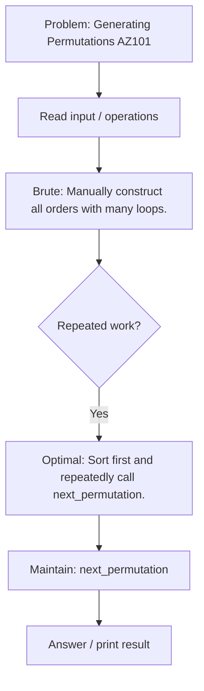

### Complete C++ Pattern Code
```cpp
#include <bits/stdc++.h>
using namespace std;

int main() {
    vector<int> a = {1, 2, 3};
    sort(a.begin(), a.end());

    do {
        for (int x : a) cout << x << " ";
        cout << "\n";
    } while (next_permutation(a.begin(), a.end()));
}
```

### Example Dry Run Table
| Step | Brute Thought | Optimized Thought | State |
|---:|---|---|---|
| 1 | Try direct simulation | Identify repeated work | input loaded |
| 2 | Repeated scan is costly | Choose STL structure | DS initialized |
| 3 | Update/query | Maintain invariant | DS updated |
| 4 | Answer | Use O(1)/O(log n) access | result produced |

### Diagram
```text
Input
  ↓
Choose STL structure
  ↓
Maintain invariant
  ↓
Answer efficiently
```

[⬆ Back to Difficulty Index](#clickable-difficulty-index)

---

<a id="happy-neighborhood"></a>

## Happy Neighborhood

**Difficulty:** Medium  
**Core Pattern:** Greedy + Sorting

### Problem Description
Arrange/select values under neighbor constraints.

### Brute Force Thinking
Try all arrangements.

### Optimal Approach
Sort/frequency + greedy placement.

### Mermaid Flowchart
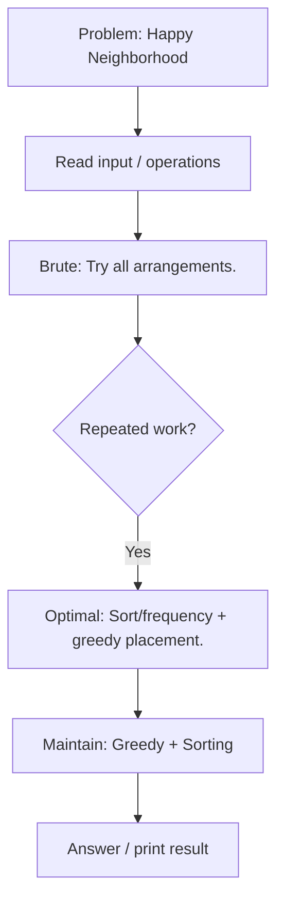

### Complete C++ Pattern Code
```cpp
#include <bits/stdc++.h>
using namespace std;

// Complete practice template for: Happy Neighborhood
// Pattern: Greedy + Sorting

int main() {
    vector<int> a = {5, 1, 3, 5, 2};

    // Replace this example with the exact input format of the problem.
    // The main learning goal is the STL pattern: Greedy + Sorting.

    cout << "Use pattern: Greedy + Sorting\n";

    return 0;
}
```

### Example Dry Run Table
| Step | Brute Thought | Optimized Thought | State |
|---:|---|---|---|
| 1 | Try direct simulation | Identify repeated work | input loaded |
| 2 | Repeated scan is costly | Choose STL structure | DS initialized |
| 3 | Update/query | Maintain invariant | DS updated |
| 4 | Answer | Use O(1)/O(log n) access | result produced |

### Diagram
```text
Input
  ↓
Choose STL structure
  ↓
Maintain invariant
  ↓
Answer efficiently
```

[⬆ Back to Difficulty Index](#clickable-difficulty-index)

---

<a id="longest-segment"></a>

## Longest Segment

**Difficulty:** Medium  
**Core Pattern:** Two Pointers

### Problem Description
Find longest contiguous segment satisfying condition.

### Brute Force Thinking
Check every l,r pair.

### Optimal Approach
Use two pointers/sliding window when validity is monotonic.

### Mermaid Flowchart
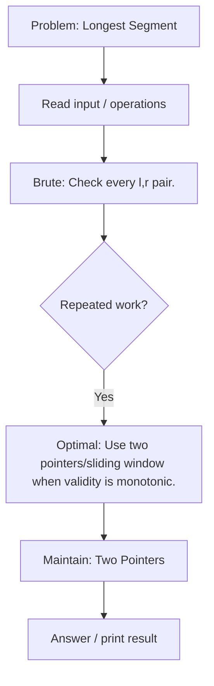

### Complete C++ Pattern Code
```cpp
#include <bits/stdc++.h>
using namespace std;

int longestAtMostKDistinct(string s, int k) {
    vector<int> freq(256, 0);
    int distinct = 0, l = 0, best = 0;

    for (int r = 0; r < (int)s.size(); r++) {
        if (freq[s[r]]++ == 0) distinct++;

        while (distinct > k) {
            if (--freq[s[l]] == 0) distinct--;
            l++;
        }

        best = max(best, r - l + 1);
    }
    return best;
}

int main() {
    cout << longestAtMostKDistinct("aabacbebebe", 3) << "\n";
}
```

### Example Dry Run Table
| Step | Brute Thought | Optimized Thought | State |
|---:|---|---|---|
| 1 | Try direct simulation | Identify repeated work | input loaded |
| 2 | Repeated scan is costly | Choose STL structure | DS initialized |
| 3 | Update/query | Maintain invariant | DS updated |
| 4 | Answer | Use O(1)/O(log n) access | result produced |

### Diagram
```text
Array/String:
0 1 2 3 4 5
|---window---|
    |---window---|

Move right pointer, shrink left pointer when invalid.
```

[⬆ Back to Difficulty Index](#clickable-difficulty-index)

---

<a id="set-az101"></a>

## Set AZ101

**Difficulty:** Medium  
**Core Pattern:** Set STL

### Problem Description
Maintain sorted unique elements.

### Brute Force Thinking
Store in vector and search linearly.

### Optimal Approach
Use std::set for O(log n) updates/search.

### Mermaid Flowchart
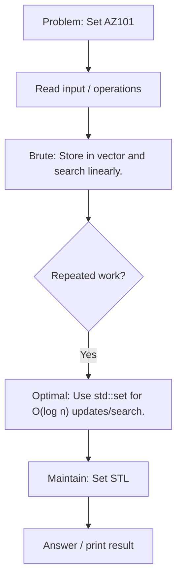

### Complete C++ Pattern Code
```cpp
#include <bits/stdc++.h>
using namespace std;

// Complete practice template for: Set AZ101
// Pattern: Set STL

int main() {
    vector<int> a = {5, 1, 3, 5, 2};

    // Replace this example with the exact input format of the problem.
    // The main learning goal is the STL pattern: Set STL.

    cout << "Use pattern: Set STL\n";

    return 0;
}
```

### Example Dry Run Table
| Step | Brute Thought | Optimized Thought | State |
|---:|---|---|---|
| 1 | Try direct simulation | Identify repeated work | input loaded |
| 2 | Repeated scan is costly | Choose STL structure | DS initialized |
| 3 | Update/query | Maintain invariant | DS updated |
| 4 | Answer | Use O(1)/O(log n) access | result produced |

### Diagram
```text
Input
  ↓
Choose STL structure
  ↓
Maintain invariant
  ↓
Answer efficiently
```

[⬆ Back to Difficulty Index](#clickable-difficulty-index)

---

<a id="solve-intervals-3"></a>

## Solve Intervals 3

**Difficulty:** Medium  
**Core Pattern:** Interval Set

### Problem Description
Maintain non-overlapping intervals and merge inserted ranges.

### Brute Force Thinking
Compare inserted range with every interval.

### Optimal Approach
Use set<pair<int,int>> with lower_bound and erase merged intervals.

### Mermaid Flowchart
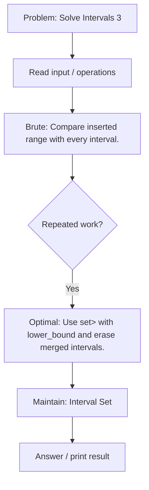

### Complete C++ Pattern Code
```cpp
#include <bits/stdc++.h>
using namespace std;

struct RangeCover {
    set<pair<int,int>> ranges;

    bool covered(int x) {
        auto it = ranges.upper_bound({x, INT_MAX});
        if (it == ranges.begin()) return false;
        --it;
        return it->second >= x;
    }

    void insertRange(int l, int r) {
        auto it = ranges.lower_bound({l, INT_MIN});

        if (it != ranges.begin()) {
            auto prevIt = prev(it);
            if (prevIt->second >= l - 1) it = prevIt;
        }

        while (it != ranges.end() && it->first <= r + 1) {
            l = min(l, it->first);
            r = max(r, it->second);
            it = ranges.erase(it);
        }

        ranges.insert({l, r});
    }
};

int main() {
    RangeCover rc;
    rc.insertRange(1, 3);
    rc.insertRange(7, 10);
    rc.insertRange(13, 16);
    rc.insertRange(4, 12);

    cout << rc.covered(9) << "\n";
    for (auto [l, r] : rc.ranges) cout << "[" << l << "," << r << "] ";
}
```

### Example Dry Run Table
| Step | Operation | l,r | Set State |
|---:|---|---|---|
| 1 | start | - | [1,3], [7,10], [13,16] |
| 2 | insert [4,12] | 4,12 | lower_bound points to [7,10] |
| 3 | check previous | 4,12 | [1,3] touches because 3 >= 3 |
| 4 | merge [1,3] | 1,12 | [7,10], [13,16] |
| 5 | merge [7,10] | 1,12 | [13,16] |
| 6 | merge [13,16] | 1,16 | empty |
| 7 | insert final | 1,16 | [1,16] |

### Diagram
```text
Before: [1,3]   [7,10]   [13,16]
Insert:     [4,12]
Merge : [1,16]
```

[⬆ Back to Difficulty Index](#clickable-difficulty-index)

---

<a id="addmul"></a>

## ADDMUL

**Difficulty:** Medium  
**Core Pattern:** Lazy Math

### Problem Description
Apply add/multiply operations efficiently.

### Brute Force Thinking
Update every element per query.

### Optimal Approach
Maintain lazy transformation x -> x*mul + add.

### Mermaid Flowchart
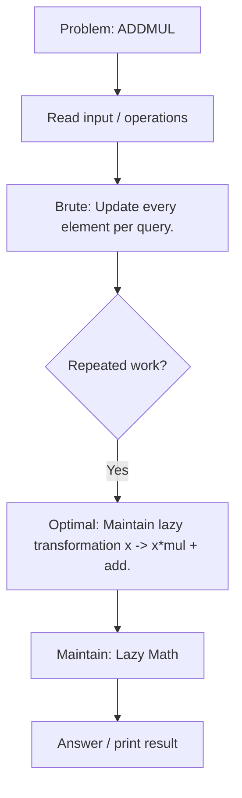

### Complete C++ Pattern Code
```cpp
#include <bits/stdc++.h>
using namespace std;

const long long MOD = 1000000007;

int main() {
    vector<long long> a = {1, 2, 3};

    long long mul = 1, add = 0;

    auto applyAdd = [&](long long x) {
        add = (add + x) % MOD;
    };

    auto applyMul = [&](long long x) {
        mul = (mul * x) % MOD;
        add = (add * x) % MOD;
    };

    auto value = [&](long long original) {
        return (original * mul + add) % MOD;
    };

    applyAdd(5);
    applyMul(2);

    for (long long x : a) cout << value(x) << " ";
}
```

### Example Dry Run Table
| Step | Brute Thought | Optimized Thought | State |
|---:|---|---|---|
| 1 | Try direct simulation | Identify repeated work | input loaded |
| 2 | Repeated scan is costly | Choose STL structure | DS initialized |
| 3 | Update/query | Maintain invariant | DS updated |
| 4 | Answer | Use O(1)/O(log n) access | result produced |

### Diagram
```text
Input
  ↓
Choose STL structure
  ↓
Maintain invariant
  ↓
Answer efficiently
```

[⬆ Back to Difficulty Index](#clickable-difficulty-index)

---

<a id="multimap-az101"></a>

## Multimap AZ101

**Difficulty:** Medium  
**Core Pattern:** Multimap

### Problem Description
Store multiple values under the same key.

### Brute Force Thinking
Use map<int,vector<int>> manually.

### Optimal Approach
Use multimap or map of vectors depending on output needs.

### Mermaid Flowchart
```mermaid
flowchart TD
    A["Problem: Multimap AZ101"] --> B["Read input / operations"]
    B --> C["Brute: Use map<int,vector<int>> manually."]
    C --> D{"Repeated work?"}
    D -->|Yes| E["Optimal: Use multimap or map of vectors depending on output needs."]
    E --> F["Maintain: Multimap"]
    F --> G["Answer / print result"]
```

### Complete C++ Pattern Code
```cpp
#include <bits/stdc++.h>
using namespace std;

// Complete practice template for: Multimap AZ101
// Pattern: Multimap

int main() {
    vector<int> a = {5, 1, 3, 5, 2};

    // Replace this example with the exact input format of the problem.
    // The main learning goal is the STL pattern: Multimap.

    cout << "Use pattern: Multimap\n";

    return 0;
}
```

### Example Dry Run Table
| Step | Brute Thought | Optimized Thought | State |
|---:|---|---|---|
| 1 | Try direct simulation | Identify repeated work | input loaded |
| 2 | Repeated scan is costly | Choose STL structure | DS initialized |
| 3 | Update/query | Maintain invariant | DS updated |
| 4 | Answer | Use O(1)/O(log n) access | result produced |

### Diagram
```text
Input
  ↓
Choose STL structure
  ↓
Maintain invariant
  ↓
Answer efficiently
```

[⬆ Back to Difficulty Index](#clickable-difficulty-index)

---

<a id="lfu-cache"></a>

## LFU Cache

**Difficulty:** Medium  
**Core Pattern:** HashMap + Lists

### Problem Description
Implement cache eviction by least frequency and recency.

### Brute Force Thinking
Scan all cache entries on eviction.

### Optimal Approach
Use maps from key to node and frequency to ordered key list.

### Mermaid Flowchart
```mermaid
flowchart TD
    A["Problem: LFU Cache"] --> B["Read input / operations"]
    B --> C["Brute: Scan all cache entries on eviction."]
    C --> D{"Repeated work?"}
    D -->|Yes| E["Optimal: Use maps from key to node and frequency to ordered key list."]
    E --> F["Maintain: HashMap + Lists"]
    F --> G["Answer / print result"]
```

### Complete C++ Pattern Code
```cpp
#include <bits/stdc++.h>
using namespace std;

class LFUCache {
    int cap, minFreq = 0;
    unordered_map<int, pair<int,int>> valFreq; // key -> {value, freq}
    unordered_map<int, list<int>> freqKeys;    // freq -> keys in recency order
    unordered_map<int, list<int>::iterator> pos;

public:
    LFUCache(int capacity) : cap(capacity) {}

    int get(int key) {
        if (!valFreq.count(key)) return -1;

        int value = valFreq[key].first;
        int f = valFreq[key].second;

        freqKeys[f].erase(pos[key]);
        if (freqKeys[f].empty() && minFreq == f) minFreq++;

        valFreq[key].second++;
        freqKeys[f + 1].push_front(key);
        pos[key] = freqKeys[f + 1].begin();

        return value;
    }

    void put(int key, int value) {
        if (cap == 0) return;

        if (valFreq.count(key)) {
            valFreq[key].first = value;
            get(key);
            return;
        }

        if ((int)valFreq.size() == cap) {
            int victim = freqKeys[minFreq].back();
            freqKeys[minFreq].pop_back();
            valFreq.erase(victim);
            pos.erase(victim);
        }

        valFreq[key] = {value, 1};
        freqKeys[1].push_front(key);
        pos[key] = freqKeys[1].begin();
        minFreq = 1;
    }
};

int main() {
    LFUCache cache(2);
    cache.put(1, 10);
    cache.put(2, 20);
    cout << cache.get(1) << "\n";
    cache.put(3, 30);
    cout << cache.get(2) << "\n";
}
```

### Example Dry Run Table
| Step | Brute Thought | Optimized Thought | State |
|---:|---|---|---|
| 1 | Try direct simulation | Identify repeated work | input loaded |
| 2 | Repeated scan is costly | Choose STL structure | DS initialized |
| 3 | Update/query | Maintain invariant | DS updated |
| 4 | Answer | Use O(1)/O(log n) access | result produced |

### Diagram
```text
Input
  ↓
Choose STL structure
  ↓
Maintain invariant
  ↓
Answer efficiently
```

[⬆ Back to Difficulty Index](#clickable-difficulty-index)

---

<a id="distinct-characters-az101"></a>

## Distinct Characters AZ101

**Difficulty:** Medium  
**Core Pattern:** Frequency Window

### Problem Description
Count distinct characters in windows/substrings.

### Brute Force Thinking
Recount characters for every window.

### Optimal Approach
Use sliding window with frequency array.

### Mermaid Flowchart
```mermaid
flowchart TD
    A["Problem: Distinct Characters AZ101"] --> B["Read input / operations"]
    B --> C["Brute: Recount characters for every window."]
    C --> D{"Repeated work?"}
    D -->|Yes| E["Optimal: Use sliding window with frequency array."]
    E --> F["Maintain: Frequency Window"]
    F --> G["Answer / print result"]
```

### Complete C++ Pattern Code
```cpp
#include <bits/stdc++.h>
using namespace std;

int longestAtMostKDistinct(string s, int k) {
    vector<int> freq(256, 0);
    int distinct = 0, l = 0, best = 0;

    for (int r = 0; r < (int)s.size(); r++) {
        if (freq[s[r]]++ == 0) distinct++;

        while (distinct > k) {
            if (--freq[s[l]] == 0) distinct--;
            l++;
        }

        best = max(best, r - l + 1);
    }
    return best;
}

int main() {
    cout << longestAtMostKDistinct("aabacbebebe", 3) << "\n";
}
```

### Example Dry Run Table
| Step | Brute Thought | Optimized Thought | State |
|---:|---|---|---|
| 1 | Try direct simulation | Identify repeated work | input loaded |
| 2 | Repeated scan is costly | Choose STL structure | DS initialized |
| 3 | Update/query | Maintain invariant | DS updated |
| 4 | Answer | Use O(1)/O(log n) access | result produced |

### Diagram
```text
Input
  ↓
Choose STL structure
  ↓
Maintain invariant
  ↓
Answer efficiently
```

[⬆ Back to Difficulty Index](#clickable-difficulty-index)

---

<a id="support-queries-ii"></a>

## Support Queries II

**Difficulty:** Medium  
**Core Pattern:** Ordered Set Queries

### Problem Description
Support dynamic insert/delete/search queries.

### Brute Force Thinking
Scan all active values per query.

### Optimal Approach
Use set/multiset with lower_bound/upper_bound.

### Mermaid Flowchart
```mermaid
flowchart TD
    A["Problem: Support Queries II"] --> B["Read input / operations"]
    B --> C["Brute: Scan all active values per query."]
    C --> D{"Repeated work?"}
    D -->|Yes| E["Optimal: Use set/multiset with lower_bound/upper_bound."]
    E --> F["Maintain: Ordered Set Queries"]
    F --> G["Answer / print result"]
```

### Complete C++ Pattern Code
```cpp
#include <bits/stdc++.h>
using namespace std;

// Complete practice template for: Support Queries II
// Pattern: Ordered Set Queries

int main() {
    vector<int> a = {5, 1, 3, 5, 2};

    // Replace this example with the exact input format of the problem.
    // The main learning goal is the STL pattern: Ordered Set Queries.

    cout << "Use pattern: Ordered Set Queries\n";

    return 0;
}
```

### Example Dry Run Table
| Step | Brute Thought | Optimized Thought | State |
|---:|---|---|---|
| 1 | Try direct simulation | Identify repeated work | input loaded |
| 2 | Repeated scan is costly | Choose STL structure | DS initialized |
| 3 | Update/query | Maintain invariant | DS updated |
| 4 | Answer | Use O(1)/O(log n) access | result produced |

### Diagram
```text
Input
  ↓
Choose STL structure
  ↓
Maintain invariant
  ↓
Answer efficiently
```

[⬆ Back to Difficulty Index](#clickable-difficulty-index)

---

<a id="support-queries-i"></a>

## Support Queries I

**Difficulty:** Medium  
**Core Pattern:** Map / Set

### Problem Description
Support basic dynamic queries.

### Brute Force Thinking
Recompute from scratch.

### Optimal Approach
Use map/set based on query type.

### Mermaid Flowchart
```mermaid
flowchart TD
    A["Problem: Support Queries I"] --> B["Read input / operations"]
    B --> C["Brute: Recompute from scratch."]
    C --> D{"Repeated work?"}
    D -->|Yes| E["Optimal: Use map/set based on query type."]
    E --> F["Maintain: Map / Set"]
    F --> G["Answer / print result"]
```

### Complete C++ Pattern Code
```cpp
#include <bits/stdc++.h>
using namespace std;

// Complete practice template for: Support Queries I
// Pattern: Map / Set

int main() {
    vector<int> a = {5, 1, 3, 5, 2};

    // Replace this example with the exact input format of the problem.
    // The main learning goal is the STL pattern: Map / Set.

    cout << "Use pattern: Map / Set\n";

    return 0;
}
```

### Example Dry Run Table
| Step | Brute Thought | Optimized Thought | State |
|---:|---|---|---|
| 1 | Try direct simulation | Identify repeated work | input loaded |
| 2 | Repeated scan is costly | Choose STL structure | DS initialized |
| 3 | Update/query | Maintain invariant | DS updated |
| 4 | Answer | Use O(1)/O(log n) access | result produced |

### Diagram
```text
Input
  ↓
Choose STL structure
  ↓
Maintain invariant
  ↓
Answer efficiently
```

[⬆ Back to Difficulty Index](#clickable-difficulty-index)

---

<a id="powers-of-two"></a>

## Powers of Two

**Difficulty:** Medium  
**Core Pattern:** Hashing + Powers

### Problem Description
Check if values can pair to form a power of two.

### Brute Force Thinking
Try every pair.

### Optimal Approach
Use hash counts and test all powers for complements.

### Mermaid Flowchart
```mermaid
flowchart TD
    A["Problem: Powers of Two"] --> B["Read input / operations"]
    B --> C["Brute: Try every pair."]
    C --> D{"Repeated work?"}
    D -->|Yes| E["Optimal: Use hash counts and test all powers for complements."]
    E --> F["Maintain: Hashing + Powers"]
    F --> G["Answer / print result"]
```

### Complete C++ Pattern Code
```cpp
#include <bits/stdc++.h>
using namespace std;

bool hasPowerOfTwoPair(vector<int> a) {
    unordered_map<int,int> cnt;
    for (int x : a) cnt[x]++;

    for (int x : a) {
        cnt[x]--;
        for (int p = 1; p <= (1 << 30); p <<= 1) {
            int need = p - x;
            if (cnt[need] > 0) return true;
        }
        cnt[x]++;
    }
    return false;
}

int main() {
    vector<int> a = {1, 5, 7};
    cout << hasPowerOfTwoPair(a) << "\n"; // 1 + 7 = 8
}
```

### Example Dry Run Table
| Step | Brute Thought | Optimized Thought | State |
|---:|---|---|---|
| 1 | Try direct simulation | Identify repeated work | input loaded |
| 2 | Repeated scan is costly | Choose STL structure | DS initialized |
| 3 | Update/query | Maintain invariant | DS updated |
| 4 | Answer | Use O(1)/O(log n) access | result produced |

### Diagram
```text
Input
  ↓
Choose STL structure
  ↓
Maintain invariant
  ↓
Answer efficiently
```

[⬆ Back to Difficulty Index](#clickable-difficulty-index)

---

<a id="fmbqueue"></a>

## FMBQUEUE

**Difficulty:** Medium  
**Core Pattern:** Deque Simulation

### Problem Description
Simulate operations on both ends/middle of a queue.

### Brute Force Thinking
Use vector insertion/deletion causing shifts.

### Optimal Approach
Use deque(s) for efficient end operations.

### Mermaid Flowchart
```mermaid
flowchart TD
    A["Problem: FMBQUEUE"] --> B["Read input / operations"]
    B --> C["Brute: Use vector insertion/deletion causing shifts."]
    C --> D{"Repeated work?"}
    D -->|Yes| E["Optimal: Use deque(s) for efficient end operations."]
    E --> F["Maintain: Deque Simulation"]
    F --> G["Answer / print result"]
```

### Complete C++ Pattern Code
```cpp
#include <bits/stdc++.h>
using namespace std;

// Complete practice template for: FMBQUEUE
// Pattern: Deque Simulation

int main() {
    vector<int> a = {5, 1, 3, 5, 2};

    // Replace this example with the exact input format of the problem.
    // The main learning goal is the STL pattern: Deque Simulation.

    cout << "Use pattern: Deque Simulation\n";

    return 0;
}
```

### Example Dry Run Table
| Step | Brute Thought | Optimized Thought | State |
|---:|---|---|---|
| 1 | Try direct simulation | Identify repeated work | input loaded |
| 2 | Repeated scan is costly | Choose STL structure | DS initialized |
| 3 | Update/query | Maintain invariant | DS updated |
| 4 | Answer | Use O(1)/O(log n) access | result produced |

### Diagram
```text
Input
  ↓
Choose STL structure
  ↓
Maintain invariant
  ↓
Answer efficiently
```

[⬆ Back to Difficulty Index](#clickable-difficulty-index)

---

<a id="next-permutation"></a>

## Next Permutation

**Difficulty:** Medium  
**Core Pattern:** Lexicographic Pivot

### Problem Description
Find next lexicographic permutation.

### Brute Force Thinking
Generate all permutations and locate current one.

### Optimal Approach
Find pivot, swap with next larger, reverse suffix.

### Mermaid Flowchart
```mermaid
flowchart TD
    A["Problem: Next Permutation"] --> B["Read input / operations"]
    B --> C["Brute: Generate all permutations and locate current one."]
    C --> D{"Repeated work?"}
    D -->|Yes| E["Optimal: Find pivot, swap with next larger, reverse suffix."]
    E --> F["Maintain: Lexicographic Pivot"]
    F --> G["Answer / print result"]
```

### Complete C++ Pattern Code
```cpp
#include <bits/stdc++.h>
using namespace std;

void myNextPermutation(vector<int>& a) {
    int n = a.size();
    int i = n - 2;

    while (i >= 0 && a[i] >= a[i + 1]) i--;

    if (i >= 0) {
        int j = n - 1;
        while (a[j] <= a[i]) j--;
        swap(a[i], a[j]);
    }

    reverse(a.begin() + i + 1, a.end());
}

int main() {
    vector<int> a = {1, 2, 3};
    myNextPermutation(a);
    for (int x : a) cout << x << " ";
}
```

### Example Dry Run Table
| Step | Brute Thought | Optimized Thought | State |
|---:|---|---|---|
| 1 | Try direct simulation | Identify repeated work | input loaded |
| 2 | Repeated scan is costly | Choose STL structure | DS initialized |
| 3 | Update/query | Maintain invariant | DS updated |
| 4 | Answer | Use O(1)/O(log n) access | result produced |

### Diagram
```text
Input
  ↓
Choose STL structure
  ↓
Maintain invariant
  ↓
Answer efficiently
```

[⬆ Back to Difficulty Index](#clickable-difficulty-index)

---

<a id="deque-az101"></a>

## Deque AZ101

**Difficulty:** Medium  
**Core Pattern:** Deque STL

### Problem Description
Use push/pop at both ends.

### Brute Force Thinking
Use vector and shift elements.

### Optimal Approach
Use std::deque.

### Mermaid Flowchart
```mermaid
flowchart TD
    A["Problem: Deque AZ101"] --> B["Read input / operations"]
    B --> C["Brute: Use vector and shift elements."]
    C --> D{"Repeated work?"}
    D -->|Yes| E["Optimal: Use std::deque."]
    E --> F["Maintain: Deque STL"]
    F --> G["Answer / print result"]
```

### Complete C++ Pattern Code
```cpp
#include <bits/stdc++.h>
using namespace std;

// Complete practice template for: Deque AZ101
// Pattern: Deque STL

int main() {
    vector<int> a = {5, 1, 3, 5, 2};

    // Replace this example with the exact input format of the problem.
    // The main learning goal is the STL pattern: Deque STL.

    cout << "Use pattern: Deque STL\n";

    return 0;
}
```

### Example Dry Run Table
| Step | Brute Thought | Optimized Thought | State |
|---:|---|---|---|
| 1 | Try direct simulation | Identify repeated work | input loaded |
| 2 | Repeated scan is costly | Choose STL structure | DS initialized |
| 3 | Update/query | Maintain invariant | DS updated |
| 4 | Answer | Use O(1)/O(log n) access | result produced |

### Diagram
```text
Input
  ↓
Choose STL structure
  ↓
Maintain invariant
  ↓
Answer efficiently
```

[⬆ Back to Difficulty Index](#clickable-difficulty-index)

---

<a id="indexed-set"></a>

## Indexed Set

**Difficulty:** Medium  
**Core Pattern:** PBDS

### Problem Description
Support kth element and count of elements less than x.

### Brute Force Thinking
Sort every query.

### Optimal Approach
Use GNU PBDS ordered_set.

### Mermaid Flowchart
```mermaid
flowchart TD
    A["Problem: Indexed Set"] --> B["Read input / operations"]
    B --> C["Brute: Sort every query."]
    C --> D{"Repeated work?"}
    D -->|Yes| E["Optimal: Use GNU PBDS ordered_set."]
    E --> F["Maintain: PBDS"]
    F --> G["Answer / print result"]
```

### Complete C++ Pattern Code
```cpp
#include <bits/stdc++.h>
#include <ext/pb_ds/assoc_container.hpp>
using namespace std;
using namespace __gnu_pbds;

typedef tree<int, null_type, less<int>, rb_tree_tag,
tree_order_statistics_node_update> ordered_set;

int main() {
    ordered_set os;
    os.insert(10);
    os.insert(20);
    os.insert(30);

    cout << *os.find_by_order(1) << "\n"; // 20
    cout << os.order_of_key(25) << "\n";  // 2
}
```

### Example Dry Run Table
| Step | Brute Thought | Optimized Thought | State |
|---:|---|---|---|
| 1 | Try direct simulation | Identify repeated work | input loaded |
| 2 | Repeated scan is costly | Choose STL structure | DS initialized |
| 3 | Update/query | Maintain invariant | DS updated |
| 4 | Answer | Use O(1)/O(log n) access | result produced |

### Diagram
```text
Input
  ↓
Choose STL structure
  ↓
Maintain invariant
  ↓
Answer efficiently
```

[⬆ Back to Difficulty Index](#clickable-difficulty-index)

---

<a id="set-queries-az101"></a>

## Set Queries AZ101

**Difficulty:** Medium  
**Core Pattern:** Set Bounds

### Problem Description
Answer lower/upper bound style set queries.

### Brute Force Thinking
Scan every element.

### Optimal Approach
Use std::set lower_bound/upper_bound.

### Mermaid Flowchart
```mermaid
flowchart TD
    A["Problem: Set Queries AZ101"] --> B["Read input / operations"]
    B --> C["Brute: Scan every element."]
    C --> D{"Repeated work?"}
    D -->|Yes| E["Optimal: Use std::set lower_bound/upper_bound."]
    E --> F["Maintain: Set Bounds"]
    F --> G["Answer / print result"]
```

### Complete C++ Pattern Code
```cpp
#include <bits/stdc++.h>
using namespace std;

// Complete practice template for: Set Queries AZ101
// Pattern: Set Bounds

int main() {
    vector<int> a = {5, 1, 3, 5, 2};

    // Replace this example with the exact input format of the problem.
    // The main learning goal is the STL pattern: Set Bounds.

    cout << "Use pattern: Set Bounds\n";

    return 0;
}
```

### Example Dry Run Table
| Step | Brute Thought | Optimized Thought | State |
|---:|---|---|---|
| 1 | Try direct simulation | Identify repeated work | input loaded |
| 2 | Repeated scan is costly | Choose STL structure | DS initialized |
| 3 | Update/query | Maintain invariant | DS updated |
| 4 | Answer | Use O(1)/O(log n) access | result produced |

### Diagram
```text
Input
  ↓
Choose STL structure
  ↓
Maintain invariant
  ↓
Answer efficiently
```

[⬆ Back to Difficulty Index](#clickable-difficulty-index)

---

<a id="running-mean-median-and-mode-az101"></a>

## Running Mean, Median and Mode AZ101

**Difficulty:** Medium  
**Core Pattern:** Two Multisets + Frequency

### Problem Description
Maintain mean, median, and mode after each insertion.

### Brute Force Thinking
Sort and recount after each insertion.

### Optimal Approach
Use two multisets for median and frequency maps for mode.

### Mermaid Flowchart
```mermaid
flowchart TD
    A["Problem: Running Mean, Median and Mode AZ101"] --> B["Read input / operations"]
    B --> C["Brute: Sort and recount after each insertion."]
    C --> D{"Repeated work?"}
    D -->|Yes| E["Optimal: Use two multisets for median and frequency maps for mode."]
    E --> F["Maintain: Two Multisets + Frequency"]
    F --> G["Answer / print result"]
```

### Complete C++ Pattern Code
```cpp
#include <bits/stdc++.h>
using namespace std;

multiset<int> low, high;
unordered_map<int,int> freq;
long long sum = 0;
int modeValue = 0, modeFreq = 0;

void rebalance() {
    while (low.size() > high.size() + 1) {
        high.insert(*low.rbegin());
        low.erase(prev(low.end()));
    }
    while (high.size() > low.size()) {
        low.insert(*high.begin());
        high.erase(high.begin());
    }
}

void addNumber(int x) {
    sum += x;

    if (low.empty() || x <= *low.rbegin()) low.insert(x);
    else high.insert(x);
    rebalance();

    freq[x]++;
    if (freq[x] > modeFreq || (freq[x] == modeFreq && x < modeValue)) {
        modeFreq = freq[x];
        modeValue = x;
    }
}

double median() {
    if (low.size() == high.size()) return (*low.rbegin() + *high.begin()) / 2.0;
    return *low.rbegin();
}

int main() {
    vector<int> stream = {5, 15, 5, 10};
    for (int x : stream) {
        addNumber(x);
        cout << "mean=" << (double)sum / (low.size() + high.size())
             << " median=" << median()
             << " mode=" << modeValue << "\n";
    }
}
```

### Example Dry Run Table
| Insert | low | high | mean | median | mode |
|---:|---|---|---:|---:|---:|
| 5 | [5] | [] | 5 | 5 | 5 |
| 15 | [5] | [15] | 10 | 10 | 5 |
| 5 | [5,5] | [15] | 8.33 | 5 | 5 |
| 10 | [5,5] | [10,15] | 8.75 | 7.5 | 5 |

### Diagram
```text
Input
  ↓
Choose STL structure
  ↓
Maintain invariant
  ↓
Answer efficiently
```

[⬆ Back to Difficulty Index](#clickable-difficulty-index)

---

<a id="find-the-sum"></a>

## Find The Sum

**Difficulty:** Medium  
**Core Pattern:** Prefix Sum

### Problem Description
Answer range/subarray sum style queries.

### Brute Force Thinking
Sum elements each query.

### Optimal Approach
Use prefix sums.

### Mermaid Flowchart
```mermaid
flowchart TD
    A["Problem: Find The Sum"] --> B["Read input / operations"]
    B --> C["Brute: Sum elements each query."]
    C --> D{"Repeated work?"}
    D -->|Yes| E["Optimal: Use prefix sums."]
    E --> F["Maintain: Prefix Sum"]
    F --> G["Answer / print result"]
```

### Complete C++ Pattern Code
```cpp
#include <bits/stdc++.h>
using namespace std;

// Complete practice template for: Find The Sum
// Pattern: Prefix Sum

int main() {
    vector<int> a = {5, 1, 3, 5, 2};

    // Replace this example with the exact input format of the problem.
    // The main learning goal is the STL pattern: Prefix Sum.

    cout << "Use pattern: Prefix Sum\n";

    return 0;
}
```

### Example Dry Run Table
| Step | Brute Thought | Optimized Thought | State |
|---:|---|---|---|
| 1 | Try direct simulation | Identify repeated work | input loaded |
| 2 | Repeated scan is costly | Choose STL structure | DS initialized |
| 3 | Update/query | Maintain invariant | DS updated |
| 4 | Answer | Use O(1)/O(log n) access | result produced |

### Diagram
```text
Input
  ↓
Choose STL structure
  ↓
Maintain invariant
  ↓
Answer efficiently
```

[⬆ Back to Difficulty Index](#clickable-difficulty-index)

---

<a id="game-on-deque-az101"></a>

## Game on Deque AZ101

**Difficulty:** Medium  
**Core Pattern:** Deque + Cycle

### Problem Description
Simulate repeated deque game operations.

### Brute Force Thinking
Simulate all operations per query.

### Optimal Approach
Precompute initial phase and cycle after max reaches front.

### Mermaid Flowchart
```mermaid
flowchart TD
    A["Problem: Game on Deque AZ101"] --> B["Read input / operations"]
    B --> C["Brute: Simulate all operations per query."]
    C --> D{"Repeated work?"}
    D -->|Yes| E["Optimal: Precompute initial phase and cycle after max reaches front."]
    E --> F["Maintain: Deque + Cycle"]
    F --> G["Answer / print result"]
```

### Complete C++ Pattern Code
```cpp
#include <bits/stdc++.h>
using namespace std;

// Complete practice template for: Game on Deque AZ101
// Pattern: Deque + Cycle

int main() {
    vector<int> a = {5, 1, 3, 5, 2};

    // Replace this example with the exact input format of the problem.
    // The main learning goal is the STL pattern: Deque + Cycle.

    cout << "Use pattern: Deque + Cycle\n";

    return 0;
}
```

### Example Dry Run Table
| Step | Brute Thought | Optimized Thought | State |
|---:|---|---|---|
| 1 | Try direct simulation | Identify repeated work | input loaded |
| 2 | Repeated scan is costly | Choose STL structure | DS initialized |
| 3 | Update/query | Maintain invariant | DS updated |
| 4 | Answer | Use O(1)/O(log n) access | result produced |

### Diagram
```text
Input
  ↓
Choose STL structure
  ↓
Maintain invariant
  ↓
Answer efficiently
```

[⬆ Back to Difficulty Index](#clickable-difficulty-index)

---

<a id="duplicate-products"></a>

## Duplicate Products

**Difficulty:** Medium  
**Core Pattern:** Hash Set

### Problem Description
Detect duplicates among product ids/names.

### Brute Force Thinking
Compare all pairs.

### Optimal Approach
Use frequency map/set.

### Mermaid Flowchart
```mermaid
flowchart TD
    A["Problem: Duplicate Products"] --> B["Read input / operations"]
    B --> C["Brute: Compare all pairs."]
    C --> D{"Repeated work?"}
    D -->|Yes| E["Optimal: Use frequency map/set."]
    E --> F["Maintain: Hash Set"]
    F --> G["Answer / print result"]
```

### Complete C++ Pattern Code
```cpp
#include <bits/stdc++.h>
using namespace std;

// Complete practice template for: Duplicate Products
// Pattern: Hash Set

int main() {
    vector<int> a = {5, 1, 3, 5, 2};

    // Replace this example with the exact input format of the problem.
    // The main learning goal is the STL pattern: Hash Set.

    cout << "Use pattern: Hash Set\n";

    return 0;
}
```

### Example Dry Run Table
| Step | Brute Thought | Optimized Thought | State |
|---:|---|---|---|
| 1 | Try direct simulation | Identify repeated work | input loaded |
| 2 | Repeated scan is costly | Choose STL structure | DS initialized |
| 3 | Update/query | Maintain invariant | DS updated |
| 4 | Answer | Use O(1)/O(log n) access | result produced |

### Diagram
```text
Input
  ↓
Choose STL structure
  ↓
Maintain invariant
  ↓
Answer efficiently
```

[⬆ Back to Difficulty Index](#clickable-difficulty-index)

---

<a id="powers-of-two-2"></a>

## Powers Of Two

**Difficulty:** Medium  
**Core Pattern:** Hashing + Powers

### Problem Description
Variant of powers-of-two pair checking.

### Brute Force Thinking
Try all pairs.

### Optimal Approach
Use hash counts and powers iteration.

### Mermaid Flowchart
```mermaid
flowchart TD
    A["Problem: Powers Of Two"] --> B["Read input / operations"]
    B --> C["Brute: Try all pairs."]
    C --> D{"Repeated work?"}
    D -->|Yes| E["Optimal: Use hash counts and powers iteration."]
    E --> F["Maintain: Hashing + Powers"]
    F --> G["Answer / print result"]
```

### Complete C++ Pattern Code
```cpp
#include <bits/stdc++.h>
using namespace std;

bool hasPowerOfTwoPair(vector<int> a) {
    unordered_map<int,int> cnt;
    for (int x : a) cnt[x]++;

    for (int x : a) {
        cnt[x]--;
        for (int p = 1; p <= (1 << 30); p <<= 1) {
            int need = p - x;
            if (cnt[need] > 0) return true;
        }
        cnt[x]++;
    }
    return false;
}

int main() {
    vector<int> a = {1, 5, 7};
    cout << hasPowerOfTwoPair(a) << "\n"; // 1 + 7 = 8
}
```

### Example Dry Run Table
| Step | Brute Thought | Optimized Thought | State |
|---:|---|---|---|
| 1 | Try direct simulation | Identify repeated work | input loaded |
| 2 | Repeated scan is costly | Choose STL structure | DS initialized |
| 3 | Update/query | Maintain invariant | DS updated |
| 4 | Answer | Use O(1)/O(log n) access | result produced |

### Diagram
```text
Input
  ↓
Choose STL structure
  ↓
Maintain invariant
  ↓
Answer efficiently
```

[⬆ Back to Difficulty Index](#clickable-difficulty-index)

---

<a id="the-social-network"></a>

## The Social Network

**Difficulty:** Medium  
**Core Pattern:** DSU

### Problem Description
Maintain friendship groups/connections.

### Brute Force Thinking
Check connectivity by scanning relations.

### Optimal Approach
Use DSU union/find.

### Mermaid Flowchart
```mermaid
flowchart TD
    A["Problem: The Social Network"] --> B["Read input / operations"]
    B --> C["Brute: Check connectivity by scanning relations."]
    C --> D{"Repeated work?"}
    D -->|Yes| E["Optimal: Use DSU union/find."]
    E --> F["Maintain: DSU"]
    F --> G["Answer / print result"]
```

### Complete C++ Pattern Code
```cpp
#include <bits/stdc++.h>
using namespace std;

struct DSU {
    vector<int> parent, sz;

    DSU(int n) {
        parent.resize(n);
        sz.assign(n, 1);
        iota(parent.begin(), parent.end(), 0);
    }

    int find(int x) {
        if (parent[x] == x) return x;
        return parent[x] = find(parent[x]);
    }

    void unite(int a, int b) {
        a = find(a), b = find(b);
        if (a == b) return;
        if (sz[a] < sz[b]) swap(a, b);
        parent[b] = a;
        sz[a] += sz[b];
    }
};

int main() {
    DSU dsu(5);
    dsu.unite(0, 1);
    dsu.unite(3, 4);
    cout << (dsu.find(0) == dsu.find(1)) << "\n";
}
```

### Example Dry Run Table
| Step | Brute Thought | Optimized Thought | State |
|---:|---|---|---|
| 1 | Try direct simulation | Identify repeated work | input loaded |
| 2 | Repeated scan is costly | Choose STL structure | DS initialized |
| 3 | Update/query | Maintain invariant | DS updated |
| 4 | Answer | Use O(1)/O(log n) access | result produced |

### Diagram
```text
Input
  ↓
Choose STL structure
  ↓
Maintain invariant
  ↓
Answer efficiently
```

[⬆ Back to Difficulty Index](#clickable-difficulty-index)

---

<a id="bachata-dance"></a>

## Bachata Dance

**Difficulty:** Medium  
**Core Pattern:** Greedy Pairing

### Problem Description
Pair/group values optimally.

### Brute Force Thinking
Try all pairings.

### Optimal Approach
Sort and greedily match.

### Mermaid Flowchart
```mermaid
flowchart TD
    A["Problem: Bachata Dance"] --> B["Read input / operations"]
    B --> C["Brute: Try all pairings."]
    C --> D{"Repeated work?"}
    D -->|Yes| E["Optimal: Sort and greedily match."]
    E --> F["Maintain: Greedy Pairing"]
    F --> G["Answer / print result"]
```

### Complete C++ Pattern Code
```cpp
#include <bits/stdc++.h>
using namespace std;

// Complete practice template for: Bachata Dance
// Pattern: Greedy Pairing

int main() {
    vector<int> a = {5, 1, 3, 5, 2};

    // Replace this example with the exact input format of the problem.
    // The main learning goal is the STL pattern: Greedy Pairing.

    cout << "Use pattern: Greedy Pairing\n";

    return 0;
}
```

### Example Dry Run Table
| Step | Brute Thought | Optimized Thought | State |
|---:|---|---|---|
| 1 | Try direct simulation | Identify repeated work | input loaded |
| 2 | Repeated scan is costly | Choose STL structure | DS initialized |
| 3 | Update/query | Maintain invariant | DS updated |
| 4 | Answer | Use O(1)/O(log n) access | result produced |

### Diagram
```text
Input
  ↓
Choose STL structure
  ↓
Maintain invariant
  ↓
Answer efficiently
```

[⬆ Back to Difficulty Index](#clickable-difficulty-index)

---

<a id="evaluating-boolean-expressions"></a>

## Evaluating Boolean Expressions

**Difficulty:** Medium  
**Core Pattern:** Stack Expression Evaluation

### Problem Description
Evaluate boolean expression with operators.

### Brute Force Thinking
Repeated recursive parsing/scans.

### Optimal Approach
Use stacks for values/operators.

### Mermaid Flowchart
```mermaid
flowchart TD
    A["Problem: Evaluating Boolean Expressions"] --> B["Read input / operations"]
    B --> C["Brute: Repeated recursive parsing/scans."]
    C --> D{"Repeated work?"}
    D -->|Yes| E["Optimal: Use stacks for values/operators."]
    E --> F["Maintain: Stack Expression Evaluation"]
    F --> G["Answer / print result"]
```

### Complete C++ Pattern Code
```cpp
#include <bits/stdc++.h>
using namespace std;

// Complete practice template for: Evaluating Boolean Expressions
// Pattern: Stack Expression Evaluation

int main() {
    vector<int> a = {5, 1, 3, 5, 2};

    // Replace this example with the exact input format of the problem.
    // The main learning goal is the STL pattern: Stack Expression Evaluation.

    cout << "Use pattern: Stack Expression Evaluation\n";

    return 0;
}
```

### Example Dry Run Table
| Step | Brute Thought | Optimized Thought | State |
|---:|---|---|---|
| 1 | Try direct simulation | Identify repeated work | input loaded |
| 2 | Repeated scan is costly | Choose STL structure | DS initialized |
| 3 | Update/query | Maintain invariant | DS updated |
| 4 | Answer | Use O(1)/O(log n) access | result produced |

### Diagram
```text
Input
  ↓
Choose STL structure
  ↓
Maintain invariant
  ↓
Answer efficiently
```

[⬆ Back to Difficulty Index](#clickable-difficulty-index)

---

<a id="substrings-galore"></a>

## Substrings Galore

**Difficulty:** Medium  
**Core Pattern:** Sliding Window / Hashing

### Problem Description
Count/find substrings satisfying a condition.

### Brute Force Thinking
Generate all substrings.

### Optimal Approach
Use sliding window or hashing.

### Mermaid Flowchart
```mermaid
flowchart TD
    A["Problem: Substrings Galore"] --> B["Read input / operations"]
    B --> C["Brute: Generate all substrings."]
    C --> D{"Repeated work?"}
    D -->|Yes| E["Optimal: Use sliding window or hashing."]
    E --> F["Maintain: Sliding Window / Hashing"]
    F --> G["Answer / print result"]
```

### Complete C++ Pattern Code
```cpp
#include <bits/stdc++.h>
using namespace std;

int longestAtMostKDistinct(string s, int k) {
    vector<int> freq(256, 0);
    int distinct = 0, l = 0, best = 0;

    for (int r = 0; r < (int)s.size(); r++) {
        if (freq[s[r]]++ == 0) distinct++;

        while (distinct > k) {
            if (--freq[s[l]] == 0) distinct--;
            l++;
        }

        best = max(best, r - l + 1);
    }
    return best;
}

int main() {
    cout << longestAtMostKDistinct("aabacbebebe", 3) << "\n";
}
```

### Example Dry Run Table
| Step | Brute Thought | Optimized Thought | State |
|---:|---|---|---|
| 1 | Try direct simulation | Identify repeated work | input loaded |
| 2 | Repeated scan is costly | Choose STL structure | DS initialized |
| 3 | Update/query | Maintain invariant | DS updated |
| 4 | Answer | Use O(1)/O(log n) access | result produced |

### Diagram
```text
Array/String:
0 1 2 3 4 5
|---window---|
    |---window---|

Move right pointer, shrink left pointer when invalid.
```

[⬆ Back to Difficulty Index](#clickable-difficulty-index)

---

<a id="subsegment-sort"></a>

## Subsegment Sort

**Difficulty:** Medium  
**Core Pattern:** Sort + Mismatch

### Problem Description
Reason about sorting a subsegment.

### Brute Force Thinking
Sort every candidate subarray.

### Optimal Approach
Compare with sorted copy and find mismatch range.

### Mermaid Flowchart
```mermaid
flowchart TD
    A["Problem: Subsegment Sort"] --> B["Read input / operations"]
    B --> C["Brute: Sort every candidate subarray."]
    C --> D{"Repeated work?"}
    D -->|Yes| E["Optimal: Compare with sorted copy and find mismatch range."]
    E --> F["Maintain: Sort + Mismatch"]
    F --> G["Answer / print result"]
```

### Complete C++ Pattern Code
```cpp
#include <bits/stdc++.h>
using namespace std;

// Complete practice template for: Subsegment Sort
// Pattern: Sort + Mismatch

int main() {
    vector<int> a = {5, 1, 3, 5, 2};

    // Replace this example with the exact input format of the problem.
    // The main learning goal is the STL pattern: Sort + Mismatch.

    cout << "Use pattern: Sort + Mismatch\n";

    return 0;
}
```

### Example Dry Run Table
| Step | Brute Thought | Optimized Thought | State |
|---:|---|---|---|
| 1 | Try direct simulation | Identify repeated work | input loaded |
| 2 | Repeated scan is costly | Choose STL structure | DS initialized |
| 3 | Update/query | Maintain invariant | DS updated |
| 4 | Answer | Use O(1)/O(log n) access | result produced |

### Diagram
```text
Input
  ↓
Choose STL structure
  ↓
Maintain invariant
  ↓
Answer efficiently
```

[⬆ Back to Difficulty Index](#clickable-difficulty-index)

---

<a id="gas-station"></a>

## Gas Station

**Difficulty:** Medium  
**Core Pattern:** Greedy Circular

### Problem Description
Find starting station to complete circuit.

### Brute Force Thinking
Try every start and simulate.

### Optimal Approach
Greedy reset when tank becomes negative.

### Mermaid Flowchart
```mermaid
flowchart TD
    A["Problem: Gas Station"] --> B["Read input / operations"]
    B --> C["Brute: Try every start and simulate."]
    C --> D{"Repeated work?"}
    D -->|Yes| E["Optimal: Greedy reset when tank becomes negative."]
    E --> F["Maintain: Greedy Circular"]
    F --> G["Answer / print result"]
```

### Complete C++ Pattern Code
```cpp
#include <bits/stdc++.h>
using namespace std;

int canCompleteCircuit(vector<int> gas, vector<int> cost) {
    int total = 0, tank = 0, start = 0;

    for (int i = 0; i < (int)gas.size(); i++) {
        int diff = gas[i] - cost[i];
        total += diff;
        tank += diff;

        if (tank < 0) {
            start = i + 1;
            tank = 0;
        }
    }

    return total >= 0 ? start : -1;
}

int main() {
    vector<int> gas = {1,2,3,4,5};
    vector<int> cost = {3,4,5,1,2};
    cout << canCompleteCircuit(gas, cost) << "\n";
}
```

### Example Dry Run Table
| i | gas-cost | tank | start |
|---:|---:|---:|---:|
| 0 | -2 | reset to 0 | 1 |
| 1 | -2 | reset to 0 | 2 |
| 2 | -2 | reset to 0 | 3 |
| 3 | 3 | 3 | 3 |
| 4 | 3 | 6 | 3 |

### Diagram
```text
Input
  ↓
Choose STL structure
  ↓
Maintain invariant
  ↓
Answer efficiently
```

[⬆ Back to Difficulty Index](#clickable-difficulty-index)

---

<a id="nearly-sorted-arrays"></a>

## Nearly Sorted Arrays

**Difficulty:** Medium  
**Core Pattern:** Min Heap

### Problem Description
Sort an array where each element is at most k away.

### Brute Force Thinking
Sort entire array.

### Optimal Approach
Use min-heap of size k+1.

### Mermaid Flowchart
```mermaid
flowchart TD
    A["Problem: Nearly Sorted Arrays"] --> B["Read input / operations"]
    B --> C["Brute: Sort entire array."]
    C --> D{"Repeated work?"}
    D -->|Yes| E["Optimal: Use min-heap of size k+1."]
    E --> F["Maintain: Min Heap"]
    F --> G["Answer / print result"]
```

### Complete C++ Pattern Code
```cpp
#include <bits/stdc++.h>
using namespace std;

vector<int> sortNearlySorted(vector<int> a, int k) {
    priority_queue<int, vector<int>, greater<int>> pq;
    vector<int> ans;

    for (int x : a) {
        pq.push(x);
        if ((int)pq.size() > k) {
            ans.push_back(pq.top());
            pq.pop();
        }
    }

    while (!pq.empty()) {
        ans.push_back(pq.top());
        pq.pop();
    }

    return ans;
}

int main() {
    vector<int> a = {6,5,3,2,8,10,9};
    for (int x : sortNearlySorted(a, 3)) cout << x << " ";
}
```

### Example Dry Run Table
| Step | Push | Heap | Output |
|---:|---:|---|---|
| 1 | 6 | [6] | [] |
| 2 | 5 | [5,6] | [] |
| 3 | 3 | [3,6,5] | [] |
| 4 | 2 | [2,3,5,6] | pop 2 |
| 5 | 8 | [3,6,5,8] | pop 3 |

### Diagram
```text
Input
  ↓
Choose STL structure
  ↓
Maintain invariant
  ↓
Answer efficiently
```

[⬆ Back to Difficulty Index](#clickable-difficulty-index)

---

<a id="queue-using-2-stacks-az101"></a>

## Queue using 2 Stacks AZ101

**Difficulty:** Medium  
**Core Pattern:** Two Stacks

### Problem Description
Queue implementation with two stacks.

### Brute Force Thinking
Move all elements every operation.

### Optimal Approach
Amortized transfer from input stack to output stack.

### Mermaid Flowchart
```mermaid
flowchart TD
    A["Problem: Queue using 2 Stacks AZ101"] --> B["Read input / operations"]
    B --> C["Brute: Move all elements every operation."]
    C --> D{"Repeated work?"}
    D -->|Yes| E["Optimal: Amortized transfer from input stack to output stack."]
    E --> F["Maintain: Two Stacks"]
    F --> G["Answer / print result"]
```

### Complete C++ Pattern Code
```cpp
#include <bits/stdc++.h>
using namespace std;

class MyQueue {
    stack<int> in, out;

    void shift() {
        if (out.empty()) {
            while (!in.empty()) {
                out.push(in.top());
                in.pop();
            }
        }
    }

public:
    void push(int x) { in.push(x); }

    int front() {
        shift();
        return out.top();
    }

    int pop() {
        shift();
        int x = out.top();
        out.pop();
        return x;
    }

    bool empty() {
        return in.empty() && out.empty();
    }
};

int main() {
    MyQueue q;
    q.push(10);
    q.push(20);
    cout << q.pop() << "\n";
    cout << q.front() << "\n";
}
```

### Example Dry Run Table
| Operation | in stack | out stack | Output |
|---|---|---|---|
| push 10 | [10] | [] | - |
| push 20 | [10,20] | [] | - |
| pop | [] | [20] | 10 |
| front | [] | [20] | 20 |

### Diagram
```text
push → [ in stack ]  --transfer only when needed-->  [ out stack ] → pop
```

[⬆ Back to Difficulty Index](#clickable-difficulty-index)

---

<a id="hamming-distance"></a>

## Hamming Distance

**Difficulty:** Medium  
**Core Pattern:** Bit Counting

### Problem Description
Compute total bit differences.

### Brute Force Thinking
Compare each pair bit by bit.

### Optimal Approach
Count set bits at every position.

### Mermaid Flowchart
```mermaid
flowchart TD
    A["Problem: Hamming Distance"] --> B["Read input / operations"]
    B --> C["Brute: Compare each pair bit by bit."]
    C --> D{"Repeated work?"}
    D -->|Yes| E["Optimal: Count set bits at every position."]
    E --> F["Maintain: Bit Counting"]
    F --> G["Answer / print result"]
```

### Complete C++ Pattern Code
```cpp
#include <bits/stdc++.h>
using namespace std;

long long totalHammingDistance(vector<int> a) {
    long long ans = 0;
    int n = a.size();

    for (int bit = 0; bit < 31; bit++) {
        long long ones = 0;
        for (int x : a) {
            if (x & (1 << bit)) ones++;
        }
        ans += ones * (n - ones);
    }

    return ans;
}

int main() {
    vector<int> a = {4, 14, 2};
    cout << totalHammingDistance(a) << "\n";
}
```

### Example Dry Run Table
| Step | Brute Thought | Optimized Thought | State |
|---:|---|---|---|
| 1 | Try direct simulation | Identify repeated work | input loaded |
| 2 | Repeated scan is costly | Choose STL structure | DS initialized |
| 3 | Update/query | Maintain invariant | DS updated |
| 4 | Answer | Use O(1)/O(log n) access | result produced |

### Diagram
```text
Input
  ↓
Choose STL structure
  ↓
Maintain invariant
  ↓
Answer efficiently
```

[⬆ Back to Difficulty Index](#clickable-difficulty-index)

---

<a id="priority-queue"></a>

## Priority Queue

**Difficulty:** Medium  
**Core Pattern:** Heap

### Problem Description
Maintain dynamic max/min retrieval.

### Brute Force Thinking
Sort vector repeatedly.

### Optimal Approach
Use priority_queue.

### Mermaid Flowchart
```mermaid
flowchart TD
    A["Problem: Priority Queue"] --> B["Read input / operations"]
    B --> C["Brute: Sort vector repeatedly."]
    C --> D{"Repeated work?"}
    D -->|Yes| E["Optimal: Use priority_queue."]
    E --> F["Maintain: Heap"]
    F --> G["Answer / print result"]
```

### Complete C++ Pattern Code
```cpp
#include <bits/stdc++.h>
using namespace std;

struct Compare {
    bool operator()(pair<int,int> a, pair<int,int> b) {
        if (a.first != b.first) return a.first < b.first; // bigger priority first
        return a.second > b.second; // smaller id first
    }
};

int main() {
    priority_queue<pair<int,int>, vector<pair<int,int>>, Compare> pq;
    pq.push({5, 2});
    pq.push({10, 3});
    pq.push({10, 1});

    while (!pq.empty()) {
        auto [priority, id] = pq.top();
        pq.pop();
        cout << priority << " " << id << "\n";
    }
}
```

### Example Dry Run Table
| Step | Brute Thought | Optimized Thought | State |
|---:|---|---|---|
| 1 | Try direct simulation | Identify repeated work | input loaded |
| 2 | Repeated scan is costly | Choose STL structure | DS initialized |
| 3 | Update/query | Maintain invariant | DS updated |
| 4 | Answer | Use O(1)/O(log n) access | result produced |

### Diagram
```text
push → [ in stack ]  --transfer only when needed-->  [ out stack ] → pop
```

[⬆ Back to Difficulty Index](#clickable-difficulty-index)

---

<a id="elections"></a>

## Elections

**Difficulty:** Medium  
**Core Pattern:** Map + Leader Tracking

### Problem Description
Track leading candidate over time.

### Brute Force Thinking
Recount votes from scratch.

### Optimal Approach
Frequency map and tie rule; optionally precompute leaders.

### Mermaid Flowchart
```mermaid
flowchart TD
    A["Problem: Elections"] --> B["Read input / operations"]
    B --> C["Brute: Recount votes from scratch."]
    C --> D{"Repeated work?"}
    D -->|Yes| E["Optimal: Frequency map and tie rule; optionally precompute leaders."]
    E --> F["Maintain: Map + Leader Tracking"]
    F --> G["Answer / print result"]
```

### Complete C++ Pattern Code
```cpp
#include <bits/stdc++.h>
using namespace std;

// Complete practice template for: Elections
// Pattern: Map + Leader Tracking

int main() {
    vector<int> a = {5, 1, 3, 5, 2};

    // Replace this example with the exact input format of the problem.
    // The main learning goal is the STL pattern: Map + Leader Tracking.

    cout << "Use pattern: Map + Leader Tracking\n";

    return 0;
}
```

### Example Dry Run Table
| Step | Brute Thought | Optimized Thought | State |
|---:|---|---|---|
| 1 | Try direct simulation | Identify repeated work | input loaded |
| 2 | Repeated scan is costly | Choose STL structure | DS initialized |
| 3 | Update/query | Maintain invariant | DS updated |
| 4 | Answer | Use O(1)/O(log n) access | result produced |

### Diagram
```text
Input
  ↓
Choose STL structure
  ↓
Maintain invariant
  ↓
Answer efficiently
```

[⬆ Back to Difficulty Index](#clickable-difficulty-index)

---

<a id="multiset-az101"></a>

## Multiset AZ101

**Difficulty:** Medium  
**Core Pattern:** Multiset

### Problem Description
Maintain sorted duplicates.

### Brute Force Thinking
Vector + sort after every update.

### Optimal Approach
Use multiset.

### Mermaid Flowchart
```mermaid
flowchart TD
    A["Problem: Multiset AZ101"] --> B["Read input / operations"]
    B --> C["Brute: Vector + sort after every update."]
    C --> D{"Repeated work?"}
    D -->|Yes| E["Optimal: Use multiset."]
    E --> F["Maintain: Multiset"]
    F --> G["Answer / print result"]
```

### Complete C++ Pattern Code
```cpp
#include <bits/stdc++.h>
using namespace std;

// Complete practice template for: Multiset AZ101
// Pattern: Multiset

int main() {
    vector<int> a = {5, 1, 3, 5, 2};

    // Replace this example with the exact input format of the problem.
    // The main learning goal is the STL pattern: Multiset.

    cout << "Use pattern: Multiset\n";

    return 0;
}
```

### Example Dry Run Table
| Step | Brute Thought | Optimized Thought | State |
|---:|---|---|---|
| 1 | Try direct simulation | Identify repeated work | input loaded |
| 2 | Repeated scan is costly | Choose STL structure | DS initialized |
| 3 | Update/query | Maintain invariant | DS updated |
| 4 | Answer | Use O(1)/O(log n) access | result produced |

### Diagram
```text
Input
  ↓
Choose STL structure
  ↓
Maintain invariant
  ↓
Answer efficiently
```

[⬆ Back to Difficulty Index](#clickable-difficulty-index)

---

<a id="set-operations-az101"></a>

## Set Operations AZ101

**Difficulty:** Medium  
**Core Pattern:** Set Algorithms

### Problem Description
Compute union/intersection/difference.

### Brute Force Thinking
Nested loops.

### Optimal Approach
Use set algorithms or two pointers.

### Mermaid Flowchart
```mermaid
flowchart TD
    A["Problem: Set Operations AZ101"] --> B["Read input / operations"]
    B --> C["Brute: Nested loops."]
    C --> D{"Repeated work?"}
    D -->|Yes| E["Optimal: Use set algorithms or two pointers."]
    E --> F["Maintain: Set Algorithms"]
    F --> G["Answer / print result"]
```

### Complete C++ Pattern Code
```cpp
#include <bits/stdc++.h>
using namespace std;

int main() {
    set<int> a = {1,2,3};
    set<int> b = {3,4,5};

    vector<int> uni, inter;

    set_union(a.begin(), a.end(), b.begin(), b.end(), back_inserter(uni));
    set_intersection(a.begin(), a.end(), b.begin(), b.end(), back_inserter(inter));

    cout << "Union: ";
    for (int x : uni) cout << x << " ";

    cout << "\nIntersection: ";
    for (int x : inter) cout << x << " ";
}
```

### Example Dry Run Table
| Step | Brute Thought | Optimized Thought | State |
|---:|---|---|---|
| 1 | Try direct simulation | Identify repeated work | input loaded |
| 2 | Repeated scan is costly | Choose STL structure | DS initialized |
| 3 | Update/query | Maintain invariant | DS updated |
| 4 | Answer | Use O(1)/O(log n) access | result produced |

### Diagram
```text
Input
  ↓
Choose STL structure
  ↓
Maintain invariant
  ↓
Answer efficiently
```

[⬆ Back to Difficulty Index](#clickable-difficulty-index)

---

<a id="hard"></a>

# Hard Problems

<a id="subarrays"></a>

## Subarrays

**Difficulty:** Hard  
**Core Pattern:** Prefix / Monotonic DS

### Problem Description
Count/analyze many subarrays.

### Brute Force Thinking
Enumerate all subarrays.

### Optimal Approach
Use prefix sums/maps or monotonic structures depending on property.

### Mermaid Flowchart
```mermaid
flowchart TD
    A["Problem: Subarrays"] --> B["Read input / operations"]
    B --> C["Brute: Enumerate all subarrays."]
    C --> D{"Repeated work?"}
    D -->|Yes| E["Optimal: Use prefix sums/maps or monotonic structures depending on property."]
    E --> F["Maintain: Prefix / Monotonic DS"]
    F --> G["Answer / print result"]
```

### Complete C++ Pattern Code
```cpp
#include <bits/stdc++.h>
using namespace std;

// Complete practice template for: Subarrays
// Pattern: Prefix / Monotonic DS

int main() {
    vector<int> a = {5, 1, 3, 5, 2};

    // Replace this example with the exact input format of the problem.
    // The main learning goal is the STL pattern: Prefix / Monotonic DS.

    cout << "Use pattern: Prefix / Monotonic DS\n";

    return 0;
}
```

### Example Dry Run Table
| Step | Brute Thought | Optimized Thought | State |
|---:|---|---|---|
| 1 | Try direct simulation | Identify repeated work | input loaded |
| 2 | Repeated scan is costly | Choose STL structure | DS initialized |
| 3 | Update/query | Maintain invariant | DS updated |
| 4 | Answer | Use O(1)/O(log n) access | result produced |

### Diagram
```text
Input
  ↓
Choose STL structure
  ↓
Maintain invariant
  ↓
Answer efficiently
```

[⬆ Back to Difficulty Index](#clickable-difficulty-index)

---

<a id="stl-searching"></a>

## STL Searching

**Difficulty:** Hard  
**Core Pattern:** Binary Search STL

### Problem Description
Use binary search style operations.

### Brute Force Thinking
Linear search.

### Optimal Approach
Use lower_bound, upper_bound, binary_search.

### Mermaid Flowchart
```mermaid
flowchart TD
    A["Problem: STL Searching"] --> B["Read input / operations"]
    B --> C["Brute: Linear search."]
    C --> D{"Repeated work?"}
    D -->|Yes| E["Optimal: Use lower_bound, upper_bound, binary_search."]
    E --> F["Maintain: Binary Search STL"]
    F --> G["Answer / print result"]
```

### Complete C++ Pattern Code
```cpp
#include <bits/stdc++.h>
using namespace std;

// Complete practice template for: STL Searching
// Pattern: Binary Search STL

int main() {
    vector<int> a = {5, 1, 3, 5, 2};

    // Replace this example with the exact input format of the problem.
    // The main learning goal is the STL pattern: Binary Search STL.

    cout << "Use pattern: Binary Search STL\n";

    return 0;
}
```

### Example Dry Run Table
| Step | Brute Thought | Optimized Thought | State |
|---:|---|---|---|
| 1 | Try direct simulation | Identify repeated work | input loaded |
| 2 | Repeated scan is costly | Choose STL structure | DS initialized |
| 3 | Update/query | Maintain invariant | DS updated |
| 4 | Answer | Use O(1)/O(log n) access | result produced |

### Diagram
```text
Input
  ↓
Choose STL structure
  ↓
Maintain invariant
  ↓
Answer efficiently
```

[⬆ Back to Difficulty Index](#clickable-difficulty-index)

---

<a id="pocket-money"></a>

## Pocket Money

**Difficulty:** Hard  
**Core Pattern:** Greedy + Multiset

### Problem Description
Optimize choosing/spending values.

### Brute Force Thinking
Try all distributions.

### Optimal Approach
Greedy with multiset/heap for best current choice.

### Mermaid Flowchart
```mermaid
flowchart TD
    A["Problem: Pocket Money"] --> B["Read input / operations"]
    B --> C["Brute: Try all distributions."]
    C --> D{"Repeated work?"}
    D -->|Yes| E["Optimal: Greedy with multiset/heap for best current choice."]
    E --> F["Maintain: Greedy + Multiset"]
    F --> G["Answer / print result"]
```

### Complete C++ Pattern Code
```cpp
#include <bits/stdc++.h>
using namespace std;

// Complete practice template for: Pocket Money
// Pattern: Greedy + Multiset

int main() {
    vector<int> a = {5, 1, 3, 5, 2};

    // Replace this example with the exact input format of the problem.
    // The main learning goal is the STL pattern: Greedy + Multiset.

    cout << "Use pattern: Greedy + Multiset\n";

    return 0;
}
```

### Example Dry Run Table
| Step | Brute Thought | Optimized Thought | State |
|---:|---|---|---|
| 1 | Try direct simulation | Identify repeated work | input loaded |
| 2 | Repeated scan is costly | Choose STL structure | DS initialized |
| 3 | Update/query | Maintain invariant | DS updated |
| 4 | Answer | Use O(1)/O(log n) access | result produced |

### Diagram
```text
Input
  ↓
Choose STL structure
  ↓
Maintain invariant
  ↓
Answer efficiently
```

[⬆ Back to Difficulty Index](#clickable-difficulty-index)

---

<a id="find-the-triplet"></a>

## Find The Triplet

**Difficulty:** Hard  
**Core Pattern:** Sort + Two Pointers

### Problem Description
Find triplet satisfying target condition.

### Brute Force Thinking
Triple nested loops.

### Optimal Approach
Sort and use two pointers for each fixed first element.

### Mermaid Flowchart
```mermaid
flowchart TD
    A["Problem: Find The Triplet"] --> B["Read input / operations"]
    B --> C["Brute: Triple nested loops."]
    C --> D{"Repeated work?"}
    D -->|Yes| E["Optimal: Sort and use two pointers for each fixed first element."]
    E --> F["Maintain: Sort + Two Pointers"]
    F --> G["Answer / print result"]
```

### Complete C++ Pattern Code
```cpp
#include <bits/stdc++.h>
using namespace std;

bool hasTriplet(vector<int> a, int target) {
    sort(a.begin(), a.end());

    for (int i = 0; i < (int)a.size(); i++) {
        int l = i + 1, r = a.size() - 1;

        while (l < r) {
            int sum = a[i] + a[l] + a[r];
            if (sum == target) return true;
            if (sum < target) l++;
            else r--;
        }
    }

    return false;
}

int main() {
    vector<int> a = {1,4,45,6,10,8};
    cout << hasTriplet(a, 22) << "\n";
}
```

### Example Dry Run Table
| Fixed i | left | right | sum | Move |
|---:|---:|---:|---:|---|
| 1 | 4 | 45 | 50 | too big → right-- |
| 1 | 4 | 10 | 15 | too small → left++ |
| 1 | 6 | 10 | 17 | too small → left++ |
| 4 | 8 | 10 | 22 | found |

### Diagram
```text
Input
  ↓
Choose STL structure
  ↓
Maintain invariant
  ↓
Answer efficiently
```

[⬆ Back to Difficulty Index](#clickable-difficulty-index)

---

<a id="sports-meet"></a>

## Sports Meet

**Difficulty:** Hard  
**Core Pattern:** Sweep Line

### Problem Description
Handle event scheduling/overlaps.

### Brute Force Thinking
Check every pair of intervals.

### Optimal Approach
Sweep line events sorted by time.

### Mermaid Flowchart
```mermaid
flowchart TD
    A["Problem: Sports Meet"] --> B["Read input / operations"]
    B --> C["Brute: Check every pair of intervals."]
    C --> D{"Repeated work?"}
    D -->|Yes| E["Optimal: Sweep line events sorted by time."]
    E --> F["Maintain: Sweep Line"]
    F --> G["Answer / print result"]
```

### Complete C++ Pattern Code
```cpp
#include <bits/stdc++.h>
using namespace std;

int maxOverlap(vector<pair<int,int>> intervals) {
    vector<pair<int,int>> events;

    for (auto [l, r] : intervals) {
        events.push_back({l, +1});
        events.push_back({r, -1});
    }

    sort(events.begin(), events.end());

    int cur = 0, best = 0;
    for (auto [time, delta] : events) {
        cur += delta;
        best = max(best, cur);
    }

    return best;
}

int main() {
    vector<pair<int,int>> intervals = {{1,4}, {2,5}, {7,9}, {3,6}};
    cout << maxOverlap(intervals) << "\n";
}
```

### Example Dry Run Table
| Step | Brute Thought | Optimized Thought | State |
|---:|---|---|---|
| 1 | Try direct simulation | Identify repeated work | input loaded |
| 2 | Repeated scan is costly | Choose STL structure | DS initialized |
| 3 | Update/query | Maintain invariant | DS updated |
| 4 | Answer | Use O(1)/O(log n) access | result produced |

### Diagram
```text
Input
  ↓
Choose STL structure
  ↓
Maintain invariant
  ↓
Answer efficiently
```

[⬆ Back to Difficulty Index](#clickable-difficulty-index)

---

<a id="fountains"></a>

## Fountains

**Difficulty:** Hard  
**Core Pattern:** Prefix/Suffix Greedy

### Problem Description
Choose optimal fountains/coverage/values.

### Brute Force Thinking
Try all pairs/combinations.

### Optimal Approach
Use prefix/suffix maxima or greedy coverage.

### Mermaid Flowchart
```mermaid
flowchart TD
    A["Problem: Fountains"] --> B["Read input / operations"]
    B --> C["Brute: Try all pairs/combinations."]
    C --> D{"Repeated work?"}
    D -->|Yes| E["Optimal: Use prefix/suffix maxima or greedy coverage."]
    E --> F["Maintain: Prefix/Suffix Greedy"]
    F --> G["Answer / print result"]
```

### Complete C++ Pattern Code
```cpp
#include <bits/stdc++.h>
using namespace std;

// Complete practice template for: Fountains
// Pattern: Prefix/Suffix Greedy

int main() {
    vector<int> a = {5, 1, 3, 5, 2};

    // Replace this example with the exact input format of the problem.
    // The main learning goal is the STL pattern: Prefix/Suffix Greedy.

    cout << "Use pattern: Prefix/Suffix Greedy\n";

    return 0;
}
```

### Example Dry Run Table
| Step | Brute Thought | Optimized Thought | State |
|---:|---|---|---|
| 1 | Try direct simulation | Identify repeated work | input loaded |
| 2 | Repeated scan is costly | Choose STL structure | DS initialized |
| 3 | Update/query | Maintain invariant | DS updated |
| 4 | Answer | Use O(1)/O(log n) access | result produced |

### Diagram
```text
Input
  ↓
Choose STL structure
  ↓
Maintain invariant
  ↓
Answer efficiently
```

[⬆ Back to Difficulty Index](#clickable-difficulty-index)

---

<a id="extreme"></a>

# Extreme Problems

<a id="nearest-neighbouring-city"></a>

## Nearest Neighbouring City

**Difficulty:** Extreme  
**Core Pattern:** Coordinate Map + Set

### Problem Description
Answer nearest city queries by coordinates.

### Brute Force Thinking
Compare query city with every city.

### Optimal Approach
Group by x/y coordinate and use ordered sets/maps.

### Mermaid Flowchart
```mermaid
flowchart TD
    A["Problem: Nearest Neighbouring City"] --> B["Read input / operations"]
    B --> C["Brute: Compare query city with every city."]
    C --> D{"Repeated work?"}
    D -->|Yes| E["Optimal: Group by x/y coordinate and use ordered sets/maps."]
    E --> F["Maintain: Coordinate Map + Set"]
    F --> G["Answer / print result"]
```

### Complete C++ Pattern Code
```cpp
#include <bits/stdc++.h>
using namespace std;

// Complete practice template for: Nearest Neighbouring City
// Pattern: Coordinate Map + Set

int main() {
    vector<int> a = {5, 1, 3, 5, 2};

    // Replace this example with the exact input format of the problem.
    // The main learning goal is the STL pattern: Coordinate Map + Set.

    cout << "Use pattern: Coordinate Map + Set\n";

    return 0;
}
```

### Example Dry Run Table
| Step | Brute Thought | Optimized Thought | State |
|---:|---|---|---|
| 1 | Try direct simulation | Identify repeated work | input loaded |
| 2 | Repeated scan is costly | Choose STL structure | DS initialized |
| 3 | Update/query | Maintain invariant | DS updated |
| 4 | Answer | Use O(1)/O(log n) access | result produced |

### Diagram
```text
Input
  ↓
Choose STL structure
  ↓
Maintain invariant
  ↓
Answer efficiently
```

[⬆ Back to Difficulty Index](#clickable-difficulty-index)

---

<a id="unrated"></a>

# Unrated Problems

<a id="maximum-number-of-customers-az101"></a>

## Maximum Number of Customers AZ101

**Difficulty:** Unrated  
**Core Pattern:** Sweep Line

### Problem Description
Find maximum simultaneous active customers.

### Brute Force Thinking
Compare all interval overlaps.

### Optimal Approach
Convert arrivals/leavings into events and sweep.

### Mermaid Flowchart
```mermaid
flowchart TD
    A["Problem: Maximum Number of Customers AZ101"] --> B["Read input / operations"]
    B --> C["Brute: Compare all interval overlaps."]
    C --> D{"Repeated work?"}
    D -->|Yes| E["Optimal: Convert arrivals/leavings into events and sweep."]
    E --> F["Maintain: Sweep Line"]
    F --> G["Answer / print result"]
```

### Complete C++ Pattern Code
```cpp
#include <bits/stdc++.h>
using namespace std;

int maxOverlap(vector<pair<int,int>> intervals) {
    vector<pair<int,int>> events;

    for (auto [l, r] : intervals) {
        events.push_back({l, +1});
        events.push_back({r, -1});
    }

    sort(events.begin(), events.end());

    int cur = 0, best = 0;
    for (auto [time, delta] : events) {
        cur += delta;
        best = max(best, cur);
    }

    return best;
}

int main() {
    vector<pair<int,int>> intervals = {{1,4}, {2,5}, {7,9}, {3,6}};
    cout << maxOverlap(intervals) << "\n";
}
```

### Example Dry Run Table
| Step | Brute Thought | Optimized Thought | State |
|---:|---|---|---|
| 1 | Try direct simulation | Identify repeated work | input loaded |
| 2 | Repeated scan is costly | Choose STL structure | DS initialized |
| 3 | Update/query | Maintain invariant | DS updated |
| 4 | Answer | Use O(1)/O(log n) access | result produced |

### Diagram
```text
Input
  ↓
Choose STL structure
  ↓
Maintain invariant
  ↓
Answer efficiently
```

[⬆ Back to Difficulty Index](#clickable-difficulty-index)

---

# Final Revision Table: Problem and Approach Notes

| Difficulty | Problem | Approach Notes |
|---|---|---|
| Novice | [All One](#all-one) | **HashMap + Frequency Buckets:** Use count map + buckets grouped by frequency so min/max buckets are accessible quickly. |
| Novice | [Infix-Postfix](#infix-postfix) | **Stack + Precedence:** Use a stack for operators and output operands immediately. |
| Easy | [Queue From Stack](#queue-from-stack) | **Two Stacks:** Use two stacks: one for push, one for pop; transfer only when needed. |
| Easy | [Mode of Distances](#mode-of-distances) | **Frequency Map:** Use frequency map and track best frequency. |
| Easy | [Towers AZ101](#towers-az101) | **Multiset Greedy:** Use multiset of tower tops and upper_bound. |
| Easy | [Diversify the Array](#diversify-the-array) | **Set + Frequency Map:** Use set/frequency map to know distinct and duplicate counts. |
| Easy | [Maximum Element in each subarray AZ101](#maximum-element-in-each-subarray-az101) | **Monotonic Deque:** Maintain decreasing deque of useful indices. |
| Easy | [Queue AZ101](#queue-az101) | **Queue STL:** Use std::queue for O(1) front/pop/push. |
| Easy | [Max Diff](#max-diff) | **Prefix Minimum:** Track minimum value seen so far. |
| Easy | [Sort by Roll Number](#sort-by-roll-number) | **Sort Comparator:** Use std::sort with comparator. |
| Easy | [Special Heap](#special-heap) | **Priority Queue Comparator:** Use priority_queue with custom comparator. |
| Medium | [Maximum Rate Subarray](#maximum-rate-subarray) | **Sliding Window / Prefix:** Use sliding window when condition is monotonic, otherwise prefix sums. |
| Medium | [Smart Sale](#smart-sale) | **Frequency Sort:** Count frequencies, sort them, remove cheapest types first. |
| Medium | [Generating Permutations AZ101](#generating-permutations-az101) | **next_permutation:** Sort first and repeatedly call next_permutation. |
| Medium | [Happy Neighborhood](#happy-neighborhood) | **Greedy + Sorting:** Sort/frequency + greedy placement. |
| Medium | [Longest Segment](#longest-segment) | **Two Pointers:** Use two pointers/sliding window when validity is monotonic. |
| Medium | [Set AZ101](#set-az101) | **Set STL:** Use std::set for O(log n) updates/search. |
| Medium | [Solve Intervals 3](#solve-intervals-3) | **Interval Set:** Use set<pair<int,int>> with lower_bound and erase merged intervals. |
| Medium | [ADDMUL](#addmul) | **Lazy Math:** Maintain lazy transformation x -> x*mul + add. |
| Medium | [Multimap AZ101](#multimap-az101) | **Multimap:** Use multimap or map of vectors depending on output needs. |
| Medium | [LFU Cache](#lfu-cache) | **HashMap + Lists:** Use maps from key to node and frequency to ordered key list. |
| Medium | [Distinct Characters AZ101](#distinct-characters-az101) | **Frequency Window:** Use sliding window with frequency array. |
| Medium | [Support Queries II](#support-queries-ii) | **Ordered Set Queries:** Use set/multiset with lower_bound/upper_bound. |
| Medium | [Support Queries I](#support-queries-i) | **Map / Set:** Use map/set based on query type. |
| Medium | [Powers of Two](#powers-of-two) | **Hashing + Powers:** Use hash counts and test all powers for complements. |
| Medium | [FMBQUEUE](#fmbqueue) | **Deque Simulation:** Use deque(s) for efficient end operations. |
| Medium | [Next Permutation](#next-permutation) | **Lexicographic Pivot:** Find pivot, swap with next larger, reverse suffix. |
| Medium | [Deque AZ101](#deque-az101) | **Deque STL:** Use std::deque. |
| Medium | [Indexed Set](#indexed-set) | **PBDS:** Use GNU PBDS ordered_set. |
| Medium | [Set Queries AZ101](#set-queries-az101) | **Set Bounds:** Use std::set lower_bound/upper_bound. |
| Medium | [Running Mean, Median and Mode AZ101](#running-mean-median-and-mode-az101) | **Two Multisets + Frequency:** Use two multisets for median and frequency maps for mode. |
| Medium | [Find The Sum](#find-the-sum) | **Prefix Sum:** Use prefix sums. |
| Medium | [Game on Deque AZ101](#game-on-deque-az101) | **Deque + Cycle:** Precompute initial phase and cycle after max reaches front. |
| Medium | [Duplicate Products](#duplicate-products) | **Hash Set:** Use frequency map/set. |
| Medium | [Powers Of Two](#powers-of-two-2) | **Hashing + Powers:** Use hash counts and powers iteration. |
| Medium | [The Social Network](#the-social-network) | **DSU:** Use DSU union/find. |
| Medium | [Bachata Dance](#bachata-dance) | **Greedy Pairing:** Sort and greedily match. |
| Medium | [Evaluating Boolean Expressions](#evaluating-boolean-expressions) | **Stack Expression Evaluation:** Use stacks for values/operators. |
| Medium | [Substrings Galore](#substrings-galore) | **Sliding Window / Hashing:** Use sliding window or hashing. |
| Medium | [Subsegment Sort](#subsegment-sort) | **Sort + Mismatch:** Compare with sorted copy and find mismatch range. |
| Medium | [Gas Station](#gas-station) | **Greedy Circular:** Greedy reset when tank becomes negative. |
| Medium | [Nearly Sorted Arrays](#nearly-sorted-arrays) | **Min Heap:** Use min-heap of size k+1. |
| Medium | [Queue using 2 Stacks AZ101](#queue-using-2-stacks-az101) | **Two Stacks:** Amortized transfer from input stack to output stack. |
| Medium | [Hamming Distance](#hamming-distance) | **Bit Counting:** Count set bits at every position. |
| Medium | [Priority Queue](#priority-queue) | **Heap:** Use priority_queue. |
| Medium | [Elections](#elections) | **Map + Leader Tracking:** Frequency map and tie rule; optionally precompute leaders. |
| Medium | [Multiset AZ101](#multiset-az101) | **Multiset:** Use multiset. |
| Medium | [Set Operations AZ101](#set-operations-az101) | **Set Algorithms:** Use set algorithms or two pointers. |
| Hard | [Subarrays](#subarrays) | **Prefix / Monotonic DS:** Use prefix sums/maps or monotonic structures depending on property. |
| Hard | [STL Searching](#stl-searching) | **Binary Search STL:** Use lower_bound, upper_bound, binary_search. |
| Hard | [Pocket Money](#pocket-money) | **Greedy + Multiset:** Greedy with multiset/heap for best current choice. |
| Hard | [Find The Triplet](#find-the-triplet) | **Sort + Two Pointers:** Sort and use two pointers for each fixed first element. |
| Hard | [Sports Meet](#sports-meet) | **Sweep Line:** Sweep line events sorted by time. |
| Hard | [Fountains](#fountains) | **Prefix/Suffix Greedy:** Use prefix/suffix maxima or greedy coverage. |
| Extreme | [Nearest Neighbouring City](#nearest-neighbouring-city) | **Coordinate Map + Set:** Group by x/y coordinate and use ordered sets/maps. |
| Unrated | [Maximum Number of Customers AZ101](#maximum-number-of-customers-az101) | **Sweep Line:** Convert arrivals/leavings into events and sweep. |
