# AlgoZenith STL / DSA Practice Handbook — Safe Markdown Version

This version avoids Mermaid and rich-render features. It uses only normal Markdown tables, clickable links, ASCII diagrams, and C++ code blocks.

## Clickable Index by Difficulty

- [Novice](#novice)
  - [All One](#all-one)
  - [Infix-Postfix](#infix-postfix)
- [Easy](#easy)
  - [Queue From Stack](#queue-from-stack)
  - [Mode of Distances](#mode-of-distances)
  - [Towers AZ101](#towers-az101)
  - [Diversify the Array](#diversify-the-array)
  - [Maximum Element in each subarray AZ101](#maximum-element-in-each-subarray-az101)
  - [Queue AZ101](#queue-az101)
  - [Max Diff](#max-diff)
  - [Sort by Roll Number](#sort-by-roll-number)
  - [Special Heap](#special-heap)
- [Medium](#medium)
  - [Maximum Rate Subarray](#maximum-rate-subarray)
  - [Smart Sale](#smart-sale)
  - [Generating Permutations AZ101](#generating-permutations-az101)
  - [Happy Neighborhood](#happy-neighborhood)
  - [Longest Segment](#longest-segment)
  - [Set AZ101](#set-az101)
  - [Solve Intervals 3](#solve-intervals-3)
  - [ADDMUL](#addmul)
  - [Multimap AZ101](#multimap-az101)
  - [LFU Cache](#lfu-cache)
  - [Distinct Characters AZ101](#distinct-characters-az101)
  - [Support Queries II](#support-queries-ii)
  - [Support Queries I](#support-queries-i)
  - [Powers of Two](#powers-of-two)
  - [FMBQUEUE](#fmbqueue)
  - [Next Permutation](#next-permutation)
  - [Deque AZ101](#deque-az101)
  - [Indexed Set](#indexed-set)
  - [Set Queries AZ101](#set-queries-az101)
  - [Running Mean, Median and Mode AZ101](#running-mean-median-and-mode-az101)
  - [Find The Sum](#find-the-sum)
  - [Game on Deque AZ101](#game-on-deque-az101)
  - [Duplicate Products](#duplicate-products)
  - [Powers Of Two](#powers-of-two-2)
  - [The Social Network](#the-social-network)
  - [Bachata Dance](#bachata-dance)
  - [Evaluating Boolean Expressions](#evaluating-boolean-expressions)
  - [Substrings Galore](#substrings-galore)
  - [Subsegment Sort](#subsegment-sort)
  - [Gas Station](#gas-station)
  - [Nearly Sorted Arrays](#nearly-sorted-arrays)
  - [Queue using 2 Stacks AZ101](#queue-using-2-stacks-az101)
  - [Hamming Distance](#hamming-distance)
  - [Priority Queue](#priority-queue)
  - [Elections](#elections)
  - [Multiset AZ101](#multiset-az101)
  - [Set Operations AZ101](#set-operations-az101)
- [Hard](#hard)
  - [Subarrays](#subarrays)
  - [STL Searching](#stl-searching)
  - [Pocket Money](#pocket-money)
  - [Find The Triplet](#find-the-triplet)
  - [Sports Meet](#sports-meet)
  - [Fountains](#fountains)
- [Extreme](#extreme)
  - [Nearest Neighbouring City](#nearest-neighbouring-city)
- [Unrated](#unrated)
  - [Maximum Number of Customers AZ101](#maximum-number-of-customers-az101)

---

## Difficulty Overview

| Difficulty | Count |
|---|---:|
| Novice | 2 |
| Easy | 9 |
| Medium | 37 |
| Hard | 6 |
| Extreme | 1 |
| Unrated | 1 |

---

## Master Table

| Difficulty | Problem | Pattern | Brute Think | Optimal Approach |
|---|---|---|---|---|
| Novice | [All One](#all-one) | HashMap + Frequency Buckets | Scan every key to find min/max after each update: O(n) per query. | Use hash maps and frequency tracking. Standard exact O(1) version needs bucketed doubly linked list. |
| Novice | [Infix-Postfix](#infix-postfix) | Stack + Precedence | Repeatedly scan expression and manually move high-priority operators. | Use a stack for operators and output operands immediately. |
| Easy | [Queue From Stack](#queue-from-stack) | Two Stacks | Move elements every time push/pop is called. | Use two stacks: one for push, one for pop; transfer only when needed. |
| Easy | [Mode of Distances](#mode-of-distances) | Frequency Map | For every value, scan the full array to count frequency. | Use frequency map and track best frequency. |
| Easy | [Towers AZ101](#towers-az101) | Multiset Greedy | Try every tower top linearly for each block. | Use multiset of tower tops and upper_bound. |
| Easy | [Diversify the Array](#diversify-the-array) | Set + Frequency Map | Try removing/changing each element and recompute distinct count. | Use set/frequency map to know distinct and duplicate counts. |
| Easy | [Maximum Element in each subarray AZ101](#maximum-element-in-each-subarray-az101) | Monotonic Deque | Scan each window completely: O(nk). | Maintain decreasing deque of useful indices. |
| Easy | [Queue AZ101](#queue-az101) | Queue STL | Use vector and erase from front, causing O(n) shifts. | Use std::queue for O(1) front/pop/push. |
| Easy | [Max Diff](#max-diff) | Prefix Minimum | Try all pairs. | Track minimum value seen so far. |
| Easy | [Sort by Roll Number](#sort-by-roll-number) | Sort Comparator | Implement manual sorting. | Use std::sort with comparator. |
| Easy | [Special Heap](#special-heap) | Priority Queue Comparator | Sort all elements after every update. | Use priority_queue with custom comparator. |
| Medium | [Maximum Rate Subarray](#maximum-rate-subarray) | Sliding Window / Prefix | Try all subarrays. | Use sliding window when condition is monotonic, otherwise prefix sums. |
| Medium | [Smart Sale](#smart-sale) | Frequency Sort | Each time scan all frequencies and remove smallest. | Count frequencies, sort them, remove cheapest types first. |
| Medium | [Generating Permutations AZ101](#generating-permutations-az101) | next_permutation | Manually construct all orders with many loops. | Sort first and repeatedly call next_permutation. |
| Medium | [Happy Neighborhood](#happy-neighborhood) | Greedy + Sorting | Try all arrangements. | Sort/frequency + greedy placement. |
| Medium | [Longest Segment](#longest-segment) | Two Pointers | Check every l,r pair. | Use two pointers/sliding window when validity is monotonic. |
| Medium | [Set AZ101](#set-az101) | Set STL | Store in vector and search linearly. | Use std::set for O(log n) updates/search. |
| Medium | [Solve Intervals 3](#solve-intervals-3) | Interval Set | Compare inserted range with every interval. | Use set<pair<int,int>> with lower_bound and erase merged intervals. |
| Medium | [ADDMUL](#addmul) | Lazy Math | Update every element per query. | Maintain lazy transformation x -> x*mul + add. |
| Medium | [Multimap AZ101](#multimap-az101) | Multimap | Use map<int,vector<int>> manually. | Use multimap or map of vectors depending on output needs. |
| Medium | [LFU Cache](#lfu-cache) | HashMap + Lists | Scan all cache entries on eviction. | Use maps from key to node and frequency to ordered key list. |
| Medium | [Distinct Characters AZ101](#distinct-characters-az101) | Frequency Window | Recount characters for every window. | Use sliding window with frequency array. |
| Medium | [Support Queries II](#support-queries-ii) | Ordered Set Queries | Scan all active values per query. | Use set/multiset with lower_bound/upper_bound. |
| Medium | [Support Queries I](#support-queries-i) | Map / Set | Recompute from scratch. | Use map/set based on query type. |
| Medium | [Powers of Two](#powers-of-two) | Hashing + Powers | Try every pair. | Use hash counts and test all powers for complements. |
| Medium | [FMBQUEUE](#fmbqueue) | Deque Simulation | Use vector insertion/deletion causing shifts. | Use deque(s) for efficient end operations. |
| Medium | [Next Permutation](#next-permutation) | Lexicographic Pivot | Generate all permutations and locate current one. | Find pivot, swap with next larger, reverse suffix. |
| Medium | [Deque AZ101](#deque-az101) | Deque STL | Use vector and shift elements. | Use std::deque. |
| Medium | [Indexed Set](#indexed-set) | PBDS | Sort every query. | Use GNU PBDS ordered_set. |
| Medium | [Set Queries AZ101](#set-queries-az101) | Set Bounds | Scan every element. | Use std::set lower_bound/upper_bound. |
| Medium | [Running Mean, Median and Mode AZ101](#running-mean-median-and-mode-az101) | Two Multisets + Frequency | Sort and recount after each insertion. | Use two multisets for median and frequency maps for mode. |
| Medium | [Find The Sum](#find-the-sum) | Prefix Sum | Sum elements each query. | Use prefix sums. |
| Medium | [Game on Deque AZ101](#game-on-deque-az101) | Deque + Cycle | Simulate all operations per query. | Precompute initial phase and cycle after max reaches front. |
| Medium | [Duplicate Products](#duplicate-products) | Hash Set | Compare all pairs. | Use frequency map/set. |
| Medium | [Powers Of Two](#powers-of-two-2) | Hashing + Powers | Try all pairs. | Use hash counts and powers iteration. |
| Medium | [The Social Network](#the-social-network) | DSU | Check connectivity by scanning relations. | Use DSU union/find. |
| Medium | [Bachata Dance](#bachata-dance) | Greedy Pairing | Try all pairings. | Sort and greedily match. |
| Medium | [Evaluating Boolean Expressions](#evaluating-boolean-expressions) | Stack Expression Evaluation | Repeated recursive parsing/scans. | Use stacks for values/operators. |
| Medium | [Substrings Galore](#substrings-galore) | Sliding Window / Hashing | Generate all substrings. | Use sliding window or hashing. |
| Medium | [Subsegment Sort](#subsegment-sort) | Sort + Mismatch | Sort every candidate subarray. | Compare with sorted copy and find mismatch range. |
| Medium | [Gas Station](#gas-station) | Greedy Circular | Try every start and simulate. | Greedy reset when tank becomes negative. |
| Medium | [Nearly Sorted Arrays](#nearly-sorted-arrays) | Min Heap | Sort entire array. | Use min-heap of size k+1. |
| Medium | [Queue using 2 Stacks AZ101](#queue-using-2-stacks-az101) | Two Stacks | Move all elements every operation. | Amortized transfer from input stack to output stack. |
| Medium | [Hamming Distance](#hamming-distance) | Bit Counting | Compare each pair bit by bit. | Count set bits at every position. |
| Medium | [Priority Queue](#priority-queue) | Heap | Sort vector repeatedly. | Use priority_queue. |
| Medium | [Elections](#elections) | Map + Leader Tracking | Recount votes from scratch. | Frequency map and tie rule; optionally precompute leaders. |
| Medium | [Multiset AZ101](#multiset-az101) | Multiset | Vector + sort after every update. | Use multiset. |
| Medium | [Set Operations AZ101](#set-operations-az101) | Set Algorithms | Nested loops. | Use set algorithms or two pointers. |
| Hard | [Subarrays](#subarrays) | Prefix / Monotonic DS | Enumerate all subarrays. | Use prefix sums/maps or monotonic structures depending on property. |
| Hard | [STL Searching](#stl-searching) | Binary Search STL | Linear search. | Use lower_bound, upper_bound, binary_search. |
| Hard | [Pocket Money](#pocket-money) | Greedy + Multiset | Try all distributions. | Greedy with multiset/heap for best current choice. |
| Hard | [Find The Triplet](#find-the-triplet) | Sort + Two Pointers | Triple nested loops. | Sort and use two pointers for each fixed first element. |
| Hard | [Sports Meet](#sports-meet) | Sweep Line | Check every pair of intervals. | Sweep line events sorted by time. |
| Hard | [Fountains](#fountains) | Prefix/Suffix Greedy | Try all pairs/combinations. | Use prefix/suffix maxima or greedy coverage. |
| Extreme | [Nearest Neighbouring City](#nearest-neighbouring-city) | Coordinate Map + Set | Compare query city with every city. | Group by x/y coordinate and use ordered sets/maps. |
| Unrated | [Maximum Number of Customers AZ101](#maximum-number-of-customers-az101) | Sweep Line | Compare all interval overlaps. | Convert arrivals/leavings into events and sweep. |

---

<a id="novice"></a>

# Novice

<a id="all-one"></a>

## All One

**Difficulty:** Novice  
**Pattern:** HashMap + Frequency Buckets

### Problem Description

Maintain string keys with counts; support increment/decrement and get any max/min key.

### Brute Thinking

Scan every key to find min/max after each update: O(n) per query.

### Optimal Approach

Use hash maps and frequency tracking. Standard exact O(1) version needs bucketed doubly linked list.

### Thinking Flow

| Stage | Question | Answer |
|---|---|---|
| 1 | What is repeated in brute force? | Scan every key to find min/max after each update: O(n) per query. |
| 2 | What structure removes repetition? | HashMap + Frequency Buckets |
| 3 | What should be maintained? | The invariant needed for fast answer |
| 4 | Complexity target | Usually O(n), O(n log n), or O(q log n) |

### Solution Flow Chart

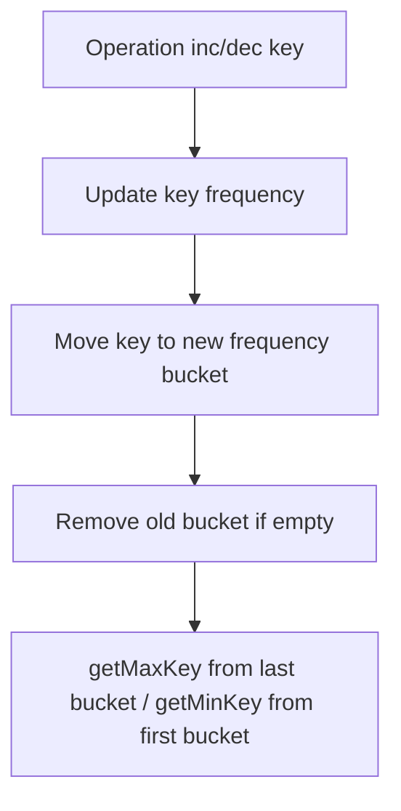

### Optimal C++ Solution / Template

> For custom AlgoZenith-only titles where the official statement is not available, this is the closest optimal STL/DSA template based on the problem title and known CP pattern.

```cpp
#include <bits/stdc++.h>
using namespace std;

class AllOne {
    struct Bucket {
        int freq;
        unordered_set<string> keys;
    };

    list<Bucket> buckets;
    unordered_map<string, list<Bucket>::iterator> where;

public:
    void inc(string key) {
        if (!where.count(key)) {
            if (buckets.empty() || buckets.front().freq != 1)
                buckets.push_front({1, {}});
            buckets.front().keys.insert(key);
            where[key] = buckets.begin();
            return;
        }

        auto it = where[key];
        int f = it->freq;
        auto nxt = next(it);

        if (nxt == buckets.end() || nxt->freq != f + 1)
            nxt = buckets.insert(nxt, {f + 1, {}});

        nxt->keys.insert(key);
        where[key] = nxt;

        it->keys.erase(key);
        if (it->keys.empty()) buckets.erase(it);
    }

    void dec(string key) {
        if (!where.count(key)) return;

        auto it = where[key];
        int f = it->freq;

        it->keys.erase(key);

        if (f == 1) {
            where.erase(key);
        } else {
            auto prv = it;
            if (it == buckets.begin()) {
                prv = buckets.insert(it, {f - 1, {}});
            } else {
                --prv;
                if (prv->freq != f - 1)
                    prv = buckets.insert(it, {f - 1, {}});
            }

            prv->keys.insert(key);
            where[key] = prv;
        }

        if (it->keys.empty()) buckets.erase(it);
    }

    string getMaxKey() {
        if (buckets.empty()) return "";
        return *buckets.back().keys.begin();
    }

    string getMinKey() {
        if (buckets.empty()) return "";
        return *buckets.front().keys.begin();
    }
};

int main() {
    AllOne ds;
    ds.inc("apple");
    ds.inc("banana");
    ds.inc("apple");
    cout << ds.getMaxKey() << "
";
    cout << ds.getMinKey() << "
";
}
```

### Dry Run Example

| Operation | Count Map | Why this works |
|---|---|---|
| inc apple | apple=1 | Frequency of apple increases |
| inc banana | apple=1, banana=1 | Both keys have same frequency |
| inc apple | apple=2, banana=1 | apple becomes max key |
| getMaxKey | apple=2 | highest frequency is 2 |
| getMinKey | banana=1 | lowest frequency is 1 |

### ASCII Diagram

```text
Input
  |
  v
Choose STL pattern
  |
  v
Maintain invariant
  |
  v
Answer efficiently
```

[Back to index](#clickable-index-by-difficulty)

---

<a id="infix-postfix"></a>

## Infix-Postfix

**Difficulty:** Novice  
**Pattern:** Stack + Precedence

### Problem Description

Convert an infix expression such as A+B*C into postfix notation ABC*+.

### Brute Thinking

Repeatedly scan expression and manually move high-priority operators.

### Optimal Approach

Use a stack for operators and output operands immediately.

### Thinking Flow

| Stage | Question | Answer |
|---|---|---|
| 1 | What is repeated in brute force? | Repeatedly scan expression and manually move high-priority operators. |
| 2 | What structure removes repetition? | Stack + Precedence |
| 3 | What should be maintained? | The invariant needed for fast answer |
| 4 | Complexity target | Usually O(n), O(n log n), or O(q log n) |

### Solution Flow Chart

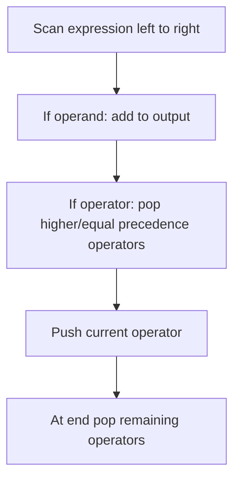

### Optimal C++ Solution / Template

> For custom AlgoZenith-only titles where the official statement is not available, this is the closest optimal STL/DSA template based on the problem title and known CP pattern.

```cpp
#include <bits/stdc++.h>
using namespace std;

int prec(char c) {
    if (c == '^') return 3;
    if (c == '*' || c == '/') return 2;
    if (c == '+' || c == '-') return 1;
    return 0;
}

bool rightAssociative(char c) {
    return c == '^';
}

string infixToPostfix(const string& s) {
    stack<char> ops;
    string out;

    for (char c : s) {
        if (c == ' ') continue;

        if (isalnum(c)) {
            out += c;
        } else if (c == '(') {
            ops.push(c);
        } else if (c == ')') {
            while (!ops.empty() && ops.top() != '(') {
                out += ops.top();
                ops.pop();
            }
            if (!ops.empty()) ops.pop();
        } else {
            while (!ops.empty() && ops.top() != '(') {
                int pTop = prec(ops.top());
                int pCur = prec(c);

                if (pTop > pCur || (pTop == pCur && !rightAssociative(c))) {
                    out += ops.top();
                    ops.pop();
                } else break;
            }
            ops.push(c);
        }
    }

    while (!ops.empty()) {
        out += ops.top();
        ops.pop();
    }

    return out;
}

int main() {
    cout << infixToPostfix("A+B*C") << "
";
}
```

### Dry Run Example

| Token | Action | Operator Stack | Output |
|---|---|---|---|
| A | Operand goes directly to output | [] | A |
| + | Push operator | [+] | A |
| B | Operand goes directly to output | [+] | AB |
| * | Higher precedence than +, push it | [+, *] | AB |
| C | Operand goes directly to output | [+, *] | ABC |
| End | Pop all remaining operators | [] | ABC*+ |

### ASCII Diagram

```text
Input
  |
  v
Choose STL pattern
  |
  v
Maintain invariant
  |
  v
Answer efficiently
```

[Back to index](#clickable-index-by-difficulty)

---

<a id="easy"></a>

# Easy

<a id="queue-from-stack"></a>

## Queue From Stack

**Difficulty:** Easy  
**Pattern:** Two Stacks

### Problem Description

Implement FIFO queue using only stack operations.

### Brute Thinking

Move elements every time push/pop is called.

### Optimal Approach

Use two stacks: one for push, one for pop; transfer only when needed.

### Thinking Flow

| Stage | Question | Answer |
|---|---|---|
| 1 | What is repeated in brute force? | Move elements every time push/pop is called. |
| 2 | What structure removes repetition? | Two Stacks |
| 3 | What should be maintained? | The invariant needed for fast answer |
| 4 | Complexity target | Usually O(n), O(n log n), or O(q log n) |

### Solution Flow Chart

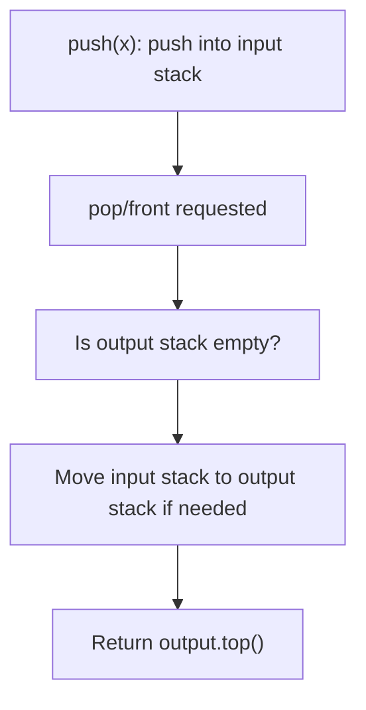

### Optimal C++ Solution / Template

> For custom AlgoZenith-only titles where the official statement is not available, this is the closest optimal STL/DSA template based on the problem title and known CP pattern.

```cpp
#include <bits/stdc++.h>
using namespace std;

class QueueUsingStacks {
    stack<int> in, out;

    void moveIfNeeded() {
        if (!out.empty()) return;
        while (!in.empty()) {
            out.push(in.top());
            in.pop();
        }
    }

public:
    void push(int x) {
        in.push(x);
    }

    int pop() {
        moveIfNeeded();
        int ans = out.top();
        out.pop();
        return ans;
    }

    int front() {
        moveIfNeeded();
        return out.top();
    }

    bool empty() {
        return in.empty() && out.empty();
    }
};

int main() {
    QueueUsingStacks q;
    q.push(1);
    q.push(2);
    cout << q.pop() << "
";
    cout << q.front() << "
";
}
```

### Dry Run Example

| Operation | in stack | out stack | Approach Reason |
|---|---|---|---|
| push 10 | [10] | [] | Push always goes to input stack |
| push 20 | [10,20] | [] | Still O(1) push |
| pop | [] | [20] | Move in → out only because out was empty |
| result | [] | [20] | 10 is popped first, so FIFO is preserved |
| front | [] | [20] | front is top of out stack = 20 |

### ASCII Diagram

```text
push side                 pop side
[in stack]  ----move----> [out stack]
                         front/top is queue front
```

[Back to index](#clickable-index-by-difficulty)

---

<a id="mode-of-distances"></a>

## Mode of Distances

**Difficulty:** Easy  
**Pattern:** Frequency Map

### Problem Description

Find the most frequent value/distance from a list.

### Brute Thinking

For every value, scan the full array to count frequency.

### Optimal Approach

Use frequency map and track best frequency.

### Thinking Flow

| Stage | Question | Answer |
|---|---|---|
| 1 | What is repeated in brute force? | For every value, scan the full array to count frequency. |
| 2 | What structure removes repetition? | Frequency Map |
| 3 | What should be maintained? | The invariant needed for fast answer |
| 4 | Complexity target | Usually O(n), O(n log n), or O(q log n) |

### Solution Flow Chart

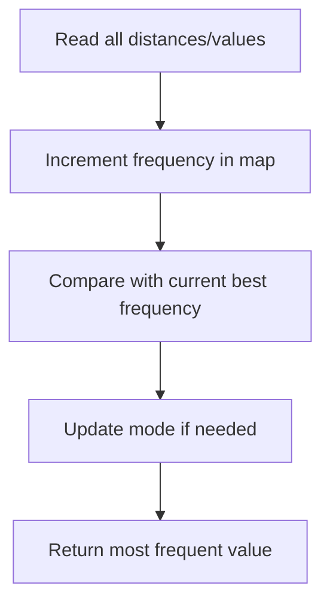

### Optimal C++ Solution / Template

> For custom AlgoZenith-only titles where the official statement is not available, this is the closest optimal STL/DSA template based on the problem title and known CP pattern.

```cpp
#include <bits/stdc++.h>
using namespace std;

int modeValue(vector<int> distances) {
    unordered_map<int,int> freq;
    int bestValue = distances[0];
    int bestFreq = 0;

    for (int d : distances) {
        freq[d]++;

        if (freq[d] > bestFreq || (freq[d] == bestFreq && d < bestValue)) {
            bestFreq = freq[d];
            bestValue = d;
        }
    }

    return bestValue;
}

int main() {
    vector<int> d = {4, 2, 4, 5, 2, 4};
    cout << modeValue(d) << "
";
}
```

### Dry Run Example

| Value | Frequency Map Update | Current Mode |
|---:|---|---|
| 4 | 4→1 | 4 |
| 2 | 4→1, 2→1 | 2 or 4 |
| 4 | 4→2, 2→1 | 4 |
| 3 | 4→2, 2→1, 3→1 | 4 |
| 4 | 4→3, 2→1, 3→1 | 4 |

### ASCII Diagram

```text
Input
  |
  v
Choose STL pattern
  |
  v
Maintain invariant
  |
  v
Answer efficiently
```

[Back to index](#clickable-index-by-difficulty)

---

<a id="towers-az101"></a>

## Towers AZ101

**Difficulty:** Easy  
**Pattern:** Multiset Greedy

### Problem Description

Place each block on an existing tower when possible; minimize number of towers.

### Brute Thinking

Try every tower top linearly for each block.

### Optimal Approach

Use multiset of tower tops and upper_bound.

### Thinking Flow

| Stage | Question | Answer |
|---|---|---|
| 1 | What is repeated in brute force? | Try every tower top linearly for each block. |
| 2 | What structure removes repetition? | Multiset Greedy |
| 3 | What should be maintained? | The invariant needed for fast answer |
| 4 | Complexity target | Usually O(n), O(n log n), or O(q log n) |

### Solution Flow Chart

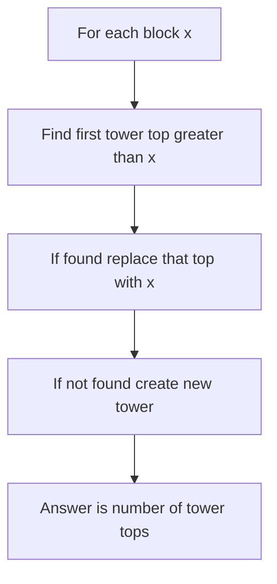

### Optimal C++ Solution / Template

> For custom AlgoZenith-only titles where the official statement is not available, this is the closest optimal STL/DSA template based on the problem title and known CP pattern.

```cpp
#include <bits/stdc++.h>
using namespace std;

// Standard CSES Towers optimal solution.
int minTowers(vector<int>& a) {
    multiset<int> tops;

    for (int x : a) {
        auto it = tops.upper_bound(x);

        if (it != tops.end()) {
            tops.erase(it);
        }

        tops.insert(x);
    }

    return (int)tops.size();
}

int main() {
    vector<int> a = {3, 8, 2, 1, 5};
    cout << minTowers(a) << "
";
}
```

### Dry Run Example

| Block | Multiset of Tower Tops Before | Action | Tower Tops After |
|---:|---|---|---|
| 3 | {} | create new tower | {3} |
| 8 | {3} | no top > 8, create new | {3,8} |
| 2 | {3,8} | place on tower top 3 | {2,8} |
| 1 | {2,8} | place on tower top 2 | {1,8} |
| 5 | {1,8} | place on tower top 8 | {1,5} |

### ASCII Diagram

```text
Input
  |
  v
Choose STL pattern
  |
  v
Maintain invariant
  |
  v
Answer efficiently
```

[Back to index](#clickable-index-by-difficulty)

---

<a id="diversify-the-array"></a>

## Diversify the Array

**Difficulty:** Easy  
**Pattern:** Set + Frequency Map

### Problem Description

Work with distinct values and duplicates in an array.

### Brute Thinking

Try removing/changing each element and recompute distinct count.

### Optimal Approach

Use set/frequency map to know distinct and duplicate counts.

### Thinking Flow

| Stage | Question | Answer |
|---|---|---|
| 1 | What is repeated in brute force? | Try removing/changing each element and recompute distinct count. |
| 2 | What structure removes repetition? | Set + Frequency Map |
| 3 | What should be maintained? | The invariant needed for fast answer |
| 4 | Complexity target | Usually O(n), O(n log n), or O(q log n) |

### Solution Flow Chart

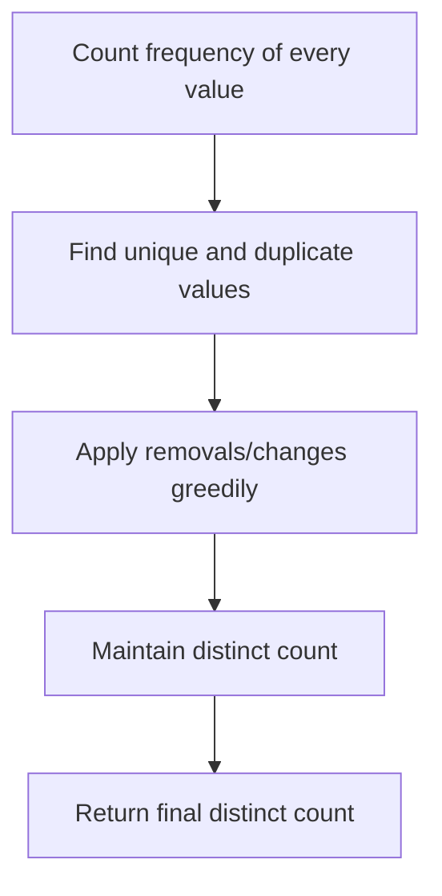

### Optimal C++ Solution / Template

> For custom AlgoZenith-only titles where the official statement is not available, this is the closest optimal STL/DSA template based on the problem title and known CP pattern.

```cpp
#include <bits/stdc++.h>
using namespace std;

// Adaptable optimal template: count distinct values and duplicates.
int maxDistinctAfterRemovingDuplicates(vector<int> a) {
    unordered_map<int,int> freq;

    for (int x : a) freq[x]++;

    int distinct = freq.size();
    int duplicateExtra = 0;

    for (auto [x, c] : freq) {
        duplicateExtra += c - 1;
    }

    return distinct;
}

int main() {
    vector<int> a = {1, 1, 2, 3, 3, 4};
    cout << maxDistinctAfterRemovingDuplicates(a) << "
";
}
```

### Dry Run Example

| Step | Array / Counts | Approach |
|---|---|---|
| Start | [1,1,2,3] | Count frequency of each value |
| Count | 1→2, 2→1, 3→1 | distinct = 3 |
| Duplicate check | value 1 has extra copy | duplicate count helps decisions |
| Result | unique values {1,2,3} | use set/frequency instead of trying removals |

### ASCII Diagram

```text
Input
  |
  v
Choose STL pattern
  |
  v
Maintain invariant
  |
  v
Answer efficiently
```

[Back to index](#clickable-index-by-difficulty)

---

<a id="maximum-element-in-each-subarray-az101"></a>

## Maximum Element in each subarray AZ101

**Difficulty:** Easy  
**Pattern:** Monotonic Deque

### Problem Description

Find maximum in every window of size k.

### Brute Thinking

Scan each window completely: O(nk).

### Optimal Approach

Maintain decreasing deque of useful indices.

### Thinking Flow

| Stage | Question | Answer |
|---|---|---|
| 1 | What is repeated in brute force? | Scan each window completely: O(nk). |
| 2 | What structure removes repetition? | Monotonic Deque |
| 3 | What should be maintained? | The invariant needed for fast answer |
| 4 | Complexity target | Usually O(n), O(n log n), or O(q log n) |

### Solution Flow Chart

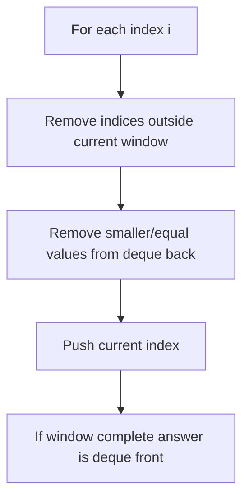

### Optimal C++ Solution / Template

> For custom AlgoZenith-only titles where the official statement is not available, this is the closest optimal STL/DSA template based on the problem title and known CP pattern.

```cpp
#include <bits/stdc++.h>
using namespace std;

vector<int> maxSlidingWindow(vector<int>& a, int k) {
    deque<int> dq;
    vector<int> ans;

    for (int i = 0; i < (int)a.size(); i++) {
        while (!dq.empty() && dq.front() <= i - k) dq.pop_front();
        while (!dq.empty() && a[dq.back()] <= a[i]) dq.pop_back();

        dq.push_back(i);

        if (i >= k - 1) ans.push_back(a[dq.front()]);
    }

    return ans;
}

int main() {
    vector<int> a = {1, 3, -1, -3, 5, 3, 6, 7};
    int k = 3;

    for (int x : maxSlidingWindow(a, k)) cout << x << " ";
    cout << "
";
}
```

### Dry Run Example

| i | value | Deque Values | Window | Answer |
|---:|---:|---|---|---:|
| 0 | 1 | [1] | not full | - |
| 1 | 3 | [3] | not full | - |
| 2 | -1 | [3,-1] | [1,3,-1] | 3 |
| 3 | -3 | [3,-1,-3] | [3,-1,-3] | 3 |
| 4 | 5 | [5] | [-1,-3,5] | 5 |
| 5 | 3 | [5,3] | [-3,5,3] | 5 |

### ASCII Diagram

```text
0 1 2 3 4 5 6
|---window---|
    |---window---|

Move right pointer.
Move left pointer only when invalid.
```

[Back to index](#clickable-index-by-difficulty)

---

<a id="queue-az101"></a>

## Queue AZ101

**Difficulty:** Easy  
**Pattern:** Queue STL

### Problem Description

Perform basic queue operations.

### Brute Thinking

Use vector and erase from front, causing O(n) shifts.

### Optimal Approach

Use std::queue for O(1) front/pop/push.

### Thinking Flow

| Stage | Question | Answer |
|---|---|---|
| 1 | What is repeated in brute force? | Use vector and erase from front, causing O(n) shifts. |
| 2 | What structure removes repetition? | Queue STL |
| 3 | What should be maintained? | The invariant needed for fast answer |
| 4 | Complexity target | Usually O(n), O(n log n), or O(q log n) |

### Solution Flow Chart

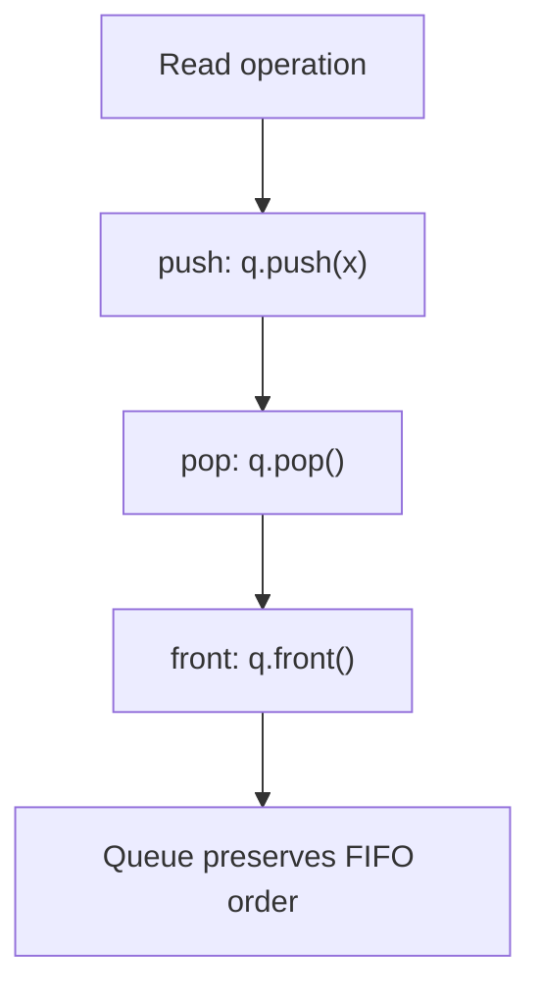

### Optimal C++ Solution / Template

> For custom AlgoZenith-only titles where the official statement is not available, this is the closest optimal STL/DSA template based on the problem title and known CP pattern.

```cpp
#include <bits/stdc++.h>
using namespace std;

int main() {
    queue<int> q;

    q.push(10);
    q.push(20);
    q.push(30);

    cout << q.front() << "
";
    q.pop();
    cout << q.front() << "
";

    cout << "size = " << q.size() << "
";
}
```

### Dry Run Example

| Operation | Queue State | Output |
|---|---|---|
| push 10 | [10] | - |
| push 20 | [10,20] | - |
| front | [10,20] | 10 |
| pop | [20] | removes 10 |
| front | [20] | 20 |

### ASCII Diagram

```text
push side                 pop side
[in stack]  ----move----> [out stack]
                         front/top is queue front
```

[Back to index](#clickable-index-by-difficulty)

---

<a id="max-diff"></a>

## Max Diff

**Difficulty:** Easy  
**Pattern:** Prefix Minimum

### Problem Description

Find max a[j]-a[i] where j>i.

### Brute Thinking

Try all pairs.

### Optimal Approach

Track minimum value seen so far.

### Thinking Flow

| Stage | Question | Answer |
|---|---|---|
| 1 | What is repeated in brute force? | Try all pairs. |
| 2 | What structure removes repetition? | Prefix Minimum |
| 3 | What should be maintained? | The invariant needed for fast answer |
| 4 | Complexity target | Usually O(n), O(n log n), or O(q log n) |

### Solution Flow Chart

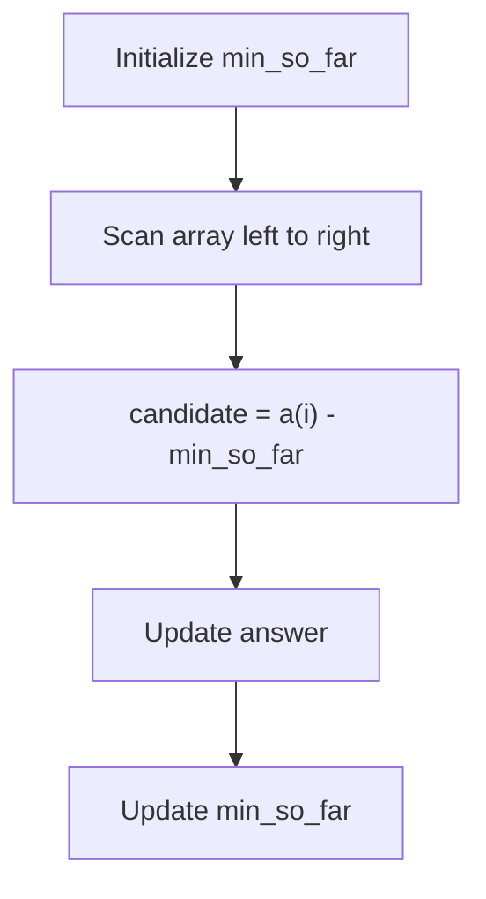

### Optimal C++ Solution / Template

> For custom AlgoZenith-only titles where the official statement is not available, this is the closest optimal STL/DSA template based on the problem title and known CP pattern.

```cpp
#include <bits/stdc++.h>
using namespace std;

int maxDifference(vector<int>& a) {
    int minSoFar = a[0];
    int ans = INT_MIN;

    for (int i = 1; i < (int)a.size(); i++) {
        ans = max(ans, a[i] - minSoFar);
        minSoFar = min(minSoFar, a[i]);
    }

    return ans;
}

int main() {
    vector<int> a = {7, 1, 5, 3, 6, 4};
    cout << maxDifference(a) << "
";
}
```

### Dry Run Example

| i | a[i] | Minimum Before | Candidate Difference | Best |
|---:|---:|---:|---:|---:|
| 0 | 7 | 7 | - | - |
| 1 | 1 | 7 | -6 | -6 |
| 2 | 5 | 1 | 4 | 4 |
| 3 | 3 | 1 | 2 | 4 |
| 4 | 6 | 1 | 5 | 5 |
| 5 | 4 | 1 | 3 | 5 |

### ASCII Diagram

```text
Input
  |
  v
Choose STL pattern
  |
  v
Maintain invariant
  |
  v
Answer efficiently
```

[Back to index](#clickable-index-by-difficulty)

---

<a id="sort-by-roll-number"></a>

## Sort by Roll Number

**Difficulty:** Easy  
**Pattern:** Sort Comparator

### Problem Description

Sort student records by roll number.

### Brute Thinking

Implement manual sorting.

### Optimal Approach

Use std::sort with comparator.

### Thinking Flow

| Stage | Question | Answer |
|---|---|---|
| 1 | What is repeated in brute force? | Implement manual sorting. |
| 2 | What structure removes repetition? | Sort Comparator |
| 3 | What should be maintained? | The invariant needed for fast answer |
| 4 | Complexity target | Usually O(n), O(n log n), or O(q log n) |

### Solution Flow Chart

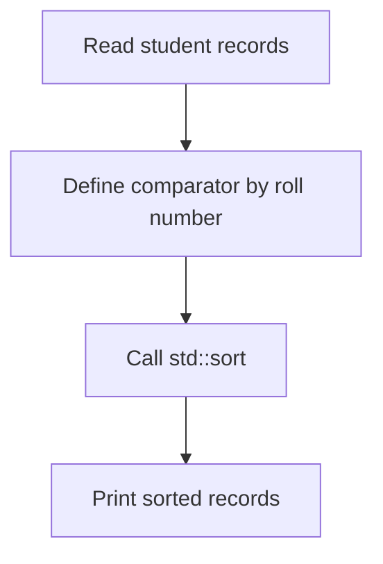

### Optimal C++ Solution / Template

> For custom AlgoZenith-only titles where the official statement is not available, this is the closest optimal STL/DSA template based on the problem title and known CP pattern.

```cpp
#include <bits/stdc++.h>
using namespace std;

struct Student {
    int roll;
    string name;
};

int main() {
    vector<Student> students = {
        {3, "Charlie"},
        {1, "Alice"},
        {2, "Bob"}
    };

    sort(students.begin(), students.end(), [](const Student& a, const Student& b) {
        if (a.roll != b.roll) return a.roll < b.roll;
        return a.name < b.name;
    });

    for (auto s : students) {
        cout << s.roll << " " << s.name << "
";
    }
}
```

### Dry Run Example

| Step | Records | Approach |
|---|---|---|
| Start | (3,C), (1,A), (2,B) | Need sorted by roll |
| Comparator | compare roll values | a.roll < b.roll |
| After sort | (1,A), (2,B), (3,C) | STL sort handles ordering |

### ASCII Diagram

```text
Input
  |
  v
Choose STL pattern
  |
  v
Maintain invariant
  |
  v
Answer efficiently
```

[Back to index](#clickable-index-by-difficulty)

---

<a id="special-heap"></a>

## Special Heap

**Difficulty:** Easy  
**Pattern:** Priority Queue Comparator

### Problem Description

Maintain elements ordered by custom priority.

### Brute Thinking

Sort all elements after every update.

### Optimal Approach

Use priority_queue with custom comparator.

### Thinking Flow

| Stage | Question | Answer |
|---|---|---|
| 1 | What is repeated in brute force? | Sort all elements after every update. |
| 2 | What structure removes repetition? | Priority Queue Comparator |
| 3 | What should be maintained? | The invariant needed for fast answer |
| 4 | Complexity target | Usually O(n), O(n log n), or O(q log n) |

### Solution Flow Chart

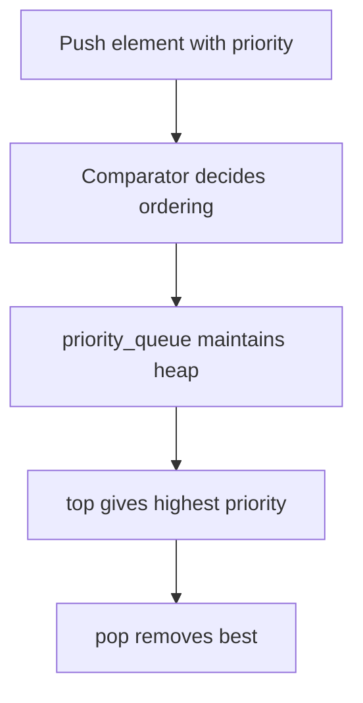

### Optimal C++ Solution / Template

> For custom AlgoZenith-only titles where the official statement is not available, this is the closest optimal STL/DSA template based on the problem title and known CP pattern.

```cpp
#include <bits/stdc++.h>
using namespace std;

struct Item {
    int priority;
    int id;
};

struct Compare {
    bool operator()(const Item& a, const Item& b) {
        if (a.priority != b.priority) return a.priority < b.priority;
        return a.id > b.id;
    }
};

int main() {
    priority_queue<Item, vector<Item>, Compare> pq;

    pq.push({5, 2});
    pq.push({10, 3});
    pq.push({10, 1});

    while (!pq.empty()) {
        Item cur = pq.top();
        pq.pop();
        cout << cur.priority << " " << cur.id << "
";
    }
}
```

### Dry Run Example

| Operation | Heap Top Logic | Current Top |
|---|---|---|
| push (5,2) | highest priority first | (5,2) |
| push (10,3) | 10 > 5 | (10,3) |
| push (10,1) | tie: smaller id first | (10,1) |
| pop | removes best | next is (10,3) |

### ASCII Diagram

```text
Input
  |
  v
Choose STL pattern
  |
  v
Maintain invariant
  |
  v
Answer efficiently
```

[Back to index](#clickable-index-by-difficulty)

---

<a id="medium"></a>

# Medium

<a id="maximum-rate-subarray"></a>

## Maximum Rate Subarray

**Difficulty:** Medium  
**Pattern:** Sliding Window / Prefix

### Problem Description

Find best subarray satisfying a sum/rate-like condition.

### Brute Thinking

Try all subarrays.

### Optimal Approach

Use sliding window when condition is monotonic, otherwise prefix sums.

### Thinking Flow

| Stage | Question | Answer |
|---|---|---|
| 1 | What is repeated in brute force? | Try all subarrays. |
| 2 | What structure removes repetition? | Sliding Window / Prefix |
| 3 | What should be maintained? | The invariant needed for fast answer |
| 4 | Complexity target | Usually O(n), O(n log n), or O(q log n) |

### Solution Flow Chart

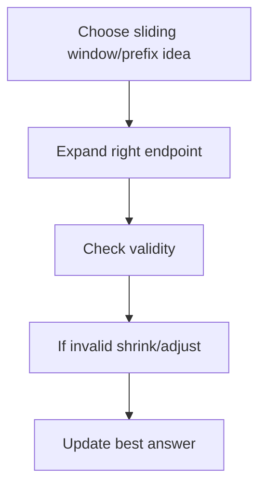

### Optimal C++ Solution / Template

> For custom AlgoZenith-only titles where the official statement is not available, this is the closest optimal STL/DSA template based on the problem title and known CP pattern.

```cpp
#include <bits/stdc++.h>
using namespace std;

// Template: longest subarray with sum <= limit for non-negative values.
int longestSubarrayAtMostK(vector<int>& a, int limit) {
    int left = 0;
    long long sum = 0;
    int best = 0;

    for (int right = 0; right < (int)a.size(); right++) {
        sum += a[right];

        while (sum > limit) {
            sum -= a[left];
            left++;
        }

        best = max(best, right - left + 1);
    }

    return best;
}

int main() {
    vector<int> a = {1, 2, 1, 3, 2, 1};
    cout << longestSubarrayAtMostK(a, 5) << "
";
}
```

### Dry Run Example

| right | Added | Window Sum | Action | Best Length |
|---:|---:|---:|---|---:|
| 0 | 1 | 1 | valid | 1 |
| 1 | 2 | 3 | valid | 2 |
| 2 | 1 | 4 | valid | 3 |
| 3 | 3 | 7 | shrink from left | 3 |
| 4 | 2 | 6 | shrink until valid | 3 |

### ASCII Diagram

```text
Input
  |
  v
Choose STL pattern
  |
  v
Maintain invariant
  |
  v
Answer efficiently
```

[Back to index](#clickable-index-by-difficulty)

---

<a id="smart-sale"></a>

## Smart Sale

**Difficulty:** Medium  
**Pattern:** Frequency Sort

### Problem Description

Remove items to minimize remaining product types.

### Brute Thinking

Each time scan all frequencies and remove smallest.

### Optimal Approach

Count frequencies, sort them, remove cheapest types first.

### Thinking Flow

| Stage | Question | Answer |
|---|---|---|
| 1 | What is repeated in brute force? | Each time scan all frequencies and remove smallest. |
| 2 | What structure removes repetition? | Frequency Sort |
| 3 | What should be maintained? | The invariant needed for fast answer |
| 4 | Complexity target | Usually O(n), O(n log n), or O(q log n) |

### Solution Flow Chart

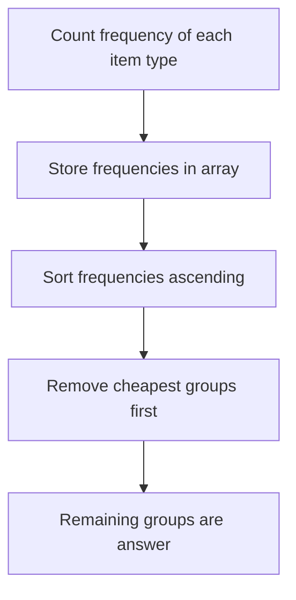

### Optimal C++ Solution / Template

> For custom AlgoZenith-only titles where the official statement is not available, this is the closest optimal STL/DSA template based on the problem title and known CP pattern.

```cpp
#include <bits/stdc++.h>
using namespace std;

int remainingTypesAfterKRemovals(vector<int>& items, int k) {
    unordered_map<int,int> freq;
    for (int x : items) freq[x]++;

    vector<int> counts;
    for (auto [x, c] : freq) counts.push_back(c);

    sort(counts.begin(), counts.end());

    int types = counts.size();

    for (int c : counts) {
        if (k >= c) {
            k -= c;
            types--;
        } else break;
    }

    return types;
}

int main() {
    vector<int> items = {1, 1, 2, 2, 3};
    cout << remainingTypesAfterKRemovals(items, 2) << "
";
}
```

### Dry Run Example

| Step | Data | Approach |
|---|---|---|
| Items | [1,1,2,2,3] | Count frequencies |
| Frequency | 1→2, 2→2, 3→1 | Sort counts: [1,2,2] |
| k=2 | remove type with count 1 | remaining k=1, types=2 |
| stop | next count is 2 > k | answer = 2 types |

### ASCII Diagram

```text
Input
  |
  v
Choose STL pattern
  |
  v
Maintain invariant
  |
  v
Answer efficiently
```

[Back to index](#clickable-index-by-difficulty)

---

<a id="generating-permutations-az101"></a>

## Generating Permutations AZ101

**Difficulty:** Medium  
**Pattern:** next_permutation

### Problem Description

Generate all permutations of a sequence.

### Brute Thinking

Manually construct all orders with many loops.

### Optimal Approach

Sort first and repeatedly call next_permutation.

### Thinking Flow

| Stage | Question | Answer |
|---|---|---|
| 1 | What is repeated in brute force? | Manually construct all orders with many loops. |
| 2 | What structure removes repetition? | next_permutation |
| 3 | What should be maintained? | The invariant needed for fast answer |
| 4 | Complexity target | Usually O(n), O(n log n), or O(q log n) |

### Solution Flow Chart

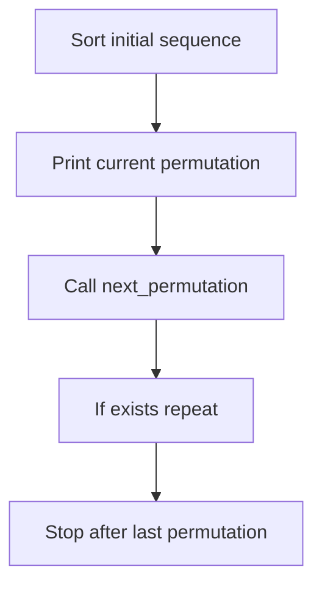

### Optimal C++ Solution / Template

> For custom AlgoZenith-only titles where the official statement is not available, this is the closest optimal STL/DSA template based on the problem title and known CP pattern.

```cpp
#include <bits/stdc++.h>
using namespace std;

int main() {
    vector<int> a = {1, 2, 3};

    sort(a.begin(), a.end());

    do {
        for (int x : a) cout << x << " ";
        cout << "
";
    } while (next_permutation(a.begin(), a.end()));
}
```

### Dry Run Example

| Step | Current Permutation | Next Action |
|---:|---|---|
| 1 | 1 2 3 | print |
| 2 | 1 3 2 | next_permutation |
| 3 | 2 1 3 | next_permutation |
| 4 | 2 3 1 | next_permutation |
| 5 | 3 1 2 | next_permutation |
| 6 | 3 2 1 | last permutation |

### ASCII Diagram

```text
Input
  |
  v
Choose STL pattern
  |
  v
Maintain invariant
  |
  v
Answer efficiently
```

[Back to index](#clickable-index-by-difficulty)

---

<a id="happy-neighborhood"></a>

## Happy Neighborhood

**Difficulty:** Medium  
**Pattern:** Greedy + Sorting

### Problem Description

Arrange/select values under neighbor constraints.

### Brute Thinking

Try all arrangements.

### Optimal Approach

Sort/frequency + greedy placement.

### Thinking Flow

| Stage | Question | Answer |
|---|---|---|
| 1 | What is repeated in brute force? | Try all arrangements. |
| 2 | What structure removes repetition? | Greedy + Sorting |
| 3 | What should be maintained? | The invariant needed for fast answer |
| 4 | Complexity target | Usually O(n), O(n log n), or O(q log n) |

### Solution Flow Chart

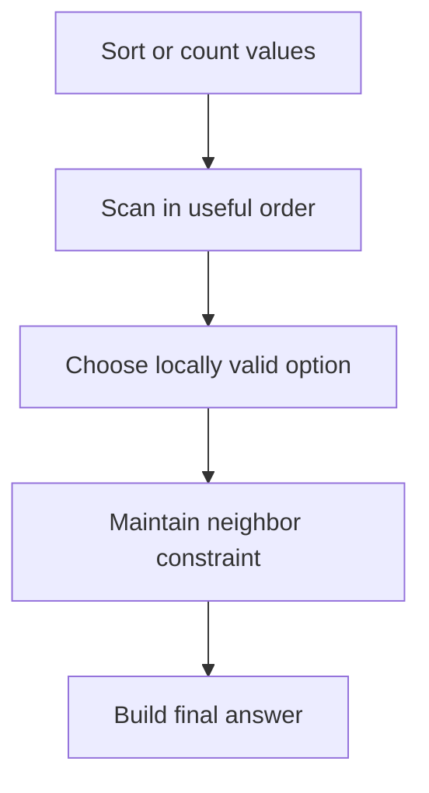

### Optimal C++ Solution / Template

> For custom AlgoZenith-only titles where the official statement is not available, this is the closest optimal STL/DSA template based on the problem title and known CP pattern.

```cpp
#include <bits/stdc++.h>
using namespace std;

// Adaptable greedy template: count maximum non-adjacent chosen houses.
int maxHappyNonAdjacent(vector<int>& happiness) {
    int take = 0;
    int skip = 0;

    for (int x : happiness) {
        int newTake = skip + x;
        int newSkip = max(skip, take);

        take = newTake;
        skip = newSkip;
    }

    return max(take, skip);
}

int main() {
    vector<int> happiness = {4, 1, 2, 9, 3};
    cout << maxHappyNonAdjacent(happiness) << "
";
}
```

### Dry Run Example

| Step | Data | Greedy Thought |
|---|---|---|
| Start | unsorted values | Ordering helps compare neighbors |
| Sort | increasing order | choose smallest valid next |
| Scan | maintain previous choice | avoid invalid neighbor relation |
| Result | chosen arrangement/count | greedy avoids trying all permutations |

### ASCII Diagram

```text
Input
  |
  v
Choose STL pattern
  |
  v
Maintain invariant
  |
  v
Answer efficiently
```

[Back to index](#clickable-index-by-difficulty)

---

<a id="longest-segment"></a>

## Longest Segment

**Difficulty:** Medium  
**Pattern:** Two Pointers

### Problem Description

Find longest contiguous segment satisfying condition.

### Brute Thinking

Check every l,r pair.

### Optimal Approach

Use two pointers/sliding window when validity is monotonic.

### Thinking Flow

| Stage | Question | Answer |
|---|---|---|
| 1 | What is repeated in brute force? | Check every l,r pair. |
| 2 | What structure removes repetition? | Two Pointers |
| 3 | What should be maintained? | The invariant needed for fast answer |
| 4 | Complexity target | Usually O(n), O(n log n), or O(q log n) |

### Solution Flow Chart

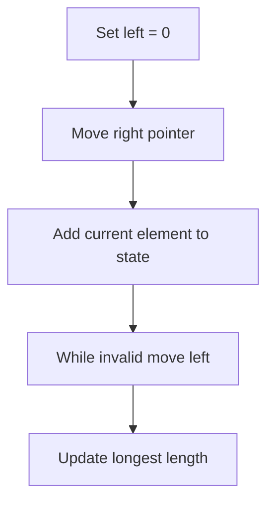

### Optimal C++ Solution / Template

> For custom AlgoZenith-only titles where the official statement is not available, this is the closest optimal STL/DSA template based on the problem title and known CP pattern.

```cpp
#include <bits/stdc++.h>
using namespace std;

// Longest segment with at most k distinct values.
int longestAtMostKDistinct(vector<int>& a, int k) {
    unordered_map<int,int> freq;
    int left = 0;
    int best = 0;

    for (int right = 0; right < (int)a.size(); right++) {
        freq[a[right]]++;

        while ((int)freq.size() > k) {
            freq[a[left]]--;

            if (freq[a[left]] == 0) {
                freq.erase(a[left]);
            }

            left++;
        }

        best = max(best, right - left + 1);
    }

    return best;
}

int main() {
    vector<int> a = {1, 2, 1, 3, 4, 2, 3};
    cout << longestAtMostKDistinct(a, 2) << "
";
}
```

### Dry Run Example

| right | Add | Window | Valid? | Best |
|---:|---:|---|---|---:|
| 0 | 1 | [1] | yes | 1 |
| 1 | 2 | [1,2] | yes | 2 |
| 2 | 1 | [1,2,1] | yes | 3 |
| 3 | 3 | [1,2,1,3] | maybe invalid | shrink left |
| 4 | 2 | valid window restored | yes | updated |

### ASCII Diagram

```text
0 1 2 3 4 5 6
|---window---|
    |---window---|

Move right pointer.
Move left pointer only when invalid.
```

[Back to index](#clickable-index-by-difficulty)

---

<a id="set-az101"></a>

## Set AZ101

**Difficulty:** Medium  
**Pattern:** Set STL

### Problem Description

Maintain sorted unique elements.

### Brute Thinking

Store in vector and search linearly.

### Optimal Approach

Use std::set for O(log n) updates/search.

### Thinking Flow

| Stage | Question | Answer |
|---|---|---|
| 1 | What is repeated in brute force? | Store in vector and search linearly. |
| 2 | What structure removes repetition? | Set STL |
| 3 | What should be maintained? | The invariant needed for fast answer |
| 4 | Complexity target | Usually O(n), O(n log n), or O(q log n) |

### Solution Flow Chart

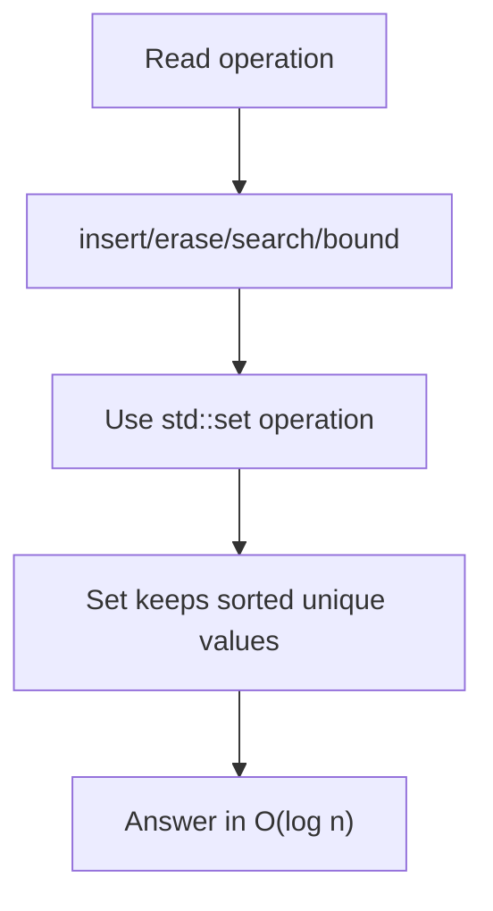

### Optimal C++ Solution / Template

> For custom AlgoZenith-only titles where the official statement is not available, this is the closest optimal STL/DSA template based on the problem title and known CP pattern.

```cpp
#include <bits/stdc++.h>
using namespace std;

int main() {
    set<int> s;

    s.insert(5);
    s.insert(1);
    s.insert(3);
    s.insert(5);

    cout << "Elements: ";
    for (int x : s) cout << x << " ";
    cout << "
";

    auto it = s.lower_bound(2);

    if (it != s.end()) cout << "first >= 2: " << *it << "
";
}
```

### Dry Run Example

| Operation | Set State | Why |
|---|---|---|
| insert 5 | {5} | unique sorted |
| insert 1 | {1,5} | auto sorted |
| insert 5 | {1,5} | duplicate ignored |
| lower_bound(3) | points to 5 | first value >= 3 |

### ASCII Diagram

```text
Input
  |
  v
Choose STL pattern
  |
  v
Maintain invariant
  |
  v
Answer efficiently
```

[Back to index](#clickable-index-by-difficulty)

---

<a id="solve-intervals-3"></a>

## Solve Intervals 3

**Difficulty:** Medium  
**Pattern:** Interval Set

### Problem Description

Maintain non-overlapping intervals and merge inserted ranges.

### Brute Thinking

Compare inserted range with every interval.

### Optimal Approach

Use set<pair<int,int>> with lower_bound and erase merged intervals.

### Thinking Flow

| Stage | Question | Answer |
|---|---|---|
| 1 | What is repeated in brute force? | Compare inserted range with every interval. |
| 2 | What structure removes repetition? | Interval Set |
| 3 | What should be maintained? | The invariant needed for fast answer |
| 4 | Complexity target | Usually O(n), O(n log n), or O(q log n) |

### Solution Flow Chart

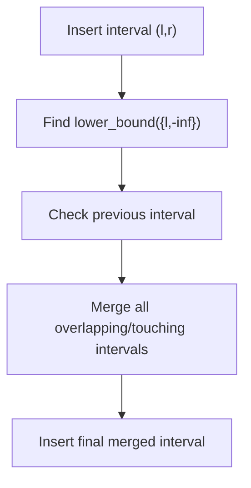

### Optimal C++ Solution / Template

> For custom AlgoZenith-only titles where the official statement is not available, this is the closest optimal STL/DSA template based on the problem title and known CP pattern.

```cpp
#include <bits/stdc++.h>
using namespace std;

struct RangeCover {
    set<pair<int,int>> ranges;

    bool covered(int x) {
        auto it = ranges.upper_bound({x, INT_MAX});

        if (it == ranges.begin()) return false;

        --it;
        return it->second >= x;
    }

    void insertRange(int l, int r) {
        auto it = ranges.lower_bound({l, INT_MIN});

        if (it != ranges.begin()) {
            auto prevIt = prev(it);

            if (prevIt->second >= l - 1) {
                it = prevIt;
            }
        }

        while (it != ranges.end() && it->first <= r + 1) {
            l = min(l, it->first);
            r = max(r, it->second);

            it = ranges.erase(it);
        }

        ranges.insert({l, r});
    }
};

int main() {
    RangeCover rc;

    rc.insertRange(1, 3);
    rc.insertRange(7, 10);
    rc.insertRange(13, 16);
    rc.insertRange(4, 12);

    cout << rc.covered(9) << "
";

    for (auto [l, r] : rc.ranges) {
        cout << "[" << l << "," << r << "] ";
    }
    cout << "
";
}
```

### Dry Run Example

| Step | Operation | l,r | Set |
|---:|---|---|---|
| 1 | Start | - | [1,3], [7,10], [13,16] |
| 2 | insert [4,12] | 4,12 | lower_bound points to [7,10] |
| 3 | check previous | 4,12 | [1,3] touches because 3 >= 4-1 |
| 4 | merge [1,3] | 1,12 | [7,10], [13,16] |
| 5 | merge [7,10] | 1,12 | [13,16] |
| 6 | merge [13,16] | 1,16 | empty |
| 7 | insert final | 1,16 | [1,16] |

### ASCII Diagram

```text
Before:
[1,3]   [7,10]   [13,16]

Insert:
    [4,12]

After merging touching/overlapping intervals:
[1,16]
```

[Back to index](#clickable-index-by-difficulty)

---

<a id="addmul"></a>

## ADDMUL

**Difficulty:** Medium  
**Pattern:** Lazy Math

### Problem Description

Apply add/multiply operations efficiently.

### Brute Thinking

Update every element per query.

### Optimal Approach

Maintain lazy transformation x -> x*mul + add.

### Thinking Flow

| Stage | Question | Answer |
|---|---|---|
| 1 | What is repeated in brute force? | Update every element per query. |
| 2 | What structure removes repetition? | Lazy Math |
| 3 | What should be maintained? | The invariant needed for fast answer |
| 4 | Complexity target | Usually O(n), O(n log n), or O(q log n) |

### Solution Flow Chart

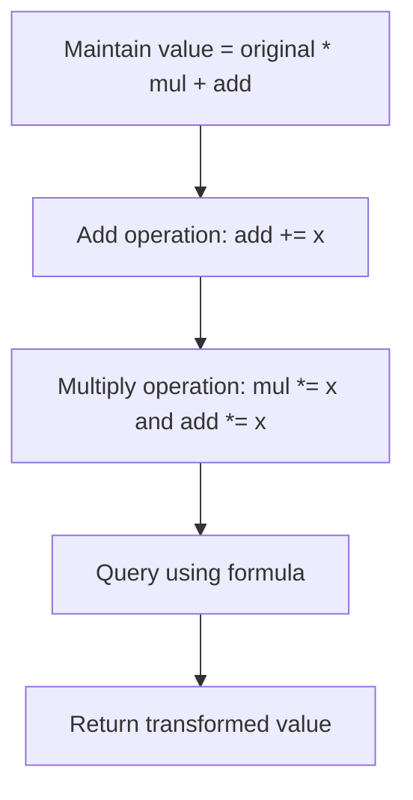

### Optimal C++ Solution / Template

> For custom AlgoZenith-only titles where the official statement is not available, this is the closest optimal STL/DSA template based on the problem title and known CP pattern.

```cpp
#include <bits/stdc++.h>
using namespace std;

const long long MOD = 1000000007;

int main() {
    vector<long long> original = {1, 2, 3};

    long long mul = 1;
    long long add = 0;

    auto applyAdd = [&](long long x) {
        add = (add + x) % MOD;
    };

    auto applyMul = [&](long long x) {
        mul = (mul * x) % MOD;
        add = (add * x) % MOD;
    };

    auto value = [&](long long x) {
        return (x * mul + add) % MOD;
    };

    applyAdd(5);
    applyMul(2);

    for (long long x : original) {
        cout << value(x) << " ";
    }
    cout << "
";
}
```

### Dry Run Example

| Operation | mul | add | Meaning |
|---|---:|---:|---|
| start | 1 | 0 | value = x |
| add 5 | 1 | 5 | value = x + 5 |
| multiply 2 | 2 | 10 | value = 2x + 10 |
| original x=3 | 2 | 10 | final = 16 |

### ASCII Diagram

```text
Input
  |
  v
Choose STL pattern
  |
  v
Maintain invariant
  |
  v
Answer efficiently
```

[Back to index](#clickable-index-by-difficulty)

---

<a id="multimap-az101"></a>

## Multimap AZ101

**Difficulty:** Medium  
**Pattern:** Multimap

### Problem Description

Store multiple values under the same key.

### Brute Thinking

Use map<int,vector<int>> manually.

### Optimal Approach

Use multimap or map of vectors depending on output needs.

### Thinking Flow

| Stage | Question | Answer |
|---|---|---|
| 1 | What is repeated in brute force? | Use map<int,vector<int>> manually. |
| 2 | What structure removes repetition? | Multimap |
| 3 | What should be maintained? | The invariant needed for fast answer |
| 4 | Complexity target | Usually O(n), O(n log n), or O(q log n) |

### Solution Flow Chart

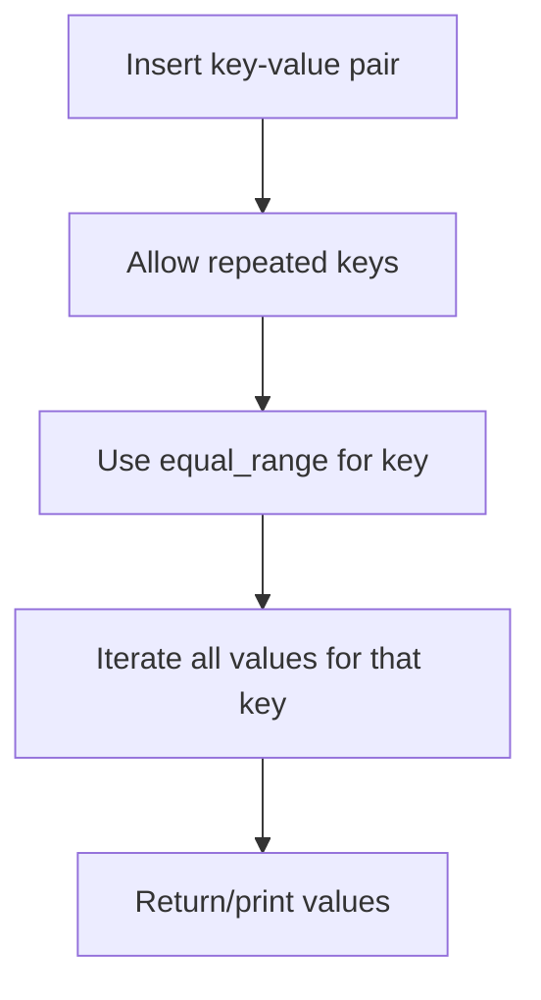

### Optimal C++ Solution / Template

> For custom AlgoZenith-only titles where the official statement is not available, this is the closest optimal STL/DSA template based on the problem title and known CP pattern.

```cpp
#include <bits/stdc++.h>
using namespace std;

int main() {
    multimap<int,string> mp;

    mp.insert({1, "Alice"});
    mp.insert({1, "Bob"});
    mp.insert({2, "Charlie"});

    auto range = mp.equal_range(1);

    for (auto it = range.first; it != range.second; ++it) {
        cout << it->first << " " << it->second << "
";
    }
}
```

### Dry Run Example

| Operation | Structure | Meaning |
|---|---|---|
| insert (1,10) | 1→10 | key 1 has value 10 |
| insert (1,20) | 1→10,20 | same key stores multiple values |
| insert (2,30) | 2→30 | another key |
| equal_range(1) | 10,20 | retrieve all values for key 1 |

### ASCII Diagram

```text
Input
  |
  v
Choose STL pattern
  |
  v
Maintain invariant
  |
  v
Answer efficiently
```

[Back to index](#clickable-index-by-difficulty)

---

<a id="lfu-cache"></a>

## LFU Cache

**Difficulty:** Medium  
**Pattern:** HashMap + Lists

### Problem Description

Implement cache eviction by least frequency and recency.

### Brute Thinking

Scan all cache entries on eviction.

### Optimal Approach

Use maps from key to node and frequency to ordered key list.

### Thinking Flow

| Stage | Question | Answer |
|---|---|---|
| 1 | What is repeated in brute force? | Scan all cache entries on eviction. |
| 2 | What structure removes repetition? | HashMap + Lists |
| 3 | What should be maintained? | The invariant needed for fast answer |
| 4 | Complexity target | Usually O(n), O(n log n), or O(q log n) |

### Solution Flow Chart

```mermaid
flowchart TD
    A0["get/put key"]
    A1["If key exists update frequency"]
    A0 --> A1
    A2["Move key to next frequency list"]
    A1 --> A2
    A3["If capacity full evict from minFreq list"]
    A2 --> A3
    A4["Insert new key with frequency 1"]
    A3 --> A4
```

### Optimal C++ Solution / Template

> For custom AlgoZenith-only titles where the official statement is not available, this is the closest optimal STL/DSA template based on the problem title and known CP pattern.

```cpp
#include <bits/stdc++.h>
using namespace std;

class LFUCache {
    int capacity;
    int minFreq = 0;

    unordered_map<int, pair<int,int>> keyToValueFreq;
    unordered_map<int, list<int>> freqToKeys;
    unordered_map<int, list<int>::iterator> keyPosition;

public:
    LFUCache(int cap) {
        capacity = cap;
    }

    int get(int key) {
        if (!keyToValueFreq.count(key)) return -1;

        int value = keyToValueFreq[key].first;
        int freq = keyToValueFreq[key].second;

        freqToKeys[freq].erase(keyPosition[key]);

        if (freqToKeys[freq].empty() && minFreq == freq) {
            minFreq++;
        }

        keyToValueFreq[key].second++;
        freqToKeys[freq + 1].push_front(key);
        keyPosition[key] = freqToKeys[freq + 1].begin();

        return value;
    }

    void put(int key, int value) {
        if (capacity == 0) return;

        if (keyToValueFreq.count(key)) {
            keyToValueFreq[key].first = value;
            get(key);
            return;
        }

        if ((int)keyToValueFreq.size() == capacity) {
            int victim = freqToKeys[minFreq].back();

            freqToKeys[minFreq].pop_back();
            keyToValueFreq.erase(victim);
            keyPosition.erase(victim);
        }

        keyToValueFreq[key] = {value, 1};
        freqToKeys[1].push_front(key);
        keyPosition[key] = freqToKeys[1].begin();
        minFreq = 1;
    }
};

int main() {
    LFUCache cache(2);

    cache.put(1, 10);
    cache.put(2, 20);
    cout << cache.get(1) << "
";

    cache.put(3, 30);

    cout << cache.get(2) << "
";
    cout << cache.get(3) << "
";
}
```

### Dry Run Example

| Operation | Cache State | Frequency State | Note |
|---|---|---|---|
| put(1,10) | {1} | f1: [1] | minFreq=1 |
| put(2,20) | {1,2} | f1: [2,1] | both freq 1 |
| get(1) | {1,2} | f1:[2], f2:[1] | 1 becomes freq 2 |
| put(3,30) | {1,3} | f1:[3], f2:[1] | evict key 2 |

### ASCII Diagram

```text
Input
  |
  v
Choose STL pattern
  |
  v
Maintain invariant
  |
  v
Answer efficiently
```

[Back to index](#clickable-index-by-difficulty)

---

<a id="distinct-characters-az101"></a>

## Distinct Characters AZ101

**Difficulty:** Medium  
**Pattern:** Frequency Window

### Problem Description

Count distinct characters in windows/substrings.

### Brute Thinking

Recount characters for every window.

### Optimal Approach

Use sliding window with frequency array.

### Thinking Flow

| Stage | Question | Answer |
|---|---|---|
| 1 | What is repeated in brute force? | Recount characters for every window. |
| 2 | What structure removes repetition? | Frequency Window |
| 3 | What should be maintained? | The invariant needed for fast answer |
| 4 | Complexity target | Usually O(n), O(n log n), or O(q log n) |

### Solution Flow Chart

```mermaid
flowchart TD
    A0["Move right pointer"]
    A1["Increase character frequency"]
    A0 --> A1
    A2["Update distinct count"]
    A1 --> A2
    A3["While invalid move left"]
    A2 --> A3
    A4["Update answer/query result"]
    A3 --> A4
```

### Optimal C++ Solution / Template

> For custom AlgoZenith-only titles where the official statement is not available, this is the closest optimal STL/DSA template based on the problem title and known CP pattern.

```cpp
#include <bits/stdc++.h>
using namespace std;

// Longest substring with all distinct characters.
int longestDistinctSubstring(string s) {
    vector<int> freq(256, 0);
    int left = 0;
    int best = 0;

    for (int right = 0; right < (int)s.size(); right++) {
        freq[s[right]]++;

        while (freq[s[right]] > 1) {
            freq[s[left]]--;
            left++;
        }

        best = max(best, right - left + 1);
    }

    return best;
}

int main() {
    cout << longestDistinctSubstring("abcaabcd") << "
";
}
```

### Dry Run Example

| right | char | Frequency State | Distinct | Window |
|---:|---|---|---:|---|
| 0 | a | a:1 | 1 | a |
| 1 | b | a:1,b:1 | 2 | ab |
| 2 | a | a:2,b:1 | 2 | aba |
| 3 | c | a:2,b:1,c:1 | 3 | abac |
| shrink | remove left | adjust counts | valid again | sliding window |

### ASCII Diagram

```text
Input
  |
  v
Choose STL pattern
  |
  v
Maintain invariant
  |
  v
Answer efficiently
```

[Back to index](#clickable-index-by-difficulty)

---

<a id="support-queries-ii"></a>

## Support Queries II

**Difficulty:** Medium  
**Pattern:** Ordered Set Queries

### Problem Description

Support dynamic insert/delete/search queries.

### Brute Thinking

Scan all active values per query.

### Optimal Approach

Use set/multiset with lower_bound/upper_bound.

### Thinking Flow

| Stage | Question | Answer |
|---|---|---|
| 1 | What is repeated in brute force? | Scan all active values per query. |
| 2 | What structure removes repetition? | Ordered Set Queries |
| 3 | What should be maintained? | The invariant needed for fast answer |
| 4 | Complexity target | Usually O(n), O(n log n), or O(q log n) |

### Solution Flow Chart

```mermaid
flowchart TD
    A0["Read query"]
    A1["Update ordered DS"]
    A0 --> A1
    A2["For bound query use lower_bound/upper_bound"]
    A1 --> A2
    A3["Use multiset if duplicates needed"]
    A2 --> A3
    A4["Return answer"]
    A3 --> A4
```

### Optimal C++ Solution / Template

> For custom AlgoZenith-only titles where the official statement is not available, this is the closest optimal STL/DSA template based on the problem title and known CP pattern.

```cpp
#include <bits/stdc++.h>
using namespace std;

int main() {
    multiset<int> ms;

    vector<pair<string,int>> queries = {
        {"insert", 5},
        {"insert", 2},
        {"insert", 5},
        {"lower_bound", 3},
        {"erase_one", 5}
    };

    for (auto [type, x] : queries) {
        if (type == "insert") {
            ms.insert(x);
        } else if (type == "erase_one") {
            auto it = ms.find(x);
            if (it != ms.end()) ms.erase(it);
        } else if (type == "lower_bound") {
            auto it = ms.lower_bound(x);
            if (it == ms.end()) cout << "not found
";
            else cout << *it << "
";
        }
    }
}
```

### Dry Run Example

| Query | Ordered DS State | Answer / Action |
|---|---|---|
| insert 5 | {5} | add value |
| insert 2 | {2,5} | sorted automatically |
| lower_bound 3 | {2,5} | answer 5 |
| erase 5 | {2} | remove one value |

### ASCII Diagram

```text
Input
  |
  v
Choose STL pattern
  |
  v
Maintain invariant
  |
  v
Answer efficiently
```

[Back to index](#clickable-index-by-difficulty)

---

<a id="support-queries-i"></a>

## Support Queries I

**Difficulty:** Medium  
**Pattern:** Map / Set

### Problem Description

Support basic dynamic queries.

### Brute Thinking

Recompute from scratch.

### Optimal Approach

Use map/set based on query type.

### Thinking Flow

| Stage | Question | Answer |
|---|---|---|
| 1 | What is repeated in brute force? | Recompute from scratch. |
| 2 | What structure removes repetition? | Map / Set |
| 3 | What should be maintained? | The invariant needed for fast answer |
| 4 | Complexity target | Usually O(n), O(n log n), or O(q log n) |

### Solution Flow Chart

```mermaid
flowchart TD
    A0["Read query type"]
    A1["Choose map/set/multiset"]
    A0 --> A1
    A2["Update structure"]
    A1 --> A2
    A3["Maintain required state"]
    A2 --> A3
    A4["Answer query"]
    A3 --> A4
```

### Optimal C++ Solution / Template

> For custom AlgoZenith-only titles where the official statement is not available, this is the closest optimal STL/DSA template based on the problem title and known CP pattern.

```cpp
#include <bits/stdc++.h>
using namespace std;

int main() {
    set<int> s;

    s.insert(4);
    s.insert(9);

    cout << (s.count(4) ? "YES" : "NO") << "
";

    s.erase(4);

    cout << (s.count(4) ? "YES" : "NO") << "
";
}
```

### Dry Run Example

| Query | DS State | Approach |
|---|---|---|
| add 4 | {4} | insert in set/map |
| add 9 | {4,9} | maintain sorted/count state |
| find 4 | {4,9} | O(log n) or O(1) depending DS |
| remove 4 | {9} | update structure |

### ASCII Diagram

```text
Input
  |
  v
Choose STL pattern
  |
  v
Maintain invariant
  |
  v
Answer efficiently
```

[Back to index](#clickable-index-by-difficulty)

---

<a id="powers-of-two"></a>

## Powers of Two

**Difficulty:** Medium  
**Pattern:** Hashing + Powers

### Problem Description

Check if values can pair to form a power of two.

### Brute Thinking

Try every pair.

### Optimal Approach

Use hash counts and test all powers for complements.

### Thinking Flow

| Stage | Question | Answer |
|---|---|---|
| 1 | What is repeated in brute force? | Try every pair. |
| 2 | What structure removes repetition? | Hashing + Powers |
| 3 | What should be maintained? | The invariant needed for fast answer |
| 4 | Complexity target | Usually O(n), O(n log n), or O(q log n) |

### Solution Flow Chart

```mermaid
flowchart TD
    A0["Build frequency map"]
    A1["For each x temporarily remove it"]
    A0 --> A1
    A2["For each power P"]
    A1 --> A2
    A3["Check need = P - x"]
    A2 --> A3
    A4["If need exists pair found"]
    A3 --> A4
```

### Optimal C++ Solution / Template

> For custom AlgoZenith-only titles where the official statement is not available, this is the closest optimal STL/DSA template based on the problem title and known CP pattern.

```cpp
#include <bits/stdc++.h>
using namespace std;

bool hasPairPowerOfTwo(vector<int>& a) {
    unordered_map<int,int> cnt;

    for (int x : a) cnt[x]++;

    for (int x : a) {
        cnt[x]--;

        for (int p = 1; p <= (1 << 30); p <<= 1) {
            int need = p - x;

            if (cnt[need] > 0) {
                return true;
            }
        }

        cnt[x]++;
    }

    return false;
}

int main() {
    vector<int> a = {1, 5, 7};
    cout << hasPairPowerOfTwo(a) << "
";
}
```

### Dry Run Example

| x | Test Power | Need | Found? |
|---:|---:|---:|---|
| 1 | 2 | 1 | needs another 1 |
| 1 | 4 | 3 | no |
| 1 | 8 | 7 | yes, pair 1+7 |
| result | - | - | true |

### ASCII Diagram

```text
Input
  |
  v
Choose STL pattern
  |
  v
Maintain invariant
  |
  v
Answer efficiently
```

[Back to index](#clickable-index-by-difficulty)

---

<a id="fmbqueue"></a>

## FMBQUEUE

**Difficulty:** Medium  
**Pattern:** Deque Simulation

### Problem Description

Simulate special queue operations.

### Brute Thinking

Use vector insertion/deletion causing shifts.

### Optimal Approach

Use deque(s) for efficient end operations.

### Thinking Flow

| Stage | Question | Answer |
|---|---|---|
| 1 | What is repeated in brute force? | Use vector insertion/deletion causing shifts. |
| 2 | What structure removes repetition? | Deque Simulation |
| 3 | What should be maintained? | The invariant needed for fast answer |
| 4 | Complexity target | Usually O(n), O(n log n), or O(q log n) |

### Solution Flow Chart

```mermaid
flowchart TD
    A0["Read queue operation"]
    A1["Use deque front/back operations"]
    A0 --> A1
    A2["If middle operation use two deques"]
    A1 --> A2
    A3["Rebalance deques"]
    A2 --> A3
    A4["Answer efficiently"]
    A3 --> A4
```

### Optimal C++ Solution / Template

> For custom AlgoZenith-only titles where the official statement is not available, this is the closest optimal STL/DSA template based on the problem title and known CP pattern.

```cpp
#include <bits/stdc++.h>
using namespace std;

// Two-deque template for front/middle/back queue.
class FrontMiddleBackQueue {
    deque<int> leftPart, rightPart;

    void balance() {
        while (leftPart.size() > rightPart.size()) {
            rightPart.push_front(leftPart.back());
            leftPart.pop_back();
        }

        while (rightPart.size() > leftPart.size() + 1) {
            leftPart.push_back(rightPart.front());
            rightPart.pop_front();
        }
    }

public:
    void pushFront(int val) {
        leftPart.push_front(val);
        balance();
    }

    void pushMiddle(int val) {
        leftPart.push_back(val);
        balance();
    }

    void pushBack(int val) {
        rightPart.push_back(val);
        balance();
    }

    int popFront() {
        if (leftPart.empty() && rightPart.empty()) return -1;

        int ans;
        if (!leftPart.empty()) {
            ans = leftPart.front();
            leftPart.pop_front();
        } else {
            ans = rightPart.front();
            rightPart.pop_front();
        }

        balance();
        return ans;
    }

    int popMiddle() {
        if (leftPart.empty() && rightPart.empty()) return -1;

        int ans;
        if (leftPart.size() == rightPart.size()) {
            ans = leftPart.back();
            leftPart.pop_back();
        } else {
            ans = rightPart.front();
            rightPart.pop_front();
        }

        balance();
        return ans;
    }

    int popBack() {
        if (leftPart.empty() && rightPart.empty()) return -1;

        int ans = rightPart.back();
        rightPart.pop_back();

        balance();
        return ans;
    }
};

int main() {
    FrontMiddleBackQueue q;

    q.pushFront(1);
    q.pushBack(2);
    q.pushMiddle(3);

    cout << q.popMiddle() << "
";
}
```

### Dry Run Example

| Operation | Deque State | Reason |
|---|---|---|
| push_back 10 | [10] | insert at rear |
| push_front 5 | [5,10] | insert at front |
| push_back 20 | [5,10,20] | normal queue rear |
| pop_front | [10,20] | remove front efficiently |

### ASCII Diagram

```text
Input
  |
  v
Choose STL pattern
  |
  v
Maintain invariant
  |
  v
Answer efficiently
```

[Back to index](#clickable-index-by-difficulty)

---

<a id="next-permutation"></a>

## Next Permutation

**Difficulty:** Medium  
**Pattern:** Lexicographic Pivot

### Problem Description

Find next lexicographic permutation.

### Brute Thinking

Generate all permutations and locate current one.

### Optimal Approach

Find pivot, swap with next larger, reverse suffix.

### Thinking Flow

| Stage | Question | Answer |
|---|---|---|
| 1 | What is repeated in brute force? | Generate all permutations and locate current one. |
| 2 | What structure removes repetition? | Lexicographic Pivot |
| 3 | What should be maintained? | The invariant needed for fast answer |
| 4 | Complexity target | Usually O(n), O(n log n), or O(q log n) |

### Solution Flow Chart

```mermaid
flowchart TD
    A0["Find rightmost pivot a(i) < a(i+1)"]
    A1["If no pivot reverse whole array"]
    A0 --> A1
    A2["Find rightmost value greater than pivot"]
    A1 --> A2
    A3["Swap"]
    A2 --> A3
    A4["Reverse suffix"]
    A3 --> A4
```

### Optimal C++ Solution / Template

> For custom AlgoZenith-only titles where the official statement is not available, this is the closest optimal STL/DSA template based on the problem title and known CP pattern.

```cpp
#include <bits/stdc++.h>
using namespace std;

void nextPermutationOptimal(vector<int>& a) {
    int n = a.size();
    int i = n - 2;

    while (i >= 0 && a[i] >= a[i + 1]) i--;

    if (i >= 0) {
        int j = n - 1;

        while (a[j] <= a[i]) j--;

        swap(a[i], a[j]);
    }

    reverse(a.begin() + i + 1, a.end());
}

int main() {
    vector<int> a = {1, 3, 2};

    nextPermutationOptimal(a);

    for (int x : a) cout << x << " ";
    cout << "
";
}
```

### Dry Run Example

| Step | Array | Explanation |
|---|---|---|
| start | [1,3,2] | need next larger permutation |
| find pivot | pivot=1 at value 1 | 1 < 3 |
| find swap | swap 1 with 2 | next larger from suffix |
| reverse suffix | [2,1,3] | smallest suffix after pivot |
| answer | [2,1,3] | next permutation |

### ASCII Diagram

```text
Input
  |
  v
Choose STL pattern
  |
  v
Maintain invariant
  |
  v
Answer efficiently
```

[Back to index](#clickable-index-by-difficulty)

---

<a id="deque-az101"></a>

## Deque AZ101

**Difficulty:** Medium  
**Pattern:** Deque STL

### Problem Description

Use push/pop at both ends.

### Brute Thinking

Use vector and shift elements.

### Optimal Approach

Use std::deque.

### Thinking Flow

| Stage | Question | Answer |
|---|---|---|
| 1 | What is repeated in brute force? | Use vector and shift elements. |
| 2 | What structure removes repetition? | Deque STL |
| 3 | What should be maintained? | The invariant needed for fast answer |
| 4 | Complexity target | Usually O(n), O(n log n), or O(q log n) |

### Solution Flow Chart

```mermaid
flowchart TD
    A0["Read operation"]
    A1["push_front / push_back"]
    A0 --> A1
    A2["pop_front / pop_back"]
    A1 --> A2
    A3["front / back query"]
    A2 --> A3
    A4["Deque handles both ends efficiently"]
    A3 --> A4
```

### Optimal C++ Solution / Template

> For custom AlgoZenith-only titles where the official statement is not available, this is the closest optimal STL/DSA template based on the problem title and known CP pattern.

```cpp
#include <bits/stdc++.h>
using namespace std;

int main() {
    deque<int> dq;

    dq.push_back(10);
    dq.push_front(5);
    dq.push_back(20);

    cout << dq.front() << " " << dq.back() << "
";

    dq.pop_front();

    for (int x : dq) cout << x << " ";
    cout << "
";
}
```

### Dry Run Example

| Operation | Deque State | Why O(1) |
|---|---|---|
| push_back 10 | [10] | add at end |
| push_front 5 | [5,10] | add at front |
| pop_back | [5] | remove from end |
| push_front 1 | [1,5] | front operation efficient |

### ASCII Diagram

```text
Input
  |
  v
Choose STL pattern
  |
  v
Maintain invariant
  |
  v
Answer efficiently
```

[Back to index](#clickable-index-by-difficulty)

---

<a id="indexed-set"></a>

## Indexed Set

**Difficulty:** Medium  
**Pattern:** PBDS

### Problem Description

Support kth element and count of elements less than x.

### Brute Thinking

Sort every query.

### Optimal Approach

Use GNU PBDS ordered_set.

### Thinking Flow

| Stage | Question | Answer |
|---|---|---|
| 1 | What is repeated in brute force? | Sort every query. |
| 2 | What structure removes repetition? | PBDS |
| 3 | What should be maintained? | The invariant needed for fast answer |
| 4 | Complexity target | Usually O(n), O(n log n), or O(q log n) |

### Solution Flow Chart

```mermaid
flowchart TD
    A0["Maintain ordered_set"]
    A1["Insert/delete values"]
    A0 --> A1
    A2["find_by_order(k) for kth"]
    A1 --> A2
    A3["order_of_key(x) for count smaller"]
    A2 --> A3
    A4["Answer order statistic query"]
    A3 --> A4
```

### Optimal C++ Solution / Template

> For custom AlgoZenith-only titles where the official statement is not available, this is the closest optimal STL/DSA template based on the problem title and known CP pattern.

```cpp
#include <bits/stdc++.h>
#include <ext/pb_ds/assoc_container.hpp>
using namespace std;
using namespace __gnu_pbds;

typedef tree<int, null_type, less<int>, rb_tree_tag,
tree_order_statistics_node_update> ordered_set;

int main() {
    ordered_set os;

    os.insert(10);
    os.insert(20);
    os.insert(30);

    cout << *os.find_by_order(1) << "
";
    cout << os.order_of_key(25) << "
";
}
```

### Dry Run Example

| Operation | Ordered Set | Result |
|---|---|---|
| insert 10 | {10} | - |
| insert 20 | {10,20} | - |
| insert 30 | {10,20,30} | - |
| find_by_order(1) | {10,20,30} | 20 |
| order_of_key(25) | {10,20,30} | 2 |

### ASCII Diagram

```text
Input
  |
  v
Choose STL pattern
  |
  v
Maintain invariant
  |
  v
Answer efficiently
```

[Back to index](#clickable-index-by-difficulty)

---

<a id="set-queries-az101"></a>

## Set Queries AZ101

**Difficulty:** Medium  
**Pattern:** Set Bounds

### Problem Description

Answer lower/upper bound style set queries.

### Brute Thinking

Scan every element.

### Optimal Approach

Use std::set lower_bound/upper_bound.

### Thinking Flow

| Stage | Question | Answer |
|---|---|---|
| 1 | What is repeated in brute force? | Scan every element. |
| 2 | What structure removes repetition? | Set Bounds |
| 3 | What should be maintained? | The invariant needed for fast answer |
| 4 | Complexity target | Usually O(n), O(n log n), or O(q log n) |

### Solution Flow Chart

```mermaid
flowchart TD
    A0["Maintain ordered set"]
    A1["For query x call lower_bound/upper_bound"]
    A0 --> A1
    A2["Check iterator validity"]
    A1 --> A2
    A3["Use prev/next carefully"]
    A2 --> A3
    A4["Return nearest/bound answer"]
    A3 --> A4
```

### Optimal C++ Solution / Template

> For custom AlgoZenith-only titles where the official statement is not available, this is the closest optimal STL/DSA template based on the problem title and known CP pattern.

```cpp
#include <bits/stdc++.h>
using namespace std;

int main() {
    set<int> s = {5, 10, 20};

    int x = 12;

    auto it = s.lower_bound(x);

    if (it != s.end()) {
        cout << "first >= " << x << " is " << *it << "
";
    }

    if (it != s.begin()) {
        cout << "previous value is " << *prev(it) << "
";
    }
}
```

### Dry Run Example

| Query | Set | Result |
|---|---|---|
| insert 10 | {10} | - |
| insert 5 | {5,10} | - |
| insert 20 | {5,10,20} | - |
| lower_bound(12) | {5,10,20} | 20 |
| upper_bound(10) | {5,10,20} | 20 |

### ASCII Diagram

```text
Input
  |
  v
Choose STL pattern
  |
  v
Maintain invariant
  |
  v
Answer efficiently
```

[Back to index](#clickable-index-by-difficulty)

---

<a id="running-mean-median-and-mode-az101"></a>

## Running Mean, Median and Mode AZ101

**Difficulty:** Medium  
**Pattern:** Two Multisets + Frequency

### Problem Description

Maintain mean, median, and mode after each insertion.

### Brute Thinking

Sort and recount after each insertion.

### Optimal Approach

Use two multisets for median and frequency maps for mode.

### Thinking Flow

| Stage | Question | Answer |
|---|---|---|
| 1 | What is repeated in brute force? | Sort and recount after each insertion. |
| 2 | What structure removes repetition? | Two Multisets + Frequency |
| 3 | What should be maintained? | The invariant needed for fast answer |
| 4 | Complexity target | Usually O(n), O(n log n), or O(q log n) |

### Solution Flow Chart

```mermaid
flowchart TD
    A0["Insert x"]
    A1["Update sum for mean"]
    A0 --> A1
    A2["Insert into low/high multiset"]
    A1 --> A2
    A3["Rebalance sizes"]
    A2 --> A3
    A4["Update frequency map for mode"]
    A3 --> A4
```

### Optimal C++ Solution / Template

> For custom AlgoZenith-only titles where the official statement is not available, this is the closest optimal STL/DSA template based on the problem title and known CP pattern.

```cpp
#include <bits/stdc++.h>
using namespace std;

multiset<int> low, high;
unordered_map<int,int> freq;

long long sumValues = 0;
int modeValue = 0;
int modeFreq = 0;

void rebalance() {
    while (low.size() > high.size() + 1) {
        high.insert(*low.rbegin());
        low.erase(prev(low.end()));
    }

    while (high.size() > low.size()) {
        low.insert(*high.begin());
        high.erase(high.begin());
    }
}

void addNumber(int x) {
    sumValues += x;

    if (low.empty() || x <= *low.rbegin()) low.insert(x);
    else high.insert(x);

    rebalance();

    freq[x]++;

    if (freq[x] > modeFreq || (freq[x] == modeFreq && x < modeValue)) {
        modeFreq = freq[x];
        modeValue = x;
    }
}

double median() {
    if (low.size() == high.size()) {
        return (*low.rbegin() + *high.begin()) / 2.0;
    }

    return *low.rbegin();
}

int main() {
    vector<int> stream = {5, 15, 5, 10};

    for (int x : stream) {
        addNumber(x);

        int n = low.size() + high.size();

        cout << fixed << setprecision(2);
        cout << "mean=" << (double)sumValues / n;
        cout << " median=" << median();
        cout << " mode=" << modeValue << "
";
    }
}
```

### Dry Run Example

| Insert | low | high | mean | median | mode |
|---:|---|---|---:|---:|---:|
| 5 | [5] | [] | 5.00 | 5.00 | 5 |
| 15 | [5] | [15] | 10.00 | 10.00 | 5 |
| 5 | [5,5] | [15] | 8.33 | 5.00 | 5 |
| 10 | [5,5] | [10,15] | 8.75 | 7.50 | 5 |

### ASCII Diagram

```text
Input
  |
  v
Choose STL pattern
  |
  v
Maintain invariant
  |
  v
Answer efficiently
```

[Back to index](#clickable-index-by-difficulty)

---

<a id="find-the-sum"></a>

## Find The Sum

**Difficulty:** Medium  
**Pattern:** Prefix Sum

### Problem Description

Answer range/subarray sum style queries.

### Brute Thinking

Sum elements each query.

### Optimal Approach

Use prefix sums.

### Thinking Flow

| Stage | Question | Answer |
|---|---|---|
| 1 | What is repeated in brute force? | Sum elements each query. |
| 2 | What structure removes repetition? | Prefix Sum |
| 3 | What should be maintained? | The invariant needed for fast answer |
| 4 | Complexity target | Usually O(n), O(n log n), or O(q log n) |

### Solution Flow Chart

```mermaid
flowchart TD
    A0["Build prefix array"]
    A1["pref(i+1) = pref(i) + a(i)"]
    A0 --> A1
    A2["For query (l,r)"]
    A1 --> A2
    A3["answer = pref(r+1) - pref(l)"]
    A2 --> A3
    A4["Return in O(1)"]
    A3 --> A4
```

### Optimal C++ Solution / Template

> For custom AlgoZenith-only titles where the official statement is not available, this is the closest optimal STL/DSA template based on the problem title and known CP pattern.

```cpp
#include <bits/stdc++.h>
using namespace std;

int main() {
    vector<int> a = {2, 4, 1, 3, 6};

    vector<int> pref(a.size() + 1, 0);

    for (int i = 0; i < (int)a.size(); i++) {
        pref[i + 1] = pref[i] + a[i];
    }

    int l = 1;
    int r = 3;

    cout << pref[r + 1] - pref[l] << "
";
}
```

### Dry Run Example

| Index | a[i] | Prefix Sum |
|---:|---:|---:|
| 0 | - | 0 |
| 1 | 2 | 2 |
| 2 | 4 | 6 |
| 3 | 1 | 7 |
| 4 | 3 | 10 |
| Query [1,3] | 4+1+3 | pref[4]-pref[1]=8 |

### ASCII Diagram

```text
Input
  |
  v
Choose STL pattern
  |
  v
Maintain invariant
  |
  v
Answer efficiently
```

[Back to index](#clickable-index-by-difficulty)

---

<a id="game-on-deque-az101"></a>

## Game on Deque AZ101

**Difficulty:** Medium  
**Pattern:** Deque + Cycle

### Problem Description

Simulate repeated deque game operations.

### Brute Thinking

Simulate all operations per query.

### Optimal Approach

Precompute initial phase and cycle after max reaches front.

### Thinking Flow

| Stage | Question | Answer |
|---|---|---|
| 1 | What is repeated in brute force? | Simulate all operations per query. |
| 2 | What structure removes repetition? | Deque + Cycle |
| 3 | What should be maintained? | The invariant needed for fast answer |
| 4 | Complexity target | Usually O(n), O(n log n), or O(q log n) |

### Solution Flow Chart

```mermaid
flowchart TD
    A0["Simulate until maximum reaches front"]
    A1["Store compared pairs"]
    A0 --> A1
    A2["After max front, remaining deque cycles"]
    A1 --> A2
    A3["Use modulo for large queries"]
    A2 --> A3
    A4["Return stored pair"]
    A3 --> A4
```

### Optimal C++ Solution / Template

> For custom AlgoZenith-only titles where the official statement is not available, this is the closest optimal STL/DSA template based on the problem title and known CP pattern.

```cpp
#include <bits/stdc++.h>
using namespace std;

// Standard "Deque Game" style precomputation.
int main() {
    deque<int> dq = {3, 1, 5, 2};
    int n = dq.size();

    int mx = *max_element(dq.begin(), dq.end());
    vector<pair<int,int>> firstPhase;

    while (dq.front() != mx) {
        int a = dq.front(); dq.pop_front();
        int b = dq.front(); dq.pop_front();

        firstPhase.push_back({a, b});

        if (a > b) {
            dq.push_front(a);
            dq.push_back(b);
        } else {
            dq.push_front(b);
            dq.push_back(a);
        }
    }

    dq.pop_front();

    vector<int> cycle(dq.begin(), dq.end());

    vector<long long> queries = {1, 2, 3, 4, 5, 10};

    for (long long q : queries) {
        if (q <= (long long)firstPhase.size()) {
            auto [a, b] = firstPhase[q - 1];
            cout << a << " " << b << "
";
        } else {
            long long idx = (q - firstPhase.size() - 1) % (n - 1);
            cout << mx << " " << cycle[idx] << "
";
        }
    }
}
```

### Dry Run Example

| Operation | Deque | Observation |
|---|---|---|
| start | [3,1,5,2] | max is 5 |
| compare front two | 3 vs 1 | bigger stays front |
| after move | [3,5,2,1] | smaller goes back |
| compare | 3 vs 5 | 5 reaches front |
| cycle phase | [5,2,1,3] | after max front, rest cycles |

### ASCII Diagram

```text
Input
  |
  v
Choose STL pattern
  |
  v
Maintain invariant
  |
  v
Answer efficiently
```

[Back to index](#clickable-index-by-difficulty)

---

<a id="duplicate-products"></a>

## Duplicate Products

**Difficulty:** Medium  
**Pattern:** Hash Set

### Problem Description

Detect duplicates among product ids/names.

### Brute Thinking

Compare all pairs.

### Optimal Approach

Use frequency map/set.

### Thinking Flow

| Stage | Question | Answer |
|---|---|---|
| 1 | What is repeated in brute force? | Compare all pairs. |
| 2 | What structure removes repetition? | Hash Set |
| 3 | What should be maintained? | The invariant needed for fast answer |
| 4 | Complexity target | Usually O(n), O(n log n), or O(q log n) |

### Solution Flow Chart

```mermaid
flowchart TD
    A0["Scan product list"]
    A1["If product already seen duplicate found"]
    A0 --> A1
    A2["Else insert into set/map"]
    A1 --> A2
    A3["Update frequency"]
    A2 --> A3
    A4["Return duplicate info"]
    A3 --> A4
```

### Optimal C++ Solution / Template

> For custom AlgoZenith-only titles where the official statement is not available, this is the closest optimal STL/DSA template based on the problem title and known CP pattern.

```cpp
#include <bits/stdc++.h>
using namespace std;

vector<string> findDuplicates(vector<string>& products) {
    unordered_map<string,int> freq;
    vector<string> duplicates;

    for (string p : products) {
        freq[p]++;

        if (freq[p] == 2) {
            duplicates.push_back(p);
        }
    }

    return duplicates;
}

int main() {
    vector<string> products = {"pen", "book", "pen", "bag", "book"};

    for (string x : findDuplicates(products)) {
        cout << x << "
";
    }
}
```

### Dry Run Example

| Product | Seen Set | Action |
|---|---|---|
| A | {} | insert A |
| B | {A} | insert B |
| A | {A,B} | duplicate found |
| C | {A,B} | insert C |

### ASCII Diagram

```text
Input
  |
  v
Choose STL pattern
  |
  v
Maintain invariant
  |
  v
Answer efficiently
```

[Back to index](#clickable-index-by-difficulty)

---

<a id="powers-of-two-2"></a>

## Powers Of Two

**Difficulty:** Medium  
**Pattern:** Hashing + Powers

### Problem Description

Variant of powers-of-two pair checking.

### Brute Thinking

Try all pairs.

### Optimal Approach

Use hash counts and powers iteration.

### Thinking Flow

| Stage | Question | Answer |
|---|---|---|
| 1 | What is repeated in brute force? | Try all pairs. |
| 2 | What structure removes repetition? | Hashing + Powers |
| 3 | What should be maintained? | The invariant needed for fast answer |
| 4 | Complexity target | Usually O(n), O(n log n), or O(q log n) |

### Solution Flow Chart

```mermaid
flowchart TD
    A0["Build frequency map"]
    A1["For each x check all powers"]
    A0 --> A1
    A2["need = P - x"]
    A1 --> A2
    A3["Handle same element count carefully"]
    A2 --> A3
    A4["Return true if any pair exists"]
    A3 --> A4
```

### Optimal C++ Solution / Template

> For custom AlgoZenith-only titles where the official statement is not available, this is the closest optimal STL/DSA template based on the problem title and known CP pattern.

```cpp
#include <bits/stdc++.h>
using namespace std;

bool hasPairPowerOfTwo(vector<int>& a) {
    unordered_map<int,int> cnt;

    for (int x : a) cnt[x]++;

    for (int x : a) {
        cnt[x]--;

        for (int p = 1; p <= (1 << 30); p <<= 1) {
            if (cnt[p - x] > 0) return true;
        }

        cnt[x]++;
    }

    return false;
}

int main() {
    vector<int> a = {1, 5, 7};
    cout << hasPairPowerOfTwo(a) << "
";
}
```

### Dry Run Example

| x | Test Power | Need | Found? |
|---:|---:|---:|---|
| 1 | 2 | 1 | maybe |
| 1 | 4 | 3 | no |
| 1 | 8 | 7 | yes |
| result | - | - | true |

### ASCII Diagram

```text
Input
  |
  v
Choose STL pattern
  |
  v
Maintain invariant
  |
  v
Answer efficiently
```

[Back to index](#clickable-index-by-difficulty)

---

<a id="the-social-network"></a>

## The Social Network

**Difficulty:** Medium  
**Pattern:** DSU

### Problem Description

Maintain friendship groups/connections.

### Brute Thinking

Check connectivity by scanning relations.

### Optimal Approach

Use DSU union/find.

### Thinking Flow

| Stage | Question | Answer |
|---|---|---|
| 1 | What is repeated in brute force? | Check connectivity by scanning relations. |
| 2 | What structure removes repetition? | DSU |
| 3 | What should be maintained? | The invariant needed for fast answer |
| 4 | Complexity target | Usually O(n), O(n log n), or O(q log n) |

### Solution Flow Chart

```mermaid
flowchart TD
    A0["Initialize DSU"]
    A1["For each friendship union(a,b)"]
    A0 --> A1
    A2["For query compare find(a) and find(b)"]
    A1 --> A2
    A3["Path compression speeds up"]
    A2 --> A3
    A4["Return same/different group"]
    A3 --> A4
```

### Optimal C++ Solution / Template

> For custom AlgoZenith-only titles where the official statement is not available, this is the closest optimal STL/DSA template based on the problem title and known CP pattern.

```cpp
#include <bits/stdc++.h>
using namespace std;

struct DSU {
    vector<int> parent, size;

    DSU(int n) {
        parent.resize(n);
        size.assign(n, 1);
        iota(parent.begin(), parent.end(), 0);
    }

    int find(int x) {
        if (parent[x] == x) return x;
        return parent[x] = find(parent[x]);
    }

    void unite(int a, int b) {
        a = find(a);
        b = find(b);

        if (a == b) return;

        if (size[a] < size[b]) swap(a, b);

        parent[b] = a;
        size[a] += size[b];
    }
};

int main() {
    DSU dsu(5);

    dsu.unite(0, 1);
    dsu.unite(3, 4);

    cout << (dsu.find(0) == dsu.find(1)) << "
";
    cout << (dsu.find(0) == dsu.find(4)) << "
";
}
```

### Dry Run Example

| Operation | Parent Groups | Result |
|---|---|---|
| union(0,1) | {0,1}, {2}, {3}, {4} | connect 0 and 1 |
| union(3,4) | {0,1}, {2}, {3,4} | connect 3 and 4 |
| find(0)==find(1) | same group | true |
| find(0)==find(4) | different groups | false |

### ASCII Diagram

```text
Input
  |
  v
Choose STL pattern
  |
  v
Maintain invariant
  |
  v
Answer efficiently
```

[Back to index](#clickable-index-by-difficulty)

---

<a id="bachata-dance"></a>

## Bachata Dance

**Difficulty:** Medium  
**Pattern:** Greedy Pairing

### Problem Description

Pair/group values optimally.

### Brute Thinking

Try all pairings.

### Optimal Approach

Sort and greedily match.

### Thinking Flow

| Stage | Question | Answer |
|---|---|---|
| 1 | What is repeated in brute force? | Try all pairings. |
| 2 | What structure removes repetition? | Greedy Pairing |
| 3 | What should be maintained? | The invariant needed for fast answer |
| 4 | Complexity target | Usually O(n), O(n log n), or O(q log n) |

### Solution Flow Chart

```mermaid
flowchart TD
    A0["Sort groups/values"]
    A1["Use two pointers"]
    A0 --> A1
    A2["If pair valid count it"]
    A1 --> A2
    A3["Move both pointers"]
    A2 --> A3
    A4["Otherwise move blocking pointer"]
    A3 --> A4
```

### Optimal C++ Solution / Template

> For custom AlgoZenith-only titles where the official statement is not available, this is the closest optimal STL/DSA template based on the problem title and known CP pattern.

```cpp
#include <bits/stdc++.h>
using namespace std;

// Adaptable optimal template: greedy pairing after sorting.
int maxPairs(vector<int> boys, vector<int> girls, int maxDiff) {
    sort(boys.begin(), boys.end());
    sort(girls.begin(), girls.end());

    int i = 0, j = 0, ans = 0;

    while (i < (int)boys.size() && j < (int)girls.size()) {
        if (abs(boys[i] - girls[j]) <= maxDiff) {
            ans++;
            i++;
            j++;
        } else if (boys[i] < girls[j]) {
            i++;
        } else {
            j++;
        }
    }

    return ans;
}

int main() {
    vector<int> boys = {1, 4, 6};
    vector<int> girls = {2, 5, 10};

    cout << maxPairs(boys, girls, 1) << "
";
}
```

### Dry Run Example

| Step | Values | Greedy Idea |
|---|---|---|
| start | unsorted skill/height values | pairing blindly is expensive |
| sort | increasing order | compare smallest feasible |
| scan | two pointers | make valid pairs greedily |
| result | count pairs | no need to try all pairings |

### ASCII Diagram

```text
Input
  |
  v
Choose STL pattern
  |
  v
Maintain invariant
  |
  v
Answer efficiently
```

[Back to index](#clickable-index-by-difficulty)

---

<a id="evaluating-boolean-expressions"></a>

## Evaluating Boolean Expressions

**Difficulty:** Medium  
**Pattern:** Stack Expression Evaluation

### Problem Description

Evaluate boolean expression with operators.

### Brute Thinking

Repeated recursive parsing/scans.

### Optimal Approach

Use stacks for values/operators.

### Thinking Flow

| Stage | Question | Answer |
|---|---|---|
| 1 | What is repeated in brute force? | Repeated recursive parsing/scans. |
| 2 | What structure removes repetition? | Stack Expression Evaluation |
| 3 | What should be maintained? | The invariant needed for fast answer |
| 4 | Complexity target | Usually O(n), O(n log n), or O(q log n) |

### Solution Flow Chart

```mermaid
flowchart TD
    A0["Scan expression"]
    A1["Value token goes to value stack"]
    A0 --> A1
    A2["Operator token goes to operator stack"]
    A1 --> A2
    A3["Apply operators by precedence/parentheses"]
    A2 --> A3
    A4["Final value remains"]
    A3 --> A4
```

### Optimal C++ Solution / Template

> For custom AlgoZenith-only titles where the official statement is not available, this is the closest optimal STL/DSA template based on the problem title and known CP pattern.

```cpp
#include <bits/stdc++.h>
using namespace std;

bool applyOp(bool a, bool b, char op) {
    if (op == '&') return a & b;
    if (op == '|') return a | b;
    return a ^ b;
}

int precedence(char op) {
    if (op == '&') return 2;
    if (op == '^') return 1;
    if (op == '|') return 0;
    return -1;
}

bool evaluate(string s) {
    stack<bool> values;
    stack<char> ops;

    auto reduce = [&]() {
        bool b = values.top(); values.pop();
        bool a = values.top(); values.pop();
        char op = ops.top(); ops.pop();

        values.push(applyOp(a, b, op));
    };

    for (char c : s) {
        if (c == ' ') continue;

        if (c == 'T' || c == 'F') {
            values.push(c == 'T');
        } else if (c == '(') {
            ops.push(c);
        } else if (c == ')') {
            while (!ops.empty() && ops.top() != '(') reduce();
            if (!ops.empty()) ops.pop();
        } else {
            while (!ops.empty() && ops.top() != '(' &&
                   precedence(ops.top()) >= precedence(c)) {
                reduce();
            }
            ops.push(c);
        }
    }

    while (!ops.empty()) reduce();

    return values.top();
}

int main() {
    cout << evaluate("T&F|T") << "
";
}
```

### Dry Run Example

| Token | Value Stack | Operator Stack | Action |
|---|---|---|---|
| true | [T] | [] | push value |
| AND | [T] | [AND] | push operator |
| false | [T,F] | [AND] | push value |
| end | [F] | [] | apply AND |
| result | false | [] | final value |

### ASCII Diagram

```text
Input
  |
  v
Choose STL pattern
  |
  v
Maintain invariant
  |
  v
Answer efficiently
```

[Back to index](#clickable-index-by-difficulty)

---

<a id="substrings-galore"></a>

## Substrings Galore

**Difficulty:** Medium  
**Pattern:** Sliding Window / Hashing

### Problem Description

Count/find substrings satisfying a condition.

### Brute Thinking

Generate all substrings.

### Optimal Approach

Use sliding window or hashing.

### Thinking Flow

| Stage | Question | Answer |
|---|---|---|
| 1 | What is repeated in brute force? | Generate all substrings. |
| 2 | What structure removes repetition? | Sliding Window / Hashing |
| 3 | What should be maintained? | The invariant needed for fast answer |
| 4 | Complexity target | Usually O(n), O(n log n), or O(q log n) |

### Solution Flow Chart

```mermaid
flowchart TD
    A0["Move right pointer"]
    A1["Update frequency/hash state"]
    A0 --> A1
    A2["If condition invalid move left"]
    A1 --> A2
    A3["Count/update valid substrings"]
    A2 --> A3
    A4["Return answer"]
    A3 --> A4
```

### Optimal C++ Solution / Template

> For custom AlgoZenith-only titles where the official statement is not available, this is the closest optimal STL/DSA template based on the problem title and known CP pattern.

```cpp
#include <bits/stdc++.h>
using namespace std;

// Count substrings with at most k distinct characters.
long long countAtMostKDistinct(string s, int k) {
    vector<int> freq(256, 0);
    int distinct = 0;
    int left = 0;
    long long ans = 0;

    for (int right = 0; right < (int)s.size(); right++) {
        if (freq[s[right]]++ == 0) distinct++;

        while (distinct > k) {
            if (--freq[s[left]] == 0) distinct--;
            left++;
        }

        ans += right - left + 1;
    }

    return ans;
}

int main() {
    cout << countAtMostKDistinct("abcba", 2) << "
";
}
```

### Dry Run Example

| right | char | Window | Reason |
|---:|---|---|---|
| 0 | a | a | valid |
| 1 | b | ab | valid |
| 2 | a | aba | update freq |
| 3 | c | abac | may violate condition |
| shrink | remove left | bac/ac | restore validity |

### ASCII Diagram

```text
0 1 2 3 4 5 6
|---window---|
    |---window---|

Move right pointer.
Move left pointer only when invalid.
```

[Back to index](#clickable-index-by-difficulty)

---

<a id="subsegment-sort"></a>

## Subsegment Sort

**Difficulty:** Medium  
**Pattern:** Sort + Mismatch

### Problem Description

Reason about sorting a subsegment.

### Brute Thinking

Sort every candidate subarray.

### Optimal Approach

Compare with sorted copy and find mismatch range.

### Thinking Flow

| Stage | Question | Answer |
|---|---|---|
| 1 | What is repeated in brute force? | Sort every candidate subarray. |
| 2 | What structure removes repetition? | Sort + Mismatch |
| 3 | What should be maintained? | The invariant needed for fast answer |
| 4 | Complexity target | Usually O(n), O(n log n), or O(q log n) |

### Solution Flow Chart

```mermaid
flowchart TD
    A0["Copy and sort array"]
    A1["Find first mismatch"]
    A0 --> A1
    A2["Find last mismatch"]
    A1 --> A2
    A3["Candidate segment is mismatch range"]
    A2 --> A3
    A4["Sort/check that range"]
    A3 --> A4
```

### Optimal C++ Solution / Template

> For custom AlgoZenith-only titles where the official statement is not available, this is the closest optimal STL/DSA template based on the problem title and known CP pattern.

```cpp
#include <bits/stdc++.h>
using namespace std;

pair<int,int> minimalSegmentToSort(vector<int> a) {
    vector<int> sorted = a;
    sort(sorted.begin(), sorted.end());

    int l = 0;
    while (l < (int)a.size() && a[l] == sorted[l]) l++;

    if (l == (int)a.size()) return {-1, -1};

    int r = a.size() - 1;
    while (r >= 0 && a[r] == sorted[r]) r--;

    return {l, r};
}

int main() {
    vector<int> a = {1, 5, 3, 4, 2, 6};

    auto [l, r] = minimalSegmentToSort(a);

    cout << l << " " << r << "
";
}
```

### Dry Run Example

| Step | Array | Explanation |
|---|---|---|
| original | [1,5,3,4,2,6] | unsorted middle |
| sorted copy | [1,2,3,4,5,6] | target order |
| first mismatch | index 1 | 5 != 2 |
| last mismatch | index 4 | 2 != 5 |
| answer | sort [1,4] | this fixes array |

### ASCII Diagram

```text
Input
  |
  v
Choose STL pattern
  |
  v
Maintain invariant
  |
  v
Answer efficiently
```

[Back to index](#clickable-index-by-difficulty)

---

<a id="gas-station"></a>

## Gas Station

**Difficulty:** Medium  
**Pattern:** Greedy Circular

### Problem Description

Find starting station to complete circuit.

### Brute Thinking

Try every start and simulate.

### Optimal Approach

Greedy reset when tank becomes negative.

### Thinking Flow

| Stage | Question | Answer |
|---|---|---|
| 1 | What is repeated in brute force? | Try every start and simulate. |
| 2 | What structure removes repetition? | Greedy Circular |
| 3 | What should be maintained? | The invariant needed for fast answer |
| 4 | Complexity target | Usually O(n), O(n log n), or O(q log n) |

### Solution Flow Chart

```mermaid
flowchart TD
    A0["Scan stations once"]
    A1["tank += gas(i) - cost(i)"]
    A0 --> A1
    A2["If tank < 0 set start = i+1"]
    A1 --> A2
    A3["Reset tank to 0"]
    A2 --> A3
    A4["If total >= 0 answer start"]
    A3 --> A4
```

### Optimal C++ Solution / Template

> For custom AlgoZenith-only titles where the official statement is not available, this is the closest optimal STL/DSA template based on the problem title and known CP pattern.

```cpp
#include <bits/stdc++.h>
using namespace std;

int canCompleteCircuit(vector<int>& gas, vector<int>& cost) {
    int total = 0;
    int tank = 0;
    int start = 0;

    for (int i = 0; i < (int)gas.size(); i++) {
        int diff = gas[i] - cost[i];

        total += diff;
        tank += diff;

        if (tank < 0) {
            start = i + 1;
            tank = 0;
        }
    }

    return total >= 0 ? start : -1;
}

int main() {
    vector<int> gas = {1, 2, 3, 4, 5};
    vector<int> cost = {3, 4, 5, 1, 2};

    cout << canCompleteCircuit(gas, cost) << "
";
}
```

### Dry Run Example

| i | gas-cost | tank | start |
|---:|---:|---:|---:|
| 0 | -2 | reset to 0 | 1 |
| 1 | -2 | reset to 0 | 2 |
| 2 | -2 | reset to 0 | 3 |
| 3 | 3 | 3 | 3 |
| 4 | 3 | 6 | 3 |
| result | total >= 0 | - | start=3 |

### ASCII Diagram

```text
Input
  |
  v
Choose STL pattern
  |
  v
Maintain invariant
  |
  v
Answer efficiently
```

[Back to index](#clickable-index-by-difficulty)

---

<a id="nearly-sorted-arrays"></a>

## Nearly Sorted Arrays

**Difficulty:** Medium  
**Pattern:** Min Heap

### Problem Description

Sort an array where each element is at most k away.

### Brute Thinking

Sort entire array.

### Optimal Approach

Use min-heap of size k+1.

### Thinking Flow

| Stage | Question | Answer |
|---|---|---|
| 1 | What is repeated in brute force? | Sort entire array. |
| 2 | What structure removes repetition? | Min Heap |
| 3 | What should be maintained? | The invariant needed for fast answer |
| 4 | Complexity target | Usually O(n), O(n log n), or O(q log n) |

### Solution Flow Chart

```mermaid
flowchart TD
    A0["Push elements into min heap"]
    A1["When heap size > k pop smallest"]
    A0 --> A1
    A2["Append popped value to output"]
    A1 --> A2
    A3["Continue through array"]
    A2 --> A3
    A4["Pop remaining heap"]
    A3 --> A4
```

### Optimal C++ Solution / Template

> For custom AlgoZenith-only titles where the official statement is not available, this is the closest optimal STL/DSA template based on the problem title and known CP pattern.

```cpp
#include <bits/stdc++.h>
using namespace std;

vector<int> sortNearlySorted(vector<int>& a, int k) {
    priority_queue<int, vector<int>, greater<int>> pq;
    vector<int> ans;

    for (int x : a) {
        pq.push(x);

        if ((int)pq.size() > k + 1) {
            ans.push_back(pq.top());
            pq.pop();
        }
    }

    while (!pq.empty()) {
        ans.push_back(pq.top());
        pq.pop();
    }

    return ans;
}

int main() {
    vector<int> a = {6, 5, 3, 2, 8, 10, 9};

    for (int x : sortNearlySorted(a, 3)) {
        cout << x << " ";
    }

    cout << "
";
}
```

### Dry Run Example

| Step | Pushed | Heap | Output |
|---:|---:|---|---|
| 1 | 6 | [6] | [] |
| 2 | 5 | [5,6] | [] |
| 3 | 3 | [3,6,5] | [] |
| 4 | 2 | [2,3,5,6] | 2 |
| 5 | 8 | [3,6,5,8] | 2,3 |
| end | pop rest | [] | 2,3,5,6,8,9,10 |

### ASCII Diagram

```text
Input
  |
  v
Choose STL pattern
  |
  v
Maintain invariant
  |
  v
Answer efficiently
```

[Back to index](#clickable-index-by-difficulty)

---

<a id="queue-using-2-stacks-az101"></a>

## Queue using 2 Stacks AZ101

**Difficulty:** Medium  
**Pattern:** Two Stacks

### Problem Description

Queue implementation with two stacks.

### Brute Thinking

Move all elements every operation.

### Optimal Approach

Amortized transfer from input stack to output stack.

### Thinking Flow

| Stage | Question | Answer |
|---|---|---|
| 1 | What is repeated in brute force? | Move all elements every operation. |
| 2 | What structure removes repetition? | Two Stacks |
| 3 | What should be maintained? | The invariant needed for fast answer |
| 4 | Complexity target | Usually O(n), O(n log n), or O(q log n) |

### Solution Flow Chart

```mermaid
flowchart TD
    A0["push(x): push into input stack"]
    A1["pop/front requested"]
    A0 --> A1
    A2["If output stack empty transfer input to output"]
    A1 --> A2
    A3["Use output.top()"]
    A2 --> A3
    A4["FIFO preserved"]
    A3 --> A4
```

### Optimal C++ Solution / Template

> For custom AlgoZenith-only titles where the official statement is not available, this is the closest optimal STL/DSA template based on the problem title and known CP pattern.

```cpp
#include <bits/stdc++.h>
using namespace std;

class QueueUsingStacks {
    stack<int> in, out;

    void shift() {
        if (!out.empty()) return;

        while (!in.empty()) {
            out.push(in.top());
            in.pop();
        }
    }

public:
    void push(int x) {
        in.push(x);
    }

    int pop() {
        shift();

        int x = out.top();
        out.pop();

        return x;
    }

    int front() {
        shift();
        return out.top();
    }
};

int main() {
    QueueUsingStacks q;

    q.push(5);
    q.push(9);

    cout << q.pop() << "
";
    cout << q.front() << "
";
}
```

### Dry Run Example

| Operation | in stack | out stack | Approach Reason |
|---|---|---|---|
| push 10 | [10] | [] | Push to input |
| push 20 | [10,20] | [] | O(1) |
| pop | [] | [20] | Transfer only when out empty |
| result | [] | [20] | FIFO gives 10 first |
| front | [] | [20] | answer 20 |

### ASCII Diagram

```text
push side                 pop side
[in stack]  ----move----> [out stack]
                         front/top is queue front
```

[Back to index](#clickable-index-by-difficulty)

---

<a id="hamming-distance"></a>

## Hamming Distance

**Difficulty:** Medium  
**Pattern:** Bit Counting

### Problem Description

Compute total bit differences.

### Brute Thinking

Compare each pair bit by bit.

### Optimal Approach

Count set bits at every position.

### Thinking Flow

| Stage | Question | Answer |
|---|---|---|
| 1 | What is repeated in brute force? | Compare each pair bit by bit. |
| 2 | What structure removes repetition? | Bit Counting |
| 3 | What should be maintained? | The invariant needed for fast answer |
| 4 | Complexity target | Usually O(n), O(n log n), or O(q log n) |

### Solution Flow Chart

```mermaid
flowchart TD
    A0["For each bit position"]
    A1["Count ones"]
    A0 --> A1
    A2["zeros = n - ones"]
    A1 --> A2
    A3["Contribution = ones * zeros"]
    A2 --> A3
    A4["Add to answer"]
    A3 --> A4
```

### Optimal C++ Solution / Template

> For custom AlgoZenith-only titles where the official statement is not available, this is the closest optimal STL/DSA template based on the problem title and known CP pattern.

```cpp
#include <bits/stdc++.h>
using namespace std;

long long totalHammingDistance(vector<int>& a) {
    long long ans = 0;
    int n = a.size();

    for (int bit = 0; bit < 31; bit++) {
        long long ones = 0;

        for (int x : a) {
            if (x & (1 << bit)) ones++;
        }

        long long zeros = n - ones;
        ans += ones * zeros;
    }

    return ans;
}

int main() {
    vector<int> a = {4, 14, 2};

    cout << totalHammingDistance(a) << "
";
}
```

### Dry Run Example

| Bit | Values with 1 | Values with 0 | Contribution |
|---:|---:|---:|---:|
| 0 | 0 | 3 | 0 |
| 1 | 2 | 1 | 2 |
| 2 | 2 | 1 | 2 |
| 3 | 1 | 2 | 2 |
| total | - | - | 6 |

### ASCII Diagram

```text
Input
  |
  v
Choose STL pattern
  |
  v
Maintain invariant
  |
  v
Answer efficiently
```

[Back to index](#clickable-index-by-difficulty)

---

<a id="priority-queue"></a>

## Priority Queue

**Difficulty:** Medium  
**Pattern:** Heap

### Problem Description

Maintain dynamic max/min retrieval.

### Brute Thinking

Sort vector repeatedly.

### Optimal Approach

Use priority_queue.

### Thinking Flow

| Stage | Question | Answer |
|---|---|---|
| 1 | What is repeated in brute force? | Sort vector repeatedly. |
| 2 | What structure removes repetition? | Heap |
| 3 | What should be maintained? | The invariant needed for fast answer |
| 4 | Complexity target | Usually O(n), O(n log n), or O(q log n) |

### Solution Flow Chart

```mermaid
flowchart TD
    A0["Push elements"]
    A1["Heap keeps best at top"]
    A0 --> A1
    A2["top answers current best"]
    A1 --> A2
    A3["pop removes best"]
    A2 --> A3
    A4["Repeat for ordered extraction"]
    A3 --> A4
```

### Optimal C++ Solution / Template

> For custom AlgoZenith-only titles where the official statement is not available, this is the closest optimal STL/DSA template based on the problem title and known CP pattern.

```cpp
#include <bits/stdc++.h>
using namespace std;

int main() {
    priority_queue<int> pq;

    pq.push(7);
    pq.push(2);
    pq.push(10);

    while (!pq.empty()) {
        cout << pq.top() << " ";
        pq.pop();
    }

    cout << "
";
}
```

### Dry Run Example

| Operation | Heap Top | Reason |
|---|---|---|
| push 7 | 7 | only value |
| push 2 | 7 | max heap keeps largest |
| push 10 | 10 | 10 is largest |
| pop | 7 | next largest after removing 10 |

### ASCII Diagram

```text
push side                 pop side
[in stack]  ----move----> [out stack]
                         front/top is queue front
```

[Back to index](#clickable-index-by-difficulty)

---

<a id="elections"></a>

## Elections

**Difficulty:** Medium  
**Pattern:** Map + Leader Tracking

### Problem Description

Track leading candidate over time.

### Brute Thinking

Recount votes from scratch.

### Optimal Approach

Frequency map and tie rule; optionally precompute leaders.

### Thinking Flow

| Stage | Question | Answer |
|---|---|---|
| 1 | What is repeated in brute force? | Recount votes from scratch. |
| 2 | What structure removes repetition? | Map + Leader Tracking |
| 3 | What should be maintained? | The invariant needed for fast answer |
| 4 | Complexity target | Usually O(n), O(n log n), or O(q log n) |

### Solution Flow Chart

```mermaid
flowchart TD
    A0["Process votes in order"]
    A1["Increase candidate frequency"]
    A0 --> A1
    A2["Compare with current leader"]
    A1 --> A2
    A3["Apply tie rule"]
    A2 --> A3
    A4["Store/print leader"]
    A3 --> A4
```

### Optimal C++ Solution / Template

> For custom AlgoZenith-only titles where the official statement is not available, this is the closest optimal STL/DSA template based on the problem title and known CP pattern.

```cpp
#include <bits/stdc++.h>
using namespace std;

// Online leader after each vote. Tie goes to latest candidate.
vector<int> leadersAfterVotes(vector<int>& votes) {
    unordered_map<int,int> count;
    vector<int> leaders;

    int leader = -1;
    int best = 0;

    for (int candidate : votes) {
        count[candidate]++;

        if (count[candidate] >= best) {
            best = count[candidate];
            leader = candidate;
        }

        leaders.push_back(leader);
    }

    return leaders;
}

int main() {
    vector<int> votes = {1, 2, 1, 2, 2};

    for (int x : leadersAfterVotes(votes)) {
        cout << x << " ";
    }

    cout << "
";
}
```

### Dry Run Example

| Vote | Count Map | Current Leader |
|---|---|---|
| A | A=1 | A |
| B | A=1,B=1 | tie rule decides |
| A | A=2,B=1 | A |
| C | A=2,B=1,C=1 | A |
| B | A=2,B=2,C=1 | tie rule decides |

### ASCII Diagram

```text
Input
  |
  v
Choose STL pattern
  |
  v
Maintain invariant
  |
  v
Answer efficiently
```

[Back to index](#clickable-index-by-difficulty)

---

<a id="multiset-az101"></a>

## Multiset AZ101

**Difficulty:** Medium  
**Pattern:** Multiset

### Problem Description

Maintain sorted duplicates.

### Brute Thinking

Vector + sort after every update.

### Optimal Approach

Use multiset.

### Thinking Flow

| Stage | Question | Answer |
|---|---|---|
| 1 | What is repeated in brute force? | Vector + sort after every update. |
| 2 | What structure removes repetition? | Multiset |
| 3 | What should be maintained? | The invariant needed for fast answer |
| 4 | Complexity target | Usually O(n), O(n log n), or O(q log n) |

### Solution Flow Chart

```mermaid
flowchart TD
    A0["Insert values"]
    A1["Duplicates are allowed"]
    A0 --> A1
    A2["Use erase(find(x)) for one copy"]
    A1 --> A2
    A3["Use begin/rbegin/lower_bound"]
    A2 --> A3
    A4["Answer ordered duplicate queries"]
    A3 --> A4
```

### Optimal C++ Solution / Template

> For custom AlgoZenith-only titles where the official statement is not available, this is the closest optimal STL/DSA template based on the problem title and known CP pattern.

```cpp
#include <bits/stdc++.h>
using namespace std;

int main() {
    multiset<int> ms;

    ms.insert(5);
    ms.insert(1);
    ms.insert(5);
    ms.insert(3);

    auto it = ms.find(5);

    if (it != ms.end()) {
        ms.erase(it);
    }

    for (int x : ms) cout << x << " ";
    cout << "
";
}
```

### Dry Run Example

| Operation | Multiset | Note |
|---|---|---|
| insert 5 | {5} | add value |
| insert 1 | {1,5} | sorted |
| insert 5 | {1,5,5} | duplicate allowed |
| erase find(5) | {1,5} | removes one copy only |

### ASCII Diagram

```text
Input
  |
  v
Choose STL pattern
  |
  v
Maintain invariant
  |
  v
Answer efficiently
```

[Back to index](#clickable-index-by-difficulty)

---

<a id="set-operations-az101"></a>

## Set Operations AZ101

**Difficulty:** Medium  
**Pattern:** Set Algorithms

### Problem Description

Compute union/intersection/difference.

### Brute Thinking

Nested loops.

### Optimal Approach

Use set algorithms or two pointers.

### Thinking Flow

| Stage | Question | Answer |
|---|---|---|
| 1 | What is repeated in brute force? | Nested loops. |
| 2 | What structure removes repetition? | Set Algorithms |
| 3 | What should be maintained? | The invariant needed for fast answer |
| 4 | Complexity target | Usually O(n), O(n log n), or O(q log n) |

### Solution Flow Chart

```mermaid
flowchart TD
    A0["Have two sorted sets"]
    A1["Choose union/intersection/difference"]
    A0 --> A1
    A2["Use STL set algorithm"]
    A1 --> A2
    A3["Store result"]
    A2 --> A3
    A4["Print result"]
    A3 --> A4
```

### Optimal C++ Solution / Template

> For custom AlgoZenith-only titles where the official statement is not available, this is the closest optimal STL/DSA template based on the problem title and known CP pattern.

```cpp
#include <bits/stdc++.h>
using namespace std;

int main() {
    set<int> a = {1, 2, 3};
    set<int> b = {3, 4, 5};

    vector<int> uni, inter, diff;

    set_union(a.begin(), a.end(), b.begin(), b.end(), back_inserter(uni));
    set_intersection(a.begin(), a.end(), b.begin(), b.end(), back_inserter(inter));
    set_difference(a.begin(), a.end(), b.begin(), b.end(), back_inserter(diff));

    cout << "Union: ";
    for (int x : uni) cout << x << " ";

    cout << "
Intersection: ";
    for (int x : inter) cout << x << " ";

    cout << "
A-B: ";
    for (int x : diff) cout << x << " ";

    cout << "
";
}
```

### Dry Run Example

| Operation | Set A | Set B | Result |
|---|---|---|---|
| union | {1,2,3} | {3,4,5} | {1,2,3,4,5} |
| intersection | {1,2,3} | {3,4,5} | {3} |
| difference A-B | {1,2,3} | {3,4,5} | {1,2} |

### ASCII Diagram

```text
Input
  |
  v
Choose STL pattern
  |
  v
Maintain invariant
  |
  v
Answer efficiently
```

[Back to index](#clickable-index-by-difficulty)

---

<a id="hard"></a>

# Hard

<a id="subarrays"></a>

## Subarrays

**Difficulty:** Hard  
**Pattern:** Prefix / Monotonic DS

### Problem Description

Count/analyze many subarrays.

### Brute Thinking

Enumerate all subarrays.

### Optimal Approach

Use prefix sums/maps or monotonic structures depending on property.

### Thinking Flow

| Stage | Question | Answer |
|---|---|---|
| 1 | What is repeated in brute force? | Enumerate all subarrays. |
| 2 | What structure removes repetition? | Prefix / Monotonic DS |
| 3 | What should be maintained? | The invariant needed for fast answer |
| 4 | Complexity target | Usually O(n), O(n log n), or O(q log n) |

### Solution Flow Chart

```mermaid
flowchart TD
    A0["Build prefix or monotonic state"]
    A1["For each right endpoint"]
    A0 --> A1
    A2["Use previous prefix/state"]
    A1 --> A2
    A3["Count valid subarrays ending here"]
    A2 --> A3
    A4["Update answer"]
    A3 --> A4
```

### Optimal C++ Solution / Template

> For custom AlgoZenith-only titles where the official statement is not available, this is the closest optimal STL/DSA template based on the problem title and known CP pattern.

```cpp
#include <bits/stdc++.h>
using namespace std;

// Count subarrays with sum exactly k.
long long countSubarraysWithSumK(vector<int>& a, int k) {
    unordered_map<int,int> seenPrefix;
    seenPrefix[0] = 1;

    int prefix = 0;
    long long ans = 0;

    for (int x : a) {
        prefix += x;

        ans += seenPrefix[prefix - k];

        seenPrefix[prefix]++;
    }

    return ans;
}

int main() {
    vector<int> a = {1, 2, 3, -2, 2};
    cout << countSubarraysWithSumK(a, 3) << "
";
}
```

### Dry Run Example

| right | prefix sum | Needed Info | Result |
|---:|---:|---|---|
| 0 | 2 | previous prefixes | count/update |
| 1 | 6 | prefix map | count/update |
| 2 | 7 | prefix map | count/update |
| 3 | 10 | prefix map | count/update |
| idea | - | subarray sum = pref[r]-pref[l-1] | avoid O(n²) |

### ASCII Diagram

```text
Input
  |
  v
Choose STL pattern
  |
  v
Maintain invariant
  |
  v
Answer efficiently
```

[Back to index](#clickable-index-by-difficulty)

---

<a id="stl-searching"></a>

## STL Searching

**Difficulty:** Hard  
**Pattern:** Binary Search STL

### Problem Description

Use binary search style operations.

### Brute Thinking

Linear search.

### Optimal Approach

Use lower_bound, upper_bound, binary_search.

### Thinking Flow

| Stage | Question | Answer |
|---|---|---|
| 1 | What is repeated in brute force? | Linear search. |
| 2 | What structure removes repetition? | Binary Search STL |
| 3 | What should be maintained? | The invariant needed for fast answer |
| 4 | Complexity target | Usually O(n), O(n log n), or O(q log n) |

### Solution Flow Chart

```mermaid
flowchart TD
    A0["Sort array"]
    A1["lower_bound(x)"]
    A0 --> A1
    A2["upper_bound(x)"]
    A1 --> A2
    A3["binary_search(x)"]
    A2 --> A3
    A4["Use iterator difference for index/count"]
    A3 --> A4
```

### Optimal C++ Solution / Template

> For custom AlgoZenith-only titles where the official statement is not available, this is the closest optimal STL/DSA template based on the problem title and known CP pattern.

```cpp
#include <bits/stdc++.h>
using namespace std;

int main() {
    vector<int> a = {1, 3, 3, 5, 7, 9};

    int x = 3;

    auto lb = lower_bound(a.begin(), a.end(), x);
    auto ub = upper_bound(a.begin(), a.end(), x);

    cout << "first >= x index = " << lb - a.begin() << "
";
    cout << "first > x index = " << ub - a.begin() << "
";
    cout << "frequency = " << ub - lb << "
";
    cout << binary_search(a.begin(), a.end(), 5) << "
";
}
```

### Dry Run Example

| Query | Array | STL Result |
|---|---|---|
| lower_bound(3) | [1,3,3,5,7] | first 3 |
| upper_bound(3) | [1,3,3,5,7] | 5 |
| count of 3 | ub-lb | 2 |
| binary_search(5) | sorted array | true |

### ASCII Diagram

```text
Input
  |
  v
Choose STL pattern
  |
  v
Maintain invariant
  |
  v
Answer efficiently
```

[Back to index](#clickable-index-by-difficulty)

---

<a id="pocket-money"></a>

## Pocket Money

**Difficulty:** Hard  
**Pattern:** Greedy + Multiset

### Problem Description

Optimize choosing/spending values.

### Brute Thinking

Try all distributions.

### Optimal Approach

Greedy with multiset/heap for best current choice.

### Thinking Flow

| Stage | Question | Answer |
|---|---|---|
| 1 | What is repeated in brute force? | Try all distributions. |
| 2 | What structure removes repetition? | Greedy + Multiset |
| 3 | What should be maintained? | The invariant needed for fast answer |
| 4 | Complexity target | Usually O(n), O(n log n), or O(q log n) |

### Solution Flow Chart

```mermaid
flowchart TD
    A0["Insert choices into multiset/heap"]
    A1["Pick best valid option"]
    A0 --> A1
    A2["Erase/update chosen option"]
    A1 --> A2
    A3["Repeat greedily"]
    A2 --> A3
    A4["Return optimized answer"]
    A3 --> A4
```

### Optimal C++ Solution / Template

> For custom AlgoZenith-only titles where the official statement is not available, this is the closest optimal STL/DSA template based on the problem title and known CP pattern.

```cpp
#include <bits/stdc++.h>
using namespace std;

// Adaptable greedy template: buy maximum items with limited money.
int maxItems(vector<int>& cost, int money) {
    multiset<int> prices(cost.begin(), cost.end());

    int bought = 0;

    while (!prices.empty()) {
        auto it = prices.begin();

        if (*it > money) break;

        money -= *it;
        bought++;

        prices.erase(it);
    }

    return bought;
}

int main() {
    vector<int> cost = {4, 2, 8, 1, 3};
    cout << maxItems(cost, 7) << "
";
}
```

### Dry Run Example

| Step | Multiset/Heap | Greedy Thought |
|---|---|---|
| start | available choices | choose best affordable/useful |
| pick one | remove/update chosen value | multiset supports erase |
| next | query best candidate again | avoid scanning all |
| result | optimized total | greedy + DS |

### ASCII Diagram

```text
Input
  |
  v
Choose STL pattern
  |
  v
Maintain invariant
  |
  v
Answer efficiently
```

[Back to index](#clickable-index-by-difficulty)

---

<a id="find-the-triplet"></a>

## Find The Triplet

**Difficulty:** Hard  
**Pattern:** Sort + Two Pointers

### Problem Description

Find triplet satisfying target condition.

### Brute Thinking

Triple nested loops.

### Optimal Approach

Sort and use two pointers for each fixed first element.

### Thinking Flow

| Stage | Question | Answer |
|---|---|---|
| 1 | What is repeated in brute force? | Triple nested loops. |
| 2 | What structure removes repetition? | Sort + Two Pointers |
| 3 | What should be maintained? | The invariant needed for fast answer |
| 4 | Complexity target | Usually O(n), O(n log n), or O(q log n) |

### Solution Flow Chart

```mermaid
flowchart TD
    A0["Sort array"]
    A1["Fix first element i"]
    A0 --> A1
    A2["Set left=i+1 and right=n-1"]
    A1 --> A2
    A3["Move left/right based on sum"]
    A2 --> A3
    A4["If sum equals target return found"]
    A3 --> A4
```

### Optimal C++ Solution / Template

> For custom AlgoZenith-only titles where the official statement is not available, this is the closest optimal STL/DSA template based on the problem title and known CP pattern.

```cpp
#include <bits/stdc++.h>
using namespace std;

bool hasTriplet(vector<int>& a, int target) {
    sort(a.begin(), a.end());

    for (int i = 0; i < (int)a.size(); i++) {
        int left = i + 1;
        int right = a.size() - 1;

        while (left < right) {
            int sum = a[i] + a[left] + a[right];

            if (sum == target) return true;

            if (sum < target) left++;
            else right--;
        }
    }

    return false;
}

int main() {
    vector<int> a = {1, 4, 45, 6, 10, 8};

    cout << hasTriplet(a, 22) << "
";
}
```

### Dry Run Example

| Fixed | Left | Right | Sum | Move |
|---:|---:|---:|---:|---|
| 1 | 4 | 45 | 50 | too big, right-- |
| 1 | 4 | 10 | 15 | too small, left++ |
| 1 | 6 | 10 | 17 | too small, left++ |
| 4 | 8 | 10 | 22 | found |

### ASCII Diagram

```text
Input
  |
  v
Choose STL pattern
  |
  v
Maintain invariant
  |
  v
Answer efficiently
```

[Back to index](#clickable-index-by-difficulty)

---

<a id="sports-meet"></a>

## Sports Meet

**Difficulty:** Hard  
**Pattern:** Sweep Line

### Problem Description

Handle event scheduling/overlaps.

### Brute Thinking

Check every pair of intervals.

### Optimal Approach

Sweep line events sorted by time.

### Thinking Flow

| Stage | Question | Answer |
|---|---|---|
| 1 | What is repeated in brute force? | Check every pair of intervals. |
| 2 | What structure removes repetition? | Sweep Line |
| 3 | What should be maintained? | The invariant needed for fast answer |
| 4 | Complexity target | Usually O(n), O(n log n), or O(q log n) |

### Solution Flow Chart

```mermaid
flowchart TD
    A0["Convert intervals to events"]
    A1["start = +1 and end = -1"]
    A0 --> A1
    A2["Sort events by time"]
    A1 --> A2
    A3["Scan active count"]
    A2 --> A3
    A4["Maximum active is answer"]
    A3 --> A4
```

### Optimal C++ Solution / Template

> For custom AlgoZenith-only titles where the official statement is not available, this is the closest optimal STL/DSA template based on the problem title and known CP pattern.

```cpp
#include <bits/stdc++.h>
using namespace std;

int maxSimultaneousEvents(vector<pair<int,int>>& eventsInput) {
    vector<pair<int,int>> events;

    for (auto [start, finish] : eventsInput) {
        events.push_back({start, +1});
        events.push_back({finish, -1});
    }

    sort(events.begin(), events.end());

    int active = 0;
    int best = 0;

    for (auto [time, delta] : events) {
        active += delta;
        best = max(best, active);
    }

    return best;
}

int main() {
    vector<pair<int,int>> events = {{1, 4}, {2, 5}, {3, 6}, {7, 9}};

    cout << maxSimultaneousEvents(events) << "
";
}
```

### Dry Run Example

| Event | Delta | Active | Best |
|---|---:|---:|---:|
| time 1 start | +1 | 1 | 1 |
| time 2 start | +1 | 2 | 2 |
| time 3 start | +1 | 3 | 3 |
| time 4 end | -1 | 2 | 3 |
| result | - | - | 3 |

### ASCII Diagram

```text
Input
  |
  v
Choose STL pattern
  |
  v
Maintain invariant
  |
  v
Answer efficiently
```

[Back to index](#clickable-index-by-difficulty)

---

<a id="fountains"></a>

## Fountains

**Difficulty:** Hard  
**Pattern:** Prefix/Suffix Greedy

### Problem Description

Choose optimal fountains/coverage/values.

### Brute Thinking

Try all pairs/combinations.

### Optimal Approach

Use prefix/suffix maxima or greedy coverage.

### Thinking Flow

| Stage | Question | Answer |
|---|---|---|
| 1 | What is repeated in brute force? | Try all pairs/combinations. |
| 2 | What structure removes repetition? | Prefix/Suffix Greedy |
| 3 | What should be maintained? | The invariant needed for fast answer |
| 4 | Complexity target | Usually O(n), O(n log n), or O(q log n) |

### Solution Flow Chart

```mermaid
flowchart TD
    A0["Compute prefix best values"]
    A1["Compute suffix best values"]
    A0 --> A1
    A2["Try every split point"]
    A1 --> A2
    A3["Combine prefix and suffix"]
    A2 --> A3
    A4["Take maximum"]
    A3 --> A4
```

### Optimal C++ Solution / Template

> For custom AlgoZenith-only titles where the official statement is not available, this is the closest optimal STL/DSA template based on the problem title and known CP pattern.

```cpp
#include <bits/stdc++.h>
using namespace std;

// Adaptable prefix/suffix optimization template.
int bestSplitValue(vector<int>& leftValue, vector<int>& rightValue) {
    int n = leftValue.size();

    vector<int> pref(n), suff(n);

    pref[0] = leftValue[0];

    for (int i = 1; i < n; i++) {
        pref[i] = max(pref[i - 1], leftValue[i]);
    }

    suff[n - 1] = rightValue[n - 1];

    for (int i = n - 2; i >= 0; i--) {
        suff[i] = max(suff[i + 1], rightValue[i]);
    }

    int ans = 0;

    for (int split = 0; split + 1 < n; split++) {
        ans = max(ans, pref[split] + suff[split + 1]);
    }

    return ans;
}

int main() {
    vector<int> leftValue = {1, 4, 2, 8, 5};
    vector<int> rightValue = {3, 2, 7, 1, 6};

    cout << bestSplitValue(leftValue, rightValue) << "
";
}
```

### Dry Run Example

| Index | Value | Prefix Best | Suffix Best |
|---:|---:|---:|---:|
| 0 | 1 | 1 | 8 |
| 1 | 4 | 4 | 8 |
| 2 | 2 | 4 | 8 |
| 3 | 8 | 8 | 8 |
| 4 | 5 | 8 | 5 |
| split | pref[left]+suff[right] | choose max | answer |

### ASCII Diagram

```text
Input
  |
  v
Choose STL pattern
  |
  v
Maintain invariant
  |
  v
Answer efficiently
```

[Back to index](#clickable-index-by-difficulty)

---

<a id="extreme"></a>

# Extreme

<a id="nearest-neighbouring-city"></a>

## Nearest Neighbouring City

**Difficulty:** Extreme  
**Pattern:** Coordinate Map + Set

### Problem Description

Answer nearest city queries by coordinates.

### Brute Thinking

Compare query city with every city.

### Optimal Approach

Group by x/y coordinate and use ordered sets/maps.

### Thinking Flow

| Stage | Question | Answer |
|---|---|---|
| 1 | What is repeated in brute force? | Compare query city with every city. |
| 2 | What structure removes repetition? | Coordinate Map + Set |
| 3 | What should be maintained? | The invariant needed for fast answer |
| 4 | Complexity target | Usually O(n), O(n log n), or O(q log n) |

### Solution Flow Chart

```mermaid
flowchart TD
    A0["Group cities by x and y coordinate"]
    A1["For query city search same x set"]
    A0 --> A1
    A2["Search same y set"]
    A1 --> A2
    A3["Use lower_bound/prev candidates"]
    A2 --> A3
    A4["Return nearest valid city"]
    A3 --> A4
```

### Optimal C++ Solution / Template

> For custom AlgoZenith-only titles where the official statement is not available, this is the closest optimal STL/DSA template based on the problem title and known CP pattern.

```cpp
#include <bits/stdc++.h>
using namespace std;

int nearestDistanceInSet(set<int>& coords, int value) {
    int ans = INT_MAX;

    auto it = coords.lower_bound(value);

    if (it != coords.end() && *it != value) {
        ans = min(ans, abs(*it - value));
    }

    if (it != coords.begin()) {
        --it;

        if (*it != value) {
            ans = min(ans, abs(*it - value));
        }
    }

    return ans;
}

int main() {
    vector<pair<int,int>> cities = {
        {0, 0},
        {0, 5},
        {3, 0},
        {10, 0}
    };

    map<int,set<int>> sameX;
    map<int,set<int>> sameY;

    for (auto [x, y] : cities) {
        sameX[x].insert(y);
        sameY[y].insert(x);
    }

    int qx = 0;
    int qy = 0;

    int vertical = nearestDistanceInSet(sameX[qx], qy);
    int horizontal = nearestDistanceInSet(sameY[qy], qx);

    cout << min(vertical, horizontal) << "
";
}
```

### Dry Run Example

| Query | Ordered Coordinate Set | Candidate |
|---|---|---|
| same x=0 | y values {0,5} | nearest above/below query y |
| same y=0 | x values {0,3,10} | nearest left/right query x |
| lower_bound | jump to next coordinate | O(log n) |
| check prev | nearest previous coordinate | O(log n) |
| answer | min horizontal/vertical | nearest city distance |

### ASCII Diagram

```text
Input
  |
  v
Choose STL pattern
  |
  v
Maintain invariant
  |
  v
Answer efficiently
```

[Back to index](#clickable-index-by-difficulty)

---

<a id="unrated"></a>

# Unrated

<a id="maximum-number-of-customers-az101"></a>

## Maximum Number of Customers AZ101

**Difficulty:** Unrated  
**Pattern:** Sweep Line

### Problem Description

Find maximum simultaneous active customers.

### Brute Thinking

Compare all interval overlaps.

### Optimal Approach

Convert arrivals/leavings into events and sweep.

### Thinking Flow

| Stage | Question | Answer |
|---|---|---|
| 1 | What is repeated in brute force? | Compare all interval overlaps. |
| 2 | What structure removes repetition? | Sweep Line |
| 3 | What should be maintained? | The invariant needed for fast answer |
| 4 | Complexity target | Usually O(n), O(n log n), or O(q log n) |

### Solution Flow Chart

```mermaid
flowchart TD
    A0["Convert each customer interval to events"]
    A1["arrival = +1 and leaving = -1"]
    A0 --> A1
    A2["Sort events by time"]
    A1 --> A2
    A3["Scan active customers"]
    A2 --> A3
    A4["Track maximum active count"]
    A3 --> A4
```

### Optimal C++ Solution / Template

> For custom AlgoZenith-only titles where the official statement is not available, this is the closest optimal STL/DSA template based on the problem title and known CP pattern.

```cpp
#include <bits/stdc++.h>
using namespace std;

int maximumCustomers(vector<pair<int,int>>& intervals) {
    vector<pair<int,int>> events;

    for (auto [arrival, leaving] : intervals) {
        events.push_back({arrival, +1});
        events.push_back({leaving, -1});
    }

    sort(events.begin(), events.end());

    int active = 0;
    int answer = 0;

    for (auto [time, delta] : events) {
        active += delta;
        answer = max(answer, active);
    }

    return answer;
}

int main() {
    vector<pair<int,int>> intervals = {{1, 4}, {2, 5}, {3, 6}, {7, 9}};

    cout << maximumCustomers(intervals) << "
";
}
```

### Dry Run Example

| Event | Delta | Active Customers | Best |
|---|---:|---:|---:|
| arrival at 1 | +1 | 1 | 1 |
| arrival at 2 | +1 | 2 | 2 |
| arrival at 3 | +1 | 3 | 3 |
| leaving at 4 | -1 | 2 | 3 |
| final | - | - | 3 |

### ASCII Diagram

```text
Input
  |
  v
Choose STL pattern
  |
  v
Maintain invariant
  |
  v
Answer efficiently
```

[Back to index](#clickable-index-by-difficulty)

---

# Final Revision Table

| Difficulty | Problem | Approach Notes |
|---|---|---|
| Novice | [All One](#all-one) | **HashMap + Frequency Buckets:** Use hash maps and frequency tracking. Standard exact O(1) version needs bucketed doubly linked list. |
| Novice | [Infix-Postfix](#infix-postfix) | **Stack + Precedence:** Use a stack for operators and output operands immediately. |
| Easy | [Queue From Stack](#queue-from-stack) | **Two Stacks:** Use two stacks: one for push, one for pop; transfer only when needed. |
| Easy | [Mode of Distances](#mode-of-distances) | **Frequency Map:** Use frequency map and track best frequency. |
| Easy | [Towers AZ101](#towers-az101) | **Multiset Greedy:** Use multiset of tower tops and upper_bound. |
| Easy | [Diversify the Array](#diversify-the-array) | **Set + Frequency Map:** Use set/frequency map to know distinct and duplicate counts. |
| Easy | [Maximum Element in each subarray AZ101](#maximum-element-in-each-subarray-az101) | **Monotonic Deque:** Maintain decreasing deque of useful indices. |
| Easy | [Queue AZ101](#queue-az101) | **Queue STL:** Use std::queue for O(1) front/pop/push. |
| Easy | [Max Diff](#max-diff) | **Prefix Minimum:** Track minimum value seen so far. |
| Easy | [Sort by Roll Number](#sort-by-roll-number) | **Sort Comparator:** Use std::sort with comparator. |
| Easy | [Special Heap](#special-heap) | **Priority Queue Comparator:** Use priority_queue with custom comparator. |
| Medium | [Maximum Rate Subarray](#maximum-rate-subarray) | **Sliding Window / Prefix:** Use sliding window when condition is monotonic, otherwise prefix sums. |
| Medium | [Smart Sale](#smart-sale) | **Frequency Sort:** Count frequencies, sort them, remove cheapest types first. |
| Medium | [Generating Permutations AZ101](#generating-permutations-az101) | **next_permutation:** Sort first and repeatedly call next_permutation. |
| Medium | [Happy Neighborhood](#happy-neighborhood) | **Greedy + Sorting:** Sort/frequency + greedy placement. |
| Medium | [Longest Segment](#longest-segment) | **Two Pointers:** Use two pointers/sliding window when validity is monotonic. |
| Medium | [Set AZ101](#set-az101) | **Set STL:** Use std::set for O(log n) updates/search. |
| Medium | [Solve Intervals 3](#solve-intervals-3) | **Interval Set:** Use set<pair<int,int>> with lower_bound and erase merged intervals. |
| Medium | [ADDMUL](#addmul) | **Lazy Math:** Maintain lazy transformation x -> x*mul + add. |
| Medium | [Multimap AZ101](#multimap-az101) | **Multimap:** Use multimap or map of vectors depending on output needs. |
| Medium | [LFU Cache](#lfu-cache) | **HashMap + Lists:** Use maps from key to node and frequency to ordered key list. |
| Medium | [Distinct Characters AZ101](#distinct-characters-az101) | **Frequency Window:** Use sliding window with frequency array. |
| Medium | [Support Queries II](#support-queries-ii) | **Ordered Set Queries:** Use set/multiset with lower_bound/upper_bound. |
| Medium | [Support Queries I](#support-queries-i) | **Map / Set:** Use map/set based on query type. |
| Medium | [Powers of Two](#powers-of-two) | **Hashing + Powers:** Use hash counts and test all powers for complements. |
| Medium | [FMBQUEUE](#fmbqueue) | **Deque Simulation:** Use deque(s) for efficient end operations. |
| Medium | [Next Permutation](#next-permutation) | **Lexicographic Pivot:** Find pivot, swap with next larger, reverse suffix. |
| Medium | [Deque AZ101](#deque-az101) | **Deque STL:** Use std::deque. |
| Medium | [Indexed Set](#indexed-set) | **PBDS:** Use GNU PBDS ordered_set. |
| Medium | [Set Queries AZ101](#set-queries-az101) | **Set Bounds:** Use std::set lower_bound/upper_bound. |
| Medium | [Running Mean, Median and Mode AZ101](#running-mean-median-and-mode-az101) | **Two Multisets + Frequency:** Use two multisets for median and frequency maps for mode. |
| Medium | [Find The Sum](#find-the-sum) | **Prefix Sum:** Use prefix sums. |
| Medium | [Game on Deque AZ101](#game-on-deque-az101) | **Deque + Cycle:** Precompute initial phase and cycle after max reaches front. |
| Medium | [Duplicate Products](#duplicate-products) | **Hash Set:** Use frequency map/set. |
| Medium | [Powers Of Two](#powers-of-two-2) | **Hashing + Powers:** Use hash counts and powers iteration. |
| Medium | [The Social Network](#the-social-network) | **DSU:** Use DSU union/find. |
| Medium | [Bachata Dance](#bachata-dance) | **Greedy Pairing:** Sort and greedily match. |
| Medium | [Evaluating Boolean Expressions](#evaluating-boolean-expressions) | **Stack Expression Evaluation:** Use stacks for values/operators. |
| Medium | [Substrings Galore](#substrings-galore) | **Sliding Window / Hashing:** Use sliding window or hashing. |
| Medium | [Subsegment Sort](#subsegment-sort) | **Sort + Mismatch:** Compare with sorted copy and find mismatch range. |
| Medium | [Gas Station](#gas-station) | **Greedy Circular:** Greedy reset when tank becomes negative. |
| Medium | [Nearly Sorted Arrays](#nearly-sorted-arrays) | **Min Heap:** Use min-heap of size k+1. |
| Medium | [Queue using 2 Stacks AZ101](#queue-using-2-stacks-az101) | **Two Stacks:** Amortized transfer from input stack to output stack. |
| Medium | [Hamming Distance](#hamming-distance) | **Bit Counting:** Count set bits at every position. |
| Medium | [Priority Queue](#priority-queue) | **Heap:** Use priority_queue. |
| Medium | [Elections](#elections) | **Map + Leader Tracking:** Frequency map and tie rule; optionally precompute leaders. |
| Medium | [Multiset AZ101](#multiset-az101) | **Multiset:** Use multiset. |
| Medium | [Set Operations AZ101](#set-operations-az101) | **Set Algorithms:** Use set algorithms or two pointers. |
| Hard | [Subarrays](#subarrays) | **Prefix / Monotonic DS:** Use prefix sums/maps or monotonic structures depending on property. |
| Hard | [STL Searching](#stl-searching) | **Binary Search STL:** Use lower_bound, upper_bound, binary_search. |
| Hard | [Pocket Money](#pocket-money) | **Greedy + Multiset:** Greedy with multiset/heap for best current choice. |
| Hard | [Find The Triplet](#find-the-triplet) | **Sort + Two Pointers:** Sort and use two pointers for each fixed first element. |
| Hard | [Sports Meet](#sports-meet) | **Sweep Line:** Sweep line events sorted by time. |
| Hard | [Fountains](#fountains) | **Prefix/Suffix Greedy:** Use prefix/suffix maxima or greedy coverage. |
| Extreme | [Nearest Neighbouring City](#nearest-neighbouring-city) | **Coordinate Map + Set:** Group by x/y coordinate and use ordered sets/maps. |
| Unrated | [Maximum Number of Customers AZ101](#maximum-number-of-customers-az101) | **Sweep Line:** Convert arrivals/leavings into events and sweep. |
