# STL Problems — Guided Practice Edition

> Rendering-safe update: each Solution Flow is a collapsible Mermaid diagram that shows how the C++ code works step by step. The diagrams use short human labels, and the C++ code blocks are formatted for readability.

This version is cleaned for Markdown rendering and organized as guided practice: problem link, problem detail, progressive hints, approach, collapsible C++ code, clickable difficulty index, and repeated-pattern tables.

## Clickable Index

### Easy

| # | Problem | Pattern | Form |
|---:|---|---|---|
| 1 | [Easy — Contains Duplicate](#easy-contains-duplicate) | `sort or set` | `duplicates` |
| 2 | [Easy — Merge Sorted Array](#easy-merge-sorted-array) | `two pointers` | `merge arrays` |
| 3 | [Easy — Move Zeroes](#easy-move-zeroes) | `write pointer` | `stable partition` |
| 4 | [Easy — Remove Duplicates from Sorted Array](#easy-remove-duplicates-from-sorted-array) | `slow-fast pointer` | `compact sorted array` |
| 5 | [Easy — Valid Anagram](#easy-valid-anagram) | `count array` | `frequency` |
| 6 | [Easy — Valid Palindrome](#easy-valid-palindrome) | `two pointers` | `palindrome` |
| 7 | [Easy — Ransom Note](#easy-ransom-note) | `count chars` | `frequency need` |
| 8 | [Easy — Valid Parentheses](#easy-valid-parentheses) | `stack` | `bracket matching` |
| 9 | [Easy — Baseball Game](#easy-baseball-game) | `stack/vector` | `operation history` |
| 10 | [Easy — Remove All Adjacent Duplicates In String](#easy-remove-all-adjacent-duplicates-in-string) | `stack string` | `cancellation` |
| 11 | [Easy — Implement Queue using Stacks](#easy-implement-queue-using-stacks) | `two stacks` | `data structure design` |
| 12 | [Easy — Number of Recent Calls](#easy-number-of-recent-calls) | `queue` | `time window` |
| 13 | [Easy — Last Stone Weight](#easy-last-stone-weight) | `max heap` | `repeated max` |
| 14 | [Easy — Kth Largest Element in a Stream](#easy-kth-largest-element-in-a-stream) | `min heap size k` | `stream kth` |
| 15 | [Easy — Contains Duplicate III](#easy-contains-duplicate-iii) | `set window` | `nearby value` |
| 16 | [Easy — Two Sum](#easy-two-sum) | `unordered_map` | `complement lookup` |
| 17 | [Easy — Majority Element](#easy-majority-element) | `map/count` | `frequency` |
| 18 | [Easy — First Unique Character in a String](#easy-first-unique-character-in-a-string) | `count array/map` | `frequency` |
| 19 | [Easy — Meeting Rooms](#easy-meeting-rooms) | `sort by start` | `intervals` |
| 20 | [Easy — Squares of a Sorted Array](#easy-squares-of-a-sorted-array) | `two pointers` | `sorted transform` |
| 21 | [Easy — Intersection of Two Arrays](#easy-intersection-of-two-arrays) | `sort unique` | `set operations` |
| 22 | [Easy — Binary Search](#easy-binary-search) | `lower_bound` | `sorted search` |
| 23 | [Easy — Search Insert Position](#easy-search-insert-position) | `lower_bound` | `insertion index` |
| 24 | [Easy — Next Greater Element I](#easy-next-greater-element-i) | `monotonic stack + map` | `next greater` |
| 25 | [Easy — CSES Weird Algorithm](#easy-cses-weird-algorithm) | `vector output` | `simulation` |

### Medium

| # | Problem | Pattern | Form |
|---:|---|---|---|
| 1 | [Medium — Sort Colors](#medium-sort-colors) | `Dutch flag` | `3-way partition` |
| 2 | [Medium — Next Permutation](#medium-next-permutation) | `STL algorithm logic` | `permutation` |
| 3 | [Medium — Merge Intervals](#medium-merge-intervals) | `sort and merge` | `intervals` |
| 4 | [Medium — Product of Array Except Self](#medium-product-of-array-except-self) | `prefix suffix` | `array scan` |
| 5 | [Medium — Group Anagrams](#medium-group-anagrams) | `map by key` | `grouping` |
| 6 | [Medium — Longest Substring Without Repeating Characters](#medium-longest-substring-without-repeating-characters) | `sliding set/map` | `window` |
| 7 | [Medium — Minimum Window Substring](#medium-minimum-window-substring) | `map counts` | `covering window` |
| 8 | [Medium — Decode String](#medium-decode-string) | `stack` | `nested parsing` |
| 9 | [Medium — Min Stack](#medium-min-stack) | `auxiliary stack` | `stack with min` |
| 10 | [Medium — Evaluate Reverse Polish Notation](#medium-evaluate-reverse-polish-notation) | `stack` | `expression eval` |
| 11 | [Medium — Daily Temperatures](#medium-daily-temperatures) | `monotonic stack` | `next greater` |
| 12 | [Medium — Rotting Oranges](#medium-rotting-oranges) | `multi-source queue` | `grid BFS` |
| 13 | [Medium — Number of Islands](#medium-number-of-islands) | `BFS/DFS queue` | `flood fill` |
| 14 | [Medium — Open the Lock](#medium-open-the-lock) | `queue states` | `state BFS` |
| 15 | [Medium — Kth Largest Element in an Array](#medium-kth-largest-element-in-an-array) | `heap/quickselect` | `kth largest` |
| 16 | [Medium — Top K Frequent Elements](#medium-top-k-frequent-elements) | `map + heap` | `frequency top k` |
| 17 | [Medium — K Closest Points to Origin](#medium-k-closest-points-to-origin) | `heap` | `top k by distance` |
| 18 | [Medium — Task Scheduler](#medium-task-scheduler) | `max heap + cooldown` | `greedy scheduling` |
| 19 | [Medium — My Calendar I](#medium-my-calendar-i) | `set ordered intervals` | `interval booking` |
| 20 | [Medium — Exam Room](#medium-exam-room) | `set` | `dynamic gaps` |
| 21 | [Medium — Time Based Key-Value Store](#medium-time-based-key-value-store) | `map/vector` | `ordered versions` |
| 22 | [Medium — Subarray Sum Equals K](#medium-subarray-sum-equals-k) | `map frequency` | `prefix equality` |
| 23 | [Medium — Longest Consecutive Sequence](#medium-longest-consecutive-sequence) | `unordered_set` | `set lookup` |
| 24 | [Medium — LRU Cache](#medium-lru-cache) | `list + unordered_map` | `design` |
| 25 | [Medium — Non-overlapping Intervals](#medium-non-overlapping-intervals) | `greedy sort by end` | `interval removal` |
| 26 | [Medium — Minimum Number of Arrows to Burst Balloons](#medium-minimum-number-of-arrows-to-burst-balloons) | `sort by end` | `interval stabbing` |
| 27 | [Medium — Queue Reconstruction by Height](#medium-queue-reconstruction-by-height) | `sort + insert` | `custom sorting` |
| 28 | [Medium — Largest Number](#medium-largest-number) | `custom string sort` | `comparator` |
| 29 | [Medium — 3Sum](#medium-3sum) | `sort + two pointers` | `sorted triples` |
| 30 | [Medium — 4Sum](#medium-4sum) | `nested fix + two pointers` | `sorted quadruples` |
| 31 | [Medium — Find K Closest Elements](#medium-find-k-closest-elements) | `lower_bound or binary` | `sorted window` |
| 32 | [Medium — Find First and Last Position of Element in Sorted Array](#medium-find-first-and-last-position-of-element-in-sorted-array) | `lower and upper bound` | `range equal` |
| 33 | [Medium — Search a 2D Matrix](#medium-search-a-2d-matrix) | `binary search` | `flattened search` |
| 34 | [Medium — Successful Pairs of Spells and Potions](#medium-successful-pairs-of-spells-and-potions) | `sort + lower_bound` | `count threshold` |
| 35 | [Medium — Online Stock Span](#medium-online-stock-span) | `compressed stack` | `previous greater` |
| 36 | [Medium — Sum of Subarray Minimums](#medium-sum-of-subarray-minimums) | `prev/next smaller` | `contribution` |
| 37 | [Medium — Sliding Window Maximum](#medium-sliding-window-maximum) | `monotonic deque` | `window max` |
| 38 | [Medium — Longest Continuous Subarray With Absolute Diff Less Than or Equal to Limit](#medium-longest-continuous-subarray-with-absolute-diff-less-than-or-equal-to-limit) | `two deques` | `window min max` |
| 39 | [Medium — Constrained Subsequence Sum](#medium-constrained-subsequence-sum) | `monotonic deque` | `DP window max` |
| 40 | [Medium — Insert Interval](#medium-insert-interval) | `three phases` | `insert merge` |
| 41 | [Medium — Meeting Rooms II](#medium-meeting-rooms-ii) | `min heap or sweep` | `room count` |
| 42 | [Medium — Car Pooling](#medium-car-pooling) | `sweep/difference` | `range events` |
| 43 | [Medium — Reverse Pairs](#medium-reverse-pairs) | `merge/Fenwick` | `pair count` |
| 44 | [Medium — Partition Equal Subset Sum](#medium-partition-equal-subset-sum) | `bitset DP` | `subset sum` |
| 45 | [Medium — Last Stone Weight II](#medium-last-stone-weight-ii) | `bitset DP` | `subset balance` |

### Hard

| # | Problem | Pattern | Form |
|---:|---|---|---|
| 1 | [Hard — First Missing Positive](#hard-first-missing-positive) | `cyclic sort` | `index placement` |
| 2 | [Hard — Trapping Rain Water](#hard-trapping-rain-water) | `two pointers or prefix max` | `boundary arrays` |
| 3 | [Hard — Text Justification](#hard-text-justification) | `vector group` | `formatting` |
| 4 | [Hard — Substring with Concatenation of All Words](#hard-substring-with-concatenation-of-all-words) | `hash map` | `fixed word window` |
| 5 | [Hard — Basic Calculator](#hard-basic-calculator) | `stack/sign` | `expression parsing` |
| 6 | [Hard — Largest Rectangle in Histogram](#hard-largest-rectangle-in-histogram) | `monotonic stack` | `nearest smaller` |
| 7 | [Hard — Sliding Puzzle](#hard-sliding-puzzle) | `queue + set` | `state BFS` |
| 8 | [Hard — Find Median from Data Stream](#hard-find-median-from-data-stream) | `two heaps` | `dynamic median` |
| 9 | [Hard — Merge k Sorted Lists](#hard-merge-k-sorted-lists) | `min heap` | `k-way merge` |
| 10 | [Hard — IPO](#hard-ipo) | `sort + max heap` | `greedy selection` |
| 11 | [Hard — My Calendar III](#hard-my-calendar-iii) | `map ordered events` | `sweep events` |
| 12 | [Hard — All O one Data Structure](#hard-all-o-one-data-structure) | `list + map` | `design counts` |
| 13 | [Hard — Russian Doll Envelopes](#hard-russian-doll-envelopes) | `sort + LIS` | `2D sorting` |
| 14 | [Hard — Maximum Profit in Job Scheduling](#hard-maximum-profit-in-job-scheduling) | `sort + DP + binary search` | `weighted intervals` |
| 15 | [Hard — Median of Two Sorted Arrays](#hard-median-of-two-sorted-arrays) | `binary search` | `partition` |
| 16 | [Hard — Count of Smaller Numbers After Self](#hard-count-of-smaller-numbers-after-self) | `Fenwick/PBDS` | `order count` |
| 17 | [Hard — Maximal Rectangle](#hard-maximal-rectangle) | `stack per row` | `matrix histogram` |
| 18 | [Hard — Shortest Subarray with Sum at Least K](#hard-shortest-subarray-with-sum-at-least-k) | `increasing prefix deque` | `prefix deque` |
| 19 | [Hard — Sliding Window Median](#hard-sliding-window-median) | `two multisets/heaps` | `dynamic median` |
| 20 | [Hard — Employee Free Time](#hard-employee-free-time) | `merge all` | `interval union` |
| 21 | [Hard — Maximum Performance of a Team](#hard-maximum-performance-of-a-team) | `min heap` | `top k with sorted factor` |
| 22 | [Hard — Create Sorted Array through Instructions](#hard-create-sorted-array-through-instructions) | `Fenwick + compression` | `dynamic rank count` |

### CM

| # | Problem | Pattern | Form |
|---:|---|---|---|
| 1 | [CM — CSES Collecting Numbers](#cm-cses-collecting-numbers) | `positions array` | `permutation order` |
| 2 | [CM — CSES Josephus Problem I](#cm-cses-josephus-problem-i) | `queue/vector` | `simulation` |
| 3 | [CM — CSES String Matching](#cm-cses-string-matching) | `string algorithm` | `pattern search` |
| 4 | [CM — CSES Nearest Smaller Values](#cm-cses-nearest-smaller-values) | `monotonic stack` | `nearest smaller` |
| 5 | [CM — CSES Labyrinth](#cm-cses-labyrinth) | `BFS queue` | `grid shortest path` |
| 6 | [CM — CSES Monsters](#cm-cses-monsters) | `BFS twice` | `multi-source escape` |
| 7 | [CM — CSES Flight Discount](#cm-cses-flight-discount) | `priority queue` | `shortest path state` |
| 8 | [CM — CSES Traffic Lights](#cm-cses-traffic-lights) | `set + multiset` | `dynamic intervals` |
| 9 | [CM — CSES Room Allocation](#cm-cses-room-allocation) | `set/heap` | `interval resources` |
| 10 | [CM — CSES Sliding Median](#cm-cses-sliding-median) | `two multisets` | `window median` |
| 11 | [CM — CSES Sum of Four Values](#cm-cses-sum-of-four-values) | `map pairs` | `pair sum lookup` |
| 12 | [CM — CSES Subarray Sums II](#cm-cses-subarray-sums-ii) | `map frequency` | `prefix count` |
| 13 | [CM — CSES Movie Festival](#cm-cses-movie-festival) | `sort by end` | `activity selection` |
| 14 | [CM — CSES Tasks and Deadlines](#cm-cses-tasks-and-deadlines) | `sort by duration` | `scheduling` |
| 15 | [CM — CSES Sum of Two Values](#cm-cses-sum-of-two-values) | `sort pairs` | `pair sum` |
| 16 | [CM — CSES Sum of Three Values](#cm-cses-sum-of-three-values) | `sort + two pointers` | `triple sum` |
| 17 | [CM — CSES Factory Machines](#cm-cses-factory-machines) | `binary search` | `answer search` |
| 18 | [CM — CSES Subarray Sums I](#cm-cses-subarray-sums-i) | `two pointers` | `positive window` |
| 19 | [CM — CSES Sliding Window Minimum](#cm-cses-sliding-window-minimum) | `monotonic deque` | `window min` |
| 20 | [CM — CSES Sliding Cost](#cm-cses-sliding-cost) | `two multisets + sums` | `median cost` |
| 21 | [CM — CSES Restaurant Customers](#cm-cses-restaurant-customers) | `events sort` | `active count` |
| 22 | [CM — CSES Concert Tickets](#cm-cses-concert-tickets) | `multiset` | `sorted ticket allocation` |
| 23 | [CM — CSES Nested Ranges Count](#cm-cses-nested-ranges-count) | `sort + Fenwick` | `intervals contain count` |
| 24 | [CM — CSES Salary Queries](#cm-cses-salary-queries) | `compression + Fenwick` | `dynamic range count` |
| 25 | [CM — CSES Money Sums](#cm-cses-money-sums) | `bitset/vector DP` | `possible sums` |
| 26 | [CM — CSES School Excursion](#cm-cses-school-excursion) | `DSU + bitset DP` | `component sizes` |
| 27 | [CM — CSES List Removals](#cm-cses-list-removals) | `PBDS/Fenwick` | `kth alive removal` |
| 28 | [CM — CSES Josephus Problem II](#cm-cses-josephus-problem-ii) | `PBDS` | `cyclic kth removal` |
| 29 | [CM — CSES Nested Ranges Check](#cm-cses-nested-ranges-check) | `sort + scan` | `interval containment` |
| 30 | [CM — CSES Movie Festival II](#cm-cses-movie-festival-ii) | `multiset endings` | `k resources` |
| 31 | [CM — CSES Collecting Numbers II](#cm-cses-collecting-numbers-ii) | `set of breaks` | `permutation updates` |

---

# Easy Problems

<a id="easy-contains-duplicate"></a>

## 1. Easy — Contains Duplicate

**Problem Link:** [Contains Duplicate](https://leetcode.com/problems/contains-duplicate/)  

**Platform:** LeetCode  

**Difficulty:** Easy  

**Repeated Pattern:** `sort or set`  

**Problem Form:** `duplicates`

### Problem Detail

- **What the problem is testing:** recognizing a `duplicates` situation and applying `sort or set` instead of repeatedly doing slow work.
- **Main move:** sort and compare neighbours.
- **Core intuition:** duplicates become adjacent
- **Practice goal:** before opening the code, identify the state you must maintain and when that state changes.

### Guided Practice

<details>
<summary>Hints — open one by one</summary>

1. Start by naming the form: **duplicates**.
2. Ask: what operation repeats too often? The intended pattern is **sort or set**.
3. Try this tactic: **sort and compare neighbours**.
4. Keep this intuition in mind: duplicates become adjacent
5. After each loop iteration, state your invariant in one sentence.

</details>

<details>
<summary>Approach</summary>

1. **Brute force checkpoint:** describe the direct solution first, then locate the repeated operation that makes it slow.
2. **Choose the pattern:** use `sort or set` because the problem repeatedly needs the same kind of lookup/update/order maintenance.
3. **Maintain the invariant:** after processing each element/event, the data structure should contain exactly the useful candidates for future steps.
4. **Apply the main trick:** sort and compare neighbours.
5. **Return condition:** when the scan/search finishes, return the accumulated answer, final state, or requested index.

</details>

### Solution Flow

<details>
<summary>Solution Flow — how the code works</summary>

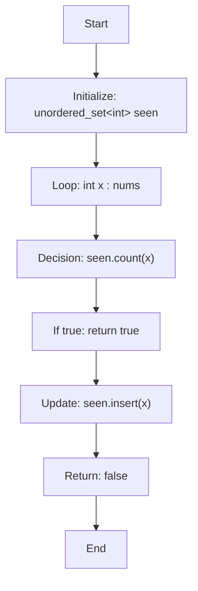

</details>

<details>
<summary>C++ Code</summary>

```cpp
class Solution {
public:
    bool containsDuplicate(vector<int>& nums) {
        unordered_set<int> seen;
        for (int x : nums) {
            if (seen.count(x)) return true;
            seen.insert(x);
        }
        return false;
    }
};
```

</details>

<details>
<summary>1-Minute Mental Map</summary>

```text
If you see    : duplicates
Think about   : sort or set
Main action   : sort and compare neighbours
Core idea     : duplicates become adjacent
```

</details>

[Back to index](#clickable-index)

---

<a id="easy-merge-sorted-array"></a>

## 2. Easy — Merge Sorted Array

**Problem Link:** [Merge Sorted Array](https://leetcode.com/problems/merge-sorted-array/)  

**Platform:** LeetCode  

**Difficulty:** Easy  

**Repeated Pattern:** `two pointers`  

**Problem Form:** `merge arrays`

### Problem Detail

- **What the problem is testing:** recognizing a `merge arrays` situation and applying `two pointers` instead of repeatedly doing slow work.
- **Main move:** fill from back.
- **Core intuition:** largest final position is safe
- **Practice goal:** before opening the code, identify the state you must maintain and when that state changes.

### Guided Practice

<details>
<summary>Hints — open one by one</summary>

1. Start by naming the form: **merge arrays**.
2. Ask: what operation repeats too often? The intended pattern is **two pointers**.
3. Try this tactic: **fill from back**.
4. Keep this intuition in mind: largest final position is safe
5. After each loop iteration, state your invariant in one sentence.

</details>

<details>
<summary>Approach</summary>

1. **Brute force checkpoint:** describe the direct solution first, then locate the repeated operation that makes it slow.
2. **Choose the pattern:** use `two pointers` because the problem repeatedly needs the same kind of lookup/update/order maintenance.
3. **Maintain the invariant:** after processing each element/event, the data structure should contain exactly the useful candidates for future steps.
4. **Apply the main trick:** fill from back.
5. **Return condition:** when the scan/search finishes, return the accumulated answer, final state, or requested index.

</details>

### Solution Flow

<details>
<summary>Solution Flow — how the code works</summary>

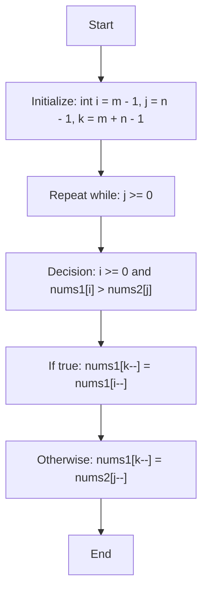

</details>

<details>
<summary>C++ Code</summary>

```cpp
class Solution {
public:
    void merge(vector<int>& nums1, int m, vector<int>& nums2, int n) {
        int i = m - 1, j = n - 1, k = m + n - 1;
        while (j >= 0) {
            if (i >= 0 && nums1[i] > nums2[j]) nums1[k--] = nums1[i--];
            else nums1[k--] = nums2[j--];
        }
    }
};
```

</details>

<details>
<summary>1-Minute Mental Map</summary>

```text
If you see    : merge arrays
Think about   : two pointers
Main action   : fill from back
Core idea     : largest final position is safe
```

</details>

[Back to index](#clickable-index)

---

<a id="easy-move-zeroes"></a>

## 3. Easy — Move Zeroes

**Problem Link:** [Move Zeroes](https://leetcode.com/problems/move-zeroes/)  

**Platform:** LeetCode  

**Difficulty:** Easy  

**Repeated Pattern:** `write pointer`  

**Problem Form:** `stable partition`

### Problem Detail

- **What the problem is testing:** recognizing a `stable partition` situation and applying `write pointer` instead of repeatedly doing slow work.
- **Main move:** overwrite nonzero.
- **Core intuition:** keep order with one pass
- **Practice goal:** before opening the code, identify the state you must maintain and when that state changes.

### Guided Practice

<details>
<summary>Hints — open one by one</summary>

1. Start by naming the form: **stable partition**.
2. Ask: what operation repeats too often? The intended pattern is **write pointer**.
3. Try this tactic: **overwrite nonzero**.
4. Keep this intuition in mind: keep order with one pass
5. After each loop iteration, state your invariant in one sentence.

</details>

<details>
<summary>Approach</summary>

1. **Brute force checkpoint:** describe the direct solution first, then locate the repeated operation that makes it slow.
2. **Choose the pattern:** use `write pointer` because the problem repeatedly needs the same kind of lookup/update/order maintenance.
3. **Maintain the invariant:** after processing each element/event, the data structure should contain exactly the useful candidates for future steps.
4. **Apply the main trick:** overwrite nonzero.
5. **Return condition:** when the scan/search finishes, return the accumulated answer, final state, or requested index.

</details>

### Solution Flow

<details>
<summary>Solution Flow — how the code works</summary>

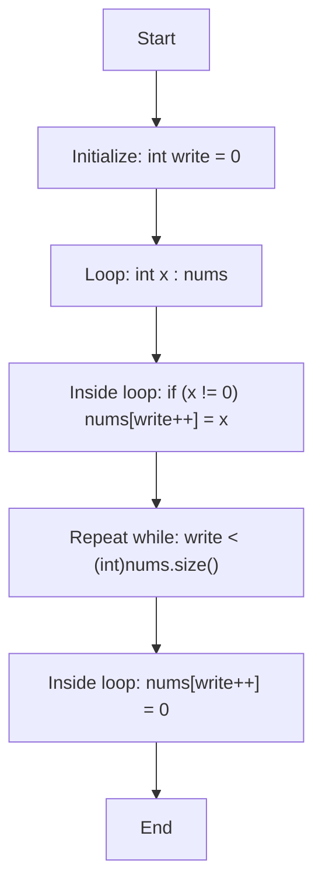

</details>

<details>
<summary>C++ Code</summary>

```cpp
class Solution {
    public:
    void moveZeroes(vector<int>& nums) {
        int write = 0;
        for (int x : nums) if (x != 0) nums[write++] = x;
        while (write < (int)nums.size()) nums[write++] = 0;
    }
};
```

</details>

<details>
<summary>1-Minute Mental Map</summary>

```text
If you see    : stable partition
Think about   : write pointer
Main action   : overwrite nonzero
Core idea     : keep order with one pass
```

</details>

[Back to index](#clickable-index)

---

<a id="easy-remove-duplicates-from-sorted-array"></a>

## 4. Easy — Remove Duplicates from Sorted Array

**Problem Link:** [Remove Duplicates from Sorted Array](https://leetcode.com/problems/remove-duplicates-from-sorted-array/)  

**Platform:** LeetCode  

**Difficulty:** Easy  

**Repeated Pattern:** `slow-fast pointer`  

**Problem Form:** `compact sorted array`

### Problem Detail

- **What the problem is testing:** recognizing a `compact sorted array` situation and applying `slow-fast pointer` instead of repeatedly doing slow work.
- **Main move:** write unique.
- **Core intuition:** sorted duplicates are grouped
- **Practice goal:** before opening the code, identify the state you must maintain and when that state changes.

### Guided Practice

<details>
<summary>Hints — open one by one</summary>

1. Start by naming the form: **compact sorted array**.
2. Ask: what operation repeats too often? The intended pattern is **slow-fast pointer**.
3. Try this tactic: **write unique**.
4. Keep this intuition in mind: sorted duplicates are grouped
5. After each loop iteration, state your invariant in one sentence.

</details>

<details>
<summary>Approach</summary>

1. **Brute force checkpoint:** describe the direct solution first, then locate the repeated operation that makes it slow.
2. **Choose the pattern:** use `slow-fast pointer` because the problem repeatedly needs the same kind of lookup/update/order maintenance.
3. **Maintain the invariant:** after processing each element/event, the data structure should contain exactly the useful candidates for future steps.
4. **Apply the main trick:** write unique.
5. **Return condition:** when the scan/search finishes, return the accumulated answer, final state, or requested index.

</details>

### Solution Flow

<details>
<summary>Solution Flow — how the code works</summary>

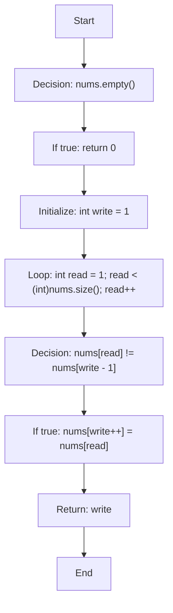

</details>

<details>
<summary>C++ Code</summary>

```cpp
class Solution {
public:
    int removeDuplicates(vector<int>& nums) {
        if (nums.empty()) return 0;
        int write = 1;
        for (int read = 1; read < (int)nums.size(); read++) {
            if (nums[read] != nums[write - 1]) nums[write++] = nums[read];
        }
        return write;
    }
};
```

</details>

<details>
<summary>1-Minute Mental Map</summary>

```text
If you see    : compact sorted array
Think about   : slow-fast pointer
Main action   : write unique
Core idea     : sorted duplicates are grouped
```

</details>

[Back to index](#clickable-index)

---

<a id="easy-valid-anagram"></a>

## 5. Easy — Valid Anagram

**Problem Link:** [Valid Anagram](https://leetcode.com/problems/valid-anagram/)  

**Platform:** LeetCode  

**Difficulty:** Easy  

**Repeated Pattern:** `count array`  

**Problem Form:** `frequency`

### Problem Detail

- **What the problem is testing:** recognizing a `frequency` situation and applying `count array` instead of repeatedly doing slow work.
- **Main move:** compare counts.
- **Core intuition:** same letters means same count vector
- **Practice goal:** before opening the code, identify the state you must maintain and when that state changes.

### Guided Practice

<details>
<summary>Hints — open one by one</summary>

1. Start by naming the form: **frequency**.
2. Ask: what operation repeats too often? The intended pattern is **count array**.
3. Try this tactic: **compare counts**.
4. Keep this intuition in mind: same letters means same count vector
5. After each loop iteration, state your invariant in one sentence.

</details>

<details>
<summary>Approach</summary>

1. **Brute force checkpoint:** describe the direct solution first, then locate the repeated operation that makes it slow.
2. **Choose the pattern:** use `count array` because the problem repeatedly needs the same kind of lookup/update/order maintenance.
3. **Maintain the invariant:** after processing each element/event, the data structure should contain exactly the useful candidates for future steps.
4. **Apply the main trick:** compare counts.
5. **Return condition:** when the scan/search finishes, return the accumulated answer, final state, or requested index.

</details>

### Solution Flow

<details>
<summary>Solution Flow — how the code works</summary>

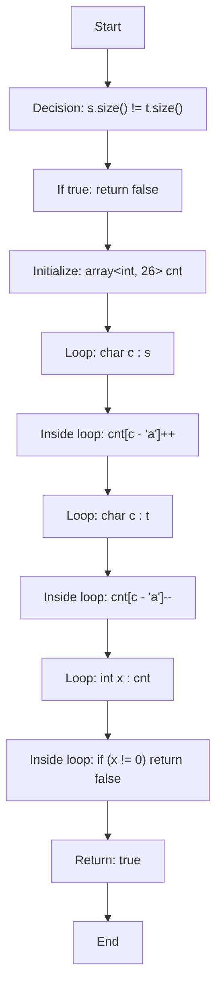

</details>

<details>
<summary>C++ Code</summary>

```cpp
class Solution {
public:
    bool isAnagram(string s, string t) {
        if (s.size() != t.size()) return false;
        array<int, 26> cnt{};
        for (char c : s) cnt[c - 'a']++;
        for (char c : t) cnt[c - 'a']--;
        for (int x : cnt) if (x != 0) return false;
        return true;
    }
};
```

</details>

<details>
<summary>1-Minute Mental Map</summary>

```text
If you see    : frequency
Think about   : count array
Main action   : compare counts
Core idea     : same letters means same count vector
```

</details>

[Back to index](#clickable-index)

---

<a id="easy-valid-palindrome"></a>

## 6. Easy — Valid Palindrome

**Problem Link:** [Valid Palindrome](https://leetcode.com/problems/valid-palindrome/)  

**Platform:** LeetCode  

**Difficulty:** Easy  

**Repeated Pattern:** `two pointers`  

**Problem Form:** `palindrome`

### Problem Detail

- **What the problem is testing:** recognizing a `palindrome` situation and applying `two pointers` instead of repeatedly doing slow work.
- **Main move:** skip non-alnum.
- **Core intuition:** compare mirrored valid chars
- **Practice goal:** before opening the code, identify the state you must maintain and when that state changes.

### Guided Practice

<details>
<summary>Hints — open one by one</summary>

1. Start by naming the form: **palindrome**.
2. Ask: what operation repeats too often? The intended pattern is **two pointers**.
3. Try this tactic: **skip non-alnum**.
4. Keep this intuition in mind: compare mirrored valid chars
5. After each loop iteration, state your invariant in one sentence.

</details>

<details>
<summary>Approach</summary>

1. **Brute force checkpoint:** describe the direct solution first, then locate the repeated operation that makes it slow.
2. **Choose the pattern:** use `two pointers` because the problem repeatedly needs the same kind of lookup/update/order maintenance.
3. **Maintain the invariant:** after processing each element/event, the data structure should contain exactly the useful candidates for future steps.
4. **Apply the main trick:** skip non-alnum.
5. **Return condition:** when the scan/search finishes, return the accumulated answer, final state, or requested index.

</details>

### Solution Flow

<details>
<summary>Solution Flow — how the code works</summary>

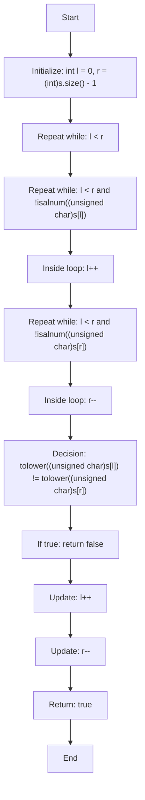

</details>

<details>
<summary>C++ Code</summary>

```cpp
class Solution {
public:
    bool isPalindrome(string s) {
        int l = 0, r = (int)s.size() - 1;
        while (l < r) {
            while (l < r && !isalnum((unsigned char)s[l])) l++;
            while (l < r && !isalnum((unsigned char)s[r])) r--;
            if (tolower((unsigned char)s[l]) != tolower((unsigned char)s[r])) return false;
            l++; r--;
        }
        return true;
    }
};
```

</details>

<details>
<summary>1-Minute Mental Map</summary>

```text
If you see    : palindrome
Think about   : two pointers
Main action   : skip non-alnum
Core idea     : compare mirrored valid chars
```

</details>

[Back to index](#clickable-index)

---

<a id="easy-ransom-note"></a>

## 7. Easy — Ransom Note

**Problem Link:** [Ransom Note](https://leetcode.com/problems/ransom-note/)  

**Platform:** LeetCode  

**Difficulty:** Easy  

**Repeated Pattern:** `count chars`  

**Problem Form:** `frequency need`

### Problem Detail

- **What the problem is testing:** recognizing a `frequency need` situation and applying `count chars` instead of repeatedly doing slow work.
- **Main move:** decrement available.
- **Core intuition:** magazine supplies letters
- **Practice goal:** before opening the code, identify the state you must maintain and when that state changes.

### Guided Practice

<details>
<summary>Hints — open one by one</summary>

1. Start by naming the form: **frequency need**.
2. Ask: what operation repeats too often? The intended pattern is **count chars**.
3. Try this tactic: **decrement available**.
4. Keep this intuition in mind: magazine supplies letters
5. After each loop iteration, state your invariant in one sentence.

</details>

<details>
<summary>Approach</summary>

1. **Brute force checkpoint:** describe the direct solution first, then locate the repeated operation that makes it slow.
2. **Choose the pattern:** use `count chars` because the problem repeatedly needs the same kind of lookup/update/order maintenance.
3. **Maintain the invariant:** after processing each element/event, the data structure should contain exactly the useful candidates for future steps.
4. **Apply the main trick:** decrement available.
5. **Return condition:** when the scan/search finishes, return the accumulated answer, final state, or requested index.

</details>

### Solution Flow

<details>
<summary>Solution Flow — how the code works</summary>

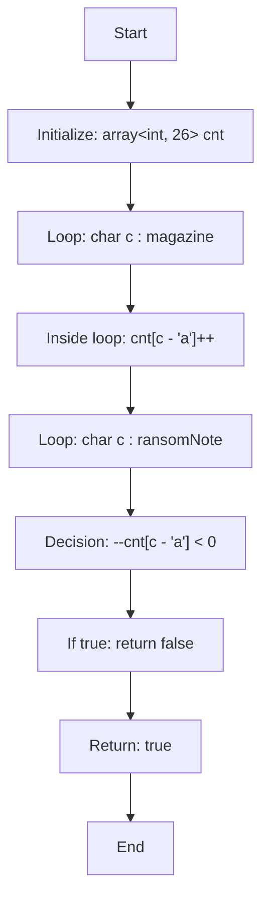

</details>

<details>
<summary>C++ Code</summary>

```cpp
class Solution {
public:
    bool canConstruct(string ransomNote, string magazine) {
        array<int, 26> cnt{};
        for (char c : magazine) cnt[c - 'a']++;
        for (char c : ransomNote) {
            if (--cnt[c - 'a'] < 0) return false;
        }
        return true;
    }
};
```

</details>

<details>
<summary>1-Minute Mental Map</summary>

```text
If you see    : frequency need
Think about   : count chars
Main action   : decrement available
Core idea     : magazine supplies letters
```

</details>

[Back to index](#clickable-index)

---

<a id="easy-valid-parentheses"></a>

## 8. Easy — Valid Parentheses

**Problem Link:** [Valid Parentheses](https://leetcode.com/problems/valid-parentheses/)  

**Platform:** LeetCode  

**Difficulty:** Easy  

**Repeated Pattern:** `stack`  

**Problem Form:** `bracket matching`

### Problem Detail

- **What the problem is testing:** recognizing a `bracket matching` situation and applying `stack` instead of repeatedly doing slow work.
- **Main move:** push open pop close.
- **Core intuition:** latest open must close first
- **Practice goal:** before opening the code, identify the state you must maintain and when that state changes.

### Guided Practice

<details>
<summary>Hints — open one by one</summary>

1. Start by naming the form: **bracket matching**.
2. Ask: what operation repeats too often? The intended pattern is **stack**.
3. Try this tactic: **push open pop close**.
4. Keep this intuition in mind: latest open must close first
5. After each loop iteration, state your invariant in one sentence.

</details>

<details>
<summary>Approach</summary>

1. **Brute force checkpoint:** describe the direct solution first, then locate the repeated operation that makes it slow.
2. **Choose the pattern:** use `stack` because the problem repeatedly needs the same kind of lookup/update/order maintenance.
3. **Maintain the invariant:** after processing each element/event, the data structure should contain exactly the useful candidates for future steps.
4. **Apply the main trick:** push open pop close.
5. **Return condition:** when the scan/search finishes, return the accumulated answer, final state, or requested index.

</details>

### Solution Flow

<details>
<summary>Solution Flow — how the code works</summary>

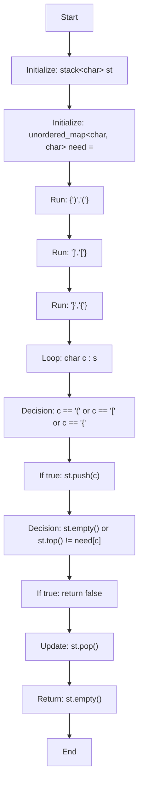

</details>

<details>
<summary>C++ Code</summary>

```cpp
class Solution {
public:
    bool isValid(string s) {
        stack<char> st;
        unordered_map<char, char> need = {{')','('}, {']','['}, {'}','{'}};
        for (char c : s) {
            if (c == '(' || c == '[' || c == '{') st.push(c);
            else {
                if (st.empty() || st.top() != need[c]) return false;
                st.pop();
            }
        }
        return st.empty();
    }
};
```

</details>

<details>
<summary>1-Minute Mental Map</summary>

```text
If you see    : bracket matching
Think about   : stack
Main action   : push open pop close
Core idea     : latest open must close first
```

</details>

[Back to index](#clickable-index)

---

<a id="easy-baseball-game"></a>

## 9. Easy — Baseball Game

**Problem Link:** [Baseball Game](https://leetcode.com/problems/baseball-game/)  

**Platform:** LeetCode  

**Difficulty:** Easy  

**Repeated Pattern:** `stack/vector`  

**Problem Form:** `operation history`

### Problem Detail

- **What the problem is testing:** recognizing a `operation history` situation and applying `stack/vector` instead of repeatedly doing slow work.
- **Main move:** store scores.
- **Core intuition:** operations reference previous scores
- **Practice goal:** before opening the code, identify the state you must maintain and when that state changes.

### Guided Practice

<details>
<summary>Hints — open one by one</summary>

1. Start by naming the form: **operation history**.
2. Ask: what operation repeats too often? The intended pattern is **stack/vector**.
3. Try this tactic: **store scores**.
4. Keep this intuition in mind: operations reference previous scores
5. After each loop iteration, state your invariant in one sentence.

</details>

<details>
<summary>Approach</summary>

1. **Brute force checkpoint:** describe the direct solution first, then locate the repeated operation that makes it slow.
2. **Choose the pattern:** use `stack/vector` because the problem repeatedly needs the same kind of lookup/update/order maintenance.
3. **Maintain the invariant:** after processing each element/event, the data structure should contain exactly the useful candidates for future steps.
4. **Apply the main trick:** store scores.
5. **Return condition:** when the scan/search finishes, return the accumulated answer, final state, or requested index.

</details>

### Solution Flow

<details>
<summary>Solution Flow — how the code works</summary>

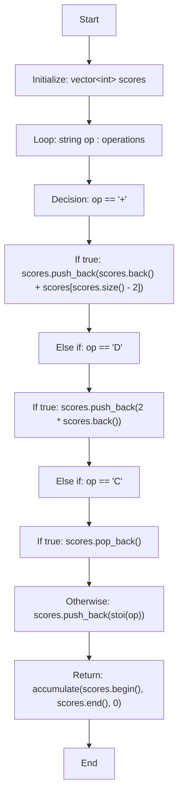

</details>

<details>
<summary>C++ Code</summary>

```cpp
class Solution {
public:
    int calPoints(vector<string>& operations) {
        vector<int> scores;
        for (string op : operations) {
            if (op == "+") scores.push_back(scores.back() + scores[scores.size() - 2]);
            else if (op == "D") scores.push_back(2 * scores.back());
            else if (op == "C") scores.pop_back();
            else scores.push_back(stoi(op));
        }
        return accumulate(scores.begin(), scores.end(), 0);
    }
};
```

</details>

<details>
<summary>1-Minute Mental Map</summary>

```text
If you see    : operation history
Think about   : stack/vector
Main action   : store scores
Core idea     : operations reference previous scores
```

</details>

[Back to index](#clickable-index)

---

<a id="easy-remove-all-adjacent-duplicates-in-string"></a>

## 10. Easy — Remove All Adjacent Duplicates In String

**Problem Link:** [Remove All Adjacent Duplicates In String](https://leetcode.com/problems/remove-all-adjacent-duplicates-in-string/)  

**Platform:** LeetCode  

**Difficulty:** Easy  

**Repeated Pattern:** `stack string`  

**Problem Form:** `cancellation`

### Problem Detail

- **What the problem is testing:** recognizing a `cancellation` situation and applying `stack string` instead of repeatedly doing slow work.
- **Main move:** pop equal top.
- **Core intuition:** adjacent equal cancels latest
- **Practice goal:** before opening the code, identify the state you must maintain and when that state changes.

### Guided Practice

<details>
<summary>Hints — open one by one</summary>

1. Start by naming the form: **cancellation**.
2. Ask: what operation repeats too often? The intended pattern is **stack string**.
3. Try this tactic: **pop equal top**.
4. Keep this intuition in mind: adjacent equal cancels latest
5. After each loop iteration, state your invariant in one sentence.

</details>

<details>
<summary>Approach</summary>

1. **Brute force checkpoint:** describe the direct solution first, then locate the repeated operation that makes it slow.
2. **Choose the pattern:** use `stack string` because the problem repeatedly needs the same kind of lookup/update/order maintenance.
3. **Maintain the invariant:** after processing each element/event, the data structure should contain exactly the useful candidates for future steps.
4. **Apply the main trick:** pop equal top.
5. **Return condition:** when the scan/search finishes, return the accumulated answer, final state, or requested index.

</details>

### Solution Flow

<details>
<summary>Solution Flow — how the code works</summary>

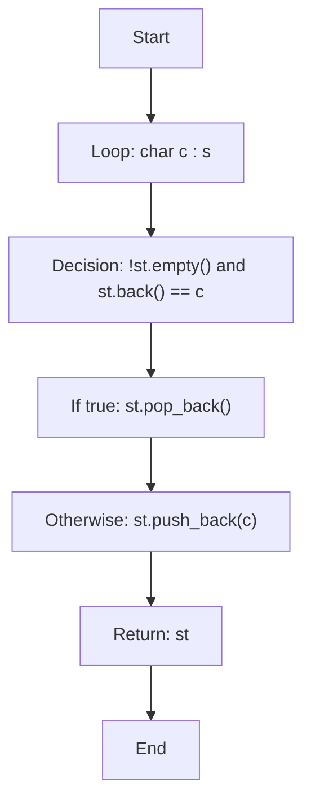

</details>

<details>
<summary>C++ Code</summary>

```cpp
class Solution {
public:
    string removeDuplicates(string s) {
        string st;
        for (char c : s) {
            if (!st.empty() && st.back() == c) st.pop_back();
            else st.push_back(c);
        }
        return st;
    }
};
```

</details>

<details>
<summary>1-Minute Mental Map</summary>

```text
If you see    : cancellation
Think about   : stack string
Main action   : pop equal top
Core idea     : adjacent equal cancels latest
```

</details>

[Back to index](#clickable-index)

---

<a id="easy-implement-queue-using-stacks"></a>

## 11. Easy — Implement Queue using Stacks

**Problem Link:** [Implement Queue using Stacks](https://leetcode.com/problems/implement-queue-using-stacks/)  

**Platform:** LeetCode  

**Difficulty:** Easy  

**Repeated Pattern:** `two stacks`  

**Problem Form:** `data structure design`

### Problem Detail

- **What the problem is testing:** recognizing a `data structure design` situation and applying `two stacks` instead of repeatedly doing slow work.
- **Main move:** move only when needed.
- **Core intuition:** reverse stack gives FIFO
- **Practice goal:** before opening the code, identify the state you must maintain and when that state changes.

### Guided Practice

<details>
<summary>Hints — open one by one</summary>

1. Start by naming the form: **data structure design**.
2. Ask: what operation repeats too often? The intended pattern is **two stacks**.
3. Try this tactic: **move only when needed**.
4. Keep this intuition in mind: reverse stack gives FIFO
5. After each loop iteration, state your invariant in one sentence.

</details>

<details>
<summary>Approach</summary>

1. **Brute force checkpoint:** describe the direct solution first, then locate the repeated operation that makes it slow.
2. **Choose the pattern:** use `two stacks` because the problem repeatedly needs the same kind of lookup/update/order maintenance.
3. **Maintain the invariant:** after processing each element/event, the data structure should contain exactly the useful candidates for future steps.
4. **Apply the main trick:** move only when needed.
5. **Return condition:** when the scan/search finishes, return the accumulated answer, final state, or requested index.

</details>

### Solution Flow

<details>
<summary>Solution Flow — how the code works</summary>

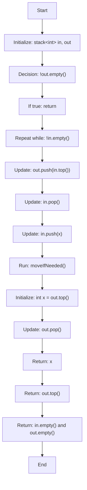

</details>

<details>
<summary>C++ Code</summary>

```cpp
class MyQueue {
    stack<int> in, out;
    void moveIfNeeded() {
        if (!out.empty()) return;
        while (!in.empty()) {
            out.push(in.top());
            in.pop();
        }
    }
public:
    void push(int x) { in.push(x); }
    int pop() { moveIfNeeded(); int x = out.top(); out.pop(); return x; }
    int peek() { moveIfNeeded(); return out.top(); }
    bool empty() { return in.empty() && out.empty(); }
};
```

</details>

<details>
<summary>1-Minute Mental Map</summary>

```text
If you see    : data structure design
Think about   : two stacks
Main action   : move only when needed
Core idea     : reverse stack gives FIFO
```

</details>

[Back to index](#clickable-index)

---

<a id="easy-number-of-recent-calls"></a>

## 12. Easy — Number of Recent Calls

**Problem Link:** [Number of Recent Calls](https://leetcode.com/problems/number-of-recent-calls/)  

**Platform:** LeetCode  

**Difficulty:** Easy  

**Repeated Pattern:** `queue`  

**Problem Form:** `time window`

### Problem Detail

- **What the problem is testing:** recognizing a `time window` situation and applying `queue` instead of repeatedly doing slow work.
- **Main move:** pop old calls.
- **Core intuition:** queue holds valid recent calls
- **Practice goal:** before opening the code, identify the state you must maintain and when that state changes.

### Guided Practice

<details>
<summary>Hints — open one by one</summary>

1. Start by naming the form: **time window**.
2. Ask: what operation repeats too often? The intended pattern is **queue**.
3. Try this tactic: **pop old calls**.
4. Keep this intuition in mind: queue holds valid recent calls
5. After each loop iteration, state your invariant in one sentence.

</details>

<details>
<summary>Approach</summary>

1. **Brute force checkpoint:** describe the direct solution first, then locate the repeated operation that makes it slow.
2. **Choose the pattern:** use `queue` because the problem repeatedly needs the same kind of lookup/update/order maintenance.
3. **Maintain the invariant:** after processing each element/event, the data structure should contain exactly the useful candidates for future steps.
4. **Apply the main trick:** pop old calls.
5. **Return condition:** when the scan/search finishes, return the accumulated answer, final state, or requested index.

</details>

### Solution Flow

<details>
<summary>Solution Flow — how the code works</summary>

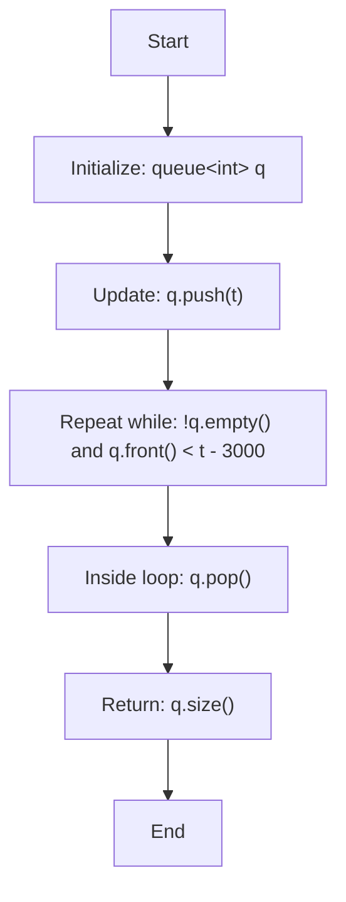

</details>

<details>
<summary>C++ Code</summary>

```cpp
class RecentCounter {
    queue<int> q;
public:
    int ping(int t) {
        q.push(t);
        while (!q.empty() && q.front() < t - 3000) q.pop();
        return q.size();
    }
};
```

</details>

<details>
<summary>1-Minute Mental Map</summary>

```text
If you see    : time window
Think about   : queue
Main action   : pop old calls
Core idea     : queue holds valid recent calls
```

</details>

[Back to index](#clickable-index)

---

<a id="easy-last-stone-weight"></a>

## 13. Easy — Last Stone Weight

**Problem Link:** [Last Stone Weight](https://leetcode.com/problems/last-stone-weight/)  

**Platform:** LeetCode  

**Difficulty:** Easy  

**Repeated Pattern:** `max heap`  

**Problem Form:** `repeated max`

### Problem Detail

- **What the problem is testing:** recognizing a `repeated max` situation and applying `max heap` instead of repeatedly doing slow work.
- **Main move:** smash two largest.
- **Core intuition:** only largest stones matter
- **Practice goal:** before opening the code, identify the state you must maintain and when that state changes.

### Guided Practice

<details>
<summary>Hints — open one by one</summary>

1. Start by naming the form: **repeated max**.
2. Ask: what operation repeats too often? The intended pattern is **max heap**.
3. Try this tactic: **smash two largest**.
4. Keep this intuition in mind: only largest stones matter
5. After each loop iteration, state your invariant in one sentence.

</details>

<details>
<summary>Approach</summary>

1. **Brute force checkpoint:** describe the direct solution first, then locate the repeated operation that makes it slow.
2. **Choose the pattern:** use `max heap` because the problem repeatedly needs the same kind of lookup/update/order maintenance.
3. **Maintain the invariant:** after processing each element/event, the data structure should contain exactly the useful candidates for future steps.
4. **Apply the main trick:** smash two largest.
5. **Return condition:** when the scan/search finishes, return the accumulated answer, final state, or requested index.

</details>

### Solution Flow

<details>
<summary>Solution Flow — how the code works</summary>

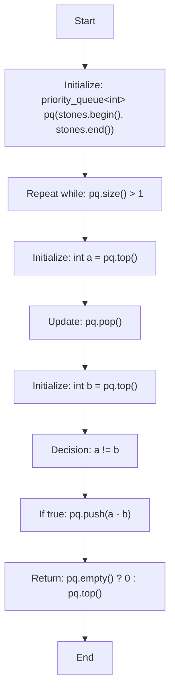

</details>

<details>
<summary>C++ Code</summary>

```cpp
class Solution {
public:
    int lastStoneWeight(vector<int>& stones) {
        priority_queue<int> pq(stones.begin(), stones.end());
        while (pq.size() > 1) {
            int a = pq.top(); pq.pop();
            int b = pq.top(); pq.pop();
            if (a != b) pq.push(a - b);
        }
        return pq.empty() ? 0 : pq.top();
    }
};
```

</details>

<details>
<summary>1-Minute Mental Map</summary>

```text
If you see    : repeated max
Think about   : max heap
Main action   : smash two largest
Core idea     : only largest stones matter
```

</details>

[Back to index](#clickable-index)

---

<a id="easy-kth-largest-element-in-a-stream"></a>

## 14. Easy — Kth Largest Element in a Stream

**Problem Link:** [Kth Largest Element in a Stream](https://leetcode.com/problems/kth-largest-element-in-a-stream/)  

**Platform:** LeetCode  

**Difficulty:** Easy  

**Repeated Pattern:** `min heap size k`  

**Problem Form:** `stream kth`

### Problem Detail

- **What the problem is testing:** recognizing a `stream kth` situation and applying `min heap size k` instead of repeatedly doing slow work.
- **Main move:** pop smaller extras.
- **Core intuition:** heap stores top k
- **Practice goal:** before opening the code, identify the state you must maintain and when that state changes.

### Guided Practice

<details>
<summary>Hints — open one by one</summary>

1. Start by naming the form: **stream kth**.
2. Ask: what operation repeats too often? The intended pattern is **min heap size k**.
3. Try this tactic: **pop smaller extras**.
4. Keep this intuition in mind: heap stores top k
5. After each loop iteration, state your invariant in one sentence.

</details>

<details>
<summary>Approach</summary>

1. **Brute force checkpoint:** describe the direct solution first, then locate the repeated operation that makes it slow.
2. **Choose the pattern:** use `min heap size k` because the problem repeatedly needs the same kind of lookup/update/order maintenance.
3. **Maintain the invariant:** after processing each element/event, the data structure should contain exactly the useful candidates for future steps.
4. **Apply the main trick:** pop smaller extras.
5. **Return condition:** when the scan/search finishes, return the accumulated answer, final state, or requested index.

</details>

### Solution Flow

<details>
<summary>Solution Flow — how the code works</summary>

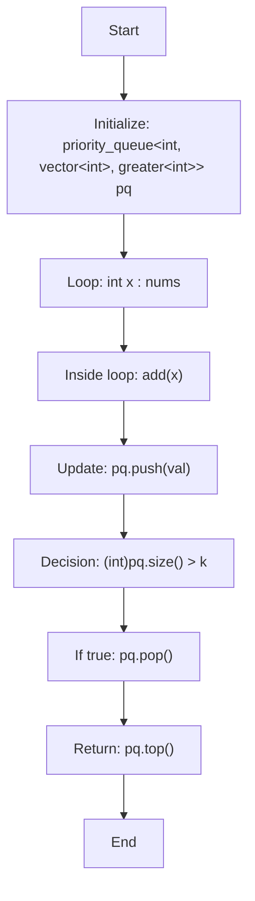

</details>

<details>
<summary>C++ Code</summary>

```cpp
class KthLargest {
    int k;
    priority_queue<int, vector<int>, greater<int>> pq;
public:
    KthLargest(int k, vector<int>& nums) : k(k) {
        for (int x : nums) add(x);
    }
    int add(int val) {
        pq.push(val);
        if ((int)pq.size() > k) pq.pop();
        return pq.top();
    }
};
```

</details>

<details>
<summary>1-Minute Mental Map</summary>

```text
If you see    : stream kth
Think about   : min heap size k
Main action   : pop smaller extras
Core idea     : heap stores top k
```

</details>

[Back to index](#clickable-index)

---

<a id="easy-contains-duplicate-iii"></a>

## 15. Easy — Contains Duplicate III

**Problem Link:** [Contains Duplicate III](https://leetcode.com/problems/contains-duplicate-iii/)  

**Platform:** LeetCode  

**Difficulty:** Easy  

**Repeated Pattern:** `set window`  

**Problem Form:** `nearby value`

### Problem Detail

- **What the problem is testing:** recognizing a `nearby value` situation and applying `set window` instead of repeatedly doing slow work.
- **Main move:** lower_bound x minus t.
- **Core intuition:** closest candidate is around lower bound
- **Practice goal:** before opening the code, identify the state you must maintain and when that state changes.

### Guided Practice

<details>
<summary>Hints — open one by one</summary>

1. Start by naming the form: **nearby value**.
2. Ask: what operation repeats too often? The intended pattern is **set window**.
3. Try this tactic: **lower_bound x minus t**.
4. Keep this intuition in mind: closest candidate is around lower bound
5. After each loop iteration, state your invariant in one sentence.

</details>

<details>
<summary>Approach</summary>

1. **Brute force checkpoint:** describe the direct solution first, then locate the repeated operation that makes it slow.
2. **Choose the pattern:** use `set window` because the problem repeatedly needs the same kind of lookup/update/order maintenance.
3. **Maintain the invariant:** after processing each element/event, the data structure should contain exactly the useful candidates for future steps.
4. **Apply the main trick:** lower_bound x minus t.
5. **Return condition:** when the scan/search finishes, return the accumulated answer, final state, or requested index.

</details>

### Solution Flow

<details>
<summary>Solution Flow — how the code works</summary>

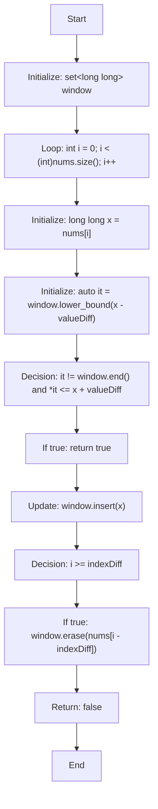

</details>

<details>
<summary>C++ Code</summary>

```cpp
class Solution {
public:
    bool containsNearbyAlmostDuplicate(vector<int>& nums, int indexDiff, int valueDiff) {
        set<long long> window;
        for (int i = 0; i < (int)nums.size(); i++) {
            long long x = nums[i];
            auto it = window.lower_bound(x - valueDiff);
            if (it != window.end() && *it <= x + valueDiff) return true;
            window.insert(x);
            if (i >= indexDiff) window.erase(nums[i - indexDiff]);
        }
        return false;
    }
};
```

</details>

<details>
<summary>1-Minute Mental Map</summary>

```text
If you see    : nearby value
Think about   : set window
Main action   : lower_bound x minus t
Core idea     : closest candidate is around lower bound
```

</details>

[Back to index](#clickable-index)

---

<a id="easy-two-sum"></a>

## 16. Easy — Two Sum

**Problem Link:** [Two Sum](https://leetcode.com/problems/two-sum/)  

**Platform:** LeetCode  

**Difficulty:** Easy  

**Repeated Pattern:** `unordered_map`  

**Problem Form:** `complement lookup`

### Problem Detail

- **What the problem is testing:** recognizing a `complement lookup` situation and applying `unordered_map` instead of repeatedly doing slow work.
- **Main move:** store seen value index.
- **Core intuition:** target needs previous complement
- **Practice goal:** before opening the code, identify the state you must maintain and when that state changes.

### Guided Practice

<details>
<summary>Hints — open one by one</summary>

1. Start by naming the form: **complement lookup**.
2. Ask: what operation repeats too often? The intended pattern is **unordered_map**.
3. Try this tactic: **store seen value index**.
4. Keep this intuition in mind: target needs previous complement
5. After each loop iteration, state your invariant in one sentence.

</details>

<details>
<summary>Approach</summary>

1. **Brute force checkpoint:** describe the direct solution first, then locate the repeated operation that makes it slow.
2. **Choose the pattern:** use `unordered_map` because the problem repeatedly needs the same kind of lookup/update/order maintenance.
3. **Maintain the invariant:** after processing each element/event, the data structure should contain exactly the useful candidates for future steps.
4. **Apply the main trick:** store seen value index.
5. **Return condition:** when the scan/search finishes, return the accumulated answer, final state, or requested index.

</details>

### Solution Flow

<details>
<summary>Solution Flow — how the code works</summary>

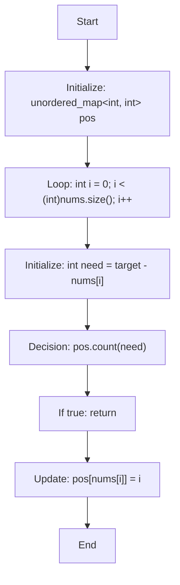

</details>

<details>
<summary>C++ Code</summary>

```cpp
class Solution {
public:
    vector<int> twoSum(vector<int>& nums, int target) {
        unordered_map<int, int> pos;
        for (int i = 0; i < (int)nums.size(); i++) {
            int need = target - nums[i];
            if (pos.count(need)) return {pos[need], i};
            pos[nums[i]] = i;
        }
        return {};
    }
};
```

</details>

<details>
<summary>1-Minute Mental Map</summary>

```text
If you see    : complement lookup
Think about   : unordered_map
Main action   : store seen value index
Core idea     : target needs previous complement
```

</details>

[Back to index](#clickable-index)

---

<a id="easy-majority-element"></a>

## 17. Easy — Majority Element

**Problem Link:** [Majority Element](https://leetcode.com/problems/majority-element/)  

**Platform:** LeetCode  

**Difficulty:** Easy  

**Repeated Pattern:** `map/count`  

**Problem Form:** `frequency`

### Problem Detail

- **What the problem is testing:** recognizing a `frequency` situation and applying `map/count` instead of repeatedly doing slow work.
- **Main move:** count occurrences.
- **Core intuition:** majority crosses n/2
- **Practice goal:** before opening the code, identify the state you must maintain and when that state changes.

### Guided Practice

<details>
<summary>Hints — open one by one</summary>

1. Start by naming the form: **frequency**.
2. Ask: what operation repeats too often? The intended pattern is **map/count**.
3. Try this tactic: **count occurrences**.
4. Keep this intuition in mind: majority crosses n/2
5. After each loop iteration, state your invariant in one sentence.

</details>

<details>
<summary>Approach</summary>

1. **Brute force checkpoint:** describe the direct solution first, then locate the repeated operation that makes it slow.
2. **Choose the pattern:** use `map/count` because the problem repeatedly needs the same kind of lookup/update/order maintenance.
3. **Maintain the invariant:** after processing each element/event, the data structure should contain exactly the useful candidates for future steps.
4. **Apply the main trick:** count occurrences.
5. **Return condition:** when the scan/search finishes, return the accumulated answer, final state, or requested index.

</details>

### Solution Flow

<details>
<summary>Solution Flow — how the code works</summary>

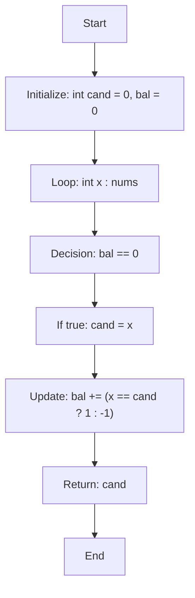

</details>

<details>
<summary>C++ Code</summary>

```cpp
class Solution {
public:
    int majorityElement(vector<int>& nums) {
        int cand = 0, bal = 0;
        for (int x : nums) {
            if (bal == 0) cand = x;
            bal += (x == cand ? 1 : -1);
        }
        return cand;
    }
};
```

</details>

<details>
<summary>1-Minute Mental Map</summary>

```text
If you see    : frequency
Think about   : map/count
Main action   : count occurrences
Core idea     : majority crosses n/2
```

</details>

[Back to index](#clickable-index)

---

<a id="easy-first-unique-character-in-a-string"></a>

## 18. Easy — First Unique Character in a String

**Problem Link:** [First Unique Character in a String](https://leetcode.com/problems/first-unique-character-in-a-string/)  

**Platform:** LeetCode  

**Difficulty:** Easy  

**Repeated Pattern:** `count array/map`  

**Problem Form:** `frequency`

### Problem Detail

- **What the problem is testing:** recognizing a `frequency` situation and applying `count array/map` instead of repeatedly doing slow work.
- **Main move:** two passes.
- **Core intuition:** unique means count one
- **Practice goal:** before opening the code, identify the state you must maintain and when that state changes.

### Guided Practice

<details>
<summary>Hints — open one by one</summary>

1. Start by naming the form: **frequency**.
2. Ask: what operation repeats too often? The intended pattern is **count array/map**.
3. Try this tactic: **two passes**.
4. Keep this intuition in mind: unique means count one
5. After each loop iteration, state your invariant in one sentence.

</details>

<details>
<summary>Approach</summary>

1. **Brute force checkpoint:** describe the direct solution first, then locate the repeated operation that makes it slow.
2. **Choose the pattern:** use `count array/map` because the problem repeatedly needs the same kind of lookup/update/order maintenance.
3. **Maintain the invariant:** after processing each element/event, the data structure should contain exactly the useful candidates for future steps.
4. **Apply the main trick:** two passes.
5. **Return condition:** when the scan/search finishes, return the accumulated answer, final state, or requested index.

</details>

### Solution Flow

<details>
<summary>Solution Flow — how the code works</summary>

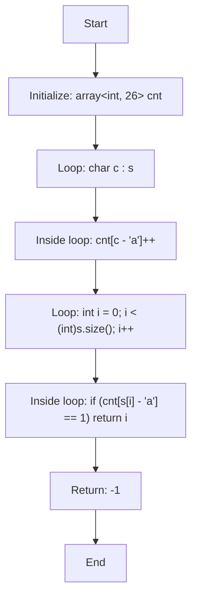

</details>

<details>
<summary>C++ Code</summary>

```cpp
class Solution {
public:
    int firstUniqChar(string s) {
        array<int, 26> cnt{};
        for (char c : s) cnt[c - 'a']++;
        for (int i = 0; i < (int)s.size(); i++) if (cnt[s[i] - 'a'] == 1) return i;
        return -1;
    }
};
```

</details>

<details>
<summary>1-Minute Mental Map</summary>

```text
If you see    : frequency
Think about   : count array/map
Main action   : two passes
Core idea     : unique means count one
```

</details>

[Back to index](#clickable-index)

---

<a id="easy-meeting-rooms"></a>

## 19. Easy — Meeting Rooms

**Problem Link:** [Meeting Rooms](https://leetcode.com/problems/meeting-rooms/)  

**Platform:** LeetCode  

**Difficulty:** Easy  

**Repeated Pattern:** `sort by start`  

**Problem Form:** `intervals`

### Problem Detail

- **What the problem is testing:** recognizing a `intervals` situation and applying `sort by start` instead of repeatedly doing slow work.
- **Main move:** compare previous end.
- **Core intuition:** overlap violates room
- **Practice goal:** before opening the code, identify the state you must maintain and when that state changes.

### Guided Practice

<details>
<summary>Hints — open one by one</summary>

1. Start by naming the form: **intervals**.
2. Ask: what operation repeats too often? The intended pattern is **sort by start**.
3. Try this tactic: **compare previous end**.
4. Keep this intuition in mind: overlap violates room
5. After each loop iteration, state your invariant in one sentence.

</details>

<details>
<summary>Approach</summary>

1. **Brute force checkpoint:** describe the direct solution first, then locate the repeated operation that makes it slow.
2. **Choose the pattern:** use `sort by start` because the problem repeatedly needs the same kind of lookup/update/order maintenance.
3. **Maintain the invariant:** after processing each element/event, the data structure should contain exactly the useful candidates for future steps.
4. **Apply the main trick:** compare previous end.
5. **Return condition:** when the scan/search finishes, return the accumulated answer, final state, or requested index.

</details>

### Solution Flow

<details>
<summary>Solution Flow — how the code works</summary>

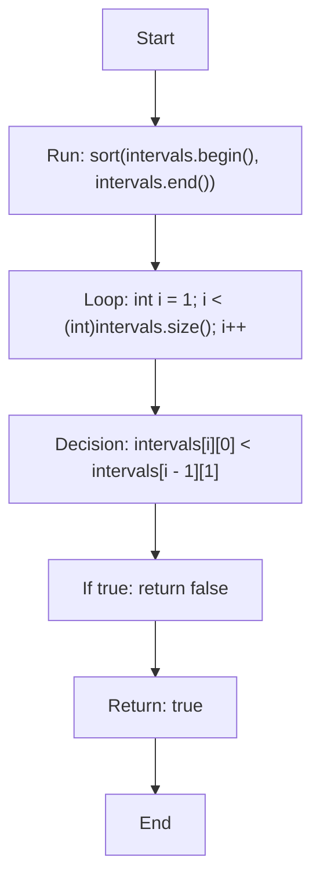

</details>

<details>
<summary>C++ Code</summary>

```cpp
class Solution {
public:
    bool canAttendMeetings(vector<vector<int>>& intervals) {
        sort(intervals.begin(), intervals.end());
        for (int i = 1; i < (int)intervals.size(); i++) {
            if (intervals[i][0] < intervals[i - 1][1]) return false;
        }
        return true;
    }
};
```

</details>

<details>
<summary>1-Minute Mental Map</summary>

```text
If you see    : intervals
Think about   : sort by start
Main action   : compare previous end
Core idea     : overlap violates room
```

</details>

[Back to index](#clickable-index)

---

<a id="easy-squares-of-a-sorted-array"></a>

## 20. Easy — Squares of a Sorted Array

**Problem Link:** [Squares of a Sorted Array](https://leetcode.com/problems/squares-of-a-sorted-array/)  

**Platform:** LeetCode  

**Difficulty:** Easy  

**Repeated Pattern:** `two pointers`  

**Problem Form:** `sorted transform`

### Problem Detail

- **What the problem is testing:** recognizing a `sorted transform` situation and applying `two pointers` instead of repeatedly doing slow work.
- **Main move:** fill from back.
- **Core intuition:** largest square at ends
- **Practice goal:** before opening the code, identify the state you must maintain and when that state changes.

### Guided Practice

<details>
<summary>Hints — open one by one</summary>

1. Start by naming the form: **sorted transform**.
2. Ask: what operation repeats too often? The intended pattern is **two pointers**.
3. Try this tactic: **fill from back**.
4. Keep this intuition in mind: largest square at ends
5. After each loop iteration, state your invariant in one sentence.

</details>

<details>
<summary>Approach</summary>

1. **Brute force checkpoint:** describe the direct solution first, then locate the repeated operation that makes it slow.
2. **Choose the pattern:** use `two pointers` because the problem repeatedly needs the same kind of lookup/update/order maintenance.
3. **Maintain the invariant:** after processing each element/event, the data structure should contain exactly the useful candidates for future steps.
4. **Apply the main trick:** fill from back.
5. **Return condition:** when the scan/search finishes, return the accumulated answer, final state, or requested index.

</details>

### Solution Flow

<details>
<summary>Solution Flow — how the code works</summary>

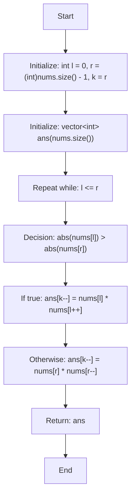

</details>

<details>
<summary>C++ Code</summary>

```cpp
class Solution {
public:
    vector<int> sortedSquares(vector<int>& nums) {
        int l = 0, r = (int)nums.size() - 1, k = r;
        vector<int> ans(nums.size());
        while (l <= r) {
            if (abs(nums[l]) > abs(nums[r])) ans[k--] = nums[l] * nums[l++];
            else ans[k--] = nums[r] * nums[r--];
        }
        return ans;
    }
};
```

</details>

<details>
<summary>1-Minute Mental Map</summary>

```text
If you see    : sorted transform
Think about   : two pointers
Main action   : fill from back
Core idea     : largest square at ends
```

</details>

[Back to index](#clickable-index)

---

<a id="easy-intersection-of-two-arrays"></a>

## 21. Easy — Intersection of Two Arrays

**Problem Link:** [Intersection of Two Arrays](https://leetcode.com/problems/intersection-of-two-arrays/)  

**Platform:** LeetCode  

**Difficulty:** Easy  

**Repeated Pattern:** `sort unique`  

**Problem Form:** `set operations`

### Problem Detail

- **What the problem is testing:** recognizing a `set operations` situation and applying `sort unique` instead of repeatedly doing slow work.
- **Main move:** two pointers.
- **Core intuition:** sorted arrays reveal equal values
- **Practice goal:** before opening the code, identify the state you must maintain and when that state changes.

### Guided Practice

<details>
<summary>Hints — open one by one</summary>

1. Start by naming the form: **set operations**.
2. Ask: what operation repeats too often? The intended pattern is **sort unique**.
3. Try this tactic: **two pointers**.
4. Keep this intuition in mind: sorted arrays reveal equal values
5. After each loop iteration, state your invariant in one sentence.

</details>

<details>
<summary>Approach</summary>

1. **Brute force checkpoint:** describe the direct solution first, then locate the repeated operation that makes it slow.
2. **Choose the pattern:** use `sort unique` because the problem repeatedly needs the same kind of lookup/update/order maintenance.
3. **Maintain the invariant:** after processing each element/event, the data structure should contain exactly the useful candidates for future steps.
4. **Apply the main trick:** two pointers.
5. **Return condition:** when the scan/search finishes, return the accumulated answer, final state, or requested index.

</details>

### Solution Flow

<details>
<summary>Solution Flow — how the code works</summary>

```mermaid
flowchart TD
    S0["Start"]
    S1["Initialize: unordered_set&lt;int&gt; a(nums1.begin(), nums1.end()), ans"]
    S2["Loop: int x : nums2"]
    S3["Inside loop: if (a.count(x)) ans.insert(x)"]
    S4["Return: vector&lt;int&gt;(ans.begin(), ans.end())"]
    S5["End"]
    S0 --> S1
    S1 --> S2
    S2 --> S3
    S3 --> S4
    S4 --> S5
```

</details>

<details>
<summary>C++ Code</summary>

```cpp
class Solution {
    public:
    vector<int> intersection(vector<int>& nums1, vector<int>& nums2) {
        unordered_set<int> a(nums1.begin(), nums1.end()), ans;
        for (int x : nums2) if (a.count(x)) ans.insert(x);
        return vector<int>(ans.begin(), ans.end());
    }
};
```

</details>

<details>
<summary>1-Minute Mental Map</summary>

```text
If you see    : set operations
Think about   : sort unique
Main action   : two pointers
Core idea     : sorted arrays reveal equal values
```

</details>

[Back to index](#clickable-index)

---

<a id="easy-binary-search"></a>

## 22. Easy — Binary Search

**Problem Link:** [Binary Search](https://leetcode.com/problems/binary-search/)  

**Platform:** LeetCode  

**Difficulty:** Easy  

**Repeated Pattern:** `lower_bound`  

**Problem Form:** `sorted search`

### Problem Detail

- **What the problem is testing:** recognizing a `sorted search` situation and applying `lower_bound` instead of repeatedly doing slow work.
- **Main move:** compare mid.
- **Core intuition:** sorted halves eliminate
- **Practice goal:** before opening the code, identify the state you must maintain and when that state changes.

### Guided Practice

<details>
<summary>Hints — open one by one</summary>

1. Start by naming the form: **sorted search**.
2. Ask: what operation repeats too often? The intended pattern is **lower_bound**.
3. Try this tactic: **compare mid**.
4. Keep this intuition in mind: sorted halves eliminate
5. After each loop iteration, state your invariant in one sentence.

</details>

<details>
<summary>Approach</summary>

1. **Brute force checkpoint:** describe the direct solution first, then locate the repeated operation that makes it slow.
2. **Choose the pattern:** use `lower_bound` because the problem repeatedly needs the same kind of lookup/update/order maintenance.
3. **Maintain the invariant:** after processing each element/event, the data structure should contain exactly the useful candidates for future steps.
4. **Apply the main trick:** compare mid.
5. **Return condition:** when the scan/search finishes, return the accumulated answer, final state, or requested index.

</details>

### Solution Flow

<details>
<summary>Solution Flow — how the code works</summary>

```mermaid
flowchart TD
    S0["Start"]
    S1["Initialize: int l = 0, r = (int)nums.size() - 1"]
    S2["Repeat while: l &lt;= r"]
    S3["Initialize: int m = l + (r - l) / 2"]
    S4["Decision: nums[m] == target"]
    S5["If true: return m"]
    S6["Decision: nums[m] &lt; target"]
    S7["If true: l = m + 1"]
    S8["Otherwise: r = m - 1"]
    S9["Return: -1"]
    S10["End"]
    S0 --> S1
    S1 --> S2
    S2 --> S3
    S3 --> S4
    S4 --> S5
    S5 --> S6
    S6 --> S7
    S7 --> S8
    S8 --> S9
    S9 --> S10
```

</details>

<details>
<summary>C++ Code</summary>

```cpp
class Solution {
public:
    int search(vector<int>& nums, int target) {
        int l = 0, r = (int)nums.size() - 1;
        while (l <= r) {
            int m = l + (r - l) / 2;
            if (nums[m] == target) return m;
            if (nums[m] < target) l = m + 1;
            else r = m - 1;
        }
        return -1;
    }
};
```

</details>

<details>
<summary>1-Minute Mental Map</summary>

```text
If you see    : sorted search
Think about   : lower_bound
Main action   : compare mid
Core idea     : sorted halves eliminate
```

</details>

[Back to index](#clickable-index)

---

<a id="easy-search-insert-position"></a>

## 23. Easy — Search Insert Position

**Problem Link:** [Search Insert Position](https://leetcode.com/problems/search-insert-position/)  

**Platform:** LeetCode  

**Difficulty:** Easy  

**Repeated Pattern:** `lower_bound`  

**Problem Form:** `insertion index`

### Problem Detail

- **What the problem is testing:** recognizing a `insertion index` situation and applying `lower_bound` instead of repeatedly doing slow work.
- **Main move:** first not less.
- **Core intuition:** insert before first bigger/equal
- **Practice goal:** before opening the code, identify the state you must maintain and when that state changes.

### Guided Practice

<details>
<summary>Hints — open one by one</summary>

1. Start by naming the form: **insertion index**.
2. Ask: what operation repeats too often? The intended pattern is **lower_bound**.
3. Try this tactic: **first not less**.
4. Keep this intuition in mind: insert before first bigger/equal
5. After each loop iteration, state your invariant in one sentence.

</details>

<details>
<summary>Approach</summary>

1. **Brute force checkpoint:** describe the direct solution first, then locate the repeated operation that makes it slow.
2. **Choose the pattern:** use `lower_bound` because the problem repeatedly needs the same kind of lookup/update/order maintenance.
3. **Maintain the invariant:** after processing each element/event, the data structure should contain exactly the useful candidates for future steps.
4. **Apply the main trick:** first not less.
5. **Return condition:** when the scan/search finishes, return the accumulated answer, final state, or requested index.

</details>

### Solution Flow

<details>
<summary>Solution Flow — how the code works</summary>

```mermaid
flowchart TD
    S0["Start"]
    S1["Return: lower_bound(nums.begin(), nums.end(), target) - nums.begin()"]
    S2["End"]
    S0 --> S1
    S1 --> S2
```

</details>

<details>
<summary>C++ Code</summary>

```cpp
class Solution {
    public:
    int searchInsert(vector<int>& nums, int target) {
        return lower_bound(nums.begin(), nums.end(), target) - nums.begin();
    }
};
```

</details>

<details>
<summary>1-Minute Mental Map</summary>

```text
If you see    : insertion index
Think about   : lower_bound
Main action   : first not less
Core idea     : insert before first bigger/equal
```

</details>

[Back to index](#clickable-index)

---

<a id="easy-next-greater-element-i"></a>

## 24. Easy — Next Greater Element I

**Problem Link:** [Next Greater Element I](https://leetcode.com/problems/next-greater-element-i/)  

**Platform:** LeetCode  

**Difficulty:** Easy  

**Repeated Pattern:** `monotonic stack + map`  

**Problem Form:** `next greater`

### Problem Detail

- **What the problem is testing:** recognizing a `next greater` situation and applying `monotonic stack + map` instead of repeatedly doing slow work.
- **Main move:** precompute next greater.
- **Core intuition:** decreasing stack waits for greater
- **Practice goal:** before opening the code, identify the state you must maintain and when that state changes.

### Guided Practice

<details>
<summary>Hints — open one by one</summary>

1. Start by naming the form: **next greater**.
2. Ask: what operation repeats too often? The intended pattern is **monotonic stack + map**.
3. Try this tactic: **precompute next greater**.
4. Keep this intuition in mind: decreasing stack waits for greater
5. After each loop iteration, state your invariant in one sentence.

</details>

<details>
<summary>Approach</summary>

1. **Brute force checkpoint:** describe the direct solution first, then locate the repeated operation that makes it slow.
2. **Choose the pattern:** use `monotonic stack + map` because the problem repeatedly needs the same kind of lookup/update/order maintenance.
3. **Maintain the invariant:** after processing each element/event, the data structure should contain exactly the useful candidates for future steps.
4. **Apply the main trick:** precompute next greater.
5. **Return condition:** when the scan/search finishes, return the accumulated answer, final state, or requested index.

</details>

### Solution Flow

<details>
<summary>Solution Flow — how the code works</summary>

```mermaid
flowchart TD
    S0["Start"]
    S1["Initialize: unordered_map&lt;int, int&gt; nxt"]
    S2["Initialize: stack&lt;int&gt; st"]
    S3["Loop: int x : nums2"]
    S4["Repeat while: !st.empty() and st.top() &lt; x"]
    S5["Update: nxt[st.top()] = x"]
    S6["Update: st.pop()"]
    S7["Update: st.push(x)"]
    S8["Initialize: vector&lt;int&gt; ans"]
    S9["Loop: int x : nums1"]
    S10["Inside loop: ans.push_back(nxt.count(x) ? nxt[x] : -1)"]
    S11["Return: ans"]
    S12["End"]
    S0 --> S1
    S1 --> S2
    S2 --> S3
    S3 --> S4
    S4 --> S5
    S5 --> S6
    S6 --> S7
    S7 --> S8
    S8 --> S9
    S9 --> S10
    S10 --> S11
    S11 --> S12
```

</details>

<details>
<summary>C++ Code</summary>

```cpp
class Solution {
public:
    vector<int> nextGreaterElement(vector<int>& nums1, vector<int>& nums2) {
        unordered_map<int, int> nxt;
        stack<int> st;
        for (int x : nums2) {
            while (!st.empty() && st.top() < x) {
                nxt[st.top()] = x;
                st.pop();
            }
            st.push(x);
        }
        vector<int> ans;
        for (int x : nums1) ans.push_back(nxt.count(x) ? nxt[x] : -1);
        return ans;
    }
};
```

</details>

<details>
<summary>1-Minute Mental Map</summary>

```text
If you see    : next greater
Think about   : monotonic stack + map
Main action   : precompute next greater
Core idea     : decreasing stack waits for greater
```

</details>

[Back to index](#clickable-index)

---

<a id="easy-cses-weird-algorithm"></a>

## 25. Easy — CSES Weird Algorithm

**Problem Link:** [CSES Weird Algorithm](https://cses.fi/problemset/task/1068)  

**Platform:** CSES  

**Difficulty:** Easy  

**Repeated Pattern:** `vector output`  

**Problem Form:** `simulation`

### Problem Detail

- **What the problem is testing:** recognizing a `simulation` situation and applying `vector output` instead of repeatedly doing slow work.
- **Main move:** while loop.
- **Core intuition:** direct process
- **Practice goal:** before opening the code, identify the state you must maintain and when that state changes.

### Guided Practice

<details>
<summary>Hints — open one by one</summary>

1. Start by naming the form: **simulation**.
2. Ask: what operation repeats too often? The intended pattern is **vector output**.
3. Try this tactic: **while loop**.
4. Keep this intuition in mind: direct process
5. After each loop iteration, state your invariant in one sentence.

</details>

<details>
<summary>Approach</summary>

1. **Brute force checkpoint:** describe the direct solution first, then locate the repeated operation that makes it slow.
2. **Choose the pattern:** use `vector output` because the problem repeatedly needs the same kind of lookup/update/order maintenance.
3. **Maintain the invariant:** after processing each element/event, the data structure should contain exactly the useful candidates for future steps.
4. **Apply the main trick:** while loop.
5. **Return condition:** when the scan/search finishes, return the accumulated answer, final state, or requested index.

</details>

### Solution Flow

<details>
<summary>Solution Flow — how the code works</summary>

```mermaid
flowchart TD
    S0["Start"]
    S1["Read input"]
    S2["Repeat while: true"]
    S3["Output answer"]
    S4["Decision: n == 1"]
    S5["If true: break"]
    S6["Decision: n % 2 == 0"]
    S7["If true: n /= 2"]
    S8["Otherwise: n = 3 * n + 1"]
    S9["End"]
    S0 --> S1
    S1 --> S2
    S2 --> S3
    S3 --> S4
    S4 --> S5
    S5 --> S6
    S6 --> S7
    S7 --> S8
    S8 --> S9
```

</details>

<details>
<summary>C++ Code</summary>

```cpp
#include <bits/stdc++.h>
using namespace std;

int main() {
    long long n;
    cin >> n;
    while (true) {
        cout << n << ' ';
        if (n == 1) break;
        if (n % 2 == 0) n /= 2;
        else n = 3 * n + 1;
    }
    return 0;
}
```

</details>

<details>
<summary>1-Minute Mental Map</summary>

```text
If you see    : simulation
Think about   : vector output
Main action   : while loop
Core idea     : direct process
```

</details>

[Back to index](#clickable-index)

---

# Medium Problems

<a id="medium-sort-colors"></a>

## 26. Medium — Sort Colors

**Problem Link:** [Sort Colors](https://leetcode.com/problems/sort-colors/)  

**Platform:** LeetCode  

**Difficulty:** Medium  

**Repeated Pattern:** `Dutch flag`  

**Problem Form:** `3-way partition`

### Problem Detail

- **What the problem is testing:** recognizing a `3-way partition` situation and applying `Dutch flag` instead of repeatedly doing slow work.
- **Main move:** low mid high.
- **Core intuition:** place each color region
- **Practice goal:** before opening the code, identify the state you must maintain and when that state changes.

### Guided Practice

<details>
<summary>Hints — open one by one</summary>

1. Start by naming the form: **3-way partition**.
2. Ask: what operation repeats too often? The intended pattern is **Dutch flag**.
3. Try this tactic: **low mid high**.
4. Keep this intuition in mind: place each color region
5. After each loop iteration, state your invariant in one sentence.

</details>

<details>
<summary>Approach</summary>

1. **Brute force checkpoint:** describe the direct solution first, then locate the repeated operation that makes it slow.
2. **Choose the pattern:** use `Dutch flag` because the problem repeatedly needs the same kind of lookup/update/order maintenance.
3. **Maintain the invariant:** after processing each element/event, the data structure should contain exactly the useful candidates for future steps.
4. **Apply the main trick:** low mid high.
5. **Return condition:** when the scan/search finishes, return the accumulated answer, final state, or requested index.

</details>

### Solution Flow

<details>
<summary>Solution Flow — how the code works</summary>

```mermaid
flowchart TD
    S0["Start"]
    S1["Initialize: int low = 0, mid = 0, high = (int)nums.size() - 1"]
    S2["Repeat while: mid &lt;= high"]
    S3["Decision: nums[mid] == 0"]
    S4["If true: swap(nums[low++], nums[mid++])"]
    S5["Else if: nums[mid] == 1"]
    S6["If true: mid++"]
    S7["Otherwise: swap(nums[mid], nums[high--])"]
    S8["End"]
    S0 --> S1
    S1 --> S2
    S2 --> S3
    S3 --> S4
    S4 --> S5
    S5 --> S6
    S6 --> S7
    S7 --> S8
```

</details>

<details>
<summary>C++ Code</summary>

```cpp
class Solution {
public:
    void sortColors(vector<int>& nums) {
        int low = 0, mid = 0, high = (int)nums.size() - 1;
        while (mid <= high) {
            if (nums[mid] == 0) swap(nums[low++], nums[mid++]);
            else if (nums[mid] == 1) mid++;
            else swap(nums[mid], nums[high--]);
        }
    }
};
```

</details>

<details>
<summary>1-Minute Mental Map</summary>

```text
If you see    : 3-way partition
Think about   : Dutch flag
Main action   : low mid high
Core idea     : place each color region
```

</details>

[Back to index](#clickable-index)

---

<a id="medium-next-permutation"></a>

## 27. Medium — Next Permutation

**Problem Link:** [Next Permutation](https://leetcode.com/problems/next-permutation/)  

**Platform:** LeetCode  

**Difficulty:** Medium  

**Repeated Pattern:** `STL algorithm logic`  

**Problem Form:** `permutation`

### Problem Detail

- **What the problem is testing:** recognizing a `permutation` situation and applying `STL algorithm logic` instead of repeatedly doing slow work.
- **Main move:** pivot suffix reverse.
- **Core intuition:** next lexicographic order changes suffix
- **Practice goal:** before opening the code, identify the state you must maintain and when that state changes.

### Guided Practice

<details>
<summary>Hints — open one by one</summary>

1. Start by naming the form: **permutation**.
2. Ask: what operation repeats too often? The intended pattern is **STL algorithm logic**.
3. Try this tactic: **pivot suffix reverse**.
4. Keep this intuition in mind: next lexicographic order changes suffix
5. After each loop iteration, state your invariant in one sentence.

</details>

<details>
<summary>Approach</summary>

1. **Brute force checkpoint:** describe the direct solution first, then locate the repeated operation that makes it slow.
2. **Choose the pattern:** use `STL algorithm logic` because the problem repeatedly needs the same kind of lookup/update/order maintenance.
3. **Maintain the invariant:** after processing each element/event, the data structure should contain exactly the useful candidates for future steps.
4. **Apply the main trick:** pivot suffix reverse.
5. **Return condition:** when the scan/search finishes, return the accumulated answer, final state, or requested index.

</details>

### Solution Flow

<details>
<summary>Solution Flow — how the code works</summary>

```mermaid
flowchart TD
    S0["Start"]
    S1["Initialize: int i = (int)nums.size() - 2"]
    S2["Repeat while: i &gt;= 0 and nums[i] &gt;= nums[i + 1]"]
    S3["Inside loop: i--"]
    S4["Decision: i &gt;= 0"]
    S5["Initialize: int j = (int)nums.size() - 1"]
    S6["Repeat while: nums[j] &lt;= nums[i]"]
    S7["Inside loop: j--"]
    S8["Run: swap(nums[i], nums[j])"]
    S9["Run: reverse(nums.begin() + i + 1, nums.end())"]
    S10["End"]
    S0 --> S1
    S1 --> S2
    S2 --> S3
    S3 --> S4
    S4 --> S5
    S5 --> S6
    S6 --> S7
    S7 --> S8
    S8 --> S9
    S9 --> S10
```

</details>

<details>
<summary>C++ Code</summary>

```cpp
class Solution {
public:
    void nextPermutation(vector<int>& nums) {
        int i = (int)nums.size() - 2;
        while (i >= 0 && nums[i] >= nums[i + 1]) i--;
        if (i >= 0) {
            int j = (int)nums.size() - 1;
            while (nums[j] <= nums[i]) j--;
            swap(nums[i], nums[j]);
        }
        reverse(nums.begin() + i + 1, nums.end());
    }
};
```

</details>

<details>
<summary>1-Minute Mental Map</summary>

```text
If you see    : permutation
Think about   : STL algorithm logic
Main action   : pivot suffix reverse
Core idea     : next lexicographic order changes suffix
```

</details>

[Back to index](#clickable-index)

---

<a id="medium-merge-intervals"></a>

## 28. Medium — Merge Intervals

**Problem Link:** [Merge Intervals](https://leetcode.com/problems/merge-intervals/)  

**Platform:** LeetCode  

**Difficulty:** Medium  

**Repeated Pattern:** `sort and merge`  

**Problem Form:** `intervals`

### Problem Detail

- **What the problem is testing:** recognizing a `intervals` situation and applying `sort and merge` instead of repeatedly doing slow work.
- **Main move:** compare start with current end.
- **Core intuition:** overlap extends interval
- **Practice goal:** before opening the code, identify the state you must maintain and when that state changes.

### Guided Practice

<details>
<summary>Hints — open one by one</summary>

1. Start by naming the form: **intervals**.
2. Ask: what operation repeats too often? The intended pattern is **sort and merge**.
3. Try this tactic: **compare start with current end**.
4. Keep this intuition in mind: overlap extends interval
5. After each loop iteration, state your invariant in one sentence.

</details>

<details>
<summary>Approach</summary>

1. **Brute force checkpoint:** describe the direct solution first, then locate the repeated operation that makes it slow.
2. **Choose the pattern:** use `sort and merge` because the problem repeatedly needs the same kind of lookup/update/order maintenance.
3. **Maintain the invariant:** after processing each element/event, the data structure should contain exactly the useful candidates for future steps.
4. **Apply the main trick:** compare start with current end.
5. **Return condition:** when the scan/search finishes, return the accumulated answer, final state, or requested index.

</details>

### Solution Flow

<details>
<summary>Solution Flow — how the code works</summary>

```mermaid
flowchart TD
    S0["Start"]
    S1["Run: sort(intervals.begin(), intervals.end())"]
    S2["Initialize: vector&lt;vector&lt;int&gt;&gt; ans"]
    S3["Loop: auto cur : intervals"]
    S4["Decision: ans.empty() or ans.back()[1] &lt; cur[0]"]
    S5["If true: ans.push_back(cur)"]
    S6["Otherwise: ans.back()[1] = max(ans.back()[1], cur[1])"]
    S7["Return: ans"]
    S8["End"]
    S0 --> S1
    S1 --> S2
    S2 --> S3
    S3 --> S4
    S4 --> S5
    S5 --> S6
    S6 --> S7
    S7 --> S8
```

</details>

<details>
<summary>C++ Code</summary>

```cpp
class Solution {
public:
    vector<vector<int>> merge(vector<vector<int>>& intervals) {
        sort(intervals.begin(), intervals.end());
        vector<vector<int>> ans;
        for (auto cur : intervals) {
            if (ans.empty() || ans.back()[1] < cur[0]) ans.push_back(cur);
            else ans.back()[1] = max(ans.back()[1], cur[1]);
        }
        return ans;
    }
};
```

</details>

<details>
<summary>1-Minute Mental Map</summary>

```text
If you see    : intervals
Think about   : sort and merge
Main action   : compare start with current end
Core idea     : overlap extends interval
```

</details>

[Back to index](#clickable-index)

---

<a id="medium-product-of-array-except-self"></a>

## 29. Medium — Product of Array Except Self

**Problem Link:** [Product of Array Except Self](https://leetcode.com/problems/product-of-array-except-self/)  

**Platform:** LeetCode  

**Difficulty:** Medium  

**Repeated Pattern:** `prefix suffix`  

**Problem Form:** `array scan`

### Problem Detail

- **What the problem is testing:** recognizing a `array scan` situation and applying `prefix suffix` instead of repeatedly doing slow work.
- **Main move:** two passes.
- **Core intuition:** answer is left product times right product
- **Practice goal:** before opening the code, identify the state you must maintain and when that state changes.

### Guided Practice

<details>
<summary>Hints — open one by one</summary>

1. Start by naming the form: **array scan**.
2. Ask: what operation repeats too often? The intended pattern is **prefix suffix**.
3. Try this tactic: **two passes**.
4. Keep this intuition in mind: answer is left product times right product
5. After each loop iteration, state your invariant in one sentence.

</details>

<details>
<summary>Approach</summary>

1. **Brute force checkpoint:** describe the direct solution first, then locate the repeated operation that makes it slow.
2. **Choose the pattern:** use `prefix suffix` because the problem repeatedly needs the same kind of lookup/update/order maintenance.
3. **Maintain the invariant:** after processing each element/event, the data structure should contain exactly the useful candidates for future steps.
4. **Apply the main trick:** two passes.
5. **Return condition:** when the scan/search finishes, return the accumulated answer, final state, or requested index.

</details>

### Solution Flow

<details>
<summary>Solution Flow — how the code works</summary>

```mermaid
flowchart TD
    S0["Start"]
    S1["Initialize: int n = nums.size()"]
    S2["Initialize: vector&lt;int&gt; ans(n, 1)"]
    S3["Initialize: int pref = 1"]
    S4["Loop: int i = 0; i &lt; n; i++"]
    S5["Update: ans[i] = pref"]
    S6["Update: pref *= nums[i]"]
    S7["Initialize: int suff = 1"]
    S8["Loop: int i = n - 1; i &gt;= 0; i--"]
    S9["Update: ans[i] *= suff"]
    S10["Update: suff *= nums[i]"]
    S11["Return: ans"]
    S12["End"]
    S0 --> S1
    S1 --> S2
    S2 --> S3
    S3 --> S4
    S4 --> S5
    S5 --> S6
    S6 --> S7
    S7 --> S8
    S8 --> S9
    S9 --> S10
    S10 --> S11
    S11 --> S12
```

</details>

<details>
<summary>C++ Code</summary>

```cpp
class Solution {
public:
    vector<int> productExceptSelf(vector<int>& nums) {
        int n = nums.size();
        vector<int> ans(n, 1);
        int pref = 1;
        for (int i = 0; i < n; i++) { ans[i] = pref; pref *= nums[i]; }
        int suff = 1;
        for (int i = n - 1; i >= 0; i--) { ans[i] *= suff; suff *= nums[i]; }
        return ans;
    }
};
```

</details>

<details>
<summary>1-Minute Mental Map</summary>

```text
If you see    : array scan
Think about   : prefix suffix
Main action   : two passes
Core idea     : answer is left product times right product
```

</details>

[Back to index](#clickable-index)

---

<a id="medium-group-anagrams"></a>

## 30. Medium — Group Anagrams

**Problem Link:** [Group Anagrams](https://leetcode.com/problems/group-anagrams/)  

**Platform:** LeetCode  

**Difficulty:** Medium  

**Repeated Pattern:** `map by key`  

**Problem Form:** `grouping`

### Problem Detail

- **What the problem is testing:** recognizing a `grouping` situation and applying `map by key` instead of repeatedly doing slow work.
- **Main move:** sorted string as key.
- **Core intuition:** anagrams share canonical form
- **Practice goal:** before opening the code, identify the state you must maintain and when that state changes.

### Guided Practice

<details>
<summary>Hints — open one by one</summary>

1. Start by naming the form: **grouping**.
2. Ask: what operation repeats too often? The intended pattern is **map by key**.
3. Try this tactic: **sorted string as key**.
4. Keep this intuition in mind: anagrams share canonical form
5. After each loop iteration, state your invariant in one sentence.

</details>

<details>
<summary>Approach</summary>

1. **Brute force checkpoint:** describe the direct solution first, then locate the repeated operation that makes it slow.
2. **Choose the pattern:** use `map by key` because the problem repeatedly needs the same kind of lookup/update/order maintenance.
3. **Maintain the invariant:** after processing each element/event, the data structure should contain exactly the useful candidates for future steps.
4. **Apply the main trick:** sorted string as key.
5. **Return condition:** when the scan/search finishes, return the accumulated answer, final state, or requested index.

</details>

### Solution Flow

<details>
<summary>Solution Flow — how the code works</summary>

```mermaid
flowchart TD
    S0["Start"]
    S1["Initialize: unordered_map&lt;string, vector&lt;string&gt;&gt; mp"]
    S2["Loop: string s : strs"]
    S3["Initialize: string key = s"]
    S4["Run: sort(key.begin(), key.end())"]
    S5["Update: append value/result to container"]
    S6["Initialize: vector&lt;vector&lt;string&gt;&gt; ans"]
    S7["Loop: auto& [k, v] : mp"]
    S8["Inside loop: ans.push_back(v)"]
    S9["Return: ans"]
    S10["End"]
    S0 --> S1
    S1 --> S2
    S2 --> S3
    S3 --> S4
    S4 --> S5
    S5 --> S6
    S6 --> S7
    S7 --> S8
    S8 --> S9
    S9 --> S10
```

</details>

<details>
<summary>C++ Code</summary>

```cpp
class Solution {
public:
    vector<vector<string>> groupAnagrams(vector<string>& strs) {
        unordered_map<string, vector<string>> mp;
        for (string s : strs) {
            string key = s;
            sort(key.begin(), key.end());
            mp[key].push_back(s);
        }
        vector<vector<string>> ans;
        for (auto& [k, v] : mp) ans.push_back(v);
        return ans;
    }
};
```

</details>

<details>
<summary>1-Minute Mental Map</summary>

```text
If you see    : grouping
Think about   : map by key
Main action   : sorted string as key
Core idea     : anagrams share canonical form
```

</details>

[Back to index](#clickable-index)

---

<a id="medium-longest-substring-without-repeating-characters"></a>

## 31. Medium — Longest Substring Without Repeating Characters

**Problem Link:** [Longest Substring Without Repeating Characters](https://leetcode.com/problems/longest-substring-without-repeating-characters/)  

**Platform:** LeetCode  

**Difficulty:** Medium  

**Repeated Pattern:** `sliding set/map`  

**Problem Form:** `window`

### Problem Detail

- **What the problem is testing:** recognizing a `window` situation and applying `sliding set/map` instead of repeatedly doing slow work.
- **Main move:** move left past duplicate.
- **Core intuition:** window invariant has unique chars
- **Practice goal:** before opening the code, identify the state you must maintain and when that state changes.

### Guided Practice

<details>
<summary>Hints — open one by one</summary>

1. Start by naming the form: **window**.
2. Ask: what operation repeats too often? The intended pattern is **sliding set/map**.
3. Try this tactic: **move left past duplicate**.
4. Keep this intuition in mind: window invariant has unique chars
5. After each loop iteration, state your invariant in one sentence.

</details>

<details>
<summary>Approach</summary>

1. **Brute force checkpoint:** describe the direct solution first, then locate the repeated operation that makes it slow.
2. **Choose the pattern:** use `sliding set/map` because the problem repeatedly needs the same kind of lookup/update/order maintenance.
3. **Maintain the invariant:** after processing each element/event, the data structure should contain exactly the useful candidates for future steps.
4. **Apply the main trick:** move left past duplicate.
5. **Return condition:** when the scan/search finishes, return the accumulated answer, final state, or requested index.

</details>

### Solution Flow

<details>
<summary>Solution Flow — how the code works</summary>

```mermaid
flowchart TD
    S0["Start"]
    S1["Initialize: vector&lt;int&gt; last(256, -1)"]
    S2["Initialize: int ans = 0, left = 0"]
    S3["Loop: int right = 0; right &lt; (int)s.size(); right++"]
    S4["Update: left = max(left, last[(unsigned char)s[right]] + 1)"]
    S5["Update: last[(unsigned char)s[right]] = right"]
    S6["Update: ans = max(ans, right - left + 1)"]
    S7["Return: ans"]
    S8["End"]
    S0 --> S1
    S1 --> S2
    S2 --> S3
    S3 --> S4
    S4 --> S5
    S5 --> S6
    S6 --> S7
    S7 --> S8
```

</details>

<details>
<summary>C++ Code</summary>

```cpp
class Solution {
public:
    int lengthOfLongestSubstring(string s) {
        vector<int> last(256, -1);
        int ans = 0, left = 0;
        for (int right = 0; right < (int)s.size(); right++) {
            left = max(left, last[(unsigned char)s[right]] + 1);
            last[(unsigned char)s[right]] = right;
            ans = max(ans, right - left + 1);
        }
        return ans;
    }
};
```

</details>

<details>
<summary>1-Minute Mental Map</summary>

```text
If you see    : window
Think about   : sliding set/map
Main action   : move left past duplicate
Core idea     : window invariant has unique chars
```

</details>

[Back to index](#clickable-index)

---

<a id="medium-minimum-window-substring"></a>

## 32. Medium — Minimum Window Substring

**Problem Link:** [Minimum Window Substring](https://leetcode.com/problems/minimum-window-substring/)  

**Platform:** LeetCode  

**Difficulty:** Medium  

**Repeated Pattern:** `map counts`  

**Problem Form:** `covering window`

### Problem Detail

- **What the problem is testing:** recognizing a `covering window` situation and applying `map counts` instead of repeatedly doing slow work.
- **Main move:** expand then shrink.
- **Core intuition:** smallest valid window after coverage
- **Practice goal:** before opening the code, identify the state you must maintain and when that state changes.

### Guided Practice

<details>
<summary>Hints — open one by one</summary>

1. Start by naming the form: **covering window**.
2. Ask: what operation repeats too often? The intended pattern is **map counts**.
3. Try this tactic: **expand then shrink**.
4. Keep this intuition in mind: smallest valid window after coverage
5. After each loop iteration, state your invariant in one sentence.

</details>

<details>
<summary>Approach</summary>

1. **Brute force checkpoint:** describe the direct solution first, then locate the repeated operation that makes it slow.
2. **Choose the pattern:** use `map counts` because the problem repeatedly needs the same kind of lookup/update/order maintenance.
3. **Maintain the invariant:** after processing each element/event, the data structure should contain exactly the useful candidates for future steps.
4. **Apply the main trick:** expand then shrink.
5. **Return condition:** when the scan/search finishes, return the accumulated answer, final state, or requested index.

</details>

### Solution Flow

<details>
<summary>Solution Flow — how the code works</summary>

```mermaid
flowchart TD
    S0["Start"]
    S1["Initialize: vector&lt;int&gt; need(128, 0)"]
    S2["Loop: char c : t"]
    S3["Inside loop: need[c]++"]
    S4["Initialize: int missing = t.size(), left = 0, bestLen = INT_MAX, bestStart = 0"]
    S5["Loop: int right = 0; right &lt; (int)s.size(); right++"]
    S6["Decision: need[s[right]]-- &gt; 0"]
    S7["If true: missing--"]
    S8["Repeat while: missing == 0"]
    S9["Decision: right - left + 1 &lt; bestLen"]
    S10["If true: bestLen = right - left + 1, bestStart = left"]
    S11["Decision: ++need[s[left++]] &gt; 0"]
    S12["If true: missing++"]
    S13["Return: bestLen == INT_MAX ? '' : s.substr(bestStart, bestLen)"]
    S14["End"]
    S0 --> S1
    S1 --> S2
    S2 --> S3
    S3 --> S4
    S4 --> S5
    S5 --> S6
    S6 --> S7
    S7 --> S8
    S8 --> S9
    S9 --> S10
    S10 --> S11
    S11 --> S12
    S12 --> S13
    S13 --> S14
```

</details>

<details>
<summary>C++ Code</summary>

```cpp
class Solution {
public:
    string minWindow(string s, string t) {
        vector<int> need(128, 0);
        for (char c : t) need[c]++;
        int missing = t.size(), left = 0, bestLen = INT_MAX, bestStart = 0;
        for (int right = 0; right < (int)s.size(); right++) {
            if (need[s[right]]-- > 0) missing--;
            while (missing == 0) {
                if (right - left + 1 < bestLen) bestLen = right - left + 1, bestStart = left;
                if (++need[s[left++]] > 0) missing++;
            }
        }
        return bestLen == INT_MAX ? "" : s.substr(bestStart, bestLen);
    }
};
```

</details>

<details>
<summary>1-Minute Mental Map</summary>

```text
If you see    : covering window
Think about   : map counts
Main action   : expand then shrink
Core idea     : smallest valid window after coverage
```

</details>

[Back to index](#clickable-index)

---

<a id="medium-decode-string"></a>

## 33. Medium — Decode String

**Problem Link:** [Decode String](https://leetcode.com/problems/decode-string/)  

**Platform:** LeetCode  

**Difficulty:** Medium  

**Repeated Pattern:** `stack`  

**Problem Form:** `nested parsing`

### Problem Detail

- **What the problem is testing:** recognizing a `nested parsing` situation and applying `stack` instead of repeatedly doing slow work.
- **Main move:** save previous state.
- **Core intuition:** brackets nest last-in-first-out
- **Practice goal:** before opening the code, identify the state you must maintain and when that state changes.

### Guided Practice

<details>
<summary>Hints — open one by one</summary>

1. Start by naming the form: **nested parsing**.
2. Ask: what operation repeats too often? The intended pattern is **stack**.
3. Try this tactic: **save previous state**.
4. Keep this intuition in mind: brackets nest last-in-first-out
5. After each loop iteration, state your invariant in one sentence.

</details>

<details>
<summary>Approach</summary>

1. **Brute force checkpoint:** describe the direct solution first, then locate the repeated operation that makes it slow.
2. **Choose the pattern:** use `stack` because the problem repeatedly needs the same kind of lookup/update/order maintenance.
3. **Maintain the invariant:** after processing each element/event, the data structure should contain exactly the useful candidates for future steps.
4. **Apply the main trick:** save previous state.
5. **Return condition:** when the scan/search finishes, return the accumulated answer, final state, or requested index.

</details>

### Solution Flow

<details>
<summary>Solution Flow — how the code works</summary>

```mermaid
flowchart TD
    S0["Start"]
    S1["Initialize: stack&lt;int&gt; counts"]
    S2["Initialize: stack&lt;string&gt; prev"]
    S3["Initialize: int num = 0"]
    S4["Loop: char c : s"]
    S5["Decision: isdigit(c)"]
    S6["If true: num = num * 10 + c - '0'"]
    S7["Else if: c == '['"]
    S8["Update: counts.push(num)"]
    S9["Update: prev.push(cur)"]
    S10["Update: num = 0"]
    S11["Run: cur.clear()"]
    S12["Else if: c == ']'"]
    S13["Initialize: string tmp = prev.top()"]
    S14["Update: prev.pop()"]
    S15["Return: cur"]
    S16["End"]
    S0 --> S1
    S1 --> S2
    S2 --> S3
    S3 --> S4
    S4 --> S5
    S5 --> S6
    S6 --> S7
    S7 --> S8
    S8 --> S9
    S9 --> S10
    S10 --> S11
    S11 --> S12
    S12 --> S13
    S13 --> S14
    S14 --> S15
    S15 --> S16
```

</details>

<details>
<summary>C++ Code</summary>

```cpp
class Solution {
public:
    string decodeString(string s) {
        stack<int> counts;
        stack<string> prev;
        string cur;
        int num = 0;
        for (char c : s) {
            if (isdigit(c)) num = num * 10 + c - '0';
            else if (c == '[') { counts.push(num); prev.push(cur); num = 0; cur.clear(); }
            else if (c == ']') { string tmp = prev.top(); prev.pop(); int k = counts.top(); counts.pop(); while (k--) tmp += cur; cur = tmp; }
            else cur += c;
        }
        return cur;
    }
};
```

</details>

<details>
<summary>1-Minute Mental Map</summary>

```text
If you see    : nested parsing
Think about   : stack
Main action   : save previous state
Core idea     : brackets nest last-in-first-out
```

</details>

[Back to index](#clickable-index)

---

<a id="medium-min-stack"></a>

## 34. Medium — Min Stack

**Problem Link:** [Min Stack](https://leetcode.com/problems/min-stack/)  

**Platform:** LeetCode  

**Difficulty:** Medium  

**Repeated Pattern:** `auxiliary stack`  

**Problem Form:** `stack with min`

### Problem Detail

- **What the problem is testing:** recognizing a `stack with min` situation and applying `auxiliary stack` instead of repeatedly doing slow work.
- **Main move:** store current min.
- **Core intuition:** min must rollback with pop
- **Practice goal:** before opening the code, identify the state you must maintain and when that state changes.

### Guided Practice

<details>
<summary>Hints — open one by one</summary>

1. Start by naming the form: **stack with min**.
2. Ask: what operation repeats too often? The intended pattern is **auxiliary stack**.
3. Try this tactic: **store current min**.
4. Keep this intuition in mind: min must rollback with pop
5. After each loop iteration, state your invariant in one sentence.

</details>

<details>
<summary>Approach</summary>

1. **Brute force checkpoint:** describe the direct solution first, then locate the repeated operation that makes it slow.
2. **Choose the pattern:** use `auxiliary stack` because the problem repeatedly needs the same kind of lookup/update/order maintenance.
3. **Maintain the invariant:** after processing each element/event, the data structure should contain exactly the useful candidates for future steps.
4. **Apply the main trick:** store current min.
5. **Return condition:** when the scan/search finishes, return the accumulated answer, final state, or requested index.

</details>

### Solution Flow

<details>
<summary>Solution Flow — how the code works</summary>

```mermaid
flowchart TD
    S0["Start"]
    S1["Initialize: stack&lt;pair&lt;int,int&gt;&gt; st"]
    S2["Update: st.push("]
    S3["Run: val, st.empty() ? val : min(val, st.top().second)}"]
    S4["Update: st.pop()"]
    S5["Return: st.top().first"]
    S6["Return: st.top().second"]
    S7["End"]
    S0 --> S1
    S1 --> S2
    S2 --> S3
    S3 --> S4
    S4 --> S5
    S5 --> S6
    S6 --> S7
```

</details>

<details>
<summary>C++ Code</summary>

```cpp
class MinStack {
    stack<pair<int,int>> st;
    public:
    void push(int val) {
        st.push({
            val, st.empty() ? val : min(val, st.top().second)});
        }
        void pop() {
            st.pop();
        }
        int top() {
            return st.top().first;
        }
        int getMin() {
            return st.top().second;
        }
    };
```

</details>

<details>
<summary>1-Minute Mental Map</summary>

```text
If you see    : stack with min
Think about   : auxiliary stack
Main action   : store current min
Core idea     : min must rollback with pop
```

</details>

[Back to index](#clickable-index)

---

<a id="medium-evaluate-reverse-polish-notation"></a>

## 35. Medium — Evaluate Reverse Polish Notation

**Problem Link:** [Evaluate Reverse Polish Notation](https://leetcode.com/problems/evaluate-reverse-polish-notation/)  

**Platform:** LeetCode  

**Difficulty:** Medium  

**Repeated Pattern:** `stack`  

**Problem Form:** `expression eval`

### Problem Detail

- **What the problem is testing:** recognizing a `expression eval` situation and applying `stack` instead of repeatedly doing slow work.
- **Main move:** apply operator to top two.
- **Core intuition:** postfix puts operands before operator
- **Practice goal:** before opening the code, identify the state you must maintain and when that state changes.

### Guided Practice

<details>
<summary>Hints — open one by one</summary>

1. Start by naming the form: **expression eval**.
2. Ask: what operation repeats too often? The intended pattern is **stack**.
3. Try this tactic: **apply operator to top two**.
4. Keep this intuition in mind: postfix puts operands before operator
5. After each loop iteration, state your invariant in one sentence.

</details>

<details>
<summary>Approach</summary>

1. **Brute force checkpoint:** describe the direct solution first, then locate the repeated operation that makes it slow.
2. **Choose the pattern:** use `stack` because the problem repeatedly needs the same kind of lookup/update/order maintenance.
3. **Maintain the invariant:** after processing each element/event, the data structure should contain exactly the useful candidates for future steps.
4. **Apply the main trick:** apply operator to top two.
5. **Return condition:** when the scan/search finishes, return the accumulated answer, final state, or requested index.

</details>

### Solution Flow

<details>
<summary>Solution Flow — how the code works</summary>

```mermaid
flowchart TD
    S0["Start"]
    S1["Initialize: stack&lt;int&gt; st"]
    S2["Loop: string t : tokens"]
    S3["Decision: t == '+' or t == '-' or t == '*' or t == '/'"]
    S4["Initialize: int b = st.top()"]
    S5["Update: st.pop()"]
    S6["Initialize: int a = st.top()"]
    S7["Decision: t == '+'"]
    S8["If true: st.push(a + b)"]
    S9["Else if: t == '-'"]
    S10["If true: st.push(a - b)"]
    S11["Else if: t == '*'"]
    S12["If true: st.push(a * b)"]
    S13["Otherwise: st.push(a / b)"]
    S14["Otherwise: st.push(stoi(t))"]
    S15["Return: st.top()"]
    S16["End"]
    S0 --> S1
    S1 --> S2
    S2 --> S3
    S3 --> S4
    S4 --> S5
    S5 --> S6
    S6 --> S7
    S7 --> S8
    S8 --> S9
    S9 --> S10
    S10 --> S11
    S11 --> S12
    S12 --> S13
    S13 --> S14
    S14 --> S15
    S15 --> S16
```

</details>

<details>
<summary>C++ Code</summary>

```cpp
class Solution {
public:
    int evalRPN(vector<string>& tokens) {
        stack<int> st;
        for (string t : tokens) {
            if (t == "+" || t == "-" || t == "*" || t == "/") {
                int b = st.top(); st.pop(); int a = st.top(); st.pop();
                if (t == "+") st.push(a + b);
                else if (t == "-") st.push(a - b);
                else if (t == "*") st.push(a * b);
                else st.push(a / b);
            } else st.push(stoi(t));
        }
        return st.top();
    }
};
```

</details>

<details>
<summary>1-Minute Mental Map</summary>

```text
If you see    : expression eval
Think about   : stack
Main action   : apply operator to top two
Core idea     : postfix puts operands before operator
```

</details>

[Back to index](#clickable-index)

---

<a id="medium-daily-temperatures"></a>

## 36. Medium — Daily Temperatures

**Problem Link:** [Daily Temperatures](https://leetcode.com/problems/daily-temperatures/)  

**Platform:** LeetCode  

**Difficulty:** Medium  

**Repeated Pattern:** `monotonic stack`  

**Problem Form:** `next greater`

### Problem Detail

- **What the problem is testing:** recognizing a `next greater` situation and applying `monotonic stack` instead of repeatedly doing slow work.
- **Main move:** store indices.
- **Core intuition:** warmer day resolves colder days
- **Practice goal:** before opening the code, identify the state you must maintain and when that state changes.

### Guided Practice

<details>
<summary>Hints — open one by one</summary>

1. Start by naming the form: **next greater**.
2. Ask: what operation repeats too often? The intended pattern is **monotonic stack**.
3. Try this tactic: **store indices**.
4. Keep this intuition in mind: warmer day resolves colder days
5. After each loop iteration, state your invariant in one sentence.

</details>

<details>
<summary>Approach</summary>

1. **Brute force checkpoint:** describe the direct solution first, then locate the repeated operation that makes it slow.
2. **Choose the pattern:** use `monotonic stack` because the problem repeatedly needs the same kind of lookup/update/order maintenance.
3. **Maintain the invariant:** after processing each element/event, the data structure should contain exactly the useful candidates for future steps.
4. **Apply the main trick:** store indices.
5. **Return condition:** when the scan/search finishes, return the accumulated answer, final state, or requested index.

</details>

### Solution Flow

<details>
<summary>Solution Flow — how the code works</summary>

```mermaid
flowchart TD
    S0["Start"]
    S1["Initialize: int n = temperatures.size()"]
    S2["Initialize: vector&lt;int&gt; ans(n)"]
    S3["Initialize: stack&lt;int&gt; st"]
    S4["Loop: int i = 0; i &lt; n; i++"]
    S5["Repeat while: !st.empty() and temperatures[st.top()] &lt; temperatures[i]"]
    S6["Update: ans[st.top()] = i - st.top()"]
    S7["Update: st.pop()"]
    S8["Update: st.push(i)"]
    S9["Return: ans"]
    S10["End"]
    S0 --> S1
    S1 --> S2
    S2 --> S3
    S3 --> S4
    S4 --> S5
    S5 --> S6
    S6 --> S7
    S7 --> S8
    S8 --> S9
    S9 --> S10
```

</details>

<details>
<summary>C++ Code</summary>

```cpp
class Solution {
public:
    vector<int> dailyTemperatures(vector<int>& temperatures) {
        int n = temperatures.size();
        vector<int> ans(n);
        stack<int> st;
        for (int i = 0; i < n; i++) {
            while (!st.empty() && temperatures[st.top()] < temperatures[i]) {
                ans[st.top()] = i - st.top();
                st.pop();
            }
            st.push(i);
        }
        return ans;
    }
};
```

</details>

<details>
<summary>1-Minute Mental Map</summary>

```text
If you see    : next greater
Think about   : monotonic stack
Main action   : store indices
Core idea     : warmer day resolves colder days
```

</details>

[Back to index](#clickable-index)

---

<a id="medium-rotting-oranges"></a>

## 37. Medium — Rotting Oranges

**Problem Link:** [Rotting Oranges](https://leetcode.com/problems/rotting-oranges/)  

**Platform:** LeetCode  

**Difficulty:** Medium  

**Repeated Pattern:** `multi-source queue`  

**Problem Form:** `grid BFS`

### Problem Detail

- **What the problem is testing:** recognizing a `grid BFS` situation and applying `multi-source queue` instead of repeatedly doing slow work.
- **Main move:** start all rotten.
- **Core intuition:** infection spreads by layers
- **Practice goal:** before opening the code, identify the state you must maintain and when that state changes.

### Guided Practice

<details>
<summary>Hints — open one by one</summary>

1. Start by naming the form: **grid BFS**.
2. Ask: what operation repeats too often? The intended pattern is **multi-source queue**.
3. Try this tactic: **start all rotten**.
4. Keep this intuition in mind: infection spreads by layers
5. After each loop iteration, state your invariant in one sentence.

</details>

<details>
<summary>Approach</summary>

1. **Brute force checkpoint:** describe the direct solution first, then locate the repeated operation that makes it slow.
2. **Choose the pattern:** use `multi-source queue` because the problem repeatedly needs the same kind of lookup/update/order maintenance.
3. **Maintain the invariant:** after processing each element/event, the data structure should contain exactly the useful candidates for future steps.
4. **Apply the main trick:** start all rotten.
5. **Return condition:** when the scan/search finishes, return the accumulated answer, final state, or requested index.

</details>

### Solution Flow

<details>
<summary>Solution Flow — how the code works</summary>

```mermaid
flowchart TD
    S0["Start"]
    S1["Initialize: int m = grid.size(), n = grid[0].size(), fresh = 0, minutes = 0"]
    S2["Initialize: queue&lt;pair&lt;int,int&gt;&gt; q"]
    S3["Loop: int i = 0; i &lt; m; i++"]
    S4["Inside loop: for (int j = 0; j &lt; n; j++)"]
    S5["Decision: grid[i][j] == 2"]
    S6["If true: q.push("]
    S7["Decision: grid[i][j] == 1"]
    S8["If true: fresh++"]
    S9["Initialize: int dirs[5] ="]
    S10["Run: 1,0,-1,0,1}"]
    S11["Repeat while: !q.empty() and fresh &gt; 0"]
    S12["Initialize: int sz = q.size()"]
    S13["Update: minutes++"]
    S14["Repeat while: sz--"]
    S15["Return: fresh ? -1 : minutes"]
    S16["End"]
    S0 --> S1
    S1 --> S2
    S2 --> S3
    S3 --> S4
    S4 --> S5
    S5 --> S6
    S6 --> S7
    S7 --> S8
    S8 --> S9
    S9 --> S10
    S10 --> S11
    S11 --> S12
    S12 --> S13
    S13 --> S14
    S14 --> S15
    S15 --> S16
```

</details>

<details>
<summary>C++ Code</summary>

```cpp
class Solution {
public:
    int orangesRotting(vector<vector<int>>& grid) {
        int m = grid.size(), n = grid[0].size(), fresh = 0, minutes = 0;
        queue<pair<int,int>> q;
        for (int i = 0; i < m; i++) for (int j = 0; j < n; j++) {
            if (grid[i][j] == 2) q.push({i,j});
            if (grid[i][j] == 1) fresh++;
        }
        int dirs[5] = {1,0,-1,0,1};
        while (!q.empty() && fresh > 0) {
            int sz = q.size(); minutes++;
            while (sz--) {
                auto [r,c] = q.front(); q.pop();
                for (int d = 0; d < 4; d++) {
                    int nr = r + dirs[d], nc = c + dirs[d+1];
                    if (nr<0||nc<0||nr>=m||nc>=n||grid[nr][nc]!=1) continue;
                    grid[nr][nc] = 2; fresh--; q.push({nr,nc});
                }
            }
        }
        return fresh ? -1 : minutes;
    }
};
```

</details>

<details>
<summary>1-Minute Mental Map</summary>

```text
If you see    : grid BFS
Think about   : multi-source queue
Main action   : start all rotten
Core idea     : infection spreads by layers
```

</details>

[Back to index](#clickable-index)

---

<a id="medium-number-of-islands"></a>

## 38. Medium — Number of Islands

**Problem Link:** [Number of Islands](https://leetcode.com/problems/number-of-islands/)  

**Platform:** LeetCode  

**Difficulty:** Medium  

**Repeated Pattern:** `BFS/DFS queue`  

**Problem Form:** `flood fill`

### Problem Detail

- **What the problem is testing:** recognizing a `flood fill` situation and applying `BFS/DFS queue` instead of repeatedly doing slow work.
- **Main move:** mark visited.
- **Core intuition:** each BFS consumes one island
- **Practice goal:** before opening the code, identify the state you must maintain and when that state changes.

### Guided Practice

<details>
<summary>Hints — open one by one</summary>

1. Start by naming the form: **flood fill**.
2. Ask: what operation repeats too often? The intended pattern is **BFS/DFS queue**.
3. Try this tactic: **mark visited**.
4. Keep this intuition in mind: each BFS consumes one island
5. After each loop iteration, state your invariant in one sentence.

</details>

<details>
<summary>Approach</summary>

1. **Brute force checkpoint:** describe the direct solution first, then locate the repeated operation that makes it slow.
2. **Choose the pattern:** use `BFS/DFS queue` because the problem repeatedly needs the same kind of lookup/update/order maintenance.
3. **Maintain the invariant:** after processing each element/event, the data structure should contain exactly the useful candidates for future steps.
4. **Apply the main trick:** mark visited.
5. **Return condition:** when the scan/search finishes, return the accumulated answer, final state, or requested index.

</details>

### Solution Flow

<details>
<summary>Solution Flow — how the code works</summary>

```mermaid
flowchart TD
    S0["Start"]
    S1["Initialize: int m = grid.size(), n = grid[0].size(), ans = 0"]
    S2["Initialize: int dirs[5] ="]
    S3["Run: 1,0,-1,0,1}"]
    S4["Loop: int i = 0; i &lt; m; i++"]
    S5["Inside loop: for (int j = 0; j &lt; n; j++) if (grid[i][j] == '1')"]
    S6["Update: ans++"]
    S7["Initialize: queue&lt;pair&lt;int,int&gt;&gt; q"]
    S8["Update: q.push("]
    S9["Update: grid[i][j] = '0'"]
    S10["Repeat while: !q.empty()"]
    S11["Initialize: auto [r,c] = q.front()"]
    S12["Update: q.pop()"]
    S13["Loop: int d=0; d&lt;4; d++"]
    S14["Initialize: int nr=r+dirs[d], nc=c+dirs[d+1]"]
    S15["Return: ans"]
    S16["End"]
    S0 --> S1
    S1 --> S2
    S2 --> S3
    S3 --> S4
    S4 --> S5
    S5 --> S6
    S6 --> S7
    S7 --> S8
    S8 --> S9
    S9 --> S10
    S10 --> S11
    S11 --> S12
    S12 --> S13
    S13 --> S14
    S14 --> S15
    S15 --> S16
```

</details>

<details>
<summary>C++ Code</summary>

```cpp
class Solution {
    public:
    int numIslands(vector<vector<char>>& grid) {
        int m = grid.size(), n = grid[0].size(), ans = 0;
        int dirs[5] = {
            1,0,-1,0,1};
            for (int i = 0; i < m; i++) for (int j = 0; j < n; j++) if (grid[i][j] == '1') {
                ans++;
                queue<pair<int,int>> q;
                q.push({
                    i,j});
                    grid[i][j] = '0';
                    while (!q.empty()) {
                        auto [r,c] = q.front();
                        q.pop();
                        for (int d=0; d<4; d++) {
                            int nr=r+dirs[d], nc=c+dirs[d+1];
                            if (nr>=0&&nc>=0&&nr<m&&nc<n&&grid[nr][nc]=='1') {
                                grid[nr][nc]='0';
                                q.push({
                                    nr,nc});
                                } }
                            }
                        }
                        return ans;
                    }
                };
```

</details>

<details>
<summary>1-Minute Mental Map</summary>

```text
If you see    : flood fill
Think about   : BFS/DFS queue
Main action   : mark visited
Core idea     : each BFS consumes one island
```

</details>

[Back to index](#clickable-index)

---

<a id="medium-open-the-lock"></a>

## 39. Medium — Open the Lock

**Problem Link:** [Open the Lock](https://leetcode.com/problems/open-the-lock/)  

**Platform:** LeetCode  

**Difficulty:** Medium  

**Repeated Pattern:** `queue states`  

**Problem Form:** `state BFS`

### Problem Detail

- **What the problem is testing:** recognizing a `state BFS` situation and applying `queue states` instead of repeatedly doing slow work.
- **Main move:** generate neighbours.
- **Core intuition:** shortest moves in unweighted state graph
- **Practice goal:** before opening the code, identify the state you must maintain and when that state changes.

### Guided Practice

<details>
<summary>Hints — open one by one</summary>

1. Start by naming the form: **state BFS**.
2. Ask: what operation repeats too often? The intended pattern is **queue states**.
3. Try this tactic: **generate neighbours**.
4. Keep this intuition in mind: shortest moves in unweighted state graph
5. After each loop iteration, state your invariant in one sentence.

</details>

<details>
<summary>Approach</summary>

1. **Brute force checkpoint:** describe the direct solution first, then locate the repeated operation that makes it slow.
2. **Choose the pattern:** use `queue states` because the problem repeatedly needs the same kind of lookup/update/order maintenance.
3. **Maintain the invariant:** after processing each element/event, the data structure should contain exactly the useful candidates for future steps.
4. **Apply the main trick:** generate neighbours.
5. **Return condition:** when the scan/search finishes, return the accumulated answer, final state, or requested index.

</details>

### Solution Flow

<details>
<summary>Solution Flow — how the code works</summary>

```mermaid
flowchart TD
    S0["Start"]
    S1["Initialize: unordered_set&lt;string&gt; dead(deadends.begin(), deadends.end()), seen"]
    S2["Decision: dead.count('0000')"]
    S3["If true: return -1"]
    S4["Initialize: queue&lt;string&gt; q"]
    S5["Update: q.push('0000')"]
    S6["Update: seen.insert('0000')"]
    S7["Initialize: int steps = 0"]
    S8["Repeat while: !q.empty()"]
    S9["Initialize: int sz = q.size()"]
    S10["Repeat while: sz--"]
    S11["Initialize: string cur = q.front()"]
    S12["Update: q.pop()"]
    S13["Decision: cur == target"]
    S14["If true: return steps"]
    S15["Return: -1"]
    S16["End"]
    S0 --> S1
    S1 --> S2
    S2 --> S3
    S3 --> S4
    S4 --> S5
    S5 --> S6
    S6 --> S7
    S7 --> S8
    S8 --> S9
    S9 --> S10
    S10 --> S11
    S11 --> S12
    S12 --> S13
    S13 --> S14
    S14 --> S15
    S15 --> S16
```

</details>

<details>
<summary>C++ Code</summary>

```cpp
class Solution {
public:
    int openLock(vector<string>& deadends, string target) {
        unordered_set<string> dead(deadends.begin(), deadends.end()), seen;
        if (dead.count("0000")) return -1;
        queue<string> q; q.push("0000"); seen.insert("0000");
        int steps = 0;
        while (!q.empty()) {
            int sz = q.size();
            while (sz--) {
                string cur = q.front(); q.pop();
                if (cur == target) return steps;
                for (int i=0;i<4;i++) for (int delta : {-1,1}) {
                    string nxt = cur;
                    nxt[i] = char('0' + (nxt[i]-'0' + delta + 10) % 10);
                    if (!dead.count(nxt) && !seen.count(nxt)) seen.insert(nxt), q.push(nxt);
                }
            }
            steps++;
        }
        return -1;
    }
};
```

</details>

<details>
<summary>1-Minute Mental Map</summary>

```text
If you see    : state BFS
Think about   : queue states
Main action   : generate neighbours
Core idea     : shortest moves in unweighted state graph
```

</details>

[Back to index](#clickable-index)

---

<a id="medium-kth-largest-element-in-an-array"></a>

## 40. Medium — Kth Largest Element in an Array

**Problem Link:** [Kth Largest Element in an Array](https://leetcode.com/problems/kth-largest-element-in-an-array/)  

**Platform:** LeetCode  

**Difficulty:** Medium  

**Repeated Pattern:** `heap/quickselect`  

**Problem Form:** `kth largest`

### Problem Detail

- **What the problem is testing:** recognizing a `kth largest` situation and applying `heap/quickselect` instead of repeatedly doing slow work.
- **Main move:** keep k largest.
- **Core intuition:** kth is min of top k
- **Practice goal:** before opening the code, identify the state you must maintain and when that state changes.

### Guided Practice

<details>
<summary>Hints — open one by one</summary>

1. Start by naming the form: **kth largest**.
2. Ask: what operation repeats too often? The intended pattern is **heap/quickselect**.
3. Try this tactic: **keep k largest**.
4. Keep this intuition in mind: kth is min of top k
5. After each loop iteration, state your invariant in one sentence.

</details>

<details>
<summary>Approach</summary>

1. **Brute force checkpoint:** describe the direct solution first, then locate the repeated operation that makes it slow.
2. **Choose the pattern:** use `heap/quickselect` because the problem repeatedly needs the same kind of lookup/update/order maintenance.
3. **Maintain the invariant:** after processing each element/event, the data structure should contain exactly the useful candidates for future steps.
4. **Apply the main trick:** keep k largest.
5. **Return condition:** when the scan/search finishes, return the accumulated answer, final state, or requested index.

</details>

### Solution Flow

<details>
<summary>Solution Flow — how the code works</summary>

```mermaid
flowchart TD
    S0["Start"]
    S1["Run: nth_element(nums.begin(), nums.end() - k, nums.end())"]
    S2["Return: nums[nums.size() - k]"]
    S3["End"]
    S0 --> S1
    S1 --> S2
    S2 --> S3
```

</details>

<details>
<summary>C++ Code</summary>

```cpp
class Solution {
    public:
    int findKthLargest(vector<int>& nums, int k) {
        nth_element(nums.begin(), nums.end() - k, nums.end());
        return nums[nums.size() - k];
    }
};
```

</details>

<details>
<summary>1-Minute Mental Map</summary>

```text
If you see    : kth largest
Think about   : heap/quickselect
Main action   : keep k largest
Core idea     : kth is min of top k
```

</details>

[Back to index](#clickable-index)

---

<a id="medium-top-k-frequent-elements"></a>

## 41. Medium — Top K Frequent Elements

**Problem Link:** [Top K Frequent Elements](https://leetcode.com/problems/top-k-frequent-elements/)  

**Platform:** LeetCode  

**Difficulty:** Medium  

**Repeated Pattern:** `map + heap`  

**Problem Form:** `frequency top k`

### Problem Detail

- **What the problem is testing:** recognizing a `frequency top k` situation and applying `map + heap` instead of repeatedly doing slow work.
- **Main move:** heap by count.
- **Core intuition:** frequency decides rank
- **Practice goal:** before opening the code, identify the state you must maintain and when that state changes.

### Guided Practice

<details>
<summary>Hints — open one by one</summary>

1. Start by naming the form: **frequency top k**.
2. Ask: what operation repeats too often? The intended pattern is **map + heap**.
3. Try this tactic: **heap by count**.
4. Keep this intuition in mind: frequency decides rank
5. After each loop iteration, state your invariant in one sentence.

</details>

<details>
<summary>Approach</summary>

1. **Brute force checkpoint:** describe the direct solution first, then locate the repeated operation that makes it slow.
2. **Choose the pattern:** use `map + heap` because the problem repeatedly needs the same kind of lookup/update/order maintenance.
3. **Maintain the invariant:** after processing each element/event, the data structure should contain exactly the useful candidates for future steps.
4. **Apply the main trick:** heap by count.
5. **Return condition:** when the scan/search finishes, return the accumulated answer, final state, or requested index.

</details>

### Solution Flow

<details>
<summary>Solution Flow — how the code works</summary>

```mermaid
flowchart TD
    S0["Start"]
    S1["Initialize: unordered_map&lt;int,int&gt; freq"]
    S2["Loop: int x : nums"]
    S3["Inside loop: freq[x]++"]
    S4["Initialize: priority_queue&lt;pair&lt;int,int&gt;, vector&lt;pair&lt;int,int&gt;&..."]
    S5["Loop: auto [x,c] : freq"]
    S6["Update: pq.push("]
    S7["Decision: (int)pq.size() &gt; k"]
    S8["If true: pq.pop()"]
    S9["Initialize: vector&lt;int&gt; ans"]
    S10["Repeat while: !pq.empty()"]
    S11["Inside loop: ans.push_back(pq.top().second), pq.pop()"]
    S12["Return: ans"]
    S13["End"]
    S0 --> S1
    S1 --> S2
    S2 --> S3
    S3 --> S4
    S4 --> S5
    S5 --> S6
    S6 --> S7
    S7 --> S8
    S8 --> S9
    S9 --> S10
    S10 --> S11
    S11 --> S12
    S12 --> S13
```

</details>

<details>
<summary>C++ Code</summary>

```cpp
class Solution {
public:
    vector<int> topKFrequent(vector<int>& nums, int k) {
        unordered_map<int,int> freq;
        for (int x : nums) freq[x]++;
        priority_queue<pair<int,int>, vector<pair<int,int>>, greater<pair<int,int>>> pq;
        for (auto [x,c] : freq) { pq.push({c,x}); if ((int)pq.size() > k) pq.pop(); }
        vector<int> ans;
        while (!pq.empty()) ans.push_back(pq.top().second), pq.pop();
        return ans;
    }
};
```

</details>

<details>
<summary>1-Minute Mental Map</summary>

```text
If you see    : frequency top k
Think about   : map + heap
Main action   : heap by count
Core idea     : frequency decides rank
```

</details>

[Back to index](#clickable-index)

---

<a id="medium-k-closest-points-to-origin"></a>

## 42. Medium — K Closest Points to Origin

**Problem Link:** [K Closest Points to Origin](https://leetcode.com/problems/k-closest-points-to-origin/)  

**Platform:** LeetCode  

**Difficulty:** Medium  

**Repeated Pattern:** `heap`  

**Problem Form:** `top k by distance`

### Problem Detail

- **What the problem is testing:** recognizing a `top k by distance` situation and applying `heap` instead of repeatedly doing slow work.
- **Main move:** compare squared distance.
- **Core intuition:** no need sqrt
- **Practice goal:** before opening the code, identify the state you must maintain and when that state changes.

### Guided Practice

<details>
<summary>Hints — open one by one</summary>

1. Start by naming the form: **top k by distance**.
2. Ask: what operation repeats too often? The intended pattern is **heap**.
3. Try this tactic: **compare squared distance**.
4. Keep this intuition in mind: no need sqrt
5. After each loop iteration, state your invariant in one sentence.

</details>

<details>
<summary>Approach</summary>

1. **Brute force checkpoint:** describe the direct solution first, then locate the repeated operation that makes it slow.
2. **Choose the pattern:** use `heap` because the problem repeatedly needs the same kind of lookup/update/order maintenance.
3. **Maintain the invariant:** after processing each element/event, the data structure should contain exactly the useful candidates for future steps.
4. **Apply the main trick:** compare squared distance.
5. **Return condition:** when the scan/search finishes, return the accumulated answer, final state, or requested index.

</details>

### Solution Flow

<details>
<summary>Solution Flow — how the code works</summary>

```mermaid
flowchart TD
    S0["Start"]
    S1["Initialize: auto dist = [](const vector&lt;int&gt;& p)"]
    S2["Return: p[0]*p[0] + p[1]*p[1]"]
    S3["Run: nth_element(points.begin(), points.begin() + k, points.end(), [&](auto& a, a..."]
    S4["Return: dist(a) &lt; dist(b)"]
    S5["Return: vector&lt;vector&lt;int&gt;&gt;(points.begin(), points.begin() + k)"]
    S6["End"]
    S0 --> S1
    S1 --> S2
    S2 --> S3
    S3 --> S4
    S4 --> S5
    S5 --> S6
```

</details>

<details>
<summary>C++ Code</summary>

```cpp
class Solution {
    public:
    vector<vector<int>> kClosest(vector<vector<int>>& points, int k) {
        auto dist = [](const vector<int>& p){
            return p[0]*p[0] + p[1]*p[1];
        };
        nth_element(points.begin(), points.begin() + k, points.end(), [&](auto& a, auto& b){
            return dist(a) < dist(b); });
            return vector<vector<int>>(points.begin(), points.begin() + k);
        }
    };
```

</details>

<details>
<summary>1-Minute Mental Map</summary>

```text
If you see    : top k by distance
Think about   : heap
Main action   : compare squared distance
Core idea     : no need sqrt
```

</details>

[Back to index](#clickable-index)

---

<a id="medium-task-scheduler"></a>

## 43. Medium — Task Scheduler

**Problem Link:** [Task Scheduler](https://leetcode.com/problems/task-scheduler/)  

**Platform:** LeetCode  

**Difficulty:** Medium  

**Repeated Pattern:** `max heap + cooldown`  

**Problem Form:** `greedy scheduling`

### Problem Detail

- **What the problem is testing:** recognizing a `greedy scheduling` situation and applying `max heap + cooldown` instead of repeatedly doing slow work.
- **Main move:** always use most frequent.
- **Core intuition:** reduce future bottleneck
- **Practice goal:** before opening the code, identify the state you must maintain and when that state changes.

### Guided Practice

<details>
<summary>Hints — open one by one</summary>

1. Start by naming the form: **greedy scheduling**.
2. Ask: what operation repeats too often? The intended pattern is **max heap + cooldown**.
3. Try this tactic: **always use most frequent**.
4. Keep this intuition in mind: reduce future bottleneck
5. After each loop iteration, state your invariant in one sentence.

</details>

<details>
<summary>Approach</summary>

1. **Brute force checkpoint:** describe the direct solution first, then locate the repeated operation that makes it slow.
2. **Choose the pattern:** use `max heap + cooldown` because the problem repeatedly needs the same kind of lookup/update/order maintenance.
3. **Maintain the invariant:** after processing each element/event, the data structure should contain exactly the useful candidates for future steps.
4. **Apply the main trick:** always use most frequent.
5. **Return condition:** when the scan/search finishes, return the accumulated answer, final state, or requested index.

</details>

### Solution Flow

<details>
<summary>Solution Flow — how the code works</summary>

```mermaid
flowchart TD
    S0["Start"]
    S1["Initialize: vector&lt;int&gt; cnt(26)"]
    S2["Loop: char c : tasks"]
    S3["Inside loop: cnt[c - 'A']++"]
    S4["Initialize: int mx = *max_element(cnt.begin(), cnt.end())"]
    S5["Initialize: int same = count(cnt.begin(), cnt.end(), mx)"]
    S6["Return: max((int)tasks.size(), (mx - 1) * (n + 1) + same)"]
    S7["End"]
    S0 --> S1
    S1 --> S2
    S2 --> S3
    S3 --> S4
    S4 --> S5
    S5 --> S6
    S6 --> S7
```

</details>

<details>
<summary>C++ Code</summary>

```cpp
class Solution {
public:
    int leastInterval(vector<char>& tasks, int n) {
        vector<int> cnt(26);
        for (char c : tasks) cnt[c - 'A']++;
        int mx = *max_element(cnt.begin(), cnt.end());
        int same = count(cnt.begin(), cnt.end(), mx);
        return max((int)tasks.size(), (mx - 1) * (n + 1) + same);
    }
};
```

</details>

<details>
<summary>1-Minute Mental Map</summary>

```text
If you see    : greedy scheduling
Think about   : max heap + cooldown
Main action   : always use most frequent
Core idea     : reduce future bottleneck
```

</details>

[Back to index](#clickable-index)

---

<a id="medium-my-calendar-i"></a>

## 44. Medium — My Calendar I

**Problem Link:** [My Calendar I](https://leetcode.com/problems/my-calendar-i/)  

**Platform:** LeetCode  

**Difficulty:** Medium  

**Repeated Pattern:** `set ordered intervals`  

**Problem Form:** `interval booking`

### Problem Detail

- **What the problem is testing:** recognizing a `interval booking` situation and applying `set ordered intervals` instead of repeatedly doing slow work.
- **Main move:** check prev and next.
- **Core intuition:** only neighbours can overlap
- **Practice goal:** before opening the code, identify the state you must maintain and when that state changes.

### Guided Practice

<details>
<summary>Hints — open one by one</summary>

1. Start by naming the form: **interval booking**.
2. Ask: what operation repeats too often? The intended pattern is **set ordered intervals**.
3. Try this tactic: **check prev and next**.
4. Keep this intuition in mind: only neighbours can overlap
5. After each loop iteration, state your invariant in one sentence.

</details>

<details>
<summary>Approach</summary>

1. **Brute force checkpoint:** describe the direct solution first, then locate the repeated operation that makes it slow.
2. **Choose the pattern:** use `set ordered intervals` because the problem repeatedly needs the same kind of lookup/update/order maintenance.
3. **Maintain the invariant:** after processing each element/event, the data structure should contain exactly the useful candidates for future steps.
4. **Apply the main trick:** check prev and next.
5. **Return condition:** when the scan/search finishes, return the accumulated answer, final state, or requested index.

</details>

### Solution Flow

<details>
<summary>Solution Flow — how the code works</summary>

```mermaid
flowchart TD
    S0["Start"]
    S1["Initialize: set&lt;pair&lt;int,int&gt;&gt; booked"]
    S2["Initialize: auto it = booked.lower_bound("]
    S3["Decision: it != booked.end() and it-&gt;first &lt; end"]
    S4["If true: return false"]
    S5["Decision: it != booked.begin() and prev(it)-&gt;second &gt; start"]
    S6["Update: booked.insert("]
    S7["Return: true"]
    S8["End"]
    S0 --> S1
    S1 --> S2
    S2 --> S3
    S3 --> S4
    S4 --> S5
    S5 --> S6
    S6 --> S7
    S7 --> S8
```

</details>

<details>
<summary>C++ Code</summary>

```cpp
class MyCalendar {
    set<pair<int,int>> booked;
public:
    bool book(int start, int end) {
        auto it = booked.lower_bound({start, end});
        if (it != booked.end() && it->first < end) return false;
        if (it != booked.begin() && prev(it)->second > start) return false;
        booked.insert({start, end});
        return true;
    }
};
```

</details>

<details>
<summary>1-Minute Mental Map</summary>

```text
If you see    : interval booking
Think about   : set ordered intervals
Main action   : check prev and next
Core idea     : only neighbours can overlap
```

</details>

[Back to index](#clickable-index)

---

<a id="medium-exam-room"></a>

## 45. Medium — Exam Room

**Problem Link:** [Exam Room](https://leetcode.com/problems/exam-room/)  

**Platform:** LeetCode  

**Difficulty:** Medium  

**Repeated Pattern:** `set`  

**Problem Form:** `dynamic gaps`

### Problem Detail

- **What the problem is testing:** recognizing a `dynamic gaps` situation and applying `set` instead of repeatedly doing slow work.
- **Main move:** maintain occupied seats.
- **Core intuition:** best seat depends on gaps
- **Practice goal:** before opening the code, identify the state you must maintain and when that state changes.

### Guided Practice

<details>
<summary>Hints — open one by one</summary>

1. Start by naming the form: **dynamic gaps**.
2. Ask: what operation repeats too often? The intended pattern is **set**.
3. Try this tactic: **maintain occupied seats**.
4. Keep this intuition in mind: best seat depends on gaps
5. After each loop iteration, state your invariant in one sentence.

</details>

<details>
<summary>Approach</summary>

1. **Brute force checkpoint:** describe the direct solution first, then locate the repeated operation that makes it slow.
2. **Choose the pattern:** use `set` because the problem repeatedly needs the same kind of lookup/update/order maintenance.
3. **Maintain the invariant:** after processing each element/event, the data structure should contain exactly the useful candidates for future steps.
4. **Apply the main trick:** maintain occupied seats.
5. **Return condition:** when the scan/search finishes, return the accumulated answer, final state, or requested index.

</details>

### Solution Flow

<details>
<summary>Solution Flow — how the code works</summary>

```mermaid
flowchart TD
    S0["Start"]
    S1["Initialize: set&lt;int&gt; seats"]
    S2["Decision: seats.empty()"]
    S3["Update: seats.insert(0)"]
    S4["Initialize: int best = 0, dist = *seats.begin()"]
    S5["Initialize: int prevSeat = *seats.begin()"]
    S6["Loop: int s : seats"]
    S7["Initialize: int d = (s - prevSeat) / 2"]
    S8["Decision: d &gt; dist"]
    S9["If true: dist = d, best = prevSeat + d"]
    S10["Update: prevSeat = s"]
    S11["Decision: n - 1 - *seats.rbegin() &gt; dist"]
    S12["If true: best = n - 1"]
    S13["Update: seats.insert(best)"]
    S14["Return: best"]
    S15["Update: seats.erase(p)"]
    S16["End"]
    S0 --> S1
    S1 --> S2
    S2 --> S3
    S3 --> S4
    S4 --> S5
    S5 --> S6
    S6 --> S7
    S7 --> S8
    S8 --> S9
    S9 --> S10
    S10 --> S11
    S11 --> S12
    S12 --> S13
    S13 --> S14
    S14 --> S15
    S15 --> S16
```

</details>

<details>
<summary>C++ Code</summary>

```cpp
class ExamRoom {
    int n;
    set<int> seats;
public:
    ExamRoom(int n) : n(n) {}
    int seat() {
        if (seats.empty()) { seats.insert(0); return 0; }
        int best = 0, dist = *seats.begin();
        int prevSeat = *seats.begin();
        for (int s : seats) {
            int d = (s - prevSeat) / 2;
            if (d > dist) dist = d, best = prevSeat + d;
            prevSeat = s;
        }
        if (n - 1 - *seats.rbegin() > dist) best = n - 1;
        seats.insert(best);
        return best;
    }
    void leave(int p) { seats.erase(p); }
};
```

</details>

<details>
<summary>1-Minute Mental Map</summary>

```text
If you see    : dynamic gaps
Think about   : set
Main action   : maintain occupied seats
Core idea     : best seat depends on gaps
```

</details>

[Back to index](#clickable-index)

---

<a id="medium-time-based-key-value-store"></a>

## 46. Medium — Time Based Key-Value Store

**Problem Link:** [Time Based Key-Value Store](https://leetcode.com/problems/time-based-key-value-store/)  

**Platform:** LeetCode  

**Difficulty:** Medium  

**Repeated Pattern:** `map/vector`  

**Problem Form:** `ordered versions`

### Problem Detail

- **What the problem is testing:** recognizing a `ordered versions` situation and applying `map/vector` instead of repeatedly doing slow work.
- **Main move:** upper_bound timestamp.
- **Core intuition:** latest previous value is answer
- **Practice goal:** before opening the code, identify the state you must maintain and when that state changes.

### Guided Practice

<details>
<summary>Hints — open one by one</summary>

1. Start by naming the form: **ordered versions**.
2. Ask: what operation repeats too often? The intended pattern is **map/vector**.
3. Try this tactic: **upper_bound timestamp**.
4. Keep this intuition in mind: latest previous value is answer
5. After each loop iteration, state your invariant in one sentence.

</details>

<details>
<summary>Approach</summary>

1. **Brute force checkpoint:** describe the direct solution first, then locate the repeated operation that makes it slow.
2. **Choose the pattern:** use `map/vector` because the problem repeatedly needs the same kind of lookup/update/order maintenance.
3. **Maintain the invariant:** after processing each element/event, the data structure should contain exactly the useful candidates for future steps.
4. **Apply the main trick:** upper_bound timestamp.
5. **Return condition:** when the scan/search finishes, return the accumulated answer, final state, or requested index.

</details>

### Solution Flow

<details>
<summary>Solution Flow — how the code works</summary>

```mermaid
flowchart TD
    S0["Start"]
    S1["Initialize: unordered_map&lt;string, vector&lt;pair&lt;int,string&gt;&gt;&gt; mp"]
    S2["Update: append value/result to container"]
    S3["Update: auto& v = mp[key]"]
    S4["Initialize: int i = upper_bound(v.begin(), v.end(), make_pair(timestamp, string('..."]
    S5["Return: i &gt;= 0 ? v[i].second : ''"]
    S6["End"]
    S0 --> S1
    S1 --> S2
    S2 --> S3
    S3 --> S4
    S4 --> S5
    S5 --> S6
```

</details>

<details>
<summary>C++ Code</summary>

```cpp
class TimeMap {
    unordered_map<string, vector<pair<int,string>>> mp;
public:
    void set(string key, string value, int timestamp) { mp[key].push_back({timestamp, value}); }
    string get(string key, int timestamp) {
        auto& v = mp[key];
        int i = upper_bound(v.begin(), v.end(), make_pair(timestamp, string("~"))) - v.begin() - 1;
        return i >= 0 ? v[i].second : "";
    }
};
```

</details>

<details>
<summary>1-Minute Mental Map</summary>

```text
If you see    : ordered versions
Think about   : map/vector
Main action   : upper_bound timestamp
Core idea     : latest previous value is answer
```

</details>

[Back to index](#clickable-index)

---

<a id="medium-subarray-sum-equals-k"></a>

## 47. Medium — Subarray Sum Equals K

**Problem Link:** [Subarray Sum Equals K](https://leetcode.com/problems/subarray-sum-equals-k/)  

**Platform:** LeetCode  

**Difficulty:** Medium  

**Repeated Pattern:** `map frequency`  

**Problem Form:** `prefix equality`

### Problem Detail

- **What the problem is testing:** recognizing a `prefix equality` situation and applying `map frequency` instead of repeatedly doing slow work.
- **Main move:** count previous prefix.
- **Core intuition:** equal difference gives sum k
- **Practice goal:** before opening the code, identify the state you must maintain and when that state changes.

### Guided Practice

<details>
<summary>Hints — open one by one</summary>

1. Start by naming the form: **prefix equality**.
2. Ask: what operation repeats too often? The intended pattern is **map frequency**.
3. Try this tactic: **count previous prefix**.
4. Keep this intuition in mind: equal difference gives sum k
5. After each loop iteration, state your invariant in one sentence.

</details>

<details>
<summary>Approach</summary>

1. **Brute force checkpoint:** describe the direct solution first, then locate the repeated operation that makes it slow.
2. **Choose the pattern:** use `map frequency` because the problem repeatedly needs the same kind of lookup/update/order maintenance.
3. **Maintain the invariant:** after processing each element/event, the data structure should contain exactly the useful candidates for future steps.
4. **Apply the main trick:** count previous prefix.
5. **Return condition:** when the scan/search finishes, return the accumulated answer, final state, or requested index.

</details>

### Solution Flow

<details>
<summary>Solution Flow — how the code works</summary>

```mermaid
flowchart TD
    S0["Start"]
    S1["Initialize: unordered_map&lt;int,int&gt; freq"]
    S2["Initialize: int pref = 0, ans = 0"]
    S3["Loop: int x : nums"]
    S4["Update: pref += x"]
    S5["Update: ans += freq[pref - k]"]
    S6["Update: freq[pref]++"]
    S7["Return: ans"]
    S8["End"]
    S0 --> S1
    S1 --> S2
    S2 --> S3
    S3 --> S4
    S4 --> S5
    S5 --> S6
    S6 --> S7
    S7 --> S8
```

</details>

<details>
<summary>C++ Code</summary>

```cpp
class Solution {
public:
    int subarraySum(vector<int>& nums, int k) {
        unordered_map<int,int> freq{{0,1}};
        int pref = 0, ans = 0;
        for (int x : nums) {
            pref += x;
            ans += freq[pref - k];
            freq[pref]++;
        }
        return ans;
    }
};
```

</details>

<details>
<summary>1-Minute Mental Map</summary>

```text
If you see    : prefix equality
Think about   : map frequency
Main action   : count previous prefix
Core idea     : equal difference gives sum k
```

</details>

[Back to index](#clickable-index)

---

<a id="medium-longest-consecutive-sequence"></a>

## 48. Medium — Longest Consecutive Sequence

**Problem Link:** [Longest Consecutive Sequence](https://leetcode.com/problems/longest-consecutive-sequence/)  

**Platform:** LeetCode  

**Difficulty:** Medium  

**Repeated Pattern:** `unordered_set`  

**Problem Form:** `set lookup`

### Problem Detail

- **What the problem is testing:** recognizing a `set lookup` situation and applying `unordered_set` instead of repeatedly doing slow work.
- **Main move:** start only at sequence beginning.
- **Core intuition:** each number processed once
- **Practice goal:** before opening the code, identify the state you must maintain and when that state changes.

### Guided Practice

<details>
<summary>Hints — open one by one</summary>

1. Start by naming the form: **set lookup**.
2. Ask: what operation repeats too often? The intended pattern is **unordered_set**.
3. Try this tactic: **start only at sequence beginning**.
4. Keep this intuition in mind: each number processed once
5. After each loop iteration, state your invariant in one sentence.

</details>

<details>
<summary>Approach</summary>

1. **Brute force checkpoint:** describe the direct solution first, then locate the repeated operation that makes it slow.
2. **Choose the pattern:** use `unordered_set` because the problem repeatedly needs the same kind of lookup/update/order maintenance.
3. **Maintain the invariant:** after processing each element/event, the data structure should contain exactly the useful candidates for future steps.
4. **Apply the main trick:** start only at sequence beginning.
5. **Return condition:** when the scan/search finishes, return the accumulated answer, final state, or requested index.

</details>

### Solution Flow

<details>
<summary>Solution Flow — how the code works</summary>

```mermaid
flowchart TD
    S0["Start"]
    S1["Initialize: unordered_set&lt;int&gt; s(nums.begin(), nums.end())"]
    S2["Initialize: int ans = 0"]
    S3["Loop: int x : s"]
    S4["Inside loop: if (!s.count(x - 1))"]
    S5["Initialize: int y = x"]
    S6["Repeat while: s.count(y)"]
    S7["Inside loop: y++"]
    S8["Update: ans = max(ans, y - x)"]
    S9["Return: ans"]
    S10["End"]
    S0 --> S1
    S1 --> S2
    S2 --> S3
    S3 --> S4
    S4 --> S5
    S5 --> S6
    S6 --> S7
    S7 --> S8
    S8 --> S9
    S9 --> S10
```

</details>

<details>
<summary>C++ Code</summary>

```cpp
class Solution {
public:
    int longestConsecutive(vector<int>& nums) {
        unordered_set<int> s(nums.begin(), nums.end());
        int ans = 0;
        for (int x : s) if (!s.count(x - 1)) {
            int y = x;
            while (s.count(y)) y++;
            ans = max(ans, y - x);
        }
        return ans;
    }
};
```

</details>

<details>
<summary>1-Minute Mental Map</summary>

```text
If you see    : set lookup
Think about   : unordered_set
Main action   : start only at sequence beginning
Core idea     : each number processed once
```

</details>

[Back to index](#clickable-index)

---

<a id="medium-lru-cache"></a>

## 49. Medium — LRU Cache

**Problem Link:** [LRU Cache](https://leetcode.com/problems/lru-cache/)  

**Platform:** LeetCode  

**Difficulty:** Medium  

**Repeated Pattern:** `list + unordered_map`  

**Problem Form:** `design`

### Problem Detail

- **What the problem is testing:** recognizing a `design` situation and applying `list + unordered_map` instead of repeatedly doing slow work.
- **Main move:** map key to list iterator.
- **Core intuition:** O(1) move to front
- **Practice goal:** before opening the code, identify the state you must maintain and when that state changes.

### Guided Practice

<details>
<summary>Hints — open one by one</summary>

1. Start by naming the form: **design**.
2. Ask: what operation repeats too often? The intended pattern is **list + unordered_map**.
3. Try this tactic: **map key to list iterator**.
4. Keep this intuition in mind: O(1) move to front
5. After each loop iteration, state your invariant in one sentence.

</details>

<details>
<summary>Approach</summary>

1. **Brute force checkpoint:** describe the direct solution first, then locate the repeated operation that makes it slow.
2. **Choose the pattern:** use `list + unordered_map` because the problem repeatedly needs the same kind of lookup/update/order maintenance.
3. **Maintain the invariant:** after processing each element/event, the data structure should contain exactly the useful candidates for future steps.
4. **Apply the main trick:** map key to list iterator.
5. **Return condition:** when the scan/search finishes, return the accumulated answer, final state, or requested index.

</details>

### Solution Flow

<details>
<summary>Solution Flow — how the code works</summary>

```mermaid
flowchart TD
    S0["Start"]
    S1["Run: list&lt;pair&lt;int,int&gt;&gt; items"]
    S2["Initialize: unordered_map&lt;int, list&lt;pair&lt;int,int&gt;&gt;::iterator&gt; pos"]
    S3["Decision: !pos.count(key)"]
    S4["If true: return -1"]
    S5["Run: items.splice(items.begin(), items, pos[key])"]
    S6["Return: pos[key]-&gt;second"]
    S7["Decision: pos.count(key)"]
    S8["Update: pos[key]-&gt;second = value"]
    S9["Decision: (int)items.size() == cap"]
    S10["Update: pos.erase(items.back().first)"]
    S11["Update: items.pop_back()"]
    S12["Update: items.push_front("]
    S13["Update: pos[key] = items.begin()"]
    S14["End"]
    S0 --> S1
    S1 --> S2
    S2 --> S3
    S3 --> S4
    S4 --> S5
    S5 --> S6
    S6 --> S7
    S7 --> S8
    S8 --> S9
    S9 --> S10
    S10 --> S11
    S11 --> S12
    S12 --> S13
    S13 --> S14
```

</details>

<details>
<summary>C++ Code</summary>

```cpp
class LRUCache {
    int cap;
    list<pair<int,int>> items;
    unordered_map<int, list<pair<int,int>>::iterator> pos;
public:
    LRUCache(int capacity) : cap(capacity) {}
    int get(int key) {
        if (!pos.count(key)) return -1;
        items.splice(items.begin(), items, pos[key]);
        return pos[key]->second;
    }
    void put(int key, int value) {
        if (pos.count(key)) { pos[key]->second = value; items.splice(items.begin(), items, pos[key]); return; }
        if ((int)items.size() == cap) { pos.erase(items.back().first); items.pop_back(); }
        items.push_front({key, value}); pos[key] = items.begin();
    }
};
```

</details>

<details>
<summary>1-Minute Mental Map</summary>

```text
If you see    : design
Think about   : list + unordered_map
Main action   : map key to list iterator
Core idea     : O(1) move to front
```

</details>

[Back to index](#clickable-index)

---

<a id="medium-non-overlapping-intervals"></a>

## 50. Medium — Non-overlapping Intervals

**Problem Link:** [Non-overlapping Intervals](https://leetcode.com/problems/non-overlapping-intervals/)  

**Platform:** LeetCode  

**Difficulty:** Medium  

**Repeated Pattern:** `greedy sort by end`  

**Problem Form:** `interval removal`

### Problem Detail

- **What the problem is testing:** recognizing a `interval removal` situation and applying `greedy sort by end` instead of repeatedly doing slow work.
- **Main move:** keep earliest ending.
- **Core intuition:** more space for future intervals
- **Practice goal:** before opening the code, identify the state you must maintain and when that state changes.

### Guided Practice

<details>
<summary>Hints — open one by one</summary>

1. Start by naming the form: **interval removal**.
2. Ask: what operation repeats too often? The intended pattern is **greedy sort by end**.
3. Try this tactic: **keep earliest ending**.
4. Keep this intuition in mind: more space for future intervals
5. After each loop iteration, state your invariant in one sentence.

</details>

<details>
<summary>Approach</summary>

1. **Brute force checkpoint:** describe the direct solution first, then locate the repeated operation that makes it slow.
2. **Choose the pattern:** use `greedy sort by end` because the problem repeatedly needs the same kind of lookup/update/order maintenance.
3. **Maintain the invariant:** after processing each element/event, the data structure should contain exactly the useful candidates for future steps.
4. **Apply the main trick:** keep earliest ending.
5. **Return condition:** when the scan/search finishes, return the accumulated answer, final state, or requested index.

</details>

### Solution Flow

<details>
<summary>Solution Flow — how the code works</summary>

```mermaid
flowchart TD
    S0["Start"]
    S1["Run: sort(intervals.begin(), intervals.end(), [](auto& a, auto& b)"]
    S2["Return: a[1] &lt; b[1]; }"]
    S3["Initialize: int removed = 0, end = INT_MIN"]
    S4["Loop: auto& in : intervals"]
    S5["Decision: in[0] &gt;= end"]
    S6["If true: end = in[1]"]
    S7["Otherwise: removed++"]
    S8["Return: removed"]
    S9["End"]
    S0 --> S1
    S1 --> S2
    S2 --> S3
    S3 --> S4
    S4 --> S5
    S5 --> S6
    S6 --> S7
    S7 --> S8
    S8 --> S9
```

</details>

<details>
<summary>C++ Code</summary>

```cpp
class Solution {
public:
    int eraseOverlapIntervals(vector<vector<int>>& intervals) {
        sort(intervals.begin(), intervals.end(), [](auto& a, auto& b){ return a[1] < b[1]; });
        int removed = 0, end = INT_MIN;
        for (auto& in : intervals) {
            if (in[0] >= end) end = in[1];
            else removed++;
        }
        return removed;
    }
};
```

</details>

<details>
<summary>1-Minute Mental Map</summary>

```text
If you see    : interval removal
Think about   : greedy sort by end
Main action   : keep earliest ending
Core idea     : more space for future intervals
```

</details>

[Back to index](#clickable-index)

---

<a id="medium-minimum-number-of-arrows-to-burst-balloons"></a>

## 51. Medium — Minimum Number of Arrows to Burst Balloons

**Problem Link:** [Minimum Number of Arrows to Burst Balloons](https://leetcode.com/problems/minimum-number-of-arrows-to-burst-balloons/)  

**Platform:** LeetCode  

**Difficulty:** Medium  

**Repeated Pattern:** `sort by end`  

**Problem Form:** `interval stabbing`

### Problem Detail

- **What the problem is testing:** recognizing a `interval stabbing` situation and applying `sort by end` instead of repeatedly doing slow work.
- **Main move:** shoot at end.
- **Core intuition:** one arrow covers all overlapping intervals
- **Practice goal:** before opening the code, identify the state you must maintain and when that state changes.

### Guided Practice

<details>
<summary>Hints — open one by one</summary>

1. Start by naming the form: **interval stabbing**.
2. Ask: what operation repeats too often? The intended pattern is **sort by end**.
3. Try this tactic: **shoot at end**.
4. Keep this intuition in mind: one arrow covers all overlapping intervals
5. After each loop iteration, state your invariant in one sentence.

</details>

<details>
<summary>Approach</summary>

1. **Brute force checkpoint:** describe the direct solution first, then locate the repeated operation that makes it slow.
2. **Choose the pattern:** use `sort by end` because the problem repeatedly needs the same kind of lookup/update/order maintenance.
3. **Maintain the invariant:** after processing each element/event, the data structure should contain exactly the useful candidates for future steps.
4. **Apply the main trick:** shoot at end.
5. **Return condition:** when the scan/search finishes, return the accumulated answer, final state, or requested index.

</details>

### Solution Flow

<details>
<summary>Solution Flow — how the code works</summary>

```mermaid
flowchart TD
    S0["Start"]
    S1["Run: sort(points.begin(), points.end(), [](auto& a, auto& b)"]
    S2["Return: a[1] &lt; b[1]; }"]
    S3["Initialize: long long arrow = LLONG_MIN"]
    S4["Initialize: int ans = 0"]
    S5["Loop: auto& p : points"]
    S6["Inside loop: if (p[0] &gt; arrow)"]
    S7["Update: ans++"]
    S8["Update: arrow = p[1]"]
    S9["Return: ans"]
    S10["End"]
    S0 --> S1
    S1 --> S2
    S2 --> S3
    S3 --> S4
    S4 --> S5
    S5 --> S6
    S6 --> S7
    S7 --> S8
    S8 --> S9
    S9 --> S10
```

</details>

<details>
<summary>C++ Code</summary>

```cpp
class Solution {
public:
    int findMinArrowShots(vector<vector<int>>& points) {
        sort(points.begin(), points.end(), [](auto& a, auto& b){ return a[1] < b[1]; });
        long long arrow = LLONG_MIN;
        int ans = 0;
        for (auto& p : points) if (p[0] > arrow) { ans++; arrow = p[1]; }
        return ans;
    }
};
```

</details>

<details>
<summary>1-Minute Mental Map</summary>

```text
If you see    : interval stabbing
Think about   : sort by end
Main action   : shoot at end
Core idea     : one arrow covers all overlapping intervals
```

</details>

[Back to index](#clickable-index)

---

<a id="medium-queue-reconstruction-by-height"></a>

## 52. Medium — Queue Reconstruction by Height

**Problem Link:** [Queue Reconstruction by Height](https://leetcode.com/problems/queue-reconstruction-by-height/)  

**Platform:** LeetCode  

**Difficulty:** Medium  

**Repeated Pattern:** `sort + insert`  

**Problem Form:** `custom sorting`

### Problem Detail

- **What the problem is testing:** recognizing a `custom sorting` situation and applying `sort + insert` instead of repeatedly doing slow work.
- **Main move:** tall first.
- **Core intuition:** shorter people do not affect taller count
- **Practice goal:** before opening the code, identify the state you must maintain and when that state changes.

### Guided Practice

<details>
<summary>Hints — open one by one</summary>

1. Start by naming the form: **custom sorting**.
2. Ask: what operation repeats too often? The intended pattern is **sort + insert**.
3. Try this tactic: **tall first**.
4. Keep this intuition in mind: shorter people do not affect taller count
5. After each loop iteration, state your invariant in one sentence.

</details>

<details>
<summary>Approach</summary>

1. **Brute force checkpoint:** describe the direct solution first, then locate the repeated operation that makes it slow.
2. **Choose the pattern:** use `sort + insert` because the problem repeatedly needs the same kind of lookup/update/order maintenance.
3. **Maintain the invariant:** after processing each element/event, the data structure should contain exactly the useful candidates for future steps.
4. **Apply the main trick:** tall first.
5. **Return condition:** when the scan/search finishes, return the accumulated answer, final state, or requested index.

</details>

### Solution Flow

<details>
<summary>Solution Flow — how the code works</summary>

```mermaid
flowchart TD
    S0["Start"]
    S1["Run: sort(people.begin(), people.end(), [](auto& a, auto& b)"]
    S2["Return: a[0] == b[0] ? a[1] &lt; b[1] : a[0] &gt; b[0]; }"]
    S3["Initialize: vector&lt;vector&lt;int&gt;&gt; ans"]
    S4["Loop: auto& p : people"]
    S5["Inside loop: ans.insert(ans.begin() + p[1], p)"]
    S6["Return: ans"]
    S7["End"]
    S0 --> S1
    S1 --> S2
    S2 --> S3
    S3 --> S4
    S4 --> S5
    S5 --> S6
    S6 --> S7
```

</details>

<details>
<summary>C++ Code</summary>

```cpp
class Solution {
public:
    vector<vector<int>> reconstructQueue(vector<vector<int>>& people) {
        sort(people.begin(), people.end(), [](auto& a, auto& b){ return a[0] == b[0] ? a[1] < b[1] : a[0] > b[0]; });
        vector<vector<int>> ans;
        for (auto& p : people) ans.insert(ans.begin() + p[1], p);
        return ans;
    }
};
```

</details>

<details>
<summary>1-Minute Mental Map</summary>

```text
If you see    : custom sorting
Think about   : sort + insert
Main action   : tall first
Core idea     : shorter people do not affect taller count
```

</details>

[Back to index](#clickable-index)

---

<a id="medium-largest-number"></a>

## 53. Medium — Largest Number

**Problem Link:** [Largest Number](https://leetcode.com/problems/largest-number/)  

**Platform:** LeetCode  

**Difficulty:** Medium  

**Repeated Pattern:** `custom string sort`  

**Problem Form:** `comparator`

### Problem Detail

- **What the problem is testing:** recognizing a `comparator` situation and applying `custom string sort` instead of repeatedly doing slow work.
- **Main move:** compare ab vs ba.
- **Core intuition:** best concatenation order
- **Practice goal:** before opening the code, identify the state you must maintain and when that state changes.

### Guided Practice

<details>
<summary>Hints — open one by one</summary>

1. Start by naming the form: **comparator**.
2. Ask: what operation repeats too often? The intended pattern is **custom string sort**.
3. Try this tactic: **compare ab vs ba**.
4. Keep this intuition in mind: best concatenation order
5. After each loop iteration, state your invariant in one sentence.

</details>

<details>
<summary>Approach</summary>

1. **Brute force checkpoint:** describe the direct solution first, then locate the repeated operation that makes it slow.
2. **Choose the pattern:** use `custom string sort` because the problem repeatedly needs the same kind of lookup/update/order maintenance.
3. **Maintain the invariant:** after processing each element/event, the data structure should contain exactly the useful candidates for future steps.
4. **Apply the main trick:** compare ab vs ba.
5. **Return condition:** when the scan/search finishes, return the accumulated answer, final state, or requested index.

</details>

### Solution Flow

<details>
<summary>Solution Flow — how the code works</summary>

```mermaid
flowchart TD
    S0["Start"]
    S1["Initialize: vector&lt;string&gt; s"]
    S2["Loop: int x : nums"]
    S3["Inside loop: s.push_back(to_string(x))"]
    S4["Run: sort(s.begin(), s.end(), [](const string& a, const string& b)"]
    S5["Return: a + b &gt; b + a; }"]
    S6["Decision: s[0] == '0'"]
    S7["If true: return '0'"]
    S8["Loop: auto& x : s"]
    S9["Inside loop: ans += x"]
    S10["Return: ans"]
    S11["End"]
    S0 --> S1
    S1 --> S2
    S2 --> S3
    S3 --> S4
    S4 --> S5
    S5 --> S6
    S6 --> S7
    S7 --> S8
    S8 --> S9
    S9 --> S10
    S10 --> S11
```

</details>

<details>
<summary>C++ Code</summary>

```cpp
class Solution {
public:
    string largestNumber(vector<int>& nums) {
        vector<string> s;
        for (int x : nums) s.push_back(to_string(x));
        sort(s.begin(), s.end(), [](const string& a, const string& b){ return a + b > b + a; });
        if (s[0] == "0") return "0";
        string ans;
        for (auto& x : s) ans += x;
        return ans;
    }
};
```

</details>

<details>
<summary>1-Minute Mental Map</summary>

```text
If you see    : comparator
Think about   : custom string sort
Main action   : compare ab vs ba
Core idea     : best concatenation order
```

</details>

[Back to index](#clickable-index)

---

<a id="medium-3sum"></a>

## 54. Medium — 3Sum

**Problem Link:** [3Sum](https://leetcode.com/problems/3sum/)  

**Platform:** LeetCode  

**Difficulty:** Medium  

**Repeated Pattern:** `sort + two pointers`  

**Problem Form:** `sorted triples`

### Problem Detail

- **What the problem is testing:** recognizing a `sorted triples` situation and applying `sort + two pointers` instead of repeatedly doing slow work.
- **Main move:** skip duplicates.
- **Core intuition:** fixing one reduces to two sum
- **Practice goal:** before opening the code, identify the state you must maintain and when that state changes.

### Guided Practice

<details>
<summary>Hints — open one by one</summary>

1. Start by naming the form: **sorted triples**.
2. Ask: what operation repeats too often? The intended pattern is **sort + two pointers**.
3. Try this tactic: **skip duplicates**.
4. Keep this intuition in mind: fixing one reduces to two sum
5. After each loop iteration, state your invariant in one sentence.

</details>

<details>
<summary>Approach</summary>

1. **Brute force checkpoint:** describe the direct solution first, then locate the repeated operation that makes it slow.
2. **Choose the pattern:** use `sort + two pointers` because the problem repeatedly needs the same kind of lookup/update/order maintenance.
3. **Maintain the invariant:** after processing each element/event, the data structure should contain exactly the useful candidates for future steps.
4. **Apply the main trick:** skip duplicates.
5. **Return condition:** when the scan/search finishes, return the accumulated answer, final state, or requested index.

</details>

### Solution Flow

<details>
<summary>Solution Flow — how the code works</summary>

```mermaid
flowchart TD
    S0["Start"]
    S1["Run: sort(nums.begin(), nums.end())"]
    S2["Initialize: vector&lt;vector&lt;int&gt;&gt; ans"]
    S3["Initialize: int n = nums.size()"]
    S4["Loop: int i = 0; i &lt; n; i++"]
    S5["Decision: i and nums[i] == nums[i-1]"]
    S6["If true: continue"]
    S7["Initialize: int l = i + 1, r = n - 1"]
    S8["Repeat while: l &lt; r"]
    S9["Initialize: long long sum = 1LL * nums[i] + nums[l] + nums[r]"]
    S10["Decision: sum == 0"]
    S11["Update: append value/result to container"]
    S12["Update: l++"]
    S13["Update: r--"]
    S14["Repeat while: l&lt;r and nums[l]==nums[l-1]"]
    S15["Return: ans"]
    S16["End"]
    S0 --> S1
    S1 --> S2
    S2 --> S3
    S3 --> S4
    S4 --> S5
    S5 --> S6
    S6 --> S7
    S7 --> S8
    S8 --> S9
    S9 --> S10
    S10 --> S11
    S11 --> S12
    S12 --> S13
    S13 --> S14
    S14 --> S15
    S15 --> S16
```

</details>

<details>
<summary>C++ Code</summary>

```cpp
class Solution {
    public:
    vector<vector<int>> threeSum(vector<int>& nums) {
        sort(nums.begin(), nums.end());
        vector<vector<int>> ans;
        int n = nums.size();
        for (int i = 0; i < n; i++) {
            if (i && nums[i] == nums[i-1]) continue;
            int l = i + 1, r = n - 1;
            while (l < r) {
                long long sum = 1LL * nums[i] + nums[l] + nums[r];
                if (sum == 0) {
                    ans.push_back({
                        nums[i], nums[l], nums[r]});
                        l++;
                        r--;
                        while (l<r && nums[l]==nums[l-1]) l++;
                        while (l<r && nums[r]==nums[r+1]) r--;
                    }
                    else if (sum < 0) l++;
                    else r--;
                }
            }
            return ans;
        }
    };
```

</details>

<details>
<summary>1-Minute Mental Map</summary>

```text
If you see    : sorted triples
Think about   : sort + two pointers
Main action   : skip duplicates
Core idea     : fixing one reduces to two sum
```

</details>

[Back to index](#clickable-index)

---

<a id="medium-4sum"></a>

## 55. Medium — 4Sum

**Problem Link:** [4Sum](https://leetcode.com/problems/4sum/)  

**Platform:** LeetCode  

**Difficulty:** Medium  

**Repeated Pattern:** `nested fix + two pointers`  

**Problem Form:** `sorted quadruples`

### Problem Detail

- **What the problem is testing:** recognizing a `sorted quadruples` situation and applying `nested fix + two pointers` instead of repeatedly doing slow work.
- **Main move:** skip duplicates.
- **Core intuition:** reduce dimension stepwise
- **Practice goal:** before opening the code, identify the state you must maintain and when that state changes.

### Guided Practice

<details>
<summary>Hints — open one by one</summary>

1. Start by naming the form: **sorted quadruples**.
2. Ask: what operation repeats too often? The intended pattern is **nested fix + two pointers**.
3. Try this tactic: **skip duplicates**.
4. Keep this intuition in mind: reduce dimension stepwise
5. After each loop iteration, state your invariant in one sentence.

</details>

<details>
<summary>Approach</summary>

1. **Brute force checkpoint:** describe the direct solution first, then locate the repeated operation that makes it slow.
2. **Choose the pattern:** use `nested fix + two pointers` because the problem repeatedly needs the same kind of lookup/update/order maintenance.
3. **Maintain the invariant:** after processing each element/event, the data structure should contain exactly the useful candidates for future steps.
4. **Apply the main trick:** skip duplicates.
5. **Return condition:** when the scan/search finishes, return the accumulated answer, final state, or requested index.

</details>

### Solution Flow

<details>
<summary>Solution Flow — how the code works</summary>

```mermaid
flowchart TD
    S0["Start"]
    S1["Run: sort(nums.begin(), nums.end())"]
    S2["Initialize: vector&lt;vector&lt;int&gt;&gt; ans"]
    S3["Initialize: int n = nums.size()"]
    S4["Loop: int i=0;i&lt;n;i++"]
    S5["Decision: i and nums[i]==nums[i-1]"]
    S6["If true: continue"]
    S7["Loop: int j=i+1;j&lt;n;j++"]
    S8["Decision: j&gt;i+1 and nums[j]==nums[j-1]"]
    S9["Initialize: int l=j+1,r=n-1"]
    S10["Repeat while: l&lt;r"]
    S11["Initialize: long long sum=1LL*nums[i]+nums[j]+nums[l]+nums[r]"]
    S12["Decision: sum==target"]
    S13["Update: append value/result to container"]
    S14["Update: l++"]
    S15["Return: ans"]
    S16["End"]
    S0 --> S1
    S1 --> S2
    S2 --> S3
    S3 --> S4
    S4 --> S5
    S5 --> S6
    S6 --> S7
    S7 --> S8
    S8 --> S9
    S9 --> S10
    S10 --> S11
    S11 --> S12
    S12 --> S13
    S13 --> S14
    S14 --> S15
    S15 --> S16
```

</details>

<details>
<summary>C++ Code</summary>

```cpp
class Solution {
    public:
    vector<vector<int>> fourSum(vector<int>& nums, int target) {
        sort(nums.begin(), nums.end());
        vector<vector<int>> ans;
        int n = nums.size();
        for (int i=0;i<n;i++) {
            if (i && nums[i]==nums[i-1]) continue;
            for (int j=i+1;j<n;j++) {
                if (j>i+1 && nums[j]==nums[j-1]) continue;
                int l=j+1,r=n-1;
                while(l<r){
                    long long sum=1LL*nums[i]+nums[j]+nums[l]+nums[r];
                    if(sum==target){
                        ans.push_back({
                            nums[i],nums[j],nums[l],nums[r]});
                            l++;
                            r--;
                            while(l<r&&nums[l]==nums[l-1])l++;
                            while(l<r&&nums[r]==nums[r+1])r--;
                        }
                        else if(sum<target) l++;
                        else r--;
                    }
                }}
                return ans;
            }
        };
```

</details>

<details>
<summary>1-Minute Mental Map</summary>

```text
If you see    : sorted quadruples
Think about   : nested fix + two pointers
Main action   : skip duplicates
Core idea     : reduce dimension stepwise
```

</details>

[Back to index](#clickable-index)

---

<a id="medium-find-k-closest-elements"></a>

## 56. Medium — Find K Closest Elements

**Problem Link:** [Find K Closest Elements](https://leetcode.com/problems/find-k-closest-elements/)  

**Platform:** LeetCode  

**Difficulty:** Medium  

**Repeated Pattern:** `lower_bound or binary`  

**Problem Form:** `sorted window`

### Problem Detail

- **What the problem is testing:** recognizing a `sorted window` situation and applying `lower_bound or binary` instead of repeatedly doing slow work.
- **Main move:** choose window.
- **Core intuition:** answer is contiguous around x
- **Practice goal:** before opening the code, identify the state you must maintain and when that state changes.

### Guided Practice

<details>
<summary>Hints — open one by one</summary>

1. Start by naming the form: **sorted window**.
2. Ask: what operation repeats too often? The intended pattern is **lower_bound or binary**.
3. Try this tactic: **choose window**.
4. Keep this intuition in mind: answer is contiguous around x
5. After each loop iteration, state your invariant in one sentence.

</details>

<details>
<summary>Approach</summary>

1. **Brute force checkpoint:** describe the direct solution first, then locate the repeated operation that makes it slow.
2. **Choose the pattern:** use `lower_bound or binary` because the problem repeatedly needs the same kind of lookup/update/order maintenance.
3. **Maintain the invariant:** after processing each element/event, the data structure should contain exactly the useful candidates for future steps.
4. **Apply the main trick:** choose window.
5. **Return condition:** when the scan/search finishes, return the accumulated answer, final state, or requested index.

</details>

### Solution Flow

<details>
<summary>Solution Flow — how the code works</summary>

```mermaid
flowchart TD
    S0["Start"]
    S1["Initialize: int l = 0, r = arr.size() - k"]
    S2["Repeat while: l &lt; r"]
    S3["Initialize: int m = (l + r) / 2"]
    S4["Decision: x - arr[m] &gt; arr[m + k] - x"]
    S5["If true: l = m + 1"]
    S6["Otherwise: r = m"]
    S7["Return: vector&lt;int&gt;(arr.begin() + l, arr.begin() + l + k)"]
    S8["End"]
    S0 --> S1
    S1 --> S2
    S2 --> S3
    S3 --> S4
    S4 --> S5
    S5 --> S6
    S6 --> S7
    S7 --> S8
```

</details>

<details>
<summary>C++ Code</summary>

```cpp
class Solution {
public:
    vector<int> findClosestElements(vector<int>& arr, int k, int x) {
        int l = 0, r = arr.size() - k;
        while (l < r) {
            int m = (l + r) / 2;
            if (x - arr[m] > arr[m + k] - x) l = m + 1;
            else r = m;
        }
        return vector<int>(arr.begin() + l, arr.begin() + l + k);
    }
};
```

</details>

<details>
<summary>1-Minute Mental Map</summary>

```text
If you see    : sorted window
Think about   : lower_bound or binary
Main action   : choose window
Core idea     : answer is contiguous around x
```

</details>

[Back to index](#clickable-index)

---

<a id="medium-find-first-and-last-position-of-element-in-sorted-array"></a>

## 57. Medium — Find First and Last Position of Element in Sorted Array

**Problem Link:** [Find First and Last Position of Element in Sorted Array](https://leetcode.com/problems/find-first-and-last-position-of-element-in-sorted-array/)  

**Platform:** LeetCode  

**Difficulty:** Medium  

**Repeated Pattern:** `lower and upper bound`  

**Problem Form:** `range equal`

### Problem Detail

- **What the problem is testing:** recognizing a `range equal` situation and applying `lower and upper bound` instead of repeatedly doing slow work.
- **Main move:** endpoints.
- **Core intuition:** equal block is contiguous
- **Practice goal:** before opening the code, identify the state you must maintain and when that state changes.

### Guided Practice

<details>
<summary>Hints — open one by one</summary>

1. Start by naming the form: **range equal**.
2. Ask: what operation repeats too often? The intended pattern is **lower and upper bound**.
3. Try this tactic: **endpoints**.
4. Keep this intuition in mind: equal block is contiguous
5. After each loop iteration, state your invariant in one sentence.

</details>

<details>
<summary>Approach</summary>

1. **Brute force checkpoint:** describe the direct solution first, then locate the repeated operation that makes it slow.
2. **Choose the pattern:** use `lower and upper bound` because the problem repeatedly needs the same kind of lookup/update/order maintenance.
3. **Maintain the invariant:** after processing each element/event, the data structure should contain exactly the useful candidates for future steps.
4. **Apply the main trick:** endpoints.
5. **Return condition:** when the scan/search finishes, return the accumulated answer, final state, or requested index.

</details>

### Solution Flow

<details>
<summary>Solution Flow — how the code works</summary>

```mermaid
flowchart TD
    S0["Start"]
    S1["Initialize: auto l = lower_bound(nums.begin(), nums.end(), target)"]
    S2["Initialize: auto r = upper_bound(nums.begin(), nums.end(), target)"]
    S3["Decision: l == nums.end() or *l != target"]
    S4["If true: return"]
    S5["Run: -1, -1}"]
    S6["Run: (int)(l - nums.begin()), (int)(r - nums.begin() - 1)}"]
    S7["End"]
    S0 --> S1
    S1 --> S2
    S2 --> S3
    S3 --> S4
    S4 --> S5
    S5 --> S6
    S6 --> S7
```

</details>

<details>
<summary>C++ Code</summary>

```cpp
class Solution {
public:
    vector<int> searchRange(vector<int>& nums, int target) {
        auto l = lower_bound(nums.begin(), nums.end(), target);
        auto r = upper_bound(nums.begin(), nums.end(), target);
        if (l == nums.end() || *l != target) return {-1, -1};
        return {(int)(l - nums.begin()), (int)(r - nums.begin() - 1)};
    }
};
```

</details>

<details>
<summary>1-Minute Mental Map</summary>

```text
If you see    : range equal
Think about   : lower and upper bound
Main action   : endpoints
Core idea     : equal block is contiguous
```

</details>

[Back to index](#clickable-index)

---

<a id="medium-search-a-2d-matrix"></a>

## 58. Medium — Search a 2D Matrix

**Problem Link:** [Search a 2D Matrix](https://leetcode.com/problems/search-a-2d-matrix/)  

**Platform:** LeetCode  

**Difficulty:** Medium  

**Repeated Pattern:** `binary search`  

**Problem Form:** `flattened search`

### Problem Detail

- **What the problem is testing:** recognizing a `flattened search` situation and applying `binary search` instead of repeatedly doing slow work.
- **Main move:** index mapping.
- **Core intuition:** matrix acts like sorted array
- **Practice goal:** before opening the code, identify the state you must maintain and when that state changes.

### Guided Practice

<details>
<summary>Hints — open one by one</summary>

1. Start by naming the form: **flattened search**.
2. Ask: what operation repeats too often? The intended pattern is **binary search**.
3. Try this tactic: **index mapping**.
4. Keep this intuition in mind: matrix acts like sorted array
5. After each loop iteration, state your invariant in one sentence.

</details>

<details>
<summary>Approach</summary>

1. **Brute force checkpoint:** describe the direct solution first, then locate the repeated operation that makes it slow.
2. **Choose the pattern:** use `binary search` because the problem repeatedly needs the same kind of lookup/update/order maintenance.
3. **Maintain the invariant:** after processing each element/event, the data structure should contain exactly the useful candidates for future steps.
4. **Apply the main trick:** index mapping.
5. **Return condition:** when the scan/search finishes, return the accumulated answer, final state, or requested index.

</details>

### Solution Flow

<details>
<summary>Solution Flow — how the code works</summary>

```mermaid
flowchart TD
    S0["Start"]
    S1["Initialize: int m = matrix.size(), n = matrix[0].size()"]
    S2["Initialize: int l = 0, r = m * n - 1"]
    S3["Repeat while: l &lt;= r"]
    S4["Initialize: int mid = l + (r-l)/2"]
    S5["Initialize: int x = matrix[mid / n][mid % n]"]
    S6["Decision: x == target"]
    S7["If true: return true"]
    S8["Decision: x &lt; target"]
    S9["If true: l = mid + 1"]
    S10["Otherwise: r = mid - 1"]
    S11["Return: false"]
    S12["End"]
    S0 --> S1
    S1 --> S2
    S2 --> S3
    S3 --> S4
    S4 --> S5
    S5 --> S6
    S6 --> S7
    S7 --> S8
    S8 --> S9
    S9 --> S10
    S10 --> S11
    S11 --> S12
```

</details>

<details>
<summary>C++ Code</summary>

```cpp
class Solution {
public:
    bool searchMatrix(vector<vector<int>>& matrix, int target) {
        int m = matrix.size(), n = matrix[0].size();
        int l = 0, r = m * n - 1;
        while (l <= r) {
            int mid = l + (r-l)/2;
            int x = matrix[mid / n][mid % n];
            if (x == target) return true;
            if (x < target) l = mid + 1; else r = mid - 1;
        }
        return false;
    }
};
```

</details>

<details>
<summary>1-Minute Mental Map</summary>

```text
If you see    : flattened search
Think about   : binary search
Main action   : index mapping
Core idea     : matrix acts like sorted array
```

</details>

[Back to index](#clickable-index)

---

<a id="medium-successful-pairs-of-spells-and-potions"></a>

## 59. Medium — Successful Pairs of Spells and Potions

**Problem Link:** [Successful Pairs of Spells and Potions](https://leetcode.com/problems/successful-pairs-of-spells-and-potions/)  

**Platform:** LeetCode  

**Difficulty:** Medium  

**Repeated Pattern:** `sort + lower_bound`  

**Problem Form:** `count threshold`

### Problem Detail

- **What the problem is testing:** recognizing a `count threshold` situation and applying `sort + lower_bound` instead of repeatedly doing slow work.
- **Main move:** need ceil(success/spell).
- **Core intuition:** all later potions work
- **Practice goal:** before opening the code, identify the state you must maintain and when that state changes.

### Guided Practice

<details>
<summary>Hints — open one by one</summary>

1. Start by naming the form: **count threshold**.
2. Ask: what operation repeats too often? The intended pattern is **sort + lower_bound**.
3. Try this tactic: **need ceil(success/spell)**.
4. Keep this intuition in mind: all later potions work
5. After each loop iteration, state your invariant in one sentence.

</details>

<details>
<summary>Approach</summary>

1. **Brute force checkpoint:** describe the direct solution first, then locate the repeated operation that makes it slow.
2. **Choose the pattern:** use `sort + lower_bound` because the problem repeatedly needs the same kind of lookup/update/order maintenance.
3. **Maintain the invariant:** after processing each element/event, the data structure should contain exactly the useful candidates for future steps.
4. **Apply the main trick:** need ceil(success/spell).
5. **Return condition:** when the scan/search finishes, return the accumulated answer, final state, or requested index.

</details>

### Solution Flow

<details>
<summary>Solution Flow — how the code works</summary>

```mermaid
flowchart TD
    S0["Start"]
    S1["Run: sort(potions.begin(), potions.end())"]
    S2["Initialize: vector&lt;int&gt; ans"]
    S3["Loop: long long s : spells"]
    S4["Initialize: long long need = (success + s - 1) / s"]
    S5["Update: append value/result to container"]
    S6["Return: ans"]
    S7["End"]
    S0 --> S1
    S1 --> S2
    S2 --> S3
    S3 --> S4
    S4 --> S5
    S5 --> S6
    S6 --> S7
```

</details>

<details>
<summary>C++ Code</summary>

```cpp
class Solution {
public:
    vector<int> successfulPairs(vector<int>& spells, vector<int>& potions, long long success) {
        sort(potions.begin(), potions.end());
        vector<int> ans;
        for (long long s : spells) {
            long long need = (success + s - 1) / s;
            ans.push_back(potions.end() - lower_bound(potions.begin(), potions.end(), need));
        }
        return ans;
    }
};
```

</details>

<details>
<summary>1-Minute Mental Map</summary>

```text
If you see    : count threshold
Think about   : sort + lower_bound
Main action   : need ceil(success/spell)
Core idea     : all later potions work
```

</details>

[Back to index](#clickable-index)

---

<a id="medium-online-stock-span"></a>

## 60. Medium — Online Stock Span

**Problem Link:** [Online Stock Span](https://leetcode.com/problems/online-stock-span/)  

**Platform:** LeetCode  

**Difficulty:** Medium  

**Repeated Pattern:** `compressed stack`  

**Problem Form:** `previous greater`

### Problem Detail

- **What the problem is testing:** recognizing a `previous greater` situation and applying `compressed stack` instead of repeatedly doing slow work.
- **Main move:** store price and span.
- **Core intuition:** merge weaker previous days
- **Practice goal:** before opening the code, identify the state you must maintain and when that state changes.

### Guided Practice

<details>
<summary>Hints — open one by one</summary>

1. Start by naming the form: **previous greater**.
2. Ask: what operation repeats too often? The intended pattern is **compressed stack**.
3. Try this tactic: **store price and span**.
4. Keep this intuition in mind: merge weaker previous days
5. After each loop iteration, state your invariant in one sentence.

</details>

<details>
<summary>Approach</summary>

1. **Brute force checkpoint:** describe the direct solution first, then locate the repeated operation that makes it slow.
2. **Choose the pattern:** use `compressed stack` because the problem repeatedly needs the same kind of lookup/update/order maintenance.
3. **Maintain the invariant:** after processing each element/event, the data structure should contain exactly the useful candidates for future steps.
4. **Apply the main trick:** store price and span.
5. **Return condition:** when the scan/search finishes, return the accumulated answer, final state, or requested index.

</details>

### Solution Flow

<details>
<summary>Solution Flow — how the code works</summary>

```mermaid
flowchart TD
    S0["Start"]
    S1["Initialize: stack&lt;pair&lt;int,int&gt;&gt; st"]
    S2["Initialize: int span = 1"]
    S3["Repeat while: !st.empty() and st.top().first &lt;= price"]
    S4["Update: span += st.top().second"]
    S5["Update: st.pop()"]
    S6["Update: st.push("]
    S7["Return: span"]
    S8["End"]
    S0 --> S1
    S1 --> S2
    S2 --> S3
    S3 --> S4
    S4 --> S5
    S5 --> S6
    S6 --> S7
    S7 --> S8
```

</details>

<details>
<summary>C++ Code</summary>

```cpp
class StockSpanner {
    stack<pair<int,int>> st;
public:
    int next(int price) {
        int span = 1;
        while (!st.empty() && st.top().first <= price) { span += st.top().second; st.pop(); }
        st.push({price, span});
        return span;
    }
};
```

</details>

<details>
<summary>1-Minute Mental Map</summary>

```text
If you see    : previous greater
Think about   : compressed stack
Main action   : store price and span
Core idea     : merge weaker previous days
```

</details>

[Back to index](#clickable-index)

---

<a id="medium-sum-of-subarray-minimums"></a>

## 61. Medium — Sum of Subarray Minimums

**Problem Link:** [Sum of Subarray Minimums](https://leetcode.com/problems/sum-of-subarray-minimums/)  

**Platform:** LeetCode  

**Difficulty:** Medium  

**Repeated Pattern:** `prev/next smaller`  

**Problem Form:** `contribution`

### Problem Detail

- **What the problem is testing:** recognizing a `contribution` situation and applying `prev/next smaller` instead of repeatedly doing slow work.
- **Main move:** count span.
- **Core intuition:** each value contributes as minimum
- **Practice goal:** before opening the code, identify the state you must maintain and when that state changes.

### Guided Practice

<details>
<summary>Hints — open one by one</summary>

1. Start by naming the form: **contribution**.
2. Ask: what operation repeats too often? The intended pattern is **prev/next smaller**.
3. Try this tactic: **count span**.
4. Keep this intuition in mind: each value contributes as minimum
5. After each loop iteration, state your invariant in one sentence.

</details>

<details>
<summary>Approach</summary>

1. **Brute force checkpoint:** describe the direct solution first, then locate the repeated operation that makes it slow.
2. **Choose the pattern:** use `prev/next smaller` because the problem repeatedly needs the same kind of lookup/update/order maintenance.
3. **Maintain the invariant:** after processing each element/event, the data structure should contain exactly the useful candidates for future steps.
4. **Apply the main trick:** count span.
5. **Return condition:** when the scan/search finishes, return the accumulated answer, final state, or requested index.

</details>

### Solution Flow

<details>
<summary>Solution Flow — how the code works</summary>

```mermaid
flowchart TD
    S0["Start"]
    S1["Update: const int MOD = 1e9 + 7"]
    S2["Initialize: int n = arr.size()"]
    S3["Initialize: vector&lt;int&gt; left(n), right(n)"]
    S4["Initialize: stack&lt;int&gt; st"]
    S5["Loop: int i=0;i&lt;n;i++"]
    S6["Repeat while: !st.empty()andarr[st.top()]&gt;arr[i]"]
    S7["Inside loop: st.pop()"]
    S8["Update: left[i]=st.empty()?i+1:i-st.top()"]
    S9["Update: st.push(i)"]
    S10["Repeat while: !st.empty()"]
    S11["Loop: int i=n-1;i&gt;=0;i--"]
    S12["Repeat while: !st.empty()andarr[st.top()]&gt;=arr[i]"]
    S13["Update: right[i]=st.empty()?n-i:st.top()-i"]
    S14["Initialize: long long ans=0"]
    S15["Inside loop: ans=(ans+1LL*arr[i]*left[i]*right[i])%MOD"]
    S16["Return: ans"]
    S17["End"]
    S0 --> S1
    S1 --> S2
    S2 --> S3
    S3 --> S4
    S4 --> S5
    S5 --> S6
    S6 --> S7
    S7 --> S8
    S8 --> S9
    S9 --> S10
    S10 --> S11
    S11 --> S12
    S12 --> S13
    S13 --> S14
    S14 --> S15
    S15 --> S16
    S16 --> S17
```

</details>

<details>
<summary>C++ Code</summary>

```cpp
class Solution {
public:
    int sumSubarrayMins(vector<int>& arr) {
        const int MOD = 1e9 + 7;
        int n = arr.size();
        vector<int> left(n), right(n);
        stack<int> st;
        for (int i=0;i<n;i++){ while(!st.empty()&&arr[st.top()]>arr[i]) st.pop(); left[i]=st.empty()?i+1:i-st.top(); st.push(i); }
        while(!st.empty()) st.pop();
        for (int i=n-1;i>=0;i--){ while(!st.empty()&&arr[st.top()]>=arr[i]) st.pop(); right[i]=st.empty()?n-i:st.top()-i; st.push(i); }
        long long ans=0;
        for(int i=0;i<n;i++) ans=(ans+1LL*arr[i]*left[i]*right[i])%MOD;
        return ans;
    }
};
```

</details>

<details>
<summary>1-Minute Mental Map</summary>

```text
If you see    : contribution
Think about   : prev/next smaller
Main action   : count span
Core idea     : each value contributes as minimum
```

</details>

[Back to index](#clickable-index)

---

<a id="medium-sliding-window-maximum"></a>

## 62. Medium — Sliding Window Maximum

**Problem Link:** [Sliding Window Maximum](https://leetcode.com/problems/sliding-window-maximum/)  

**Platform:** LeetCode  

**Difficulty:** Medium  

**Repeated Pattern:** `monotonic deque`  

**Problem Form:** `window max`

### Problem Detail

- **What the problem is testing:** recognizing a `window max` situation and applying `monotonic deque` instead of repeatedly doing slow work.
- **Main move:** remove weaker old values.
- **Core intuition:** front always best
- **Practice goal:** before opening the code, identify the state you must maintain and when that state changes.

### Guided Practice

<details>
<summary>Hints — open one by one</summary>

1. Start by naming the form: **window max**.
2. Ask: what operation repeats too often? The intended pattern is **monotonic deque**.
3. Try this tactic: **remove weaker old values**.
4. Keep this intuition in mind: front always best
5. After each loop iteration, state your invariant in one sentence.

</details>

<details>
<summary>Approach</summary>

1. **Brute force checkpoint:** describe the direct solution first, then locate the repeated operation that makes it slow.
2. **Choose the pattern:** use `monotonic deque` because the problem repeatedly needs the same kind of lookup/update/order maintenance.
3. **Maintain the invariant:** after processing each element/event, the data structure should contain exactly the useful candidates for future steps.
4. **Apply the main trick:** remove weaker old values.
5. **Return condition:** when the scan/search finishes, return the accumulated answer, final state, or requested index.

</details>

### Solution Flow

<details>
<summary>Solution Flow — how the code works</summary>

```mermaid
flowchart TD
    S0["Start"]
    S1["Initialize: deque&lt;int&gt; dq"]
    S2["Initialize: vector&lt;int&gt; ans"]
    S3["Loop: int i=0;i&lt;(int)nums.size();i++"]
    S4["Repeat while: !dq.empty() and dq.front() &lt;= i-k"]
    S5["Inside loop: dq.pop_front()"]
    S6["Repeat while: !dq.empty() and nums[dq.back()] &lt;= nums[i]"]
    S7["Inside loop: dq.pop_back()"]
    S8["Update: append value/result to container"]
    S9["Decision: i &gt;= k-1"]
    S10["If true: ans.push_back(nums[dq.front()])"]
    S11["Return: ans"]
    S12["End"]
    S0 --> S1
    S1 --> S2
    S2 --> S3
    S3 --> S4
    S4 --> S5
    S5 --> S6
    S6 --> S7
    S7 --> S8
    S8 --> S9
    S9 --> S10
    S10 --> S11
    S11 --> S12
```

</details>

<details>
<summary>C++ Code</summary>

```cpp
class Solution {
public:
    vector<int> maxSlidingWindow(vector<int>& nums, int k) {
        deque<int> dq;
        vector<int> ans;
        for (int i=0;i<(int)nums.size();i++) {
            while(!dq.empty() && dq.front() <= i-k) dq.pop_front();
            while(!dq.empty() && nums[dq.back()] <= nums[i]) dq.pop_back();
            dq.push_back(i);
            if (i >= k-1) ans.push_back(nums[dq.front()]);
        }
        return ans;
    }
};
```

</details>

<details>
<summary>1-Minute Mental Map</summary>

```text
If you see    : window max
Think about   : monotonic deque
Main action   : remove weaker old values
Core idea     : front always best
```

</details>

[Back to index](#clickable-index)

---

<a id="medium-longest-continuous-subarray-with-absolute-diff-less-than-or-equal-to-limit"></a>

## 63. Medium — Longest Continuous Subarray With Absolute Diff Less Than or Equal to Limit

**Problem Link:** [Longest Continuous Subarray With Absolute Diff Less Than or Equal to Limit](https://leetcode.com/problems/longest-continuous-subarray-with-absolute-diff-less-than-or-equal-to-limit/)  

**Platform:** LeetCode  

**Difficulty:** Medium  

**Repeated Pattern:** `two deques`  

**Problem Form:** `window min max`

### Problem Detail

- **What the problem is testing:** recognizing a `window min max` situation and applying `two deques` instead of repeatedly doing slow work.
- **Main move:** maintain max-min.
- **Core intuition:** valid window bounded by extremes
- **Practice goal:** before opening the code, identify the state you must maintain and when that state changes.

### Guided Practice

<details>
<summary>Hints — open one by one</summary>

1. Start by naming the form: **window min max**.
2. Ask: what operation repeats too often? The intended pattern is **two deques**.
3. Try this tactic: **maintain max-min**.
4. Keep this intuition in mind: valid window bounded by extremes
5. After each loop iteration, state your invariant in one sentence.

</details>

<details>
<summary>Approach</summary>

1. **Brute force checkpoint:** describe the direct solution first, then locate the repeated operation that makes it slow.
2. **Choose the pattern:** use `two deques` because the problem repeatedly needs the same kind of lookup/update/order maintenance.
3. **Maintain the invariant:** after processing each element/event, the data structure should contain exactly the useful candidates for future steps.
4. **Apply the main trick:** maintain max-min.
5. **Return condition:** when the scan/search finishes, return the accumulated answer, final state, or requested index.

</details>

### Solution Flow

<details>
<summary>Solution Flow — how the code works</summary>

```mermaid
flowchart TD
    S0["Start"]
    S1["Initialize: deque&lt;int&gt; mn, mx"]
    S2["Initialize: int l = 0, ans = 0"]
    S3["Loop: int r=0;r&lt;(int)nums.size();r++"]
    S4["Repeat while: !mn.empty() and nums[mn.back()] &gt;= nums[r]"]
    S5["Inside loop: mn.pop_back()"]
    S6["Repeat while: !mx.empty() and nums[mx.back()] &lt;= nums[r]"]
    S7["Inside loop: mx.pop_back()"]
    S8["Update: append value/result to container"]
    S9["Repeat while: nums[mx.front()] - nums[mn.front()] &gt; limit"]
    S10["Decision: mn.front() == l"]
    S11["If true: mn.pop_front()"]
    S12["Decision: mx.front() == l"]
    S13["If true: mx.pop_front()"]
    S14["Update: l++"]
    S15["Update: ans = max(ans, r-l+1)"]
    S16["Return: ans"]
    S17["End"]
    S0 --> S1
    S1 --> S2
    S2 --> S3
    S3 --> S4
    S4 --> S5
    S5 --> S6
    S6 --> S7
    S7 --> S8
    S8 --> S9
    S9 --> S10
    S10 --> S11
    S11 --> S12
    S12 --> S13
    S13 --> S14
    S14 --> S15
    S15 --> S16
    S16 --> S17
```

</details>

<details>
<summary>C++ Code</summary>

```cpp
class Solution {
public:
    int longestSubarray(vector<int>& nums, int limit) {
        deque<int> mn, mx;
        int l = 0, ans = 0;
        for (int r=0;r<(int)nums.size();r++) {
            while(!mn.empty() && nums[mn.back()] >= nums[r]) mn.pop_back();
            while(!mx.empty() && nums[mx.back()] <= nums[r]) mx.pop_back();
            mn.push_back(r); mx.push_back(r);
            while(nums[mx.front()] - nums[mn.front()] > limit) {
                if (mn.front() == l) mn.pop_front();
                if (mx.front() == l) mx.pop_front();
                l++;
            }
            ans = max(ans, r-l+1);
        }
        return ans;
    }
};
```

</details>

<details>
<summary>1-Minute Mental Map</summary>

```text
If you see    : window min max
Think about   : two deques
Main action   : maintain max-min
Core idea     : valid window bounded by extremes
```

</details>

[Back to index](#clickable-index)

---

<a id="medium-constrained-subsequence-sum"></a>

## 64. Medium — Constrained Subsequence Sum

**Problem Link:** [Constrained Subsequence Sum](https://leetcode.com/problems/constrained-subsequence-sum/)  

**Platform:** LeetCode  

**Difficulty:** Medium  

**Repeated Pattern:** `monotonic deque`  

**Problem Form:** `DP window max`

### Problem Detail

- **What the problem is testing:** recognizing a `DP window max` situation and applying `monotonic deque` instead of repeatedly doing slow work.
- **Main move:** keep best dp in range.
- **Core intuition:** transition needs max previous
- **Practice goal:** before opening the code, identify the state you must maintain and when that state changes.

### Guided Practice

<details>
<summary>Hints — open one by one</summary>

1. Start by naming the form: **DP window max**.
2. Ask: what operation repeats too often? The intended pattern is **monotonic deque**.
3. Try this tactic: **keep best dp in range**.
4. Keep this intuition in mind: transition needs max previous
5. After each loop iteration, state your invariant in one sentence.

</details>

<details>
<summary>Approach</summary>

1. **Brute force checkpoint:** describe the direct solution first, then locate the repeated operation that makes it slow.
2. **Choose the pattern:** use `monotonic deque` because the problem repeatedly needs the same kind of lookup/update/order maintenance.
3. **Maintain the invariant:** after processing each element/event, the data structure should contain exactly the useful candidates for future steps.
4. **Apply the main trick:** keep best dp in range.
5. **Return condition:** when the scan/search finishes, return the accumulated answer, final state, or requested index.

</details>

### Solution Flow

<details>
<summary>Solution Flow — how the code works</summary>

```mermaid
flowchart TD
    S0["Start"]
    S1["Initialize: deque&lt;int&gt; dq"]
    S2["Initialize: vector&lt;int&gt; dp(nums.size())"]
    S3["Initialize: int ans = nums[0]"]
    S4["Loop: int i=0;i&lt;(int)nums.size();i++"]
    S5["Decision: !dq.empty() and dq.front() &lt; i-k"]
    S6["If true: dq.pop_front()"]
    S7["Update: dp[i] = nums[i] + (dq.empty() ? 0 : max(0, dp[dq.front()]))"]
    S8["Repeat while: !dq.empty() and dp[dq.back()] &lt;= dp[i]"]
    S9["Inside loop: dq.pop_back()"]
    S10["Update: append value/result to container"]
    S11["Update: ans = max(ans, dp[i])"]
    S12["Return: ans"]
    S13["End"]
    S0 --> S1
    S1 --> S2
    S2 --> S3
    S3 --> S4
    S4 --> S5
    S5 --> S6
    S6 --> S7
    S7 --> S8
    S8 --> S9
    S9 --> S10
    S10 --> S11
    S11 --> S12
    S12 --> S13
```

</details>

<details>
<summary>C++ Code</summary>

```cpp
class Solution {
public:
    int constrainedSubsetSum(vector<int>& nums, int k) {
        deque<int> dq;
        vector<int> dp(nums.size());
        int ans = nums[0];
        for (int i=0;i<(int)nums.size();i++) {
            if (!dq.empty() && dq.front() < i-k) dq.pop_front();
            dp[i] = nums[i] + (dq.empty() ? 0 : max(0, dp[dq.front()]));
            while(!dq.empty() && dp[dq.back()] <= dp[i]) dq.pop_back();
            dq.push_back(i);
            ans = max(ans, dp[i]);
        }
        return ans;
    }
};
```

</details>

<details>
<summary>1-Minute Mental Map</summary>

```text
If you see    : DP window max
Think about   : monotonic deque
Main action   : keep best dp in range
Core idea     : transition needs max previous
```

</details>

[Back to index](#clickable-index)

---

<a id="medium-insert-interval"></a>

## 65. Medium — Insert Interval

**Problem Link:** [Insert Interval](https://leetcode.com/problems/insert-interval/)  

**Platform:** LeetCode  

**Difficulty:** Medium  

**Repeated Pattern:** `three phases`  

**Problem Form:** `insert merge`

### Problem Detail

- **What the problem is testing:** recognizing a `insert merge` situation and applying `three phases` instead of repeatedly doing slow work.
- **Main move:** before overlap after.
- **Core intuition:** only overlap group changes
- **Practice goal:** before opening the code, identify the state you must maintain and when that state changes.

### Guided Practice

<details>
<summary>Hints — open one by one</summary>

1. Start by naming the form: **insert merge**.
2. Ask: what operation repeats too often? The intended pattern is **three phases**.
3. Try this tactic: **before overlap after**.
4. Keep this intuition in mind: only overlap group changes
5. After each loop iteration, state your invariant in one sentence.

</details>

<details>
<summary>Approach</summary>

1. **Brute force checkpoint:** describe the direct solution first, then locate the repeated operation that makes it slow.
2. **Choose the pattern:** use `three phases` because the problem repeatedly needs the same kind of lookup/update/order maintenance.
3. **Maintain the invariant:** after processing each element/event, the data structure should contain exactly the useful candidates for future steps.
4. **Apply the main trick:** before overlap after.
5. **Return condition:** when the scan/search finishes, return the accumulated answer, final state, or requested index.

</details>

### Solution Flow

<details>
<summary>Solution Flow — how the code works</summary>

```mermaid
flowchart TD
    S0["Start"]
    S1["Initialize: vector&lt;vector&lt;int&gt;&gt; ans"]
    S2["Initialize: int i = 0, n = intervals.size()"]
    S3["Repeat while: i&lt;n and intervals[i][1] &lt; newInterval[0]"]
    S4["Inside loop: ans.push_back(intervals[i++])"]
    S5["Repeat while: i&lt;n and intervals[i][0] &lt;= newInterval[1]"]
    S6["Update: newInterval[0]=min(newInterval[0],intervals[i][0])"]
    S7["Update: newInterval[1]=max(newInterval[1],intervals[i][1])"]
    S8["Update: i++"]
    S9["Update: append value/result to container"]
    S10["Repeat while: i&lt;n"]
    S11["Return: ans"]
    S12["End"]
    S0 --> S1
    S1 --> S2
    S2 --> S3
    S3 --> S4
    S4 --> S5
    S5 --> S6
    S6 --> S7
    S7 --> S8
    S8 --> S9
    S9 --> S10
    S10 --> S11
    S11 --> S12
```

</details>

<details>
<summary>C++ Code</summary>

```cpp
class Solution {
    public:
    vector<vector<int>> insert(vector<vector<int>>& intervals, vector<int>& newInterval) {
        vector<vector<int>> ans;
        int i = 0, n = intervals.size();
        while (i<n && intervals[i][1] < newInterval[0]) ans.push_back(intervals[i++]);
        while (i<n && intervals[i][0] <= newInterval[1]) {
            newInterval[0]=min(newInterval[0],intervals[i][0]);
            newInterval[1]=max(newInterval[1],intervals[i][1]);
            i++;
        }
        ans.push_back(newInterval);
        while (i<n) ans.push_back(intervals[i++]);
        return ans;
    }
};
```

</details>

<details>
<summary>1-Minute Mental Map</summary>

```text
If you see    : insert merge
Think about   : three phases
Main action   : before overlap after
Core idea     : only overlap group changes
```

</details>

[Back to index](#clickable-index)

---

<a id="medium-meeting-rooms-ii"></a>

## 66. Medium — Meeting Rooms II

**Problem Link:** [Meeting Rooms II](https://leetcode.com/problems/meeting-rooms-ii/)  

**Platform:** LeetCode  

**Difficulty:** Medium  

**Repeated Pattern:** `min heap or sweep`  

**Problem Form:** `room count`

### Problem Detail

- **What the problem is testing:** recognizing a `room count` situation and applying `min heap or sweep` instead of repeatedly doing slow work.
- **Main move:** active meetings.
- **Core intuition:** max simultaneous rooms needed
- **Practice goal:** before opening the code, identify the state you must maintain and when that state changes.

### Guided Practice

<details>
<summary>Hints — open one by one</summary>

1. Start by naming the form: **room count**.
2. Ask: what operation repeats too often? The intended pattern is **min heap or sweep**.
3. Try this tactic: **active meetings**.
4. Keep this intuition in mind: max simultaneous rooms needed
5. After each loop iteration, state your invariant in one sentence.

</details>

<details>
<summary>Approach</summary>

1. **Brute force checkpoint:** describe the direct solution first, then locate the repeated operation that makes it slow.
2. **Choose the pattern:** use `min heap or sweep` because the problem repeatedly needs the same kind of lookup/update/order maintenance.
3. **Maintain the invariant:** after processing each element/event, the data structure should contain exactly the useful candidates for future steps.
4. **Apply the main trick:** active meetings.
5. **Return condition:** when the scan/search finishes, return the accumulated answer, final state, or requested index.

</details>

### Solution Flow

<details>
<summary>Solution Flow — how the code works</summary>

```mermaid
flowchart TD
    S0["Start"]
    S1["Run: sort(intervals.begin(), intervals.end())"]
    S2["Initialize: priority_queue&lt;int, vector&lt;int&gt;, greater&lt;int&gt;&gt; ends"]
    S3["Loop: auto& in : intervals"]
    S4["Decision: !ends.empty() and ends.top() &lt;= in[0]"]
    S5["If true: ends.pop()"]
    S6["Update: ends.push(in[1])"]
    S7["Return: ends.size()"]
    S8["End"]
    S0 --> S1
    S1 --> S2
    S2 --> S3
    S3 --> S4
    S4 --> S5
    S5 --> S6
    S6 --> S7
    S7 --> S8
```

</details>

<details>
<summary>C++ Code</summary>

```cpp
class Solution {
public:
    int minMeetingRooms(vector<vector<int>>& intervals) {
        sort(intervals.begin(), intervals.end());
        priority_queue<int, vector<int>, greater<int>> ends;
        for (auto& in : intervals) {
            if (!ends.empty() && ends.top() <= in[0]) ends.pop();
            ends.push(in[1]);
        }
        return ends.size();
    }
};
```

</details>

<details>
<summary>1-Minute Mental Map</summary>

```text
If you see    : room count
Think about   : min heap or sweep
Main action   : active meetings
Core idea     : max simultaneous rooms needed
```

</details>

[Back to index](#clickable-index)

---

<a id="medium-car-pooling"></a>

## 67. Medium — Car Pooling

**Problem Link:** [Car Pooling](https://leetcode.com/problems/car-pooling/)  

**Platform:** LeetCode  

**Difficulty:** Medium  

**Repeated Pattern:** `sweep/difference`  

**Problem Form:** `range events`

### Problem Detail

- **What the problem is testing:** recognizing a `range events` situation and applying `sweep/difference` instead of repeatedly doing slow work.
- **Main move:** passenger delta.
- **Core intuition:** active passengers must fit capacity
- **Practice goal:** before opening the code, identify the state you must maintain and when that state changes.

### Guided Practice

<details>
<summary>Hints — open one by one</summary>

1. Start by naming the form: **range events**.
2. Ask: what operation repeats too often? The intended pattern is **sweep/difference**.
3. Try this tactic: **passenger delta**.
4. Keep this intuition in mind: active passengers must fit capacity
5. After each loop iteration, state your invariant in one sentence.

</details>

<details>
<summary>Approach</summary>

1. **Brute force checkpoint:** describe the direct solution first, then locate the repeated operation that makes it slow.
2. **Choose the pattern:** use `sweep/difference` because the problem repeatedly needs the same kind of lookup/update/order maintenance.
3. **Maintain the invariant:** after processing each element/event, the data structure should contain exactly the useful candidates for future steps.
4. **Apply the main trick:** passenger delta.
5. **Return condition:** when the scan/search finishes, return the accumulated answer, final state, or requested index.

</details>

### Solution Flow

<details>
<summary>Solution Flow — how the code works</summary>

```mermaid
flowchart TD
    S0["Start"]
    S1["Initialize: map&lt;int,int&gt; events"]
    S2["Loop: auto& t : trips"]
    S3["Inside loop: events[t[1]] += t[0], events[t[2]] -= t[0]"]
    S4["Initialize: int cur = 0"]
    S5["Loop: auto [pos, delta] : events"]
    S6["Update: cur += delta"]
    S7["Decision: cur &gt; capacity"]
    S8["If true: return false"]
    S9["Return: true"]
    S10["End"]
    S0 --> S1
    S1 --> S2
    S2 --> S3
    S3 --> S4
    S4 --> S5
    S5 --> S6
    S6 --> S7
    S7 --> S8
    S8 --> S9
    S9 --> S10
```

</details>

<details>
<summary>C++ Code</summary>

```cpp
class Solution {
public:
    bool carPooling(vector<vector<int>>& trips, int capacity) {
        map<int,int> events;
        for (auto& t : trips) events[t[1]] += t[0], events[t[2]] -= t[0];
        int cur = 0;
        for (auto [pos, delta] : events) { cur += delta; if (cur > capacity) return false; }
        return true;
    }
};
```

</details>

<details>
<summary>1-Minute Mental Map</summary>

```text
If you see    : range events
Think about   : sweep/difference
Main action   : passenger delta
Core idea     : active passengers must fit capacity
```

</details>

[Back to index](#clickable-index)

---

<a id="medium-reverse-pairs"></a>

## 68. Medium — Reverse Pairs

**Problem Link:** [Reverse Pairs](https://leetcode.com/problems/reverse-pairs/)  

**Platform:** LeetCode  

**Difficulty:** Medium  

**Repeated Pattern:** `merge/Fenwick`  

**Problem Form:** `pair count`

### Problem Detail

- **What the problem is testing:** recognizing a `pair count` situation and applying `merge/Fenwick` instead of repeatedly doing slow work.
- **Main move:** compress values and doubled values.
- **Core intuition:** count previous bigger than twice
- **Practice goal:** before opening the code, identify the state you must maintain and when that state changes.

### Guided Practice

<details>
<summary>Hints — open one by one</summary>

1. Start by naming the form: **pair count**.
2. Ask: what operation repeats too often? The intended pattern is **merge/Fenwick**.
3. Try this tactic: **compress values and doubled values**.
4. Keep this intuition in mind: count previous bigger than twice
5. After each loop iteration, state your invariant in one sentence.

</details>

<details>
<summary>Approach</summary>

1. **Brute force checkpoint:** describe the direct solution first, then locate the repeated operation that makes it slow.
2. **Choose the pattern:** use `merge/Fenwick` because the problem repeatedly needs the same kind of lookup/update/order maintenance.
3. **Maintain the invariant:** after processing each element/event, the data structure should contain exactly the useful candidates for future steps.
4. **Apply the main trick:** compress values and doubled values.
5. **Return condition:** when the scan/search finishes, return the accumulated answer, final state, or requested index.

</details>

### Solution Flow

<details>
<summary>Solution Flow — how the code works</summary>

```mermaid
flowchart TD
    S0["Start"]
    S1["Decision: r - l &lt;= 1"]
    S2["If true: return 0"]
    S3["Initialize: int m = (l+r)/2"]
    S4["Initialize: int ans = mergeSort(a,l,m) + mergeSort(a,m,r)"]
    S5["Initialize: int j = m"]
    S6["Loop: int i=l;i&lt;m;i++"]
    S7["Repeat while: j&lt;r and (long long)a[i] &gt; 2LL*a[j]"]
    S8["Inside loop: j++"]
    S9["Update: ans += j-m"]
    S10["Run: inplace_merge(a.begin()+l, a.begin()+m, a.begin()+r)"]
    S11["Return: ans"]
    S12["Return: mergeSort(nums, 0, nums.size())"]
    S13["End"]
    S0 --> S1
    S1 --> S2
    S2 --> S3
    S3 --> S4
    S4 --> S5
    S5 --> S6
    S6 --> S7
    S7 --> S8
    S8 --> S9
    S9 --> S10
    S10 --> S11
    S11 --> S12
    S12 --> S13
```

</details>

<details>
<summary>C++ Code</summary>

```cpp
class Solution {
    int mergeSort(vector<int>& a, int l, int r) {
        if (r - l <= 1) return 0;
        int m = (l+r)/2;
        int ans = mergeSort(a,l,m) + mergeSort(a,m,r);
        int j = m;
        for (int i=l;i<m;i++) { while(j<r && (long long)a[i] > 2LL*a[j]) j++; ans += j-m; }
        inplace_merge(a.begin()+l, a.begin()+m, a.begin()+r);
        return ans;
    }
public:
    int reversePairs(vector<int>& nums) { return mergeSort(nums, 0, nums.size()); }
};
```

</details>

<details>
<summary>1-Minute Mental Map</summary>

```text
If you see    : pair count
Think about   : merge/Fenwick
Main action   : compress values and doubled values
Core idea     : count previous bigger than twice
```

</details>

[Back to index](#clickable-index)

---

<a id="medium-partition-equal-subset-sum"></a>

## 69. Medium — Partition Equal Subset Sum

**Problem Link:** [Partition Equal Subset Sum](https://leetcode.com/problems/partition-equal-subset-sum/)  

**Platform:** LeetCode  

**Difficulty:** Medium  

**Repeated Pattern:** `bitset DP`  

**Problem Form:** `subset sum`

### Problem Detail

- **What the problem is testing:** recognizing a `subset sum` situation and applying `bitset DP` instead of repeatedly doing slow work.
- **Main move:** shift by number.
- **Core intuition:** possible sums move by x
- **Practice goal:** before opening the code, identify the state you must maintain and when that state changes.

### Guided Practice

<details>
<summary>Hints — open one by one</summary>

1. Start by naming the form: **subset sum**.
2. Ask: what operation repeats too often? The intended pattern is **bitset DP**.
3. Try this tactic: **shift by number**.
4. Keep this intuition in mind: possible sums move by x
5. After each loop iteration, state your invariant in one sentence.

</details>

<details>
<summary>Approach</summary>

1. **Brute force checkpoint:** describe the direct solution first, then locate the repeated operation that makes it slow.
2. **Choose the pattern:** use `bitset DP` because the problem repeatedly needs the same kind of lookup/update/order maintenance.
3. **Maintain the invariant:** after processing each element/event, the data structure should contain exactly the useful candidates for future steps.
4. **Apply the main trick:** shift by number.
5. **Return condition:** when the scan/search finishes, return the accumulated answer, final state, or requested index.

</details>

### Solution Flow

<details>
<summary>Solution Flow — how the code works</summary>

```mermaid
flowchart TD
    S0["Start"]
    S1["Initialize: int sum = accumulate(nums.begin(), nums.end(), 0)"]
    S2["Decision: sum % 2"]
    S3["If true: return false"]
    S4["Initialize: int target = sum / 2"]
    S5["Initialize: vector&lt;char&gt; dp(target + 1)"]
    S6["Update: dp[0] = true"]
    S7["Loop: int x : nums"]
    S8["Inside loop: for (int s = target; s &gt;= x; s--) dp[s] |= dp[s-x]"]
    S9["Return: dp[target]"]
    S10["End"]
    S0 --> S1
    S1 --> S2
    S2 --> S3
    S3 --> S4
    S4 --> S5
    S5 --> S6
    S6 --> S7
    S7 --> S8
    S8 --> S9
    S9 --> S10
```

</details>

<details>
<summary>C++ Code</summary>

```cpp
class Solution {
public:
    bool canPartition(vector<int>& nums) {
        int sum = accumulate(nums.begin(), nums.end(), 0);
        if (sum % 2) return false;
        int target = sum / 2;
        vector<char> dp(target + 1); dp[0] = true;
        for (int x : nums) for (int s = target; s >= x; s--) dp[s] |= dp[s-x];
        return dp[target];
    }
};
```

</details>

<details>
<summary>1-Minute Mental Map</summary>

```text
If you see    : subset sum
Think about   : bitset DP
Main action   : shift by number
Core idea     : possible sums move by x
```

</details>

[Back to index](#clickable-index)

---

<a id="medium-last-stone-weight-ii"></a>

## 70. Medium — Last Stone Weight II

**Problem Link:** [Last Stone Weight II](https://leetcode.com/problems/last-stone-weight-ii/)  

**Platform:** LeetCode  

**Difficulty:** Medium  

**Repeated Pattern:** `bitset DP`  

**Problem Form:** `subset balance`

### Problem Detail

- **What the problem is testing:** recognizing a `subset balance` situation and applying `bitset DP` instead of repeatedly doing slow work.
- **Main move:** find closest half.
- **Core intuition:** split stones into two groups
- **Practice goal:** before opening the code, identify the state you must maintain and when that state changes.

### Guided Practice

<details>
<summary>Hints — open one by one</summary>

1. Start by naming the form: **subset balance**.
2. Ask: what operation repeats too often? The intended pattern is **bitset DP**.
3. Try this tactic: **find closest half**.
4. Keep this intuition in mind: split stones into two groups
5. After each loop iteration, state your invariant in one sentence.

</details>

<details>
<summary>Approach</summary>

1. **Brute force checkpoint:** describe the direct solution first, then locate the repeated operation that makes it slow.
2. **Choose the pattern:** use `bitset DP` because the problem repeatedly needs the same kind of lookup/update/order maintenance.
3. **Maintain the invariant:** after processing each element/event, the data structure should contain exactly the useful candidates for future steps.
4. **Apply the main trick:** find closest half.
5. **Return condition:** when the scan/search finishes, return the accumulated answer, final state, or requested index.

</details>

### Solution Flow

<details>
<summary>Solution Flow — how the code works</summary>

```mermaid
flowchart TD
    S0["Start"]
    S1["Initialize: int sum = accumulate(stones.begin(), stones.end(), 0), target = sum / 2"]
    S2["Initialize: vector&lt;char&gt; dp(target + 1)"]
    S3["Update: dp[0] = true"]
    S4["Loop: int x : stones"]
    S5["Inside loop: for (int s = target; s &gt;= x; s--) dp[s] |= dp[s-x]"]
    S6["Loop: int s = target; s &gt;= 0; s--"]
    S7["Inside loop: if (dp[s]) return sum - 2*s"]
    S8["End"]
    S0 --> S1
    S1 --> S2
    S2 --> S3
    S3 --> S4
    S4 --> S5
    S5 --> S6
    S6 --> S7
    S7 --> S8
```

</details>

<details>
<summary>C++ Code</summary>

```cpp
class Solution {
public:
    int lastStoneWeightII(vector<int>& stones) {
        int sum = accumulate(stones.begin(), stones.end(), 0), target = sum / 2;
        vector<char> dp(target + 1); dp[0] = true;
        for (int x : stones) for (int s = target; s >= x; s--) dp[s] |= dp[s-x];
        for (int s = target; s >= 0; s--) if (dp[s]) return sum - 2*s;
        return 0;
    }
};
```

</details>

<details>
<summary>1-Minute Mental Map</summary>

```text
If you see    : subset balance
Think about   : bitset DP
Main action   : find closest half
Core idea     : split stones into two groups
```

</details>

[Back to index](#clickable-index)

---

# Hard Problems

<a id="hard-first-missing-positive"></a>

## 71. Hard — First Missing Positive

**Problem Link:** [First Missing Positive](https://leetcode.com/problems/first-missing-positive/)  

**Platform:** LeetCode  

**Difficulty:** Hard  

**Repeated Pattern:** `cyclic sort`  

**Problem Form:** `index placement`

### Problem Detail

- **What the problem is testing:** recognizing a `index placement` situation and applying `cyclic sort` instead of repeatedly doing slow work.
- **Main move:** put x at x minus one.
- **Core intuition:** array index acts as hash
- **Practice goal:** before opening the code, identify the state you must maintain and when that state changes.

### Guided Practice

<details>
<summary>Hints — open one by one</summary>

1. Start by naming the form: **index placement**.
2. Ask: what operation repeats too often? The intended pattern is **cyclic sort**.
3. Try this tactic: **put x at x minus one**.
4. Keep this intuition in mind: array index acts as hash
5. After each loop iteration, state your invariant in one sentence.

</details>

<details>
<summary>Approach</summary>

1. **Brute force checkpoint:** describe the direct solution first, then locate the repeated operation that makes it slow.
2. **Choose the pattern:** use `cyclic sort` because the problem repeatedly needs the same kind of lookup/update/order maintenance.
3. **Maintain the invariant:** after processing each element/event, the data structure should contain exactly the useful candidates for future steps.
4. **Apply the main trick:** put x at x minus one.
5. **Return condition:** when the scan/search finishes, return the accumulated answer, final state, or requested index.

</details>

### Solution Flow

<details>
<summary>Solution Flow — how the code works</summary>

```mermaid
flowchart TD
    S0["Start"]
    S1["Initialize: int n = nums.size()"]
    S2["Loop: int i=0;i&lt;n;i++"]
    S3["Repeat while: nums[i] &gt;= 1 and nums[i] &lt;= n and nums[nums[i]-1] != nums[i]"]
    S4["Run: swap(nums[i], nums[nums[i]-1])"]
    S5["Inside loop: if (nums[i] != i+1) return i+1"]
    S6["Return: n+1"]
    S7["End"]
    S0 --> S1
    S1 --> S2
    S2 --> S3
    S3 --> S4
    S4 --> S5
    S5 --> S6
    S6 --> S7
```

</details>

<details>
<summary>C++ Code</summary>

```cpp
class Solution {
public:
    int firstMissingPositive(vector<int>& nums) {
        int n = nums.size();
        for (int i=0;i<n;i++) {
            while (nums[i] >= 1 && nums[i] <= n && nums[nums[i]-1] != nums[i]) {
                swap(nums[i], nums[nums[i]-1]);
            }
        }
        for (int i=0;i<n;i++) if (nums[i] != i+1) return i+1;
        return n+1;
    }
};
```

</details>

<details>
<summary>1-Minute Mental Map</summary>

```text
If you see    : index placement
Think about   : cyclic sort
Main action   : put x at x minus one
Core idea     : array index acts as hash
```

</details>

[Back to index](#clickable-index)

---

<a id="hard-trapping-rain-water"></a>

## 72. Hard — Trapping Rain Water

**Problem Link:** [Trapping Rain Water](https://leetcode.com/problems/trapping-rain-water/)  

**Platform:** LeetCode  

**Difficulty:** Hard  

**Repeated Pattern:** `two pointers or prefix max`  

**Problem Form:** `boundary arrays`

### Problem Detail

- **What the problem is testing:** recognizing a `boundary arrays` situation and applying `two pointers or prefix max` instead of repeatedly doing slow work.
- **Main move:** left max right max.
- **Core intuition:** water depends on smaller wall
- **Practice goal:** before opening the code, identify the state you must maintain and when that state changes.

### Guided Practice

<details>
<summary>Hints — open one by one</summary>

1. Start by naming the form: **boundary arrays**.
2. Ask: what operation repeats too often? The intended pattern is **two pointers or prefix max**.
3. Try this tactic: **left max right max**.
4. Keep this intuition in mind: water depends on smaller wall
5. After each loop iteration, state your invariant in one sentence.

</details>

<details>
<summary>Approach</summary>

1. **Brute force checkpoint:** describe the direct solution first, then locate the repeated operation that makes it slow.
2. **Choose the pattern:** use `two pointers or prefix max` because the problem repeatedly needs the same kind of lookup/update/order maintenance.
3. **Maintain the invariant:** after processing each element/event, the data structure should contain exactly the useful candidates for future steps.
4. **Apply the main trick:** left max right max.
5. **Return condition:** when the scan/search finishes, return the accumulated answer, final state, or requested index.

</details>

### Solution Flow

<details>
<summary>Solution Flow — how the code works</summary>

```mermaid
flowchart TD
    S0["Start"]
    S1["Initialize: int l=0,r=height.size()-1,leftMax=0,rightMax=0,ans=0"]
    S2["Repeat while: l&lt;r"]
    S3["Decision: height[l] &lt; height[r]"]
    S4["Update: leftMax=max(leftMax,height[l])"]
    S5["Update: ans += leftMax-height[l]"]
    S6["Update: l++"]
    S7["Update: rightMax=max(rightMax,height[r])"]
    S8["Update: ans += rightMax-height[r]"]
    S9["Update: r--"]
    S10["Return: ans"]
    S11["End"]
    S0 --> S1
    S1 --> S2
    S2 --> S3
    S3 --> S4
    S4 --> S5
    S5 --> S6
    S6 --> S7
    S7 --> S8
    S8 --> S9
    S9 --> S10
    S10 --> S11
```

</details>

<details>
<summary>C++ Code</summary>

```cpp
class Solution {
public:
    int trap(vector<int>& height) {
        int l=0,r=height.size()-1,leftMax=0,rightMax=0,ans=0;
        while(l<r){
            if(height[l] < height[r]) { leftMax=max(leftMax,height[l]); ans += leftMax-height[l]; l++; }
            else { rightMax=max(rightMax,height[r]); ans += rightMax-height[r]; r--; }
        }
        return ans;
    }
};
```

</details>

<details>
<summary>1-Minute Mental Map</summary>

```text
If you see    : boundary arrays
Think about   : two pointers or prefix max
Main action   : left max right max
Core idea     : water depends on smaller wall
```

</details>

[Back to index](#clickable-index)

---

<a id="hard-text-justification"></a>

## 73. Hard — Text Justification

**Problem Link:** [Text Justification](https://leetcode.com/problems/text-justification/)  

**Platform:** LeetCode  

**Difficulty:** Hard  

**Repeated Pattern:** `vector group`  

**Problem Form:** `formatting`

### Problem Detail

- **What the problem is testing:** recognizing a `formatting` situation and applying `vector group` instead of repeatedly doing slow work.
- **Main move:** distribute spaces.
- **Core intuition:** each line is greedy group
- **Practice goal:** before opening the code, identify the state you must maintain and when that state changes.

### Guided Practice

<details>
<summary>Hints — open one by one</summary>

1. Start by naming the form: **formatting**.
2. Ask: what operation repeats too often? The intended pattern is **vector group**.
3. Try this tactic: **distribute spaces**.
4. Keep this intuition in mind: each line is greedy group
5. After each loop iteration, state your invariant in one sentence.

</details>

<details>
<summary>Approach</summary>

1. **Brute force checkpoint:** describe the direct solution first, then locate the repeated operation that makes it slow.
2. **Choose the pattern:** use `vector group` because the problem repeatedly needs the same kind of lookup/update/order maintenance.
3. **Maintain the invariant:** after processing each element/event, the data structure should contain exactly the useful candidates for future steps.
4. **Apply the main trick:** distribute spaces.
5. **Return condition:** when the scan/search finishes, return the accumulated answer, final state, or requested index.

</details>

### Solution Flow

<details>
<summary>Solution Flow — how the code works</summary>

```mermaid
flowchart TD
    S0["Start"]
    S1["Initialize: vector&lt;string&gt; ans"]
    S2["Loop: int i=0;i&lt;(int)words.size();"]
    S3["Initialize: int j=i, len=0"]
    S4["Repeat while: j&lt;(int)words.size() and len + (j-i) + (int)words[j].size() &lt;=..."]
    S5["Inside loop: len += words[j++].size()"]
    S6["Initialize: int gaps = j-i-1"]
    S7["Decision: j == (int)words.size() or gaps == 0"]
    S8["Loop: int k=i;k&lt;j;k++"]
    S9["Decision: k&gt;i"]
    S10["If true: line+=' '"]
    S11["Update: line+=words[k]"]
    S12["Update: line += string(maxWidth - line.size(), ' ')"]
    S13["Initialize: int spaces = maxWidth - len, each = spaces / gaps, extra = spaces % gaps"]
    S14["Update: line += words[k]"]
    S15["Return: ans"]
    S16["End"]
    S0 --> S1
    S1 --> S2
    S2 --> S3
    S3 --> S4
    S4 --> S5
    S5 --> S6
    S6 --> S7
    S7 --> S8
    S8 --> S9
    S9 --> S10
    S10 --> S11
    S11 --> S12
    S12 --> S13
    S13 --> S14
    S14 --> S15
    S15 --> S16
```

</details>

<details>
<summary>C++ Code</summary>

```cpp
class Solution {
public:
    vector<string> fullJustify(vector<string>& words, int maxWidth) {
        vector<string> ans;
        for (int i=0;i<(int)words.size();) {
            int j=i, len=0;
            while(j<(int)words.size() && len + (j-i) + (int)words[j].size() <= maxWidth) len += words[j++].size();
            int gaps = j-i-1;
            string line;
            if (j == (int)words.size() || gaps == 0) {
                for(int k=i;k<j;k++){ if(k>i) line+=' '; line+=words[k]; }
                line += string(maxWidth - line.size(), ' ');
            } else {
                int spaces = maxWidth - len, each = spaces / gaps, extra = spaces % gaps;
                for(int k=i;k<j;k++){ line += words[k]; if(k<j-1) line += string(each + (k-i < extra), ' '); }
            }
            ans.push_back(line); i=j;
        }
        return ans;
    }
};
```

</details>

<details>
<summary>1-Minute Mental Map</summary>

```text
If you see    : formatting
Think about   : vector group
Main action   : distribute spaces
Core idea     : each line is greedy group
```

</details>

[Back to index](#clickable-index)

---

<a id="hard-substring-with-concatenation-of-all-words"></a>

## 74. Hard — Substring with Concatenation of All Words

**Problem Link:** [Substring with Concatenation of All Words](https://leetcode.com/problems/substring-with-concatenation-of-all-words/)  

**Platform:** LeetCode  

**Difficulty:** Hard  

**Repeated Pattern:** `hash map`  

**Problem Form:** `fixed word window`

### Problem Detail

- **What the problem is testing:** recognizing a `fixed word window` situation and applying `hash map` instead of repeatedly doing slow work.
- **Main move:** scan by offset.
- **Core intuition:** words align by length
- **Practice goal:** before opening the code, identify the state you must maintain and when that state changes.

### Guided Practice

<details>
<summary>Hints — open one by one</summary>

1. Start by naming the form: **fixed word window**.
2. Ask: what operation repeats too often? The intended pattern is **hash map**.
3. Try this tactic: **scan by offset**.
4. Keep this intuition in mind: words align by length
5. After each loop iteration, state your invariant in one sentence.

</details>

<details>
<summary>Approach</summary>

1. **Brute force checkpoint:** describe the direct solution first, then locate the repeated operation that makes it slow.
2. **Choose the pattern:** use `hash map` because the problem repeatedly needs the same kind of lookup/update/order maintenance.
3. **Maintain the invariant:** after processing each element/event, the data structure should contain exactly the useful candidates for future steps.
4. **Apply the main trick:** scan by offset.
5. **Return condition:** when the scan/search finishes, return the accumulated answer, final state, or requested index.

</details>

### Solution Flow

<details>
<summary>Solution Flow — how the code works</summary>

```mermaid
flowchart TD
    S0["Start"]
    S1["Initialize: vector&lt;int&gt; ans"]
    S2["Initialize: int n=s.size(), m=words.size(), w=words[0].size()"]
    S3["Initialize: unordered_map&lt;string,int&gt; need"]
    S4["Loop: auto& x:words"]
    S5["Inside loop: need[x]++"]
    S6["Loop: int off=0; off&lt;w; off++"]
    S7["Initialize: unordered_map&lt;string,int&gt; have"]
    S8["Initialize: int left=off, cnt=0"]
    S9["Loop: int right=off; right+w&lt;=n; right+=w"]
    S10["Initialize: string cur=s.substr(right,w)"]
    S11["Decision: !need.count(cur)"]
    S12["Run: have.clear()"]
    S13["Update: cnt=0"]
    S14["Update: left=right+w"]
    S15["Return: ans"]
    S16["End"]
    S0 --> S1
    S1 --> S2
    S2 --> S3
    S3 --> S4
    S4 --> S5
    S5 --> S6
    S6 --> S7
    S7 --> S8
    S8 --> S9
    S9 --> S10
    S10 --> S11
    S11 --> S12
    S12 --> S13
    S13 --> S14
    S14 --> S15
    S15 --> S16
```

</details>

<details>
<summary>C++ Code</summary>

```cpp
class Solution {
public:
    vector<int> findSubstring(string s, vector<string>& words) {
        vector<int> ans;
        int n=s.size(), m=words.size(), w=words[0].size();
        unordered_map<string,int> need;
        for(auto& x:words) need[x]++;
        for(int off=0; off<w; off++) {
            unordered_map<string,int> have; int left=off, cnt=0;
            for(int right=off; right+w<=n; right+=w) {
                string cur=s.substr(right,w);
                if(!need.count(cur)) { have.clear(); cnt=0; left=right+w; continue; }
                have[cur]++; cnt++;
                while(have[cur] > need[cur]) { have[s.substr(left,w)]--; cnt--; left += w; }
                if(cnt == m) ans.push_back(left);
            }
        }
        return ans;
    }
};
```

</details>

<details>
<summary>1-Minute Mental Map</summary>

```text
If you see    : fixed word window
Think about   : hash map
Main action   : scan by offset
Core idea     : words align by length
```

</details>

[Back to index](#clickable-index)

---

<a id="hard-basic-calculator"></a>

## 75. Hard — Basic Calculator

**Problem Link:** [Basic Calculator](https://leetcode.com/problems/basic-calculator/)  

**Platform:** LeetCode  

**Difficulty:** Hard  

**Repeated Pattern:** `stack/sign`  

**Problem Form:** `expression parsing`

### Problem Detail

- **What the problem is testing:** recognizing a `expression parsing` situation and applying `stack/sign` instead of repeatedly doing slow work.
- **Main move:** push context at parenthesis.
- **Core intuition:** parentheses change sign context
- **Practice goal:** before opening the code, identify the state you must maintain and when that state changes.

### Guided Practice

<details>
<summary>Hints — open one by one</summary>

1. Start by naming the form: **expression parsing**.
2. Ask: what operation repeats too often? The intended pattern is **stack/sign**.
3. Try this tactic: **push context at parenthesis**.
4. Keep this intuition in mind: parentheses change sign context
5. After each loop iteration, state your invariant in one sentence.

</details>

<details>
<summary>Approach</summary>

1. **Brute force checkpoint:** describe the direct solution first, then locate the repeated operation that makes it slow.
2. **Choose the pattern:** use `stack/sign` because the problem repeatedly needs the same kind of lookup/update/order maintenance.
3. **Maintain the invariant:** after processing each element/event, the data structure should contain exactly the useful candidates for future steps.
4. **Apply the main trick:** push context at parenthesis.
5. **Return condition:** when the scan/search finishes, return the accumulated answer, final state, or requested index.

</details>

### Solution Flow

<details>
<summary>Solution Flow — how the code works</summary>

```mermaid
flowchart TD
    S0["Start"]
    S1["Initialize: long long ans=0, num=0, sign=1"]
    S2["Initialize: stack&lt;long long&gt; st"]
    S3["Loop: char c:s"]
    S4["Decision: isdigit(c)"]
    S5["If true: num = num*10 + c-'0'"]
    S6["Else if: c=='+' or c=='-'"]
    S7["Update: ans += sign*num"]
    S8["Update: num=0"]
    S9["Update: sign = c=='+' ? 1 : -1"]
    S10["Else if: c=='('"]
    S11["Update: st.push(ans)"]
    S12["Update: st.push(sign)"]
    S13["Update: ans=0"]
    S14["Update: sign=1"]
    S15["Return: ans + sign*num"]
    S16["End"]
    S0 --> S1
    S1 --> S2
    S2 --> S3
    S3 --> S4
    S4 --> S5
    S5 --> S6
    S6 --> S7
    S7 --> S8
    S8 --> S9
    S9 --> S10
    S10 --> S11
    S11 --> S12
    S12 --> S13
    S13 --> S14
    S14 --> S15
    S15 --> S16
```

</details>

<details>
<summary>C++ Code</summary>

```cpp
class Solution {
public:
    int calculate(string s) {
        long long ans=0, num=0, sign=1;
        stack<long long> st;
        for(char c:s){
            if(isdigit(c)) num = num*10 + c-'0';
            else if(c=='+' || c=='-') { ans += sign*num; num=0; sign = c=='+' ? 1 : -1; }
            else if(c=='(') { st.push(ans); st.push(sign); ans=0; sign=1; }
            else if(c==')') { ans += sign*num; num=0; ans *= st.top(); st.pop(); ans += st.top(); st.pop(); }
        }
        return ans + sign*num;
    }
};
```

</details>

<details>
<summary>1-Minute Mental Map</summary>

```text
If you see    : expression parsing
Think about   : stack/sign
Main action   : push context at parenthesis
Core idea     : parentheses change sign context
```

</details>

[Back to index](#clickable-index)

---

<a id="hard-largest-rectangle-in-histogram"></a>

## 76. Hard — Largest Rectangle in Histogram

**Problem Link:** [Largest Rectangle in Histogram](https://leetcode.com/problems/largest-rectangle-in-histogram/)  

**Platform:** LeetCode  

**Difficulty:** Hard  

**Repeated Pattern:** `monotonic stack`  

**Problem Form:** `nearest smaller`

### Problem Detail

- **What the problem is testing:** recognizing a `nearest smaller` situation and applying `monotonic stack` instead of repeatedly doing slow work.
- **Main move:** pop when height drops.
- **Core intuition:** popped bar finds maximal width
- **Practice goal:** before opening the code, identify the state you must maintain and when that state changes.

### Guided Practice

<details>
<summary>Hints — open one by one</summary>

1. Start by naming the form: **nearest smaller**.
2. Ask: what operation repeats too often? The intended pattern is **monotonic stack**.
3. Try this tactic: **pop when height drops**.
4. Keep this intuition in mind: popped bar finds maximal width
5. After each loop iteration, state your invariant in one sentence.

</details>

<details>
<summary>Approach</summary>

1. **Brute force checkpoint:** describe the direct solution first, then locate the repeated operation that makes it slow.
2. **Choose the pattern:** use `monotonic stack` because the problem repeatedly needs the same kind of lookup/update/order maintenance.
3. **Maintain the invariant:** after processing each element/event, the data structure should contain exactly the useful candidates for future steps.
4. **Apply the main trick:** pop when height drops.
5. **Return condition:** when the scan/search finishes, return the accumulated answer, final state, or requested index.

</details>

### Solution Flow

<details>
<summary>Solution Flow — how the code works</summary>

```mermaid
flowchart TD
    S0["Start"]
    S1["Update: append value/result to container"]
    S2["Initialize: stack&lt;int&gt; st"]
    S3["Initialize: int ans=0"]
    S4["Loop: int i=0;i&lt;(int)heights.size();i++"]
    S5["Repeat while: !st.empty() and heights[st.top()] &gt; heights[i]"]
    S6["Initialize: int h=heights[st.top()]"]
    S7["Update: st.pop()"]
    S8["Initialize: int left = st.empty() ? -1 : st.top()"]
    S9["Update: ans=max(ans, h*(i-left-1))"]
    S10["Update: st.push(i)"]
    S11["Update: heights.pop_back()"]
    S12["Return: ans"]
    S13["End"]
    S0 --> S1
    S1 --> S2
    S2 --> S3
    S3 --> S4
    S4 --> S5
    S5 --> S6
    S6 --> S7
    S7 --> S8
    S8 --> S9
    S9 --> S10
    S10 --> S11
    S11 --> S12
    S12 --> S13
```

</details>

<details>
<summary>C++ Code</summary>

```cpp
class Solution {
public:
    int largestRectangleArea(vector<int>& heights) {
        heights.push_back(0);
        stack<int> st;
        int ans=0;
        for(int i=0;i<(int)heights.size();i++) {
            while(!st.empty() && heights[st.top()] > heights[i]) {
                int h=heights[st.top()]; st.pop();
                int left = st.empty() ? -1 : st.top();
                ans=max(ans, h*(i-left-1));
            }
            st.push(i);
        }
        heights.pop_back();
        return ans;
    }
};
```

</details>

<details>
<summary>1-Minute Mental Map</summary>

```text
If you see    : nearest smaller
Think about   : monotonic stack
Main action   : pop when height drops
Core idea     : popped bar finds maximal width
```

</details>

[Back to index](#clickable-index)

---

<a id="hard-sliding-puzzle"></a>

## 77. Hard — Sliding Puzzle

**Problem Link:** [Sliding Puzzle](https://leetcode.com/problems/sliding-puzzle/)  

**Platform:** LeetCode  

**Difficulty:** Hard  

**Repeated Pattern:** `queue + set`  

**Problem Form:** `state BFS`

### Problem Detail

- **What the problem is testing:** recognizing a `state BFS` situation and applying `queue + set` instead of repeatedly doing slow work.
- **Main move:** encode board string.
- **Core intuition:** each move is one edge
- **Practice goal:** before opening the code, identify the state you must maintain and when that state changes.

### Guided Practice

<details>
<summary>Hints — open one by one</summary>

1. Start by naming the form: **state BFS**.
2. Ask: what operation repeats too often? The intended pattern is **queue + set**.
3. Try this tactic: **encode board string**.
4. Keep this intuition in mind: each move is one edge
5. After each loop iteration, state your invariant in one sentence.

</details>

<details>
<summary>Approach</summary>

1. **Brute force checkpoint:** describe the direct solution first, then locate the repeated operation that makes it slow.
2. **Choose the pattern:** use `queue + set` because the problem repeatedly needs the same kind of lookup/update/order maintenance.
3. **Maintain the invariant:** after processing each element/event, the data structure should contain exactly the useful candidates for future steps.
4. **Apply the main trick:** encode board string.
5. **Return condition:** when the scan/search finishes, return the accumulated answer, final state, or requested index.

</details>

### Solution Flow

<details>
<summary>Solution Flow — how the code works</summary>

```mermaid
flowchart TD
    S0["Start"]
    S1["Initialize: string start, target='123450'"]
    S2["Loop: auto& row:board"]
    S3["Inside loop: for(int x:row) start += char('0'+x)"]
    S4["Initialize: vector&lt;vector&lt;int&gt;&gt; nb="]
    S5["Initialize: queue&lt;string&gt; q"]
    S6["Initialize: unordered_set&lt;string&gt; seen"]
    S7["Update: q.push(start)"]
    S8["Loop: int step=0; !q.empty(); step++"]
    S9["Initialize: int sz=q.size()"]
    S10["Repeat while: sz--"]
    S11["Initialize: string cur=q.front()"]
    S12["Update: q.pop()"]
    S13["Decision: cur==target"]
    S14["If true: return step"]
    S15["Return: -1"]
    S16["End"]
    S0 --> S1
    S1 --> S2
    S2 --> S3
    S3 --> S4
    S4 --> S5
    S5 --> S6
    S6 --> S7
    S7 --> S8
    S8 --> S9
    S9 --> S10
    S10 --> S11
    S11 --> S12
    S12 --> S13
    S13 --> S14
    S14 --> S15
    S15 --> S16
```

</details>

<details>
<summary>C++ Code</summary>

```cpp
class Solution {
public:
    int slidingPuzzle(vector<vector<int>>& board) {
        string start, target="123450";
        for(auto& row:board) for(int x:row) start += char('0'+x);
        vector<vector<int>> nb={{1,3},{0,2,4},{1,5},{0,4},{1,3,5},{2,4}};
        queue<string> q; unordered_set<string> seen{start}; q.push(start);
        for(int step=0; !q.empty(); step++) {
            int sz=q.size();
            while(sz--) { string cur=q.front(); q.pop(); if(cur==target) return step; int z=cur.find('0');
                for(int j:nb[z]) { string nxt=cur; swap(nxt[z],nxt[j]); if(!seen.count(nxt)) seen.insert(nxt), q.push(nxt); }
            }
        }
        return -1;
    }
};
```

</details>

<details>
<summary>1-Minute Mental Map</summary>

```text
If you see    : state BFS
Think about   : queue + set
Main action   : encode board string
Core idea     : each move is one edge
```

</details>

[Back to index](#clickable-index)

---

<a id="hard-find-median-from-data-stream"></a>

## 78. Hard — Find Median from Data Stream

**Problem Link:** [Find Median from Data Stream](https://leetcode.com/problems/find-median-from-data-stream/)  

**Platform:** LeetCode  

**Difficulty:** Hard  

**Repeated Pattern:** `two heaps`  

**Problem Form:** `dynamic median`

### Problem Detail

- **What the problem is testing:** recognizing a `dynamic median` situation and applying `two heaps` instead of repeatedly doing slow work.
- **Main move:** balance sizes.
- **Core intuition:** median lies between halves
- **Practice goal:** before opening the code, identify the state you must maintain and when that state changes.

### Guided Practice

<details>
<summary>Hints — open one by one</summary>

1. Start by naming the form: **dynamic median**.
2. Ask: what operation repeats too often? The intended pattern is **two heaps**.
3. Try this tactic: **balance sizes**.
4. Keep this intuition in mind: median lies between halves
5. After each loop iteration, state your invariant in one sentence.

</details>

<details>
<summary>Approach</summary>

1. **Brute force checkpoint:** describe the direct solution first, then locate the repeated operation that makes it slow.
2. **Choose the pattern:** use `two heaps` because the problem repeatedly needs the same kind of lookup/update/order maintenance.
3. **Maintain the invariant:** after processing each element/event, the data structure should contain exactly the useful candidates for future steps.
4. **Apply the main trick:** balance sizes.
5. **Return condition:** when the scan/search finishes, return the accumulated answer, final state, or requested index.

</details>

### Solution Flow

<details>
<summary>Solution Flow — how the code works</summary>

```mermaid
flowchart TD
    S0["Start"]
    S1["Initialize: priority_queue&lt;int&gt; low"]
    S2["Initialize: priority_queue&lt;int, vector&lt;int&gt;, greater&lt;int&gt;&gt; high"]
    S3["Update: low.push(num)"]
    S4["Update: high.push(low.top())"]
    S5["Update: low.pop()"]
    S6["Decision: high.size() &gt; low.size()"]
    S7["Update: low.push(high.top())"]
    S8["Update: high.pop()"]
    S9["Decision: low.size() &gt; high.size()"]
    S10["If true: return low.top()"]
    S11["Return: (low.top() + high.top()) / 2.0"]
    S12["End"]
    S0 --> S1
    S1 --> S2
    S2 --> S3
    S3 --> S4
    S4 --> S5
    S5 --> S6
    S6 --> S7
    S7 --> S8
    S8 --> S9
    S9 --> S10
    S10 --> S11
    S11 --> S12
```

</details>

<details>
<summary>C++ Code</summary>

```cpp
class MedianFinder {
    priority_queue<int> low;
    priority_queue<int, vector<int>, greater<int>> high;
public:
    void addNum(int num) {
        low.push(num); high.push(low.top()); low.pop();
        if (high.size() > low.size()) { low.push(high.top()); high.pop(); }
    }
    double findMedian() {
        if (low.size() > high.size()) return low.top();
        return (low.top() + high.top()) / 2.0;
    }
};
```

</details>

<details>
<summary>1-Minute Mental Map</summary>

```text
If you see    : dynamic median
Think about   : two heaps
Main action   : balance sizes
Core idea     : median lies between halves
```

</details>

[Back to index](#clickable-index)

---

<a id="hard-merge-k-sorted-lists"></a>

## 79. Hard — Merge k Sorted Lists

**Problem Link:** [Merge k Sorted Lists](https://leetcode.com/problems/merge-k-sorted-lists/)  

**Platform:** LeetCode  

**Difficulty:** Hard  

**Repeated Pattern:** `min heap`  

**Problem Form:** `k-way merge`

### Problem Detail

- **What the problem is testing:** recognizing a `k-way merge` situation and applying `min heap` instead of repeatedly doing slow work.
- **Main move:** push next from same list.
- **Core intuition:** smallest head is next answer
- **Practice goal:** before opening the code, identify the state you must maintain and when that state changes.

### Guided Practice

<details>
<summary>Hints — open one by one</summary>

1. Start by naming the form: **k-way merge**.
2. Ask: what operation repeats too often? The intended pattern is **min heap**.
3. Try this tactic: **push next from same list**.
4. Keep this intuition in mind: smallest head is next answer
5. After each loop iteration, state your invariant in one sentence.

</details>

<details>
<summary>Approach</summary>

1. **Brute force checkpoint:** describe the direct solution first, then locate the repeated operation that makes it slow.
2. **Choose the pattern:** use `min heap` because the problem repeatedly needs the same kind of lookup/update/order maintenance.
3. **Maintain the invariant:** after processing each element/event, the data structure should contain exactly the useful candidates for future steps.
4. **Apply the main trick:** push next from same list.
5. **Return condition:** when the scan/search finishes, return the accumulated answer, final state, or requested index.

</details>

### Solution Flow

<details>
<summary>Solution Flow — how the code works</summary>

```mermaid
flowchart TD
    S0["Start"]
    S1["Run: ListNode* mergeKLists(vector&lt;ListNode*&gt;& lists)"]
    S2["Initialize: auto cmp = [](ListNode* a, ListNode* b)"]
    S3["Return: a-&gt;val &gt; b-&gt;val"]
    S4["Initialize: priority_queue&lt;ListNode*, vector&lt;ListNode*&gt;, decltype(cmp)&g..."]
    S5["Loop: auto node : lists"]
    S6["Inside loop: if (node) pq.push(node)"]
    S7["Update: ListNode dummy, *tail = &dummy"]
    S8["Repeat while: !pq.empty()"]
    S9["Initialize: auto node=pq.top()"]
    S10["Update: pq.pop()"]
    S11["Update: tail-&gt;next=node"]
    S12["Update: tail=tail-&gt;next"]
    S13["Decision: node-&gt;next"]
    S14["If true: pq.push(node-&gt;next)"]
    S15["Return: dummy.next"]
    S16["End"]
    S0 --> S1
    S1 --> S2
    S2 --> S3
    S3 --> S4
    S4 --> S5
    S5 --> S6
    S6 --> S7
    S7 --> S8
    S8 --> S9
    S9 --> S10
    S10 --> S11
    S11 --> S12
    S12 --> S13
    S13 --> S14
    S14 --> S15
    S15 --> S16
```

</details>

<details>
<summary>C++ Code</summary>

```cpp
class Solution {
public:
    ListNode* mergeKLists(vector<ListNode*>& lists) {
        auto cmp = [](ListNode* a, ListNode* b){ return a->val > b->val; };
        priority_queue<ListNode*, vector<ListNode*>, decltype(cmp)> pq(cmp);
        for (auto node : lists) if (node) pq.push(node);
        ListNode dummy, *tail = &dummy;
        while(!pq.empty()) { auto node=pq.top(); pq.pop(); tail->next=node; tail=tail->next; if(node->next) pq.push(node->next); }
        return dummy.next;
    }
};
```

</details>

<details>
<summary>1-Minute Mental Map</summary>

```text
If you see    : k-way merge
Think about   : min heap
Main action   : push next from same list
Core idea     : smallest head is next answer
```

</details>

[Back to index](#clickable-index)

---

<a id="hard-ipo"></a>

## 80. Hard — IPO

**Problem Link:** [IPO](https://leetcode.com/problems/ipo/)  

**Platform:** LeetCode  

**Difficulty:** Hard  

**Repeated Pattern:** `sort + max heap`  

**Problem Form:** `greedy selection`

### Problem Detail

- **What the problem is testing:** recognizing a `greedy selection` situation and applying `sort + max heap` instead of repeatedly doing slow work.
- **Main move:** add affordable profits.
- **Core intuition:** choose best available project
- **Practice goal:** before opening the code, identify the state you must maintain and when that state changes.

### Guided Practice

<details>
<summary>Hints — open one by one</summary>

1. Start by naming the form: **greedy selection**.
2. Ask: what operation repeats too often? The intended pattern is **sort + max heap**.
3. Try this tactic: **add affordable profits**.
4. Keep this intuition in mind: choose best available project
5. After each loop iteration, state your invariant in one sentence.

</details>

<details>
<summary>Approach</summary>

1. **Brute force checkpoint:** describe the direct solution first, then locate the repeated operation that makes it slow.
2. **Choose the pattern:** use `sort + max heap` because the problem repeatedly needs the same kind of lookup/update/order maintenance.
3. **Maintain the invariant:** after processing each element/event, the data structure should contain exactly the useful candidates for future steps.
4. **Apply the main trick:** add affordable profits.
5. **Return condition:** when the scan/search finishes, return the accumulated answer, final state, or requested index.

</details>

### Solution Flow

<details>
<summary>Solution Flow — how the code works</summary>

```mermaid
flowchart TD
    S0["Start"]
    S1["Initialize: vector&lt;pair&lt;int,int&gt;&gt; projects"]
    S2["Loop: int i=0;i&lt;(int)profits.size();i++"]
    S3["Inside loop: projects.push_back("]
    S4["Run: sort(projects.begin(), projects.end())"]
    S5["Initialize: priority_queue&lt;int&gt; pq"]
    S6["Initialize: int i=0"]
    S7["Repeat while: k--"]
    S8["Repeat while: i&lt;(int)projects.size() and projects[i].first &lt;= w"]
    S9["Inside loop: pq.push(projects[i++].second)"]
    S10["Decision: pq.empty()"]
    S11["If true: break"]
    S12["Update: w += pq.top()"]
    S13["Update: pq.pop()"]
    S14["Return: w"]
    S15["End"]
    S0 --> S1
    S1 --> S2
    S2 --> S3
    S3 --> S4
    S4 --> S5
    S5 --> S6
    S6 --> S7
    S7 --> S8
    S8 --> S9
    S9 --> S10
    S10 --> S11
    S11 --> S12
    S12 --> S13
    S13 --> S14
    S14 --> S15
```

</details>

<details>
<summary>C++ Code</summary>

```cpp
class Solution {
public:
    int findMaximizedCapital(int k, int w, vector<int>& profits, vector<int>& capital) {
        vector<pair<int,int>> projects;
        for(int i=0;i<(int)profits.size();i++) projects.push_back({capital[i], profits[i]});
        sort(projects.begin(), projects.end());
        priority_queue<int> pq;
        int i=0;
        while(k--) {
            while(i<(int)projects.size() && projects[i].first <= w) pq.push(projects[i++].second);
            if(pq.empty()) break;
            w += pq.top(); pq.pop();
        }
        return w;
    }
};
```

</details>

<details>
<summary>1-Minute Mental Map</summary>

```text
If you see    : greedy selection
Think about   : sort + max heap
Main action   : add affordable profits
Core idea     : choose best available project
```

</details>

[Back to index](#clickable-index)

---

<a id="hard-my-calendar-iii"></a>

## 81. Hard — My Calendar III

**Problem Link:** [My Calendar III](https://leetcode.com/problems/my-calendar-iii/)  

**Platform:** LeetCode  

**Difficulty:** Hard  

**Repeated Pattern:** `map ordered events`  

**Problem Form:** `sweep events`

### Problem Detail

- **What the problem is testing:** recognizing a `sweep events` situation and applying `map ordered events` instead of repeatedly doing slow work.
- **Main move:** active count scan.
- **Core intuition:** maximum overlap is prefix of events
- **Practice goal:** before opening the code, identify the state you must maintain and when that state changes.

### Guided Practice

<details>
<summary>Hints — open one by one</summary>

1. Start by naming the form: **sweep events**.
2. Ask: what operation repeats too often? The intended pattern is **map ordered events**.
3. Try this tactic: **active count scan**.
4. Keep this intuition in mind: maximum overlap is prefix of events
5. After each loop iteration, state your invariant in one sentence.

</details>

<details>
<summary>Approach</summary>

1. **Brute force checkpoint:** describe the direct solution first, then locate the repeated operation that makes it slow.
2. **Choose the pattern:** use `map ordered events` because the problem repeatedly needs the same kind of lookup/update/order maintenance.
3. **Maintain the invariant:** after processing each element/event, the data structure should contain exactly the useful candidates for future steps.
4. **Apply the main trick:** active count scan.
5. **Return condition:** when the scan/search finishes, return the accumulated answer, final state, or requested index.

</details>

### Solution Flow

<details>
<summary>Solution Flow — how the code works</summary>

```mermaid
flowchart TD
    S0["Start"]
    S1["Initialize: map&lt;int,int&gt; diff"]
    S2["Update: diff[start]++"]
    S3["Update: diff[end]--"]
    S4["Initialize: int cur=0, best=0"]
    S5["Loop: auto [t,d]:diff"]
    S6["Inside loop: best=max(best, cur += d)"]
    S7["Return: best"]
    S8["End"]
    S0 --> S1
    S1 --> S2
    S2 --> S3
    S3 --> S4
    S4 --> S5
    S5 --> S6
    S6 --> S7
    S7 --> S8
```

</details>

<details>
<summary>C++ Code</summary>

```cpp
class MyCalendarThree {
    map<int,int> diff;
public:
    int book(int start, int end) {
        diff[start]++; diff[end]--;
        int cur=0, best=0;
        for(auto [t,d]:diff) best=max(best, cur += d);
        return best;
    }
};
```

</details>

<details>
<summary>1-Minute Mental Map</summary>

```text
If you see    : sweep events
Think about   : map ordered events
Main action   : active count scan
Core idea     : maximum overlap is prefix of events
```

</details>

[Back to index](#clickable-index)

---

<a id="hard-all-o-one-data-structure"></a>

## 82. Hard — All O one Data Structure

**Problem Link:** [All O one Data Structure](https://leetcode.com/problems/all-oone-data-structure/)  

**Platform:** LeetCode  

**Difficulty:** Hard  

**Repeated Pattern:** `list + map`  

**Problem Form:** `design counts`

### Problem Detail

- **What the problem is testing:** recognizing a `design counts` situation and applying `list + map` instead of repeatedly doing slow work.
- **Main move:** buckets by frequency.
- **Core intuition:** O(1) min and max buckets
- **Practice goal:** before opening the code, identify the state you must maintain and when that state changes.

### Guided Practice

<details>
<summary>Hints — open one by one</summary>

1. Start by naming the form: **design counts**.
2. Ask: what operation repeats too often? The intended pattern is **list + map**.
3. Try this tactic: **buckets by frequency**.
4. Keep this intuition in mind: O(1) min and max buckets
5. After each loop iteration, state your invariant in one sentence.

</details>

<details>
<summary>Approach</summary>

1. **Brute force checkpoint:** describe the direct solution first, then locate the repeated operation that makes it slow.
2. **Choose the pattern:** use `list + map` because the problem repeatedly needs the same kind of lookup/update/order maintenance.
3. **Maintain the invariant:** after processing each element/event, the data structure should contain exactly the useful candidates for future steps.
4. **Apply the main trick:** buckets by frequency.
5. **Return condition:** when the scan/search finishes, return the accumulated answer, final state, or requested index.

</details>

### Solution Flow

<details>
<summary>Solution Flow — how the code works</summary>

```mermaid
flowchart TD
    S0["Start"]
    S1["Initialize: unordered_map&lt;string,int&gt; cnt"]
    S2["Update: cnt[key]++"]
    S3["Decision: --cnt[key] == 0"]
    S4["If true: cnt.erase(key)"]
    S5["Initialize: string ans=''"]
    S6["Initialize: int best=INT_MIN"]
    S7["Loop: auto& [k,v]:cnt"]
    S8["Inside loop: if(v&gt;best) best=v, ans=k"]
    S9["Return: ans"]
    S10["Initialize: int best=INT_MAX"]
    S11["Inside loop: if(v&lt;best) best=v, ans=k"]
    S12["Run: // Note: This is simple and readable. For strict O(1), use bucket list + key..."]
    S13["End"]
    S0 --> S1
    S1 --> S2
    S2 --> S3
    S3 --> S4
    S4 --> S5
    S5 --> S6
    S6 --> S7
    S7 --> S8
    S8 --> S9
    S9 --> S10
    S10 --> S11
    S11 --> S12
    S12 --> S13
```

</details>

<details>
<summary>C++ Code</summary>

```cpp
class AllOne {
    unordered_map<string,int> cnt;
public:
    void inc(string key) { cnt[key]++; }
    void dec(string key) { if (--cnt[key] == 0) cnt.erase(key); }
    string getMaxKey() { string ans=""; int best=INT_MIN; for(auto& [k,v]:cnt) if(v>best) best=v, ans=k; return ans; }
    string getMinKey() { string ans=""; int best=INT_MAX; for(auto& [k,v]:cnt) if(v<best) best=v, ans=k; return ans; }
};
// Note: This is simple and readable. For strict O(1), use bucket list + key iterators.
```

</details>

<details>
<summary>1-Minute Mental Map</summary>

```text
If you see    : design counts
Think about   : list + map
Main action   : buckets by frequency
Core idea     : O(1) min and max buckets
```

</details>

[Back to index](#clickable-index)

---

<a id="hard-russian-doll-envelopes"></a>

## 83. Hard — Russian Doll Envelopes

**Problem Link:** [Russian Doll Envelopes](https://leetcode.com/problems/russian-doll-envelopes/)  

**Platform:** LeetCode  

**Difficulty:** Hard  

**Repeated Pattern:** `sort + LIS`  

**Problem Form:** `2D sorting`

### Problem Detail

- **What the problem is testing:** recognizing a `2D sorting` situation and applying `sort + LIS` instead of repeatedly doing slow work.
- **Main move:** width asc height desc.
- **Core intuition:** avoid equal width nesting
- **Practice goal:** before opening the code, identify the state you must maintain and when that state changes.

### Guided Practice

<details>
<summary>Hints — open one by one</summary>

1. Start by naming the form: **2D sorting**.
2. Ask: what operation repeats too often? The intended pattern is **sort + LIS**.
3. Try this tactic: **width asc height desc**.
4. Keep this intuition in mind: avoid equal width nesting
5. After each loop iteration, state your invariant in one sentence.

</details>

<details>
<summary>Approach</summary>

1. **Brute force checkpoint:** describe the direct solution first, then locate the repeated operation that makes it slow.
2. **Choose the pattern:** use `sort + LIS` because the problem repeatedly needs the same kind of lookup/update/order maintenance.
3. **Maintain the invariant:** after processing each element/event, the data structure should contain exactly the useful candidates for future steps.
4. **Apply the main trick:** width asc height desc.
5. **Return condition:** when the scan/search finishes, return the accumulated answer, final state, or requested index.

</details>

### Solution Flow

<details>
<summary>Solution Flow — how the code works</summary>

```mermaid
flowchart TD
    S0["Start"]
    S1["Run: sort(envelopes.begin(), envelopes.end(), [](auto& a, auto& b)"]
    S2["Return: a[0]==b[0] ? a[1]&gt;b[1] : a[0]&lt;b[0]; }"]
    S3["Initialize: vector&lt;int&gt; lis"]
    S4["Loop: auto& e:envelopes"]
    S5["Initialize: auto it=lower_bound(lis.begin(), lis.end(), e[1])"]
    S6["Decision: it==lis.end()"]
    S7["If true: lis.push_back(e[1])"]
    S8["Otherwise: *it=e[1]"]
    S9["Return: lis.size()"]
    S10["End"]
    S0 --> S1
    S1 --> S2
    S2 --> S3
    S3 --> S4
    S4 --> S5
    S5 --> S6
    S6 --> S7
    S7 --> S8
    S8 --> S9
    S9 --> S10
```

</details>

<details>
<summary>C++ Code</summary>

```cpp
class Solution {
public:
    int maxEnvelopes(vector<vector<int>>& envelopes) {
        sort(envelopes.begin(), envelopes.end(), [](auto& a, auto& b){ return a[0]==b[0] ? a[1]>b[1] : a[0]<b[0]; });
        vector<int> lis;
        for(auto& e:envelopes) { auto it=lower_bound(lis.begin(), lis.end(), e[1]); if(it==lis.end()) lis.push_back(e[1]); else *it=e[1]; }
        return lis.size();
    }
};
```

</details>

<details>
<summary>1-Minute Mental Map</summary>

```text
If you see    : 2D sorting
Think about   : sort + LIS
Main action   : width asc height desc
Core idea     : avoid equal width nesting
```

</details>

[Back to index](#clickable-index)

---

<a id="hard-maximum-profit-in-job-scheduling"></a>

## 84. Hard — Maximum Profit in Job Scheduling

**Problem Link:** [Maximum Profit in Job Scheduling](https://leetcode.com/problems/maximum-profit-in-job-scheduling/)  

**Platform:** LeetCode  

**Difficulty:** Hard  

**Repeated Pattern:** `sort + DP + binary search`  

**Problem Form:** `weighted intervals`

### Problem Detail

- **What the problem is testing:** recognizing a `weighted intervals` situation and applying `sort + DP + binary search` instead of repeatedly doing slow work.
- **Main move:** previous compatible job.
- **Core intuition:** choose job or skip
- **Practice goal:** before opening the code, identify the state you must maintain and when that state changes.

### Guided Practice

<details>
<summary>Hints — open one by one</summary>

1. Start by naming the form: **weighted intervals**.
2. Ask: what operation repeats too often? The intended pattern is **sort + DP + binary search**.
3. Try this tactic: **previous compatible job**.
4. Keep this intuition in mind: choose job or skip
5. After each loop iteration, state your invariant in one sentence.

</details>

<details>
<summary>Approach</summary>

1. **Brute force checkpoint:** describe the direct solution first, then locate the repeated operation that makes it slow.
2. **Choose the pattern:** use `sort + DP + binary search` because the problem repeatedly needs the same kind of lookup/update/order maintenance.
3. **Maintain the invariant:** after processing each element/event, the data structure should contain exactly the useful candidates for future steps.
4. **Apply the main trick:** previous compatible job.
5. **Return condition:** when the scan/search finishes, return the accumulated answer, final state, or requested index.

</details>

### Solution Flow

<details>
<summary>Solution Flow — how the code works</summary>

```mermaid
flowchart TD
    S0["Start"]
    S1["Initialize: int n=startTime.size()"]
    S2["Initialize: vector&lt;array&lt;int,3&gt;&gt; jobs"]
    S3["Loop: int i=0;i&lt;n;i++"]
    S4["Inside loop: jobs.push_back("]
    S5["Run: sort(jobs.begin(), jobs.end())"]
    S6["Initialize: vector&lt;int&gt; ends"]
    S7["Loop: auto [e,s,p]:jobs"]
    S8["Initialize: int i=upper_bound(ends.begin(), ends.end(), s)-ends.begin()-1"]
    S9["Initialize: int best=max(dp.back(), dp[i]+p)"]
    S10["Update: append value/result to container"]
    S11["Return: dp.back()"]
    S12["End"]
    S0 --> S1
    S1 --> S2
    S2 --> S3
    S3 --> S4
    S4 --> S5
    S5 --> S6
    S6 --> S7
    S7 --> S8
    S8 --> S9
    S9 --> S10
    S10 --> S11
    S11 --> S12
```

</details>

<details>
<summary>C++ Code</summary>

```cpp
class Solution {
    public:
    int jobScheduling(vector<int>& startTime, vector<int>& endTime, vector<int>& profit) {
        int n=startTime.size();
        vector<array<int,3>> jobs;
        for(int i=0;i<n;i++) jobs.push_back({
            endTime[i], startTime[i], profit[i]});
            sort(jobs.begin(), jobs.end());
            vector<int> ends{
                0}, dp{
                    0};
                    for(auto [e,s,p]:jobs){
                        int i=upper_bound(ends.begin(), ends.end(), s)-ends.begin()-1;
                        int best=max(dp.back(), dp[i]+p);
                        ends.push_back(e);
                        dp.push_back(best);
                    }
                    return dp.back();
                }
            };
```

</details>

<details>
<summary>1-Minute Mental Map</summary>

```text
If you see    : weighted intervals
Think about   : sort + DP + binary search
Main action   : previous compatible job
Core idea     : choose job or skip
```

</details>

[Back to index](#clickable-index)

---

<a id="hard-median-of-two-sorted-arrays"></a>

## 85. Hard — Median of Two Sorted Arrays

**Problem Link:** [Median of Two Sorted Arrays](https://leetcode.com/problems/median-of-two-sorted-arrays/)  

**Platform:** LeetCode  

**Difficulty:** Hard  

**Repeated Pattern:** `binary search`  

**Problem Form:** `partition`

### Problem Detail

- **What the problem is testing:** recognizing a `partition` situation and applying `binary search` instead of repeatedly doing slow work.
- **Main move:** partition smaller array.
- **Core intuition:** left half must be <= right half
- **Practice goal:** before opening the code, identify the state you must maintain and when that state changes.

### Guided Practice

<details>
<summary>Hints — open one by one</summary>

1. Start by naming the form: **partition**.
2. Ask: what operation repeats too often? The intended pattern is **binary search**.
3. Try this tactic: **partition smaller array**.
4. Keep this intuition in mind: left half must be <= right half
5. After each loop iteration, state your invariant in one sentence.

</details>

<details>
<summary>Approach</summary>

1. **Brute force checkpoint:** describe the direct solution first, then locate the repeated operation that makes it slow.
2. **Choose the pattern:** use `binary search` because the problem repeatedly needs the same kind of lookup/update/order maintenance.
3. **Maintain the invariant:** after processing each element/event, the data structure should contain exactly the useful candidates for future steps.
4. **Apply the main trick:** partition smaller array.
5. **Return condition:** when the scan/search finishes, return the accumulated answer, final state, or requested index.

</details>

### Solution Flow

<details>
<summary>Solution Flow — how the code works</summary>

```mermaid
flowchart TD
    S0["Start"]
    S1["Decision: a.size() &gt; b.size()"]
    S2["If true: return findMedianSortedArrays(b, a)"]
    S3["Initialize: int m=a.size(), n=b.size(), half=(m+n+1)/2, l=0, r=m"]
    S4["Repeat while: l &lt;= r"]
    S5["Initialize: int i=(l+r)/2, j=half-i"]
    S6["Initialize: int Aleft=i? a[i-1]:INT_MIN, Aright=i&lt;m?a[i]:INT_MAX"]
    S7["Initialize: int Bleft=j?b[j-1]:INT_MIN, Bright=j&lt;n?b[j]:INT_MAX"]
    S8["Decision: Aleft&gt;Bright"]
    S9["If true: r=i-1"]
    S10["Otherwise: l=i+1"]
    S11["End"]
    S0 --> S1
    S1 --> S2
    S2 --> S3
    S3 --> S4
    S4 --> S5
    S5 --> S6
    S6 --> S7
    S7 --> S8
    S8 --> S9
    S9 --> S10
    S10 --> S11
```

</details>

<details>
<summary>C++ Code</summary>

```cpp
class Solution {
public:
    double findMedianSortedArrays(vector<int>& a, vector<int>& b) {
        if (a.size() > b.size()) return findMedianSortedArrays(b, a);
        int m=a.size(), n=b.size(), half=(m+n+1)/2, l=0, r=m;
        while (l <= r) { int i=(l+r)/2, j=half-i; int Aleft=i? a[i-1]:INT_MIN, Aright=i<m?a[i]:INT_MAX; int Bleft=j?b[j-1]:INT_MIN, Bright=j<n?b[j]:INT_MAX;
            if(Aleft<=Bright && Bleft<=Aright) return (m+n)%2 ? max(Aleft,Bleft) : (max(Aleft,Bleft)+min(Aright,Bright))/2.0;
            if(Aleft>Bright) r=i-1; else l=i+1;
        }
        return 0;
    }
};
```

</details>

<details>
<summary>1-Minute Mental Map</summary>

```text
If you see    : partition
Think about   : binary search
Main action   : partition smaller array
Core idea     : left half must be <= right half
```

</details>

[Back to index](#clickable-index)

---

<a id="hard-count-of-smaller-numbers-after-self"></a>

## 86. Hard — Count of Smaller Numbers After Self

**Problem Link:** [Count of Smaller Numbers After Self](https://leetcode.com/problems/count-of-smaller-numbers-after-self/)  

**Platform:** LeetCode  

**Difficulty:** Hard  

**Repeated Pattern:** `Fenwick/PBDS`  

**Problem Form:** `order count`

### Problem Detail

- **What the problem is testing:** recognizing a `order count` situation and applying `Fenwick/PBDS` instead of repeatedly doing slow work.
- **Main move:** insert from right.
- **Core intuition:** count previously inserted smaller
- **Practice goal:** before opening the code, identify the state you must maintain and when that state changes.

### Guided Practice

<details>
<summary>Hints — open one by one</summary>

1. Start by naming the form: **order count**.
2. Ask: what operation repeats too often? The intended pattern is **Fenwick/PBDS**.
3. Try this tactic: **insert from right**.
4. Keep this intuition in mind: count previously inserted smaller
5. After each loop iteration, state your invariant in one sentence.

</details>

<details>
<summary>Approach</summary>

1. **Brute force checkpoint:** describe the direct solution first, then locate the repeated operation that makes it slow.
2. **Choose the pattern:** use `Fenwick/PBDS` because the problem repeatedly needs the same kind of lookup/update/order maintenance.
3. **Maintain the invariant:** after processing each element/event, the data structure should contain exactly the useful candidates for future steps.
4. **Apply the main trick:** insert from right.
5. **Return condition:** when the scan/search finishes, return the accumulated answer, final state, or requested index.

</details>

### Solution Flow

<details>
<summary>Solution Flow — how the code works</summary>

```mermaid
flowchart TD
    S0["Start"]
    S1["Initialize: vector&lt;int&gt; bit"]
    S2["Loop: ;i&lt;(int)bit.size();i+=i&-i"]
    S3["Inside loop: bit[i]+=v"]
    S4["Initialize: int s=0"]
    S5["Loop: ;i&gt;0;i-=i&-i"]
    S6["Inside loop: s+=bit[i]"]
    S7["Return: s"]
    S8["Initialize: vector&lt;int&gt; vals=nums"]
    S9["Run: sort(vals.begin(), vals.end())"]
    S10["Update: vals.erase(unique(vals.begin(), vals.end()), vals.end())"]
    S11["Run: bit.assign(vals.size()+1,0)"]
    S12["Initialize: vector&lt;int&gt; ans(nums.size())"]
    S13["Loop: int i=nums.size()-1;i&gt;=0;i--"]
    S14["Initialize: int rank=lower_bound(vals.begin(), vals.end(), nums[i])-vals.begin()+1"]
    S15["Return: ans"]
    S16["End"]
    S0 --> S1
    S1 --> S2
    S2 --> S3
    S3 --> S4
    S4 --> S5
    S5 --> S6
    S6 --> S7
    S7 --> S8
    S8 --> S9
    S9 --> S10
    S10 --> S11
    S11 --> S12
    S12 --> S13
    S13 --> S14
    S14 --> S15
    S15 --> S16
```

</details>

<details>
<summary>C++ Code</summary>

```cpp
class Solution {
    vector<int> bit;
    void add(int i,int v){ for(;i<(int)bit.size();i+=i&-i) bit[i]+=v; }
    int sum(int i){ int s=0; for(;i>0;i-=i&-i) s+=bit[i]; return s; }
public:
    vector<int> countSmaller(vector<int>& nums) {
        vector<int> vals=nums; sort(vals.begin(), vals.end()); vals.erase(unique(vals.begin(), vals.end()), vals.end());
        bit.assign(vals.size()+1,0); vector<int> ans(nums.size());
        for(int i=nums.size()-1;i>=0;i--){ int rank=lower_bound(vals.begin(), vals.end(), nums[i])-vals.begin()+1; ans[i]=sum(rank-1); add(rank,1); }
        return ans;
    }
};
```

</details>

<details>
<summary>1-Minute Mental Map</summary>

```text
If you see    : order count
Think about   : Fenwick/PBDS
Main action   : insert from right
Core idea     : count previously inserted smaller
```

</details>

[Back to index](#clickable-index)

---

<a id="hard-maximal-rectangle"></a>

## 87. Hard — Maximal Rectangle

**Problem Link:** [Maximal Rectangle](https://leetcode.com/problems/maximal-rectangle/)  

**Platform:** LeetCode  

**Difficulty:** Hard  

**Repeated Pattern:** `stack per row`  

**Problem Form:** `matrix histogram`

### Problem Detail

- **What the problem is testing:** recognizing a `matrix histogram` situation and applying `stack per row` instead of repeatedly doing slow work.
- **Main move:** heights build histogram.
- **Core intuition:** each row becomes histogram problem
- **Practice goal:** before opening the code, identify the state you must maintain and when that state changes.

### Guided Practice

<details>
<summary>Hints — open one by one</summary>

1. Start by naming the form: **matrix histogram**.
2. Ask: what operation repeats too often? The intended pattern is **stack per row**.
3. Try this tactic: **heights build histogram**.
4. Keep this intuition in mind: each row becomes histogram problem
5. After each loop iteration, state your invariant in one sentence.

</details>

<details>
<summary>Approach</summary>

1. **Brute force checkpoint:** describe the direct solution first, then locate the repeated operation that makes it slow.
2. **Choose the pattern:** use `stack per row` because the problem repeatedly needs the same kind of lookup/update/order maintenance.
3. **Maintain the invariant:** after processing each element/event, the data structure should contain exactly the useful candidates for future steps.
4. **Apply the main trick:** heights build histogram.
5. **Return condition:** when the scan/search finishes, return the accumulated answer, final state, or requested index.

</details>

### Solution Flow

<details>
<summary>Solution Flow — how the code works</summary>

```mermaid
flowchart TD
    S0["Start"]
    S1["Initialize: stack&lt;int&gt; st"]
    S2["Update: append value/result to container"]
    S3["Initialize: int ans=0"]
    S4["Loop: int i=0;i&lt;(int)h.size();i++"]
    S5["Repeat while: !st.empty()andh[st.top()]&gt;h[i]"]
    S6["Initialize: int ht=h[st.top()]"]
    S7["Update: st.pop()"]
    S8["Initialize: int l=st.empty()?-1:st.top()"]
    S9["Update: ans=max(ans,ht*(i-l-1))"]
    S10["Update: st.push(i)"]
    S11["Update: h.pop_back()"]
    S12["Return: ans"]
    S13["Decision: matrix.empty()"]
    S14["If true: return 0"]
    S15["End"]
    S0 --> S1
    S1 --> S2
    S2 --> S3
    S3 --> S4
    S4 --> S5
    S5 --> S6
    S6 --> S7
    S7 --> S8
    S8 --> S9
    S9 --> S10
    S10 --> S11
    S11 --> S12
    S12 --> S13
    S13 --> S14
    S14 --> S15
```

</details>

<details>
<summary>C++ Code</summary>

```cpp
class Solution {
    int hist(vector<int>& h){
        stack<int> st;
        h.push_back(0);
        int ans=0;
        for(int i=0;i<(int)h.size();i++){
            while(!st.empty()&&h[st.top()]>h[i]){
                int ht=h[st.top()];
                st.pop();
                int l=st.empty()?-1:st.top();
                ans=max(ans,ht*(i-l-1));
            } st.push(i);
        } h.pop_back();
        return ans;
    }
    public:
    int maximalRectangle(vector<vector<char>>& matrix) {
        if(matrix.empty()) return 0;
        int n=matrix[0].size(), ans=0;
        vector<int> h(n);
        for(auto& row:matrix){
            for(int j=0;j<n;j++) h[j]=row[j]=='1'?h[j]+1:0;
            ans=max(ans,hist(h));
        }
        return ans;
    }
};
```

</details>

<details>
<summary>1-Minute Mental Map</summary>

```text
If you see    : matrix histogram
Think about   : stack per row
Main action   : heights build histogram
Core idea     : each row becomes histogram problem
```

</details>

[Back to index](#clickable-index)

---

<a id="hard-shortest-subarray-with-sum-at-least-k"></a>

## 88. Hard — Shortest Subarray with Sum at Least K

**Problem Link:** [Shortest Subarray with Sum at Least K](https://leetcode.com/problems/shortest-subarray-with-sum-at-least-k/)  

**Platform:** LeetCode  

**Difficulty:** Hard  

**Repeated Pattern:** `increasing prefix deque`  

**Problem Form:** `prefix deque`

### Problem Detail

- **What the problem is testing:** recognizing a `prefix deque` situation and applying `increasing prefix deque` instead of repeatedly doing slow work.
- **Main move:** discard dominated prefixes.
- **Core intuition:** smaller earlier prefix is better
- **Practice goal:** before opening the code, identify the state you must maintain and when that state changes.

### Guided Practice

<details>
<summary>Hints — open one by one</summary>

1. Start by naming the form: **prefix deque**.
2. Ask: what operation repeats too often? The intended pattern is **increasing prefix deque**.
3. Try this tactic: **discard dominated prefixes**.
4. Keep this intuition in mind: smaller earlier prefix is better
5. After each loop iteration, state your invariant in one sentence.

</details>

<details>
<summary>Approach</summary>

1. **Brute force checkpoint:** describe the direct solution first, then locate the repeated operation that makes it slow.
2. **Choose the pattern:** use `increasing prefix deque` because the problem repeatedly needs the same kind of lookup/update/order maintenance.
3. **Maintain the invariant:** after processing each element/event, the data structure should contain exactly the useful candidates for future steps.
4. **Apply the main trick:** discard dominated prefixes.
5. **Return condition:** when the scan/search finishes, return the accumulated answer, final state, or requested index.

</details>

### Solution Flow

<details>
<summary>Solution Flow — how the code works</summary>

```mermaid
flowchart TD
    S0["Start"]
    S1["Initialize: int n=nums.size(), ans=n+1"]
    S2["Initialize: vector&lt;long long&gt; pref(n+1)"]
    S3["Loop: int i=0;i&lt;n;i++"]
    S4["Inside loop: pref[i+1]=pref[i]+nums[i]"]
    S5["Initialize: deque&lt;int&gt; dq"]
    S6["Loop: int i=0;i&lt;=n;i++"]
    S7["Repeat while: !dq.empty()andpref[i]-pref[dq.front()]&gt;=k"]
    S8["Update: ans=min(ans,i-dq.front())"]
    S9["Update: dq.pop_front()"]
    S10["Repeat while: !dq.empty()andpref[dq.back()]&gt;=pref[i]"]
    S11["Inside loop: dq.pop_back()"]
    S12["Update: append value/result to container"]
    S13["Return: ans==n+1?-1:ans"]
    S14["End"]
    S0 --> S1
    S1 --> S2
    S2 --> S3
    S3 --> S4
    S4 --> S5
    S5 --> S6
    S6 --> S7
    S7 --> S8
    S8 --> S9
    S9 --> S10
    S10 --> S11
    S11 --> S12
    S12 --> S13
    S13 --> S14
```

</details>

<details>
<summary>C++ Code</summary>

```cpp
class Solution {
    public:
    int shortestSubarray(vector<int>& nums, int k) {
        int n=nums.size(), ans=n+1;
        vector<long long> pref(n+1);
        for(int i=0;i<n;i++) pref[i+1]=pref[i]+nums[i];
        deque<int> dq;
        for(int i=0;i<=n;i++){
            while(!dq.empty()&&pref[i]-pref[dq.front()]>=k){
                ans=min(ans,i-dq.front());
                dq.pop_front();
            } while(!dq.empty()&&pref[dq.back()]>=pref[i]) dq.pop_back();
            dq.push_back(i);
        }
        return ans==n+1?-1:ans;
    }
};
```

</details>

<details>
<summary>1-Minute Mental Map</summary>

```text
If you see    : prefix deque
Think about   : increasing prefix deque
Main action   : discard dominated prefixes
Core idea     : smaller earlier prefix is better
```

</details>

[Back to index](#clickable-index)

---

<a id="hard-sliding-window-median"></a>

## 89. Hard — Sliding Window Median

**Problem Link:** [Sliding Window Median](https://leetcode.com/problems/sliding-window-median/)  

**Platform:** LeetCode  

**Difficulty:** Hard  

**Repeated Pattern:** `two multisets/heaps`  

**Problem Form:** `dynamic median`

### Problem Detail

- **What the problem is testing:** recognizing a `dynamic median` situation and applying `two multisets/heaps` instead of repeatedly doing slow work.
- **Main move:** insert erase balance.
- **Core intuition:** median is boundary of halves
- **Practice goal:** before opening the code, identify the state you must maintain and when that state changes.

### Guided Practice

<details>
<summary>Hints — open one by one</summary>

1. Start by naming the form: **dynamic median**.
2. Ask: what operation repeats too often? The intended pattern is **two multisets/heaps**.
3. Try this tactic: **insert erase balance**.
4. Keep this intuition in mind: median is boundary of halves
5. After each loop iteration, state your invariant in one sentence.

</details>

<details>
<summary>Approach</summary>

1. **Brute force checkpoint:** describe the direct solution first, then locate the repeated operation that makes it slow.
2. **Choose the pattern:** use `two multisets/heaps` because the problem repeatedly needs the same kind of lookup/update/order maintenance.
3. **Maintain the invariant:** after processing each element/event, the data structure should contain exactly the useful candidates for future steps.
4. **Apply the main trick:** insert erase balance.
5. **Return condition:** when the scan/search finishes, return the accumulated answer, final state, or requested index.

</details>

### Solution Flow

<details>
<summary>Solution Flow — how the code works</summary>

```mermaid
flowchart TD
    S0["Start"]
    S1["Initialize: multiset&lt;int&gt; lo, hi"]
    S2["Repeat while: lo.size()&gt;hi.size()+1"]
    S3["Update: hi.insert(*lo.rbegin())"]
    S4["Update: lo.erase(prev(lo.end()))"]
    S5["Repeat while: lo.size()&lt;hi.size()"]
    S6["Update: lo.insert(*hi.begin())"]
    S7["Update: hi.erase(hi.begin())"]
    S8["Decision: lo.empty()orx&lt;=*lo.rbegin()"]
    S9["If true: lo.insert(x)"]
    S10["Otherwise: hi.insert(x)"]
    S11["Run: rebalance()"]
    S12["Initialize: auto it=lo.find(x)"]
    S13["Decision: it!=lo.end()"]
    S14["If true: lo.erase(it)"]
    S15["Return: ans"]
    S16["End"]
    S0 --> S1
    S1 --> S2
    S2 --> S3
    S3 --> S4
    S4 --> S5
    S5 --> S6
    S6 --> S7
    S7 --> S8
    S8 --> S9
    S9 --> S10
    S10 --> S11
    S11 --> S12
    S12 --> S13
    S13 --> S14
    S14 --> S15
    S15 --> S16
```

</details>

<details>
<summary>C++ Code</summary>

```cpp
class Solution {
    multiset<int> lo, hi;
    void rebalance(){
        while(lo.size()>hi.size()+1){
            hi.insert(*lo.rbegin());
            lo.erase(prev(lo.end()));
        } while(lo.size()<hi.size()){
            lo.insert(*hi.begin());
            hi.erase(hi.begin());
        } }
        void add(int x){
            if(lo.empty()||x<=*lo.rbegin()) lo.insert(x);
            else hi.insert(x);
            rebalance();
        }
        void remove(int x){
            auto it=lo.find(x);
            if(it!=lo.end()) lo.erase(it);
            else hi.erase(hi.find(x));
            rebalance();
        }
        public:
        vector<double> medianSlidingWindow(vector<int>& nums, int k) {
            vector<double> ans;
            for(int i=0;i<(int)nums.size();i++){
                add(nums[i]);
                if(i>=k) remove(nums[i-k]);
                if(i>=k-1) ans.push_back(k%2?*lo.rbegin():((long long)*lo.rbegin()+*hi.begin())/2.0);
            }
            return ans;
        }
    };
```

</details>

<details>
<summary>1-Minute Mental Map</summary>

```text
If you see    : dynamic median
Think about   : two multisets/heaps
Main action   : insert erase balance
Core idea     : median is boundary of halves
```

</details>

[Back to index](#clickable-index)

---

<a id="hard-employee-free-time"></a>

## 90. Hard — Employee Free Time

**Problem Link:** [Employee Free Time](https://leetcode.com/problems/employee-free-time/)  

**Platform:** LeetCode  

**Difficulty:** Hard  

**Repeated Pattern:** `merge all`  

**Problem Form:** `interval union`

### Problem Detail

- **What the problem is testing:** recognizing a `interval union` situation and applying `merge all` instead of repeatedly doing slow work.
- **Main move:** gaps after merge.
- **Core intuition:** free time is complement of busy union
- **Practice goal:** before opening the code, identify the state you must maintain and when that state changes.

### Guided Practice

<details>
<summary>Hints — open one by one</summary>

1. Start by naming the form: **interval union**.
2. Ask: what operation repeats too often? The intended pattern is **merge all**.
3. Try this tactic: **gaps after merge**.
4. Keep this intuition in mind: free time is complement of busy union
5. After each loop iteration, state your invariant in one sentence.

</details>

<details>
<summary>Approach</summary>

1. **Brute force checkpoint:** describe the direct solution first, then locate the repeated operation that makes it slow.
2. **Choose the pattern:** use `merge all` because the problem repeatedly needs the same kind of lookup/update/order maintenance.
3. **Maintain the invariant:** after processing each element/event, the data structure should contain exactly the useful candidates for future steps.
4. **Apply the main trick:** gaps after merge.
5. **Return condition:** when the scan/search finishes, return the accumulated answer, final state, or requested index.

</details>

### Solution Flow

<details>
<summary>Solution Flow — how the code works</summary>

```mermaid
flowchart TD
    S0["Start"]
    S1["Initialize: vector&lt;Interval&gt; all"]
    S2["Loop: auto& emp : schedule"]
    S3["Inside loop: for (auto& in : emp) all.push_back(in)"]
    S4["Run: sort(all.begin(), all.end(), [](Interval& a, Interval& b)"]
    S5["Return: a.start &lt; b.start; }"]
    S6["Initialize: vector&lt;Interval&gt; ans"]
    S7["Initialize: int end = all[0].end"]
    S8["Loop: int i=1;i&lt;(int)all.size();i++"]
    S9["Decision: all[i].start &gt; end"]
    S10["If true: ans.push_back(Interval(end, all[i].start))"]
    S11["Update: end = max(end, all[i].end)"]
    S12["Return: ans"]
    S13["End"]
    S0 --> S1
    S1 --> S2
    S2 --> S3
    S3 --> S4
    S4 --> S5
    S5 --> S6
    S6 --> S7
    S7 --> S8
    S8 --> S9
    S9 --> S10
    S10 --> S11
    S11 --> S12
    S12 --> S13
```

</details>

<details>
<summary>C++ Code</summary>

```cpp
class Solution {
public:
    vector<Interval> employeeFreeTime(vector<vector<Interval>> schedule) {
        vector<Interval> all;
        for (auto& emp : schedule) for (auto& in : emp) all.push_back(in);
        sort(all.begin(), all.end(), [](Interval& a, Interval& b){ return a.start < b.start; });
        vector<Interval> ans; int end = all[0].end;
        for (int i=1;i<(int)all.size();i++) { if (all[i].start > end) ans.push_back(Interval(end, all[i].start)); end = max(end, all[i].end); }
        return ans;
    }
};
```

</details>

<details>
<summary>1-Minute Mental Map</summary>

```text
If you see    : interval union
Think about   : merge all
Main action   : gaps after merge
Core idea     : free time is complement of busy union
```

</details>

[Back to index](#clickable-index)

---

<a id="hard-maximum-performance-of-a-team"></a>

## 91. Hard — Maximum Performance of a Team

**Problem Link:** [Maximum Performance of a Team](https://leetcode.com/problems/maximum-performance-of-a-team/)  

**Platform:** LeetCode  

**Difficulty:** Hard  

**Repeated Pattern:** `min heap`  

**Problem Form:** `top k with sorted factor`

### Problem Detail

- **What the problem is testing:** recognizing a `top k with sorted factor` situation and applying `min heap` instead of repeatedly doing slow work.
- **Main move:** remove smallest speed.
- **Core intuition:** efficiency fixed by sorted order
- **Practice goal:** before opening the code, identify the state you must maintain and when that state changes.

### Guided Practice

<details>
<summary>Hints — open one by one</summary>

1. Start by naming the form: **top k with sorted factor**.
2. Ask: what operation repeats too often? The intended pattern is **min heap**.
3. Try this tactic: **remove smallest speed**.
4. Keep this intuition in mind: efficiency fixed by sorted order
5. After each loop iteration, state your invariant in one sentence.

</details>

<details>
<summary>Approach</summary>

1. **Brute force checkpoint:** describe the direct solution first, then locate the repeated operation that makes it slow.
2. **Choose the pattern:** use `min heap` because the problem repeatedly needs the same kind of lookup/update/order maintenance.
3. **Maintain the invariant:** after processing each element/event, the data structure should contain exactly the useful candidates for future steps.
4. **Apply the main trick:** remove smallest speed.
5. **Return condition:** when the scan/search finishes, return the accumulated answer, final state, or requested index.

</details>

### Solution Flow

<details>
<summary>Solution Flow — how the code works</summary>

```mermaid
flowchart TD
    S0["Start"]
    S1["Update: const int MOD=1e9+7"]
    S2["Initialize: vector&lt;pair&lt;int,int&gt;&gt; eng"]
    S3["Loop: int i=0;i&lt;n;i++"]
    S4["Inside loop: eng.push_back("]
    S5["Run: sort(eng.rbegin(), eng.rend())"]
    S6["Initialize: priority_queue&lt;int, vector&lt;int&gt;, greater&lt;int&gt;&gt; pq"]
    S7["Initialize: long long sum=0, ans=0"]
    S8["Loop: auto [e,s]:eng"]
    S9["Update: pq.push(s)"]
    S10["Update: sum+=s"]
    S11["Decision: (int)pq.size()&gt;k"]
    S12["Update: sum-=pq.top()"]
    S13["Update: pq.pop()"]
    S14["Update: ans=max(ans,sum*e)"]
    S15["Return: ans%MOD"]
    S16["End"]
    S0 --> S1
    S1 --> S2
    S2 --> S3
    S3 --> S4
    S4 --> S5
    S5 --> S6
    S6 --> S7
    S7 --> S8
    S8 --> S9
    S9 --> S10
    S10 --> S11
    S11 --> S12
    S12 --> S13
    S13 --> S14
    S14 --> S15
    S15 --> S16
```

</details>

<details>
<summary>C++ Code</summary>

```cpp
class Solution {
public:
    int maxPerformance(int n, vector<int>& speed, vector<int>& efficiency, int k) {
        const int MOD=1e9+7; vector<pair<int,int>> eng;
        for(int i=0;i<n;i++) eng.push_back({efficiency[i], speed[i]});
        sort(eng.rbegin(), eng.rend());
        priority_queue<int, vector<int>, greater<int>> pq; long long sum=0, ans=0;
        for(auto [e,s]:eng){ pq.push(s); sum+=s; if((int)pq.size()>k){ sum-=pq.top(); pq.pop(); } ans=max(ans,sum*e); }
        return ans%MOD;
    }
};
```

</details>

<details>
<summary>1-Minute Mental Map</summary>

```text
If you see    : top k with sorted factor
Think about   : min heap
Main action   : remove smallest speed
Core idea     : efficiency fixed by sorted order
```

</details>

[Back to index](#clickable-index)

---

<a id="hard-create-sorted-array-through-instructions"></a>

## 92. Hard — Create Sorted Array through Instructions

**Problem Link:** [Create Sorted Array through Instructions](https://leetcode.com/problems/create-sorted-array-through-instructions/)  

**Platform:** LeetCode  

**Difficulty:** Hard  

**Repeated Pattern:** `Fenwick + compression`  

**Problem Form:** `dynamic rank count`

### Problem Detail

- **What the problem is testing:** recognizing a `dynamic rank count` situation and applying `Fenwick + compression` instead of repeatedly doing slow work.
- **Main move:** count less and greater.
- **Core intuition:** insertion cost from ranks
- **Practice goal:** before opening the code, identify the state you must maintain and when that state changes.

### Guided Practice

<details>
<summary>Hints — open one by one</summary>

1. Start by naming the form: **dynamic rank count**.
2. Ask: what operation repeats too often? The intended pattern is **Fenwick + compression**.
3. Try this tactic: **count less and greater**.
4. Keep this intuition in mind: insertion cost from ranks
5. After each loop iteration, state your invariant in one sentence.

</details>

<details>
<summary>Approach</summary>

1. **Brute force checkpoint:** describe the direct solution first, then locate the repeated operation that makes it slow.
2. **Choose the pattern:** use `Fenwick + compression` because the problem repeatedly needs the same kind of lookup/update/order maintenance.
3. **Maintain the invariant:** after processing each element/event, the data structure should contain exactly the useful candidates for future steps.
4. **Apply the main trick:** count less and greater.
5. **Return condition:** when the scan/search finishes, return the accumulated answer, final state, or requested index.

</details>

### Solution Flow

<details>
<summary>Solution Flow — how the code works</summary>

```mermaid
flowchart TD
    S0["Start"]
    S1["Update: static const int MOD=1e9+7"]
    S2["Initialize: vector&lt;int&gt; bit"]
    S3["Loop: ;i&lt;(int)bit.size();i+=i&-i"]
    S4["Inside loop: bit[i]+=v"]
    S5["Initialize: int s=0"]
    S6["Loop: ;i&gt;0;i-=i&-i"]
    S7["Inside loop: s+=bit[i]"]
    S8["Return: s"]
    S9["Initialize: int mx=*max_element(instructions.begin(), instructions.end())"]
    S10["Run: bit.assign(mx+2,0)"]
    S11["Initialize: long long ans=0"]
    S12["Loop: int i = 0; i &lt; (int)instructions.size(); i++"]
    S13["Initialize: int x=instructions[i]"]
    S14["Initialize: int less=sum(x-1), greater=i-sum(x)"]
    S15["Return: ans"]
    S16["End"]
    S0 --> S1
    S1 --> S2
    S2 --> S3
    S3 --> S4
    S4 --> S5
    S5 --> S6
    S6 --> S7
    S7 --> S8
    S8 --> S9
    S9 --> S10
    S10 --> S11
    S11 --> S12
    S12 --> S13
    S13 --> S14
    S14 --> S15
    S15 --> S16
```

</details>

<details>
<summary>C++ Code</summary>

```cpp
class Solution {
    static const int MOD=1e9+7;
    vector<int> bit;
    void add(int i,int v){ for(;i<(int)bit.size();i+=i&-i) bit[i]+=v; }
    int sum(int i){ int s=0; for(;i>0;i-=i&-i) s+=bit[i]; return s; }
public:
    int createSortedArray(vector<int>& instructions) {
        int mx=*max_element(instructions.begin(), instructions.end()); bit.assign(mx+2,0); long long ans=0;
        for (int i = 0; i < (int)instructions.size(); i++) { int x=instructions[i]; int less=sum(x-1), greater=i-sum(x); ans=(ans+min(less,greater))%MOD; add(x,1); }
        return ans;
    }
};
```

</details>

<details>
<summary>1-Minute Mental Map</summary>

```text
If you see    : dynamic rank count
Think about   : Fenwick + compression
Main action   : count less and greater
Core idea     : insertion cost from ranks
```

</details>

[Back to index](#clickable-index)

---

# CM Problems

<a id="cm-cses-collecting-numbers"></a>

## 93. CM — CSES Collecting Numbers

**Problem Link:** [CSES Collecting Numbers](https://cses.fi/problemset/task/2216)  

**Platform:** CSES  

**Difficulty:** CM  

**Repeated Pattern:** `positions array`  

**Problem Form:** `permutation order`

### Problem Detail

- **What the problem is testing:** recognizing a `permutation order` situation and applying `positions array` instead of repeatedly doing slow work.
- **Main move:** count breaks.
- **Core intuition:** new round starts when position decreases
- **Practice goal:** before opening the code, identify the state you must maintain and when that state changes.

### Guided Practice

<details>
<summary>Hints — open one by one</summary>

1. Start by naming the form: **permutation order**.
2. Ask: what operation repeats too often? The intended pattern is **positions array**.
3. Try this tactic: **count breaks**.
4. Keep this intuition in mind: new round starts when position decreases
5. After each loop iteration, state your invariant in one sentence.

</details>

<details>
<summary>Approach</summary>

1. **Brute force checkpoint:** describe the direct solution first, then locate the repeated operation that makes it slow.
2. **Choose the pattern:** use `positions array` because the problem repeatedly needs the same kind of lookup/update/order maintenance.
3. **Maintain the invariant:** after processing each element/event, the data structure should contain exactly the useful candidates for future steps.
4. **Apply the main trick:** count breaks.
5. **Return condition:** when the scan/search finishes, return the accumulated answer, final state, or requested index.

</details>

### Solution Flow

<details>
<summary>Solution Flow — how the code works</summary>

```mermaid
flowchart TD
    S0["Start"]
    S1["Read input"]
    S2["Initialize: vector&lt;int&gt; pos(n+1)"]
    S3["Loop: int i=1,x;i&lt;=n;i++"]
    S4["Update: pos[x]=i"]
    S5["Initialize: int ans=1"]
    S6["Loop: int x=2;x&lt;=n;x++"]
    S7["Inside loop: if(pos[x]&lt;pos[x-1]) ans++"]
    S8["Output answer"]
    S9["End"]
    S0 --> S1
    S1 --> S2
    S2 --> S3
    S3 --> S4
    S4 --> S5
    S5 --> S6
    S6 --> S7
    S7 --> S8
    S8 --> S9
```

</details>

<details>
<summary>C++ Code</summary>

```cpp
#include <bits/stdc++.h>
using namespace std;
int main(){
    ios::sync_with_stdio(false);
    cin.tie(nullptr);
    int n;
    cin >> n;
    vector<int> pos(n+1);
    for(int i=1,x;i<=n;i++){
        cin >> x;
        pos[x]=i;
    }int ans=1;
    for(int x=2;x<=n;x++) if(pos[x]<pos[x-1]) ans++;
    cout << ans;
    return 0;
}
```

</details>

<details>
<summary>1-Minute Mental Map</summary>

```text
If you see    : permutation order
Think about   : positions array
Main action   : count breaks
Core idea     : new round starts when position decreases
```

</details>

[Back to index](#clickable-index)

---

<a id="cm-cses-josephus-problem-i"></a>

## 94. CM — CSES Josephus Problem I

**Problem Link:** [CSES Josephus Problem I](https://cses.fi/problemset/task/2162)  

**Platform:** CSES  

**Difficulty:** CM  

**Repeated Pattern:** `queue/vector`  

**Problem Form:** `simulation`

### Problem Detail

- **What the problem is testing:** recognizing a `simulation` situation and applying `queue/vector` instead of repeatedly doing slow work.
- **Main move:** rotate remove.
- **Core intuition:** circular process needs efficient order
- **Practice goal:** before opening the code, identify the state you must maintain and when that state changes.

### Guided Practice

<details>
<summary>Hints — open one by one</summary>

1. Start by naming the form: **simulation**.
2. Ask: what operation repeats too often? The intended pattern is **queue/vector**.
3. Try this tactic: **rotate remove**.
4. Keep this intuition in mind: circular process needs efficient order
5. After each loop iteration, state your invariant in one sentence.

</details>

<details>
<summary>Approach</summary>

1. **Brute force checkpoint:** describe the direct solution first, then locate the repeated operation that makes it slow.
2. **Choose the pattern:** use `queue/vector` because the problem repeatedly needs the same kind of lookup/update/order maintenance.
3. **Maintain the invariant:** after processing each element/event, the data structure should contain exactly the useful candidates for future steps.
4. **Apply the main trick:** rotate remove.
5. **Return condition:** when the scan/search finishes, return the accumulated answer, final state, or requested index.

</details>

### Solution Flow

<details>
<summary>Solution Flow — how the code works</summary>

```mermaid
flowchart TD
    S0["Start"]
    S1["Read input"]
    S2["Initialize: queue&lt;int&gt; q"]
    S3["Loop: int i = 1; i &lt;= n; i++"]
    S4["Inside loop: q.push(i)"]
    S5["Repeat while: !q.empty()"]
    S6["Update: q.push(q.front())"]
    S7["Update: q.pop()"]
    S8["Output answer"]
    S9["End"]
    S0 --> S1
    S1 --> S2
    S2 --> S3
    S3 --> S4
    S4 --> S5
    S5 --> S6
    S6 --> S7
    S7 --> S8
    S8 --> S9
```

</details>

<details>
<summary>C++ Code</summary>

```cpp
#include <bits/stdc++.h>
using namespace std;
int main(){
    ios::sync_with_stdio(false);
    cin.tie(nullptr);
    int n;
    cin >> n;
    queue<int> q;
    for (int i = 1; i <= n; i++)q.push(i);
    while (!q.empty()){
        q.push(q.front());
        q.pop();
        cout << q.front() << ' ';
        q.pop();
    }
    return 0;
}
```

</details>

<details>
<summary>1-Minute Mental Map</summary>

```text
If you see    : simulation
Think about   : queue/vector
Main action   : rotate remove
Core idea     : circular process needs efficient order
```

</details>

[Back to index](#clickable-index)

---

<a id="cm-cses-string-matching"></a>

## 95. CM — CSES String Matching

**Problem Link:** [CSES String Matching](https://cses.fi/problemset/task/1753)  

**Platform:** CSES  

**Difficulty:** CM  

**Repeated Pattern:** `string algorithm`  

**Problem Form:** `pattern search`

### Problem Detail

- **What the problem is testing:** recognizing a `pattern search` situation and applying `string algorithm` instead of repeatedly doing slow work.
- **Main move:** prefix/hash.
- **Core intuition:** repeated pattern matching needs linear scan
- **Practice goal:** before opening the code, identify the state you must maintain and when that state changes.

### Guided Practice

<details>
<summary>Hints — open one by one</summary>

1. Start by naming the form: **pattern search**.
2. Ask: what operation repeats too often? The intended pattern is **string algorithm**.
3. Try this tactic: **prefix/hash**.
4. Keep this intuition in mind: repeated pattern matching needs linear scan
5. After each loop iteration, state your invariant in one sentence.

</details>

<details>
<summary>Approach</summary>

1. **Brute force checkpoint:** describe the direct solution first, then locate the repeated operation that makes it slow.
2. **Choose the pattern:** use `string algorithm` because the problem repeatedly needs the same kind of lookup/update/order maintenance.
3. **Maintain the invariant:** after processing each element/event, the data structure should contain exactly the useful candidates for future steps.
4. **Apply the main trick:** prefix/hash.
5. **Return condition:** when the scan/search finishes, return the accumulated answer, final state, or requested index.

</details>

### Solution Flow

<details>
<summary>Solution Flow — how the code works</summary>

```mermaid
flowchart TD
    S0["Start"]
    S1["Read input"]
    S2["Initialize: string t=p+'#'+s"]
    S3["Initialize: vector&lt;int&gt; pi(t.size())"]
    S4["Loop: int i=1;i&lt;(int)t.size();i++"]
    S5["Initialize: int j=pi[i-1]"]
    S6["Repeat while: jandt[i]!=t[j]"]
    S7["Inside loop: j=pi[j-1]"]
    S8["Decision: t[i]==t[j]"]
    S9["If true: j++"]
    S10["Update: pi[i]=j"]
    S11["Initialize: int ans=0"]
    S12["Loop: int x:pi"]
    S13["Inside loop: if(x==(int)p.size()) ans++"]
    S14["Output answer"]
    S15["End"]
    S0 --> S1
    S1 --> S2
    S2 --> S3
    S3 --> S4
    S4 --> S5
    S5 --> S6
    S6 --> S7
    S7 --> S8
    S8 --> S9
    S9 --> S10
    S10 --> S11
    S11 --> S12
    S12 --> S13
    S13 --> S14
    S14 --> S15
```

</details>

<details>
<summary>C++ Code</summary>

```cpp
#include <bits/stdc++.h>
using namespace std;
int main(){
    ios::sync_with_stdio(false);
    cin.tie(nullptr);
    string s,p;
    cin >> s>>p;
    string t=p+'#'+s;
    vector<int> pi(t.size());
    for(int i=1;i<(int)t.size();i++){
        int j=pi[i-1];
        while(j&&t[i]!=t[j])j=pi[j-1];
        if(t[i]==t[j])j++;
        pi[i]=j;
    }int ans=0;
    for(int x:pi) if(x==(int)p.size()) ans++;
    cout << ans;
    return 0;
}
```

</details>

<details>
<summary>1-Minute Mental Map</summary>

```text
If you see    : pattern search
Think about   : string algorithm
Main action   : prefix/hash
Core idea     : repeated pattern matching needs linear scan
```

</details>

[Back to index](#clickable-index)

---

<a id="cm-cses-nearest-smaller-values"></a>

## 96. CM — CSES Nearest Smaller Values

**Problem Link:** [CSES Nearest Smaller Values](https://cses.fi/problemset/task/1645)  

**Platform:** CSES  

**Difficulty:** CM  

**Repeated Pattern:** `monotonic stack`  

**Problem Form:** `nearest smaller`

### Problem Detail

- **What the problem is testing:** recognizing a `nearest smaller` situation and applying `monotonic stack` instead of repeatedly doing slow work.
- **Main move:** remove bigger candidates.
- **Core intuition:** remaining top is nearest smaller
- **Practice goal:** before opening the code, identify the state you must maintain and when that state changes.

### Guided Practice

<details>
<summary>Hints — open one by one</summary>

1. Start by naming the form: **nearest smaller**.
2. Ask: what operation repeats too often? The intended pattern is **monotonic stack**.
3. Try this tactic: **remove bigger candidates**.
4. Keep this intuition in mind: remaining top is nearest smaller
5. After each loop iteration, state your invariant in one sentence.

</details>

<details>
<summary>Approach</summary>

1. **Brute force checkpoint:** describe the direct solution first, then locate the repeated operation that makes it slow.
2. **Choose the pattern:** use `monotonic stack` because the problem repeatedly needs the same kind of lookup/update/order maintenance.
3. **Maintain the invariant:** after processing each element/event, the data structure should contain exactly the useful candidates for future steps.
4. **Apply the main trick:** remove bigger candidates.
5. **Return condition:** when the scan/search finishes, return the accumulated answer, final state, or requested index.

</details>

### Solution Flow

<details>
<summary>Solution Flow — how the code works</summary>

```mermaid
flowchart TD
    S0["Start"]
    S1["Read input"]
    S2["Initialize: stack&lt;pair&lt;int,int&gt;&gt; st"]
    S3["Loop: int i=1,x;i&lt;=n;i++"]
    S4["Repeat while: !st.empty()andst.top().first&gt;=x"]
    S5["Inside loop: st.pop()"]
    S6["Output answer"]
    S7["Update: st.push("]
    S8["End"]
    S0 --> S1
    S1 --> S2
    S2 --> S3
    S3 --> S4
    S4 --> S5
    S5 --> S6
    S6 --> S7
    S7 --> S8
```

</details>

<details>
<summary>C++ Code</summary>

```cpp
#include <bits/stdc++.h>
using namespace std;
int main(){
    ios::sync_with_stdio(false);
    cin.tie(nullptr);
    int n;
    cin >> n;
    stack<pair<int,int>> st;
    for(int i=1,x;i<=n;i++){
        cin >> x;
        while(!st.empty()&&st.top().first>=x)st.pop();
        cout << (st.empty()?0:st.top().second) << ' ';
        st.push({
            x,i});
        }
    return 0;
    }
```

</details>

<details>
<summary>1-Minute Mental Map</summary>

```text
If you see    : nearest smaller
Think about   : monotonic stack
Main action   : remove bigger candidates
Core idea     : remaining top is nearest smaller
```

</details>

[Back to index](#clickable-index)

---

<a id="cm-cses-labyrinth"></a>

## 97. CM — CSES Labyrinth

**Problem Link:** [CSES Labyrinth](https://cses.fi/problemset/task/1193)  

**Platform:** CSES  

**Difficulty:** CM  

**Repeated Pattern:** `BFS queue`  

**Problem Form:** `grid shortest path`

### Problem Detail

- **What the problem is testing:** recognizing a `grid shortest path` situation and applying `BFS queue` instead of repeatedly doing slow work.
- **Main move:** parent reconstruction.
- **Core intuition:** BFS gives shortest path
- **Practice goal:** before opening the code, identify the state you must maintain and when that state changes.

### Guided Practice

<details>
<summary>Hints — open one by one</summary>

1. Start by naming the form: **grid shortest path**.
2. Ask: what operation repeats too often? The intended pattern is **BFS queue**.
3. Try this tactic: **parent reconstruction**.
4. Keep this intuition in mind: BFS gives shortest path
5. After each loop iteration, state your invariant in one sentence.

</details>

<details>
<summary>Approach</summary>

1. **Brute force checkpoint:** describe the direct solution first, then locate the repeated operation that makes it slow.
2. **Choose the pattern:** use `BFS queue` because the problem repeatedly needs the same kind of lookup/update/order maintenance.
3. **Maintain the invariant:** after processing each element/event, the data structure should contain exactly the useful candidates for future steps.
4. **Apply the main trick:** parent reconstruction.
5. **Return condition:** when the scan/search finishes, return the accumulated answer, final state, or requested index.

</details>

### Solution Flow

<details>
<summary>Solution Flow — how the code works</summary>

```mermaid
flowchart TD
    S0["Start"]
    S1["Read input"]
    S2["Initialize: vector&lt;string&gt; g(n)"]
    S3["Loop: auto& r:g"]
    S4["Inside loop: cin &gt;&gt; r"]
    S5["Initialize: queue&lt;pair&lt;int,int&gt;&gt;q"]
    S6["Initialize: vector&lt;vector&lt;int&gt;&gt; par(n,vector&lt;int&gt;(m,-1))"]
    S7["Loop: int i=0;i&lt;n;i++"]
    S8["Inside loop: for(int j=0;j&lt;m;j++)"]
    S9["Decision: g[i][j]=='A'"]
    S10["If true: sr=i,sc=j"]
    S11["Decision: g[i][j]=='B'"]
    S12["If true: tr=i,tc=j"]
    S13["Update: q.push("]
    S14["Update: par[sr][sc]=4"]
    S15["Output answer"]
    S16["End"]
    S0 --> S1
    S1 --> S2
    S2 --> S3
    S3 --> S4
    S4 --> S5
    S5 --> S6
    S6 --> S7
    S7 --> S8
    S8 --> S9
    S9 --> S10
    S10 --> S11
    S11 --> S12
    S12 --> S13
    S13 --> S14
    S14 --> S15
    S15 --> S16
```

</details>

<details>
<summary>C++ Code</summary>

```cpp
#include <bits/stdc++.h>
using namespace std;
int main(){
    ios::sync_with_stdio(false);
    cin.tie(nullptr);
    int n,m;
    cin >> n>>m;
    vector<string> g(n);
    for(auto& r:g)cin >> r;
    queue<pair<int,int>>q;
    vector<vector<int>> par(n,vector<int>(m,-1));
    int sr,sc,tr,tc;
    for(int i=0;i<n;i++)for(int j=0;j<m;j++){
        if(g[i][j]=='A')sr=i,sc=j;
        if(g[i][j]=='B')tr=i,tc=j;
    }q.push({
        sr,sc});
        par[sr][sc]=4;
        int dr[4]={
            1,0,-1,0},dc[4]={
                0,1,0,-1};
                string mv="DRUL";
                while (!q.empty()){
                    auto [r,c]=q.front();
                    q.pop();
                    for(int d=0;d<4;d++){
                        int nr=r+dr[d],nc=c+dc[d];
                        if(nr<0||nc<0||nr>=n||nc>=m||g[nr][nc]=='#'||par[nr][nc]!=-1)continue;
                        par[nr][nc]=d;
                        q.push({
                            nr,nc});
                        }}if(par[tr][tc]==-1){
                            cout << "NO";
                            return 0;
                        }string path;
                        for(int r=tr,c=tc;r!=sr||c!=sc;){
                            int d=par[r][c];
                            path+=mv[d];
                            r-=dr[d];
                            c-=dc[d];
                        }reverse(path.begin(),path.end());
                        cout << "YES
                        "<<path.size() << "\n"<<path;
                        return 0;
                    }
```

</details>

<details>
<summary>1-Minute Mental Map</summary>

```text
If you see    : grid shortest path
Think about   : BFS queue
Main action   : parent reconstruction
Core idea     : BFS gives shortest path
```

</details>

[Back to index](#clickable-index)

---

<a id="cm-cses-monsters"></a>

## 98. CM — CSES Monsters

**Problem Link:** [CSES Monsters](https://cses.fi/problemset/task/1194)  

**Platform:** CSES  

**Difficulty:** CM  

**Repeated Pattern:** `BFS twice`  

**Problem Form:** `multi-source escape`

### Problem Detail

- **What the problem is testing:** recognizing a `multi-source escape` situation and applying `BFS twice` instead of repeatedly doing slow work.
- **Main move:** compare monster time.
- **Core intuition:** escape only if player arrives earlier
- **Practice goal:** before opening the code, identify the state you must maintain and when that state changes.

### Guided Practice

<details>
<summary>Hints — open one by one</summary>

1. Start by naming the form: **multi-source escape**.
2. Ask: what operation repeats too often? The intended pattern is **BFS twice**.
3. Try this tactic: **compare monster time**.
4. Keep this intuition in mind: escape only if player arrives earlier
5. After each loop iteration, state your invariant in one sentence.

</details>

<details>
<summary>Approach</summary>

1. **Brute force checkpoint:** describe the direct solution first, then locate the repeated operation that makes it slow.
2. **Choose the pattern:** use `BFS twice` because the problem repeatedly needs the same kind of lookup/update/order maintenance.
3. **Maintain the invariant:** after processing each element/event, the data structure should contain exactly the useful candidates for future steps.
4. **Apply the main trick:** compare monster time.
5. **Return condition:** when the scan/search finishes, return the accumulated answer, final state, or requested index.

</details>

### Solution Flow

<details>
<summary>Solution Flow — how the code works</summary>

```mermaid
flowchart TD
    S0["Start"]
    S1["Read input"]
    S2["Initialize: vector&lt;string&gt;g(n)"]
    S3["Loop: auto&r:g"]
    S4["Inside loop: cin &gt;&gt; r"]
    S5["Initialize: queue&lt;pair&lt;int,int&gt;&gt;q"]
    S6["Initialize: vector&lt;vector&lt;int&gt;&gt; md(n,vector&lt;int&gt;(m,1e9)),ad(n,v..."]
    S7["Loop: int i=0;i&lt;n;i++"]
    S8["Inside loop: for(int j=0;j&lt;m;j++)"]
    S9["Decision: g[i][j]=='M'"]
    S10["Update: q.push("]
    S11["Update: md[i][j]=0"]
    S12["Decision: g[i][j]=='A'"]
    S13["If true: sr=i,sc=j"]
    S14["Initialize: int dr[4]="]
    S15["Output answer"]
    S16["End"]
    S0 --> S1
    S1 --> S2
    S2 --> S3
    S3 --> S4
    S4 --> S5
    S5 --> S6
    S6 --> S7
    S7 --> S8
    S8 --> S9
    S9 --> S10
    S10 --> S11
    S11 --> S12
    S12 --> S13
    S13 --> S14
    S14 --> S15
    S15 --> S16
```

</details>

<details>
<summary>C++ Code</summary>

```cpp
#include <bits/stdc++.h>
using namespace std;
int main(){
    ios::sync_with_stdio(false);
    cin.tie(nullptr);
    int n,m;
    cin >> n>>m;
    vector<string>g(n);
    for(auto&r:g)cin >> r;
    queue<pair<int,int>>q;
    vector<vector<int>> md(n,vector<int>(m,1e9)),ad(n,vector<int>(m,1e9)),par(n,vector<int>(m,-1));
    int sr,sc;
    for(int i=0;i<n;i++)for(int j=0;j<m;j++){
        if(g[i][j]=='M'){
            q.push({
                i,j});
                md[i][j]=0;
            }if(g[i][j]=='A')sr=i,sc=j;
        }int dr[4]={
            1,0,-1,0},dc[4]={
                0,1,0,-1};
                string mv="DRUL";
                while (!q.empty()){
                    auto [r,c]=q.front();
                    q.pop();
                    for(int d=0;d<4;d++){
                        int nr=r+dr[d],nc=c+dc[d];
                        if(nr<0||nc<0||nr>=n||nc>=m||g[nr][nc]=='#'||md[nr][nc]!=1e9)continue;
                        md[nr][nc]=md[r][c]+1;
                        q.push({
                            nr,nc});
                        }}q.push({
                            sr,sc});
                            ad[sr][sc]=0;
                            while (!q.empty()){
                                auto [r,c]=q.front();
                                q.pop();
                                if(r==0||c==0||r==n-1||c==m-1){
                                    string path;
                                    while(r!=sr||c!=sc){
                                        int d=par[r][c];
                                        path+=mv[d];
                                        r-=dr[d];
                                        c-=dc[d];
                                    }reverse(path.begin(),path.end());
                                    cout << "YES
                                    "<<path.size() << "\n"<<path;
                                    return 0;
                                }for(int d=0;d<4;d++){
                                    int nr=r+dr[d],nc=c+dc[d];
                                    if(nr<0||nc<0||nr>=n||nc>=m||g[nr][nc]=='#'||ad[nr][nc]!=1e9)continue;
                                    if(ad[r][c]+1>=md[nr][nc])continue;
                                    ad[nr][nc]=ad[r][c]+1;
                                    par[nr][nc]=d;
                                    q.push({
                                        nr,nc});
                                    }}cout << "NO";
                                    return 0;
                                }
```

</details>

<details>
<summary>1-Minute Mental Map</summary>

```text
If you see    : multi-source escape
Think about   : BFS twice
Main action   : compare monster time
Core idea     : escape only if player arrives earlier
```

</details>

[Back to index](#clickable-index)

---

<a id="cm-cses-flight-discount"></a>

## 99. CM — CSES Flight Discount

**Problem Link:** [CSES Flight Discount](https://cses.fi/problemset/task/1195)  

**Platform:** CSES  

**Difficulty:** CM  

**Repeated Pattern:** `priority queue`  

**Problem Form:** `shortest path state`

### Problem Detail

- **What the problem is testing:** recognizing a `shortest path state` situation and applying `priority queue` instead of repeatedly doing slow work.
- **Main move:** Dijkstra with used coupon state.
- **Core intuition:** heap picks shortest state
- **Practice goal:** before opening the code, identify the state you must maintain and when that state changes.

### Guided Practice

<details>
<summary>Hints — open one by one</summary>

1. Start by naming the form: **shortest path state**.
2. Ask: what operation repeats too often? The intended pattern is **priority queue**.
3. Try this tactic: **Dijkstra with used coupon state**.
4. Keep this intuition in mind: heap picks shortest state
5. After each loop iteration, state your invariant in one sentence.

</details>

<details>
<summary>Approach</summary>

1. **Brute force checkpoint:** describe the direct solution first, then locate the repeated operation that makes it slow.
2. **Choose the pattern:** use `priority queue` because the problem repeatedly needs the same kind of lookup/update/order maintenance.
3. **Maintain the invariant:** after processing each element/event, the data structure should contain exactly the useful candidates for future steps.
4. **Apply the main trick:** Dijkstra with used coupon state.
5. **Return condition:** when the scan/search finishes, return the accumulated answer, final state, or requested index.

</details>

### Solution Flow

<details>
<summary>Solution Flow — how the code works</summary>

```mermaid
flowchart TD
    S0["Start"]
    S1["Update: using ll=long long"]
    S2["Update: const ll INF=4e18"]
    S3["Read input"]
    S4["Initialize: vector&lt;vector&lt;pair&lt;int,int&gt;&gt;&gt;g(n+1)"]
    S5["Loop: int i=0,a,b,c;i&lt;m;i++"]
    S6["Update: append value/result to container"]
    S7["Initialize: vector&lt;array&lt;ll,2&gt;&gt;dist(n+1,"]
    S8["Initialize: priority_queue&lt;tuple&lt;ll,int,int&gt;,vector&lt;tuple&lt;ll,int,i..."]
    S9["Update: dist[1][0]=0"]
    S10["Update: pq.push("]
    S11["Repeat while: !pq.empty()"]
    S12["Initialize: auto [d,u,used]=pq.top()"]
    S13["Update: pq.pop()"]
    S14["Decision: d!=dist[u][used]"]
    S15["Output answer"]
    S16["End"]
    S0 --> S1
    S1 --> S2
    S2 --> S3
    S3 --> S4
    S4 --> S5
    S5 --> S6
    S6 --> S7
    S7 --> S8
    S8 --> S9
    S9 --> S10
    S10 --> S11
    S11 --> S12
    S12 --> S13
    S13 --> S14
    S14 --> S15
    S15 --> S16
```

</details>

<details>
<summary>C++ Code</summary>

```cpp
#include <bits/stdc++.h>
using namespace std;
using ll=long long;
const ll INF=4e18;
int main(){
    ios::sync_with_stdio(false);
    cin.tie(nullptr);
    int n,m;
    cin >> n>>m;
    vector<vector<pair<int,int>>>g(n+1);
    for(int i=0,a,b,c;i<m;i++){
        cin >> a>>b>>c;
        g[a].push_back({
            b,c});
        }vector<array<ll,2>>dist(n+1,{
            INF,INF});
            priority_queue<tuple<ll,int,int>,vector<tuple<ll,int,int>>,greater<>>pq;
            dist[1][0]=0;
            pq.push({
                0,1,0});
                while(!pq.empty()){
                    auto [d,u,used]=pq.top();
                    pq.pop();
                    if(d!=dist[u][used])continue;
                    for(auto [v,w]:g[u]){
                        if(d+w<dist[v][used]){
                            dist[v][used]=d+w;
                            pq.push({
                                dist[v][used],v,used});
                            }if(!used&&d+w/2<dist[v][1]){
                                dist[v][1]=d+w/2;
                                pq.push({
                                    dist[v][1],v,1});
                                }}}cout << dist[n][1];
                                return 0;
                            }
```

</details>

<details>
<summary>1-Minute Mental Map</summary>

```text
If you see    : shortest path state
Think about   : priority queue
Main action   : Dijkstra with used coupon state
Core idea     : heap picks shortest state
```

</details>

[Back to index](#clickable-index)

---

<a id="cm-cses-traffic-lights"></a>

## 100. CM — CSES Traffic Lights

**Problem Link:** [CSES Traffic Lights](https://cses.fi/problemset/task/1163)  

**Platform:** CSES  

**Difficulty:** CM  

**Repeated Pattern:** `set + multiset`  

**Problem Form:** `dynamic intervals`

### Problem Detail

- **What the problem is testing:** recognizing a `dynamic intervals` situation and applying `set + multiset` instead of repeatedly doing slow work.
- **Main move:** split segment.
- **Core intuition:** longest gap after each insertion
- **Practice goal:** before opening the code, identify the state you must maintain and when that state changes.

### Guided Practice

<details>
<summary>Hints — open one by one</summary>

1. Start by naming the form: **dynamic intervals**.
2. Ask: what operation repeats too often? The intended pattern is **set + multiset**.
3. Try this tactic: **split segment**.
4. Keep this intuition in mind: longest gap after each insertion
5. After each loop iteration, state your invariant in one sentence.

</details>

<details>
<summary>Approach</summary>

1. **Brute force checkpoint:** describe the direct solution first, then locate the repeated operation that makes it slow.
2. **Choose the pattern:** use `set + multiset` because the problem repeatedly needs the same kind of lookup/update/order maintenance.
3. **Maintain the invariant:** after processing each element/event, the data structure should contain exactly the useful candidates for future steps.
4. **Apply the main trick:** split segment.
5. **Return condition:** when the scan/search finishes, return the accumulated answer, final state, or requested index.

</details>

### Solution Flow

<details>
<summary>Solution Flow — how the code works</summary>

```mermaid
flowchart TD
    S0["Start"]
    S1["Read input"]
    S2["Initialize: set&lt;int&gt; pos"]
    S3["Initialize: multiset&lt;int&gt; len"]
    S4["Repeat while: n--"]
    S5["Initialize: auto r=pos.upper_bound(p),l=prev(r)"]
    S6["Update: len.erase(len.find(*r-*l))"]
    S7["Update: len.insert(p-*l)"]
    S8["Update: len.insert(*r-p)"]
    S9["Update: pos.insert(p)"]
    S10["Output answer"]
    S11["End"]
    S0 --> S1
    S1 --> S2
    S2 --> S3
    S3 --> S4
    S4 --> S5
    S5 --> S6
    S6 --> S7
    S7 --> S8
    S8 --> S9
    S9 --> S10
    S10 --> S11
```

</details>

<details>
<summary>C++ Code</summary>

```cpp
#include <bits/stdc++.h>
using namespace std;
int main(){
    ios::sync_with_stdio(false);
    cin.tie(nullptr);
    int x,n;
    cin >> x>>n;
    set<int> pos{
        0,x};
        multiset<int> len{
            x};
            while(n--){
                int p;
                cin >> p;
                auto r=pos.upper_bound(p),l=prev(r);
                len.erase(len.find(*r-*l));
                len.insert(p-*l);
                len.insert(*r-p);
                pos.insert(p);
                cout << *len.rbegin() << ' ';
            }
    return 0;
        }
```

</details>

<details>
<summary>1-Minute Mental Map</summary>

```text
If you see    : dynamic intervals
Think about   : set + multiset
Main action   : split segment
Core idea     : longest gap after each insertion
```

</details>

[Back to index](#clickable-index)

---

<a id="cm-cses-room-allocation"></a>

## 101. CM — CSES Room Allocation

**Problem Link:** [CSES Room Allocation](https://cses.fi/problemset/task/1164)  

**Platform:** CSES  

**Difficulty:** CM  

**Repeated Pattern:** `set/heap`  

**Problem Form:** `interval resources`

### Problem Detail

- **What the problem is testing:** recognizing a `interval resources` situation and applying `set/heap` instead of repeatedly doing slow work.
- **Main move:** reuse earliest finishing room.
- **Core intuition:** sorted endings choose available room
- **Practice goal:** before opening the code, identify the state you must maintain and when that state changes.

### Guided Practice

<details>
<summary>Hints — open one by one</summary>

1. Start by naming the form: **interval resources**.
2. Ask: what operation repeats too often? The intended pattern is **set/heap**.
3. Try this tactic: **reuse earliest finishing room**.
4. Keep this intuition in mind: sorted endings choose available room
5. After each loop iteration, state your invariant in one sentence.

</details>

<details>
<summary>Approach</summary>

1. **Brute force checkpoint:** describe the direct solution first, then locate the repeated operation that makes it slow.
2. **Choose the pattern:** use `set/heap` because the problem repeatedly needs the same kind of lookup/update/order maintenance.
3. **Maintain the invariant:** after processing each element/event, the data structure should contain exactly the useful candidates for future steps.
4. **Apply the main trick:** reuse earliest finishing room.
5. **Return condition:** when the scan/search finishes, return the accumulated answer, final state, or requested index.

</details>

### Solution Flow

<details>
<summary>Solution Flow — how the code works</summary>

```mermaid
flowchart TD
    S0["Start"]
    S1["Read input"]
    S2["Initialize: vector&lt;array&lt;int,3&gt;&gt; a(n)"]
    S3["Loop: int i=0;i&lt;n;i++"]
    S4["Update: a[i][2]=i"]
    S5["Run: sort(a.begin(),a.end())"]
    S6["Initialize: priority_queue&lt;pair&lt;int,int&gt;,vector&lt;pair&lt;int,int&gt;&g..."]
    S7["Initialize: vector&lt;int&gt; ans(n)"]
    S8["Initialize: int rooms=0"]
    S9["Loop: auto [l,r,i]:a"]
    S10["Decision: !pq.empty()andpq.top().first&lt;l"]
    S11["Initialize: auto [end,room]=pq.top()"]
    S12["Update: pq.pop()"]
    S13["Update: ans[i]=room"]
    S14["Update: pq.push("]
    S15["Output answer"]
    S16["End"]
    S0 --> S1
    S1 --> S2
    S2 --> S3
    S3 --> S4
    S4 --> S5
    S5 --> S6
    S6 --> S7
    S7 --> S8
    S8 --> S9
    S9 --> S10
    S10 --> S11
    S11 --> S12
    S12 --> S13
    S13 --> S14
    S14 --> S15
    S15 --> S16
```

</details>

<details>
<summary>C++ Code</summary>

```cpp
#include <bits/stdc++.h>
using namespace std;
int main(){
    ios::sync_with_stdio(false);
    cin.tie(nullptr);
    int n;
    cin >> n;
    vector<array<int,3>> a(n);
    for(int i=0;i<n;i++){
        cin >> a[i][0]>>a[i][1];
        a[i][2]=i;
    }sort(a.begin(),a.end());
    priority_queue<pair<int,int>,vector<pair<int,int>>,greater<>> pq;
    vector<int> ans(n);
    int rooms=0;
    for(auto [l,r,i]:a){
        if(!pq.empty()&&pq.top().first<l){
            auto [end,room]=pq.top();
            pq.pop();
            ans[i]=room;
            pq.push({
                r,room});
            }else{
                ans[i]=++rooms;
                pq.push({
                    r,rooms});
                }}cout << rooms << "\n";
                for(int x:ans)cout << x << ' ';
                return 0;
            }
```

</details>

<details>
<summary>1-Minute Mental Map</summary>

```text
If you see    : interval resources
Think about   : set/heap
Main action   : reuse earliest finishing room
Core idea     : sorted endings choose available room
```

</details>

[Back to index](#clickable-index)

---

<a id="cm-cses-sliding-median"></a>

## 102. CM — CSES Sliding Median

**Problem Link:** [CSES Sliding Median](https://cses.fi/problemset/task/1076)  

**Platform:** CSES  

**Difficulty:** CM  

**Repeated Pattern:** `two multisets`  

**Problem Form:** `window median`

### Problem Detail

- **What the problem is testing:** recognizing a `window median` situation and applying `two multisets` instead of repeatedly doing slow work.
- **Main move:** balance halves.
- **Core intuition:** median is max of lower half
- **Practice goal:** before opening the code, identify the state you must maintain and when that state changes.

### Guided Practice

<details>
<summary>Hints — open one by one</summary>

1. Start by naming the form: **window median**.
2. Ask: what operation repeats too often? The intended pattern is **two multisets**.
3. Try this tactic: **balance halves**.
4. Keep this intuition in mind: median is max of lower half
5. After each loop iteration, state your invariant in one sentence.

</details>

<details>
<summary>Approach</summary>

1. **Brute force checkpoint:** describe the direct solution first, then locate the repeated operation that makes it slow.
2. **Choose the pattern:** use `two multisets` because the problem repeatedly needs the same kind of lookup/update/order maintenance.
3. **Maintain the invariant:** after processing each element/event, the data structure should contain exactly the useful candidates for future steps.
4. **Apply the main trick:** balance halves.
5. **Return condition:** when the scan/search finishes, return the accumulated answer, final state, or requested index.

</details>

### Solution Flow

<details>
<summary>Solution Flow — how the code works</summary>

```mermaid
flowchart TD
    S0["Start"]
    S1["Initialize: multiset&lt;int&gt; lo,hi"]
    S2["Repeat while: lo.size()&gt;hi.size()+1"]
    S3["Update: hi.insert(*lo.rbegin())"]
    S4["Update: lo.erase(prev(lo.end()))"]
    S5["Repeat while: lo.size()&lt;hi.size()"]
    S6["Update: lo.insert(*hi.begin())"]
    S7["Update: hi.erase(hi.begin())"]
    S8["Decision: lo.empty()orx&lt;=*lo.rbegin()"]
    S9["If true: lo.insert(x)"]
    S10["Otherwise: hi.insert(x)"]
    S11["Run: reb()"]
    S12["Initialize: auto it=lo.find(x)"]
    S13["Decision: it!=lo.end()"]
    S14["If true: lo.erase(it)"]
    S15["End"]
    S0 --> S1
    S1 --> S2
    S2 --> S3
    S3 --> S4
    S4 --> S5
    S5 --> S6
    S6 --> S7
    S7 --> S8
    S8 --> S9
    S9 --> S10
    S10 --> S11
    S11 --> S12
    S12 --> S13
    S13 --> S14
    S14 --> S15
```

</details>

<details>
<summary>C++ Code</summary>

```cpp
#include <bits/stdc++.h>
using namespace std;
multiset<int> lo,hi;
void reb(){
    while(lo.size()>hi.size()+1){
        hi.insert(*lo.rbegin());
        lo.erase(prev(lo.end()));
    }while(lo.size()<hi.size()){
        lo.insert(*hi.begin());
        hi.erase(hi.begin());
    }}void add(int x){
        if(lo.empty()||x<=*lo.rbegin())lo.insert(x);
        else hi.insert(x);
        reb();
    }void rem(int x){
        auto it=lo.find(x);
        if(it!=lo.end())lo.erase(it);
        else hi.erase(hi.find(x));
        reb();
    }int main(){
        ios::sync_with_stdio(false);
        cin.tie(nullptr);
        int n,k;
        cin >> n>>k;
        vector<int>a(n);
        for(int&i:a)cin >> i;
        for(int i=0;i<n;i++){
            add(a[i]);
            if(i>=k)rem(a[i-k]);
            if(i>=k-1)cout << *lo.rbegin() << ' ';
        }
    return 0;
    }
```

</details>

<details>
<summary>1-Minute Mental Map</summary>

```text
If you see    : window median
Think about   : two multisets
Main action   : balance halves
Core idea     : median is max of lower half
```

</details>

[Back to index](#clickable-index)

---

<a id="cm-cses-sum-of-four-values"></a>

## 103. CM — CSES Sum of Four Values

**Problem Link:** [CSES Sum of Four Values](https://cses.fi/problemset/task/1642)  

**Platform:** CSES  

**Difficulty:** CM  

**Repeated Pattern:** `map pairs`  

**Problem Form:** `pair sum lookup`

### Problem Detail

- **What the problem is testing:** recognizing a `pair sum lookup` situation and applying `map pairs` instead of repeatedly doing slow work.
- **Main move:** store earlier pairs.
- **Core intuition:** two pairs form target
- **Practice goal:** before opening the code, identify the state you must maintain and when that state changes.

### Guided Practice

<details>
<summary>Hints — open one by one</summary>

1. Start by naming the form: **pair sum lookup**.
2. Ask: what operation repeats too often? The intended pattern is **map pairs**.
3. Try this tactic: **store earlier pairs**.
4. Keep this intuition in mind: two pairs form target
5. After each loop iteration, state your invariant in one sentence.

</details>

<details>
<summary>Approach</summary>

1. **Brute force checkpoint:** describe the direct solution first, then locate the repeated operation that makes it slow.
2. **Choose the pattern:** use `map pairs` because the problem repeatedly needs the same kind of lookup/update/order maintenance.
3. **Maintain the invariant:** after processing each element/event, the data structure should contain exactly the useful candidates for future steps.
4. **Apply the main trick:** store earlier pairs.
5. **Return condition:** when the scan/search finishes, return the accumulated answer, final state, or requested index.

</details>

### Solution Flow

<details>
<summary>Solution Flow — how the code works</summary>

```mermaid
flowchart TD
    S0["Start"]
    S1["Read input"]
    S2["Initialize: vector&lt;long long&gt;a(n)"]
    S3["Loop: auto&v:a"]
    S4["Inside loop: cin &gt;&gt; v"]
    S5["Initialize: map&lt;long long,pair&lt;int,int&gt;&gt; mp"]
    S6["Loop: int i=0;i&lt;n;i++"]
    S7["Loop: int j=i+1;j&lt;n;j++"]
    S8["Initialize: long long need=x-a[i]-a[j]"]
    S9["Decision: mp.count(need)"]
    S10["Initialize: auto [p,q]=mp[need]"]
    S11["Output answer"]
    S12["Loop: int j=0;j&lt;i;j++"]
    S13["Inside loop: mp[a[i]+a[j]]="]
    S14["End"]
    S0 --> S1
    S1 --> S2
    S2 --> S3
    S3 --> S4
    S4 --> S5
    S5 --> S6
    S6 --> S7
    S7 --> S8
    S8 --> S9
    S9 --> S10
    S10 --> S11
    S11 --> S12
    S12 --> S13
    S13 --> S14
```

</details>

<details>
<summary>C++ Code</summary>

```cpp
#include <bits/stdc++.h>
using namespace std;
int main(){
    ios::sync_with_stdio(false);
    cin.tie(nullptr);
    int n;
    long long x;
    cin >> n>>x;
    vector<long long>a(n);
    for(auto&v:a)cin >> v;
    map<long long,pair<int,int>> mp;
    for(int i=0;i<n;i++){
        for(int j=i+1;j<n;j++){
            long long need=x-a[i]-a[j];
            if(mp.count(need)){
                auto [p,q]=mp[need];
                cout << p+1 << ' '<<q+1 << ' '<<i+1 << ' '<<j+1;
                return 0;
            }}for(int j=0;j<i;j++)mp[a[i]+a[j]]={
                j,i};
            }cout << "IMPOSSIBLE";
            return 0;
        }
```

</details>

<details>
<summary>1-Minute Mental Map</summary>

```text
If you see    : pair sum lookup
Think about   : map pairs
Main action   : store earlier pairs
Core idea     : two pairs form target
```

</details>

[Back to index](#clickable-index)

---

<a id="cm-cses-subarray-sums-ii"></a>

## 104. CM — CSES Subarray Sums II

**Problem Link:** [CSES Subarray Sums II](https://cses.fi/problemset/task/1661)  

**Platform:** CSES  

**Difficulty:** CM  

**Repeated Pattern:** `map frequency`  

**Problem Form:** `prefix count`

### Problem Detail

- **What the problem is testing:** recognizing a `prefix count` situation and applying `map frequency` instead of repeatedly doing slow work.
- **Main move:** count prefix minus x.
- **Core intuition:** every old prefix creates subarray
- **Practice goal:** before opening the code, identify the state you must maintain and when that state changes.

### Guided Practice

<details>
<summary>Hints — open one by one</summary>

1. Start by naming the form: **prefix count**.
2. Ask: what operation repeats too often? The intended pattern is **map frequency**.
3. Try this tactic: **count prefix minus x**.
4. Keep this intuition in mind: every old prefix creates subarray
5. After each loop iteration, state your invariant in one sentence.

</details>

<details>
<summary>Approach</summary>

1. **Brute force checkpoint:** describe the direct solution first, then locate the repeated operation that makes it slow.
2. **Choose the pattern:** use `map frequency` because the problem repeatedly needs the same kind of lookup/update/order maintenance.
3. **Maintain the invariant:** after processing each element/event, the data structure should contain exactly the useful candidates for future steps.
4. **Apply the main trick:** count prefix minus x.
5. **Return condition:** when the scan/search finishes, return the accumulated answer, final state, or requested index.

</details>

### Solution Flow

<details>
<summary>Solution Flow — how the code works</summary>

```mermaid
flowchart TD
    S0["Start"]
    S1["Update: using ll=long long"]
    S2["Read input"]
    S3["Initialize: map&lt;ll,ll&gt; cnt"]
    S4["Update: cnt[0]=1"]
    S5["Update: ll pref=0,ans=0"]
    S6["Loop: int i=0;i&lt;n;i++"]
    S7["Update: pref+=v"]
    S8["Update: ans+=cnt[pref-x]"]
    S9["Update: cnt[pref]++"]
    S10["Output answer"]
    S11["End"]
    S0 --> S1
    S1 --> S2
    S2 --> S3
    S3 --> S4
    S4 --> S5
    S5 --> S6
    S6 --> S7
    S7 --> S8
    S8 --> S9
    S9 --> S10
    S10 --> S11
```

</details>

<details>
<summary>C++ Code</summary>

```cpp
#include <bits/stdc++.h>
using namespace std;
using ll=long long;
int main(){
    ios::sync_with_stdio(false);
    cin.tie(nullptr);
    int n;
    ll x;
    cin >> n>>x;
    map<ll,ll> cnt;
    cnt[0]=1;
    ll pref=0,ans=0;
    for(int i=0;i<n;i++){
        ll v;
        cin >> v;
        pref+=v;
        ans+=cnt[pref-x];
        cnt[pref]++;
    }cout << ans;
    return 0;
}
```

</details>

<details>
<summary>1-Minute Mental Map</summary>

```text
If you see    : prefix count
Think about   : map frequency
Main action   : count prefix minus x
Core idea     : every old prefix creates subarray
```

</details>

[Back to index](#clickable-index)

---

<a id="cm-cses-movie-festival"></a>

## 105. CM — CSES Movie Festival

**Problem Link:** [CSES Movie Festival](https://cses.fi/problemset/task/1629)  

**Platform:** CSES  

**Difficulty:** CM  

**Repeated Pattern:** `sort by end`  

**Problem Form:** `activity selection`

### Problem Detail

- **What the problem is testing:** recognizing a `activity selection` situation and applying `sort by end` instead of repeatedly doing slow work.
- **Main move:** take earliest finishing.
- **Core intuition:** greedy maximizes remaining time
- **Practice goal:** before opening the code, identify the state you must maintain and when that state changes.

### Guided Practice

<details>
<summary>Hints — open one by one</summary>

1. Start by naming the form: **activity selection**.
2. Ask: what operation repeats too often? The intended pattern is **sort by end**.
3. Try this tactic: **take earliest finishing**.
4. Keep this intuition in mind: greedy maximizes remaining time
5. After each loop iteration, state your invariant in one sentence.

</details>

<details>
<summary>Approach</summary>

1. **Brute force checkpoint:** describe the direct solution first, then locate the repeated operation that makes it slow.
2. **Choose the pattern:** use `sort by end` because the problem repeatedly needs the same kind of lookup/update/order maintenance.
3. **Maintain the invariant:** after processing each element/event, the data structure should contain exactly the useful candidates for future steps.
4. **Apply the main trick:** take earliest finishing.
5. **Return condition:** when the scan/search finishes, return the accumulated answer, final state, or requested index.

</details>

### Solution Flow

<details>
<summary>Solution Flow — how the code works</summary>

```mermaid
flowchart TD
    S0["Start"]
    S1["Read input"]
    S2["Initialize: vector&lt;pair&lt;int,int&gt;&gt;a(n)"]
    S3["Loop: auto&[l,r]:a"]
    S4["Inside loop: cin &gt;&gt; l&gt;&gt;r"]
    S5["Run: sort(a.begin(),a.end(),[](auto&a,auto&b)"]
    S6["Return: a.second&lt;b.second"]
    S7["Initialize: int ans=0,end=0"]
    S8["Loop: auto [l,r]:a"]
    S9["Inside loop: if(l&gt;=end)ans++,end=r"]
    S10["Output answer"]
    S11["End"]
    S0 --> S1
    S1 --> S2
    S2 --> S3
    S3 --> S4
    S4 --> S5
    S5 --> S6
    S6 --> S7
    S7 --> S8
    S8 --> S9
    S9 --> S10
    S10 --> S11
```

</details>

<details>
<summary>C++ Code</summary>

```cpp
#include <bits/stdc++.h>
using namespace std;
int main(){
    ios::sync_with_stdio(false);
    cin.tie(nullptr);
    int n;
    cin >> n;
    vector<pair<int,int>>a(n);
    for(auto&[l,r]:a)cin >> l>>r;
    sort(a.begin(),a.end(),[](auto&a,auto&b){
        return a.second<b.second;});
        int ans=0,end=0;
        for(auto [l,r]:a)if(l>=end)ans++,end=r;
        cout << ans;
        return 0;
    }
```

</details>

<details>
<summary>1-Minute Mental Map</summary>

```text
If you see    : activity selection
Think about   : sort by end
Main action   : take earliest finishing
Core idea     : greedy maximizes remaining time
```

</details>

[Back to index](#clickable-index)

---

<a id="cm-cses-tasks-and-deadlines"></a>

## 106. CM — CSES Tasks and Deadlines

**Problem Link:** [CSES Tasks and Deadlines](https://cses.fi/problemset/task/1630)  

**Platform:** CSES  

**Difficulty:** CM  

**Repeated Pattern:** `sort by duration`  

**Problem Form:** `scheduling`

### Problem Detail

- **What the problem is testing:** recognizing a `scheduling` situation and applying `sort by duration` instead of repeatedly doing slow work.
- **Main move:** process shortest duration first?.
- **Core intuition:** minimize accumulated finish effect
- **Practice goal:** before opening the code, identify the state you must maintain and when that state changes.

### Guided Practice

<details>
<summary>Hints — open one by one</summary>

1. Start by naming the form: **scheduling**.
2. Ask: what operation repeats too often? The intended pattern is **sort by duration**.
3. Try this tactic: **process shortest duration first?**.
4. Keep this intuition in mind: minimize accumulated finish effect
5. After each loop iteration, state your invariant in one sentence.

</details>

<details>
<summary>Approach</summary>

1. **Brute force checkpoint:** describe the direct solution first, then locate the repeated operation that makes it slow.
2. **Choose the pattern:** use `sort by duration` because the problem repeatedly needs the same kind of lookup/update/order maintenance.
3. **Maintain the invariant:** after processing each element/event, the data structure should contain exactly the useful candidates for future steps.
4. **Apply the main trick:** process shortest duration first?.
5. **Return condition:** when the scan/search finishes, return the accumulated answer, final state, or requested index.

</details>

### Solution Flow

<details>
<summary>Solution Flow — how the code works</summary>

```mermaid
flowchart TD
    S0["Start"]
    S1["Update: using ll=long long"]
    S2["Read input"]
    S3["Initialize: vector&lt;pair&lt;ll,ll&gt;&gt;a(n)"]
    S4["Loop: auto&[d,t]:a"]
    S5["Inside loop: cin &gt;&gt; d&gt;&gt;t"]
    S6["Run: sort(a.begin(),a.end())"]
    S7["Update: ll time=0,ans=0"]
    S8["Loop: auto [d,t]:a"]
    S9["Update: time+=d"]
    S10["Update: ans+=t-time"]
    S11["Output answer"]
    S12["End"]
    S0 --> S1
    S1 --> S2
    S2 --> S3
    S3 --> S4
    S4 --> S5
    S5 --> S6
    S6 --> S7
    S7 --> S8
    S8 --> S9
    S9 --> S10
    S10 --> S11
    S11 --> S12
```

</details>

<details>
<summary>C++ Code</summary>

```cpp
#include <bits/stdc++.h>
using namespace std;
using ll=long long;
int main(){
    ios::sync_with_stdio(false);
    cin.tie(nullptr);
    int n;
    cin >> n;
    vector<pair<ll,ll>>a(n);
    for(auto&[d,t]:a)cin >> d>>t;
    sort(a.begin(),a.end());
    ll time=0,ans=0;
    for(auto [d,t]:a){
        time+=d;
        ans+=t-time;
    }cout << ans;
    return 0;
}
```

</details>

<details>
<summary>1-Minute Mental Map</summary>

```text
If you see    : scheduling
Think about   : sort by duration
Main action   : process shortest duration first?
Core idea     : minimize accumulated finish effect
```

</details>

[Back to index](#clickable-index)

---

<a id="cm-cses-sum-of-two-values"></a>

## 107. CM — CSES Sum of Two Values

**Problem Link:** [CSES Sum of Two Values](https://cses.fi/problemset/task/1640)  

**Platform:** CSES  

**Difficulty:** CM  

**Repeated Pattern:** `sort pairs`  

**Problem Form:** `pair sum`

### Problem Detail

- **What the problem is testing:** recognizing a `pair sum` situation and applying `sort pairs` instead of repeatedly doing slow work.
- **Main move:** two pointers.
- **Core intuition:** sorted sum moves predictably
- **Practice goal:** before opening the code, identify the state you must maintain and when that state changes.

### Guided Practice

<details>
<summary>Hints — open one by one</summary>

1. Start by naming the form: **pair sum**.
2. Ask: what operation repeats too often? The intended pattern is **sort pairs**.
3. Try this tactic: **two pointers**.
4. Keep this intuition in mind: sorted sum moves predictably
5. After each loop iteration, state your invariant in one sentence.

</details>

<details>
<summary>Approach</summary>

1. **Brute force checkpoint:** describe the direct solution first, then locate the repeated operation that makes it slow.
2. **Choose the pattern:** use `sort pairs` because the problem repeatedly needs the same kind of lookup/update/order maintenance.
3. **Maintain the invariant:** after processing each element/event, the data structure should contain exactly the useful candidates for future steps.
4. **Apply the main trick:** two pointers.
5. **Return condition:** when the scan/search finishes, return the accumulated answer, final state, or requested index.

</details>

### Solution Flow

<details>
<summary>Solution Flow — how the code works</summary>

```mermaid
flowchart TD
    S0["Start"]
    S1["Read input"]
    S2["Initialize: vector&lt;pair&lt;int,int&gt;&gt;a(n)"]
    S3["Loop: int i=0;i&lt;n;i++"]
    S4["Update: a[i].second=i+1"]
    S5["Run: sort(a.begin(),a.end())"]
    S6["Initialize: int l=0,r=n-1"]
    S7["Repeat while: l&lt;r"]
    S8["Initialize: long long s=a[l].first+a[r].first"]
    S9["Decision: s==x"]
    S10["Output answer"]
    S11["Decision: s&lt;x"]
    S12["If true: l++"]
    S13["Otherwise: r--"]
    S14["End"]
    S0 --> S1
    S1 --> S2
    S2 --> S3
    S3 --> S4
    S4 --> S5
    S5 --> S6
    S6 --> S7
    S7 --> S8
    S8 --> S9
    S9 --> S10
    S10 --> S11
    S11 --> S12
    S12 --> S13
    S13 --> S14
```

</details>

<details>
<summary>C++ Code</summary>

```cpp
#include <bits/stdc++.h>
using namespace std;
int main(){
    ios::sync_with_stdio(false);
    cin.tie(nullptr);
    int n,x;
    cin >> n>>x;
    vector<pair<int,int>>a(n);
    for(int i=0;i<n;i++){
        cin >> a[i].first;
        a[i].second=i+1;
    }sort(a.begin(),a.end());
    int l=0,r=n-1;
    while(l<r){
        long long s=a[l].first+a[r].first;
        if(s==x){
            cout << a[l].second << ' '<<a[r].second;
            return 0;
        }if(s<x)l++;
        else r--;
    }cout << "IMPOSSIBLE";
    return 0;
}
```

</details>

<details>
<summary>1-Minute Mental Map</summary>

```text
If you see    : pair sum
Think about   : sort pairs
Main action   : two pointers
Core idea     : sorted sum moves predictably
```

</details>

[Back to index](#clickable-index)

---

<a id="cm-cses-sum-of-three-values"></a>

## 108. CM — CSES Sum of Three Values

**Problem Link:** [CSES Sum of Three Values](https://cses.fi/problemset/task/1641)  

**Platform:** CSES  

**Difficulty:** CM  

**Repeated Pattern:** `sort + two pointers`  

**Problem Form:** `triple sum`

### Problem Detail

- **What the problem is testing:** recognizing a `triple sum` situation and applying `sort + two pointers` instead of repeatedly doing slow work.
- **Main move:** fix one.
- **Core intuition:** remaining pair is two sum
- **Practice goal:** before opening the code, identify the state you must maintain and when that state changes.

### Guided Practice

<details>
<summary>Hints — open one by one</summary>

1. Start by naming the form: **triple sum**.
2. Ask: what operation repeats too often? The intended pattern is **sort + two pointers**.
3. Try this tactic: **fix one**.
4. Keep this intuition in mind: remaining pair is two sum
5. After each loop iteration, state your invariant in one sentence.

</details>

<details>
<summary>Approach</summary>

1. **Brute force checkpoint:** describe the direct solution first, then locate the repeated operation that makes it slow.
2. **Choose the pattern:** use `sort + two pointers` because the problem repeatedly needs the same kind of lookup/update/order maintenance.
3. **Maintain the invariant:** after processing each element/event, the data structure should contain exactly the useful candidates for future steps.
4. **Apply the main trick:** fix one.
5. **Return condition:** when the scan/search finishes, return the accumulated answer, final state, or requested index.

</details>

### Solution Flow

<details>
<summary>Solution Flow — how the code works</summary>

```mermaid
flowchart TD
    S0["Start"]
    S1["Read input"]
    S2["Initialize: vector&lt;pair&lt;int,int&gt;&gt;a(n)"]
    S3["Loop: int i=0;i&lt;n;i++"]
    S4["Update: a[i].second=i+1"]
    S5["Run: sort(a.begin(),a.end())"]
    S6["Initialize: int l=i+1,r=n-1"]
    S7["Repeat while: l&lt;r"]
    S8["Initialize: long long s=a[i].first+a[l].first+a[r].first"]
    S9["Decision: s==x"]
    S10["Output answer"]
    S11["Decision: s&lt;x"]
    S12["If true: l++"]
    S13["Otherwise: r--"]
    S14["End"]
    S0 --> S1
    S1 --> S2
    S2 --> S3
    S3 --> S4
    S4 --> S5
    S5 --> S6
    S6 --> S7
    S7 --> S8
    S8 --> S9
    S9 --> S10
    S10 --> S11
    S11 --> S12
    S12 --> S13
    S13 --> S14
```

</details>

<details>
<summary>C++ Code</summary>

```cpp
#include <bits/stdc++.h>
using namespace std;
int main(){
    ios::sync_with_stdio(false);
    cin.tie(nullptr);
    int n,x;
    cin >> n>>x;
    vector<pair<int,int>>a(n);
    for(int i=0;i<n;i++){
        cin >> a[i].first;
        a[i].second=i+1;
    }sort(a.begin(),a.end());
    for(int i=0;i<n;i++){
        int l=i+1,r=n-1;
        while(l<r){
            long long s=a[i].first+a[l].first+a[r].first;
            if(s==x){
                cout << a[i].second << ' '<<a[l].second << ' '<<a[r].second;
                return 0;
            }if(s<x)l++;
            else r--;
        }}cout << "IMPOSSIBLE";
        return 0;
    }
```

</details>

<details>
<summary>1-Minute Mental Map</summary>

```text
If you see    : triple sum
Think about   : sort + two pointers
Main action   : fix one
Core idea     : remaining pair is two sum
```

</details>

[Back to index](#clickable-index)

---

<a id="cm-cses-factory-machines"></a>

## 109. CM — CSES Factory Machines

**Problem Link:** [CSES Factory Machines](https://cses.fi/problemset/task/1620)  

**Platform:** CSES  

**Difficulty:** CM  

**Repeated Pattern:** `binary search`  

**Problem Form:** `answer search`

### Problem Detail

- **What the problem is testing:** recognizing a `answer search` situation and applying `binary search` instead of repeatedly doing slow work.
- **Main move:** check products by time.
- **Core intuition:** time feasibility monotonic
- **Practice goal:** before opening the code, identify the state you must maintain and when that state changes.

### Guided Practice

<details>
<summary>Hints — open one by one</summary>

1. Start by naming the form: **answer search**.
2. Ask: what operation repeats too often? The intended pattern is **binary search**.
3. Try this tactic: **check products by time**.
4. Keep this intuition in mind: time feasibility monotonic
5. After each loop iteration, state your invariant in one sentence.

</details>

<details>
<summary>Approach</summary>

1. **Brute force checkpoint:** describe the direct solution first, then locate the repeated operation that makes it slow.
2. **Choose the pattern:** use `binary search` because the problem repeatedly needs the same kind of lookup/update/order maintenance.
3. **Maintain the invariant:** after processing each element/event, the data structure should contain exactly the useful candidates for future steps.
4. **Apply the main trick:** check products by time.
5. **Return condition:** when the scan/search finishes, return the accumulated answer, final state, or requested index.

</details>

### Solution Flow

<details>
<summary>Solution Flow — how the code works</summary>

```mermaid
flowchart TD
    S0["Start"]
    S1["Update: using ll=long long"]
    S2["Read input"]
    S3["Initialize: vector&lt;ll&gt;a(n)"]
    S4["Loop: auto&x:a"]
    S5["Inside loop: cin &gt;&gt; x"]
    S6["Update: ll l=0,r=1e18"]
    S7["Repeat while: l&lt;r"]
    S8["Update: ll m=(l+r)/2, made=0"]
    S9["Loop: ll x:a"]
    S10["Update: made+=m/x"]
    S11["Decision: made&gt;=t"]
    S12["If true: break"]
    S13["If true: r=m"]
    S14["Otherwise: l=m+1"]
    S15["Output answer"]
    S16["End"]
    S0 --> S1
    S1 --> S2
    S2 --> S3
    S3 --> S4
    S4 --> S5
    S5 --> S6
    S6 --> S7
    S7 --> S8
    S8 --> S9
    S9 --> S10
    S10 --> S11
    S11 --> S12
    S12 --> S13
    S13 --> S14
    S14 --> S15
    S15 --> S16
```

</details>

<details>
<summary>C++ Code</summary>

```cpp
#include <bits/stdc++.h>
using namespace std;
using ll=long long;
int main(){
    ios::sync_with_stdio(false);
    cin.tie(nullptr);
    int n;
    ll t;
    cin >> n>>t;
    vector<ll>a(n);
    for(auto&x:a)cin >> x;
    ll l=0,r=1e18;
    while(l<r){
        ll m=(l+r)/2, made=0;
        for(ll x:a){
            made+=m/x;
            if(made>=t)break;
        }if(made>=t)r=m;
        else l=m+1;
    }cout << l;
    return 0;
}
```

</details>

<details>
<summary>1-Minute Mental Map</summary>

```text
If you see    : answer search
Think about   : binary search
Main action   : check products by time
Core idea     : time feasibility monotonic
```

</details>

[Back to index](#clickable-index)

---

<a id="cm-cses-subarray-sums-i"></a>

## 110. CM — CSES Subarray Sums I

**Problem Link:** [CSES Subarray Sums I](https://cses.fi/problemset/task/1660)  

**Platform:** CSES  

**Difficulty:** CM  

**Repeated Pattern:** `two pointers`  

**Problem Form:** `positive window`

### Problem Detail

- **What the problem is testing:** recognizing a `positive window` situation and applying `two pointers` instead of repeatedly doing slow work.
- **Main move:** monotonic sum.
- **Core intuition:** positive values allow moving left
- **Practice goal:** before opening the code, identify the state you must maintain and when that state changes.

### Guided Practice

<details>
<summary>Hints — open one by one</summary>

1. Start by naming the form: **positive window**.
2. Ask: what operation repeats too often? The intended pattern is **two pointers**.
3. Try this tactic: **monotonic sum**.
4. Keep this intuition in mind: positive values allow moving left
5. After each loop iteration, state your invariant in one sentence.

</details>

<details>
<summary>Approach</summary>

1. **Brute force checkpoint:** describe the direct solution first, then locate the repeated operation that makes it slow.
2. **Choose the pattern:** use `two pointers` because the problem repeatedly needs the same kind of lookup/update/order maintenance.
3. **Maintain the invariant:** after processing each element/event, the data structure should contain exactly the useful candidates for future steps.
4. **Apply the main trick:** monotonic sum.
5. **Return condition:** when the scan/search finishes, return the accumulated answer, final state, or requested index.

</details>

### Solution Flow

<details>
<summary>Solution Flow — how the code works</summary>

```mermaid
flowchart TD
    S0["Start"]
    S1["Update: using ll=long long"]
    S2["Read input"]
    S3["Initialize: vector&lt;int&gt;a(n)"]
    S4["Loop: int&i:a"]
    S5["Inside loop: cin &gt;&gt; i"]
    S6["Update: ll sum=0,ans=0"]
    S7["Initialize: int l=0"]
    S8["Loop: int r=0;r&lt;n;r++"]
    S9["Update: sum+=a[r]"]
    S10["Repeat while: sum&gt;x"]
    S11["Inside loop: sum-=a[l++]"]
    S12["Decision: sum==x"]
    S13["If true: ans++"]
    S14["Output answer"]
    S15["End"]
    S0 --> S1
    S1 --> S2
    S2 --> S3
    S3 --> S4
    S4 --> S5
    S5 --> S6
    S6 --> S7
    S7 --> S8
    S8 --> S9
    S9 --> S10
    S10 --> S11
    S11 --> S12
    S12 --> S13
    S13 --> S14
    S14 --> S15
```

</details>

<details>
<summary>C++ Code</summary>

```cpp
#include <bits/stdc++.h>
using namespace std;
using ll=long long;
int main(){
    ios::sync_with_stdio(false);
    cin.tie(nullptr);
    int n;
    ll x;
    cin >> n>>x;
    vector<int>a(n);
    for(int&i:a)cin >> i;
    ll sum=0,ans=0;
    int l=0;
    for(int r=0;r<n;r++){
        sum+=a[r];
        while(sum>x)sum-=a[l++];
        if(sum==x)ans++;
    }cout << ans;
    return 0;
}
```

</details>

<details>
<summary>1-Minute Mental Map</summary>

```text
If you see    : positive window
Think about   : two pointers
Main action   : monotonic sum
Core idea     : positive values allow moving left
```

</details>

[Back to index](#clickable-index)

---

<a id="cm-cses-sliding-window-minimum"></a>

## 111. CM — CSES Sliding Window Minimum

**Problem Link:** [CSES Sliding Window Minimum](https://cses.fi/problemset/task/3221)  

**Platform:** CSES  

**Difficulty:** CM  

**Repeated Pattern:** `monotonic deque`  

**Problem Form:** `window min`

### Problem Detail

- **What the problem is testing:** recognizing a `window min` situation and applying `monotonic deque` instead of repeatedly doing slow work.
- **Main move:** same as max reversed.
- **Core intuition:** front is minimum candidate
- **Practice goal:** before opening the code, identify the state you must maintain and when that state changes.

### Guided Practice

<details>
<summary>Hints — open one by one</summary>

1. Start by naming the form: **window min**.
2. Ask: what operation repeats too often? The intended pattern is **monotonic deque**.
3. Try this tactic: **same as max reversed**.
4. Keep this intuition in mind: front is minimum candidate
5. After each loop iteration, state your invariant in one sentence.

</details>

<details>
<summary>Approach</summary>

1. **Brute force checkpoint:** describe the direct solution first, then locate the repeated operation that makes it slow.
2. **Choose the pattern:** use `monotonic deque` because the problem repeatedly needs the same kind of lookup/update/order maintenance.
3. **Maintain the invariant:** after processing each element/event, the data structure should contain exactly the useful candidates for future steps.
4. **Apply the main trick:** same as max reversed.
5. **Return condition:** when the scan/search finishes, return the accumulated answer, final state, or requested index.

</details>

### Solution Flow

<details>
<summary>Solution Flow — how the code works</summary>

```mermaid
flowchart TD
    S0["Start"]
    S1["Read input"]
    S2["Initialize: vector&lt;int&gt;a(n)"]
    S3["Loop: int&i:a"]
    S4["Inside loop: cin &gt;&gt; i"]
    S5["Initialize: deque&lt;int&gt;dq"]
    S6["Loop: int i=0;i&lt;n;i++"]
    S7["Repeat while: !dq.empty()anddq.front()&lt;=i-k"]
    S8["Inside loop: dq.pop_front()"]
    S9["Repeat while: !dq.empty()anda[dq.back()]&gt;=a[i]"]
    S10["Inside loop: dq.pop_back()"]
    S11["Update: append value/result to container"]
    S12["Decision: i&gt;=k-1"]
    S13["If true: cout &lt;&lt; a[dq.front()] &lt;&lt; ' '"]
    S14["End"]
    S0 --> S1
    S1 --> S2
    S2 --> S3
    S3 --> S4
    S4 --> S5
    S5 --> S6
    S6 --> S7
    S7 --> S8
    S8 --> S9
    S9 --> S10
    S10 --> S11
    S11 --> S12
    S12 --> S13
    S13 --> S14
```

</details>

<details>
<summary>C++ Code</summary>

```cpp
#include <bits/stdc++.h>
using namespace std;
int main(){
    ios::sync_with_stdio(false);
    cin.tie(nullptr);
    int n,k;
    cin >> n>>k;
    vector<int>a(n);
    for(int&i:a)cin >> i;
    deque<int>dq;
    for(int i=0;i<n;i++){
        while(!dq.empty()&&dq.front()<=i-k)dq.pop_front();
        while(!dq.empty()&&a[dq.back()]>=a[i])dq.pop_back();
        dq.push_back(i);
        if(i>=k-1)cout << a[dq.front()] << ' ';
    }
    return 0;
}
```

</details>

<details>
<summary>1-Minute Mental Map</summary>

```text
If you see    : window min
Think about   : monotonic deque
Main action   : same as max reversed
Core idea     : front is minimum candidate
```

</details>

[Back to index](#clickable-index)

---

<a id="cm-cses-sliding-cost"></a>

## 112. CM — CSES Sliding Cost

**Problem Link:** [CSES Sliding Cost](https://cses.fi/problemset/task/1077)  

**Platform:** CSES  

**Difficulty:** CM  

**Repeated Pattern:** `two multisets + sums`  

**Problem Form:** `median cost`

### Problem Detail

- **What the problem is testing:** recognizing a `median cost` situation and applying `two multisets + sums` instead of repeatedly doing slow work.
- **Main move:** maintain sums.
- **Core intuition:** median minimizes absolute deviation
- **Practice goal:** before opening the code, identify the state you must maintain and when that state changes.

### Guided Practice

<details>
<summary>Hints — open one by one</summary>

1. Start by naming the form: **median cost**.
2. Ask: what operation repeats too often? The intended pattern is **two multisets + sums**.
3. Try this tactic: **maintain sums**.
4. Keep this intuition in mind: median minimizes absolute deviation
5. After each loop iteration, state your invariant in one sentence.

</details>

<details>
<summary>Approach</summary>

1. **Brute force checkpoint:** describe the direct solution first, then locate the repeated operation that makes it slow.
2. **Choose the pattern:** use `two multisets + sums` because the problem repeatedly needs the same kind of lookup/update/order maintenance.
3. **Maintain the invariant:** after processing each element/event, the data structure should contain exactly the useful candidates for future steps.
4. **Apply the main trick:** maintain sums.
5. **Return condition:** when the scan/search finishes, return the accumulated answer, final state, or requested index.

</details>

### Solution Flow

<details>
<summary>Solution Flow — how the code works</summary>

```mermaid
flowchart TD
    S0["Start"]
    S1["Update: using ll=long long"]
    S2["Initialize: multiset&lt;ll&gt;lo,hi"]
    S3["Update: ll slo=0,shi=0"]
    S4["Repeat while: lo.size()&gt;hi.size()+1"]
    S5["Initialize: auto it=prev(lo.end())"]
    S6["Update: hi.insert(*it)"]
    S7["Update: shi+=*it"]
    S8["Update: slo-=*it"]
    S9["Update: lo.erase(it)"]
    S10["Repeat while: lo.size()&lt;hi.size()"]
    S11["Initialize: auto it=hi.begin()"]
    S12["Update: lo.insert(*it)"]
    S13["Update: slo+=*it"]
    S14["Update: shi-=*it"]
    S15["Output answer"]
    S16["End"]
    S0 --> S1
    S1 --> S2
    S2 --> S3
    S3 --> S4
    S4 --> S5
    S5 --> S6
    S6 --> S7
    S7 --> S8
    S8 --> S9
    S9 --> S10
    S10 --> S11
    S11 --> S12
    S12 --> S13
    S13 --> S14
    S14 --> S15
    S15 --> S16
```

</details>

<details>
<summary>C++ Code</summary>

```cpp
#include <bits/stdc++.h>
using namespace std;
using ll=long long;
multiset<ll>lo,hi;
ll slo=0,shi=0;
void reb(){
    while(lo.size()>hi.size()+1){
        auto it=prev(lo.end());
        hi.insert(*it);
        shi+=*it;
        slo-=*it;
        lo.erase(it);
    }while(lo.size()<hi.size()){
        auto it=hi.begin();
        lo.insert(*it);
        slo+=*it;
        shi-=*it;
        hi.erase(it);
    }}void add(ll x){
        if(lo.empty()||x<=*lo.rbegin())lo.insert(x),slo+=x;
        else hi.insert(x),shi+=x;
        reb();
    }void rem(ll x){
        auto it=lo.find(x);
        if(it!=lo.end())slo-=x,lo.erase(it);
        else it=hi.find(x),shi-=x,hi.erase(it);
        reb();
    }int main(){
        ios::sync_with_stdio(false);
        cin.tie(nullptr);
        int n,k;
        cin >> n>>k;
        vector<ll>a(n);
        for(auto&x:a)cin >> x;
        for(int i=0;i<n;i++){
            add(a[i]);
            if(i>=k)rem(a[i-k]);
            if(i>=k-1){
                ll med=*lo.rbegin();
                cout << med*(ll)lo.size()-slo+shi-med*(ll)hi.size() << ' ';
            }}
    return 0;
        }
```

</details>

<details>
<summary>1-Minute Mental Map</summary>

```text
If you see    : median cost
Think about   : two multisets + sums
Main action   : maintain sums
Core idea     : median minimizes absolute deviation
```

</details>

[Back to index](#clickable-index)

---

<a id="cm-cses-restaurant-customers"></a>

## 113. CM — CSES Restaurant Customers

**Problem Link:** [CSES Restaurant Customers](https://cses.fi/problemset/task/1619)  

**Platform:** CSES  

**Difficulty:** CM  

**Repeated Pattern:** `events sort`  

**Problem Form:** `active count`

### Problem Detail

- **What the problem is testing:** recognizing a `active count` situation and applying `events sort` instead of repeatedly doing slow work.
- **Main move:** arrival +1 leave -1.
- **Core intuition:** maximum active customers
- **Practice goal:** before opening the code, identify the state you must maintain and when that state changes.

### Guided Practice

<details>
<summary>Hints — open one by one</summary>

1. Start by naming the form: **active count**.
2. Ask: what operation repeats too often? The intended pattern is **events sort**.
3. Try this tactic: **arrival +1 leave -1**.
4. Keep this intuition in mind: maximum active customers
5. After each loop iteration, state your invariant in one sentence.

</details>

<details>
<summary>Approach</summary>

1. **Brute force checkpoint:** describe the direct solution first, then locate the repeated operation that makes it slow.
2. **Choose the pattern:** use `events sort` because the problem repeatedly needs the same kind of lookup/update/order maintenance.
3. **Maintain the invariant:** after processing each element/event, the data structure should contain exactly the useful candidates for future steps.
4. **Apply the main trick:** arrival +1 leave -1.
5. **Return condition:** when the scan/search finishes, return the accumulated answer, final state, or requested index.

</details>

### Solution Flow

<details>
<summary>Solution Flow — how the code works</summary>

```mermaid
flowchart TD
    S0["Start"]
    S1["Read input"]
    S2["Initialize: vector&lt;pair&lt;int,int&gt;&gt;e"]
    S3["Loop: int i=0,a,b;i&lt;n;i++"]
    S4["Update: append value/result to container"]
    S5["Run: b,-1}"]
    S6["Run: sort(e.begin(),e.end())"]
    S7["Initialize: int cur=0,ans=0"]
    S8["Loop: auto [t,d]:e"]
    S9["Inside loop: ans=max(ans,cur+=d)"]
    S10["Output answer"]
    S11["End"]
    S0 --> S1
    S1 --> S2
    S2 --> S3
    S3 --> S4
    S4 --> S5
    S5 --> S6
    S6 --> S7
    S7 --> S8
    S8 --> S9
    S9 --> S10
    S10 --> S11
```

</details>

<details>
<summary>C++ Code</summary>

```cpp
#include <bits/stdc++.h>
using namespace std;
int main(){
    ios::sync_with_stdio(false);
    cin.tie(nullptr);
    int n;
    cin >> n;
    vector<pair<int,int>>e;
    for(int i=0,a,b;i<n;i++){
        cin >> a>>b;
        e.push_back({
            a,1});
            e.push_back({
                b,-1});
            }sort(e.begin(),e.end());
            int cur=0,ans=0;
            for(auto [t,d]:e)ans=max(ans,cur+=d);
            cout << ans;
            return 0;
        }
```

</details>

<details>
<summary>1-Minute Mental Map</summary>

```text
If you see    : active count
Think about   : events sort
Main action   : arrival +1 leave -1
Core idea     : maximum active customers
```

</details>

[Back to index](#clickable-index)

---

<a id="cm-cses-concert-tickets"></a>

## 114. CM — CSES Concert Tickets

**Problem Link:** [CSES Concert Tickets](https://cses.fi/problemset/task/1091)  

**Platform:** CSES  

**Difficulty:** CM  

**Repeated Pattern:** `multiset`  

**Problem Form:** `sorted ticket allocation`

### Problem Detail

- **What the problem is testing:** recognizing a `sorted ticket allocation` situation and applying `multiset` instead of repeatedly doing slow work.
- **Main move:** upper_bound budget.
- **Core intuition:** assign most expensive affordable ticket
- **Practice goal:** before opening the code, identify the state you must maintain and when that state changes.

### Guided Practice

<details>
<summary>Hints — open one by one</summary>

1. Start by naming the form: **sorted ticket allocation**.
2. Ask: what operation repeats too often? The intended pattern is **multiset**.
3. Try this tactic: **upper_bound budget**.
4. Keep this intuition in mind: assign most expensive affordable ticket
5. After each loop iteration, state your invariant in one sentence.

</details>

<details>
<summary>Approach</summary>

1. **Brute force checkpoint:** describe the direct solution first, then locate the repeated operation that makes it slow.
2. **Choose the pattern:** use `multiset` because the problem repeatedly needs the same kind of lookup/update/order maintenance.
3. **Maintain the invariant:** after processing each element/event, the data structure should contain exactly the useful candidates for future steps.
4. **Apply the main trick:** upper_bound budget.
5. **Return condition:** when the scan/search finishes, return the accumulated answer, final state, or requested index.

</details>

### Solution Flow

<details>
<summary>Solution Flow — how the code works</summary>

```mermaid
flowchart TD
    S0["Start"]
    S1["Read input"]
    S2["Initialize: multiset&lt;int&gt;s"]
    S3["Loop: int i=0,x;i&lt;n;i++"]
    S4["Update: s.insert(x)"]
    S5["Repeat while: m--"]
    S6["Initialize: auto it=s.upper_bound(x)"]
    S7["Decision: it==s.begin()"]
    S8["If true: cout &lt;&lt; -1 &lt;&lt; '
'"]
    S9["Update: --it"]
    S10["Output answer"]
    S11["Update: s.erase(it)"]
    S12["End"]
    S0 --> S1
    S1 --> S2
    S2 --> S3
    S3 --> S4
    S4 --> S5
    S5 --> S6
    S6 --> S7
    S7 --> S8
    S8 --> S9
    S9 --> S10
    S10 --> S11
    S11 --> S12
```

</details>

<details>
<summary>C++ Code</summary>

```cpp
#include <bits/stdc++.h>
using namespace std;
int main(){
    ios::sync_with_stdio(false);
    cin.tie(nullptr);
    int n,m;
    cin >> n>>m;
    multiset<int>s;
    for(int i=0,x;i<n;i++){
        cin >> x;
        s.insert(x);
    }while(m--){
        int x;
        cin >> x;
        auto it=s.upper_bound(x);
        if(it==s.begin())cout << -1 << "\n";
        else{
            --it;
            cout << *it << "\n";
            s.erase(it);
        }}
    return 0;
    }
```

</details>

<details>
<summary>1-Minute Mental Map</summary>

```text
If you see    : sorted ticket allocation
Think about   : multiset
Main action   : upper_bound budget
Core idea     : assign most expensive affordable ticket
```

</details>

[Back to index](#clickable-index)

---

<a id="cm-cses-nested-ranges-count"></a>

## 115. CM — CSES Nested Ranges Count

**Problem Link:** [CSES Nested Ranges Count](https://cses.fi/problemset/task/2169)  

**Platform:** CSES  

**Difficulty:** CM  

**Repeated Pattern:** `sort + Fenwick`  

**Problem Form:** `intervals contain count`

### Problem Detail

- **What the problem is testing:** recognizing a `intervals contain count` situation and applying `sort + Fenwick` instead of repeatedly doing slow work.
- **Main move:** compress right endpoints.
- **Core intuition:** containment becomes rank query
- **Practice goal:** before opening the code, identify the state you must maintain and when that state changes.

### Guided Practice

<details>
<summary>Hints — open one by one</summary>

1. Start by naming the form: **intervals contain count**.
2. Ask: what operation repeats too often? The intended pattern is **sort + Fenwick**.
3. Try this tactic: **compress right endpoints**.
4. Keep this intuition in mind: containment becomes rank query
5. After each loop iteration, state your invariant in one sentence.

</details>

<details>
<summary>Approach</summary>

1. **Brute force checkpoint:** describe the direct solution first, then locate the repeated operation that makes it slow.
2. **Choose the pattern:** use `sort + Fenwick` because the problem repeatedly needs the same kind of lookup/update/order maintenance.
3. **Maintain the invariant:** after processing each element/event, the data structure should contain exactly the useful candidates for future steps.
4. **Apply the main trick:** compress right endpoints.
5. **Return condition:** when the scan/search finishes, return the accumulated answer, final state, or requested index.

</details>

### Solution Flow

<details>
<summary>Solution Flow — how the code works</summary>

```mermaid
flowchart TD
    S0["Start"]
    S1["Read input"]
    S2["Initialize: vector&lt;R&gt;a(n)"]
    S3["Initialize: vector&lt;int&gt;vals"]
    S4["Loop: int i=0;i&lt;n;i++"]
    S5["Update: a[i].i=i"]
    S6["Update: append value/result to container"]
    S7["Run: sort(vals.begin(),vals.end())"]
    S8["Update: vals.erase(unique(vals.begin(),vals.end()),vals.end())"]
    S9["Initialize: vector&lt;int&gt;bit(n+2),contains(n),contained(n)"]
    S10["Initialize: auto add=[&](int i)"]
    S11["Loop: ;i&lt;=n;i+=i&-i"]
    S12["Inside loop: bit[i]++"]
    S13["Initialize: auto sum=[&](int i)"]
    S14["Initialize: int s=0"]
    S15["Output answer"]
    S16["End"]
    S0 --> S1
    S1 --> S2
    S2 --> S3
    S3 --> S4
    S4 --> S5
    S5 --> S6
    S6 --> S7
    S7 --> S8
    S8 --> S9
    S9 --> S10
    S10 --> S11
    S11 --> S12
    S12 --> S13
    S13 --> S14
    S14 --> S15
    S15 --> S16
```

</details>

<details>
<summary>C++ Code</summary>

```cpp
#include <bits/stdc++.h>
using namespace std;
struct R{
    int l,r,i;
};
int main(){
    ios::sync_with_stdio(false);
    cin.tie(nullptr);
    int n;
    cin >> n;
    vector<R>a(n);
    vector<int>vals;
    for(int i=0;i<n;i++){
        cin >> a[i].l>>a[i].r;
        a[i].i=i;
        vals.push_back(a[i].r);
    }sort(vals.begin(),vals.end());
    vals.erase(unique(vals.begin(),vals.end()),vals.end());
    vector<int>bit(n+2),contains(n),contained(n);
    auto add=[&](int i){
        for(;i<=n;i+=i&-i)bit[i]++;
    };
    auto sum=[&](int i){
        int s=0;
        for(;i;i-=i&-i)s+=bit[i];
        return s;
    };
    sort(a.begin(),a.end(),[](R&a,R&b){
        return a.l==b.l?a.r>b.r:a.l<b.l;});
        for(int i=n-1;i>=0;i--){
            int r=lower_bound(vals.begin(),vals.end(),a[i].r)-vals.begin()+1;
            contains[a[i].i]=sum(r);
            add(r);
        }fill(bit.begin(),bit.end(),0);
        for(int i=0;i<n;i++){
            int r=lower_bound(vals.begin(),vals.end(),a[i].r)-vals.begin()+1;
            contained[a[i].i]=i-sum(r-1);
            add(r);
        }for(int x:contains)cout << x << ' ';
        cout << "\n";
        for(int x:contained)cout << x << ' ';
        return 0;
    }
```

</details>

<details>
<summary>1-Minute Mental Map</summary>

```text
If you see    : intervals contain count
Think about   : sort + Fenwick
Main action   : compress right endpoints
Core idea     : containment becomes rank query
```

</details>

[Back to index](#clickable-index)

---

<a id="cm-cses-salary-queries"></a>

## 116. CM — CSES Salary Queries

**Problem Link:** [CSES Salary Queries](https://cses.fi/problemset/task/1144)  

**Platform:** CSES  

**Difficulty:** CM  

**Repeated Pattern:** `compression + Fenwick`  

**Problem Form:** `dynamic range count`

### Problem Detail

- **What the problem is testing:** recognizing a `dynamic range count` situation and applying `compression + Fenwick` instead of repeatedly doing slow work.
- **Main move:** update old new salary.
- **Core intuition:** query count in salary range
- **Practice goal:** before opening the code, identify the state you must maintain and when that state changes.

### Guided Practice

<details>
<summary>Hints — open one by one</summary>

1. Start by naming the form: **dynamic range count**.
2. Ask: what operation repeats too often? The intended pattern is **compression + Fenwick**.
3. Try this tactic: **update old new salary**.
4. Keep this intuition in mind: query count in salary range
5. After each loop iteration, state your invariant in one sentence.

</details>

<details>
<summary>Approach</summary>

1. **Brute force checkpoint:** describe the direct solution first, then locate the repeated operation that makes it slow.
2. **Choose the pattern:** use `compression + Fenwick` because the problem repeatedly needs the same kind of lookup/update/order maintenance.
3. **Maintain the invariant:** after processing each element/event, the data structure should contain exactly the useful candidates for future steps.
4. **Apply the main trick:** update old new salary.
5. **Return condition:** when the scan/search finishes, return the accumulated answer, final state, or requested index.

</details>

### Solution Flow

<details>
<summary>Solution Flow — how the code works</summary>

```mermaid
flowchart TD
    S0["Start"]
    S1["Read input"]
    S2["Initialize: vector&lt;int&gt;a(n)"]
    S3["Initialize: vector&lt;tuple&lt;char,int,int&gt;&gt;qs"]
    S4["Initialize: vector&lt;int&gt;vals"]
    S5["Loop: int&i:a"]
    S6["Update: append value/result to container"]
    S7["Loop: int i=0;i&lt;q;i++"]
    S8["Decision: c=='!'"]
    S9["If true: vals.push_back(y)"]
    S10["Otherwise: vals.push_back(x),vals.push_back(y)"]
    S11["Run: sort(vals.begin(),vals.end())"]
    S12["Update: vals.erase(unique(vals.begin(),vals.end()),vals.end())"]
    S13["Initialize: vector&lt;int&gt;bit(vals.size()+2)"]
    S14["Initialize: auto id=[&](int x)"]
    S15["Output answer"]
    S16["End"]
    S0 --> S1
    S1 --> S2
    S2 --> S3
    S3 --> S4
    S4 --> S5
    S5 --> S6
    S6 --> S7
    S7 --> S8
    S8 --> S9
    S9 --> S10
    S10 --> S11
    S11 --> S12
    S12 --> S13
    S13 --> S14
    S14 --> S15
    S15 --> S16
```

</details>

<details>
<summary>C++ Code</summary>

```cpp
#include <bits/stdc++.h>
using namespace std;
int main(){
    ios::sync_with_stdio(false);
    cin.tie(nullptr);
    int n,q;
    cin >> n>>q;
    vector<int>a(n);
    vector<tuple<char,int,int>>qs;
    vector<int>vals;
    for(int&i:a){
        cin >> i;
        vals.push_back(i);
    }for(int i=0;i<q;i++){
        char c;
        int x,y;
        cin >> c>>x>>y;
        qs.push_back({
            c,x,y});
            if(c=='!')vals.push_back(y);
            else vals.push_back(x),vals.push_back(y);
        }sort(vals.begin(),vals.end());
        vals.erase(unique(vals.begin(),vals.end()),vals.end());
        vector<int>bit(vals.size()+2);
        auto id=[&](int x){
            return lower_bound(vals.begin(),vals.end(),x)-vals.begin()+1;
        };
        auto add=[&](int i,int v){
            for(;i<(int)bit.size();i+=i&-i)bit[i]+=v;
        };
        auto sum=[&](int i){
            int s=0;
            for(;i;i-=i&-i)s+=bit[i];
            return s;
        };
        for(int x:a)add(id(x),1);
        for(auto [c,x,y]:qs){
            if(c=='!'){
                --x;
                add(id(a[x]),-1);
                a[x]=y;
                add(id(a[x]),1);
            }else {
                int right = upper_bound(vals.begin(), vals.end(), y) - vals.begin();
                int left = lower_bound(vals.begin(), vals.end(), x) - vals.begin();
                cout << sum(right) - sum(left) << "\n";
            }
        }
    return 0;
    }
```

</details>

<details>
<summary>1-Minute Mental Map</summary>

```text
If you see    : dynamic range count
Think about   : compression + Fenwick
Main action   : update old new salary
Core idea     : query count in salary range
```

</details>

[Back to index](#clickable-index)

---

<a id="cm-cses-money-sums"></a>

## 117. CM — CSES Money Sums

**Problem Link:** [CSES Money Sums](https://cses.fi/problemset/task/1745)  

**Platform:** CSES  

**Difficulty:** CM  

**Repeated Pattern:** `bitset/vector DP`  

**Problem Form:** `possible sums`

### Problem Detail

- **What the problem is testing:** recognizing a `possible sums` situation and applying `bitset/vector DP` instead of repeatedly doing slow work.
- **Main move:** shift states.
- **Core intuition:** every coin creates new sums
- **Practice goal:** before opening the code, identify the state you must maintain and when that state changes.

### Guided Practice

<details>
<summary>Hints — open one by one</summary>

1. Start by naming the form: **possible sums**.
2. Ask: what operation repeats too often? The intended pattern is **bitset/vector DP**.
3. Try this tactic: **shift states**.
4. Keep this intuition in mind: every coin creates new sums
5. After each loop iteration, state your invariant in one sentence.

</details>

<details>
<summary>Approach</summary>

1. **Brute force checkpoint:** describe the direct solution first, then locate the repeated operation that makes it slow.
2. **Choose the pattern:** use `bitset/vector DP` because the problem repeatedly needs the same kind of lookup/update/order maintenance.
3. **Maintain the invariant:** after processing each element/event, the data structure should contain exactly the useful candidates for future steps.
4. **Apply the main trick:** shift states.
5. **Return condition:** when the scan/search finishes, return the accumulated answer, final state, or requested index.

</details>

### Solution Flow

<details>
<summary>Solution Flow — how the code works</summary>

```mermaid
flowchart TD
    S0["Start"]
    S1["Read input"]
    S2["Initialize: vector&lt;int&gt;a(n)"]
    S3["Initialize: int S=0"]
    S4["Loop: int&i:a"]
    S5["Update: S+=i"]
    S6["Initialize: vector&lt;char&gt;dp(S+1)"]
    S7["Update: dp[0]=1"]
    S8["Loop: int x:a"]
    S9["Inside loop: for(int s=S;s&gt;=x;s--)dp[s]|=dp[s-x]"]
    S10["Initialize: vector&lt;int&gt;ans"]
    S11["Loop: int s=1;s&lt;=S;s++"]
    S12["Inside loop: if(dp[s])ans.push_back(s)"]
    S13["Output answer"]
    S14["Loop: int x:ans"]
    S15["Inside loop: cout &lt;&lt; x &lt;&lt; ' '"]
    S16["End"]
    S0 --> S1
    S1 --> S2
    S2 --> S3
    S3 --> S4
    S4 --> S5
    S5 --> S6
    S6 --> S7
    S7 --> S8
    S8 --> S9
    S9 --> S10
    S10 --> S11
    S11 --> S12
    S12 --> S13
    S13 --> S14
    S14 --> S15
    S15 --> S16
```

</details>

<details>
<summary>C++ Code</summary>

```cpp
#include <bits/stdc++.h>
using namespace std;
int main(){
    ios::sync_with_stdio(false);
    cin.tie(nullptr);
    int n;
    cin >> n;
    vector<int>a(n);
    int S=0;
    for(int&i:a){
        cin >> i;
        S+=i;
    }vector<char>dp(S+1);
    dp[0]=1;
    for(int x:a)for(int s=S;s>=x;s--)dp[s]|=dp[s-x];
    vector<int>ans;
    for(int s=1;s<=S;s++)if(dp[s])ans.push_back(s);
    cout << ans.size() << "\n";
    for(int x:ans)cout << x << ' ';
    return 0;
}
```

</details>

<details>
<summary>1-Minute Mental Map</summary>

```text
If you see    : possible sums
Think about   : bitset/vector DP
Main action   : shift states
Core idea     : every coin creates new sums
```

</details>

[Back to index](#clickable-index)

---

<a id="cm-cses-school-excursion"></a>

## 118. CM — CSES School Excursion

**Problem Link:** [CSES School Excursion](https://cses.fi/problemset/task/1706)  

**Platform:** CSES  

**Difficulty:** CM  

**Repeated Pattern:** `DSU + bitset DP`  

**Problem Form:** `component sizes`

### Problem Detail

- **What the problem is testing:** recognizing a `component sizes` situation and applying `DSU + bitset DP` instead of repeatedly doing slow work.
- **Main move:** shift by component size.
- **Core intuition:** choose connected group sizes
- **Practice goal:** before opening the code, identify the state you must maintain and when that state changes.

### Guided Practice

<details>
<summary>Hints — open one by one</summary>

1. Start by naming the form: **component sizes**.
2. Ask: what operation repeats too often? The intended pattern is **DSU + bitset DP**.
3. Try this tactic: **shift by component size**.
4. Keep this intuition in mind: choose connected group sizes
5. After each loop iteration, state your invariant in one sentence.

</details>

<details>
<summary>Approach</summary>

1. **Brute force checkpoint:** describe the direct solution first, then locate the repeated operation that makes it slow.
2. **Choose the pattern:** use `DSU + bitset DP` because the problem repeatedly needs the same kind of lookup/update/order maintenance.
3. **Maintain the invariant:** after processing each element/event, the data structure should contain exactly the useful candidates for future steps.
4. **Apply the main trick:** shift by component size.
5. **Return condition:** when the scan/search finishes, return the accumulated answer, final state, or requested index.

</details>

### Solution Flow

<details>
<summary>Solution Flow — how the code works</summary>

```mermaid
flowchart TD
    S0["Start"]
    S1["Read input"]
    S2["Initialize: vector&lt;int&gt;p(n),sz(n,1)"]
    S3["Run: iota(p.begin(),p.end(),0)"]
    S4["Update: function&lt;int(int)&gt;find=[&](int x)"]
    S5["Return: p[x]==x?x:p[x]=find(p[x])"]
    S6["Initialize: auto unite=[&](int a,int b)"]
    S7["Update: a=find(a)"]
    S8["Update: b=find(b)"]
    S9["Decision: a!=b"]
    S10["Update: p[b]=a"]
    S11["Update: sz[a]+=sz[b]"]
    S12["Loop: int i=0,a,b;i&lt;m;i++"]
    S13["Run: unite(a-1,b-1)"]
    S14["Initialize: vector&lt;char&gt;dp(n+1)"]
    S15["End"]
    S0 --> S1
    S1 --> S2
    S2 --> S3
    S3 --> S4
    S4 --> S5
    S5 --> S6
    S6 --> S7
    S7 --> S8
    S8 --> S9
    S9 --> S10
    S10 --> S11
    S11 --> S12
    S12 --> S13
    S13 --> S14
    S14 --> S15
```

</details>

<details>
<summary>C++ Code</summary>

```cpp
#include <bits/stdc++.h>
using namespace std;
int main(){
    ios::sync_with_stdio(false);
    cin.tie(nullptr);
    int n,m;
    cin >> n>>m;
    vector<int>p(n),sz(n,1);
    iota(p.begin(),p.end(),0);
    function<int(int)>find=[&](int x){
        return p[x]==x?x:p[x]=find(p[x]);
    };
    auto unite=[&](int a,int b){
        a=find(a);
        b=find(b);
        if(a!=b){
            p[b]=a;
            sz[a]+=sz[b];
        }};
        for(int i=0,a,b;i<m;i++){
            cin >> a>>b;
            unite(a-1,b-1);
        }vector<char>dp(n+1);
        dp[0]=1;
        for(int i=0;i<n;i++)if(find(i)==i)for(int s=n;s>=sz[i];s--)dp[s]|=dp[s-sz[i]];
        for(int s=1;s<=n;s++)cout << (dp[s]?1:0);
        return 0;
    }
```

</details>

<details>
<summary>1-Minute Mental Map</summary>

```text
If you see    : component sizes
Think about   : DSU + bitset DP
Main action   : shift by component size
Core idea     : choose connected group sizes
```

</details>

[Back to index](#clickable-index)

---

<a id="cm-cses-list-removals"></a>

## 119. CM — CSES List Removals

**Problem Link:** [CSES List Removals](https://cses.fi/problemset/task/1749)  

**Platform:** CSES  

**Difficulty:** CM  

**Repeated Pattern:** `PBDS/Fenwick`  

**Problem Form:** `kth alive removal`

### Problem Detail

- **What the problem is testing:** recognizing a `kth alive removal` situation and applying `PBDS/Fenwick` instead of repeatedly doing slow work.
- **Main move:** find kth alive index.
- **Core intuition:** order structure simulates deletion
- **Practice goal:** before opening the code, identify the state you must maintain and when that state changes.

### Guided Practice

<details>
<summary>Hints — open one by one</summary>

1. Start by naming the form: **kth alive removal**.
2. Ask: what operation repeats too often? The intended pattern is **PBDS/Fenwick**.
3. Try this tactic: **find kth alive index**.
4. Keep this intuition in mind: order structure simulates deletion
5. After each loop iteration, state your invariant in one sentence.

</details>

<details>
<summary>Approach</summary>

1. **Brute force checkpoint:** describe the direct solution first, then locate the repeated operation that makes it slow.
2. **Choose the pattern:** use `PBDS/Fenwick` because the problem repeatedly needs the same kind of lookup/update/order maintenance.
3. **Maintain the invariant:** after processing each element/event, the data structure should contain exactly the useful candidates for future steps.
4. **Apply the main trick:** find kth alive index.
5. **Return condition:** when the scan/search finishes, return the accumulated answer, final state, or requested index.

</details>

### Solution Flow

<details>
<summary>Solution Flow — how the code works</summary>

```mermaid
flowchart TD
    S0["Start"]
    S1["Read input"]
    S2["Initialize: vector&lt;int&gt;a(n+1),bit(n+1)"]
    S3["Loop: int i = 1; i &lt;= n; i++"]
    S4["Loop: int j=i;j&lt;=n;j+=j&-j"]
    S5["Inside loop: bit[j]++"]
    S6["Initialize: auto add=[&](int i,int v)"]
    S7["Loop: ;i&lt;=n;i+=i&-i"]
    S8["Inside loop: bit[i]+=v"]
    S9["Initialize: auto kth=[&](int k)"]
    S10["Initialize: int idx=0"]
    S11["Loop: int b=1&lt;&lt;20;b;b&gt;&gt;=1"]
    S12["Initialize: int ni=idx+b"]
    S13["Decision: ni&lt;=nandbit[ni]&lt;k"]
    S14["Update: idx=ni"]
    S15["Output answer"]
    S16["End"]
    S0 --> S1
    S1 --> S2
    S2 --> S3
    S3 --> S4
    S4 --> S5
    S5 --> S6
    S6 --> S7
    S7 --> S8
    S8 --> S9
    S9 --> S10
    S10 --> S11
    S11 --> S12
    S12 --> S13
    S13 --> S14
    S14 --> S15
    S15 --> S16
```

</details>

<details>
<summary>C++ Code</summary>

```cpp
#include <bits/stdc++.h>
using namespace std;
int main(){
    ios::sync_with_stdio(false);
    cin.tie(nullptr);
    int n;
    cin >> n;
    vector<int>a(n+1),bit(n+1);
    for (int i = 1; i <= n; i++){
        cin >> a[i];
        for(int j=i;j<=n;j+=j&-j)bit[j]++;
    }auto add=[&](int i,int v){
        for(;i<=n;i+=i&-i)bit[i]+=v;
    };
    auto kth=[&](int k){
        int idx=0;
        for(int b=1<<20;b;b>>=1){
            int ni=idx+b;
            if(ni<=n&&bit[ni]<k){
                idx=ni;
                k-=bit[ni];
            }}return idx+1;
        };
        for(int i=0,x;i<n;i++){
            cin >> x;
            int id=kth(x);
            cout << a[id] << ' ';
            add(id,-1);
        }
    return 0;
    }
```

</details>

<details>
<summary>1-Minute Mental Map</summary>

```text
If you see    : kth alive removal
Think about   : PBDS/Fenwick
Main action   : find kth alive index
Core idea     : order structure simulates deletion
```

</details>

[Back to index](#clickable-index)

---

<a id="cm-cses-josephus-problem-ii"></a>

## 120. CM — CSES Josephus Problem II

**Problem Link:** [CSES Josephus Problem II](https://cses.fi/problemset/task/2163)  

**Platform:** CSES  

**Difficulty:** CM  

**Repeated Pattern:** `PBDS`  

**Problem Form:** `cyclic kth removal`

### Problem Detail

- **What the problem is testing:** recognizing a `cyclic kth removal` situation and applying `PBDS` instead of repeatedly doing slow work.
- **Main move:** find by order and erase.
- **Core intuition:** dynamic circle needs kth alive
- **Practice goal:** before opening the code, identify the state you must maintain and when that state changes.

### Guided Practice

<details>
<summary>Hints — open one by one</summary>

1. Start by naming the form: **cyclic kth removal**.
2. Ask: what operation repeats too often? The intended pattern is **PBDS**.
3. Try this tactic: **find by order and erase**.
4. Keep this intuition in mind: dynamic circle needs kth alive
5. After each loop iteration, state your invariant in one sentence.

</details>

<details>
<summary>Approach</summary>

1. **Brute force checkpoint:** describe the direct solution first, then locate the repeated operation that makes it slow.
2. **Choose the pattern:** use `PBDS` because the problem repeatedly needs the same kind of lookup/update/order maintenance.
3. **Maintain the invariant:** after processing each element/event, the data structure should contain exactly the useful candidates for future steps.
4. **Apply the main trick:** find by order and erase.
5. **Return condition:** when the scan/search finishes, return the accumulated answer, final state, or requested index.

</details>

### Solution Flow

<details>
<summary>Solution Flow — how the code works</summary>

```mermaid
flowchart TD
    S0["Start"]
    S1["Read input"]
    S2["Initialize: vector&lt;int&gt;bit(n+1)"]
    S3["Initialize: auto add=[&](int i,int v)"]
    S4["Loop: ;i&lt;=n;i+=i&-i"]
    S5["Inside loop: bit[i]+=v"]
    S6["Initialize: auto kth=[&](int x)"]
    S7["Initialize: int idx=0"]
    S8["Loop: int b=1&lt;&lt;20;b;b&gt;&gt;=1"]
    S9["Initialize: int ni=idx+b"]
    S10["Decision: ni&lt;=nandbit[ni]&lt;x"]
    S11["Update: idx=ni"]
    S12["Update: x-=bit[ni]"]
    S13["Return: idx+1"]
    S14["Loop: int i = 1; i &lt;= n; i++"]
    S15["Output answer"]
    S16["End"]
    S0 --> S1
    S1 --> S2
    S2 --> S3
    S3 --> S4
    S4 --> S5
    S5 --> S6
    S6 --> S7
    S7 --> S8
    S8 --> S9
    S9 --> S10
    S10 --> S11
    S11 --> S12
    S12 --> S13
    S13 --> S14
    S14 --> S15
    S15 --> S16
```

</details>

<details>
<summary>C++ Code</summary>

```cpp
#include <bits/stdc++.h>
using namespace std;
int main(){
    ios::sync_with_stdio(false);
    cin.tie(nullptr);
    int n,k;
    cin >> n>>k;
    vector<int>bit(n+1);
    auto add=[&](int i,int v){
        for(;i<=n;i+=i&-i)bit[i]+=v;
    };
    auto kth=[&](int x){
        int idx=0;
        for(int b=1<<20;b;b>>=1){
            int ni=idx+b;
            if(ni<=n&&bit[ni]<x){
                idx=ni;
                x-=bit[ni];
            }}return idx+1;
        };
        for (int i = 1; i <= n; i++)add(i,1);
        int pos=0,alive=n;
        while(alive){
            pos=(pos+k)%alive;
            int id=kth(pos+1);
            cout << id << ' ';
            add(id,-1);
            alive--;
        }
    return 0;
    }
```

</details>

<details>
<summary>1-Minute Mental Map</summary>

```text
If you see    : cyclic kth removal
Think about   : PBDS
Main action   : find by order and erase
Core idea     : dynamic circle needs kth alive
```

</details>

[Back to index](#clickable-index)

---

<a id="cm-cses-nested-ranges-check"></a>

## 121. CM — CSES Nested Ranges Check

**Problem Link:** [CSES Nested Ranges Check](https://cses.fi/problemset/task/2168)  

**Platform:** CSES  

**Difficulty:** CM  

**Repeated Pattern:** `sort + scan`  

**Problem Form:** `interval containment`

### Problem Detail

- **What the problem is testing:** recognizing a `interval containment` situation and applying `sort + scan` instead of repeatedly doing slow work.
- **Main move:** max right min right.
- **Core intuition:** containment becomes ordered check
- **Practice goal:** before opening the code, identify the state you must maintain and when that state changes.

### Guided Practice

<details>
<summary>Hints — open one by one</summary>

1. Start by naming the form: **interval containment**.
2. Ask: what operation repeats too often? The intended pattern is **sort + scan**.
3. Try this tactic: **max right min right**.
4. Keep this intuition in mind: containment becomes ordered check
5. After each loop iteration, state your invariant in one sentence.

</details>

<details>
<summary>Approach</summary>

1. **Brute force checkpoint:** describe the direct solution first, then locate the repeated operation that makes it slow.
2. **Choose the pattern:** use `sort + scan` because the problem repeatedly needs the same kind of lookup/update/order maintenance.
3. **Maintain the invariant:** after processing each element/event, the data structure should contain exactly the useful candidates for future steps.
4. **Apply the main trick:** max right min right.
5. **Return condition:** when the scan/search finishes, return the accumulated answer, final state, or requested index.

</details>

### Solution Flow

<details>
<summary>Solution Flow — how the code works</summary>

```mermaid
flowchart TD
    S0["Start"]
    S1["Read input"]
    S2["Initialize: vector&lt;R&gt;a(n)"]
    S3["Loop: int i=0;i&lt;n;i++"]
    S4["Update: a[i].i=i"]
    S5["Run: sort(a.begin(),a.end(),[](R&a,R&b)"]
    S6["Return: a.l==b.l?a.r&gt;b.r:a.l&lt;b.l"]
    S7["Initialize: vector&lt;int&gt;contains(n),contained(n)"]
    S8["Initialize: int maxR=0"]
    S9["Loop: auto &x:a"]
    S10["Decision: x.r&lt;=maxR"]
    S11["If true: contained[x.i]=1"]
    S12["Update: maxR=max(maxR,x.r)"]
    S13["Initialize: int minR=INT_MAX"]
    S14["Loop: int i=n-1;i&gt;=0;i--"]
    S15["Output answer"]
    S16["End"]
    S0 --> S1
    S1 --> S2
    S2 --> S3
    S3 --> S4
    S4 --> S5
    S5 --> S6
    S6 --> S7
    S7 --> S8
    S8 --> S9
    S9 --> S10
    S10 --> S11
    S11 --> S12
    S12 --> S13
    S13 --> S14
    S14 --> S15
    S15 --> S16
```

</details>

<details>
<summary>C++ Code</summary>

```cpp
#include <bits/stdc++.h>
using namespace std;
struct R{
    int l,r,i;
};
int main(){
    ios::sync_with_stdio(false);
    cin.tie(nullptr);
    int n;
    cin >> n;
    vector<R>a(n);
    for(int i=0;i<n;i++){
        cin >> a[i].l>>a[i].r;
        a[i].i=i;
    }sort(a.begin(),a.end(),[](R&a,R&b){
        return a.l==b.l?a.r>b.r:a.l<b.l;});
        vector<int>contains(n),contained(n);
        int maxR=0;
        for(auto &x:a){
            if(x.r<=maxR)contained[x.i]=1;
            maxR=max(maxR,x.r);
        }int minR=INT_MAX;
        for(int i=n-1;i>=0;i--){
            if(a[i].r>=minR)contains[a[i].i]=1;
            minR=min(minR,a[i].r);
        }for(int x:contains)cout << x << ' ';
        cout << "\n";
        for(int x:contained)cout << x << ' ';
        return 0;
    }
```

</details>

<details>
<summary>1-Minute Mental Map</summary>

```text
If you see    : interval containment
Think about   : sort + scan
Main action   : max right min right
Core idea     : containment becomes ordered check
```

</details>

[Back to index](#clickable-index)

---

<a id="cm-cses-movie-festival-ii"></a>

## 122. CM — CSES Movie Festival II

**Problem Link:** [CSES Movie Festival II](https://cses.fi/problemset/task/1632)  

**Platform:** CSES  

**Difficulty:** CM  

**Repeated Pattern:** `multiset endings`  

**Problem Form:** `k resources`

### Problem Detail

- **What the problem is testing:** recognizing a `k resources` situation and applying `multiset endings` instead of repeatedly doing slow work.
- **Main move:** assign latest possible watcher.
- **Core intuition:** preserve earlier watchers
- **Practice goal:** before opening the code, identify the state you must maintain and when that state changes.

### Guided Practice

<details>
<summary>Hints — open one by one</summary>

1. Start by naming the form: **k resources**.
2. Ask: what operation repeats too often? The intended pattern is **multiset endings**.
3. Try this tactic: **assign latest possible watcher**.
4. Keep this intuition in mind: preserve earlier watchers
5. After each loop iteration, state your invariant in one sentence.

</details>

<details>
<summary>Approach</summary>

1. **Brute force checkpoint:** describe the direct solution first, then locate the repeated operation that makes it slow.
2. **Choose the pattern:** use `multiset endings` because the problem repeatedly needs the same kind of lookup/update/order maintenance.
3. **Maintain the invariant:** after processing each element/event, the data structure should contain exactly the useful candidates for future steps.
4. **Apply the main trick:** assign latest possible watcher.
5. **Return condition:** when the scan/search finishes, return the accumulated answer, final state, or requested index.

</details>

### Solution Flow

<details>
<summary>Solution Flow — how the code works</summary>

```mermaid
flowchart TD
    S0["Start"]
    S1["Read input"]
    S2["Initialize: vector&lt;pair&lt;int,int&gt;&gt;a(n)"]
    S3["Loop: auto&[l,r]:a"]
    S4["Inside loop: cin &gt;&gt; l&gt;&gt;r"]
    S5["Run: sort(a.begin(),a.end(),[](auto&a,auto&b)"]
    S6["Return: a.second&lt;b.second"]
    S7["Initialize: multiset&lt;int&gt;end"]
    S8["Loop: int i=0;i&lt;k;i++"]
    S9["Inside loop: end.insert(0)"]
    S10["Initialize: int ans=0"]
    S11["Loop: auto [l,r]:a"]
    S12["Initialize: auto it=end.upper_bound(l)"]
    S13["Decision: it==end.begin()"]
    S14["If true: continue"]
    S15["Output answer"]
    S16["End"]
    S0 --> S1
    S1 --> S2
    S2 --> S3
    S3 --> S4
    S4 --> S5
    S5 --> S6
    S6 --> S7
    S7 --> S8
    S8 --> S9
    S9 --> S10
    S10 --> S11
    S11 --> S12
    S12 --> S13
    S13 --> S14
    S14 --> S15
    S15 --> S16
```

</details>

<details>
<summary>C++ Code</summary>

```cpp
#include <bits/stdc++.h>
using namespace std;
int main(){
    ios::sync_with_stdio(false);
    cin.tie(nullptr);
    int n,k;
    cin >> n>>k;
    vector<pair<int,int>>a(n);
    for(auto&[l,r]:a)cin >> l>>r;
    sort(a.begin(),a.end(),[](auto&a,auto&b){
        return a.second<b.second;});
        multiset<int>end;
        for(int i=0;i<k;i++)end.insert(0);
        int ans=0;
        for(auto [l,r]:a){
            auto it=end.upper_bound(l);
            if(it==end.begin())continue;
            --it;
            end.erase(it);
            end.insert(r);
            ans++;
        }cout << ans;
        return 0;
    }
```

</details>

<details>
<summary>1-Minute Mental Map</summary>

```text
If you see    : k resources
Think about   : multiset endings
Main action   : assign latest possible watcher
Core idea     : preserve earlier watchers
```

</details>

[Back to index](#clickable-index)

---

<a id="cm-cses-collecting-numbers-ii"></a>

## 123. CM — CSES Collecting Numbers II

**Problem Link:** [CSES Collecting Numbers II](https://cses.fi/problemset/task/2217)  

**Platform:** CSES  

**Difficulty:** CM  

**Repeated Pattern:** `set of breaks`  

**Problem Form:** `permutation updates`

### Problem Detail

- **What the problem is testing:** recognizing a `permutation updates` situation and applying `set of breaks` instead of repeatedly doing slow work.
- **Main move:** update local neighbours.
- **Core intuition:** swap changes only local rounds
- **Practice goal:** before opening the code, identify the state you must maintain and when that state changes.

### Guided Practice

<details>
<summary>Hints — open one by one</summary>

1. Start by naming the form: **permutation updates**.
2. Ask: what operation repeats too often? The intended pattern is **set of breaks**.
3. Try this tactic: **update local neighbours**.
4. Keep this intuition in mind: swap changes only local rounds
5. After each loop iteration, state your invariant in one sentence.

</details>

<details>
<summary>Approach</summary>

1. **Brute force checkpoint:** describe the direct solution first, then locate the repeated operation that makes it slow.
2. **Choose the pattern:** use `set of breaks` because the problem repeatedly needs the same kind of lookup/update/order maintenance.
3. **Maintain the invariant:** after processing each element/event, the data structure should contain exactly the useful candidates for future steps.
4. **Apply the main trick:** update local neighbours.
5. **Return condition:** when the scan/search finishes, return the accumulated answer, final state, or requested index.

</details>

### Solution Flow

<details>
<summary>Solution Flow — how the code works</summary>

```mermaid
flowchart TD
    S0["Start"]
    S1["Read input"]
    S2["Initialize: vector&lt;int&gt;a(n+1),pos(n+1)"]
    S3["Loop: int i = 1; i &lt;= n; i++"]
    S4["Update: pos[a[i]]=i"]
    S5["Initialize: auto bad=[&](int x)"]
    S6["Return: x&gt;=2andpos[x]&lt;pos[x-1]"]
    S7["Initialize: int ans=1"]
    S8["Loop: int x=2;x&lt;=n;x++"]
    S9["Inside loop: ans+=bad(x)"]
    S10["Repeat while: m--"]
    S11["Initialize: set&lt;int&gt;chk"]
    S12["Run: a[i],a[i]+1,a[j],a[j]+1}"]
    S13["Update: )if(x&gt;=2andx&lt;=n)chk.insert(x)"]
    S14["Loop: int x:chk"]
    S15["Output answer"]
    S16["End"]
    S0 --> S1
    S1 --> S2
    S2 --> S3
    S3 --> S4
    S4 --> S5
    S5 --> S6
    S6 --> S7
    S7 --> S8
    S8 --> S9
    S9 --> S10
    S10 --> S11
    S11 --> S12
    S12 --> S13
    S13 --> S14
    S14 --> S15
    S15 --> S16
```

</details>

<details>
<summary>C++ Code</summary>

```cpp
#include <bits/stdc++.h>
using namespace std;
int main(){
    ios::sync_with_stdio(false);
    cin.tie(nullptr);
    int n,m;
    cin >> n>>m;
    vector<int>a(n+1),pos(n+1);
    for (int i = 1; i <= n; i++){
        cin >> a[i];
        pos[a[i]]=i;
    }auto bad=[&](int x){
        return x>=2&&pos[x]<pos[x-1];
    };
    int ans=1;
    for(int x=2;x<=n;x++)ans+=bad(x);
    while(m--){
        int i,j;
        cin >> i>>j;
        set<int>chk;
        for(int x:{
            a[i],a[i]+1,a[j],a[j]+1})if(x>=2&&x<=n)chk.insert(x);
            for(int x:chk)ans-=bad(x);
            swap(pos[a[i]],pos[a[j]]);
            swap(a[i],a[j]);
            for(int x:chk)ans+=bad(x);
            cout << ans << "\n";
        }
    return 0;
    }
```

</details>

<details>
<summary>1-Minute Mental Map</summary>

```text
If you see    : permutation updates
Think about   : set of breaks
Main action   : update local neighbours
Core idea     : swap changes only local rounds
```

</details>

[Back to index](#clickable-index)

---

# Repeated Pattern Tables

Use these tables to review problems by repeated pattern instead of by difficulty.

## Pattern: `two pointers` (4 problems)

| Difficulty | Problem | Form | Main action |
|---|---|---|---|
| Easy | [Merge Sorted Array](#easy-merge-sorted-array) | `merge arrays` | fill from back |
| Easy | [Valid Palindrome](#easy-valid-palindrome) | `palindrome` | skip non-alnum |
| Easy | [Squares of a Sorted Array](#easy-squares-of-a-sorted-array) | `sorted transform` | fill from back |
| CM | [CSES Subarray Sums I](#cm-cses-subarray-sums-i) | `positive window` | monotonic sum |

## Pattern: `binary search` (3 problems)

| Difficulty | Problem | Form | Main action |
|---|---|---|---|
| Medium | [Search a 2D Matrix](#medium-search-a-2d-matrix) | `flattened search` | index mapping |
| Hard | [Median of Two Sorted Arrays](#hard-median-of-two-sorted-arrays) | `partition` | partition smaller array |
| CM | [CSES Factory Machines](#cm-cses-factory-machines) | `answer search` | check products by time |

## Pattern: `monotonic deque` (3 problems)

| Difficulty | Problem | Form | Main action |
|---|---|---|---|
| Medium | [Sliding Window Maximum](#medium-sliding-window-maximum) | `window max` | remove weaker old values |
| Medium | [Constrained Subsequence Sum](#medium-constrained-subsequence-sum) | `DP window max` | keep best dp in range |
| CM | [CSES Sliding Window Minimum](#cm-cses-sliding-window-minimum) | `window min` | same as max reversed |

## Pattern: `monotonic stack` (3 problems)

| Difficulty | Problem | Form | Main action |
|---|---|---|---|
| Medium | [Daily Temperatures](#medium-daily-temperatures) | `next greater` | store indices |
| Hard | [Largest Rectangle in Histogram](#hard-largest-rectangle-in-histogram) | `nearest smaller` | pop when height drops |
| CM | [CSES Nearest Smaller Values](#cm-cses-nearest-smaller-values) | `nearest smaller` | remove bigger candidates |

## Pattern: `stack` (3 problems)

| Difficulty | Problem | Form | Main action |
|---|---|---|---|
| Easy | [Valid Parentheses](#easy-valid-parentheses) | `bracket matching` | push open pop close |
| Medium | [Decode String](#medium-decode-string) | `nested parsing` | save previous state |
| Medium | [Evaluate Reverse Polish Notation](#medium-evaluate-reverse-polish-notation) | `expression eval` | apply operator to top two |

## Pattern: `bitset DP` (2 problems)

| Difficulty | Problem | Form | Main action |
|---|---|---|---|
| Medium | [Partition Equal Subset Sum](#medium-partition-equal-subset-sum) | `subset sum` | shift by number |
| Medium | [Last Stone Weight II](#medium-last-stone-weight-ii) | `subset balance` | find closest half |

## Pattern: `lower_bound` (2 problems)

| Difficulty | Problem | Form | Main action |
|---|---|---|---|
| Easy | [Binary Search](#easy-binary-search) | `sorted search` | compare mid |
| Easy | [Search Insert Position](#easy-search-insert-position) | `insertion index` | first not less |

## Pattern: `map frequency` (2 problems)

| Difficulty | Problem | Form | Main action |
|---|---|---|---|
| Medium | [Subarray Sum Equals K](#medium-subarray-sum-equals-k) | `prefix equality` | count previous prefix |
| CM | [CSES Subarray Sums II](#cm-cses-subarray-sums-ii) | `prefix count` | count prefix minus x |

## Pattern: `min heap` (2 problems)

| Difficulty | Problem | Form | Main action |
|---|---|---|---|
| Hard | [Merge k Sorted Lists](#hard-merge-k-sorted-lists) | `k-way merge` | push next from same list |
| Hard | [Maximum Performance of a Team](#hard-maximum-performance-of-a-team) | `top k with sorted factor` | remove smallest speed |

## Pattern: `sort + two pointers` (2 problems)

| Difficulty | Problem | Form | Main action |
|---|---|---|---|
| Medium | [3Sum](#medium-3sum) | `sorted triples` | skip duplicates |
| CM | [CSES Sum of Three Values](#cm-cses-sum-of-three-values) | `triple sum` | fix one |

## Pattern: `sort by end` (2 problems)

| Difficulty | Problem | Form | Main action |
|---|---|---|---|
| Medium | [Minimum Number of Arrows to Burst Balloons](#medium-minimum-number-of-arrows-to-burst-balloons) | `interval stabbing` | shoot at end |
| CM | [CSES Movie Festival](#cm-cses-movie-festival) | `activity selection` | take earliest finishing |

## Pattern: `auxiliary stack` (1 problem)

| Difficulty | Problem | Form | Main action |
|---|---|---|---|
| Medium | [Min Stack](#medium-min-stack) | `stack with min` | store current min |

## Pattern: `BFS queue` (1 problem)

| Difficulty | Problem | Form | Main action |
|---|---|---|---|
| CM | [CSES Labyrinth](#cm-cses-labyrinth) | `grid shortest path` | parent reconstruction |

## Pattern: `BFS twice` (1 problem)

| Difficulty | Problem | Form | Main action |
|---|---|---|---|
| CM | [CSES Monsters](#cm-cses-monsters) | `multi-source escape` | compare monster time |

## Pattern: `BFS/DFS queue` (1 problem)

| Difficulty | Problem | Form | Main action |
|---|---|---|---|
| Medium | [Number of Islands](#medium-number-of-islands) | `flood fill` | mark visited |

## Pattern: `bitset/vector DP` (1 problem)

| Difficulty | Problem | Form | Main action |
|---|---|---|---|
| CM | [CSES Money Sums](#cm-cses-money-sums) | `possible sums` | shift states |

## Pattern: `compressed stack` (1 problem)

| Difficulty | Problem | Form | Main action |
|---|---|---|---|
| Medium | [Online Stock Span](#medium-online-stock-span) | `previous greater` | store price and span |

## Pattern: `compression + Fenwick` (1 problem)

| Difficulty | Problem | Form | Main action |
|---|---|---|---|
| CM | [CSES Salary Queries](#cm-cses-salary-queries) | `dynamic range count` | update old new salary |

## Pattern: `count array` (1 problem)

| Difficulty | Problem | Form | Main action |
|---|---|---|---|
| Easy | [Valid Anagram](#easy-valid-anagram) | `frequency` | compare counts |

## Pattern: `count array/map` (1 problem)

| Difficulty | Problem | Form | Main action |
|---|---|---|---|
| Easy | [First Unique Character in a String](#easy-first-unique-character-in-a-string) | `frequency` | two passes |

## Pattern: `count chars` (1 problem)

| Difficulty | Problem | Form | Main action |
|---|---|---|---|
| Easy | [Ransom Note](#easy-ransom-note) | `frequency need` | decrement available |

## Pattern: `custom string sort` (1 problem)

| Difficulty | Problem | Form | Main action |
|---|---|---|---|
| Medium | [Largest Number](#medium-largest-number) | `comparator` | compare ab vs ba |

## Pattern: `cyclic sort` (1 problem)

| Difficulty | Problem | Form | Main action |
|---|---|---|---|
| Hard | [First Missing Positive](#hard-first-missing-positive) | `index placement` | put x at x minus one |

## Pattern: `DSU + bitset DP` (1 problem)

| Difficulty | Problem | Form | Main action |
|---|---|---|---|
| CM | [CSES School Excursion](#cm-cses-school-excursion) | `component sizes` | shift by component size |

## Pattern: `Dutch flag` (1 problem)

| Difficulty | Problem | Form | Main action |
|---|---|---|---|
| Medium | [Sort Colors](#medium-sort-colors) | `3-way partition` | low mid high |

## Pattern: `events sort` (1 problem)

| Difficulty | Problem | Form | Main action |
|---|---|---|---|
| CM | [CSES Restaurant Customers](#cm-cses-restaurant-customers) | `active count` | arrival +1 leave -1 |

## Pattern: `Fenwick + compression` (1 problem)

| Difficulty | Problem | Form | Main action |
|---|---|---|---|
| Hard | [Create Sorted Array through Instructions](#hard-create-sorted-array-through-instructions) | `dynamic rank count` | count less and greater |

## Pattern: `Fenwick/PBDS` (1 problem)

| Difficulty | Problem | Form | Main action |
|---|---|---|---|
| Hard | [Count of Smaller Numbers After Self](#hard-count-of-smaller-numbers-after-self) | `order count` | insert from right |

## Pattern: `greedy sort by end` (1 problem)

| Difficulty | Problem | Form | Main action |
|---|---|---|---|
| Medium | [Non-overlapping Intervals](#medium-non-overlapping-intervals) | `interval removal` | keep earliest ending |

## Pattern: `hash map` (1 problem)

| Difficulty | Problem | Form | Main action |
|---|---|---|---|
| Hard | [Substring with Concatenation of All Words](#hard-substring-with-concatenation-of-all-words) | `fixed word window` | scan by offset |

## Pattern: `heap` (1 problem)

| Difficulty | Problem | Form | Main action |
|---|---|---|---|
| Medium | [K Closest Points to Origin](#medium-k-closest-points-to-origin) | `top k by distance` | compare squared distance |

## Pattern: `heap/quickselect` (1 problem)

| Difficulty | Problem | Form | Main action |
|---|---|---|---|
| Medium | [Kth Largest Element in an Array](#medium-kth-largest-element-in-an-array) | `kth largest` | keep k largest |

## Pattern: `increasing prefix deque` (1 problem)

| Difficulty | Problem | Form | Main action |
|---|---|---|---|
| Hard | [Shortest Subarray with Sum at Least K](#hard-shortest-subarray-with-sum-at-least-k) | `prefix deque` | discard dominated prefixes |

## Pattern: `list + map` (1 problem)

| Difficulty | Problem | Form | Main action |
|---|---|---|---|
| Hard | [All O one Data Structure](#hard-all-o-one-data-structure) | `design counts` | buckets by frequency |

## Pattern: `list + unordered_map` (1 problem)

| Difficulty | Problem | Form | Main action |
|---|---|---|---|
| Medium | [LRU Cache](#medium-lru-cache) | `design` | map key to list iterator |

## Pattern: `lower and upper bound` (1 problem)

| Difficulty | Problem | Form | Main action |
|---|---|---|---|
| Medium | [Find First and Last Position of Element in Sorted Array](#medium-find-first-and-last-position-of-element-in-sorted-array) | `range equal` | endpoints |

## Pattern: `lower_bound or binary` (1 problem)

| Difficulty | Problem | Form | Main action |
|---|---|---|---|
| Medium | [Find K Closest Elements](#medium-find-k-closest-elements) | `sorted window` | choose window |

## Pattern: `map + heap` (1 problem)

| Difficulty | Problem | Form | Main action |
|---|---|---|---|
| Medium | [Top K Frequent Elements](#medium-top-k-frequent-elements) | `frequency top k` | heap by count |

## Pattern: `map by key` (1 problem)

| Difficulty | Problem | Form | Main action |
|---|---|---|---|
| Medium | [Group Anagrams](#medium-group-anagrams) | `grouping` | sorted string as key |

## Pattern: `map counts` (1 problem)

| Difficulty | Problem | Form | Main action |
|---|---|---|---|
| Medium | [Minimum Window Substring](#medium-minimum-window-substring) | `covering window` | expand then shrink |

## Pattern: `map ordered events` (1 problem)

| Difficulty | Problem | Form | Main action |
|---|---|---|---|
| Hard | [My Calendar III](#hard-my-calendar-iii) | `sweep events` | active count scan |

## Pattern: `map pairs` (1 problem)

| Difficulty | Problem | Form | Main action |
|---|---|---|---|
| CM | [CSES Sum of Four Values](#cm-cses-sum-of-four-values) | `pair sum lookup` | store earlier pairs |

## Pattern: `map/count` (1 problem)

| Difficulty | Problem | Form | Main action |
|---|---|---|---|
| Easy | [Majority Element](#easy-majority-element) | `frequency` | count occurrences |

## Pattern: `map/vector` (1 problem)

| Difficulty | Problem | Form | Main action |
|---|---|---|---|
| Medium | [Time Based Key-Value Store](#medium-time-based-key-value-store) | `ordered versions` | upper_bound timestamp |

## Pattern: `max heap` (1 problem)

| Difficulty | Problem | Form | Main action |
|---|---|---|---|
| Easy | [Last Stone Weight](#easy-last-stone-weight) | `repeated max` | smash two largest |

## Pattern: `max heap + cooldown` (1 problem)

| Difficulty | Problem | Form | Main action |
|---|---|---|---|
| Medium | [Task Scheduler](#medium-task-scheduler) | `greedy scheduling` | always use most frequent |

## Pattern: `merge all` (1 problem)

| Difficulty | Problem | Form | Main action |
|---|---|---|---|
| Hard | [Employee Free Time](#hard-employee-free-time) | `interval union` | gaps after merge |

## Pattern: `merge/Fenwick` (1 problem)

| Difficulty | Problem | Form | Main action |
|---|---|---|---|
| Medium | [Reverse Pairs](#medium-reverse-pairs) | `pair count` | compress values and doubled values |

## Pattern: `min heap or sweep` (1 problem)

| Difficulty | Problem | Form | Main action |
|---|---|---|---|
| Medium | [Meeting Rooms II](#medium-meeting-rooms-ii) | `room count` | active meetings |

## Pattern: `min heap size k` (1 problem)

| Difficulty | Problem | Form | Main action |
|---|---|---|---|
| Easy | [Kth Largest Element in a Stream](#easy-kth-largest-element-in-a-stream) | `stream kth` | pop smaller extras |

## Pattern: `monotonic stack + map` (1 problem)

| Difficulty | Problem | Form | Main action |
|---|---|---|---|
| Easy | [Next Greater Element I](#easy-next-greater-element-i) | `next greater` | precompute next greater |

## Pattern: `multi-source queue` (1 problem)

| Difficulty | Problem | Form | Main action |
|---|---|---|---|
| Medium | [Rotting Oranges](#medium-rotting-oranges) | `grid BFS` | start all rotten |

## Pattern: `multiset` (1 problem)

| Difficulty | Problem | Form | Main action |
|---|---|---|---|
| CM | [CSES Concert Tickets](#cm-cses-concert-tickets) | `sorted ticket allocation` | upper_bound budget |

## Pattern: `multiset endings` (1 problem)

| Difficulty | Problem | Form | Main action |
|---|---|---|---|
| CM | [CSES Movie Festival II](#cm-cses-movie-festival-ii) | `k resources` | assign latest possible watcher |

## Pattern: `nested fix + two pointers` (1 problem)

| Difficulty | Problem | Form | Main action |
|---|---|---|---|
| Medium | [4Sum](#medium-4sum) | `sorted quadruples` | skip duplicates |

## Pattern: `PBDS` (1 problem)

| Difficulty | Problem | Form | Main action |
|---|---|---|---|
| CM | [CSES Josephus Problem II](#cm-cses-josephus-problem-ii) | `cyclic kth removal` | find by order and erase |

## Pattern: `PBDS/Fenwick` (1 problem)

| Difficulty | Problem | Form | Main action |
|---|---|---|---|
| CM | [CSES List Removals](#cm-cses-list-removals) | `kth alive removal` | find kth alive index |

## Pattern: `positions array` (1 problem)

| Difficulty | Problem | Form | Main action |
|---|---|---|---|
| CM | [CSES Collecting Numbers](#cm-cses-collecting-numbers) | `permutation order` | count breaks |

## Pattern: `prefix suffix` (1 problem)

| Difficulty | Problem | Form | Main action |
|---|---|---|---|
| Medium | [Product of Array Except Self](#medium-product-of-array-except-self) | `array scan` | two passes |

## Pattern: `prev/next smaller` (1 problem)

| Difficulty | Problem | Form | Main action |
|---|---|---|---|
| Medium | [Sum of Subarray Minimums](#medium-sum-of-subarray-minimums) | `contribution` | count span |

## Pattern: `priority queue` (1 problem)

| Difficulty | Problem | Form | Main action |
|---|---|---|---|
| CM | [CSES Flight Discount](#cm-cses-flight-discount) | `shortest path state` | Dijkstra with used coupon state |

## Pattern: `queue` (1 problem)

| Difficulty | Problem | Form | Main action |
|---|---|---|---|
| Easy | [Number of Recent Calls](#easy-number-of-recent-calls) | `time window` | pop old calls |

## Pattern: `queue + set` (1 problem)

| Difficulty | Problem | Form | Main action |
|---|---|---|---|
| Hard | [Sliding Puzzle](#hard-sliding-puzzle) | `state BFS` | encode board string |

## Pattern: `queue states` (1 problem)

| Difficulty | Problem | Form | Main action |
|---|---|---|---|
| Medium | [Open the Lock](#medium-open-the-lock) | `state BFS` | generate neighbours |

## Pattern: `queue/vector` (1 problem)

| Difficulty | Problem | Form | Main action |
|---|---|---|---|
| CM | [CSES Josephus Problem I](#cm-cses-josephus-problem-i) | `simulation` | rotate remove |

## Pattern: `set` (1 problem)

| Difficulty | Problem | Form | Main action |
|---|---|---|---|
| Medium | [Exam Room](#medium-exam-room) | `dynamic gaps` | maintain occupied seats |

## Pattern: `set + multiset` (1 problem)

| Difficulty | Problem | Form | Main action |
|---|---|---|---|
| CM | [CSES Traffic Lights](#cm-cses-traffic-lights) | `dynamic intervals` | split segment |

## Pattern: `set of breaks` (1 problem)

| Difficulty | Problem | Form | Main action |
|---|---|---|---|
| CM | [CSES Collecting Numbers II](#cm-cses-collecting-numbers-ii) | `permutation updates` | update local neighbours |

## Pattern: `set ordered intervals` (1 problem)

| Difficulty | Problem | Form | Main action |
|---|---|---|---|
| Medium | [My Calendar I](#medium-my-calendar-i) | `interval booking` | check prev and next |

## Pattern: `set window` (1 problem)

| Difficulty | Problem | Form | Main action |
|---|---|---|---|
| Easy | [Contains Duplicate III](#easy-contains-duplicate-iii) | `nearby value` | lower_bound x minus t |

## Pattern: `set/heap` (1 problem)

| Difficulty | Problem | Form | Main action |
|---|---|---|---|
| CM | [CSES Room Allocation](#cm-cses-room-allocation) | `interval resources` | reuse earliest finishing room |

## Pattern: `sliding set/map` (1 problem)

| Difficulty | Problem | Form | Main action |
|---|---|---|---|
| Medium | [Longest Substring Without Repeating Characters](#medium-longest-substring-without-repeating-characters) | `window` | move left past duplicate |

## Pattern: `slow-fast pointer` (1 problem)

| Difficulty | Problem | Form | Main action |
|---|---|---|---|
| Easy | [Remove Duplicates from Sorted Array](#easy-remove-duplicates-from-sorted-array) | `compact sorted array` | write unique |

## Pattern: `sort + DP + binary search` (1 problem)

| Difficulty | Problem | Form | Main action |
|---|---|---|---|
| Hard | [Maximum Profit in Job Scheduling](#hard-maximum-profit-in-job-scheduling) | `weighted intervals` | previous compatible job |

## Pattern: `sort + Fenwick` (1 problem)

| Difficulty | Problem | Form | Main action |
|---|---|---|---|
| CM | [CSES Nested Ranges Count](#cm-cses-nested-ranges-count) | `intervals contain count` | compress right endpoints |

## Pattern: `sort + insert` (1 problem)

| Difficulty | Problem | Form | Main action |
|---|---|---|---|
| Medium | [Queue Reconstruction by Height](#medium-queue-reconstruction-by-height) | `custom sorting` | tall first |

## Pattern: `sort + LIS` (1 problem)

| Difficulty | Problem | Form | Main action |
|---|---|---|---|
| Hard | [Russian Doll Envelopes](#hard-russian-doll-envelopes) | `2D sorting` | width asc height desc |

## Pattern: `sort + lower_bound` (1 problem)

| Difficulty | Problem | Form | Main action |
|---|---|---|---|
| Medium | [Successful Pairs of Spells and Potions](#medium-successful-pairs-of-spells-and-potions) | `count threshold` | need ceil(success/spell) |

## Pattern: `sort + max heap` (1 problem)

| Difficulty | Problem | Form | Main action |
|---|---|---|---|
| Hard | [IPO](#hard-ipo) | `greedy selection` | add affordable profits |

## Pattern: `sort + scan` (1 problem)

| Difficulty | Problem | Form | Main action |
|---|---|---|---|
| CM | [CSES Nested Ranges Check](#cm-cses-nested-ranges-check) | `interval containment` | max right min right |

## Pattern: `sort and merge` (1 problem)

| Difficulty | Problem | Form | Main action |
|---|---|---|---|
| Medium | [Merge Intervals](#medium-merge-intervals) | `intervals` | compare start with current end |

## Pattern: `sort by duration` (1 problem)

| Difficulty | Problem | Form | Main action |
|---|---|---|---|
| CM | [CSES Tasks and Deadlines](#cm-cses-tasks-and-deadlines) | `scheduling` | process shortest duration first? |

## Pattern: `sort by start` (1 problem)

| Difficulty | Problem | Form | Main action |
|---|---|---|---|
| Easy | [Meeting Rooms](#easy-meeting-rooms) | `intervals` | compare previous end |

## Pattern: `sort or set` (1 problem)

| Difficulty | Problem | Form | Main action |
|---|---|---|---|
| Easy | [Contains Duplicate](#easy-contains-duplicate) | `duplicates` | sort and compare neighbours |

## Pattern: `sort pairs` (1 problem)

| Difficulty | Problem | Form | Main action |
|---|---|---|---|
| CM | [CSES Sum of Two Values](#cm-cses-sum-of-two-values) | `pair sum` | two pointers |

## Pattern: `sort unique` (1 problem)

| Difficulty | Problem | Form | Main action |
|---|---|---|---|
| Easy | [Intersection of Two Arrays](#easy-intersection-of-two-arrays) | `set operations` | two pointers |

## Pattern: `stack per row` (1 problem)

| Difficulty | Problem | Form | Main action |
|---|---|---|---|
| Hard | [Maximal Rectangle](#hard-maximal-rectangle) | `matrix histogram` | heights build histogram |

## Pattern: `stack string` (1 problem)

| Difficulty | Problem | Form | Main action |
|---|---|---|---|
| Easy | [Remove All Adjacent Duplicates In String](#easy-remove-all-adjacent-duplicates-in-string) | `cancellation` | pop equal top |

## Pattern: `stack/sign` (1 problem)

| Difficulty | Problem | Form | Main action |
|---|---|---|---|
| Hard | [Basic Calculator](#hard-basic-calculator) | `expression parsing` | push context at parenthesis |

## Pattern: `stack/vector` (1 problem)

| Difficulty | Problem | Form | Main action |
|---|---|---|---|
| Easy | [Baseball Game](#easy-baseball-game) | `operation history` | store scores |

## Pattern: `STL algorithm logic` (1 problem)

| Difficulty | Problem | Form | Main action |
|---|---|---|---|
| Medium | [Next Permutation](#medium-next-permutation) | `permutation` | pivot suffix reverse |

## Pattern: `string algorithm` (1 problem)

| Difficulty | Problem | Form | Main action |
|---|---|---|---|
| CM | [CSES String Matching](#cm-cses-string-matching) | `pattern search` | prefix/hash |

## Pattern: `sweep/difference` (1 problem)

| Difficulty | Problem | Form | Main action |
|---|---|---|---|
| Medium | [Car Pooling](#medium-car-pooling) | `range events` | passenger delta |

## Pattern: `three phases` (1 problem)

| Difficulty | Problem | Form | Main action |
|---|---|---|---|
| Medium | [Insert Interval](#medium-insert-interval) | `insert merge` | before overlap after |

## Pattern: `two deques` (1 problem)

| Difficulty | Problem | Form | Main action |
|---|---|---|---|
| Medium | [Longest Continuous Subarray With Absolute Diff Less Than or Equal to Limit](#medium-longest-continuous-subarray-with-absolute-diff-less-than-or-equal-to-limit) | `window min max` | maintain max-min |

## Pattern: `two heaps` (1 problem)

| Difficulty | Problem | Form | Main action |
|---|---|---|---|
| Hard | [Find Median from Data Stream](#hard-find-median-from-data-stream) | `dynamic median` | balance sizes |

## Pattern: `two multisets` (1 problem)

| Difficulty | Problem | Form | Main action |
|---|---|---|---|
| CM | [CSES Sliding Median](#cm-cses-sliding-median) | `window median` | balance halves |

## Pattern: `two multisets + sums` (1 problem)

| Difficulty | Problem | Form | Main action |
|---|---|---|---|
| CM | [CSES Sliding Cost](#cm-cses-sliding-cost) | `median cost` | maintain sums |

## Pattern: `two multisets/heaps` (1 problem)

| Difficulty | Problem | Form | Main action |
|---|---|---|---|
| Hard | [Sliding Window Median](#hard-sliding-window-median) | `dynamic median` | insert erase balance |

## Pattern: `two pointers or prefix max` (1 problem)

| Difficulty | Problem | Form | Main action |
|---|---|---|---|
| Hard | [Trapping Rain Water](#hard-trapping-rain-water) | `boundary arrays` | left max right max |

## Pattern: `two stacks` (1 problem)

| Difficulty | Problem | Form | Main action |
|---|---|---|---|
| Easy | [Implement Queue using Stacks](#easy-implement-queue-using-stacks) | `data structure design` | move only when needed |

## Pattern: `unordered_map` (1 problem)

| Difficulty | Problem | Form | Main action |
|---|---|---|---|
| Easy | [Two Sum](#easy-two-sum) | `complement lookup` | store seen value index |

## Pattern: `unordered_set` (1 problem)

| Difficulty | Problem | Form | Main action |
|---|---|---|---|
| Medium | [Longest Consecutive Sequence](#medium-longest-consecutive-sequence) | `set lookup` | start only at sequence beginning |

## Pattern: `vector group` (1 problem)

| Difficulty | Problem | Form | Main action |
|---|---|---|---|
| Hard | [Text Justification](#hard-text-justification) | `formatting` | distribute spaces |

## Pattern: `vector output` (1 problem)

| Difficulty | Problem | Form | Main action |
|---|---|---|---|
| Easy | [CSES Weird Algorithm](#easy-cses-weird-algorithm) | `simulation` | while loop |

## Pattern: `write pointer` (1 problem)

| Difficulty | Problem | Form | Main action |
|---|---|---|---|
| Easy | [Move Zeroes](#easy-move-zeroes) | `stable partition` | overwrite nonzero |
