# Greedy Algorithms Visual Cheat Sheet

> A visual, code-first reference from beginner to advanced / FAANG / competitive programming level.

---

## Clickable Index

1. [Greedy Core Concept](#1-greedy-core-concept)
2. [When Greedy Works](#2-when-greedy-works)
3. [Greedy Recognition Checklist](#3-greedy-recognition-checklist)
4. [Beginner Patterns](#4-beginner-patterns)
   - [4.1 Sort and Pick](#41-sort-and-pick)
   - [4.2 Earliest Finish Interval](#42-earliest-finish-interval)
   - [4.3 Running Min or Max](#43-running-min-or-max)
5. [FAANG Interview Patterns](#5-faang-interview-patterns)
   - [5.1 Forward Reachability: Jump Game](#51-forward-reachability-jump-game)
   - [5.2 Gas Station](#52-gas-station)
   - [5.3 Meeting Rooms with Heap](#53-meeting-rooms-with-heap)
   - [5.4 Partition Labels](#54-partition-labels)
6. [Advanced Competitive Patterns](#6-advanced-competitive-patterns)
   - [6.1 Greedy Plus Binary Search](#61-greedy-plus-binary-search)
   - [6.2 Greedy Plus DSU: Kruskal MST](#62-greedy-plus-dsu-kruskal-mst)
   - [6.3 Huffman Coding](#63-huffman-coding)
7. [How to Prove Greedy Works](#7-how-to-prove-greedy-works)
8. [Greedy vs DP Decision Flow](#8-greedy-vs-dp-decision-flow)
9. [Common Mistakes](#9-common-mistakes)
10. [Practice Roadmap](#10-practice-roadmap)

---

# 1. Greedy Core Concept

Greedy means:

- Pick the **best choice right now**.
- Never undo the choice.
- Continue until the answer is built.
- It works only when the local best choice leads to the global best answer.

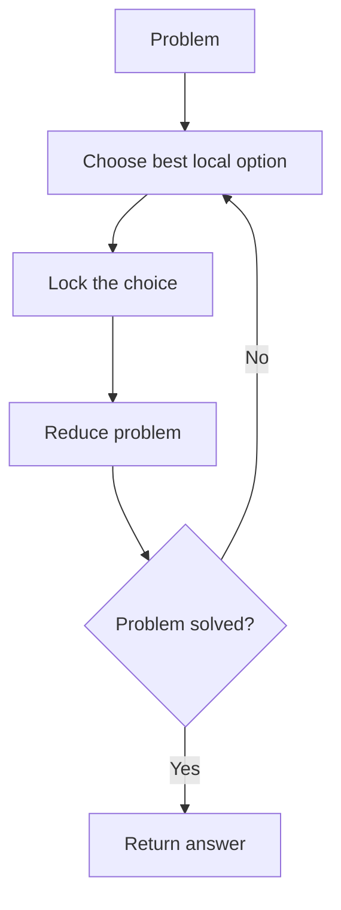

| Idea | Meaning |
|---|---|
| Local best | Best choice at the current step |
| Global best | Best final answer |
| No backtracking | Once chosen, do not undo |
| Proof needed | You must justify why local best is safe |

---

# 2. When Greedy Works

Greedy usually works when the problem has these properties:

| Property | Simple Meaning |
|---|---|
| Greedy choice property | Choosing the best now is safe |
| Optimal substructure | After choosing, the remaining problem is still optimal |
| Exchange argument possible | You can replace an optimal choice with greedy choice |

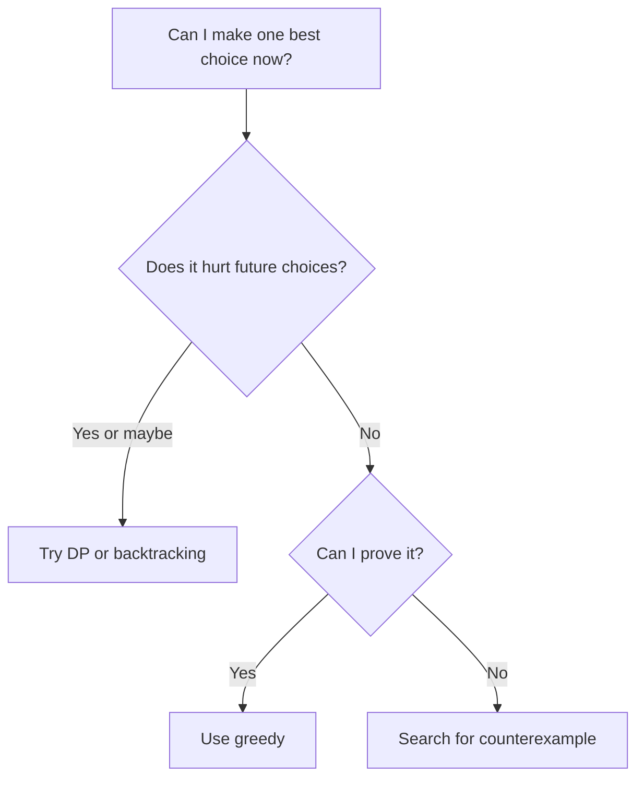

---

# 3. Greedy Recognition Checklist

Use greedy when you see these words:

| Keyword | Common Pattern |
|---|---|
| Maximum number of items | Sort, interval, heap |
| Minimum resources | Heap, sorting |
| Non-overlapping | Sort by end time |
| Earliest or latest | Sort by time |
| Can reach | Forward reachability |
| Minimum cost | Heap, MST, Huffman |
| Feasible distance | Binary search plus greedy check |

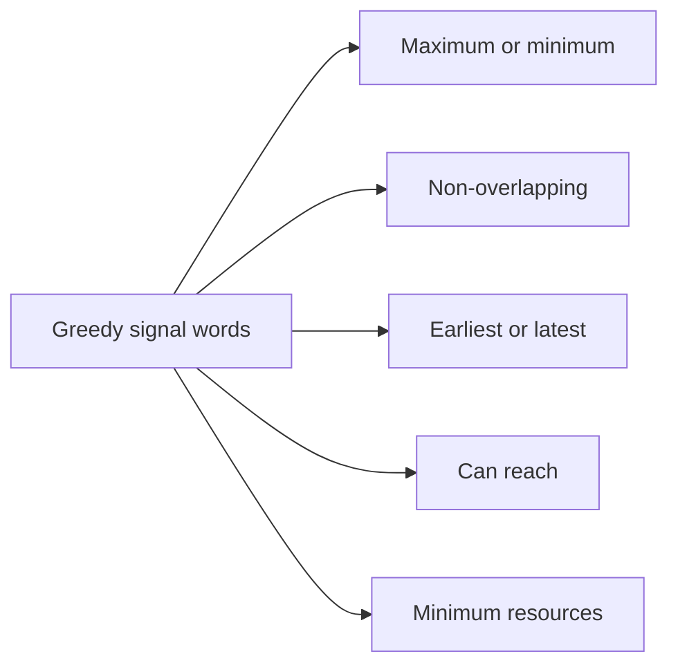

---

# 4. Beginner Patterns

## 4.1 Sort and Pick

### Concept

Sort the input so the best choice becomes obvious.

### Pattern Form

```text
sort(items)
for each item:
    if item can be used:
        take it
```

### Visual

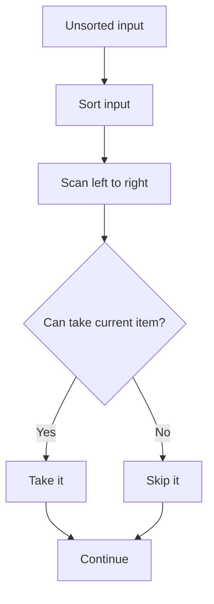

### Example: Assign Cookies

Given children greed factors and cookie sizes, maximize satisfied children.

### C++ Code

```cpp
#include <bits/stdc++.h>
using namespace std;

int findContentChildren(vector<int>& greed, vector<int>& cookies) {
    sort(greed.begin(), greed.end());
    sort(cookies.begin(), cookies.end());

    int child = 0;
    int cookie = 0;

    while (child < greed.size() && cookie < cookies.size()) {
        if (cookies[cookie] >= greed[child]) {
            child++;
        }
        cookie++;
    }
    return child;
}
```

### Dry Run

| greed | cookies | Action |
|---|---|---|
| `[1,2,3]` | `[1,1]` | Sort both |
| child 0 needs 1 | cookie 1 | satisfied |
| child 1 needs 2 | cookie 1 | not satisfied |
| End | answer = 1 | only one child satisfied |

---

## 4.2 Earliest Finish Interval

### Concept

To maximize non-overlapping intervals, always choose the interval that ends earliest.

### Pattern Form

```text
sort intervals by end time
lastEnd = -infinity
for interval in intervals:
    if interval.start >= lastEnd:
        take interval
        lastEnd = interval.end
```

### Visual

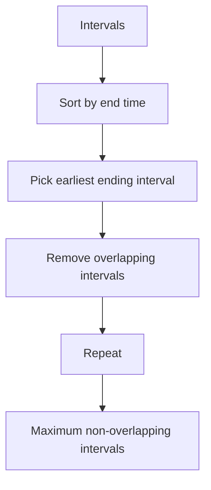

### Example

Intervals: `[1,3] [2,4] [3,5] [0,6] [5,7]`

Sorted by end:

| Interval | Take? | Reason |
|---|---|---|
| `[1,3]` | Yes | first interval |
| `[2,4]` | No | overlaps with `[1,3]` |
| `[3,5]` | Yes | starts at last end 3 |
| `[0,6]` | No | overlaps |
| `[5,7]` | Yes | starts at last end 5 |

Answer: 3 intervals.

### C++ Code

```cpp
#include <bits/stdc++.h>
using namespace std;

int maxNonOverlapping(vector<pair<int,int>>& intervals) {
    sort(intervals.begin(), intervals.end(), [](auto& a, auto& b) {
        return a.second < b.second;
    });

    int count = 0;
    int lastEnd = INT_MIN;

    for (auto [start, end] : intervals) {
        if (start >= lastEnd) {
            count++;
            lastEnd = end;
        }
    }
    return count;
}
```

---

## 4.3 Running Min or Max

### Concept

Track the best value seen so far while scanning once.

### Example: Best Time to Buy and Sell Stock

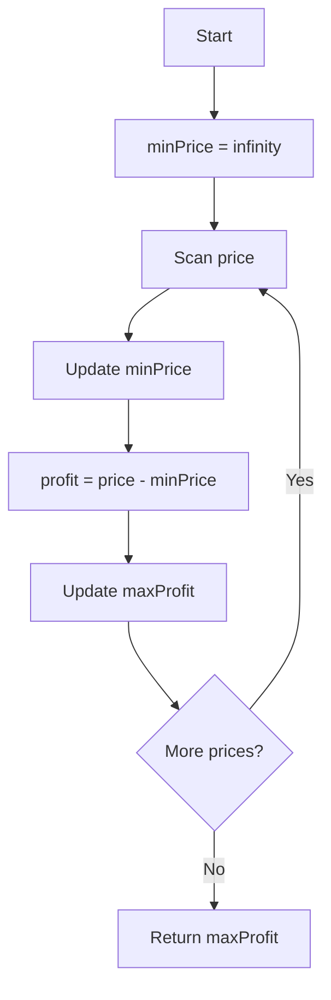

### C++ Code

```cpp
#include <bits/stdc++.h>
using namespace std;

int maxProfit(vector<int>& prices) {
    int minPrice = INT_MAX;
    int best = 0;

    for (int price : prices) {
        minPrice = min(minPrice, price);
        best = max(best, price - minPrice);
    }
    return best;
}
```

### Dry Run

Prices: `[7,1,5,3,6,4]`

| Day Price | Min Price So Far | Profit If Sell Today | Best Profit |
|---|---:|---:|---:|
| 7 | 7 | 0 | 0 |
| 1 | 1 | 0 | 0 |
| 5 | 1 | 4 | 4 |
| 3 | 1 | 2 | 4 |
| 6 | 1 | 5 | 5 |
| 4 | 1 | 3 | 5 |

Answer: 5.

---

# 5. FAANG Interview Patterns

## 5.1 Forward Reachability: Jump Game

### Concept

Track the farthest index you can reach.

### Visual

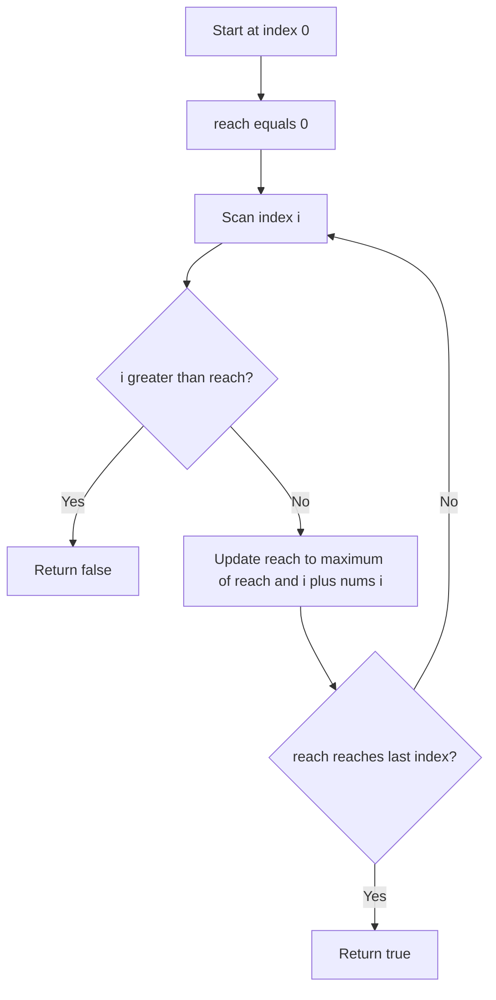

### C++ Code

```cpp
#include <bits/stdc++.h>
using namespace std;

bool canJump(vector<int>& nums) {
    int reach = 0;

    for (int i = 0; i < nums.size(); i++) {
        if (i > reach) return false;
        reach = max(reach, i + nums[i]);
        if (reach >= nums.size() - 1) return true;
    }
    return true;
}
```

### Dry Run

Input: `[2,3,1,1,4]`

| i | nums[i] | reach before | reach after | Meaning |
|---|---:|---:|---:|---|
| 0 | 2 | 0 | 2 | can reach index 2 |
| 1 | 3 | 2 | 4 | can reach last index |

Answer: true.

---

## 5.2 Gas Station

### Concept

If total gas is less than total cost, impossible. Otherwise, the valid start is after the point where tank becomes negative.

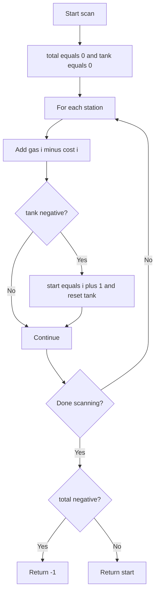

### C++ Code

```cpp
#include <bits/stdc++.h>
using namespace std;

int canCompleteCircuit(vector<int>& gas, vector<int>& cost) {
    int total = 0;
    int tank = 0;
    int start = 0;

    for (int i = 0; i < gas.size(); i++) {
        int diff = gas[i] - cost[i];
        total += diff;
        tank += diff;

        if (tank < 0) {
            start = i + 1;
            tank = 0;
        }
    }
    return total < 0 ? -1 : start;
}
```

### Dry Run

Gas: `[1,2,3,4,5]`  
Cost: `[3,4,5,1,2]`

| i | gas-cost | tank | start | Action |
|---|---:|---:|---:|---|
| 0 | -2 | -2 | 1 | reset |
| 1 | -2 | -2 | 2 | reset |
| 2 | -2 | -2 | 3 | reset |
| 3 | 3 | 3 | 3 | keep |
| 4 | 3 | 6 | 3 | keep |

Answer: start at index 3.

---

## 5.3 Meeting Rooms with Heap

### Concept

Use a min heap to track the earliest ending meeting room.

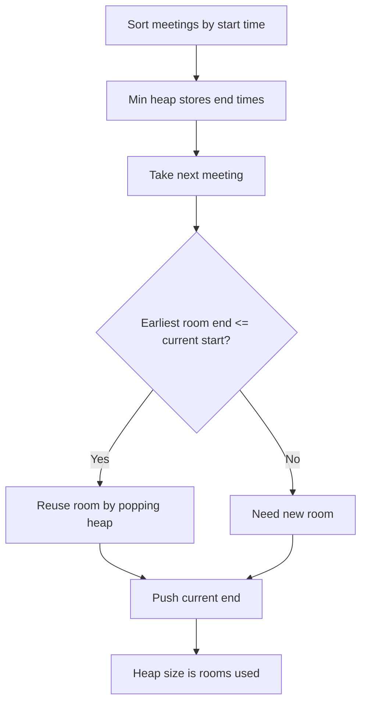

### C++ Code

```cpp
#include <bits/stdc++.h>
using namespace std;

int minMeetingRooms(vector<vector<int>>& intervals) {
    sort(intervals.begin(), intervals.end());

    priority_queue<int, vector<int>, greater<int>> minHeap;

    for (auto& meeting : intervals) {
        int start = meeting[0];
        int end = meeting[1];

        if (!minHeap.empty() && minHeap.top() <= start) {
            minHeap.pop();
        }
        minHeap.push(end);
    }
    return minHeap.size();
}
```

### Java Code

```java
import java.util.*;

class Solution {
    public int minMeetingRooms(int[][] intervals) {
        Arrays.sort(intervals, (a, b) -> a[0] - b[0]);
        PriorityQueue<Integer> pq = new PriorityQueue<>();

        for (int[] meeting : intervals) {
            int start = meeting[0];
            int end = meeting[1];

            if (!pq.isEmpty() && pq.peek() <= start) {
                pq.poll();
            }
            pq.offer(end);
        }
        return pq.size();
    }
}
```

### Dry Run

Meetings: `[[0,30],[5,10],[15,20]]`

| Meeting | Heap Before | Action | Heap After |
|---|---|---|---|
| `[0,30]` | `[]` | add room ending 30 | `[30]` |
| `[5,10]` | `[30]` | need new room | `[10,30]` |
| `[15,20]` | `[10,30]` | reuse room ending 10 | `[20,30]` |

Answer: 2 rooms.

---

## 5.4 Partition Labels

### Concept

Each character must appear in only one partition. Track the farthest last occurrence of characters seen so far.

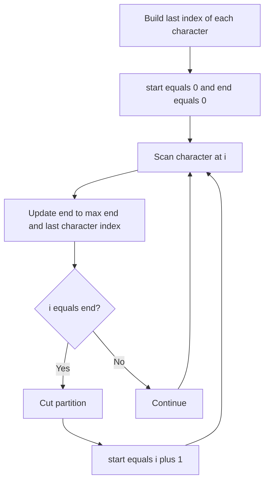

### C++ Code

```cpp
#include <bits/stdc++.h>
using namespace std;

vector<int> partitionLabels(string s) {
    vector<int> last(26);
    for (int i = 0; i < s.size(); i++) {
        last[s[i] - 'a'] = i;
    }

    vector<int> ans;
    int start = 0;
    int end = 0;

    for (int i = 0; i < s.size(); i++) {
        end = max(end, last[s[i] - 'a']);
        if (i == end) {
            ans.push_back(end - start + 1);
            start = i + 1;
        }
    }
    return ans;
}
```

### Dry Run

String: `ababcbacadefegdehijhklij`

| Scan Range | Current End | Partition |
|---|---:|---|
| `ababcbaca` | 8 | length 9 |
| `defegde` | 15 | length 7 |
| `hijhklij` | 23 | length 8 |

Answer: `[9,7,8]`.

---

# 6. Advanced Competitive Patterns

## 6.1 Greedy Plus Binary Search

### Concept

Binary search the answer. Use greedy to check if an answer is feasible.

Example: Aggressive Cows / Place k items with maximum minimum distance.

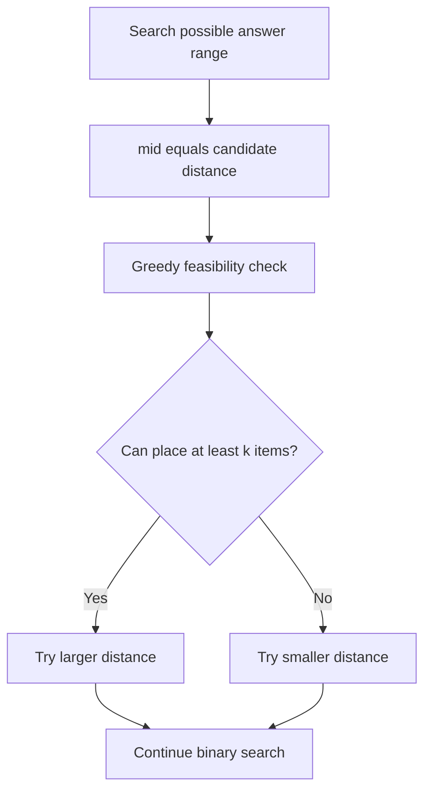

### C++ Code

```cpp
#include <bits/stdc++.h>
using namespace std;

bool canPlace(vector<int>& pos, int k, int dist) {
    int count = 1;
    int last = pos[0];

    for (int i = 1; i < pos.size(); i++) {
        if (pos[i] - last >= dist) {
            count++;
            last = pos[i];
        }
    }
    return count >= k;
}

int largestMinDistance(vector<int>& pos, int k) {
    sort(pos.begin(), pos.end());

    int low = 0;
    int high = pos.back() - pos.front();
    int ans = 0;

    while (low <= high) {
        int mid = low + (high - low) / 2;

        if (canPlace(pos, k, mid)) {
            ans = mid;
            low = mid + 1;
        } else {
            high = mid - 1;
        }
    }
    return ans;
}
```

### Dry Run

Positions: `[1,2,4,8,9]`, `k = 3`

| Candidate Distance | Can Place? | Action |
|---:|---|---|
| 4 | No | try smaller |
| 2 | Yes | try larger |
| 3 | Yes | try larger |

Answer: 3.

---

## 6.2 Greedy Plus DSU: Kruskal MST

### Concept

Sort edges by weight. Add the smallest edge that does not create a cycle.

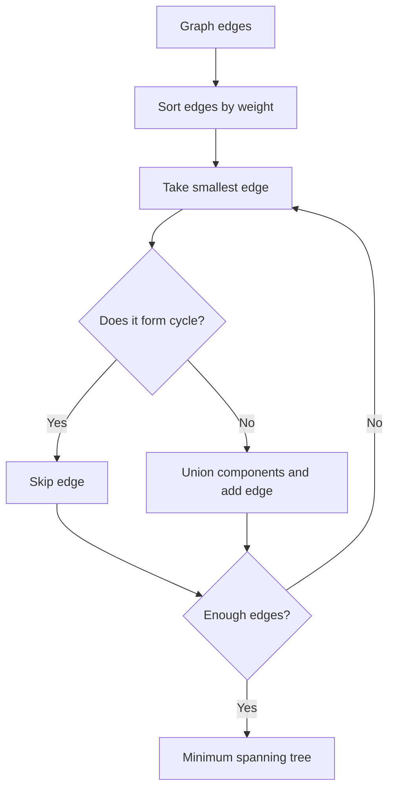

### C++ Code

```cpp
#include <bits/stdc++.h>
using namespace std;

class DSU {
public:
    vector<int> parent, rank;

    DSU(int n) {
        parent.resize(n);
        rank.assign(n, 0);
        iota(parent.begin(), parent.end(), 0);
    }

    int find(int x) {
        if (parent[x] == x) return x;
        return parent[x] = find(parent[x]);
    }

    bool unite(int a, int b) {
        a = find(a);
        b = find(b);
        if (a == b) return false;

        if (rank[a] < rank[b]) swap(a, b);
        parent[b] = a;
        if (rank[a] == rank[b]) rank[a]++;
        return true;
    }
};

int kruskal(int n, vector<array<int,3>>& edges) {
    sort(edges.begin(), edges.end()); // {weight, u, v}
    DSU dsu(n);
    int cost = 0;

    for (auto [w, u, v] : edges) {
        if (dsu.unite(u, v)) {
            cost += w;
        }
    }
    return cost;
}
```

### Dry Run

Edges: `(1,A,B) (2,B,C) (3,A,C) (4,C,D)`

| Edge | Action | Reason |
|---|---|---|
| A-B weight 1 | Take | no cycle |
| B-C weight 2 | Take | no cycle |
| A-C weight 3 | Skip | cycle |
| C-D weight 4 | Take | connects D |

MST cost: 7.

---

## 6.3 Huffman Coding

### Concept

Always merge the two smallest frequencies.

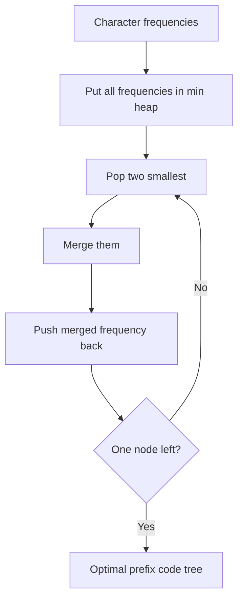

### C++ Code

```cpp
#include <bits/stdc++.h>
using namespace std;

int huffmanCost(vector<int>& freq) {
    priority_queue<int, vector<int>, greater<int>> pq;

    for (int f : freq) pq.push(f);

    int totalCost = 0;

    while (pq.size() > 1) {
        int a = pq.top(); pq.pop();
        int b = pq.top(); pq.pop();

        int merged = a + b;
        totalCost += merged;
        pq.push(merged);
    }
    return totalCost;
}
```

### Dry Run

Frequencies: `[5,9,12,13,16,45]`

| Step | Pick Two Smallest | Merge | Total Cost |
|---|---|---:|---:|
| 1 | 5 and 9 | 14 | 14 |
| 2 | 12 and 13 | 25 | 39 |
| 3 | 14 and 16 | 30 | 69 |
| 4 | 25 and 30 | 55 | 124 |
| 5 | 45 and 55 | 100 | 224 |

Answer cost: 224.

---

# 7. How to Prove Greedy Works

## The Exchange Argument

### Simple Meaning

Show that any optimal solution can be changed to include the greedy choice without making it worse.

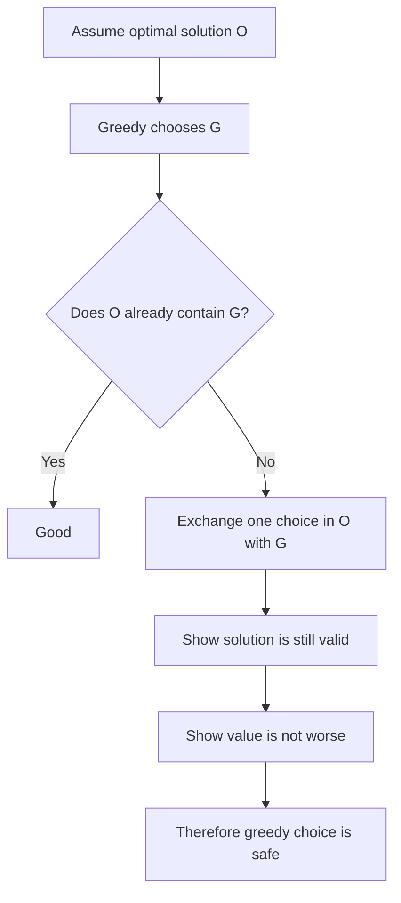

## Step-by-Step Example: Activity Selection

Goal: choose maximum non-overlapping activities.

Greedy choice: pick the activity that finishes earliest.

### Proof Steps

| Step | Explanation |
|---|---|
| 1 | Let `G` be the activity with earliest finish time |
| 2 | Let `O` be an optimal answer |
| 3 | If `O` already has `G`, no problem |
| 4 | If `O` starts with another activity `X`, replace `X` with `G` |
| 5 | Since `G` ends no later than `X`, all later activities still fit |
| 6 | Number of activities stays the same |
| 7 | Therefore there exists an optimal solution that starts with `G` |
| 8 | Repeat this logic for the remaining activities |

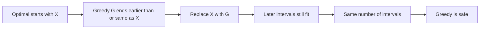

## Exchange Argument Template

Use this in interviews:

```text
1. Let G be the greedy choice.
2. Let O be an optimal solution.
3. If O contains G, we are done.
4. Otherwise, replace some choice X in O with G.
5. Prove the new solution is still valid.
6. Prove the new solution is no worse than O.
7. Therefore, there is an optimal solution containing G.
8. Repeat for the remaining subproblem.
```

---

# 8. Greedy vs DP Decision Flow

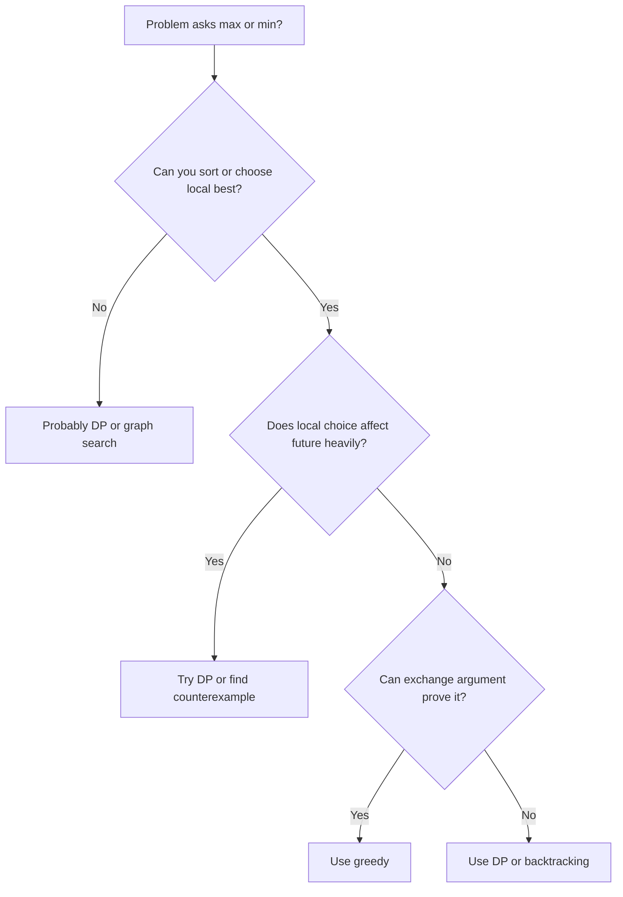

| Question | If Yes | If No |
|---|---|---|
| Can I sort to simplify? | Try greedy | Maybe DP |
| Can I make one safe choice? | Greedy possible | DP likely |
| Is future state important? | DP likely | Greedy possible |
| Can I prove by exchange? | Greedy strong | Be careful |

---

# 9. Common Mistakes

| Mistake | Why It Fails | Fix |
|---|---|---|
| Picking largest always | Largest may block future choices | Try sorting by end time or deadline |
| No proof | Greedy may only feel right | Use exchange argument |
| Ignoring edge cases | Empty, one element, impossible cases fail | Test small examples |
| Using greedy for non-canonical coin change | Local coin choice may fail | Use DP |
| Forgetting impossible condition | Some problems require feasibility first | Check total gas, reach, etc. |

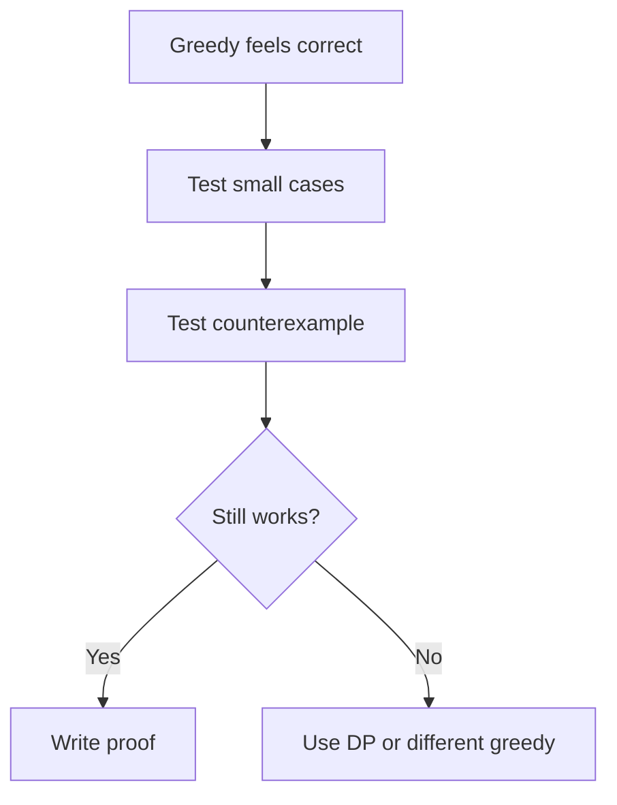

---

# 10. Practice Roadmap

## Beginner

| Pattern | Problems |
|---|---|
| Sort and pick | Assign Cookies, Boats to Save People |
| Earliest finish | Activity Selection, Non-overlapping Intervals |
| Running min or max | Best Time to Buy and Sell Stock |

## FAANG Interview

| Pattern | Problems |
|---|---|
| Forward reachability | Jump Game, Jump Game II |
| Reset greedy | Gas Station |
| Heap greedy | Meeting Rooms II, Task Scheduler |
| Partition greedy | Partition Labels |

## Advanced / CM Level

| Pattern | Problems |
|---|---|
| DSU greedy | Kruskal MST |
| Heap merge | Huffman Coding, Minimum Cost to Connect Ropes |
| Binary search plus greedy | Aggressive Cows, Split Array style checks |
| Deadline greedy | Job Sequencing, Course Schedule III |

---

# Final Mental Model

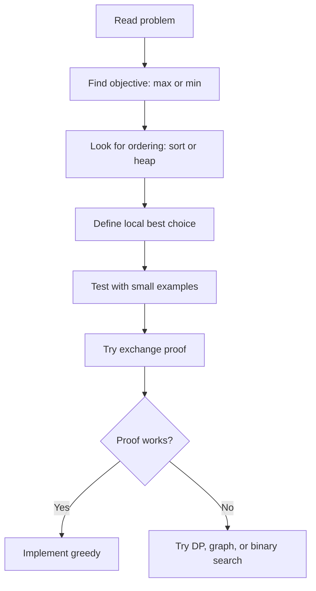

Remember:

- Greedy is easy to code.
- Greedy is hard to prove.
- In interviews, the proof matters as much as the code.

