# Binary Search Problem Solving Playbook

> Goal: solve almost any competitive-programming problem related to **binary search**, **binary search on answer**, **lower bound**, **upper bound**, and **ternary search**.

---

# 0. Master Map

```mermaid
flowchart TD
    A["Binary Search Family"] --> B["Concepts"]
    A --> C["Frameworks"]
    A --> D["Problem Forms"]
    A --> E["Tactics"]
    A --> F["C++ Templates"]

    B --> B1["Sorted Search"]
    B --> B2["Monotonic Predicate"]
    B --> B3["Binary Search on Answer"]
    B --> B4["Real Binary Search"]
    B --> B5["Ternary Search"]

    C --> C1["First True Framework"]
    C --> C2["Last True Framework"]
    C --> C3["Minimize Maximum Framework"]
    C --> C4["Maximize Minimum Framework"]
    C --> C5["Kth Smallest Framework"]

    D --> D1["Lower Bound"]
    D --> D2["Upper Bound"]
    D --> D3["Painter Partition"]
    D --> D4["Factory Machines"]
    D --> D5["Aggressive Cows"]
    D --> D6["Kth Pair Sum"]
    D --> D7["Real Precision Problems"]

    E --> E1["Search Space Design"]
    E --> E2["Check Function Design"]
    E --> E3["Overflow Safety"]
    E --> E4["Boundary Debugging"]
```

---

# 1. Concepts

## 1.1 Binary Search Core Idea

Binary search repeatedly halves the search space.

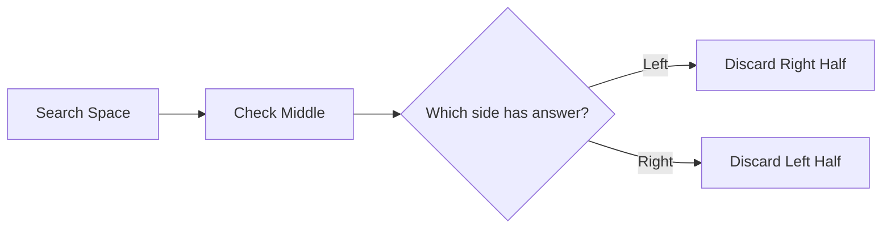

Use it when:
- data is sorted
- answer space is monotonic
- a decision function forms a clean true or false boundary

Safe midpoint:

```cpp
long long mid = lo + (hi - lo) / 2;
```

Avoid:

```cpp
long long mid = (lo + hi) / 2;
```

because `lo + hi` may overflow.

---

## 1.2 Monotonic Predicate

Binary search needs a monotonic pattern.

### First true pattern

```text
false false false true true true
```

Goal: find the first `true`.

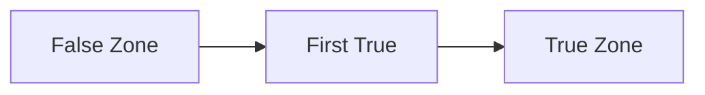

### Last true pattern

```text
true true true false false false
```

Goal: find the last `true`.

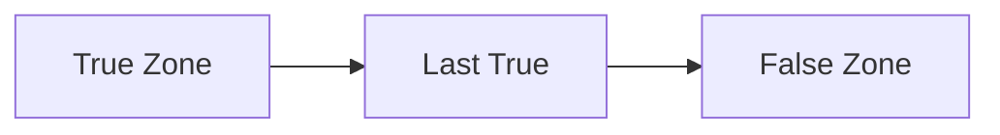

---

## 1.3 Binary Search on Answer

Instead of searching an index, search the answer value.

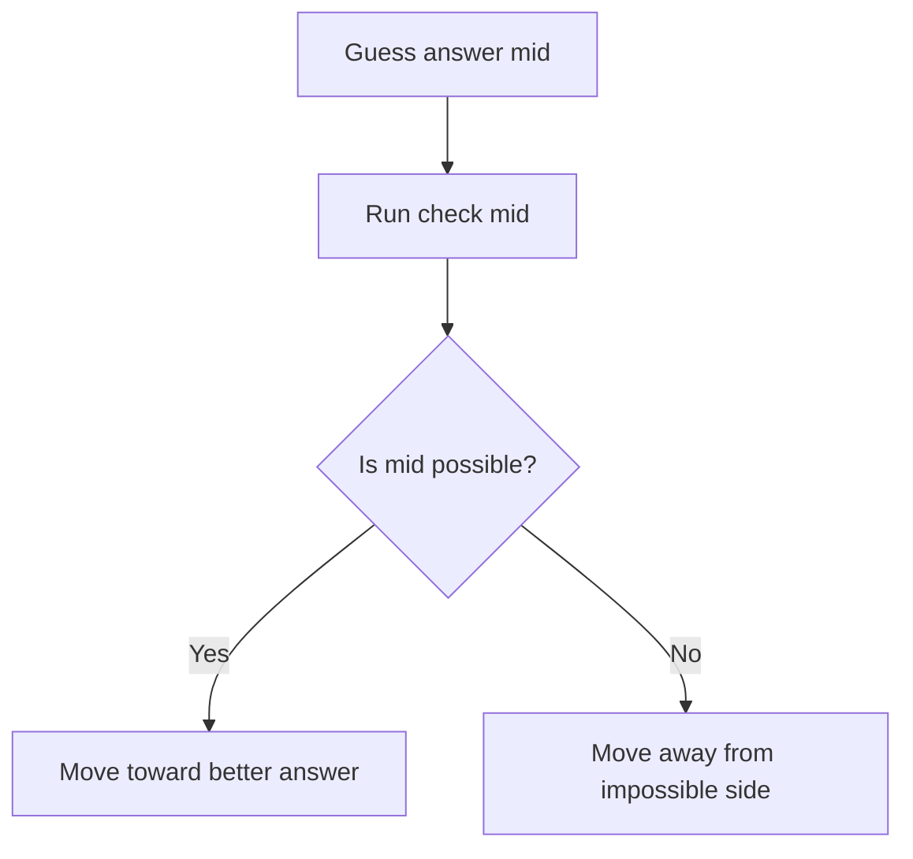

Common clues:
- minimize maximum
- maximize minimum
- minimum time
- maximum distance
- kth smallest
- can complete within `x`
- can make at least `k`

---

## 1.4 Lower Bound and Upper Bound

```text
lower_bound = first element >= x
upper_bound = first element > x
```

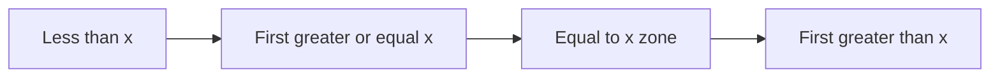

C++ STL:

```cpp
auto lb = lower_bound(v.begin(), v.end(), x);
auto ub = upper_bound(v.begin(), v.end(), x);
```

Useful counts:

```cpp
int lessThanX = lower_bound(v.begin(), v.end(), x) - v.begin();
int lessOrEqualX = upper_bound(v.begin(), v.end(), x) - v.begin();
int equalX = upper_bound(v.begin(), v.end(), x) - lower_bound(v.begin(), v.end(), x);
```

---

## 1.5 Real Binary Search

For real numbers, do not use `mid + 1` or `mid - 1`.

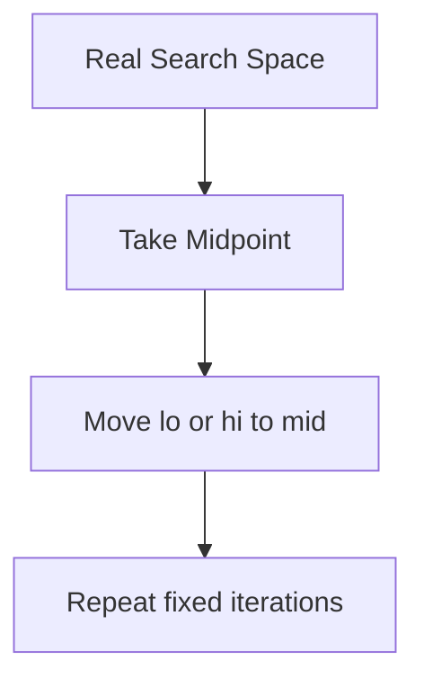

Use fixed iterations:

```cpp
for (int it = 0; it < 100; it++) {
    long double mid = (lo + hi) / 2;
}
```

---

## 1.6 Ternary Search

Use ternary search for unimodal functions:
- decreasing then increasing
- increasing then decreasing

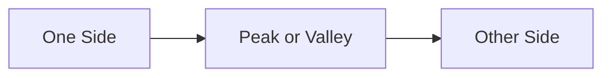

Use when binary search monotonicity is not present but the function has one best point.

---

# 2. Frameworks

## 2.1 First True Framework

Use for:

```text
false false false true true true
```

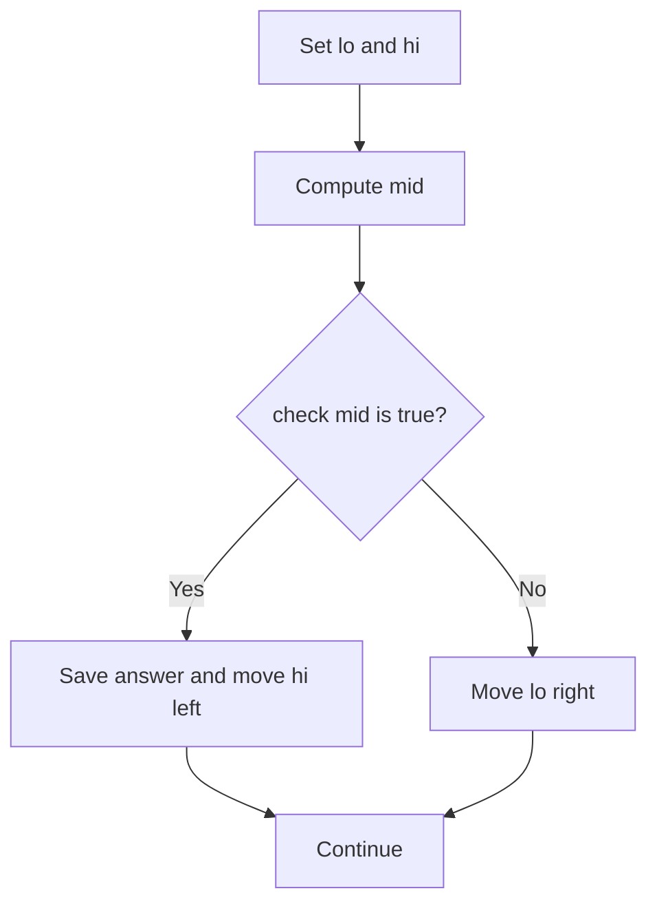

### C++

```cpp
long long firstTrue(long long lo, long long hi) {
    long long ans = hi + 1;

    while (lo <= hi) {
        long long mid = lo + (hi - lo) / 2;

        if (check(mid)) {
            ans = mid;
            hi = mid - 1;
        } else {
            lo = mid + 1;
        }
    }

    return ans;
}
```

---

## 2.2 Last True Framework

Use for:

```text
true true true false false false
```

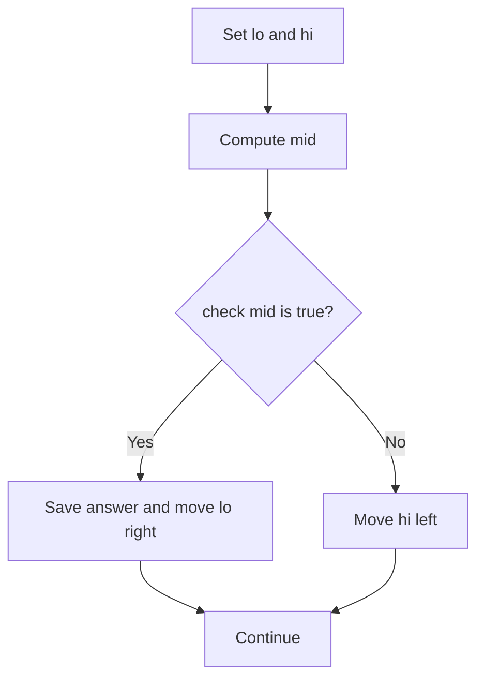

### C++

```cpp
long long lastTrue(long long lo, long long hi) {
    long long ans = lo - 1;

    while (lo <= hi) {
        long long mid = lo + (hi - lo) / 2;

        if (check(mid)) {
            ans = mid;
            lo = mid + 1;
        } else {
            hi = mid - 1;
        }
    }

    return ans;
}
```

---

## 2.3 Minimize Maximum Framework

Problem asks:

```text
Minimize the maximum value.
```

Examples:
- split array largest sum
- painter partition
- minimum capacity
- minimum time limit

Pattern:

```text
If max limit x works, any larger limit also works.
```

So it is first true.

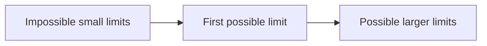

### C++ skeleton

```cpp
long long solveMinimizeMaximum(long long lo, long long hi) {
    long long ans = hi;

    while (lo <= hi) {
        long long mid = lo + (hi - lo) / 2;

        if (can(mid)) {
            ans = mid;
            hi = mid - 1;
        } else {
            lo = mid + 1;
        }
    }

    return ans;
}
```

---

## 2.4 Maximize Minimum Framework

Problem asks:

```text
Maximize the minimum value.
```

Examples:
- aggressive cows
- maximize minimum distance
- maximize minimum sweetness
- place items far apart

Pattern:

```text
If distance x works, any smaller distance also works.
```

So it is last true.

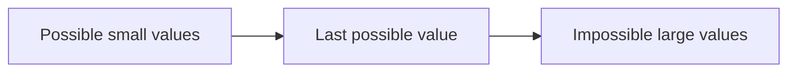

### C++ skeleton

```cpp
long long solveMaximizeMinimum(long long lo, long long hi) {
    long long ans = lo;

    while (lo <= hi) {
        long long mid = lo + (hi - lo) / 2;

        if (can(mid)) {
            ans = mid;
            lo = mid + 1;
        } else {
            hi = mid - 1;
        }
    }

    return ans;
}
```

---

## 2.5 Kth Smallest Framework

Problem asks:

```text
Find kth smallest without generating all values.
```

Core check:

```text
count values <= mid
```

If count is at least `k`, answer is `<= mid`.

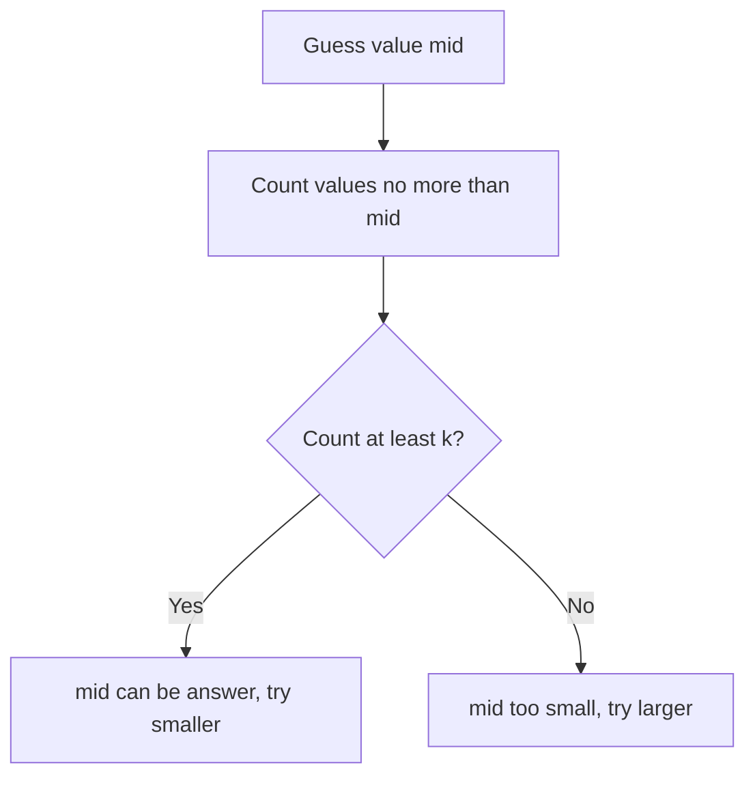

### C++ skeleton

```cpp
long long kthSmallest(long long lo, long long hi, long long k) {
    long long ans = hi;

    while (lo <= hi) {
        long long mid = lo + (hi - lo) / 2;

        if (countLessOrEqual(mid) >= k) {
            ans = mid;
            hi = mid - 1;
        } else {
            lo = mid + 1;
        }
    }

    return ans;
}
```

---

## 2.6 Check Function Framework

The check function must not ask:

```text
Is mid exactly answer?
```

It should ask:

```text
Is mid enough?
Is mid possible?
Can I achieve at least mid?
Can I keep maximum at most mid?
Are at least k values <= mid?
```

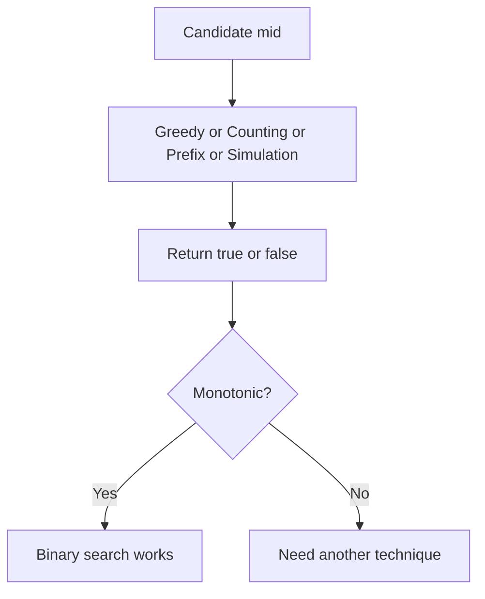

---

# 3. Problem Forms

## 3.1 Classic Search in Sorted Array

Find whether `x` exists.

```cpp
bool exists(vector<int>& a, int x) {
    int lo = 0;
    int hi = (int)a.size() - 1;

    while (lo <= hi) {
        int mid = lo + (hi - lo) / 2;

        if (a[mid] == x) return true;
        if (a[mid] < x) lo = mid + 1;
        else hi = mid - 1;
    }

    return false;
}
```

---

## 3.2 Manual Lower Bound

Find first index with value `>= x`.

```cpp
int lowerBoundManual(vector<int>& a, int x) {
    int lo = 0;
    int hi = (int)a.size() - 1;
    int ans = (int)a.size();

    while (lo <= hi) {
        int mid = lo + (hi - lo) / 2;

        if (a[mid] >= x) {
            ans = mid;
            hi = mid - 1;
        } else {
            lo = mid + 1;
        }
    }

    return ans;
}
```

---

## 3.3 Manual Upper Bound

Find first index with value `> x`.

```cpp
int upperBoundManual(vector<int>& a, int x) {
    int lo = 0;
    int hi = (int)a.size() - 1;
    int ans = (int)a.size();

    while (lo <= hi) {
        int mid = lo + (hi - lo) / 2;

        if (a[mid] > x) {
            ans = mid;
            hi = mid - 1;
        } else {
            lo = mid + 1;
        }
    }

    return ans;
}
```

---

## 3.4 Rotated Sorted Array Minimum

Find index of minimum element.

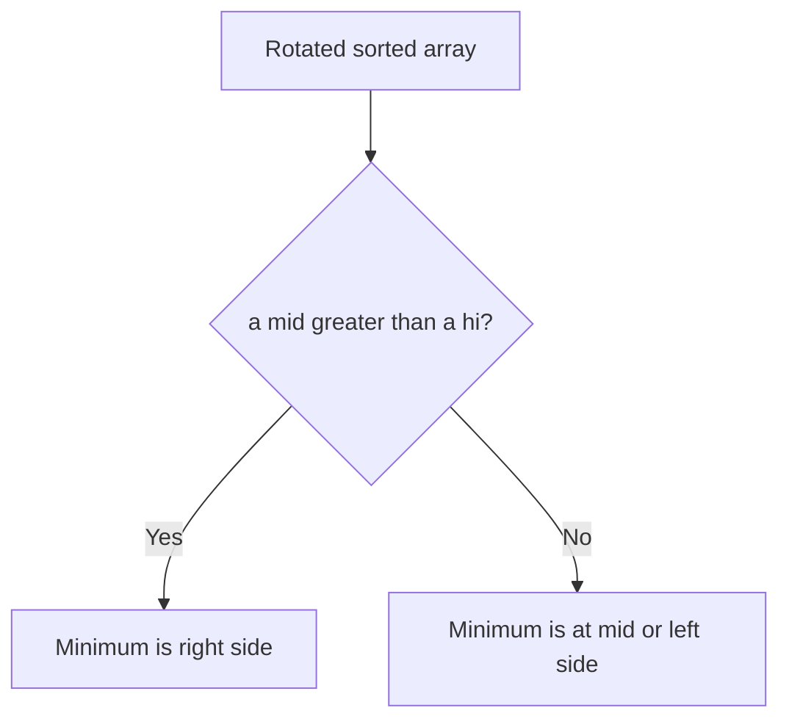

```cpp
int rotationCount(vector<int>& a) {
    int lo = 0;
    int hi = (int)a.size() - 1;

    while (lo < hi) {
        int mid = lo + (hi - lo) / 2;

        if (a[mid] > a[hi]) {
            lo = mid + 1;
        } else {
            hi = mid;
        }
    }

    return lo;
}
```

---

## 3.5 Peak in Bitonic Array

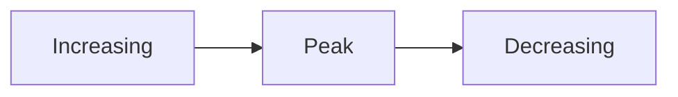

```cpp
int findPeak(vector<int>& a) {
    int lo = 0;
    int hi = (int)a.size() - 1;

    while (lo < hi) {
        int mid = lo + (hi - lo) / 2;

        if (a[mid] > a[mid + 1]) {
            hi = mid;
        } else {
            lo = mid + 1;
        }
    }

    return lo;
}
```

---

## 3.6 Painter Partition / Split Array Largest Sum

Problem:

```text
Split array into k continuous parts.
Minimize the maximum part sum.
```

Search range:

```text
lo = max element
hi = sum of all elements
```

Check:

```text
Can we split into at most k groups if each group sum <= mid?
```

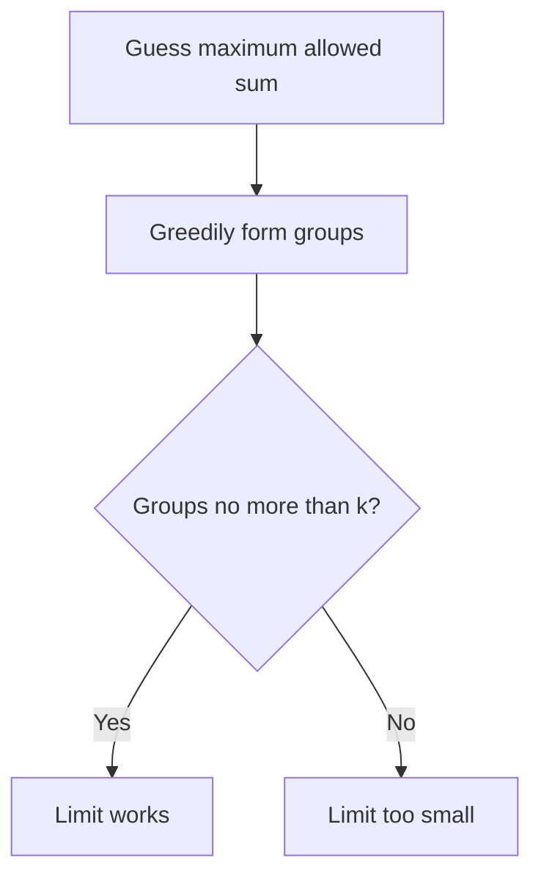

```cpp
bool canSplit(const vector<int>& a, int k, long long limit) {
    int groups = 1;
    long long current = 0;

    for (int x : a) {
        if (x > limit) return false;

        if (current + x <= limit) {
            current += x;
        } else {
            groups++;
            current = x;
        }
    }

    return groups <= k;
}

long long splitArrayLargestSum(vector<int>& a, int k) {
    long long lo = 0;
    long long hi = 0;

    for (int x : a) {
        lo = max(lo, (long long)x);
        hi += x;
    }

    long long ans = hi;

    while (lo <= hi) {
        long long mid = lo + (hi - lo) / 2;

        if (canSplit(a, k, mid)) {
            ans = mid;
            hi = mid - 1;
        } else {
            lo = mid + 1;
        }
    }

    return ans;
}
```

---

## 3.7 Factory Machines / Minimum Time

Problem:

```text
Each machine makes one product in machine[i] time.
Find minimum time to make target products.
```

Check:

```text
sum(time / machine[i]) >= target
```

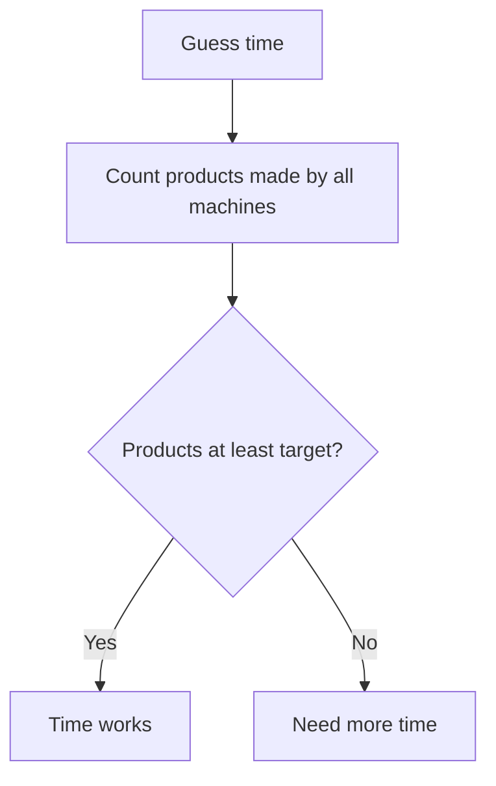

```cpp
bool canMake(const vector<long long>& machine, long long target, long long time) {
    long long made = 0;

    for (long long m : machine) {
        made += time / m;
        if (made >= target) return true;
    }

    return false;
}

long long minTime(vector<long long>& machine, long long target) {
    long long fastest = *min_element(machine.begin(), machine.end());
    long long lo = 0;
    long long hi = fastest * target;
    long long ans = hi;

    while (lo <= hi) {
        long long mid = lo + (hi - lo) / 2;

        if (canMake(machine, target, mid)) {
            ans = mid;
            hi = mid - 1;
        } else {
            lo = mid + 1;
        }
    }

    return ans;
}
```

---

## 3.8 Aggressive Cows / Maximize Minimum Distance

Problem:

```text
Place k items in positions.
Maximize minimum distance between chosen positions.
```

Check:

```text
Can we place at least k items with distance >= mid?
```

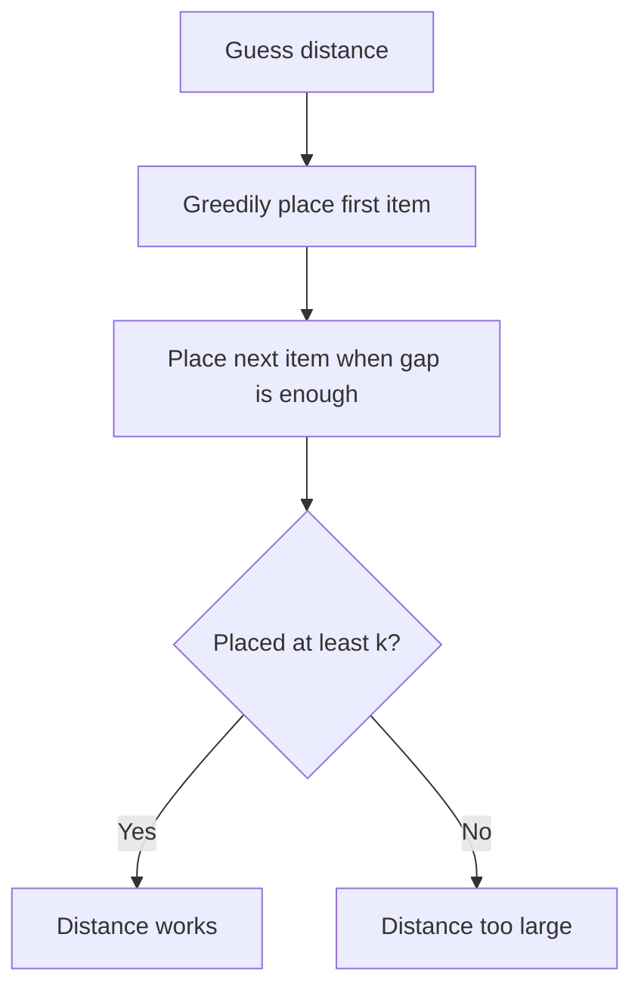

```cpp
bool canPlace(vector<long long>& pos, int k, long long dist) {
    int placed = 1;
    long long last = pos[0];

    for (int i = 1; i < (int)pos.size(); i++) {
        if (pos[i] - last >= dist) {
            placed++;
            last = pos[i];
        }
    }

    return placed >= k;
}

long long maximizeMinDistance(vector<long long>& pos, int k) {
    sort(pos.begin(), pos.end());

    long long lo = 0;
    long long hi = pos.back() - pos.front();
    long long ans = 0;

    while (lo <= hi) {
        long long mid = lo + (hi - lo) / 2;

        if (canPlace(pos, k, mid)) {
            ans = mid;
            lo = mid + 1;
        } else {
            hi = mid - 1;
        }
    }

    return ans;
}
```

---

## 3.9 Minimize Maximum Gap After Adding Points

Problem:

```text
Given sorted points, add at most k new points.
Minimize the maximum adjacent gap.
```

For a gap `d`, extra points needed so every piece is at most `x`:

```text
ceil(d / x) - 1
```

Integer version:

```text
(d + x - 1) / x - 1
```

```cpp
bool canLimitGap(vector<long long>& pos, long long k, long long x) {
    if (x == 0) return false;

    long long need = 0;

    for (int i = 1; i < (int)pos.size(); i++) {
        long long d = pos[i] - pos[i - 1];
        need += (d + x - 1) / x - 1;

        if (need > k) return false;
    }

    return need <= k;
}

long long minimizeMaxGap(vector<long long>& pos, long long k) {
    sort(pos.begin(), pos.end());

    long long lo = 1;
    long long hi = 0;

    for (int i = 1; i < (int)pos.size(); i++) {
        hi = max(hi, pos[i] - pos[i - 1]);
    }

    long long ans = hi;

    while (lo <= hi) {
        long long mid = lo + (hi - lo) / 2;

        if (canLimitGap(pos, k, mid)) {
            ans = mid;
            hi = mid - 1;
        } else {
            lo = mid + 1;
        }
    }

    return ans;
}
```

---

## 3.10 Kth Pair Sum from Two Arrays

Problem:

```text
C contains all A[i] + B[j].
Find kth smallest value in C.
```

Do not build `C`.

For candidate `x`, count pairs:

```text
A[i] + B[j] <= x
```

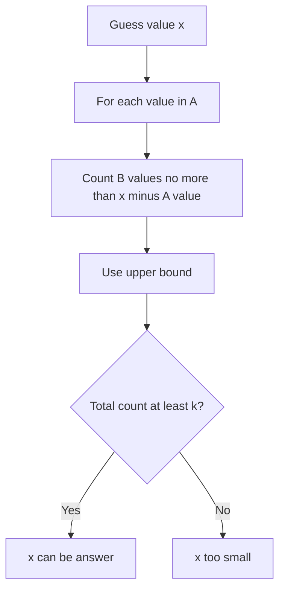

```cpp
long long countPairsLE(const vector<long long>& A, const vector<long long>& B, long long x) {
    long long count = 0;

    for (long long a : A) {
        count += upper_bound(B.begin(), B.end(), x - a) - B.begin();
    }

    return count;
}

long long kthPairSum(vector<long long> A, vector<long long> B, long long k) {
    sort(A.begin(), A.end());
    sort(B.begin(), B.end());

    if (A.size() > B.size()) swap(A, B);

    long long lo = A.front() + B.front();
    long long hi = A.back() + B.back();
    long long ans = hi;

    while (lo <= hi) {
        long long mid = lo + (hi - lo) / 2;

        if (countPairsLE(A, B, mid) >= k) {
            ans = mid;
            hi = mid - 1;
        } else {
            lo = mid + 1;
        }
    }

    return ans;
}
```

---

## 3.11 Kth Smallest in Multiplication Table

For row `i`, count values `<= x`:

```text
min(m, x / i)
```

```cpp
long long countLEInTable(long long n, long long m, long long x) {
    long long count = 0;

    for (long long i = 1; i <= n; i++) {
        count += min(m, x / i);
    }

    return count;
}

long long kthInMultiplicationTable(long long n, long long m, long long k) {
    long long lo = 1;
    long long hi = n * m;
    long long ans = hi;

    while (lo <= hi) {
        long long mid = lo + (hi - lo) / 2;

        if (countLEInTable(n, m, mid) >= k) {
            ans = mid;
            hi = mid - 1;
        } else {
            lo = mid + 1;
        }
    }

    return ans;
}
```

---

## 3.12 Binary Search with Prefix Sum

Example:

```text
Find maximum length subarray with at most k zeros.
```

Guess length and use prefix zeros to check.

```mermaid
flowchart TD
    A["Guess length"] --> B["Use prefix count of zeros"]
    B --> C["Check all windows"]
    C --> D{"Any valid window?"}
    D -->|"Yes"| E["Length works"]
    D -->|"No"| F["Length too large"]
```

```cpp
bool canMakeOnes(const vector<int>& a, int k, int len) {
    int n = (int)a.size();

    vector<int> pref(n + 1, 0);
    for (int i = 0; i < n; i++) {
        pref[i + 1] = pref[i] + (a[i] == 0);
    }

    for (int l = 0; l + len <= n; l++) {
        int r = l + len;
        int zeros = pref[r] - pref[l];

        if (zeros <= k) return true;
    }

    return false;
}
```

---

## 3.13 Real Binary Search Template

Use for decimal answers.

```cpp
long double realBinarySearch(long double lo, long double hi) {
    for (int it = 0; it < 100; it++) {
        long double mid = (lo + hi) / 2;

        if (check(mid)) {
            hi = mid;
        } else {
            lo = mid;
        }
    }

    return (lo + hi) / 2;
}
```

---

## 3.14 Ternary Search Template

Use for a unimodal function.

```cpp
long double ternarySearch(long double lo, long double hi) {
    for (int it = 0; it < 200; it++) {
        long double m1 = lo + (hi - lo) / 3;
        long double m2 = hi - (hi - lo) / 3;

        if (f(m1) < f(m2)) {
            hi = m2;
        } else {
            lo = m1;
        }
    }

    return f((lo + hi) / 2);
}
```

Integer ternary search:

```cpp
long long integerTernary(long long lo, long long hi) {
    while (hi - lo > 3) {
        long long m1 = lo + (hi - lo) / 3;
        long long m2 = hi - (hi - lo) / 3;

        if (f(m1) < f(m2)) {
            hi = m2;
        } else {
            lo = m1;
        }
    }

    long long ans = f(lo);
    for (long long x = lo; x <= hi; x++) {
        ans = min(ans, f(x));
    }

    return ans;
}
```

---

# 4. Tactics

## 4.1 Decision Table

| Problem clue | Technique |
|---|---|
| Sorted array search | Classic binary search |
| First value at least x | Lower bound |
| First value greater than x | Upper bound |
| Minimize maximum | First true on answer |
| Maximize minimum | Last true on answer |
| Minimum time | Binary search on answer |
| kth smallest without generating | Count less or equal |
| Decimal answer | Real binary search |
| Hill or valley function | Ternary search |
| Rotated sorted array | Binary search by comparing mid and hi |
| Peak in bitonic array | Binary search on slope |

---

## 4.2 Search Space Tactics

Always define:

```text
lo = definitely too small or smallest possible
hi = definitely enough or largest possible
```

Examples:

| Problem | lo | hi |
|---|---:|---:|
| Split array largest sum | max element | total sum |
| Factory machines | 0 | fastest machine times target |
| Aggressive cows | 0 | max position minus min position |
| Kth pair sum | min A plus min B | max A plus max B |
| Multiplication table | 1 | n times m |

---

## 4.3 Check Function Tactics

Good checks:

```text
Can finish within mid time?
Can split with max sum mid?
Can place k objects distance mid apart?
Are there at least k values <= mid?
Can make length mid valid?
```

Bad checks:

```text
Is mid exactly answer?
```

---

## 4.4 Overflow Tactics

Safe midpoint:

```cpp
long long mid = lo + (hi - lo) / 2;
```

Safe multiplication comparison:

```cpp
// instead of mid * mid * mid <= x
if (mid <= x / mid / mid)
```

Early stop counting:

```cpp
made += time / machine[i];
if (made >= target) return true;
```

---

## 4.5 Boundary Tactics

For integer binary search:

```cpp
lo = mid + 1;
hi = mid - 1;
```

For real binary search:

```cpp
lo = mid;
hi = mid;
```

For `while (lo < hi)` style, be careful not to get stuck.

---

## 4.6 Monotonicity Test

Before coding, ask:

```text
If mid works, does bigger also work?
If mid works, does smaller also work?
Where is the boundary?
```

```mermaid
flowchart TD
    A["Candidate check"] --> B{"If mid works, bigger also works?"}
    B -->|"Yes"| C["Use first true for minimum possible"]
    B -->|"No"| D{"If mid works, smaller also works?"}
    D -->|"Yes"| E["Use last true for maximum possible"]
    D -->|"No"| F["Binary search may not apply"]
```

---

# 5. Common Mistakes

```mermaid
flowchart TD
    A["Common Binary Search Mistakes"] --> B["Using bad check function"]
    A --> C["Wrong lo and hi"]
    A --> D["Infinite loop"]
    A --> E["Overflow in mid"]
    A --> F["Overflow in multiplication"]
    A --> G["Returning lo without understanding invariant"]
    A --> H["Using binary search on non-monotonic predicate"]
```

## Mistake 1: Infinite loop

Wrong:

```cpp
while (lo <= hi) {
    int mid = (lo + hi) / 2;
    if (check(mid)) hi = mid;
    else lo = mid;
}
```

Correct integer version:

```cpp
if (check(mid)) hi = mid - 1;
else lo = mid + 1;
```

---

## Mistake 2: Bad `hi`

Wrong:

```cpp
hi = 1e9;
```

Maybe works, maybe not.

Better:

```cpp
hi = known maximum possible answer;
```

---

## Mistake 3: Check not monotonic

If result pattern is:

```text
true false true false
```

binary search is invalid.

---

# 6. Final Problem-Solving Flow

```mermaid
flowchart TD
    A["New Problem"] --> B{"Is data sorted?"}
    B -->|"Yes"| C["Classic binary search or lower bound"]
    B -->|"No"| D{"Can I guess answer?"}

    D -->|"Yes"| E["Design check function"]
    D -->|"No"| F{"Is function unimodal?"}

    E --> G{"Is check monotonic?"}
    G -->|"Yes"| H["Binary search on answer"]
    G -->|"No"| I["Try greedy, DP, prefix, two pointers, graph"]

    F -->|"Yes"| J["Ternary search"]
    F -->|"No"| I
```

---

# 7. Minimal Template Library

## 7.1 First True

```cpp
long long firstTrue(long long lo, long long hi) {
    long long ans = hi + 1;

    while (lo <= hi) {
        long long mid = lo + (hi - lo) / 2;

        if (check(mid)) {
            ans = mid;
            hi = mid - 1;
        } else {
            lo = mid + 1;
        }
    }

    return ans;
}
```

---

## 7.2 Last True

```cpp
long long lastTrue(long long lo, long long hi) {
    long long ans = lo - 1;

    while (lo <= hi) {
        long long mid = lo + (hi - lo) / 2;

        if (check(mid)) {
            ans = mid;
            lo = mid + 1;
        } else {
            hi = mid - 1;
        }
    }

    return ans;
}
```

---

## 7.3 Lower Bound

```cpp
int lowerBoundManual(vector<int>& a, int x) {
    int lo = 0;
    int hi = (int)a.size();

    while (lo < hi) {
        int mid = lo + (hi - lo) / 2;

        if (a[mid] >= x) hi = mid;
        else lo = mid + 1;
    }

    return lo;
}
```

---

## 7.4 Upper Bound

```cpp
int upperBoundManual(vector<int>& a, int x) {
    int lo = 0;
    int hi = (int)a.size();

    while (lo < hi) {
        int mid = lo + (hi - lo) / 2;

        if (a[mid] > x) hi = mid;
        else lo = mid + 1;
    }

    return lo;
}
```

---

## 7.5 Real Binary Search

```cpp
long double realBS(long double lo, long double hi) {
    for (int it = 0; it < 100; it++) {
        long double mid = (lo + hi) / 2;

        if (check(mid)) hi = mid;
        else lo = mid;
    }

    return (lo + hi) / 2;
}
```

---

# 8. Final Memory Hooks

```text
Binary search needs monotonicity.

First true:
    false false true true

Last true:
    true true false false

Minimize maximum:
    first possible answer

Maximize minimum:
    last possible answer

Kth smallest:
    count values <= mid

Real answer:
    fixed iterations

Ternary search:
    one peak or one valley
```

---

END
