# Binary Search Problem Solving Playbook

> A structured competitive-programming guide for solving **Binary Search** problems.  
> Grouped into **Concepts**, **Frameworks**, **Problem Forms**, and **Tactics**, with Mermaid diagrams and C++ templates.

---

# Index

1. [Master Map](#0-master-map)
2. [Concepts](#1-concepts)
   - [Binary Search Core Idea](#11-binary-search-core-idea)
   - [Monotonic Predicate](#12-monotonic-predicate)
   - [First True Pattern](#13-first-true-pattern)
   - [Last True Pattern](#14-last-true-pattern)
   - [Lower Bound and Upper Bound](#15-lower-bound-and-upper-bound)
   - [Binary Search on Answer](#16-binary-search-on-answer)
   - [Real Binary Search](#17-real-binary-search)
   - [Ternary Search](#18-ternary-search)
3. [Frameworks](#2-frameworks)
   - [Classic Sorted Array Framework](#21-classic-sorted-array-framework)
   - [Predicate Framework](#22-predicate-framework)
   - [Minimize Maximum Framework](#23-minimize-maximum-framework)
   - [Maximize Minimum Framework](#24-maximize-minimum-framework)
   - [Kth Smallest Counting Framework](#25-kth-smallest-counting-framework)
   - [Binary Search Per Start Framework](#26-binary-search-per-start-framework)
4. [Problem Forms](#3-problem-forms)
   - [Search in Sorted Array](#31-search-in-sorted-array)
   - [First Greater or Equal](#32-first-greater-or-equal)
   - [Rotated Sorted Array](#33-rotated-sorted-array)
   - [Peak in Bitonic Array](#34-peak-in-bitonic-array)
   - [Painter Partition](#35-painter-partition)
   - [Factory Machines](#36-factory-machines)
   - [Aggressive Cows](#37-aggressive-cows)
   - [Minimize Maximum Gap](#38-minimize-maximum-gap)
   - [Kth Pair Sum](#39-kth-pair-sum)
   - [Kth in Multiplication Table](#310-kth-in-multiplication-table)
   - [Subarray Problems](#311-subarray-problems)
   - [Cube Sum Check](#312-cube-sum-check)
5. [Tactics](#4-tactics)
6. [Common Mistakes](#5-common-mistakes)
7. [C++ Template Library](#6-c-template-library)
8. [Final Checklist](#7-final-checklist)

---

# 0. Master Map

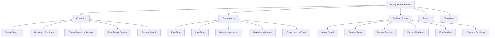

---

# 1. Concepts

## 1.1 Binary Search Core Idea

Binary search repeatedly halves a search space.

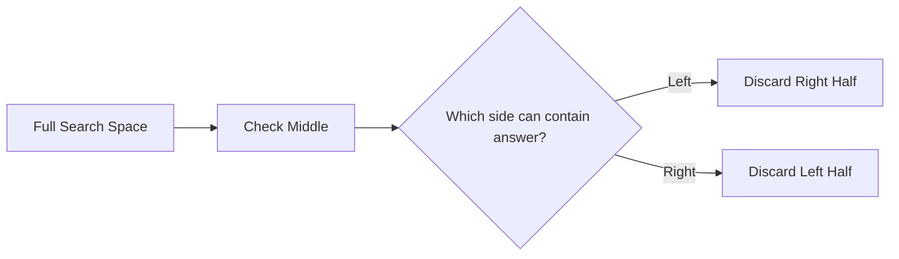

### Safe Middle

```cpp
long long mid = lo + (hi - lo) / 2;
```

Avoid:

```cpp
long long mid = (lo + hi) / 2; // can overflow
```

---

## 1.2 Monotonic Predicate

Binary search works when the answer space has one clean transition.

### First True Shape

```text
false false false true true true
```

### Last True Shape

```text
true true true false false false
```

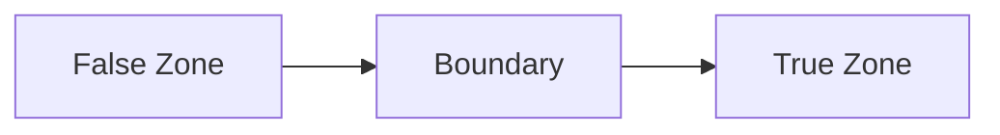

The real question:

```text
Can I write check(mid) so that the result is monotonic?
```

---

## 1.3 First True Pattern

Use when:

```text
false false false true true true
```

Goal:

```text
Find first true.
```

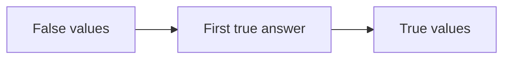

### C++

```cpp
long long firstTrue(long long lo, long long hi) {
    long long ans = hi + 1;

    while (lo <= hi) {
        long long mid = lo + (hi - lo) / 2;

        if (check(mid)) {
            ans = mid;
            hi = mid - 1;
        } else {
            lo = mid + 1;
        }
    }

    return ans;
}
```

---

## 1.4 Last True Pattern

Use when:

```text
true true true false false false
```

Goal:

```text
Find last true.
```

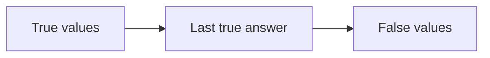

### C++

```cpp
long long lastTrue(long long lo, long long hi) {
    long long ans = lo - 1;

    while (lo <= hi) {
        long long mid = lo + (hi - lo) / 2;

        if (check(mid)) {
            ans = mid;
            lo = mid + 1;
        } else {
            hi = mid - 1;
        }
    }

    return ans;
}
```

---

## 1.5 Lower Bound and Upper Bound

### `lower_bound`

First element greater than or equal to `x`.

```cpp
auto it = lower_bound(v.begin(), v.end(), x);
```

### `upper_bound`

First element greater than `x`.

```cpp
auto it = upper_bound(v.begin(), v.end(), x);
```

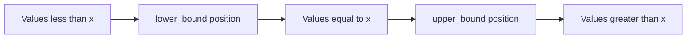

### Useful Counts

```cpp
int lessThanX = lower_bound(v.begin(), v.end(), x) - v.begin();
int lessOrEqualX = upper_bound(v.begin(), v.end(), x) - v.begin();
int equalX = upper_bound(v.begin(), v.end(), x) - lower_bound(v.begin(), v.end(), x);
```

---

## 1.6 Binary Search on Answer

Instead of searching an index, search the answer value.

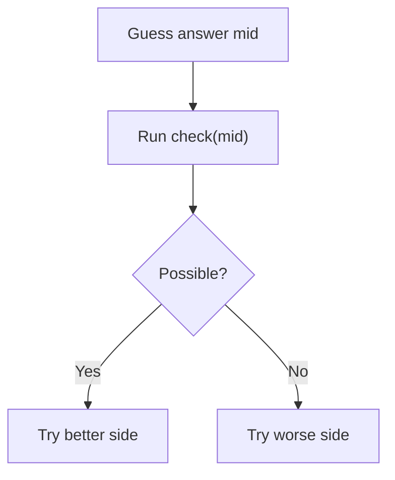

Common phrases:

```text
minimize maximum
maximize minimum
minimum time
maximum distance
kth smallest
can complete within X
```

---

## 1.7 Real Binary Search

For decimal answers, do not use `mid + 1` or `mid - 1`.

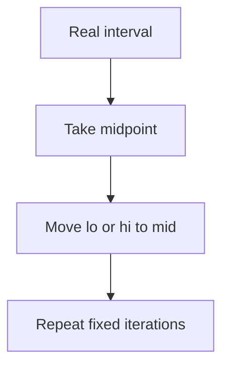

### C++

```cpp
long double realBinarySearch(long double lo, long double hi) {
    for (int it = 0; it < 100; it++) {
        long double mid = (lo + hi) / 2;

        if (check(mid)) {
            hi = mid;
        } else {
            lo = mid;
        }
    }

    return (lo + hi) / 2;
}
```

---

## 1.8 Ternary Search

Use when the function is unimodal:

```text
decreases then increases
or
increases then decreases
```

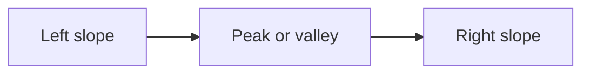

### C++

```cpp
long double ternarySearch(long double lo, long double hi) {
    for (int it = 0; it < 200; it++) {
        long double m1 = lo + (hi - lo) / 3;
        long double m2 = hi - (hi - lo) / 3;

        if (f(m1) < f(m2)) {
            hi = m2;
        } else {
            lo = m1;
        }
    }

    return f((lo + hi) / 2);
}
```

---

# 2. Frameworks

## 2.1 Classic Sorted Array Framework

Use when input is sorted.

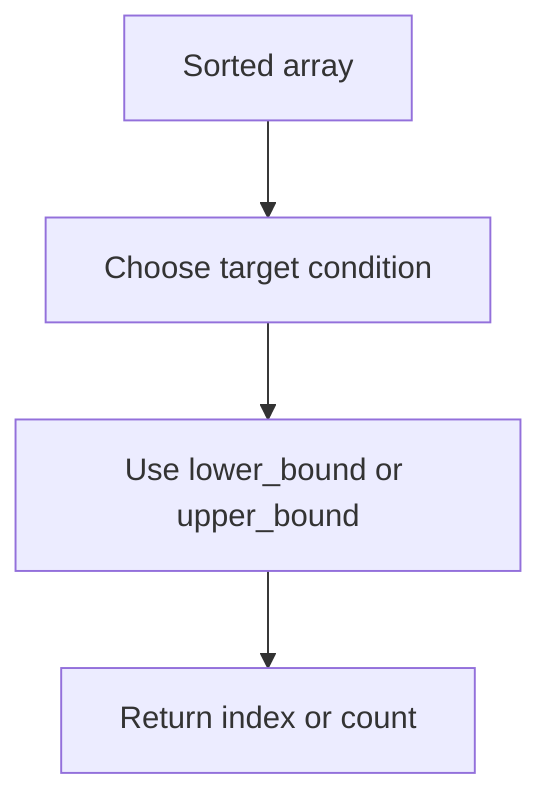

---

## 2.2 Predicate Framework

Use when you can define `check(mid)`.

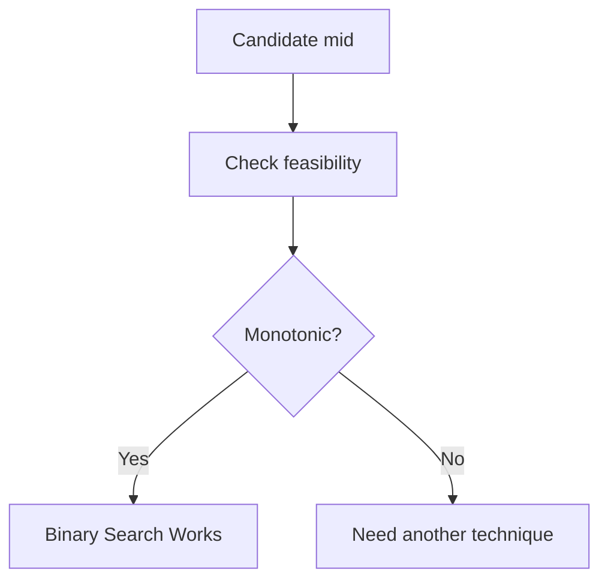

Good `check(mid)` examples:

```text
Can finish in mid time?
Can split with max sum <= mid?
Can place all cows with distance >= mid?
Are at least k values <= mid?
```

Bad `check(mid)`:

```text
Is mid exactly the answer?
```

---

## 2.3 Minimize Maximum Framework

Used for:

```text
minimize largest group sum
minimum maximum distance
minimum possible time
```

Pattern:

```text
If mid works, bigger also works.
Find first true.
```

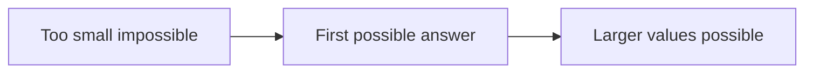

### Template

```cpp
long long minimizeMaximum(long long lo, long long hi) {
    long long ans = hi;

    while (lo <= hi) {
        long long mid = lo + (hi - lo) / 2;

        if (check(mid)) {
            ans = mid;
            hi = mid - 1;
        } else {
            lo = mid + 1;
        }
    }

    return ans;
}
```

---

## 2.4 Maximize Minimum Framework

Used for:

```text
maximize minimum distance
maximize minimum value
maximize threshold
```

Pattern:

```text
If mid works, smaller also works.
Find last true.
```

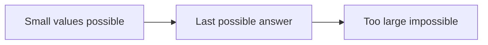

### Template

```cpp
long long maximizeMinimum(long long lo, long long hi) {
    long long ans = lo;

    while (lo <= hi) {
        long long mid = lo + (hi - lo) / 2;

        if (check(mid)) {
            ans = mid;
            lo = mid + 1;
        } else {
            hi = mid - 1;
        }
    }

    return ans;
}
```

---

## 2.5 Kth Smallest Counting Framework

Used when all values are too many to generate.

```text
Guess x.
Count how many values are <= x.
If count >= k, x may be answer.
```

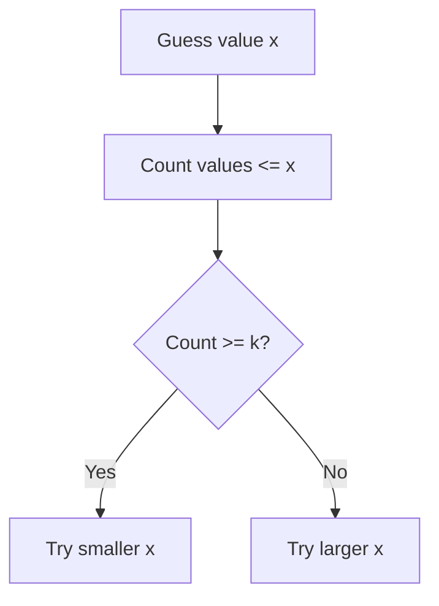

---

## 2.6 Binary Search Per Start Framework

Used when each starting index has a farthest valid end.

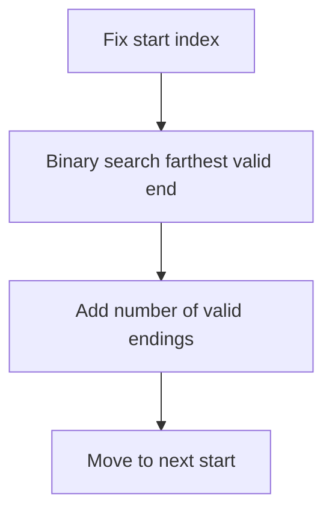

Often can be optimized with two pointers, but binary search is a useful pattern.

---

# 3. Problem Forms

## 3.1 Search in Sorted Array

### C++

```cpp
int binarySearch(vector<int>& a, int target) {
    int lo = 0;
    int hi = (int)a.size() - 1;

    while (lo <= hi) {
        int mid = lo + (hi - lo) / 2;

        if (a[mid] == target) return mid;
        if (a[mid] < target) lo = mid + 1;
        else hi = mid - 1;
    }

    return -1;
}
```

---

## 3.2 First Greater or Equal

```cpp
int lowerBoundManual(vector<int>& a, int x) {
    int lo = 0;
    int hi = (int)a.size() - 1;
    int ans = (int)a.size();

    while (lo <= hi) {
        int mid = lo + (hi - lo) / 2;

        if (a[mid] >= x) {
            ans = mid;
            hi = mid - 1;
        } else {
            lo = mid + 1;
        }
    }

    return ans;
}
```

---

## 3.3 Rotated Sorted Array

Find index of minimum element.

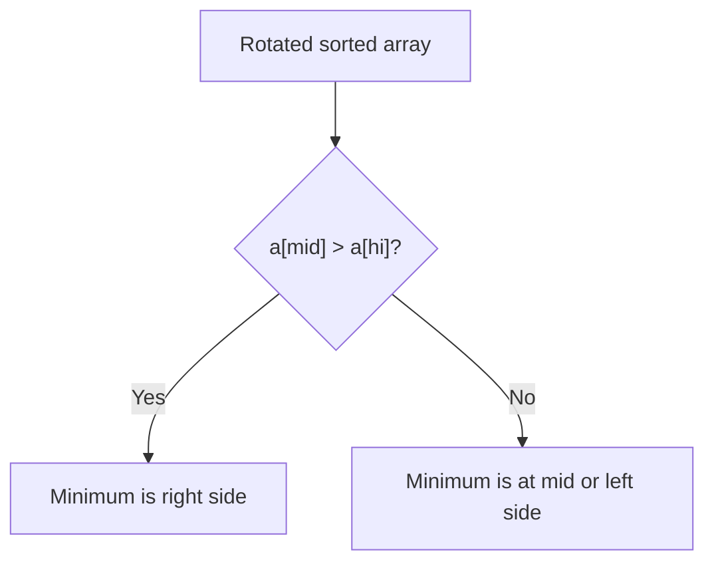

### C++

```cpp
int rotationCount(vector<int>& a) {
    int lo = 0;
    int hi = (int)a.size() - 1;

    while (lo < hi) {
        int mid = lo + (hi - lo) / 2;

        if (a[mid] > a[hi]) {
            lo = mid + 1;
        } else {
            hi = mid;
        }
    }

    return lo;
}
```

---

## 3.4 Peak in Bitonic Array

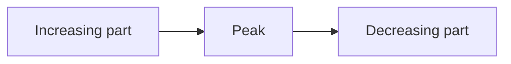

### C++

```cpp
int findPeak(vector<int>& a) {
    int lo = 0;
    int hi = (int)a.size() - 1;

    while (lo < hi) {
        int mid = lo + (hi - lo) / 2;

        if (a[mid] > a[mid + 1]) {
            hi = mid;
        } else {
            lo = mid + 1;
        }
    }

    return lo;
}
```

---

## 3.5 Painter Partition

Problem:

```text
Split array into k continuous groups.
Minimize maximum group sum.
```

Search range:

```text
lo = max element
hi = total sum
```

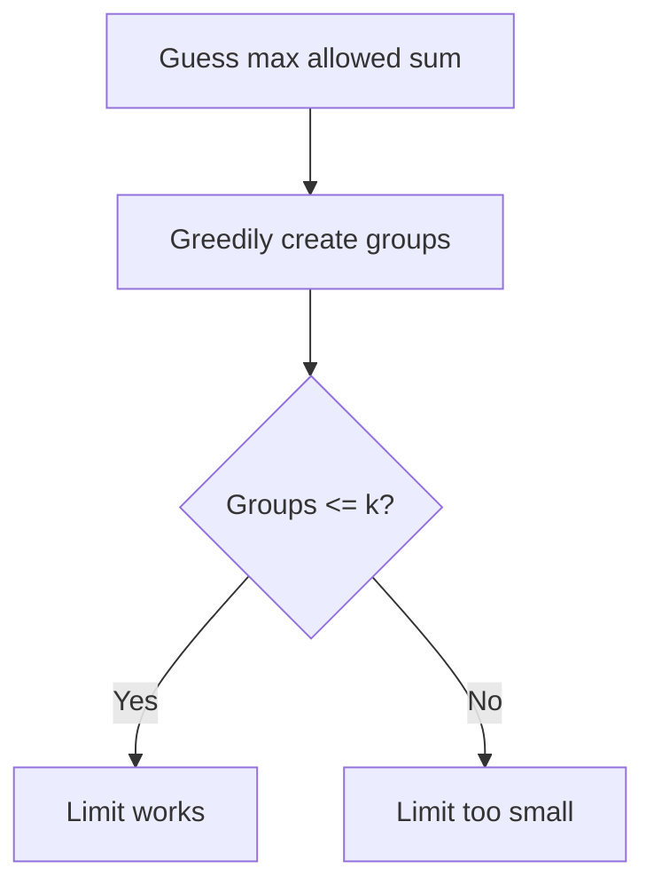

### C++

```cpp
bool canSplit(const vector<int>& a, int k, long long limit) {
    int groups = 1;
    long long current = 0;

    for (int x : a) {
        if (x > limit) return false;

        if (current + x <= limit) {
            current += x;
        } else {
            groups++;
            current = x;
        }
    }

    return groups <= k;
}

long long splitArrayLargestSum(vector<int>& a, int k) {
    long long lo = 0;
    long long hi = 0;

    for (int x : a) {
        lo = max(lo, (long long)x);
        hi += x;
    }

    long long ans = hi;

    while (lo <= hi) {
        long long mid = lo + (hi - lo) / 2;

        if (canSplit(a, k, mid)) {
            ans = mid;
            hi = mid - 1;
        } else {
            lo = mid + 1;
        }
    }

    return ans;
}
```

---

## 3.6 Factory Machines

Problem:

```text
Each machine makes one product in machine[i] time.
Find minimum time to make target products.
```

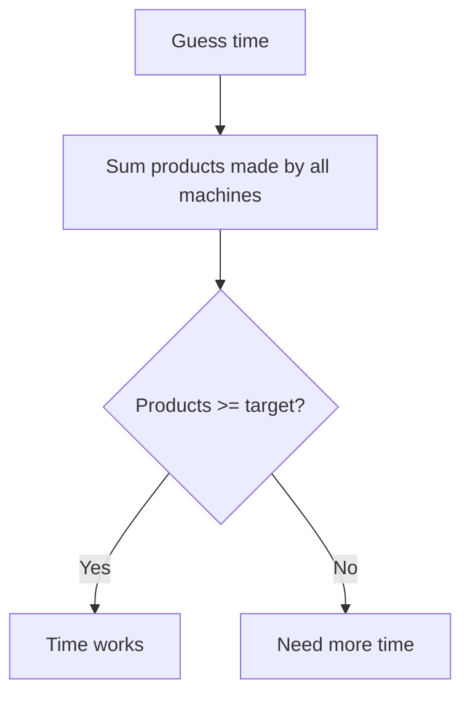

### C++

```cpp
bool canMake(const vector<long long>& machines, long long target, long long time) {
    long long made = 0;

    for (long long m : machines) {
        made += time / m;
        if (made >= target) return true;
    }

    return false;
}

long long minFactoryTime(vector<long long>& machines, long long target) {
    long long lo = 0;
    long long hi = *min_element(machines.begin(), machines.end()) * target;
    long long ans = hi;

    while (lo <= hi) {
        long long mid = lo + (hi - lo) / 2;

        if (canMake(machines, target, mid)) {
            ans = mid;
            hi = mid - 1;
        } else {
            lo = mid + 1;
        }
    }

    return ans;
}
```

---

## 3.7 Aggressive Cows

Problem:

```text
Place k cows in positions.
Maximize minimum distance.
```

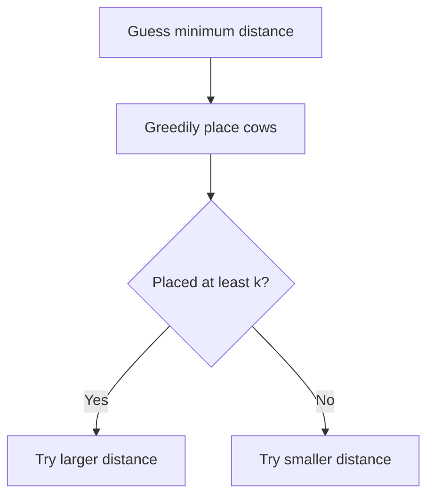

### C++

```cpp
bool canPlace(vector<long long>& pos, int k, long long dist) {
    int placed = 1;
    long long last = pos[0];

    for (int i = 1; i < (int)pos.size(); i++) {
        if (pos[i] - last >= dist) {
            placed++;
            last = pos[i];
        }
    }

    return placed >= k;
}

long long aggressiveCows(vector<long long>& pos, int k) {
    sort(pos.begin(), pos.end());

    long long lo = 0;
    long long hi = pos.back() - pos.front();
    long long ans = 0;

    while (lo <= hi) {
        long long mid = lo + (hi - lo) / 2;

        if (canPlace(pos, k, mid)) {
            ans = mid;
            lo = mid + 1;
        } else {
            hi = mid - 1;
        }
    }

    return ans;
}
```

---

## 3.8 Minimize Maximum Gap

Problem:

```text
Given sorted positions.
Add at most k new points.
Minimize maximum adjacent gap.
```

For gap `d` and maximum allowed gap `x`:

```text
needed points = ceil(d / x) - 1
```

Integer formula:

```cpp
needed += (d + x - 1) / x - 1;
```

### C++

```cpp
bool canLimitGap(vector<long long>& pos, long long k, long long x) {
    long long need = 0;

    for (int i = 1; i < (int)pos.size(); i++) {
        long long d = pos[i] - pos[i - 1];
        need += (d + x - 1) / x - 1;
        if (need > k) return false;
    }

    return need <= k;
}

long long minimizeMaxGap(vector<long long>& pos, long long k) {
    sort(pos.begin(), pos.end());

    long long lo = 1;
    long long hi = 0;

    for (int i = 1; i < (int)pos.size(); i++) {
        hi = max(hi, pos[i] - pos[i - 1]);
    }

    long long ans = hi;

    while (lo <= hi) {
        long long mid = lo + (hi - lo) / 2;

        if (canLimitGap(pos, k, mid)) {
            ans = mid;
            hi = mid - 1;
        } else {
            lo = mid + 1;
        }
    }

    return ans;
}
```

---

## 3.9 Kth Pair Sum

Problem:

```text
Given arrays A and B.
Find kth smallest value among all A[i] + B[j].
```

Do not generate all pairs.

```mermaid
flowchart TD
    A["Guess sum x"] --> B["For each A value"]
    B --> C["Count B values <= x minus A value"]
    C --> D{"Count >= k?"}
    D -->|"Yes"| E["Try smaller x"]
    D -->|"No"| F["Try larger x"]
```

### C++

```cpp
long long countPairsLE(const vector<long long>& A, const vector<long long>& B, long long x) {
    long long count = 0;

    for (long long a : A) {
        count += upper_bound(B.begin(), B.end(), x - a) - B.begin();
    }

    return count;
}

long long kthPairSum(vector<long long> A, vector<long long> B, long long k) {
    sort(A.begin(), A.end());
    sort(B.begin(), B.end());

    if (A.size() > B.size()) swap(A, B);

    long long lo = A.front() + B.front();
    long long hi = A.back() + B.back();
    long long ans = hi;

    while (lo <= hi) {
        long long mid = lo + (hi - lo) / 2;

        if (countPairsLE(A, B, mid) >= k) {
            ans = mid;
            hi = mid - 1;
        } else {
            lo = mid + 1;
        }
    }

    return ans;
}
```

---

## 3.10 Kth in Multiplication Table

Problem:

```text
Find kth smallest in n by m multiplication table.
```

For guessed `x`, row `i` has:

```text
min(m, x / i)
```

values less than or equal to `x`.

### C++

```cpp
long long countLEInTable(long long n, long long m, long long x) {
    long long count = 0;

    for (long long i = 1; i <= n; i++) {
        count += min(m, x / i);
    }

    return count;
}

long long kthInMultiplicationTable(long long n, long long m, long long k) {
    long long lo = 1;
    long long hi = n * m;
    long long ans = hi;

    while (lo <= hi) {
        long long mid = lo + (hi - lo) / 2;

        if (countLEInTable(n, m, mid) >= k) {
            ans = mid;
            hi = mid - 1;
        } else {
            lo = mid + 1;
        }
    }

    return ans;
}
```

---

## 3.11 Subarray Problems

### Largest window after at most k flips

Guess length and check using prefix count.

```mermaid
flowchart TD
    A["Guess length"] --> B["Check every window"]
    B --> C["Use prefix zero count"]
    C --> D{"Any window valid?"}
```

### C++

```cpp
bool canMakeOnes(const vector<int>& a, int k, int len) {
    int n = (int)a.size();
    vector<int> pref(n + 1, 0);

    for (int i = 0; i < n; i++) {
        pref[i + 1] = pref[i] + (a[i] == 0);
    }

    for (int l = 0; l + len <= n; l++) {
        int r = l + len;
        int zeros = pref[r] - pref[l];

        if (zeros <= k) return true;
    }

    return false;
}

int maxOnesAfterFlips(vector<int>& a, int k) {
    int lo = 0;
    int hi = (int)a.size();
    int ans = 0;

    while (lo <= hi) {
        int mid = lo + (hi - lo) / 2;

        if (canMakeOnes(a, k, mid)) {
            ans = mid;
            lo = mid + 1;
        } else {
            hi = mid - 1;
        }
    }

    return ans;
}
```

---

## 3.12 Cube Sum Check

Problem:

```text
Check if x = a^3 + b^3
```

Use binary search for cube root.

### C++

```cpp
using ll = long long;

ll cubeRootFloor(ll x) {
    ll lo = 1;
    ll hi = 1000000;
    ll ans = 0;

    while (lo <= hi) {
        ll mid = lo + (hi - lo) / 2;

        if (mid <= x / mid / mid) {
            ans = mid;
            lo = mid + 1;
        } else {
            hi = mid - 1;
        }
    }

    return ans;
}

bool isCubeSum(ll x) {
    for (ll a = 1; a * a * a < x; a++) {
        ll rem = x - a * a * a;
        ll b = cubeRootFloor(rem);

        if (b > 0 && b * b * b == rem) {
            return true;
        }
    }

    return false;
}
```

---

# 4. Tactics

## 4.1 Pattern Recognition Table

| Problem clue | Use |
|---|---|
| sorted array | classic binary search |
| first value greater or equal | lower bound |
| first value greater | upper bound |
| minimize maximum | first true |
| maximize minimum | last true |
| minimum time | binary search on answer |
| kth smallest from implicit values | count less or equal |
| place items with spacing | greedy check |
| split array into groups | greedy check |
| decimal answer | real binary search |
| hill or valley function | ternary search |

---

## 4.2 Search Range Tactics

| Problem | Low | High |
|---|---:|---:|
| Painter partition | max element | total sum |
| Factory machines | 0 | fastest machine times target |
| Aggressive cows | 0 | max position minus min position |
| Kth pair sum | min A plus min B | max A plus max B |
| Multiplication table | 1 | n times m |
| Minimize max gap | 1 | maximum existing gap |

---

## 4.3 Check Function Tactics

A good check function answers:

```text
Can candidate mid satisfy the condition?
```

Examples:

```text
Can finish in mid time?
Can split with max sum mid?
Can place k cows with distance mid?
Are at least k values <= mid?
```

---

## 4.4 Overflow Tactics

Use:

```cpp
long long mid = lo + (hi - lo) / 2;
```

For multiplication checks:

```cpp
if (mid <= x / mid / mid)
```

instead of:

```cpp
if (mid * mid * mid <= x)
```

---

## 4.5 Infinite Loop Tactics

Integer binary search must shrink:

```cpp
lo = mid + 1;
hi = mid - 1;
```

Do not do this in integer search:

```cpp
lo = mid;
hi = mid;
```

unless using a carefully designed half-open interval.

---

## 4.6 Real Search Tactics

Use fixed iterations:

```cpp
for (int it = 0; it < 100; it++)
```

This is often safer than EPS.

---

# 5. Common Mistakes

```mermaid
flowchart TD
    A["Common Binary Search Mistakes"] --> B["Bad check function"]
    A --> C["Non-monotonic predicate"]
    A --> D["Wrong boundary movement"]
    A --> E["Overflow in mid"]
    A --> F["Overflow in multiplication"]
    A --> G["Wrong low and high"]
    A --> H["Using binary search when ternary is needed"]
```

## Mistake 1: Checking exact answer

Bad:

```cpp
bool check(long long mid) {
    return mid == answer;
}
```

Good:

```cpp
bool check(long long mid) {
    return answer <= mid;
}
```

---

## Mistake 2: Wrong template direction

For minimize answer:

```text
first true
```

For maximize answer:

```text
last true
```

---

## Mistake 3: Bad bounds

If answer is outside `[lo, hi]`, binary search will fail.

---

# 6. C++ Template Library

## 6.1 First True

```cpp
long long firstTrue(long long lo, long long hi) {
    long long ans = hi + 1;

    while (lo <= hi) {
        long long mid = lo + (hi - lo) / 2;

        if (check(mid)) {
            ans = mid;
            hi = mid - 1;
        } else {
            lo = mid + 1;
        }
    }

    return ans;
}
```

---

## 6.2 Last True

```cpp
long long lastTrue(long long lo, long long hi) {
    long long ans = lo - 1;

    while (lo <= hi) {
        long long mid = lo + (hi - lo) / 2;

        if (check(mid)) {
            ans = mid;
            lo = mid + 1;
        } else {
            hi = mid - 1;
        }
    }

    return ans;
}
```

---

## 6.3 Half-Open Lower Bound

```cpp
int lowerBound(vector<int>& a, int x) {
    int lo = 0;
    int hi = (int)a.size();

    while (lo < hi) {
        int mid = lo + (hi - lo) / 2;

        if (a[mid] >= x) {
            hi = mid;
        } else {
            lo = mid + 1;
        }
    }

    return lo;
}
```

---

## 6.4 Half-Open Upper Bound

```cpp
int upperBound(vector<int>& a, int x) {
    int lo = 0;
    int hi = (int)a.size();

    while (lo < hi) {
        int mid = lo + (hi - lo) / 2;

        if (a[mid] > x) {
            hi = mid;
        } else {
            lo = mid + 1;
        }
    }

    return lo;
}
```

---

## 6.5 Real Binary Search

```cpp
long double realBinarySearch(long double lo, long double hi) {
    for (int it = 0; it < 100; it++) {
        long double mid = (lo + hi) / 2;

        if (check(mid)) {
            hi = mid;
        } else {
            lo = mid;
        }
    }

    return (lo + hi) / 2;
}
```

---

## 6.6 Integer Ternary Search

```cpp
long long integerTernarySearch(long long lo, long long hi) {
    while (hi - lo > 3) {
        long long m1 = lo + (hi - lo) / 3;
        long long m2 = hi - (hi - lo) / 3;

        if (f(m1) < f(m2)) {
            hi = m2;
        } else {
            lo = m1;
        }
    }

    long long ans = f(lo);

    for (long long x = lo; x <= hi; x++) {
        ans = min(ans, f(x));
    }

    return ans;
}
```

---

# 7. Final Checklist

Before coding binary search, ask:

```text
1. What exactly is the answer?
2. Can I guess the answer?
3. What is the minimum possible answer?
4. What is the maximum possible answer?
5. Can I write check(mid)?
6. Is check(mid) monotonic?
7. Is it first true or last true?
8. Do I need integer or real binary search?
9. Can multiplication overflow?
10. Are boundaries shrinking every loop?
```

---

# Final Memory Hook

```mermaid
flowchart TD
    A["Binary Search"] --> B["Guess"]
    B --> C["Check"]
    C --> D["Monotonic"]
    D --> E["Shrink"]
    E --> F["Answer"]
```

```text
Binary search is not about sorted arrays only.

It is about a monotonic decision:
    NO NO NO YES YES
or
    YES YES YES NO NO

The loop is easy.
The check function is the real problem.
```
