# Bitwise & Bit Manipulation Problem Solving Playbook

> A structured competitive-programming guide for solving **Bitwise**, **Bit Manipulation**, **Bitmasking**, **XOR**, **AND**, **OR**, and **bit contribution** problems.
>
> Goal: recognize the bit pattern, choose the right framework, and reduce brute force using bit-level reasoning.

---

# Clickable Index

- [0. Master Map](#0-master-map)
- [1. Concepts](#1-concepts)
  - [1.1 Binary Representation](#11-binary-representation)
  - [1.2 Bit Operators](#12-bit-operators)
  - [1.3 Shift Operators](#13-shift-operators)
  - [1.4 Bit Check Set Clear Toggle](#14-bit-check-set-clear-toggle)
  - [1.5 Common Bit Tricks](#15-common-bit-tricks)
  - [1.6 Bitmask as Set](#16-bitmask-as-set)
  - [1.7 Bit Contribution](#17-bit-contribution)
  - [1.8 Prefix XOR](#18-prefix-xor)
  - [1.9 Bit Cycles](#19-bit-cycles)
  - [1.10 Binary Trie](#110-binary-trie)
- [2. Frameworks](#2-frameworks)
  - [2.1 Pattern Selection Framework](#21-pattern-selection-framework)
  - [2.2 Bitmask Set Framework](#22-bitmask-set-framework)
  - [2.3 Per-Bit Contribution Framework](#23-per-bit-contribution-framework)
  - [2.4 Prefix XOR Framework](#24-prefix-xor-framework)
  - [2.5 High-to-Low Greedy Framework](#25-high-to-low-greedy-framework)
  - [2.6 Bit Count Prefix Framework](#26-bit-count-prefix-framework)
  - [2.7 XOR Trie Framework](#27-xor-trie-framework)
  - [2.8 Operation Decoding Framework](#28-operation-decoding-framework)
- [3. Problem Forms](#3-problem-forms)
  - [3.1 Generate All Subsets](#31-generate-all-subsets)
  - [3.2 Submask Enumeration](#32-submask-enumeration)
  - [3.3 Power of Two Check](#33-power-of-two-check)
  - [3.4 Single Number Using XOR](#34-single-number-using-xor)
  - [3.5 Two Single Numbers](#35-two-single-numbers)
  - [3.6 Count Set Bits](#36-count-set-bits)
  - [3.7 Count Ones at Bit from 0 to X](#37-count-ones-at-bit-from-0-to-x)
  - [3.8 Sum of Pair XOR](#38-sum-of-pair-xor)
  - [3.9 Sum of Pair AND](#39-sum-of-pair-and)
  - [3.10 Sum of Pair OR](#310-sum-of-pair-or)
  - [3.11 Range XOR Query](#311-range-xor-query)
  - [3.12 Subarray XOR Equals K](#312-subarray-xor-equals-k)
  - [3.13 Maximum XOR Pair](#313-maximum-xor-pair)
  - [3.14 Maximum AND of K Numbers](#314-maximum-and-of-k-numbers)
  - [3.15 Maximize Sum of Squares from Bit Counts](#315-maximize-sum-of-squares-from-bit-counts)
  - [3.16 Range Bit Count Queries](#316-range-bit-count-queries)
  - [3.17 Bitmask DP](#317-bitmask-dp)
  - [3.18 SOS DP](#318-sos-dp)
  - [3.19 Gray Code](#319-gray-code)
  - [3.20 C++ bitset](#320-c-bitset)
- [4. Tactics](#4-tactics)
  - [4.1 Pattern Recognition Table](#41-pattern-recognition-table)
  - [4.2 Operator Meaning Table](#42-operator-meaning-table)
  - [4.3 Contribution Formula Table](#43-contribution-formula-table)
  - [4.4 High Bit Tactics](#44-high-bit-tactics)
  - [4.5 Overflow and Shift Tactics](#45-overflow-and-shift-tactics)
  - [4.6 Operator Precedence Tactics](#46-operator-precedence-tactics)
  - [4.7 Negative Number Tactics](#47-negative-number-tactics)
  - [4.8 When Bitwise Fails](#48-when-bitwise-fails)
- [5. C++ Template Library](#5-c-template-library)
- [6. Final Checklist](#6-final-checklist)
- [7. Memory Hooks](#7-memory-hooks)

---

# 0. Master Map

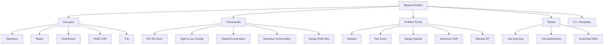

---

# 1. Concepts

## 1.1 Binary Representation

Every integer is stored as bits.

Example:

```text
13 decimal = 1101 binary
```

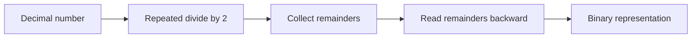

### C++

```cpp
string toBinary(long long x) {
    if (x == 0) return "0";

    string s;
    while (x > 0) {
        s.push_back(char('0' + (x % 2)));
        x /= 2;
    }

    reverse(s.begin(), s.end());
    return s;
}
```

---

## 1.2 Bit Operators

| Operator | Meaning | Bit behavior |
|---|---|---|
| `&` | AND | `1` only if both bits are `1` |
| `|` | OR | `1` if at least one bit is `1` |
| `^` | XOR | `1` if bits are different |
| `~` | NOT | flips bits |
| `<<` | left shift | multiply by power of two |
| `>>` | right shift | divide by power of two |

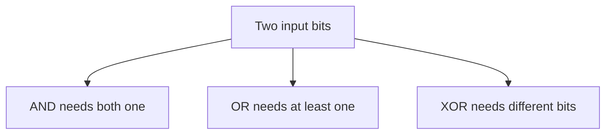

---

## 1.3 Shift Operators

Left shift:

```text
x << k = x * 2^k
```

Right shift:

```text
x >> k = floor(x / 2^k)
```

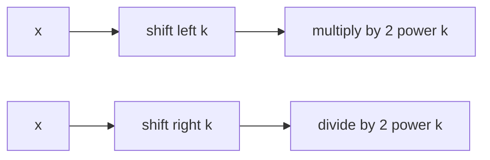

### C++

```cpp
long long powerOfTwo(int k) {
    return 1LL << k;
}
```

Important:

```cpp
long long x = 1LL << 40; // good
int bad = 1 << 31;       // risky
```

---

## 1.4 Bit Check Set Clear Toggle

For bit position `pos`, create mask:

```cpp
1LL << pos
```

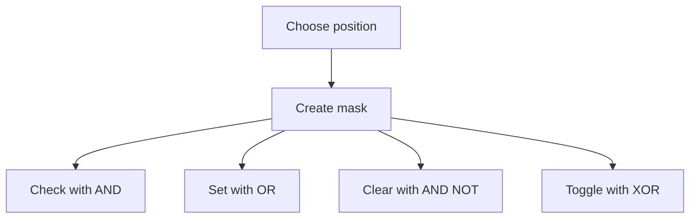

### C++

```cpp
bool isSet(long long x, int pos) {
    return ((x >> pos) & 1LL) != 0;
}

long long setBit(long long x, int pos) {
    return x | (1LL << pos);
}

long long clearBit(long long x, int pos) {
    return x & ~(1LL << pos);
}

long long toggleBit(long long x, int pos) {
    return x ^ (1LL << pos);
}
```

---

## 1.5 Common Bit Tricks

| Trick | Meaning |
|---|---|
| `x & (x - 1)` | removes lowest set bit |
| `x & -x` | gets lowest set bit |
| `x | (x - 1)` | sets all bits below lowest set bit |
| `x ^ x = 0` | same values cancel |
| `x ^ 0 = x` | zero does nothing |
| `x & 0 = 0` | AND with zero clears |
| `x | 0 = x` | OR with zero unchanged |

### Power of two

```cpp
bool isPowerOfTwo(long long x) {
    return x > 0 && (x & (x - 1)) == 0;
}
```

### Count set bits

```cpp
int popcount(long long x) {
    return __builtin_popcountll(x);
}
```

### Lowest set bit

```cpp
long long lowbit(long long x) {
    return x & -x;
}
```

---

## 1.6 Bitmask as Set

A mask represents a subset.

```text
bit 0 = element 0 chosen or not
bit 1 = element 1 chosen or not
bit 2 = element 2 chosen or not
```

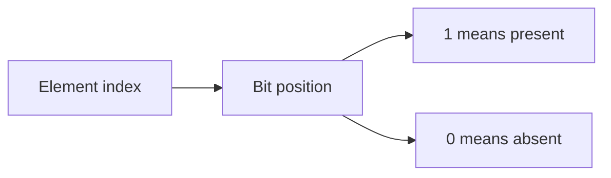

Set operations:

| Set operation | Bit operation |
|---|---|
| union | OR |
| intersection | AND |
| toggle membership | XOR |
| complement inside universe | XOR with full mask |

---

## 1.7 Bit Contribution

For pair or subarray bitwise sums, compute each bit independently.

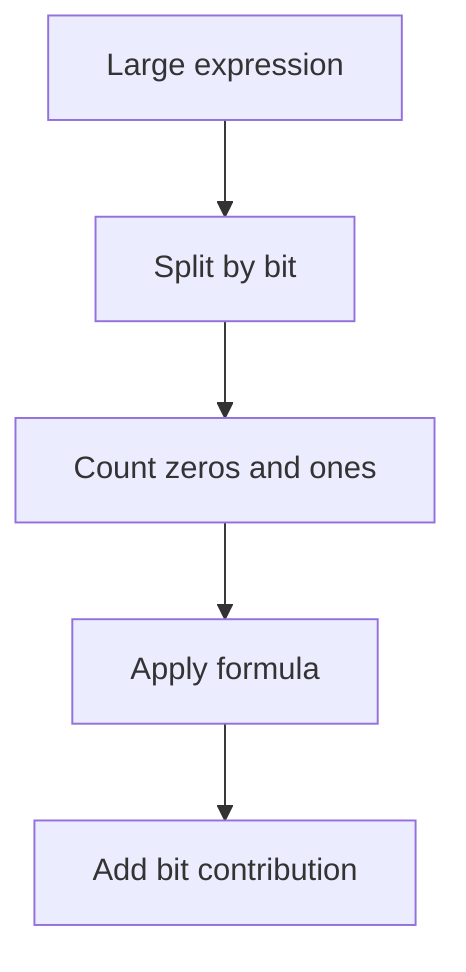

This avoids `O(n^2)` pair enumeration.

---

## 1.8 Prefix XOR

XOR has cancellation:

```text
x ^ x = 0
```

So prefix XOR works like prefix sum for XOR queries.

```text
xor(l, r) = px[r + 1] ^ px[l]
```

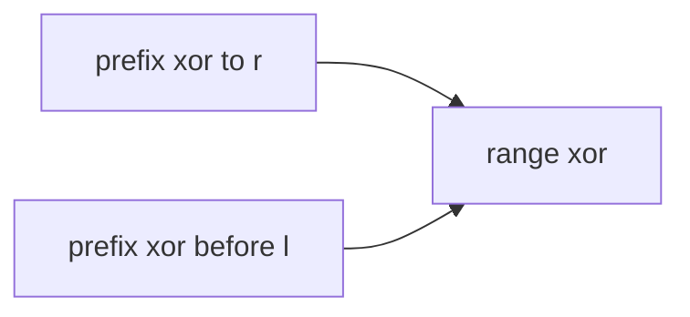

---

## 1.9 Bit Cycles

For bit `i` from numbers `0` to `x`:

```text
zeros repeat for 2^i numbers
ones repeat for 2^i numbers
cycle length = 2^(i + 1)
```

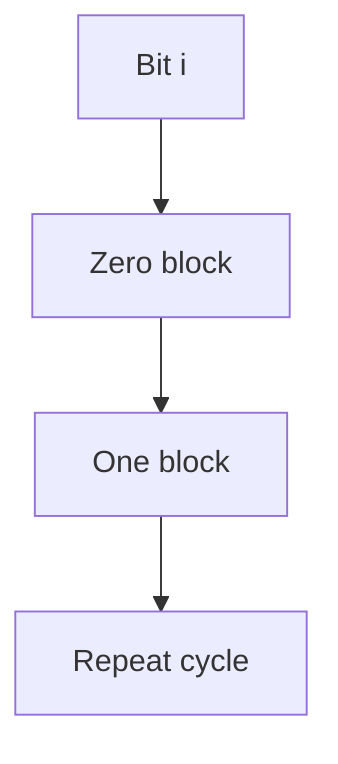

Useful for:
- count total set bits from `0` to `x`
- kth one in binary sequence
- digit DP-like bit counting

---

## 1.10 Binary Trie

A binary trie stores numbers by bits.

Used for:
- maximum XOR pair
- maximum XOR with query
- prefix XOR max subarray
- XOR constraints

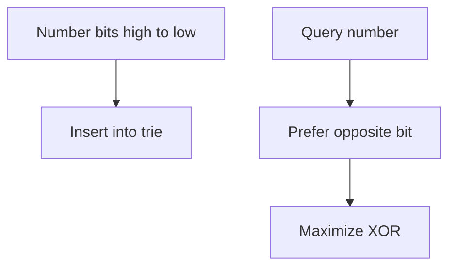

---

# 2. Frameworks

## 2.1 Pattern Selection Framework

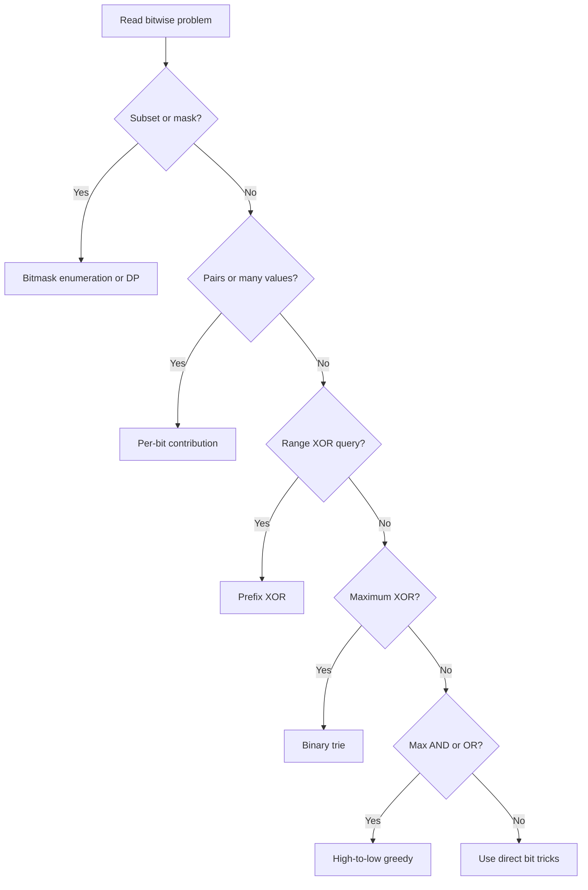

---

## 2.2 Bitmask Set Framework

Use when `n` is small, usually:

```text
n <= 20 to 25
```

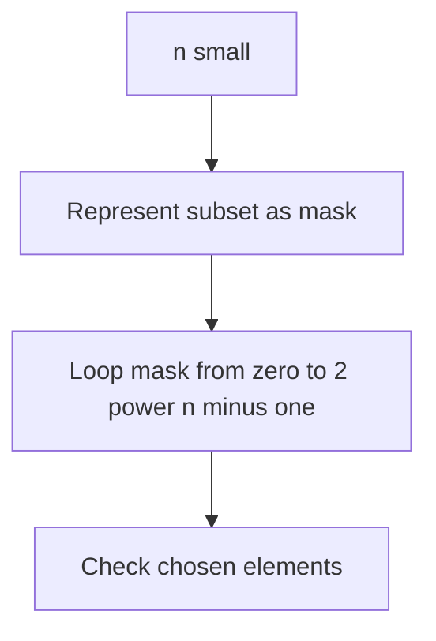

Common complexities:

| n | Subsets |
|---:|---:|
| 20 | about 1,000,000 |
| 25 | about 33,000,000 |
| 30 | too many for full enumeration |

---

## 2.3 Per-Bit Contribution Framework

Use when expression is across many pairs or many elements.

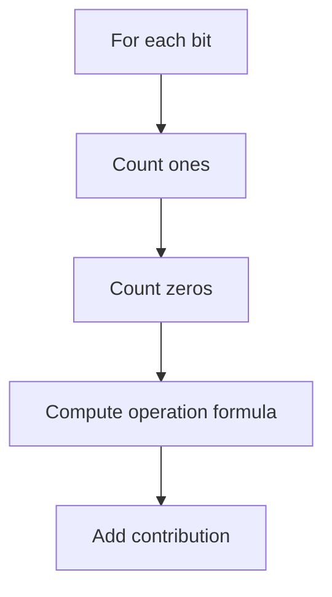

Works for:
- sum of pair XOR
- sum of pair AND
- sum of pair OR
- Hamming distance
- bitwise contribution to answer

---

## 2.4 Prefix XOR Framework

Use when subarray XOR is involved.

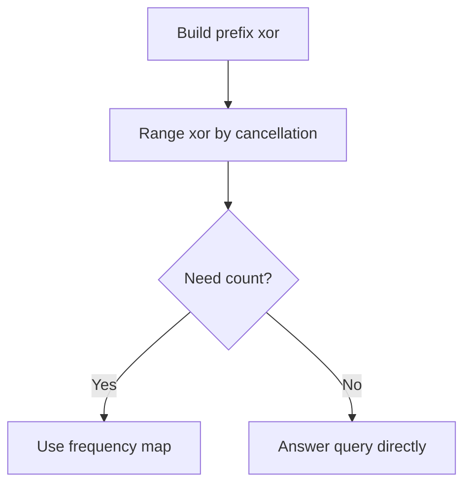

Patterns:
- range XOR query
- count subarrays with XOR `k`
- max subarray XOR with trie
- XOR zero subarrays

---

## 2.5 High-to-Low Greedy Framework

Use when maximizing a bitwise answer.

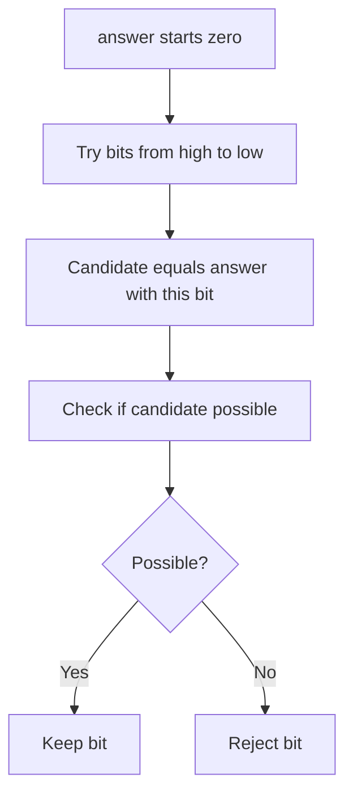

Works for:
- maximum AND of `k` numbers
- maximum XOR feasibility
- maximum OR under constraints
- bitwise construction problems

---

## 2.6 Bit Count Prefix Framework

For range queries about bits, store prefix count for every bit.

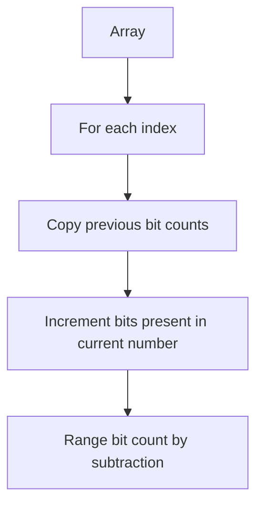

Can answer:
- how many numbers in range have bit `b`
- range AND
- range OR
- range bit contribution

---

## 2.7 XOR Trie Framework

Use when each query asks for best XOR partner.

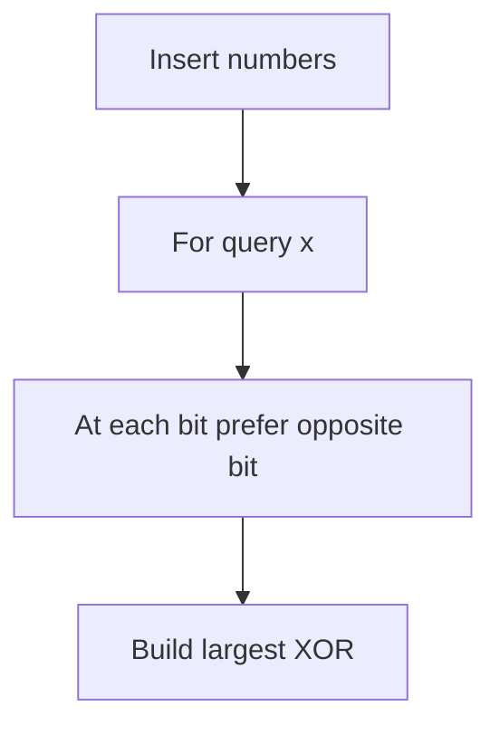

Complexity:

```text
insert: O(bits)
query: O(bits)
```

---

## 2.8 Operation Decoding Framework

Some operations preserve bit counts or total values.

Example identity:

```text
a + b = (a | b) + (a & b)
```

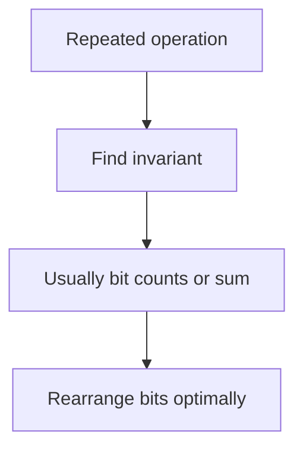

Use this when problem describes weird operations like:

```text
replace a and b by a OR b and a AND b
```

---

# 3. Problem Forms

## 3.1 Generate All Subsets

For `n` elements, every mask from `0` to `2^n - 1` represents one subset.

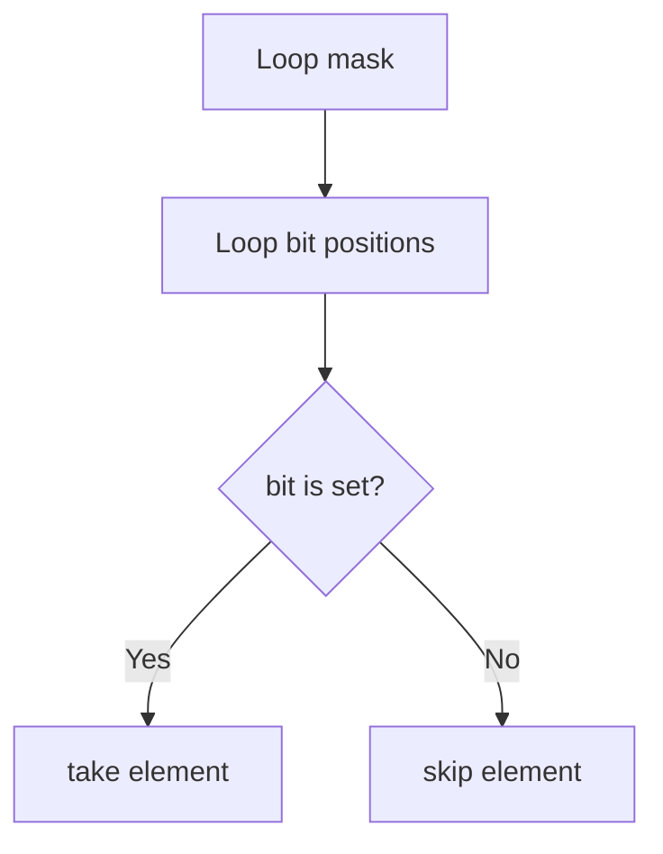

### C++

```cpp
void printAllSubsets(vector<int>& a) {
    int n = a.size();

    for (int mask = 0; mask < (1 << n); mask++) {
        cout << "{ ";

        for (int bit = 0; bit < n; bit++) {
            if ((mask >> bit) & 1) {
                cout << a[bit] << " ";
            }
        }

        cout << "}\n";
    }
}
```

---

## 3.2 Submask Enumeration

Enumerate all submasks of a mask.

```cpp
for (int sub = mask; sub; sub = (sub - 1) & mask) {
    // sub is a non-empty submask of mask
}
```

Include zero if needed:

```cpp
int sub = mask;
while (true) {
    // use sub
    if (sub == 0) break;
    sub = (sub - 1) & mask;
}
```

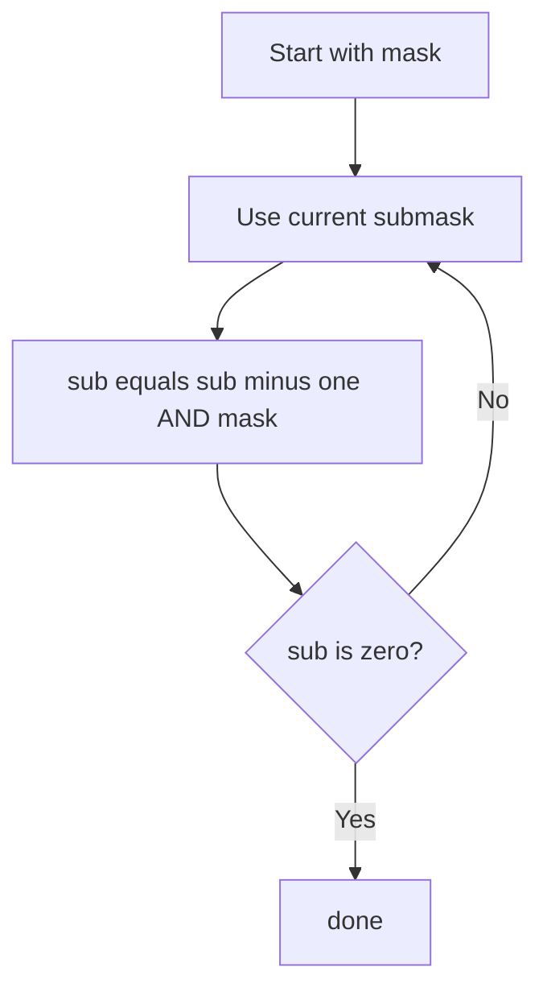

---

## 3.3 Power of Two Check

A power of two has exactly one set bit.

### C++

```cpp
bool isPowerOfTwo(long long x) {
    return x > 0 && (x & (x - 1)) == 0;
}
```

---

## 3.4 Single Number Using XOR

If every number appears twice except one:

```text
x ^ x = 0
0 ^ y = y
```

### C++

```cpp
int singleNumber(vector<int>& a) {
    int ans = 0;

    for (int x : a) {
        ans ^= x;
    }

    return ans;
}
```

---

## 3.5 Two Single Numbers

If every number appears twice except two numbers.

Steps:
1. XOR all numbers to get `x = a ^ b`
2. Pick one set bit from `x`
3. Split numbers into two groups
4. XOR each group

### C++

```cpp
pair<int, int> twoSingleNumbers(vector<int>& a) {
    int xr = 0;
    for (int x : a) xr ^= x;

    int bit = xr & -xr;

    int first = 0;
    int second = 0;

    for (int x : a) {
        if (x & bit) first ^= x;
        else second ^= x;
    }

    return {first, second};
}
```

---

## 3.6 Count Set Bits

### Builtin

```cpp
int countBits(long long x) {
    return __builtin_popcountll(x);
}
```

### Manual

```cpp
int countBitsManual(long long x) {
    int count = 0;

    while (x > 0) {
        x &= (x - 1);
        count++;
    }

    return count;
}
```

---

## 3.7 Count Ones at Bit from 0 to X

For bit `b`:

```text
half = 2^b
cycle = 2^(b + 1)
total = x + 1
ones = fullCycles * half + extra ones in remainder
```

### C++

```cpp
long long countOnesAtBit(long long x, int bit) {
    long long total = x + 1;
    long long half = 1LL << bit;
    long long cycle = 1LL << (bit + 1);

    long long full = total / cycle;
    long long rem = total % cycle;

    return full * half + max(0LL, rem - half);
}
```

### Sum of set bits from `0` to `x`

```cpp
long long totalSetBitsZeroToX(long long x) {
    long long ans = 0;

    for (int bit = 0; bit < 60; bit++) {
        ans += countOnesAtBit(x, bit);
    }

    return ans;
}
```

---

## 3.8 Sum of Pair XOR

For each bit:
- XOR contributes when bits are different
- pairs = `ones * zeros`

### C++

```cpp
long long sumPairXor(vector<int>& a) {
    int n = a.size();
    long long ans = 0;

    for (int bit = 0; bit < 31; bit++) {
        long long ones = 0;

        for (int x : a) {
            if ((x >> bit) & 1) ones++;
        }

        long long zeros = n - ones;
        ans += ones * zeros * (1LL << bit);
    }

    return ans;
}
```

---

## 3.9 Sum of Pair AND

AND contributes when both bits are `1`.

### C++

```cpp
long long sumPairAnd(vector<int>& a) {
    long long ans = 0;

    for (int bit = 0; bit < 31; bit++) {
        long long ones = 0;

        for (int x : a) {
            if ((x >> bit) & 1) ones++;
        }

        ans += ones * (ones - 1) / 2 * (1LL << bit);
    }

    return ans;
}
```

---

## 3.10 Sum of Pair OR

OR contributes when at least one bit is `1`.

### C++

```cpp
long long sumPairOr(vector<int>& a) {
    int n = a.size();
    long long totalPairs = 1LL * n * (n - 1) / 2;
    long long ans = 0;

    for (int bit = 0; bit < 31; bit++) {
        long long ones = 0;

        for (int x : a) {
            if ((x >> bit) & 1) ones++;
        }

        long long zeros = n - ones;
        long long badPairs = zeros * (zeros - 1) / 2;
        long long goodPairs = totalPairs - badPairs;

        ans += goodPairs * (1LL << bit);
    }

    return ans;
}
```

---

## 3.11 Range XOR Query

### C++

```cpp
vector<int> buildPrefixXor(vector<int>& a) {
    int n = a.size();
    vector<int> px(n + 1, 0);

    for (int i = 0; i < n; i++) {
        px[i + 1] = px[i] ^ a[i];
    }

    return px;
}

int rangeXor(vector<int>& px, int l, int r) {
    return px[r + 1] ^ px[l];
}
```

---

## 3.12 Subarray XOR Equals K

Similar to prefix sum equals `k`.

```text
px[r] ^ px[l - 1] = k
px[l - 1] = px[r] ^ k
```

### C++

```cpp
long long countSubarrayXorK(vector<int>& a, int k) {
    unordered_map<int, long long> freq;
    freq[0] = 1;

    int pref = 0;
    long long ans = 0;

    for (int x : a) {
        pref ^= x;
        ans += freq[pref ^ k];
        freq[pref]++;
    }

    return ans;
}
```

---

## 3.13 Maximum XOR Pair

Use binary trie.

### C++

```cpp
struct TrieNode {
    int child[2];

    TrieNode() {
        child[0] = child[1] = -1;
    }
};

struct BinaryTrie {
    vector<TrieNode> trie;

    BinaryTrie() {
        trie.push_back(TrieNode());
    }

    void insert(int x) {
        int node = 0;

        for (int bit = 30; bit >= 0; bit--) {
            int b = (x >> bit) & 1;

            if (trie[node].child[b] == -1) {
                trie[node].child[b] = trie.size();
                trie.push_back(TrieNode());
            }

            node = trie[node].child[b];
        }
    }

    int maxXorWith(int x) {
        int node = 0;
        int ans = 0;

        for (int bit = 30; bit >= 0; bit--) {
            int b = (x >> bit) & 1;
            int want = b ^ 1;

            if (trie[node].child[want] != -1) {
                ans |= (1 << bit);
                node = trie[node].child[want];
            } else {
                node = trie[node].child[b];
            }
        }

        return ans;
    }
};

int maxPairXor(vector<int>& a) {
    BinaryTrie bt;

    for (int x : a) {
        bt.insert(x);
    }

    int ans = 0;
    for (int x : a) {
        ans = max(ans, bt.maxXorWith(x));
    }

    return ans;
}
```

---

## 3.14 Maximum AND of K Numbers

Try high bits first.

### C++

```cpp
long long maxAndAtLeastK(vector<long long>& a, int k) {
    long long ans = 0;

    for (int bit = 60; bit >= 0; bit--) {
        long long candidate = ans | (1LL << bit);

        int count = 0;
        for (long long x : a) {
            if ((x & candidate) == candidate) {
                count++;
            }
        }

        if (count >= k) {
            ans = candidate;
        }
    }

    return ans;
}
```

---

## 3.15 Maximize Sum of Squares from Bit Counts

If operation preserves total bit counts, greedily build large numbers from available bits.

### C++

```cpp
long long maximizeSquareSum(vector<int>& a) {
    vector<int> cnt(31, 0);

    for (int x : a) {
        for (int bit = 0; bit < 31; bit++) {
            if ((x >> bit) & 1) {
                cnt[bit]++;
            }
        }
    }

    long long ans = 0;

    for (int i = 0; i < (int)a.size(); i++) {
        long long x = 0;

        for (int bit = 30; bit >= 0; bit--) {
            if (cnt[bit] > 0) {
                x |= (1LL << bit);
                cnt[bit]--;
            }
        }

        ans += x * x;
    }

    return ans;
}
```

---

## 3.16 Range Bit Count Queries

Build prefix count for every bit.

### C++

```cpp
struct BitPrefix {
    vector<array<int, 31>> pref;

    BitPrefix(vector<int>& a) {
        int n = a.size();
        pref.assign(n + 1, {});

        for (int i = 0; i < n; i++) {
            pref[i + 1] = pref[i];

            for (int bit = 0; bit < 31; bit++) {
                if ((a[i] >> bit) & 1) {
                    pref[i + 1][bit]++;
                }
            }
        }
    }

    int countOnes(int l, int r, int bit) {
        return pref[r + 1][bit] - pref[l][bit];
    }
};
```

---

## 3.17 Bitmask DP

Use when state is subset.

Example:

```text
dp[mask] = best answer using selected elements in mask
```

```mermaid
flowchart TD
    A["mask state"] --> B["try adding one unused element"]
    B --> C["nextMask equals mask OR one bit"]
    C --> D["update dp nextMask"]
```

### C++ skeleton

```cpp
const long long INF = 4e18;

vector<long long> dp(1 << n, INF);
dp[0] = 0;

for (int mask = 0; mask < (1 << n); mask++) {
    for (int i = 0; i < n; i++) {
        if (((mask >> i) & 1) == 0) {
            int nextMask = mask | (1 << i);
            dp[nextMask] = min(dp[nextMask], dp[mask] + cost(mask, i));
        }
    }
}
```

---

## 3.18 SOS DP

SOS DP computes sums over all submasks efficiently.

Problem:

```text
given f[mask]
compute g[mask] = sum of f[sub] for all submasks sub of mask
```

### C++

```cpp
vector<long long> sos(vector<long long> f, int n) {
    for (int bit = 0; bit < n; bit++) {
        for (int mask = 0; mask < (1 << n); mask++) {
            if (mask & (1 << bit)) {
                f[mask] += f[mask ^ (1 << bit)];
            }
        }
    }

    return f;
}
```

---

## 3.19 Gray Code

Gray code changes only one bit between consecutive numbers.

Formula:

```text
gray(i) = i ^ (i >> 1)
```

### C++

```cpp
vector<int> grayCode(int n) {
    vector<int> ans;

    for (int i = 0; i < (1 << n); i++) {
        ans.push_back(i ^ (i >> 1));
    }

    return ans;
}
```

---

## 3.20 C++ bitset

Use `bitset` when fixed number of bits is needed.

### C++

```cpp
bitset<8> b(13);
cout << b << "\n";       // 00001101
cout << b.count() << "\n";
cout << b.test(2) << "\n";

b.set(1);
b.reset(2);
b.flip(0);
```

For many boolean states, `bitset` can speed up DP.

---

# 4. Tactics

## 4.1 Pattern Recognition Table

| Problem clue | Think |
|---|---|
| subset of small `n` | bitmask |
| generate all subsets | loop masks |
| pair XOR or AND or OR sum | per-bit contribution |
| range XOR | prefix XOR |
| subarray XOR equals K | prefix XOR plus map |
| maximum XOR | binary trie |
| maximum AND | high-to-low greedy |
| repeated OR AND operation | bit count invariant |
| count set bits from `0` to `x` | bit cycles |
| subset DP | bitmask DP |
| all submask sums | SOS DP |
| more than 64 bits | `bitset` |

---

## 4.2 Operator Meaning Table

| Operation | Intuition |
|---|---|
| AND | keep only common `1` bits |
| OR | combine all `1` bits |
| XOR | keep different bits |
| NOT | flip bits |
| left shift | multiply by power of two |
| right shift | divide by power of two |
| lowbit | isolate smallest active bit |

---

## 4.3 Contribution Formula Table

For unordered pairs:

| Operation | Bit contributes when | Pair count |
|---|---|---|
| XOR | one bit is `1`, other is `0` | `ones * zeros` |
| AND | both bits are `1` | `ones choose 2` |
| OR | at least one bit is `1` | `totalPairs - zeros choose 2` |

For ordered pairs, multiply pair count carefully depending on the problem.

---

## 4.4 High Bit Tactics

Why process high bits first?

```text
2^k is greater than all lower powers combined from 0 to k-1
```

Use high-to-low for:
- maximum AND
- maximum XOR feasibility
- constructing maximum number
- bitwise greedy answer

---

## 4.5 Overflow and Shift Tactics

Use:

```cpp
1LL << bit
```

not:

```cpp
1 << bit
```

Avoid shifting by too much:

```cpp
1LL << 63 // dangerous for signed long long
```

Use unsigned if needed:

```cpp
1ULL << bit
```

---

## 4.6 Operator Precedence Tactics

Use parentheses.

Good:

```cpp
if (((mask >> bit) & 1) == 1) {
}
```

Risky:

```cpp
if (mask >> bit & 1 == 1) {
}
```

---

## 4.7 Negative Number Tactics

Bitwise operations on negative signed numbers can be tricky because of two's complement and sign extension.

Safer options:
- use `long long` if values fit non-negative range
- use `unsigned long long` for raw bit patterns
- define how many bits you want to inspect

---

## 4.8 When Bitwise Fails

Bitwise is not enough when:
- operation depends on arithmetic carries in complex ways
- constraints are too large for mask enumeration
- values are not independent by bit
- problem requires order-sensitive dynamic updates

Try:
- dynamic programming
- greedy
- prefix sums
- segment tree
- trie
- linear basis for XOR

---

# 5. C++ Template Library

## 5.1 Basic Operations

```cpp
bool isSet(long long x, int bit) {
    return ((x >> bit) & 1LL) != 0;
}

long long setBit(long long x, int bit) {
    return x | (1LL << bit);
}

long long clearBit(long long x, int bit) {
    return x & ~(1LL << bit);
}

long long toggleBit(long long x, int bit) {
    return x ^ (1LL << bit);
}
```

---

## 5.2 All Subsets

```cpp
for (int mask = 0; mask < (1 << n); mask++) {
    for (int bit = 0; bit < n; bit++) {
        if ((mask >> bit) & 1) {
            // element bit is selected
        }
    }
}
```

---

## 5.3 All Submasks

```cpp
for (int sub = mask; sub; sub = (sub - 1) & mask) {
    // non-empty submask
}
```

---

## 5.4 Prefix XOR

```cpp
vector<int> px(n + 1, 0);

for (int i = 0; i < n; i++) {
    px[i + 1] = px[i] ^ a[i];
}

int queryXor(int l, int r) {
    return px[r + 1] ^ px[l];
}
```

---

## 5.5 Count Subarray XOR K

```cpp
unordered_map<int, long long> freq;
freq[0] = 1;

int pref = 0;
long long ans = 0;

for (int x : a) {
    pref ^= x;
    ans += freq[pref ^ k];
    freq[pref]++;
}
```

---

## 5.6 Per-Bit Contribution Skeleton

```cpp
long long ans = 0;

for (int bit = 0; bit < 31; bit++) {
    long long ones = 0;

    for (int x : a) {
        if ((x >> bit) & 1) {
            ones++;
        }
    }

    long long zeros = (long long)a.size() - ones;

    // choose formula based on XOR, AND, OR
}
```

---

## 5.7 High-to-Low Greedy

```cpp
long long ans = 0;

for (int bit = 60; bit >= 0; bit--) {
    long long candidate = ans | (1LL << bit);

    if (possible(candidate)) {
        ans = candidate;
    }
}
```

---

## 5.8 Binary Trie Skeleton

```cpp
struct Node {
    int child[2];

    Node() {
        child[0] = child[1] = -1;
    }
};

vector<Node> trie(1);

void insert(int x) {
    int node = 0;

    for (int bit = 30; bit >= 0; bit--) {
        int b = (x >> bit) & 1;

        if (trie[node].child[b] == -1) {
            trie[node].child[b] = trie.size();
            trie.push_back(Node());
        }

        node = trie[node].child[b];
    }
}
```

---

## 5.9 Bit Prefix Counts

```cpp
vector<array<int, 31>> pref(n + 1);

for (int i = 0; i < n; i++) {
    pref[i + 1] = pref[i];

    for (int bit = 0; bit < 31; bit++) {
        if ((a[i] >> bit) & 1) {
            pref[i + 1][bit]++;
        }
    }
}
```

---

# 6. Final Checklist

Before coding, ask:

```text
1. Is n small enough for bitmask enumeration?
2. Can the answer be calculated independently per bit?
3. Is this XOR range or subarray problem?
4. Do I need prefix XOR?
5. Do I need a frequency map with prefix XOR?
6. Am I maximizing XOR, AND, or OR?
7. Should I process bits high to low?
8. Do I need a binary trie?
9. Are there range queries requiring bit prefix counts?
10. Are shifts safe with long long?
11. Did I use parentheses around bit expressions?
12. Are negative numbers involved?
```

---

# 7. Memory Hooks

```text
Bitmask:
    set stored as integer.

XOR:
    same cancels, different survives.

AND:
    only common ones survive.

OR:
    any one survives.

Pair contribution:
    count zeros and ones per bit.

Range XOR:
    prefix XOR cancels outside range.

Maximum XOR:
    prefer opposite bit in trie.

Maximum AND:
    keep high bits if enough numbers contain them.

Subsets:
    loop mask from zero to 2^n minus one.

Submasks:
    sub = (sub - 1) & mask.

Always:
    use 1LL << bit.
```

---

END
